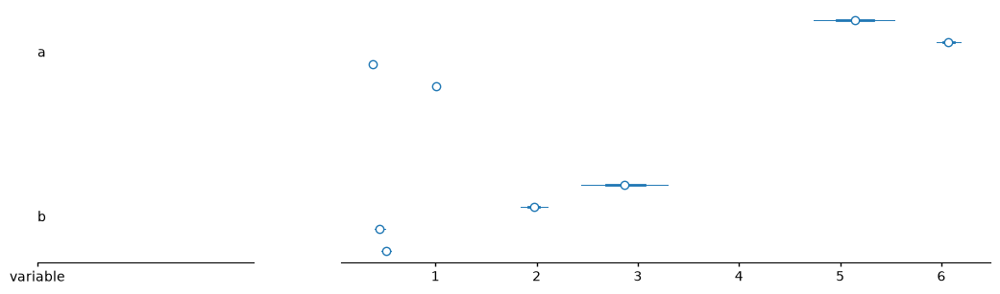
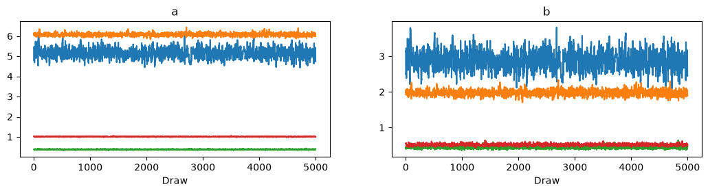
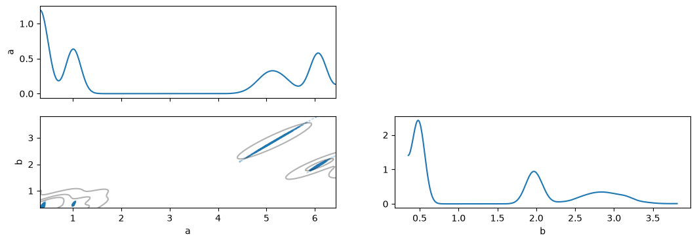
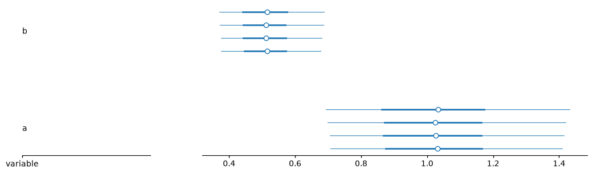
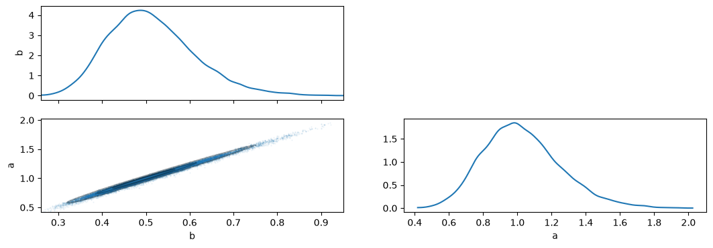

# Using forcing functions in ordinary differential equations (ODEs) in Stan

## Overview

Ordinary differential equations (ODEs)
are widely used for mathematical modeling
of natural systems.
A less common
but critical
ODE solver input
is the incorporation of fixed temporal data
representing a process whose underlying equation is unknown,
called a forcing function.
Forcing functions are more readily supported
in lower-level programming languages
than in higher-level, domain-specific programming languages (DSLs)
like Stan
that allow fewer mathematical primitives
and are more complex to extend.
The sections below
explain
how to use a forcing function
with the widely used 2-equation predator–prey ODEs example,
also called Lotka–Volterra.

## Preamble

First, load the modules we will need for the entire exercise.


```python
# Python builtin modules.
from argparse import Namespace
from collections import OrderedDict
import re

# 3rd party modules.
import arviz as az
import arviz_plots as azp
import cmdstanpy
from lets_plot import (
    LetsPlot, aes, as_discrete, facet_wrap, ggplot, geom_line, geom_point,
    geom_vline, labs, scale_y_log10,
)
import numpy as np
import pandas as pd
from patsy import dmatrices
from scipy.integrate import solve_ivp
import scipy.stats
import statsmodels.formula.api as smf

# Configuration.
az.rcParams["plot.backend"] = "matplotlib"
LetsPlot.setup_html()
```

    /__w/stan-ode-forcing-function/stan-ode-forcing-function/stanodeffpy/.venv/lib/python3.14/site-packages/tqdm/auto.py:21: TqdmWarning: IProgress not found. Please update jupyter and ipywidgets. See https://ipywidgets.readthedocs.io/en/stable/user_install.html
      from .autonotebook import tqdm as notebook_tqdm
    /__w/stan-ode-forcing-function/stan-ode-forcing-function/stanodeffpy/.venv/lib/python3.14/site-packages/lets_plot/plot/annotation.py:592: SyntaxWarning: "\(" is an invalid escape sequence. Such sequences will not work in the future. Did you mean "\\("? A raw string is also an option.
      .line(r'\(R\^2=\)@..r2..')\\
    /__w/stan-ode-forcing-function/stan-ode-forcing-function/stanodeffpy/.venv/lib/python3.14/site-packages/lets_plot/plot/annotation.py:644: SyntaxWarning: "\(" is an invalid escape sequence. Such sequences will not work in the future. Did you mean "\\("? A raw string is also an option.
      .line(r'\(R\^2=\)@..r2..')\\


<div id="z6hSWp"></div>
<script type="text/javascript" data-lets-plot-script="library">
    if(!window.letsPlotCallQueue) {
        window.letsPlotCallQueue = [];
    };
    window.letsPlotCall = function(f) {
        window.letsPlotCallQueue.push(f);
    };
    (function() {
        var script = document.createElement("script");
        script.type = "text/javascript";
        script.src = "https://cdn.jsdelivr.net/gh/JetBrains/lets-plot@v4.11.0/js-package/distr/lets-plot.min.js";
        script.onload = function() {
            window.letsPlotCall = function(f) {f();};
            window.letsPlotCallQueue.forEach(function(f) {f();});
            window.letsPlotCallQueue = [];

        };
        script.onerror = function(event) {
            window.letsPlotCall = function(f) {};    // noop
            window.letsPlotCallQueue = [];
            var div = document.createElement("div");
            div.style.color = 'darkred';
            div.textContent = 'Error loading Lets-Plot JS';
            document.getElementById("z6hSWp").appendChild(div);
        };
        var e = document.getElementById("z6hSWp");
        e.appendChild(script);
    })()
</script>


```python
%load_ext cmdstanjupyter
```


```python
# One time Stan setup.
assert cmdstanpy.install_cmdstan()
```

    CmdStan install directory: /github/home/.cmdstan


    Installing CmdStan version: 2.40.0
    Downloading CmdStan version 2.40.0
    Failed to download CmdStan version 2.40.0 from github.com
    <urlopen error [SSL: CERTIFICATE_VERIFY_FAILED] certificate verify failed: self-signed certificate (_ssl.c:1082)>
    retry (1/5)


    Download successful, file: /tmp/tmpvi9t9n5f
    Extracting distribution


    Unpacked download as cmdstan-2.40.0
    Building version cmdstan-2.40.0, may take several minutes, depending on your system.


    Installed cmdstan-2.40.0
    Test model compilation


The data science library `pandas`
requires little introduction for many Python users.

> **Note:**
> Those less familiar
> can learn about them
> from the freely available Carpentries lesson
> *Programming with Python*
> (<https://swcarpentry.github.io/python-novice-inflammation/>)
> and, for a more depth, the excellent freely available book
> *Python for Data Analysis*
> (<https://wesmckinney.com/book/>).

> **Note:**
> The grammar of graphics implemented by `lets_plot`
> is probably more well known among R users,
> so users coming from matplotlib, seaborn, etc.
> may benefit from the freely available book *Python for Data Science*
> that provides a nice overview of the lets-plot Python library
> (<https://aeturrell.github.io/python4DS/data-visualise.html>).

While we our primarily goal is to use `stan` to solve the ODEs,
we use `scipy.integrate.solve_ivp` to generate the *ground truth* data;
ground truth data here refers to
generating observations with known *true* parameters
so that we can assess how well
the fitted parameters
compare with the true parameters.

> **Note:**
> It is also possible to use Stan (`stan`) itself
> to generate the ground truth data,
> as described in the
> Stan User's Guide >
> Example Models >
> Ordinary Differential Equations >
> Measurement error models.
> But for simplicity,
> we use Python's popular `solve_ivp` function
> (that replaces the deprecated `odeint` function)
> to use familiar Python code where possible.

A well written Stan model
should be relatively insensitive to initial conditions.
The example below,
demostrates a case of undesirable sensitivity to initial conditions.
***FIXME:*** The `posterior` package
simplifies inspecting the data wrangling work
to visualize the ODE parameters accepted by Stan
for each chain to troubleshoot disagreement among chains.

## Typical ODEs without a forcing function

### Equations in Python

$$
\begin{aligned}
\frac{dx}{dt} &= \phantom{-} \alpha x - \beta x y \\
\frac{dy}{dt} &= - \gamma y + \delta x y \\
\end{aligned}
$$
where,

State variables:
$$
\begin{aligned}
x &: \text{Population of prey} \\
y &: \text{Population of predators} \\
\end{aligned}
$$
Parameters:
$$
\begin{aligned}
\alpha &: \text{Growth rate of prey} \\
\beta &: \text{Death rate of prey due to predators} \\
\gamma &: \text{Death rate of predators} \\
\delta &: \text{Growth rate of predators due to prey}
\end{aligned}
$$

To code these equations in Python,
we need to wrap them in a function
with specific function arguments
common to many ODE solvers,
namely,
the time vector,
the list of state variables,
and then the list of parameters.
Therefore,
the input to `solve_ivp()` from the `scipy` package
is written as:


```python
true_y0 = OrderedDict((
    ("x", 10,),
    ("y", 5,),
))
true_params = OrderedDict((
    ("a", 1.0,),
    ("b", 0.5,),
    ("g", 1.5,),
    ("d", 0.7,),
))


def lv(t, y_, p=true_params):
    """Right-hand side of the Lotka–Volterra ODEs.

    Parameters
    ----------
    t : float
        Single timepoint at which to solve the system of equations.
    y_ : array_like
        State variables at the timepoint `t`.
    p : dict of float, optional
        Model parameters.

    """
    # Unpack y into convenience variances that must match the return value of
    # this function.
    x, y = y_

    # Decode the initial parameters and initial state variable values.
    p = Namespace(**p)

    # Encode the equation terms.
    prey_growth = p.a * x
    prey_death = p.b * x * y
    predator_growth = p.d * x * y
    predator_death = p.g * y

    # Return the equation RHS.
    dx_dt = prey_growth - prey_death
    dy_dt = predator_growth - predator_death
    return (dx_dt, dy_dt,)
```

The parameters are stored in an `OrderedDict` object
to improve legibility
by matching the equation order of parameters.
The `Namespace` unpacks the parameters
more conveniently with dot notation (`p.alpha`)
instead of dictionary square brackets (`p["alpha"]`).
However,
in production code,
some of these niceties may need to be omitted,
especially if they significantly effect the ODE solver speed
as benchmarked by Jupyter's `%timeit`, etc.

### Generate noisy input data with known ODE parameters

A common statistical practice
is to generate data with known parameters
so that we can test
how well a method or model
is able to recover the parameters used to generate the data.
Therefore,
we next simulate ODE data
using known parameters
`a`, `b`, `g`, and `d`
(i.e. $\alpha$, $\beta$, $\gamma$, and $\delta$).
Additionally,
we need to assume a known initial condition
$x_0$ and $y_0$
stored in `true_y0`.
Lastly,
to make the parameter fitting
more challenging and realistic to real-world observations,
we add simulated noise.


```python
# Solve the ODEs, then add noise to each variable using the Normal
# distribution.
times = np.linspace(0, 15, 31)
pristine = solve_ivp(fun=lv,
                     t_span=[np.min(times), np.max(times)],
                     y0=list(true_y0.values()),
                     t_eval=times)
# Check there was no solver error.
assert pristine.success
# Add noise to the pristine ODE solution.
noisy = pristine.y.copy()
prng = np.random.Generator(np.random.MT19937(seed=123))
noisy += prng.normal(size=noisy.shape, scale=0.5)
noisy[noisy < 0] = 0
```

Using `solve_ivp()` above only solves the system of equations
at the timepoints specified by `times`.
The simulated "pristine" and "noisy" data points are shown below,
although from here on we will only use the noisy simulated data.


```python
def ode_to_df(arr, time=pristine.t[:, np.newaxis]):
    return pd.DataFrame(np.concat([time, arr.T], axis=1),
                        columns=["time"] + list(true_y0.keys())[:arr.shape[0]])


data = (
    (
        pd.concat([ode_to_df(pristine.y), ode_to_df(noisy)],
                  keys=["pristine", "noisy"])
        .reset_index(level=0, names=["type"])
    )
        .reset_index(drop=True)
).reset_index(names="i")
data.groupby("type").head()
```


<div>
<style scoped>
    .dataframe tbody tr th:only-of-type {
        vertical-align: middle;
    }

    .dataframe tbody tr th {
        vertical-align: top;
    }

    .dataframe thead th {
        text-align: right;
    }
</style>
<table border="1" class="dataframe">
  <thead>
    <tr style="text-align: right;">
      <th></th>
      <th>i</th>
      <th>type</th>
      <th>time</th>
      <th>x</th>
      <th>y</th>
    </tr>
  </thead>
  <tbody>
    <tr>
      <th>0</th>
      <td>0</td>
      <td>pristine</td>
      <td>0.0</td>
      <td>10.000000</td>
      <td>5.000000</td>
    </tr>
    <tr>
      <th>1</th>
      <td>1</td>
      <td>pristine</td>
      <td>0.5</td>
      <td>1.062272</td>
      <td>12.656768</td>
    </tr>
    <tr>
      <th>2</th>
      <td>2</td>
      <td>pristine</td>
      <td>1.0</td>
      <td>0.152750</td>
      <td>6.922895</td>
    </tr>
    <tr>
      <th>3</th>
      <td>3</td>
      <td>pristine</td>
      <td>1.5</td>
      <td>0.073187</td>
      <td>3.386414</td>
    </tr>
    <tr>
      <th>4</th>
      <td>4</td>
      <td>pristine</td>
      <td>2.0</td>
      <td>0.066596</td>
      <td>1.637037</td>
    </tr>
    <tr>
      <th>31</th>
      <td>31</td>
      <td>noisy</td>
      <td>0.0</td>
      <td>9.929955</td>
      <td>5.418843</td>
    </tr>
    <tr>
      <th>32</th>
      <td>32</td>
      <td>noisy</td>
      <td>0.5</td>
      <td>1.051534</td>
      <td>11.932301</td>
    </tr>
    <tr>
      <th>33</th>
      <td>33</td>
      <td>noisy</td>
      <td>1.0</td>
      <td>1.008484</td>
      <td>7.074044</td>
    </tr>
    <tr>
      <th>34</th>
      <td>34</td>
      <td>noisy</td>
      <td>1.5</td>
      <td>0.000000</td>
      <td>3.488742</td>
    </tr>
    <tr>
      <th>35</th>
      <td>35</td>
      <td>noisy</td>
      <td>2.0</td>
      <td>0.785979</td>
      <td>1.449207</td>
    </tr>
  </tbody>
</table>
</div>


```python
data = pd.melt(data, id_vars=["i", "type", "time"])
data
```


<div>
<style scoped>
    .dataframe tbody tr th:only-of-type {
        vertical-align: middle;
    }

    .dataframe tbody tr th {
        vertical-align: top;
    }

    .dataframe thead th {
        text-align: right;
    }
</style>
<table border="1" class="dataframe">
  <thead>
    <tr style="text-align: right;">
      <th></th>
      <th>i</th>
      <th>type</th>
      <th>time</th>
      <th>variable</th>
      <th>value</th>
    </tr>
  </thead>
  <tbody>
    <tr>
      <th>0</th>
      <td>0</td>
      <td>pristine</td>
      <td>0.0</td>
      <td>x</td>
      <td>10.000000</td>
    </tr>
    <tr>
      <th>1</th>
      <td>1</td>
      <td>pristine</td>
      <td>0.5</td>
      <td>x</td>
      <td>1.062272</td>
    </tr>
    <tr>
      <th>2</th>
      <td>2</td>
      <td>pristine</td>
      <td>1.0</td>
      <td>x</td>
      <td>0.152750</td>
    </tr>
    <tr>
      <th>3</th>
      <td>3</td>
      <td>pristine</td>
      <td>1.5</td>
      <td>x</td>
      <td>0.073187</td>
    </tr>
    <tr>
      <th>4</th>
      <td>4</td>
      <td>pristine</td>
      <td>2.0</td>
      <td>x</td>
      <td>0.066596</td>
    </tr>
    <tr>
      <th>...</th>
      <td>...</td>
      <td>...</td>
      <td>...</td>
      <td>...</td>
      <td>...</td>
    </tr>
    <tr>
      <th>119</th>
      <td>57</td>
      <td>noisy</td>
      <td>13.0</td>
      <td>y</td>
      <td>0.000000</td>
    </tr>
    <tr>
      <th>120</th>
      <td>58</td>
      <td>noisy</td>
      <td>13.5</td>
      <td>y</td>
      <td>0.052869</td>
    </tr>
    <tr>
      <th>121</th>
      <td>59</td>
      <td>noisy</td>
      <td>14.0</td>
      <td>y</td>
      <td>0.000000</td>
    </tr>
    <tr>
      <th>122</th>
      <td>60</td>
      <td>noisy</td>
      <td>14.5</td>
      <td>y</td>
      <td>0.171035</td>
    </tr>
    <tr>
      <th>123</th>
      <td>61</td>
      <td>noisy</td>
      <td>15.0</td>
      <td>y</td>
      <td>0.000000</td>
    </tr>
  </tbody>
</table>
<p>124 rows × 5 columns</p>
</div>


```python
(
    ggplot(data,
           aes("time", "value", color="variable")) +
    facet_wrap("type", ncol=1) +
    geom_line() +
    geom_point()
)
```


   <div id="wip0wI" ></div>
   <script type="text/javascript" data-lets-plot-script="plot">

   (function() {
   // ----------

   const forceImmediateRender = false;
   const responsive = false;

   let sizing = {
       width_mode: "MIN",
       height_mode: "SCALED",
       width: null, 
       height: null 
   };

   const preferredWidth = document.body.dataset.letsPlotPreferredWidth;
   if (preferredWidth !== undefined) {
       sizing = {
           width_mode: 'FIXED',
           height_mode: 'SCALED',
           width: parseFloat(preferredWidth)
       };
   }

   const containerDiv = document.getElementById("wip0wI");
   let fig = null;

   function renderPlot() {
       if (fig === null) {
           const plotSpec = {
"data":{
"type":["pristine","pristine","pristine","pristine","pristine","pristine","pristine","pristine","pristine","pristine","pristine","pristine","pristine","pristine","pristine","pristine","pristine","pristine","pristine","pristine","pristine","pristine","pristine","pristine","pristine","pristine","pristine","pristine","pristine","pristine","pristine","noisy","noisy","noisy","noisy","noisy","noisy","noisy","noisy","noisy","noisy","noisy","noisy","noisy","noisy","noisy","noisy","noisy","noisy","noisy","noisy","noisy","noisy","noisy","noisy","noisy","noisy","noisy","noisy","noisy","noisy","noisy","pristine","pristine","pristine","pristine","pristine","pristine","pristine","pristine","pristine","pristine","pristine","pristine","pristine","pristine","pristine","pristine","pristine","pristine","pristine","pristine","pristine","pristine","pristine","pristine","pristine","pristine","pristine","pristine","pristine","pristine","pristine","noisy","noisy","noisy","noisy","noisy","noisy","noisy","noisy","noisy","noisy","noisy","noisy","noisy","noisy","noisy","noisy","noisy","noisy","noisy","noisy","noisy","noisy","noisy","noisy","noisy","noisy","noisy","noisy","noisy","noisy","noisy"],
"time":[0.0,0.5,1.0,1.5,2.0,2.5,3.0,3.5,4.0,4.5,5.0,5.5,6.0,6.5,7.0,7.5,8.0,8.5,9.0,9.5,10.0,10.5,11.0,11.5,12.0,12.5,13.0,13.5,14.0,14.5,15.0,0.0,0.5,1.0,1.5,2.0,2.5,3.0,3.5,4.0,4.5,5.0,5.5,6.0,6.5,7.0,7.5,8.0,8.5,9.0,9.5,10.0,10.5,11.0,11.5,12.0,12.5,13.0,13.5,14.0,14.5,15.0,0.0,0.5,1.0,1.5,2.0,2.5,3.0,3.5,4.0,4.5,5.0,5.5,6.0,6.5,7.0,7.5,8.0,8.5,9.0,9.5,10.0,10.5,11.0,11.5,12.0,12.5,13.0,13.5,14.0,14.5,15.0,0.0,0.5,1.0,1.5,2.0,2.5,3.0,3.5,4.0,4.5,5.0,5.5,6.0,6.5,7.0,7.5,8.0,8.5,9.0,9.5,10.0,10.5,11.0,11.5,12.0,12.5,13.0,13.5,14.0,14.5,15.0],
"variable":["x","x","x","x","x","x","x","x","x","x","x","x","x","x","x","x","x","x","x","x","x","x","x","x","x","x","x","x","x","x","x","x","x","x","x","x","x","x","x","x","x","x","x","x","x","x","x","x","x","x","x","x","x","x","x","x","x","x","x","x","x","x","y","y","y","y","y","y","y","y","y","y","y","y","y","y","y","y","y","y","y","y","y","y","y","y","y","y","y","y","y","y","y","y","y","y","y","y","y","y","y","y","y","y","y","y","y","y","y","y","y","y","y","y","y","y","y","y","y","y","y","y","y","y"],
"value":[10.0,1.0622723188530023,0.15275019188933253,0.07318667976265594,0.0665957444137835,0.0823650371668693,0.11795088381861413,0.1813855776127305,0.28873523561021275,0.4674038130527197,0.762788404885772,1.249667307244287,2.0508984315487706,3.365965267229477,5.509207013317602,8.838760093319026,10.300559263421087,1.2140678424925677,0.1631975477799305,0.07505301913180527,0.06652606431493815,0.08131447830453122,0.11589517690167497,0.17782627928633912,0.2827625573888041,0.4574609536376476,0.7463787345066296,1.2226861590024303,2.0063222934773792,3.293089710901368,5.391077997582392,9.929955333523235,1.0515335449056684,1.008484198160158,0.0,0.7859785922099007,0.08608450696780118,0.02769787942268151,0.591495971128573,0.0,0.4363316427566679,1.1555634797047403,1.1423462017902417,2.5561717960513946,3.8442349983394166,5.274275956019107,9.118554837628617,10.419387430477963,0.9201042340721909,0.0,0.9243589069456701,0.3345261432837321,0.6026622572596754,1.2734108200119771,0.4376489583544544,0.11300762438542522,0.788217772333473,0.7890291465053387,2.0406972119403823,1.4757622483978499,3.151655006332778,5.390956576317447,5.0,12.656767946954078,6.922895376153344,3.386413910561821,1.637036738928471,0.7933152306157253,0.3881012647036803,0.19314451089253665,0.09888914971785989,0.05320143115179533,0.031063991258592067,0.02074068487210627,0.017318638927854756,0.020648778108971616,0.04467999491270336,0.2510017286713543,4.38248403759332,12.843524112537413,7.147021487797619,3.5021519983444986,1.694104282786499,0.8207753512718806,0.4010962936935878,0.1993332851245299,0.10200774741022585,0.054734165580354155,0.03179038063252368,0.021076808711023434,0.017319812674152706,0.02039784197732503,0.04265184401706032,5.418843413100238,11.93230058574139,7.074044426315896,3.488741553647496,1.4492074172534772,0.8134425013489694,0.6780968033901965,0.15050658915512452,0.3954350037080901,0.6198401503998885,0.0,0.0,0.0,0.5311699570208915,0.1081744774078066,8.611913181995057E-4,5.236115430096396,12.194687320797637,7.534027506202047,3.2889774754439784,2.8759589326019093,0.9008505228403939,0.0,0.1378958820689049,0.1927112349992826,0.0,0.0,0.05286879466484849,0.0,0.17103469040612806,0.0]
},
"mapping":{
"x":"time",
"y":"value",
"color":"variable"
},
"data_meta":{
"series_annotations":[{
"type":"int",
"column":"i"
},{
"type":"str",
"column":"type"
},{
"type":"float",
"column":"time"
},{
"type":"str",
"column":"variable"
},{
"type":"float",
"column":"value"
}]
},
"facet":{
"name":"wrap",
"facets":"type",
"ncol":1.0,
"order":1.0,
"dir":"h"
},
"kind":"plot",
"scales":[],
"layers":[{
"geom":"line",
"mapping":{
},
"data_meta":{
},
"data":{
}
},{
"geom":"point",
"mapping":{
},
"data_meta":{
},
"data":{
}
}],
"metainfo_list":[],
"spec_id":"1"
};
           window.letsPlotCall(function() { fig = LetsPlot.buildPlotFromProcessedSpecs(plotSpec, containerDiv, sizing); });
       } else {
           fig.updateView({});
       }
   }

   const renderImmediately = 
       forceImmediateRender || (
           sizing.width_mode === 'FIXED' && 
           (sizing.height_mode === 'FIXED' || sizing.height_mode === 'SCALED')
       );

   if (renderImmediately) {
       renderPlot();
   }

   if (!renderImmediately || responsive) {
       // Set up observer for initial sizing or continuous monitoring
       var observer = new ResizeObserver(function(entries) {
           for (let entry of entries) {
               if (entry.contentBoxSize && 
                   entry.contentBoxSize[0].inlineSize > 0) {
                   if (!responsive && observer) {
                       observer.disconnect();
                       observer = null;
                   }
                   renderPlot();
                   if (!responsive) {
                       break;
                   }
               }
           }
       });

       observer.observe(containerDiv);
   }

   // ----------
   })();

   </script>


### Fit the ODE parameters using the equivalent Stan model

The model we are going to fit
is saved in a separate `lv.stan` file
that looks like this:


```python
%stanf lv.stan model_lv
```

    INFO:cmdstanjupyter:Creating CmdStanPy model & assigning it to variable "model_lv"


    20:50:15 - cmdstanpy - INFO - compiling stan file /__w/stan-ode-forcing-function/stan-ode-forcing-function/stanodeffpy/lv.stan to exe file /__w/stan-ode-forcing-function/stan-ode-forcing-function/stanodeffpy/lv


    20:50:24 - cmdstanpy - INFO - compiled model executable: /__w/stan-ode-forcing-function/stan-ode-forcing-function/stanodeffpy/lv


    INFO:cmdstanjupyter:StanModel now available as variable "model_lv"!
     Compilation took 8 seconds.


<style>pre { line-height: 125%; }
td.linenos .normal { color: inherit; background-color: transparent; padding-left: 5px; padding-right: 5px; }
span.linenos { color: inherit; background-color: transparent; padding-left: 5px; padding-right: 5px; }
td.linenos .special { color: #000000; background-color: #ffffc0; padding-left: 5px; padding-right: 5px; }
span.linenos.special { color: #000000; background-color: #ffffc0; padding-left: 5px; padding-right: 5px; }
.output_html .hll { background-color: #ffffcc }
.output_html { background: #f8f8f8; }
.output_html .c { color: #3D7B7B; font-style: italic } /* Comment */
.output_html .err { border: 1px solid #F00 } /* Error */
.output_html .k { color: #008000; font-weight: bold } /* Keyword */
.output_html .o { color: #666 } /* Operator */
.output_html .ch { color: #3D7B7B; font-style: italic } /* Comment.Hashbang */
.output_html .cm { color: #3D7B7B; font-style: italic } /* Comment.Multiline */
.output_html .cp { color: #9C6500 } /* Comment.Preproc */
.output_html .cpf { color: #3D7B7B; font-style: italic } /* Comment.PreprocFile */
.output_html .c1 { color: #3D7B7B; font-style: italic } /* Comment.Single */
.output_html .cs { color: #3D7B7B; font-style: italic } /* Comment.Special */
.output_html .gd { color: #A00000 } /* Generic.Deleted */
.output_html .ge { font-style: italic } /* Generic.Emph */
.output_html .ges { font-weight: bold; font-style: italic } /* Generic.EmphStrong */
.output_html .gr { color: #E40000 } /* Generic.Error */
.output_html .gh { color: #000080; font-weight: bold } /* Generic.Heading */
.output_html .gi { color: #008400 } /* Generic.Inserted */
.output_html .go { color: #717171 } /* Generic.Output */
.output_html .gp { color: #000080; font-weight: bold } /* Generic.Prompt */
.output_html .gs { font-weight: bold } /* Generic.Strong */
.output_html .gu { color: #800080; font-weight: bold } /* Generic.Subheading */
.output_html .gt { color: #04D } /* Generic.Traceback */
.output_html .kc { color: #008000; font-weight: bold } /* Keyword.Constant */
.output_html .kd { color: #008000; font-weight: bold } /* Keyword.Declaration */
.output_html .kn { color: #008000; font-weight: bold } /* Keyword.Namespace */
.output_html .kp { color: #008000 } /* Keyword.Pseudo */
.output_html .kr { color: #008000; font-weight: bold } /* Keyword.Reserved */
.output_html .kt { color: #B00040 } /* Keyword.Type */
.output_html .m { color: #666 } /* Literal.Number */
.output_html .s { color: #BA2121 } /* Literal.String */
.output_html .na { color: #687822 } /* Name.Attribute */
.output_html .nb { color: #008000 } /* Name.Builtin */
.output_html .nc { color: #00F; font-weight: bold } /* Name.Class */
.output_html .no { color: #800 } /* Name.Constant */
.output_html .nd { color: #A2F } /* Name.Decorator */
.output_html .ni { color: #717171; font-weight: bold } /* Name.Entity */
.output_html .ne { color: #CB3F38; font-weight: bold } /* Name.Exception */
.output_html .nf { color: #00F } /* Name.Function */
.output_html .nl { color: #767600 } /* Name.Label */
.output_html .nn { color: #00F; font-weight: bold } /* Name.Namespace */
.output_html .nt { color: #008000; font-weight: bold } /* Name.Tag */
.output_html .nv { color: #19177C } /* Name.Variable */
.output_html .ow { color: #A2F; font-weight: bold } /* Operator.Word */
.output_html .w { color: #BBB } /* Text.Whitespace */
.output_html .mb { color: #666 } /* Literal.Number.Bin */
.output_html .mf { color: #666 } /* Literal.Number.Float */
.output_html .mh { color: #666 } /* Literal.Number.Hex */
.output_html .mi { color: #666 } /* Literal.Number.Integer */
.output_html .mo { color: #666 } /* Literal.Number.Oct */
.output_html .sa { color: #BA2121 } /* Literal.String.Affix */
.output_html .sb { color: #BA2121 } /* Literal.String.Backtick */
.output_html .sc { color: #BA2121 } /* Literal.String.Char */
.output_html .dl { color: #BA2121 } /* Literal.String.Delimiter */
.output_html .sd { color: #BA2121; font-style: italic } /* Literal.String.Doc */
.output_html .s2 { color: #BA2121 } /* Literal.String.Double */
.output_html .se { color: #AA5D1F; font-weight: bold } /* Literal.String.Escape */
.output_html .sh { color: #BA2121 } /* Literal.String.Heredoc */
.output_html .si { color: #A45A77; font-weight: bold } /* Literal.String.Interpol */
.output_html .sx { color: #008000 } /* Literal.String.Other */
.output_html .sr { color: #A45A77 } /* Literal.String.Regex */
.output_html .s1 { color: #BA2121 } /* Literal.String.Single */
.output_html .ss { color: #19177C } /* Literal.String.Symbol */
.output_html .bp { color: #008000 } /* Name.Builtin.Pseudo */
.output_html .fm { color: #00F } /* Name.Function.Magic */
.output_html .vc { color: #19177C } /* Name.Variable.Class */
.output_html .vg { color: #19177C } /* Name.Variable.Global */
.output_html .vi { color: #19177C } /* Name.Variable.Instance */
.output_html .vm { color: #19177C } /* Name.Variable.Magic */
.output_html .il { color: #666 } /* Literal.Number.Integer.Long */
pre { line-height: 125%; }
td.linenos .normal { color: inherit; background-color: transparent; padding-left: 5px; padding-right: 5px; }
span.linenos { color: inherit; background-color: transparent; padding-left: 5px; padding-right: 5px; }
td.linenos .special { color: #000000; background-color: #ffffc0; padding-left: 5px; padding-right: 5px; }
span.linenos.special { color: #000000; background-color: #ffffc0; padding-left: 5px; padding-right: 5px; }
.jp-RenderedHTML .hll { background-color: #ffffcc }
.jp-RenderedHTML { background: #f8f8f8; }
.jp-RenderedHTML .c { color: #3D7B7B; font-style: italic } /* Comment */
.jp-RenderedHTML .err { border: 1px solid #F00 } /* Error */
.jp-RenderedHTML .k { color: #008000; font-weight: bold } /* Keyword */
.jp-RenderedHTML .o { color: #666 } /* Operator */
.jp-RenderedHTML .ch { color: #3D7B7B; font-style: italic } /* Comment.Hashbang */
.jp-RenderedHTML .cm { color: #3D7B7B; font-style: italic } /* Comment.Multiline */
.jp-RenderedHTML .cp { color: #9C6500 } /* Comment.Preproc */
.jp-RenderedHTML .cpf { color: #3D7B7B; font-style: italic } /* Comment.PreprocFile */
.jp-RenderedHTML .c1 { color: #3D7B7B; font-style: italic } /* Comment.Single */
.jp-RenderedHTML .cs { color: #3D7B7B; font-style: italic } /* Comment.Special */
.jp-RenderedHTML .gd { color: #A00000 } /* Generic.Deleted */
.jp-RenderedHTML .ge { font-style: italic } /* Generic.Emph */
.jp-RenderedHTML .ges { font-weight: bold; font-style: italic } /* Generic.EmphStrong */
.jp-RenderedHTML .gr { color: #E40000 } /* Generic.Error */
.jp-RenderedHTML .gh { color: #000080; font-weight: bold } /* Generic.Heading */
.jp-RenderedHTML .gi { color: #008400 } /* Generic.Inserted */
.jp-RenderedHTML .go { color: #717171 } /* Generic.Output */
.jp-RenderedHTML .gp { color: #000080; font-weight: bold } /* Generic.Prompt */
.jp-RenderedHTML .gs { font-weight: bold } /* Generic.Strong */
.jp-RenderedHTML .gu { color: #800080; font-weight: bold } /* Generic.Subheading */
.jp-RenderedHTML .gt { color: #04D } /* Generic.Traceback */
.jp-RenderedHTML .kc { color: #008000; font-weight: bold } /* Keyword.Constant */
.jp-RenderedHTML .kd { color: #008000; font-weight: bold } /* Keyword.Declaration */
.jp-RenderedHTML .kn { color: #008000; font-weight: bold } /* Keyword.Namespace */
.jp-RenderedHTML .kp { color: #008000 } /* Keyword.Pseudo */
.jp-RenderedHTML .kr { color: #008000; font-weight: bold } /* Keyword.Reserved */
.jp-RenderedHTML .kt { color: #B00040 } /* Keyword.Type */
.jp-RenderedHTML .m { color: #666 } /* Literal.Number */
.jp-RenderedHTML .s { color: #BA2121 } /* Literal.String */
.jp-RenderedHTML .na { color: #687822 } /* Name.Attribute */
.jp-RenderedHTML .nb { color: #008000 } /* Name.Builtin */
.jp-RenderedHTML .nc { color: #00F; font-weight: bold } /* Name.Class */
.jp-RenderedHTML .no { color: #800 } /* Name.Constant */
.jp-RenderedHTML .nd { color: #A2F } /* Name.Decorator */
.jp-RenderedHTML .ni { color: #717171; font-weight: bold } /* Name.Entity */
.jp-RenderedHTML .ne { color: #CB3F38; font-weight: bold } /* Name.Exception */
.jp-RenderedHTML .nf { color: #00F } /* Name.Function */
.jp-RenderedHTML .nl { color: #767600 } /* Name.Label */
.jp-RenderedHTML .nn { color: #00F; font-weight: bold } /* Name.Namespace */
.jp-RenderedHTML .nt { color: #008000; font-weight: bold } /* Name.Tag */
.jp-RenderedHTML .nv { color: #19177C } /* Name.Variable */
.jp-RenderedHTML .ow { color: #A2F; font-weight: bold } /* Operator.Word */
.jp-RenderedHTML .w { color: #BBB } /* Text.Whitespace */
.jp-RenderedHTML .mb { color: #666 } /* Literal.Number.Bin */
.jp-RenderedHTML .mf { color: #666 } /* Literal.Number.Float */
.jp-RenderedHTML .mh { color: #666 } /* Literal.Number.Hex */
.jp-RenderedHTML .mi { color: #666 } /* Literal.Number.Integer */
.jp-RenderedHTML .mo { color: #666 } /* Literal.Number.Oct */
.jp-RenderedHTML .sa { color: #BA2121 } /* Literal.String.Affix */
.jp-RenderedHTML .sb { color: #BA2121 } /* Literal.String.Backtick */
.jp-RenderedHTML .sc { color: #BA2121 } /* Literal.String.Char */
.jp-RenderedHTML .dl { color: #BA2121 } /* Literal.String.Delimiter */
.jp-RenderedHTML .sd { color: #BA2121; font-style: italic } /* Literal.String.Doc */
.jp-RenderedHTML .s2 { color: #BA2121 } /* Literal.String.Double */
.jp-RenderedHTML .se { color: #AA5D1F; font-weight: bold } /* Literal.String.Escape */
.jp-RenderedHTML .sh { color: #BA2121 } /* Literal.String.Heredoc */
.jp-RenderedHTML .si { color: #A45A77; font-weight: bold } /* Literal.String.Interpol */
.jp-RenderedHTML .sx { color: #008000 } /* Literal.String.Other */
.jp-RenderedHTML .sr { color: #A45A77 } /* Literal.String.Regex */
.jp-RenderedHTML .s1 { color: #BA2121 } /* Literal.String.Single */
.jp-RenderedHTML .ss { color: #19177C } /* Literal.String.Symbol */
.jp-RenderedHTML .bp { color: #008000 } /* Name.Builtin.Pseudo */
.jp-RenderedHTML .fm { color: #00F } /* Name.Function.Magic */
.jp-RenderedHTML .vc { color: #19177C } /* Name.Variable.Class */
.jp-RenderedHTML .vg { color: #19177C } /* Name.Variable.Global */
.jp-RenderedHTML .vi { color: #19177C } /* Name.Variable.Instance */
.jp-RenderedHTML .vm { color: #19177C } /* Name.Variable.Magic */
.jp-RenderedHTML .il { color: #666 } /* Literal.Number.Integer.Long */</style><div class="highlight"><pre><span></span><span class="kn">functions</span><span class="p">{</span>
  <span class="kt">vector</span> <span class="n">lv</span><span class="p">(</span><span class="kt">real</span> <span class="n">t</span><span class="p">,</span>
	    <span class="kt">vector</span> <span class="n">y</span><span class="p">,</span>
	    <span class="kt">real</span> <span class="n">a</span><span class="p">,</span> <span class="kt">real</span> <span class="n">b</span><span class="p">,</span> <span class="kt">real</span> <span class="n">g</span><span class="p">,</span> <span class="kt">real</span> <span class="n">d</span><span class="p">){</span>
    <span class="kt">vector</span><span class="p">[</span><span class="mf">2</span><span class="p">]</span> <span class="n">dydt</span><span class="p">;</span>
    <span class="c1">// y[1] and y[2] correspond to x and y respectively.</span>
    <span class="n">dydt</span><span class="p">[</span><span class="mf">1</span><span class="p">]</span> <span class="o">=</span>  <span class="n">a</span><span class="o">*</span><span class="n">y</span><span class="p">[</span><span class="mf">1</span><span class="p">]</span> <span class="o">-</span> <span class="n">b</span><span class="o">*</span><span class="n">y</span><span class="p">[</span><span class="mf">1</span><span class="p">]</span><span class="o">*</span><span class="n">y</span><span class="p">[</span><span class="mf">2</span><span class="p">];</span>
    <span class="n">dydt</span><span class="p">[</span><span class="mf">2</span><span class="p">]</span> <span class="o">=</span> <span class="o">-</span><span class="n">g</span><span class="o">*</span><span class="n">y</span><span class="p">[</span><span class="mf">2</span><span class="p">]</span> <span class="o">+</span> <span class="n">d</span><span class="o">*</span><span class="n">y</span><span class="p">[</span><span class="mf">1</span><span class="p">]</span><span class="o">*</span><span class="n">y</span><span class="p">[</span><span class="mf">2</span><span class="p">];</span>
    <span class="k">return</span> <span class="n">dydt</span><span class="p">;</span>
  <span class="p">}</span>
<span class="p">}</span>

<span class="kn">data</span> <span class="p">{</span>
  <span class="kt">int</span><span class="o">&lt;</span><span class="k">lower</span><span class="p">=</span><span class="mf">1</span><span class="o">&gt;</span> <span class="n">T</span><span class="p">;</span>
  <span class="kt">array</span><span class="p">[</span><span class="n">T</span><span class="p">]</span> <span class="kt">vector</span><span class="p">[</span><span class="mf">2</span><span class="p">]</span> <span class="n">y</span><span class="p">;</span>
  <span class="kt">vector</span><span class="o">&lt;</span><span class="k">lower</span><span class="p">=</span><span class="mf">0</span><span class="o">&gt;</span><span class="p">[</span><span class="mf">2</span><span class="p">]</span> <span class="n">y0</span><span class="p">;</span>
  <span class="kt">real</span><span class="o">&lt;</span><span class="k">lower</span><span class="p">=</span><span class="mf">0</span><span class="o">&gt;</span> <span class="n">t0</span><span class="p">;</span>
  <span class="kt">array</span><span class="p">[</span><span class="n">T</span><span class="p">]</span> <span class="kt">real</span> <span class="n">ts</span><span class="p">;</span>
  <span class="kt">real</span><span class="o">&lt;</span><span class="k">lower</span><span class="p">=</span><span class="mf">0</span><span class="o">&gt;</span> <span class="n">g</span><span class="p">;</span>
  <span class="kt">real</span><span class="o">&lt;</span><span class="k">lower</span><span class="p">=</span><span class="mf">0</span><span class="o">&gt;</span> <span class="n">d</span><span class="p">;</span>
<span class="p">}</span>

<span class="kn">parameters</span> <span class="p">{</span>
  <span class="c1">// y0 contains the initial values of x and y respectively.</span>
  <span class="kt">real</span><span class="o">&lt;</span><span class="k">lower</span><span class="p">=</span><span class="mf">0</span><span class="o">&gt;</span> <span class="n">a</span><span class="p">;</span>
  <span class="kt">real</span><span class="o">&lt;</span><span class="k">lower</span><span class="p">=</span><span class="mf">0</span><span class="o">&gt;</span> <span class="n">b</span><span class="p">;</span>
<span class="p">}</span>

<span class="kn">model</span> <span class="p">{</span>
  <span class="kt">array</span><span class="p">[</span><span class="n">T</span><span class="p">]</span> <span class="kt">vector</span><span class="p">[</span><span class="mf">2</span><span class="p">]</span> <span class="n">mu</span> <span class="o">=</span> <span class="nb">ode_rk45</span><span class="p">(</span><span class="n">lv</span><span class="p">,</span> <span class="n">y0</span><span class="p">,</span> <span class="n">t0</span><span class="p">,</span> <span class="n">ts</span><span class="p">,</span> <span class="n">a</span><span class="p">,</span> <span class="n">b</span><span class="p">,</span> <span class="n">g</span><span class="p">,</span> <span class="n">d</span><span class="p">);</span>
  <span class="c1">// Sample positive priors for all our ODE parameters.</span>
  <span class="n">a</span> <span class="o">~</span><span class="w"> </span><span class="nb">normal</span><span class="p">(</span><span class="mf">0.5</span><span class="p">,</span> <span class="mf">0.5</span><span class="p">);</span>
  <span class="n">b</span> <span class="o">~</span><span class="w"> </span><span class="nb">normal</span><span class="p">(</span><span class="mf">0.5</span><span class="p">,</span> <span class="mf">0.5</span><span class="p">);</span>
  <span class="c1">// The state variables computed by the ODE should be lognormally</span>
  <span class="c1">// distributed.</span>
  <span class="k">for</span> <span class="p">(</span><span class="n">t</span> <span class="k">in</span> <span class="mf">1</span><span class="o">:</span><span class="n">T</span><span class="p">)</span> <span class="p">{</span>
    <span class="n">y</span><span class="p">[</span><span class="n">t</span><span class="p">]</span> <span class="o">~</span><span class="w"> </span><span class="nb">normal</span><span class="p">(</span><span class="n">mu</span><span class="p">[</span><span class="n">t</span><span class="p">],</span> <span class="mf">1</span><span class="p">);</span>
  <span class="p">}</span>
<span class="p">}</span>
</pre></div>


```python
fit1 = model_lv.sample(chains=4,
                       parallel_chains=4,
                       threads_per_chain=1,
                       iter_warmup=1_000,
                       iter_sampling=5_000,
                       seed=123,
                       show_progress=False,
                       data={
    "T": noisy.T.shape[0] - 1,
    "y": noisy.T[1:,],
    "y0": list(true_y0.values()),
    "t0": 0,
    "ts": pristine.t[1:],
    "g": true_params["g"],
    "d": true_params["d"],
})
```

    20:50:24 - cmdstanpy - INFO - CmdStan start processing


    20:50:24 - cmdstanpy - INFO - Chain [1] start processing


    20:50:24 - cmdstanpy - INFO - Chain [2] start processing


    20:50:24 - cmdstanpy - INFO - Chain [3] start processing


    20:50:24 - cmdstanpy - INFO - Chain [4] start processing


    20:50:31 - cmdstanpy - INFO - Chain [3] done processing


    20:50:40 - cmdstanpy - INFO - Chain [4] done processing


    20:51:15 - cmdstanpy - INFO - Chain [2] done processing


    20:54:36 - cmdstanpy - INFO - Chain [1] done processing


    20:54:36 - cmdstanpy - WARNING - Non-fatal error during sampling:
    Exception: ode_rk45: ode parameters and data is inf, but must be finite! (in 'lv.stan', line 30, column 2 to column 63)
    	Exception: ode_rk45: ode parameters and data is inf, but must be finite! (in 'lv.stan', line 30, column 2 to column 63)
    	Exception: ode_rk45: ode parameters and data is inf, but must be finite! (in 'lv.stan', line 30, column 2 to column 63)
    	Exception: normal_lpdf: Location parameter[1] is -nan, but must be finite! (in 'lv.stan', line 37, column 4 to column 28)
    	Exception: normal_lpdf: Location parameter[1] is -nan, but must be finite! (in 'lv.stan', line 37, column 4 to column 28)
    	Exception: ode_rk45:  Failed to integrate to next output time (0.5) in less than max_num_steps steps (in 'lv.stan', line 30, column 2 to column 63)
    	Exception: ode_rk45: ode parameters and data is inf, but must be finite! (in 'lv.stan', line 30, column 2 to column 63)
    	Exception: normal_lpdf: Location parameter[1] is -nan, but must be finite! (in 'lv.stan', line 37, column 4 to column 28)
    Exception: ode_rk45: ode parameters and data is inf, but must be finite! (in 'lv.stan', line 30, column 2 to column 63)
    	Exception: ode_rk45: ode parameters and data is inf, but must be finite! (in 'lv.stan', line 30, column 2 to column 63)
    	Exception: normal_lpdf: Location parameter[1] is -nan, but must be finite! (in 'lv.stan', line 37, column 4 to column 28)
    	Exception: normal_lpdf: Location parameter[1] is -nan, but must be finite! (in 'lv.stan', line 37, column 4 to column 28)
    	Exception: normal_lpdf: Location parameter[1] is -nan, but must be finite! (in 'lv.stan', line 37, column 4 to column 28)
    	Exception: ode_rk45: ode parameters and data is inf, but must be finite! (in 'lv.stan', line 30, column 2 to column 63)
    	Exception: ode_rk45: ode parameters and data is inf, but must be finite! (in 'lv.stan', line 30, column 2 to column 63)
    	Exception: normal_lpdf: Location parameter[1] is -nan, but must be finite! (in 'lv.stan', line 37, column 4 to column 28)
    Exception: normal_lpdf: Location parameter[1] is -nan, but must be finite! (in 'lv.stan', line 37, column 4 to column 28)
    	Exception: normal_lpdf: Location parameter[1] is -nan, but must be finite! (in 'lv.stan', line 37, column 4 to column 28)
    	Exception: normal_lpdf: Location parameter[1] is -nan, but must be finite! (in 'lv.stan', line 37, column 4 to column 28)
    	Exception: ode_rk45:  Failed to integrate to next output time (0.5) in less than max_num_steps steps (in 'lv.stan', line 30, column 2 to column 63)
    	Exception: ode_rk45: ode parameters and data is inf, but must be finite! (in 'lv.stan', line 30, column 2 to column 63)
    	Exception: normal_lpdf: Location parameter[1] is -nan, but must be finite! (in 'lv.stan', line 37, column 4 to column 28)
    Exception: ode_rk45: ode parameters and data is inf, but must be finite! (in 'lv.stan', line 30, column 2 to column 63)
    	Exception: ode_rk45: ode parameters and data is inf, but must be finite! (in 'lv.stan', line 30, column 2 to column 63)
    	Exception: normal_lpdf: Location parameter[1] is -nan, but must be finite! (in 'lv.stan', line 37, column 4 to column 28)
    	Exception: normal_lpdf: Location parameter[1] is -nan, but must be finite! (in 'lv.stan', line 37, column 4 to column 28)
    	Exception: ode_rk45:  Failed to integrate to next output time (0.5) in less than max_num_steps steps (in 'lv.stan', line 30, column 2 to column 63)
    	Exception: ode_rk45: ode parameters and data is inf, but must be finite! (in 'lv.stan', line 30, column 2 to column 63)
    	Exception: ode_rk45: ode parameters and data is inf, but must be finite! (in 'lv.stan', line 30, column 2 to column 63)
    	Exception: normal_lpdf: Location parameter[1] is -nan, but must be finite! (in 'lv.stan', line 37, column 4 to column 28)
    Consider re-running with show_console=True if the above output is unclear!


```python
print(fit1.diagnose())
```

    Checking sampler transitions treedepth.
    Treedepth satisfactory for all transitions.
    
    Checking sampler transitions for divergences.
    No divergent transitions found.
    
    Checking E-BFMI - sampler transitions HMC potential energy.
    The E-BFMI, 0.00, is below the nominal threshold of 0.30 which suggests that HMC may have trouble exploring the target distribution.
    If possible, try to reparameterize the model.
    
    The following parameters had fewer than 0.001 effective draws per transition:
      a, b
    Such low values indicate that the effective sample size estimators may be biased high and actual performance may be substantially lower than quoted.
    
    The following parameters had rank-normalized split R-hat greater than 1.01:
      a, b
    Such high values indicate incomplete mixing and biased estimation.
    You should consider regularizing your model with additional prior information or a more effective parameterization.
    
    Processing complete.
    


We get warnings
about how our initial conditions
were not able to agree
and mix together
that we will explore in the next section.

### Inspect the Stan fit


```python
## Numerical summary of the fits.
fit1.summary()
```


<div>
<style scoped>
    .dataframe tbody tr th:only-of-type {
        vertical-align: middle;
    }

    .dataframe tbody tr th {
        vertical-align: top;
    }

    .dataframe thead th {
        text-align: right;
    }
</style>
<table border="1" class="dataframe">
  <thead>
    <tr style="text-align: right;">
      <th></th>
      <th>Mean</th>
      <th>MCSE</th>
      <th>StdDev</th>
      <th>MAD</th>
      <th>5%</th>
      <th>50%</th>
      <th>95%</th>
      <th>ESS_bulk</th>
      <th>ESS_tail</th>
      <th>ESS_bulk/s</th>
      <th>R_hat</th>
    </tr>
  </thead>
  <tbody>
    <tr>
      <th>lp__</th>
      <td>-302.29200</td>
      <td>137.620000</td>
      <td>194.68400</td>
      <td>186.48300</td>
      <td>-500.184000</td>
      <td>-354.34200</td>
      <td>-6.31331</td>
      <td>4.58882</td>
      <td>10000.0</td>
      <td>0.017558</td>
      <td>2.83913</td>
    </tr>
    <tr>
      <th>a</th>
      <td>3.14981</td>
      <td>1.759540</td>
      <td>2.49206</td>
      <td>3.50618</td>
      <td>0.367243</td>
      <td>2.74267</td>
      <td>6.13484</td>
      <td>4.59230</td>
      <td>10000.0</td>
      <td>0.017571</td>
      <td>2.83863</td>
    </tr>
    <tr>
      <th>b</th>
      <td>1.45180</td>
      <td>0.723586</td>
      <td>1.03195</td>
      <td>1.10875</td>
      <td>0.417843</td>
      <td>1.17091</td>
      <td>3.11131</td>
      <td>4.72122</td>
      <td>10000.0</td>
      <td>0.018065</td>
      <td>2.60661</td>
    </tr>
  </tbody>
</table>
</div>


```python
## Prepare data for plotting.
idata1 = az.from_cmdstanpy(fit1)
```


```python
## Parameter plot of the fits.
azp.plot_forest(idata1)
```


    <arviz_plots.plot_collection.PlotCollection at 0x7fe0305138c0>


    

    


```python
## Show all samples after warmup.
azp.plot_trace(idata1)
```


    <arviz_plots.plot_collection.PlotCollection at 0x7fe030641450>


    

    


```python
## Show the pairs plot.
## FIXME: Possible to include lp__?
azp.plot_pair(idata1,
              visuals={
                  "contour": {"color": "black", "alpha": 0.3},
                  "scatter": {"size": 2, "alpha": 0.1},
             })
```


    <arviz_plots.plot_matrix.PlotMatrix at 0x7fe0306e4d70>


    

    


```python
## Plot the ODEs using a sample of 100 parameters from each of the chains.
df_fit1 = fit1.draws_pd()
## Sample greater variation by only choosing one sample from each qcut.
qcut_20 = lambda x: pd.qcut(x, np.linspace(0, 1, 20), labels=False)
grouped = (
    df_fit1
    .filter(["chain__", "iter__", "a", "b"])
    .groupby("chain__")
)
n = 100
prng = np.random.Generator(np.random.MT19937(seed=123))
df_fit1_subset = (
    df_fit1.join(
        pd.DataFrame({
            "qa": grouped["a"].transform(qcut_20),
            "qb": grouped["b"].transform(qcut_20),
        })
    )
    .groupby(["chain__", "qa", "qb"])
    .sample(n=1, random_state=prng)
    ## Now sample the 100 parameters from each chain.
    .groupby("chain__")
    .sample(n=n, replace=True)
    .reset_index()
    .reset_index(names="sample")
)
n_ode = df_fit1_subset.shape[0]
arr = np.empty(np.array(pristine.y.T.shape) * np.array([n_ode, 1]),
               dtype=pristine.y.dtype)
for i in range(n_ode):
    ode = solve_ivp(fun=lv,
                    t_span=[np.min(times), np.max(times)],
                    y0=noisy.T[0, :],
                    t_eval=times,
                    args=[
        {
            "a": df_fit1_subset.loc[i, "a"],
            "b": df_fit1_subset.loc[i, "b"],
            "g": true_params["g"],
            "d": true_params["d"],
        }
    ])
    assert ode.success
    arr[(i * len(times)):((i + 1) * len(times)), ] = ode.y.T
data = (
    pd.concat(
        (
            pd.DataFrame(
                {
                    "sample": np.repeat(range(n_ode), len(times)),
                    "time": np.tile(times, n_ode),
                }
            ),
            pd.DataFrame(arr, columns=true_y0.keys())
        ),
        axis=1
    )
    .join(df_fit1_subset.filter(["sample", "chain__"]),
          on="sample",
          lsuffix="l",
          rsuffix="r")
)
data = pd.melt(data, id_vars=["sample", "time", "chain__", "samplel", "sampler"])
data
```


<div>
<style scoped>
    .dataframe tbody tr th:only-of-type {
        vertical-align: middle;
    }

    .dataframe tbody tr th {
        vertical-align: top;
    }

    .dataframe thead th {
        text-align: right;
    }
</style>
<table border="1" class="dataframe">
  <thead>
    <tr style="text-align: right;">
      <th></th>
      <th>sample</th>
      <th>time</th>
      <th>chain__</th>
      <th>samplel</th>
      <th>sampler</th>
      <th>variable</th>
      <th>value</th>
    </tr>
  </thead>
  <tbody>
    <tr>
      <th>0</th>
      <td>0</td>
      <td>0.0</td>
      <td>1.0</td>
      <td>0</td>
      <td>0</td>
      <td>x</td>
      <td>9.929955</td>
    </tr>
    <tr>
      <th>1</th>
      <td>0</td>
      <td>0.5</td>
      <td>1.0</td>
      <td>0</td>
      <td>0</td>
      <td>x</td>
      <td>0.027550</td>
    </tr>
    <tr>
      <th>2</th>
      <td>0</td>
      <td>1.0</td>
      <td>1.0</td>
      <td>0</td>
      <td>0</td>
      <td>x</td>
      <td>0.004469</td>
    </tr>
    <tr>
      <th>3</th>
      <td>0</td>
      <td>1.5</td>
      <td>1.0</td>
      <td>0</td>
      <td>0</td>
      <td>x</td>
      <td>0.007298</td>
    </tr>
    <tr>
      <th>4</th>
      <td>0</td>
      <td>2.0</td>
      <td>1.0</td>
      <td>0</td>
      <td>0</td>
      <td>x</td>
      <td>0.035336</td>
    </tr>
    <tr>
      <th>...</th>
      <td>...</td>
      <td>...</td>
      <td>...</td>
      <td>...</td>
      <td>...</td>
      <td>...</td>
      <td>...</td>
    </tr>
    <tr>
      <th>24795</th>
      <td>399</td>
      <td>13.0</td>
      <td>4.0</td>
      <td>399</td>
      <td>399</td>
      <td>y</td>
      <td>0.031325</td>
    </tr>
    <tr>
      <th>24796</th>
      <td>399</td>
      <td>13.5</td>
      <td>4.0</td>
      <td>399</td>
      <td>399</td>
      <td>y</td>
      <td>0.019757</td>
    </tr>
    <tr>
      <th>24797</th>
      <td>399</td>
      <td>14.0</td>
      <td>4.0</td>
      <td>399</td>
      <td>399</td>
      <td>y</td>
      <td>0.015050</td>
    </tr>
    <tr>
      <th>24798</th>
      <td>399</td>
      <td>14.5</td>
      <td>4.0</td>
      <td>399</td>
      <td>399</td>
      <td>y</td>
      <td>0.015646</td>
    </tr>
    <tr>
      <th>24799</th>
      <td>399</td>
      <td>15.0</td>
      <td>4.0</td>
      <td>399</td>
      <td>399</td>
      <td>y</td>
      <td>0.026691</td>
    </tr>
  </tbody>
</table>
<p>24800 rows × 7 columns</p>
</div>


```python
(
    ggplot(data, aes("time", "value", group=["sample", "variable"], color="variable")) +
    facet_wrap("chain__") +
    geom_line()
)
```


   <div id="4FdMBP" ></div>
   <script type="text/javascript" data-lets-plot-script="plot">

   (function() {
   // ----------

   const forceImmediateRender = false;
   const responsive = false;

   let sizing = {
       width_mode: "MIN",
       height_mode: "SCALED",
       width: null, 
       height: null 
   };

   const preferredWidth = document.body.dataset.letsPlotPreferredWidth;
   if (preferredWidth !== undefined) {
       sizing = {
           width_mode: 'FIXED',
           height_mode: 'SCALED',
           width: parseFloat(preferredWidth)
       };
   }

   const containerDiv = document.getElementById("4FdMBP");
   let fig = null;

   function renderPlot() {
       if (fig === null) {
           const plotSpec = {
"data":{
"sample":[0.0,0.0,0.0,0.0,0.0,0.0,0.0,0.0,0.0,0.0,0.0,0.0,0.0,0.0,0.0,0.0,0.0,0.0,0.0,0.0,0.0,0.0,0.0,0.0,0.0,0.0,0.0,0.0,0.0,0.0,0.0,1.0,1.0,1.0,1.0,1.0,1.0,1.0,1.0,1.0,1.0,1.0,1.0,1.0,1.0,1.0,1.0,1.0,1.0,1.0,1.0,1.0,1.0,1.0,1.0,1.0,1.0,1.0,1.0,1.0,1.0,1.0,2.0,2.0,2.0,2.0,2.0,2.0,2.0,2.0,2.0,2.0,2.0,2.0,2.0,2.0,2.0,2.0,2.0,2.0,2.0,2.0,2.0,2.0,2.0,2.0,2.0,2.0,2.0,2.0,2.0,2.0,2.0,3.0,3.0,3.0,3.0,3.0,3.0,3.0,3.0,3.0,3.0,3.0,3.0,3.0,3.0,3.0,3.0,3.0,3.0,3.0,3.0,3.0,3.0,3.0,3.0,3.0,3.0,3.0,3.0,3.0,3.0,3.0,4.0,4.0,4.0,4.0,4.0,4.0,4.0,4.0,4.0,4.0,4.0,4.0,4.0,4.0,4.0,4.0,4.0,4.0,4.0,4.0,4.0,4.0,4.0,4.0,4.0,4.0,4.0,4.0,4.0,4.0,4.0,5.0,5.0,5.0,5.0,5.0,5.0,5.0,5.0,5.0,5.0,5.0,5.0,5.0,5.0,5.0,5.0,5.0,5.0,5.0,5.0,5.0,5.0,5.0,5.0,5.0,5.0,5.0,5.0,5.0,5.0,5.0,6.0,6.0,6.0,6.0,6.0,6.0,6.0,6.0,6.0,6.0,6.0,6.0,6.0,6.0,6.0,6.0,6.0,6.0,6.0,6.0,6.0,6.0,6.0,6.0,6.0,6.0,6.0,6.0,6.0,6.0,6.0,7.0,7.0,7.0,7.0,7.0,7.0,7.0,7.0,7.0,7.0,7.0,7.0,7.0,7.0,7.0,7.0,7.0,7.0,7.0,7.0,7.0,7.0,7.0,7.0,7.0,7.0,7.0,7.0,7.0,7.0,7.0,8.0,8.0,8.0,8.0,8.0,8.0,8.0,8.0,8.0,8.0,8.0,8.0,8.0,8.0,8.0,8.0,8.0,8.0,8.0,8.0,8.0,8.0,8.0,8.0,8.0,8.0,8.0,8.0,8.0,8.0,8.0,9.0,9.0,9.0,9.0,9.0,9.0,9.0,9.0,9.0,9.0,9.0,9.0,9.0,9.0,9.0,9.0,9.0,9.0,9.0,9.0,9.0,9.0,9.0,9.0,9.0,9.0,9.0,9.0,9.0,9.0,9.0,10.0,10.0,10.0,10.0,10.0,10.0,10.0,10.0,10.0,10.0,10.0,10.0,10.0,10.0,10.0,10.0,10.0,10.0,10.0,10.0,10.0,10.0,10.0,10.0,10.0,10.0,10.0,10.0,10.0,10.0,10.0,11.0,11.0,11.0,11.0,11.0,11.0,11.0,11.0,11.0,11.0,11.0,11.0,11.0,11.0,11.0,11.0,11.0,11.0,11.0,11.0,11.0,11.0,11.0,11.0,11.0,11.0,11.0,11.0,11.0,11.0,11.0,12.0,12.0,12.0,12.0,12.0,12.0,12.0,12.0,12.0,12.0,12.0,12.0,12.0,12.0,12.0,12.0,12.0,12.0,12.0,12.0,12.0,12.0,12.0,12.0,12.0,12.0,12.0,12.0,12.0,12.0,12.0,13.0,13.0,13.0,13.0,13.0,13.0,13.0,13.0,13.0,13.0,13.0,13.0,13.0,13.0,13.0,13.0,13.0,13.0,13.0,13.0,13.0,13.0,13.0,13.0,13.0,13.0,13.0,13.0,13.0,13.0,13.0,14.0,14.0,14.0,14.0,14.0,14.0,14.0,14.0,14.0,14.0,14.0,14.0,14.0,14.0,14.0,14.0,14.0,14.0,14.0,14.0,14.0,14.0,14.0,14.0,14.0,14.0,14.0,14.0,14.0,14.0,14.0,15.0,15.0,15.0,15.0,15.0,15.0,15.0,15.0,15.0,15.0,15.0,15.0,15.0,15.0,15.0,15.0,15.0,15.0,15.0,15.0,15.0,15.0,15.0,15.0,15.0,15.0,15.0,15.0,15.0,15.0,15.0,16.0,16.0,16.0,16.0,16.0,16.0,16.0,16.0,16.0,16.0,16.0,16.0,16.0,16.0,16.0,16.0,16.0,16.0,16.0,16.0,16.0,16.0,16.0,16.0,16.0,16.0,16.0,16.0,16.0,16.0,16.0,17.0,17.0,17.0,17.0,17.0,17.0,17.0,17.0,17.0,17.0,17.0,17.0,17.0,17.0,17.0,17.0,17.0,17.0,17.0,17.0,17.0,17.0,17.0,17.0,17.0,17.0,17.0,17.0,17.0,17.0,17.0,18.0,18.0,18.0,18.0,18.0,18.0,18.0,18.0,18.0,18.0,18.0,18.0,18.0,18.0,18.0,18.0,18.0,18.0,18.0,18.0,18.0,18.0,18.0,18.0,18.0,18.0,18.0,18.0,18.0,18.0,18.0,19.0,19.0,19.0,19.0,19.0,19.0,19.0,19.0,19.0,19.0,19.0,19.0,19.0,19.0,19.0,19.0,19.0,19.0,19.0,19.0,19.0,19.0,19.0,19.0,19.0,19.0,19.0,19.0,19.0,19.0,19.0,20.0,20.0,20.0,20.0,20.0,20.0,20.0,20.0,20.0,20.0,20.0,20.0,20.0,20.0,20.0,20.0,20.0,20.0,20.0,20.0,20.0,20.0,20.0,20.0,20.0,20.0,20.0,20.0,20.0,20.0,20.0,21.0,21.0,21.0,21.0,21.0,21.0,21.0,21.0,21.0,21.0,21.0,21.0,21.0,21.0,21.0,21.0,21.0,21.0,21.0,21.0,21.0,21.0,21.0,21.0,21.0,21.0,21.0,21.0,21.0,21.0,21.0,22.0,22.0,22.0,22.0,22.0,22.0,22.0,22.0,22.0,22.0,22.0,22.0,22.0,22.0,22.0,22.0,22.0,22.0,22.0,22.0,22.0,22.0,22.0,22.0,22.0,22.0,22.0,22.0,22.0,22.0,22.0,23.0,23.0,23.0,23.0,23.0,23.0,23.0,23.0,23.0,23.0,23.0,23.0,23.0,23.0,23.0,23.0,23.0,23.0,23.0,23.0,23.0,23.0,23.0,23.0,23.0,23.0,23.0,23.0,23.0,23.0,23.0,24.0,24.0,24.0,24.0,24.0,24.0,24.0,24.0,24.0,24.0,24.0,24.0,24.0,24.0,24.0,24.0,24.0,24.0,24.0,24.0,24.0,24.0,24.0,24.0,24.0,24.0,24.0,24.0,24.0,24.0,24.0,25.0,25.0,25.0,25.0,25.0,25.0,25.0,25.0,25.0,25.0,25.0,25.0,25.0,25.0,25.0,25.0,25.0,25.0,25.0,25.0,25.0,25.0,25.0,25.0,25.0,25.0,25.0,25.0,25.0,25.0,25.0,26.0,26.0,26.0,26.0,26.0,26.0,26.0,26.0,26.0,26.0,26.0,26.0,26.0,26.0,26.0,26.0,26.0,26.0,26.0,26.0,26.0,26.0,26.0,26.0,26.0,26.0,26.0,26.0,26.0,26.0,26.0,27.0,27.0,27.0,27.0,27.0,27.0,27.0,27.0,27.0,27.0,27.0,27.0,27.0,27.0,27.0,27.0,27.0,27.0,27.0,27.0,27.0,27.0,27.0,27.0,27.0,27.0,27.0,27.0,27.0,27.0,27.0,28.0,28.0,28.0,28.0,28.0,28.0,28.0,28.0,28.0,28.0,28.0,28.0,28.0,28.0,28.0,28.0,28.0,28.0,28.0,28.0,28.0,28.0,28.0,28.0,28.0,28.0,28.0,28.0,28.0,28.0,28.0,29.0,29.0,29.0,29.0,29.0,29.0,29.0,29.0,29.0,29.0,29.0,29.0,29.0,29.0,29.0,29.0,29.0,29.0,29.0,29.0,29.0,29.0,29.0,29.0,29.0,29.0,29.0,29.0,29.0,29.0,29.0,30.0,30.0,30.0,30.0,30.0,30.0,30.0,30.0,30.0,30.0,30.0,30.0,30.0,30.0,30.0,30.0,30.0,30.0,30.0,30.0,30.0,30.0,30.0,30.0,30.0,30.0,30.0,30.0,30.0,30.0,30.0,31.0,31.0,31.0,31.0,31.0,31.0,31.0,31.0,31.0,31.0,31.0,31.0,31.0,31.0,31.0,31.0,31.0,31.0,31.0,31.0,31.0,31.0,31.0,31.0,31.0,31.0,31.0,31.0,31.0,31.0,31.0,32.0,32.0,32.0,32.0,32.0,32.0,32.0,32.0,32.0,32.0,32.0,32.0,32.0,32.0,32.0,32.0,32.0,32.0,32.0,32.0,32.0,32.0,32.0,32.0,32.0,32.0,32.0,32.0,32.0,32.0,32.0,33.0,33.0,33.0,33.0,33.0,33.0,33.0,33.0,33.0,33.0,33.0,33.0,33.0,33.0,33.0,33.0,33.0,33.0,33.0,33.0,33.0,33.0,33.0,33.0,33.0,33.0,33.0,33.0,33.0,33.0,33.0,34.0,34.0,34.0,34.0,34.0,34.0,34.0,34.0,34.0,34.0,34.0,34.0,34.0,34.0,34.0,34.0,34.0,34.0,34.0,34.0,34.0,34.0,34.0,34.0,34.0,34.0,34.0,34.0,34.0,34.0,34.0,35.0,35.0,35.0,35.0,35.0,35.0,35.0,35.0,35.0,35.0,35.0,35.0,35.0,35.0,35.0,35.0,35.0,35.0,35.0,35.0,35.0,35.0,35.0,35.0,35.0,35.0,35.0,35.0,35.0,35.0,35.0,36.0,36.0,36.0,36.0,36.0,36.0,36.0,36.0,36.0,36.0,36.0,36.0,36.0,36.0,36.0,36.0,36.0,36.0,36.0,36.0,36.0,36.0,36.0,36.0,36.0,36.0,36.0,36.0,36.0,36.0,36.0,37.0,37.0,37.0,37.0,37.0,37.0,37.0,37.0,37.0,37.0,37.0,37.0,37.0,37.0,37.0,37.0,37.0,37.0,37.0,37.0,37.0,37.0,37.0,37.0,37.0,37.0,37.0,37.0,37.0,37.0,37.0,38.0,38.0,38.0,38.0,38.0,38.0,38.0,38.0,38.0,38.0,38.0,38.0,38.0,38.0,38.0,38.0,38.0,38.0,38.0,38.0,38.0,38.0,38.0,38.0,38.0,38.0,38.0,38.0,38.0,38.0,38.0,39.0,39.0,39.0,39.0,39.0,39.0,39.0,39.0,39.0,39.0,39.0,39.0,39.0,39.0,39.0,39.0,39.0,39.0,39.0,39.0,39.0,39.0,39.0,39.0,39.0,39.0,39.0,39.0,39.0,39.0,39.0,40.0,40.0,40.0,40.0,40.0,40.0,40.0,40.0,40.0,40.0,40.0,40.0,40.0,40.0,40.0,40.0,40.0,40.0,40.0,40.0,40.0,40.0,40.0,40.0,40.0,40.0,40.0,40.0,40.0,40.0,40.0,41.0,41.0,41.0,41.0,41.0,41.0,41.0,41.0,41.0,41.0,41.0,41.0,41.0,41.0,41.0,41.0,41.0,41.0,41.0,41.0,41.0,41.0,41.0,41.0,41.0,41.0,41.0,41.0,41.0,41.0,41.0,42.0,42.0,42.0,42.0,42.0,42.0,42.0,42.0,42.0,42.0,42.0,42.0,42.0,42.0,42.0,42.0,42.0,42.0,42.0,42.0,42.0,42.0,42.0,42.0,42.0,42.0,42.0,42.0,42.0,42.0,42.0,43.0,43.0,43.0,43.0,43.0,43.0,43.0,43.0,43.0,43.0,43.0,43.0,43.0,43.0,43.0,43.0,43.0,43.0,43.0,43.0,43.0,43.0,43.0,43.0,43.0,43.0,43.0,43.0,43.0,43.0,43.0,44.0,44.0,44.0,44.0,44.0,44.0,44.0,44.0,44.0,44.0,44.0,44.0,44.0,44.0,44.0,44.0,44.0,44.0,44.0,44.0,44.0,44.0,44.0,44.0,44.0,44.0,44.0,44.0,44.0,44.0,44.0,45.0,45.0,45.0,45.0,45.0,45.0,45.0,45.0,45.0,45.0,45.0,45.0,45.0,45.0,45.0,45.0,45.0,45.0,45.0,45.0,45.0,45.0,45.0,45.0,45.0,45.0,45.0,45.0,45.0,45.0,45.0,46.0,46.0,46.0,46.0,46.0,46.0,46.0,46.0,46.0,46.0,46.0,46.0,46.0,46.0,46.0,46.0,46.0,46.0,46.0,46.0,46.0,46.0,46.0,46.0,46.0,46.0,46.0,46.0,46.0,46.0,46.0,47.0,47.0,47.0,47.0,47.0,47.0,47.0,47.0,47.0,47.0,47.0,47.0,47.0,47.0,47.0,47.0,47.0,47.0,47.0,47.0,47.0,47.0,47.0,47.0,47.0,47.0,47.0,47.0,47.0,47.0,47.0,48.0,48.0,48.0,48.0,48.0,48.0,48.0,48.0,48.0,48.0,48.0,48.0,48.0,48.0,48.0,48.0,48.0,48.0,48.0,48.0,48.0,48.0,48.0,48.0,48.0,48.0,48.0,48.0,48.0,48.0,48.0,49.0,49.0,49.0,49.0,49.0,49.0,49.0,49.0,49.0,49.0,49.0,49.0,49.0,49.0,49.0,49.0,49.0,49.0,49.0,49.0,49.0,49.0,49.0,49.0,49.0,49.0,49.0,49.0,49.0,49.0,49.0,50.0,50.0,50.0,50.0,50.0,50.0,50.0,50.0,50.0,50.0,50.0,50.0,50.0,50.0,50.0,50.0,50.0,50.0,50.0,50.0,50.0,50.0,50.0,50.0,50.0,50.0,50.0,50.0,50.0,50.0,50.0,51.0,51.0,51.0,51.0,51.0,51.0,51.0,51.0,51.0,51.0,51.0,51.0,51.0,51.0,51.0,51.0,51.0,51.0,51.0,51.0,51.0,51.0,51.0,51.0,51.0,51.0,51.0,51.0,51.0,51.0,51.0,52.0,52.0,52.0,52.0,52.0,52.0,52.0,52.0,52.0,52.0,52.0,52.0,52.0,52.0,52.0,52.0,52.0,52.0,52.0,52.0,52.0,52.0,52.0,52.0,52.0,52.0,52.0,52.0,52.0,52.0,52.0,53.0,53.0,53.0,53.0,53.0,53.0,53.0,53.0,53.0,53.0,53.0,53.0,53.0,53.0,53.0,53.0,53.0,53.0,53.0,53.0,53.0,53.0,53.0,53.0,53.0,53.0,53.0,53.0,53.0,53.0,53.0,54.0,54.0,54.0,54.0,54.0,54.0,54.0,54.0,54.0,54.0,54.0,54.0,54.0,54.0,54.0,54.0,54.0,54.0,54.0,54.0,54.0,54.0,54.0,54.0,54.0,54.0,54.0,54.0,54.0,54.0,54.0,55.0,55.0,55.0,55.0,55.0,55.0,55.0,55.0,55.0,55.0,55.0,55.0,55.0,55.0,55.0,55.0,55.0,55.0,55.0,55.0,55.0,55.0,55.0,55.0,55.0,55.0,55.0,55.0,55.0,55.0,55.0,56.0,56.0,56.0,56.0,56.0,56.0,56.0,56.0,56.0,56.0,56.0,56.0,56.0,56.0,56.0,56.0,56.0,56.0,56.0,56.0,56.0,56.0,56.0,56.0,56.0,56.0,56.0,56.0,56.0,56.0,56.0,57.0,57.0,57.0,57.0,57.0,57.0,57.0,57.0,57.0,57.0,57.0,57.0,57.0,57.0,57.0,57.0,57.0,57.0,57.0,57.0,57.0,57.0,57.0,57.0,57.0,57.0,57.0,57.0,57.0,57.0,57.0,58.0,58.0,58.0,58.0,58.0,58.0,58.0,58.0,58.0,58.0,58.0,58.0,58.0,58.0,58.0,58.0,58.0,58.0,58.0,58.0,58.0,58.0,58.0,58.0,58.0,58.0,58.0,58.0,58.0,58.0,58.0,59.0,59.0,59.0,59.0,59.0,59.0,59.0,59.0,59.0,59.0,59.0,59.0,59.0,59.0,59.0,59.0,59.0,59.0,59.0,59.0,59.0,59.0,59.0,59.0,59.0,59.0,59.0,59.0,59.0,59.0,59.0,60.0,60.0,60.0,60.0,60.0,60.0,60.0,60.0,60.0,60.0,60.0,60.0,60.0,60.0,60.0,60.0,60.0,60.0,60.0,60.0,60.0,60.0,60.0,60.0,60.0,60.0,60.0,60.0,60.0,60.0,60.0,61.0,61.0,61.0,61.0,61.0,61.0,61.0,61.0,61.0,61.0,61.0,61.0,61.0,61.0,61.0,61.0,61.0,61.0,61.0,61.0,61.0,61.0,61.0,61.0,61.0,61.0,61.0,61.0,61.0,61.0,61.0,62.0,62.0,62.0,62.0,62.0,62.0,62.0,62.0,62.0,62.0,62.0,62.0,62.0,62.0,62.0,62.0,62.0,62.0,62.0,62.0,62.0,62.0,62.0,62.0,62.0,62.0,62.0,62.0,62.0,62.0,62.0,63.0,63.0,63.0,63.0,63.0,63.0,63.0,63.0,63.0,63.0,63.0,63.0,63.0,63.0,63.0,63.0,63.0,63.0,63.0,63.0,63.0,63.0,63.0,63.0,63.0,63.0,63.0,63.0,63.0,63.0,63.0,64.0,64.0,64.0,64.0,64.0,64.0,64.0,64.0,64.0,64.0,64.0,64.0,64.0,64.0,64.0,64.0,64.0,64.0,64.0,64.0,64.0,64.0,64.0,64.0,64.0,64.0,64.0,64.0,64.0,64.0,64.0,65.0,65.0,65.0,65.0,65.0,65.0,65.0,65.0,65.0,65.0,65.0,65.0,65.0,65.0,65.0,65.0,65.0,65.0,65.0,65.0,65.0,65.0,65.0,65.0,65.0,65.0,65.0,65.0,65.0,65.0,65.0,66.0,66.0,66.0,66.0,66.0,66.0,66.0,66.0,66.0,66.0,66.0,66.0,66.0,66.0,66.0,66.0,66.0,66.0,66.0,66.0,66.0,66.0,66.0,66.0,66.0,66.0,66.0,66.0,66.0,66.0,66.0,67.0,67.0,67.0,67.0,67.0,67.0,67.0,67.0,67.0,67.0,67.0,67.0,67.0,67.0,67.0,67.0,67.0,67.0,67.0,67.0,67.0,67.0,67.0,67.0,67.0,67.0,67.0,67.0,67.0,67.0,67.0,68.0,68.0,68.0,68.0,68.0,68.0,68.0,68.0,68.0,68.0,68.0,68.0,68.0,68.0,68.0,68.0,68.0,68.0,68.0,68.0,68.0,68.0,68.0,68.0,68.0,68.0,68.0,68.0,68.0,68.0,68.0,69.0,69.0,69.0,69.0,69.0,69.0,69.0,69.0,69.0,69.0,69.0,69.0,69.0,69.0,69.0,69.0,69.0,69.0,69.0,69.0,69.0,69.0,69.0,69.0,69.0,69.0,69.0,69.0,69.0,69.0,69.0,70.0,70.0,70.0,70.0,70.0,70.0,70.0,70.0,70.0,70.0,70.0,70.0,70.0,70.0,70.0,70.0,70.0,70.0,70.0,70.0,70.0,70.0,70.0,70.0,70.0,70.0,70.0,70.0,70.0,70.0,70.0,71.0,71.0,71.0,71.0,71.0,71.0,71.0,71.0,71.0,71.0,71.0,71.0,71.0,71.0,71.0,71.0,71.0,71.0,71.0,71.0,71.0,71.0,71.0,71.0,71.0,71.0,71.0,71.0,71.0,71.0,71.0,72.0,72.0,72.0,72.0,72.0,72.0,72.0,72.0,72.0,72.0,72.0,72.0,72.0,72.0,72.0,72.0,72.0,72.0,72.0,72.0,72.0,72.0,72.0,72.0,72.0,72.0,72.0,72.0,72.0,72.0,72.0,73.0,73.0,73.0,73.0,73.0,73.0,73.0,73.0,73.0,73.0,73.0,73.0,73.0,73.0,73.0,73.0,73.0,73.0,73.0,73.0,73.0,73.0,73.0,73.0,73.0,73.0,73.0,73.0,73.0,73.0,73.0,74.0,74.0,74.0,74.0,74.0,74.0,74.0,74.0,74.0,74.0,74.0,74.0,74.0,74.0,74.0,74.0,74.0,74.0,74.0,74.0,74.0,74.0,74.0,74.0,74.0,74.0,74.0,74.0,74.0,74.0,74.0,75.0,75.0,75.0,75.0,75.0,75.0,75.0,75.0,75.0,75.0,75.0,75.0,75.0,75.0,75.0,75.0,75.0,75.0,75.0,75.0,75.0,75.0,75.0,75.0,75.0,75.0,75.0,75.0,75.0,75.0,75.0,76.0,76.0,76.0,76.0,76.0,76.0,76.0,76.0,76.0,76.0,76.0,76.0,76.0,76.0,76.0,76.0,76.0,76.0,76.0,76.0,76.0,76.0,76.0,76.0,76.0,76.0,76.0,76.0,76.0,76.0,76.0,77.0,77.0,77.0,77.0,77.0,77.0,77.0,77.0,77.0,77.0,77.0,77.0,77.0,77.0,77.0,77.0,77.0,77.0,77.0,77.0,77.0,77.0,77.0,77.0,77.0,77.0,77.0,77.0,77.0,77.0,77.0,78.0,78.0,78.0,78.0,78.0,78.0,78.0,78.0,78.0,78.0,78.0,78.0,78.0,78.0,78.0,78.0,78.0,78.0,78.0,78.0,78.0,78.0,78.0,78.0,78.0,78.0,78.0,78.0,78.0,78.0,78.0,79.0,79.0,79.0,79.0,79.0,79.0,79.0,79.0,79.0,79.0,79.0,79.0,79.0,79.0,79.0,79.0,79.0,79.0,79.0,79.0,79.0,79.0,79.0,79.0,79.0,79.0,79.0,79.0,79.0,79.0,79.0,80.0,80.0,80.0,80.0,80.0,80.0,80.0,80.0,80.0,80.0,80.0,80.0,80.0,80.0,80.0,80.0,80.0,80.0,80.0,80.0,80.0,80.0,80.0,80.0,80.0,80.0,80.0,80.0,80.0,80.0,80.0,81.0,81.0,81.0,81.0,81.0,81.0,81.0,81.0,81.0,81.0,81.0,81.0,81.0,81.0,81.0,81.0,81.0,81.0,81.0,81.0,81.0,81.0,81.0,81.0,81.0,81.0,81.0,81.0,81.0,81.0,81.0,82.0,82.0,82.0,82.0,82.0,82.0,82.0,82.0,82.0,82.0,82.0,82.0,82.0,82.0,82.0,82.0,82.0,82.0,82.0,82.0,82.0,82.0,82.0,82.0,82.0,82.0,82.0,82.0,82.0,82.0,82.0,83.0,83.0,83.0,83.0,83.0,83.0,83.0,83.0,83.0,83.0,83.0,83.0,83.0,83.0,83.0,83.0,83.0,83.0,83.0,83.0,83.0,83.0,83.0,83.0,83.0,83.0,83.0,83.0,83.0,83.0,83.0,84.0,84.0,84.0,84.0,84.0,84.0,84.0,84.0,84.0,84.0,84.0,84.0,84.0,84.0,84.0,84.0,84.0,84.0,84.0,84.0,84.0,84.0,84.0,84.0,84.0,84.0,84.0,84.0,84.0,84.0,84.0,85.0,85.0,85.0,85.0,85.0,85.0,85.0,85.0,85.0,85.0,85.0,85.0,85.0,85.0,85.0,85.0,85.0,85.0,85.0,85.0,85.0,85.0,85.0,85.0,85.0,85.0,85.0,85.0,85.0,85.0,85.0,86.0,86.0,86.0,86.0,86.0,86.0,86.0,86.0,86.0,86.0,86.0,86.0,86.0,86.0,86.0,86.0,86.0,86.0,86.0,86.0,86.0,86.0,86.0,86.0,86.0,86.0,86.0,86.0,86.0,86.0,86.0,87.0,87.0,87.0,87.0,87.0,87.0,87.0,87.0,87.0,87.0,87.0,87.0,87.0,87.0,87.0,87.0,87.0,87.0,87.0,87.0,87.0,87.0,87.0,87.0,87.0,87.0,87.0,87.0,87.0,87.0,87.0,88.0,88.0,88.0,88.0,88.0,88.0,88.0,88.0,88.0,88.0,88.0,88.0,88.0,88.0,88.0,88.0,88.0,88.0,88.0,88.0,88.0,88.0,88.0,88.0,88.0,88.0,88.0,88.0,88.0,88.0,88.0,89.0,89.0,89.0,89.0,89.0,89.0,89.0,89.0,89.0,89.0,89.0,89.0,89.0,89.0,89.0,89.0,89.0,89.0,89.0,89.0,89.0,89.0,89.0,89.0,89.0,89.0,89.0,89.0,89.0,89.0,89.0,90.0,90.0,90.0,90.0,90.0,90.0,90.0,90.0,90.0,90.0,90.0,90.0,90.0,90.0,90.0,90.0,90.0,90.0,90.0,90.0,90.0,90.0,90.0,90.0,90.0,90.0,90.0,90.0,90.0,90.0,90.0,91.0,91.0,91.0,91.0,91.0,91.0,91.0,91.0,91.0,91.0,91.0,91.0,91.0,91.0,91.0,91.0,91.0,91.0,91.0,91.0,91.0,91.0,91.0,91.0,91.0,91.0,91.0,91.0,91.0,91.0,91.0,92.0,92.0,92.0,92.0,92.0,92.0,92.0,92.0,92.0,92.0,92.0,92.0,92.0,92.0,92.0,92.0,92.0,92.0,92.0,92.0,92.0,92.0,92.0,92.0,92.0,92.0,92.0,92.0,92.0,92.0,92.0,93.0,93.0,93.0,93.0,93.0,93.0,93.0,93.0,93.0,93.0,93.0,93.0,93.0,93.0,93.0,93.0,93.0,93.0,93.0,93.0,93.0,93.0,93.0,93.0,93.0,93.0,93.0,93.0,93.0,93.0,93.0,94.0,94.0,94.0,94.0,94.0,94.0,94.0,94.0,94.0,94.0,94.0,94.0,94.0,94.0,94.0,94.0,94.0,94.0,94.0,94.0,94.0,94.0,94.0,94.0,94.0,94.0,94.0,94.0,94.0,94.0,94.0,95.0,95.0,95.0,95.0,95.0,95.0,95.0,95.0,95.0,95.0,95.0,95.0,95.0,95.0,95.0,95.0,95.0,95.0,95.0,95.0,95.0,95.0,95.0,95.0,95.0,95.0,95.0,95.0,95.0,95.0,95.0,96.0,96.0,96.0,96.0,96.0,96.0,96.0,96.0,96.0,96.0,96.0,96.0,96.0,96.0,96.0,96.0,96.0,96.0,96.0,96.0,96.0,96.0,96.0,96.0,96.0,96.0,96.0,96.0,96.0,96.0,96.0,97.0,97.0,97.0,97.0,97.0,97.0,97.0,97.0,97.0,97.0,97.0,97.0,97.0,97.0,97.0,97.0,97.0,97.0,97.0,97.0,97.0,97.0,97.0,97.0,97.0,97.0,97.0,97.0,97.0,97.0,97.0,98.0,98.0,98.0,98.0,98.0,98.0,98.0,98.0,98.0,98.0,98.0,98.0,98.0,98.0,98.0,98.0,98.0,98.0,98.0,98.0,98.0,98.0,98.0,98.0,98.0,98.0,98.0,98.0,98.0,98.0,98.0,99.0,99.0,99.0,99.0,99.0,99.0,99.0,99.0,99.0,99.0,99.0,99.0,99.0,99.0,99.0,99.0,99.0,99.0,99.0,99.0,99.0,99.0,99.0,99.0,99.0,99.0,99.0,99.0,99.0,99.0,99.0,100.0,100.0,100.0,100.0,100.0,100.0,100.0,100.0,100.0,100.0,100.0,100.0,100.0,100.0,100.0,100.0,100.0,100.0,100.0,100.0,100.0,100.0,100.0,100.0,100.0,100.0,100.0,100.0,100.0,100.0,100.0,101.0,101.0,101.0,101.0,101.0,101.0,101.0,101.0,101.0,101.0,101.0,101.0,101.0,101.0,101.0,101.0,101.0,101.0,101.0,101.0,101.0,101.0,101.0,101.0,101.0,101.0,101.0,101.0,101.0,101.0,101.0,102.0,102.0,102.0,102.0,102.0,102.0,102.0,102.0,102.0,102.0,102.0,102.0,102.0,102.0,102.0,102.0,102.0,102.0,102.0,102.0,102.0,102.0,102.0,102.0,102.0,102.0,102.0,102.0,102.0,102.0,102.0,103.0,103.0,103.0,103.0,103.0,103.0,103.0,103.0,103.0,103.0,103.0,103.0,103.0,103.0,103.0,103.0,103.0,103.0,103.0,103.0,103.0,103.0,103.0,103.0,103.0,103.0,103.0,103.0,103.0,103.0,103.0,104.0,104.0,104.0,104.0,104.0,104.0,104.0,104.0,104.0,104.0,104.0,104.0,104.0,104.0,104.0,104.0,104.0,104.0,104.0,104.0,104.0,104.0,104.0,104.0,104.0,104.0,104.0,104.0,104.0,104.0,104.0,105.0,105.0,105.0,105.0,105.0,105.0,105.0,105.0,105.0,105.0,105.0,105.0,105.0,105.0,105.0,105.0,105.0,105.0,105.0,105.0,105.0,105.0,105.0,105.0,105.0,105.0,105.0,105.0,105.0,105.0,105.0,106.0,106.0,106.0,106.0,106.0,106.0,106.0,106.0,106.0,106.0,106.0,106.0,106.0,106.0,106.0,106.0,106.0,106.0,106.0,106.0,106.0,106.0,106.0,106.0,106.0,106.0,106.0,106.0,106.0,106.0,106.0,107.0,107.0,107.0,107.0,107.0,107.0,107.0,107.0,107.0,107.0,107.0,107.0,107.0,107.0,107.0,107.0,107.0,107.0,107.0,107.0,107.0,107.0,107.0,107.0,107.0,107.0,107.0,107.0,107.0,107.0,107.0,108.0,108.0,108.0,108.0,108.0,108.0,108.0,108.0,108.0,108.0,108.0,108.0,108.0,108.0,108.0,108.0,108.0,108.0,108.0,108.0,108.0,108.0,108.0,108.0,108.0,108.0,108.0,108.0,108.0,108.0,108.0,109.0,109.0,109.0,109.0,109.0,109.0,109.0,109.0,109.0,109.0,109.0,109.0,109.0,109.0,109.0,109.0,109.0,109.0,109.0,109.0,109.0,109.0,109.0,109.0,109.0,109.0,109.0,109.0,109.0,109.0,109.0,110.0,110.0,110.0,110.0,110.0,110.0,110.0,110.0,110.0,110.0,110.0,110.0,110.0,110.0,110.0,110.0,110.0,110.0,110.0,110.0,110.0,110.0,110.0,110.0,110.0,110.0,110.0,110.0,110.0,110.0,110.0,111.0,111.0,111.0,111.0,111.0,111.0,111.0,111.0,111.0,111.0,111.0,111.0,111.0,111.0,111.0,111.0,111.0,111.0,111.0,111.0,111.0,111.0,111.0,111.0,111.0,111.0,111.0,111.0,111.0,111.0,111.0,112.0,112.0,112.0,112.0,112.0,112.0,112.0,112.0,112.0,112.0,112.0,112.0,112.0,112.0,112.0,112.0,112.0,112.0,112.0,112.0,112.0,112.0,112.0,112.0,112.0,112.0,112.0,112.0,112.0,112.0,112.0,113.0,113.0,113.0,113.0,113.0,113.0,113.0,113.0,113.0,113.0,113.0,113.0,113.0,113.0,113.0,113.0,113.0,113.0,113.0,113.0,113.0,113.0,113.0,113.0,113.0,113.0,113.0,113.0,113.0,113.0,113.0,114.0,114.0,114.0,114.0,114.0,114.0,114.0,114.0,114.0,114.0,114.0,114.0,114.0,114.0,114.0,114.0,114.0,114.0,114.0,114.0,114.0,114.0,114.0,114.0,114.0,114.0,114.0,114.0,114.0,114.0,114.0,115.0,115.0,115.0,115.0,115.0,115.0,115.0,115.0,115.0,115.0,115.0,115.0,115.0,115.0,115.0,115.0,115.0,115.0,115.0,115.0,115.0,115.0,115.0,115.0,115.0,115.0,115.0,115.0,115.0,115.0,115.0,116.0,116.0,116.0,116.0,116.0,116.0,116.0,116.0,116.0,116.0,116.0,116.0,116.0,116.0,116.0,116.0,116.0,116.0,116.0,116.0,116.0,116.0,116.0,116.0,116.0,116.0,116.0,116.0,116.0,116.0,116.0,117.0,117.0,117.0,117.0,117.0,117.0,117.0,117.0,117.0,117.0,117.0,117.0,117.0,117.0,117.0,117.0,117.0,117.0,117.0,117.0,117.0,117.0,117.0,117.0,117.0,117.0,117.0,117.0,117.0,117.0,117.0,118.0,118.0,118.0,118.0,118.0,118.0,118.0,118.0,118.0,118.0,118.0,118.0,118.0,118.0,118.0,118.0,118.0,118.0,118.0,118.0,118.0,118.0,118.0,118.0,118.0,118.0,118.0,118.0,118.0,118.0,118.0,119.0,119.0,119.0,119.0,119.0,119.0,119.0,119.0,119.0,119.0,119.0,119.0,119.0,119.0,119.0,119.0,119.0,119.0,119.0,119.0,119.0,119.0,119.0,119.0,119.0,119.0,119.0,119.0,119.0,119.0,119.0,120.0,120.0,120.0,120.0,120.0,120.0,120.0,120.0,120.0,120.0,120.0,120.0,120.0,120.0,120.0,120.0,120.0,120.0,120.0,120.0,120.0,120.0,120.0,120.0,120.0,120.0,120.0,120.0,120.0,120.0,120.0,121.0,121.0,121.0,121.0,121.0,121.0,121.0,121.0,121.0,121.0,121.0,121.0,121.0,121.0,121.0,121.0,121.0,121.0,121.0,121.0,121.0,121.0,121.0,121.0,121.0,121.0,121.0,121.0,121.0,121.0,121.0,122.0,122.0,122.0,122.0,122.0,122.0,122.0,122.0,122.0,122.0,122.0,122.0,122.0,122.0,122.0,122.0,122.0,122.0,122.0,122.0,122.0,122.0,122.0,122.0,122.0,122.0,122.0,122.0,122.0,122.0,122.0,123.0,123.0,123.0,123.0,123.0,123.0,123.0,123.0,123.0,123.0,123.0,123.0,123.0,123.0,123.0,123.0,123.0,123.0,123.0,123.0,123.0,123.0,123.0,123.0,123.0,123.0,123.0,123.0,123.0,123.0,123.0,124.0,124.0,124.0,124.0,124.0,124.0,124.0,124.0,124.0,124.0,124.0,124.0,124.0,124.0,124.0,124.0,124.0,124.0,124.0,124.0,124.0,124.0,124.0,124.0,124.0,124.0,124.0,124.0,124.0,124.0,124.0,125.0,125.0,125.0,125.0,125.0,125.0,125.0,125.0,125.0,125.0,125.0,125.0,125.0,125.0,125.0,125.0,125.0,125.0,125.0,125.0,125.0,125.0,125.0,125.0,125.0,125.0,125.0,125.0,125.0,125.0,125.0,126.0,126.0,126.0,126.0,126.0,126.0,126.0,126.0,126.0,126.0,126.0,126.0,126.0,126.0,126.0,126.0,126.0,126.0,126.0,126.0,126.0,126.0,126.0,126.0,126.0,126.0,126.0,126.0,126.0,126.0,126.0,127.0,127.0,127.0,127.0,127.0,127.0,127.0,127.0,127.0,127.0,127.0,127.0,127.0,127.0,127.0,127.0,127.0,127.0,127.0,127.0,127.0,127.0,127.0,127.0,127.0,127.0,127.0,127.0,127.0,127.0,127.0,128.0,128.0,128.0,128.0,128.0,128.0,128.0,128.0,128.0,128.0,128.0,128.0,128.0,128.0,128.0,128.0,128.0,128.0,128.0,128.0,128.0,128.0,128.0,128.0,128.0,128.0,128.0,128.0,128.0,128.0,128.0,129.0,129.0,129.0,129.0,129.0,129.0,129.0,129.0,129.0,129.0,129.0,129.0,129.0,129.0,129.0,129.0,129.0,129.0,129.0,129.0,129.0,129.0,129.0,129.0,129.0,129.0,129.0,129.0,129.0,129.0,129.0,130.0,130.0,130.0,130.0,130.0,130.0,130.0,130.0,130.0,130.0,130.0,130.0,130.0,130.0,130.0,130.0,130.0,130.0,130.0,130.0,130.0,130.0,130.0,130.0,130.0,130.0,130.0,130.0,130.0,130.0,130.0,131.0,131.0,131.0,131.0,131.0,131.0,131.0,131.0,131.0,131.0,131.0,131.0,131.0,131.0,131.0,131.0,131.0,131.0,131.0,131.0,131.0,131.0,131.0,131.0,131.0,131.0,131.0,131.0,131.0,131.0,131.0,132.0,132.0,132.0,132.0,132.0,132.0,132.0,132.0,132.0,132.0,132.0,132.0,132.0,132.0,132.0,132.0,132.0,132.0,132.0,132.0,132.0,132.0,132.0,132.0,132.0,132.0,132.0,132.0,132.0,132.0,132.0,133.0,133.0,133.0,133.0,133.0,133.0,133.0,133.0,133.0,133.0,133.0,133.0,133.0,133.0,133.0,133.0,133.0,133.0,133.0,133.0,133.0,133.0,133.0,133.0,133.0,133.0,133.0,133.0,133.0,133.0,133.0,134.0,134.0,134.0,134.0,134.0,134.0,134.0,134.0,134.0,134.0,134.0,134.0,134.0,134.0,134.0,134.0,134.0,134.0,134.0,134.0,134.0,134.0,134.0,134.0,134.0,134.0,134.0,134.0,134.0,134.0,134.0,135.0,135.0,135.0,135.0,135.0,135.0,135.0,135.0,135.0,135.0,135.0,135.0,135.0,135.0,135.0,135.0,135.0,135.0,135.0,135.0,135.0,135.0,135.0,135.0,135.0,135.0,135.0,135.0,135.0,135.0,135.0,136.0,136.0,136.0,136.0,136.0,136.0,136.0,136.0,136.0,136.0,136.0,136.0,136.0,136.0,136.0,136.0,136.0,136.0,136.0,136.0,136.0,136.0,136.0,136.0,136.0,136.0,136.0,136.0,136.0,136.0,136.0,137.0,137.0,137.0,137.0,137.0,137.0,137.0,137.0,137.0,137.0,137.0,137.0,137.0,137.0,137.0,137.0,137.0,137.0,137.0,137.0,137.0,137.0,137.0,137.0,137.0,137.0,137.0,137.0,137.0,137.0,137.0,138.0,138.0,138.0,138.0,138.0,138.0,138.0,138.0,138.0,138.0,138.0,138.0,138.0,138.0,138.0,138.0,138.0,138.0,138.0,138.0,138.0,138.0,138.0,138.0,138.0,138.0,138.0,138.0,138.0,138.0,138.0,139.0,139.0,139.0,139.0,139.0,139.0,139.0,139.0,139.0,139.0,139.0,139.0,139.0,139.0,139.0,139.0,139.0,139.0,139.0,139.0,139.0,139.0,139.0,139.0,139.0,139.0,139.0,139.0,139.0,139.0,139.0,140.0,140.0,140.0,140.0,140.0,140.0,140.0,140.0,140.0,140.0,140.0,140.0,140.0,140.0,140.0,140.0,140.0,140.0,140.0,140.0,140.0,140.0,140.0,140.0,140.0,140.0,140.0,140.0,140.0,140.0,140.0,141.0,141.0,141.0,141.0,141.0,141.0,141.0,141.0,141.0,141.0,141.0,141.0,141.0,141.0,141.0,141.0,141.0,141.0,141.0,141.0,141.0,141.0,141.0,141.0,141.0,141.0,141.0,141.0,141.0,141.0,141.0,142.0,142.0,142.0,142.0,142.0,142.0,142.0,142.0,142.0,142.0,142.0,142.0,142.0,142.0,142.0,142.0,142.0,142.0,142.0,142.0,142.0,142.0,142.0,142.0,142.0,142.0,142.0,142.0,142.0,142.0,142.0,143.0,143.0,143.0,143.0,143.0,143.0,143.0,143.0,143.0,143.0,143.0,143.0,143.0,143.0,143.0,143.0,143.0,143.0,143.0,143.0,143.0,143.0,143.0,143.0,143.0,143.0,143.0,143.0,143.0,143.0,143.0,144.0,144.0,144.0,144.0,144.0,144.0,144.0,144.0,144.0,144.0,144.0,144.0,144.0,144.0,144.0,144.0,144.0,144.0,144.0,144.0,144.0,144.0,144.0,144.0,144.0,144.0,144.0,144.0,144.0,144.0,144.0,145.0,145.0,145.0,145.0,145.0,145.0,145.0,145.0,145.0,145.0,145.0,145.0,145.0,145.0,145.0,145.0,145.0,145.0,145.0,145.0,145.0,145.0,145.0,145.0,145.0,145.0,145.0,145.0,145.0,145.0,145.0,146.0,146.0,146.0,146.0,146.0,146.0,146.0,146.0,146.0,146.0,146.0,146.0,146.0,146.0,146.0,146.0,146.0,146.0,146.0,146.0,146.0,146.0,146.0,146.0,146.0,146.0,146.0,146.0,146.0,146.0,146.0,147.0,147.0,147.0,147.0,147.0,147.0,147.0,147.0,147.0,147.0,147.0,147.0,147.0,147.0,147.0,147.0,147.0,147.0,147.0,147.0,147.0,147.0,147.0,147.0,147.0,147.0,147.0,147.0,147.0,147.0,147.0,148.0,148.0,148.0,148.0,148.0,148.0,148.0,148.0,148.0,148.0,148.0,148.0,148.0,148.0,148.0,148.0,148.0,148.0,148.0,148.0,148.0,148.0,148.0,148.0,148.0,148.0,148.0,148.0,148.0,148.0,148.0,149.0,149.0,149.0,149.0,149.0,149.0,149.0,149.0,149.0,149.0,149.0,149.0,149.0,149.0,149.0,149.0,149.0,149.0,149.0,149.0,149.0,149.0,149.0,149.0,149.0,149.0,149.0,149.0,149.0,149.0,149.0,150.0,150.0,150.0,150.0,150.0,150.0,150.0,150.0,150.0,150.0,150.0,150.0,150.0,150.0,150.0,150.0,150.0,150.0,150.0,150.0,150.0,150.0,150.0,150.0,150.0,150.0,150.0,150.0,150.0,150.0,150.0,151.0,151.0,151.0,151.0,151.0,151.0,151.0,151.0,151.0,151.0,151.0,151.0,151.0,151.0,151.0,151.0,151.0,151.0,151.0,151.0,151.0,151.0,151.0,151.0,151.0,151.0,151.0,151.0,151.0,151.0,151.0,152.0,152.0,152.0,152.0,152.0,152.0,152.0,152.0,152.0,152.0,152.0,152.0,152.0,152.0,152.0,152.0,152.0,152.0,152.0,152.0,152.0,152.0,152.0,152.0,152.0,152.0,152.0,152.0,152.0,152.0,152.0,153.0,153.0,153.0,153.0,153.0,153.0,153.0,153.0,153.0,153.0,153.0,153.0,153.0,153.0,153.0,153.0,153.0,153.0,153.0,153.0,153.0,153.0,153.0,153.0,153.0,153.0,153.0,153.0,153.0,153.0,153.0,154.0,154.0,154.0,154.0,154.0,154.0,154.0,154.0,154.0,154.0,154.0,154.0,154.0,154.0,154.0,154.0,154.0,154.0,154.0,154.0,154.0,154.0,154.0,154.0,154.0,154.0,154.0,154.0,154.0,154.0,154.0,155.0,155.0,155.0,155.0,155.0,155.0,155.0,155.0,155.0,155.0,155.0,155.0,155.0,155.0,155.0,155.0,155.0,155.0,155.0,155.0,155.0,155.0,155.0,155.0,155.0,155.0,155.0,155.0,155.0,155.0,155.0,156.0,156.0,156.0,156.0,156.0,156.0,156.0,156.0,156.0,156.0,156.0,156.0,156.0,156.0,156.0,156.0,156.0,156.0,156.0,156.0,156.0,156.0,156.0,156.0,156.0,156.0,156.0,156.0,156.0,156.0,156.0,157.0,157.0,157.0,157.0,157.0,157.0,157.0,157.0,157.0,157.0,157.0,157.0,157.0,157.0,157.0,157.0,157.0,157.0,157.0,157.0,157.0,157.0,157.0,157.0,157.0,157.0,157.0,157.0,157.0,157.0,157.0,158.0,158.0,158.0,158.0,158.0,158.0,158.0,158.0,158.0,158.0,158.0,158.0,158.0,158.0,158.0,158.0,158.0,158.0,158.0,158.0,158.0,158.0,158.0,158.0,158.0,158.0,158.0,158.0,158.0,158.0,158.0,159.0,159.0,159.0,159.0,159.0,159.0,159.0,159.0,159.0,159.0,159.0,159.0,159.0,159.0,159.0,159.0,159.0,159.0,159.0,159.0,159.0,159.0,159.0,159.0,159.0,159.0,159.0,159.0,159.0,159.0,159.0,160.0,160.0,160.0,160.0,160.0,160.0,160.0,160.0,160.0,160.0,160.0,160.0,160.0,160.0,160.0,160.0,160.0,160.0,160.0,160.0,160.0,160.0,160.0,160.0,160.0,160.0,160.0,160.0,160.0,160.0,160.0,161.0,161.0,161.0,161.0,161.0,161.0,161.0,161.0,161.0,161.0,161.0,161.0,161.0,161.0,161.0,161.0,161.0,161.0,161.0,161.0,161.0,161.0,161.0,161.0,161.0,161.0,161.0,161.0,161.0,161.0,161.0,162.0,162.0,162.0,162.0,162.0,162.0,162.0,162.0,162.0,162.0,162.0,162.0,162.0,162.0,162.0,162.0,162.0,162.0,162.0,162.0,162.0,162.0,162.0,162.0,162.0,162.0,162.0,162.0,162.0,162.0,162.0,163.0,163.0,163.0,163.0,163.0,163.0,163.0,163.0,163.0,163.0,163.0,163.0,163.0,163.0,163.0,163.0,163.0,163.0,163.0,163.0,163.0,163.0,163.0,163.0,163.0,163.0,163.0,163.0,163.0,163.0,163.0,164.0,164.0,164.0,164.0,164.0,164.0,164.0,164.0,164.0,164.0,164.0,164.0,164.0,164.0,164.0,164.0,164.0,164.0,164.0,164.0,164.0,164.0,164.0,164.0,164.0,164.0,164.0,164.0,164.0,164.0,164.0,165.0,165.0,165.0,165.0,165.0,165.0,165.0,165.0,165.0,165.0,165.0,165.0,165.0,165.0,165.0,165.0,165.0,165.0,165.0,165.0,165.0,165.0,165.0,165.0,165.0,165.0,165.0,165.0,165.0,165.0,165.0,166.0,166.0,166.0,166.0,166.0,166.0,166.0,166.0,166.0,166.0,166.0,166.0,166.0,166.0,166.0,166.0,166.0,166.0,166.0,166.0,166.0,166.0,166.0,166.0,166.0,166.0,166.0,166.0,166.0,166.0,166.0,167.0,167.0,167.0,167.0,167.0,167.0,167.0,167.0,167.0,167.0,167.0,167.0,167.0,167.0,167.0,167.0,167.0,167.0,167.0,167.0,167.0,167.0,167.0,167.0,167.0,167.0,167.0,167.0,167.0,167.0,167.0,168.0,168.0,168.0,168.0,168.0,168.0,168.0,168.0,168.0,168.0,168.0,168.0,168.0,168.0,168.0,168.0,168.0,168.0,168.0,168.0,168.0,168.0,168.0,168.0,168.0,168.0,168.0,168.0,168.0,168.0,168.0,169.0,169.0,169.0,169.0,169.0,169.0,169.0,169.0,169.0,169.0,169.0,169.0,169.0,169.0,169.0,169.0,169.0,169.0,169.0,169.0,169.0,169.0,169.0,169.0,169.0,169.0,169.0,169.0,169.0,169.0,169.0,170.0,170.0,170.0,170.0,170.0,170.0,170.0,170.0,170.0,170.0,170.0,170.0,170.0,170.0,170.0,170.0,170.0,170.0,170.0,170.0,170.0,170.0,170.0,170.0,170.0,170.0,170.0,170.0,170.0,170.0,170.0,171.0,171.0,171.0,171.0,171.0,171.0,171.0,171.0,171.0,171.0,171.0,171.0,171.0,171.0,171.0,171.0,171.0,171.0,171.0,171.0,171.0,171.0,171.0,171.0,171.0,171.0,171.0,171.0,171.0,171.0,171.0,172.0,172.0,172.0,172.0,172.0,172.0,172.0,172.0,172.0,172.0,172.0,172.0,172.0,172.0,172.0,172.0,172.0,172.0,172.0,172.0,172.0,172.0,172.0,172.0,172.0,172.0,172.0,172.0,172.0,172.0,172.0,173.0,173.0,173.0,173.0,173.0,173.0,173.0,173.0,173.0,173.0,173.0,173.0,173.0,173.0,173.0,173.0,173.0,173.0,173.0,173.0,173.0,173.0,173.0,173.0,173.0,173.0,173.0,173.0,173.0,173.0,173.0,174.0,174.0,174.0,174.0,174.0,174.0,174.0,174.0,174.0,174.0,174.0,174.0,174.0,174.0,174.0,174.0,174.0,174.0,174.0,174.0,174.0,174.0,174.0,174.0,174.0,174.0,174.0,174.0,174.0,174.0,174.0,175.0,175.0,175.0,175.0,175.0,175.0,175.0,175.0,175.0,175.0,175.0,175.0,175.0,175.0,175.0,175.0,175.0,175.0,175.0,175.0,175.0,175.0,175.0,175.0,175.0,175.0,175.0,175.0,175.0,175.0,175.0,176.0,176.0,176.0,176.0,176.0,176.0,176.0,176.0,176.0,176.0,176.0,176.0,176.0,176.0,176.0,176.0,176.0,176.0,176.0,176.0,176.0,176.0,176.0,176.0,176.0,176.0,176.0,176.0,176.0,176.0,176.0,177.0,177.0,177.0,177.0,177.0,177.0,177.0,177.0,177.0,177.0,177.0,177.0,177.0,177.0,177.0,177.0,177.0,177.0,177.0,177.0,177.0,177.0,177.0,177.0,177.0,177.0,177.0,177.0,177.0,177.0,177.0,178.0,178.0,178.0,178.0,178.0,178.0,178.0,178.0,178.0,178.0,178.0,178.0,178.0,178.0,178.0,178.0,178.0,178.0,178.0,178.0,178.0,178.0,178.0,178.0,178.0,178.0,178.0,178.0,178.0,178.0,178.0,179.0,179.0,179.0,179.0,179.0,179.0,179.0,179.0,179.0,179.0,179.0,179.0,179.0,179.0,179.0,179.0,179.0,179.0,179.0,179.0,179.0,179.0,179.0,179.0,179.0,179.0,179.0,179.0,179.0,179.0,179.0,180.0,180.0,180.0,180.0,180.0,180.0,180.0,180.0,180.0,180.0,180.0,180.0,180.0,180.0,180.0,180.0,180.0,180.0,180.0,180.0,180.0,180.0,180.0,180.0,180.0,180.0,180.0,180.0,180.0,180.0,180.0,181.0,181.0,181.0,181.0,181.0,181.0,181.0,181.0,181.0,181.0,181.0,181.0,181.0,181.0,181.0,181.0,181.0,181.0,181.0,181.0,181.0,181.0,181.0,181.0,181.0,181.0,181.0,181.0,181.0,181.0,181.0,182.0,182.0,182.0,182.0,182.0,182.0,182.0,182.0,182.0,182.0,182.0,182.0,182.0,182.0,182.0,182.0,182.0,182.0,182.0,182.0,182.0,182.0,182.0,182.0,182.0,182.0,182.0,182.0,182.0,182.0,182.0,183.0,183.0,183.0,183.0,183.0,183.0,183.0,183.0,183.0,183.0,183.0,183.0,183.0,183.0,183.0,183.0,183.0,183.0,183.0,183.0,183.0,183.0,183.0,183.0,183.0,183.0,183.0,183.0,183.0,183.0,183.0,184.0,184.0,184.0,184.0,184.0,184.0,184.0,184.0,184.0,184.0,184.0,184.0,184.0,184.0,184.0,184.0,184.0,184.0,184.0,184.0,184.0,184.0,184.0,184.0,184.0,184.0,184.0,184.0,184.0,184.0,184.0,185.0,185.0,185.0,185.0,185.0,185.0,185.0,185.0,185.0,185.0,185.0,185.0,185.0,185.0,185.0,185.0,185.0,185.0,185.0,185.0,185.0,185.0,185.0,185.0,185.0,185.0,185.0,185.0,185.0,185.0,185.0,186.0,186.0,186.0,186.0,186.0,186.0,186.0,186.0,186.0,186.0,186.0,186.0,186.0,186.0,186.0,186.0,186.0,186.0,186.0,186.0,186.0,186.0,186.0,186.0,186.0,186.0,186.0,186.0,186.0,186.0,186.0,187.0,187.0,187.0,187.0,187.0,187.0,187.0,187.0,187.0,187.0,187.0,187.0,187.0,187.0,187.0,187.0,187.0,187.0,187.0,187.0,187.0,187.0,187.0,187.0,187.0,187.0,187.0,187.0,187.0,187.0,187.0,188.0,188.0,188.0,188.0,188.0,188.0,188.0,188.0,188.0,188.0,188.0,188.0,188.0,188.0,188.0,188.0,188.0,188.0,188.0,188.0,188.0,188.0,188.0,188.0,188.0,188.0,188.0,188.0,188.0,188.0,188.0,189.0,189.0,189.0,189.0,189.0,189.0,189.0,189.0,189.0,189.0,189.0,189.0,189.0,189.0,189.0,189.0,189.0,189.0,189.0,189.0,189.0,189.0,189.0,189.0,189.0,189.0,189.0,189.0,189.0,189.0,189.0,190.0,190.0,190.0,190.0,190.0,190.0,190.0,190.0,190.0,190.0,190.0,190.0,190.0,190.0,190.0,190.0,190.0,190.0,190.0,190.0,190.0,190.0,190.0,190.0,190.0,190.0,190.0,190.0,190.0,190.0,190.0,191.0,191.0,191.0,191.0,191.0,191.0,191.0,191.0,191.0,191.0,191.0,191.0,191.0,191.0,191.0,191.0,191.0,191.0,191.0,191.0,191.0,191.0,191.0,191.0,191.0,191.0,191.0,191.0,191.0,191.0,191.0,192.0,192.0,192.0,192.0,192.0,192.0,192.0,192.0,192.0,192.0,192.0,192.0,192.0,192.0,192.0,192.0,192.0,192.0,192.0,192.0,192.0,192.0,192.0,192.0,192.0,192.0,192.0,192.0,192.0,192.0,192.0,193.0,193.0,193.0,193.0,193.0,193.0,193.0,193.0,193.0,193.0,193.0,193.0,193.0,193.0,193.0,193.0,193.0,193.0,193.0,193.0,193.0,193.0,193.0,193.0,193.0,193.0,193.0,193.0,193.0,193.0,193.0,194.0,194.0,194.0,194.0,194.0,194.0,194.0,194.0,194.0,194.0,194.0,194.0,194.0,194.0,194.0,194.0,194.0,194.0,194.0,194.0,194.0,194.0,194.0,194.0,194.0,194.0,194.0,194.0,194.0,194.0,194.0,195.0,195.0,195.0,195.0,195.0,195.0,195.0,195.0,195.0,195.0,195.0,195.0,195.0,195.0,195.0,195.0,195.0,195.0,195.0,195.0,195.0,195.0,195.0,195.0,195.0,195.0,195.0,195.0,195.0,195.0,195.0,196.0,196.0,196.0,196.0,196.0,196.0,196.0,196.0,196.0,196.0,196.0,196.0,196.0,196.0,196.0,196.0,196.0,196.0,196.0,196.0,196.0,196.0,196.0,196.0,196.0,196.0,196.0,196.0,196.0,196.0,196.0,197.0,197.0,197.0,197.0,197.0,197.0,197.0,197.0,197.0,197.0,197.0,197.0,197.0,197.0,197.0,197.0,197.0,197.0,197.0,197.0,197.0,197.0,197.0,197.0,197.0,197.0,197.0,197.0,197.0,197.0,197.0,198.0,198.0,198.0,198.0,198.0,198.0,198.0,198.0,198.0,198.0,198.0,198.0,198.0,198.0,198.0,198.0,198.0,198.0,198.0,198.0,198.0,198.0,198.0,198.0,198.0,198.0,198.0,198.0,198.0,198.0,198.0,199.0,199.0,199.0,199.0,199.0,199.0,199.0,199.0,199.0,199.0,199.0,199.0,199.0,199.0,199.0,199.0,199.0,199.0,199.0,199.0,199.0,199.0,199.0,199.0,199.0,199.0,199.0,199.0,199.0,199.0,199.0,200.0,200.0,200.0,200.0,200.0,200.0,200.0,200.0,200.0,200.0,200.0,200.0,200.0,200.0,200.0,200.0,200.0,200.0,200.0,200.0,200.0,200.0,200.0,200.0,200.0,200.0,200.0,200.0,200.0,200.0,200.0,201.0,201.0,201.0,201.0,201.0,201.0,201.0,201.0,201.0,201.0,201.0,201.0,201.0,201.0,201.0,201.0,201.0,201.0,201.0,201.0,201.0,201.0,201.0,201.0,201.0,201.0,201.0,201.0,201.0,201.0,201.0,202.0,202.0,202.0,202.0,202.0,202.0,202.0,202.0,202.0,202.0,202.0,202.0,202.0,202.0,202.0,202.0,202.0,202.0,202.0,202.0,202.0,202.0,202.0,202.0,202.0,202.0,202.0,202.0,202.0,202.0,202.0,203.0,203.0,203.0,203.0,203.0,203.0,203.0,203.0,203.0,203.0,203.0,203.0,203.0,203.0,203.0,203.0,203.0,203.0,203.0,203.0,203.0,203.0,203.0,203.0,203.0,203.0,203.0,203.0,203.0,203.0,203.0,204.0,204.0,204.0,204.0,204.0,204.0,204.0,204.0,204.0,204.0,204.0,204.0,204.0,204.0,204.0,204.0,204.0,204.0,204.0,204.0,204.0,204.0,204.0,204.0,204.0,204.0,204.0,204.0,204.0,204.0,204.0,205.0,205.0,205.0,205.0,205.0,205.0,205.0,205.0,205.0,205.0,205.0,205.0,205.0,205.0,205.0,205.0,205.0,205.0,205.0,205.0,205.0,205.0,205.0,205.0,205.0,205.0,205.0,205.0,205.0,205.0,205.0,206.0,206.0,206.0,206.0,206.0,206.0,206.0,206.0,206.0,206.0,206.0,206.0,206.0,206.0,206.0,206.0,206.0,206.0,206.0,206.0,206.0,206.0,206.0,206.0,206.0,206.0,206.0,206.0,206.0,206.0,206.0,207.0,207.0,207.0,207.0,207.0,207.0,207.0,207.0,207.0,207.0,207.0,207.0,207.0,207.0,207.0,207.0,207.0,207.0,207.0,207.0,207.0,207.0,207.0,207.0,207.0,207.0,207.0,207.0,207.0,207.0,207.0,208.0,208.0,208.0,208.0,208.0,208.0,208.0,208.0,208.0,208.0,208.0,208.0,208.0,208.0,208.0,208.0,208.0,208.0,208.0,208.0,208.0,208.0,208.0,208.0,208.0,208.0,208.0,208.0,208.0,208.0,208.0,209.0,209.0,209.0,209.0,209.0,209.0,209.0,209.0,209.0,209.0,209.0,209.0,209.0,209.0,209.0,209.0,209.0,209.0,209.0,209.0,209.0,209.0,209.0,209.0,209.0,209.0,209.0,209.0,209.0,209.0,209.0,210.0,210.0,210.0,210.0,210.0,210.0,210.0,210.0,210.0,210.0,210.0,210.0,210.0,210.0,210.0,210.0,210.0,210.0,210.0,210.0,210.0,210.0,210.0,210.0,210.0,210.0,210.0,210.0,210.0,210.0,210.0,211.0,211.0,211.0,211.0,211.0,211.0,211.0,211.0,211.0,211.0,211.0,211.0,211.0,211.0,211.0,211.0,211.0,211.0,211.0,211.0,211.0,211.0,211.0,211.0,211.0,211.0,211.0,211.0,211.0,211.0,211.0,212.0,212.0,212.0,212.0,212.0,212.0,212.0,212.0,212.0,212.0,212.0,212.0,212.0,212.0,212.0,212.0,212.0,212.0,212.0,212.0,212.0,212.0,212.0,212.0,212.0,212.0,212.0,212.0,212.0,212.0,212.0,213.0,213.0,213.0,213.0,213.0,213.0,213.0,213.0,213.0,213.0,213.0,213.0,213.0,213.0,213.0,213.0,213.0,213.0,213.0,213.0,213.0,213.0,213.0,213.0,213.0,213.0,213.0,213.0,213.0,213.0,213.0,214.0,214.0,214.0,214.0,214.0,214.0,214.0,214.0,214.0,214.0,214.0,214.0,214.0,214.0,214.0,214.0,214.0,214.0,214.0,214.0,214.0,214.0,214.0,214.0,214.0,214.0,214.0,214.0,214.0,214.0,214.0,215.0,215.0,215.0,215.0,215.0,215.0,215.0,215.0,215.0,215.0,215.0,215.0,215.0,215.0,215.0,215.0,215.0,215.0,215.0,215.0,215.0,215.0,215.0,215.0,215.0,215.0,215.0,215.0,215.0,215.0,215.0,216.0,216.0,216.0,216.0,216.0,216.0,216.0,216.0,216.0,216.0,216.0,216.0,216.0,216.0,216.0,216.0,216.0,216.0,216.0,216.0,216.0,216.0,216.0,216.0,216.0,216.0,216.0,216.0,216.0,216.0,216.0,217.0,217.0,217.0,217.0,217.0,217.0,217.0,217.0,217.0,217.0,217.0,217.0,217.0,217.0,217.0,217.0,217.0,217.0,217.0,217.0,217.0,217.0,217.0,217.0,217.0,217.0,217.0,217.0,217.0,217.0,217.0,218.0,218.0,218.0,218.0,218.0,218.0,218.0,218.0,218.0,218.0,218.0,218.0,218.0,218.0,218.0,218.0,218.0,218.0,218.0,218.0,218.0,218.0,218.0,218.0,218.0,218.0,218.0,218.0,218.0,218.0,218.0,219.0,219.0,219.0,219.0,219.0,219.0,219.0,219.0,219.0,219.0,219.0,219.0,219.0,219.0,219.0,219.0,219.0,219.0,219.0,219.0,219.0,219.0,219.0,219.0,219.0,219.0,219.0,219.0,219.0,219.0,219.0,220.0,220.0,220.0,220.0,220.0,220.0,220.0,220.0,220.0,220.0,220.0,220.0,220.0,220.0,220.0,220.0,220.0,220.0,220.0,220.0,220.0,220.0,220.0,220.0,220.0,220.0,220.0,220.0,220.0,220.0,220.0,221.0,221.0,221.0,221.0,221.0,221.0,221.0,221.0,221.0,221.0,221.0,221.0,221.0,221.0,221.0,221.0,221.0,221.0,221.0,221.0,221.0,221.0,221.0,221.0,221.0,221.0,221.0,221.0,221.0,221.0,221.0,222.0,222.0,222.0,222.0,222.0,222.0,222.0,222.0,222.0,222.0,222.0,222.0,222.0,222.0,222.0,222.0,222.0,222.0,222.0,222.0,222.0,222.0,222.0,222.0,222.0,222.0,222.0,222.0,222.0,222.0,222.0,223.0,223.0,223.0,223.0,223.0,223.0,223.0,223.0,223.0,223.0,223.0,223.0,223.0,223.0,223.0,223.0,223.0,223.0,223.0,223.0,223.0,223.0,223.0,223.0,223.0,223.0,223.0,223.0,223.0,223.0,223.0,224.0,224.0,224.0,224.0,224.0,224.0,224.0,224.0,224.0,224.0,224.0,224.0,224.0,224.0,224.0,224.0,224.0,224.0,224.0,224.0,224.0,224.0,224.0,224.0,224.0,224.0,224.0,224.0,224.0,224.0,224.0,225.0,225.0,225.0,225.0,225.0,225.0,225.0,225.0,225.0,225.0,225.0,225.0,225.0,225.0,225.0,225.0,225.0,225.0,225.0,225.0,225.0,225.0,225.0,225.0,225.0,225.0,225.0,225.0,225.0,225.0,225.0,226.0,226.0,226.0,226.0,226.0,226.0,226.0,226.0,226.0,226.0,226.0,226.0,226.0,226.0,226.0,226.0,226.0,226.0,226.0,226.0,226.0,226.0,226.0,226.0,226.0,226.0,226.0,226.0,226.0,226.0,226.0,227.0,227.0,227.0,227.0,227.0,227.0,227.0,227.0,227.0,227.0,227.0,227.0,227.0,227.0,227.0,227.0,227.0,227.0,227.0,227.0,227.0,227.0,227.0,227.0,227.0,227.0,227.0,227.0,227.0,227.0,227.0,228.0,228.0,228.0,228.0,228.0,228.0,228.0,228.0,228.0,228.0,228.0,228.0,228.0,228.0,228.0,228.0,228.0,228.0,228.0,228.0,228.0,228.0,228.0,228.0,228.0,228.0,228.0,228.0,228.0,228.0,228.0,229.0,229.0,229.0,229.0,229.0,229.0,229.0,229.0,229.0,229.0,229.0,229.0,229.0,229.0,229.0,229.0,229.0,229.0,229.0,229.0,229.0,229.0,229.0,229.0,229.0,229.0,229.0,229.0,229.0,229.0,229.0,230.0,230.0,230.0,230.0,230.0,230.0,230.0,230.0,230.0,230.0,230.0,230.0,230.0,230.0,230.0,230.0,230.0,230.0,230.0,230.0,230.0,230.0,230.0,230.0,230.0,230.0,230.0,230.0,230.0,230.0,230.0,231.0,231.0,231.0,231.0,231.0,231.0,231.0,231.0,231.0,231.0,231.0,231.0,231.0,231.0,231.0,231.0,231.0,231.0,231.0,231.0,231.0,231.0,231.0,231.0,231.0,231.0,231.0,231.0,231.0,231.0,231.0,232.0,232.0,232.0,232.0,232.0,232.0,232.0,232.0,232.0,232.0,232.0,232.0,232.0,232.0,232.0,232.0,232.0,232.0,232.0,232.0,232.0,232.0,232.0,232.0,232.0,232.0,232.0,232.0,232.0,232.0,232.0,233.0,233.0,233.0,233.0,233.0,233.0,233.0,233.0,233.0,233.0,233.0,233.0,233.0,233.0,233.0,233.0,233.0,233.0,233.0,233.0,233.0,233.0,233.0,233.0,233.0,233.0,233.0,233.0,233.0,233.0,233.0,234.0,234.0,234.0,234.0,234.0,234.0,234.0,234.0,234.0,234.0,234.0,234.0,234.0,234.0,234.0,234.0,234.0,234.0,234.0,234.0,234.0,234.0,234.0,234.0,234.0,234.0,234.0,234.0,234.0,234.0,234.0,235.0,235.0,235.0,235.0,235.0,235.0,235.0,235.0,235.0,235.0,235.0,235.0,235.0,235.0,235.0,235.0,235.0,235.0,235.0,235.0,235.0,235.0,235.0,235.0,235.0,235.0,235.0,235.0,235.0,235.0,235.0,236.0,236.0,236.0,236.0,236.0,236.0,236.0,236.0,236.0,236.0,236.0,236.0,236.0,236.0,236.0,236.0,236.0,236.0,236.0,236.0,236.0,236.0,236.0,236.0,236.0,236.0,236.0,236.0,236.0,236.0,236.0,237.0,237.0,237.0,237.0,237.0,237.0,237.0,237.0,237.0,237.0,237.0,237.0,237.0,237.0,237.0,237.0,237.0,237.0,237.0,237.0,237.0,237.0,237.0,237.0,237.0,237.0,237.0,237.0,237.0,237.0,237.0,238.0,238.0,238.0,238.0,238.0,238.0,238.0,238.0,238.0,238.0,238.0,238.0,238.0,238.0,238.0,238.0,238.0,238.0,238.0,238.0,238.0,238.0,238.0,238.0,238.0,238.0,238.0,238.0,238.0,238.0,238.0,239.0,239.0,239.0,239.0,239.0,239.0,239.0,239.0,239.0,239.0,239.0,239.0,239.0,239.0,239.0,239.0,239.0,239.0,239.0,239.0,239.0,239.0,239.0,239.0,239.0,239.0,239.0,239.0,239.0,239.0,239.0,240.0,240.0,240.0,240.0,240.0,240.0,240.0,240.0,240.0,240.0,240.0,240.0,240.0,240.0,240.0,240.0,240.0,240.0,240.0,240.0,240.0,240.0,240.0,240.0,240.0,240.0,240.0,240.0,240.0,240.0,240.0,241.0,241.0,241.0,241.0,241.0,241.0,241.0,241.0,241.0,241.0,241.0,241.0,241.0,241.0,241.0,241.0,241.0,241.0,241.0,241.0,241.0,241.0,241.0,241.0,241.0,241.0,241.0,241.0,241.0,241.0,241.0,242.0,242.0,242.0,242.0,242.0,242.0,242.0,242.0,242.0,242.0,242.0,242.0,242.0,242.0,242.0,242.0,242.0,242.0,242.0,242.0,242.0,242.0,242.0,242.0,242.0,242.0,242.0,242.0,242.0,242.0,242.0,243.0,243.0,243.0,243.0,243.0,243.0,243.0,243.0,243.0,243.0,243.0,243.0,243.0,243.0,243.0,243.0,243.0,243.0,243.0,243.0,243.0,243.0,243.0,243.0,243.0,243.0,243.0,243.0,243.0,243.0,243.0,244.0,244.0,244.0,244.0,244.0,244.0,244.0,244.0,244.0,244.0,244.0,244.0,244.0,244.0,244.0,244.0,244.0,244.0,244.0,244.0,244.0,244.0,244.0,244.0,244.0,244.0,244.0,244.0,244.0,244.0,244.0,245.0,245.0,245.0,245.0,245.0,245.0,245.0,245.0,245.0,245.0,245.0,245.0,245.0,245.0,245.0,245.0,245.0,245.0,245.0,245.0,245.0,245.0,245.0,245.0,245.0,245.0,245.0,245.0,245.0,245.0,245.0,246.0,246.0,246.0,246.0,246.0,246.0,246.0,246.0,246.0,246.0,246.0,246.0,246.0,246.0,246.0,246.0,246.0,246.0,246.0,246.0,246.0,246.0,246.0,246.0,246.0,246.0,246.0,246.0,246.0,246.0,246.0,247.0,247.0,247.0,247.0,247.0,247.0,247.0,247.0,247.0,247.0,247.0,247.0,247.0,247.0,247.0,247.0,247.0,247.0,247.0,247.0,247.0,247.0,247.0,247.0,247.0,247.0,247.0,247.0,247.0,247.0,247.0,248.0,248.0,248.0,248.0,248.0,248.0,248.0,248.0,248.0,248.0,248.0,248.0,248.0,248.0,248.0,248.0,248.0,248.0,248.0,248.0,248.0,248.0,248.0,248.0,248.0,248.0,248.0,248.0,248.0,248.0,248.0,249.0,249.0,249.0,249.0,249.0,249.0,249.0,249.0,249.0,249.0,249.0,249.0,249.0,249.0,249.0,249.0,249.0,249.0,249.0,249.0,249.0,249.0,249.0,249.0,249.0,249.0,249.0,249.0,249.0,249.0,249.0,250.0,250.0,250.0,250.0,250.0,250.0,250.0,250.0,250.0,250.0,250.0,250.0,250.0,250.0,250.0,250.0,250.0,250.0,250.0,250.0,250.0,250.0,250.0,250.0,250.0,250.0,250.0,250.0,250.0,250.0,250.0,251.0,251.0,251.0,251.0,251.0,251.0,251.0,251.0,251.0,251.0,251.0,251.0,251.0,251.0,251.0,251.0,251.0,251.0,251.0,251.0,251.0,251.0,251.0,251.0,251.0,251.0,251.0,251.0,251.0,251.0,251.0,252.0,252.0,252.0,252.0,252.0,252.0,252.0,252.0,252.0,252.0,252.0,252.0,252.0,252.0,252.0,252.0,252.0,252.0,252.0,252.0,252.0,252.0,252.0,252.0,252.0,252.0,252.0,252.0,252.0,252.0,252.0,253.0,253.0,253.0,253.0,253.0,253.0,253.0,253.0,253.0,253.0,253.0,253.0,253.0,253.0,253.0,253.0,253.0,253.0,253.0,253.0,253.0,253.0,253.0,253.0,253.0,253.0,253.0,253.0,253.0,253.0,253.0,254.0,254.0,254.0,254.0,254.0,254.0,254.0,254.0,254.0,254.0,254.0,254.0,254.0,254.0,254.0,254.0,254.0,254.0,254.0,254.0,254.0,254.0,254.0,254.0,254.0,254.0,254.0,254.0,254.0,254.0,254.0,255.0,255.0,255.0,255.0,255.0,255.0,255.0,255.0,255.0,255.0,255.0,255.0,255.0,255.0,255.0,255.0,255.0,255.0,255.0,255.0,255.0,255.0,255.0,255.0,255.0,255.0,255.0,255.0,255.0,255.0,255.0,256.0,256.0,256.0,256.0,256.0,256.0,256.0,256.0,256.0,256.0,256.0,256.0,256.0,256.0,256.0,256.0,256.0,256.0,256.0,256.0,256.0,256.0,256.0,256.0,256.0,256.0,256.0,256.0,256.0,256.0,256.0,257.0,257.0,257.0,257.0,257.0,257.0,257.0,257.0,257.0,257.0,257.0,257.0,257.0,257.0,257.0,257.0,257.0,257.0,257.0,257.0,257.0,257.0,257.0,257.0,257.0,257.0,257.0,257.0,257.0,257.0,257.0,258.0,258.0,258.0,258.0,258.0,258.0,258.0,258.0,258.0,258.0,258.0,258.0,258.0,258.0,258.0,258.0,258.0,258.0,258.0,258.0,258.0,258.0,258.0,258.0,258.0,258.0,258.0,258.0,258.0,258.0,258.0,259.0,259.0,259.0,259.0,259.0,259.0,259.0,259.0,259.0,259.0,259.0,259.0,259.0,259.0,259.0,259.0,259.0,259.0,259.0,259.0,259.0,259.0,259.0,259.0,259.0,259.0,259.0,259.0,259.0,259.0,259.0,260.0,260.0,260.0,260.0,260.0,260.0,260.0,260.0,260.0,260.0,260.0,260.0,260.0,260.0,260.0,260.0,260.0,260.0,260.0,260.0,260.0,260.0,260.0,260.0,260.0,260.0,260.0,260.0,260.0,260.0,260.0,261.0,261.0,261.0,261.0,261.0,261.0,261.0,261.0,261.0,261.0,261.0,261.0,261.0,261.0,261.0,261.0,261.0,261.0,261.0,261.0,261.0,261.0,261.0,261.0,261.0,261.0,261.0,261.0,261.0,261.0,261.0,262.0,262.0,262.0,262.0,262.0,262.0,262.0,262.0,262.0,262.0,262.0,262.0,262.0,262.0,262.0,262.0,262.0,262.0,262.0,262.0,262.0,262.0,262.0,262.0,262.0,262.0,262.0,262.0,262.0,262.0,262.0,263.0,263.0,263.0,263.0,263.0,263.0,263.0,263.0,263.0,263.0,263.0,263.0,263.0,263.0,263.0,263.0,263.0,263.0,263.0,263.0,263.0,263.0,263.0,263.0,263.0,263.0,263.0,263.0,263.0,263.0,263.0,264.0,264.0,264.0,264.0,264.0,264.0,264.0,264.0,264.0,264.0,264.0,264.0,264.0,264.0,264.0,264.0,264.0,264.0,264.0,264.0,264.0,264.0,264.0,264.0,264.0,264.0,264.0,264.0,264.0,264.0,264.0,265.0,265.0,265.0,265.0,265.0,265.0,265.0,265.0,265.0,265.0,265.0,265.0,265.0,265.0,265.0,265.0,265.0,265.0,265.0,265.0,265.0,265.0,265.0,265.0,265.0,265.0,265.0,265.0,265.0,265.0,265.0,266.0,266.0,266.0,266.0,266.0,266.0,266.0,266.0,266.0,266.0,266.0,266.0,266.0,266.0,266.0,266.0,266.0,266.0,266.0,266.0,266.0,266.0,266.0,266.0,266.0,266.0,266.0,266.0,266.0,266.0,266.0,267.0,267.0,267.0,267.0,267.0,267.0,267.0,267.0,267.0,267.0,267.0,267.0,267.0,267.0,267.0,267.0,267.0,267.0,267.0,267.0,267.0,267.0,267.0,267.0,267.0,267.0,267.0,267.0,267.0,267.0,267.0,268.0,268.0,268.0,268.0,268.0,268.0,268.0,268.0,268.0,268.0,268.0,268.0,268.0,268.0,268.0,268.0,268.0,268.0,268.0,268.0,268.0,268.0,268.0,268.0,268.0,268.0,268.0,268.0,268.0,268.0,268.0,269.0,269.0,269.0,269.0,269.0,269.0,269.0,269.0,269.0,269.0,269.0,269.0,269.0,269.0,269.0,269.0,269.0,269.0,269.0,269.0,269.0,269.0,269.0,269.0,269.0,269.0,269.0,269.0,269.0,269.0,269.0,270.0,270.0,270.0,270.0,270.0,270.0,270.0,270.0,270.0,270.0,270.0,270.0,270.0,270.0,270.0,270.0,270.0,270.0,270.0,270.0,270.0,270.0,270.0,270.0,270.0,270.0,270.0,270.0,270.0,270.0,270.0,271.0,271.0,271.0,271.0,271.0,271.0,271.0,271.0,271.0,271.0,271.0,271.0,271.0,271.0,271.0,271.0,271.0,271.0,271.0,271.0,271.0,271.0,271.0,271.0,271.0,271.0,271.0,271.0,271.0,271.0,271.0,272.0,272.0,272.0,272.0,272.0,272.0,272.0,272.0,272.0,272.0,272.0,272.0,272.0,272.0,272.0,272.0,272.0,272.0,272.0,272.0,272.0,272.0,272.0,272.0,272.0,272.0,272.0,272.0,272.0,272.0,272.0,273.0,273.0,273.0,273.0,273.0,273.0,273.0,273.0,273.0,273.0,273.0,273.0,273.0,273.0,273.0,273.0,273.0,273.0,273.0,273.0,273.0,273.0,273.0,273.0,273.0,273.0,273.0,273.0,273.0,273.0,273.0,274.0,274.0,274.0,274.0,274.0,274.0,274.0,274.0,274.0,274.0,274.0,274.0,274.0,274.0,274.0,274.0,274.0,274.0,274.0,274.0,274.0,274.0,274.0,274.0,274.0,274.0,274.0,274.0,274.0,274.0,274.0,275.0,275.0,275.0,275.0,275.0,275.0,275.0,275.0,275.0,275.0,275.0,275.0,275.0,275.0,275.0,275.0,275.0,275.0,275.0,275.0,275.0,275.0,275.0,275.0,275.0,275.0,275.0,275.0,275.0,275.0,275.0,276.0,276.0,276.0,276.0,276.0,276.0,276.0,276.0,276.0,276.0,276.0,276.0,276.0,276.0,276.0,276.0,276.0,276.0,276.0,276.0,276.0,276.0,276.0,276.0,276.0,276.0,276.0,276.0,276.0,276.0,276.0,277.0,277.0,277.0,277.0,277.0,277.0,277.0,277.0,277.0,277.0,277.0,277.0,277.0,277.0,277.0,277.0,277.0,277.0,277.0,277.0,277.0,277.0,277.0,277.0,277.0,277.0,277.0,277.0,277.0,277.0,277.0,278.0,278.0,278.0,278.0,278.0,278.0,278.0,278.0,278.0,278.0,278.0,278.0,278.0,278.0,278.0,278.0,278.0,278.0,278.0,278.0,278.0,278.0,278.0,278.0,278.0,278.0,278.0,278.0,278.0,278.0,278.0,279.0,279.0,279.0,279.0,279.0,279.0,279.0,279.0,279.0,279.0,279.0,279.0,279.0,279.0,279.0,279.0,279.0,279.0,279.0,279.0,279.0,279.0,279.0,279.0,279.0,279.0,279.0,279.0,279.0,279.0,279.0,280.0,280.0,280.0,280.0,280.0,280.0,280.0,280.0,280.0,280.0,280.0,280.0,280.0,280.0,280.0,280.0,280.0,280.0,280.0,280.0,280.0,280.0,280.0,280.0,280.0,280.0,280.0,280.0,280.0,280.0,280.0,281.0,281.0,281.0,281.0,281.0,281.0,281.0,281.0,281.0,281.0,281.0,281.0,281.0,281.0,281.0,281.0,281.0,281.0,281.0,281.0,281.0,281.0,281.0,281.0,281.0,281.0,281.0,281.0,281.0,281.0,281.0,282.0,282.0,282.0,282.0,282.0,282.0,282.0,282.0,282.0,282.0,282.0,282.0,282.0,282.0,282.0,282.0,282.0,282.0,282.0,282.0,282.0,282.0,282.0,282.0,282.0,282.0,282.0,282.0,282.0,282.0,282.0,283.0,283.0,283.0,283.0,283.0,283.0,283.0,283.0,283.0,283.0,283.0,283.0,283.0,283.0,283.0,283.0,283.0,283.0,283.0,283.0,283.0,283.0,283.0,283.0,283.0,283.0,283.0,283.0,283.0,283.0,283.0,284.0,284.0,284.0,284.0,284.0,284.0,284.0,284.0,284.0,284.0,284.0,284.0,284.0,284.0,284.0,284.0,284.0,284.0,284.0,284.0,284.0,284.0,284.0,284.0,284.0,284.0,284.0,284.0,284.0,284.0,284.0,285.0,285.0,285.0,285.0,285.0,285.0,285.0,285.0,285.0,285.0,285.0,285.0,285.0,285.0,285.0,285.0,285.0,285.0,285.0,285.0,285.0,285.0,285.0,285.0,285.0,285.0,285.0,285.0,285.0,285.0,285.0,286.0,286.0,286.0,286.0,286.0,286.0,286.0,286.0,286.0,286.0,286.0,286.0,286.0,286.0,286.0,286.0,286.0,286.0,286.0,286.0,286.0,286.0,286.0,286.0,286.0,286.0,286.0,286.0,286.0,286.0,286.0,287.0,287.0,287.0,287.0,287.0,287.0,287.0,287.0,287.0,287.0,287.0,287.0,287.0,287.0,287.0,287.0,287.0,287.0,287.0,287.0,287.0,287.0,287.0,287.0,287.0,287.0,287.0,287.0,287.0,287.0,287.0,288.0,288.0,288.0,288.0,288.0,288.0,288.0,288.0,288.0,288.0,288.0,288.0,288.0,288.0,288.0,288.0,288.0,288.0,288.0,288.0,288.0,288.0,288.0,288.0,288.0,288.0,288.0,288.0,288.0,288.0,288.0,289.0,289.0,289.0,289.0,289.0,289.0,289.0,289.0,289.0,289.0,289.0,289.0,289.0,289.0,289.0,289.0,289.0,289.0,289.0,289.0,289.0,289.0,289.0,289.0,289.0,289.0,289.0,289.0,289.0,289.0,289.0,290.0,290.0,290.0,290.0,290.0,290.0,290.0,290.0,290.0,290.0,290.0,290.0,290.0,290.0,290.0,290.0,290.0,290.0,290.0,290.0,290.0,290.0,290.0,290.0,290.0,290.0,290.0,290.0,290.0,290.0,290.0,291.0,291.0,291.0,291.0,291.0,291.0,291.0,291.0,291.0,291.0,291.0,291.0,291.0,291.0,291.0,291.0,291.0,291.0,291.0,291.0,291.0,291.0,291.0,291.0,291.0,291.0,291.0,291.0,291.0,291.0,291.0,292.0,292.0,292.0,292.0,292.0,292.0,292.0,292.0,292.0,292.0,292.0,292.0,292.0,292.0,292.0,292.0,292.0,292.0,292.0,292.0,292.0,292.0,292.0,292.0,292.0,292.0,292.0,292.0,292.0,292.0,292.0,293.0,293.0,293.0,293.0,293.0,293.0,293.0,293.0,293.0,293.0,293.0,293.0,293.0,293.0,293.0,293.0,293.0,293.0,293.0,293.0,293.0,293.0,293.0,293.0,293.0,293.0,293.0,293.0,293.0,293.0,293.0,294.0,294.0,294.0,294.0,294.0,294.0,294.0,294.0,294.0,294.0,294.0,294.0,294.0,294.0,294.0,294.0,294.0,294.0,294.0,294.0,294.0,294.0,294.0,294.0,294.0,294.0,294.0,294.0,294.0,294.0,294.0,295.0,295.0,295.0,295.0,295.0,295.0,295.0,295.0,295.0,295.0,295.0,295.0,295.0,295.0,295.0,295.0,295.0,295.0,295.0,295.0,295.0,295.0,295.0,295.0,295.0,295.0,295.0,295.0,295.0,295.0,295.0,296.0,296.0,296.0,296.0,296.0,296.0,296.0,296.0,296.0,296.0,296.0,296.0,296.0,296.0,296.0,296.0,296.0,296.0,296.0,296.0,296.0,296.0,296.0,296.0,296.0,296.0,296.0,296.0,296.0,296.0,296.0,297.0,297.0,297.0,297.0,297.0,297.0,297.0,297.0,297.0,297.0,297.0,297.0,297.0,297.0,297.0,297.0,297.0,297.0,297.0,297.0,297.0,297.0,297.0,297.0,297.0,297.0,297.0,297.0,297.0,297.0,297.0,298.0,298.0,298.0,298.0,298.0,298.0,298.0,298.0,298.0,298.0,298.0,298.0,298.0,298.0,298.0,298.0,298.0,298.0,298.0,298.0,298.0,298.0,298.0,298.0,298.0,298.0,298.0,298.0,298.0,298.0,298.0,299.0,299.0,299.0,299.0,299.0,299.0,299.0,299.0,299.0,299.0,299.0,299.0,299.0,299.0,299.0,299.0,299.0,299.0,299.0,299.0,299.0,299.0,299.0,299.0,299.0,299.0,299.0,299.0,299.0,299.0,299.0,300.0,300.0,300.0,300.0,300.0,300.0,300.0,300.0,300.0,300.0,300.0,300.0,300.0,300.0,300.0,300.0,300.0,300.0,300.0,300.0,300.0,300.0,300.0,300.0,300.0,300.0,300.0,300.0,300.0,300.0,300.0,301.0,301.0,301.0,301.0,301.0,301.0,301.0,301.0,301.0,301.0,301.0,301.0,301.0,301.0,301.0,301.0,301.0,301.0,301.0,301.0,301.0,301.0,301.0,301.0,301.0,301.0,301.0,301.0,301.0,301.0,301.0,302.0,302.0,302.0,302.0,302.0,302.0,302.0,302.0,302.0,302.0,302.0,302.0,302.0,302.0,302.0,302.0,302.0,302.0,302.0,302.0,302.0,302.0,302.0,302.0,302.0,302.0,302.0,302.0,302.0,302.0,302.0,303.0,303.0,303.0,303.0,303.0,303.0,303.0,303.0,303.0,303.0,303.0,303.0,303.0,303.0,303.0,303.0,303.0,303.0,303.0,303.0,303.0,303.0,303.0,303.0,303.0,303.0,303.0,303.0,303.0,303.0,303.0,304.0,304.0,304.0,304.0,304.0,304.0,304.0,304.0,304.0,304.0,304.0,304.0,304.0,304.0,304.0,304.0,304.0,304.0,304.0,304.0,304.0,304.0,304.0,304.0,304.0,304.0,304.0,304.0,304.0,304.0,304.0,305.0,305.0,305.0,305.0,305.0,305.0,305.0,305.0,305.0,305.0,305.0,305.0,305.0,305.0,305.0,305.0,305.0,305.0,305.0,305.0,305.0,305.0,305.0,305.0,305.0,305.0,305.0,305.0,305.0,305.0,305.0,306.0,306.0,306.0,306.0,306.0,306.0,306.0,306.0,306.0,306.0,306.0,306.0,306.0,306.0,306.0,306.0,306.0,306.0,306.0,306.0,306.0,306.0,306.0,306.0,306.0,306.0,306.0,306.0,306.0,306.0,306.0,307.0,307.0,307.0,307.0,307.0,307.0,307.0,307.0,307.0,307.0,307.0,307.0,307.0,307.0,307.0,307.0,307.0,307.0,307.0,307.0,307.0,307.0,307.0,307.0,307.0,307.0,307.0,307.0,307.0,307.0,307.0,308.0,308.0,308.0,308.0,308.0,308.0,308.0,308.0,308.0,308.0,308.0,308.0,308.0,308.0,308.0,308.0,308.0,308.0,308.0,308.0,308.0,308.0,308.0,308.0,308.0,308.0,308.0,308.0,308.0,308.0,308.0,309.0,309.0,309.0,309.0,309.0,309.0,309.0,309.0,309.0,309.0,309.0,309.0,309.0,309.0,309.0,309.0,309.0,309.0,309.0,309.0,309.0,309.0,309.0,309.0,309.0,309.0,309.0,309.0,309.0,309.0,309.0,310.0,310.0,310.0,310.0,310.0,310.0,310.0,310.0,310.0,310.0,310.0,310.0,310.0,310.0,310.0,310.0,310.0,310.0,310.0,310.0,310.0,310.0,310.0,310.0,310.0,310.0,310.0,310.0,310.0,310.0,310.0,311.0,311.0,311.0,311.0,311.0,311.0,311.0,311.0,311.0,311.0,311.0,311.0,311.0,311.0,311.0,311.0,311.0,311.0,311.0,311.0,311.0,311.0,311.0,311.0,311.0,311.0,311.0,311.0,311.0,311.0,311.0,312.0,312.0,312.0,312.0,312.0,312.0,312.0,312.0,312.0,312.0,312.0,312.0,312.0,312.0,312.0,312.0,312.0,312.0,312.0,312.0,312.0,312.0,312.0,312.0,312.0,312.0,312.0,312.0,312.0,312.0,312.0,313.0,313.0,313.0,313.0,313.0,313.0,313.0,313.0,313.0,313.0,313.0,313.0,313.0,313.0,313.0,313.0,313.0,313.0,313.0,313.0,313.0,313.0,313.0,313.0,313.0,313.0,313.0,313.0,313.0,313.0,313.0,314.0,314.0,314.0,314.0,314.0,314.0,314.0,314.0,314.0,314.0,314.0,314.0,314.0,314.0,314.0,314.0,314.0,314.0,314.0,314.0,314.0,314.0,314.0,314.0,314.0,314.0,314.0,314.0,314.0,314.0,314.0,315.0,315.0,315.0,315.0,315.0,315.0,315.0,315.0,315.0,315.0,315.0,315.0,315.0,315.0,315.0,315.0,315.0,315.0,315.0,315.0,315.0,315.0,315.0,315.0,315.0,315.0,315.0,315.0,315.0,315.0,315.0,316.0,316.0,316.0,316.0,316.0,316.0,316.0,316.0,316.0,316.0,316.0,316.0,316.0,316.0,316.0,316.0,316.0,316.0,316.0,316.0,316.0,316.0,316.0,316.0,316.0,316.0,316.0,316.0,316.0,316.0,316.0,317.0,317.0,317.0,317.0,317.0,317.0,317.0,317.0,317.0,317.0,317.0,317.0,317.0,317.0,317.0,317.0,317.0,317.0,317.0,317.0,317.0,317.0,317.0,317.0,317.0,317.0,317.0,317.0,317.0,317.0,317.0,318.0,318.0,318.0,318.0,318.0,318.0,318.0,318.0,318.0,318.0,318.0,318.0,318.0,318.0,318.0,318.0,318.0,318.0,318.0,318.0,318.0,318.0,318.0,318.0,318.0,318.0,318.0,318.0,318.0,318.0,318.0,319.0,319.0,319.0,319.0,319.0,319.0,319.0,319.0,319.0,319.0,319.0,319.0,319.0,319.0,319.0,319.0,319.0,319.0,319.0,319.0,319.0,319.0,319.0,319.0,319.0,319.0,319.0,319.0,319.0,319.0,319.0,320.0,320.0,320.0,320.0,320.0,320.0,320.0,320.0,320.0,320.0,320.0,320.0,320.0,320.0,320.0,320.0,320.0,320.0,320.0,320.0,320.0,320.0,320.0,320.0,320.0,320.0,320.0,320.0,320.0,320.0,320.0,321.0,321.0,321.0,321.0,321.0,321.0,321.0,321.0,321.0,321.0,321.0,321.0,321.0,321.0,321.0,321.0,321.0,321.0,321.0,321.0,321.0,321.0,321.0,321.0,321.0,321.0,321.0,321.0,321.0,321.0,321.0,322.0,322.0,322.0,322.0,322.0,322.0,322.0,322.0,322.0,322.0,322.0,322.0,322.0,322.0,322.0,322.0,322.0,322.0,322.0,322.0,322.0,322.0,322.0,322.0,322.0,322.0,322.0,322.0,322.0,322.0,322.0,323.0,323.0,323.0,323.0,323.0,323.0,323.0,323.0,323.0,323.0,323.0,323.0,323.0,323.0,323.0,323.0,323.0,323.0,323.0,323.0,323.0,323.0,323.0,323.0,323.0,323.0,323.0,323.0,323.0,323.0,323.0,324.0,324.0,324.0,324.0,324.0,324.0,324.0,324.0,324.0,324.0,324.0,324.0,324.0,324.0,324.0,324.0,324.0,324.0,324.0,324.0,324.0,324.0,324.0,324.0,324.0,324.0,324.0,324.0,324.0,324.0,324.0,325.0,325.0,325.0,325.0,325.0,325.0,325.0,325.0,325.0,325.0,325.0,325.0,325.0,325.0,325.0,325.0,325.0,325.0,325.0,325.0,325.0,325.0,325.0,325.0,325.0,325.0,325.0,325.0,325.0,325.0,325.0,326.0,326.0,326.0,326.0,326.0,326.0,326.0,326.0,326.0,326.0,326.0,326.0,326.0,326.0,326.0,326.0,326.0,326.0,326.0,326.0,326.0,326.0,326.0,326.0,326.0,326.0,326.0,326.0,326.0,326.0,326.0,327.0,327.0,327.0,327.0,327.0,327.0,327.0,327.0,327.0,327.0,327.0,327.0,327.0,327.0,327.0,327.0,327.0,327.0,327.0,327.0,327.0,327.0,327.0,327.0,327.0,327.0,327.0,327.0,327.0,327.0,327.0,328.0,328.0,328.0,328.0,328.0,328.0,328.0,328.0,328.0,328.0,328.0,328.0,328.0,328.0,328.0,328.0,328.0,328.0,328.0,328.0,328.0,328.0,328.0,328.0,328.0,328.0,328.0,328.0,328.0,328.0,328.0,329.0,329.0,329.0,329.0,329.0,329.0,329.0,329.0,329.0,329.0,329.0,329.0,329.0,329.0,329.0,329.0,329.0,329.0,329.0,329.0,329.0,329.0,329.0,329.0,329.0,329.0,329.0,329.0,329.0,329.0,329.0,330.0,330.0,330.0,330.0,330.0,330.0,330.0,330.0,330.0,330.0,330.0,330.0,330.0,330.0,330.0,330.0,330.0,330.0,330.0,330.0,330.0,330.0,330.0,330.0,330.0,330.0,330.0,330.0,330.0,330.0,330.0,331.0,331.0,331.0,331.0,331.0,331.0,331.0,331.0,331.0,331.0,331.0,331.0,331.0,331.0,331.0,331.0,331.0,331.0,331.0,331.0,331.0,331.0,331.0,331.0,331.0,331.0,331.0,331.0,331.0,331.0,331.0,332.0,332.0,332.0,332.0,332.0,332.0,332.0,332.0,332.0,332.0,332.0,332.0,332.0,332.0,332.0,332.0,332.0,332.0,332.0,332.0,332.0,332.0,332.0,332.0,332.0,332.0,332.0,332.0,332.0,332.0,332.0,333.0,333.0,333.0,333.0,333.0,333.0,333.0,333.0,333.0,333.0,333.0,333.0,333.0,333.0,333.0,333.0,333.0,333.0,333.0,333.0,333.0,333.0,333.0,333.0,333.0,333.0,333.0,333.0,333.0,333.0,333.0,334.0,334.0,334.0,334.0,334.0,334.0,334.0,334.0,334.0,334.0,334.0,334.0,334.0,334.0,334.0,334.0,334.0,334.0,334.0,334.0,334.0,334.0,334.0,334.0,334.0,334.0,334.0,334.0,334.0,334.0,334.0,335.0,335.0,335.0,335.0,335.0,335.0,335.0,335.0,335.0,335.0,335.0,335.0,335.0,335.0,335.0,335.0,335.0,335.0,335.0,335.0,335.0,335.0,335.0,335.0,335.0,335.0,335.0,335.0,335.0,335.0,335.0,336.0,336.0,336.0,336.0,336.0,336.0,336.0,336.0,336.0,336.0,336.0,336.0,336.0,336.0,336.0,336.0,336.0,336.0,336.0,336.0,336.0,336.0,336.0,336.0,336.0,336.0,336.0,336.0,336.0,336.0,336.0,337.0,337.0,337.0,337.0,337.0,337.0,337.0,337.0,337.0,337.0,337.0,337.0,337.0,337.0,337.0,337.0,337.0,337.0,337.0,337.0,337.0,337.0,337.0,337.0,337.0,337.0,337.0,337.0,337.0,337.0,337.0,338.0,338.0,338.0,338.0,338.0,338.0,338.0,338.0,338.0,338.0,338.0,338.0,338.0,338.0,338.0,338.0,338.0,338.0,338.0,338.0,338.0,338.0,338.0,338.0,338.0,338.0,338.0,338.0,338.0,338.0,338.0,339.0,339.0,339.0,339.0,339.0,339.0,339.0,339.0,339.0,339.0,339.0,339.0,339.0,339.0,339.0,339.0,339.0,339.0,339.0,339.0,339.0,339.0,339.0,339.0,339.0,339.0,339.0,339.0,339.0,339.0,339.0,340.0,340.0,340.0,340.0,340.0,340.0,340.0,340.0,340.0,340.0,340.0,340.0,340.0,340.0,340.0,340.0,340.0,340.0,340.0,340.0,340.0,340.0,340.0,340.0,340.0,340.0,340.0,340.0,340.0,340.0,340.0,341.0,341.0,341.0,341.0,341.0,341.0,341.0,341.0,341.0,341.0,341.0,341.0,341.0,341.0,341.0,341.0,341.0,341.0,341.0,341.0,341.0,341.0,341.0,341.0,341.0,341.0,341.0,341.0,341.0,341.0,341.0,342.0,342.0,342.0,342.0,342.0,342.0,342.0,342.0,342.0,342.0,342.0,342.0,342.0,342.0,342.0,342.0,342.0,342.0,342.0,342.0,342.0,342.0,342.0,342.0,342.0,342.0,342.0,342.0,342.0,342.0,342.0,343.0,343.0,343.0,343.0,343.0,343.0,343.0,343.0,343.0,343.0,343.0,343.0,343.0,343.0,343.0,343.0,343.0,343.0,343.0,343.0,343.0,343.0,343.0,343.0,343.0,343.0,343.0,343.0,343.0,343.0,343.0,344.0,344.0,344.0,344.0,344.0,344.0,344.0,344.0,344.0,344.0,344.0,344.0,344.0,344.0,344.0,344.0,344.0,344.0,344.0,344.0,344.0,344.0,344.0,344.0,344.0,344.0,344.0,344.0,344.0,344.0,344.0,345.0,345.0,345.0,345.0,345.0,345.0,345.0,345.0,345.0,345.0,345.0,345.0,345.0,345.0,345.0,345.0,345.0,345.0,345.0,345.0,345.0,345.0,345.0,345.0,345.0,345.0,345.0,345.0,345.0,345.0,345.0,346.0,346.0,346.0,346.0,346.0,346.0,346.0,346.0,346.0,346.0,346.0,346.0,346.0,346.0,346.0,346.0,346.0,346.0,346.0,346.0,346.0,346.0,346.0,346.0,346.0,346.0,346.0,346.0,346.0,346.0,346.0,347.0,347.0,347.0,347.0,347.0,347.0,347.0,347.0,347.0,347.0,347.0,347.0,347.0,347.0,347.0,347.0,347.0,347.0,347.0,347.0,347.0,347.0,347.0,347.0,347.0,347.0,347.0,347.0,347.0,347.0,347.0,348.0,348.0,348.0,348.0,348.0,348.0,348.0,348.0,348.0,348.0,348.0,348.0,348.0,348.0,348.0,348.0,348.0,348.0,348.0,348.0,348.0,348.0,348.0,348.0,348.0,348.0,348.0,348.0,348.0,348.0,348.0,349.0,349.0,349.0,349.0,349.0,349.0,349.0,349.0,349.0,349.0,349.0,349.0,349.0,349.0,349.0,349.0,349.0,349.0,349.0,349.0,349.0,349.0,349.0,349.0,349.0,349.0,349.0,349.0,349.0,349.0,349.0,350.0,350.0,350.0,350.0,350.0,350.0,350.0,350.0,350.0,350.0,350.0,350.0,350.0,350.0,350.0,350.0,350.0,350.0,350.0,350.0,350.0,350.0,350.0,350.0,350.0,350.0,350.0,350.0,350.0,350.0,350.0,351.0,351.0,351.0,351.0,351.0,351.0,351.0,351.0,351.0,351.0,351.0,351.0,351.0,351.0,351.0,351.0,351.0,351.0,351.0,351.0,351.0,351.0,351.0,351.0,351.0,351.0,351.0,351.0,351.0,351.0,351.0,352.0,352.0,352.0,352.0,352.0,352.0,352.0,352.0,352.0,352.0,352.0,352.0,352.0,352.0,352.0,352.0,352.0,352.0,352.0,352.0,352.0,352.0,352.0,352.0,352.0,352.0,352.0,352.0,352.0,352.0,352.0,353.0,353.0,353.0,353.0,353.0,353.0,353.0,353.0,353.0,353.0,353.0,353.0,353.0,353.0,353.0,353.0,353.0,353.0,353.0,353.0,353.0,353.0,353.0,353.0,353.0,353.0,353.0,353.0,353.0,353.0,353.0,354.0,354.0,354.0,354.0,354.0,354.0,354.0,354.0,354.0,354.0,354.0,354.0,354.0,354.0,354.0,354.0,354.0,354.0,354.0,354.0,354.0,354.0,354.0,354.0,354.0,354.0,354.0,354.0,354.0,354.0,354.0,355.0,355.0,355.0,355.0,355.0,355.0,355.0,355.0,355.0,355.0,355.0,355.0,355.0,355.0,355.0,355.0,355.0,355.0,355.0,355.0,355.0,355.0,355.0,355.0,355.0,355.0,355.0,355.0,355.0,355.0,355.0,356.0,356.0,356.0,356.0,356.0,356.0,356.0,356.0,356.0,356.0,356.0,356.0,356.0,356.0,356.0,356.0,356.0,356.0,356.0,356.0,356.0,356.0,356.0,356.0,356.0,356.0,356.0,356.0,356.0,356.0,356.0,357.0,357.0,357.0,357.0,357.0,357.0,357.0,357.0,357.0,357.0,357.0,357.0,357.0,357.0,357.0,357.0,357.0,357.0,357.0,357.0,357.0,357.0,357.0,357.0,357.0,357.0,357.0,357.0,357.0,357.0,357.0,358.0,358.0,358.0,358.0,358.0,358.0,358.0,358.0,358.0,358.0,358.0,358.0,358.0,358.0,358.0,358.0,358.0,358.0,358.0,358.0,358.0,358.0,358.0,358.0,358.0,358.0,358.0,358.0,358.0,358.0,358.0,359.0,359.0,359.0,359.0,359.0,359.0,359.0,359.0,359.0,359.0,359.0,359.0,359.0,359.0,359.0,359.0,359.0,359.0,359.0,359.0,359.0,359.0,359.0,359.0,359.0,359.0,359.0,359.0,359.0,359.0,359.0,360.0,360.0,360.0,360.0,360.0,360.0,360.0,360.0,360.0,360.0,360.0,360.0,360.0,360.0,360.0,360.0,360.0,360.0,360.0,360.0,360.0,360.0,360.0,360.0,360.0,360.0,360.0,360.0,360.0,360.0,360.0,361.0,361.0,361.0,361.0,361.0,361.0,361.0,361.0,361.0,361.0,361.0,361.0,361.0,361.0,361.0,361.0,361.0,361.0,361.0,361.0,361.0,361.0,361.0,361.0,361.0,361.0,361.0,361.0,361.0,361.0,361.0,362.0,362.0,362.0,362.0,362.0,362.0,362.0,362.0,362.0,362.0,362.0,362.0,362.0,362.0,362.0,362.0,362.0,362.0,362.0,362.0,362.0,362.0,362.0,362.0,362.0,362.0,362.0,362.0,362.0,362.0,362.0,363.0,363.0,363.0,363.0,363.0,363.0,363.0,363.0,363.0,363.0,363.0,363.0,363.0,363.0,363.0,363.0,363.0,363.0,363.0,363.0,363.0,363.0,363.0,363.0,363.0,363.0,363.0,363.0,363.0,363.0,363.0,364.0,364.0,364.0,364.0,364.0,364.0,364.0,364.0,364.0,364.0,364.0,364.0,364.0,364.0,364.0,364.0,364.0,364.0,364.0,364.0,364.0,364.0,364.0,364.0,364.0,364.0,364.0,364.0,364.0,364.0,364.0,365.0,365.0,365.0,365.0,365.0,365.0,365.0,365.0,365.0,365.0,365.0,365.0,365.0,365.0,365.0,365.0,365.0,365.0,365.0,365.0,365.0,365.0,365.0,365.0,365.0,365.0,365.0,365.0,365.0,365.0,365.0,366.0,366.0,366.0,366.0,366.0,366.0,366.0,366.0,366.0,366.0,366.0,366.0,366.0,366.0,366.0,366.0,366.0,366.0,366.0,366.0,366.0,366.0,366.0,366.0,366.0,366.0,366.0,366.0,366.0,366.0,366.0,367.0,367.0,367.0,367.0,367.0,367.0,367.0,367.0,367.0,367.0,367.0,367.0,367.0,367.0,367.0,367.0,367.0,367.0,367.0,367.0,367.0,367.0,367.0,367.0,367.0,367.0,367.0,367.0,367.0,367.0,367.0,368.0,368.0,368.0,368.0,368.0,368.0,368.0,368.0,368.0,368.0,368.0,368.0,368.0,368.0,368.0,368.0,368.0,368.0,368.0,368.0,368.0,368.0,368.0,368.0,368.0,368.0,368.0,368.0,368.0,368.0,368.0,369.0,369.0,369.0,369.0,369.0,369.0,369.0,369.0,369.0,369.0,369.0,369.0,369.0,369.0,369.0,369.0,369.0,369.0,369.0,369.0,369.0,369.0,369.0,369.0,369.0,369.0,369.0,369.0,369.0,369.0,369.0,370.0,370.0,370.0,370.0,370.0,370.0,370.0,370.0,370.0,370.0,370.0,370.0,370.0,370.0,370.0,370.0,370.0,370.0,370.0,370.0,370.0,370.0,370.0,370.0,370.0,370.0,370.0,370.0,370.0,370.0,370.0,371.0,371.0,371.0,371.0,371.0,371.0,371.0,371.0,371.0,371.0,371.0,371.0,371.0,371.0,371.0,371.0,371.0,371.0,371.0,371.0,371.0,371.0,371.0,371.0,371.0,371.0,371.0,371.0,371.0,371.0,371.0,372.0,372.0,372.0,372.0,372.0,372.0,372.0,372.0,372.0,372.0,372.0,372.0,372.0,372.0,372.0,372.0,372.0,372.0,372.0,372.0,372.0,372.0,372.0,372.0,372.0,372.0,372.0,372.0,372.0,372.0,372.0,373.0,373.0,373.0,373.0,373.0,373.0,373.0,373.0,373.0,373.0,373.0,373.0,373.0,373.0,373.0,373.0,373.0,373.0,373.0,373.0,373.0,373.0,373.0,373.0,373.0,373.0,373.0,373.0,373.0,373.0,373.0,374.0,374.0,374.0,374.0,374.0,374.0,374.0,374.0,374.0,374.0,374.0,374.0,374.0,374.0,374.0,374.0,374.0,374.0,374.0,374.0,374.0,374.0,374.0,374.0,374.0,374.0,374.0,374.0,374.0,374.0,374.0,375.0,375.0,375.0,375.0,375.0,375.0,375.0,375.0,375.0,375.0,375.0,375.0,375.0,375.0,375.0,375.0,375.0,375.0,375.0,375.0,375.0,375.0,375.0,375.0,375.0,375.0,375.0,375.0,375.0,375.0,375.0,376.0,376.0,376.0,376.0,376.0,376.0,376.0,376.0,376.0,376.0,376.0,376.0,376.0,376.0,376.0,376.0,376.0,376.0,376.0,376.0,376.0,376.0,376.0,376.0,376.0,376.0,376.0,376.0,376.0,376.0,376.0,377.0,377.0,377.0,377.0,377.0,377.0,377.0,377.0,377.0,377.0,377.0,377.0,377.0,377.0,377.0,377.0,377.0,377.0,377.0,377.0,377.0,377.0,377.0,377.0,377.0,377.0,377.0,377.0,377.0,377.0,377.0,378.0,378.0,378.0,378.0,378.0,378.0,378.0,378.0,378.0,378.0,378.0,378.0,378.0,378.0,378.0,378.0,378.0,378.0,378.0,378.0,378.0,378.0,378.0,378.0,378.0,378.0,378.0,378.0,378.0,378.0,378.0,379.0,379.0,379.0,379.0,379.0,379.0,379.0,379.0,379.0,379.0,379.0,379.0,379.0,379.0,379.0,379.0,379.0,379.0,379.0,379.0,379.0,379.0,379.0,379.0,379.0,379.0,379.0,379.0,379.0,379.0,379.0,380.0,380.0,380.0,380.0,380.0,380.0,380.0,380.0,380.0,380.0,380.0,380.0,380.0,380.0,380.0,380.0,380.0,380.0,380.0,380.0,380.0,380.0,380.0,380.0,380.0,380.0,380.0,380.0,380.0,380.0,380.0,381.0,381.0,381.0,381.0,381.0,381.0,381.0,381.0,381.0,381.0,381.0,381.0,381.0,381.0,381.0,381.0,381.0,381.0,381.0,381.0,381.0,381.0,381.0,381.0,381.0,381.0,381.0,381.0,381.0,381.0,381.0,382.0,382.0,382.0,382.0,382.0,382.0,382.0,382.0,382.0,382.0,382.0,382.0,382.0,382.0,382.0,382.0,382.0,382.0,382.0,382.0,382.0,382.0,382.0,382.0,382.0,382.0,382.0,382.0,382.0,382.0,382.0,383.0,383.0,383.0,383.0,383.0,383.0,383.0,383.0,383.0,383.0,383.0,383.0,383.0,383.0,383.0,383.0,383.0,383.0,383.0,383.0,383.0,383.0,383.0,383.0,383.0,383.0,383.0,383.0,383.0,383.0,383.0,384.0,384.0,384.0,384.0,384.0,384.0,384.0,384.0,384.0,384.0,384.0,384.0,384.0,384.0,384.0,384.0,384.0,384.0,384.0,384.0,384.0,384.0,384.0,384.0,384.0,384.0,384.0,384.0,384.0,384.0,384.0,385.0,385.0,385.0,385.0,385.0,385.0,385.0,385.0,385.0,385.0,385.0,385.0,385.0,385.0,385.0,385.0,385.0,385.0,385.0,385.0,385.0,385.0,385.0,385.0,385.0,385.0,385.0,385.0,385.0,385.0,385.0,386.0,386.0,386.0,386.0,386.0,386.0,386.0,386.0,386.0,386.0,386.0,386.0,386.0,386.0,386.0,386.0,386.0,386.0,386.0,386.0,386.0,386.0,386.0,386.0,386.0,386.0,386.0,386.0,386.0,386.0,386.0,387.0,387.0,387.0,387.0,387.0,387.0,387.0,387.0,387.0,387.0,387.0,387.0,387.0,387.0,387.0,387.0,387.0,387.0,387.0,387.0,387.0,387.0,387.0,387.0,387.0,387.0,387.0,387.0,387.0,387.0,387.0,388.0,388.0,388.0,388.0,388.0,388.0,388.0,388.0,388.0,388.0,388.0,388.0,388.0,388.0,388.0,388.0,388.0,388.0,388.0,388.0,388.0,388.0,388.0,388.0,388.0,388.0,388.0,388.0,388.0,388.0,388.0,389.0,389.0,389.0,389.0,389.0,389.0,389.0,389.0,389.0,389.0,389.0,389.0,389.0,389.0,389.0,389.0,389.0,389.0,389.0,389.0,389.0,389.0,389.0,389.0,389.0,389.0,389.0,389.0,389.0,389.0,389.0,390.0,390.0,390.0,390.0,390.0,390.0,390.0,390.0,390.0,390.0,390.0,390.0,390.0,390.0,390.0,390.0,390.0,390.0,390.0,390.0,390.0,390.0,390.0,390.0,390.0,390.0,390.0,390.0,390.0,390.0,390.0,391.0,391.0,391.0,391.0,391.0,391.0,391.0,391.0,391.0,391.0,391.0,391.0,391.0,391.0,391.0,391.0,391.0,391.0,391.0,391.0,391.0,391.0,391.0,391.0,391.0,391.0,391.0,391.0,391.0,391.0,391.0,392.0,392.0,392.0,392.0,392.0,392.0,392.0,392.0,392.0,392.0,392.0,392.0,392.0,392.0,392.0,392.0,392.0,392.0,392.0,392.0,392.0,392.0,392.0,392.0,392.0,392.0,392.0,392.0,392.0,392.0,392.0,393.0,393.0,393.0,393.0,393.0,393.0,393.0,393.0,393.0,393.0,393.0,393.0,393.0,393.0,393.0,393.0,393.0,393.0,393.0,393.0,393.0,393.0,393.0,393.0,393.0,393.0,393.0,393.0,393.0,393.0,393.0,394.0,394.0,394.0,394.0,394.0,394.0,394.0,394.0,394.0,394.0,394.0,394.0,394.0,394.0,394.0,394.0,394.0,394.0,394.0,394.0,394.0,394.0,394.0,394.0,394.0,394.0,394.0,394.0,394.0,394.0,394.0,395.0,395.0,395.0,395.0,395.0,395.0,395.0,395.0,395.0,395.0,395.0,395.0,395.0,395.0,395.0,395.0,395.0,395.0,395.0,395.0,395.0,395.0,395.0,395.0,395.0,395.0,395.0,395.0,395.0,395.0,395.0,396.0,396.0,396.0,396.0,396.0,396.0,396.0,396.0,396.0,396.0,396.0,396.0,396.0,396.0,396.0,396.0,396.0,396.0,396.0,396.0,396.0,396.0,396.0,396.0,396.0,396.0,396.0,396.0,396.0,396.0,396.0,397.0,397.0,397.0,397.0,397.0,397.0,397.0,397.0,397.0,397.0,397.0,397.0,397.0,397.0,397.0,397.0,397.0,397.0,397.0,397.0,397.0,397.0,397.0,397.0,397.0,397.0,397.0,397.0,397.0,397.0,397.0,398.0,398.0,398.0,398.0,398.0,398.0,398.0,398.0,398.0,398.0,398.0,398.0,398.0,398.0,398.0,398.0,398.0,398.0,398.0,398.0,398.0,398.0,398.0,398.0,398.0,398.0,398.0,398.0,398.0,398.0,398.0,399.0,399.0,399.0,399.0,399.0,399.0,399.0,399.0,399.0,399.0,399.0,399.0,399.0,399.0,399.0,399.0,399.0,399.0,399.0,399.0,399.0,399.0,399.0,399.0,399.0,399.0,399.0,399.0,399.0,399.0,399.0,0.0,0.0,0.0,0.0,0.0,0.0,0.0,0.0,0.0,0.0,0.0,0.0,0.0,0.0,0.0,0.0,0.0,0.0,0.0,0.0,0.0,0.0,0.0,0.0,0.0,0.0,0.0,0.0,0.0,0.0,0.0,1.0,1.0,1.0,1.0,1.0,1.0,1.0,1.0,1.0,1.0,1.0,1.0,1.0,1.0,1.0,1.0,1.0,1.0,1.0,1.0,1.0,1.0,1.0,1.0,1.0,1.0,1.0,1.0,1.0,1.0,1.0,2.0,2.0,2.0,2.0,2.0,2.0,2.0,2.0,2.0,2.0,2.0,2.0,2.0,2.0,2.0,2.0,2.0,2.0,2.0,2.0,2.0,2.0,2.0,2.0,2.0,2.0,2.0,2.0,2.0,2.0,2.0,3.0,3.0,3.0,3.0,3.0,3.0,3.0,3.0,3.0,3.0,3.0,3.0,3.0,3.0,3.0,3.0,3.0,3.0,3.0,3.0,3.0,3.0,3.0,3.0,3.0,3.0,3.0,3.0,3.0,3.0,3.0,4.0,4.0,4.0,4.0,4.0,4.0,4.0,4.0,4.0,4.0,4.0,4.0,4.0,4.0,4.0,4.0,4.0,4.0,4.0,4.0,4.0,4.0,4.0,4.0,4.0,4.0,4.0,4.0,4.0,4.0,4.0,5.0,5.0,5.0,5.0,5.0,5.0,5.0,5.0,5.0,5.0,5.0,5.0,5.0,5.0,5.0,5.0,5.0,5.0,5.0,5.0,5.0,5.0,5.0,5.0,5.0,5.0,5.0,5.0,5.0,5.0,5.0,6.0,6.0,6.0,6.0,6.0,6.0,6.0,6.0,6.0,6.0,6.0,6.0,6.0,6.0,6.0,6.0,6.0,6.0,6.0,6.0,6.0,6.0,6.0,6.0,6.0,6.0,6.0,6.0,6.0,6.0,6.0,7.0,7.0,7.0,7.0,7.0,7.0,7.0,7.0,7.0,7.0,7.0,7.0,7.0,7.0,7.0,7.0,7.0,7.0,7.0,7.0,7.0,7.0,7.0,7.0,7.0,7.0,7.0,7.0,7.0,7.0,7.0,8.0,8.0,8.0,8.0,8.0,8.0,8.0,8.0,8.0,8.0,8.0,8.0,8.0,8.0,8.0,8.0,8.0,8.0,8.0,8.0,8.0,8.0,8.0,8.0,8.0,8.0,8.0,8.0,8.0,8.0,8.0,9.0,9.0,9.0,9.0,9.0,9.0,9.0,9.0,9.0,9.0,9.0,9.0,9.0,9.0,9.0,9.0,9.0,9.0,9.0,9.0,9.0,9.0,9.0,9.0,9.0,9.0,9.0,9.0,9.0,9.0,9.0,10.0,10.0,10.0,10.0,10.0,10.0,10.0,10.0,10.0,10.0,10.0,10.0,10.0,10.0,10.0,10.0,10.0,10.0,10.0,10.0,10.0,10.0,10.0,10.0,10.0,10.0,10.0,10.0,10.0,10.0,10.0,11.0,11.0,11.0,11.0,11.0,11.0,11.0,11.0,11.0,11.0,11.0,11.0,11.0,11.0,11.0,11.0,11.0,11.0,11.0,11.0,11.0,11.0,11.0,11.0,11.0,11.0,11.0,11.0,11.0,11.0,11.0,12.0,12.0,12.0,12.0,12.0,12.0,12.0,12.0,12.0,12.0,12.0,12.0,12.0,12.0,12.0,12.0,12.0,12.0,12.0,12.0,12.0,12.0,12.0,12.0,12.0,12.0,12.0,12.0,12.0,12.0,12.0,13.0,13.0,13.0,13.0,13.0,13.0,13.0,13.0,13.0,13.0,13.0,13.0,13.0,13.0,13.0,13.0,13.0,13.0,13.0,13.0,13.0,13.0,13.0,13.0,13.0,13.0,13.0,13.0,13.0,13.0,13.0,14.0,14.0,14.0,14.0,14.0,14.0,14.0,14.0,14.0,14.0,14.0,14.0,14.0,14.0,14.0,14.0,14.0,14.0,14.0,14.0,14.0,14.0,14.0,14.0,14.0,14.0,14.0,14.0,14.0,14.0,14.0,15.0,15.0,15.0,15.0,15.0,15.0,15.0,15.0,15.0,15.0,15.0,15.0,15.0,15.0,15.0,15.0,15.0,15.0,15.0,15.0,15.0,15.0,15.0,15.0,15.0,15.0,15.0,15.0,15.0,15.0,15.0,16.0,16.0,16.0,16.0,16.0,16.0,16.0,16.0,16.0,16.0,16.0,16.0,16.0,16.0,16.0,16.0,16.0,16.0,16.0,16.0,16.0,16.0,16.0,16.0,16.0,16.0,16.0,16.0,16.0,16.0,16.0,17.0,17.0,17.0,17.0,17.0,17.0,17.0,17.0,17.0,17.0,17.0,17.0,17.0,17.0,17.0,17.0,17.0,17.0,17.0,17.0,17.0,17.0,17.0,17.0,17.0,17.0,17.0,17.0,17.0,17.0,17.0,18.0,18.0,18.0,18.0,18.0,18.0,18.0,18.0,18.0,18.0,18.0,18.0,18.0,18.0,18.0,18.0,18.0,18.0,18.0,18.0,18.0,18.0,18.0,18.0,18.0,18.0,18.0,18.0,18.0,18.0,18.0,19.0,19.0,19.0,19.0,19.0,19.0,19.0,19.0,19.0,19.0,19.0,19.0,19.0,19.0,19.0,19.0,19.0,19.0,19.0,19.0,19.0,19.0,19.0,19.0,19.0,19.0,19.0,19.0,19.0,19.0,19.0,20.0,20.0,20.0,20.0,20.0,20.0,20.0,20.0,20.0,20.0,20.0,20.0,20.0,20.0,20.0,20.0,20.0,20.0,20.0,20.0,20.0,20.0,20.0,20.0,20.0,20.0,20.0,20.0,20.0,20.0,20.0,21.0,21.0,21.0,21.0,21.0,21.0,21.0,21.0,21.0,21.0,21.0,21.0,21.0,21.0,21.0,21.0,21.0,21.0,21.0,21.0,21.0,21.0,21.0,21.0,21.0,21.0,21.0,21.0,21.0,21.0,21.0,22.0,22.0,22.0,22.0,22.0,22.0,22.0,22.0,22.0,22.0,22.0,22.0,22.0,22.0,22.0,22.0,22.0,22.0,22.0,22.0,22.0,22.0,22.0,22.0,22.0,22.0,22.0,22.0,22.0,22.0,22.0,23.0,23.0,23.0,23.0,23.0,23.0,23.0,23.0,23.0,23.0,23.0,23.0,23.0,23.0,23.0,23.0,23.0,23.0,23.0,23.0,23.0,23.0,23.0,23.0,23.0,23.0,23.0,23.0,23.0,23.0,23.0,24.0,24.0,24.0,24.0,24.0,24.0,24.0,24.0,24.0,24.0,24.0,24.0,24.0,24.0,24.0,24.0,24.0,24.0,24.0,24.0,24.0,24.0,24.0,24.0,24.0,24.0,24.0,24.0,24.0,24.0,24.0,25.0,25.0,25.0,25.0,25.0,25.0,25.0,25.0,25.0,25.0,25.0,25.0,25.0,25.0,25.0,25.0,25.0,25.0,25.0,25.0,25.0,25.0,25.0,25.0,25.0,25.0,25.0,25.0,25.0,25.0,25.0,26.0,26.0,26.0,26.0,26.0,26.0,26.0,26.0,26.0,26.0,26.0,26.0,26.0,26.0,26.0,26.0,26.0,26.0,26.0,26.0,26.0,26.0,26.0,26.0,26.0,26.0,26.0,26.0,26.0,26.0,26.0,27.0,27.0,27.0,27.0,27.0,27.0,27.0,27.0,27.0,27.0,27.0,27.0,27.0,27.0,27.0,27.0,27.0,27.0,27.0,27.0,27.0,27.0,27.0,27.0,27.0,27.0,27.0,27.0,27.0,27.0,27.0,28.0,28.0,28.0,28.0,28.0,28.0,28.0,28.0,28.0,28.0,28.0,28.0,28.0,28.0,28.0,28.0,28.0,28.0,28.0,28.0,28.0,28.0,28.0,28.0,28.0,28.0,28.0,28.0,28.0,28.0,28.0,29.0,29.0,29.0,29.0,29.0,29.0,29.0,29.0,29.0,29.0,29.0,29.0,29.0,29.0,29.0,29.0,29.0,29.0,29.0,29.0,29.0,29.0,29.0,29.0,29.0,29.0,29.0,29.0,29.0,29.0,29.0,30.0,30.0,30.0,30.0,30.0,30.0,30.0,30.0,30.0,30.0,30.0,30.0,30.0,30.0,30.0,30.0,30.0,30.0,30.0,30.0,30.0,30.0,30.0,30.0,30.0,30.0,30.0,30.0,30.0,30.0,30.0,31.0,31.0,31.0,31.0,31.0,31.0,31.0,31.0,31.0,31.0,31.0,31.0,31.0,31.0,31.0,31.0,31.0,31.0,31.0,31.0,31.0,31.0,31.0,31.0,31.0,31.0,31.0,31.0,31.0,31.0,31.0,32.0,32.0,32.0,32.0,32.0,32.0,32.0,32.0,32.0,32.0,32.0,32.0,32.0,32.0,32.0,32.0,32.0,32.0,32.0,32.0,32.0,32.0,32.0,32.0,32.0,32.0,32.0,32.0,32.0,32.0,32.0,33.0,33.0,33.0,33.0,33.0,33.0,33.0,33.0,33.0,33.0,33.0,33.0,33.0,33.0,33.0,33.0,33.0,33.0,33.0,33.0,33.0,33.0,33.0,33.0,33.0,33.0,33.0,33.0,33.0,33.0,33.0,34.0,34.0,34.0,34.0,34.0,34.0,34.0,34.0,34.0,34.0,34.0,34.0,34.0,34.0,34.0,34.0,34.0,34.0,34.0,34.0,34.0,34.0,34.0,34.0,34.0,34.0,34.0,34.0,34.0,34.0,34.0,35.0,35.0,35.0,35.0,35.0,35.0,35.0,35.0,35.0,35.0,35.0,35.0,35.0,35.0,35.0,35.0,35.0,35.0,35.0,35.0,35.0,35.0,35.0,35.0,35.0,35.0,35.0,35.0,35.0,35.0,35.0,36.0,36.0,36.0,36.0,36.0,36.0,36.0,36.0,36.0,36.0,36.0,36.0,36.0,36.0,36.0,36.0,36.0,36.0,36.0,36.0,36.0,36.0,36.0,36.0,36.0,36.0,36.0,36.0,36.0,36.0,36.0,37.0,37.0,37.0,37.0,37.0,37.0,37.0,37.0,37.0,37.0,37.0,37.0,37.0,37.0,37.0,37.0,37.0,37.0,37.0,37.0,37.0,37.0,37.0,37.0,37.0,37.0,37.0,37.0,37.0,37.0,37.0,38.0,38.0,38.0,38.0,38.0,38.0,38.0,38.0,38.0,38.0,38.0,38.0,38.0,38.0,38.0,38.0,38.0,38.0,38.0,38.0,38.0,38.0,38.0,38.0,38.0,38.0,38.0,38.0,38.0,38.0,38.0,39.0,39.0,39.0,39.0,39.0,39.0,39.0,39.0,39.0,39.0,39.0,39.0,39.0,39.0,39.0,39.0,39.0,39.0,39.0,39.0,39.0,39.0,39.0,39.0,39.0,39.0,39.0,39.0,39.0,39.0,39.0,40.0,40.0,40.0,40.0,40.0,40.0,40.0,40.0,40.0,40.0,40.0,40.0,40.0,40.0,40.0,40.0,40.0,40.0,40.0,40.0,40.0,40.0,40.0,40.0,40.0,40.0,40.0,40.0,40.0,40.0,40.0,41.0,41.0,41.0,41.0,41.0,41.0,41.0,41.0,41.0,41.0,41.0,41.0,41.0,41.0,41.0,41.0,41.0,41.0,41.0,41.0,41.0,41.0,41.0,41.0,41.0,41.0,41.0,41.0,41.0,41.0,41.0,42.0,42.0,42.0,42.0,42.0,42.0,42.0,42.0,42.0,42.0,42.0,42.0,42.0,42.0,42.0,42.0,42.0,42.0,42.0,42.0,42.0,42.0,42.0,42.0,42.0,42.0,42.0,42.0,42.0,42.0,42.0,43.0,43.0,43.0,43.0,43.0,43.0,43.0,43.0,43.0,43.0,43.0,43.0,43.0,43.0,43.0,43.0,43.0,43.0,43.0,43.0,43.0,43.0,43.0,43.0,43.0,43.0,43.0,43.0,43.0,43.0,43.0,44.0,44.0,44.0,44.0,44.0,44.0,44.0,44.0,44.0,44.0,44.0,44.0,44.0,44.0,44.0,44.0,44.0,44.0,44.0,44.0,44.0,44.0,44.0,44.0,44.0,44.0,44.0,44.0,44.0,44.0,44.0,45.0,45.0,45.0,45.0,45.0,45.0,45.0,45.0,45.0,45.0,45.0,45.0,45.0,45.0,45.0,45.0,45.0,45.0,45.0,45.0,45.0,45.0,45.0,45.0,45.0,45.0,45.0,45.0,45.0,45.0,45.0,46.0,46.0,46.0,46.0,46.0,46.0,46.0,46.0,46.0,46.0,46.0,46.0,46.0,46.0,46.0,46.0,46.0,46.0,46.0,46.0,46.0,46.0,46.0,46.0,46.0,46.0,46.0,46.0,46.0,46.0,46.0,47.0,47.0,47.0,47.0,47.0,47.0,47.0,47.0,47.0,47.0,47.0,47.0,47.0,47.0,47.0,47.0,47.0,47.0,47.0,47.0,47.0,47.0,47.0,47.0,47.0,47.0,47.0,47.0,47.0,47.0,47.0,48.0,48.0,48.0,48.0,48.0,48.0,48.0,48.0,48.0,48.0,48.0,48.0,48.0,48.0,48.0,48.0,48.0,48.0,48.0,48.0,48.0,48.0,48.0,48.0,48.0,48.0,48.0,48.0,48.0,48.0,48.0,49.0,49.0,49.0,49.0,49.0,49.0,49.0,49.0,49.0,49.0,49.0,49.0,49.0,49.0,49.0,49.0,49.0,49.0,49.0,49.0,49.0,49.0,49.0,49.0,49.0,49.0,49.0,49.0,49.0,49.0,49.0,50.0,50.0,50.0,50.0,50.0,50.0,50.0,50.0,50.0,50.0,50.0,50.0,50.0,50.0,50.0,50.0,50.0,50.0,50.0,50.0,50.0,50.0,50.0,50.0,50.0,50.0,50.0,50.0,50.0,50.0,50.0,51.0,51.0,51.0,51.0,51.0,51.0,51.0,51.0,51.0,51.0,51.0,51.0,51.0,51.0,51.0,51.0,51.0,51.0,51.0,51.0,51.0,51.0,51.0,51.0,51.0,51.0,51.0,51.0,51.0,51.0,51.0,52.0,52.0,52.0,52.0,52.0,52.0,52.0,52.0,52.0,52.0,52.0,52.0,52.0,52.0,52.0,52.0,52.0,52.0,52.0,52.0,52.0,52.0,52.0,52.0,52.0,52.0,52.0,52.0,52.0,52.0,52.0,53.0,53.0,53.0,53.0,53.0,53.0,53.0,53.0,53.0,53.0,53.0,53.0,53.0,53.0,53.0,53.0,53.0,53.0,53.0,53.0,53.0,53.0,53.0,53.0,53.0,53.0,53.0,53.0,53.0,53.0,53.0,54.0,54.0,54.0,54.0,54.0,54.0,54.0,54.0,54.0,54.0,54.0,54.0,54.0,54.0,54.0,54.0,54.0,54.0,54.0,54.0,54.0,54.0,54.0,54.0,54.0,54.0,54.0,54.0,54.0,54.0,54.0,55.0,55.0,55.0,55.0,55.0,55.0,55.0,55.0,55.0,55.0,55.0,55.0,55.0,55.0,55.0,55.0,55.0,55.0,55.0,55.0,55.0,55.0,55.0,55.0,55.0,55.0,55.0,55.0,55.0,55.0,55.0,56.0,56.0,56.0,56.0,56.0,56.0,56.0,56.0,56.0,56.0,56.0,56.0,56.0,56.0,56.0,56.0,56.0,56.0,56.0,56.0,56.0,56.0,56.0,56.0,56.0,56.0,56.0,56.0,56.0,56.0,56.0,57.0,57.0,57.0,57.0,57.0,57.0,57.0,57.0,57.0,57.0,57.0,57.0,57.0,57.0,57.0,57.0,57.0,57.0,57.0,57.0,57.0,57.0,57.0,57.0,57.0,57.0,57.0,57.0,57.0,57.0,57.0,58.0,58.0,58.0,58.0,58.0,58.0,58.0,58.0,58.0,58.0,58.0,58.0,58.0,58.0,58.0,58.0,58.0,58.0,58.0,58.0,58.0,58.0,58.0,58.0,58.0,58.0,58.0,58.0,58.0,58.0,58.0,59.0,59.0,59.0,59.0,59.0,59.0,59.0,59.0,59.0,59.0,59.0,59.0,59.0,59.0,59.0,59.0,59.0,59.0,59.0,59.0,59.0,59.0,59.0,59.0,59.0,59.0,59.0,59.0,59.0,59.0,59.0,60.0,60.0,60.0,60.0,60.0,60.0,60.0,60.0,60.0,60.0,60.0,60.0,60.0,60.0,60.0,60.0,60.0,60.0,60.0,60.0,60.0,60.0,60.0,60.0,60.0,60.0,60.0,60.0,60.0,60.0,60.0,61.0,61.0,61.0,61.0,61.0,61.0,61.0,61.0,61.0,61.0,61.0,61.0,61.0,61.0,61.0,61.0,61.0,61.0,61.0,61.0,61.0,61.0,61.0,61.0,61.0,61.0,61.0,61.0,61.0,61.0,61.0,62.0,62.0,62.0,62.0,62.0,62.0,62.0,62.0,62.0,62.0,62.0,62.0,62.0,62.0,62.0,62.0,62.0,62.0,62.0,62.0,62.0,62.0,62.0,62.0,62.0,62.0,62.0,62.0,62.0,62.0,62.0,63.0,63.0,63.0,63.0,63.0,63.0,63.0,63.0,63.0,63.0,63.0,63.0,63.0,63.0,63.0,63.0,63.0,63.0,63.0,63.0,63.0,63.0,63.0,63.0,63.0,63.0,63.0,63.0,63.0,63.0,63.0,64.0,64.0,64.0,64.0,64.0,64.0,64.0,64.0,64.0,64.0,64.0,64.0,64.0,64.0,64.0,64.0,64.0,64.0,64.0,64.0,64.0,64.0,64.0,64.0,64.0,64.0,64.0,64.0,64.0,64.0,64.0,65.0,65.0,65.0,65.0,65.0,65.0,65.0,65.0,65.0,65.0,65.0,65.0,65.0,65.0,65.0,65.0,65.0,65.0,65.0,65.0,65.0,65.0,65.0,65.0,65.0,65.0,65.0,65.0,65.0,65.0,65.0,66.0,66.0,66.0,66.0,66.0,66.0,66.0,66.0,66.0,66.0,66.0,66.0,66.0,66.0,66.0,66.0,66.0,66.0,66.0,66.0,66.0,66.0,66.0,66.0,66.0,66.0,66.0,66.0,66.0,66.0,66.0,67.0,67.0,67.0,67.0,67.0,67.0,67.0,67.0,67.0,67.0,67.0,67.0,67.0,67.0,67.0,67.0,67.0,67.0,67.0,67.0,67.0,67.0,67.0,67.0,67.0,67.0,67.0,67.0,67.0,67.0,67.0,68.0,68.0,68.0,68.0,68.0,68.0,68.0,68.0,68.0,68.0,68.0,68.0,68.0,68.0,68.0,68.0,68.0,68.0,68.0,68.0,68.0,68.0,68.0,68.0,68.0,68.0,68.0,68.0,68.0,68.0,68.0,69.0,69.0,69.0,69.0,69.0,69.0,69.0,69.0,69.0,69.0,69.0,69.0,69.0,69.0,69.0,69.0,69.0,69.0,69.0,69.0,69.0,69.0,69.0,69.0,69.0,69.0,69.0,69.0,69.0,69.0,69.0,70.0,70.0,70.0,70.0,70.0,70.0,70.0,70.0,70.0,70.0,70.0,70.0,70.0,70.0,70.0,70.0,70.0,70.0,70.0,70.0,70.0,70.0,70.0,70.0,70.0,70.0,70.0,70.0,70.0,70.0,70.0,71.0,71.0,71.0,71.0,71.0,71.0,71.0,71.0,71.0,71.0,71.0,71.0,71.0,71.0,71.0,71.0,71.0,71.0,71.0,71.0,71.0,71.0,71.0,71.0,71.0,71.0,71.0,71.0,71.0,71.0,71.0,72.0,72.0,72.0,72.0,72.0,72.0,72.0,72.0,72.0,72.0,72.0,72.0,72.0,72.0,72.0,72.0,72.0,72.0,72.0,72.0,72.0,72.0,72.0,72.0,72.0,72.0,72.0,72.0,72.0,72.0,72.0,73.0,73.0,73.0,73.0,73.0,73.0,73.0,73.0,73.0,73.0,73.0,73.0,73.0,73.0,73.0,73.0,73.0,73.0,73.0,73.0,73.0,73.0,73.0,73.0,73.0,73.0,73.0,73.0,73.0,73.0,73.0,74.0,74.0,74.0,74.0,74.0,74.0,74.0,74.0,74.0,74.0,74.0,74.0,74.0,74.0,74.0,74.0,74.0,74.0,74.0,74.0,74.0,74.0,74.0,74.0,74.0,74.0,74.0,74.0,74.0,74.0,74.0,75.0,75.0,75.0,75.0,75.0,75.0,75.0,75.0,75.0,75.0,75.0,75.0,75.0,75.0,75.0,75.0,75.0,75.0,75.0,75.0,75.0,75.0,75.0,75.0,75.0,75.0,75.0,75.0,75.0,75.0,75.0,76.0,76.0,76.0,76.0,76.0,76.0,76.0,76.0,76.0,76.0,76.0,76.0,76.0,76.0,76.0,76.0,76.0,76.0,76.0,76.0,76.0,76.0,76.0,76.0,76.0,76.0,76.0,76.0,76.0,76.0,76.0,77.0,77.0,77.0,77.0,77.0,77.0,77.0,77.0,77.0,77.0,77.0,77.0,77.0,77.0,77.0,77.0,77.0,77.0,77.0,77.0,77.0,77.0,77.0,77.0,77.0,77.0,77.0,77.0,77.0,77.0,77.0,78.0,78.0,78.0,78.0,78.0,78.0,78.0,78.0,78.0,78.0,78.0,78.0,78.0,78.0,78.0,78.0,78.0,78.0,78.0,78.0,78.0,78.0,78.0,78.0,78.0,78.0,78.0,78.0,78.0,78.0,78.0,79.0,79.0,79.0,79.0,79.0,79.0,79.0,79.0,79.0,79.0,79.0,79.0,79.0,79.0,79.0,79.0,79.0,79.0,79.0,79.0,79.0,79.0,79.0,79.0,79.0,79.0,79.0,79.0,79.0,79.0,79.0,80.0,80.0,80.0,80.0,80.0,80.0,80.0,80.0,80.0,80.0,80.0,80.0,80.0,80.0,80.0,80.0,80.0,80.0,80.0,80.0,80.0,80.0,80.0,80.0,80.0,80.0,80.0,80.0,80.0,80.0,80.0,81.0,81.0,81.0,81.0,81.0,81.0,81.0,81.0,81.0,81.0,81.0,81.0,81.0,81.0,81.0,81.0,81.0,81.0,81.0,81.0,81.0,81.0,81.0,81.0,81.0,81.0,81.0,81.0,81.0,81.0,81.0,82.0,82.0,82.0,82.0,82.0,82.0,82.0,82.0,82.0,82.0,82.0,82.0,82.0,82.0,82.0,82.0,82.0,82.0,82.0,82.0,82.0,82.0,82.0,82.0,82.0,82.0,82.0,82.0,82.0,82.0,82.0,83.0,83.0,83.0,83.0,83.0,83.0,83.0,83.0,83.0,83.0,83.0,83.0,83.0,83.0,83.0,83.0,83.0,83.0,83.0,83.0,83.0,83.0,83.0,83.0,83.0,83.0,83.0,83.0,83.0,83.0,83.0,84.0,84.0,84.0,84.0,84.0,84.0,84.0,84.0,84.0,84.0,84.0,84.0,84.0,84.0,84.0,84.0,84.0,84.0,84.0,84.0,84.0,84.0,84.0,84.0,84.0,84.0,84.0,84.0,84.0,84.0,84.0,85.0,85.0,85.0,85.0,85.0,85.0,85.0,85.0,85.0,85.0,85.0,85.0,85.0,85.0,85.0,85.0,85.0,85.0,85.0,85.0,85.0,85.0,85.0,85.0,85.0,85.0,85.0,85.0,85.0,85.0,85.0,86.0,86.0,86.0,86.0,86.0,86.0,86.0,86.0,86.0,86.0,86.0,86.0,86.0,86.0,86.0,86.0,86.0,86.0,86.0,86.0,86.0,86.0,86.0,86.0,86.0,86.0,86.0,86.0,86.0,86.0,86.0,87.0,87.0,87.0,87.0,87.0,87.0,87.0,87.0,87.0,87.0,87.0,87.0,87.0,87.0,87.0,87.0,87.0,87.0,87.0,87.0,87.0,87.0,87.0,87.0,87.0,87.0,87.0,87.0,87.0,87.0,87.0,88.0,88.0,88.0,88.0,88.0,88.0,88.0,88.0,88.0,88.0,88.0,88.0,88.0,88.0,88.0,88.0,88.0,88.0,88.0,88.0,88.0,88.0,88.0,88.0,88.0,88.0,88.0,88.0,88.0,88.0,88.0,89.0,89.0,89.0,89.0,89.0,89.0,89.0,89.0,89.0,89.0,89.0,89.0,89.0,89.0,89.0,89.0,89.0,89.0,89.0,89.0,89.0,89.0,89.0,89.0,89.0,89.0,89.0,89.0,89.0,89.0,89.0,90.0,90.0,90.0,90.0,90.0,90.0,90.0,90.0,90.0,90.0,90.0,90.0,90.0,90.0,90.0,90.0,90.0,90.0,90.0,90.0,90.0,90.0,90.0,90.0,90.0,90.0,90.0,90.0,90.0,90.0,90.0,91.0,91.0,91.0,91.0,91.0,91.0,91.0,91.0,91.0,91.0,91.0,91.0,91.0,91.0,91.0,91.0,91.0,91.0,91.0,91.0,91.0,91.0,91.0,91.0,91.0,91.0,91.0,91.0,91.0,91.0,91.0,92.0,92.0,92.0,92.0,92.0,92.0,92.0,92.0,92.0,92.0,92.0,92.0,92.0,92.0,92.0,92.0,92.0,92.0,92.0,92.0,92.0,92.0,92.0,92.0,92.0,92.0,92.0,92.0,92.0,92.0,92.0,93.0,93.0,93.0,93.0,93.0,93.0,93.0,93.0,93.0,93.0,93.0,93.0,93.0,93.0,93.0,93.0,93.0,93.0,93.0,93.0,93.0,93.0,93.0,93.0,93.0,93.0,93.0,93.0,93.0,93.0,93.0,94.0,94.0,94.0,94.0,94.0,94.0,94.0,94.0,94.0,94.0,94.0,94.0,94.0,94.0,94.0,94.0,94.0,94.0,94.0,94.0,94.0,94.0,94.0,94.0,94.0,94.0,94.0,94.0,94.0,94.0,94.0,95.0,95.0,95.0,95.0,95.0,95.0,95.0,95.0,95.0,95.0,95.0,95.0,95.0,95.0,95.0,95.0,95.0,95.0,95.0,95.0,95.0,95.0,95.0,95.0,95.0,95.0,95.0,95.0,95.0,95.0,95.0,96.0,96.0,96.0,96.0,96.0,96.0,96.0,96.0,96.0,96.0,96.0,96.0,96.0,96.0,96.0,96.0,96.0,96.0,96.0,96.0,96.0,96.0,96.0,96.0,96.0,96.0,96.0,96.0,96.0,96.0,96.0,97.0,97.0,97.0,97.0,97.0,97.0,97.0,97.0,97.0,97.0,97.0,97.0,97.0,97.0,97.0,97.0,97.0,97.0,97.0,97.0,97.0,97.0,97.0,97.0,97.0,97.0,97.0,97.0,97.0,97.0,97.0,98.0,98.0,98.0,98.0,98.0,98.0,98.0,98.0,98.0,98.0,98.0,98.0,98.0,98.0,98.0,98.0,98.0,98.0,98.0,98.0,98.0,98.0,98.0,98.0,98.0,98.0,98.0,98.0,98.0,98.0,98.0,99.0,99.0,99.0,99.0,99.0,99.0,99.0,99.0,99.0,99.0,99.0,99.0,99.0,99.0,99.0,99.0,99.0,99.0,99.0,99.0,99.0,99.0,99.0,99.0,99.0,99.0,99.0,99.0,99.0,99.0,99.0,100.0,100.0,100.0,100.0,100.0,100.0,100.0,100.0,100.0,100.0,100.0,100.0,100.0,100.0,100.0,100.0,100.0,100.0,100.0,100.0,100.0,100.0,100.0,100.0,100.0,100.0,100.0,100.0,100.0,100.0,100.0,101.0,101.0,101.0,101.0,101.0,101.0,101.0,101.0,101.0,101.0,101.0,101.0,101.0,101.0,101.0,101.0,101.0,101.0,101.0,101.0,101.0,101.0,101.0,101.0,101.0,101.0,101.0,101.0,101.0,101.0,101.0,102.0,102.0,102.0,102.0,102.0,102.0,102.0,102.0,102.0,102.0,102.0,102.0,102.0,102.0,102.0,102.0,102.0,102.0,102.0,102.0,102.0,102.0,102.0,102.0,102.0,102.0,102.0,102.0,102.0,102.0,102.0,103.0,103.0,103.0,103.0,103.0,103.0,103.0,103.0,103.0,103.0,103.0,103.0,103.0,103.0,103.0,103.0,103.0,103.0,103.0,103.0,103.0,103.0,103.0,103.0,103.0,103.0,103.0,103.0,103.0,103.0,103.0,104.0,104.0,104.0,104.0,104.0,104.0,104.0,104.0,104.0,104.0,104.0,104.0,104.0,104.0,104.0,104.0,104.0,104.0,104.0,104.0,104.0,104.0,104.0,104.0,104.0,104.0,104.0,104.0,104.0,104.0,104.0,105.0,105.0,105.0,105.0,105.0,105.0,105.0,105.0,105.0,105.0,105.0,105.0,105.0,105.0,105.0,105.0,105.0,105.0,105.0,105.0,105.0,105.0,105.0,105.0,105.0,105.0,105.0,105.0,105.0,105.0,105.0,106.0,106.0,106.0,106.0,106.0,106.0,106.0,106.0,106.0,106.0,106.0,106.0,106.0,106.0,106.0,106.0,106.0,106.0,106.0,106.0,106.0,106.0,106.0,106.0,106.0,106.0,106.0,106.0,106.0,106.0,106.0,107.0,107.0,107.0,107.0,107.0,107.0,107.0,107.0,107.0,107.0,107.0,107.0,107.0,107.0,107.0,107.0,107.0,107.0,107.0,107.0,107.0,107.0,107.0,107.0,107.0,107.0,107.0,107.0,107.0,107.0,107.0,108.0,108.0,108.0,108.0,108.0,108.0,108.0,108.0,108.0,108.0,108.0,108.0,108.0,108.0,108.0,108.0,108.0,108.0,108.0,108.0,108.0,108.0,108.0,108.0,108.0,108.0,108.0,108.0,108.0,108.0,108.0,109.0,109.0,109.0,109.0,109.0,109.0,109.0,109.0,109.0,109.0,109.0,109.0,109.0,109.0,109.0,109.0,109.0,109.0,109.0,109.0,109.0,109.0,109.0,109.0,109.0,109.0,109.0,109.0,109.0,109.0,109.0,110.0,110.0,110.0,110.0,110.0,110.0,110.0,110.0,110.0,110.0,110.0,110.0,110.0,110.0,110.0,110.0,110.0,110.0,110.0,110.0,110.0,110.0,110.0,110.0,110.0,110.0,110.0,110.0,110.0,110.0,110.0,111.0,111.0,111.0,111.0,111.0,111.0,111.0,111.0,111.0,111.0,111.0,111.0,111.0,111.0,111.0,111.0,111.0,111.0,111.0,111.0,111.0,111.0,111.0,111.0,111.0,111.0,111.0,111.0,111.0,111.0,111.0,112.0,112.0,112.0,112.0,112.0,112.0,112.0,112.0,112.0,112.0,112.0,112.0,112.0,112.0,112.0,112.0,112.0,112.0,112.0,112.0,112.0,112.0,112.0,112.0,112.0,112.0,112.0,112.0,112.0,112.0,112.0,113.0,113.0,113.0,113.0,113.0,113.0,113.0,113.0,113.0,113.0,113.0,113.0,113.0,113.0,113.0,113.0,113.0,113.0,113.0,113.0,113.0,113.0,113.0,113.0,113.0,113.0,113.0,113.0,113.0,113.0,113.0,114.0,114.0,114.0,114.0,114.0,114.0,114.0,114.0,114.0,114.0,114.0,114.0,114.0,114.0,114.0,114.0,114.0,114.0,114.0,114.0,114.0,114.0,114.0,114.0,114.0,114.0,114.0,114.0,114.0,114.0,114.0,115.0,115.0,115.0,115.0,115.0,115.0,115.0,115.0,115.0,115.0,115.0,115.0,115.0,115.0,115.0,115.0,115.0,115.0,115.0,115.0,115.0,115.0,115.0,115.0,115.0,115.0,115.0,115.0,115.0,115.0,115.0,116.0,116.0,116.0,116.0,116.0,116.0,116.0,116.0,116.0,116.0,116.0,116.0,116.0,116.0,116.0,116.0,116.0,116.0,116.0,116.0,116.0,116.0,116.0,116.0,116.0,116.0,116.0,116.0,116.0,116.0,116.0,117.0,117.0,117.0,117.0,117.0,117.0,117.0,117.0,117.0,117.0,117.0,117.0,117.0,117.0,117.0,117.0,117.0,117.0,117.0,117.0,117.0,117.0,117.0,117.0,117.0,117.0,117.0,117.0,117.0,117.0,117.0,118.0,118.0,118.0,118.0,118.0,118.0,118.0,118.0,118.0,118.0,118.0,118.0,118.0,118.0,118.0,118.0,118.0,118.0,118.0,118.0,118.0,118.0,118.0,118.0,118.0,118.0,118.0,118.0,118.0,118.0,118.0,119.0,119.0,119.0,119.0,119.0,119.0,119.0,119.0,119.0,119.0,119.0,119.0,119.0,119.0,119.0,119.0,119.0,119.0,119.0,119.0,119.0,119.0,119.0,119.0,119.0,119.0,119.0,119.0,119.0,119.0,119.0,120.0,120.0,120.0,120.0,120.0,120.0,120.0,120.0,120.0,120.0,120.0,120.0,120.0,120.0,120.0,120.0,120.0,120.0,120.0,120.0,120.0,120.0,120.0,120.0,120.0,120.0,120.0,120.0,120.0,120.0,120.0,121.0,121.0,121.0,121.0,121.0,121.0,121.0,121.0,121.0,121.0,121.0,121.0,121.0,121.0,121.0,121.0,121.0,121.0,121.0,121.0,121.0,121.0,121.0,121.0,121.0,121.0,121.0,121.0,121.0,121.0,121.0,122.0,122.0,122.0,122.0,122.0,122.0,122.0,122.0,122.0,122.0,122.0,122.0,122.0,122.0,122.0,122.0,122.0,122.0,122.0,122.0,122.0,122.0,122.0,122.0,122.0,122.0,122.0,122.0,122.0,122.0,122.0,123.0,123.0,123.0,123.0,123.0,123.0,123.0,123.0,123.0,123.0,123.0,123.0,123.0,123.0,123.0,123.0,123.0,123.0,123.0,123.0,123.0,123.0,123.0,123.0,123.0,123.0,123.0,123.0,123.0,123.0,123.0,124.0,124.0,124.0,124.0,124.0,124.0,124.0,124.0,124.0,124.0,124.0,124.0,124.0,124.0,124.0,124.0,124.0,124.0,124.0,124.0,124.0,124.0,124.0,124.0,124.0,124.0,124.0,124.0,124.0,124.0,124.0,125.0,125.0,125.0,125.0,125.0,125.0,125.0,125.0,125.0,125.0,125.0,125.0,125.0,125.0,125.0,125.0,125.0,125.0,125.0,125.0,125.0,125.0,125.0,125.0,125.0,125.0,125.0,125.0,125.0,125.0,125.0,126.0,126.0,126.0,126.0,126.0,126.0,126.0,126.0,126.0,126.0,126.0,126.0,126.0,126.0,126.0,126.0,126.0,126.0,126.0,126.0,126.0,126.0,126.0,126.0,126.0,126.0,126.0,126.0,126.0,126.0,126.0,127.0,127.0,127.0,127.0,127.0,127.0,127.0,127.0,127.0,127.0,127.0,127.0,127.0,127.0,127.0,127.0,127.0,127.0,127.0,127.0,127.0,127.0,127.0,127.0,127.0,127.0,127.0,127.0,127.0,127.0,127.0,128.0,128.0,128.0,128.0,128.0,128.0,128.0,128.0,128.0,128.0,128.0,128.0,128.0,128.0,128.0,128.0,128.0,128.0,128.0,128.0,128.0,128.0,128.0,128.0,128.0,128.0,128.0,128.0,128.0,128.0,128.0,129.0,129.0,129.0,129.0,129.0,129.0,129.0,129.0,129.0,129.0,129.0,129.0,129.0,129.0,129.0,129.0,129.0,129.0,129.0,129.0,129.0,129.0,129.0,129.0,129.0,129.0,129.0,129.0,129.0,129.0,129.0,130.0,130.0,130.0,130.0,130.0,130.0,130.0,130.0,130.0,130.0,130.0,130.0,130.0,130.0,130.0,130.0,130.0,130.0,130.0,130.0,130.0,130.0,130.0,130.0,130.0,130.0,130.0,130.0,130.0,130.0,130.0,131.0,131.0,131.0,131.0,131.0,131.0,131.0,131.0,131.0,131.0,131.0,131.0,131.0,131.0,131.0,131.0,131.0,131.0,131.0,131.0,131.0,131.0,131.0,131.0,131.0,131.0,131.0,131.0,131.0,131.0,131.0,132.0,132.0,132.0,132.0,132.0,132.0,132.0,132.0,132.0,132.0,132.0,132.0,132.0,132.0,132.0,132.0,132.0,132.0,132.0,132.0,132.0,132.0,132.0,132.0,132.0,132.0,132.0,132.0,132.0,132.0,132.0,133.0,133.0,133.0,133.0,133.0,133.0,133.0,133.0,133.0,133.0,133.0,133.0,133.0,133.0,133.0,133.0,133.0,133.0,133.0,133.0,133.0,133.0,133.0,133.0,133.0,133.0,133.0,133.0,133.0,133.0,133.0,134.0,134.0,134.0,134.0,134.0,134.0,134.0,134.0,134.0,134.0,134.0,134.0,134.0,134.0,134.0,134.0,134.0,134.0,134.0,134.0,134.0,134.0,134.0,134.0,134.0,134.0,134.0,134.0,134.0,134.0,134.0,135.0,135.0,135.0,135.0,135.0,135.0,135.0,135.0,135.0,135.0,135.0,135.0,135.0,135.0,135.0,135.0,135.0,135.0,135.0,135.0,135.0,135.0,135.0,135.0,135.0,135.0,135.0,135.0,135.0,135.0,135.0,136.0,136.0,136.0,136.0,136.0,136.0,136.0,136.0,136.0,136.0,136.0,136.0,136.0,136.0,136.0,136.0,136.0,136.0,136.0,136.0,136.0,136.0,136.0,136.0,136.0,136.0,136.0,136.0,136.0,136.0,136.0,137.0,137.0,137.0,137.0,137.0,137.0,137.0,137.0,137.0,137.0,137.0,137.0,137.0,137.0,137.0,137.0,137.0,137.0,137.0,137.0,137.0,137.0,137.0,137.0,137.0,137.0,137.0,137.0,137.0,137.0,137.0,138.0,138.0,138.0,138.0,138.0,138.0,138.0,138.0,138.0,138.0,138.0,138.0,138.0,138.0,138.0,138.0,138.0,138.0,138.0,138.0,138.0,138.0,138.0,138.0,138.0,138.0,138.0,138.0,138.0,138.0,138.0,139.0,139.0,139.0,139.0,139.0,139.0,139.0,139.0,139.0,139.0,139.0,139.0,139.0,139.0,139.0,139.0,139.0,139.0,139.0,139.0,139.0,139.0,139.0,139.0,139.0,139.0,139.0,139.0,139.0,139.0,139.0,140.0,140.0,140.0,140.0,140.0,140.0,140.0,140.0,140.0,140.0,140.0,140.0,140.0,140.0,140.0,140.0,140.0,140.0,140.0,140.0,140.0,140.0,140.0,140.0,140.0,140.0,140.0,140.0,140.0,140.0,140.0,141.0,141.0,141.0,141.0,141.0,141.0,141.0,141.0,141.0,141.0,141.0,141.0,141.0,141.0,141.0,141.0,141.0,141.0,141.0,141.0,141.0,141.0,141.0,141.0,141.0,141.0,141.0,141.0,141.0,141.0,141.0,142.0,142.0,142.0,142.0,142.0,142.0,142.0,142.0,142.0,142.0,142.0,142.0,142.0,142.0,142.0,142.0,142.0,142.0,142.0,142.0,142.0,142.0,142.0,142.0,142.0,142.0,142.0,142.0,142.0,142.0,142.0,143.0,143.0,143.0,143.0,143.0,143.0,143.0,143.0,143.0,143.0,143.0,143.0,143.0,143.0,143.0,143.0,143.0,143.0,143.0,143.0,143.0,143.0,143.0,143.0,143.0,143.0,143.0,143.0,143.0,143.0,143.0,144.0,144.0,144.0,144.0,144.0,144.0,144.0,144.0,144.0,144.0,144.0,144.0,144.0,144.0,144.0,144.0,144.0,144.0,144.0,144.0,144.0,144.0,144.0,144.0,144.0,144.0,144.0,144.0,144.0,144.0,144.0,145.0,145.0,145.0,145.0,145.0,145.0,145.0,145.0,145.0,145.0,145.0,145.0,145.0,145.0,145.0,145.0,145.0,145.0,145.0,145.0,145.0,145.0,145.0,145.0,145.0,145.0,145.0,145.0,145.0,145.0,145.0,146.0,146.0,146.0,146.0,146.0,146.0,146.0,146.0,146.0,146.0,146.0,146.0,146.0,146.0,146.0,146.0,146.0,146.0,146.0,146.0,146.0,146.0,146.0,146.0,146.0,146.0,146.0,146.0,146.0,146.0,146.0,147.0,147.0,147.0,147.0,147.0,147.0,147.0,147.0,147.0,147.0,147.0,147.0,147.0,147.0,147.0,147.0,147.0,147.0,147.0,147.0,147.0,147.0,147.0,147.0,147.0,147.0,147.0,147.0,147.0,147.0,147.0,148.0,148.0,148.0,148.0,148.0,148.0,148.0,148.0,148.0,148.0,148.0,148.0,148.0,148.0,148.0,148.0,148.0,148.0,148.0,148.0,148.0,148.0,148.0,148.0,148.0,148.0,148.0,148.0,148.0,148.0,148.0,149.0,149.0,149.0,149.0,149.0,149.0,149.0,149.0,149.0,149.0,149.0,149.0,149.0,149.0,149.0,149.0,149.0,149.0,149.0,149.0,149.0,149.0,149.0,149.0,149.0,149.0,149.0,149.0,149.0,149.0,149.0,150.0,150.0,150.0,150.0,150.0,150.0,150.0,150.0,150.0,150.0,150.0,150.0,150.0,150.0,150.0,150.0,150.0,150.0,150.0,150.0,150.0,150.0,150.0,150.0,150.0,150.0,150.0,150.0,150.0,150.0,150.0,151.0,151.0,151.0,151.0,151.0,151.0,151.0,151.0,151.0,151.0,151.0,151.0,151.0,151.0,151.0,151.0,151.0,151.0,151.0,151.0,151.0,151.0,151.0,151.0,151.0,151.0,151.0,151.0,151.0,151.0,151.0,152.0,152.0,152.0,152.0,152.0,152.0,152.0,152.0,152.0,152.0,152.0,152.0,152.0,152.0,152.0,152.0,152.0,152.0,152.0,152.0,152.0,152.0,152.0,152.0,152.0,152.0,152.0,152.0,152.0,152.0,152.0,153.0,153.0,153.0,153.0,153.0,153.0,153.0,153.0,153.0,153.0,153.0,153.0,153.0,153.0,153.0,153.0,153.0,153.0,153.0,153.0,153.0,153.0,153.0,153.0,153.0,153.0,153.0,153.0,153.0,153.0,153.0,154.0,154.0,154.0,154.0,154.0,154.0,154.0,154.0,154.0,154.0,154.0,154.0,154.0,154.0,154.0,154.0,154.0,154.0,154.0,154.0,154.0,154.0,154.0,154.0,154.0,154.0,154.0,154.0,154.0,154.0,154.0,155.0,155.0,155.0,155.0,155.0,155.0,155.0,155.0,155.0,155.0,155.0,155.0,155.0,155.0,155.0,155.0,155.0,155.0,155.0,155.0,155.0,155.0,155.0,155.0,155.0,155.0,155.0,155.0,155.0,155.0,155.0,156.0,156.0,156.0,156.0,156.0,156.0,156.0,156.0,156.0,156.0,156.0,156.0,156.0,156.0,156.0,156.0,156.0,156.0,156.0,156.0,156.0,156.0,156.0,156.0,156.0,156.0,156.0,156.0,156.0,156.0,156.0,157.0,157.0,157.0,157.0,157.0,157.0,157.0,157.0,157.0,157.0,157.0,157.0,157.0,157.0,157.0,157.0,157.0,157.0,157.0,157.0,157.0,157.0,157.0,157.0,157.0,157.0,157.0,157.0,157.0,157.0,157.0,158.0,158.0,158.0,158.0,158.0,158.0,158.0,158.0,158.0,158.0,158.0,158.0,158.0,158.0,158.0,158.0,158.0,158.0,158.0,158.0,158.0,158.0,158.0,158.0,158.0,158.0,158.0,158.0,158.0,158.0,158.0,159.0,159.0,159.0,159.0,159.0,159.0,159.0,159.0,159.0,159.0,159.0,159.0,159.0,159.0,159.0,159.0,159.0,159.0,159.0,159.0,159.0,159.0,159.0,159.0,159.0,159.0,159.0,159.0,159.0,159.0,159.0,160.0,160.0,160.0,160.0,160.0,160.0,160.0,160.0,160.0,160.0,160.0,160.0,160.0,160.0,160.0,160.0,160.0,160.0,160.0,160.0,160.0,160.0,160.0,160.0,160.0,160.0,160.0,160.0,160.0,160.0,160.0,161.0,161.0,161.0,161.0,161.0,161.0,161.0,161.0,161.0,161.0,161.0,161.0,161.0,161.0,161.0,161.0,161.0,161.0,161.0,161.0,161.0,161.0,161.0,161.0,161.0,161.0,161.0,161.0,161.0,161.0,161.0,162.0,162.0,162.0,162.0,162.0,162.0,162.0,162.0,162.0,162.0,162.0,162.0,162.0,162.0,162.0,162.0,162.0,162.0,162.0,162.0,162.0,162.0,162.0,162.0,162.0,162.0,162.0,162.0,162.0,162.0,162.0,163.0,163.0,163.0,163.0,163.0,163.0,163.0,163.0,163.0,163.0,163.0,163.0,163.0,163.0,163.0,163.0,163.0,163.0,163.0,163.0,163.0,163.0,163.0,163.0,163.0,163.0,163.0,163.0,163.0,163.0,163.0,164.0,164.0,164.0,164.0,164.0,164.0,164.0,164.0,164.0,164.0,164.0,164.0,164.0,164.0,164.0,164.0,164.0,164.0,164.0,164.0,164.0,164.0,164.0,164.0,164.0,164.0,164.0,164.0,164.0,164.0,164.0,165.0,165.0,165.0,165.0,165.0,165.0,165.0,165.0,165.0,165.0,165.0,165.0,165.0,165.0,165.0,165.0,165.0,165.0,165.0,165.0,165.0,165.0,165.0,165.0,165.0,165.0,165.0,165.0,165.0,165.0,165.0,166.0,166.0,166.0,166.0,166.0,166.0,166.0,166.0,166.0,166.0,166.0,166.0,166.0,166.0,166.0,166.0,166.0,166.0,166.0,166.0,166.0,166.0,166.0,166.0,166.0,166.0,166.0,166.0,166.0,166.0,166.0,167.0,167.0,167.0,167.0,167.0,167.0,167.0,167.0,167.0,167.0,167.0,167.0,167.0,167.0,167.0,167.0,167.0,167.0,167.0,167.0,167.0,167.0,167.0,167.0,167.0,167.0,167.0,167.0,167.0,167.0,167.0,168.0,168.0,168.0,168.0,168.0,168.0,168.0,168.0,168.0,168.0,168.0,168.0,168.0,168.0,168.0,168.0,168.0,168.0,168.0,168.0,168.0,168.0,168.0,168.0,168.0,168.0,168.0,168.0,168.0,168.0,168.0,169.0,169.0,169.0,169.0,169.0,169.0,169.0,169.0,169.0,169.0,169.0,169.0,169.0,169.0,169.0,169.0,169.0,169.0,169.0,169.0,169.0,169.0,169.0,169.0,169.0,169.0,169.0,169.0,169.0,169.0,169.0,170.0,170.0,170.0,170.0,170.0,170.0,170.0,170.0,170.0,170.0,170.0,170.0,170.0,170.0,170.0,170.0,170.0,170.0,170.0,170.0,170.0,170.0,170.0,170.0,170.0,170.0,170.0,170.0,170.0,170.0,170.0,171.0,171.0,171.0,171.0,171.0,171.0,171.0,171.0,171.0,171.0,171.0,171.0,171.0,171.0,171.0,171.0,171.0,171.0,171.0,171.0,171.0,171.0,171.0,171.0,171.0,171.0,171.0,171.0,171.0,171.0,171.0,172.0,172.0,172.0,172.0,172.0,172.0,172.0,172.0,172.0,172.0,172.0,172.0,172.0,172.0,172.0,172.0,172.0,172.0,172.0,172.0,172.0,172.0,172.0,172.0,172.0,172.0,172.0,172.0,172.0,172.0,172.0,173.0,173.0,173.0,173.0,173.0,173.0,173.0,173.0,173.0,173.0,173.0,173.0,173.0,173.0,173.0,173.0,173.0,173.0,173.0,173.0,173.0,173.0,173.0,173.0,173.0,173.0,173.0,173.0,173.0,173.0,173.0,174.0,174.0,174.0,174.0,174.0,174.0,174.0,174.0,174.0,174.0,174.0,174.0,174.0,174.0,174.0,174.0,174.0,174.0,174.0,174.0,174.0,174.0,174.0,174.0,174.0,174.0,174.0,174.0,174.0,174.0,174.0,175.0,175.0,175.0,175.0,175.0,175.0,175.0,175.0,175.0,175.0,175.0,175.0,175.0,175.0,175.0,175.0,175.0,175.0,175.0,175.0,175.0,175.0,175.0,175.0,175.0,175.0,175.0,175.0,175.0,175.0,175.0,176.0,176.0,176.0,176.0,176.0,176.0,176.0,176.0,176.0,176.0,176.0,176.0,176.0,176.0,176.0,176.0,176.0,176.0,176.0,176.0,176.0,176.0,176.0,176.0,176.0,176.0,176.0,176.0,176.0,176.0,176.0,177.0,177.0,177.0,177.0,177.0,177.0,177.0,177.0,177.0,177.0,177.0,177.0,177.0,177.0,177.0,177.0,177.0,177.0,177.0,177.0,177.0,177.0,177.0,177.0,177.0,177.0,177.0,177.0,177.0,177.0,177.0,178.0,178.0,178.0,178.0,178.0,178.0,178.0,178.0,178.0,178.0,178.0,178.0,178.0,178.0,178.0,178.0,178.0,178.0,178.0,178.0,178.0,178.0,178.0,178.0,178.0,178.0,178.0,178.0,178.0,178.0,178.0,179.0,179.0,179.0,179.0,179.0,179.0,179.0,179.0,179.0,179.0,179.0,179.0,179.0,179.0,179.0,179.0,179.0,179.0,179.0,179.0,179.0,179.0,179.0,179.0,179.0,179.0,179.0,179.0,179.0,179.0,179.0,180.0,180.0,180.0,180.0,180.0,180.0,180.0,180.0,180.0,180.0,180.0,180.0,180.0,180.0,180.0,180.0,180.0,180.0,180.0,180.0,180.0,180.0,180.0,180.0,180.0,180.0,180.0,180.0,180.0,180.0,180.0,181.0,181.0,181.0,181.0,181.0,181.0,181.0,181.0,181.0,181.0,181.0,181.0,181.0,181.0,181.0,181.0,181.0,181.0,181.0,181.0,181.0,181.0,181.0,181.0,181.0,181.0,181.0,181.0,181.0,181.0,181.0,182.0,182.0,182.0,182.0,182.0,182.0,182.0,182.0,182.0,182.0,182.0,182.0,182.0,182.0,182.0,182.0,182.0,182.0,182.0,182.0,182.0,182.0,182.0,182.0,182.0,182.0,182.0,182.0,182.0,182.0,182.0,183.0,183.0,183.0,183.0,183.0,183.0,183.0,183.0,183.0,183.0,183.0,183.0,183.0,183.0,183.0,183.0,183.0,183.0,183.0,183.0,183.0,183.0,183.0,183.0,183.0,183.0,183.0,183.0,183.0,183.0,183.0,184.0,184.0,184.0,184.0,184.0,184.0,184.0,184.0,184.0,184.0,184.0,184.0,184.0,184.0,184.0,184.0,184.0,184.0,184.0,184.0,184.0,184.0,184.0,184.0,184.0,184.0,184.0,184.0,184.0,184.0,184.0,185.0,185.0,185.0,185.0,185.0,185.0,185.0,185.0,185.0,185.0,185.0,185.0,185.0,185.0,185.0,185.0,185.0,185.0,185.0,185.0,185.0,185.0,185.0,185.0,185.0,185.0,185.0,185.0,185.0,185.0,185.0,186.0,186.0,186.0,186.0,186.0,186.0,186.0,186.0,186.0,186.0,186.0,186.0,186.0,186.0,186.0,186.0,186.0,186.0,186.0,186.0,186.0,186.0,186.0,186.0,186.0,186.0,186.0,186.0,186.0,186.0,186.0,187.0,187.0,187.0,187.0,187.0,187.0,187.0,187.0,187.0,187.0,187.0,187.0,187.0,187.0,187.0,187.0,187.0,187.0,187.0,187.0,187.0,187.0,187.0,187.0,187.0,187.0,187.0,187.0,187.0,187.0,187.0,188.0,188.0,188.0,188.0,188.0,188.0,188.0,188.0,188.0,188.0,188.0,188.0,188.0,188.0,188.0,188.0,188.0,188.0,188.0,188.0,188.0,188.0,188.0,188.0,188.0,188.0,188.0,188.0,188.0,188.0,188.0,189.0,189.0,189.0,189.0,189.0,189.0,189.0,189.0,189.0,189.0,189.0,189.0,189.0,189.0,189.0,189.0,189.0,189.0,189.0,189.0,189.0,189.0,189.0,189.0,189.0,189.0,189.0,189.0,189.0,189.0,189.0,190.0,190.0,190.0,190.0,190.0,190.0,190.0,190.0,190.0,190.0,190.0,190.0,190.0,190.0,190.0,190.0,190.0,190.0,190.0,190.0,190.0,190.0,190.0,190.0,190.0,190.0,190.0,190.0,190.0,190.0,190.0,191.0,191.0,191.0,191.0,191.0,191.0,191.0,191.0,191.0,191.0,191.0,191.0,191.0,191.0,191.0,191.0,191.0,191.0,191.0,191.0,191.0,191.0,191.0,191.0,191.0,191.0,191.0,191.0,191.0,191.0,191.0,192.0,192.0,192.0,192.0,192.0,192.0,192.0,192.0,192.0,192.0,192.0,192.0,192.0,192.0,192.0,192.0,192.0,192.0,192.0,192.0,192.0,192.0,192.0,192.0,192.0,192.0,192.0,192.0,192.0,192.0,192.0,193.0,193.0,193.0,193.0,193.0,193.0,193.0,193.0,193.0,193.0,193.0,193.0,193.0,193.0,193.0,193.0,193.0,193.0,193.0,193.0,193.0,193.0,193.0,193.0,193.0,193.0,193.0,193.0,193.0,193.0,193.0,194.0,194.0,194.0,194.0,194.0,194.0,194.0,194.0,194.0,194.0,194.0,194.0,194.0,194.0,194.0,194.0,194.0,194.0,194.0,194.0,194.0,194.0,194.0,194.0,194.0,194.0,194.0,194.0,194.0,194.0,194.0,195.0,195.0,195.0,195.0,195.0,195.0,195.0,195.0,195.0,195.0,195.0,195.0,195.0,195.0,195.0,195.0,195.0,195.0,195.0,195.0,195.0,195.0,195.0,195.0,195.0,195.0,195.0,195.0,195.0,195.0,195.0,196.0,196.0,196.0,196.0,196.0,196.0,196.0,196.0,196.0,196.0,196.0,196.0,196.0,196.0,196.0,196.0,196.0,196.0,196.0,196.0,196.0,196.0,196.0,196.0,196.0,196.0,196.0,196.0,196.0,196.0,196.0,197.0,197.0,197.0,197.0,197.0,197.0,197.0,197.0,197.0,197.0,197.0,197.0,197.0,197.0,197.0,197.0,197.0,197.0,197.0,197.0,197.0,197.0,197.0,197.0,197.0,197.0,197.0,197.0,197.0,197.0,197.0,198.0,198.0,198.0,198.0,198.0,198.0,198.0,198.0,198.0,198.0,198.0,198.0,198.0,198.0,198.0,198.0,198.0,198.0,198.0,198.0,198.0,198.0,198.0,198.0,198.0,198.0,198.0,198.0,198.0,198.0,198.0,199.0,199.0,199.0,199.0,199.0,199.0,199.0,199.0,199.0,199.0,199.0,199.0,199.0,199.0,199.0,199.0,199.0,199.0,199.0,199.0,199.0,199.0,199.0,199.0,199.0,199.0,199.0,199.0,199.0,199.0,199.0,200.0,200.0,200.0,200.0,200.0,200.0,200.0,200.0,200.0,200.0,200.0,200.0,200.0,200.0,200.0,200.0,200.0,200.0,200.0,200.0,200.0,200.0,200.0,200.0,200.0,200.0,200.0,200.0,200.0,200.0,200.0,201.0,201.0,201.0,201.0,201.0,201.0,201.0,201.0,201.0,201.0,201.0,201.0,201.0,201.0,201.0,201.0,201.0,201.0,201.0,201.0,201.0,201.0,201.0,201.0,201.0,201.0,201.0,201.0,201.0,201.0,201.0,202.0,202.0,202.0,202.0,202.0,202.0,202.0,202.0,202.0,202.0,202.0,202.0,202.0,202.0,202.0,202.0,202.0,202.0,202.0,202.0,202.0,202.0,202.0,202.0,202.0,202.0,202.0,202.0,202.0,202.0,202.0,203.0,203.0,203.0,203.0,203.0,203.0,203.0,203.0,203.0,203.0,203.0,203.0,203.0,203.0,203.0,203.0,203.0,203.0,203.0,203.0,203.0,203.0,203.0,203.0,203.0,203.0,203.0,203.0,203.0,203.0,203.0,204.0,204.0,204.0,204.0,204.0,204.0,204.0,204.0,204.0,204.0,204.0,204.0,204.0,204.0,204.0,204.0,204.0,204.0,204.0,204.0,204.0,204.0,204.0,204.0,204.0,204.0,204.0,204.0,204.0,204.0,204.0,205.0,205.0,205.0,205.0,205.0,205.0,205.0,205.0,205.0,205.0,205.0,205.0,205.0,205.0,205.0,205.0,205.0,205.0,205.0,205.0,205.0,205.0,205.0,205.0,205.0,205.0,205.0,205.0,205.0,205.0,205.0,206.0,206.0,206.0,206.0,206.0,206.0,206.0,206.0,206.0,206.0,206.0,206.0,206.0,206.0,206.0,206.0,206.0,206.0,206.0,206.0,206.0,206.0,206.0,206.0,206.0,206.0,206.0,206.0,206.0,206.0,206.0,207.0,207.0,207.0,207.0,207.0,207.0,207.0,207.0,207.0,207.0,207.0,207.0,207.0,207.0,207.0,207.0,207.0,207.0,207.0,207.0,207.0,207.0,207.0,207.0,207.0,207.0,207.0,207.0,207.0,207.0,207.0,208.0,208.0,208.0,208.0,208.0,208.0,208.0,208.0,208.0,208.0,208.0,208.0,208.0,208.0,208.0,208.0,208.0,208.0,208.0,208.0,208.0,208.0,208.0,208.0,208.0,208.0,208.0,208.0,208.0,208.0,208.0,209.0,209.0,209.0,209.0,209.0,209.0,209.0,209.0,209.0,209.0,209.0,209.0,209.0,209.0,209.0,209.0,209.0,209.0,209.0,209.0,209.0,209.0,209.0,209.0,209.0,209.0,209.0,209.0,209.0,209.0,209.0,210.0,210.0,210.0,210.0,210.0,210.0,210.0,210.0,210.0,210.0,210.0,210.0,210.0,210.0,210.0,210.0,210.0,210.0,210.0,210.0,210.0,210.0,210.0,210.0,210.0,210.0,210.0,210.0,210.0,210.0,210.0,211.0,211.0,211.0,211.0,211.0,211.0,211.0,211.0,211.0,211.0,211.0,211.0,211.0,211.0,211.0,211.0,211.0,211.0,211.0,211.0,211.0,211.0,211.0,211.0,211.0,211.0,211.0,211.0,211.0,211.0,211.0,212.0,212.0,212.0,212.0,212.0,212.0,212.0,212.0,212.0,212.0,212.0,212.0,212.0,212.0,212.0,212.0,212.0,212.0,212.0,212.0,212.0,212.0,212.0,212.0,212.0,212.0,212.0,212.0,212.0,212.0,212.0,213.0,213.0,213.0,213.0,213.0,213.0,213.0,213.0,213.0,213.0,213.0,213.0,213.0,213.0,213.0,213.0,213.0,213.0,213.0,213.0,213.0,213.0,213.0,213.0,213.0,213.0,213.0,213.0,213.0,213.0,213.0,214.0,214.0,214.0,214.0,214.0,214.0,214.0,214.0,214.0,214.0,214.0,214.0,214.0,214.0,214.0,214.0,214.0,214.0,214.0,214.0,214.0,214.0,214.0,214.0,214.0,214.0,214.0,214.0,214.0,214.0,214.0,215.0,215.0,215.0,215.0,215.0,215.0,215.0,215.0,215.0,215.0,215.0,215.0,215.0,215.0,215.0,215.0,215.0,215.0,215.0,215.0,215.0,215.0,215.0,215.0,215.0,215.0,215.0,215.0,215.0,215.0,215.0,216.0,216.0,216.0,216.0,216.0,216.0,216.0,216.0,216.0,216.0,216.0,216.0,216.0,216.0,216.0,216.0,216.0,216.0,216.0,216.0,216.0,216.0,216.0,216.0,216.0,216.0,216.0,216.0,216.0,216.0,216.0,217.0,217.0,217.0,217.0,217.0,217.0,217.0,217.0,217.0,217.0,217.0,217.0,217.0,217.0,217.0,217.0,217.0,217.0,217.0,217.0,217.0,217.0,217.0,217.0,217.0,217.0,217.0,217.0,217.0,217.0,217.0,218.0,218.0,218.0,218.0,218.0,218.0,218.0,218.0,218.0,218.0,218.0,218.0,218.0,218.0,218.0,218.0,218.0,218.0,218.0,218.0,218.0,218.0,218.0,218.0,218.0,218.0,218.0,218.0,218.0,218.0,218.0,219.0,219.0,219.0,219.0,219.0,219.0,219.0,219.0,219.0,219.0,219.0,219.0,219.0,219.0,219.0,219.0,219.0,219.0,219.0,219.0,219.0,219.0,219.0,219.0,219.0,219.0,219.0,219.0,219.0,219.0,219.0,220.0,220.0,220.0,220.0,220.0,220.0,220.0,220.0,220.0,220.0,220.0,220.0,220.0,220.0,220.0,220.0,220.0,220.0,220.0,220.0,220.0,220.0,220.0,220.0,220.0,220.0,220.0,220.0,220.0,220.0,220.0,221.0,221.0,221.0,221.0,221.0,221.0,221.0,221.0,221.0,221.0,221.0,221.0,221.0,221.0,221.0,221.0,221.0,221.0,221.0,221.0,221.0,221.0,221.0,221.0,221.0,221.0,221.0,221.0,221.0,221.0,221.0,222.0,222.0,222.0,222.0,222.0,222.0,222.0,222.0,222.0,222.0,222.0,222.0,222.0,222.0,222.0,222.0,222.0,222.0,222.0,222.0,222.0,222.0,222.0,222.0,222.0,222.0,222.0,222.0,222.0,222.0,222.0,223.0,223.0,223.0,223.0,223.0,223.0,223.0,223.0,223.0,223.0,223.0,223.0,223.0,223.0,223.0,223.0,223.0,223.0,223.0,223.0,223.0,223.0,223.0,223.0,223.0,223.0,223.0,223.0,223.0,223.0,223.0,224.0,224.0,224.0,224.0,224.0,224.0,224.0,224.0,224.0,224.0,224.0,224.0,224.0,224.0,224.0,224.0,224.0,224.0,224.0,224.0,224.0,224.0,224.0,224.0,224.0,224.0,224.0,224.0,224.0,224.0,224.0,225.0,225.0,225.0,225.0,225.0,225.0,225.0,225.0,225.0,225.0,225.0,225.0,225.0,225.0,225.0,225.0,225.0,225.0,225.0,225.0,225.0,225.0,225.0,225.0,225.0,225.0,225.0,225.0,225.0,225.0,225.0,226.0,226.0,226.0,226.0,226.0,226.0,226.0,226.0,226.0,226.0,226.0,226.0,226.0,226.0,226.0,226.0,226.0,226.0,226.0,226.0,226.0,226.0,226.0,226.0,226.0,226.0,226.0,226.0,226.0,226.0,226.0,227.0,227.0,227.0,227.0,227.0,227.0,227.0,227.0,227.0,227.0,227.0,227.0,227.0,227.0,227.0,227.0,227.0,227.0,227.0,227.0,227.0,227.0,227.0,227.0,227.0,227.0,227.0,227.0,227.0,227.0,227.0,228.0,228.0,228.0,228.0,228.0,228.0,228.0,228.0,228.0,228.0,228.0,228.0,228.0,228.0,228.0,228.0,228.0,228.0,228.0,228.0,228.0,228.0,228.0,228.0,228.0,228.0,228.0,228.0,228.0,228.0,228.0,229.0,229.0,229.0,229.0,229.0,229.0,229.0,229.0,229.0,229.0,229.0,229.0,229.0,229.0,229.0,229.0,229.0,229.0,229.0,229.0,229.0,229.0,229.0,229.0,229.0,229.0,229.0,229.0,229.0,229.0,229.0,230.0,230.0,230.0,230.0,230.0,230.0,230.0,230.0,230.0,230.0,230.0,230.0,230.0,230.0,230.0,230.0,230.0,230.0,230.0,230.0,230.0,230.0,230.0,230.0,230.0,230.0,230.0,230.0,230.0,230.0,230.0,231.0,231.0,231.0,231.0,231.0,231.0,231.0,231.0,231.0,231.0,231.0,231.0,231.0,231.0,231.0,231.0,231.0,231.0,231.0,231.0,231.0,231.0,231.0,231.0,231.0,231.0,231.0,231.0,231.0,231.0,231.0,232.0,232.0,232.0,232.0,232.0,232.0,232.0,232.0,232.0,232.0,232.0,232.0,232.0,232.0,232.0,232.0,232.0,232.0,232.0,232.0,232.0,232.0,232.0,232.0,232.0,232.0,232.0,232.0,232.0,232.0,232.0,233.0,233.0,233.0,233.0,233.0,233.0,233.0,233.0,233.0,233.0,233.0,233.0,233.0,233.0,233.0,233.0,233.0,233.0,233.0,233.0,233.0,233.0,233.0,233.0,233.0,233.0,233.0,233.0,233.0,233.0,233.0,234.0,234.0,234.0,234.0,234.0,234.0,234.0,234.0,234.0,234.0,234.0,234.0,234.0,234.0,234.0,234.0,234.0,234.0,234.0,234.0,234.0,234.0,234.0,234.0,234.0,234.0,234.0,234.0,234.0,234.0,234.0,235.0,235.0,235.0,235.0,235.0,235.0,235.0,235.0,235.0,235.0,235.0,235.0,235.0,235.0,235.0,235.0,235.0,235.0,235.0,235.0,235.0,235.0,235.0,235.0,235.0,235.0,235.0,235.0,235.0,235.0,235.0,236.0,236.0,236.0,236.0,236.0,236.0,236.0,236.0,236.0,236.0,236.0,236.0,236.0,236.0,236.0,236.0,236.0,236.0,236.0,236.0,236.0,236.0,236.0,236.0,236.0,236.0,236.0,236.0,236.0,236.0,236.0,237.0,237.0,237.0,237.0,237.0,237.0,237.0,237.0,237.0,237.0,237.0,237.0,237.0,237.0,237.0,237.0,237.0,237.0,237.0,237.0,237.0,237.0,237.0,237.0,237.0,237.0,237.0,237.0,237.0,237.0,237.0,238.0,238.0,238.0,238.0,238.0,238.0,238.0,238.0,238.0,238.0,238.0,238.0,238.0,238.0,238.0,238.0,238.0,238.0,238.0,238.0,238.0,238.0,238.0,238.0,238.0,238.0,238.0,238.0,238.0,238.0,238.0,239.0,239.0,239.0,239.0,239.0,239.0,239.0,239.0,239.0,239.0,239.0,239.0,239.0,239.0,239.0,239.0,239.0,239.0,239.0,239.0,239.0,239.0,239.0,239.0,239.0,239.0,239.0,239.0,239.0,239.0,239.0,240.0,240.0,240.0,240.0,240.0,240.0,240.0,240.0,240.0,240.0,240.0,240.0,240.0,240.0,240.0,240.0,240.0,240.0,240.0,240.0,240.0,240.0,240.0,240.0,240.0,240.0,240.0,240.0,240.0,240.0,240.0,241.0,241.0,241.0,241.0,241.0,241.0,241.0,241.0,241.0,241.0,241.0,241.0,241.0,241.0,241.0,241.0,241.0,241.0,241.0,241.0,241.0,241.0,241.0,241.0,241.0,241.0,241.0,241.0,241.0,241.0,241.0,242.0,242.0,242.0,242.0,242.0,242.0,242.0,242.0,242.0,242.0,242.0,242.0,242.0,242.0,242.0,242.0,242.0,242.0,242.0,242.0,242.0,242.0,242.0,242.0,242.0,242.0,242.0,242.0,242.0,242.0,242.0,243.0,243.0,243.0,243.0,243.0,243.0,243.0,243.0,243.0,243.0,243.0,243.0,243.0,243.0,243.0,243.0,243.0,243.0,243.0,243.0,243.0,243.0,243.0,243.0,243.0,243.0,243.0,243.0,243.0,243.0,243.0,244.0,244.0,244.0,244.0,244.0,244.0,244.0,244.0,244.0,244.0,244.0,244.0,244.0,244.0,244.0,244.0,244.0,244.0,244.0,244.0,244.0,244.0,244.0,244.0,244.0,244.0,244.0,244.0,244.0,244.0,244.0,245.0,245.0,245.0,245.0,245.0,245.0,245.0,245.0,245.0,245.0,245.0,245.0,245.0,245.0,245.0,245.0,245.0,245.0,245.0,245.0,245.0,245.0,245.0,245.0,245.0,245.0,245.0,245.0,245.0,245.0,245.0,246.0,246.0,246.0,246.0,246.0,246.0,246.0,246.0,246.0,246.0,246.0,246.0,246.0,246.0,246.0,246.0,246.0,246.0,246.0,246.0,246.0,246.0,246.0,246.0,246.0,246.0,246.0,246.0,246.0,246.0,246.0,247.0,247.0,247.0,247.0,247.0,247.0,247.0,247.0,247.0,247.0,247.0,247.0,247.0,247.0,247.0,247.0,247.0,247.0,247.0,247.0,247.0,247.0,247.0,247.0,247.0,247.0,247.0,247.0,247.0,247.0,247.0,248.0,248.0,248.0,248.0,248.0,248.0,248.0,248.0,248.0,248.0,248.0,248.0,248.0,248.0,248.0,248.0,248.0,248.0,248.0,248.0,248.0,248.0,248.0,248.0,248.0,248.0,248.0,248.0,248.0,248.0,248.0,249.0,249.0,249.0,249.0,249.0,249.0,249.0,249.0,249.0,249.0,249.0,249.0,249.0,249.0,249.0,249.0,249.0,249.0,249.0,249.0,249.0,249.0,249.0,249.0,249.0,249.0,249.0,249.0,249.0,249.0,249.0,250.0,250.0,250.0,250.0,250.0,250.0,250.0,250.0,250.0,250.0,250.0,250.0,250.0,250.0,250.0,250.0,250.0,250.0,250.0,250.0,250.0,250.0,250.0,250.0,250.0,250.0,250.0,250.0,250.0,250.0,250.0,251.0,251.0,251.0,251.0,251.0,251.0,251.0,251.0,251.0,251.0,251.0,251.0,251.0,251.0,251.0,251.0,251.0,251.0,251.0,251.0,251.0,251.0,251.0,251.0,251.0,251.0,251.0,251.0,251.0,251.0,251.0,252.0,252.0,252.0,252.0,252.0,252.0,252.0,252.0,252.0,252.0,252.0,252.0,252.0,252.0,252.0,252.0,252.0,252.0,252.0,252.0,252.0,252.0,252.0,252.0,252.0,252.0,252.0,252.0,252.0,252.0,252.0,253.0,253.0,253.0,253.0,253.0,253.0,253.0,253.0,253.0,253.0,253.0,253.0,253.0,253.0,253.0,253.0,253.0,253.0,253.0,253.0,253.0,253.0,253.0,253.0,253.0,253.0,253.0,253.0,253.0,253.0,253.0,254.0,254.0,254.0,254.0,254.0,254.0,254.0,254.0,254.0,254.0,254.0,254.0,254.0,254.0,254.0,254.0,254.0,254.0,254.0,254.0,254.0,254.0,254.0,254.0,254.0,254.0,254.0,254.0,254.0,254.0,254.0,255.0,255.0,255.0,255.0,255.0,255.0,255.0,255.0,255.0,255.0,255.0,255.0,255.0,255.0,255.0,255.0,255.0,255.0,255.0,255.0,255.0,255.0,255.0,255.0,255.0,255.0,255.0,255.0,255.0,255.0,255.0,256.0,256.0,256.0,256.0,256.0,256.0,256.0,256.0,256.0,256.0,256.0,256.0,256.0,256.0,256.0,256.0,256.0,256.0,256.0,256.0,256.0,256.0,256.0,256.0,256.0,256.0,256.0,256.0,256.0,256.0,256.0,257.0,257.0,257.0,257.0,257.0,257.0,257.0,257.0,257.0,257.0,257.0,257.0,257.0,257.0,257.0,257.0,257.0,257.0,257.0,257.0,257.0,257.0,257.0,257.0,257.0,257.0,257.0,257.0,257.0,257.0,257.0,258.0,258.0,258.0,258.0,258.0,258.0,258.0,258.0,258.0,258.0,258.0,258.0,258.0,258.0,258.0,258.0,258.0,258.0,258.0,258.0,258.0,258.0,258.0,258.0,258.0,258.0,258.0,258.0,258.0,258.0,258.0,259.0,259.0,259.0,259.0,259.0,259.0,259.0,259.0,259.0,259.0,259.0,259.0,259.0,259.0,259.0,259.0,259.0,259.0,259.0,259.0,259.0,259.0,259.0,259.0,259.0,259.0,259.0,259.0,259.0,259.0,259.0,260.0,260.0,260.0,260.0,260.0,260.0,260.0,260.0,260.0,260.0,260.0,260.0,260.0,260.0,260.0,260.0,260.0,260.0,260.0,260.0,260.0,260.0,260.0,260.0,260.0,260.0,260.0,260.0,260.0,260.0,260.0,261.0,261.0,261.0,261.0,261.0,261.0,261.0,261.0,261.0,261.0,261.0,261.0,261.0,261.0,261.0,261.0,261.0,261.0,261.0,261.0,261.0,261.0,261.0,261.0,261.0,261.0,261.0,261.0,261.0,261.0,261.0,262.0,262.0,262.0,262.0,262.0,262.0,262.0,262.0,262.0,262.0,262.0,262.0,262.0,262.0,262.0,262.0,262.0,262.0,262.0,262.0,262.0,262.0,262.0,262.0,262.0,262.0,262.0,262.0,262.0,262.0,262.0,263.0,263.0,263.0,263.0,263.0,263.0,263.0,263.0,263.0,263.0,263.0,263.0,263.0,263.0,263.0,263.0,263.0,263.0,263.0,263.0,263.0,263.0,263.0,263.0,263.0,263.0,263.0,263.0,263.0,263.0,263.0,264.0,264.0,264.0,264.0,264.0,264.0,264.0,264.0,264.0,264.0,264.0,264.0,264.0,264.0,264.0,264.0,264.0,264.0,264.0,264.0,264.0,264.0,264.0,264.0,264.0,264.0,264.0,264.0,264.0,264.0,264.0,265.0,265.0,265.0,265.0,265.0,265.0,265.0,265.0,265.0,265.0,265.0,265.0,265.0,265.0,265.0,265.0,265.0,265.0,265.0,265.0,265.0,265.0,265.0,265.0,265.0,265.0,265.0,265.0,265.0,265.0,265.0,266.0,266.0,266.0,266.0,266.0,266.0,266.0,266.0,266.0,266.0,266.0,266.0,266.0,266.0,266.0,266.0,266.0,266.0,266.0,266.0,266.0,266.0,266.0,266.0,266.0,266.0,266.0,266.0,266.0,266.0,266.0,267.0,267.0,267.0,267.0,267.0,267.0,267.0,267.0,267.0,267.0,267.0,267.0,267.0,267.0,267.0,267.0,267.0,267.0,267.0,267.0,267.0,267.0,267.0,267.0,267.0,267.0,267.0,267.0,267.0,267.0,267.0,268.0,268.0,268.0,268.0,268.0,268.0,268.0,268.0,268.0,268.0,268.0,268.0,268.0,268.0,268.0,268.0,268.0,268.0,268.0,268.0,268.0,268.0,268.0,268.0,268.0,268.0,268.0,268.0,268.0,268.0,268.0,269.0,269.0,269.0,269.0,269.0,269.0,269.0,269.0,269.0,269.0,269.0,269.0,269.0,269.0,269.0,269.0,269.0,269.0,269.0,269.0,269.0,269.0,269.0,269.0,269.0,269.0,269.0,269.0,269.0,269.0,269.0,270.0,270.0,270.0,270.0,270.0,270.0,270.0,270.0,270.0,270.0,270.0,270.0,270.0,270.0,270.0,270.0,270.0,270.0,270.0,270.0,270.0,270.0,270.0,270.0,270.0,270.0,270.0,270.0,270.0,270.0,270.0,271.0,271.0,271.0,271.0,271.0,271.0,271.0,271.0,271.0,271.0,271.0,271.0,271.0,271.0,271.0,271.0,271.0,271.0,271.0,271.0,271.0,271.0,271.0,271.0,271.0,271.0,271.0,271.0,271.0,271.0,271.0,272.0,272.0,272.0,272.0,272.0,272.0,272.0,272.0,272.0,272.0,272.0,272.0,272.0,272.0,272.0,272.0,272.0,272.0,272.0,272.0,272.0,272.0,272.0,272.0,272.0,272.0,272.0,272.0,272.0,272.0,272.0,273.0,273.0,273.0,273.0,273.0,273.0,273.0,273.0,273.0,273.0,273.0,273.0,273.0,273.0,273.0,273.0,273.0,273.0,273.0,273.0,273.0,273.0,273.0,273.0,273.0,273.0,273.0,273.0,273.0,273.0,273.0,274.0,274.0,274.0,274.0,274.0,274.0,274.0,274.0,274.0,274.0,274.0,274.0,274.0,274.0,274.0,274.0,274.0,274.0,274.0,274.0,274.0,274.0,274.0,274.0,274.0,274.0,274.0,274.0,274.0,274.0,274.0,275.0,275.0,275.0,275.0,275.0,275.0,275.0,275.0,275.0,275.0,275.0,275.0,275.0,275.0,275.0,275.0,275.0,275.0,275.0,275.0,275.0,275.0,275.0,275.0,275.0,275.0,275.0,275.0,275.0,275.0,275.0,276.0,276.0,276.0,276.0,276.0,276.0,276.0,276.0,276.0,276.0,276.0,276.0,276.0,276.0,276.0,276.0,276.0,276.0,276.0,276.0,276.0,276.0,276.0,276.0,276.0,276.0,276.0,276.0,276.0,276.0,276.0,277.0,277.0,277.0,277.0,277.0,277.0,277.0,277.0,277.0,277.0,277.0,277.0,277.0,277.0,277.0,277.0,277.0,277.0,277.0,277.0,277.0,277.0,277.0,277.0,277.0,277.0,277.0,277.0,277.0,277.0,277.0,278.0,278.0,278.0,278.0,278.0,278.0,278.0,278.0,278.0,278.0,278.0,278.0,278.0,278.0,278.0,278.0,278.0,278.0,278.0,278.0,278.0,278.0,278.0,278.0,278.0,278.0,278.0,278.0,278.0,278.0,278.0,279.0,279.0,279.0,279.0,279.0,279.0,279.0,279.0,279.0,279.0,279.0,279.0,279.0,279.0,279.0,279.0,279.0,279.0,279.0,279.0,279.0,279.0,279.0,279.0,279.0,279.0,279.0,279.0,279.0,279.0,279.0,280.0,280.0,280.0,280.0,280.0,280.0,280.0,280.0,280.0,280.0,280.0,280.0,280.0,280.0,280.0,280.0,280.0,280.0,280.0,280.0,280.0,280.0,280.0,280.0,280.0,280.0,280.0,280.0,280.0,280.0,280.0,281.0,281.0,281.0,281.0,281.0,281.0,281.0,281.0,281.0,281.0,281.0,281.0,281.0,281.0,281.0,281.0,281.0,281.0,281.0,281.0,281.0,281.0,281.0,281.0,281.0,281.0,281.0,281.0,281.0,281.0,281.0,282.0,282.0,282.0,282.0,282.0,282.0,282.0,282.0,282.0,282.0,282.0,282.0,282.0,282.0,282.0,282.0,282.0,282.0,282.0,282.0,282.0,282.0,282.0,282.0,282.0,282.0,282.0,282.0,282.0,282.0,282.0,283.0,283.0,283.0,283.0,283.0,283.0,283.0,283.0,283.0,283.0,283.0,283.0,283.0,283.0,283.0,283.0,283.0,283.0,283.0,283.0,283.0,283.0,283.0,283.0,283.0,283.0,283.0,283.0,283.0,283.0,283.0,284.0,284.0,284.0,284.0,284.0,284.0,284.0,284.0,284.0,284.0,284.0,284.0,284.0,284.0,284.0,284.0,284.0,284.0,284.0,284.0,284.0,284.0,284.0,284.0,284.0,284.0,284.0,284.0,284.0,284.0,284.0,285.0,285.0,285.0,285.0,285.0,285.0,285.0,285.0,285.0,285.0,285.0,285.0,285.0,285.0,285.0,285.0,285.0,285.0,285.0,285.0,285.0,285.0,285.0,285.0,285.0,285.0,285.0,285.0,285.0,285.0,285.0,286.0,286.0,286.0,286.0,286.0,286.0,286.0,286.0,286.0,286.0,286.0,286.0,286.0,286.0,286.0,286.0,286.0,286.0,286.0,286.0,286.0,286.0,286.0,286.0,286.0,286.0,286.0,286.0,286.0,286.0,286.0,287.0,287.0,287.0,287.0,287.0,287.0,287.0,287.0,287.0,287.0,287.0,287.0,287.0,287.0,287.0,287.0,287.0,287.0,287.0,287.0,287.0,287.0,287.0,287.0,287.0,287.0,287.0,287.0,287.0,287.0,287.0,288.0,288.0,288.0,288.0,288.0,288.0,288.0,288.0,288.0,288.0,288.0,288.0,288.0,288.0,288.0,288.0,288.0,288.0,288.0,288.0,288.0,288.0,288.0,288.0,288.0,288.0,288.0,288.0,288.0,288.0,288.0,289.0,289.0,289.0,289.0,289.0,289.0,289.0,289.0,289.0,289.0,289.0,289.0,289.0,289.0,289.0,289.0,289.0,289.0,289.0,289.0,289.0,289.0,289.0,289.0,289.0,289.0,289.0,289.0,289.0,289.0,289.0,290.0,290.0,290.0,290.0,290.0,290.0,290.0,290.0,290.0,290.0,290.0,290.0,290.0,290.0,290.0,290.0,290.0,290.0,290.0,290.0,290.0,290.0,290.0,290.0,290.0,290.0,290.0,290.0,290.0,290.0,290.0,291.0,291.0,291.0,291.0,291.0,291.0,291.0,291.0,291.0,291.0,291.0,291.0,291.0,291.0,291.0,291.0,291.0,291.0,291.0,291.0,291.0,291.0,291.0,291.0,291.0,291.0,291.0,291.0,291.0,291.0,291.0,292.0,292.0,292.0,292.0,292.0,292.0,292.0,292.0,292.0,292.0,292.0,292.0,292.0,292.0,292.0,292.0,292.0,292.0,292.0,292.0,292.0,292.0,292.0,292.0,292.0,292.0,292.0,292.0,292.0,292.0,292.0,293.0,293.0,293.0,293.0,293.0,293.0,293.0,293.0,293.0,293.0,293.0,293.0,293.0,293.0,293.0,293.0,293.0,293.0,293.0,293.0,293.0,293.0,293.0,293.0,293.0,293.0,293.0,293.0,293.0,293.0,293.0,294.0,294.0,294.0,294.0,294.0,294.0,294.0,294.0,294.0,294.0,294.0,294.0,294.0,294.0,294.0,294.0,294.0,294.0,294.0,294.0,294.0,294.0,294.0,294.0,294.0,294.0,294.0,294.0,294.0,294.0,294.0,295.0,295.0,295.0,295.0,295.0,295.0,295.0,295.0,295.0,295.0,295.0,295.0,295.0,295.0,295.0,295.0,295.0,295.0,295.0,295.0,295.0,295.0,295.0,295.0,295.0,295.0,295.0,295.0,295.0,295.0,295.0,296.0,296.0,296.0,296.0,296.0,296.0,296.0,296.0,296.0,296.0,296.0,296.0,296.0,296.0,296.0,296.0,296.0,296.0,296.0,296.0,296.0,296.0,296.0,296.0,296.0,296.0,296.0,296.0,296.0,296.0,296.0,297.0,297.0,297.0,297.0,297.0,297.0,297.0,297.0,297.0,297.0,297.0,297.0,297.0,297.0,297.0,297.0,297.0,297.0,297.0,297.0,297.0,297.0,297.0,297.0,297.0,297.0,297.0,297.0,297.0,297.0,297.0,298.0,298.0,298.0,298.0,298.0,298.0,298.0,298.0,298.0,298.0,298.0,298.0,298.0,298.0,298.0,298.0,298.0,298.0,298.0,298.0,298.0,298.0,298.0,298.0,298.0,298.0,298.0,298.0,298.0,298.0,298.0,299.0,299.0,299.0,299.0,299.0,299.0,299.0,299.0,299.0,299.0,299.0,299.0,299.0,299.0,299.0,299.0,299.0,299.0,299.0,299.0,299.0,299.0,299.0,299.0,299.0,299.0,299.0,299.0,299.0,299.0,299.0,300.0,300.0,300.0,300.0,300.0,300.0,300.0,300.0,300.0,300.0,300.0,300.0,300.0,300.0,300.0,300.0,300.0,300.0,300.0,300.0,300.0,300.0,300.0,300.0,300.0,300.0,300.0,300.0,300.0,300.0,300.0,301.0,301.0,301.0,301.0,301.0,301.0,301.0,301.0,301.0,301.0,301.0,301.0,301.0,301.0,301.0,301.0,301.0,301.0,301.0,301.0,301.0,301.0,301.0,301.0,301.0,301.0,301.0,301.0,301.0,301.0,301.0,302.0,302.0,302.0,302.0,302.0,302.0,302.0,302.0,302.0,302.0,302.0,302.0,302.0,302.0,302.0,302.0,302.0,302.0,302.0,302.0,302.0,302.0,302.0,302.0,302.0,302.0,302.0,302.0,302.0,302.0,302.0,303.0,303.0,303.0,303.0,303.0,303.0,303.0,303.0,303.0,303.0,303.0,303.0,303.0,303.0,303.0,303.0,303.0,303.0,303.0,303.0,303.0,303.0,303.0,303.0,303.0,303.0,303.0,303.0,303.0,303.0,303.0,304.0,304.0,304.0,304.0,304.0,304.0,304.0,304.0,304.0,304.0,304.0,304.0,304.0,304.0,304.0,304.0,304.0,304.0,304.0,304.0,304.0,304.0,304.0,304.0,304.0,304.0,304.0,304.0,304.0,304.0,304.0,305.0,305.0,305.0,305.0,305.0,305.0,305.0,305.0,305.0,305.0,305.0,305.0,305.0,305.0,305.0,305.0,305.0,305.0,305.0,305.0,305.0,305.0,305.0,305.0,305.0,305.0,305.0,305.0,305.0,305.0,305.0,306.0,306.0,306.0,306.0,306.0,306.0,306.0,306.0,306.0,306.0,306.0,306.0,306.0,306.0,306.0,306.0,306.0,306.0,306.0,306.0,306.0,306.0,306.0,306.0,306.0,306.0,306.0,306.0,306.0,306.0,306.0,307.0,307.0,307.0,307.0,307.0,307.0,307.0,307.0,307.0,307.0,307.0,307.0,307.0,307.0,307.0,307.0,307.0,307.0,307.0,307.0,307.0,307.0,307.0,307.0,307.0,307.0,307.0,307.0,307.0,307.0,307.0,308.0,308.0,308.0,308.0,308.0,308.0,308.0,308.0,308.0,308.0,308.0,308.0,308.0,308.0,308.0,308.0,308.0,308.0,308.0,308.0,308.0,308.0,308.0,308.0,308.0,308.0,308.0,308.0,308.0,308.0,308.0,309.0,309.0,309.0,309.0,309.0,309.0,309.0,309.0,309.0,309.0,309.0,309.0,309.0,309.0,309.0,309.0,309.0,309.0,309.0,309.0,309.0,309.0,309.0,309.0,309.0,309.0,309.0,309.0,309.0,309.0,309.0,310.0,310.0,310.0,310.0,310.0,310.0,310.0,310.0,310.0,310.0,310.0,310.0,310.0,310.0,310.0,310.0,310.0,310.0,310.0,310.0,310.0,310.0,310.0,310.0,310.0,310.0,310.0,310.0,310.0,310.0,310.0,311.0,311.0,311.0,311.0,311.0,311.0,311.0,311.0,311.0,311.0,311.0,311.0,311.0,311.0,311.0,311.0,311.0,311.0,311.0,311.0,311.0,311.0,311.0,311.0,311.0,311.0,311.0,311.0,311.0,311.0,311.0,312.0,312.0,312.0,312.0,312.0,312.0,312.0,312.0,312.0,312.0,312.0,312.0,312.0,312.0,312.0,312.0,312.0,312.0,312.0,312.0,312.0,312.0,312.0,312.0,312.0,312.0,312.0,312.0,312.0,312.0,312.0,313.0,313.0,313.0,313.0,313.0,313.0,313.0,313.0,313.0,313.0,313.0,313.0,313.0,313.0,313.0,313.0,313.0,313.0,313.0,313.0,313.0,313.0,313.0,313.0,313.0,313.0,313.0,313.0,313.0,313.0,313.0,314.0,314.0,314.0,314.0,314.0,314.0,314.0,314.0,314.0,314.0,314.0,314.0,314.0,314.0,314.0,314.0,314.0,314.0,314.0,314.0,314.0,314.0,314.0,314.0,314.0,314.0,314.0,314.0,314.0,314.0,314.0,315.0,315.0,315.0,315.0,315.0,315.0,315.0,315.0,315.0,315.0,315.0,315.0,315.0,315.0,315.0,315.0,315.0,315.0,315.0,315.0,315.0,315.0,315.0,315.0,315.0,315.0,315.0,315.0,315.0,315.0,315.0,316.0,316.0,316.0,316.0,316.0,316.0,316.0,316.0,316.0,316.0,316.0,316.0,316.0,316.0,316.0,316.0,316.0,316.0,316.0,316.0,316.0,316.0,316.0,316.0,316.0,316.0,316.0,316.0,316.0,316.0,316.0,317.0,317.0,317.0,317.0,317.0,317.0,317.0,317.0,317.0,317.0,317.0,317.0,317.0,317.0,317.0,317.0,317.0,317.0,317.0,317.0,317.0,317.0,317.0,317.0,317.0,317.0,317.0,317.0,317.0,317.0,317.0,318.0,318.0,318.0,318.0,318.0,318.0,318.0,318.0,318.0,318.0,318.0,318.0,318.0,318.0,318.0,318.0,318.0,318.0,318.0,318.0,318.0,318.0,318.0,318.0,318.0,318.0,318.0,318.0,318.0,318.0,318.0,319.0,319.0,319.0,319.0,319.0,319.0,319.0,319.0,319.0,319.0,319.0,319.0,319.0,319.0,319.0,319.0,319.0,319.0,319.0,319.0,319.0,319.0,319.0,319.0,319.0,319.0,319.0,319.0,319.0,319.0,319.0,320.0,320.0,320.0,320.0,320.0,320.0,320.0,320.0,320.0,320.0,320.0,320.0,320.0,320.0,320.0,320.0,320.0,320.0,320.0,320.0,320.0,320.0,320.0,320.0,320.0,320.0,320.0,320.0,320.0,320.0,320.0,321.0,321.0,321.0,321.0,321.0,321.0,321.0,321.0,321.0,321.0,321.0,321.0,321.0,321.0,321.0,321.0,321.0,321.0,321.0,321.0,321.0,321.0,321.0,321.0,321.0,321.0,321.0,321.0,321.0,321.0,321.0,322.0,322.0,322.0,322.0,322.0,322.0,322.0,322.0,322.0,322.0,322.0,322.0,322.0,322.0,322.0,322.0,322.0,322.0,322.0,322.0,322.0,322.0,322.0,322.0,322.0,322.0,322.0,322.0,322.0,322.0,322.0,323.0,323.0,323.0,323.0,323.0,323.0,323.0,323.0,323.0,323.0,323.0,323.0,323.0,323.0,323.0,323.0,323.0,323.0,323.0,323.0,323.0,323.0,323.0,323.0,323.0,323.0,323.0,323.0,323.0,323.0,323.0,324.0,324.0,324.0,324.0,324.0,324.0,324.0,324.0,324.0,324.0,324.0,324.0,324.0,324.0,324.0,324.0,324.0,324.0,324.0,324.0,324.0,324.0,324.0,324.0,324.0,324.0,324.0,324.0,324.0,324.0,324.0,325.0,325.0,325.0,325.0,325.0,325.0,325.0,325.0,325.0,325.0,325.0,325.0,325.0,325.0,325.0,325.0,325.0,325.0,325.0,325.0,325.0,325.0,325.0,325.0,325.0,325.0,325.0,325.0,325.0,325.0,325.0,326.0,326.0,326.0,326.0,326.0,326.0,326.0,326.0,326.0,326.0,326.0,326.0,326.0,326.0,326.0,326.0,326.0,326.0,326.0,326.0,326.0,326.0,326.0,326.0,326.0,326.0,326.0,326.0,326.0,326.0,326.0,327.0,327.0,327.0,327.0,327.0,327.0,327.0,327.0,327.0,327.0,327.0,327.0,327.0,327.0,327.0,327.0,327.0,327.0,327.0,327.0,327.0,327.0,327.0,327.0,327.0,327.0,327.0,327.0,327.0,327.0,327.0,328.0,328.0,328.0,328.0,328.0,328.0,328.0,328.0,328.0,328.0,328.0,328.0,328.0,328.0,328.0,328.0,328.0,328.0,328.0,328.0,328.0,328.0,328.0,328.0,328.0,328.0,328.0,328.0,328.0,328.0,328.0,329.0,329.0,329.0,329.0,329.0,329.0,329.0,329.0,329.0,329.0,329.0,329.0,329.0,329.0,329.0,329.0,329.0,329.0,329.0,329.0,329.0,329.0,329.0,329.0,329.0,329.0,329.0,329.0,329.0,329.0,329.0,330.0,330.0,330.0,330.0,330.0,330.0,330.0,330.0,330.0,330.0,330.0,330.0,330.0,330.0,330.0,330.0,330.0,330.0,330.0,330.0,330.0,330.0,330.0,330.0,330.0,330.0,330.0,330.0,330.0,330.0,330.0,331.0,331.0,331.0,331.0,331.0,331.0,331.0,331.0,331.0,331.0,331.0,331.0,331.0,331.0,331.0,331.0,331.0,331.0,331.0,331.0,331.0,331.0,331.0,331.0,331.0,331.0,331.0,331.0,331.0,331.0,331.0,332.0,332.0,332.0,332.0,332.0,332.0,332.0,332.0,332.0,332.0,332.0,332.0,332.0,332.0,332.0,332.0,332.0,332.0,332.0,332.0,332.0,332.0,332.0,332.0,332.0,332.0,332.0,332.0,332.0,332.0,332.0,333.0,333.0,333.0,333.0,333.0,333.0,333.0,333.0,333.0,333.0,333.0,333.0,333.0,333.0,333.0,333.0,333.0,333.0,333.0,333.0,333.0,333.0,333.0,333.0,333.0,333.0,333.0,333.0,333.0,333.0,333.0,334.0,334.0,334.0,334.0,334.0,334.0,334.0,334.0,334.0,334.0,334.0,334.0,334.0,334.0,334.0,334.0,334.0,334.0,334.0,334.0,334.0,334.0,334.0,334.0,334.0,334.0,334.0,334.0,334.0,334.0,334.0,335.0,335.0,335.0,335.0,335.0,335.0,335.0,335.0,335.0,335.0,335.0,335.0,335.0,335.0,335.0,335.0,335.0,335.0,335.0,335.0,335.0,335.0,335.0,335.0,335.0,335.0,335.0,335.0,335.0,335.0,335.0,336.0,336.0,336.0,336.0,336.0,336.0,336.0,336.0,336.0,336.0,336.0,336.0,336.0,336.0,336.0,336.0,336.0,336.0,336.0,336.0,336.0,336.0,336.0,336.0,336.0,336.0,336.0,336.0,336.0,336.0,336.0,337.0,337.0,337.0,337.0,337.0,337.0,337.0,337.0,337.0,337.0,337.0,337.0,337.0,337.0,337.0,337.0,337.0,337.0,337.0,337.0,337.0,337.0,337.0,337.0,337.0,337.0,337.0,337.0,337.0,337.0,337.0,338.0,338.0,338.0,338.0,338.0,338.0,338.0,338.0,338.0,338.0,338.0,338.0,338.0,338.0,338.0,338.0,338.0,338.0,338.0,338.0,338.0,338.0,338.0,338.0,338.0,338.0,338.0,338.0,338.0,338.0,338.0,339.0,339.0,339.0,339.0,339.0,339.0,339.0,339.0,339.0,339.0,339.0,339.0,339.0,339.0,339.0,339.0,339.0,339.0,339.0,339.0,339.0,339.0,339.0,339.0,339.0,339.0,339.0,339.0,339.0,339.0,339.0,340.0,340.0,340.0,340.0,340.0,340.0,340.0,340.0,340.0,340.0,340.0,340.0,340.0,340.0,340.0,340.0,340.0,340.0,340.0,340.0,340.0,340.0,340.0,340.0,340.0,340.0,340.0,340.0,340.0,340.0,340.0,341.0,341.0,341.0,341.0,341.0,341.0,341.0,341.0,341.0,341.0,341.0,341.0,341.0,341.0,341.0,341.0,341.0,341.0,341.0,341.0,341.0,341.0,341.0,341.0,341.0,341.0,341.0,341.0,341.0,341.0,341.0,342.0,342.0,342.0,342.0,342.0,342.0,342.0,342.0,342.0,342.0,342.0,342.0,342.0,342.0,342.0,342.0,342.0,342.0,342.0,342.0,342.0,342.0,342.0,342.0,342.0,342.0,342.0,342.0,342.0,342.0,342.0,343.0,343.0,343.0,343.0,343.0,343.0,343.0,343.0,343.0,343.0,343.0,343.0,343.0,343.0,343.0,343.0,343.0,343.0,343.0,343.0,343.0,343.0,343.0,343.0,343.0,343.0,343.0,343.0,343.0,343.0,343.0,344.0,344.0,344.0,344.0,344.0,344.0,344.0,344.0,344.0,344.0,344.0,344.0,344.0,344.0,344.0,344.0,344.0,344.0,344.0,344.0,344.0,344.0,344.0,344.0,344.0,344.0,344.0,344.0,344.0,344.0,344.0,345.0,345.0,345.0,345.0,345.0,345.0,345.0,345.0,345.0,345.0,345.0,345.0,345.0,345.0,345.0,345.0,345.0,345.0,345.0,345.0,345.0,345.0,345.0,345.0,345.0,345.0,345.0,345.0,345.0,345.0,345.0,346.0,346.0,346.0,346.0,346.0,346.0,346.0,346.0,346.0,346.0,346.0,346.0,346.0,346.0,346.0,346.0,346.0,346.0,346.0,346.0,346.0,346.0,346.0,346.0,346.0,346.0,346.0,346.0,346.0,346.0,346.0,347.0,347.0,347.0,347.0,347.0,347.0,347.0,347.0,347.0,347.0,347.0,347.0,347.0,347.0,347.0,347.0,347.0,347.0,347.0,347.0,347.0,347.0,347.0,347.0,347.0,347.0,347.0,347.0,347.0,347.0,347.0,348.0,348.0,348.0,348.0,348.0,348.0,348.0,348.0,348.0,348.0,348.0,348.0,348.0,348.0,348.0,348.0,348.0,348.0,348.0,348.0,348.0,348.0,348.0,348.0,348.0,348.0,348.0,348.0,348.0,348.0,348.0,349.0,349.0,349.0,349.0,349.0,349.0,349.0,349.0,349.0,349.0,349.0,349.0,349.0,349.0,349.0,349.0,349.0,349.0,349.0,349.0,349.0,349.0,349.0,349.0,349.0,349.0,349.0,349.0,349.0,349.0,349.0,350.0,350.0,350.0,350.0,350.0,350.0,350.0,350.0,350.0,350.0,350.0,350.0,350.0,350.0,350.0,350.0,350.0,350.0,350.0,350.0,350.0,350.0,350.0,350.0,350.0,350.0,350.0,350.0,350.0,350.0,350.0,351.0,351.0,351.0,351.0,351.0,351.0,351.0,351.0,351.0,351.0,351.0,351.0,351.0,351.0,351.0,351.0,351.0,351.0,351.0,351.0,351.0,351.0,351.0,351.0,351.0,351.0,351.0,351.0,351.0,351.0,351.0,352.0,352.0,352.0,352.0,352.0,352.0,352.0,352.0,352.0,352.0,352.0,352.0,352.0,352.0,352.0,352.0,352.0,352.0,352.0,352.0,352.0,352.0,352.0,352.0,352.0,352.0,352.0,352.0,352.0,352.0,352.0,353.0,353.0,353.0,353.0,353.0,353.0,353.0,353.0,353.0,353.0,353.0,353.0,353.0,353.0,353.0,353.0,353.0,353.0,353.0,353.0,353.0,353.0,353.0,353.0,353.0,353.0,353.0,353.0,353.0,353.0,353.0,354.0,354.0,354.0,354.0,354.0,354.0,354.0,354.0,354.0,354.0,354.0,354.0,354.0,354.0,354.0,354.0,354.0,354.0,354.0,354.0,354.0,354.0,354.0,354.0,354.0,354.0,354.0,354.0,354.0,354.0,354.0,355.0,355.0,355.0,355.0,355.0,355.0,355.0,355.0,355.0,355.0,355.0,355.0,355.0,355.0,355.0,355.0,355.0,355.0,355.0,355.0,355.0,355.0,355.0,355.0,355.0,355.0,355.0,355.0,355.0,355.0,355.0,356.0,356.0,356.0,356.0,356.0,356.0,356.0,356.0,356.0,356.0,356.0,356.0,356.0,356.0,356.0,356.0,356.0,356.0,356.0,356.0,356.0,356.0,356.0,356.0,356.0,356.0,356.0,356.0,356.0,356.0,356.0,357.0,357.0,357.0,357.0,357.0,357.0,357.0,357.0,357.0,357.0,357.0,357.0,357.0,357.0,357.0,357.0,357.0,357.0,357.0,357.0,357.0,357.0,357.0,357.0,357.0,357.0,357.0,357.0,357.0,357.0,357.0,358.0,358.0,358.0,358.0,358.0,358.0,358.0,358.0,358.0,358.0,358.0,358.0,358.0,358.0,358.0,358.0,358.0,358.0,358.0,358.0,358.0,358.0,358.0,358.0,358.0,358.0,358.0,358.0,358.0,358.0,358.0,359.0,359.0,359.0,359.0,359.0,359.0,359.0,359.0,359.0,359.0,359.0,359.0,359.0,359.0,359.0,359.0,359.0,359.0,359.0,359.0,359.0,359.0,359.0,359.0,359.0,359.0,359.0,359.0,359.0,359.0,359.0,360.0,360.0,360.0,360.0,360.0,360.0,360.0,360.0,360.0,360.0,360.0,360.0,360.0,360.0,360.0,360.0,360.0,360.0,360.0,360.0,360.0,360.0,360.0,360.0,360.0,360.0,360.0,360.0,360.0,360.0,360.0,361.0,361.0,361.0,361.0,361.0,361.0,361.0,361.0,361.0,361.0,361.0,361.0,361.0,361.0,361.0,361.0,361.0,361.0,361.0,361.0,361.0,361.0,361.0,361.0,361.0,361.0,361.0,361.0,361.0,361.0,361.0,362.0,362.0,362.0,362.0,362.0,362.0,362.0,362.0,362.0,362.0,362.0,362.0,362.0,362.0,362.0,362.0,362.0,362.0,362.0,362.0,362.0,362.0,362.0,362.0,362.0,362.0,362.0,362.0,362.0,362.0,362.0,363.0,363.0,363.0,363.0,363.0,363.0,363.0,363.0,363.0,363.0,363.0,363.0,363.0,363.0,363.0,363.0,363.0,363.0,363.0,363.0,363.0,363.0,363.0,363.0,363.0,363.0,363.0,363.0,363.0,363.0,363.0,364.0,364.0,364.0,364.0,364.0,364.0,364.0,364.0,364.0,364.0,364.0,364.0,364.0,364.0,364.0,364.0,364.0,364.0,364.0,364.0,364.0,364.0,364.0,364.0,364.0,364.0,364.0,364.0,364.0,364.0,364.0,365.0,365.0,365.0,365.0,365.0,365.0,365.0,365.0,365.0,365.0,365.0,365.0,365.0,365.0,365.0,365.0,365.0,365.0,365.0,365.0,365.0,365.0,365.0,365.0,365.0,365.0,365.0,365.0,365.0,365.0,365.0,366.0,366.0,366.0,366.0,366.0,366.0,366.0,366.0,366.0,366.0,366.0,366.0,366.0,366.0,366.0,366.0,366.0,366.0,366.0,366.0,366.0,366.0,366.0,366.0,366.0,366.0,366.0,366.0,366.0,366.0,366.0,367.0,367.0,367.0,367.0,367.0,367.0,367.0,367.0,367.0,367.0,367.0,367.0,367.0,367.0,367.0,367.0,367.0,367.0,367.0,367.0,367.0,367.0,367.0,367.0,367.0,367.0,367.0,367.0,367.0,367.0,367.0,368.0,368.0,368.0,368.0,368.0,368.0,368.0,368.0,368.0,368.0,368.0,368.0,368.0,368.0,368.0,368.0,368.0,368.0,368.0,368.0,368.0,368.0,368.0,368.0,368.0,368.0,368.0,368.0,368.0,368.0,368.0,369.0,369.0,369.0,369.0,369.0,369.0,369.0,369.0,369.0,369.0,369.0,369.0,369.0,369.0,369.0,369.0,369.0,369.0,369.0,369.0,369.0,369.0,369.0,369.0,369.0,369.0,369.0,369.0,369.0,369.0,369.0,370.0,370.0,370.0,370.0,370.0,370.0,370.0,370.0,370.0,370.0,370.0,370.0,370.0,370.0,370.0,370.0,370.0,370.0,370.0,370.0,370.0,370.0,370.0,370.0,370.0,370.0,370.0,370.0,370.0,370.0,370.0,371.0,371.0,371.0,371.0,371.0,371.0,371.0,371.0,371.0,371.0,371.0,371.0,371.0,371.0,371.0,371.0,371.0,371.0,371.0,371.0,371.0,371.0,371.0,371.0,371.0,371.0,371.0,371.0,371.0,371.0,371.0,372.0,372.0,372.0,372.0,372.0,372.0,372.0,372.0,372.0,372.0,372.0,372.0,372.0,372.0,372.0,372.0,372.0,372.0,372.0,372.0,372.0,372.0,372.0,372.0,372.0,372.0,372.0,372.0,372.0,372.0,372.0,373.0,373.0,373.0,373.0,373.0,373.0,373.0,373.0,373.0,373.0,373.0,373.0,373.0,373.0,373.0,373.0,373.0,373.0,373.0,373.0,373.0,373.0,373.0,373.0,373.0,373.0,373.0,373.0,373.0,373.0,373.0,374.0,374.0,374.0,374.0,374.0,374.0,374.0,374.0,374.0,374.0,374.0,374.0,374.0,374.0,374.0,374.0,374.0,374.0,374.0,374.0,374.0,374.0,374.0,374.0,374.0,374.0,374.0,374.0,374.0,374.0,374.0,375.0,375.0,375.0,375.0,375.0,375.0,375.0,375.0,375.0,375.0,375.0,375.0,375.0,375.0,375.0,375.0,375.0,375.0,375.0,375.0,375.0,375.0,375.0,375.0,375.0,375.0,375.0,375.0,375.0,375.0,375.0,376.0,376.0,376.0,376.0,376.0,376.0,376.0,376.0,376.0,376.0,376.0,376.0,376.0,376.0,376.0,376.0,376.0,376.0,376.0,376.0,376.0,376.0,376.0,376.0,376.0,376.0,376.0,376.0,376.0,376.0,376.0,377.0,377.0,377.0,377.0,377.0,377.0,377.0,377.0,377.0,377.0,377.0,377.0,377.0,377.0,377.0,377.0,377.0,377.0,377.0,377.0,377.0,377.0,377.0,377.0,377.0,377.0,377.0,377.0,377.0,377.0,377.0,378.0,378.0,378.0,378.0,378.0,378.0,378.0,378.0,378.0,378.0,378.0,378.0,378.0,378.0,378.0,378.0,378.0,378.0,378.0,378.0,378.0,378.0,378.0,378.0,378.0,378.0,378.0,378.0,378.0,378.0,378.0,379.0,379.0,379.0,379.0,379.0,379.0,379.0,379.0,379.0,379.0,379.0,379.0,379.0,379.0,379.0,379.0,379.0,379.0,379.0,379.0,379.0,379.0,379.0,379.0,379.0,379.0,379.0,379.0,379.0,379.0,379.0,380.0,380.0,380.0,380.0,380.0,380.0,380.0,380.0,380.0,380.0,380.0,380.0,380.0,380.0,380.0,380.0,380.0,380.0,380.0,380.0,380.0,380.0,380.0,380.0,380.0,380.0,380.0,380.0,380.0,380.0,380.0,381.0,381.0,381.0,381.0,381.0,381.0,381.0,381.0,381.0,381.0,381.0,381.0,381.0,381.0,381.0,381.0,381.0,381.0,381.0,381.0,381.0,381.0,381.0,381.0,381.0,381.0,381.0,381.0,381.0,381.0,381.0,382.0,382.0,382.0,382.0,382.0,382.0,382.0,382.0,382.0,382.0,382.0,382.0,382.0,382.0,382.0,382.0,382.0,382.0,382.0,382.0,382.0,382.0,382.0,382.0,382.0,382.0,382.0,382.0,382.0,382.0,382.0,383.0,383.0,383.0,383.0,383.0,383.0,383.0,383.0,383.0,383.0,383.0,383.0,383.0,383.0,383.0,383.0,383.0,383.0,383.0,383.0,383.0,383.0,383.0,383.0,383.0,383.0,383.0,383.0,383.0,383.0,383.0,384.0,384.0,384.0,384.0,384.0,384.0,384.0,384.0,384.0,384.0,384.0,384.0,384.0,384.0,384.0,384.0,384.0,384.0,384.0,384.0,384.0,384.0,384.0,384.0,384.0,384.0,384.0,384.0,384.0,384.0,384.0,385.0,385.0,385.0,385.0,385.0,385.0,385.0,385.0,385.0,385.0,385.0,385.0,385.0,385.0,385.0,385.0,385.0,385.0,385.0,385.0,385.0,385.0,385.0,385.0,385.0,385.0,385.0,385.0,385.0,385.0,385.0,386.0,386.0,386.0,386.0,386.0,386.0,386.0,386.0,386.0,386.0,386.0,386.0,386.0,386.0,386.0,386.0,386.0,386.0,386.0,386.0,386.0,386.0,386.0,386.0,386.0,386.0,386.0,386.0,386.0,386.0,386.0,387.0,387.0,387.0,387.0,387.0,387.0,387.0,387.0,387.0,387.0,387.0,387.0,387.0,387.0,387.0,387.0,387.0,387.0,387.0,387.0,387.0,387.0,387.0,387.0,387.0,387.0,387.0,387.0,387.0,387.0,387.0,388.0,388.0,388.0,388.0,388.0,388.0,388.0,388.0,388.0,388.0,388.0,388.0,388.0,388.0,388.0,388.0,388.0,388.0,388.0,388.0,388.0,388.0,388.0,388.0,388.0,388.0,388.0,388.0,388.0,388.0,388.0,389.0,389.0,389.0,389.0,389.0,389.0,389.0,389.0,389.0,389.0,389.0,389.0,389.0,389.0,389.0,389.0,389.0,389.0,389.0,389.0,389.0,389.0,389.0,389.0,389.0,389.0,389.0,389.0,389.0,389.0,389.0,390.0,390.0,390.0,390.0,390.0,390.0,390.0,390.0,390.0,390.0,390.0,390.0,390.0,390.0,390.0,390.0,390.0,390.0,390.0,390.0,390.0,390.0,390.0,390.0,390.0,390.0,390.0,390.0,390.0,390.0,390.0,391.0,391.0,391.0,391.0,391.0,391.0,391.0,391.0,391.0,391.0,391.0,391.0,391.0,391.0,391.0,391.0,391.0,391.0,391.0,391.0,391.0,391.0,391.0,391.0,391.0,391.0,391.0,391.0,391.0,391.0,391.0,392.0,392.0,392.0,392.0,392.0,392.0,392.0,392.0,392.0,392.0,392.0,392.0,392.0,392.0,392.0,392.0,392.0,392.0,392.0,392.0,392.0,392.0,392.0,392.0,392.0,392.0,392.0,392.0,392.0,392.0,392.0,393.0,393.0,393.0,393.0,393.0,393.0,393.0,393.0,393.0,393.0,393.0,393.0,393.0,393.0,393.0,393.0,393.0,393.0,393.0,393.0,393.0,393.0,393.0,393.0,393.0,393.0,393.0,393.0,393.0,393.0,393.0,394.0,394.0,394.0,394.0,394.0,394.0,394.0,394.0,394.0,394.0,394.0,394.0,394.0,394.0,394.0,394.0,394.0,394.0,394.0,394.0,394.0,394.0,394.0,394.0,394.0,394.0,394.0,394.0,394.0,394.0,394.0,395.0,395.0,395.0,395.0,395.0,395.0,395.0,395.0,395.0,395.0,395.0,395.0,395.0,395.0,395.0,395.0,395.0,395.0,395.0,395.0,395.0,395.0,395.0,395.0,395.0,395.0,395.0,395.0,395.0,395.0,395.0,396.0,396.0,396.0,396.0,396.0,396.0,396.0,396.0,396.0,396.0,396.0,396.0,396.0,396.0,396.0,396.0,396.0,396.0,396.0,396.0,396.0,396.0,396.0,396.0,396.0,396.0,396.0,396.0,396.0,396.0,396.0,397.0,397.0,397.0,397.0,397.0,397.0,397.0,397.0,397.0,397.0,397.0,397.0,397.0,397.0,397.0,397.0,397.0,397.0,397.0,397.0,397.0,397.0,397.0,397.0,397.0,397.0,397.0,397.0,397.0,397.0,397.0,398.0,398.0,398.0,398.0,398.0,398.0,398.0,398.0,398.0,398.0,398.0,398.0,398.0,398.0,398.0,398.0,398.0,398.0,398.0,398.0,398.0,398.0,398.0,398.0,398.0,398.0,398.0,398.0,398.0,398.0,398.0,399.0,399.0,399.0,399.0,399.0,399.0,399.0,399.0,399.0,399.0,399.0,399.0,399.0,399.0,399.0,399.0,399.0,399.0,399.0,399.0,399.0,399.0,399.0,399.0,399.0,399.0,399.0,399.0,399.0,399.0,399.0],
"time":[0.0,0.5,1.0,1.5,2.0,2.5,3.0,3.5,4.0,4.5,5.0,5.5,6.0,6.5,7.0,7.5,8.0,8.5,9.0,9.5,10.0,10.5,11.0,11.5,12.0,12.5,13.0,13.5,14.0,14.5,15.0,0.0,0.5,1.0,1.5,2.0,2.5,3.0,3.5,4.0,4.5,5.0,5.5,6.0,6.5,7.0,7.5,8.0,8.5,9.0,9.5,10.0,10.5,11.0,11.5,12.0,12.5,13.0,13.5,14.0,14.5,15.0,0.0,0.5,1.0,1.5,2.0,2.5,3.0,3.5,4.0,4.5,5.0,5.5,6.0,6.5,7.0,7.5,8.0,8.5,9.0,9.5,10.0,10.5,11.0,11.5,12.0,12.5,13.0,13.5,14.0,14.5,15.0,0.0,0.5,1.0,1.5,2.0,2.5,3.0,3.5,4.0,4.5,5.0,5.5,6.0,6.5,7.0,7.5,8.0,8.5,9.0,9.5,10.0,10.5,11.0,11.5,12.0,12.5,13.0,13.5,14.0,14.5,15.0,0.0,0.5,1.0,1.5,2.0,2.5,3.0,3.5,4.0,4.5,5.0,5.5,6.0,6.5,7.0,7.5,8.0,8.5,9.0,9.5,10.0,10.5,11.0,11.5,12.0,12.5,13.0,13.5,14.0,14.5,15.0,0.0,0.5,1.0,1.5,2.0,2.5,3.0,3.5,4.0,4.5,5.0,5.5,6.0,6.5,7.0,7.5,8.0,8.5,9.0,9.5,10.0,10.5,11.0,11.5,12.0,12.5,13.0,13.5,14.0,14.5,15.0,0.0,0.5,1.0,1.5,2.0,2.5,3.0,3.5,4.0,4.5,5.0,5.5,6.0,6.5,7.0,7.5,8.0,8.5,9.0,9.5,10.0,10.5,11.0,11.5,12.0,12.5,13.0,13.5,14.0,14.5,15.0,0.0,0.5,1.0,1.5,2.0,2.5,3.0,3.5,4.0,4.5,5.0,5.5,6.0,6.5,7.0,7.5,8.0,8.5,9.0,9.5,10.0,10.5,11.0,11.5,12.0,12.5,13.0,13.5,14.0,14.5,15.0,0.0,0.5,1.0,1.5,2.0,2.5,3.0,3.5,4.0,4.5,5.0,5.5,6.0,6.5,7.0,7.5,8.0,8.5,9.0,9.5,10.0,10.5,11.0,11.5,12.0,12.5,13.0,13.5,14.0,14.5,15.0,0.0,0.5,1.0,1.5,2.0,2.5,3.0,3.5,4.0,4.5,5.0,5.5,6.0,6.5,7.0,7.5,8.0,8.5,9.0,9.5,10.0,10.5,11.0,11.5,12.0,12.5,13.0,13.5,14.0,14.5,15.0,0.0,0.5,1.0,1.5,2.0,2.5,3.0,3.5,4.0,4.5,5.0,5.5,6.0,6.5,7.0,7.5,8.0,8.5,9.0,9.5,10.0,10.5,11.0,11.5,12.0,12.5,13.0,13.5,14.0,14.5,15.0,0.0,0.5,1.0,1.5,2.0,2.5,3.0,3.5,4.0,4.5,5.0,5.5,6.0,6.5,7.0,7.5,8.0,8.5,9.0,9.5,10.0,10.5,11.0,11.5,12.0,12.5,13.0,13.5,14.0,14.5,15.0,0.0,0.5,1.0,1.5,2.0,2.5,3.0,3.5,4.0,4.5,5.0,5.5,6.0,6.5,7.0,7.5,8.0,8.5,9.0,9.5,10.0,10.5,11.0,11.5,12.0,12.5,13.0,13.5,14.0,14.5,15.0,0.0,0.5,1.0,1.5,2.0,2.5,3.0,3.5,4.0,4.5,5.0,5.5,6.0,6.5,7.0,7.5,8.0,8.5,9.0,9.5,10.0,10.5,11.0,11.5,12.0,12.5,13.0,13.5,14.0,14.5,15.0,0.0,0.5,1.0,1.5,2.0,2.5,3.0,3.5,4.0,4.5,5.0,5.5,6.0,6.5,7.0,7.5,8.0,8.5,9.0,9.5,10.0,10.5,11.0,11.5,12.0,12.5,13.0,13.5,14.0,14.5,15.0,0.0,0.5,1.0,1.5,2.0,2.5,3.0,3.5,4.0,4.5,5.0,5.5,6.0,6.5,7.0,7.5,8.0,8.5,9.0,9.5,10.0,10.5,11.0,11.5,12.0,12.5,13.0,13.5,14.0,14.5,15.0,0.0,0.5,1.0,1.5,2.0,2.5,3.0,3.5,4.0,4.5,5.0,5.5,6.0,6.5,7.0,7.5,8.0,8.5,9.0,9.5,10.0,10.5,11.0,11.5,12.0,12.5,13.0,13.5,14.0,14.5,15.0,0.0,0.5,1.0,1.5,2.0,2.5,3.0,3.5,4.0,4.5,5.0,5.5,6.0,6.5,7.0,7.5,8.0,8.5,9.0,9.5,10.0,10.5,11.0,11.5,12.0,12.5,13.0,13.5,14.0,14.5,15.0,0.0,0.5,1.0,1.5,2.0,2.5,3.0,3.5,4.0,4.5,5.0,5.5,6.0,6.5,7.0,7.5,8.0,8.5,9.0,9.5,10.0,10.5,11.0,11.5,12.0,12.5,13.0,13.5,14.0,14.5,15.0,0.0,0.5,1.0,1.5,2.0,2.5,3.0,3.5,4.0,4.5,5.0,5.5,6.0,6.5,7.0,7.5,8.0,8.5,9.0,9.5,10.0,10.5,11.0,11.5,12.0,12.5,13.0,13.5,14.0,14.5,15.0,0.0,0.5,1.0,1.5,2.0,2.5,3.0,3.5,4.0,4.5,5.0,5.5,6.0,6.5,7.0,7.5,8.0,8.5,9.0,9.5,10.0,10.5,11.0,11.5,12.0,12.5,13.0,13.5,14.0,14.5,15.0,0.0,0.5,1.0,1.5,2.0,2.5,3.0,3.5,4.0,4.5,5.0,5.5,6.0,6.5,7.0,7.5,8.0,8.5,9.0,9.5,10.0,10.5,11.0,11.5,12.0,12.5,13.0,13.5,14.0,14.5,15.0,0.0,0.5,1.0,1.5,2.0,2.5,3.0,3.5,4.0,4.5,5.0,5.5,6.0,6.5,7.0,7.5,8.0,8.5,9.0,9.5,10.0,10.5,11.0,11.5,12.0,12.5,13.0,13.5,14.0,14.5,15.0,0.0,0.5,1.0,1.5,2.0,2.5,3.0,3.5,4.0,4.5,5.0,5.5,6.0,6.5,7.0,7.5,8.0,8.5,9.0,9.5,10.0,10.5,11.0,11.5,12.0,12.5,13.0,13.5,14.0,14.5,15.0,0.0,0.5,1.0,1.5,2.0,2.5,3.0,3.5,4.0,4.5,5.0,5.5,6.0,6.5,7.0,7.5,8.0,8.5,9.0,9.5,10.0,10.5,11.0,11.5,12.0,12.5,13.0,13.5,14.0,14.5,15.0,0.0,0.5,1.0,1.5,2.0,2.5,3.0,3.5,4.0,4.5,5.0,5.5,6.0,6.5,7.0,7.5,8.0,8.5,9.0,9.5,10.0,10.5,11.0,11.5,12.0,12.5,13.0,13.5,14.0,14.5,15.0,0.0,0.5,1.0,1.5,2.0,2.5,3.0,3.5,4.0,4.5,5.0,5.5,6.0,6.5,7.0,7.5,8.0,8.5,9.0,9.5,10.0,10.5,11.0,11.5,12.0,12.5,13.0,13.5,14.0,14.5,15.0,0.0,0.5,1.0,1.5,2.0,2.5,3.0,3.5,4.0,4.5,5.0,5.5,6.0,6.5,7.0,7.5,8.0,8.5,9.0,9.5,10.0,10.5,11.0,11.5,12.0,12.5,13.0,13.5,14.0,14.5,15.0,0.0,0.5,1.0,1.5,2.0,2.5,3.0,3.5,4.0,4.5,5.0,5.5,6.0,6.5,7.0,7.5,8.0,8.5,9.0,9.5,10.0,10.5,11.0,11.5,12.0,12.5,13.0,13.5,14.0,14.5,15.0,0.0,0.5,1.0,1.5,2.0,2.5,3.0,3.5,4.0,4.5,5.0,5.5,6.0,6.5,7.0,7.5,8.0,8.5,9.0,9.5,10.0,10.5,11.0,11.5,12.0,12.5,13.0,13.5,14.0,14.5,15.0,0.0,0.5,1.0,1.5,2.0,2.5,3.0,3.5,4.0,4.5,5.0,5.5,6.0,6.5,7.0,7.5,8.0,8.5,9.0,9.5,10.0,10.5,11.0,11.5,12.0,12.5,13.0,13.5,14.0,14.5,15.0,0.0,0.5,1.0,1.5,2.0,2.5,3.0,3.5,4.0,4.5,5.0,5.5,6.0,6.5,7.0,7.5,8.0,8.5,9.0,9.5,10.0,10.5,11.0,11.5,12.0,12.5,13.0,13.5,14.0,14.5,15.0,0.0,0.5,1.0,1.5,2.0,2.5,3.0,3.5,4.0,4.5,5.0,5.5,6.0,6.5,7.0,7.5,8.0,8.5,9.0,9.5,10.0,10.5,11.0,11.5,12.0,12.5,13.0,13.5,14.0,14.5,15.0,0.0,0.5,1.0,1.5,2.0,2.5,3.0,3.5,4.0,4.5,5.0,5.5,6.0,6.5,7.0,7.5,8.0,8.5,9.0,9.5,10.0,10.5,11.0,11.5,12.0,12.5,13.0,13.5,14.0,14.5,15.0,0.0,0.5,1.0,1.5,2.0,2.5,3.0,3.5,4.0,4.5,5.0,5.5,6.0,6.5,7.0,7.5,8.0,8.5,9.0,9.5,10.0,10.5,11.0,11.5,12.0,12.5,13.0,13.5,14.0,14.5,15.0,0.0,0.5,1.0,1.5,2.0,2.5,3.0,3.5,4.0,4.5,5.0,5.5,6.0,6.5,7.0,7.5,8.0,8.5,9.0,9.5,10.0,10.5,11.0,11.5,12.0,12.5,13.0,13.5,14.0,14.5,15.0,0.0,0.5,1.0,1.5,2.0,2.5,3.0,3.5,4.0,4.5,5.0,5.5,6.0,6.5,7.0,7.5,8.0,8.5,9.0,9.5,10.0,10.5,11.0,11.5,12.0,12.5,13.0,13.5,14.0,14.5,15.0,0.0,0.5,1.0,1.5,2.0,2.5,3.0,3.5,4.0,4.5,5.0,5.5,6.0,6.5,7.0,7.5,8.0,8.5,9.0,9.5,10.0,10.5,11.0,11.5,12.0,12.5,13.0,13.5,14.0,14.5,15.0,0.0,0.5,1.0,1.5,2.0,2.5,3.0,3.5,4.0,4.5,5.0,5.5,6.0,6.5,7.0,7.5,8.0,8.5,9.0,9.5,10.0,10.5,11.0,11.5,12.0,12.5,13.0,13.5,14.0,14.5,15.0,0.0,0.5,1.0,1.5,2.0,2.5,3.0,3.5,4.0,4.5,5.0,5.5,6.0,6.5,7.0,7.5,8.0,8.5,9.0,9.5,10.0,10.5,11.0,11.5,12.0,12.5,13.0,13.5,14.0,14.5,15.0,0.0,0.5,1.0,1.5,2.0,2.5,3.0,3.5,4.0,4.5,5.0,5.5,6.0,6.5,7.0,7.5,8.0,8.5,9.0,9.5,10.0,10.5,11.0,11.5,12.0,12.5,13.0,13.5,14.0,14.5,15.0,0.0,0.5,1.0,1.5,2.0,2.5,3.0,3.5,4.0,4.5,5.0,5.5,6.0,6.5,7.0,7.5,8.0,8.5,9.0,9.5,10.0,10.5,11.0,11.5,12.0,12.5,13.0,13.5,14.0,14.5,15.0,0.0,0.5,1.0,1.5,2.0,2.5,3.0,3.5,4.0,4.5,5.0,5.5,6.0,6.5,7.0,7.5,8.0,8.5,9.0,9.5,10.0,10.5,11.0,11.5,12.0,12.5,13.0,13.5,14.0,14.5,15.0,0.0,0.5,1.0,1.5,2.0,2.5,3.0,3.5,4.0,4.5,5.0,5.5,6.0,6.5,7.0,7.5,8.0,8.5,9.0,9.5,10.0,10.5,11.0,11.5,12.0,12.5,13.0,13.5,14.0,14.5,15.0,0.0,0.5,1.0,1.5,2.0,2.5,3.0,3.5,4.0,4.5,5.0,5.5,6.0,6.5,7.0,7.5,8.0,8.5,9.0,9.5,10.0,10.5,11.0,11.5,12.0,12.5,13.0,13.5,14.0,14.5,15.0,0.0,0.5,1.0,1.5,2.0,2.5,3.0,3.5,4.0,4.5,5.0,5.5,6.0,6.5,7.0,7.5,8.0,8.5,9.0,9.5,10.0,10.5,11.0,11.5,12.0,12.5,13.0,13.5,14.0,14.5,15.0,0.0,0.5,1.0,1.5,2.0,2.5,3.0,3.5,4.0,4.5,5.0,5.5,6.0,6.5,7.0,7.5,8.0,8.5,9.0,9.5,10.0,10.5,11.0,11.5,12.0,12.5,13.0,13.5,14.0,14.5,15.0,0.0,0.5,1.0,1.5,2.0,2.5,3.0,3.5,4.0,4.5,5.0,5.5,6.0,6.5,7.0,7.5,8.0,8.5,9.0,9.5,10.0,10.5,11.0,11.5,12.0,12.5,13.0,13.5,14.0,14.5,15.0,0.0,0.5,1.0,1.5,2.0,2.5,3.0,3.5,4.0,4.5,5.0,5.5,6.0,6.5,7.0,7.5,8.0,8.5,9.0,9.5,10.0,10.5,11.0,11.5,12.0,12.5,13.0,13.5,14.0,14.5,15.0,0.0,0.5,1.0,1.5,2.0,2.5,3.0,3.5,4.0,4.5,5.0,5.5,6.0,6.5,7.0,7.5,8.0,8.5,9.0,9.5,10.0,10.5,11.0,11.5,12.0,12.5,13.0,13.5,14.0,14.5,15.0,0.0,0.5,1.0,1.5,2.0,2.5,3.0,3.5,4.0,4.5,5.0,5.5,6.0,6.5,7.0,7.5,8.0,8.5,9.0,9.5,10.0,10.5,11.0,11.5,12.0,12.5,13.0,13.5,14.0,14.5,15.0,0.0,0.5,1.0,1.5,2.0,2.5,3.0,3.5,4.0,4.5,5.0,5.5,6.0,6.5,7.0,7.5,8.0,8.5,9.0,9.5,10.0,10.5,11.0,11.5,12.0,12.5,13.0,13.5,14.0,14.5,15.0,0.0,0.5,1.0,1.5,2.0,2.5,3.0,3.5,4.0,4.5,5.0,5.5,6.0,6.5,7.0,7.5,8.0,8.5,9.0,9.5,10.0,10.5,11.0,11.5,12.0,12.5,13.0,13.5,14.0,14.5,15.0,0.0,0.5,1.0,1.5,2.0,2.5,3.0,3.5,4.0,4.5,5.0,5.5,6.0,6.5,7.0,7.5,8.0,8.5,9.0,9.5,10.0,10.5,11.0,11.5,12.0,12.5,13.0,13.5,14.0,14.5,15.0,0.0,0.5,1.0,1.5,2.0,2.5,3.0,3.5,4.0,4.5,5.0,5.5,6.0,6.5,7.0,7.5,8.0,8.5,9.0,9.5,10.0,10.5,11.0,11.5,12.0,12.5,13.0,13.5,14.0,14.5,15.0,0.0,0.5,1.0,1.5,2.0,2.5,3.0,3.5,4.0,4.5,5.0,5.5,6.0,6.5,7.0,7.5,8.0,8.5,9.0,9.5,10.0,10.5,11.0,11.5,12.0,12.5,13.0,13.5,14.0,14.5,15.0,0.0,0.5,1.0,1.5,2.0,2.5,3.0,3.5,4.0,4.5,5.0,5.5,6.0,6.5,7.0,7.5,8.0,8.5,9.0,9.5,10.0,10.5,11.0,11.5,12.0,12.5,13.0,13.5,14.0,14.5,15.0,0.0,0.5,1.0,1.5,2.0,2.5,3.0,3.5,4.0,4.5,5.0,5.5,6.0,6.5,7.0,7.5,8.0,8.5,9.0,9.5,10.0,10.5,11.0,11.5,12.0,12.5,13.0,13.5,14.0,14.5,15.0,0.0,0.5,1.0,1.5,2.0,2.5,3.0,3.5,4.0,4.5,5.0,5.5,6.0,6.5,7.0,7.5,8.0,8.5,9.0,9.5,10.0,10.5,11.0,11.5,12.0,12.5,13.0,13.5,14.0,14.5,15.0,0.0,0.5,1.0,1.5,2.0,2.5,3.0,3.5,4.0,4.5,5.0,5.5,6.0,6.5,7.0,7.5,8.0,8.5,9.0,9.5,10.0,10.5,11.0,11.5,12.0,12.5,13.0,13.5,14.0,14.5,15.0,0.0,0.5,1.0,1.5,2.0,2.5,3.0,3.5,4.0,4.5,5.0,5.5,6.0,6.5,7.0,7.5,8.0,8.5,9.0,9.5,10.0,10.5,11.0,11.5,12.0,12.5,13.0,13.5,14.0,14.5,15.0,0.0,0.5,1.0,1.5,2.0,2.5,3.0,3.5,4.0,4.5,5.0,5.5,6.0,6.5,7.0,7.5,8.0,8.5,9.0,9.5,10.0,10.5,11.0,11.5,12.0,12.5,13.0,13.5,14.0,14.5,15.0,0.0,0.5,1.0,1.5,2.0,2.5,3.0,3.5,4.0,4.5,5.0,5.5,6.0,6.5,7.0,7.5,8.0,8.5,9.0,9.5,10.0,10.5,11.0,11.5,12.0,12.5,13.0,13.5,14.0,14.5,15.0,0.0,0.5,1.0,1.5,2.0,2.5,3.0,3.5,4.0,4.5,5.0,5.5,6.0,6.5,7.0,7.5,8.0,8.5,9.0,9.5,10.0,10.5,11.0,11.5,12.0,12.5,13.0,13.5,14.0,14.5,15.0,0.0,0.5,1.0,1.5,2.0,2.5,3.0,3.5,4.0,4.5,5.0,5.5,6.0,6.5,7.0,7.5,8.0,8.5,9.0,9.5,10.0,10.5,11.0,11.5,12.0,12.5,13.0,13.5,14.0,14.5,15.0,0.0,0.5,1.0,1.5,2.0,2.5,3.0,3.5,4.0,4.5,5.0,5.5,6.0,6.5,7.0,7.5,8.0,8.5,9.0,9.5,10.0,10.5,11.0,11.5,12.0,12.5,13.0,13.5,14.0,14.5,15.0,0.0,0.5,1.0,1.5,2.0,2.5,3.0,3.5,4.0,4.5,5.0,5.5,6.0,6.5,7.0,7.5,8.0,8.5,9.0,9.5,10.0,10.5,11.0,11.5,12.0,12.5,13.0,13.5,14.0,14.5,15.0,0.0,0.5,1.0,1.5,2.0,2.5,3.0,3.5,4.0,4.5,5.0,5.5,6.0,6.5,7.0,7.5,8.0,8.5,9.0,9.5,10.0,10.5,11.0,11.5,12.0,12.5,13.0,13.5,14.0,14.5,15.0,0.0,0.5,1.0,1.5,2.0,2.5,3.0,3.5,4.0,4.5,5.0,5.5,6.0,6.5,7.0,7.5,8.0,8.5,9.0,9.5,10.0,10.5,11.0,11.5,12.0,12.5,13.0,13.5,14.0,14.5,15.0,0.0,0.5,1.0,1.5,2.0,2.5,3.0,3.5,4.0,4.5,5.0,5.5,6.0,6.5,7.0,7.5,8.0,8.5,9.0,9.5,10.0,10.5,11.0,11.5,12.0,12.5,13.0,13.5,14.0,14.5,15.0,0.0,0.5,1.0,1.5,2.0,2.5,3.0,3.5,4.0,4.5,5.0,5.5,6.0,6.5,7.0,7.5,8.0,8.5,9.0,9.5,10.0,10.5,11.0,11.5,12.0,12.5,13.0,13.5,14.0,14.5,15.0,0.0,0.5,1.0,1.5,2.0,2.5,3.0,3.5,4.0,4.5,5.0,5.5,6.0,6.5,7.0,7.5,8.0,8.5,9.0,9.5,10.0,10.5,11.0,11.5,12.0,12.5,13.0,13.5,14.0,14.5,15.0,0.0,0.5,1.0,1.5,2.0,2.5,3.0,3.5,4.0,4.5,5.0,5.5,6.0,6.5,7.0,7.5,8.0,8.5,9.0,9.5,10.0,10.5,11.0,11.5,12.0,12.5,13.0,13.5,14.0,14.5,15.0,0.0,0.5,1.0,1.5,2.0,2.5,3.0,3.5,4.0,4.5,5.0,5.5,6.0,6.5,7.0,7.5,8.0,8.5,9.0,9.5,10.0,10.5,11.0,11.5,12.0,12.5,13.0,13.5,14.0,14.5,15.0,0.0,0.5,1.0,1.5,2.0,2.5,3.0,3.5,4.0,4.5,5.0,5.5,6.0,6.5,7.0,7.5,8.0,8.5,9.0,9.5,10.0,10.5,11.0,11.5,12.0,12.5,13.0,13.5,14.0,14.5,15.0,0.0,0.5,1.0,1.5,2.0,2.5,3.0,3.5,4.0,4.5,5.0,5.5,6.0,6.5,7.0,7.5,8.0,8.5,9.0,9.5,10.0,10.5,11.0,11.5,12.0,12.5,13.0,13.5,14.0,14.5,15.0,0.0,0.5,1.0,1.5,2.0,2.5,3.0,3.5,4.0,4.5,5.0,5.5,6.0,6.5,7.0,7.5,8.0,8.5,9.0,9.5,10.0,10.5,11.0,11.5,12.0,12.5,13.0,13.5,14.0,14.5,15.0,0.0,0.5,1.0,1.5,2.0,2.5,3.0,3.5,4.0,4.5,5.0,5.5,6.0,6.5,7.0,7.5,8.0,8.5,9.0,9.5,10.0,10.5,11.0,11.5,12.0,12.5,13.0,13.5,14.0,14.5,15.0,0.0,0.5,1.0,1.5,2.0,2.5,3.0,3.5,4.0,4.5,5.0,5.5,6.0,6.5,7.0,7.5,8.0,8.5,9.0,9.5,10.0,10.5,11.0,11.5,12.0,12.5,13.0,13.5,14.0,14.5,15.0,0.0,0.5,1.0,1.5,2.0,2.5,3.0,3.5,4.0,4.5,5.0,5.5,6.0,6.5,7.0,7.5,8.0,8.5,9.0,9.5,10.0,10.5,11.0,11.5,12.0,12.5,13.0,13.5,14.0,14.5,15.0,0.0,0.5,1.0,1.5,2.0,2.5,3.0,3.5,4.0,4.5,5.0,5.5,6.0,6.5,7.0,7.5,8.0,8.5,9.0,9.5,10.0,10.5,11.0,11.5,12.0,12.5,13.0,13.5,14.0,14.5,15.0,0.0,0.5,1.0,1.5,2.0,2.5,3.0,3.5,4.0,4.5,5.0,5.5,6.0,6.5,7.0,7.5,8.0,8.5,9.0,9.5,10.0,10.5,11.0,11.5,12.0,12.5,13.0,13.5,14.0,14.5,15.0,0.0,0.5,1.0,1.5,2.0,2.5,3.0,3.5,4.0,4.5,5.0,5.5,6.0,6.5,7.0,7.5,8.0,8.5,9.0,9.5,10.0,10.5,11.0,11.5,12.0,12.5,13.0,13.5,14.0,14.5,15.0,0.0,0.5,1.0,1.5,2.0,2.5,3.0,3.5,4.0,4.5,5.0,5.5,6.0,6.5,7.0,7.5,8.0,8.5,9.0,9.5,10.0,10.5,11.0,11.5,12.0,12.5,13.0,13.5,14.0,14.5,15.0,0.0,0.5,1.0,1.5,2.0,2.5,3.0,3.5,4.0,4.5,5.0,5.5,6.0,6.5,7.0,7.5,8.0,8.5,9.0,9.5,10.0,10.5,11.0,11.5,12.0,12.5,13.0,13.5,14.0,14.5,15.0,0.0,0.5,1.0,1.5,2.0,2.5,3.0,3.5,4.0,4.5,5.0,5.5,6.0,6.5,7.0,7.5,8.0,8.5,9.0,9.5,10.0,10.5,11.0,11.5,12.0,12.5,13.0,13.5,14.0,14.5,15.0,0.0,0.5,1.0,1.5,2.0,2.5,3.0,3.5,4.0,4.5,5.0,5.5,6.0,6.5,7.0,7.5,8.0,8.5,9.0,9.5,10.0,10.5,11.0,11.5,12.0,12.5,13.0,13.5,14.0,14.5,15.0,0.0,0.5,1.0,1.5,2.0,2.5,3.0,3.5,4.0,4.5,5.0,5.5,6.0,6.5,7.0,7.5,8.0,8.5,9.0,9.5,10.0,10.5,11.0,11.5,12.0,12.5,13.0,13.5,14.0,14.5,15.0,0.0,0.5,1.0,1.5,2.0,2.5,3.0,3.5,4.0,4.5,5.0,5.5,6.0,6.5,7.0,7.5,8.0,8.5,9.0,9.5,10.0,10.5,11.0,11.5,12.0,12.5,13.0,13.5,14.0,14.5,15.0,0.0,0.5,1.0,1.5,2.0,2.5,3.0,3.5,4.0,4.5,5.0,5.5,6.0,6.5,7.0,7.5,8.0,8.5,9.0,9.5,10.0,10.5,11.0,11.5,12.0,12.5,13.0,13.5,14.0,14.5,15.0,0.0,0.5,1.0,1.5,2.0,2.5,3.0,3.5,4.0,4.5,5.0,5.5,6.0,6.5,7.0,7.5,8.0,8.5,9.0,9.5,10.0,10.5,11.0,11.5,12.0,12.5,13.0,13.5,14.0,14.5,15.0,0.0,0.5,1.0,1.5,2.0,2.5,3.0,3.5,4.0,4.5,5.0,5.5,6.0,6.5,7.0,7.5,8.0,8.5,9.0,9.5,10.0,10.5,11.0,11.5,12.0,12.5,13.0,13.5,14.0,14.5,15.0,0.0,0.5,1.0,1.5,2.0,2.5,3.0,3.5,4.0,4.5,5.0,5.5,6.0,6.5,7.0,7.5,8.0,8.5,9.0,9.5,10.0,10.5,11.0,11.5,12.0,12.5,13.0,13.5,14.0,14.5,15.0,0.0,0.5,1.0,1.5,2.0,2.5,3.0,3.5,4.0,4.5,5.0,5.5,6.0,6.5,7.0,7.5,8.0,8.5,9.0,9.5,10.0,10.5,11.0,11.5,12.0,12.5,13.0,13.5,14.0,14.5,15.0,0.0,0.5,1.0,1.5,2.0,2.5,3.0,3.5,4.0,4.5,5.0,5.5,6.0,6.5,7.0,7.5,8.0,8.5,9.0,9.5,10.0,10.5,11.0,11.5,12.0,12.5,13.0,13.5,14.0,14.5,15.0,0.0,0.5,1.0,1.5,2.0,2.5,3.0,3.5,4.0,4.5,5.0,5.5,6.0,6.5,7.0,7.5,8.0,8.5,9.0,9.5,10.0,10.5,11.0,11.5,12.0,12.5,13.0,13.5,14.0,14.5,15.0,0.0,0.5,1.0,1.5,2.0,2.5,3.0,3.5,4.0,4.5,5.0,5.5,6.0,6.5,7.0,7.5,8.0,8.5,9.0,9.5,10.0,10.5,11.0,11.5,12.0,12.5,13.0,13.5,14.0,14.5,15.0,0.0,0.5,1.0,1.5,2.0,2.5,3.0,3.5,4.0,4.5,5.0,5.5,6.0,6.5,7.0,7.5,8.0,8.5,9.0,9.5,10.0,10.5,11.0,11.5,12.0,12.5,13.0,13.5,14.0,14.5,15.0,0.0,0.5,1.0,1.5,2.0,2.5,3.0,3.5,4.0,4.5,5.0,5.5,6.0,6.5,7.0,7.5,8.0,8.5,9.0,9.5,10.0,10.5,11.0,11.5,12.0,12.5,13.0,13.5,14.0,14.5,15.0,0.0,0.5,1.0,1.5,2.0,2.5,3.0,3.5,4.0,4.5,5.0,5.5,6.0,6.5,7.0,7.5,8.0,8.5,9.0,9.5,10.0,10.5,11.0,11.5,12.0,12.5,13.0,13.5,14.0,14.5,15.0,0.0,0.5,1.0,1.5,2.0,2.5,3.0,3.5,4.0,4.5,5.0,5.5,6.0,6.5,7.0,7.5,8.0,8.5,9.0,9.5,10.0,10.5,11.0,11.5,12.0,12.5,13.0,13.5,14.0,14.5,15.0,0.0,0.5,1.0,1.5,2.0,2.5,3.0,3.5,4.0,4.5,5.0,5.5,6.0,6.5,7.0,7.5,8.0,8.5,9.0,9.5,10.0,10.5,11.0,11.5,12.0,12.5,13.0,13.5,14.0,14.5,15.0,0.0,0.5,1.0,1.5,2.0,2.5,3.0,3.5,4.0,4.5,5.0,5.5,6.0,6.5,7.0,7.5,8.0,8.5,9.0,9.5,10.0,10.5,11.0,11.5,12.0,12.5,13.0,13.5,14.0,14.5,15.0,0.0,0.5,1.0,1.5,2.0,2.5,3.0,3.5,4.0,4.5,5.0,5.5,6.0,6.5,7.0,7.5,8.0,8.5,9.0,9.5,10.0,10.5,11.0,11.5,12.0,12.5,13.0,13.5,14.0,14.5,15.0,0.0,0.5,1.0,1.5,2.0,2.5,3.0,3.5,4.0,4.5,5.0,5.5,6.0,6.5,7.0,7.5,8.0,8.5,9.0,9.5,10.0,10.5,11.0,11.5,12.0,12.5,13.0,13.5,14.0,14.5,15.0,0.0,0.5,1.0,1.5,2.0,2.5,3.0,3.5,4.0,4.5,5.0,5.5,6.0,6.5,7.0,7.5,8.0,8.5,9.0,9.5,10.0,10.5,11.0,11.5,12.0,12.5,13.0,13.5,14.0,14.5,15.0,0.0,0.5,1.0,1.5,2.0,2.5,3.0,3.5,4.0,4.5,5.0,5.5,6.0,6.5,7.0,7.5,8.0,8.5,9.0,9.5,10.0,10.5,11.0,11.5,12.0,12.5,13.0,13.5,14.0,14.5,15.0,0.0,0.5,1.0,1.5,2.0,2.5,3.0,3.5,4.0,4.5,5.0,5.5,6.0,6.5,7.0,7.5,8.0,8.5,9.0,9.5,10.0,10.5,11.0,11.5,12.0,12.5,13.0,13.5,14.0,14.5,15.0,0.0,0.5,1.0,1.5,2.0,2.5,3.0,3.5,4.0,4.5,5.0,5.5,6.0,6.5,7.0,7.5,8.0,8.5,9.0,9.5,10.0,10.5,11.0,11.5,12.0,12.5,13.0,13.5,14.0,14.5,15.0,0.0,0.5,1.0,1.5,2.0,2.5,3.0,3.5,4.0,4.5,5.0,5.5,6.0,6.5,7.0,7.5,8.0,8.5,9.0,9.5,10.0,10.5,11.0,11.5,12.0,12.5,13.0,13.5,14.0,14.5,15.0,0.0,0.5,1.0,1.5,2.0,2.5,3.0,3.5,4.0,4.5,5.0,5.5,6.0,6.5,7.0,7.5,8.0,8.5,9.0,9.5,10.0,10.5,11.0,11.5,12.0,12.5,13.0,13.5,14.0,14.5,15.0,0.0,0.5,1.0,1.5,2.0,2.5,3.0,3.5,4.0,4.5,5.0,5.5,6.0,6.5,7.0,7.5,8.0,8.5,9.0,9.5,10.0,10.5,11.0,11.5,12.0,12.5,13.0,13.5,14.0,14.5,15.0,0.0,0.5,1.0,1.5,2.0,2.5,3.0,3.5,4.0,4.5,5.0,5.5,6.0,6.5,7.0,7.5,8.0,8.5,9.0,9.5,10.0,10.5,11.0,11.5,12.0,12.5,13.0,13.5,14.0,14.5,15.0,0.0,0.5,1.0,1.5,2.0,2.5,3.0,3.5,4.0,4.5,5.0,5.5,6.0,6.5,7.0,7.5,8.0,8.5,9.0,9.5,10.0,10.5,11.0,11.5,12.0,12.5,13.0,13.5,14.0,14.5,15.0,0.0,0.5,1.0,1.5,2.0,2.5,3.0,3.5,4.0,4.5,5.0,5.5,6.0,6.5,7.0,7.5,8.0,8.5,9.0,9.5,10.0,10.5,11.0,11.5,12.0,12.5,13.0,13.5,14.0,14.5,15.0,0.0,0.5,1.0,1.5,2.0,2.5,3.0,3.5,4.0,4.5,5.0,5.5,6.0,6.5,7.0,7.5,8.0,8.5,9.0,9.5,10.0,10.5,11.0,11.5,12.0,12.5,13.0,13.5,14.0,14.5,15.0,0.0,0.5,1.0,1.5,2.0,2.5,3.0,3.5,4.0,4.5,5.0,5.5,6.0,6.5,7.0,7.5,8.0,8.5,9.0,9.5,10.0,10.5,11.0,11.5,12.0,12.5,13.0,13.5,14.0,14.5,15.0,0.0,0.5,1.0,1.5,2.0,2.5,3.0,3.5,4.0,4.5,5.0,5.5,6.0,6.5,7.0,7.5,8.0,8.5,9.0,9.5,10.0,10.5,11.0,11.5,12.0,12.5,13.0,13.5,14.0,14.5,15.0,0.0,0.5,1.0,1.5,2.0,2.5,3.0,3.5,4.0,4.5,5.0,5.5,6.0,6.5,7.0,7.5,8.0,8.5,9.0,9.5,10.0,10.5,11.0,11.5,12.0,12.5,13.0,13.5,14.0,14.5,15.0,0.0,0.5,1.0,1.5,2.0,2.5,3.0,3.5,4.0,4.5,5.0,5.5,6.0,6.5,7.0,7.5,8.0,8.5,9.0,9.5,10.0,10.5,11.0,11.5,12.0,12.5,13.0,13.5,14.0,14.5,15.0,0.0,0.5,1.0,1.5,2.0,2.5,3.0,3.5,4.0,4.5,5.0,5.5,6.0,6.5,7.0,7.5,8.0,8.5,9.0,9.5,10.0,10.5,11.0,11.5,12.0,12.5,13.0,13.5,14.0,14.5,15.0,0.0,0.5,1.0,1.5,2.0,2.5,3.0,3.5,4.0,4.5,5.0,5.5,6.0,6.5,7.0,7.5,8.0,8.5,9.0,9.5,10.0,10.5,11.0,11.5,12.0,12.5,13.0,13.5,14.0,14.5,15.0,0.0,0.5,1.0,1.5,2.0,2.5,3.0,3.5,4.0,4.5,5.0,5.5,6.0,6.5,7.0,7.5,8.0,8.5,9.0,9.5,10.0,10.5,11.0,11.5,12.0,12.5,13.0,13.5,14.0,14.5,15.0,0.0,0.5,1.0,1.5,2.0,2.5,3.0,3.5,4.0,4.5,5.0,5.5,6.0,6.5,7.0,7.5,8.0,8.5,9.0,9.5,10.0,10.5,11.0,11.5,12.0,12.5,13.0,13.5,14.0,14.5,15.0,0.0,0.5,1.0,1.5,2.0,2.5,3.0,3.5,4.0,4.5,5.0,5.5,6.0,6.5,7.0,7.5,8.0,8.5,9.0,9.5,10.0,10.5,11.0,11.5,12.0,12.5,13.0,13.5,14.0,14.5,15.0,0.0,0.5,1.0,1.5,2.0,2.5,3.0,3.5,4.0,4.5,5.0,5.5,6.0,6.5,7.0,7.5,8.0,8.5,9.0,9.5,10.0,10.5,11.0,11.5,12.0,12.5,13.0,13.5,14.0,14.5,15.0,0.0,0.5,1.0,1.5,2.0,2.5,3.0,3.5,4.0,4.5,5.0,5.5,6.0,6.5,7.0,7.5,8.0,8.5,9.0,9.5,10.0,10.5,11.0,11.5,12.0,12.5,13.0,13.5,14.0,14.5,15.0,0.0,0.5,1.0,1.5,2.0,2.5,3.0,3.5,4.0,4.5,5.0,5.5,6.0,6.5,7.0,7.5,8.0,8.5,9.0,9.5,10.0,10.5,11.0,11.5,12.0,12.5,13.0,13.5,14.0,14.5,15.0,0.0,0.5,1.0,1.5,2.0,2.5,3.0,3.5,4.0,4.5,5.0,5.5,6.0,6.5,7.0,7.5,8.0,8.5,9.0,9.5,10.0,10.5,11.0,11.5,12.0,12.5,13.0,13.5,14.0,14.5,15.0,0.0,0.5,1.0,1.5,2.0,2.5,3.0,3.5,4.0,4.5,5.0,5.5,6.0,6.5,7.0,7.5,8.0,8.5,9.0,9.5,10.0,10.5,11.0,11.5,12.0,12.5,13.0,13.5,14.0,14.5,15.0,0.0,0.5,1.0,1.5,2.0,2.5,3.0,3.5,4.0,4.5,5.0,5.5,6.0,6.5,7.0,7.5,8.0,8.5,9.0,9.5,10.0,10.5,11.0,11.5,12.0,12.5,13.0,13.5,14.0,14.5,15.0,0.0,0.5,1.0,1.5,2.0,2.5,3.0,3.5,4.0,4.5,5.0,5.5,6.0,6.5,7.0,7.5,8.0,8.5,9.0,9.5,10.0,10.5,11.0,11.5,12.0,12.5,13.0,13.5,14.0,14.5,15.0,0.0,0.5,1.0,1.5,2.0,2.5,3.0,3.5,4.0,4.5,5.0,5.5,6.0,6.5,7.0,7.5,8.0,8.5,9.0,9.5,10.0,10.5,11.0,11.5,12.0,12.5,13.0,13.5,14.0,14.5,15.0,0.0,0.5,1.0,1.5,2.0,2.5,3.0,3.5,4.0,4.5,5.0,5.5,6.0,6.5,7.0,7.5,8.0,8.5,9.0,9.5,10.0,10.5,11.0,11.5,12.0,12.5,13.0,13.5,14.0,14.5,15.0,0.0,0.5,1.0,1.5,2.0,2.5,3.0,3.5,4.0,4.5,5.0,5.5,6.0,6.5,7.0,7.5,8.0,8.5,9.0,9.5,10.0,10.5,11.0,11.5,12.0,12.5,13.0,13.5,14.0,14.5,15.0,0.0,0.5,1.0,1.5,2.0,2.5,3.0,3.5,4.0,4.5,5.0,5.5,6.0,6.5,7.0,7.5,8.0,8.5,9.0,9.5,10.0,10.5,11.0,11.5,12.0,12.5,13.0,13.5,14.0,14.5,15.0,0.0,0.5,1.0,1.5,2.0,2.5,3.0,3.5,4.0,4.5,5.0,5.5,6.0,6.5,7.0,7.5,8.0,8.5,9.0,9.5,10.0,10.5,11.0,11.5,12.0,12.5,13.0,13.5,14.0,14.5,15.0,0.0,0.5,1.0,1.5,2.0,2.5,3.0,3.5,4.0,4.5,5.0,5.5,6.0,6.5,7.0,7.5,8.0,8.5,9.0,9.5,10.0,10.5,11.0,11.5,12.0,12.5,13.0,13.5,14.0,14.5,15.0,0.0,0.5,1.0,1.5,2.0,2.5,3.0,3.5,4.0,4.5,5.0,5.5,6.0,6.5,7.0,7.5,8.0,8.5,9.0,9.5,10.0,10.5,11.0,11.5,12.0,12.5,13.0,13.5,14.0,14.5,15.0,0.0,0.5,1.0,1.5,2.0,2.5,3.0,3.5,4.0,4.5,5.0,5.5,6.0,6.5,7.0,7.5,8.0,8.5,9.0,9.5,10.0,10.5,11.0,11.5,12.0,12.5,13.0,13.5,14.0,14.5,15.0,0.0,0.5,1.0,1.5,2.0,2.5,3.0,3.5,4.0,4.5,5.0,5.5,6.0,6.5,7.0,7.5,8.0,8.5,9.0,9.5,10.0,10.5,11.0,11.5,12.0,12.5,13.0,13.5,14.0,14.5,15.0,0.0,0.5,1.0,1.5,2.0,2.5,3.0,3.5,4.0,4.5,5.0,5.5,6.0,6.5,7.0,7.5,8.0,8.5,9.0,9.5,10.0,10.5,11.0,11.5,12.0,12.5,13.0,13.5,14.0,14.5,15.0,0.0,0.5,1.0,1.5,2.0,2.5,3.0,3.5,4.0,4.5,5.0,5.5,6.0,6.5,7.0,7.5,8.0,8.5,9.0,9.5,10.0,10.5,11.0,11.5,12.0,12.5,13.0,13.5,14.0,14.5,15.0,0.0,0.5,1.0,1.5,2.0,2.5,3.0,3.5,4.0,4.5,5.0,5.5,6.0,6.5,7.0,7.5,8.0,8.5,9.0,9.5,10.0,10.5,11.0,11.5,12.0,12.5,13.0,13.5,14.0,14.5,15.0,0.0,0.5,1.0,1.5,2.0,2.5,3.0,3.5,4.0,4.5,5.0,5.5,6.0,6.5,7.0,7.5,8.0,8.5,9.0,9.5,10.0,10.5,11.0,11.5,12.0,12.5,13.0,13.5,14.0,14.5,15.0,0.0,0.5,1.0,1.5,2.0,2.5,3.0,3.5,4.0,4.5,5.0,5.5,6.0,6.5,7.0,7.5,8.0,8.5,9.0,9.5,10.0,10.5,11.0,11.5,12.0,12.5,13.0,13.5,14.0,14.5,15.0,0.0,0.5,1.0,1.5,2.0,2.5,3.0,3.5,4.0,4.5,5.0,5.5,6.0,6.5,7.0,7.5,8.0,8.5,9.0,9.5,10.0,10.5,11.0,11.5,12.0,12.5,13.0,13.5,14.0,14.5,15.0,0.0,0.5,1.0,1.5,2.0,2.5,3.0,3.5,4.0,4.5,5.0,5.5,6.0,6.5,7.0,7.5,8.0,8.5,9.0,9.5,10.0,10.5,11.0,11.5,12.0,12.5,13.0,13.5,14.0,14.5,15.0,0.0,0.5,1.0,1.5,2.0,2.5,3.0,3.5,4.0,4.5,5.0,5.5,6.0,6.5,7.0,7.5,8.0,8.5,9.0,9.5,10.0,10.5,11.0,11.5,12.0,12.5,13.0,13.5,14.0,14.5,15.0,0.0,0.5,1.0,1.5,2.0,2.5,3.0,3.5,4.0,4.5,5.0,5.5,6.0,6.5,7.0,7.5,8.0,8.5,9.0,9.5,10.0,10.5,11.0,11.5,12.0,12.5,13.0,13.5,14.0,14.5,15.0,0.0,0.5,1.0,1.5,2.0,2.5,3.0,3.5,4.0,4.5,5.0,5.5,6.0,6.5,7.0,7.5,8.0,8.5,9.0,9.5,10.0,10.5,11.0,11.5,12.0,12.5,13.0,13.5,14.0,14.5,15.0,0.0,0.5,1.0,1.5,2.0,2.5,3.0,3.5,4.0,4.5,5.0,5.5,6.0,6.5,7.0,7.5,8.0,8.5,9.0,9.5,10.0,10.5,11.0,11.5,12.0,12.5,13.0,13.5,14.0,14.5,15.0,0.0,0.5,1.0,1.5,2.0,2.5,3.0,3.5,4.0,4.5,5.0,5.5,6.0,6.5,7.0,7.5,8.0,8.5,9.0,9.5,10.0,10.5,11.0,11.5,12.0,12.5,13.0,13.5,14.0,14.5,15.0,0.0,0.5,1.0,1.5,2.0,2.5,3.0,3.5,4.0,4.5,5.0,5.5,6.0,6.5,7.0,7.5,8.0,8.5,9.0,9.5,10.0,10.5,11.0,11.5,12.0,12.5,13.0,13.5,14.0,14.5,15.0,0.0,0.5,1.0,1.5,2.0,2.5,3.0,3.5,4.0,4.5,5.0,5.5,6.0,6.5,7.0,7.5,8.0,8.5,9.0,9.5,10.0,10.5,11.0,11.5,12.0,12.5,13.0,13.5,14.0,14.5,15.0,0.0,0.5,1.0,1.5,2.0,2.5,3.0,3.5,4.0,4.5,5.0,5.5,6.0,6.5,7.0,7.5,8.0,8.5,9.0,9.5,10.0,10.5,11.0,11.5,12.0,12.5,13.0,13.5,14.0,14.5,15.0,0.0,0.5,1.0,1.5,2.0,2.5,3.0,3.5,4.0,4.5,5.0,5.5,6.0,6.5,7.0,7.5,8.0,8.5,9.0,9.5,10.0,10.5,11.0,11.5,12.0,12.5,13.0,13.5,14.0,14.5,15.0,0.0,0.5,1.0,1.5,2.0,2.5,3.0,3.5,4.0,4.5,5.0,5.5,6.0,6.5,7.0,7.5,8.0,8.5,9.0,9.5,10.0,10.5,11.0,11.5,12.0,12.5,13.0,13.5,14.0,14.5,15.0,0.0,0.5,1.0,1.5,2.0,2.5,3.0,3.5,4.0,4.5,5.0,5.5,6.0,6.5,7.0,7.5,8.0,8.5,9.0,9.5,10.0,10.5,11.0,11.5,12.0,12.5,13.0,13.5,14.0,14.5,15.0,0.0,0.5,1.0,1.5,2.0,2.5,3.0,3.5,4.0,4.5,5.0,5.5,6.0,6.5,7.0,7.5,8.0,8.5,9.0,9.5,10.0,10.5,11.0,11.5,12.0,12.5,13.0,13.5,14.0,14.5,15.0,0.0,0.5,1.0,1.5,2.0,2.5,3.0,3.5,4.0,4.5,5.0,5.5,6.0,6.5,7.0,7.5,8.0,8.5,9.0,9.5,10.0,10.5,11.0,11.5,12.0,12.5,13.0,13.5,14.0,14.5,15.0,0.0,0.5,1.0,1.5,2.0,2.5,3.0,3.5,4.0,4.5,5.0,5.5,6.0,6.5,7.0,7.5,8.0,8.5,9.0,9.5,10.0,10.5,11.0,11.5,12.0,12.5,13.0,13.5,14.0,14.5,15.0,0.0,0.5,1.0,1.5,2.0,2.5,3.0,3.5,4.0,4.5,5.0,5.5,6.0,6.5,7.0,7.5,8.0,8.5,9.0,9.5,10.0,10.5,11.0,11.5,12.0,12.5,13.0,13.5,14.0,14.5,15.0,0.0,0.5,1.0,1.5,2.0,2.5,3.0,3.5,4.0,4.5,5.0,5.5,6.0,6.5,7.0,7.5,8.0,8.5,9.0,9.5,10.0,10.5,11.0,11.5,12.0,12.5,13.0,13.5,14.0,14.5,15.0,0.0,0.5,1.0,1.5,2.0,2.5,3.0,3.5,4.0,4.5,5.0,5.5,6.0,6.5,7.0,7.5,8.0,8.5,9.0,9.5,10.0,10.5,11.0,11.5,12.0,12.5,13.0,13.5,14.0,14.5,15.0,0.0,0.5,1.0,1.5,2.0,2.5,3.0,3.5,4.0,4.5,5.0,5.5,6.0,6.5,7.0,7.5,8.0,8.5,9.0,9.5,10.0,10.5,11.0,11.5,12.0,12.5,13.0,13.5,14.0,14.5,15.0,0.0,0.5,1.0,1.5,2.0,2.5,3.0,3.5,4.0,4.5,5.0,5.5,6.0,6.5,7.0,7.5,8.0,8.5,9.0,9.5,10.0,10.5,11.0,11.5,12.0,12.5,13.0,13.5,14.0,14.5,15.0,0.0,0.5,1.0,1.5,2.0,2.5,3.0,3.5,4.0,4.5,5.0,5.5,6.0,6.5,7.0,7.5,8.0,8.5,9.0,9.5,10.0,10.5,11.0,11.5,12.0,12.5,13.0,13.5,14.0,14.5,15.0,0.0,0.5,1.0,1.5,2.0,2.5,3.0,3.5,4.0,4.5,5.0,5.5,6.0,6.5,7.0,7.5,8.0,8.5,9.0,9.5,10.0,10.5,11.0,11.5,12.0,12.5,13.0,13.5,14.0,14.5,15.0,0.0,0.5,1.0,1.5,2.0,2.5,3.0,3.5,4.0,4.5,5.0,5.5,6.0,6.5,7.0,7.5,8.0,8.5,9.0,9.5,10.0,10.5,11.0,11.5,12.0,12.5,13.0,13.5,14.0,14.5,15.0,0.0,0.5,1.0,1.5,2.0,2.5,3.0,3.5,4.0,4.5,5.0,5.5,6.0,6.5,7.0,7.5,8.0,8.5,9.0,9.5,10.0,10.5,11.0,11.5,12.0,12.5,13.0,13.5,14.0,14.5,15.0,0.0,0.5,1.0,1.5,2.0,2.5,3.0,3.5,4.0,4.5,5.0,5.5,6.0,6.5,7.0,7.5,8.0,8.5,9.0,9.5,10.0,10.5,11.0,11.5,12.0,12.5,13.0,13.5,14.0,14.5,15.0,0.0,0.5,1.0,1.5,2.0,2.5,3.0,3.5,4.0,4.5,5.0,5.5,6.0,6.5,7.0,7.5,8.0,8.5,9.0,9.5,10.0,10.5,11.0,11.5,12.0,12.5,13.0,13.5,14.0,14.5,15.0,0.0,0.5,1.0,1.5,2.0,2.5,3.0,3.5,4.0,4.5,5.0,5.5,6.0,6.5,7.0,7.5,8.0,8.5,9.0,9.5,10.0,10.5,11.0,11.5,12.0,12.5,13.0,13.5,14.0,14.5,15.0,0.0,0.5,1.0,1.5,2.0,2.5,3.0,3.5,4.0,4.5,5.0,5.5,6.0,6.5,7.0,7.5,8.0,8.5,9.0,9.5,10.0,10.5,11.0,11.5,12.0,12.5,13.0,13.5,14.0,14.5,15.0,0.0,0.5,1.0,1.5,2.0,2.5,3.0,3.5,4.0,4.5,5.0,5.5,6.0,6.5,7.0,7.5,8.0,8.5,9.0,9.5,10.0,10.5,11.0,11.5,12.0,12.5,13.0,13.5,14.0,14.5,15.0,0.0,0.5,1.0,1.5,2.0,2.5,3.0,3.5,4.0,4.5,5.0,5.5,6.0,6.5,7.0,7.5,8.0,8.5,9.0,9.5,10.0,10.5,11.0,11.5,12.0,12.5,13.0,13.5,14.0,14.5,15.0,0.0,0.5,1.0,1.5,2.0,2.5,3.0,3.5,4.0,4.5,5.0,5.5,6.0,6.5,7.0,7.5,8.0,8.5,9.0,9.5,10.0,10.5,11.0,11.5,12.0,12.5,13.0,13.5,14.0,14.5,15.0,0.0,0.5,1.0,1.5,2.0,2.5,3.0,3.5,4.0,4.5,5.0,5.5,6.0,6.5,7.0,7.5,8.0,8.5,9.0,9.5,10.0,10.5,11.0,11.5,12.0,12.5,13.0,13.5,14.0,14.5,15.0,0.0,0.5,1.0,1.5,2.0,2.5,3.0,3.5,4.0,4.5,5.0,5.5,6.0,6.5,7.0,7.5,8.0,8.5,9.0,9.5,10.0,10.5,11.0,11.5,12.0,12.5,13.0,13.5,14.0,14.5,15.0,0.0,0.5,1.0,1.5,2.0,2.5,3.0,3.5,4.0,4.5,5.0,5.5,6.0,6.5,7.0,7.5,8.0,8.5,9.0,9.5,10.0,10.5,11.0,11.5,12.0,12.5,13.0,13.5,14.0,14.5,15.0,0.0,0.5,1.0,1.5,2.0,2.5,3.0,3.5,4.0,4.5,5.0,5.5,6.0,6.5,7.0,7.5,8.0,8.5,9.0,9.5,10.0,10.5,11.0,11.5,12.0,12.5,13.0,13.5,14.0,14.5,15.0,0.0,0.5,1.0,1.5,2.0,2.5,3.0,3.5,4.0,4.5,5.0,5.5,6.0,6.5,7.0,7.5,8.0,8.5,9.0,9.5,10.0,10.5,11.0,11.5,12.0,12.5,13.0,13.5,14.0,14.5,15.0,0.0,0.5,1.0,1.5,2.0,2.5,3.0,3.5,4.0,4.5,5.0,5.5,6.0,6.5,7.0,7.5,8.0,8.5,9.0,9.5,10.0,10.5,11.0,11.5,12.0,12.5,13.0,13.5,14.0,14.5,15.0,0.0,0.5,1.0,1.5,2.0,2.5,3.0,3.5,4.0,4.5,5.0,5.5,6.0,6.5,7.0,7.5,8.0,8.5,9.0,9.5,10.0,10.5,11.0,11.5,12.0,12.5,13.0,13.5,14.0,14.5,15.0,0.0,0.5,1.0,1.5,2.0,2.5,3.0,3.5,4.0,4.5,5.0,5.5,6.0,6.5,7.0,7.5,8.0,8.5,9.0,9.5,10.0,10.5,11.0,11.5,12.0,12.5,13.0,13.5,14.0,14.5,15.0,0.0,0.5,1.0,1.5,2.0,2.5,3.0,3.5,4.0,4.5,5.0,5.5,6.0,6.5,7.0,7.5,8.0,8.5,9.0,9.5,10.0,10.5,11.0,11.5,12.0,12.5,13.0,13.5,14.0,14.5,15.0,0.0,0.5,1.0,1.5,2.0,2.5,3.0,3.5,4.0,4.5,5.0,5.5,6.0,6.5,7.0,7.5,8.0,8.5,9.0,9.5,10.0,10.5,11.0,11.5,12.0,12.5,13.0,13.5,14.0,14.5,15.0,0.0,0.5,1.0,1.5,2.0,2.5,3.0,3.5,4.0,4.5,5.0,5.5,6.0,6.5,7.0,7.5,8.0,8.5,9.0,9.5,10.0,10.5,11.0,11.5,12.0,12.5,13.0,13.5,14.0,14.5,15.0,0.0,0.5,1.0,1.5,2.0,2.5,3.0,3.5,4.0,4.5,5.0,5.5,6.0,6.5,7.0,7.5,8.0,8.5,9.0,9.5,10.0,10.5,11.0,11.5,12.0,12.5,13.0,13.5,14.0,14.5,15.0,0.0,0.5,1.0,1.5,2.0,2.5,3.0,3.5,4.0,4.5,5.0,5.5,6.0,6.5,7.0,7.5,8.0,8.5,9.0,9.5,10.0,10.5,11.0,11.5,12.0,12.5,13.0,13.5,14.0,14.5,15.0,0.0,0.5,1.0,1.5,2.0,2.5,3.0,3.5,4.0,4.5,5.0,5.5,6.0,6.5,7.0,7.5,8.0,8.5,9.0,9.5,10.0,10.5,11.0,11.5,12.0,12.5,13.0,13.5,14.0,14.5,15.0,0.0,0.5,1.0,1.5,2.0,2.5,3.0,3.5,4.0,4.5,5.0,5.5,6.0,6.5,7.0,7.5,8.0,8.5,9.0,9.5,10.0,10.5,11.0,11.5,12.0,12.5,13.0,13.5,14.0,14.5,15.0,0.0,0.5,1.0,1.5,2.0,2.5,3.0,3.5,4.0,4.5,5.0,5.5,6.0,6.5,7.0,7.5,8.0,8.5,9.0,9.5,10.0,10.5,11.0,11.5,12.0,12.5,13.0,13.5,14.0,14.5,15.0,0.0,0.5,1.0,1.5,2.0,2.5,3.0,3.5,4.0,4.5,5.0,5.5,6.0,6.5,7.0,7.5,8.0,8.5,9.0,9.5,10.0,10.5,11.0,11.5,12.0,12.5,13.0,13.5,14.0,14.5,15.0,0.0,0.5,1.0,1.5,2.0,2.5,3.0,3.5,4.0,4.5,5.0,5.5,6.0,6.5,7.0,7.5,8.0,8.5,9.0,9.5,10.0,10.5,11.0,11.5,12.0,12.5,13.0,13.5,14.0,14.5,15.0,0.0,0.5,1.0,1.5,2.0,2.5,3.0,3.5,4.0,4.5,5.0,5.5,6.0,6.5,7.0,7.5,8.0,8.5,9.0,9.5,10.0,10.5,11.0,11.5,12.0,12.5,13.0,13.5,14.0,14.5,15.0,0.0,0.5,1.0,1.5,2.0,2.5,3.0,3.5,4.0,4.5,5.0,5.5,6.0,6.5,7.0,7.5,8.0,8.5,9.0,9.5,10.0,10.5,11.0,11.5,12.0,12.5,13.0,13.5,14.0,14.5,15.0,0.0,0.5,1.0,1.5,2.0,2.5,3.0,3.5,4.0,4.5,5.0,5.5,6.0,6.5,7.0,7.5,8.0,8.5,9.0,9.5,10.0,10.5,11.0,11.5,12.0,12.5,13.0,13.5,14.0,14.5,15.0,0.0,0.5,1.0,1.5,2.0,2.5,3.0,3.5,4.0,4.5,5.0,5.5,6.0,6.5,7.0,7.5,8.0,8.5,9.0,9.5,10.0,10.5,11.0,11.5,12.0,12.5,13.0,13.5,14.0,14.5,15.0,0.0,0.5,1.0,1.5,2.0,2.5,3.0,3.5,4.0,4.5,5.0,5.5,6.0,6.5,7.0,7.5,8.0,8.5,9.0,9.5,10.0,10.5,11.0,11.5,12.0,12.5,13.0,13.5,14.0,14.5,15.0,0.0,0.5,1.0,1.5,2.0,2.5,3.0,3.5,4.0,4.5,5.0,5.5,6.0,6.5,7.0,7.5,8.0,8.5,9.0,9.5,10.0,10.5,11.0,11.5,12.0,12.5,13.0,13.5,14.0,14.5,15.0,0.0,0.5,1.0,1.5,2.0,2.5,3.0,3.5,4.0,4.5,5.0,5.5,6.0,6.5,7.0,7.5,8.0,8.5,9.0,9.5,10.0,10.5,11.0,11.5,12.0,12.5,13.0,13.5,14.0,14.5,15.0,0.0,0.5,1.0,1.5,2.0,2.5,3.0,3.5,4.0,4.5,5.0,5.5,6.0,6.5,7.0,7.5,8.0,8.5,9.0,9.5,10.0,10.5,11.0,11.5,12.0,12.5,13.0,13.5,14.0,14.5,15.0,0.0,0.5,1.0,1.5,2.0,2.5,3.0,3.5,4.0,4.5,5.0,5.5,6.0,6.5,7.0,7.5,8.0,8.5,9.0,9.5,10.0,10.5,11.0,11.5,12.0,12.5,13.0,13.5,14.0,14.5,15.0,0.0,0.5,1.0,1.5,2.0,2.5,3.0,3.5,4.0,4.5,5.0,5.5,6.0,6.5,7.0,7.5,8.0,8.5,9.0,9.5,10.0,10.5,11.0,11.5,12.0,12.5,13.0,13.5,14.0,14.5,15.0,0.0,0.5,1.0,1.5,2.0,2.5,3.0,3.5,4.0,4.5,5.0,5.5,6.0,6.5,7.0,7.5,8.0,8.5,9.0,9.5,10.0,10.5,11.0,11.5,12.0,12.5,13.0,13.5,14.0,14.5,15.0,0.0,0.5,1.0,1.5,2.0,2.5,3.0,3.5,4.0,4.5,5.0,5.5,6.0,6.5,7.0,7.5,8.0,8.5,9.0,9.5,10.0,10.5,11.0,11.5,12.0,12.5,13.0,13.5,14.0,14.5,15.0,0.0,0.5,1.0,1.5,2.0,2.5,3.0,3.5,4.0,4.5,5.0,5.5,6.0,6.5,7.0,7.5,8.0,8.5,9.0,9.5,10.0,10.5,11.0,11.5,12.0,12.5,13.0,13.5,14.0,14.5,15.0,0.0,0.5,1.0,1.5,2.0,2.5,3.0,3.5,4.0,4.5,5.0,5.5,6.0,6.5,7.0,7.5,8.0,8.5,9.0,9.5,10.0,10.5,11.0,11.5,12.0,12.5,13.0,13.5,14.0,14.5,15.0,0.0,0.5,1.0,1.5,2.0,2.5,3.0,3.5,4.0,4.5,5.0,5.5,6.0,6.5,7.0,7.5,8.0,8.5,9.0,9.5,10.0,10.5,11.0,11.5,12.0,12.5,13.0,13.5,14.0,14.5,15.0,0.0,0.5,1.0,1.5,2.0,2.5,3.0,3.5,4.0,4.5,5.0,5.5,6.0,6.5,7.0,7.5,8.0,8.5,9.0,9.5,10.0,10.5,11.0,11.5,12.0,12.5,13.0,13.5,14.0,14.5,15.0,0.0,0.5,1.0,1.5,2.0,2.5,3.0,3.5,4.0,4.5,5.0,5.5,6.0,6.5,7.0,7.5,8.0,8.5,9.0,9.5,10.0,10.5,11.0,11.5,12.0,12.5,13.0,13.5,14.0,14.5,15.0,0.0,0.5,1.0,1.5,2.0,2.5,3.0,3.5,4.0,4.5,5.0,5.5,6.0,6.5,7.0,7.5,8.0,8.5,9.0,9.5,10.0,10.5,11.0,11.5,12.0,12.5,13.0,13.5,14.0,14.5,15.0,0.0,0.5,1.0,1.5,2.0,2.5,3.0,3.5,4.0,4.5,5.0,5.5,6.0,6.5,7.0,7.5,8.0,8.5,9.0,9.5,10.0,10.5,11.0,11.5,12.0,12.5,13.0,13.5,14.0,14.5,15.0,0.0,0.5,1.0,1.5,2.0,2.5,3.0,3.5,4.0,4.5,5.0,5.5,6.0,6.5,7.0,7.5,8.0,8.5,9.0,9.5,10.0,10.5,11.0,11.5,12.0,12.5,13.0,13.5,14.0,14.5,15.0,0.0,0.5,1.0,1.5,2.0,2.5,3.0,3.5,4.0,4.5,5.0,5.5,6.0,6.5,7.0,7.5,8.0,8.5,9.0,9.5,10.0,10.5,11.0,11.5,12.0,12.5,13.0,13.5,14.0,14.5,15.0,0.0,0.5,1.0,1.5,2.0,2.5,3.0,3.5,4.0,4.5,5.0,5.5,6.0,6.5,7.0,7.5,8.0,8.5,9.0,9.5,10.0,10.5,11.0,11.5,12.0,12.5,13.0,13.5,14.0,14.5,15.0,0.0,0.5,1.0,1.5,2.0,2.5,3.0,3.5,4.0,4.5,5.0,5.5,6.0,6.5,7.0,7.5,8.0,8.5,9.0,9.5,10.0,10.5,11.0,11.5,12.0,12.5,13.0,13.5,14.0,14.5,15.0,0.0,0.5,1.0,1.5,2.0,2.5,3.0,3.5,4.0,4.5,5.0,5.5,6.0,6.5,7.0,7.5,8.0,8.5,9.0,9.5,10.0,10.5,11.0,11.5,12.0,12.5,13.0,13.5,14.0,14.5,15.0,0.0,0.5,1.0,1.5,2.0,2.5,3.0,3.5,4.0,4.5,5.0,5.5,6.0,6.5,7.0,7.5,8.0,8.5,9.0,9.5,10.0,10.5,11.0,11.5,12.0,12.5,13.0,13.5,14.0,14.5,15.0,0.0,0.5,1.0,1.5,2.0,2.5,3.0,3.5,4.0,4.5,5.0,5.5,6.0,6.5,7.0,7.5,8.0,8.5,9.0,9.5,10.0,10.5,11.0,11.5,12.0,12.5,13.0,13.5,14.0,14.5,15.0,0.0,0.5,1.0,1.5,2.0,2.5,3.0,3.5,4.0,4.5,5.0,5.5,6.0,6.5,7.0,7.5,8.0,8.5,9.0,9.5,10.0,10.5,11.0,11.5,12.0,12.5,13.0,13.5,14.0,14.5,15.0,0.0,0.5,1.0,1.5,2.0,2.5,3.0,3.5,4.0,4.5,5.0,5.5,6.0,6.5,7.0,7.5,8.0,8.5,9.0,9.5,10.0,10.5,11.0,11.5,12.0,12.5,13.0,13.5,14.0,14.5,15.0,0.0,0.5,1.0,1.5,2.0,2.5,3.0,3.5,4.0,4.5,5.0,5.5,6.0,6.5,7.0,7.5,8.0,8.5,9.0,9.5,10.0,10.5,11.0,11.5,12.0,12.5,13.0,13.5,14.0,14.5,15.0,0.0,0.5,1.0,1.5,2.0,2.5,3.0,3.5,4.0,4.5,5.0,5.5,6.0,6.5,7.0,7.5,8.0,8.5,9.0,9.5,10.0,10.5,11.0,11.5,12.0,12.5,13.0,13.5,14.0,14.5,15.0,0.0,0.5,1.0,1.5,2.0,2.5,3.0,3.5,4.0,4.5,5.0,5.5,6.0,6.5,7.0,7.5,8.0,8.5,9.0,9.5,10.0,10.5,11.0,11.5,12.0,12.5,13.0,13.5,14.0,14.5,15.0,0.0,0.5,1.0,1.5,2.0,2.5,3.0,3.5,4.0,4.5,5.0,5.5,6.0,6.5,7.0,7.5,8.0,8.5,9.0,9.5,10.0,10.5,11.0,11.5,12.0,12.5,13.0,13.5,14.0,14.5,15.0,0.0,0.5,1.0,1.5,2.0,2.5,3.0,3.5,4.0,4.5,5.0,5.5,6.0,6.5,7.0,7.5,8.0,8.5,9.0,9.5,10.0,10.5,11.0,11.5,12.0,12.5,13.0,13.5,14.0,14.5,15.0,0.0,0.5,1.0,1.5,2.0,2.5,3.0,3.5,4.0,4.5,5.0,5.5,6.0,6.5,7.0,7.5,8.0,8.5,9.0,9.5,10.0,10.5,11.0,11.5,12.0,12.5,13.0,13.5,14.0,14.5,15.0,0.0,0.5,1.0,1.5,2.0,2.5,3.0,3.5,4.0,4.5,5.0,5.5,6.0,6.5,7.0,7.5,8.0,8.5,9.0,9.5,10.0,10.5,11.0,11.5,12.0,12.5,13.0,13.5,14.0,14.5,15.0,0.0,0.5,1.0,1.5,2.0,2.5,3.0,3.5,4.0,4.5,5.0,5.5,6.0,6.5,7.0,7.5,8.0,8.5,9.0,9.5,10.0,10.5,11.0,11.5,12.0,12.5,13.0,13.5,14.0,14.5,15.0,0.0,0.5,1.0,1.5,2.0,2.5,3.0,3.5,4.0,4.5,5.0,5.5,6.0,6.5,7.0,7.5,8.0,8.5,9.0,9.5,10.0,10.5,11.0,11.5,12.0,12.5,13.0,13.5,14.0,14.5,15.0,0.0,0.5,1.0,1.5,2.0,2.5,3.0,3.5,4.0,4.5,5.0,5.5,6.0,6.5,7.0,7.5,8.0,8.5,9.0,9.5,10.0,10.5,11.0,11.5,12.0,12.5,13.0,13.5,14.0,14.5,15.0,0.0,0.5,1.0,1.5,2.0,2.5,3.0,3.5,4.0,4.5,5.0,5.5,6.0,6.5,7.0,7.5,8.0,8.5,9.0,9.5,10.0,10.5,11.0,11.5,12.0,12.5,13.0,13.5,14.0,14.5,15.0,0.0,0.5,1.0,1.5,2.0,2.5,3.0,3.5,4.0,4.5,5.0,5.5,6.0,6.5,7.0,7.5,8.0,8.5,9.0,9.5,10.0,10.5,11.0,11.5,12.0,12.5,13.0,13.5,14.0,14.5,15.0,0.0,0.5,1.0,1.5,2.0,2.5,3.0,3.5,4.0,4.5,5.0,5.5,6.0,6.5,7.0,7.5,8.0,8.5,9.0,9.5,10.0,10.5,11.0,11.5,12.0,12.5,13.0,13.5,14.0,14.5,15.0,0.0,0.5,1.0,1.5,2.0,2.5,3.0,3.5,4.0,4.5,5.0,5.5,6.0,6.5,7.0,7.5,8.0,8.5,9.0,9.5,10.0,10.5,11.0,11.5,12.0,12.5,13.0,13.5,14.0,14.5,15.0,0.0,0.5,1.0,1.5,2.0,2.5,3.0,3.5,4.0,4.5,5.0,5.5,6.0,6.5,7.0,7.5,8.0,8.5,9.0,9.5,10.0,10.5,11.0,11.5,12.0,12.5,13.0,13.5,14.0,14.5,15.0,0.0,0.5,1.0,1.5,2.0,2.5,3.0,3.5,4.0,4.5,5.0,5.5,6.0,6.5,7.0,7.5,8.0,8.5,9.0,9.5,10.0,10.5,11.0,11.5,12.0,12.5,13.0,13.5,14.0,14.5,15.0,0.0,0.5,1.0,1.5,2.0,2.5,3.0,3.5,4.0,4.5,5.0,5.5,6.0,6.5,7.0,7.5,8.0,8.5,9.0,9.5,10.0,10.5,11.0,11.5,12.0,12.5,13.0,13.5,14.0,14.5,15.0,0.0,0.5,1.0,1.5,2.0,2.5,3.0,3.5,4.0,4.5,5.0,5.5,6.0,6.5,7.0,7.5,8.0,8.5,9.0,9.5,10.0,10.5,11.0,11.5,12.0,12.5,13.0,13.5,14.0,14.5,15.0,0.0,0.5,1.0,1.5,2.0,2.5,3.0,3.5,4.0,4.5,5.0,5.5,6.0,6.5,7.0,7.5,8.0,8.5,9.0,9.5,10.0,10.5,11.0,11.5,12.0,12.5,13.0,13.5,14.0,14.5,15.0,0.0,0.5,1.0,1.5,2.0,2.5,3.0,3.5,4.0,4.5,5.0,5.5,6.0,6.5,7.0,7.5,8.0,8.5,9.0,9.5,10.0,10.5,11.0,11.5,12.0,12.5,13.0,13.5,14.0,14.5,15.0,0.0,0.5,1.0,1.5,2.0,2.5,3.0,3.5,4.0,4.5,5.0,5.5,6.0,6.5,7.0,7.5,8.0,8.5,9.0,9.5,10.0,10.5,11.0,11.5,12.0,12.5,13.0,13.5,14.0,14.5,15.0,0.0,0.5,1.0,1.5,2.0,2.5,3.0,3.5,4.0,4.5,5.0,5.5,6.0,6.5,7.0,7.5,8.0,8.5,9.0,9.5,10.0,10.5,11.0,11.5,12.0,12.5,13.0,13.5,14.0,14.5,15.0,0.0,0.5,1.0,1.5,2.0,2.5,3.0,3.5,4.0,4.5,5.0,5.5,6.0,6.5,7.0,7.5,8.0,8.5,9.0,9.5,10.0,10.5,11.0,11.5,12.0,12.5,13.0,13.5,14.0,14.5,15.0,0.0,0.5,1.0,1.5,2.0,2.5,3.0,3.5,4.0,4.5,5.0,5.5,6.0,6.5,7.0,7.5,8.0,8.5,9.0,9.5,10.0,10.5,11.0,11.5,12.0,12.5,13.0,13.5,14.0,14.5,15.0,0.0,0.5,1.0,1.5,2.0,2.5,3.0,3.5,4.0,4.5,5.0,5.5,6.0,6.5,7.0,7.5,8.0,8.5,9.0,9.5,10.0,10.5,11.0,11.5,12.0,12.5,13.0,13.5,14.0,14.5,15.0,0.0,0.5,1.0,1.5,2.0,2.5,3.0,3.5,4.0,4.5,5.0,5.5,6.0,6.5,7.0,7.5,8.0,8.5,9.0,9.5,10.0,10.5,11.0,11.5,12.0,12.5,13.0,13.5,14.0,14.5,15.0,0.0,0.5,1.0,1.5,2.0,2.5,3.0,3.5,4.0,4.5,5.0,5.5,6.0,6.5,7.0,7.5,8.0,8.5,9.0,9.5,10.0,10.5,11.0,11.5,12.0,12.5,13.0,13.5,14.0,14.5,15.0,0.0,0.5,1.0,1.5,2.0,2.5,3.0,3.5,4.0,4.5,5.0,5.5,6.0,6.5,7.0,7.5,8.0,8.5,9.0,9.5,10.0,10.5,11.0,11.5,12.0,12.5,13.0,13.5,14.0,14.5,15.0,0.0,0.5,1.0,1.5,2.0,2.5,3.0,3.5,4.0,4.5,5.0,5.5,6.0,6.5,7.0,7.5,8.0,8.5,9.0,9.5,10.0,10.5,11.0,11.5,12.0,12.5,13.0,13.5,14.0,14.5,15.0,0.0,0.5,1.0,1.5,2.0,2.5,3.0,3.5,4.0,4.5,5.0,5.5,6.0,6.5,7.0,7.5,8.0,8.5,9.0,9.5,10.0,10.5,11.0,11.5,12.0,12.5,13.0,13.5,14.0,14.5,15.0,0.0,0.5,1.0,1.5,2.0,2.5,3.0,3.5,4.0,4.5,5.0,5.5,6.0,6.5,7.0,7.5,8.0,8.5,9.0,9.5,10.0,10.5,11.0,11.5,12.0,12.5,13.0,13.5,14.0,14.5,15.0,0.0,0.5,1.0,1.5,2.0,2.5,3.0,3.5,4.0,4.5,5.0,5.5,6.0,6.5,7.0,7.5,8.0,8.5,9.0,9.5,10.0,10.5,11.0,11.5,12.0,12.5,13.0,13.5,14.0,14.5,15.0,0.0,0.5,1.0,1.5,2.0,2.5,3.0,3.5,4.0,4.5,5.0,5.5,6.0,6.5,7.0,7.5,8.0,8.5,9.0,9.5,10.0,10.5,11.0,11.5,12.0,12.5,13.0,13.5,14.0,14.5,15.0,0.0,0.5,1.0,1.5,2.0,2.5,3.0,3.5,4.0,4.5,5.0,5.5,6.0,6.5,7.0,7.5,8.0,8.5,9.0,9.5,10.0,10.5,11.0,11.5,12.0,12.5,13.0,13.5,14.0,14.5,15.0,0.0,0.5,1.0,1.5,2.0,2.5,3.0,3.5,4.0,4.5,5.0,5.5,6.0,6.5,7.0,7.5,8.0,8.5,9.0,9.5,10.0,10.5,11.0,11.5,12.0,12.5,13.0,13.5,14.0,14.5,15.0,0.0,0.5,1.0,1.5,2.0,2.5,3.0,3.5,4.0,4.5,5.0,5.5,6.0,6.5,7.0,7.5,8.0,8.5,9.0,9.5,10.0,10.5,11.0,11.5,12.0,12.5,13.0,13.5,14.0,14.5,15.0,0.0,0.5,1.0,1.5,2.0,2.5,3.0,3.5,4.0,4.5,5.0,5.5,6.0,6.5,7.0,7.5,8.0,8.5,9.0,9.5,10.0,10.5,11.0,11.5,12.0,12.5,13.0,13.5,14.0,14.5,15.0,0.0,0.5,1.0,1.5,2.0,2.5,3.0,3.5,4.0,4.5,5.0,5.5,6.0,6.5,7.0,7.5,8.0,8.5,9.0,9.5,10.0,10.5,11.0,11.5,12.0,12.5,13.0,13.5,14.0,14.5,15.0,0.0,0.5,1.0,1.5,2.0,2.5,3.0,3.5,4.0,4.5,5.0,5.5,6.0,6.5,7.0,7.5,8.0,8.5,9.0,9.5,10.0,10.5,11.0,11.5,12.0,12.5,13.0,13.5,14.0,14.5,15.0,0.0,0.5,1.0,1.5,2.0,2.5,3.0,3.5,4.0,4.5,5.0,5.5,6.0,6.5,7.0,7.5,8.0,8.5,9.0,9.5,10.0,10.5,11.0,11.5,12.0,12.5,13.0,13.5,14.0,14.5,15.0,0.0,0.5,1.0,1.5,2.0,2.5,3.0,3.5,4.0,4.5,5.0,5.5,6.0,6.5,7.0,7.5,8.0,8.5,9.0,9.5,10.0,10.5,11.0,11.5,12.0,12.5,13.0,13.5,14.0,14.5,15.0,0.0,0.5,1.0,1.5,2.0,2.5,3.0,3.5,4.0,4.5,5.0,5.5,6.0,6.5,7.0,7.5,8.0,8.5,9.0,9.5,10.0,10.5,11.0,11.5,12.0,12.5,13.0,13.5,14.0,14.5,15.0,0.0,0.5,1.0,1.5,2.0,2.5,3.0,3.5,4.0,4.5,5.0,5.5,6.0,6.5,7.0,7.5,8.0,8.5,9.0,9.5,10.0,10.5,11.0,11.5,12.0,12.5,13.0,13.5,14.0,14.5,15.0,0.0,0.5,1.0,1.5,2.0,2.5,3.0,3.5,4.0,4.5,5.0,5.5,6.0,6.5,7.0,7.5,8.0,8.5,9.0,9.5,10.0,10.5,11.0,11.5,12.0,12.5,13.0,13.5,14.0,14.5,15.0,0.0,0.5,1.0,1.5,2.0,2.5,3.0,3.5,4.0,4.5,5.0,5.5,6.0,6.5,7.0,7.5,8.0,8.5,9.0,9.5,10.0,10.5,11.0,11.5,12.0,12.5,13.0,13.5,14.0,14.5,15.0,0.0,0.5,1.0,1.5,2.0,2.5,3.0,3.5,4.0,4.5,5.0,5.5,6.0,6.5,7.0,7.5,8.0,8.5,9.0,9.5,10.0,10.5,11.0,11.5,12.0,12.5,13.0,13.5,14.0,14.5,15.0,0.0,0.5,1.0,1.5,2.0,2.5,3.0,3.5,4.0,4.5,5.0,5.5,6.0,6.5,7.0,7.5,8.0,8.5,9.0,9.5,10.0,10.5,11.0,11.5,12.0,12.5,13.0,13.5,14.0,14.5,15.0,0.0,0.5,1.0,1.5,2.0,2.5,3.0,3.5,4.0,4.5,5.0,5.5,6.0,6.5,7.0,7.5,8.0,8.5,9.0,9.5,10.0,10.5,11.0,11.5,12.0,12.5,13.0,13.5,14.0,14.5,15.0,0.0,0.5,1.0,1.5,2.0,2.5,3.0,3.5,4.0,4.5,5.0,5.5,6.0,6.5,7.0,7.5,8.0,8.5,9.0,9.5,10.0,10.5,11.0,11.5,12.0,12.5,13.0,13.5,14.0,14.5,15.0,0.0,0.5,1.0,1.5,2.0,2.5,3.0,3.5,4.0,4.5,5.0,5.5,6.0,6.5,7.0,7.5,8.0,8.5,9.0,9.5,10.0,10.5,11.0,11.5,12.0,12.5,13.0,13.5,14.0,14.5,15.0,0.0,0.5,1.0,1.5,2.0,2.5,3.0,3.5,4.0,4.5,5.0,5.5,6.0,6.5,7.0,7.5,8.0,8.5,9.0,9.5,10.0,10.5,11.0,11.5,12.0,12.5,13.0,13.5,14.0,14.5,15.0,0.0,0.5,1.0,1.5,2.0,2.5,3.0,3.5,4.0,4.5,5.0,5.5,6.0,6.5,7.0,7.5,8.0,8.5,9.0,9.5,10.0,10.5,11.0,11.5,12.0,12.5,13.0,13.5,14.0,14.5,15.0,0.0,0.5,1.0,1.5,2.0,2.5,3.0,3.5,4.0,4.5,5.0,5.5,6.0,6.5,7.0,7.5,8.0,8.5,9.0,9.5,10.0,10.5,11.0,11.5,12.0,12.5,13.0,13.5,14.0,14.5,15.0,0.0,0.5,1.0,1.5,2.0,2.5,3.0,3.5,4.0,4.5,5.0,5.5,6.0,6.5,7.0,7.5,8.0,8.5,9.0,9.5,10.0,10.5,11.0,11.5,12.0,12.5,13.0,13.5,14.0,14.5,15.0,0.0,0.5,1.0,1.5,2.0,2.5,3.0,3.5,4.0,4.5,5.0,5.5,6.0,6.5,7.0,7.5,8.0,8.5,9.0,9.5,10.0,10.5,11.0,11.5,12.0,12.5,13.0,13.5,14.0,14.5,15.0,0.0,0.5,1.0,1.5,2.0,2.5,3.0,3.5,4.0,4.5,5.0,5.5,6.0,6.5,7.0,7.5,8.0,8.5,9.0,9.5,10.0,10.5,11.0,11.5,12.0,12.5,13.0,13.5,14.0,14.5,15.0,0.0,0.5,1.0,1.5,2.0,2.5,3.0,3.5,4.0,4.5,5.0,5.5,6.0,6.5,7.0,7.5,8.0,8.5,9.0,9.5,10.0,10.5,11.0,11.5,12.0,12.5,13.0,13.5,14.0,14.5,15.0,0.0,0.5,1.0,1.5,2.0,2.5,3.0,3.5,4.0,4.5,5.0,5.5,6.0,6.5,7.0,7.5,8.0,8.5,9.0,9.5,10.0,10.5,11.0,11.5,12.0,12.5,13.0,13.5,14.0,14.5,15.0,0.0,0.5,1.0,1.5,2.0,2.5,3.0,3.5,4.0,4.5,5.0,5.5,6.0,6.5,7.0,7.5,8.0,8.5,9.0,9.5,10.0,10.5,11.0,11.5,12.0,12.5,13.0,13.5,14.0,14.5,15.0,0.0,0.5,1.0,1.5,2.0,2.5,3.0,3.5,4.0,4.5,5.0,5.5,6.0,6.5,7.0,7.5,8.0,8.5,9.0,9.5,10.0,10.5,11.0,11.5,12.0,12.5,13.0,13.5,14.0,14.5,15.0,0.0,0.5,1.0,1.5,2.0,2.5,3.0,3.5,4.0,4.5,5.0,5.5,6.0,6.5,7.0,7.5,8.0,8.5,9.0,9.5,10.0,10.5,11.0,11.5,12.0,12.5,13.0,13.5,14.0,14.5,15.0,0.0,0.5,1.0,1.5,2.0,2.5,3.0,3.5,4.0,4.5,5.0,5.5,6.0,6.5,7.0,7.5,8.0,8.5,9.0,9.5,10.0,10.5,11.0,11.5,12.0,12.5,13.0,13.5,14.0,14.5,15.0,0.0,0.5,1.0,1.5,2.0,2.5,3.0,3.5,4.0,4.5,5.0,5.5,6.0,6.5,7.0,7.5,8.0,8.5,9.0,9.5,10.0,10.5,11.0,11.5,12.0,12.5,13.0,13.5,14.0,14.5,15.0,0.0,0.5,1.0,1.5,2.0,2.5,3.0,3.5,4.0,4.5,5.0,5.5,6.0,6.5,7.0,7.5,8.0,8.5,9.0,9.5,10.0,10.5,11.0,11.5,12.0,12.5,13.0,13.5,14.0,14.5,15.0,0.0,0.5,1.0,1.5,2.0,2.5,3.0,3.5,4.0,4.5,5.0,5.5,6.0,6.5,7.0,7.5,8.0,8.5,9.0,9.5,10.0,10.5,11.0,11.5,12.0,12.5,13.0,13.5,14.0,14.5,15.0,0.0,0.5,1.0,1.5,2.0,2.5,3.0,3.5,4.0,4.5,5.0,5.5,6.0,6.5,7.0,7.5,8.0,8.5,9.0,9.5,10.0,10.5,11.0,11.5,12.0,12.5,13.0,13.5,14.0,14.5,15.0,0.0,0.5,1.0,1.5,2.0,2.5,3.0,3.5,4.0,4.5,5.0,5.5,6.0,6.5,7.0,7.5,8.0,8.5,9.0,9.5,10.0,10.5,11.0,11.5,12.0,12.5,13.0,13.5,14.0,14.5,15.0,0.0,0.5,1.0,1.5,2.0,2.5,3.0,3.5,4.0,4.5,5.0,5.5,6.0,6.5,7.0,7.5,8.0,8.5,9.0,9.5,10.0,10.5,11.0,11.5,12.0,12.5,13.0,13.5,14.0,14.5,15.0,0.0,0.5,1.0,1.5,2.0,2.5,3.0,3.5,4.0,4.5,5.0,5.5,6.0,6.5,7.0,7.5,8.0,8.5,9.0,9.5,10.0,10.5,11.0,11.5,12.0,12.5,13.0,13.5,14.0,14.5,15.0,0.0,0.5,1.0,1.5,2.0,2.5,3.0,3.5,4.0,4.5,5.0,5.5,6.0,6.5,7.0,7.5,8.0,8.5,9.0,9.5,10.0,10.5,11.0,11.5,12.0,12.5,13.0,13.5,14.0,14.5,15.0,0.0,0.5,1.0,1.5,2.0,2.5,3.0,3.5,4.0,4.5,5.0,5.5,6.0,6.5,7.0,7.5,8.0,8.5,9.0,9.5,10.0,10.5,11.0,11.5,12.0,12.5,13.0,13.5,14.0,14.5,15.0,0.0,0.5,1.0,1.5,2.0,2.5,3.0,3.5,4.0,4.5,5.0,5.5,6.0,6.5,7.0,7.5,8.0,8.5,9.0,9.5,10.0,10.5,11.0,11.5,12.0,12.5,13.0,13.5,14.0,14.5,15.0,0.0,0.5,1.0,1.5,2.0,2.5,3.0,3.5,4.0,4.5,5.0,5.5,6.0,6.5,7.0,7.5,8.0,8.5,9.0,9.5,10.0,10.5,11.0,11.5,12.0,12.5,13.0,13.5,14.0,14.5,15.0,0.0,0.5,1.0,1.5,2.0,2.5,3.0,3.5,4.0,4.5,5.0,5.5,6.0,6.5,7.0,7.5,8.0,8.5,9.0,9.5,10.0,10.5,11.0,11.5,12.0,12.5,13.0,13.5,14.0,14.5,15.0,0.0,0.5,1.0,1.5,2.0,2.5,3.0,3.5,4.0,4.5,5.0,5.5,6.0,6.5,7.0,7.5,8.0,8.5,9.0,9.5,10.0,10.5,11.0,11.5,12.0,12.5,13.0,13.5,14.0,14.5,15.0,0.0,0.5,1.0,1.5,2.0,2.5,3.0,3.5,4.0,4.5,5.0,5.5,6.0,6.5,7.0,7.5,8.0,8.5,9.0,9.5,10.0,10.5,11.0,11.5,12.0,12.5,13.0,13.5,14.0,14.5,15.0,0.0,0.5,1.0,1.5,2.0,2.5,3.0,3.5,4.0,4.5,5.0,5.5,6.0,6.5,7.0,7.5,8.0,8.5,9.0,9.5,10.0,10.5,11.0,11.5,12.0,12.5,13.0,13.5,14.0,14.5,15.0,0.0,0.5,1.0,1.5,2.0,2.5,3.0,3.5,4.0,4.5,5.0,5.5,6.0,6.5,7.0,7.5,8.0,8.5,9.0,9.5,10.0,10.5,11.0,11.5,12.0,12.5,13.0,13.5,14.0,14.5,15.0,0.0,0.5,1.0,1.5,2.0,2.5,3.0,3.5,4.0,4.5,5.0,5.5,6.0,6.5,7.0,7.5,8.0,8.5,9.0,9.5,10.0,10.5,11.0,11.5,12.0,12.5,13.0,13.5,14.0,14.5,15.0,0.0,0.5,1.0,1.5,2.0,2.5,3.0,3.5,4.0,4.5,5.0,5.5,6.0,6.5,7.0,7.5,8.0,8.5,9.0,9.5,10.0,10.5,11.0,11.5,12.0,12.5,13.0,13.5,14.0,14.5,15.0,0.0,0.5,1.0,1.5,2.0,2.5,3.0,3.5,4.0,4.5,5.0,5.5,6.0,6.5,7.0,7.5,8.0,8.5,9.0,9.5,10.0,10.5,11.0,11.5,12.0,12.5,13.0,13.5,14.0,14.5,15.0,0.0,0.5,1.0,1.5,2.0,2.5,3.0,3.5,4.0,4.5,5.0,5.5,6.0,6.5,7.0,7.5,8.0,8.5,9.0,9.5,10.0,10.5,11.0,11.5,12.0,12.5,13.0,13.5,14.0,14.5,15.0,0.0,0.5,1.0,1.5,2.0,2.5,3.0,3.5,4.0,4.5,5.0,5.5,6.0,6.5,7.0,7.5,8.0,8.5,9.0,9.5,10.0,10.5,11.0,11.5,12.0,12.5,13.0,13.5,14.0,14.5,15.0,0.0,0.5,1.0,1.5,2.0,2.5,3.0,3.5,4.0,4.5,5.0,5.5,6.0,6.5,7.0,7.5,8.0,8.5,9.0,9.5,10.0,10.5,11.0,11.5,12.0,12.5,13.0,13.5,14.0,14.5,15.0,0.0,0.5,1.0,1.5,2.0,2.5,3.0,3.5,4.0,4.5,5.0,5.5,6.0,6.5,7.0,7.5,8.0,8.5,9.0,9.5,10.0,10.5,11.0,11.5,12.0,12.5,13.0,13.5,14.0,14.5,15.0,0.0,0.5,1.0,1.5,2.0,2.5,3.0,3.5,4.0,4.5,5.0,5.5,6.0,6.5,7.0,7.5,8.0,8.5,9.0,9.5,10.0,10.5,11.0,11.5,12.0,12.5,13.0,13.5,14.0,14.5,15.0,0.0,0.5,1.0,1.5,2.0,2.5,3.0,3.5,4.0,4.5,5.0,5.5,6.0,6.5,7.0,7.5,8.0,8.5,9.0,9.5,10.0,10.5,11.0,11.5,12.0,12.5,13.0,13.5,14.0,14.5,15.0,0.0,0.5,1.0,1.5,2.0,2.5,3.0,3.5,4.0,4.5,5.0,5.5,6.0,6.5,7.0,7.5,8.0,8.5,9.0,9.5,10.0,10.5,11.0,11.5,12.0,12.5,13.0,13.5,14.0,14.5,15.0,0.0,0.5,1.0,1.5,2.0,2.5,3.0,3.5,4.0,4.5,5.0,5.5,6.0,6.5,7.0,7.5,8.0,8.5,9.0,9.5,10.0,10.5,11.0,11.5,12.0,12.5,13.0,13.5,14.0,14.5,15.0,0.0,0.5,1.0,1.5,2.0,2.5,3.0,3.5,4.0,4.5,5.0,5.5,6.0,6.5,7.0,7.5,8.0,8.5,9.0,9.5,10.0,10.5,11.0,11.5,12.0,12.5,13.0,13.5,14.0,14.5,15.0,0.0,0.5,1.0,1.5,2.0,2.5,3.0,3.5,4.0,4.5,5.0,5.5,6.0,6.5,7.0,7.5,8.0,8.5,9.0,9.5,10.0,10.5,11.0,11.5,12.0,12.5,13.0,13.5,14.0,14.5,15.0,0.0,0.5,1.0,1.5,2.0,2.5,3.0,3.5,4.0,4.5,5.0,5.5,6.0,6.5,7.0,7.5,8.0,8.5,9.0,9.5,10.0,10.5,11.0,11.5,12.0,12.5,13.0,13.5,14.0,14.5,15.0,0.0,0.5,1.0,1.5,2.0,2.5,3.0,3.5,4.0,4.5,5.0,5.5,6.0,6.5,7.0,7.5,8.0,8.5,9.0,9.5,10.0,10.5,11.0,11.5,12.0,12.5,13.0,13.5,14.0,14.5,15.0,0.0,0.5,1.0,1.5,2.0,2.5,3.0,3.5,4.0,4.5,5.0,5.5,6.0,6.5,7.0,7.5,8.0,8.5,9.0,9.5,10.0,10.5,11.0,11.5,12.0,12.5,13.0,13.5,14.0,14.5,15.0,0.0,0.5,1.0,1.5,2.0,2.5,3.0,3.5,4.0,4.5,5.0,5.5,6.0,6.5,7.0,7.5,8.0,8.5,9.0,9.5,10.0,10.5,11.0,11.5,12.0,12.5,13.0,13.5,14.0,14.5,15.0,0.0,0.5,1.0,1.5,2.0,2.5,3.0,3.5,4.0,4.5,5.0,5.5,6.0,6.5,7.0,7.5,8.0,8.5,9.0,9.5,10.0,10.5,11.0,11.5,12.0,12.5,13.0,13.5,14.0,14.5,15.0,0.0,0.5,1.0,1.5,2.0,2.5,3.0,3.5,4.0,4.5,5.0,5.5,6.0,6.5,7.0,7.5,8.0,8.5,9.0,9.5,10.0,10.5,11.0,11.5,12.0,12.5,13.0,13.5,14.0,14.5,15.0,0.0,0.5,1.0,1.5,2.0,2.5,3.0,3.5,4.0,4.5,5.0,5.5,6.0,6.5,7.0,7.5,8.0,8.5,9.0,9.5,10.0,10.5,11.0,11.5,12.0,12.5,13.0,13.5,14.0,14.5,15.0,0.0,0.5,1.0,1.5,2.0,2.5,3.0,3.5,4.0,4.5,5.0,5.5,6.0,6.5,7.0,7.5,8.0,8.5,9.0,9.5,10.0,10.5,11.0,11.5,12.0,12.5,13.0,13.5,14.0,14.5,15.0,0.0,0.5,1.0,1.5,2.0,2.5,3.0,3.5,4.0,4.5,5.0,5.5,6.0,6.5,7.0,7.5,8.0,8.5,9.0,9.5,10.0,10.5,11.0,11.5,12.0,12.5,13.0,13.5,14.0,14.5,15.0,0.0,0.5,1.0,1.5,2.0,2.5,3.0,3.5,4.0,4.5,5.0,5.5,6.0,6.5,7.0,7.5,8.0,8.5,9.0,9.5,10.0,10.5,11.0,11.5,12.0,12.5,13.0,13.5,14.0,14.5,15.0,0.0,0.5,1.0,1.5,2.0,2.5,3.0,3.5,4.0,4.5,5.0,5.5,6.0,6.5,7.0,7.5,8.0,8.5,9.0,9.5,10.0,10.5,11.0,11.5,12.0,12.5,13.0,13.5,14.0,14.5,15.0,0.0,0.5,1.0,1.5,2.0,2.5,3.0,3.5,4.0,4.5,5.0,5.5,6.0,6.5,7.0,7.5,8.0,8.5,9.0,9.5,10.0,10.5,11.0,11.5,12.0,12.5,13.0,13.5,14.0,14.5,15.0,0.0,0.5,1.0,1.5,2.0,2.5,3.0,3.5,4.0,4.5,5.0,5.5,6.0,6.5,7.0,7.5,8.0,8.5,9.0,9.5,10.0,10.5,11.0,11.5,12.0,12.5,13.0,13.5,14.0,14.5,15.0,0.0,0.5,1.0,1.5,2.0,2.5,3.0,3.5,4.0,4.5,5.0,5.5,6.0,6.5,7.0,7.5,8.0,8.5,9.0,9.5,10.0,10.5,11.0,11.5,12.0,12.5,13.0,13.5,14.0,14.5,15.0,0.0,0.5,1.0,1.5,2.0,2.5,3.0,3.5,4.0,4.5,5.0,5.5,6.0,6.5,7.0,7.5,8.0,8.5,9.0,9.5,10.0,10.5,11.0,11.5,12.0,12.5,13.0,13.5,14.0,14.5,15.0,0.0,0.5,1.0,1.5,2.0,2.5,3.0,3.5,4.0,4.5,5.0,5.5,6.0,6.5,7.0,7.5,8.0,8.5,9.0,9.5,10.0,10.5,11.0,11.5,12.0,12.5,13.0,13.5,14.0,14.5,15.0,0.0,0.5,1.0,1.5,2.0,2.5,3.0,3.5,4.0,4.5,5.0,5.5,6.0,6.5,7.0,7.5,8.0,8.5,9.0,9.5,10.0,10.5,11.0,11.5,12.0,12.5,13.0,13.5,14.0,14.5,15.0,0.0,0.5,1.0,1.5,2.0,2.5,3.0,3.5,4.0,4.5,5.0,5.5,6.0,6.5,7.0,7.5,8.0,8.5,9.0,9.5,10.0,10.5,11.0,11.5,12.0,12.5,13.0,13.5,14.0,14.5,15.0,0.0,0.5,1.0,1.5,2.0,2.5,3.0,3.5,4.0,4.5,5.0,5.5,6.0,6.5,7.0,7.5,8.0,8.5,9.0,9.5,10.0,10.5,11.0,11.5,12.0,12.5,13.0,13.5,14.0,14.5,15.0,0.0,0.5,1.0,1.5,2.0,2.5,3.0,3.5,4.0,4.5,5.0,5.5,6.0,6.5,7.0,7.5,8.0,8.5,9.0,9.5,10.0,10.5,11.0,11.5,12.0,12.5,13.0,13.5,14.0,14.5,15.0,0.0,0.5,1.0,1.5,2.0,2.5,3.0,3.5,4.0,4.5,5.0,5.5,6.0,6.5,7.0,7.5,8.0,8.5,9.0,9.5,10.0,10.5,11.0,11.5,12.0,12.5,13.0,13.5,14.0,14.5,15.0,0.0,0.5,1.0,1.5,2.0,2.5,3.0,3.5,4.0,4.5,5.0,5.5,6.0,6.5,7.0,7.5,8.0,8.5,9.0,9.5,10.0,10.5,11.0,11.5,12.0,12.5,13.0,13.5,14.0,14.5,15.0,0.0,0.5,1.0,1.5,2.0,2.5,3.0,3.5,4.0,4.5,5.0,5.5,6.0,6.5,7.0,7.5,8.0,8.5,9.0,9.5,10.0,10.5,11.0,11.5,12.0,12.5,13.0,13.5,14.0,14.5,15.0,0.0,0.5,1.0,1.5,2.0,2.5,3.0,3.5,4.0,4.5,5.0,5.5,6.0,6.5,7.0,7.5,8.0,8.5,9.0,9.5,10.0,10.5,11.0,11.5,12.0,12.5,13.0,13.5,14.0,14.5,15.0,0.0,0.5,1.0,1.5,2.0,2.5,3.0,3.5,4.0,4.5,5.0,5.5,6.0,6.5,7.0,7.5,8.0,8.5,9.0,9.5,10.0,10.5,11.0,11.5,12.0,12.5,13.0,13.5,14.0,14.5,15.0,0.0,0.5,1.0,1.5,2.0,2.5,3.0,3.5,4.0,4.5,5.0,5.5,6.0,6.5,7.0,7.5,8.0,8.5,9.0,9.5,10.0,10.5,11.0,11.5,12.0,12.5,13.0,13.5,14.0,14.5,15.0,0.0,0.5,1.0,1.5,2.0,2.5,3.0,3.5,4.0,4.5,5.0,5.5,6.0,6.5,7.0,7.5,8.0,8.5,9.0,9.5,10.0,10.5,11.0,11.5,12.0,12.5,13.0,13.5,14.0,14.5,15.0,0.0,0.5,1.0,1.5,2.0,2.5,3.0,3.5,4.0,4.5,5.0,5.5,6.0,6.5,7.0,7.5,8.0,8.5,9.0,9.5,10.0,10.5,11.0,11.5,12.0,12.5,13.0,13.5,14.0,14.5,15.0,0.0,0.5,1.0,1.5,2.0,2.5,3.0,3.5,4.0,4.5,5.0,5.5,6.0,6.5,7.0,7.5,8.0,8.5,9.0,9.5,10.0,10.5,11.0,11.5,12.0,12.5,13.0,13.5,14.0,14.5,15.0,0.0,0.5,1.0,1.5,2.0,2.5,3.0,3.5,4.0,4.5,5.0,5.5,6.0,6.5,7.0,7.5,8.0,8.5,9.0,9.5,10.0,10.5,11.0,11.5,12.0,12.5,13.0,13.5,14.0,14.5,15.0,0.0,0.5,1.0,1.5,2.0,2.5,3.0,3.5,4.0,4.5,5.0,5.5,6.0,6.5,7.0,7.5,8.0,8.5,9.0,9.5,10.0,10.5,11.0,11.5,12.0,12.5,13.0,13.5,14.0,14.5,15.0,0.0,0.5,1.0,1.5,2.0,2.5,3.0,3.5,4.0,4.5,5.0,5.5,6.0,6.5,7.0,7.5,8.0,8.5,9.0,9.5,10.0,10.5,11.0,11.5,12.0,12.5,13.0,13.5,14.0,14.5,15.0,0.0,0.5,1.0,1.5,2.0,2.5,3.0,3.5,4.0,4.5,5.0,5.5,6.0,6.5,7.0,7.5,8.0,8.5,9.0,9.5,10.0,10.5,11.0,11.5,12.0,12.5,13.0,13.5,14.0,14.5,15.0,0.0,0.5,1.0,1.5,2.0,2.5,3.0,3.5,4.0,4.5,5.0,5.5,6.0,6.5,7.0,7.5,8.0,8.5,9.0,9.5,10.0,10.5,11.0,11.5,12.0,12.5,13.0,13.5,14.0,14.5,15.0,0.0,0.5,1.0,1.5,2.0,2.5,3.0,3.5,4.0,4.5,5.0,5.5,6.0,6.5,7.0,7.5,8.0,8.5,9.0,9.5,10.0,10.5,11.0,11.5,12.0,12.5,13.0,13.5,14.0,14.5,15.0,0.0,0.5,1.0,1.5,2.0,2.5,3.0,3.5,4.0,4.5,5.0,5.5,6.0,6.5,7.0,7.5,8.0,8.5,9.0,9.5,10.0,10.5,11.0,11.5,12.0,12.5,13.0,13.5,14.0,14.5,15.0,0.0,0.5,1.0,1.5,2.0,2.5,3.0,3.5,4.0,4.5,5.0,5.5,6.0,6.5,7.0,7.5,8.0,8.5,9.0,9.5,10.0,10.5,11.0,11.5,12.0,12.5,13.0,13.5,14.0,14.5,15.0,0.0,0.5,1.0,1.5,2.0,2.5,3.0,3.5,4.0,4.5,5.0,5.5,6.0,6.5,7.0,7.5,8.0,8.5,9.0,9.5,10.0,10.5,11.0,11.5,12.0,12.5,13.0,13.5,14.0,14.5,15.0,0.0,0.5,1.0,1.5,2.0,2.5,3.0,3.5,4.0,4.5,5.0,5.5,6.0,6.5,7.0,7.5,8.0,8.5,9.0,9.5,10.0,10.5,11.0,11.5,12.0,12.5,13.0,13.5,14.0,14.5,15.0,0.0,0.5,1.0,1.5,2.0,2.5,3.0,3.5,4.0,4.5,5.0,5.5,6.0,6.5,7.0,7.5,8.0,8.5,9.0,9.5,10.0,10.5,11.0,11.5,12.0,12.5,13.0,13.5,14.0,14.5,15.0,0.0,0.5,1.0,1.5,2.0,2.5,3.0,3.5,4.0,4.5,5.0,5.5,6.0,6.5,7.0,7.5,8.0,8.5,9.0,9.5,10.0,10.5,11.0,11.5,12.0,12.5,13.0,13.5,14.0,14.5,15.0,0.0,0.5,1.0,1.5,2.0,2.5,3.0,3.5,4.0,4.5,5.0,5.5,6.0,6.5,7.0,7.5,8.0,8.5,9.0,9.5,10.0,10.5,11.0,11.5,12.0,12.5,13.0,13.5,14.0,14.5,15.0,0.0,0.5,1.0,1.5,2.0,2.5,3.0,3.5,4.0,4.5,5.0,5.5,6.0,6.5,7.0,7.5,8.0,8.5,9.0,9.5,10.0,10.5,11.0,11.5,12.0,12.5,13.0,13.5,14.0,14.5,15.0,0.0,0.5,1.0,1.5,2.0,2.5,3.0,3.5,4.0,4.5,5.0,5.5,6.0,6.5,7.0,7.5,8.0,8.5,9.0,9.5,10.0,10.5,11.0,11.5,12.0,12.5,13.0,13.5,14.0,14.5,15.0,0.0,0.5,1.0,1.5,2.0,2.5,3.0,3.5,4.0,4.5,5.0,5.5,6.0,6.5,7.0,7.5,8.0,8.5,9.0,9.5,10.0,10.5,11.0,11.5,12.0,12.5,13.0,13.5,14.0,14.5,15.0,0.0,0.5,1.0,1.5,2.0,2.5,3.0,3.5,4.0,4.5,5.0,5.5,6.0,6.5,7.0,7.5,8.0,8.5,9.0,9.5,10.0,10.5,11.0,11.5,12.0,12.5,13.0,13.5,14.0,14.5,15.0,0.0,0.5,1.0,1.5,2.0,2.5,3.0,3.5,4.0,4.5,5.0,5.5,6.0,6.5,7.0,7.5,8.0,8.5,9.0,9.5,10.0,10.5,11.0,11.5,12.0,12.5,13.0,13.5,14.0,14.5,15.0,0.0,0.5,1.0,1.5,2.0,2.5,3.0,3.5,4.0,4.5,5.0,5.5,6.0,6.5,7.0,7.5,8.0,8.5,9.0,9.5,10.0,10.5,11.0,11.5,12.0,12.5,13.0,13.5,14.0,14.5,15.0,0.0,0.5,1.0,1.5,2.0,2.5,3.0,3.5,4.0,4.5,5.0,5.5,6.0,6.5,7.0,7.5,8.0,8.5,9.0,9.5,10.0,10.5,11.0,11.5,12.0,12.5,13.0,13.5,14.0,14.5,15.0,0.0,0.5,1.0,1.5,2.0,2.5,3.0,3.5,4.0,4.5,5.0,5.5,6.0,6.5,7.0,7.5,8.0,8.5,9.0,9.5,10.0,10.5,11.0,11.5,12.0,12.5,13.0,13.5,14.0,14.5,15.0,0.0,0.5,1.0,1.5,2.0,2.5,3.0,3.5,4.0,4.5,5.0,5.5,6.0,6.5,7.0,7.5,8.0,8.5,9.0,9.5,10.0,10.5,11.0,11.5,12.0,12.5,13.0,13.5,14.0,14.5,15.0,0.0,0.5,1.0,1.5,2.0,2.5,3.0,3.5,4.0,4.5,5.0,5.5,6.0,6.5,7.0,7.5,8.0,8.5,9.0,9.5,10.0,10.5,11.0,11.5,12.0,12.5,13.0,13.5,14.0,14.5,15.0,0.0,0.5,1.0,1.5,2.0,2.5,3.0,3.5,4.0,4.5,5.0,5.5,6.0,6.5,7.0,7.5,8.0,8.5,9.0,9.5,10.0,10.5,11.0,11.5,12.0,12.5,13.0,13.5,14.0,14.5,15.0,0.0,0.5,1.0,1.5,2.0,2.5,3.0,3.5,4.0,4.5,5.0,5.5,6.0,6.5,7.0,7.5,8.0,8.5,9.0,9.5,10.0,10.5,11.0,11.5,12.0,12.5,13.0,13.5,14.0,14.5,15.0,0.0,0.5,1.0,1.5,2.0,2.5,3.0,3.5,4.0,4.5,5.0,5.5,6.0,6.5,7.0,7.5,8.0,8.5,9.0,9.5,10.0,10.5,11.0,11.5,12.0,12.5,13.0,13.5,14.0,14.5,15.0,0.0,0.5,1.0,1.5,2.0,2.5,3.0,3.5,4.0,4.5,5.0,5.5,6.0,6.5,7.0,7.5,8.0,8.5,9.0,9.5,10.0,10.5,11.0,11.5,12.0,12.5,13.0,13.5,14.0,14.5,15.0,0.0,0.5,1.0,1.5,2.0,2.5,3.0,3.5,4.0,4.5,5.0,5.5,6.0,6.5,7.0,7.5,8.0,8.5,9.0,9.5,10.0,10.5,11.0,11.5,12.0,12.5,13.0,13.5,14.0,14.5,15.0,0.0,0.5,1.0,1.5,2.0,2.5,3.0,3.5,4.0,4.5,5.0,5.5,6.0,6.5,7.0,7.5,8.0,8.5,9.0,9.5,10.0,10.5,11.0,11.5,12.0,12.5,13.0,13.5,14.0,14.5,15.0,0.0,0.5,1.0,1.5,2.0,2.5,3.0,3.5,4.0,4.5,5.0,5.5,6.0,6.5,7.0,7.5,8.0,8.5,9.0,9.5,10.0,10.5,11.0,11.5,12.0,12.5,13.0,13.5,14.0,14.5,15.0,0.0,0.5,1.0,1.5,2.0,2.5,3.0,3.5,4.0,4.5,5.0,5.5,6.0,6.5,7.0,7.5,8.0,8.5,9.0,9.5,10.0,10.5,11.0,11.5,12.0,12.5,13.0,13.5,14.0,14.5,15.0,0.0,0.5,1.0,1.5,2.0,2.5,3.0,3.5,4.0,4.5,5.0,5.5,6.0,6.5,7.0,7.5,8.0,8.5,9.0,9.5,10.0,10.5,11.0,11.5,12.0,12.5,13.0,13.5,14.0,14.5,15.0,0.0,0.5,1.0,1.5,2.0,2.5,3.0,3.5,4.0,4.5,5.0,5.5,6.0,6.5,7.0,7.5,8.0,8.5,9.0,9.5,10.0,10.5,11.0,11.5,12.0,12.5,13.0,13.5,14.0,14.5,15.0,0.0,0.5,1.0,1.5,2.0,2.5,3.0,3.5,4.0,4.5,5.0,5.5,6.0,6.5,7.0,7.5,8.0,8.5,9.0,9.5,10.0,10.5,11.0,11.5,12.0,12.5,13.0,13.5,14.0,14.5,15.0,0.0,0.5,1.0,1.5,2.0,2.5,3.0,3.5,4.0,4.5,5.0,5.5,6.0,6.5,7.0,7.5,8.0,8.5,9.0,9.5,10.0,10.5,11.0,11.5,12.0,12.5,13.0,13.5,14.0,14.5,15.0,0.0,0.5,1.0,1.5,2.0,2.5,3.0,3.5,4.0,4.5,5.0,5.5,6.0,6.5,7.0,7.5,8.0,8.5,9.0,9.5,10.0,10.5,11.0,11.5,12.0,12.5,13.0,13.5,14.0,14.5,15.0,0.0,0.5,1.0,1.5,2.0,2.5,3.0,3.5,4.0,4.5,5.0,5.5,6.0,6.5,7.0,7.5,8.0,8.5,9.0,9.5,10.0,10.5,11.0,11.5,12.0,12.5,13.0,13.5,14.0,14.5,15.0,0.0,0.5,1.0,1.5,2.0,2.5,3.0,3.5,4.0,4.5,5.0,5.5,6.0,6.5,7.0,7.5,8.0,8.5,9.0,9.5,10.0,10.5,11.0,11.5,12.0,12.5,13.0,13.5,14.0,14.5,15.0,0.0,0.5,1.0,1.5,2.0,2.5,3.0,3.5,4.0,4.5,5.0,5.5,6.0,6.5,7.0,7.5,8.0,8.5,9.0,9.5,10.0,10.5,11.0,11.5,12.0,12.5,13.0,13.5,14.0,14.5,15.0,0.0,0.5,1.0,1.5,2.0,2.5,3.0,3.5,4.0,4.5,5.0,5.5,6.0,6.5,7.0,7.5,8.0,8.5,9.0,9.5,10.0,10.5,11.0,11.5,12.0,12.5,13.0,13.5,14.0,14.5,15.0,0.0,0.5,1.0,1.5,2.0,2.5,3.0,3.5,4.0,4.5,5.0,5.5,6.0,6.5,7.0,7.5,8.0,8.5,9.0,9.5,10.0,10.5,11.0,11.5,12.0,12.5,13.0,13.5,14.0,14.5,15.0,0.0,0.5,1.0,1.5,2.0,2.5,3.0,3.5,4.0,4.5,5.0,5.5,6.0,6.5,7.0,7.5,8.0,8.5,9.0,9.5,10.0,10.5,11.0,11.5,12.0,12.5,13.0,13.5,14.0,14.5,15.0,0.0,0.5,1.0,1.5,2.0,2.5,3.0,3.5,4.0,4.5,5.0,5.5,6.0,6.5,7.0,7.5,8.0,8.5,9.0,9.5,10.0,10.5,11.0,11.5,12.0,12.5,13.0,13.5,14.0,14.5,15.0,0.0,0.5,1.0,1.5,2.0,2.5,3.0,3.5,4.0,4.5,5.0,5.5,6.0,6.5,7.0,7.5,8.0,8.5,9.0,9.5,10.0,10.5,11.0,11.5,12.0,12.5,13.0,13.5,14.0,14.5,15.0,0.0,0.5,1.0,1.5,2.0,2.5,3.0,3.5,4.0,4.5,5.0,5.5,6.0,6.5,7.0,7.5,8.0,8.5,9.0,9.5,10.0,10.5,11.0,11.5,12.0,12.5,13.0,13.5,14.0,14.5,15.0,0.0,0.5,1.0,1.5,2.0,2.5,3.0,3.5,4.0,4.5,5.0,5.5,6.0,6.5,7.0,7.5,8.0,8.5,9.0,9.5,10.0,10.5,11.0,11.5,12.0,12.5,13.0,13.5,14.0,14.5,15.0,0.0,0.5,1.0,1.5,2.0,2.5,3.0,3.5,4.0,4.5,5.0,5.5,6.0,6.5,7.0,7.5,8.0,8.5,9.0,9.5,10.0,10.5,11.0,11.5,12.0,12.5,13.0,13.5,14.0,14.5,15.0,0.0,0.5,1.0,1.5,2.0,2.5,3.0,3.5,4.0,4.5,5.0,5.5,6.0,6.5,7.0,7.5,8.0,8.5,9.0,9.5,10.0,10.5,11.0,11.5,12.0,12.5,13.0,13.5,14.0,14.5,15.0,0.0,0.5,1.0,1.5,2.0,2.5,3.0,3.5,4.0,4.5,5.0,5.5,6.0,6.5,7.0,7.5,8.0,8.5,9.0,9.5,10.0,10.5,11.0,11.5,12.0,12.5,13.0,13.5,14.0,14.5,15.0,0.0,0.5,1.0,1.5,2.0,2.5,3.0,3.5,4.0,4.5,5.0,5.5,6.0,6.5,7.0,7.5,8.0,8.5,9.0,9.5,10.0,10.5,11.0,11.5,12.0,12.5,13.0,13.5,14.0,14.5,15.0,0.0,0.5,1.0,1.5,2.0,2.5,3.0,3.5,4.0,4.5,5.0,5.5,6.0,6.5,7.0,7.5,8.0,8.5,9.0,9.5,10.0,10.5,11.0,11.5,12.0,12.5,13.0,13.5,14.0,14.5,15.0,0.0,0.5,1.0,1.5,2.0,2.5,3.0,3.5,4.0,4.5,5.0,5.5,6.0,6.5,7.0,7.5,8.0,8.5,9.0,9.5,10.0,10.5,11.0,11.5,12.0,12.5,13.0,13.5,14.0,14.5,15.0,0.0,0.5,1.0,1.5,2.0,2.5,3.0,3.5,4.0,4.5,5.0,5.5,6.0,6.5,7.0,7.5,8.0,8.5,9.0,9.5,10.0,10.5,11.0,11.5,12.0,12.5,13.0,13.5,14.0,14.5,15.0,0.0,0.5,1.0,1.5,2.0,2.5,3.0,3.5,4.0,4.5,5.0,5.5,6.0,6.5,7.0,7.5,8.0,8.5,9.0,9.5,10.0,10.5,11.0,11.5,12.0,12.5,13.0,13.5,14.0,14.5,15.0,0.0,0.5,1.0,1.5,2.0,2.5,3.0,3.5,4.0,4.5,5.0,5.5,6.0,6.5,7.0,7.5,8.0,8.5,9.0,9.5,10.0,10.5,11.0,11.5,12.0,12.5,13.0,13.5,14.0,14.5,15.0,0.0,0.5,1.0,1.5,2.0,2.5,3.0,3.5,4.0,4.5,5.0,5.5,6.0,6.5,7.0,7.5,8.0,8.5,9.0,9.5,10.0,10.5,11.0,11.5,12.0,12.5,13.0,13.5,14.0,14.5,15.0,0.0,0.5,1.0,1.5,2.0,2.5,3.0,3.5,4.0,4.5,5.0,5.5,6.0,6.5,7.0,7.5,8.0,8.5,9.0,9.5,10.0,10.5,11.0,11.5,12.0,12.5,13.0,13.5,14.0,14.5,15.0,0.0,0.5,1.0,1.5,2.0,2.5,3.0,3.5,4.0,4.5,5.0,5.5,6.0,6.5,7.0,7.5,8.0,8.5,9.0,9.5,10.0,10.5,11.0,11.5,12.0,12.5,13.0,13.5,14.0,14.5,15.0,0.0,0.5,1.0,1.5,2.0,2.5,3.0,3.5,4.0,4.5,5.0,5.5,6.0,6.5,7.0,7.5,8.0,8.5,9.0,9.5,10.0,10.5,11.0,11.5,12.0,12.5,13.0,13.5,14.0,14.5,15.0,0.0,0.5,1.0,1.5,2.0,2.5,3.0,3.5,4.0,4.5,5.0,5.5,6.0,6.5,7.0,7.5,8.0,8.5,9.0,9.5,10.0,10.5,11.0,11.5,12.0,12.5,13.0,13.5,14.0,14.5,15.0,0.0,0.5,1.0,1.5,2.0,2.5,3.0,3.5,4.0,4.5,5.0,5.5,6.0,6.5,7.0,7.5,8.0,8.5,9.0,9.5,10.0,10.5,11.0,11.5,12.0,12.5,13.0,13.5,14.0,14.5,15.0,0.0,0.5,1.0,1.5,2.0,2.5,3.0,3.5,4.0,4.5,5.0,5.5,6.0,6.5,7.0,7.5,8.0,8.5,9.0,9.5,10.0,10.5,11.0,11.5,12.0,12.5,13.0,13.5,14.0,14.5,15.0,0.0,0.5,1.0,1.5,2.0,2.5,3.0,3.5,4.0,4.5,5.0,5.5,6.0,6.5,7.0,7.5,8.0,8.5,9.0,9.5,10.0,10.5,11.0,11.5,12.0,12.5,13.0,13.5,14.0,14.5,15.0,0.0,0.5,1.0,1.5,2.0,2.5,3.0,3.5,4.0,4.5,5.0,5.5,6.0,6.5,7.0,7.5,8.0,8.5,9.0,9.5,10.0,10.5,11.0,11.5,12.0,12.5,13.0,13.5,14.0,14.5,15.0,0.0,0.5,1.0,1.5,2.0,2.5,3.0,3.5,4.0,4.5,5.0,5.5,6.0,6.5,7.0,7.5,8.0,8.5,9.0,9.5,10.0,10.5,11.0,11.5,12.0,12.5,13.0,13.5,14.0,14.5,15.0,0.0,0.5,1.0,1.5,2.0,2.5,3.0,3.5,4.0,4.5,5.0,5.5,6.0,6.5,7.0,7.5,8.0,8.5,9.0,9.5,10.0,10.5,11.0,11.5,12.0,12.5,13.0,13.5,14.0,14.5,15.0,0.0,0.5,1.0,1.5,2.0,2.5,3.0,3.5,4.0,4.5,5.0,5.5,6.0,6.5,7.0,7.5,8.0,8.5,9.0,9.5,10.0,10.5,11.0,11.5,12.0,12.5,13.0,13.5,14.0,14.5,15.0,0.0,0.5,1.0,1.5,2.0,2.5,3.0,3.5,4.0,4.5,5.0,5.5,6.0,6.5,7.0,7.5,8.0,8.5,9.0,9.5,10.0,10.5,11.0,11.5,12.0,12.5,13.0,13.5,14.0,14.5,15.0,0.0,0.5,1.0,1.5,2.0,2.5,3.0,3.5,4.0,4.5,5.0,5.5,6.0,6.5,7.0,7.5,8.0,8.5,9.0,9.5,10.0,10.5,11.0,11.5,12.0,12.5,13.0,13.5,14.0,14.5,15.0,0.0,0.5,1.0,1.5,2.0,2.5,3.0,3.5,4.0,4.5,5.0,5.5,6.0,6.5,7.0,7.5,8.0,8.5,9.0,9.5,10.0,10.5,11.0,11.5,12.0,12.5,13.0,13.5,14.0,14.5,15.0,0.0,0.5,1.0,1.5,2.0,2.5,3.0,3.5,4.0,4.5,5.0,5.5,6.0,6.5,7.0,7.5,8.0,8.5,9.0,9.5,10.0,10.5,11.0,11.5,12.0,12.5,13.0,13.5,14.0,14.5,15.0,0.0,0.5,1.0,1.5,2.0,2.5,3.0,3.5,4.0,4.5,5.0,5.5,6.0,6.5,7.0,7.5,8.0,8.5,9.0,9.5,10.0,10.5,11.0,11.5,12.0,12.5,13.0,13.5,14.0,14.5,15.0,0.0,0.5,1.0,1.5,2.0,2.5,3.0,3.5,4.0,4.5,5.0,5.5,6.0,6.5,7.0,7.5,8.0,8.5,9.0,9.5,10.0,10.5,11.0,11.5,12.0,12.5,13.0,13.5,14.0,14.5,15.0,0.0,0.5,1.0,1.5,2.0,2.5,3.0,3.5,4.0,4.5,5.0,5.5,6.0,6.5,7.0,7.5,8.0,8.5,9.0,9.5,10.0,10.5,11.0,11.5,12.0,12.5,13.0,13.5,14.0,14.5,15.0,0.0,0.5,1.0,1.5,2.0,2.5,3.0,3.5,4.0,4.5,5.0,5.5,6.0,6.5,7.0,7.5,8.0,8.5,9.0,9.5,10.0,10.5,11.0,11.5,12.0,12.5,13.0,13.5,14.0,14.5,15.0,0.0,0.5,1.0,1.5,2.0,2.5,3.0,3.5,4.0,4.5,5.0,5.5,6.0,6.5,7.0,7.5,8.0,8.5,9.0,9.5,10.0,10.5,11.0,11.5,12.0,12.5,13.0,13.5,14.0,14.5,15.0,0.0,0.5,1.0,1.5,2.0,2.5,3.0,3.5,4.0,4.5,5.0,5.5,6.0,6.5,7.0,7.5,8.0,8.5,9.0,9.5,10.0,10.5,11.0,11.5,12.0,12.5,13.0,13.5,14.0,14.5,15.0,0.0,0.5,1.0,1.5,2.0,2.5,3.0,3.5,4.0,4.5,5.0,5.5,6.0,6.5,7.0,7.5,8.0,8.5,9.0,9.5,10.0,10.5,11.0,11.5,12.0,12.5,13.0,13.5,14.0,14.5,15.0,0.0,0.5,1.0,1.5,2.0,2.5,3.0,3.5,4.0,4.5,5.0,5.5,6.0,6.5,7.0,7.5,8.0,8.5,9.0,9.5,10.0,10.5,11.0,11.5,12.0,12.5,13.0,13.5,14.0,14.5,15.0,0.0,0.5,1.0,1.5,2.0,2.5,3.0,3.5,4.0,4.5,5.0,5.5,6.0,6.5,7.0,7.5,8.0,8.5,9.0,9.5,10.0,10.5,11.0,11.5,12.0,12.5,13.0,13.5,14.0,14.5,15.0,0.0,0.5,1.0,1.5,2.0,2.5,3.0,3.5,4.0,4.5,5.0,5.5,6.0,6.5,7.0,7.5,8.0,8.5,9.0,9.5,10.0,10.5,11.0,11.5,12.0,12.5,13.0,13.5,14.0,14.5,15.0,0.0,0.5,1.0,1.5,2.0,2.5,3.0,3.5,4.0,4.5,5.0,5.5,6.0,6.5,7.0,7.5,8.0,8.5,9.0,9.5,10.0,10.5,11.0,11.5,12.0,12.5,13.0,13.5,14.0,14.5,15.0,0.0,0.5,1.0,1.5,2.0,2.5,3.0,3.5,4.0,4.5,5.0,5.5,6.0,6.5,7.0,7.5,8.0,8.5,9.0,9.5,10.0,10.5,11.0,11.5,12.0,12.5,13.0,13.5,14.0,14.5,15.0,0.0,0.5,1.0,1.5,2.0,2.5,3.0,3.5,4.0,4.5,5.0,5.5,6.0,6.5,7.0,7.5,8.0,8.5,9.0,9.5,10.0,10.5,11.0,11.5,12.0,12.5,13.0,13.5,14.0,14.5,15.0,0.0,0.5,1.0,1.5,2.0,2.5,3.0,3.5,4.0,4.5,5.0,5.5,6.0,6.5,7.0,7.5,8.0,8.5,9.0,9.5,10.0,10.5,11.0,11.5,12.0,12.5,13.0,13.5,14.0,14.5,15.0,0.0,0.5,1.0,1.5,2.0,2.5,3.0,3.5,4.0,4.5,5.0,5.5,6.0,6.5,7.0,7.5,8.0,8.5,9.0,9.5,10.0,10.5,11.0,11.5,12.0,12.5,13.0,13.5,14.0,14.5,15.0,0.0,0.5,1.0,1.5,2.0,2.5,3.0,3.5,4.0,4.5,5.0,5.5,6.0,6.5,7.0,7.5,8.0,8.5,9.0,9.5,10.0,10.5,11.0,11.5,12.0,12.5,13.0,13.5,14.0,14.5,15.0,0.0,0.5,1.0,1.5,2.0,2.5,3.0,3.5,4.0,4.5,5.0,5.5,6.0,6.5,7.0,7.5,8.0,8.5,9.0,9.5,10.0,10.5,11.0,11.5,12.0,12.5,13.0,13.5,14.0,14.5,15.0,0.0,0.5,1.0,1.5,2.0,2.5,3.0,3.5,4.0,4.5,5.0,5.5,6.0,6.5,7.0,7.5,8.0,8.5,9.0,9.5,10.0,10.5,11.0,11.5,12.0,12.5,13.0,13.5,14.0,14.5,15.0,0.0,0.5,1.0,1.5,2.0,2.5,3.0,3.5,4.0,4.5,5.0,5.5,6.0,6.5,7.0,7.5,8.0,8.5,9.0,9.5,10.0,10.5,11.0,11.5,12.0,12.5,13.0,13.5,14.0,14.5,15.0,0.0,0.5,1.0,1.5,2.0,2.5,3.0,3.5,4.0,4.5,5.0,5.5,6.0,6.5,7.0,7.5,8.0,8.5,9.0,9.5,10.0,10.5,11.0,11.5,12.0,12.5,13.0,13.5,14.0,14.5,15.0,0.0,0.5,1.0,1.5,2.0,2.5,3.0,3.5,4.0,4.5,5.0,5.5,6.0,6.5,7.0,7.5,8.0,8.5,9.0,9.5,10.0,10.5,11.0,11.5,12.0,12.5,13.0,13.5,14.0,14.5,15.0,0.0,0.5,1.0,1.5,2.0,2.5,3.0,3.5,4.0,4.5,5.0,5.5,6.0,6.5,7.0,7.5,8.0,8.5,9.0,9.5,10.0,10.5,11.0,11.5,12.0,12.5,13.0,13.5,14.0,14.5,15.0,0.0,0.5,1.0,1.5,2.0,2.5,3.0,3.5,4.0,4.5,5.0,5.5,6.0,6.5,7.0,7.5,8.0,8.5,9.0,9.5,10.0,10.5,11.0,11.5,12.0,12.5,13.0,13.5,14.0,14.5,15.0,0.0,0.5,1.0,1.5,2.0,2.5,3.0,3.5,4.0,4.5,5.0,5.5,6.0,6.5,7.0,7.5,8.0,8.5,9.0,9.5,10.0,10.5,11.0,11.5,12.0,12.5,13.0,13.5,14.0,14.5,15.0,0.0,0.5,1.0,1.5,2.0,2.5,3.0,3.5,4.0,4.5,5.0,5.5,6.0,6.5,7.0,7.5,8.0,8.5,9.0,9.5,10.0,10.5,11.0,11.5,12.0,12.5,13.0,13.5,14.0,14.5,15.0,0.0,0.5,1.0,1.5,2.0,2.5,3.0,3.5,4.0,4.5,5.0,5.5,6.0,6.5,7.0,7.5,8.0,8.5,9.0,9.5,10.0,10.5,11.0,11.5,12.0,12.5,13.0,13.5,14.0,14.5,15.0,0.0,0.5,1.0,1.5,2.0,2.5,3.0,3.5,4.0,4.5,5.0,5.5,6.0,6.5,7.0,7.5,8.0,8.5,9.0,9.5,10.0,10.5,11.0,11.5,12.0,12.5,13.0,13.5,14.0,14.5,15.0,0.0,0.5,1.0,1.5,2.0,2.5,3.0,3.5,4.0,4.5,5.0,5.5,6.0,6.5,7.0,7.5,8.0,8.5,9.0,9.5,10.0,10.5,11.0,11.5,12.0,12.5,13.0,13.5,14.0,14.5,15.0,0.0,0.5,1.0,1.5,2.0,2.5,3.0,3.5,4.0,4.5,5.0,5.5,6.0,6.5,7.0,7.5,8.0,8.5,9.0,9.5,10.0,10.5,11.0,11.5,12.0,12.5,13.0,13.5,14.0,14.5,15.0,0.0,0.5,1.0,1.5,2.0,2.5,3.0,3.5,4.0,4.5,5.0,5.5,6.0,6.5,7.0,7.5,8.0,8.5,9.0,9.5,10.0,10.5,11.0,11.5,12.0,12.5,13.0,13.5,14.0,14.5,15.0,0.0,0.5,1.0,1.5,2.0,2.5,3.0,3.5,4.0,4.5,5.0,5.5,6.0,6.5,7.0,7.5,8.0,8.5,9.0,9.5,10.0,10.5,11.0,11.5,12.0,12.5,13.0,13.5,14.0,14.5,15.0,0.0,0.5,1.0,1.5,2.0,2.5,3.0,3.5,4.0,4.5,5.0,5.5,6.0,6.5,7.0,7.5,8.0,8.5,9.0,9.5,10.0,10.5,11.0,11.5,12.0,12.5,13.0,13.5,14.0,14.5,15.0,0.0,0.5,1.0,1.5,2.0,2.5,3.0,3.5,4.0,4.5,5.0,5.5,6.0,6.5,7.0,7.5,8.0,8.5,9.0,9.5,10.0,10.5,11.0,11.5,12.0,12.5,13.0,13.5,14.0,14.5,15.0,0.0,0.5,1.0,1.5,2.0,2.5,3.0,3.5,4.0,4.5,5.0,5.5,6.0,6.5,7.0,7.5,8.0,8.5,9.0,9.5,10.0,10.5,11.0,11.5,12.0,12.5,13.0,13.5,14.0,14.5,15.0,0.0,0.5,1.0,1.5,2.0,2.5,3.0,3.5,4.0,4.5,5.0,5.5,6.0,6.5,7.0,7.5,8.0,8.5,9.0,9.5,10.0,10.5,11.0,11.5,12.0,12.5,13.0,13.5,14.0,14.5,15.0,0.0,0.5,1.0,1.5,2.0,2.5,3.0,3.5,4.0,4.5,5.0,5.5,6.0,6.5,7.0,7.5,8.0,8.5,9.0,9.5,10.0,10.5,11.0,11.5,12.0,12.5,13.0,13.5,14.0,14.5,15.0,0.0,0.5,1.0,1.5,2.0,2.5,3.0,3.5,4.0,4.5,5.0,5.5,6.0,6.5,7.0,7.5,8.0,8.5,9.0,9.5,10.0,10.5,11.0,11.5,12.0,12.5,13.0,13.5,14.0,14.5,15.0,0.0,0.5,1.0,1.5,2.0,2.5,3.0,3.5,4.0,4.5,5.0,5.5,6.0,6.5,7.0,7.5,8.0,8.5,9.0,9.5,10.0,10.5,11.0,11.5,12.0,12.5,13.0,13.5,14.0,14.5,15.0,0.0,0.5,1.0,1.5,2.0,2.5,3.0,3.5,4.0,4.5,5.0,5.5,6.0,6.5,7.0,7.5,8.0,8.5,9.0,9.5,10.0,10.5,11.0,11.5,12.0,12.5,13.0,13.5,14.0,14.5,15.0,0.0,0.5,1.0,1.5,2.0,2.5,3.0,3.5,4.0,4.5,5.0,5.5,6.0,6.5,7.0,7.5,8.0,8.5,9.0,9.5,10.0,10.5,11.0,11.5,12.0,12.5,13.0,13.5,14.0,14.5,15.0,0.0,0.5,1.0,1.5,2.0,2.5,3.0,3.5,4.0,4.5,5.0,5.5,6.0,6.5,7.0,7.5,8.0,8.5,9.0,9.5,10.0,10.5,11.0,11.5,12.0,12.5,13.0,13.5,14.0,14.5,15.0,0.0,0.5,1.0,1.5,2.0,2.5,3.0,3.5,4.0,4.5,5.0,5.5,6.0,6.5,7.0,7.5,8.0,8.5,9.0,9.5,10.0,10.5,11.0,11.5,12.0,12.5,13.0,13.5,14.0,14.5,15.0,0.0,0.5,1.0,1.5,2.0,2.5,3.0,3.5,4.0,4.5,5.0,5.5,6.0,6.5,7.0,7.5,8.0,8.5,9.0,9.5,10.0,10.5,11.0,11.5,12.0,12.5,13.0,13.5,14.0,14.5,15.0,0.0,0.5,1.0,1.5,2.0,2.5,3.0,3.5,4.0,4.5,5.0,5.5,6.0,6.5,7.0,7.5,8.0,8.5,9.0,9.5,10.0,10.5,11.0,11.5,12.0,12.5,13.0,13.5,14.0,14.5,15.0,0.0,0.5,1.0,1.5,2.0,2.5,3.0,3.5,4.0,4.5,5.0,5.5,6.0,6.5,7.0,7.5,8.0,8.5,9.0,9.5,10.0,10.5,11.0,11.5,12.0,12.5,13.0,13.5,14.0,14.5,15.0,0.0,0.5,1.0,1.5,2.0,2.5,3.0,3.5,4.0,4.5,5.0,5.5,6.0,6.5,7.0,7.5,8.0,8.5,9.0,9.5,10.0,10.5,11.0,11.5,12.0,12.5,13.0,13.5,14.0,14.5,15.0,0.0,0.5,1.0,1.5,2.0,2.5,3.0,3.5,4.0,4.5,5.0,5.5,6.0,6.5,7.0,7.5,8.0,8.5,9.0,9.5,10.0,10.5,11.0,11.5,12.0,12.5,13.0,13.5,14.0,14.5,15.0,0.0,0.5,1.0,1.5,2.0,2.5,3.0,3.5,4.0,4.5,5.0,5.5,6.0,6.5,7.0,7.5,8.0,8.5,9.0,9.5,10.0,10.5,11.0,11.5,12.0,12.5,13.0,13.5,14.0,14.5,15.0,0.0,0.5,1.0,1.5,2.0,2.5,3.0,3.5,4.0,4.5,5.0,5.5,6.0,6.5,7.0,7.5,8.0,8.5,9.0,9.5,10.0,10.5,11.0,11.5,12.0,12.5,13.0,13.5,14.0,14.5,15.0,0.0,0.5,1.0,1.5,2.0,2.5,3.0,3.5,4.0,4.5,5.0,5.5,6.0,6.5,7.0,7.5,8.0,8.5,9.0,9.5,10.0,10.5,11.0,11.5,12.0,12.5,13.0,13.5,14.0,14.5,15.0,0.0,0.5,1.0,1.5,2.0,2.5,3.0,3.5,4.0,4.5,5.0,5.5,6.0,6.5,7.0,7.5,8.0,8.5,9.0,9.5,10.0,10.5,11.0,11.5,12.0,12.5,13.0,13.5,14.0,14.5,15.0,0.0,0.5,1.0,1.5,2.0,2.5,3.0,3.5,4.0,4.5,5.0,5.5,6.0,6.5,7.0,7.5,8.0,8.5,9.0,9.5,10.0,10.5,11.0,11.5,12.0,12.5,13.0,13.5,14.0,14.5,15.0,0.0,0.5,1.0,1.5,2.0,2.5,3.0,3.5,4.0,4.5,5.0,5.5,6.0,6.5,7.0,7.5,8.0,8.5,9.0,9.5,10.0,10.5,11.0,11.5,12.0,12.5,13.0,13.5,14.0,14.5,15.0,0.0,0.5,1.0,1.5,2.0,2.5,3.0,3.5,4.0,4.5,5.0,5.5,6.0,6.5,7.0,7.5,8.0,8.5,9.0,9.5,10.0,10.5,11.0,11.5,12.0,12.5,13.0,13.5,14.0,14.5,15.0,0.0,0.5,1.0,1.5,2.0,2.5,3.0,3.5,4.0,4.5,5.0,5.5,6.0,6.5,7.0,7.5,8.0,8.5,9.0,9.5,10.0,10.5,11.0,11.5,12.0,12.5,13.0,13.5,14.0,14.5,15.0,0.0,0.5,1.0,1.5,2.0,2.5,3.0,3.5,4.0,4.5,5.0,5.5,6.0,6.5,7.0,7.5,8.0,8.5,9.0,9.5,10.0,10.5,11.0,11.5,12.0,12.5,13.0,13.5,14.0,14.5,15.0,0.0,0.5,1.0,1.5,2.0,2.5,3.0,3.5,4.0,4.5,5.0,5.5,6.0,6.5,7.0,7.5,8.0,8.5,9.0,9.5,10.0,10.5,11.0,11.5,12.0,12.5,13.0,13.5,14.0,14.5,15.0,0.0,0.5,1.0,1.5,2.0,2.5,3.0,3.5,4.0,4.5,5.0,5.5,6.0,6.5,7.0,7.5,8.0,8.5,9.0,9.5,10.0,10.5,11.0,11.5,12.0,12.5,13.0,13.5,14.0,14.5,15.0,0.0,0.5,1.0,1.5,2.0,2.5,3.0,3.5,4.0,4.5,5.0,5.5,6.0,6.5,7.0,7.5,8.0,8.5,9.0,9.5,10.0,10.5,11.0,11.5,12.0,12.5,13.0,13.5,14.0,14.5,15.0,0.0,0.5,1.0,1.5,2.0,2.5,3.0,3.5,4.0,4.5,5.0,5.5,6.0,6.5,7.0,7.5,8.0,8.5,9.0,9.5,10.0,10.5,11.0,11.5,12.0,12.5,13.0,13.5,14.0,14.5,15.0,0.0,0.5,1.0,1.5,2.0,2.5,3.0,3.5,4.0,4.5,5.0,5.5,6.0,6.5,7.0,7.5,8.0,8.5,9.0,9.5,10.0,10.5,11.0,11.5,12.0,12.5,13.0,13.5,14.0,14.5,15.0,0.0,0.5,1.0,1.5,2.0,2.5,3.0,3.5,4.0,4.5,5.0,5.5,6.0,6.5,7.0,7.5,8.0,8.5,9.0,9.5,10.0,10.5,11.0,11.5,12.0,12.5,13.0,13.5,14.0,14.5,15.0,0.0,0.5,1.0,1.5,2.0,2.5,3.0,3.5,4.0,4.5,5.0,5.5,6.0,6.5,7.0,7.5,8.0,8.5,9.0,9.5,10.0,10.5,11.0,11.5,12.0,12.5,13.0,13.5,14.0,14.5,15.0,0.0,0.5,1.0,1.5,2.0,2.5,3.0,3.5,4.0,4.5,5.0,5.5,6.0,6.5,7.0,7.5,8.0,8.5,9.0,9.5,10.0,10.5,11.0,11.5,12.0,12.5,13.0,13.5,14.0,14.5,15.0,0.0,0.5,1.0,1.5,2.0,2.5,3.0,3.5,4.0,4.5,5.0,5.5,6.0,6.5,7.0,7.5,8.0,8.5,9.0,9.5,10.0,10.5,11.0,11.5,12.0,12.5,13.0,13.5,14.0,14.5,15.0,0.0,0.5,1.0,1.5,2.0,2.5,3.0,3.5,4.0,4.5,5.0,5.5,6.0,6.5,7.0,7.5,8.0,8.5,9.0,9.5,10.0,10.5,11.0,11.5,12.0,12.5,13.0,13.5,14.0,14.5,15.0,0.0,0.5,1.0,1.5,2.0,2.5,3.0,3.5,4.0,4.5,5.0,5.5,6.0,6.5,7.0,7.5,8.0,8.5,9.0,9.5,10.0,10.5,11.0,11.5,12.0,12.5,13.0,13.5,14.0,14.5,15.0,0.0,0.5,1.0,1.5,2.0,2.5,3.0,3.5,4.0,4.5,5.0,5.5,6.0,6.5,7.0,7.5,8.0,8.5,9.0,9.5,10.0,10.5,11.0,11.5,12.0,12.5,13.0,13.5,14.0,14.5,15.0,0.0,0.5,1.0,1.5,2.0,2.5,3.0,3.5,4.0,4.5,5.0,5.5,6.0,6.5,7.0,7.5,8.0,8.5,9.0,9.5,10.0,10.5,11.0,11.5,12.0,12.5,13.0,13.5,14.0,14.5,15.0,0.0,0.5,1.0,1.5,2.0,2.5,3.0,3.5,4.0,4.5,5.0,5.5,6.0,6.5,7.0,7.5,8.0,8.5,9.0,9.5,10.0,10.5,11.0,11.5,12.0,12.5,13.0,13.5,14.0,14.5,15.0,0.0,0.5,1.0,1.5,2.0,2.5,3.0,3.5,4.0,4.5,5.0,5.5,6.0,6.5,7.0,7.5,8.0,8.5,9.0,9.5,10.0,10.5,11.0,11.5,12.0,12.5,13.0,13.5,14.0,14.5,15.0,0.0,0.5,1.0,1.5,2.0,2.5,3.0,3.5,4.0,4.5,5.0,5.5,6.0,6.5,7.0,7.5,8.0,8.5,9.0,9.5,10.0,10.5,11.0,11.5,12.0,12.5,13.0,13.5,14.0,14.5,15.0,0.0,0.5,1.0,1.5,2.0,2.5,3.0,3.5,4.0,4.5,5.0,5.5,6.0,6.5,7.0,7.5,8.0,8.5,9.0,9.5,10.0,10.5,11.0,11.5,12.0,12.5,13.0,13.5,14.0,14.5,15.0,0.0,0.5,1.0,1.5,2.0,2.5,3.0,3.5,4.0,4.5,5.0,5.5,6.0,6.5,7.0,7.5,8.0,8.5,9.0,9.5,10.0,10.5,11.0,11.5,12.0,12.5,13.0,13.5,14.0,14.5,15.0,0.0,0.5,1.0,1.5,2.0,2.5,3.0,3.5,4.0,4.5,5.0,5.5,6.0,6.5,7.0,7.5,8.0,8.5,9.0,9.5,10.0,10.5,11.0,11.5,12.0,12.5,13.0,13.5,14.0,14.5,15.0,0.0,0.5,1.0,1.5,2.0,2.5,3.0,3.5,4.0,4.5,5.0,5.5,6.0,6.5,7.0,7.5,8.0,8.5,9.0,9.5,10.0,10.5,11.0,11.5,12.0,12.5,13.0,13.5,14.0,14.5,15.0,0.0,0.5,1.0,1.5,2.0,2.5,3.0,3.5,4.0,4.5,5.0,5.5,6.0,6.5,7.0,7.5,8.0,8.5,9.0,9.5,10.0,10.5,11.0,11.5,12.0,12.5,13.0,13.5,14.0,14.5,15.0,0.0,0.5,1.0,1.5,2.0,2.5,3.0,3.5,4.0,4.5,5.0,5.5,6.0,6.5,7.0,7.5,8.0,8.5,9.0,9.5,10.0,10.5,11.0,11.5,12.0,12.5,13.0,13.5,14.0,14.5,15.0,0.0,0.5,1.0,1.5,2.0,2.5,3.0,3.5,4.0,4.5,5.0,5.5,6.0,6.5,7.0,7.5,8.0,8.5,9.0,9.5,10.0,10.5,11.0,11.5,12.0,12.5,13.0,13.5,14.0,14.5,15.0,0.0,0.5,1.0,1.5,2.0,2.5,3.0,3.5,4.0,4.5,5.0,5.5,6.0,6.5,7.0,7.5,8.0,8.5,9.0,9.5,10.0,10.5,11.0,11.5,12.0,12.5,13.0,13.5,14.0,14.5,15.0,0.0,0.5,1.0,1.5,2.0,2.5,3.0,3.5,4.0,4.5,5.0,5.5,6.0,6.5,7.0,7.5,8.0,8.5,9.0,9.5,10.0,10.5,11.0,11.5,12.0,12.5,13.0,13.5,14.0,14.5,15.0,0.0,0.5,1.0,1.5,2.0,2.5,3.0,3.5,4.0,4.5,5.0,5.5,6.0,6.5,7.0,7.5,8.0,8.5,9.0,9.5,10.0,10.5,11.0,11.5,12.0,12.5,13.0,13.5,14.0,14.5,15.0,0.0,0.5,1.0,1.5,2.0,2.5,3.0,3.5,4.0,4.5,5.0,5.5,6.0,6.5,7.0,7.5,8.0,8.5,9.0,9.5,10.0,10.5,11.0,11.5,12.0,12.5,13.0,13.5,14.0,14.5,15.0,0.0,0.5,1.0,1.5,2.0,2.5,3.0,3.5,4.0,4.5,5.0,5.5,6.0,6.5,7.0,7.5,8.0,8.5,9.0,9.5,10.0,10.5,11.0,11.5,12.0,12.5,13.0,13.5,14.0,14.5,15.0,0.0,0.5,1.0,1.5,2.0,2.5,3.0,3.5,4.0,4.5,5.0,5.5,6.0,6.5,7.0,7.5,8.0,8.5,9.0,9.5,10.0,10.5,11.0,11.5,12.0,12.5,13.0,13.5,14.0,14.5,15.0,0.0,0.5,1.0,1.5,2.0,2.5,3.0,3.5,4.0,4.5,5.0,5.5,6.0,6.5,7.0,7.5,8.0,8.5,9.0,9.5,10.0,10.5,11.0,11.5,12.0,12.5,13.0,13.5,14.0,14.5,15.0,0.0,0.5,1.0,1.5,2.0,2.5,3.0,3.5,4.0,4.5,5.0,5.5,6.0,6.5,7.0,7.5,8.0,8.5,9.0,9.5,10.0,10.5,11.0,11.5,12.0,12.5,13.0,13.5,14.0,14.5,15.0,0.0,0.5,1.0,1.5,2.0,2.5,3.0,3.5,4.0,4.5,5.0,5.5,6.0,6.5,7.0,7.5,8.0,8.5,9.0,9.5,10.0,10.5,11.0,11.5,12.0,12.5,13.0,13.5,14.0,14.5,15.0,0.0,0.5,1.0,1.5,2.0,2.5,3.0,3.5,4.0,4.5,5.0,5.5,6.0,6.5,7.0,7.5,8.0,8.5,9.0,9.5,10.0,10.5,11.0,11.5,12.0,12.5,13.0,13.5,14.0,14.5,15.0,0.0,0.5,1.0,1.5,2.0,2.5,3.0,3.5,4.0,4.5,5.0,5.5,6.0,6.5,7.0,7.5,8.0,8.5,9.0,9.5,10.0,10.5,11.0,11.5,12.0,12.5,13.0,13.5,14.0,14.5,15.0,0.0,0.5,1.0,1.5,2.0,2.5,3.0,3.5,4.0,4.5,5.0,5.5,6.0,6.5,7.0,7.5,8.0,8.5,9.0,9.5,10.0,10.5,11.0,11.5,12.0,12.5,13.0,13.5,14.0,14.5,15.0,0.0,0.5,1.0,1.5,2.0,2.5,3.0,3.5,4.0,4.5,5.0,5.5,6.0,6.5,7.0,7.5,8.0,8.5,9.0,9.5,10.0,10.5,11.0,11.5,12.0,12.5,13.0,13.5,14.0,14.5,15.0,0.0,0.5,1.0,1.5,2.0,2.5,3.0,3.5,4.0,4.5,5.0,5.5,6.0,6.5,7.0,7.5,8.0,8.5,9.0,9.5,10.0,10.5,11.0,11.5,12.0,12.5,13.0,13.5,14.0,14.5,15.0,0.0,0.5,1.0,1.5,2.0,2.5,3.0,3.5,4.0,4.5,5.0,5.5,6.0,6.5,7.0,7.5,8.0,8.5,9.0,9.5,10.0,10.5,11.0,11.5,12.0,12.5,13.0,13.5,14.0,14.5,15.0,0.0,0.5,1.0,1.5,2.0,2.5,3.0,3.5,4.0,4.5,5.0,5.5,6.0,6.5,7.0,7.5,8.0,8.5,9.0,9.5,10.0,10.5,11.0,11.5,12.0,12.5,13.0,13.5,14.0,14.5,15.0,0.0,0.5,1.0,1.5,2.0,2.5,3.0,3.5,4.0,4.5,5.0,5.5,6.0,6.5,7.0,7.5,8.0,8.5,9.0,9.5,10.0,10.5,11.0,11.5,12.0,12.5,13.0,13.5,14.0,14.5,15.0,0.0,0.5,1.0,1.5,2.0,2.5,3.0,3.5,4.0,4.5,5.0,5.5,6.0,6.5,7.0,7.5,8.0,8.5,9.0,9.5,10.0,10.5,11.0,11.5,12.0,12.5,13.0,13.5,14.0,14.5,15.0,0.0,0.5,1.0,1.5,2.0,2.5,3.0,3.5,4.0,4.5,5.0,5.5,6.0,6.5,7.0,7.5,8.0,8.5,9.0,9.5,10.0,10.5,11.0,11.5,12.0,12.5,13.0,13.5,14.0,14.5,15.0,0.0,0.5,1.0,1.5,2.0,2.5,3.0,3.5,4.0,4.5,5.0,5.5,6.0,6.5,7.0,7.5,8.0,8.5,9.0,9.5,10.0,10.5,11.0,11.5,12.0,12.5,13.0,13.5,14.0,14.5,15.0,0.0,0.5,1.0,1.5,2.0,2.5,3.0,3.5,4.0,4.5,5.0,5.5,6.0,6.5,7.0,7.5,8.0,8.5,9.0,9.5,10.0,10.5,11.0,11.5,12.0,12.5,13.0,13.5,14.0,14.5,15.0,0.0,0.5,1.0,1.5,2.0,2.5,3.0,3.5,4.0,4.5,5.0,5.5,6.0,6.5,7.0,7.5,8.0,8.5,9.0,9.5,10.0,10.5,11.0,11.5,12.0,12.5,13.0,13.5,14.0,14.5,15.0,0.0,0.5,1.0,1.5,2.0,2.5,3.0,3.5,4.0,4.5,5.0,5.5,6.0,6.5,7.0,7.5,8.0,8.5,9.0,9.5,10.0,10.5,11.0,11.5,12.0,12.5,13.0,13.5,14.0,14.5,15.0,0.0,0.5,1.0,1.5,2.0,2.5,3.0,3.5,4.0,4.5,5.0,5.5,6.0,6.5,7.0,7.5,8.0,8.5,9.0,9.5,10.0,10.5,11.0,11.5,12.0,12.5,13.0,13.5,14.0,14.5,15.0,0.0,0.5,1.0,1.5,2.0,2.5,3.0,3.5,4.0,4.5,5.0,5.5,6.0,6.5,7.0,7.5,8.0,8.5,9.0,9.5,10.0,10.5,11.0,11.5,12.0,12.5,13.0,13.5,14.0,14.5,15.0,0.0,0.5,1.0,1.5,2.0,2.5,3.0,3.5,4.0,4.5,5.0,5.5,6.0,6.5,7.0,7.5,8.0,8.5,9.0,9.5,10.0,10.5,11.0,11.5,12.0,12.5,13.0,13.5,14.0,14.5,15.0,0.0,0.5,1.0,1.5,2.0,2.5,3.0,3.5,4.0,4.5,5.0,5.5,6.0,6.5,7.0,7.5,8.0,8.5,9.0,9.5,10.0,10.5,11.0,11.5,12.0,12.5,13.0,13.5,14.0,14.5,15.0,0.0,0.5,1.0,1.5,2.0,2.5,3.0,3.5,4.0,4.5,5.0,5.5,6.0,6.5,7.0,7.5,8.0,8.5,9.0,9.5,10.0,10.5,11.0,11.5,12.0,12.5,13.0,13.5,14.0,14.5,15.0,0.0,0.5,1.0,1.5,2.0,2.5,3.0,3.5,4.0,4.5,5.0,5.5,6.0,6.5,7.0,7.5,8.0,8.5,9.0,9.5,10.0,10.5,11.0,11.5,12.0,12.5,13.0,13.5,14.0,14.5,15.0,0.0,0.5,1.0,1.5,2.0,2.5,3.0,3.5,4.0,4.5,5.0,5.5,6.0,6.5,7.0,7.5,8.0,8.5,9.0,9.5,10.0,10.5,11.0,11.5,12.0,12.5,13.0,13.5,14.0,14.5,15.0,0.0,0.5,1.0,1.5,2.0,2.5,3.0,3.5,4.0,4.5,5.0,5.5,6.0,6.5,7.0,7.5,8.0,8.5,9.0,9.5,10.0,10.5,11.0,11.5,12.0,12.5,13.0,13.5,14.0,14.5,15.0,0.0,0.5,1.0,1.5,2.0,2.5,3.0,3.5,4.0,4.5,5.0,5.5,6.0,6.5,7.0,7.5,8.0,8.5,9.0,9.5,10.0,10.5,11.0,11.5,12.0,12.5,13.0,13.5,14.0,14.5,15.0,0.0,0.5,1.0,1.5,2.0,2.5,3.0,3.5,4.0,4.5,5.0,5.5,6.0,6.5,7.0,7.5,8.0,8.5,9.0,9.5,10.0,10.5,11.0,11.5,12.0,12.5,13.0,13.5,14.0,14.5,15.0,0.0,0.5,1.0,1.5,2.0,2.5,3.0,3.5,4.0,4.5,5.0,5.5,6.0,6.5,7.0,7.5,8.0,8.5,9.0,9.5,10.0,10.5,11.0,11.5,12.0,12.5,13.0,13.5,14.0,14.5,15.0,0.0,0.5,1.0,1.5,2.0,2.5,3.0,3.5,4.0,4.5,5.0,5.5,6.0,6.5,7.0,7.5,8.0,8.5,9.0,9.5,10.0,10.5,11.0,11.5,12.0,12.5,13.0,13.5,14.0,14.5,15.0,0.0,0.5,1.0,1.5,2.0,2.5,3.0,3.5,4.0,4.5,5.0,5.5,6.0,6.5,7.0,7.5,8.0,8.5,9.0,9.5,10.0,10.5,11.0,11.5,12.0,12.5,13.0,13.5,14.0,14.5,15.0,0.0,0.5,1.0,1.5,2.0,2.5,3.0,3.5,4.0,4.5,5.0,5.5,6.0,6.5,7.0,7.5,8.0,8.5,9.0,9.5,10.0,10.5,11.0,11.5,12.0,12.5,13.0,13.5,14.0,14.5,15.0,0.0,0.5,1.0,1.5,2.0,2.5,3.0,3.5,4.0,4.5,5.0,5.5,6.0,6.5,7.0,7.5,8.0,8.5,9.0,9.5,10.0,10.5,11.0,11.5,12.0,12.5,13.0,13.5,14.0,14.5,15.0,0.0,0.5,1.0,1.5,2.0,2.5,3.0,3.5,4.0,4.5,5.0,5.5,6.0,6.5,7.0,7.5,8.0,8.5,9.0,9.5,10.0,10.5,11.0,11.5,12.0,12.5,13.0,13.5,14.0,14.5,15.0,0.0,0.5,1.0,1.5,2.0,2.5,3.0,3.5,4.0,4.5,5.0,5.5,6.0,6.5,7.0,7.5,8.0,8.5,9.0,9.5,10.0,10.5,11.0,11.5,12.0,12.5,13.0,13.5,14.0,14.5,15.0,0.0,0.5,1.0,1.5,2.0,2.5,3.0,3.5,4.0,4.5,5.0,5.5,6.0,6.5,7.0,7.5,8.0,8.5,9.0,9.5,10.0,10.5,11.0,11.5,12.0,12.5,13.0,13.5,14.0,14.5,15.0,0.0,0.5,1.0,1.5,2.0,2.5,3.0,3.5,4.0,4.5,5.0,5.5,6.0,6.5,7.0,7.5,8.0,8.5,9.0,9.5,10.0,10.5,11.0,11.5,12.0,12.5,13.0,13.5,14.0,14.5,15.0,0.0,0.5,1.0,1.5,2.0,2.5,3.0,3.5,4.0,4.5,5.0,5.5,6.0,6.5,7.0,7.5,8.0,8.5,9.0,9.5,10.0,10.5,11.0,11.5,12.0,12.5,13.0,13.5,14.0,14.5,15.0,0.0,0.5,1.0,1.5,2.0,2.5,3.0,3.5,4.0,4.5,5.0,5.5,6.0,6.5,7.0,7.5,8.0,8.5,9.0,9.5,10.0,10.5,11.0,11.5,12.0,12.5,13.0,13.5,14.0,14.5,15.0,0.0,0.5,1.0,1.5,2.0,2.5,3.0,3.5,4.0,4.5,5.0,5.5,6.0,6.5,7.0,7.5,8.0,8.5,9.0,9.5,10.0,10.5,11.0,11.5,12.0,12.5,13.0,13.5,14.0,14.5,15.0,0.0,0.5,1.0,1.5,2.0,2.5,3.0,3.5,4.0,4.5,5.0,5.5,6.0,6.5,7.0,7.5,8.0,8.5,9.0,9.5,10.0,10.5,11.0,11.5,12.0,12.5,13.0,13.5,14.0,14.5,15.0,0.0,0.5,1.0,1.5,2.0,2.5,3.0,3.5,4.0,4.5,5.0,5.5,6.0,6.5,7.0,7.5,8.0,8.5,9.0,9.5,10.0,10.5,11.0,11.5,12.0,12.5,13.0,13.5,14.0,14.5,15.0,0.0,0.5,1.0,1.5,2.0,2.5,3.0,3.5,4.0,4.5,5.0,5.5,6.0,6.5,7.0,7.5,8.0,8.5,9.0,9.5,10.0,10.5,11.0,11.5,12.0,12.5,13.0,13.5,14.0,14.5,15.0,0.0,0.5,1.0,1.5,2.0,2.5,3.0,3.5,4.0,4.5,5.0,5.5,6.0,6.5,7.0,7.5,8.0,8.5,9.0,9.5,10.0,10.5,11.0,11.5,12.0,12.5,13.0,13.5,14.0,14.5,15.0,0.0,0.5,1.0,1.5,2.0,2.5,3.0,3.5,4.0,4.5,5.0,5.5,6.0,6.5,7.0,7.5,8.0,8.5,9.0,9.5,10.0,10.5,11.0,11.5,12.0,12.5,13.0,13.5,14.0,14.5,15.0,0.0,0.5,1.0,1.5,2.0,2.5,3.0,3.5,4.0,4.5,5.0,5.5,6.0,6.5,7.0,7.5,8.0,8.5,9.0,9.5,10.0,10.5,11.0,11.5,12.0,12.5,13.0,13.5,14.0,14.5,15.0,0.0,0.5,1.0,1.5,2.0,2.5,3.0,3.5,4.0,4.5,5.0,5.5,6.0,6.5,7.0,7.5,8.0,8.5,9.0,9.5,10.0,10.5,11.0,11.5,12.0,12.5,13.0,13.5,14.0,14.5,15.0,0.0,0.5,1.0,1.5,2.0,2.5,3.0,3.5,4.0,4.5,5.0,5.5,6.0,6.5,7.0,7.5,8.0,8.5,9.0,9.5,10.0,10.5,11.0,11.5,12.0,12.5,13.0,13.5,14.0,14.5,15.0,0.0,0.5,1.0,1.5,2.0,2.5,3.0,3.5,4.0,4.5,5.0,5.5,6.0,6.5,7.0,7.5,8.0,8.5,9.0,9.5,10.0,10.5,11.0,11.5,12.0,12.5,13.0,13.5,14.0,14.5,15.0,0.0,0.5,1.0,1.5,2.0,2.5,3.0,3.5,4.0,4.5,5.0,5.5,6.0,6.5,7.0,7.5,8.0,8.5,9.0,9.5,10.0,10.5,11.0,11.5,12.0,12.5,13.0,13.5,14.0,14.5,15.0,0.0,0.5,1.0,1.5,2.0,2.5,3.0,3.5,4.0,4.5,5.0,5.5,6.0,6.5,7.0,7.5,8.0,8.5,9.0,9.5,10.0,10.5,11.0,11.5,12.0,12.5,13.0,13.5,14.0,14.5,15.0,0.0,0.5,1.0,1.5,2.0,2.5,3.0,3.5,4.0,4.5,5.0,5.5,6.0,6.5,7.0,7.5,8.0,8.5,9.0,9.5,10.0,10.5,11.0,11.5,12.0,12.5,13.0,13.5,14.0,14.5,15.0,0.0,0.5,1.0,1.5,2.0,2.5,3.0,3.5,4.0,4.5,5.0,5.5,6.0,6.5,7.0,7.5,8.0,8.5,9.0,9.5,10.0,10.5,11.0,11.5,12.0,12.5,13.0,13.5,14.0,14.5,15.0,0.0,0.5,1.0,1.5,2.0,2.5,3.0,3.5,4.0,4.5,5.0,5.5,6.0,6.5,7.0,7.5,8.0,8.5,9.0,9.5,10.0,10.5,11.0,11.5,12.0,12.5,13.0,13.5,14.0,14.5,15.0,0.0,0.5,1.0,1.5,2.0,2.5,3.0,3.5,4.0,4.5,5.0,5.5,6.0,6.5,7.0,7.5,8.0,8.5,9.0,9.5,10.0,10.5,11.0,11.5,12.0,12.5,13.0,13.5,14.0,14.5,15.0,0.0,0.5,1.0,1.5,2.0,2.5,3.0,3.5,4.0,4.5,5.0,5.5,6.0,6.5,7.0,7.5,8.0,8.5,9.0,9.5,10.0,10.5,11.0,11.5,12.0,12.5,13.0,13.5,14.0,14.5,15.0,0.0,0.5,1.0,1.5,2.0,2.5,3.0,3.5,4.0,4.5,5.0,5.5,6.0,6.5,7.0,7.5,8.0,8.5,9.0,9.5,10.0,10.5,11.0,11.5,12.0,12.5,13.0,13.5,14.0,14.5,15.0,0.0,0.5,1.0,1.5,2.0,2.5,3.0,3.5,4.0,4.5,5.0,5.5,6.0,6.5,7.0,7.5,8.0,8.5,9.0,9.5,10.0,10.5,11.0,11.5,12.0,12.5,13.0,13.5,14.0,14.5,15.0,0.0,0.5,1.0,1.5,2.0,2.5,3.0,3.5,4.0,4.5,5.0,5.5,6.0,6.5,7.0,7.5,8.0,8.5,9.0,9.5,10.0,10.5,11.0,11.5,12.0,12.5,13.0,13.5,14.0,14.5,15.0,0.0,0.5,1.0,1.5,2.0,2.5,3.0,3.5,4.0,4.5,5.0,5.5,6.0,6.5,7.0,7.5,8.0,8.5,9.0,9.5,10.0,10.5,11.0,11.5,12.0,12.5,13.0,13.5,14.0,14.5,15.0,0.0,0.5,1.0,1.5,2.0,2.5,3.0,3.5,4.0,4.5,5.0,5.5,6.0,6.5,7.0,7.5,8.0,8.5,9.0,9.5,10.0,10.5,11.0,11.5,12.0,12.5,13.0,13.5,14.0,14.5,15.0,0.0,0.5,1.0,1.5,2.0,2.5,3.0,3.5,4.0,4.5,5.0,5.5,6.0,6.5,7.0,7.5,8.0,8.5,9.0,9.5,10.0,10.5,11.0,11.5,12.0,12.5,13.0,13.5,14.0,14.5,15.0,0.0,0.5,1.0,1.5,2.0,2.5,3.0,3.5,4.0,4.5,5.0,5.5,6.0,6.5,7.0,7.5,8.0,8.5,9.0,9.5,10.0,10.5,11.0,11.5,12.0,12.5,13.0,13.5,14.0,14.5,15.0,0.0,0.5,1.0,1.5,2.0,2.5,3.0,3.5,4.0,4.5,5.0,5.5,6.0,6.5,7.0,7.5,8.0,8.5,9.0,9.5,10.0,10.5,11.0,11.5,12.0,12.5,13.0,13.5,14.0,14.5,15.0,0.0,0.5,1.0,1.5,2.0,2.5,3.0,3.5,4.0,4.5,5.0,5.5,6.0,6.5,7.0,7.5,8.0,8.5,9.0,9.5,10.0,10.5,11.0,11.5,12.0,12.5,13.0,13.5,14.0,14.5,15.0,0.0,0.5,1.0,1.5,2.0,2.5,3.0,3.5,4.0,4.5,5.0,5.5,6.0,6.5,7.0,7.5,8.0,8.5,9.0,9.5,10.0,10.5,11.0,11.5,12.0,12.5,13.0,13.5,14.0,14.5,15.0,0.0,0.5,1.0,1.5,2.0,2.5,3.0,3.5,4.0,4.5,5.0,5.5,6.0,6.5,7.0,7.5,8.0,8.5,9.0,9.5,10.0,10.5,11.0,11.5,12.0,12.5,13.0,13.5,14.0,14.5,15.0,0.0,0.5,1.0,1.5,2.0,2.5,3.0,3.5,4.0,4.5,5.0,5.5,6.0,6.5,7.0,7.5,8.0,8.5,9.0,9.5,10.0,10.5,11.0,11.5,12.0,12.5,13.0,13.5,14.0,14.5,15.0,0.0,0.5,1.0,1.5,2.0,2.5,3.0,3.5,4.0,4.5,5.0,5.5,6.0,6.5,7.0,7.5,8.0,8.5,9.0,9.5,10.0,10.5,11.0,11.5,12.0,12.5,13.0,13.5,14.0,14.5,15.0,0.0,0.5,1.0,1.5,2.0,2.5,3.0,3.5,4.0,4.5,5.0,5.5,6.0,6.5,7.0,7.5,8.0,8.5,9.0,9.5,10.0,10.5,11.0,11.5,12.0,12.5,13.0,13.5,14.0,14.5,15.0,0.0,0.5,1.0,1.5,2.0,2.5,3.0,3.5,4.0,4.5,5.0,5.5,6.0,6.5,7.0,7.5,8.0,8.5,9.0,9.5,10.0,10.5,11.0,11.5,12.0,12.5,13.0,13.5,14.0,14.5,15.0,0.0,0.5,1.0,1.5,2.0,2.5,3.0,3.5,4.0,4.5,5.0,5.5,6.0,6.5,7.0,7.5,8.0,8.5,9.0,9.5,10.0,10.5,11.0,11.5,12.0,12.5,13.0,13.5,14.0,14.5,15.0,0.0,0.5,1.0,1.5,2.0,2.5,3.0,3.5,4.0,4.5,5.0,5.5,6.0,6.5,7.0,7.5,8.0,8.5,9.0,9.5,10.0,10.5,11.0,11.5,12.0,12.5,13.0,13.5,14.0,14.5,15.0,0.0,0.5,1.0,1.5,2.0,2.5,3.0,3.5,4.0,4.5,5.0,5.5,6.0,6.5,7.0,7.5,8.0,8.5,9.0,9.5,10.0,10.5,11.0,11.5,12.0,12.5,13.0,13.5,14.0,14.5,15.0,0.0,0.5,1.0,1.5,2.0,2.5,3.0,3.5,4.0,4.5,5.0,5.5,6.0,6.5,7.0,7.5,8.0,8.5,9.0,9.5,10.0,10.5,11.0,11.5,12.0,12.5,13.0,13.5,14.0,14.5,15.0,0.0,0.5,1.0,1.5,2.0,2.5,3.0,3.5,4.0,4.5,5.0,5.5,6.0,6.5,7.0,7.5,8.0,8.5,9.0,9.5,10.0,10.5,11.0,11.5,12.0,12.5,13.0,13.5,14.0,14.5,15.0,0.0,0.5,1.0,1.5,2.0,2.5,3.0,3.5,4.0,4.5,5.0,5.5,6.0,6.5,7.0,7.5,8.0,8.5,9.0,9.5,10.0,10.5,11.0,11.5,12.0,12.5,13.0,13.5,14.0,14.5,15.0,0.0,0.5,1.0,1.5,2.0,2.5,3.0,3.5,4.0,4.5,5.0,5.5,6.0,6.5,7.0,7.5,8.0,8.5,9.0,9.5,10.0,10.5,11.0,11.5,12.0,12.5,13.0,13.5,14.0,14.5,15.0,0.0,0.5,1.0,1.5,2.0,2.5,3.0,3.5,4.0,4.5,5.0,5.5,6.0,6.5,7.0,7.5,8.0,8.5,9.0,9.5,10.0,10.5,11.0,11.5,12.0,12.5,13.0,13.5,14.0,14.5,15.0,0.0,0.5,1.0,1.5,2.0,2.5,3.0,3.5,4.0,4.5,5.0,5.5,6.0,6.5,7.0,7.5,8.0,8.5,9.0,9.5,10.0,10.5,11.0,11.5,12.0,12.5,13.0,13.5,14.0,14.5,15.0,0.0,0.5,1.0,1.5,2.0,2.5,3.0,3.5,4.0,4.5,5.0,5.5,6.0,6.5,7.0,7.5,8.0,8.5,9.0,9.5,10.0,10.5,11.0,11.5,12.0,12.5,13.0,13.5,14.0,14.5,15.0,0.0,0.5,1.0,1.5,2.0,2.5,3.0,3.5,4.0,4.5,5.0,5.5,6.0,6.5,7.0,7.5,8.0,8.5,9.0,9.5,10.0,10.5,11.0,11.5,12.0,12.5,13.0,13.5,14.0,14.5,15.0,0.0,0.5,1.0,1.5,2.0,2.5,3.0,3.5,4.0,4.5,5.0,5.5,6.0,6.5,7.0,7.5,8.0,8.5,9.0,9.5,10.0,10.5,11.0,11.5,12.0,12.5,13.0,13.5,14.0,14.5,15.0,0.0,0.5,1.0,1.5,2.0,2.5,3.0,3.5,4.0,4.5,5.0,5.5,6.0,6.5,7.0,7.5,8.0,8.5,9.0,9.5,10.0,10.5,11.0,11.5,12.0,12.5,13.0,13.5,14.0,14.5,15.0,0.0,0.5,1.0,1.5,2.0,2.5,3.0,3.5,4.0,4.5,5.0,5.5,6.0,6.5,7.0,7.5,8.0,8.5,9.0,9.5,10.0,10.5,11.0,11.5,12.0,12.5,13.0,13.5,14.0,14.5,15.0,0.0,0.5,1.0,1.5,2.0,2.5,3.0,3.5,4.0,4.5,5.0,5.5,6.0,6.5,7.0,7.5,8.0,8.5,9.0,9.5,10.0,10.5,11.0,11.5,12.0,12.5,13.0,13.5,14.0,14.5,15.0,0.0,0.5,1.0,1.5,2.0,2.5,3.0,3.5,4.0,4.5,5.0,5.5,6.0,6.5,7.0,7.5,8.0,8.5,9.0,9.5,10.0,10.5,11.0,11.5,12.0,12.5,13.0,13.5,14.0,14.5,15.0,0.0,0.5,1.0,1.5,2.0,2.5,3.0,3.5,4.0,4.5,5.0,5.5,6.0,6.5,7.0,7.5,8.0,8.5,9.0,9.5,10.0,10.5,11.0,11.5,12.0,12.5,13.0,13.5,14.0,14.5,15.0,0.0,0.5,1.0,1.5,2.0,2.5,3.0,3.5,4.0,4.5,5.0,5.5,6.0,6.5,7.0,7.5,8.0,8.5,9.0,9.5,10.0,10.5,11.0,11.5,12.0,12.5,13.0,13.5,14.0,14.5,15.0,0.0,0.5,1.0,1.5,2.0,2.5,3.0,3.5,4.0,4.5,5.0,5.5,6.0,6.5,7.0,7.5,8.0,8.5,9.0,9.5,10.0,10.5,11.0,11.5,12.0,12.5,13.0,13.5,14.0,14.5,15.0,0.0,0.5,1.0,1.5,2.0,2.5,3.0,3.5,4.0,4.5,5.0,5.5,6.0,6.5,7.0,7.5,8.0,8.5,9.0,9.5,10.0,10.5,11.0,11.5,12.0,12.5,13.0,13.5,14.0,14.5,15.0,0.0,0.5,1.0,1.5,2.0,2.5,3.0,3.5,4.0,4.5,5.0,5.5,6.0,6.5,7.0,7.5,8.0,8.5,9.0,9.5,10.0,10.5,11.0,11.5,12.0,12.5,13.0,13.5,14.0,14.5,15.0,0.0,0.5,1.0,1.5,2.0,2.5,3.0,3.5,4.0,4.5,5.0,5.5,6.0,6.5,7.0,7.5,8.0,8.5,9.0,9.5,10.0,10.5,11.0,11.5,12.0,12.5,13.0,13.5,14.0,14.5,15.0,0.0,0.5,1.0,1.5,2.0,2.5,3.0,3.5,4.0,4.5,5.0,5.5,6.0,6.5,7.0,7.5,8.0,8.5,9.0,9.5,10.0,10.5,11.0,11.5,12.0,12.5,13.0,13.5,14.0,14.5,15.0,0.0,0.5,1.0,1.5,2.0,2.5,3.0,3.5,4.0,4.5,5.0,5.5,6.0,6.5,7.0,7.5,8.0,8.5,9.0,9.5,10.0,10.5,11.0,11.5,12.0,12.5,13.0,13.5,14.0,14.5,15.0,0.0,0.5,1.0,1.5,2.0,2.5,3.0,3.5,4.0,4.5,5.0,5.5,6.0,6.5,7.0,7.5,8.0,8.5,9.0,9.5,10.0,10.5,11.0,11.5,12.0,12.5,13.0,13.5,14.0,14.5,15.0,0.0,0.5,1.0,1.5,2.0,2.5,3.0,3.5,4.0,4.5,5.0,5.5,6.0,6.5,7.0,7.5,8.0,8.5,9.0,9.5,10.0,10.5,11.0,11.5,12.0,12.5,13.0,13.5,14.0,14.5,15.0,0.0,0.5,1.0,1.5,2.0,2.5,3.0,3.5,4.0,4.5,5.0,5.5,6.0,6.5,7.0,7.5,8.0,8.5,9.0,9.5,10.0,10.5,11.0,11.5,12.0,12.5,13.0,13.5,14.0,14.5,15.0,0.0,0.5,1.0,1.5,2.0,2.5,3.0,3.5,4.0,4.5,5.0,5.5,6.0,6.5,7.0,7.5,8.0,8.5,9.0,9.5,10.0,10.5,11.0,11.5,12.0,12.5,13.0,13.5,14.0,14.5,15.0,0.0,0.5,1.0,1.5,2.0,2.5,3.0,3.5,4.0,4.5,5.0,5.5,6.0,6.5,7.0,7.5,8.0,8.5,9.0,9.5,10.0,10.5,11.0,11.5,12.0,12.5,13.0,13.5,14.0,14.5,15.0,0.0,0.5,1.0,1.5,2.0,2.5,3.0,3.5,4.0,4.5,5.0,5.5,6.0,6.5,7.0,7.5,8.0,8.5,9.0,9.5,10.0,10.5,11.0,11.5,12.0,12.5,13.0,13.5,14.0,14.5,15.0,0.0,0.5,1.0,1.5,2.0,2.5,3.0,3.5,4.0,4.5,5.0,5.5,6.0,6.5,7.0,7.5,8.0,8.5,9.0,9.5,10.0,10.5,11.0,11.5,12.0,12.5,13.0,13.5,14.0,14.5,15.0,0.0,0.5,1.0,1.5,2.0,2.5,3.0,3.5,4.0,4.5,5.0,5.5,6.0,6.5,7.0,7.5,8.0,8.5,9.0,9.5,10.0,10.5,11.0,11.5,12.0,12.5,13.0,13.5,14.0,14.5,15.0,0.0,0.5,1.0,1.5,2.0,2.5,3.0,3.5,4.0,4.5,5.0,5.5,6.0,6.5,7.0,7.5,8.0,8.5,9.0,9.5,10.0,10.5,11.0,11.5,12.0,12.5,13.0,13.5,14.0,14.5,15.0,0.0,0.5,1.0,1.5,2.0,2.5,3.0,3.5,4.0,4.5,5.0,5.5,6.0,6.5,7.0,7.5,8.0,8.5,9.0,9.5,10.0,10.5,11.0,11.5,12.0,12.5,13.0,13.5,14.0,14.5,15.0,0.0,0.5,1.0,1.5,2.0,2.5,3.0,3.5,4.0,4.5,5.0,5.5,6.0,6.5,7.0,7.5,8.0,8.5,9.0,9.5,10.0,10.5,11.0,11.5,12.0,12.5,13.0,13.5,14.0,14.5,15.0,0.0,0.5,1.0,1.5,2.0,2.5,3.0,3.5,4.0,4.5,5.0,5.5,6.0,6.5,7.0,7.5,8.0,8.5,9.0,9.5,10.0,10.5,11.0,11.5,12.0,12.5,13.0,13.5,14.0,14.5,15.0,0.0,0.5,1.0,1.5,2.0,2.5,3.0,3.5,4.0,4.5,5.0,5.5,6.0,6.5,7.0,7.5,8.0,8.5,9.0,9.5,10.0,10.5,11.0,11.5,12.0,12.5,13.0,13.5,14.0,14.5,15.0,0.0,0.5,1.0,1.5,2.0,2.5,3.0,3.5,4.0,4.5,5.0,5.5,6.0,6.5,7.0,7.5,8.0,8.5,9.0,9.5,10.0,10.5,11.0,11.5,12.0,12.5,13.0,13.5,14.0,14.5,15.0,0.0,0.5,1.0,1.5,2.0,2.5,3.0,3.5,4.0,4.5,5.0,5.5,6.0,6.5,7.0,7.5,8.0,8.5,9.0,9.5,10.0,10.5,11.0,11.5,12.0,12.5,13.0,13.5,14.0,14.5,15.0,0.0,0.5,1.0,1.5,2.0,2.5,3.0,3.5,4.0,4.5,5.0,5.5,6.0,6.5,7.0,7.5,8.0,8.5,9.0,9.5,10.0,10.5,11.0,11.5,12.0,12.5,13.0,13.5,14.0,14.5,15.0,0.0,0.5,1.0,1.5,2.0,2.5,3.0,3.5,4.0,4.5,5.0,5.5,6.0,6.5,7.0,7.5,8.0,8.5,9.0,9.5,10.0,10.5,11.0,11.5,12.0,12.5,13.0,13.5,14.0,14.5,15.0,0.0,0.5,1.0,1.5,2.0,2.5,3.0,3.5,4.0,4.5,5.0,5.5,6.0,6.5,7.0,7.5,8.0,8.5,9.0,9.5,10.0,10.5,11.0,11.5,12.0,12.5,13.0,13.5,14.0,14.5,15.0,0.0,0.5,1.0,1.5,2.0,2.5,3.0,3.5,4.0,4.5,5.0,5.5,6.0,6.5,7.0,7.5,8.0,8.5,9.0,9.5,10.0,10.5,11.0,11.5,12.0,12.5,13.0,13.5,14.0,14.5,15.0,0.0,0.5,1.0,1.5,2.0,2.5,3.0,3.5,4.0,4.5,5.0,5.5,6.0,6.5,7.0,7.5,8.0,8.5,9.0,9.5,10.0,10.5,11.0,11.5,12.0,12.5,13.0,13.5,14.0,14.5,15.0,0.0,0.5,1.0,1.5,2.0,2.5,3.0,3.5,4.0,4.5,5.0,5.5,6.0,6.5,7.0,7.5,8.0,8.5,9.0,9.5,10.0,10.5,11.0,11.5,12.0,12.5,13.0,13.5,14.0,14.5,15.0,0.0,0.5,1.0,1.5,2.0,2.5,3.0,3.5,4.0,4.5,5.0,5.5,6.0,6.5,7.0,7.5,8.0,8.5,9.0,9.5,10.0,10.5,11.0,11.5,12.0,12.5,13.0,13.5,14.0,14.5,15.0,0.0,0.5,1.0,1.5,2.0,2.5,3.0,3.5,4.0,4.5,5.0,5.5,6.0,6.5,7.0,7.5,8.0,8.5,9.0,9.5,10.0,10.5,11.0,11.5,12.0,12.5,13.0,13.5,14.0,14.5,15.0,0.0,0.5,1.0,1.5,2.0,2.5,3.0,3.5,4.0,4.5,5.0,5.5,6.0,6.5,7.0,7.5,8.0,8.5,9.0,9.5,10.0,10.5,11.0,11.5,12.0,12.5,13.0,13.5,14.0,14.5,15.0,0.0,0.5,1.0,1.5,2.0,2.5,3.0,3.5,4.0,4.5,5.0,5.5,6.0,6.5,7.0,7.5,8.0,8.5,9.0,9.5,10.0,10.5,11.0,11.5,12.0,12.5,13.0,13.5,14.0,14.5,15.0,0.0,0.5,1.0,1.5,2.0,2.5,3.0,3.5,4.0,4.5,5.0,5.5,6.0,6.5,7.0,7.5,8.0,8.5,9.0,9.5,10.0,10.5,11.0,11.5,12.0,12.5,13.0,13.5,14.0,14.5,15.0,0.0,0.5,1.0,1.5,2.0,2.5,3.0,3.5,4.0,4.5,5.0,5.5,6.0,6.5,7.0,7.5,8.0,8.5,9.0,9.5,10.0,10.5,11.0,11.5,12.0,12.5,13.0,13.5,14.0,14.5,15.0,0.0,0.5,1.0,1.5,2.0,2.5,3.0,3.5,4.0,4.5,5.0,5.5,6.0,6.5,7.0,7.5,8.0,8.5,9.0,9.5,10.0,10.5,11.0,11.5,12.0,12.5,13.0,13.5,14.0,14.5,15.0,0.0,0.5,1.0,1.5,2.0,2.5,3.0,3.5,4.0,4.5,5.0,5.5,6.0,6.5,7.0,7.5,8.0,8.5,9.0,9.5,10.0,10.5,11.0,11.5,12.0,12.5,13.0,13.5,14.0,14.5,15.0,0.0,0.5,1.0,1.5,2.0,2.5,3.0,3.5,4.0,4.5,5.0,5.5,6.0,6.5,7.0,7.5,8.0,8.5,9.0,9.5,10.0,10.5,11.0,11.5,12.0,12.5,13.0,13.5,14.0,14.5,15.0,0.0,0.5,1.0,1.5,2.0,2.5,3.0,3.5,4.0,4.5,5.0,5.5,6.0,6.5,7.0,7.5,8.0,8.5,9.0,9.5,10.0,10.5,11.0,11.5,12.0,12.5,13.0,13.5,14.0,14.5,15.0,0.0,0.5,1.0,1.5,2.0,2.5,3.0,3.5,4.0,4.5,5.0,5.5,6.0,6.5,7.0,7.5,8.0,8.5,9.0,9.5,10.0,10.5,11.0,11.5,12.0,12.5,13.0,13.5,14.0,14.5,15.0,0.0,0.5,1.0,1.5,2.0,2.5,3.0,3.5,4.0,4.5,5.0,5.5,6.0,6.5,7.0,7.5,8.0,8.5,9.0,9.5,10.0,10.5,11.0,11.5,12.0,12.5,13.0,13.5,14.0,14.5,15.0,0.0,0.5,1.0,1.5,2.0,2.5,3.0,3.5,4.0,4.5,5.0,5.5,6.0,6.5,7.0,7.5,8.0,8.5,9.0,9.5,10.0,10.5,11.0,11.5,12.0,12.5,13.0,13.5,14.0,14.5,15.0,0.0,0.5,1.0,1.5,2.0,2.5,3.0,3.5,4.0,4.5,5.0,5.5,6.0,6.5,7.0,7.5,8.0,8.5,9.0,9.5,10.0,10.5,11.0,11.5,12.0,12.5,13.0,13.5,14.0,14.5,15.0,0.0,0.5,1.0,1.5,2.0,2.5,3.0,3.5,4.0,4.5,5.0,5.5,6.0,6.5,7.0,7.5,8.0,8.5,9.0,9.5,10.0,10.5,11.0,11.5,12.0,12.5,13.0,13.5,14.0,14.5,15.0,0.0,0.5,1.0,1.5,2.0,2.5,3.0,3.5,4.0,4.5,5.0,5.5,6.0,6.5,7.0,7.5,8.0,8.5,9.0,9.5,10.0,10.5,11.0,11.5,12.0,12.5,13.0,13.5,14.0,14.5,15.0,0.0,0.5,1.0,1.5,2.0,2.5,3.0,3.5,4.0,4.5,5.0,5.5,6.0,6.5,7.0,7.5,8.0,8.5,9.0,9.5,10.0,10.5,11.0,11.5,12.0,12.5,13.0,13.5,14.0,14.5,15.0,0.0,0.5,1.0,1.5,2.0,2.5,3.0,3.5,4.0,4.5,5.0,5.5,6.0,6.5,7.0,7.5,8.0,8.5,9.0,9.5,10.0,10.5,11.0,11.5,12.0,12.5,13.0,13.5,14.0,14.5,15.0,0.0,0.5,1.0,1.5,2.0,2.5,3.0,3.5,4.0,4.5,5.0,5.5,6.0,6.5,7.0,7.5,8.0,8.5,9.0,9.5,10.0,10.5,11.0,11.5,12.0,12.5,13.0,13.5,14.0,14.5,15.0,0.0,0.5,1.0,1.5,2.0,2.5,3.0,3.5,4.0,4.5,5.0,5.5,6.0,6.5,7.0,7.5,8.0,8.5,9.0,9.5,10.0,10.5,11.0,11.5,12.0,12.5,13.0,13.5,14.0,14.5,15.0,0.0,0.5,1.0,1.5,2.0,2.5,3.0,3.5,4.0,4.5,5.0,5.5,6.0,6.5,7.0,7.5,8.0,8.5,9.0,9.5,10.0,10.5,11.0,11.5,12.0,12.5,13.0,13.5,14.0,14.5,15.0,0.0,0.5,1.0,1.5,2.0,2.5,3.0,3.5,4.0,4.5,5.0,5.5,6.0,6.5,7.0,7.5,8.0,8.5,9.0,9.5,10.0,10.5,11.0,11.5,12.0,12.5,13.0,13.5,14.0,14.5,15.0,0.0,0.5,1.0,1.5,2.0,2.5,3.0,3.5,4.0,4.5,5.0,5.5,6.0,6.5,7.0,7.5,8.0,8.5,9.0,9.5,10.0,10.5,11.0,11.5,12.0,12.5,13.0,13.5,14.0,14.5,15.0,0.0,0.5,1.0,1.5,2.0,2.5,3.0,3.5,4.0,4.5,5.0,5.5,6.0,6.5,7.0,7.5,8.0,8.5,9.0,9.5,10.0,10.5,11.0,11.5,12.0,12.5,13.0,13.5,14.0,14.5,15.0,0.0,0.5,1.0,1.5,2.0,2.5,3.0,3.5,4.0,4.5,5.0,5.5,6.0,6.5,7.0,7.5,8.0,8.5,9.0,9.5,10.0,10.5,11.0,11.5,12.0,12.5,13.0,13.5,14.0,14.5,15.0,0.0,0.5,1.0,1.5,2.0,2.5,3.0,3.5,4.0,4.5,5.0,5.5,6.0,6.5,7.0,7.5,8.0,8.5,9.0,9.5,10.0,10.5,11.0,11.5,12.0,12.5,13.0,13.5,14.0,14.5,15.0,0.0,0.5,1.0,1.5,2.0,2.5,3.0,3.5,4.0,4.5,5.0,5.5,6.0,6.5,7.0,7.5,8.0,8.5,9.0,9.5,10.0,10.5,11.0,11.5,12.0,12.5,13.0,13.5,14.0,14.5,15.0,0.0,0.5,1.0,1.5,2.0,2.5,3.0,3.5,4.0,4.5,5.0,5.5,6.0,6.5,7.0,7.5,8.0,8.5,9.0,9.5,10.0,10.5,11.0,11.5,12.0,12.5,13.0,13.5,14.0,14.5,15.0,0.0,0.5,1.0,1.5,2.0,2.5,3.0,3.5,4.0,4.5,5.0,5.5,6.0,6.5,7.0,7.5,8.0,8.5,9.0,9.5,10.0,10.5,11.0,11.5,12.0,12.5,13.0,13.5,14.0,14.5,15.0,0.0,0.5,1.0,1.5,2.0,2.5,3.0,3.5,4.0,4.5,5.0,5.5,6.0,6.5,7.0,7.5,8.0,8.5,9.0,9.5,10.0,10.5,11.0,11.5,12.0,12.5,13.0,13.5,14.0,14.5,15.0,0.0,0.5,1.0,1.5,2.0,2.5,3.0,3.5,4.0,4.5,5.0,5.5,6.0,6.5,7.0,7.5,8.0,8.5,9.0,9.5,10.0,10.5,11.0,11.5,12.0,12.5,13.0,13.5,14.0,14.5,15.0,0.0,0.5,1.0,1.5,2.0,2.5,3.0,3.5,4.0,4.5,5.0,5.5,6.0,6.5,7.0,7.5,8.0,8.5,9.0,9.5,10.0,10.5,11.0,11.5,12.0,12.5,13.0,13.5,14.0,14.5,15.0,0.0,0.5,1.0,1.5,2.0,2.5,3.0,3.5,4.0,4.5,5.0,5.5,6.0,6.5,7.0,7.5,8.0,8.5,9.0,9.5,10.0,10.5,11.0,11.5,12.0,12.5,13.0,13.5,14.0,14.5,15.0,0.0,0.5,1.0,1.5,2.0,2.5,3.0,3.5,4.0,4.5,5.0,5.5,6.0,6.5,7.0,7.5,8.0,8.5,9.0,9.5,10.0,10.5,11.0,11.5,12.0,12.5,13.0,13.5,14.0,14.5,15.0,0.0,0.5,1.0,1.5,2.0,2.5,3.0,3.5,4.0,4.5,5.0,5.5,6.0,6.5,7.0,7.5,8.0,8.5,9.0,9.5,10.0,10.5,11.0,11.5,12.0,12.5,13.0,13.5,14.0,14.5,15.0,0.0,0.5,1.0,1.5,2.0,2.5,3.0,3.5,4.0,4.5,5.0,5.5,6.0,6.5,7.0,7.5,8.0,8.5,9.0,9.5,10.0,10.5,11.0,11.5,12.0,12.5,13.0,13.5,14.0,14.5,15.0,0.0,0.5,1.0,1.5,2.0,2.5,3.0,3.5,4.0,4.5,5.0,5.5,6.0,6.5,7.0,7.5,8.0,8.5,9.0,9.5,10.0,10.5,11.0,11.5,12.0,12.5,13.0,13.5,14.0,14.5,15.0,0.0,0.5,1.0,1.5,2.0,2.5,3.0,3.5,4.0,4.5,5.0,5.5,6.0,6.5,7.0,7.5,8.0,8.5,9.0,9.5,10.0,10.5,11.0,11.5,12.0,12.5,13.0,13.5,14.0,14.5,15.0,0.0,0.5,1.0,1.5,2.0,2.5,3.0,3.5,4.0,4.5,5.0,5.5,6.0,6.5,7.0,7.5,8.0,8.5,9.0,9.5,10.0,10.5,11.0,11.5,12.0,12.5,13.0,13.5,14.0,14.5,15.0,0.0,0.5,1.0,1.5,2.0,2.5,3.0,3.5,4.0,4.5,5.0,5.5,6.0,6.5,7.0,7.5,8.0,8.5,9.0,9.5,10.0,10.5,11.0,11.5,12.0,12.5,13.0,13.5,14.0,14.5,15.0,0.0,0.5,1.0,1.5,2.0,2.5,3.0,3.5,4.0,4.5,5.0,5.5,6.0,6.5,7.0,7.5,8.0,8.5,9.0,9.5,10.0,10.5,11.0,11.5,12.0,12.5,13.0,13.5,14.0,14.5,15.0,0.0,0.5,1.0,1.5,2.0,2.5,3.0,3.5,4.0,4.5,5.0,5.5,6.0,6.5,7.0,7.5,8.0,8.5,9.0,9.5,10.0,10.5,11.0,11.5,12.0,12.5,13.0,13.5,14.0,14.5,15.0,0.0,0.5,1.0,1.5,2.0,2.5,3.0,3.5,4.0,4.5,5.0,5.5,6.0,6.5,7.0,7.5,8.0,8.5,9.0,9.5,10.0,10.5,11.0,11.5,12.0,12.5,13.0,13.5,14.0,14.5,15.0,0.0,0.5,1.0,1.5,2.0,2.5,3.0,3.5,4.0,4.5,5.0,5.5,6.0,6.5,7.0,7.5,8.0,8.5,9.0,9.5,10.0,10.5,11.0,11.5,12.0,12.5,13.0,13.5,14.0,14.5,15.0,0.0,0.5,1.0,1.5,2.0,2.5,3.0,3.5,4.0,4.5,5.0,5.5,6.0,6.5,7.0,7.5,8.0,8.5,9.0,9.5,10.0,10.5,11.0,11.5,12.0,12.5,13.0,13.5,14.0,14.5,15.0,0.0,0.5,1.0,1.5,2.0,2.5,3.0,3.5,4.0,4.5,5.0,5.5,6.0,6.5,7.0,7.5,8.0,8.5,9.0,9.5,10.0,10.5,11.0,11.5,12.0,12.5,13.0,13.5,14.0,14.5,15.0,0.0,0.5,1.0,1.5,2.0,2.5,3.0,3.5,4.0,4.5,5.0,5.5,6.0,6.5,7.0,7.5,8.0,8.5,9.0,9.5,10.0,10.5,11.0,11.5,12.0,12.5,13.0,13.5,14.0,14.5,15.0,0.0,0.5,1.0,1.5,2.0,2.5,3.0,3.5,4.0,4.5,5.0,5.5,6.0,6.5,7.0,7.5,8.0,8.5,9.0,9.5,10.0,10.5,11.0,11.5,12.0,12.5,13.0,13.5,14.0,14.5,15.0,0.0,0.5,1.0,1.5,2.0,2.5,3.0,3.5,4.0,4.5,5.0,5.5,6.0,6.5,7.0,7.5,8.0,8.5,9.0,9.5,10.0,10.5,11.0,11.5,12.0,12.5,13.0,13.5,14.0,14.5,15.0,0.0,0.5,1.0,1.5,2.0,2.5,3.0,3.5,4.0,4.5,5.0,5.5,6.0,6.5,7.0,7.5,8.0,8.5,9.0,9.5,10.0,10.5,11.0,11.5,12.0,12.5,13.0,13.5,14.0,14.5,15.0,0.0,0.5,1.0,1.5,2.0,2.5,3.0,3.5,4.0,4.5,5.0,5.5,6.0,6.5,7.0,7.5,8.0,8.5,9.0,9.5,10.0,10.5,11.0,11.5,12.0,12.5,13.0,13.5,14.0,14.5,15.0,0.0,0.5,1.0,1.5,2.0,2.5,3.0,3.5,4.0,4.5,5.0,5.5,6.0,6.5,7.0,7.5,8.0,8.5,9.0,9.5,10.0,10.5,11.0,11.5,12.0,12.5,13.0,13.5,14.0,14.5,15.0,0.0,0.5,1.0,1.5,2.0,2.5,3.0,3.5,4.0,4.5,5.0,5.5,6.0,6.5,7.0,7.5,8.0,8.5,9.0,9.5,10.0,10.5,11.0,11.5,12.0,12.5,13.0,13.5,14.0,14.5,15.0,0.0,0.5,1.0,1.5,2.0,2.5,3.0,3.5,4.0,4.5,5.0,5.5,6.0,6.5,7.0,7.5,8.0,8.5,9.0,9.5,10.0,10.5,11.0,11.5,12.0,12.5,13.0,13.5,14.0,14.5,15.0,0.0,0.5,1.0,1.5,2.0,2.5,3.0,3.5,4.0,4.5,5.0,5.5,6.0,6.5,7.0,7.5,8.0,8.5,9.0,9.5,10.0,10.5,11.0,11.5,12.0,12.5,13.0,13.5,14.0,14.5,15.0,0.0,0.5,1.0,1.5,2.0,2.5,3.0,3.5,4.0,4.5,5.0,5.5,6.0,6.5,7.0,7.5,8.0,8.5,9.0,9.5,10.0,10.5,11.0,11.5,12.0,12.5,13.0,13.5,14.0,14.5,15.0,0.0,0.5,1.0,1.5,2.0,2.5,3.0,3.5,4.0,4.5,5.0,5.5,6.0,6.5,7.0,7.5,8.0,8.5,9.0,9.5,10.0,10.5,11.0,11.5,12.0,12.5,13.0,13.5,14.0,14.5,15.0,0.0,0.5,1.0,1.5,2.0,2.5,3.0,3.5,4.0,4.5,5.0,5.5,6.0,6.5,7.0,7.5,8.0,8.5,9.0,9.5,10.0,10.5,11.0,11.5,12.0,12.5,13.0,13.5,14.0,14.5,15.0,0.0,0.5,1.0,1.5,2.0,2.5,3.0,3.5,4.0,4.5,5.0,5.5,6.0,6.5,7.0,7.5,8.0,8.5,9.0,9.5,10.0,10.5,11.0,11.5,12.0,12.5,13.0,13.5,14.0,14.5,15.0,0.0,0.5,1.0,1.5,2.0,2.5,3.0,3.5,4.0,4.5,5.0,5.5,6.0,6.5,7.0,7.5,8.0,8.5,9.0,9.5,10.0,10.5,11.0,11.5,12.0,12.5,13.0,13.5,14.0,14.5,15.0,0.0,0.5,1.0,1.5,2.0,2.5,3.0,3.5,4.0,4.5,5.0,5.5,6.0,6.5,7.0,7.5,8.0,8.5,9.0,9.5,10.0,10.5,11.0,11.5,12.0,12.5,13.0,13.5,14.0,14.5,15.0,0.0,0.5,1.0,1.5,2.0,2.5,3.0,3.5,4.0,4.5,5.0,5.5,6.0,6.5,7.0,7.5,8.0,8.5,9.0,9.5,10.0,10.5,11.0,11.5,12.0,12.5,13.0,13.5,14.0,14.5,15.0,0.0,0.5,1.0,1.5,2.0,2.5,3.0,3.5,4.0,4.5,5.0,5.5,6.0,6.5,7.0,7.5,8.0,8.5,9.0,9.5,10.0,10.5,11.0,11.5,12.0,12.5,13.0,13.5,14.0,14.5,15.0,0.0,0.5,1.0,1.5,2.0,2.5,3.0,3.5,4.0,4.5,5.0,5.5,6.0,6.5,7.0,7.5,8.0,8.5,9.0,9.5,10.0,10.5,11.0,11.5,12.0,12.5,13.0,13.5,14.0,14.5,15.0,0.0,0.5,1.0,1.5,2.0,2.5,3.0,3.5,4.0,4.5,5.0,5.5,6.0,6.5,7.0,7.5,8.0,8.5,9.0,9.5,10.0,10.5,11.0,11.5,12.0,12.5,13.0,13.5,14.0,14.5,15.0,0.0,0.5,1.0,1.5,2.0,2.5,3.0,3.5,4.0,4.5,5.0,5.5,6.0,6.5,7.0,7.5,8.0,8.5,9.0,9.5,10.0,10.5,11.0,11.5,12.0,12.5,13.0,13.5,14.0,14.5,15.0,0.0,0.5,1.0,1.5,2.0,2.5,3.0,3.5,4.0,4.5,5.0,5.5,6.0,6.5,7.0,7.5,8.0,8.5,9.0,9.5,10.0,10.5,11.0,11.5,12.0,12.5,13.0,13.5,14.0,14.5,15.0,0.0,0.5,1.0,1.5,2.0,2.5,3.0,3.5,4.0,4.5,5.0,5.5,6.0,6.5,7.0,7.5,8.0,8.5,9.0,9.5,10.0,10.5,11.0,11.5,12.0,12.5,13.0,13.5,14.0,14.5,15.0,0.0,0.5,1.0,1.5,2.0,2.5,3.0,3.5,4.0,4.5,5.0,5.5,6.0,6.5,7.0,7.5,8.0,8.5,9.0,9.5,10.0,10.5,11.0,11.5,12.0,12.5,13.0,13.5,14.0,14.5,15.0,0.0,0.5,1.0,1.5,2.0,2.5,3.0,3.5,4.0,4.5,5.0,5.5,6.0,6.5,7.0,7.5,8.0,8.5,9.0,9.5,10.0,10.5,11.0,11.5,12.0,12.5,13.0,13.5,14.0,14.5,15.0,0.0,0.5,1.0,1.5,2.0,2.5,3.0,3.5,4.0,4.5,5.0,5.5,6.0,6.5,7.0,7.5,8.0,8.5,9.0,9.5,10.0,10.5,11.0,11.5,12.0,12.5,13.0,13.5,14.0,14.5,15.0,0.0,0.5,1.0,1.5,2.0,2.5,3.0,3.5,4.0,4.5,5.0,5.5,6.0,6.5,7.0,7.5,8.0,8.5,9.0,9.5,10.0,10.5,11.0,11.5,12.0,12.5,13.0,13.5,14.0,14.5,15.0,0.0,0.5,1.0,1.5,2.0,2.5,3.0,3.5,4.0,4.5,5.0,5.5,6.0,6.5,7.0,7.5,8.0,8.5,9.0,9.5,10.0,10.5,11.0,11.5,12.0,12.5,13.0,13.5,14.0,14.5,15.0,0.0,0.5,1.0,1.5,2.0,2.5,3.0,3.5,4.0,4.5,5.0,5.5,6.0,6.5,7.0,7.5,8.0,8.5,9.0,9.5,10.0,10.5,11.0,11.5,12.0,12.5,13.0,13.5,14.0,14.5,15.0,0.0,0.5,1.0,1.5,2.0,2.5,3.0,3.5,4.0,4.5,5.0,5.5,6.0,6.5,7.0,7.5,8.0,8.5,9.0,9.5,10.0,10.5,11.0,11.5,12.0,12.5,13.0,13.5,14.0,14.5,15.0,0.0,0.5,1.0,1.5,2.0,2.5,3.0,3.5,4.0,4.5,5.0,5.5,6.0,6.5,7.0,7.5,8.0,8.5,9.0,9.5,10.0,10.5,11.0,11.5,12.0,12.5,13.0,13.5,14.0,14.5,15.0,0.0,0.5,1.0,1.5,2.0,2.5,3.0,3.5,4.0,4.5,5.0,5.5,6.0,6.5,7.0,7.5,8.0,8.5,9.0,9.5,10.0,10.5,11.0,11.5,12.0,12.5,13.0,13.5,14.0,14.5,15.0,0.0,0.5,1.0,1.5,2.0,2.5,3.0,3.5,4.0,4.5,5.0,5.5,6.0,6.5,7.0,7.5,8.0,8.5,9.0,9.5,10.0,10.5,11.0,11.5,12.0,12.5,13.0,13.5,14.0,14.5,15.0,0.0,0.5,1.0,1.5,2.0,2.5,3.0,3.5,4.0,4.5,5.0,5.5,6.0,6.5,7.0,7.5,8.0,8.5,9.0,9.5,10.0,10.5,11.0,11.5,12.0,12.5,13.0,13.5,14.0,14.5,15.0,0.0,0.5,1.0,1.5,2.0,2.5,3.0,3.5,4.0,4.5,5.0,5.5,6.0,6.5,7.0,7.5,8.0,8.5,9.0,9.5,10.0,10.5,11.0,11.5,12.0,12.5,13.0,13.5,14.0,14.5,15.0,0.0,0.5,1.0,1.5,2.0,2.5,3.0,3.5,4.0,4.5,5.0,5.5,6.0,6.5,7.0,7.5,8.0,8.5,9.0,9.5,10.0,10.5,11.0,11.5,12.0,12.5,13.0,13.5,14.0,14.5,15.0,0.0,0.5,1.0,1.5,2.0,2.5,3.0,3.5,4.0,4.5,5.0,5.5,6.0,6.5,7.0,7.5,8.0,8.5,9.0,9.5,10.0,10.5,11.0,11.5,12.0,12.5,13.0,13.5,14.0,14.5,15.0,0.0,0.5,1.0,1.5,2.0,2.5,3.0,3.5,4.0,4.5,5.0,5.5,6.0,6.5,7.0,7.5,8.0,8.5,9.0,9.5,10.0,10.5,11.0,11.5,12.0,12.5,13.0,13.5,14.0,14.5,15.0,0.0,0.5,1.0,1.5,2.0,2.5,3.0,3.5,4.0,4.5,5.0,5.5,6.0,6.5,7.0,7.5,8.0,8.5,9.0,9.5,10.0,10.5,11.0,11.5,12.0,12.5,13.0,13.5,14.0,14.5,15.0,0.0,0.5,1.0,1.5,2.0,2.5,3.0,3.5,4.0,4.5,5.0,5.5,6.0,6.5,7.0,7.5,8.0,8.5,9.0,9.5,10.0,10.5,11.0,11.5,12.0,12.5,13.0,13.5,14.0,14.5,15.0,0.0,0.5,1.0,1.5,2.0,2.5,3.0,3.5,4.0,4.5,5.0,5.5,6.0,6.5,7.0,7.5,8.0,8.5,9.0,9.5,10.0,10.5,11.0,11.5,12.0,12.5,13.0,13.5,14.0,14.5,15.0,0.0,0.5,1.0,1.5,2.0,2.5,3.0,3.5,4.0,4.5,5.0,5.5,6.0,6.5,7.0,7.5,8.0,8.5,9.0,9.5,10.0,10.5,11.0,11.5,12.0,12.5,13.0,13.5,14.0,14.5,15.0,0.0,0.5,1.0,1.5,2.0,2.5,3.0,3.5,4.0,4.5,5.0,5.5,6.0,6.5,7.0,7.5,8.0,8.5,9.0,9.5,10.0,10.5,11.0,11.5,12.0,12.5,13.0,13.5,14.0,14.5,15.0,0.0,0.5,1.0,1.5,2.0,2.5,3.0,3.5,4.0,4.5,5.0,5.5,6.0,6.5,7.0,7.5,8.0,8.5,9.0,9.5,10.0,10.5,11.0,11.5,12.0,12.5,13.0,13.5,14.0,14.5,15.0,0.0,0.5,1.0,1.5,2.0,2.5,3.0,3.5,4.0,4.5,5.0,5.5,6.0,6.5,7.0,7.5,8.0,8.5,9.0,9.5,10.0,10.5,11.0,11.5,12.0,12.5,13.0,13.5,14.0,14.5,15.0,0.0,0.5,1.0,1.5,2.0,2.5,3.0,3.5,4.0,4.5,5.0,5.5,6.0,6.5,7.0,7.5,8.0,8.5,9.0,9.5,10.0,10.5,11.0,11.5,12.0,12.5,13.0,13.5,14.0,14.5,15.0,0.0,0.5,1.0,1.5,2.0,2.5,3.0,3.5,4.0,4.5,5.0,5.5,6.0,6.5,7.0,7.5,8.0,8.5,9.0,9.5,10.0,10.5,11.0,11.5,12.0,12.5,13.0,13.5,14.0,14.5,15.0,0.0,0.5,1.0,1.5,2.0,2.5,3.0,3.5,4.0,4.5,5.0,5.5,6.0,6.5,7.0,7.5,8.0,8.5,9.0,9.5,10.0,10.5,11.0,11.5,12.0,12.5,13.0,13.5,14.0,14.5,15.0,0.0,0.5,1.0,1.5,2.0,2.5,3.0,3.5,4.0,4.5,5.0,5.5,6.0,6.5,7.0,7.5,8.0,8.5,9.0,9.5,10.0,10.5,11.0,11.5,12.0,12.5,13.0,13.5,14.0,14.5,15.0,0.0,0.5,1.0,1.5,2.0,2.5,3.0,3.5,4.0,4.5,5.0,5.5,6.0,6.5,7.0,7.5,8.0,8.5,9.0,9.5,10.0,10.5,11.0,11.5,12.0,12.5,13.0,13.5,14.0,14.5,15.0,0.0,0.5,1.0,1.5,2.0,2.5,3.0,3.5,4.0,4.5,5.0,5.5,6.0,6.5,7.0,7.5,8.0,8.5,9.0,9.5,10.0,10.5,11.0,11.5,12.0,12.5,13.0,13.5,14.0,14.5,15.0,0.0,0.5,1.0,1.5,2.0,2.5,3.0,3.5,4.0,4.5,5.0,5.5,6.0,6.5,7.0,7.5,8.0,8.5,9.0,9.5,10.0,10.5,11.0,11.5,12.0,12.5,13.0,13.5,14.0,14.5,15.0,0.0,0.5,1.0,1.5,2.0,2.5,3.0,3.5,4.0,4.5,5.0,5.5,6.0,6.5,7.0,7.5,8.0,8.5,9.0,9.5,10.0,10.5,11.0,11.5,12.0,12.5,13.0,13.5,14.0,14.5,15.0,0.0,0.5,1.0,1.5,2.0,2.5,3.0,3.5,4.0,4.5,5.0,5.5,6.0,6.5,7.0,7.5,8.0,8.5,9.0,9.5,10.0,10.5,11.0,11.5,12.0,12.5,13.0,13.5,14.0,14.5,15.0,0.0,0.5,1.0,1.5,2.0,2.5,3.0,3.5,4.0,4.5,5.0,5.5,6.0,6.5,7.0,7.5,8.0,8.5,9.0,9.5,10.0,10.5,11.0,11.5,12.0,12.5,13.0,13.5,14.0,14.5,15.0,0.0,0.5,1.0,1.5,2.0,2.5,3.0,3.5,4.0,4.5,5.0,5.5,6.0,6.5,7.0,7.5,8.0,8.5,9.0,9.5,10.0,10.5,11.0,11.5,12.0,12.5,13.0,13.5,14.0,14.5,15.0,0.0,0.5,1.0,1.5,2.0,2.5,3.0,3.5,4.0,4.5,5.0,5.5,6.0,6.5,7.0,7.5,8.0,8.5,9.0,9.5,10.0,10.5,11.0,11.5,12.0,12.5,13.0,13.5,14.0,14.5,15.0,0.0,0.5,1.0,1.5,2.0,2.5,3.0,3.5,4.0,4.5,5.0,5.5,6.0,6.5,7.0,7.5,8.0,8.5,9.0,9.5,10.0,10.5,11.0,11.5,12.0,12.5,13.0,13.5,14.0,14.5,15.0,0.0,0.5,1.0,1.5,2.0,2.5,3.0,3.5,4.0,4.5,5.0,5.5,6.0,6.5,7.0,7.5,8.0,8.5,9.0,9.5,10.0,10.5,11.0,11.5,12.0,12.5,13.0,13.5,14.0,14.5,15.0,0.0,0.5,1.0,1.5,2.0,2.5,3.0,3.5,4.0,4.5,5.0,5.5,6.0,6.5,7.0,7.5,8.0,8.5,9.0,9.5,10.0,10.5,11.0,11.5,12.0,12.5,13.0,13.5,14.0,14.5,15.0,0.0,0.5,1.0,1.5,2.0,2.5,3.0,3.5,4.0,4.5,5.0,5.5,6.0,6.5,7.0,7.5,8.0,8.5,9.0,9.5,10.0,10.5,11.0,11.5,12.0,12.5,13.0,13.5,14.0,14.5,15.0,0.0,0.5,1.0,1.5,2.0,2.5,3.0,3.5,4.0,4.5,5.0,5.5,6.0,6.5,7.0,7.5,8.0,8.5,9.0,9.5,10.0,10.5,11.0,11.5,12.0,12.5,13.0,13.5,14.0,14.5,15.0,0.0,0.5,1.0,1.5,2.0,2.5,3.0,3.5,4.0,4.5,5.0,5.5,6.0,6.5,7.0,7.5,8.0,8.5,9.0,9.5,10.0,10.5,11.0,11.5,12.0,12.5,13.0,13.5,14.0,14.5,15.0,0.0,0.5,1.0,1.5,2.0,2.5,3.0,3.5,4.0,4.5,5.0,5.5,6.0,6.5,7.0,7.5,8.0,8.5,9.0,9.5,10.0,10.5,11.0,11.5,12.0,12.5,13.0,13.5,14.0,14.5,15.0,0.0,0.5,1.0,1.5,2.0,2.5,3.0,3.5,4.0,4.5,5.0,5.5,6.0,6.5,7.0,7.5,8.0,8.5,9.0,9.5,10.0,10.5,11.0,11.5,12.0,12.5,13.0,13.5,14.0,14.5,15.0,0.0,0.5,1.0,1.5,2.0,2.5,3.0,3.5,4.0,4.5,5.0,5.5,6.0,6.5,7.0,7.5,8.0,8.5,9.0,9.5,10.0,10.5,11.0,11.5,12.0,12.5,13.0,13.5,14.0,14.5,15.0,0.0,0.5,1.0,1.5,2.0,2.5,3.0,3.5,4.0,4.5,5.0,5.5,6.0,6.5,7.0,7.5,8.0,8.5,9.0,9.5,10.0,10.5,11.0,11.5,12.0,12.5,13.0,13.5,14.0,14.5,15.0,0.0,0.5,1.0,1.5,2.0,2.5,3.0,3.5,4.0,4.5,5.0,5.5,6.0,6.5,7.0,7.5,8.0,8.5,9.0,9.5,10.0,10.5,11.0,11.5,12.0,12.5,13.0,13.5,14.0,14.5,15.0,0.0,0.5,1.0,1.5,2.0,2.5,3.0,3.5,4.0,4.5,5.0,5.5,6.0,6.5,7.0,7.5,8.0,8.5,9.0,9.5,10.0,10.5,11.0,11.5,12.0,12.5,13.0,13.5,14.0,14.5,15.0,0.0,0.5,1.0,1.5,2.0,2.5,3.0,3.5,4.0,4.5,5.0,5.5,6.0,6.5,7.0,7.5,8.0,8.5,9.0,9.5,10.0,10.5,11.0,11.5,12.0,12.5,13.0,13.5,14.0,14.5,15.0,0.0,0.5,1.0,1.5,2.0,2.5,3.0,3.5,4.0,4.5,5.0,5.5,6.0,6.5,7.0,7.5,8.0,8.5,9.0,9.5,10.0,10.5,11.0,11.5,12.0,12.5,13.0,13.5,14.0,14.5,15.0,0.0,0.5,1.0,1.5,2.0,2.5,3.0,3.5,4.0,4.5,5.0,5.5,6.0,6.5,7.0,7.5,8.0,8.5,9.0,9.5,10.0,10.5,11.0,11.5,12.0,12.5,13.0,13.5,14.0,14.5,15.0,0.0,0.5,1.0,1.5,2.0,2.5,3.0,3.5,4.0,4.5,5.0,5.5,6.0,6.5,7.0,7.5,8.0,8.5,9.0,9.5,10.0,10.5,11.0,11.5,12.0,12.5,13.0,13.5,14.0,14.5,15.0,0.0,0.5,1.0,1.5,2.0,2.5,3.0,3.5,4.0,4.5,5.0,5.5,6.0,6.5,7.0,7.5,8.0,8.5,9.0,9.5,10.0,10.5,11.0,11.5,12.0,12.5,13.0,13.5,14.0,14.5,15.0,0.0,0.5,1.0,1.5,2.0,2.5,3.0,3.5,4.0,4.5,5.0,5.5,6.0,6.5,7.0,7.5,8.0,8.5,9.0,9.5,10.0,10.5,11.0,11.5,12.0,12.5,13.0,13.5,14.0,14.5,15.0,0.0,0.5,1.0,1.5,2.0,2.5,3.0,3.5,4.0,4.5,5.0,5.5,6.0,6.5,7.0,7.5,8.0,8.5,9.0,9.5,10.0,10.5,11.0,11.5,12.0,12.5,13.0,13.5,14.0,14.5,15.0,0.0,0.5,1.0,1.5,2.0,2.5,3.0,3.5,4.0,4.5,5.0,5.5,6.0,6.5,7.0,7.5,8.0,8.5,9.0,9.5,10.0,10.5,11.0,11.5,12.0,12.5,13.0,13.5,14.0,14.5,15.0,0.0,0.5,1.0,1.5,2.0,2.5,3.0,3.5,4.0,4.5,5.0,5.5,6.0,6.5,7.0,7.5,8.0,8.5,9.0,9.5,10.0,10.5,11.0,11.5,12.0,12.5,13.0,13.5,14.0,14.5,15.0,0.0,0.5,1.0,1.5,2.0,2.5,3.0,3.5,4.0,4.5,5.0,5.5,6.0,6.5,7.0,7.5,8.0,8.5,9.0,9.5,10.0,10.5,11.0,11.5,12.0,12.5,13.0,13.5,14.0,14.5,15.0,0.0,0.5,1.0,1.5,2.0,2.5,3.0,3.5,4.0,4.5,5.0,5.5,6.0,6.5,7.0,7.5,8.0,8.5,9.0,9.5,10.0,10.5,11.0,11.5,12.0,12.5,13.0,13.5,14.0,14.5,15.0,0.0,0.5,1.0,1.5,2.0,2.5,3.0,3.5,4.0,4.5,5.0,5.5,6.0,6.5,7.0,7.5,8.0,8.5,9.0,9.5,10.0,10.5,11.0,11.5,12.0,12.5,13.0,13.5,14.0,14.5,15.0,0.0,0.5,1.0,1.5,2.0,2.5,3.0,3.5,4.0,4.5,5.0,5.5,6.0,6.5,7.0,7.5,8.0,8.5,9.0,9.5,10.0,10.5,11.0,11.5,12.0,12.5,13.0,13.5,14.0,14.5,15.0,0.0,0.5,1.0,1.5,2.0,2.5,3.0,3.5,4.0,4.5,5.0,5.5,6.0,6.5,7.0,7.5,8.0,8.5,9.0,9.5,10.0,10.5,11.0,11.5,12.0,12.5,13.0,13.5,14.0,14.5,15.0,0.0,0.5,1.0,1.5,2.0,2.5,3.0,3.5,4.0,4.5,5.0,5.5,6.0,6.5,7.0,7.5,8.0,8.5,9.0,9.5,10.0,10.5,11.0,11.5,12.0,12.5,13.0,13.5,14.0,14.5,15.0,0.0,0.5,1.0,1.5,2.0,2.5,3.0,3.5,4.0,4.5,5.0,5.5,6.0,6.5,7.0,7.5,8.0,8.5,9.0,9.5,10.0,10.5,11.0,11.5,12.0,12.5,13.0,13.5,14.0,14.5,15.0,0.0,0.5,1.0,1.5,2.0,2.5,3.0,3.5,4.0,4.5,5.0,5.5,6.0,6.5,7.0,7.5,8.0,8.5,9.0,9.5,10.0,10.5,11.0,11.5,12.0,12.5,13.0,13.5,14.0,14.5,15.0,0.0,0.5,1.0,1.5,2.0,2.5,3.0,3.5,4.0,4.5,5.0,5.5,6.0,6.5,7.0,7.5,8.0,8.5,9.0,9.5,10.0,10.5,11.0,11.5,12.0,12.5,13.0,13.5,14.0,14.5,15.0,0.0,0.5,1.0,1.5,2.0,2.5,3.0,3.5,4.0,4.5,5.0,5.5,6.0,6.5,7.0,7.5,8.0,8.5,9.0,9.5,10.0,10.5,11.0,11.5,12.0,12.5,13.0,13.5,14.0,14.5,15.0,0.0,0.5,1.0,1.5,2.0,2.5,3.0,3.5,4.0,4.5,5.0,5.5,6.0,6.5,7.0,7.5,8.0,8.5,9.0,9.5,10.0,10.5,11.0,11.5,12.0,12.5,13.0,13.5,14.0,14.5,15.0,0.0,0.5,1.0,1.5,2.0,2.5,3.0,3.5,4.0,4.5,5.0,5.5,6.0,6.5,7.0,7.5,8.0,8.5,9.0,9.5,10.0,10.5,11.0,11.5,12.0,12.5,13.0,13.5,14.0,14.5,15.0,0.0,0.5,1.0,1.5,2.0,2.5,3.0,3.5,4.0,4.5,5.0,5.5,6.0,6.5,7.0,7.5,8.0,8.5,9.0,9.5,10.0,10.5,11.0,11.5,12.0,12.5,13.0,13.5,14.0,14.5,15.0,0.0,0.5,1.0,1.5,2.0,2.5,3.0,3.5,4.0,4.5,5.0,5.5,6.0,6.5,7.0,7.5,8.0,8.5,9.0,9.5,10.0,10.5,11.0,11.5,12.0,12.5,13.0,13.5,14.0,14.5,15.0,0.0,0.5,1.0,1.5,2.0,2.5,3.0,3.5,4.0,4.5,5.0,5.5,6.0,6.5,7.0,7.5,8.0,8.5,9.0,9.5,10.0,10.5,11.0,11.5,12.0,12.5,13.0,13.5,14.0,14.5,15.0,0.0,0.5,1.0,1.5,2.0,2.5,3.0,3.5,4.0,4.5,5.0,5.5,6.0,6.5,7.0,7.5,8.0,8.5,9.0,9.5,10.0,10.5,11.0,11.5,12.0,12.5,13.0,13.5,14.0,14.5,15.0,0.0,0.5,1.0,1.5,2.0,2.5,3.0,3.5,4.0,4.5,5.0,5.5,6.0,6.5,7.0,7.5,8.0,8.5,9.0,9.5,10.0,10.5,11.0,11.5,12.0,12.5,13.0,13.5,14.0,14.5,15.0,0.0,0.5,1.0,1.5,2.0,2.5,3.0,3.5,4.0,4.5,5.0,5.5,6.0,6.5,7.0,7.5,8.0,8.5,9.0,9.5,10.0,10.5,11.0,11.5,12.0,12.5,13.0,13.5,14.0,14.5,15.0,0.0,0.5,1.0,1.5,2.0,2.5,3.0,3.5,4.0,4.5,5.0,5.5,6.0,6.5,7.0,7.5,8.0,8.5,9.0,9.5,10.0,10.5,11.0,11.5,12.0,12.5,13.0,13.5,14.0,14.5,15.0,0.0,0.5,1.0,1.5,2.0,2.5,3.0,3.5,4.0,4.5,5.0,5.5,6.0,6.5,7.0,7.5,8.0,8.5,9.0,9.5,10.0,10.5,11.0,11.5,12.0,12.5,13.0,13.5,14.0,14.5,15.0,0.0,0.5,1.0,1.5,2.0,2.5,3.0,3.5,4.0,4.5,5.0,5.5,6.0,6.5,7.0,7.5,8.0,8.5,9.0,9.5,10.0,10.5,11.0,11.5,12.0,12.5,13.0,13.5,14.0,14.5,15.0,0.0,0.5,1.0,1.5,2.0,2.5,3.0,3.5,4.0,4.5,5.0,5.5,6.0,6.5,7.0,7.5,8.0,8.5,9.0,9.5,10.0,10.5,11.0,11.5,12.0,12.5,13.0,13.5,14.0,14.5,15.0,0.0,0.5,1.0,1.5,2.0,2.5,3.0,3.5,4.0,4.5,5.0,5.5,6.0,6.5,7.0,7.5,8.0,8.5,9.0,9.5,10.0,10.5,11.0,11.5,12.0,12.5,13.0,13.5,14.0,14.5,15.0,0.0,0.5,1.0,1.5,2.0,2.5,3.0,3.5,4.0,4.5,5.0,5.5,6.0,6.5,7.0,7.5,8.0,8.5,9.0,9.5,10.0,10.5,11.0,11.5,12.0,12.5,13.0,13.5,14.0,14.5,15.0,0.0,0.5,1.0,1.5,2.0,2.5,3.0,3.5,4.0,4.5,5.0,5.5,6.0,6.5,7.0,7.5,8.0,8.5,9.0,9.5,10.0,10.5,11.0,11.5,12.0,12.5,13.0,13.5,14.0,14.5,15.0,0.0,0.5,1.0,1.5,2.0,2.5,3.0,3.5,4.0,4.5,5.0,5.5,6.0,6.5,7.0,7.5,8.0,8.5,9.0,9.5,10.0,10.5,11.0,11.5,12.0,12.5,13.0,13.5,14.0,14.5,15.0,0.0,0.5,1.0,1.5,2.0,2.5,3.0,3.5,4.0,4.5,5.0,5.5,6.0,6.5,7.0,7.5,8.0,8.5,9.0,9.5,10.0,10.5,11.0,11.5,12.0,12.5,13.0,13.5,14.0,14.5,15.0,0.0,0.5,1.0,1.5,2.0,2.5,3.0,3.5,4.0,4.5,5.0,5.5,6.0,6.5,7.0,7.5,8.0,8.5,9.0,9.5,10.0,10.5,11.0,11.5,12.0,12.5,13.0,13.5,14.0,14.5,15.0,0.0,0.5,1.0,1.5,2.0,2.5,3.0,3.5,4.0,4.5,5.0,5.5,6.0,6.5,7.0,7.5,8.0,8.5,9.0,9.5,10.0,10.5,11.0,11.5,12.0,12.5,13.0,13.5,14.0,14.5,15.0,0.0,0.5,1.0,1.5,2.0,2.5,3.0,3.5,4.0,4.5,5.0,5.5,6.0,6.5,7.0,7.5,8.0,8.5,9.0,9.5,10.0,10.5,11.0,11.5,12.0,12.5,13.0,13.5,14.0,14.5,15.0,0.0,0.5,1.0,1.5,2.0,2.5,3.0,3.5,4.0,4.5,5.0,5.5,6.0,6.5,7.0,7.5,8.0,8.5,9.0,9.5,10.0,10.5,11.0,11.5,12.0,12.5,13.0,13.5,14.0,14.5,15.0,0.0,0.5,1.0,1.5,2.0,2.5,3.0,3.5,4.0,4.5,5.0,5.5,6.0,6.5,7.0,7.5,8.0,8.5,9.0,9.5,10.0,10.5,11.0,11.5,12.0,12.5,13.0,13.5,14.0,14.5,15.0,0.0,0.5,1.0,1.5,2.0,2.5,3.0,3.5,4.0,4.5,5.0,5.5,6.0,6.5,7.0,7.5,8.0,8.5,9.0,9.5,10.0,10.5,11.0,11.5,12.0,12.5,13.0,13.5,14.0,14.5,15.0,0.0,0.5,1.0,1.5,2.0,2.5,3.0,3.5,4.0,4.5,5.0,5.5,6.0,6.5,7.0,7.5,8.0,8.5,9.0,9.5,10.0,10.5,11.0,11.5,12.0,12.5,13.0,13.5,14.0,14.5,15.0,0.0,0.5,1.0,1.5,2.0,2.5,3.0,3.5,4.0,4.5,5.0,5.5,6.0,6.5,7.0,7.5,8.0,8.5,9.0,9.5,10.0,10.5,11.0,11.5,12.0,12.5,13.0,13.5,14.0,14.5,15.0,0.0,0.5,1.0,1.5,2.0,2.5,3.0,3.5,4.0,4.5,5.0,5.5,6.0,6.5,7.0,7.5,8.0,8.5,9.0,9.5,10.0,10.5,11.0,11.5,12.0,12.5,13.0,13.5,14.0,14.5,15.0,0.0,0.5,1.0,1.5,2.0,2.5,3.0,3.5,4.0,4.5,5.0,5.5,6.0,6.5,7.0,7.5,8.0,8.5,9.0,9.5,10.0,10.5,11.0,11.5,12.0,12.5,13.0,13.5,14.0,14.5,15.0,0.0,0.5,1.0,1.5,2.0,2.5,3.0,3.5,4.0,4.5,5.0,5.5,6.0,6.5,7.0,7.5,8.0,8.5,9.0,9.5,10.0,10.5,11.0,11.5,12.0,12.5,13.0,13.5,14.0,14.5,15.0,0.0,0.5,1.0,1.5,2.0,2.5,3.0,3.5,4.0,4.5,5.0,5.5,6.0,6.5,7.0,7.5,8.0,8.5,9.0,9.5,10.0,10.5,11.0,11.5,12.0,12.5,13.0,13.5,14.0,14.5,15.0,0.0,0.5,1.0,1.5,2.0,2.5,3.0,3.5,4.0,4.5,5.0,5.5,6.0,6.5,7.0,7.5,8.0,8.5,9.0,9.5,10.0,10.5,11.0,11.5,12.0,12.5,13.0,13.5,14.0,14.5,15.0,0.0,0.5,1.0,1.5,2.0,2.5,3.0,3.5,4.0,4.5,5.0,5.5,6.0,6.5,7.0,7.5,8.0,8.5,9.0,9.5,10.0,10.5,11.0,11.5,12.0,12.5,13.0,13.5,14.0,14.5,15.0,0.0,0.5,1.0,1.5,2.0,2.5,3.0,3.5,4.0,4.5,5.0,5.5,6.0,6.5,7.0,7.5,8.0,8.5,9.0,9.5,10.0,10.5,11.0,11.5,12.0,12.5,13.0,13.5,14.0,14.5,15.0,0.0,0.5,1.0,1.5,2.0,2.5,3.0,3.5,4.0,4.5,5.0,5.5,6.0,6.5,7.0,7.5,8.0,8.5,9.0,9.5,10.0,10.5,11.0,11.5,12.0,12.5,13.0,13.5,14.0,14.5,15.0,0.0,0.5,1.0,1.5,2.0,2.5,3.0,3.5,4.0,4.5,5.0,5.5,6.0,6.5,7.0,7.5,8.0,8.5,9.0,9.5,10.0,10.5,11.0,11.5,12.0,12.5,13.0,13.5,14.0,14.5,15.0,0.0,0.5,1.0,1.5,2.0,2.5,3.0,3.5,4.0,4.5,5.0,5.5,6.0,6.5,7.0,7.5,8.0,8.5,9.0,9.5,10.0,10.5,11.0,11.5,12.0,12.5,13.0,13.5,14.0,14.5,15.0,0.0,0.5,1.0,1.5,2.0,2.5,3.0,3.5,4.0,4.5,5.0,5.5,6.0,6.5,7.0,7.5,8.0,8.5,9.0,9.5,10.0,10.5,11.0,11.5,12.0,12.5,13.0,13.5,14.0,14.5,15.0,0.0,0.5,1.0,1.5,2.0,2.5,3.0,3.5,4.0,4.5,5.0,5.5,6.0,6.5,7.0,7.5,8.0,8.5,9.0,9.5,10.0,10.5,11.0,11.5,12.0,12.5,13.0,13.5,14.0,14.5,15.0,0.0,0.5,1.0,1.5,2.0,2.5,3.0,3.5,4.0,4.5,5.0,5.5,6.0,6.5,7.0,7.5,8.0,8.5,9.0,9.5,10.0,10.5,11.0,11.5,12.0,12.5,13.0,13.5,14.0,14.5,15.0,0.0,0.5,1.0,1.5,2.0,2.5,3.0,3.5,4.0,4.5,5.0,5.5,6.0,6.5,7.0,7.5,8.0,8.5,9.0,9.5,10.0,10.5,11.0,11.5,12.0,12.5,13.0,13.5,14.0,14.5,15.0,0.0,0.5,1.0,1.5,2.0,2.5,3.0,3.5,4.0,4.5,5.0,5.5,6.0,6.5,7.0,7.5,8.0,8.5,9.0,9.5,10.0,10.5,11.0,11.5,12.0,12.5,13.0,13.5,14.0,14.5,15.0,0.0,0.5,1.0,1.5,2.0,2.5,3.0,3.5,4.0,4.5,5.0,5.5,6.0,6.5,7.0,7.5,8.0,8.5,9.0,9.5,10.0,10.5,11.0,11.5,12.0,12.5,13.0,13.5,14.0,14.5,15.0,0.0,0.5,1.0,1.5,2.0,2.5,3.0,3.5,4.0,4.5,5.0,5.5,6.0,6.5,7.0,7.5,8.0,8.5,9.0,9.5,10.0,10.5,11.0,11.5,12.0,12.5,13.0,13.5,14.0,14.5,15.0,0.0,0.5,1.0,1.5,2.0,2.5,3.0,3.5,4.0,4.5,5.0,5.5,6.0,6.5,7.0,7.5,8.0,8.5,9.0,9.5,10.0,10.5,11.0,11.5,12.0,12.5,13.0,13.5,14.0,14.5,15.0,0.0,0.5,1.0,1.5,2.0,2.5,3.0,3.5,4.0,4.5,5.0,5.5,6.0,6.5,7.0,7.5,8.0,8.5,9.0,9.5,10.0,10.5,11.0,11.5,12.0,12.5,13.0,13.5,14.0,14.5,15.0,0.0,0.5,1.0,1.5,2.0,2.5,3.0,3.5,4.0,4.5,5.0,5.5,6.0,6.5,7.0,7.5,8.0,8.5,9.0,9.5,10.0,10.5,11.0,11.5,12.0,12.5,13.0,13.5,14.0,14.5,15.0,0.0,0.5,1.0,1.5,2.0,2.5,3.0,3.5,4.0,4.5,5.0,5.5,6.0,6.5,7.0,7.5,8.0,8.5,9.0,9.5,10.0,10.5,11.0,11.5,12.0,12.5,13.0,13.5,14.0,14.5,15.0,0.0,0.5,1.0,1.5,2.0,2.5,3.0,3.5,4.0,4.5,5.0,5.5,6.0,6.5,7.0,7.5,8.0,8.5,9.0,9.5,10.0,10.5,11.0,11.5,12.0,12.5,13.0,13.5,14.0,14.5,15.0,0.0,0.5,1.0,1.5,2.0,2.5,3.0,3.5,4.0,4.5,5.0,5.5,6.0,6.5,7.0,7.5,8.0,8.5,9.0,9.5,10.0,10.5,11.0,11.5,12.0,12.5,13.0,13.5,14.0,14.5,15.0,0.0,0.5,1.0,1.5,2.0,2.5,3.0,3.5,4.0,4.5,5.0,5.5,6.0,6.5,7.0,7.5,8.0,8.5,9.0,9.5,10.0,10.5,11.0,11.5,12.0,12.5,13.0,13.5,14.0,14.5,15.0,0.0,0.5,1.0,1.5,2.0,2.5,3.0,3.5,4.0,4.5,5.0,5.5,6.0,6.5,7.0,7.5,8.0,8.5,9.0,9.5,10.0,10.5,11.0,11.5,12.0,12.5,13.0,13.5,14.0,14.5,15.0,0.0,0.5,1.0,1.5,2.0,2.5,3.0,3.5,4.0,4.5,5.0,5.5,6.0,6.5,7.0,7.5,8.0,8.5,9.0,9.5,10.0,10.5,11.0,11.5,12.0,12.5,13.0,13.5,14.0,14.5,15.0,0.0,0.5,1.0,1.5,2.0,2.5,3.0,3.5,4.0,4.5,5.0,5.5,6.0,6.5,7.0,7.5,8.0,8.5,9.0,9.5,10.0,10.5,11.0,11.5,12.0,12.5,13.0,13.5,14.0,14.5,15.0],
"chain__":[1.0,1.0,1.0,1.0,1.0,1.0,1.0,1.0,1.0,1.0,1.0,1.0,1.0,1.0,1.0,1.0,1.0,1.0,1.0,1.0,1.0,1.0,1.0,1.0,1.0,1.0,1.0,1.0,1.0,1.0,1.0,1.0,1.0,1.0,1.0,1.0,1.0,1.0,1.0,1.0,1.0,1.0,1.0,1.0,1.0,1.0,1.0,1.0,1.0,1.0,1.0,1.0,1.0,1.0,1.0,1.0,1.0,1.0,1.0,1.0,1.0,1.0,1.0,1.0,1.0,1.0,1.0,1.0,1.0,1.0,1.0,1.0,1.0,1.0,1.0,1.0,1.0,1.0,1.0,1.0,1.0,1.0,1.0,1.0,1.0,1.0,1.0,1.0,1.0,1.0,1.0,1.0,1.0,1.0,1.0,1.0,1.0,1.0,1.0,1.0,1.0,1.0,1.0,1.0,1.0,1.0,1.0,1.0,1.0,1.0,1.0,1.0,1.0,1.0,1.0,1.0,1.0,1.0,1.0,1.0,1.0,1.0,1.0,1.0,1.0,1.0,1.0,1.0,1.0,1.0,1.0,1.0,1.0,1.0,1.0,1.0,1.0,1.0,1.0,1.0,1.0,1.0,1.0,1.0,1.0,1.0,1.0,1.0,1.0,1.0,1.0,1.0,1.0,1.0,1.0,1.0,1.0,1.0,1.0,1.0,1.0,1.0,1.0,1.0,1.0,1.0,1.0,1.0,1.0,1.0,1.0,1.0,1.0,1.0,1.0,1.0,1.0,1.0,1.0,1.0,1.0,1.0,1.0,1.0,1.0,1.0,1.0,1.0,1.0,1.0,1.0,1.0,1.0,1.0,1.0,1.0,1.0,1.0,1.0,1.0,1.0,1.0,1.0,1.0,1.0,1.0,1.0,1.0,1.0,1.0,1.0,1.0,1.0,1.0,1.0,1.0,1.0,1.0,1.0,1.0,1.0,1.0,1.0,1.0,1.0,1.0,1.0,1.0,1.0,1.0,1.0,1.0,1.0,1.0,1.0,1.0,1.0,1.0,1.0,1.0,1.0,1.0,1.0,1.0,1.0,1.0,1.0,1.0,1.0,1.0,1.0,1.0,1.0,1.0,1.0,1.0,1.0,1.0,1.0,1.0,1.0,1.0,1.0,1.0,1.0,1.0,1.0,1.0,1.0,1.0,1.0,1.0,1.0,1.0,1.0,1.0,1.0,1.0,1.0,1.0,1.0,1.0,1.0,1.0,1.0,1.0,1.0,1.0,1.0,1.0,1.0,1.0,1.0,1.0,1.0,1.0,1.0,1.0,1.0,1.0,1.0,1.0,1.0,1.0,1.0,1.0,1.0,1.0,1.0,1.0,1.0,1.0,1.0,1.0,1.0,1.0,1.0,1.0,1.0,1.0,1.0,1.0,1.0,1.0,1.0,1.0,1.0,1.0,1.0,1.0,1.0,1.0,1.0,1.0,1.0,1.0,1.0,1.0,1.0,1.0,1.0,1.0,1.0,1.0,1.0,1.0,1.0,1.0,1.0,1.0,1.0,1.0,1.0,1.0,1.0,1.0,1.0,1.0,1.0,1.0,1.0,1.0,1.0,1.0,1.0,1.0,1.0,1.0,1.0,1.0,1.0,1.0,1.0,1.0,1.0,1.0,1.0,1.0,1.0,1.0,1.0,1.0,1.0,1.0,1.0,1.0,1.0,1.0,1.0,1.0,1.0,1.0,1.0,1.0,1.0,1.0,1.0,1.0,1.0,1.0,1.0,1.0,1.0,1.0,1.0,1.0,1.0,1.0,1.0,1.0,1.0,1.0,1.0,1.0,1.0,1.0,1.0,1.0,1.0,1.0,1.0,1.0,1.0,1.0,1.0,1.0,1.0,1.0,1.0,1.0,1.0,1.0,1.0,1.0,1.0,1.0,1.0,1.0,1.0,1.0,1.0,1.0,1.0,1.0,1.0,1.0,1.0,1.0,1.0,1.0,1.0,1.0,1.0,1.0,1.0,1.0,1.0,1.0,1.0,1.0,1.0,1.0,1.0,1.0,1.0,1.0,1.0,1.0,1.0,1.0,1.0,1.0,1.0,1.0,1.0,1.0,1.0,1.0,1.0,1.0,1.0,1.0,1.0,1.0,1.0,1.0,1.0,1.0,1.0,1.0,1.0,1.0,1.0,1.0,1.0,1.0,1.0,1.0,1.0,1.0,1.0,1.0,1.0,1.0,1.0,1.0,1.0,1.0,1.0,1.0,1.0,1.0,1.0,1.0,1.0,1.0,1.0,1.0,1.0,1.0,1.0,1.0,1.0,1.0,1.0,1.0,1.0,1.0,1.0,1.0,1.0,1.0,1.0,1.0,1.0,1.0,1.0,1.0,1.0,1.0,1.0,1.0,1.0,1.0,1.0,1.0,1.0,1.0,1.0,1.0,1.0,1.0,1.0,1.0,1.0,1.0,1.0,1.0,1.0,1.0,1.0,1.0,1.0,1.0,1.0,1.0,1.0,1.0,1.0,1.0,1.0,1.0,1.0,1.0,1.0,1.0,1.0,1.0,1.0,1.0,1.0,1.0,1.0,1.0,1.0,1.0,1.0,1.0,1.0,1.0,1.0,1.0,1.0,1.0,1.0,1.0,1.0,1.0,1.0,1.0,1.0,1.0,1.0,1.0,1.0,1.0,1.0,1.0,1.0,1.0,1.0,1.0,1.0,1.0,1.0,1.0,1.0,1.0,1.0,1.0,1.0,1.0,1.0,1.0,1.0,1.0,1.0,1.0,1.0,1.0,1.0,1.0,1.0,1.0,1.0,1.0,1.0,1.0,1.0,1.0,1.0,1.0,1.0,1.0,1.0,1.0,1.0,1.0,1.0,1.0,1.0,1.0,1.0,1.0,1.0,1.0,1.0,1.0,1.0,1.0,1.0,1.0,1.0,1.0,1.0,1.0,1.0,1.0,1.0,1.0,1.0,1.0,1.0,1.0,1.0,1.0,1.0,1.0,1.0,1.0,1.0,1.0,1.0,1.0,1.0,1.0,1.0,1.0,1.0,1.0,1.0,1.0,1.0,1.0,1.0,1.0,1.0,1.0,1.0,1.0,1.0,1.0,1.0,1.0,1.0,1.0,1.0,1.0,1.0,1.0,1.0,1.0,1.0,1.0,1.0,1.0,1.0,1.0,1.0,1.0,1.0,1.0,1.0,1.0,1.0,1.0,1.0,1.0,1.0,1.0,1.0,1.0,1.0,1.0,1.0,1.0,1.0,1.0,1.0,1.0,1.0,1.0,1.0,1.0,1.0,1.0,1.0,1.0,1.0,1.0,1.0,1.0,1.0,1.0,1.0,1.0,1.0,1.0,1.0,1.0,1.0,1.0,1.0,1.0,1.0,1.0,1.0,1.0,1.0,1.0,1.0,1.0,1.0,1.0,1.0,1.0,1.0,1.0,1.0,1.0,1.0,1.0,1.0,1.0,1.0,1.0,1.0,1.0,1.0,1.0,1.0,1.0,1.0,1.0,1.0,1.0,1.0,1.0,1.0,1.0,1.0,1.0,1.0,1.0,1.0,1.0,1.0,1.0,1.0,1.0,1.0,1.0,1.0,1.0,1.0,1.0,1.0,1.0,1.0,1.0,1.0,1.0,1.0,1.0,1.0,1.0,1.0,1.0,1.0,1.0,1.0,1.0,1.0,1.0,1.0,1.0,1.0,1.0,1.0,1.0,1.0,1.0,1.0,1.0,1.0,1.0,1.0,1.0,1.0,1.0,1.0,1.0,1.0,1.0,1.0,1.0,1.0,1.0,1.0,1.0,1.0,1.0,1.0,1.0,1.0,1.0,1.0,1.0,1.0,1.0,1.0,1.0,1.0,1.0,1.0,1.0,1.0,1.0,1.0,1.0,1.0,1.0,1.0,1.0,1.0,1.0,1.0,1.0,1.0,1.0,1.0,1.0,1.0,1.0,1.0,1.0,1.0,1.0,1.0,1.0,1.0,1.0,1.0,1.0,1.0,1.0,1.0,1.0,1.0,1.0,1.0,1.0,1.0,1.0,1.0,1.0,1.0,1.0,1.0,1.0,1.0,1.0,1.0,1.0,1.0,1.0,1.0,1.0,1.0,1.0,1.0,1.0,1.0,1.0,1.0,1.0,1.0,1.0,1.0,1.0,1.0,1.0,1.0,1.0,1.0,1.0,1.0,1.0,1.0,1.0,1.0,1.0,1.0,1.0,1.0,1.0,1.0,1.0,1.0,1.0,1.0,1.0,1.0,1.0,1.0,1.0,1.0,1.0,1.0,1.0,1.0,1.0,1.0,1.0,1.0,1.0,1.0,1.0,1.0,1.0,1.0,1.0,1.0,1.0,1.0,1.0,1.0,1.0,1.0,1.0,1.0,1.0,1.0,1.0,1.0,1.0,1.0,1.0,1.0,1.0,1.0,1.0,1.0,1.0,1.0,1.0,1.0,1.0,1.0,1.0,1.0,1.0,1.0,1.0,1.0,1.0,1.0,1.0,1.0,1.0,1.0,1.0,1.0,1.0,1.0,1.0,1.0,1.0,1.0,1.0,1.0,1.0,1.0,1.0,1.0,1.0,1.0,1.0,1.0,1.0,1.0,1.0,1.0,1.0,1.0,1.0,1.0,1.0,1.0,1.0,1.0,1.0,1.0,1.0,1.0,1.0,1.0,1.0,1.0,1.0,1.0,1.0,1.0,1.0,1.0,1.0,1.0,1.0,1.0,1.0,1.0,1.0,1.0,1.0,1.0,1.0,1.0,1.0,1.0,1.0,1.0,1.0,1.0,1.0,1.0,1.0,1.0,1.0,1.0,1.0,1.0,1.0,1.0,1.0,1.0,1.0,1.0,1.0,1.0,1.0,1.0,1.0,1.0,1.0,1.0,1.0,1.0,1.0,1.0,1.0,1.0,1.0,1.0,1.0,1.0,1.0,1.0,1.0,1.0,1.0,1.0,1.0,1.0,1.0,1.0,1.0,1.0,1.0,1.0,1.0,1.0,1.0,1.0,1.0,1.0,1.0,1.0,1.0,1.0,1.0,1.0,1.0,1.0,1.0,1.0,1.0,1.0,1.0,1.0,1.0,1.0,1.0,1.0,1.0,1.0,1.0,1.0,1.0,1.0,1.0,1.0,1.0,1.0,1.0,1.0,1.0,1.0,1.0,1.0,1.0,1.0,1.0,1.0,1.0,1.0,1.0,1.0,1.0,1.0,1.0,1.0,1.0,1.0,1.0,1.0,1.0,1.0,1.0,1.0,1.0,1.0,1.0,1.0,1.0,1.0,1.0,1.0,1.0,1.0,1.0,1.0,1.0,1.0,1.0,1.0,1.0,1.0,1.0,1.0,1.0,1.0,1.0,1.0,1.0,1.0,1.0,1.0,1.0,1.0,1.0,1.0,1.0,1.0,1.0,1.0,1.0,1.0,1.0,1.0,1.0,1.0,1.0,1.0,1.0,1.0,1.0,1.0,1.0,1.0,1.0,1.0,1.0,1.0,1.0,1.0,1.0,1.0,1.0,1.0,1.0,1.0,1.0,1.0,1.0,1.0,1.0,1.0,1.0,1.0,1.0,1.0,1.0,1.0,1.0,1.0,1.0,1.0,1.0,1.0,1.0,1.0,1.0,1.0,1.0,1.0,1.0,1.0,1.0,1.0,1.0,1.0,1.0,1.0,1.0,1.0,1.0,1.0,1.0,1.0,1.0,1.0,1.0,1.0,1.0,1.0,1.0,1.0,1.0,1.0,1.0,1.0,1.0,1.0,1.0,1.0,1.0,1.0,1.0,1.0,1.0,1.0,1.0,1.0,1.0,1.0,1.0,1.0,1.0,1.0,1.0,1.0,1.0,1.0,1.0,1.0,1.0,1.0,1.0,1.0,1.0,1.0,1.0,1.0,1.0,1.0,1.0,1.0,1.0,1.0,1.0,1.0,1.0,1.0,1.0,1.0,1.0,1.0,1.0,1.0,1.0,1.0,1.0,1.0,1.0,1.0,1.0,1.0,1.0,1.0,1.0,1.0,1.0,1.0,1.0,1.0,1.0,1.0,1.0,1.0,1.0,1.0,1.0,1.0,1.0,1.0,1.0,1.0,1.0,1.0,1.0,1.0,1.0,1.0,1.0,1.0,1.0,1.0,1.0,1.0,1.0,1.0,1.0,1.0,1.0,1.0,1.0,1.0,1.0,1.0,1.0,1.0,1.0,1.0,1.0,1.0,1.0,1.0,1.0,1.0,1.0,1.0,1.0,1.0,1.0,1.0,1.0,1.0,1.0,1.0,1.0,1.0,1.0,1.0,1.0,1.0,1.0,1.0,1.0,1.0,1.0,1.0,1.0,1.0,1.0,1.0,1.0,1.0,1.0,1.0,1.0,1.0,1.0,1.0,1.0,1.0,1.0,1.0,1.0,1.0,1.0,1.0,1.0,1.0,1.0,1.0,1.0,1.0,1.0,1.0,1.0,1.0,1.0,1.0,1.0,1.0,1.0,1.0,1.0,1.0,1.0,1.0,1.0,1.0,1.0,1.0,1.0,1.0,1.0,1.0,1.0,1.0,1.0,1.0,1.0,1.0,1.0,1.0,1.0,1.0,1.0,1.0,1.0,1.0,1.0,1.0,1.0,1.0,1.0,1.0,1.0,1.0,1.0,1.0,1.0,1.0,1.0,1.0,1.0,1.0,1.0,1.0,1.0,1.0,1.0,1.0,1.0,1.0,1.0,1.0,1.0,1.0,1.0,1.0,1.0,1.0,1.0,1.0,1.0,1.0,1.0,1.0,1.0,1.0,1.0,1.0,1.0,1.0,1.0,1.0,1.0,1.0,1.0,1.0,1.0,1.0,1.0,1.0,1.0,1.0,1.0,1.0,1.0,1.0,1.0,1.0,1.0,1.0,1.0,1.0,1.0,1.0,1.0,1.0,1.0,1.0,1.0,1.0,1.0,1.0,1.0,1.0,1.0,1.0,1.0,1.0,1.0,1.0,1.0,1.0,1.0,1.0,1.0,1.0,1.0,1.0,1.0,1.0,1.0,1.0,1.0,1.0,1.0,1.0,1.0,1.0,1.0,1.0,1.0,1.0,1.0,1.0,1.0,1.0,1.0,1.0,1.0,1.0,1.0,1.0,1.0,1.0,1.0,1.0,1.0,1.0,1.0,1.0,1.0,1.0,1.0,1.0,1.0,1.0,1.0,1.0,1.0,1.0,1.0,1.0,1.0,1.0,1.0,1.0,1.0,1.0,1.0,1.0,1.0,1.0,1.0,1.0,1.0,1.0,1.0,1.0,1.0,1.0,1.0,1.0,1.0,1.0,1.0,1.0,1.0,1.0,1.0,1.0,1.0,1.0,1.0,1.0,1.0,1.0,1.0,1.0,1.0,1.0,1.0,1.0,1.0,1.0,1.0,1.0,1.0,1.0,1.0,1.0,1.0,1.0,1.0,1.0,1.0,1.0,1.0,1.0,1.0,1.0,1.0,1.0,1.0,1.0,1.0,1.0,1.0,1.0,1.0,1.0,1.0,1.0,1.0,1.0,1.0,1.0,1.0,1.0,1.0,1.0,1.0,1.0,1.0,1.0,1.0,1.0,1.0,1.0,1.0,1.0,1.0,1.0,1.0,1.0,1.0,1.0,1.0,1.0,1.0,1.0,1.0,1.0,1.0,1.0,1.0,1.0,1.0,1.0,1.0,1.0,1.0,1.0,1.0,1.0,1.0,1.0,1.0,1.0,1.0,1.0,1.0,1.0,1.0,1.0,1.0,1.0,1.0,1.0,1.0,1.0,1.0,1.0,1.0,1.0,1.0,1.0,1.0,1.0,1.0,1.0,1.0,1.0,1.0,1.0,1.0,1.0,1.0,1.0,1.0,1.0,1.0,1.0,1.0,1.0,1.0,1.0,1.0,1.0,1.0,1.0,1.0,1.0,1.0,1.0,1.0,1.0,1.0,1.0,1.0,1.0,1.0,1.0,1.0,1.0,1.0,1.0,1.0,1.0,1.0,1.0,1.0,1.0,1.0,1.0,1.0,1.0,1.0,1.0,1.0,1.0,1.0,1.0,1.0,1.0,1.0,1.0,1.0,1.0,1.0,1.0,1.0,1.0,1.0,1.0,1.0,1.0,1.0,1.0,1.0,1.0,1.0,1.0,1.0,1.0,1.0,1.0,1.0,1.0,1.0,1.0,1.0,1.0,1.0,1.0,1.0,1.0,1.0,1.0,1.0,1.0,1.0,1.0,1.0,1.0,1.0,1.0,1.0,1.0,1.0,1.0,1.0,1.0,1.0,1.0,1.0,1.0,1.0,1.0,1.0,1.0,1.0,1.0,1.0,1.0,1.0,1.0,1.0,1.0,1.0,1.0,1.0,1.0,1.0,1.0,1.0,1.0,1.0,1.0,1.0,1.0,1.0,1.0,1.0,1.0,1.0,1.0,1.0,1.0,1.0,1.0,1.0,1.0,1.0,1.0,1.0,1.0,1.0,1.0,1.0,1.0,1.0,1.0,1.0,1.0,1.0,1.0,1.0,1.0,1.0,1.0,1.0,1.0,1.0,1.0,1.0,1.0,1.0,1.0,1.0,1.0,1.0,1.0,1.0,1.0,1.0,1.0,1.0,1.0,1.0,1.0,1.0,1.0,1.0,1.0,1.0,1.0,1.0,1.0,1.0,1.0,1.0,1.0,1.0,1.0,1.0,1.0,1.0,1.0,1.0,1.0,1.0,1.0,1.0,1.0,1.0,1.0,1.0,1.0,1.0,1.0,1.0,1.0,1.0,1.0,1.0,1.0,1.0,1.0,1.0,1.0,1.0,1.0,1.0,1.0,1.0,1.0,1.0,1.0,1.0,1.0,1.0,1.0,1.0,1.0,1.0,1.0,1.0,1.0,1.0,1.0,1.0,1.0,1.0,1.0,1.0,1.0,1.0,1.0,1.0,1.0,1.0,1.0,1.0,1.0,1.0,1.0,1.0,1.0,1.0,1.0,1.0,1.0,1.0,1.0,1.0,1.0,1.0,1.0,1.0,1.0,1.0,1.0,1.0,1.0,1.0,1.0,1.0,1.0,1.0,1.0,1.0,1.0,1.0,1.0,1.0,1.0,1.0,1.0,1.0,1.0,1.0,1.0,1.0,1.0,1.0,1.0,1.0,1.0,1.0,1.0,1.0,1.0,1.0,1.0,1.0,1.0,1.0,1.0,1.0,1.0,1.0,1.0,1.0,1.0,1.0,1.0,1.0,1.0,1.0,1.0,1.0,1.0,1.0,1.0,1.0,1.0,1.0,1.0,1.0,1.0,1.0,1.0,1.0,1.0,1.0,1.0,1.0,1.0,1.0,1.0,1.0,1.0,1.0,1.0,1.0,1.0,1.0,1.0,1.0,1.0,1.0,1.0,1.0,1.0,1.0,1.0,1.0,1.0,1.0,1.0,1.0,1.0,1.0,1.0,1.0,1.0,1.0,1.0,1.0,1.0,1.0,1.0,1.0,1.0,1.0,1.0,1.0,1.0,1.0,1.0,1.0,1.0,1.0,1.0,1.0,1.0,1.0,1.0,1.0,1.0,1.0,1.0,1.0,1.0,1.0,1.0,1.0,1.0,1.0,1.0,1.0,1.0,1.0,1.0,1.0,1.0,1.0,1.0,1.0,1.0,1.0,1.0,1.0,1.0,1.0,1.0,1.0,1.0,1.0,1.0,1.0,1.0,1.0,1.0,1.0,1.0,1.0,1.0,1.0,1.0,1.0,1.0,1.0,1.0,1.0,1.0,1.0,1.0,1.0,1.0,1.0,1.0,1.0,1.0,1.0,1.0,1.0,1.0,1.0,1.0,1.0,1.0,1.0,1.0,1.0,1.0,1.0,1.0,1.0,1.0,1.0,1.0,1.0,1.0,1.0,1.0,1.0,1.0,1.0,1.0,1.0,1.0,1.0,1.0,1.0,1.0,1.0,1.0,1.0,1.0,1.0,1.0,1.0,1.0,1.0,1.0,1.0,1.0,1.0,1.0,1.0,1.0,1.0,1.0,1.0,1.0,1.0,1.0,1.0,1.0,1.0,1.0,1.0,1.0,1.0,1.0,1.0,1.0,1.0,1.0,1.0,1.0,1.0,1.0,1.0,1.0,1.0,1.0,1.0,1.0,1.0,1.0,1.0,1.0,1.0,1.0,1.0,1.0,1.0,1.0,1.0,1.0,1.0,1.0,1.0,1.0,1.0,1.0,1.0,1.0,1.0,1.0,1.0,1.0,1.0,1.0,1.0,1.0,1.0,1.0,1.0,1.0,1.0,1.0,1.0,1.0,1.0,1.0,1.0,1.0,1.0,1.0,1.0,1.0,1.0,1.0,1.0,1.0,1.0,1.0,1.0,1.0,1.0,1.0,1.0,1.0,1.0,1.0,1.0,1.0,1.0,1.0,1.0,1.0,1.0,1.0,1.0,1.0,1.0,1.0,1.0,1.0,1.0,1.0,1.0,1.0,1.0,1.0,1.0,1.0,1.0,1.0,1.0,1.0,1.0,1.0,1.0,1.0,1.0,1.0,1.0,1.0,1.0,1.0,1.0,1.0,1.0,1.0,1.0,1.0,1.0,1.0,1.0,1.0,1.0,1.0,1.0,1.0,1.0,1.0,1.0,1.0,1.0,1.0,1.0,1.0,1.0,1.0,1.0,1.0,1.0,1.0,1.0,1.0,1.0,1.0,1.0,1.0,1.0,1.0,1.0,1.0,1.0,1.0,1.0,1.0,1.0,1.0,1.0,1.0,1.0,1.0,1.0,1.0,1.0,1.0,1.0,1.0,1.0,1.0,1.0,1.0,1.0,1.0,1.0,1.0,1.0,1.0,1.0,1.0,1.0,1.0,1.0,1.0,1.0,1.0,1.0,1.0,1.0,1.0,1.0,1.0,1.0,1.0,1.0,1.0,1.0,1.0,1.0,1.0,1.0,1.0,1.0,1.0,1.0,1.0,1.0,1.0,1.0,1.0,1.0,1.0,1.0,1.0,1.0,1.0,1.0,1.0,1.0,1.0,1.0,1.0,1.0,1.0,1.0,1.0,1.0,1.0,1.0,1.0,1.0,1.0,1.0,1.0,1.0,1.0,1.0,1.0,1.0,1.0,1.0,1.0,1.0,1.0,1.0,1.0,1.0,1.0,1.0,1.0,1.0,1.0,1.0,1.0,1.0,1.0,1.0,1.0,1.0,1.0,1.0,1.0,1.0,1.0,1.0,1.0,1.0,1.0,1.0,1.0,1.0,1.0,1.0,1.0,1.0,1.0,1.0,1.0,1.0,1.0,1.0,1.0,1.0,1.0,1.0,1.0,1.0,1.0,1.0,1.0,1.0,1.0,1.0,1.0,1.0,1.0,1.0,1.0,1.0,1.0,1.0,1.0,1.0,1.0,1.0,1.0,1.0,1.0,1.0,1.0,1.0,1.0,1.0,1.0,1.0,1.0,1.0,1.0,1.0,1.0,1.0,1.0,1.0,1.0,1.0,1.0,1.0,1.0,1.0,1.0,1.0,1.0,1.0,1.0,1.0,1.0,1.0,1.0,1.0,1.0,1.0,1.0,1.0,1.0,1.0,1.0,1.0,1.0,1.0,1.0,1.0,1.0,1.0,1.0,1.0,1.0,1.0,1.0,1.0,1.0,1.0,1.0,1.0,1.0,1.0,1.0,1.0,1.0,1.0,1.0,1.0,1.0,1.0,1.0,1.0,1.0,1.0,1.0,1.0,1.0,1.0,1.0,1.0,1.0,1.0,1.0,1.0,1.0,1.0,1.0,1.0,1.0,1.0,1.0,1.0,1.0,1.0,1.0,1.0,1.0,1.0,1.0,1.0,1.0,1.0,1.0,1.0,1.0,1.0,1.0,1.0,1.0,1.0,1.0,1.0,1.0,1.0,1.0,1.0,1.0,1.0,1.0,1.0,1.0,1.0,1.0,1.0,1.0,1.0,1.0,1.0,1.0,1.0,1.0,1.0,1.0,1.0,1.0,1.0,1.0,1.0,1.0,1.0,1.0,1.0,1.0,1.0,1.0,1.0,1.0,1.0,1.0,1.0,1.0,1.0,1.0,1.0,1.0,1.0,1.0,1.0,1.0,1.0,1.0,1.0,1.0,1.0,1.0,1.0,1.0,1.0,1.0,1.0,1.0,1.0,1.0,1.0,1.0,1.0,1.0,1.0,1.0,1.0,1.0,1.0,1.0,1.0,1.0,1.0,1.0,1.0,1.0,1.0,1.0,1.0,1.0,1.0,1.0,1.0,1.0,1.0,1.0,1.0,1.0,1.0,1.0,1.0,1.0,1.0,1.0,1.0,1.0,1.0,1.0,1.0,1.0,1.0,1.0,1.0,1.0,1.0,1.0,1.0,1.0,1.0,1.0,1.0,1.0,1.0,1.0,1.0,1.0,1.0,1.0,1.0,1.0,1.0,1.0,1.0,1.0,1.0,1.0,1.0,1.0,1.0,1.0,1.0,1.0,1.0,1.0,1.0,1.0,1.0,1.0,1.0,1.0,1.0,1.0,1.0,1.0,1.0,1.0,1.0,1.0,1.0,1.0,1.0,1.0,1.0,1.0,1.0,1.0,1.0,1.0,1.0,1.0,1.0,1.0,1.0,1.0,1.0,1.0,1.0,1.0,1.0,1.0,1.0,1.0,1.0,1.0,1.0,1.0,1.0,1.0,1.0,1.0,1.0,1.0,1.0,1.0,1.0,1.0,1.0,1.0,1.0,1.0,1.0,1.0,1.0,1.0,1.0,1.0,1.0,1.0,1.0,1.0,1.0,1.0,1.0,1.0,1.0,1.0,1.0,1.0,1.0,1.0,1.0,1.0,1.0,1.0,1.0,1.0,1.0,1.0,1.0,1.0,1.0,1.0,1.0,1.0,1.0,1.0,1.0,1.0,1.0,1.0,1.0,1.0,1.0,1.0,1.0,1.0,1.0,1.0,1.0,1.0,1.0,1.0,1.0,1.0,1.0,1.0,1.0,1.0,1.0,1.0,1.0,1.0,1.0,1.0,1.0,1.0,1.0,1.0,1.0,1.0,1.0,1.0,1.0,1.0,1.0,1.0,1.0,1.0,1.0,1.0,1.0,1.0,1.0,1.0,1.0,1.0,1.0,1.0,1.0,1.0,1.0,1.0,1.0,1.0,1.0,1.0,1.0,1.0,1.0,1.0,1.0,1.0,1.0,1.0,1.0,1.0,1.0,1.0,1.0,1.0,1.0,1.0,1.0,1.0,1.0,1.0,1.0,1.0,1.0,1.0,1.0,1.0,1.0,1.0,1.0,1.0,1.0,1.0,1.0,1.0,1.0,1.0,1.0,1.0,1.0,1.0,1.0,1.0,1.0,1.0,1.0,1.0,1.0,1.0,1.0,1.0,1.0,1.0,1.0,1.0,1.0,1.0,1.0,1.0,1.0,1.0,1.0,1.0,1.0,1.0,1.0,1.0,1.0,1.0,1.0,1.0,1.0,1.0,1.0,1.0,1.0,1.0,1.0,1.0,1.0,1.0,1.0,1.0,1.0,1.0,1.0,1.0,1.0,1.0,1.0,1.0,1.0,1.0,1.0,1.0,1.0,1.0,1.0,1.0,1.0,1.0,1.0,1.0,1.0,1.0,1.0,1.0,1.0,1.0,1.0,1.0,1.0,1.0,1.0,1.0,1.0,1.0,1.0,1.0,1.0,1.0,1.0,1.0,1.0,1.0,1.0,1.0,1.0,1.0,1.0,1.0,1.0,2.0,2.0,2.0,2.0,2.0,2.0,2.0,2.0,2.0,2.0,2.0,2.0,2.0,2.0,2.0,2.0,2.0,2.0,2.0,2.0,2.0,2.0,2.0,2.0,2.0,2.0,2.0,2.0,2.0,2.0,2.0,2.0,2.0,2.0,2.0,2.0,2.0,2.0,2.0,2.0,2.0,2.0,2.0,2.0,2.0,2.0,2.0,2.0,2.0,2.0,2.0,2.0,2.0,2.0,2.0,2.0,2.0,2.0,2.0,2.0,2.0,2.0,2.0,2.0,2.0,2.0,2.0,2.0,2.0,2.0,2.0,2.0,2.0,2.0,2.0,2.0,2.0,2.0,2.0,2.0,2.0,2.0,2.0,2.0,2.0,2.0,2.0,2.0,2.0,2.0,2.0,2.0,2.0,2.0,2.0,2.0,2.0,2.0,2.0,2.0,2.0,2.0,2.0,2.0,2.0,2.0,2.0,2.0,2.0,2.0,2.0,2.0,2.0,2.0,2.0,2.0,2.0,2.0,2.0,2.0,2.0,2.0,2.0,2.0,2.0,2.0,2.0,2.0,2.0,2.0,2.0,2.0,2.0,2.0,2.0,2.0,2.0,2.0,2.0,2.0,2.0,2.0,2.0,2.0,2.0,2.0,2.0,2.0,2.0,2.0,2.0,2.0,2.0,2.0,2.0,2.0,2.0,2.0,2.0,2.0,2.0,2.0,2.0,2.0,2.0,2.0,2.0,2.0,2.0,2.0,2.0,2.0,2.0,2.0,2.0,2.0,2.0,2.0,2.0,2.0,2.0,2.0,2.0,2.0,2.0,2.0,2.0,2.0,2.0,2.0,2.0,2.0,2.0,2.0,2.0,2.0,2.0,2.0,2.0,2.0,2.0,2.0,2.0,2.0,2.0,2.0,2.0,2.0,2.0,2.0,2.0,2.0,2.0,2.0,2.0,2.0,2.0,2.0,2.0,2.0,2.0,2.0,2.0,2.0,2.0,2.0,2.0,2.0,2.0,2.0,2.0,2.0,2.0,2.0,2.0,2.0,2.0,2.0,2.0,2.0,2.0,2.0,2.0,2.0,2.0,2.0,2.0,2.0,2.0,2.0,2.0,2.0,2.0,2.0,2.0,2.0,2.0,2.0,2.0,2.0,2.0,2.0,2.0,2.0,2.0,2.0,2.0,2.0,2.0,2.0,2.0,2.0,2.0,2.0,2.0,2.0,2.0,2.0,2.0,2.0,2.0,2.0,2.0,2.0,2.0,2.0,2.0,2.0,2.0,2.0,2.0,2.0,2.0,2.0,2.0,2.0,2.0,2.0,2.0,2.0,2.0,2.0,2.0,2.0,2.0,2.0,2.0,2.0,2.0,2.0,2.0,2.0,2.0,2.0,2.0,2.0,2.0,2.0,2.0,2.0,2.0,2.0,2.0,2.0,2.0,2.0,2.0,2.0,2.0,2.0,2.0,2.0,2.0,2.0,2.0,2.0,2.0,2.0,2.0,2.0,2.0,2.0,2.0,2.0,2.0,2.0,2.0,2.0,2.0,2.0,2.0,2.0,2.0,2.0,2.0,2.0,2.0,2.0,2.0,2.0,2.0,2.0,2.0,2.0,2.0,2.0,2.0,2.0,2.0,2.0,2.0,2.0,2.0,2.0,2.0,2.0,2.0,2.0,2.0,2.0,2.0,2.0,2.0,2.0,2.0,2.0,2.0,2.0,2.0,2.0,2.0,2.0,2.0,2.0,2.0,2.0,2.0,2.0,2.0,2.0,2.0,2.0,2.0,2.0,2.0,2.0,2.0,2.0,2.0,2.0,2.0,2.0,2.0,2.0,2.0,2.0,2.0,2.0,2.0,2.0,2.0,2.0,2.0,2.0,2.0,2.0,2.0,2.0,2.0,2.0,2.0,2.0,2.0,2.0,2.0,2.0,2.0,2.0,2.0,2.0,2.0,2.0,2.0,2.0,2.0,2.0,2.0,2.0,2.0,2.0,2.0,2.0,2.0,2.0,2.0,2.0,2.0,2.0,2.0,2.0,2.0,2.0,2.0,2.0,2.0,2.0,2.0,2.0,2.0,2.0,2.0,2.0,2.0,2.0,2.0,2.0,2.0,2.0,2.0,2.0,2.0,2.0,2.0,2.0,2.0,2.0,2.0,2.0,2.0,2.0,2.0,2.0,2.0,2.0,2.0,2.0,2.0,2.0,2.0,2.0,2.0,2.0,2.0,2.0,2.0,2.0,2.0,2.0,2.0,2.0,2.0,2.0,2.0,2.0,2.0,2.0,2.0,2.0,2.0,2.0,2.0,2.0,2.0,2.0,2.0,2.0,2.0,2.0,2.0,2.0,2.0,2.0,2.0,2.0,2.0,2.0,2.0,2.0,2.0,2.0,2.0,2.0,2.0,2.0,2.0,2.0,2.0,2.0,2.0,2.0,2.0,2.0,2.0,2.0,2.0,2.0,2.0,2.0,2.0,2.0,2.0,2.0,2.0,2.0,2.0,2.0,2.0,2.0,2.0,2.0,2.0,2.0,2.0,2.0,2.0,2.0,2.0,2.0,2.0,2.0,2.0,2.0,2.0,2.0,2.0,2.0,2.0,2.0,2.0,2.0,2.0,2.0,2.0,2.0,2.0,2.0,2.0,2.0,2.0,2.0,2.0,2.0,2.0,2.0,2.0,2.0,2.0,2.0,2.0,2.0,2.0,2.0,2.0,2.0,2.0,2.0,2.0,2.0,2.0,2.0,2.0,2.0,2.0,2.0,2.0,2.0,2.0,2.0,2.0,2.0,2.0,2.0,2.0,2.0,2.0,2.0,2.0,2.0,2.0,2.0,2.0,2.0,2.0,2.0,2.0,2.0,2.0,2.0,2.0,2.0,2.0,2.0,2.0,2.0,2.0,2.0,2.0,2.0,2.0,2.0,2.0,2.0,2.0,2.0,2.0,2.0,2.0,2.0,2.0,2.0,2.0,2.0,2.0,2.0,2.0,2.0,2.0,2.0,2.0,2.0,2.0,2.0,2.0,2.0,2.0,2.0,2.0,2.0,2.0,2.0,2.0,2.0,2.0,2.0,2.0,2.0,2.0,2.0,2.0,2.0,2.0,2.0,2.0,2.0,2.0,2.0,2.0,2.0,2.0,2.0,2.0,2.0,2.0,2.0,2.0,2.0,2.0,2.0,2.0,2.0,2.0,2.0,2.0,2.0,2.0,2.0,2.0,2.0,2.0,2.0,2.0,2.0,2.0,2.0,2.0,2.0,2.0,2.0,2.0,2.0,2.0,2.0,2.0,2.0,2.0,2.0,2.0,2.0,2.0,2.0,2.0,2.0,2.0,2.0,2.0,2.0,2.0,2.0,2.0,2.0,2.0,2.0,2.0,2.0,2.0,2.0,2.0,2.0,2.0,2.0,2.0,2.0,2.0,2.0,2.0,2.0,2.0,2.0,2.0,2.0,2.0,2.0,2.0,2.0,2.0,2.0,2.0,2.0,2.0,2.0,2.0,2.0,2.0,2.0,2.0,2.0,2.0,2.0,2.0,2.0,2.0,2.0,2.0,2.0,2.0,2.0,2.0,2.0,2.0,2.0,2.0,2.0,2.0,2.0,2.0,2.0,2.0,2.0,2.0,2.0,2.0,2.0,2.0,2.0,2.0,2.0,2.0,2.0,2.0,2.0,2.0,2.0,2.0,2.0,2.0,2.0,2.0,2.0,2.0,2.0,2.0,2.0,2.0,2.0,2.0,2.0,2.0,2.0,2.0,2.0,2.0,2.0,2.0,2.0,2.0,2.0,2.0,2.0,2.0,2.0,2.0,2.0,2.0,2.0,2.0,2.0,2.0,2.0,2.0,2.0,2.0,2.0,2.0,2.0,2.0,2.0,2.0,2.0,2.0,2.0,2.0,2.0,2.0,2.0,2.0,2.0,2.0,2.0,2.0,2.0,2.0,2.0,2.0,2.0,2.0,2.0,2.0,2.0,2.0,2.0,2.0,2.0,2.0,2.0,2.0,2.0,2.0,2.0,2.0,2.0,2.0,2.0,2.0,2.0,2.0,2.0,2.0,2.0,2.0,2.0,2.0,2.0,2.0,2.0,2.0,2.0,2.0,2.0,2.0,2.0,2.0,2.0,2.0,2.0,2.0,2.0,2.0,2.0,2.0,2.0,2.0,2.0,2.0,2.0,2.0,2.0,2.0,2.0,2.0,2.0,2.0,2.0,2.0,2.0,2.0,2.0,2.0,2.0,2.0,2.0,2.0,2.0,2.0,2.0,2.0,2.0,2.0,2.0,2.0,2.0,2.0,2.0,2.0,2.0,2.0,2.0,2.0,2.0,2.0,2.0,2.0,2.0,2.0,2.0,2.0,2.0,2.0,2.0,2.0,2.0,2.0,2.0,2.0,2.0,2.0,2.0,2.0,2.0,2.0,2.0,2.0,2.0,2.0,2.0,2.0,2.0,2.0,2.0,2.0,2.0,2.0,2.0,2.0,2.0,2.0,2.0,2.0,2.0,2.0,2.0,2.0,2.0,2.0,2.0,2.0,2.0,2.0,2.0,2.0,2.0,2.0,2.0,2.0,2.0,2.0,2.0,2.0,2.0,2.0,2.0,2.0,2.0,2.0,2.0,2.0,2.0,2.0,2.0,2.0,2.0,2.0,2.0,2.0,2.0,2.0,2.0,2.0,2.0,2.0,2.0,2.0,2.0,2.0,2.0,2.0,2.0,2.0,2.0,2.0,2.0,2.0,2.0,2.0,2.0,2.0,2.0,2.0,2.0,2.0,2.0,2.0,2.0,2.0,2.0,2.0,2.0,2.0,2.0,2.0,2.0,2.0,2.0,2.0,2.0,2.0,2.0,2.0,2.0,2.0,2.0,2.0,2.0,2.0,2.0,2.0,2.0,2.0,2.0,2.0,2.0,2.0,2.0,2.0,2.0,2.0,2.0,2.0,2.0,2.0,2.0,2.0,2.0,2.0,2.0,2.0,2.0,2.0,2.0,2.0,2.0,2.0,2.0,2.0,2.0,2.0,2.0,2.0,2.0,2.0,2.0,2.0,2.0,2.0,2.0,2.0,2.0,2.0,2.0,2.0,2.0,2.0,2.0,2.0,2.0,2.0,2.0,2.0,2.0,2.0,2.0,2.0,2.0,2.0,2.0,2.0,2.0,2.0,2.0,2.0,2.0,2.0,2.0,2.0,2.0,2.0,2.0,2.0,2.0,2.0,2.0,2.0,2.0,2.0,2.0,2.0,2.0,2.0,2.0,2.0,2.0,2.0,2.0,2.0,2.0,2.0,2.0,2.0,2.0,2.0,2.0,2.0,2.0,2.0,2.0,2.0,2.0,2.0,2.0,2.0,2.0,2.0,2.0,2.0,2.0,2.0,2.0,2.0,2.0,2.0,2.0,2.0,2.0,2.0,2.0,2.0,2.0,2.0,2.0,2.0,2.0,2.0,2.0,2.0,2.0,2.0,2.0,2.0,2.0,2.0,2.0,2.0,2.0,2.0,2.0,2.0,2.0,2.0,2.0,2.0,2.0,2.0,2.0,2.0,2.0,2.0,2.0,2.0,2.0,2.0,2.0,2.0,2.0,2.0,2.0,2.0,2.0,2.0,2.0,2.0,2.0,2.0,2.0,2.0,2.0,2.0,2.0,2.0,2.0,2.0,2.0,2.0,2.0,2.0,2.0,2.0,2.0,2.0,2.0,2.0,2.0,2.0,2.0,2.0,2.0,2.0,2.0,2.0,2.0,2.0,2.0,2.0,2.0,2.0,2.0,2.0,2.0,2.0,2.0,2.0,2.0,2.0,2.0,2.0,2.0,2.0,2.0,2.0,2.0,2.0,2.0,2.0,2.0,2.0,2.0,2.0,2.0,2.0,2.0,2.0,2.0,2.0,2.0,2.0,2.0,2.0,2.0,2.0,2.0,2.0,2.0,2.0,2.0,2.0,2.0,2.0,2.0,2.0,2.0,2.0,2.0,2.0,2.0,2.0,2.0,2.0,2.0,2.0,2.0,2.0,2.0,2.0,2.0,2.0,2.0,2.0,2.0,2.0,2.0,2.0,2.0,2.0,2.0,2.0,2.0,2.0,2.0,2.0,2.0,2.0,2.0,2.0,2.0,2.0,2.0,2.0,2.0,2.0,2.0,2.0,2.0,2.0,2.0,2.0,2.0,2.0,2.0,2.0,2.0,2.0,2.0,2.0,2.0,2.0,2.0,2.0,2.0,2.0,2.0,2.0,2.0,2.0,2.0,2.0,2.0,2.0,2.0,2.0,2.0,2.0,2.0,2.0,2.0,2.0,2.0,2.0,2.0,2.0,2.0,2.0,2.0,2.0,2.0,2.0,2.0,2.0,2.0,2.0,2.0,2.0,2.0,2.0,2.0,2.0,2.0,2.0,2.0,2.0,2.0,2.0,2.0,2.0,2.0,2.0,2.0,2.0,2.0,2.0,2.0,2.0,2.0,2.0,2.0,2.0,2.0,2.0,2.0,2.0,2.0,2.0,2.0,2.0,2.0,2.0,2.0,2.0,2.0,2.0,2.0,2.0,2.0,2.0,2.0,2.0,2.0,2.0,2.0,2.0,2.0,2.0,2.0,2.0,2.0,2.0,2.0,2.0,2.0,2.0,2.0,2.0,2.0,2.0,2.0,2.0,2.0,2.0,2.0,2.0,2.0,2.0,2.0,2.0,2.0,2.0,2.0,2.0,2.0,2.0,2.0,2.0,2.0,2.0,2.0,2.0,2.0,2.0,2.0,2.0,2.0,2.0,2.0,2.0,2.0,2.0,2.0,2.0,2.0,2.0,2.0,2.0,2.0,2.0,2.0,2.0,2.0,2.0,2.0,2.0,2.0,2.0,2.0,2.0,2.0,2.0,2.0,2.0,2.0,2.0,2.0,2.0,2.0,2.0,2.0,2.0,2.0,2.0,2.0,2.0,2.0,2.0,2.0,2.0,2.0,2.0,2.0,2.0,2.0,2.0,2.0,2.0,2.0,2.0,2.0,2.0,2.0,2.0,2.0,2.0,2.0,2.0,2.0,2.0,2.0,2.0,2.0,2.0,2.0,2.0,2.0,2.0,2.0,2.0,2.0,2.0,2.0,2.0,2.0,2.0,2.0,2.0,2.0,2.0,2.0,2.0,2.0,2.0,2.0,2.0,2.0,2.0,2.0,2.0,2.0,2.0,2.0,2.0,2.0,2.0,2.0,2.0,2.0,2.0,2.0,2.0,2.0,2.0,2.0,2.0,2.0,2.0,2.0,2.0,2.0,2.0,2.0,2.0,2.0,2.0,2.0,2.0,2.0,2.0,2.0,2.0,2.0,2.0,2.0,2.0,2.0,2.0,2.0,2.0,2.0,2.0,2.0,2.0,2.0,2.0,2.0,2.0,2.0,2.0,2.0,2.0,2.0,2.0,2.0,2.0,2.0,2.0,2.0,2.0,2.0,2.0,2.0,2.0,2.0,2.0,2.0,2.0,2.0,2.0,2.0,2.0,2.0,2.0,2.0,2.0,2.0,2.0,2.0,2.0,2.0,2.0,2.0,2.0,2.0,2.0,2.0,2.0,2.0,2.0,2.0,2.0,2.0,2.0,2.0,2.0,2.0,2.0,2.0,2.0,2.0,2.0,2.0,2.0,2.0,2.0,2.0,2.0,2.0,2.0,2.0,2.0,2.0,2.0,2.0,2.0,2.0,2.0,2.0,2.0,2.0,2.0,2.0,2.0,2.0,2.0,2.0,2.0,2.0,2.0,2.0,2.0,2.0,2.0,2.0,2.0,2.0,2.0,2.0,2.0,2.0,2.0,2.0,2.0,2.0,2.0,2.0,2.0,2.0,2.0,2.0,2.0,2.0,2.0,2.0,2.0,2.0,2.0,2.0,2.0,2.0,2.0,2.0,2.0,2.0,2.0,2.0,2.0,2.0,2.0,2.0,2.0,2.0,2.0,2.0,2.0,2.0,2.0,2.0,2.0,2.0,2.0,2.0,2.0,2.0,2.0,2.0,2.0,2.0,2.0,2.0,2.0,2.0,2.0,2.0,2.0,2.0,2.0,2.0,2.0,2.0,2.0,2.0,2.0,2.0,2.0,2.0,2.0,2.0,2.0,2.0,2.0,2.0,2.0,2.0,2.0,2.0,2.0,2.0,2.0,2.0,2.0,2.0,2.0,2.0,2.0,2.0,2.0,2.0,2.0,2.0,2.0,2.0,2.0,2.0,2.0,2.0,2.0,2.0,2.0,2.0,2.0,2.0,2.0,2.0,2.0,2.0,2.0,2.0,2.0,2.0,2.0,2.0,2.0,2.0,2.0,2.0,2.0,2.0,2.0,2.0,2.0,2.0,2.0,2.0,2.0,2.0,2.0,2.0,2.0,2.0,2.0,2.0,2.0,2.0,2.0,2.0,2.0,2.0,2.0,2.0,2.0,2.0,2.0,2.0,2.0,2.0,2.0,2.0,2.0,2.0,2.0,2.0,2.0,2.0,2.0,2.0,2.0,2.0,2.0,2.0,2.0,2.0,2.0,2.0,2.0,2.0,2.0,2.0,2.0,2.0,2.0,2.0,2.0,2.0,2.0,2.0,2.0,2.0,2.0,2.0,2.0,2.0,2.0,2.0,2.0,2.0,2.0,2.0,2.0,2.0,2.0,2.0,2.0,2.0,2.0,2.0,2.0,2.0,2.0,2.0,2.0,2.0,2.0,2.0,2.0,2.0,2.0,2.0,2.0,2.0,2.0,2.0,2.0,2.0,2.0,2.0,2.0,2.0,2.0,2.0,2.0,2.0,2.0,2.0,2.0,2.0,2.0,2.0,2.0,2.0,2.0,2.0,2.0,2.0,2.0,2.0,2.0,2.0,2.0,2.0,2.0,2.0,2.0,2.0,2.0,2.0,2.0,2.0,2.0,2.0,2.0,2.0,2.0,2.0,2.0,2.0,2.0,2.0,2.0,2.0,2.0,2.0,2.0,2.0,2.0,2.0,2.0,2.0,2.0,2.0,2.0,2.0,2.0,2.0,2.0,2.0,2.0,2.0,2.0,2.0,2.0,2.0,2.0,2.0,2.0,2.0,2.0,2.0,2.0,2.0,2.0,2.0,2.0,2.0,2.0,2.0,2.0,2.0,2.0,2.0,2.0,2.0,2.0,2.0,2.0,2.0,2.0,2.0,2.0,2.0,2.0,2.0,2.0,2.0,2.0,2.0,2.0,2.0,2.0,2.0,2.0,2.0,2.0,2.0,2.0,2.0,2.0,2.0,2.0,2.0,2.0,2.0,2.0,2.0,2.0,2.0,2.0,2.0,2.0,2.0,2.0,2.0,2.0,2.0,2.0,2.0,2.0,2.0,2.0,2.0,2.0,2.0,2.0,2.0,2.0,2.0,2.0,2.0,2.0,2.0,2.0,2.0,2.0,2.0,2.0,2.0,2.0,2.0,2.0,2.0,2.0,2.0,2.0,2.0,2.0,2.0,2.0,2.0,2.0,2.0,2.0,2.0,2.0,2.0,2.0,2.0,2.0,2.0,2.0,2.0,2.0,2.0,2.0,2.0,2.0,2.0,2.0,2.0,2.0,2.0,2.0,2.0,2.0,2.0,2.0,2.0,2.0,2.0,2.0,2.0,2.0,2.0,2.0,2.0,2.0,2.0,2.0,2.0,2.0,2.0,2.0,2.0,2.0,2.0,2.0,2.0,2.0,2.0,2.0,2.0,2.0,2.0,2.0,2.0,2.0,2.0,2.0,2.0,2.0,2.0,2.0,2.0,2.0,2.0,2.0,2.0,2.0,2.0,2.0,2.0,2.0,2.0,2.0,2.0,2.0,2.0,2.0,2.0,2.0,2.0,2.0,2.0,2.0,2.0,2.0,2.0,2.0,2.0,2.0,2.0,2.0,2.0,2.0,2.0,2.0,2.0,2.0,2.0,2.0,2.0,2.0,2.0,2.0,2.0,2.0,2.0,2.0,2.0,2.0,2.0,2.0,2.0,2.0,2.0,2.0,2.0,2.0,2.0,2.0,2.0,2.0,2.0,2.0,2.0,2.0,2.0,2.0,2.0,2.0,2.0,2.0,2.0,2.0,2.0,2.0,2.0,2.0,2.0,2.0,2.0,2.0,2.0,2.0,2.0,2.0,2.0,2.0,2.0,2.0,2.0,2.0,2.0,2.0,2.0,2.0,2.0,2.0,2.0,2.0,2.0,2.0,2.0,2.0,2.0,2.0,2.0,2.0,2.0,2.0,2.0,2.0,2.0,2.0,2.0,2.0,2.0,2.0,2.0,2.0,2.0,2.0,2.0,2.0,2.0,2.0,2.0,2.0,2.0,2.0,2.0,2.0,2.0,2.0,2.0,2.0,2.0,2.0,2.0,2.0,2.0,2.0,2.0,2.0,2.0,2.0,2.0,2.0,2.0,2.0,2.0,2.0,2.0,2.0,2.0,2.0,2.0,2.0,2.0,2.0,2.0,2.0,2.0,2.0,2.0,2.0,2.0,2.0,2.0,2.0,2.0,2.0,2.0,2.0,2.0,2.0,2.0,2.0,2.0,2.0,2.0,2.0,2.0,2.0,2.0,2.0,2.0,2.0,2.0,2.0,2.0,2.0,2.0,2.0,2.0,2.0,2.0,2.0,2.0,2.0,2.0,2.0,2.0,2.0,2.0,2.0,2.0,2.0,2.0,2.0,2.0,2.0,2.0,2.0,2.0,2.0,2.0,2.0,2.0,2.0,2.0,2.0,2.0,2.0,2.0,2.0,2.0,2.0,2.0,2.0,2.0,2.0,2.0,2.0,2.0,2.0,2.0,2.0,2.0,2.0,2.0,2.0,2.0,2.0,2.0,2.0,2.0,2.0,2.0,2.0,2.0,2.0,2.0,2.0,2.0,2.0,2.0,2.0,2.0,2.0,2.0,2.0,2.0,2.0,2.0,2.0,2.0,2.0,2.0,2.0,2.0,2.0,2.0,2.0,2.0,2.0,2.0,2.0,2.0,2.0,2.0,2.0,2.0,2.0,2.0,2.0,2.0,2.0,2.0,2.0,2.0,2.0,2.0,2.0,2.0,2.0,2.0,2.0,2.0,2.0,2.0,2.0,2.0,2.0,2.0,2.0,2.0,2.0,2.0,2.0,2.0,2.0,2.0,2.0,2.0,2.0,2.0,2.0,2.0,2.0,2.0,2.0,2.0,2.0,2.0,2.0,2.0,2.0,2.0,2.0,2.0,2.0,2.0,2.0,2.0,2.0,2.0,2.0,2.0,2.0,2.0,2.0,2.0,2.0,2.0,2.0,2.0,2.0,2.0,2.0,2.0,2.0,2.0,2.0,2.0,2.0,2.0,2.0,2.0,2.0,2.0,2.0,2.0,2.0,2.0,2.0,2.0,2.0,2.0,2.0,2.0,2.0,2.0,2.0,2.0,2.0,2.0,2.0,2.0,2.0,2.0,2.0,2.0,2.0,2.0,2.0,2.0,2.0,2.0,2.0,2.0,2.0,2.0,2.0,2.0,2.0,2.0,2.0,2.0,2.0,2.0,2.0,2.0,2.0,2.0,2.0,2.0,2.0,2.0,2.0,2.0,2.0,2.0,2.0,2.0,2.0,2.0,2.0,2.0,2.0,2.0,2.0,2.0,2.0,2.0,2.0,2.0,2.0,2.0,2.0,2.0,2.0,2.0,2.0,2.0,2.0,2.0,2.0,2.0,2.0,2.0,2.0,2.0,2.0,2.0,2.0,2.0,2.0,2.0,2.0,2.0,2.0,2.0,2.0,2.0,2.0,2.0,2.0,2.0,2.0,2.0,2.0,2.0,2.0,2.0,2.0,2.0,2.0,2.0,2.0,2.0,2.0,2.0,2.0,2.0,2.0,2.0,2.0,2.0,2.0,2.0,2.0,2.0,2.0,2.0,2.0,2.0,2.0,2.0,2.0,2.0,2.0,2.0,2.0,2.0,2.0,2.0,2.0,2.0,2.0,2.0,2.0,2.0,2.0,2.0,2.0,2.0,2.0,2.0,2.0,2.0,2.0,2.0,2.0,2.0,2.0,2.0,2.0,2.0,2.0,2.0,2.0,2.0,2.0,2.0,2.0,2.0,2.0,2.0,2.0,2.0,2.0,2.0,2.0,2.0,2.0,2.0,2.0,2.0,2.0,2.0,2.0,2.0,2.0,2.0,2.0,2.0,2.0,2.0,2.0,2.0,2.0,2.0,2.0,2.0,2.0,2.0,2.0,2.0,2.0,2.0,2.0,2.0,2.0,2.0,2.0,2.0,2.0,2.0,2.0,2.0,2.0,2.0,2.0,2.0,2.0,2.0,2.0,2.0,2.0,2.0,2.0,2.0,2.0,2.0,2.0,2.0,2.0,2.0,2.0,2.0,2.0,2.0,2.0,2.0,2.0,2.0,2.0,2.0,2.0,2.0,2.0,2.0,2.0,2.0,2.0,2.0,2.0,2.0,2.0,2.0,2.0,2.0,2.0,2.0,2.0,2.0,2.0,2.0,2.0,2.0,2.0,2.0,2.0,2.0,2.0,2.0,2.0,2.0,2.0,2.0,2.0,2.0,2.0,2.0,2.0,2.0,2.0,2.0,2.0,2.0,2.0,2.0,2.0,2.0,2.0,2.0,2.0,2.0,2.0,2.0,2.0,2.0,2.0,2.0,2.0,2.0,2.0,2.0,2.0,2.0,2.0,2.0,2.0,2.0,2.0,2.0,2.0,2.0,2.0,2.0,2.0,2.0,2.0,2.0,2.0,2.0,2.0,2.0,2.0,2.0,2.0,2.0,2.0,2.0,2.0,2.0,2.0,2.0,2.0,2.0,2.0,2.0,2.0,2.0,2.0,2.0,2.0,2.0,2.0,2.0,2.0,2.0,2.0,2.0,2.0,2.0,2.0,2.0,2.0,2.0,2.0,2.0,2.0,2.0,2.0,2.0,2.0,2.0,2.0,2.0,2.0,2.0,2.0,2.0,2.0,2.0,2.0,2.0,2.0,2.0,2.0,2.0,2.0,2.0,2.0,2.0,2.0,2.0,2.0,2.0,2.0,2.0,2.0,2.0,2.0,2.0,2.0,2.0,2.0,2.0,2.0,2.0,2.0,2.0,2.0,2.0,2.0,2.0,2.0,2.0,2.0,2.0,2.0,2.0,2.0,2.0,2.0,2.0,2.0,2.0,2.0,2.0,2.0,2.0,2.0,2.0,2.0,2.0,2.0,2.0,2.0,2.0,2.0,2.0,2.0,2.0,2.0,2.0,2.0,2.0,2.0,2.0,2.0,2.0,2.0,2.0,2.0,2.0,2.0,2.0,2.0,2.0,2.0,2.0,2.0,2.0,2.0,2.0,2.0,2.0,2.0,2.0,2.0,2.0,2.0,2.0,2.0,2.0,2.0,2.0,2.0,2.0,2.0,2.0,2.0,2.0,2.0,2.0,2.0,2.0,2.0,2.0,2.0,2.0,2.0,2.0,2.0,2.0,2.0,2.0,2.0,2.0,2.0,2.0,2.0,2.0,2.0,2.0,2.0,2.0,2.0,2.0,2.0,2.0,2.0,2.0,2.0,2.0,2.0,2.0,2.0,2.0,2.0,2.0,2.0,2.0,2.0,2.0,2.0,2.0,2.0,2.0,2.0,2.0,2.0,2.0,2.0,2.0,2.0,2.0,2.0,2.0,2.0,2.0,2.0,2.0,2.0,2.0,2.0,2.0,2.0,2.0,2.0,2.0,2.0,2.0,2.0,2.0,3.0,3.0,3.0,3.0,3.0,3.0,3.0,3.0,3.0,3.0,3.0,3.0,3.0,3.0,3.0,3.0,3.0,3.0,3.0,3.0,3.0,3.0,3.0,3.0,3.0,3.0,3.0,3.0,3.0,3.0,3.0,3.0,3.0,3.0,3.0,3.0,3.0,3.0,3.0,3.0,3.0,3.0,3.0,3.0,3.0,3.0,3.0,3.0,3.0,3.0,3.0,3.0,3.0,3.0,3.0,3.0,3.0,3.0,3.0,3.0,3.0,3.0,3.0,3.0,3.0,3.0,3.0,3.0,3.0,3.0,3.0,3.0,3.0,3.0,3.0,3.0,3.0,3.0,3.0,3.0,3.0,3.0,3.0,3.0,3.0,3.0,3.0,3.0,3.0,3.0,3.0,3.0,3.0,3.0,3.0,3.0,3.0,3.0,3.0,3.0,3.0,3.0,3.0,3.0,3.0,3.0,3.0,3.0,3.0,3.0,3.0,3.0,3.0,3.0,3.0,3.0,3.0,3.0,3.0,3.0,3.0,3.0,3.0,3.0,3.0,3.0,3.0,3.0,3.0,3.0,3.0,3.0,3.0,3.0,3.0,3.0,3.0,3.0,3.0,3.0,3.0,3.0,3.0,3.0,3.0,3.0,3.0,3.0,3.0,3.0,3.0,3.0,3.0,3.0,3.0,3.0,3.0,3.0,3.0,3.0,3.0,3.0,3.0,3.0,3.0,3.0,3.0,3.0,3.0,3.0,3.0,3.0,3.0,3.0,3.0,3.0,3.0,3.0,3.0,3.0,3.0,3.0,3.0,3.0,3.0,3.0,3.0,3.0,3.0,3.0,3.0,3.0,3.0,3.0,3.0,3.0,3.0,3.0,3.0,3.0,3.0,3.0,3.0,3.0,3.0,3.0,3.0,3.0,3.0,3.0,3.0,3.0,3.0,3.0,3.0,3.0,3.0,3.0,3.0,3.0,3.0,3.0,3.0,3.0,3.0,3.0,3.0,3.0,3.0,3.0,3.0,3.0,3.0,3.0,3.0,3.0,3.0,3.0,3.0,3.0,3.0,3.0,3.0,3.0,3.0,3.0,3.0,3.0,3.0,3.0,3.0,3.0,3.0,3.0,3.0,3.0,3.0,3.0,3.0,3.0,3.0,3.0,3.0,3.0,3.0,3.0,3.0,3.0,3.0,3.0,3.0,3.0,3.0,3.0,3.0,3.0,3.0,3.0,3.0,3.0,3.0,3.0,3.0,3.0,3.0,3.0,3.0,3.0,3.0,3.0,3.0,3.0,3.0,3.0,3.0,3.0,3.0,3.0,3.0,3.0,3.0,3.0,3.0,3.0,3.0,3.0,3.0,3.0,3.0,3.0,3.0,3.0,3.0,3.0,3.0,3.0,3.0,3.0,3.0,3.0,3.0,3.0,3.0,3.0,3.0,3.0,3.0,3.0,3.0,3.0,3.0,3.0,3.0,3.0,3.0,3.0,3.0,3.0,3.0,3.0,3.0,3.0,3.0,3.0,3.0,3.0,3.0,3.0,3.0,3.0,3.0,3.0,3.0,3.0,3.0,3.0,3.0,3.0,3.0,3.0,3.0,3.0,3.0,3.0,3.0,3.0,3.0,3.0,3.0,3.0,3.0,3.0,3.0,3.0,3.0,3.0,3.0,3.0,3.0,3.0,3.0,3.0,3.0,3.0,3.0,3.0,3.0,3.0,3.0,3.0,3.0,3.0,3.0,3.0,3.0,3.0,3.0,3.0,3.0,3.0,3.0,3.0,3.0,3.0,3.0,3.0,3.0,3.0,3.0,3.0,3.0,3.0,3.0,3.0,3.0,3.0,3.0,3.0,3.0,3.0,3.0,3.0,3.0,3.0,3.0,3.0,3.0,3.0,3.0,3.0,3.0,3.0,3.0,3.0,3.0,3.0,3.0,3.0,3.0,3.0,3.0,3.0,3.0,3.0,3.0,3.0,3.0,3.0,3.0,3.0,3.0,3.0,3.0,3.0,3.0,3.0,3.0,3.0,3.0,3.0,3.0,3.0,3.0,3.0,3.0,3.0,3.0,3.0,3.0,3.0,3.0,3.0,3.0,3.0,3.0,3.0,3.0,3.0,3.0,3.0,3.0,3.0,3.0,3.0,3.0,3.0,3.0,3.0,3.0,3.0,3.0,3.0,3.0,3.0,3.0,3.0,3.0,3.0,3.0,3.0,3.0,3.0,3.0,3.0,3.0,3.0,3.0,3.0,3.0,3.0,3.0,3.0,3.0,3.0,3.0,3.0,3.0,3.0,3.0,3.0,3.0,3.0,3.0,3.0,3.0,3.0,3.0,3.0,3.0,3.0,3.0,3.0,3.0,3.0,3.0,3.0,3.0,3.0,3.0,3.0,3.0,3.0,3.0,3.0,3.0,3.0,3.0,3.0,3.0,3.0,3.0,3.0,3.0,3.0,3.0,3.0,3.0,3.0,3.0,3.0,3.0,3.0,3.0,3.0,3.0,3.0,3.0,3.0,3.0,3.0,3.0,3.0,3.0,3.0,3.0,3.0,3.0,3.0,3.0,3.0,3.0,3.0,3.0,3.0,3.0,3.0,3.0,3.0,3.0,3.0,3.0,3.0,3.0,3.0,3.0,3.0,3.0,3.0,3.0,3.0,3.0,3.0,3.0,3.0,3.0,3.0,3.0,3.0,3.0,3.0,3.0,3.0,3.0,3.0,3.0,3.0,3.0,3.0,3.0,3.0,3.0,3.0,3.0,3.0,3.0,3.0,3.0,3.0,3.0,3.0,3.0,3.0,3.0,3.0,3.0,3.0,3.0,3.0,3.0,3.0,3.0,3.0,3.0,3.0,3.0,3.0,3.0,3.0,3.0,3.0,3.0,3.0,3.0,3.0,3.0,3.0,3.0,3.0,3.0,3.0,3.0,3.0,3.0,3.0,3.0,3.0,3.0,3.0,3.0,3.0,3.0,3.0,3.0,3.0,3.0,3.0,3.0,3.0,3.0,3.0,3.0,3.0,3.0,3.0,3.0,3.0,3.0,3.0,3.0,3.0,3.0,3.0,3.0,3.0,3.0,3.0,3.0,3.0,3.0,3.0,3.0,3.0,3.0,3.0,3.0,3.0,3.0,3.0,3.0,3.0,3.0,3.0,3.0,3.0,3.0,3.0,3.0,3.0,3.0,3.0,3.0,3.0,3.0,3.0,3.0,3.0,3.0,3.0,3.0,3.0,3.0,3.0,3.0,3.0,3.0,3.0,3.0,3.0,3.0,3.0,3.0,3.0,3.0,3.0,3.0,3.0,3.0,3.0,3.0,3.0,3.0,3.0,3.0,3.0,3.0,3.0,3.0,3.0,3.0,3.0,3.0,3.0,3.0,3.0,3.0,3.0,3.0,3.0,3.0,3.0,3.0,3.0,3.0,3.0,3.0,3.0,3.0,3.0,3.0,3.0,3.0,3.0,3.0,3.0,3.0,3.0,3.0,3.0,3.0,3.0,3.0,3.0,3.0,3.0,3.0,3.0,3.0,3.0,3.0,3.0,3.0,3.0,3.0,3.0,3.0,3.0,3.0,3.0,3.0,3.0,3.0,3.0,3.0,3.0,3.0,3.0,3.0,3.0,3.0,3.0,3.0,3.0,3.0,3.0,3.0,3.0,3.0,3.0,3.0,3.0,3.0,3.0,3.0,3.0,3.0,3.0,3.0,3.0,3.0,3.0,3.0,3.0,3.0,3.0,3.0,3.0,3.0,3.0,3.0,3.0,3.0,3.0,3.0,3.0,3.0,3.0,3.0,3.0,3.0,3.0,3.0,3.0,3.0,3.0,3.0,3.0,3.0,3.0,3.0,3.0,3.0,3.0,3.0,3.0,3.0,3.0,3.0,3.0,3.0,3.0,3.0,3.0,3.0,3.0,3.0,3.0,3.0,3.0,3.0,3.0,3.0,3.0,3.0,3.0,3.0,3.0,3.0,3.0,3.0,3.0,3.0,3.0,3.0,3.0,3.0,3.0,3.0,3.0,3.0,3.0,3.0,3.0,3.0,3.0,3.0,3.0,3.0,3.0,3.0,3.0,3.0,3.0,3.0,3.0,3.0,3.0,3.0,3.0,3.0,3.0,3.0,3.0,3.0,3.0,3.0,3.0,3.0,3.0,3.0,3.0,3.0,3.0,3.0,3.0,3.0,3.0,3.0,3.0,3.0,3.0,3.0,3.0,3.0,3.0,3.0,3.0,3.0,3.0,3.0,3.0,3.0,3.0,3.0,3.0,3.0,3.0,3.0,3.0,3.0,3.0,3.0,3.0,3.0,3.0,3.0,3.0,3.0,3.0,3.0,3.0,3.0,3.0,3.0,3.0,3.0,3.0,3.0,3.0,3.0,3.0,3.0,3.0,3.0,3.0,3.0,3.0,3.0,3.0,3.0,3.0,3.0,3.0,3.0,3.0,3.0,3.0,3.0,3.0,3.0,3.0,3.0,3.0,3.0,3.0,3.0,3.0,3.0,3.0,3.0,3.0,3.0,3.0,3.0,3.0,3.0,3.0,3.0,3.0,3.0,3.0,3.0,3.0,3.0,3.0,3.0,3.0,3.0,3.0,3.0,3.0,3.0,3.0,3.0,3.0,3.0,3.0,3.0,3.0,3.0,3.0,3.0,3.0,3.0,3.0,3.0,3.0,3.0,3.0,3.0,3.0,3.0,3.0,3.0,3.0,3.0,3.0,3.0,3.0,3.0,3.0,3.0,3.0,3.0,3.0,3.0,3.0,3.0,3.0,3.0,3.0,3.0,3.0,3.0,3.0,3.0,3.0,3.0,3.0,3.0,3.0,3.0,3.0,3.0,3.0,3.0,3.0,3.0,3.0,3.0,3.0,3.0,3.0,3.0,3.0,3.0,3.0,3.0,3.0,3.0,3.0,3.0,3.0,3.0,3.0,3.0,3.0,3.0,3.0,3.0,3.0,3.0,3.0,3.0,3.0,3.0,3.0,3.0,3.0,3.0,3.0,3.0,3.0,3.0,3.0,3.0,3.0,3.0,3.0,3.0,3.0,3.0,3.0,3.0,3.0,3.0,3.0,3.0,3.0,3.0,3.0,3.0,3.0,3.0,3.0,3.0,3.0,3.0,3.0,3.0,3.0,3.0,3.0,3.0,3.0,3.0,3.0,3.0,3.0,3.0,3.0,3.0,3.0,3.0,3.0,3.0,3.0,3.0,3.0,3.0,3.0,3.0,3.0,3.0,3.0,3.0,3.0,3.0,3.0,3.0,3.0,3.0,3.0,3.0,3.0,3.0,3.0,3.0,3.0,3.0,3.0,3.0,3.0,3.0,3.0,3.0,3.0,3.0,3.0,3.0,3.0,3.0,3.0,3.0,3.0,3.0,3.0,3.0,3.0,3.0,3.0,3.0,3.0,3.0,3.0,3.0,3.0,3.0,3.0,3.0,3.0,3.0,3.0,3.0,3.0,3.0,3.0,3.0,3.0,3.0,3.0,3.0,3.0,3.0,3.0,3.0,3.0,3.0,3.0,3.0,3.0,3.0,3.0,3.0,3.0,3.0,3.0,3.0,3.0,3.0,3.0,3.0,3.0,3.0,3.0,3.0,3.0,3.0,3.0,3.0,3.0,3.0,3.0,3.0,3.0,3.0,3.0,3.0,3.0,3.0,3.0,3.0,3.0,3.0,3.0,3.0,3.0,3.0,3.0,3.0,3.0,3.0,3.0,3.0,3.0,3.0,3.0,3.0,3.0,3.0,3.0,3.0,3.0,3.0,3.0,3.0,3.0,3.0,3.0,3.0,3.0,3.0,3.0,3.0,3.0,3.0,3.0,3.0,3.0,3.0,3.0,3.0,3.0,3.0,3.0,3.0,3.0,3.0,3.0,3.0,3.0,3.0,3.0,3.0,3.0,3.0,3.0,3.0,3.0,3.0,3.0,3.0,3.0,3.0,3.0,3.0,3.0,3.0,3.0,3.0,3.0,3.0,3.0,3.0,3.0,3.0,3.0,3.0,3.0,3.0,3.0,3.0,3.0,3.0,3.0,3.0,3.0,3.0,3.0,3.0,3.0,3.0,3.0,3.0,3.0,3.0,3.0,3.0,3.0,3.0,3.0,3.0,3.0,3.0,3.0,3.0,3.0,3.0,3.0,3.0,3.0,3.0,3.0,3.0,3.0,3.0,3.0,3.0,3.0,3.0,3.0,3.0,3.0,3.0,3.0,3.0,3.0,3.0,3.0,3.0,3.0,3.0,3.0,3.0,3.0,3.0,3.0,3.0,3.0,3.0,3.0,3.0,3.0,3.0,3.0,3.0,3.0,3.0,3.0,3.0,3.0,3.0,3.0,3.0,3.0,3.0,3.0,3.0,3.0,3.0,3.0,3.0,3.0,3.0,3.0,3.0,3.0,3.0,3.0,3.0,3.0,3.0,3.0,3.0,3.0,3.0,3.0,3.0,3.0,3.0,3.0,3.0,3.0,3.0,3.0,3.0,3.0,3.0,3.0,3.0,3.0,3.0,3.0,3.0,3.0,3.0,3.0,3.0,3.0,3.0,3.0,3.0,3.0,3.0,3.0,3.0,3.0,3.0,3.0,3.0,3.0,3.0,3.0,3.0,3.0,3.0,3.0,3.0,3.0,3.0,3.0,3.0,3.0,3.0,3.0,3.0,3.0,3.0,3.0,3.0,3.0,3.0,3.0,3.0,3.0,3.0,3.0,3.0,3.0,3.0,3.0,3.0,3.0,3.0,3.0,3.0,3.0,3.0,3.0,3.0,3.0,3.0,3.0,3.0,3.0,3.0,3.0,3.0,3.0,3.0,3.0,3.0,3.0,3.0,3.0,3.0,3.0,3.0,3.0,3.0,3.0,3.0,3.0,3.0,3.0,3.0,3.0,3.0,3.0,3.0,3.0,3.0,3.0,3.0,3.0,3.0,3.0,3.0,3.0,3.0,3.0,3.0,3.0,3.0,3.0,3.0,3.0,3.0,3.0,3.0,3.0,3.0,3.0,3.0,3.0,3.0,3.0,3.0,3.0,3.0,3.0,3.0,3.0,3.0,3.0,3.0,3.0,3.0,3.0,3.0,3.0,3.0,3.0,3.0,3.0,3.0,3.0,3.0,3.0,3.0,3.0,3.0,3.0,3.0,3.0,3.0,3.0,3.0,3.0,3.0,3.0,3.0,3.0,3.0,3.0,3.0,3.0,3.0,3.0,3.0,3.0,3.0,3.0,3.0,3.0,3.0,3.0,3.0,3.0,3.0,3.0,3.0,3.0,3.0,3.0,3.0,3.0,3.0,3.0,3.0,3.0,3.0,3.0,3.0,3.0,3.0,3.0,3.0,3.0,3.0,3.0,3.0,3.0,3.0,3.0,3.0,3.0,3.0,3.0,3.0,3.0,3.0,3.0,3.0,3.0,3.0,3.0,3.0,3.0,3.0,3.0,3.0,3.0,3.0,3.0,3.0,3.0,3.0,3.0,3.0,3.0,3.0,3.0,3.0,3.0,3.0,3.0,3.0,3.0,3.0,3.0,3.0,3.0,3.0,3.0,3.0,3.0,3.0,3.0,3.0,3.0,3.0,3.0,3.0,3.0,3.0,3.0,3.0,3.0,3.0,3.0,3.0,3.0,3.0,3.0,3.0,3.0,3.0,3.0,3.0,3.0,3.0,3.0,3.0,3.0,3.0,3.0,3.0,3.0,3.0,3.0,3.0,3.0,3.0,3.0,3.0,3.0,3.0,3.0,3.0,3.0,3.0,3.0,3.0,3.0,3.0,3.0,3.0,3.0,3.0,3.0,3.0,3.0,3.0,3.0,3.0,3.0,3.0,3.0,3.0,3.0,3.0,3.0,3.0,3.0,3.0,3.0,3.0,3.0,3.0,3.0,3.0,3.0,3.0,3.0,3.0,3.0,3.0,3.0,3.0,3.0,3.0,3.0,3.0,3.0,3.0,3.0,3.0,3.0,3.0,3.0,3.0,3.0,3.0,3.0,3.0,3.0,3.0,3.0,3.0,3.0,3.0,3.0,3.0,3.0,3.0,3.0,3.0,3.0,3.0,3.0,3.0,3.0,3.0,3.0,3.0,3.0,3.0,3.0,3.0,3.0,3.0,3.0,3.0,3.0,3.0,3.0,3.0,3.0,3.0,3.0,3.0,3.0,3.0,3.0,3.0,3.0,3.0,3.0,3.0,3.0,3.0,3.0,3.0,3.0,3.0,3.0,3.0,3.0,3.0,3.0,3.0,3.0,3.0,3.0,3.0,3.0,3.0,3.0,3.0,3.0,3.0,3.0,3.0,3.0,3.0,3.0,3.0,3.0,3.0,3.0,3.0,3.0,3.0,3.0,3.0,3.0,3.0,3.0,3.0,3.0,3.0,3.0,3.0,3.0,3.0,3.0,3.0,3.0,3.0,3.0,3.0,3.0,3.0,3.0,3.0,3.0,3.0,3.0,3.0,3.0,3.0,3.0,3.0,3.0,3.0,3.0,3.0,3.0,3.0,3.0,3.0,3.0,3.0,3.0,3.0,3.0,3.0,3.0,3.0,3.0,3.0,3.0,3.0,3.0,3.0,3.0,3.0,3.0,3.0,3.0,3.0,3.0,3.0,3.0,3.0,3.0,3.0,3.0,3.0,3.0,3.0,3.0,3.0,3.0,3.0,3.0,3.0,3.0,3.0,3.0,3.0,3.0,3.0,3.0,3.0,3.0,3.0,3.0,3.0,3.0,3.0,3.0,3.0,3.0,3.0,3.0,3.0,3.0,3.0,3.0,3.0,3.0,3.0,3.0,3.0,3.0,3.0,3.0,3.0,3.0,3.0,3.0,3.0,3.0,3.0,3.0,3.0,3.0,3.0,3.0,3.0,3.0,3.0,3.0,3.0,3.0,3.0,3.0,3.0,3.0,3.0,3.0,3.0,3.0,3.0,3.0,3.0,3.0,3.0,3.0,3.0,3.0,3.0,3.0,3.0,3.0,3.0,3.0,3.0,3.0,3.0,3.0,3.0,3.0,3.0,3.0,3.0,3.0,3.0,3.0,3.0,3.0,3.0,3.0,3.0,3.0,3.0,3.0,3.0,3.0,3.0,3.0,3.0,3.0,3.0,3.0,3.0,3.0,3.0,3.0,3.0,3.0,3.0,3.0,3.0,3.0,3.0,3.0,3.0,3.0,3.0,3.0,3.0,3.0,3.0,3.0,3.0,3.0,3.0,3.0,3.0,3.0,3.0,3.0,3.0,3.0,3.0,3.0,3.0,3.0,3.0,3.0,3.0,3.0,3.0,3.0,3.0,3.0,3.0,3.0,3.0,3.0,3.0,3.0,3.0,3.0,3.0,3.0,3.0,3.0,3.0,3.0,3.0,3.0,3.0,3.0,3.0,3.0,3.0,3.0,3.0,3.0,3.0,3.0,3.0,3.0,3.0,3.0,3.0,3.0,3.0,3.0,3.0,3.0,3.0,3.0,3.0,3.0,3.0,3.0,3.0,3.0,3.0,3.0,3.0,3.0,3.0,3.0,3.0,3.0,3.0,3.0,3.0,3.0,3.0,3.0,3.0,3.0,3.0,3.0,3.0,3.0,3.0,3.0,3.0,3.0,3.0,3.0,3.0,3.0,3.0,3.0,3.0,3.0,3.0,3.0,3.0,3.0,3.0,3.0,3.0,3.0,3.0,3.0,3.0,3.0,3.0,3.0,3.0,3.0,3.0,3.0,3.0,3.0,3.0,3.0,3.0,3.0,3.0,3.0,3.0,3.0,3.0,3.0,3.0,3.0,3.0,3.0,3.0,3.0,3.0,3.0,3.0,3.0,3.0,3.0,3.0,3.0,3.0,3.0,3.0,3.0,3.0,3.0,3.0,3.0,3.0,3.0,3.0,3.0,3.0,3.0,3.0,3.0,3.0,3.0,3.0,3.0,3.0,3.0,3.0,3.0,3.0,3.0,3.0,3.0,3.0,3.0,3.0,3.0,3.0,3.0,3.0,3.0,3.0,3.0,3.0,3.0,3.0,3.0,3.0,3.0,3.0,3.0,3.0,3.0,3.0,3.0,3.0,3.0,3.0,3.0,3.0,3.0,3.0,3.0,3.0,3.0,3.0,3.0,3.0,3.0,3.0,3.0,3.0,3.0,3.0,3.0,3.0,3.0,3.0,3.0,3.0,3.0,3.0,3.0,3.0,3.0,3.0,3.0,3.0,3.0,3.0,3.0,3.0,3.0,3.0,3.0,3.0,3.0,3.0,3.0,3.0,3.0,3.0,3.0,3.0,3.0,3.0,3.0,3.0,3.0,3.0,3.0,3.0,3.0,3.0,3.0,3.0,3.0,3.0,3.0,3.0,3.0,3.0,3.0,3.0,3.0,3.0,3.0,3.0,3.0,3.0,3.0,3.0,3.0,3.0,3.0,3.0,3.0,3.0,3.0,3.0,3.0,3.0,3.0,3.0,3.0,3.0,3.0,3.0,3.0,3.0,3.0,3.0,3.0,3.0,3.0,3.0,3.0,3.0,3.0,3.0,3.0,3.0,3.0,3.0,3.0,3.0,3.0,3.0,3.0,3.0,3.0,3.0,3.0,3.0,3.0,3.0,3.0,3.0,3.0,3.0,3.0,3.0,3.0,3.0,3.0,3.0,3.0,3.0,3.0,3.0,3.0,3.0,3.0,3.0,3.0,3.0,3.0,3.0,3.0,3.0,3.0,3.0,3.0,3.0,3.0,3.0,3.0,3.0,3.0,3.0,3.0,3.0,3.0,3.0,3.0,3.0,3.0,3.0,3.0,3.0,3.0,3.0,3.0,3.0,3.0,3.0,3.0,3.0,3.0,3.0,3.0,3.0,3.0,3.0,3.0,3.0,3.0,3.0,3.0,3.0,3.0,3.0,3.0,3.0,3.0,3.0,3.0,3.0,3.0,3.0,3.0,3.0,3.0,3.0,3.0,3.0,3.0,3.0,3.0,3.0,3.0,3.0,3.0,3.0,3.0,3.0,3.0,3.0,3.0,3.0,3.0,3.0,3.0,3.0,3.0,3.0,3.0,3.0,3.0,3.0,3.0,3.0,3.0,3.0,3.0,3.0,3.0,3.0,3.0,3.0,3.0,3.0,3.0,3.0,3.0,3.0,3.0,3.0,3.0,3.0,3.0,3.0,3.0,3.0,3.0,3.0,3.0,3.0,3.0,3.0,3.0,3.0,3.0,3.0,3.0,3.0,3.0,3.0,3.0,3.0,3.0,3.0,3.0,3.0,3.0,3.0,3.0,3.0,3.0,3.0,3.0,3.0,3.0,3.0,3.0,3.0,3.0,3.0,3.0,3.0,3.0,3.0,3.0,3.0,3.0,3.0,3.0,3.0,3.0,3.0,3.0,3.0,3.0,3.0,3.0,3.0,3.0,3.0,3.0,3.0,3.0,3.0,3.0,3.0,3.0,3.0,3.0,3.0,3.0,3.0,3.0,3.0,3.0,3.0,3.0,3.0,3.0,3.0,3.0,3.0,3.0,3.0,3.0,3.0,3.0,3.0,3.0,3.0,3.0,3.0,3.0,3.0,3.0,3.0,3.0,3.0,3.0,3.0,3.0,3.0,3.0,3.0,3.0,3.0,3.0,3.0,3.0,3.0,3.0,3.0,3.0,3.0,3.0,3.0,3.0,3.0,3.0,3.0,3.0,3.0,3.0,3.0,3.0,3.0,3.0,3.0,3.0,3.0,3.0,3.0,3.0,3.0,3.0,3.0,3.0,3.0,3.0,3.0,3.0,3.0,3.0,3.0,3.0,3.0,3.0,3.0,3.0,3.0,3.0,3.0,3.0,3.0,3.0,3.0,3.0,3.0,3.0,3.0,3.0,3.0,3.0,3.0,3.0,3.0,3.0,3.0,3.0,3.0,3.0,3.0,3.0,3.0,3.0,3.0,3.0,3.0,3.0,3.0,3.0,3.0,3.0,3.0,3.0,3.0,3.0,3.0,3.0,3.0,3.0,3.0,3.0,3.0,3.0,3.0,3.0,3.0,3.0,3.0,3.0,3.0,3.0,3.0,3.0,3.0,3.0,3.0,3.0,3.0,3.0,3.0,3.0,3.0,3.0,3.0,3.0,3.0,3.0,3.0,3.0,3.0,3.0,3.0,3.0,3.0,3.0,3.0,3.0,3.0,3.0,3.0,3.0,3.0,3.0,3.0,3.0,3.0,3.0,3.0,3.0,3.0,3.0,3.0,3.0,3.0,3.0,3.0,3.0,3.0,3.0,3.0,3.0,3.0,3.0,3.0,3.0,3.0,3.0,3.0,3.0,3.0,3.0,3.0,3.0,3.0,3.0,3.0,3.0,3.0,3.0,3.0,3.0,3.0,3.0,3.0,3.0,3.0,3.0,3.0,3.0,3.0,3.0,3.0,3.0,3.0,3.0,3.0,3.0,3.0,3.0,3.0,3.0,3.0,3.0,3.0,3.0,3.0,3.0,3.0,3.0,3.0,3.0,3.0,3.0,3.0,3.0,3.0,3.0,3.0,3.0,3.0,3.0,3.0,3.0,3.0,3.0,3.0,3.0,3.0,3.0,3.0,3.0,3.0,3.0,3.0,3.0,3.0,3.0,3.0,3.0,3.0,3.0,3.0,3.0,3.0,3.0,3.0,3.0,3.0,3.0,3.0,3.0,3.0,3.0,3.0,3.0,3.0,3.0,3.0,3.0,3.0,3.0,3.0,3.0,3.0,3.0,3.0,3.0,3.0,3.0,3.0,3.0,3.0,3.0,3.0,3.0,3.0,3.0,3.0,3.0,3.0,3.0,3.0,3.0,3.0,3.0,3.0,3.0,3.0,3.0,3.0,3.0,3.0,3.0,3.0,3.0,3.0,3.0,3.0,3.0,3.0,3.0,3.0,3.0,3.0,3.0,3.0,3.0,3.0,3.0,3.0,3.0,3.0,3.0,3.0,3.0,3.0,3.0,3.0,3.0,3.0,3.0,3.0,3.0,3.0,3.0,3.0,3.0,3.0,3.0,3.0,3.0,3.0,3.0,3.0,3.0,3.0,3.0,3.0,3.0,3.0,3.0,3.0,3.0,3.0,3.0,3.0,3.0,3.0,3.0,3.0,3.0,3.0,3.0,3.0,3.0,3.0,3.0,3.0,3.0,3.0,3.0,3.0,3.0,3.0,3.0,3.0,3.0,3.0,3.0,3.0,3.0,3.0,3.0,3.0,3.0,3.0,3.0,3.0,3.0,3.0,3.0,3.0,3.0,3.0,3.0,3.0,3.0,3.0,3.0,3.0,3.0,3.0,3.0,3.0,3.0,3.0,3.0,3.0,3.0,3.0,3.0,3.0,3.0,3.0,3.0,3.0,3.0,3.0,3.0,3.0,3.0,3.0,3.0,3.0,3.0,3.0,3.0,3.0,3.0,3.0,3.0,3.0,3.0,3.0,3.0,3.0,3.0,3.0,3.0,3.0,3.0,3.0,3.0,3.0,3.0,3.0,3.0,3.0,3.0,3.0,3.0,3.0,3.0,3.0,3.0,3.0,3.0,3.0,3.0,3.0,3.0,3.0,3.0,3.0,3.0,3.0,3.0,3.0,3.0,3.0,3.0,3.0,3.0,3.0,3.0,3.0,3.0,3.0,3.0,3.0,3.0,3.0,3.0,3.0,3.0,3.0,3.0,3.0,3.0,3.0,3.0,3.0,3.0,3.0,3.0,3.0,3.0,3.0,3.0,3.0,3.0,3.0,3.0,3.0,3.0,3.0,3.0,4.0,4.0,4.0,4.0,4.0,4.0,4.0,4.0,4.0,4.0,4.0,4.0,4.0,4.0,4.0,4.0,4.0,4.0,4.0,4.0,4.0,4.0,4.0,4.0,4.0,4.0,4.0,4.0,4.0,4.0,4.0,4.0,4.0,4.0,4.0,4.0,4.0,4.0,4.0,4.0,4.0,4.0,4.0,4.0,4.0,4.0,4.0,4.0,4.0,4.0,4.0,4.0,4.0,4.0,4.0,4.0,4.0,4.0,4.0,4.0,4.0,4.0,4.0,4.0,4.0,4.0,4.0,4.0,4.0,4.0,4.0,4.0,4.0,4.0,4.0,4.0,4.0,4.0,4.0,4.0,4.0,4.0,4.0,4.0,4.0,4.0,4.0,4.0,4.0,4.0,4.0,4.0,4.0,4.0,4.0,4.0,4.0,4.0,4.0,4.0,4.0,4.0,4.0,4.0,4.0,4.0,4.0,4.0,4.0,4.0,4.0,4.0,4.0,4.0,4.0,4.0,4.0,4.0,4.0,4.0,4.0,4.0,4.0,4.0,4.0,4.0,4.0,4.0,4.0,4.0,4.0,4.0,4.0,4.0,4.0,4.0,4.0,4.0,4.0,4.0,4.0,4.0,4.0,4.0,4.0,4.0,4.0,4.0,4.0,4.0,4.0,4.0,4.0,4.0,4.0,4.0,4.0,4.0,4.0,4.0,4.0,4.0,4.0,4.0,4.0,4.0,4.0,4.0,4.0,4.0,4.0,4.0,4.0,4.0,4.0,4.0,4.0,4.0,4.0,4.0,4.0,4.0,4.0,4.0,4.0,4.0,4.0,4.0,4.0,4.0,4.0,4.0,4.0,4.0,4.0,4.0,4.0,4.0,4.0,4.0,4.0,4.0,4.0,4.0,4.0,4.0,4.0,4.0,4.0,4.0,4.0,4.0,4.0,4.0,4.0,4.0,4.0,4.0,4.0,4.0,4.0,4.0,4.0,4.0,4.0,4.0,4.0,4.0,4.0,4.0,4.0,4.0,4.0,4.0,4.0,4.0,4.0,4.0,4.0,4.0,4.0,4.0,4.0,4.0,4.0,4.0,4.0,4.0,4.0,4.0,4.0,4.0,4.0,4.0,4.0,4.0,4.0,4.0,4.0,4.0,4.0,4.0,4.0,4.0,4.0,4.0,4.0,4.0,4.0,4.0,4.0,4.0,4.0,4.0,4.0,4.0,4.0,4.0,4.0,4.0,4.0,4.0,4.0,4.0,4.0,4.0,4.0,4.0,4.0,4.0,4.0,4.0,4.0,4.0,4.0,4.0,4.0,4.0,4.0,4.0,4.0,4.0,4.0,4.0,4.0,4.0,4.0,4.0,4.0,4.0,4.0,4.0,4.0,4.0,4.0,4.0,4.0,4.0,4.0,4.0,4.0,4.0,4.0,4.0,4.0,4.0,4.0,4.0,4.0,4.0,4.0,4.0,4.0,4.0,4.0,4.0,4.0,4.0,4.0,4.0,4.0,4.0,4.0,4.0,4.0,4.0,4.0,4.0,4.0,4.0,4.0,4.0,4.0,4.0,4.0,4.0,4.0,4.0,4.0,4.0,4.0,4.0,4.0,4.0,4.0,4.0,4.0,4.0,4.0,4.0,4.0,4.0,4.0,4.0,4.0,4.0,4.0,4.0,4.0,4.0,4.0,4.0,4.0,4.0,4.0,4.0,4.0,4.0,4.0,4.0,4.0,4.0,4.0,4.0,4.0,4.0,4.0,4.0,4.0,4.0,4.0,4.0,4.0,4.0,4.0,4.0,4.0,4.0,4.0,4.0,4.0,4.0,4.0,4.0,4.0,4.0,4.0,4.0,4.0,4.0,4.0,4.0,4.0,4.0,4.0,4.0,4.0,4.0,4.0,4.0,4.0,4.0,4.0,4.0,4.0,4.0,4.0,4.0,4.0,4.0,4.0,4.0,4.0,4.0,4.0,4.0,4.0,4.0,4.0,4.0,4.0,4.0,4.0,4.0,4.0,4.0,4.0,4.0,4.0,4.0,4.0,4.0,4.0,4.0,4.0,4.0,4.0,4.0,4.0,4.0,4.0,4.0,4.0,4.0,4.0,4.0,4.0,4.0,4.0,4.0,4.0,4.0,4.0,4.0,4.0,4.0,4.0,4.0,4.0,4.0,4.0,4.0,4.0,4.0,4.0,4.0,4.0,4.0,4.0,4.0,4.0,4.0,4.0,4.0,4.0,4.0,4.0,4.0,4.0,4.0,4.0,4.0,4.0,4.0,4.0,4.0,4.0,4.0,4.0,4.0,4.0,4.0,4.0,4.0,4.0,4.0,4.0,4.0,4.0,4.0,4.0,4.0,4.0,4.0,4.0,4.0,4.0,4.0,4.0,4.0,4.0,4.0,4.0,4.0,4.0,4.0,4.0,4.0,4.0,4.0,4.0,4.0,4.0,4.0,4.0,4.0,4.0,4.0,4.0,4.0,4.0,4.0,4.0,4.0,4.0,4.0,4.0,4.0,4.0,4.0,4.0,4.0,4.0,4.0,4.0,4.0,4.0,4.0,4.0,4.0,4.0,4.0,4.0,4.0,4.0,4.0,4.0,4.0,4.0,4.0,4.0,4.0,4.0,4.0,4.0,4.0,4.0,4.0,4.0,4.0,4.0,4.0,4.0,4.0,4.0,4.0,4.0,4.0,4.0,4.0,4.0,4.0,4.0,4.0,4.0,4.0,4.0,4.0,4.0,4.0,4.0,4.0,4.0,4.0,4.0,4.0,4.0,4.0,4.0,4.0,4.0,4.0,4.0,4.0,4.0,4.0,4.0,4.0,4.0,4.0,4.0,4.0,4.0,4.0,4.0,4.0,4.0,4.0,4.0,4.0,4.0,4.0,4.0,4.0,4.0,4.0,4.0,4.0,4.0,4.0,4.0,4.0,4.0,4.0,4.0,4.0,4.0,4.0,4.0,4.0,4.0,4.0,4.0,4.0,4.0,4.0,4.0,4.0,4.0,4.0,4.0,4.0,4.0,4.0,4.0,4.0,4.0,4.0,4.0,4.0,4.0,4.0,4.0,4.0,4.0,4.0,4.0,4.0,4.0,4.0,4.0,4.0,4.0,4.0,4.0,4.0,4.0,4.0,4.0,4.0,4.0,4.0,4.0,4.0,4.0,4.0,4.0,4.0,4.0,4.0,4.0,4.0,4.0,4.0,4.0,4.0,4.0,4.0,4.0,4.0,4.0,4.0,4.0,4.0,4.0,4.0,4.0,4.0,4.0,4.0,4.0,4.0,4.0,4.0,4.0,4.0,4.0,4.0,4.0,4.0,4.0,4.0,4.0,4.0,4.0,4.0,4.0,4.0,4.0,4.0,4.0,4.0,4.0,4.0,4.0,4.0,4.0,4.0,4.0,4.0,4.0,4.0,4.0,4.0,4.0,4.0,4.0,4.0,4.0,4.0,4.0,4.0,4.0,4.0,4.0,4.0,4.0,4.0,4.0,4.0,4.0,4.0,4.0,4.0,4.0,4.0,4.0,4.0,4.0,4.0,4.0,4.0,4.0,4.0,4.0,4.0,4.0,4.0,4.0,4.0,4.0,4.0,4.0,4.0,4.0,4.0,4.0,4.0,4.0,4.0,4.0,4.0,4.0,4.0,4.0,4.0,4.0,4.0,4.0,4.0,4.0,4.0,4.0,4.0,4.0,4.0,4.0,4.0,4.0,4.0,4.0,4.0,4.0,4.0,4.0,4.0,4.0,4.0,4.0,4.0,4.0,4.0,4.0,4.0,4.0,4.0,4.0,4.0,4.0,4.0,4.0,4.0,4.0,4.0,4.0,4.0,4.0,4.0,4.0,4.0,4.0,4.0,4.0,4.0,4.0,4.0,4.0,4.0,4.0,4.0,4.0,4.0,4.0,4.0,4.0,4.0,4.0,4.0,4.0,4.0,4.0,4.0,4.0,4.0,4.0,4.0,4.0,4.0,4.0,4.0,4.0,4.0,4.0,4.0,4.0,4.0,4.0,4.0,4.0,4.0,4.0,4.0,4.0,4.0,4.0,4.0,4.0,4.0,4.0,4.0,4.0,4.0,4.0,4.0,4.0,4.0,4.0,4.0,4.0,4.0,4.0,4.0,4.0,4.0,4.0,4.0,4.0,4.0,4.0,4.0,4.0,4.0,4.0,4.0,4.0,4.0,4.0,4.0,4.0,4.0,4.0,4.0,4.0,4.0,4.0,4.0,4.0,4.0,4.0,4.0,4.0,4.0,4.0,4.0,4.0,4.0,4.0,4.0,4.0,4.0,4.0,4.0,4.0,4.0,4.0,4.0,4.0,4.0,4.0,4.0,4.0,4.0,4.0,4.0,4.0,4.0,4.0,4.0,4.0,4.0,4.0,4.0,4.0,4.0,4.0,4.0,4.0,4.0,4.0,4.0,4.0,4.0,4.0,4.0,4.0,4.0,4.0,4.0,4.0,4.0,4.0,4.0,4.0,4.0,4.0,4.0,4.0,4.0,4.0,4.0,4.0,4.0,4.0,4.0,4.0,4.0,4.0,4.0,4.0,4.0,4.0,4.0,4.0,4.0,4.0,4.0,4.0,4.0,4.0,4.0,4.0,4.0,4.0,4.0,4.0,4.0,4.0,4.0,4.0,4.0,4.0,4.0,4.0,4.0,4.0,4.0,4.0,4.0,4.0,4.0,4.0,4.0,4.0,4.0,4.0,4.0,4.0,4.0,4.0,4.0,4.0,4.0,4.0,4.0,4.0,4.0,4.0,4.0,4.0,4.0,4.0,4.0,4.0,4.0,4.0,4.0,4.0,4.0,4.0,4.0,4.0,4.0,4.0,4.0,4.0,4.0,4.0,4.0,4.0,4.0,4.0,4.0,4.0,4.0,4.0,4.0,4.0,4.0,4.0,4.0,4.0,4.0,4.0,4.0,4.0,4.0,4.0,4.0,4.0,4.0,4.0,4.0,4.0,4.0,4.0,4.0,4.0,4.0,4.0,4.0,4.0,4.0,4.0,4.0,4.0,4.0,4.0,4.0,4.0,4.0,4.0,4.0,4.0,4.0,4.0,4.0,4.0,4.0,4.0,4.0,4.0,4.0,4.0,4.0,4.0,4.0,4.0,4.0,4.0,4.0,4.0,4.0,4.0,4.0,4.0,4.0,4.0,4.0,4.0,4.0,4.0,4.0,4.0,4.0,4.0,4.0,4.0,4.0,4.0,4.0,4.0,4.0,4.0,4.0,4.0,4.0,4.0,4.0,4.0,4.0,4.0,4.0,4.0,4.0,4.0,4.0,4.0,4.0,4.0,4.0,4.0,4.0,4.0,4.0,4.0,4.0,4.0,4.0,4.0,4.0,4.0,4.0,4.0,4.0,4.0,4.0,4.0,4.0,4.0,4.0,4.0,4.0,4.0,4.0,4.0,4.0,4.0,4.0,4.0,4.0,4.0,4.0,4.0,4.0,4.0,4.0,4.0,4.0,4.0,4.0,4.0,4.0,4.0,4.0,4.0,4.0,4.0,4.0,4.0,4.0,4.0,4.0,4.0,4.0,4.0,4.0,4.0,4.0,4.0,4.0,4.0,4.0,4.0,4.0,4.0,4.0,4.0,4.0,4.0,4.0,4.0,4.0,4.0,4.0,4.0,4.0,4.0,4.0,4.0,4.0,4.0,4.0,4.0,4.0,4.0,4.0,4.0,4.0,4.0,4.0,4.0,4.0,4.0,4.0,4.0,4.0,4.0,4.0,4.0,4.0,4.0,4.0,4.0,4.0,4.0,4.0,4.0,4.0,4.0,4.0,4.0,4.0,4.0,4.0,4.0,4.0,4.0,4.0,4.0,4.0,4.0,4.0,4.0,4.0,4.0,4.0,4.0,4.0,4.0,4.0,4.0,4.0,4.0,4.0,4.0,4.0,4.0,4.0,4.0,4.0,4.0,4.0,4.0,4.0,4.0,4.0,4.0,4.0,4.0,4.0,4.0,4.0,4.0,4.0,4.0,4.0,4.0,4.0,4.0,4.0,4.0,4.0,4.0,4.0,4.0,4.0,4.0,4.0,4.0,4.0,4.0,4.0,4.0,4.0,4.0,4.0,4.0,4.0,4.0,4.0,4.0,4.0,4.0,4.0,4.0,4.0,4.0,4.0,4.0,4.0,4.0,4.0,4.0,4.0,4.0,4.0,4.0,4.0,4.0,4.0,4.0,4.0,4.0,4.0,4.0,4.0,4.0,4.0,4.0,4.0,4.0,4.0,4.0,4.0,4.0,4.0,4.0,4.0,4.0,4.0,4.0,4.0,4.0,4.0,4.0,4.0,4.0,4.0,4.0,4.0,4.0,4.0,4.0,4.0,4.0,4.0,4.0,4.0,4.0,4.0,4.0,4.0,4.0,4.0,4.0,4.0,4.0,4.0,4.0,4.0,4.0,4.0,4.0,4.0,4.0,4.0,4.0,4.0,4.0,4.0,4.0,4.0,4.0,4.0,4.0,4.0,4.0,4.0,4.0,4.0,4.0,4.0,4.0,4.0,4.0,4.0,4.0,4.0,4.0,4.0,4.0,4.0,4.0,4.0,4.0,4.0,4.0,4.0,4.0,4.0,4.0,4.0,4.0,4.0,4.0,4.0,4.0,4.0,4.0,4.0,4.0,4.0,4.0,4.0,4.0,4.0,4.0,4.0,4.0,4.0,4.0,4.0,4.0,4.0,4.0,4.0,4.0,4.0,4.0,4.0,4.0,4.0,4.0,4.0,4.0,4.0,4.0,4.0,4.0,4.0,4.0,4.0,4.0,4.0,4.0,4.0,4.0,4.0,4.0,4.0,4.0,4.0,4.0,4.0,4.0,4.0,4.0,4.0,4.0,4.0,4.0,4.0,4.0,4.0,4.0,4.0,4.0,4.0,4.0,4.0,4.0,4.0,4.0,4.0,4.0,4.0,4.0,4.0,4.0,4.0,4.0,4.0,4.0,4.0,4.0,4.0,4.0,4.0,4.0,4.0,4.0,4.0,4.0,4.0,4.0,4.0,4.0,4.0,4.0,4.0,4.0,4.0,4.0,4.0,4.0,4.0,4.0,4.0,4.0,4.0,4.0,4.0,4.0,4.0,4.0,4.0,4.0,4.0,4.0,4.0,4.0,4.0,4.0,4.0,4.0,4.0,4.0,4.0,4.0,4.0,4.0,4.0,4.0,4.0,4.0,4.0,4.0,4.0,4.0,4.0,4.0,4.0,4.0,4.0,4.0,4.0,4.0,4.0,4.0,4.0,4.0,4.0,4.0,4.0,4.0,4.0,4.0,4.0,4.0,4.0,4.0,4.0,4.0,4.0,4.0,4.0,4.0,4.0,4.0,4.0,4.0,4.0,4.0,4.0,4.0,4.0,4.0,4.0,4.0,4.0,4.0,4.0,4.0,4.0,4.0,4.0,4.0,4.0,4.0,4.0,4.0,4.0,4.0,4.0,4.0,4.0,4.0,4.0,4.0,4.0,4.0,4.0,4.0,4.0,4.0,4.0,4.0,4.0,4.0,4.0,4.0,4.0,4.0,4.0,4.0,4.0,4.0,4.0,4.0,4.0,4.0,4.0,4.0,4.0,4.0,4.0,4.0,4.0,4.0,4.0,4.0,4.0,4.0,4.0,4.0,4.0,4.0,4.0,4.0,4.0,4.0,4.0,4.0,4.0,4.0,4.0,4.0,4.0,4.0,4.0,4.0,4.0,4.0,4.0,4.0,4.0,4.0,4.0,4.0,4.0,4.0,4.0,4.0,4.0,4.0,4.0,4.0,4.0,4.0,4.0,4.0,4.0,4.0,4.0,4.0,4.0,4.0,4.0,4.0,4.0,4.0,4.0,4.0,4.0,4.0,4.0,4.0,4.0,4.0,4.0,4.0,4.0,4.0,4.0,4.0,4.0,4.0,4.0,4.0,4.0,4.0,4.0,4.0,4.0,4.0,4.0,4.0,4.0,4.0,4.0,4.0,4.0,4.0,4.0,4.0,4.0,4.0,4.0,4.0,4.0,4.0,4.0,4.0,4.0,4.0,4.0,4.0,4.0,4.0,4.0,4.0,4.0,4.0,4.0,4.0,4.0,4.0,4.0,4.0,4.0,4.0,4.0,4.0,4.0,4.0,4.0,4.0,4.0,4.0,4.0,4.0,4.0,4.0,4.0,4.0,4.0,4.0,4.0,4.0,4.0,4.0,4.0,4.0,4.0,4.0,4.0,4.0,4.0,4.0,4.0,4.0,4.0,4.0,4.0,4.0,4.0,4.0,4.0,4.0,4.0,4.0,4.0,4.0,4.0,4.0,4.0,4.0,4.0,4.0,4.0,4.0,4.0,4.0,4.0,4.0,4.0,4.0,4.0,4.0,4.0,4.0,4.0,4.0,4.0,4.0,4.0,4.0,4.0,4.0,4.0,4.0,4.0,4.0,4.0,4.0,4.0,4.0,4.0,4.0,4.0,4.0,4.0,4.0,4.0,4.0,4.0,4.0,4.0,4.0,4.0,4.0,4.0,4.0,4.0,4.0,4.0,4.0,4.0,4.0,4.0,4.0,4.0,4.0,4.0,4.0,4.0,4.0,4.0,4.0,4.0,4.0,4.0,4.0,4.0,4.0,4.0,4.0,4.0,4.0,4.0,4.0,4.0,4.0,4.0,4.0,4.0,4.0,4.0,4.0,4.0,4.0,4.0,4.0,4.0,4.0,4.0,4.0,4.0,4.0,4.0,4.0,4.0,4.0,4.0,4.0,4.0,4.0,4.0,4.0,4.0,4.0,4.0,4.0,4.0,4.0,4.0,4.0,4.0,4.0,4.0,4.0,4.0,4.0,4.0,4.0,4.0,4.0,4.0,4.0,4.0,4.0,4.0,4.0,4.0,4.0,4.0,4.0,4.0,4.0,4.0,4.0,4.0,4.0,4.0,4.0,4.0,4.0,4.0,4.0,4.0,4.0,4.0,4.0,4.0,4.0,4.0,4.0,4.0,4.0,4.0,4.0,4.0,4.0,4.0,4.0,4.0,4.0,4.0,4.0,4.0,4.0,4.0,4.0,4.0,4.0,4.0,4.0,4.0,4.0,4.0,4.0,4.0,4.0,4.0,4.0,4.0,4.0,4.0,4.0,4.0,4.0,4.0,4.0,4.0,4.0,4.0,4.0,4.0,4.0,4.0,4.0,4.0,4.0,4.0,4.0,4.0,4.0,4.0,4.0,4.0,4.0,4.0,4.0,4.0,4.0,4.0,4.0,4.0,4.0,4.0,4.0,4.0,4.0,4.0,4.0,4.0,4.0,4.0,4.0,4.0,4.0,4.0,4.0,4.0,4.0,4.0,4.0,4.0,4.0,4.0,4.0,4.0,4.0,4.0,4.0,4.0,4.0,4.0,4.0,4.0,4.0,4.0,4.0,4.0,4.0,4.0,4.0,4.0,4.0,4.0,4.0,4.0,4.0,4.0,4.0,4.0,4.0,4.0,4.0,4.0,4.0,4.0,4.0,4.0,4.0,4.0,4.0,4.0,4.0,4.0,4.0,4.0,4.0,4.0,4.0,4.0,4.0,4.0,4.0,4.0,4.0,4.0,4.0,4.0,4.0,4.0,4.0,4.0,4.0,4.0,4.0,4.0,4.0,4.0,4.0,4.0,4.0,4.0,4.0,4.0,4.0,4.0,4.0,4.0,4.0,4.0,4.0,4.0,4.0,4.0,4.0,4.0,4.0,4.0,4.0,4.0,4.0,4.0,4.0,4.0,4.0,4.0,4.0,4.0,4.0,4.0,4.0,4.0,4.0,4.0,4.0,4.0,4.0,4.0,4.0,4.0,4.0,4.0,4.0,4.0,4.0,4.0,4.0,4.0,4.0,4.0,4.0,4.0,4.0,4.0,4.0,4.0,4.0,4.0,4.0,4.0,4.0,4.0,4.0,4.0,4.0,4.0,4.0,4.0,4.0,4.0,4.0,4.0,4.0,4.0,4.0,4.0,4.0,4.0,4.0,4.0,4.0,4.0,4.0,4.0,4.0,4.0,4.0,4.0,4.0,4.0,4.0,4.0,4.0,4.0,4.0,4.0,4.0,4.0,4.0,4.0,4.0,4.0,4.0,4.0,4.0,4.0,4.0,4.0,4.0,4.0,4.0,4.0,4.0,4.0,4.0,4.0,4.0,4.0,4.0,4.0,4.0,4.0,4.0,4.0,4.0,4.0,4.0,4.0,4.0,4.0,4.0,4.0,4.0,4.0,4.0,4.0,4.0,4.0,4.0,4.0,4.0,4.0,4.0,4.0,4.0,4.0,4.0,4.0,4.0,4.0,4.0,4.0,4.0,4.0,4.0,4.0,4.0,4.0,4.0,4.0,4.0,4.0,4.0,4.0,4.0,4.0,4.0,4.0,4.0,4.0,4.0,4.0,4.0,4.0,4.0,4.0,4.0,4.0,4.0,4.0,4.0,4.0,4.0,4.0,4.0,4.0,4.0,4.0,4.0,4.0,4.0,4.0,4.0,4.0,4.0,4.0,4.0,4.0,4.0,4.0,4.0,4.0,4.0,4.0,4.0,4.0,4.0,4.0,4.0,4.0,4.0,4.0,4.0,4.0,4.0,4.0,4.0,4.0,4.0,4.0,4.0,4.0,4.0,4.0,4.0,4.0,4.0,4.0,4.0,4.0,4.0,4.0,4.0,4.0,4.0,4.0,4.0,4.0,4.0,4.0,4.0,4.0,4.0,4.0,4.0,4.0,4.0,4.0,4.0,4.0,4.0,4.0,4.0,4.0,4.0,4.0,4.0,4.0,4.0,4.0,4.0,4.0,4.0,4.0,4.0,4.0,4.0,4.0,4.0,4.0,4.0,4.0,4.0,4.0,4.0,4.0,4.0,4.0,4.0,4.0,4.0,4.0,4.0,4.0,4.0,4.0,4.0,4.0,4.0,4.0,4.0,4.0,4.0,4.0,4.0,4.0,4.0,4.0,4.0,4.0,4.0,4.0,4.0,4.0,4.0,4.0,4.0,4.0,4.0,4.0,4.0,4.0,4.0,4.0,4.0,4.0,4.0,4.0,4.0,4.0,4.0,4.0,4.0,4.0,4.0,4.0,4.0,4.0,4.0,4.0,4.0,4.0,4.0,4.0,4.0,4.0,4.0,4.0,4.0,4.0,4.0,4.0,4.0,4.0,4.0,4.0,4.0,4.0,4.0,4.0,4.0,4.0,4.0,4.0,4.0,4.0,4.0,4.0,4.0,4.0,4.0,4.0,4.0,4.0,4.0,4.0,4.0,4.0,4.0,4.0,4.0,4.0,4.0,4.0,4.0,4.0,4.0,4.0,4.0,4.0,4.0,4.0,4.0,4.0,4.0,4.0,4.0,4.0,4.0,4.0,4.0,4.0,4.0,4.0,4.0,4.0,4.0,4.0,4.0,4.0,4.0,4.0,4.0,4.0,4.0,4.0,4.0,4.0,4.0,4.0,4.0,4.0,4.0,4.0,4.0,4.0,4.0,4.0,4.0,4.0,4.0,4.0,4.0,4.0,4.0,4.0,4.0,4.0,4.0,4.0,4.0,4.0,4.0,4.0,4.0,4.0,4.0,4.0,4.0,4.0,4.0,4.0,4.0,4.0,4.0,4.0,4.0,4.0,4.0,4.0,4.0,4.0,4.0,4.0,4.0,4.0,4.0,4.0,4.0,4.0,4.0,4.0,4.0,4.0,4.0,4.0,4.0,4.0,4.0,4.0,4.0,4.0,4.0,4.0,4.0,4.0,4.0,4.0,4.0,4.0,4.0,4.0,4.0,4.0,4.0,4.0,4.0,4.0,4.0,4.0,4.0,4.0,4.0,4.0,4.0,4.0,4.0,4.0,4.0,4.0,4.0,4.0,4.0,4.0,4.0,4.0,4.0,4.0,4.0,4.0,4.0,4.0,4.0,4.0,4.0,4.0,4.0,4.0,4.0,4.0,4.0,4.0,4.0,4.0,4.0,4.0,4.0,4.0,4.0,4.0,4.0,4.0,4.0,4.0,4.0,4.0,4.0,4.0,4.0,4.0,4.0,4.0,4.0,4.0,4.0,4.0,4.0,4.0,4.0,4.0,4.0,4.0,4.0,4.0,4.0,4.0,4.0,4.0,4.0,4.0,4.0,4.0,4.0,4.0,4.0,4.0,4.0,4.0,4.0,4.0,4.0,4.0,4.0,4.0,4.0,4.0,4.0,4.0,4.0,4.0,4.0,4.0,4.0,4.0,4.0,4.0,4.0,4.0,4.0,4.0,4.0,4.0,4.0,4.0,4.0,4.0,4.0,4.0,4.0,4.0,4.0,4.0,4.0,4.0,4.0,4.0,4.0,4.0,4.0,4.0,4.0,4.0,4.0,4.0,4.0,4.0,4.0,4.0,4.0,4.0,4.0,4.0,4.0,4.0,4.0,4.0,4.0,4.0,4.0,4.0,4.0,4.0,4.0,4.0,4.0,4.0,4.0,4.0,4.0,4.0,4.0,4.0,4.0,4.0,4.0,4.0,4.0,4.0,4.0,4.0,4.0,4.0,4.0,4.0,4.0,4.0,4.0,4.0,4.0,4.0,4.0,4.0,4.0,4.0,4.0,4.0,4.0,4.0,4.0,4.0,4.0,4.0,4.0,4.0,4.0,4.0,4.0,4.0,4.0,4.0,4.0,4.0,4.0,4.0,4.0,4.0,4.0,4.0,4.0,4.0,4.0,4.0,4.0,4.0,4.0,4.0,4.0,4.0,4.0,4.0,4.0,4.0,4.0,4.0,4.0,4.0,4.0,4.0,4.0,4.0,4.0,4.0,4.0,4.0,4.0,4.0,4.0,4.0,4.0,4.0,4.0,4.0,4.0,4.0,4.0,4.0,4.0,4.0,4.0,4.0,4.0,4.0,4.0,4.0,4.0,4.0,4.0,4.0,4.0,4.0,4.0,4.0,4.0,4.0,4.0,4.0,4.0,4.0,4.0,4.0,4.0,4.0,4.0,4.0,4.0,4.0,4.0,4.0,4.0,4.0,4.0,4.0,4.0,4.0,4.0,4.0,4.0,4.0,4.0,4.0,4.0,4.0,4.0,4.0,4.0,4.0,4.0,4.0,4.0,4.0,4.0,4.0,4.0,4.0,4.0,4.0,4.0,4.0,4.0,4.0,4.0,4.0,4.0,4.0,4.0,4.0,4.0,4.0,4.0,4.0,4.0,4.0,4.0,4.0,4.0,4.0,4.0,4.0,4.0,4.0,4.0,4.0,4.0,4.0,4.0,4.0,4.0,4.0,4.0,4.0,4.0,4.0,4.0,4.0,4.0,4.0,4.0,4.0,4.0,4.0,4.0,4.0,4.0,4.0,4.0,4.0,4.0,4.0,4.0,4.0,4.0,4.0,4.0,4.0,4.0,4.0,4.0,4.0,4.0,4.0,4.0,4.0,4.0,4.0,4.0,4.0,4.0,4.0,4.0,4.0,4.0,4.0,4.0,4.0,4.0,4.0,4.0,4.0,4.0,4.0,4.0,4.0,4.0,4.0,4.0,4.0,4.0,4.0,4.0,4.0,4.0,4.0,4.0,4.0,4.0,4.0,4.0,4.0,4.0,4.0,4.0,4.0,4.0,4.0,4.0,4.0,4.0,4.0,4.0,4.0,4.0,4.0,4.0,4.0,4.0,4.0,4.0,4.0,4.0,4.0,4.0,4.0,4.0,4.0,4.0,4.0,4.0,4.0,4.0,4.0,4.0,4.0,4.0,4.0,1.0,1.0,1.0,1.0,1.0,1.0,1.0,1.0,1.0,1.0,1.0,1.0,1.0,1.0,1.0,1.0,1.0,1.0,1.0,1.0,1.0,1.0,1.0,1.0,1.0,1.0,1.0,1.0,1.0,1.0,1.0,1.0,1.0,1.0,1.0,1.0,1.0,1.0,1.0,1.0,1.0,1.0,1.0,1.0,1.0,1.0,1.0,1.0,1.0,1.0,1.0,1.0,1.0,1.0,1.0,1.0,1.0,1.0,1.0,1.0,1.0,1.0,1.0,1.0,1.0,1.0,1.0,1.0,1.0,1.0,1.0,1.0,1.0,1.0,1.0,1.0,1.0,1.0,1.0,1.0,1.0,1.0,1.0,1.0,1.0,1.0,1.0,1.0,1.0,1.0,1.0,1.0,1.0,1.0,1.0,1.0,1.0,1.0,1.0,1.0,1.0,1.0,1.0,1.0,1.0,1.0,1.0,1.0,1.0,1.0,1.0,1.0,1.0,1.0,1.0,1.0,1.0,1.0,1.0,1.0,1.0,1.0,1.0,1.0,1.0,1.0,1.0,1.0,1.0,1.0,1.0,1.0,1.0,1.0,1.0,1.0,1.0,1.0,1.0,1.0,1.0,1.0,1.0,1.0,1.0,1.0,1.0,1.0,1.0,1.0,1.0,1.0,1.0,1.0,1.0,1.0,1.0,1.0,1.0,1.0,1.0,1.0,1.0,1.0,1.0,1.0,1.0,1.0,1.0,1.0,1.0,1.0,1.0,1.0,1.0,1.0,1.0,1.0,1.0,1.0,1.0,1.0,1.0,1.0,1.0,1.0,1.0,1.0,1.0,1.0,1.0,1.0,1.0,1.0,1.0,1.0,1.0,1.0,1.0,1.0,1.0,1.0,1.0,1.0,1.0,1.0,1.0,1.0,1.0,1.0,1.0,1.0,1.0,1.0,1.0,1.0,1.0,1.0,1.0,1.0,1.0,1.0,1.0,1.0,1.0,1.0,1.0,1.0,1.0,1.0,1.0,1.0,1.0,1.0,1.0,1.0,1.0,1.0,1.0,1.0,1.0,1.0,1.0,1.0,1.0,1.0,1.0,1.0,1.0,1.0,1.0,1.0,1.0,1.0,1.0,1.0,1.0,1.0,1.0,1.0,1.0,1.0,1.0,1.0,1.0,1.0,1.0,1.0,1.0,1.0,1.0,1.0,1.0,1.0,1.0,1.0,1.0,1.0,1.0,1.0,1.0,1.0,1.0,1.0,1.0,1.0,1.0,1.0,1.0,1.0,1.0,1.0,1.0,1.0,1.0,1.0,1.0,1.0,1.0,1.0,1.0,1.0,1.0,1.0,1.0,1.0,1.0,1.0,1.0,1.0,1.0,1.0,1.0,1.0,1.0,1.0,1.0,1.0,1.0,1.0,1.0,1.0,1.0,1.0,1.0,1.0,1.0,1.0,1.0,1.0,1.0,1.0,1.0,1.0,1.0,1.0,1.0,1.0,1.0,1.0,1.0,1.0,1.0,1.0,1.0,1.0,1.0,1.0,1.0,1.0,1.0,1.0,1.0,1.0,1.0,1.0,1.0,1.0,1.0,1.0,1.0,1.0,1.0,1.0,1.0,1.0,1.0,1.0,1.0,1.0,1.0,1.0,1.0,1.0,1.0,1.0,1.0,1.0,1.0,1.0,1.0,1.0,1.0,1.0,1.0,1.0,1.0,1.0,1.0,1.0,1.0,1.0,1.0,1.0,1.0,1.0,1.0,1.0,1.0,1.0,1.0,1.0,1.0,1.0,1.0,1.0,1.0,1.0,1.0,1.0,1.0,1.0,1.0,1.0,1.0,1.0,1.0,1.0,1.0,1.0,1.0,1.0,1.0,1.0,1.0,1.0,1.0,1.0,1.0,1.0,1.0,1.0,1.0,1.0,1.0,1.0,1.0,1.0,1.0,1.0,1.0,1.0,1.0,1.0,1.0,1.0,1.0,1.0,1.0,1.0,1.0,1.0,1.0,1.0,1.0,1.0,1.0,1.0,1.0,1.0,1.0,1.0,1.0,1.0,1.0,1.0,1.0,1.0,1.0,1.0,1.0,1.0,1.0,1.0,1.0,1.0,1.0,1.0,1.0,1.0,1.0,1.0,1.0,1.0,1.0,1.0,1.0,1.0,1.0,1.0,1.0,1.0,1.0,1.0,1.0,1.0,1.0,1.0,1.0,1.0,1.0,1.0,1.0,1.0,1.0,1.0,1.0,1.0,1.0,1.0,1.0,1.0,1.0,1.0,1.0,1.0,1.0,1.0,1.0,1.0,1.0,1.0,1.0,1.0,1.0,1.0,1.0,1.0,1.0,1.0,1.0,1.0,1.0,1.0,1.0,1.0,1.0,1.0,1.0,1.0,1.0,1.0,1.0,1.0,1.0,1.0,1.0,1.0,1.0,1.0,1.0,1.0,1.0,1.0,1.0,1.0,1.0,1.0,1.0,1.0,1.0,1.0,1.0,1.0,1.0,1.0,1.0,1.0,1.0,1.0,1.0,1.0,1.0,1.0,1.0,1.0,1.0,1.0,1.0,1.0,1.0,1.0,1.0,1.0,1.0,1.0,1.0,1.0,1.0,1.0,1.0,1.0,1.0,1.0,1.0,1.0,1.0,1.0,1.0,1.0,1.0,1.0,1.0,1.0,1.0,1.0,1.0,1.0,1.0,1.0,1.0,1.0,1.0,1.0,1.0,1.0,1.0,1.0,1.0,1.0,1.0,1.0,1.0,1.0,1.0,1.0,1.0,1.0,1.0,1.0,1.0,1.0,1.0,1.0,1.0,1.0,1.0,1.0,1.0,1.0,1.0,1.0,1.0,1.0,1.0,1.0,1.0,1.0,1.0,1.0,1.0,1.0,1.0,1.0,1.0,1.0,1.0,1.0,1.0,1.0,1.0,1.0,1.0,1.0,1.0,1.0,1.0,1.0,1.0,1.0,1.0,1.0,1.0,1.0,1.0,1.0,1.0,1.0,1.0,1.0,1.0,1.0,1.0,1.0,1.0,1.0,1.0,1.0,1.0,1.0,1.0,1.0,1.0,1.0,1.0,1.0,1.0,1.0,1.0,1.0,1.0,1.0,1.0,1.0,1.0,1.0,1.0,1.0,1.0,1.0,1.0,1.0,1.0,1.0,1.0,1.0,1.0,1.0,1.0,1.0,1.0,1.0,1.0,1.0,1.0,1.0,1.0,1.0,1.0,1.0,1.0,1.0,1.0,1.0,1.0,1.0,1.0,1.0,1.0,1.0,1.0,1.0,1.0,1.0,1.0,1.0,1.0,1.0,1.0,1.0,1.0,1.0,1.0,1.0,1.0,1.0,1.0,1.0,1.0,1.0,1.0,1.0,1.0,1.0,1.0,1.0,1.0,1.0,1.0,1.0,1.0,1.0,1.0,1.0,1.0,1.0,1.0,1.0,1.0,1.0,1.0,1.0,1.0,1.0,1.0,1.0,1.0,1.0,1.0,1.0,1.0,1.0,1.0,1.0,1.0,1.0,1.0,1.0,1.0,1.0,1.0,1.0,1.0,1.0,1.0,1.0,1.0,1.0,1.0,1.0,1.0,1.0,1.0,1.0,1.0,1.0,1.0,1.0,1.0,1.0,1.0,1.0,1.0,1.0,1.0,1.0,1.0,1.0,1.0,1.0,1.0,1.0,1.0,1.0,1.0,1.0,1.0,1.0,1.0,1.0,1.0,1.0,1.0,1.0,1.0,1.0,1.0,1.0,1.0,1.0,1.0,1.0,1.0,1.0,1.0,1.0,1.0,1.0,1.0,1.0,1.0,1.0,1.0,1.0,1.0,1.0,1.0,1.0,1.0,1.0,1.0,1.0,1.0,1.0,1.0,1.0,1.0,1.0,1.0,1.0,1.0,1.0,1.0,1.0,1.0,1.0,1.0,1.0,1.0,1.0,1.0,1.0,1.0,1.0,1.0,1.0,1.0,1.0,1.0,1.0,1.0,1.0,1.0,1.0,1.0,1.0,1.0,1.0,1.0,1.0,1.0,1.0,1.0,1.0,1.0,1.0,1.0,1.0,1.0,1.0,1.0,1.0,1.0,1.0,1.0,1.0,1.0,1.0,1.0,1.0,1.0,1.0,1.0,1.0,1.0,1.0,1.0,1.0,1.0,1.0,1.0,1.0,1.0,1.0,1.0,1.0,1.0,1.0,1.0,1.0,1.0,1.0,1.0,1.0,1.0,1.0,1.0,1.0,1.0,1.0,1.0,1.0,1.0,1.0,1.0,1.0,1.0,1.0,1.0,1.0,1.0,1.0,1.0,1.0,1.0,1.0,1.0,1.0,1.0,1.0,1.0,1.0,1.0,1.0,1.0,1.0,1.0,1.0,1.0,1.0,1.0,1.0,1.0,1.0,1.0,1.0,1.0,1.0,1.0,1.0,1.0,1.0,1.0,1.0,1.0,1.0,1.0,1.0,1.0,1.0,1.0,1.0,1.0,1.0,1.0,1.0,1.0,1.0,1.0,1.0,1.0,1.0,1.0,1.0,1.0,1.0,1.0,1.0,1.0,1.0,1.0,1.0,1.0,1.0,1.0,1.0,1.0,1.0,1.0,1.0,1.0,1.0,1.0,1.0,1.0,1.0,1.0,1.0,1.0,1.0,1.0,1.0,1.0,1.0,1.0,1.0,1.0,1.0,1.0,1.0,1.0,1.0,1.0,1.0,1.0,1.0,1.0,1.0,1.0,1.0,1.0,1.0,1.0,1.0,1.0,1.0,1.0,1.0,1.0,1.0,1.0,1.0,1.0,1.0,1.0,1.0,1.0,1.0,1.0,1.0,1.0,1.0,1.0,1.0,1.0,1.0,1.0,1.0,1.0,1.0,1.0,1.0,1.0,1.0,1.0,1.0,1.0,1.0,1.0,1.0,1.0,1.0,1.0,1.0,1.0,1.0,1.0,1.0,1.0,1.0,1.0,1.0,1.0,1.0,1.0,1.0,1.0,1.0,1.0,1.0,1.0,1.0,1.0,1.0,1.0,1.0,1.0,1.0,1.0,1.0,1.0,1.0,1.0,1.0,1.0,1.0,1.0,1.0,1.0,1.0,1.0,1.0,1.0,1.0,1.0,1.0,1.0,1.0,1.0,1.0,1.0,1.0,1.0,1.0,1.0,1.0,1.0,1.0,1.0,1.0,1.0,1.0,1.0,1.0,1.0,1.0,1.0,1.0,1.0,1.0,1.0,1.0,1.0,1.0,1.0,1.0,1.0,1.0,1.0,1.0,1.0,1.0,1.0,1.0,1.0,1.0,1.0,1.0,1.0,1.0,1.0,1.0,1.0,1.0,1.0,1.0,1.0,1.0,1.0,1.0,1.0,1.0,1.0,1.0,1.0,1.0,1.0,1.0,1.0,1.0,1.0,1.0,1.0,1.0,1.0,1.0,1.0,1.0,1.0,1.0,1.0,1.0,1.0,1.0,1.0,1.0,1.0,1.0,1.0,1.0,1.0,1.0,1.0,1.0,1.0,1.0,1.0,1.0,1.0,1.0,1.0,1.0,1.0,1.0,1.0,1.0,1.0,1.0,1.0,1.0,1.0,1.0,1.0,1.0,1.0,1.0,1.0,1.0,1.0,1.0,1.0,1.0,1.0,1.0,1.0,1.0,1.0,1.0,1.0,1.0,1.0,1.0,1.0,1.0,1.0,1.0,1.0,1.0,1.0,1.0,1.0,1.0,1.0,1.0,1.0,1.0,1.0,1.0,1.0,1.0,1.0,1.0,1.0,1.0,1.0,1.0,1.0,1.0,1.0,1.0,1.0,1.0,1.0,1.0,1.0,1.0,1.0,1.0,1.0,1.0,1.0,1.0,1.0,1.0,1.0,1.0,1.0,1.0,1.0,1.0,1.0,1.0,1.0,1.0,1.0,1.0,1.0,1.0,1.0,1.0,1.0,1.0,1.0,1.0,1.0,1.0,1.0,1.0,1.0,1.0,1.0,1.0,1.0,1.0,1.0,1.0,1.0,1.0,1.0,1.0,1.0,1.0,1.0,1.0,1.0,1.0,1.0,1.0,1.0,1.0,1.0,1.0,1.0,1.0,1.0,1.0,1.0,1.0,1.0,1.0,1.0,1.0,1.0,1.0,1.0,1.0,1.0,1.0,1.0,1.0,1.0,1.0,1.0,1.0,1.0,1.0,1.0,1.0,1.0,1.0,1.0,1.0,1.0,1.0,1.0,1.0,1.0,1.0,1.0,1.0,1.0,1.0,1.0,1.0,1.0,1.0,1.0,1.0,1.0,1.0,1.0,1.0,1.0,1.0,1.0,1.0,1.0,1.0,1.0,1.0,1.0,1.0,1.0,1.0,1.0,1.0,1.0,1.0,1.0,1.0,1.0,1.0,1.0,1.0,1.0,1.0,1.0,1.0,1.0,1.0,1.0,1.0,1.0,1.0,1.0,1.0,1.0,1.0,1.0,1.0,1.0,1.0,1.0,1.0,1.0,1.0,1.0,1.0,1.0,1.0,1.0,1.0,1.0,1.0,1.0,1.0,1.0,1.0,1.0,1.0,1.0,1.0,1.0,1.0,1.0,1.0,1.0,1.0,1.0,1.0,1.0,1.0,1.0,1.0,1.0,1.0,1.0,1.0,1.0,1.0,1.0,1.0,1.0,1.0,1.0,1.0,1.0,1.0,1.0,1.0,1.0,1.0,1.0,1.0,1.0,1.0,1.0,1.0,1.0,1.0,1.0,1.0,1.0,1.0,1.0,1.0,1.0,1.0,1.0,1.0,1.0,1.0,1.0,1.0,1.0,1.0,1.0,1.0,1.0,1.0,1.0,1.0,1.0,1.0,1.0,1.0,1.0,1.0,1.0,1.0,1.0,1.0,1.0,1.0,1.0,1.0,1.0,1.0,1.0,1.0,1.0,1.0,1.0,1.0,1.0,1.0,1.0,1.0,1.0,1.0,1.0,1.0,1.0,1.0,1.0,1.0,1.0,1.0,1.0,1.0,1.0,1.0,1.0,1.0,1.0,1.0,1.0,1.0,1.0,1.0,1.0,1.0,1.0,1.0,1.0,1.0,1.0,1.0,1.0,1.0,1.0,1.0,1.0,1.0,1.0,1.0,1.0,1.0,1.0,1.0,1.0,1.0,1.0,1.0,1.0,1.0,1.0,1.0,1.0,1.0,1.0,1.0,1.0,1.0,1.0,1.0,1.0,1.0,1.0,1.0,1.0,1.0,1.0,1.0,1.0,1.0,1.0,1.0,1.0,1.0,1.0,1.0,1.0,1.0,1.0,1.0,1.0,1.0,1.0,1.0,1.0,1.0,1.0,1.0,1.0,1.0,1.0,1.0,1.0,1.0,1.0,1.0,1.0,1.0,1.0,1.0,1.0,1.0,1.0,1.0,1.0,1.0,1.0,1.0,1.0,1.0,1.0,1.0,1.0,1.0,1.0,1.0,1.0,1.0,1.0,1.0,1.0,1.0,1.0,1.0,1.0,1.0,1.0,1.0,1.0,1.0,1.0,1.0,1.0,1.0,1.0,1.0,1.0,1.0,1.0,1.0,1.0,1.0,1.0,1.0,1.0,1.0,1.0,1.0,1.0,1.0,1.0,1.0,1.0,1.0,1.0,1.0,1.0,1.0,1.0,1.0,1.0,1.0,1.0,1.0,1.0,1.0,1.0,1.0,1.0,1.0,1.0,1.0,1.0,1.0,1.0,1.0,1.0,1.0,1.0,1.0,1.0,1.0,1.0,1.0,1.0,1.0,1.0,1.0,1.0,1.0,1.0,1.0,1.0,1.0,1.0,1.0,1.0,1.0,1.0,1.0,1.0,1.0,1.0,1.0,1.0,1.0,1.0,1.0,1.0,1.0,1.0,1.0,1.0,1.0,1.0,1.0,1.0,1.0,1.0,1.0,1.0,1.0,1.0,1.0,1.0,1.0,1.0,1.0,1.0,1.0,1.0,1.0,1.0,1.0,1.0,1.0,1.0,1.0,1.0,1.0,1.0,1.0,1.0,1.0,1.0,1.0,1.0,1.0,1.0,1.0,1.0,1.0,1.0,1.0,1.0,1.0,1.0,1.0,1.0,1.0,1.0,1.0,1.0,1.0,1.0,1.0,1.0,1.0,1.0,1.0,1.0,1.0,1.0,1.0,1.0,1.0,1.0,1.0,1.0,1.0,1.0,1.0,1.0,1.0,1.0,1.0,1.0,1.0,1.0,1.0,1.0,1.0,1.0,1.0,1.0,1.0,1.0,1.0,1.0,1.0,1.0,1.0,1.0,1.0,1.0,1.0,1.0,1.0,1.0,1.0,1.0,1.0,1.0,1.0,1.0,1.0,1.0,1.0,1.0,1.0,1.0,1.0,1.0,1.0,1.0,1.0,1.0,1.0,1.0,1.0,1.0,1.0,1.0,1.0,1.0,1.0,1.0,1.0,1.0,1.0,1.0,1.0,1.0,1.0,1.0,1.0,1.0,1.0,1.0,1.0,1.0,1.0,1.0,1.0,1.0,1.0,1.0,1.0,1.0,1.0,1.0,1.0,1.0,1.0,1.0,1.0,1.0,1.0,1.0,1.0,1.0,1.0,1.0,1.0,1.0,1.0,1.0,1.0,1.0,1.0,1.0,1.0,1.0,1.0,1.0,1.0,1.0,1.0,1.0,1.0,1.0,1.0,1.0,1.0,1.0,1.0,1.0,1.0,1.0,1.0,1.0,1.0,1.0,1.0,1.0,1.0,1.0,1.0,1.0,1.0,1.0,1.0,1.0,1.0,1.0,1.0,1.0,1.0,1.0,1.0,1.0,1.0,1.0,1.0,1.0,1.0,1.0,1.0,1.0,1.0,1.0,1.0,1.0,1.0,1.0,1.0,1.0,1.0,1.0,1.0,1.0,1.0,1.0,1.0,1.0,1.0,1.0,1.0,1.0,1.0,1.0,1.0,1.0,1.0,1.0,1.0,1.0,1.0,1.0,1.0,1.0,1.0,1.0,1.0,1.0,1.0,1.0,1.0,1.0,1.0,1.0,1.0,1.0,1.0,1.0,1.0,1.0,1.0,1.0,1.0,1.0,1.0,1.0,1.0,1.0,1.0,1.0,1.0,1.0,1.0,1.0,1.0,1.0,1.0,1.0,1.0,1.0,1.0,1.0,1.0,1.0,1.0,1.0,1.0,1.0,1.0,1.0,1.0,1.0,1.0,1.0,1.0,1.0,1.0,1.0,1.0,1.0,1.0,1.0,1.0,1.0,1.0,1.0,1.0,1.0,1.0,1.0,1.0,1.0,1.0,1.0,1.0,1.0,1.0,1.0,1.0,1.0,1.0,1.0,1.0,1.0,1.0,1.0,1.0,1.0,1.0,1.0,1.0,1.0,1.0,1.0,1.0,1.0,1.0,1.0,1.0,1.0,1.0,1.0,1.0,1.0,1.0,1.0,1.0,1.0,1.0,1.0,1.0,1.0,1.0,1.0,1.0,1.0,1.0,1.0,1.0,1.0,1.0,1.0,1.0,1.0,1.0,1.0,1.0,1.0,1.0,1.0,1.0,1.0,1.0,1.0,1.0,1.0,1.0,1.0,1.0,1.0,1.0,1.0,1.0,1.0,1.0,1.0,1.0,1.0,1.0,1.0,1.0,1.0,1.0,1.0,1.0,1.0,1.0,1.0,1.0,1.0,1.0,1.0,1.0,1.0,1.0,1.0,1.0,1.0,1.0,1.0,1.0,1.0,1.0,1.0,1.0,1.0,1.0,1.0,1.0,1.0,1.0,1.0,1.0,1.0,1.0,1.0,1.0,1.0,1.0,1.0,1.0,1.0,1.0,1.0,1.0,1.0,1.0,1.0,1.0,1.0,1.0,1.0,1.0,1.0,1.0,1.0,1.0,1.0,1.0,1.0,1.0,1.0,1.0,1.0,1.0,1.0,1.0,1.0,1.0,1.0,1.0,1.0,1.0,1.0,1.0,1.0,1.0,1.0,1.0,1.0,1.0,1.0,1.0,1.0,1.0,1.0,1.0,1.0,1.0,1.0,1.0,1.0,1.0,1.0,1.0,1.0,1.0,1.0,1.0,1.0,1.0,1.0,1.0,1.0,1.0,1.0,1.0,1.0,1.0,1.0,1.0,1.0,1.0,1.0,1.0,1.0,1.0,1.0,1.0,1.0,1.0,1.0,1.0,1.0,1.0,1.0,1.0,1.0,1.0,1.0,1.0,1.0,1.0,1.0,1.0,1.0,1.0,1.0,1.0,1.0,1.0,1.0,1.0,1.0,1.0,1.0,1.0,1.0,1.0,1.0,1.0,1.0,1.0,1.0,1.0,1.0,1.0,1.0,1.0,1.0,1.0,1.0,1.0,1.0,1.0,1.0,1.0,1.0,1.0,1.0,1.0,1.0,1.0,1.0,1.0,1.0,1.0,1.0,1.0,1.0,1.0,1.0,1.0,1.0,1.0,1.0,1.0,1.0,1.0,1.0,1.0,1.0,1.0,1.0,1.0,1.0,1.0,1.0,1.0,1.0,1.0,1.0,1.0,1.0,1.0,1.0,1.0,1.0,1.0,1.0,1.0,1.0,1.0,1.0,1.0,1.0,1.0,1.0,1.0,1.0,1.0,1.0,1.0,1.0,1.0,1.0,1.0,1.0,1.0,1.0,1.0,1.0,1.0,1.0,1.0,1.0,1.0,1.0,1.0,1.0,1.0,1.0,1.0,1.0,1.0,1.0,1.0,1.0,1.0,1.0,1.0,1.0,1.0,1.0,1.0,1.0,1.0,1.0,1.0,1.0,1.0,1.0,1.0,1.0,1.0,1.0,1.0,1.0,1.0,1.0,1.0,1.0,1.0,1.0,1.0,1.0,1.0,1.0,1.0,1.0,1.0,1.0,1.0,1.0,1.0,1.0,1.0,1.0,1.0,1.0,1.0,1.0,1.0,1.0,1.0,1.0,1.0,1.0,1.0,1.0,1.0,1.0,1.0,1.0,1.0,1.0,1.0,1.0,1.0,1.0,1.0,1.0,1.0,1.0,1.0,1.0,1.0,1.0,1.0,1.0,1.0,1.0,1.0,1.0,1.0,1.0,1.0,1.0,1.0,1.0,1.0,1.0,1.0,1.0,1.0,1.0,1.0,1.0,1.0,1.0,1.0,1.0,1.0,1.0,1.0,1.0,1.0,1.0,1.0,1.0,1.0,1.0,1.0,1.0,1.0,1.0,1.0,1.0,1.0,1.0,1.0,1.0,1.0,1.0,1.0,1.0,1.0,1.0,1.0,1.0,1.0,1.0,1.0,1.0,1.0,1.0,1.0,1.0,1.0,1.0,1.0,1.0,1.0,1.0,1.0,1.0,1.0,1.0,1.0,1.0,1.0,1.0,1.0,1.0,1.0,1.0,1.0,1.0,1.0,1.0,1.0,1.0,1.0,1.0,1.0,1.0,1.0,1.0,1.0,1.0,1.0,1.0,1.0,1.0,1.0,1.0,1.0,1.0,1.0,1.0,1.0,1.0,1.0,1.0,1.0,1.0,1.0,1.0,1.0,1.0,1.0,1.0,1.0,1.0,1.0,1.0,1.0,1.0,1.0,1.0,1.0,1.0,1.0,1.0,1.0,1.0,1.0,1.0,1.0,1.0,1.0,1.0,1.0,1.0,1.0,1.0,1.0,1.0,1.0,1.0,1.0,1.0,1.0,1.0,1.0,1.0,1.0,1.0,1.0,1.0,1.0,1.0,1.0,1.0,1.0,1.0,1.0,1.0,1.0,1.0,1.0,1.0,1.0,1.0,1.0,1.0,1.0,1.0,1.0,1.0,1.0,1.0,1.0,1.0,1.0,1.0,1.0,1.0,1.0,1.0,1.0,1.0,1.0,1.0,1.0,1.0,1.0,1.0,1.0,1.0,1.0,1.0,1.0,1.0,1.0,1.0,1.0,1.0,1.0,1.0,1.0,1.0,1.0,1.0,1.0,1.0,1.0,1.0,1.0,1.0,1.0,1.0,1.0,1.0,1.0,1.0,1.0,1.0,1.0,1.0,1.0,1.0,1.0,1.0,1.0,1.0,1.0,1.0,1.0,1.0,1.0,1.0,1.0,1.0,1.0,1.0,1.0,1.0,1.0,1.0,1.0,1.0,1.0,1.0,1.0,1.0,1.0,1.0,1.0,1.0,1.0,1.0,1.0,1.0,1.0,1.0,1.0,1.0,1.0,1.0,1.0,1.0,1.0,1.0,1.0,1.0,1.0,1.0,1.0,1.0,1.0,1.0,1.0,1.0,1.0,1.0,1.0,1.0,1.0,1.0,1.0,1.0,1.0,1.0,1.0,1.0,1.0,1.0,1.0,1.0,1.0,1.0,1.0,1.0,1.0,1.0,1.0,1.0,1.0,1.0,1.0,1.0,1.0,1.0,1.0,1.0,1.0,1.0,1.0,1.0,1.0,1.0,1.0,1.0,1.0,1.0,1.0,1.0,1.0,1.0,1.0,1.0,1.0,1.0,1.0,1.0,1.0,1.0,1.0,1.0,1.0,1.0,1.0,1.0,1.0,1.0,1.0,1.0,1.0,1.0,1.0,1.0,1.0,1.0,1.0,1.0,1.0,1.0,1.0,1.0,1.0,1.0,1.0,1.0,1.0,1.0,1.0,1.0,1.0,1.0,1.0,1.0,1.0,1.0,1.0,1.0,1.0,1.0,1.0,1.0,1.0,1.0,1.0,1.0,1.0,1.0,1.0,1.0,1.0,1.0,1.0,1.0,1.0,1.0,1.0,1.0,1.0,1.0,1.0,1.0,1.0,1.0,1.0,1.0,1.0,1.0,1.0,1.0,1.0,1.0,1.0,1.0,1.0,1.0,1.0,1.0,1.0,1.0,1.0,1.0,1.0,1.0,1.0,1.0,1.0,1.0,1.0,1.0,1.0,1.0,1.0,1.0,1.0,1.0,1.0,1.0,1.0,1.0,1.0,1.0,1.0,1.0,1.0,1.0,1.0,1.0,1.0,1.0,1.0,1.0,1.0,1.0,1.0,1.0,1.0,1.0,1.0,1.0,1.0,1.0,1.0,1.0,1.0,1.0,1.0,1.0,1.0,1.0,1.0,1.0,1.0,1.0,1.0,1.0,1.0,1.0,1.0,1.0,1.0,1.0,1.0,1.0,1.0,1.0,1.0,1.0,1.0,1.0,1.0,1.0,1.0,1.0,1.0,1.0,1.0,1.0,1.0,1.0,1.0,1.0,1.0,1.0,1.0,1.0,1.0,1.0,1.0,1.0,1.0,1.0,1.0,1.0,1.0,1.0,1.0,1.0,1.0,1.0,1.0,1.0,1.0,1.0,1.0,1.0,1.0,1.0,1.0,1.0,1.0,1.0,1.0,1.0,1.0,1.0,1.0,1.0,1.0,1.0,1.0,1.0,1.0,1.0,1.0,1.0,1.0,1.0,1.0,1.0,1.0,1.0,1.0,1.0,1.0,1.0,1.0,1.0,1.0,1.0,1.0,1.0,1.0,1.0,1.0,1.0,1.0,1.0,1.0,1.0,1.0,1.0,1.0,1.0,1.0,1.0,1.0,1.0,1.0,1.0,1.0,1.0,1.0,1.0,1.0,1.0,1.0,1.0,1.0,1.0,1.0,1.0,1.0,1.0,1.0,1.0,1.0,1.0,1.0,1.0,1.0,1.0,1.0,1.0,1.0,1.0,1.0,1.0,1.0,1.0,1.0,1.0,1.0,1.0,1.0,1.0,1.0,1.0,1.0,2.0,2.0,2.0,2.0,2.0,2.0,2.0,2.0,2.0,2.0,2.0,2.0,2.0,2.0,2.0,2.0,2.0,2.0,2.0,2.0,2.0,2.0,2.0,2.0,2.0,2.0,2.0,2.0,2.0,2.0,2.0,2.0,2.0,2.0,2.0,2.0,2.0,2.0,2.0,2.0,2.0,2.0,2.0,2.0,2.0,2.0,2.0,2.0,2.0,2.0,2.0,2.0,2.0,2.0,2.0,2.0,2.0,2.0,2.0,2.0,2.0,2.0,2.0,2.0,2.0,2.0,2.0,2.0,2.0,2.0,2.0,2.0,2.0,2.0,2.0,2.0,2.0,2.0,2.0,2.0,2.0,2.0,2.0,2.0,2.0,2.0,2.0,2.0,2.0,2.0,2.0,2.0,2.0,2.0,2.0,2.0,2.0,2.0,2.0,2.0,2.0,2.0,2.0,2.0,2.0,2.0,2.0,2.0,2.0,2.0,2.0,2.0,2.0,2.0,2.0,2.0,2.0,2.0,2.0,2.0,2.0,2.0,2.0,2.0,2.0,2.0,2.0,2.0,2.0,2.0,2.0,2.0,2.0,2.0,2.0,2.0,2.0,2.0,2.0,2.0,2.0,2.0,2.0,2.0,2.0,2.0,2.0,2.0,2.0,2.0,2.0,2.0,2.0,2.0,2.0,2.0,2.0,2.0,2.0,2.0,2.0,2.0,2.0,2.0,2.0,2.0,2.0,2.0,2.0,2.0,2.0,2.0,2.0,2.0,2.0,2.0,2.0,2.0,2.0,2.0,2.0,2.0,2.0,2.0,2.0,2.0,2.0,2.0,2.0,2.0,2.0,2.0,2.0,2.0,2.0,2.0,2.0,2.0,2.0,2.0,2.0,2.0,2.0,2.0,2.0,2.0,2.0,2.0,2.0,2.0,2.0,2.0,2.0,2.0,2.0,2.0,2.0,2.0,2.0,2.0,2.0,2.0,2.0,2.0,2.0,2.0,2.0,2.0,2.0,2.0,2.0,2.0,2.0,2.0,2.0,2.0,2.0,2.0,2.0,2.0,2.0,2.0,2.0,2.0,2.0,2.0,2.0,2.0,2.0,2.0,2.0,2.0,2.0,2.0,2.0,2.0,2.0,2.0,2.0,2.0,2.0,2.0,2.0,2.0,2.0,2.0,2.0,2.0,2.0,2.0,2.0,2.0,2.0,2.0,2.0,2.0,2.0,2.0,2.0,2.0,2.0,2.0,2.0,2.0,2.0,2.0,2.0,2.0,2.0,2.0,2.0,2.0,2.0,2.0,2.0,2.0,2.0,2.0,2.0,2.0,2.0,2.0,2.0,2.0,2.0,2.0,2.0,2.0,2.0,2.0,2.0,2.0,2.0,2.0,2.0,2.0,2.0,2.0,2.0,2.0,2.0,2.0,2.0,2.0,2.0,2.0,2.0,2.0,2.0,2.0,2.0,2.0,2.0,2.0,2.0,2.0,2.0,2.0,2.0,2.0,2.0,2.0,2.0,2.0,2.0,2.0,2.0,2.0,2.0,2.0,2.0,2.0,2.0,2.0,2.0,2.0,2.0,2.0,2.0,2.0,2.0,2.0,2.0,2.0,2.0,2.0,2.0,2.0,2.0,2.0,2.0,2.0,2.0,2.0,2.0,2.0,2.0,2.0,2.0,2.0,2.0,2.0,2.0,2.0,2.0,2.0,2.0,2.0,2.0,2.0,2.0,2.0,2.0,2.0,2.0,2.0,2.0,2.0,2.0,2.0,2.0,2.0,2.0,2.0,2.0,2.0,2.0,2.0,2.0,2.0,2.0,2.0,2.0,2.0,2.0,2.0,2.0,2.0,2.0,2.0,2.0,2.0,2.0,2.0,2.0,2.0,2.0,2.0,2.0,2.0,2.0,2.0,2.0,2.0,2.0,2.0,2.0,2.0,2.0,2.0,2.0,2.0,2.0,2.0,2.0,2.0,2.0,2.0,2.0,2.0,2.0,2.0,2.0,2.0,2.0,2.0,2.0,2.0,2.0,2.0,2.0,2.0,2.0,2.0,2.0,2.0,2.0,2.0,2.0,2.0,2.0,2.0,2.0,2.0,2.0,2.0,2.0,2.0,2.0,2.0,2.0,2.0,2.0,2.0,2.0,2.0,2.0,2.0,2.0,2.0,2.0,2.0,2.0,2.0,2.0,2.0,2.0,2.0,2.0,2.0,2.0,2.0,2.0,2.0,2.0,2.0,2.0,2.0,2.0,2.0,2.0,2.0,2.0,2.0,2.0,2.0,2.0,2.0,2.0,2.0,2.0,2.0,2.0,2.0,2.0,2.0,2.0,2.0,2.0,2.0,2.0,2.0,2.0,2.0,2.0,2.0,2.0,2.0,2.0,2.0,2.0,2.0,2.0,2.0,2.0,2.0,2.0,2.0,2.0,2.0,2.0,2.0,2.0,2.0,2.0,2.0,2.0,2.0,2.0,2.0,2.0,2.0,2.0,2.0,2.0,2.0,2.0,2.0,2.0,2.0,2.0,2.0,2.0,2.0,2.0,2.0,2.0,2.0,2.0,2.0,2.0,2.0,2.0,2.0,2.0,2.0,2.0,2.0,2.0,2.0,2.0,2.0,2.0,2.0,2.0,2.0,2.0,2.0,2.0,2.0,2.0,2.0,2.0,2.0,2.0,2.0,2.0,2.0,2.0,2.0,2.0,2.0,2.0,2.0,2.0,2.0,2.0,2.0,2.0,2.0,2.0,2.0,2.0,2.0,2.0,2.0,2.0,2.0,2.0,2.0,2.0,2.0,2.0,2.0,2.0,2.0,2.0,2.0,2.0,2.0,2.0,2.0,2.0,2.0,2.0,2.0,2.0,2.0,2.0,2.0,2.0,2.0,2.0,2.0,2.0,2.0,2.0,2.0,2.0,2.0,2.0,2.0,2.0,2.0,2.0,2.0,2.0,2.0,2.0,2.0,2.0,2.0,2.0,2.0,2.0,2.0,2.0,2.0,2.0,2.0,2.0,2.0,2.0,2.0,2.0,2.0,2.0,2.0,2.0,2.0,2.0,2.0,2.0,2.0,2.0,2.0,2.0,2.0,2.0,2.0,2.0,2.0,2.0,2.0,2.0,2.0,2.0,2.0,2.0,2.0,2.0,2.0,2.0,2.0,2.0,2.0,2.0,2.0,2.0,2.0,2.0,2.0,2.0,2.0,2.0,2.0,2.0,2.0,2.0,2.0,2.0,2.0,2.0,2.0,2.0,2.0,2.0,2.0,2.0,2.0,2.0,2.0,2.0,2.0,2.0,2.0,2.0,2.0,2.0,2.0,2.0,2.0,2.0,2.0,2.0,2.0,2.0,2.0,2.0,2.0,2.0,2.0,2.0,2.0,2.0,2.0,2.0,2.0,2.0,2.0,2.0,2.0,2.0,2.0,2.0,2.0,2.0,2.0,2.0,2.0,2.0,2.0,2.0,2.0,2.0,2.0,2.0,2.0,2.0,2.0,2.0,2.0,2.0,2.0,2.0,2.0,2.0,2.0,2.0,2.0,2.0,2.0,2.0,2.0,2.0,2.0,2.0,2.0,2.0,2.0,2.0,2.0,2.0,2.0,2.0,2.0,2.0,2.0,2.0,2.0,2.0,2.0,2.0,2.0,2.0,2.0,2.0,2.0,2.0,2.0,2.0,2.0,2.0,2.0,2.0,2.0,2.0,2.0,2.0,2.0,2.0,2.0,2.0,2.0,2.0,2.0,2.0,2.0,2.0,2.0,2.0,2.0,2.0,2.0,2.0,2.0,2.0,2.0,2.0,2.0,2.0,2.0,2.0,2.0,2.0,2.0,2.0,2.0,2.0,2.0,2.0,2.0,2.0,2.0,2.0,2.0,2.0,2.0,2.0,2.0,2.0,2.0,2.0,2.0,2.0,2.0,2.0,2.0,2.0,2.0,2.0,2.0,2.0,2.0,2.0,2.0,2.0,2.0,2.0,2.0,2.0,2.0,2.0,2.0,2.0,2.0,2.0,2.0,2.0,2.0,2.0,2.0,2.0,2.0,2.0,2.0,2.0,2.0,2.0,2.0,2.0,2.0,2.0,2.0,2.0,2.0,2.0,2.0,2.0,2.0,2.0,2.0,2.0,2.0,2.0,2.0,2.0,2.0,2.0,2.0,2.0,2.0,2.0,2.0,2.0,2.0,2.0,2.0,2.0,2.0,2.0,2.0,2.0,2.0,2.0,2.0,2.0,2.0,2.0,2.0,2.0,2.0,2.0,2.0,2.0,2.0,2.0,2.0,2.0,2.0,2.0,2.0,2.0,2.0,2.0,2.0,2.0,2.0,2.0,2.0,2.0,2.0,2.0,2.0,2.0,2.0,2.0,2.0,2.0,2.0,2.0,2.0,2.0,2.0,2.0,2.0,2.0,2.0,2.0,2.0,2.0,2.0,2.0,2.0,2.0,2.0,2.0,2.0,2.0,2.0,2.0,2.0,2.0,2.0,2.0,2.0,2.0,2.0,2.0,2.0,2.0,2.0,2.0,2.0,2.0,2.0,2.0,2.0,2.0,2.0,2.0,2.0,2.0,2.0,2.0,2.0,2.0,2.0,2.0,2.0,2.0,2.0,2.0,2.0,2.0,2.0,2.0,2.0,2.0,2.0,2.0,2.0,2.0,2.0,2.0,2.0,2.0,2.0,2.0,2.0,2.0,2.0,2.0,2.0,2.0,2.0,2.0,2.0,2.0,2.0,2.0,2.0,2.0,2.0,2.0,2.0,2.0,2.0,2.0,2.0,2.0,2.0,2.0,2.0,2.0,2.0,2.0,2.0,2.0,2.0,2.0,2.0,2.0,2.0,2.0,2.0,2.0,2.0,2.0,2.0,2.0,2.0,2.0,2.0,2.0,2.0,2.0,2.0,2.0,2.0,2.0,2.0,2.0,2.0,2.0,2.0,2.0,2.0,2.0,2.0,2.0,2.0,2.0,2.0,2.0,2.0,2.0,2.0,2.0,2.0,2.0,2.0,2.0,2.0,2.0,2.0,2.0,2.0,2.0,2.0,2.0,2.0,2.0,2.0,2.0,2.0,2.0,2.0,2.0,2.0,2.0,2.0,2.0,2.0,2.0,2.0,2.0,2.0,2.0,2.0,2.0,2.0,2.0,2.0,2.0,2.0,2.0,2.0,2.0,2.0,2.0,2.0,2.0,2.0,2.0,2.0,2.0,2.0,2.0,2.0,2.0,2.0,2.0,2.0,2.0,2.0,2.0,2.0,2.0,2.0,2.0,2.0,2.0,2.0,2.0,2.0,2.0,2.0,2.0,2.0,2.0,2.0,2.0,2.0,2.0,2.0,2.0,2.0,2.0,2.0,2.0,2.0,2.0,2.0,2.0,2.0,2.0,2.0,2.0,2.0,2.0,2.0,2.0,2.0,2.0,2.0,2.0,2.0,2.0,2.0,2.0,2.0,2.0,2.0,2.0,2.0,2.0,2.0,2.0,2.0,2.0,2.0,2.0,2.0,2.0,2.0,2.0,2.0,2.0,2.0,2.0,2.0,2.0,2.0,2.0,2.0,2.0,2.0,2.0,2.0,2.0,2.0,2.0,2.0,2.0,2.0,2.0,2.0,2.0,2.0,2.0,2.0,2.0,2.0,2.0,2.0,2.0,2.0,2.0,2.0,2.0,2.0,2.0,2.0,2.0,2.0,2.0,2.0,2.0,2.0,2.0,2.0,2.0,2.0,2.0,2.0,2.0,2.0,2.0,2.0,2.0,2.0,2.0,2.0,2.0,2.0,2.0,2.0,2.0,2.0,2.0,2.0,2.0,2.0,2.0,2.0,2.0,2.0,2.0,2.0,2.0,2.0,2.0,2.0,2.0,2.0,2.0,2.0,2.0,2.0,2.0,2.0,2.0,2.0,2.0,2.0,2.0,2.0,2.0,2.0,2.0,2.0,2.0,2.0,2.0,2.0,2.0,2.0,2.0,2.0,2.0,2.0,2.0,2.0,2.0,2.0,2.0,2.0,2.0,2.0,2.0,2.0,2.0,2.0,2.0,2.0,2.0,2.0,2.0,2.0,2.0,2.0,2.0,2.0,2.0,2.0,2.0,2.0,2.0,2.0,2.0,2.0,2.0,2.0,2.0,2.0,2.0,2.0,2.0,2.0,2.0,2.0,2.0,2.0,2.0,2.0,2.0,2.0,2.0,2.0,2.0,2.0,2.0,2.0,2.0,2.0,2.0,2.0,2.0,2.0,2.0,2.0,2.0,2.0,2.0,2.0,2.0,2.0,2.0,2.0,2.0,2.0,2.0,2.0,2.0,2.0,2.0,2.0,2.0,2.0,2.0,2.0,2.0,2.0,2.0,2.0,2.0,2.0,2.0,2.0,2.0,2.0,2.0,2.0,2.0,2.0,2.0,2.0,2.0,2.0,2.0,2.0,2.0,2.0,2.0,2.0,2.0,2.0,2.0,2.0,2.0,2.0,2.0,2.0,2.0,2.0,2.0,2.0,2.0,2.0,2.0,2.0,2.0,2.0,2.0,2.0,2.0,2.0,2.0,2.0,2.0,2.0,2.0,2.0,2.0,2.0,2.0,2.0,2.0,2.0,2.0,2.0,2.0,2.0,2.0,2.0,2.0,2.0,2.0,2.0,2.0,2.0,2.0,2.0,2.0,2.0,2.0,2.0,2.0,2.0,2.0,2.0,2.0,2.0,2.0,2.0,2.0,2.0,2.0,2.0,2.0,2.0,2.0,2.0,2.0,2.0,2.0,2.0,2.0,2.0,2.0,2.0,2.0,2.0,2.0,2.0,2.0,2.0,2.0,2.0,2.0,2.0,2.0,2.0,2.0,2.0,2.0,2.0,2.0,2.0,2.0,2.0,2.0,2.0,2.0,2.0,2.0,2.0,2.0,2.0,2.0,2.0,2.0,2.0,2.0,2.0,2.0,2.0,2.0,2.0,2.0,2.0,2.0,2.0,2.0,2.0,2.0,2.0,2.0,2.0,2.0,2.0,2.0,2.0,2.0,2.0,2.0,2.0,2.0,2.0,2.0,2.0,2.0,2.0,2.0,2.0,2.0,2.0,2.0,2.0,2.0,2.0,2.0,2.0,2.0,2.0,2.0,2.0,2.0,2.0,2.0,2.0,2.0,2.0,2.0,2.0,2.0,2.0,2.0,2.0,2.0,2.0,2.0,2.0,2.0,2.0,2.0,2.0,2.0,2.0,2.0,2.0,2.0,2.0,2.0,2.0,2.0,2.0,2.0,2.0,2.0,2.0,2.0,2.0,2.0,2.0,2.0,2.0,2.0,2.0,2.0,2.0,2.0,2.0,2.0,2.0,2.0,2.0,2.0,2.0,2.0,2.0,2.0,2.0,2.0,2.0,2.0,2.0,2.0,2.0,2.0,2.0,2.0,2.0,2.0,2.0,2.0,2.0,2.0,2.0,2.0,2.0,2.0,2.0,2.0,2.0,2.0,2.0,2.0,2.0,2.0,2.0,2.0,2.0,2.0,2.0,2.0,2.0,2.0,2.0,2.0,2.0,2.0,2.0,2.0,2.0,2.0,2.0,2.0,2.0,2.0,2.0,2.0,2.0,2.0,2.0,2.0,2.0,2.0,2.0,2.0,2.0,2.0,2.0,2.0,2.0,2.0,2.0,2.0,2.0,2.0,2.0,2.0,2.0,2.0,2.0,2.0,2.0,2.0,2.0,2.0,2.0,2.0,2.0,2.0,2.0,2.0,2.0,2.0,2.0,2.0,2.0,2.0,2.0,2.0,2.0,2.0,2.0,2.0,2.0,2.0,2.0,2.0,2.0,2.0,2.0,2.0,2.0,2.0,2.0,2.0,2.0,2.0,2.0,2.0,2.0,2.0,2.0,2.0,2.0,2.0,2.0,2.0,2.0,2.0,2.0,2.0,2.0,2.0,2.0,2.0,2.0,2.0,2.0,2.0,2.0,2.0,2.0,2.0,2.0,2.0,2.0,2.0,2.0,2.0,2.0,2.0,2.0,2.0,2.0,2.0,2.0,2.0,2.0,2.0,2.0,2.0,2.0,2.0,2.0,2.0,2.0,2.0,2.0,2.0,2.0,2.0,2.0,2.0,2.0,2.0,2.0,2.0,2.0,2.0,2.0,2.0,2.0,2.0,2.0,2.0,2.0,2.0,2.0,2.0,2.0,2.0,2.0,2.0,2.0,2.0,2.0,2.0,2.0,2.0,2.0,2.0,2.0,2.0,2.0,2.0,2.0,2.0,2.0,2.0,2.0,2.0,2.0,2.0,2.0,2.0,2.0,2.0,2.0,2.0,2.0,2.0,2.0,2.0,2.0,2.0,2.0,2.0,2.0,2.0,2.0,2.0,2.0,2.0,2.0,2.0,2.0,2.0,2.0,2.0,2.0,2.0,2.0,2.0,2.0,2.0,2.0,2.0,2.0,2.0,2.0,2.0,2.0,2.0,2.0,2.0,2.0,2.0,2.0,2.0,2.0,2.0,2.0,2.0,2.0,2.0,2.0,2.0,2.0,2.0,2.0,2.0,2.0,2.0,2.0,2.0,2.0,2.0,2.0,2.0,2.0,2.0,2.0,2.0,2.0,2.0,2.0,2.0,2.0,2.0,2.0,2.0,2.0,2.0,2.0,2.0,2.0,2.0,2.0,2.0,2.0,2.0,2.0,2.0,2.0,2.0,2.0,2.0,2.0,2.0,2.0,2.0,2.0,2.0,2.0,2.0,2.0,2.0,2.0,2.0,2.0,2.0,2.0,2.0,2.0,2.0,2.0,2.0,2.0,2.0,2.0,2.0,2.0,2.0,2.0,2.0,2.0,2.0,2.0,2.0,2.0,2.0,2.0,2.0,2.0,2.0,2.0,2.0,2.0,2.0,2.0,2.0,2.0,2.0,2.0,2.0,2.0,2.0,2.0,2.0,2.0,2.0,2.0,2.0,2.0,2.0,2.0,2.0,2.0,2.0,2.0,2.0,2.0,2.0,2.0,2.0,2.0,2.0,2.0,2.0,2.0,2.0,2.0,2.0,2.0,2.0,2.0,2.0,2.0,2.0,2.0,2.0,2.0,2.0,2.0,2.0,2.0,2.0,2.0,2.0,2.0,2.0,2.0,2.0,2.0,2.0,2.0,2.0,2.0,2.0,2.0,2.0,2.0,2.0,2.0,2.0,2.0,2.0,2.0,2.0,2.0,2.0,2.0,2.0,2.0,2.0,2.0,2.0,2.0,2.0,2.0,2.0,2.0,2.0,2.0,2.0,2.0,2.0,2.0,2.0,2.0,2.0,2.0,2.0,2.0,2.0,2.0,2.0,2.0,2.0,2.0,2.0,2.0,2.0,2.0,2.0,2.0,2.0,2.0,2.0,2.0,2.0,2.0,2.0,2.0,2.0,2.0,2.0,2.0,2.0,2.0,2.0,2.0,2.0,2.0,2.0,2.0,2.0,2.0,2.0,2.0,2.0,2.0,2.0,2.0,2.0,2.0,2.0,2.0,2.0,2.0,2.0,2.0,2.0,2.0,2.0,2.0,2.0,2.0,2.0,2.0,2.0,2.0,2.0,2.0,2.0,2.0,2.0,2.0,2.0,2.0,2.0,2.0,2.0,2.0,2.0,2.0,2.0,2.0,2.0,2.0,2.0,2.0,2.0,2.0,2.0,2.0,2.0,2.0,2.0,2.0,2.0,2.0,2.0,2.0,2.0,2.0,2.0,2.0,2.0,2.0,2.0,2.0,2.0,2.0,2.0,2.0,2.0,2.0,2.0,2.0,2.0,2.0,2.0,2.0,2.0,2.0,2.0,2.0,2.0,2.0,2.0,2.0,2.0,2.0,2.0,2.0,2.0,2.0,2.0,2.0,2.0,2.0,2.0,2.0,2.0,2.0,2.0,2.0,2.0,2.0,2.0,2.0,2.0,2.0,2.0,2.0,2.0,2.0,2.0,2.0,2.0,2.0,2.0,2.0,2.0,2.0,2.0,2.0,2.0,2.0,2.0,2.0,2.0,2.0,2.0,2.0,2.0,2.0,2.0,2.0,2.0,2.0,2.0,2.0,2.0,2.0,2.0,2.0,2.0,2.0,2.0,2.0,2.0,2.0,2.0,2.0,2.0,2.0,2.0,2.0,2.0,2.0,2.0,2.0,2.0,2.0,2.0,2.0,2.0,2.0,2.0,2.0,2.0,2.0,2.0,2.0,2.0,2.0,2.0,2.0,2.0,2.0,2.0,2.0,2.0,2.0,2.0,2.0,2.0,2.0,2.0,2.0,2.0,2.0,2.0,2.0,2.0,2.0,2.0,2.0,2.0,2.0,2.0,2.0,2.0,2.0,2.0,2.0,2.0,2.0,2.0,2.0,2.0,2.0,2.0,2.0,2.0,2.0,2.0,2.0,2.0,2.0,2.0,2.0,2.0,2.0,2.0,2.0,2.0,2.0,2.0,2.0,2.0,2.0,2.0,2.0,2.0,2.0,2.0,2.0,2.0,2.0,2.0,2.0,2.0,2.0,2.0,2.0,2.0,2.0,2.0,2.0,2.0,2.0,2.0,2.0,2.0,2.0,2.0,2.0,2.0,2.0,2.0,2.0,2.0,2.0,2.0,2.0,2.0,2.0,2.0,2.0,2.0,2.0,2.0,2.0,2.0,2.0,2.0,2.0,2.0,2.0,2.0,2.0,2.0,2.0,2.0,2.0,2.0,2.0,2.0,2.0,2.0,2.0,2.0,2.0,2.0,2.0,2.0,2.0,2.0,2.0,2.0,2.0,2.0,2.0,2.0,2.0,2.0,2.0,2.0,2.0,2.0,2.0,2.0,2.0,2.0,2.0,2.0,2.0,2.0,2.0,2.0,2.0,2.0,2.0,2.0,2.0,2.0,2.0,2.0,2.0,2.0,2.0,2.0,2.0,2.0,2.0,2.0,2.0,2.0,2.0,2.0,2.0,2.0,2.0,2.0,2.0,2.0,2.0,2.0,2.0,2.0,2.0,2.0,2.0,2.0,2.0,2.0,2.0,2.0,2.0,2.0,2.0,2.0,2.0,2.0,2.0,2.0,2.0,2.0,2.0,2.0,2.0,2.0,2.0,2.0,2.0,2.0,2.0,2.0,2.0,2.0,2.0,2.0,2.0,2.0,2.0,2.0,2.0,2.0,2.0,2.0,2.0,2.0,2.0,2.0,2.0,2.0,2.0,2.0,2.0,2.0,2.0,2.0,2.0,2.0,2.0,2.0,2.0,2.0,2.0,2.0,2.0,2.0,2.0,2.0,2.0,2.0,2.0,2.0,2.0,2.0,2.0,2.0,2.0,2.0,2.0,2.0,2.0,2.0,2.0,2.0,2.0,2.0,2.0,2.0,2.0,2.0,2.0,2.0,2.0,2.0,2.0,2.0,2.0,2.0,2.0,2.0,2.0,2.0,2.0,2.0,2.0,2.0,2.0,2.0,2.0,2.0,2.0,2.0,2.0,2.0,2.0,2.0,2.0,2.0,2.0,2.0,2.0,2.0,2.0,2.0,2.0,2.0,2.0,2.0,2.0,2.0,2.0,2.0,2.0,2.0,2.0,2.0,2.0,2.0,2.0,2.0,2.0,2.0,2.0,2.0,2.0,2.0,2.0,2.0,2.0,2.0,2.0,2.0,2.0,2.0,2.0,2.0,2.0,2.0,2.0,2.0,2.0,2.0,2.0,2.0,2.0,2.0,2.0,2.0,2.0,2.0,2.0,2.0,2.0,2.0,2.0,2.0,2.0,2.0,2.0,2.0,2.0,2.0,2.0,2.0,2.0,2.0,2.0,2.0,2.0,2.0,2.0,2.0,2.0,2.0,2.0,2.0,2.0,2.0,2.0,2.0,2.0,2.0,2.0,2.0,2.0,2.0,2.0,2.0,2.0,2.0,2.0,2.0,2.0,2.0,2.0,2.0,2.0,2.0,2.0,2.0,2.0,2.0,2.0,2.0,2.0,2.0,2.0,2.0,2.0,2.0,2.0,2.0,2.0,2.0,2.0,2.0,2.0,2.0,2.0,2.0,2.0,2.0,2.0,2.0,2.0,2.0,2.0,2.0,2.0,2.0,2.0,2.0,2.0,2.0,2.0,2.0,2.0,2.0,2.0,2.0,2.0,2.0,2.0,2.0,2.0,2.0,2.0,2.0,2.0,2.0,2.0,2.0,2.0,2.0,2.0,2.0,2.0,2.0,2.0,2.0,2.0,2.0,2.0,2.0,2.0,2.0,2.0,2.0,2.0,2.0,2.0,2.0,2.0,2.0,2.0,2.0,2.0,2.0,2.0,2.0,2.0,2.0,2.0,2.0,2.0,2.0,2.0,2.0,2.0,2.0,2.0,2.0,2.0,2.0,2.0,2.0,2.0,2.0,2.0,2.0,2.0,2.0,2.0,2.0,2.0,2.0,2.0,2.0,2.0,2.0,2.0,2.0,2.0,2.0,2.0,2.0,2.0,2.0,2.0,2.0,2.0,2.0,2.0,2.0,2.0,2.0,2.0,2.0,2.0,2.0,2.0,2.0,2.0,2.0,2.0,2.0,2.0,2.0,2.0,2.0,2.0,2.0,2.0,2.0,2.0,2.0,2.0,2.0,2.0,2.0,2.0,2.0,2.0,2.0,2.0,2.0,2.0,2.0,2.0,2.0,2.0,2.0,2.0,2.0,2.0,2.0,2.0,2.0,2.0,2.0,2.0,2.0,2.0,2.0,2.0,2.0,2.0,2.0,2.0,2.0,2.0,2.0,2.0,2.0,2.0,2.0,2.0,2.0,2.0,2.0,2.0,2.0,2.0,2.0,2.0,2.0,2.0,2.0,2.0,2.0,2.0,2.0,2.0,2.0,2.0,2.0,2.0,2.0,2.0,2.0,2.0,2.0,2.0,2.0,2.0,2.0,2.0,2.0,2.0,2.0,2.0,2.0,2.0,2.0,2.0,2.0,2.0,2.0,2.0,2.0,2.0,2.0,2.0,2.0,2.0,2.0,2.0,2.0,2.0,2.0,2.0,2.0,2.0,2.0,2.0,2.0,2.0,2.0,2.0,2.0,2.0,2.0,2.0,2.0,2.0,2.0,2.0,2.0,2.0,2.0,2.0,2.0,2.0,2.0,2.0,2.0,2.0,2.0,2.0,2.0,2.0,2.0,2.0,2.0,2.0,2.0,2.0,2.0,2.0,2.0,2.0,2.0,2.0,2.0,2.0,2.0,2.0,2.0,2.0,2.0,2.0,2.0,2.0,2.0,2.0,2.0,2.0,2.0,2.0,2.0,2.0,2.0,2.0,2.0,2.0,2.0,2.0,2.0,2.0,2.0,2.0,2.0,2.0,2.0,2.0,2.0,2.0,2.0,2.0,2.0,2.0,2.0,2.0,2.0,2.0,2.0,2.0,2.0,2.0,2.0,2.0,2.0,2.0,2.0,2.0,2.0,2.0,2.0,2.0,2.0,2.0,2.0,2.0,2.0,2.0,2.0,2.0,2.0,2.0,2.0,2.0,2.0,2.0,2.0,2.0,2.0,2.0,2.0,2.0,2.0,2.0,2.0,2.0,2.0,2.0,2.0,2.0,2.0,2.0,2.0,2.0,2.0,2.0,2.0,2.0,2.0,2.0,2.0,2.0,2.0,2.0,2.0,2.0,2.0,2.0,2.0,2.0,2.0,2.0,2.0,2.0,2.0,2.0,2.0,2.0,2.0,2.0,2.0,2.0,2.0,2.0,2.0,2.0,2.0,2.0,3.0,3.0,3.0,3.0,3.0,3.0,3.0,3.0,3.0,3.0,3.0,3.0,3.0,3.0,3.0,3.0,3.0,3.0,3.0,3.0,3.0,3.0,3.0,3.0,3.0,3.0,3.0,3.0,3.0,3.0,3.0,3.0,3.0,3.0,3.0,3.0,3.0,3.0,3.0,3.0,3.0,3.0,3.0,3.0,3.0,3.0,3.0,3.0,3.0,3.0,3.0,3.0,3.0,3.0,3.0,3.0,3.0,3.0,3.0,3.0,3.0,3.0,3.0,3.0,3.0,3.0,3.0,3.0,3.0,3.0,3.0,3.0,3.0,3.0,3.0,3.0,3.0,3.0,3.0,3.0,3.0,3.0,3.0,3.0,3.0,3.0,3.0,3.0,3.0,3.0,3.0,3.0,3.0,3.0,3.0,3.0,3.0,3.0,3.0,3.0,3.0,3.0,3.0,3.0,3.0,3.0,3.0,3.0,3.0,3.0,3.0,3.0,3.0,3.0,3.0,3.0,3.0,3.0,3.0,3.0,3.0,3.0,3.0,3.0,3.0,3.0,3.0,3.0,3.0,3.0,3.0,3.0,3.0,3.0,3.0,3.0,3.0,3.0,3.0,3.0,3.0,3.0,3.0,3.0,3.0,3.0,3.0,3.0,3.0,3.0,3.0,3.0,3.0,3.0,3.0,3.0,3.0,3.0,3.0,3.0,3.0,3.0,3.0,3.0,3.0,3.0,3.0,3.0,3.0,3.0,3.0,3.0,3.0,3.0,3.0,3.0,3.0,3.0,3.0,3.0,3.0,3.0,3.0,3.0,3.0,3.0,3.0,3.0,3.0,3.0,3.0,3.0,3.0,3.0,3.0,3.0,3.0,3.0,3.0,3.0,3.0,3.0,3.0,3.0,3.0,3.0,3.0,3.0,3.0,3.0,3.0,3.0,3.0,3.0,3.0,3.0,3.0,3.0,3.0,3.0,3.0,3.0,3.0,3.0,3.0,3.0,3.0,3.0,3.0,3.0,3.0,3.0,3.0,3.0,3.0,3.0,3.0,3.0,3.0,3.0,3.0,3.0,3.0,3.0,3.0,3.0,3.0,3.0,3.0,3.0,3.0,3.0,3.0,3.0,3.0,3.0,3.0,3.0,3.0,3.0,3.0,3.0,3.0,3.0,3.0,3.0,3.0,3.0,3.0,3.0,3.0,3.0,3.0,3.0,3.0,3.0,3.0,3.0,3.0,3.0,3.0,3.0,3.0,3.0,3.0,3.0,3.0,3.0,3.0,3.0,3.0,3.0,3.0,3.0,3.0,3.0,3.0,3.0,3.0,3.0,3.0,3.0,3.0,3.0,3.0,3.0,3.0,3.0,3.0,3.0,3.0,3.0,3.0,3.0,3.0,3.0,3.0,3.0,3.0,3.0,3.0,3.0,3.0,3.0,3.0,3.0,3.0,3.0,3.0,3.0,3.0,3.0,3.0,3.0,3.0,3.0,3.0,3.0,3.0,3.0,3.0,3.0,3.0,3.0,3.0,3.0,3.0,3.0,3.0,3.0,3.0,3.0,3.0,3.0,3.0,3.0,3.0,3.0,3.0,3.0,3.0,3.0,3.0,3.0,3.0,3.0,3.0,3.0,3.0,3.0,3.0,3.0,3.0,3.0,3.0,3.0,3.0,3.0,3.0,3.0,3.0,3.0,3.0,3.0,3.0,3.0,3.0,3.0,3.0,3.0,3.0,3.0,3.0,3.0,3.0,3.0,3.0,3.0,3.0,3.0,3.0,3.0,3.0,3.0,3.0,3.0,3.0,3.0,3.0,3.0,3.0,3.0,3.0,3.0,3.0,3.0,3.0,3.0,3.0,3.0,3.0,3.0,3.0,3.0,3.0,3.0,3.0,3.0,3.0,3.0,3.0,3.0,3.0,3.0,3.0,3.0,3.0,3.0,3.0,3.0,3.0,3.0,3.0,3.0,3.0,3.0,3.0,3.0,3.0,3.0,3.0,3.0,3.0,3.0,3.0,3.0,3.0,3.0,3.0,3.0,3.0,3.0,3.0,3.0,3.0,3.0,3.0,3.0,3.0,3.0,3.0,3.0,3.0,3.0,3.0,3.0,3.0,3.0,3.0,3.0,3.0,3.0,3.0,3.0,3.0,3.0,3.0,3.0,3.0,3.0,3.0,3.0,3.0,3.0,3.0,3.0,3.0,3.0,3.0,3.0,3.0,3.0,3.0,3.0,3.0,3.0,3.0,3.0,3.0,3.0,3.0,3.0,3.0,3.0,3.0,3.0,3.0,3.0,3.0,3.0,3.0,3.0,3.0,3.0,3.0,3.0,3.0,3.0,3.0,3.0,3.0,3.0,3.0,3.0,3.0,3.0,3.0,3.0,3.0,3.0,3.0,3.0,3.0,3.0,3.0,3.0,3.0,3.0,3.0,3.0,3.0,3.0,3.0,3.0,3.0,3.0,3.0,3.0,3.0,3.0,3.0,3.0,3.0,3.0,3.0,3.0,3.0,3.0,3.0,3.0,3.0,3.0,3.0,3.0,3.0,3.0,3.0,3.0,3.0,3.0,3.0,3.0,3.0,3.0,3.0,3.0,3.0,3.0,3.0,3.0,3.0,3.0,3.0,3.0,3.0,3.0,3.0,3.0,3.0,3.0,3.0,3.0,3.0,3.0,3.0,3.0,3.0,3.0,3.0,3.0,3.0,3.0,3.0,3.0,3.0,3.0,3.0,3.0,3.0,3.0,3.0,3.0,3.0,3.0,3.0,3.0,3.0,3.0,3.0,3.0,3.0,3.0,3.0,3.0,3.0,3.0,3.0,3.0,3.0,3.0,3.0,3.0,3.0,3.0,3.0,3.0,3.0,3.0,3.0,3.0,3.0,3.0,3.0,3.0,3.0,3.0,3.0,3.0,3.0,3.0,3.0,3.0,3.0,3.0,3.0,3.0,3.0,3.0,3.0,3.0,3.0,3.0,3.0,3.0,3.0,3.0,3.0,3.0,3.0,3.0,3.0,3.0,3.0,3.0,3.0,3.0,3.0,3.0,3.0,3.0,3.0,3.0,3.0,3.0,3.0,3.0,3.0,3.0,3.0,3.0,3.0,3.0,3.0,3.0,3.0,3.0,3.0,3.0,3.0,3.0,3.0,3.0,3.0,3.0,3.0,3.0,3.0,3.0,3.0,3.0,3.0,3.0,3.0,3.0,3.0,3.0,3.0,3.0,3.0,3.0,3.0,3.0,3.0,3.0,3.0,3.0,3.0,3.0,3.0,3.0,3.0,3.0,3.0,3.0,3.0,3.0,3.0,3.0,3.0,3.0,3.0,3.0,3.0,3.0,3.0,3.0,3.0,3.0,3.0,3.0,3.0,3.0,3.0,3.0,3.0,3.0,3.0,3.0,3.0,3.0,3.0,3.0,3.0,3.0,3.0,3.0,3.0,3.0,3.0,3.0,3.0,3.0,3.0,3.0,3.0,3.0,3.0,3.0,3.0,3.0,3.0,3.0,3.0,3.0,3.0,3.0,3.0,3.0,3.0,3.0,3.0,3.0,3.0,3.0,3.0,3.0,3.0,3.0,3.0,3.0,3.0,3.0,3.0,3.0,3.0,3.0,3.0,3.0,3.0,3.0,3.0,3.0,3.0,3.0,3.0,3.0,3.0,3.0,3.0,3.0,3.0,3.0,3.0,3.0,3.0,3.0,3.0,3.0,3.0,3.0,3.0,3.0,3.0,3.0,3.0,3.0,3.0,3.0,3.0,3.0,3.0,3.0,3.0,3.0,3.0,3.0,3.0,3.0,3.0,3.0,3.0,3.0,3.0,3.0,3.0,3.0,3.0,3.0,3.0,3.0,3.0,3.0,3.0,3.0,3.0,3.0,3.0,3.0,3.0,3.0,3.0,3.0,3.0,3.0,3.0,3.0,3.0,3.0,3.0,3.0,3.0,3.0,3.0,3.0,3.0,3.0,3.0,3.0,3.0,3.0,3.0,3.0,3.0,3.0,3.0,3.0,3.0,3.0,3.0,3.0,3.0,3.0,3.0,3.0,3.0,3.0,3.0,3.0,3.0,3.0,3.0,3.0,3.0,3.0,3.0,3.0,3.0,3.0,3.0,3.0,3.0,3.0,3.0,3.0,3.0,3.0,3.0,3.0,3.0,3.0,3.0,3.0,3.0,3.0,3.0,3.0,3.0,3.0,3.0,3.0,3.0,3.0,3.0,3.0,3.0,3.0,3.0,3.0,3.0,3.0,3.0,3.0,3.0,3.0,3.0,3.0,3.0,3.0,3.0,3.0,3.0,3.0,3.0,3.0,3.0,3.0,3.0,3.0,3.0,3.0,3.0,3.0,3.0,3.0,3.0,3.0,3.0,3.0,3.0,3.0,3.0,3.0,3.0,3.0,3.0,3.0,3.0,3.0,3.0,3.0,3.0,3.0,3.0,3.0,3.0,3.0,3.0,3.0,3.0,3.0,3.0,3.0,3.0,3.0,3.0,3.0,3.0,3.0,3.0,3.0,3.0,3.0,3.0,3.0,3.0,3.0,3.0,3.0,3.0,3.0,3.0,3.0,3.0,3.0,3.0,3.0,3.0,3.0,3.0,3.0,3.0,3.0,3.0,3.0,3.0,3.0,3.0,3.0,3.0,3.0,3.0,3.0,3.0,3.0,3.0,3.0,3.0,3.0,3.0,3.0,3.0,3.0,3.0,3.0,3.0,3.0,3.0,3.0,3.0,3.0,3.0,3.0,3.0,3.0,3.0,3.0,3.0,3.0,3.0,3.0,3.0,3.0,3.0,3.0,3.0,3.0,3.0,3.0,3.0,3.0,3.0,3.0,3.0,3.0,3.0,3.0,3.0,3.0,3.0,3.0,3.0,3.0,3.0,3.0,3.0,3.0,3.0,3.0,3.0,3.0,3.0,3.0,3.0,3.0,3.0,3.0,3.0,3.0,3.0,3.0,3.0,3.0,3.0,3.0,3.0,3.0,3.0,3.0,3.0,3.0,3.0,3.0,3.0,3.0,3.0,3.0,3.0,3.0,3.0,3.0,3.0,3.0,3.0,3.0,3.0,3.0,3.0,3.0,3.0,3.0,3.0,3.0,3.0,3.0,3.0,3.0,3.0,3.0,3.0,3.0,3.0,3.0,3.0,3.0,3.0,3.0,3.0,3.0,3.0,3.0,3.0,3.0,3.0,3.0,3.0,3.0,3.0,3.0,3.0,3.0,3.0,3.0,3.0,3.0,3.0,3.0,3.0,3.0,3.0,3.0,3.0,3.0,3.0,3.0,3.0,3.0,3.0,3.0,3.0,3.0,3.0,3.0,3.0,3.0,3.0,3.0,3.0,3.0,3.0,3.0,3.0,3.0,3.0,3.0,3.0,3.0,3.0,3.0,3.0,3.0,3.0,3.0,3.0,3.0,3.0,3.0,3.0,3.0,3.0,3.0,3.0,3.0,3.0,3.0,3.0,3.0,3.0,3.0,3.0,3.0,3.0,3.0,3.0,3.0,3.0,3.0,3.0,3.0,3.0,3.0,3.0,3.0,3.0,3.0,3.0,3.0,3.0,3.0,3.0,3.0,3.0,3.0,3.0,3.0,3.0,3.0,3.0,3.0,3.0,3.0,3.0,3.0,3.0,3.0,3.0,3.0,3.0,3.0,3.0,3.0,3.0,3.0,3.0,3.0,3.0,3.0,3.0,3.0,3.0,3.0,3.0,3.0,3.0,3.0,3.0,3.0,3.0,3.0,3.0,3.0,3.0,3.0,3.0,3.0,3.0,3.0,3.0,3.0,3.0,3.0,3.0,3.0,3.0,3.0,3.0,3.0,3.0,3.0,3.0,3.0,3.0,3.0,3.0,3.0,3.0,3.0,3.0,3.0,3.0,3.0,3.0,3.0,3.0,3.0,3.0,3.0,3.0,3.0,3.0,3.0,3.0,3.0,3.0,3.0,3.0,3.0,3.0,3.0,3.0,3.0,3.0,3.0,3.0,3.0,3.0,3.0,3.0,3.0,3.0,3.0,3.0,3.0,3.0,3.0,3.0,3.0,3.0,3.0,3.0,3.0,3.0,3.0,3.0,3.0,3.0,3.0,3.0,3.0,3.0,3.0,3.0,3.0,3.0,3.0,3.0,3.0,3.0,3.0,3.0,3.0,3.0,3.0,3.0,3.0,3.0,3.0,3.0,3.0,3.0,3.0,3.0,3.0,3.0,3.0,3.0,3.0,3.0,3.0,3.0,3.0,3.0,3.0,3.0,3.0,3.0,3.0,3.0,3.0,3.0,3.0,3.0,3.0,3.0,3.0,3.0,3.0,3.0,3.0,3.0,3.0,3.0,3.0,3.0,3.0,3.0,3.0,3.0,3.0,3.0,3.0,3.0,3.0,3.0,3.0,3.0,3.0,3.0,3.0,3.0,3.0,3.0,3.0,3.0,3.0,3.0,3.0,3.0,3.0,3.0,3.0,3.0,3.0,3.0,3.0,3.0,3.0,3.0,3.0,3.0,3.0,3.0,3.0,3.0,3.0,3.0,3.0,3.0,3.0,3.0,3.0,3.0,3.0,3.0,3.0,3.0,3.0,3.0,3.0,3.0,3.0,3.0,3.0,3.0,3.0,3.0,3.0,3.0,3.0,3.0,3.0,3.0,3.0,3.0,3.0,3.0,3.0,3.0,3.0,3.0,3.0,3.0,3.0,3.0,3.0,3.0,3.0,3.0,3.0,3.0,3.0,3.0,3.0,3.0,3.0,3.0,3.0,3.0,3.0,3.0,3.0,3.0,3.0,3.0,3.0,3.0,3.0,3.0,3.0,3.0,3.0,3.0,3.0,3.0,3.0,3.0,3.0,3.0,3.0,3.0,3.0,3.0,3.0,3.0,3.0,3.0,3.0,3.0,3.0,3.0,3.0,3.0,3.0,3.0,3.0,3.0,3.0,3.0,3.0,3.0,3.0,3.0,3.0,3.0,3.0,3.0,3.0,3.0,3.0,3.0,3.0,3.0,3.0,3.0,3.0,3.0,3.0,3.0,3.0,3.0,3.0,3.0,3.0,3.0,3.0,3.0,3.0,3.0,3.0,3.0,3.0,3.0,3.0,3.0,3.0,3.0,3.0,3.0,3.0,3.0,3.0,3.0,3.0,3.0,3.0,3.0,3.0,3.0,3.0,3.0,3.0,3.0,3.0,3.0,3.0,3.0,3.0,3.0,3.0,3.0,3.0,3.0,3.0,3.0,3.0,3.0,3.0,3.0,3.0,3.0,3.0,3.0,3.0,3.0,3.0,3.0,3.0,3.0,3.0,3.0,3.0,3.0,3.0,3.0,3.0,3.0,3.0,3.0,3.0,3.0,3.0,3.0,3.0,3.0,3.0,3.0,3.0,3.0,3.0,3.0,3.0,3.0,3.0,3.0,3.0,3.0,3.0,3.0,3.0,3.0,3.0,3.0,3.0,3.0,3.0,3.0,3.0,3.0,3.0,3.0,3.0,3.0,3.0,3.0,3.0,3.0,3.0,3.0,3.0,3.0,3.0,3.0,3.0,3.0,3.0,3.0,3.0,3.0,3.0,3.0,3.0,3.0,3.0,3.0,3.0,3.0,3.0,3.0,3.0,3.0,3.0,3.0,3.0,3.0,3.0,3.0,3.0,3.0,3.0,3.0,3.0,3.0,3.0,3.0,3.0,3.0,3.0,3.0,3.0,3.0,3.0,3.0,3.0,3.0,3.0,3.0,3.0,3.0,3.0,3.0,3.0,3.0,3.0,3.0,3.0,3.0,3.0,3.0,3.0,3.0,3.0,3.0,3.0,3.0,3.0,3.0,3.0,3.0,3.0,3.0,3.0,3.0,3.0,3.0,3.0,3.0,3.0,3.0,3.0,3.0,3.0,3.0,3.0,3.0,3.0,3.0,3.0,3.0,3.0,3.0,3.0,3.0,3.0,3.0,3.0,3.0,3.0,3.0,3.0,3.0,3.0,3.0,3.0,3.0,3.0,3.0,3.0,3.0,3.0,3.0,3.0,3.0,3.0,3.0,3.0,3.0,3.0,3.0,3.0,3.0,3.0,3.0,3.0,3.0,3.0,3.0,3.0,3.0,3.0,3.0,3.0,3.0,3.0,3.0,3.0,3.0,3.0,3.0,3.0,3.0,3.0,3.0,3.0,3.0,3.0,3.0,3.0,3.0,3.0,3.0,3.0,3.0,3.0,3.0,3.0,3.0,3.0,3.0,3.0,3.0,3.0,3.0,3.0,3.0,3.0,3.0,3.0,3.0,3.0,3.0,3.0,3.0,3.0,3.0,3.0,3.0,3.0,3.0,3.0,3.0,3.0,3.0,3.0,3.0,3.0,3.0,3.0,3.0,3.0,3.0,3.0,3.0,3.0,3.0,3.0,3.0,3.0,3.0,3.0,3.0,3.0,3.0,3.0,3.0,3.0,3.0,3.0,3.0,3.0,3.0,3.0,3.0,3.0,3.0,3.0,3.0,3.0,3.0,3.0,3.0,3.0,3.0,3.0,3.0,3.0,3.0,3.0,3.0,3.0,3.0,3.0,3.0,3.0,3.0,3.0,3.0,3.0,3.0,3.0,3.0,3.0,3.0,3.0,3.0,3.0,3.0,3.0,3.0,3.0,3.0,3.0,3.0,3.0,3.0,3.0,3.0,3.0,3.0,3.0,3.0,3.0,3.0,3.0,3.0,3.0,3.0,3.0,3.0,3.0,3.0,3.0,3.0,3.0,3.0,3.0,3.0,3.0,3.0,3.0,3.0,3.0,3.0,3.0,3.0,3.0,3.0,3.0,3.0,3.0,3.0,3.0,3.0,3.0,3.0,3.0,3.0,3.0,3.0,3.0,3.0,3.0,3.0,3.0,3.0,3.0,3.0,3.0,3.0,3.0,3.0,3.0,3.0,3.0,3.0,3.0,3.0,3.0,3.0,3.0,3.0,3.0,3.0,3.0,3.0,3.0,3.0,3.0,3.0,3.0,3.0,3.0,3.0,3.0,3.0,3.0,3.0,3.0,3.0,3.0,3.0,3.0,3.0,3.0,3.0,3.0,3.0,3.0,3.0,3.0,3.0,3.0,3.0,3.0,3.0,3.0,3.0,3.0,3.0,3.0,3.0,3.0,3.0,3.0,3.0,3.0,3.0,3.0,3.0,3.0,3.0,3.0,3.0,3.0,3.0,3.0,3.0,3.0,3.0,3.0,3.0,3.0,3.0,3.0,3.0,3.0,3.0,3.0,3.0,3.0,3.0,3.0,3.0,3.0,3.0,3.0,3.0,3.0,3.0,3.0,3.0,3.0,3.0,3.0,3.0,3.0,3.0,3.0,3.0,3.0,3.0,3.0,3.0,3.0,3.0,3.0,3.0,3.0,3.0,3.0,3.0,3.0,3.0,3.0,3.0,3.0,3.0,3.0,3.0,3.0,3.0,3.0,3.0,3.0,3.0,3.0,3.0,3.0,3.0,3.0,3.0,3.0,3.0,3.0,3.0,3.0,3.0,3.0,3.0,3.0,3.0,3.0,3.0,3.0,3.0,3.0,3.0,3.0,3.0,3.0,3.0,3.0,3.0,3.0,3.0,3.0,3.0,3.0,3.0,3.0,3.0,3.0,3.0,3.0,3.0,3.0,3.0,3.0,3.0,3.0,3.0,3.0,3.0,3.0,3.0,3.0,3.0,3.0,3.0,3.0,3.0,3.0,3.0,3.0,3.0,3.0,3.0,3.0,3.0,3.0,3.0,3.0,3.0,3.0,3.0,3.0,3.0,3.0,3.0,3.0,3.0,3.0,3.0,3.0,3.0,3.0,3.0,3.0,3.0,3.0,3.0,3.0,3.0,3.0,3.0,3.0,3.0,3.0,3.0,3.0,3.0,3.0,3.0,3.0,3.0,3.0,3.0,3.0,3.0,3.0,3.0,3.0,3.0,3.0,3.0,3.0,3.0,3.0,3.0,3.0,3.0,3.0,3.0,3.0,3.0,3.0,3.0,3.0,3.0,3.0,3.0,3.0,3.0,3.0,3.0,3.0,3.0,3.0,3.0,3.0,3.0,3.0,3.0,3.0,3.0,3.0,3.0,3.0,3.0,3.0,3.0,3.0,3.0,3.0,3.0,3.0,3.0,3.0,3.0,3.0,3.0,3.0,3.0,3.0,3.0,3.0,3.0,3.0,3.0,3.0,3.0,3.0,3.0,3.0,3.0,3.0,3.0,3.0,3.0,3.0,3.0,3.0,3.0,3.0,3.0,3.0,3.0,3.0,3.0,3.0,3.0,3.0,3.0,3.0,3.0,3.0,3.0,3.0,3.0,3.0,3.0,3.0,3.0,3.0,3.0,3.0,3.0,3.0,3.0,3.0,3.0,3.0,3.0,3.0,3.0,3.0,3.0,3.0,3.0,3.0,3.0,3.0,3.0,3.0,3.0,3.0,3.0,3.0,3.0,3.0,3.0,3.0,3.0,3.0,3.0,3.0,3.0,3.0,3.0,3.0,3.0,3.0,3.0,3.0,3.0,3.0,3.0,3.0,3.0,3.0,3.0,3.0,3.0,3.0,3.0,3.0,3.0,3.0,3.0,3.0,3.0,3.0,3.0,3.0,3.0,3.0,3.0,3.0,3.0,3.0,3.0,3.0,3.0,3.0,3.0,3.0,3.0,3.0,3.0,3.0,3.0,3.0,3.0,3.0,3.0,3.0,3.0,3.0,3.0,3.0,3.0,3.0,3.0,3.0,3.0,3.0,3.0,3.0,3.0,3.0,3.0,3.0,3.0,3.0,3.0,3.0,3.0,3.0,3.0,3.0,3.0,3.0,3.0,3.0,3.0,3.0,3.0,3.0,3.0,3.0,3.0,3.0,3.0,3.0,3.0,3.0,3.0,3.0,3.0,3.0,3.0,3.0,3.0,3.0,3.0,3.0,3.0,3.0,3.0,3.0,3.0,3.0,3.0,3.0,3.0,3.0,3.0,3.0,3.0,3.0,3.0,3.0,3.0,3.0,3.0,3.0,3.0,3.0,3.0,3.0,3.0,3.0,3.0,3.0,3.0,3.0,3.0,3.0,3.0,3.0,3.0,3.0,3.0,3.0,3.0,3.0,3.0,3.0,3.0,3.0,3.0,3.0,3.0,3.0,3.0,3.0,3.0,3.0,3.0,3.0,3.0,3.0,3.0,3.0,3.0,3.0,3.0,3.0,3.0,3.0,3.0,3.0,3.0,3.0,3.0,3.0,3.0,3.0,3.0,3.0,3.0,3.0,3.0,3.0,3.0,3.0,3.0,3.0,3.0,3.0,3.0,3.0,3.0,3.0,3.0,3.0,3.0,3.0,3.0,3.0,3.0,3.0,3.0,3.0,3.0,3.0,3.0,3.0,3.0,3.0,3.0,3.0,3.0,3.0,3.0,3.0,3.0,3.0,3.0,3.0,3.0,3.0,3.0,3.0,3.0,3.0,3.0,3.0,3.0,3.0,3.0,3.0,3.0,3.0,3.0,3.0,3.0,3.0,3.0,3.0,3.0,3.0,3.0,3.0,3.0,3.0,3.0,3.0,3.0,3.0,3.0,3.0,3.0,3.0,3.0,3.0,3.0,3.0,3.0,3.0,3.0,3.0,3.0,3.0,3.0,3.0,3.0,3.0,3.0,3.0,3.0,3.0,3.0,3.0,3.0,3.0,3.0,3.0,3.0,3.0,3.0,3.0,3.0,3.0,3.0,3.0,3.0,3.0,3.0,3.0,3.0,3.0,3.0,3.0,3.0,3.0,3.0,3.0,3.0,3.0,3.0,3.0,3.0,3.0,3.0,3.0,3.0,3.0,3.0,3.0,3.0,3.0,3.0,3.0,3.0,3.0,3.0,3.0,3.0,3.0,3.0,3.0,3.0,3.0,3.0,3.0,3.0,3.0,3.0,3.0,3.0,3.0,3.0,3.0,3.0,3.0,3.0,3.0,3.0,3.0,3.0,3.0,3.0,3.0,3.0,3.0,3.0,3.0,3.0,3.0,3.0,3.0,3.0,3.0,3.0,3.0,3.0,3.0,3.0,3.0,3.0,3.0,3.0,3.0,3.0,3.0,3.0,3.0,3.0,3.0,3.0,3.0,3.0,3.0,3.0,3.0,3.0,3.0,3.0,3.0,3.0,3.0,3.0,3.0,3.0,3.0,3.0,3.0,3.0,3.0,3.0,3.0,3.0,3.0,3.0,3.0,3.0,3.0,3.0,3.0,3.0,3.0,3.0,3.0,3.0,3.0,3.0,3.0,3.0,3.0,3.0,3.0,3.0,3.0,3.0,3.0,3.0,3.0,3.0,3.0,3.0,3.0,3.0,3.0,3.0,3.0,3.0,3.0,3.0,3.0,3.0,3.0,3.0,3.0,3.0,3.0,3.0,3.0,3.0,3.0,3.0,3.0,3.0,3.0,3.0,3.0,3.0,3.0,3.0,3.0,3.0,3.0,3.0,3.0,3.0,3.0,3.0,3.0,3.0,3.0,3.0,3.0,3.0,3.0,3.0,3.0,3.0,3.0,3.0,3.0,3.0,3.0,3.0,3.0,3.0,3.0,3.0,3.0,3.0,3.0,3.0,3.0,3.0,3.0,3.0,3.0,3.0,3.0,3.0,3.0,3.0,3.0,3.0,3.0,3.0,3.0,3.0,3.0,3.0,3.0,3.0,3.0,3.0,3.0,3.0,3.0,3.0,3.0,3.0,3.0,3.0,3.0,3.0,3.0,3.0,3.0,3.0,3.0,3.0,3.0,3.0,3.0,3.0,3.0,3.0,3.0,3.0,3.0,3.0,3.0,3.0,3.0,3.0,3.0,3.0,3.0,3.0,3.0,3.0,3.0,3.0,3.0,3.0,3.0,3.0,3.0,3.0,3.0,3.0,3.0,3.0,3.0,3.0,3.0,3.0,3.0,3.0,3.0,3.0,3.0,3.0,3.0,3.0,3.0,3.0,3.0,3.0,3.0,3.0,3.0,3.0,3.0,3.0,3.0,3.0,3.0,3.0,3.0,3.0,3.0,3.0,3.0,3.0,3.0,3.0,3.0,3.0,3.0,3.0,3.0,3.0,3.0,3.0,3.0,3.0,3.0,3.0,3.0,3.0,3.0,3.0,3.0,3.0,3.0,3.0,3.0,3.0,3.0,3.0,3.0,3.0,3.0,3.0,3.0,3.0,3.0,3.0,3.0,3.0,3.0,3.0,3.0,3.0,3.0,3.0,3.0,3.0,3.0,3.0,3.0,3.0,3.0,3.0,3.0,3.0,3.0,3.0,3.0,3.0,3.0,3.0,3.0,3.0,3.0,3.0,3.0,3.0,3.0,3.0,3.0,3.0,3.0,3.0,3.0,3.0,3.0,3.0,3.0,3.0,3.0,3.0,3.0,3.0,3.0,3.0,3.0,3.0,3.0,3.0,3.0,3.0,3.0,3.0,3.0,3.0,3.0,3.0,3.0,3.0,3.0,3.0,3.0,3.0,3.0,3.0,3.0,3.0,3.0,3.0,3.0,3.0,3.0,3.0,3.0,3.0,3.0,3.0,3.0,3.0,3.0,3.0,3.0,3.0,3.0,3.0,3.0,3.0,3.0,3.0,3.0,3.0,3.0,3.0,3.0,3.0,3.0,3.0,3.0,3.0,3.0,3.0,3.0,3.0,3.0,3.0,3.0,3.0,3.0,3.0,3.0,3.0,3.0,3.0,3.0,3.0,3.0,3.0,3.0,3.0,3.0,3.0,3.0,4.0,4.0,4.0,4.0,4.0,4.0,4.0,4.0,4.0,4.0,4.0,4.0,4.0,4.0,4.0,4.0,4.0,4.0,4.0,4.0,4.0,4.0,4.0,4.0,4.0,4.0,4.0,4.0,4.0,4.0,4.0,4.0,4.0,4.0,4.0,4.0,4.0,4.0,4.0,4.0,4.0,4.0,4.0,4.0,4.0,4.0,4.0,4.0,4.0,4.0,4.0,4.0,4.0,4.0,4.0,4.0,4.0,4.0,4.0,4.0,4.0,4.0,4.0,4.0,4.0,4.0,4.0,4.0,4.0,4.0,4.0,4.0,4.0,4.0,4.0,4.0,4.0,4.0,4.0,4.0,4.0,4.0,4.0,4.0,4.0,4.0,4.0,4.0,4.0,4.0,4.0,4.0,4.0,4.0,4.0,4.0,4.0,4.0,4.0,4.0,4.0,4.0,4.0,4.0,4.0,4.0,4.0,4.0,4.0,4.0,4.0,4.0,4.0,4.0,4.0,4.0,4.0,4.0,4.0,4.0,4.0,4.0,4.0,4.0,4.0,4.0,4.0,4.0,4.0,4.0,4.0,4.0,4.0,4.0,4.0,4.0,4.0,4.0,4.0,4.0,4.0,4.0,4.0,4.0,4.0,4.0,4.0,4.0,4.0,4.0,4.0,4.0,4.0,4.0,4.0,4.0,4.0,4.0,4.0,4.0,4.0,4.0,4.0,4.0,4.0,4.0,4.0,4.0,4.0,4.0,4.0,4.0,4.0,4.0,4.0,4.0,4.0,4.0,4.0,4.0,4.0,4.0,4.0,4.0,4.0,4.0,4.0,4.0,4.0,4.0,4.0,4.0,4.0,4.0,4.0,4.0,4.0,4.0,4.0,4.0,4.0,4.0,4.0,4.0,4.0,4.0,4.0,4.0,4.0,4.0,4.0,4.0,4.0,4.0,4.0,4.0,4.0,4.0,4.0,4.0,4.0,4.0,4.0,4.0,4.0,4.0,4.0,4.0,4.0,4.0,4.0,4.0,4.0,4.0,4.0,4.0,4.0,4.0,4.0,4.0,4.0,4.0,4.0,4.0,4.0,4.0,4.0,4.0,4.0,4.0,4.0,4.0,4.0,4.0,4.0,4.0,4.0,4.0,4.0,4.0,4.0,4.0,4.0,4.0,4.0,4.0,4.0,4.0,4.0,4.0,4.0,4.0,4.0,4.0,4.0,4.0,4.0,4.0,4.0,4.0,4.0,4.0,4.0,4.0,4.0,4.0,4.0,4.0,4.0,4.0,4.0,4.0,4.0,4.0,4.0,4.0,4.0,4.0,4.0,4.0,4.0,4.0,4.0,4.0,4.0,4.0,4.0,4.0,4.0,4.0,4.0,4.0,4.0,4.0,4.0,4.0,4.0,4.0,4.0,4.0,4.0,4.0,4.0,4.0,4.0,4.0,4.0,4.0,4.0,4.0,4.0,4.0,4.0,4.0,4.0,4.0,4.0,4.0,4.0,4.0,4.0,4.0,4.0,4.0,4.0,4.0,4.0,4.0,4.0,4.0,4.0,4.0,4.0,4.0,4.0,4.0,4.0,4.0,4.0,4.0,4.0,4.0,4.0,4.0,4.0,4.0,4.0,4.0,4.0,4.0,4.0,4.0,4.0,4.0,4.0,4.0,4.0,4.0,4.0,4.0,4.0,4.0,4.0,4.0,4.0,4.0,4.0,4.0,4.0,4.0,4.0,4.0,4.0,4.0,4.0,4.0,4.0,4.0,4.0,4.0,4.0,4.0,4.0,4.0,4.0,4.0,4.0,4.0,4.0,4.0,4.0,4.0,4.0,4.0,4.0,4.0,4.0,4.0,4.0,4.0,4.0,4.0,4.0,4.0,4.0,4.0,4.0,4.0,4.0,4.0,4.0,4.0,4.0,4.0,4.0,4.0,4.0,4.0,4.0,4.0,4.0,4.0,4.0,4.0,4.0,4.0,4.0,4.0,4.0,4.0,4.0,4.0,4.0,4.0,4.0,4.0,4.0,4.0,4.0,4.0,4.0,4.0,4.0,4.0,4.0,4.0,4.0,4.0,4.0,4.0,4.0,4.0,4.0,4.0,4.0,4.0,4.0,4.0,4.0,4.0,4.0,4.0,4.0,4.0,4.0,4.0,4.0,4.0,4.0,4.0,4.0,4.0,4.0,4.0,4.0,4.0,4.0,4.0,4.0,4.0,4.0,4.0,4.0,4.0,4.0,4.0,4.0,4.0,4.0,4.0,4.0,4.0,4.0,4.0,4.0,4.0,4.0,4.0,4.0,4.0,4.0,4.0,4.0,4.0,4.0,4.0,4.0,4.0,4.0,4.0,4.0,4.0,4.0,4.0,4.0,4.0,4.0,4.0,4.0,4.0,4.0,4.0,4.0,4.0,4.0,4.0,4.0,4.0,4.0,4.0,4.0,4.0,4.0,4.0,4.0,4.0,4.0,4.0,4.0,4.0,4.0,4.0,4.0,4.0,4.0,4.0,4.0,4.0,4.0,4.0,4.0,4.0,4.0,4.0,4.0,4.0,4.0,4.0,4.0,4.0,4.0,4.0,4.0,4.0,4.0,4.0,4.0,4.0,4.0,4.0,4.0,4.0,4.0,4.0,4.0,4.0,4.0,4.0,4.0,4.0,4.0,4.0,4.0,4.0,4.0,4.0,4.0,4.0,4.0,4.0,4.0,4.0,4.0,4.0,4.0,4.0,4.0,4.0,4.0,4.0,4.0,4.0,4.0,4.0,4.0,4.0,4.0,4.0,4.0,4.0,4.0,4.0,4.0,4.0,4.0,4.0,4.0,4.0,4.0,4.0,4.0,4.0,4.0,4.0,4.0,4.0,4.0,4.0,4.0,4.0,4.0,4.0,4.0,4.0,4.0,4.0,4.0,4.0,4.0,4.0,4.0,4.0,4.0,4.0,4.0,4.0,4.0,4.0,4.0,4.0,4.0,4.0,4.0,4.0,4.0,4.0,4.0,4.0,4.0,4.0,4.0,4.0,4.0,4.0,4.0,4.0,4.0,4.0,4.0,4.0,4.0,4.0,4.0,4.0,4.0,4.0,4.0,4.0,4.0,4.0,4.0,4.0,4.0,4.0,4.0,4.0,4.0,4.0,4.0,4.0,4.0,4.0,4.0,4.0,4.0,4.0,4.0,4.0,4.0,4.0,4.0,4.0,4.0,4.0,4.0,4.0,4.0,4.0,4.0,4.0,4.0,4.0,4.0,4.0,4.0,4.0,4.0,4.0,4.0,4.0,4.0,4.0,4.0,4.0,4.0,4.0,4.0,4.0,4.0,4.0,4.0,4.0,4.0,4.0,4.0,4.0,4.0,4.0,4.0,4.0,4.0,4.0,4.0,4.0,4.0,4.0,4.0,4.0,4.0,4.0,4.0,4.0,4.0,4.0,4.0,4.0,4.0,4.0,4.0,4.0,4.0,4.0,4.0,4.0,4.0,4.0,4.0,4.0,4.0,4.0,4.0,4.0,4.0,4.0,4.0,4.0,4.0,4.0,4.0,4.0,4.0,4.0,4.0,4.0,4.0,4.0,4.0,4.0,4.0,4.0,4.0,4.0,4.0,4.0,4.0,4.0,4.0,4.0,4.0,4.0,4.0,4.0,4.0,4.0,4.0,4.0,4.0,4.0,4.0,4.0,4.0,4.0,4.0,4.0,4.0,4.0,4.0,4.0,4.0,4.0,4.0,4.0,4.0,4.0,4.0,4.0,4.0,4.0,4.0,4.0,4.0,4.0,4.0,4.0,4.0,4.0,4.0,4.0,4.0,4.0,4.0,4.0,4.0,4.0,4.0,4.0,4.0,4.0,4.0,4.0,4.0,4.0,4.0,4.0,4.0,4.0,4.0,4.0,4.0,4.0,4.0,4.0,4.0,4.0,4.0,4.0,4.0,4.0,4.0,4.0,4.0,4.0,4.0,4.0,4.0,4.0,4.0,4.0,4.0,4.0,4.0,4.0,4.0,4.0,4.0,4.0,4.0,4.0,4.0,4.0,4.0,4.0,4.0,4.0,4.0,4.0,4.0,4.0,4.0,4.0,4.0,4.0,4.0,4.0,4.0,4.0,4.0,4.0,4.0,4.0,4.0,4.0,4.0,4.0,4.0,4.0,4.0,4.0,4.0,4.0,4.0,4.0,4.0,4.0,4.0,4.0,4.0,4.0,4.0,4.0,4.0,4.0,4.0,4.0,4.0,4.0,4.0,4.0,4.0,4.0,4.0,4.0,4.0,4.0,4.0,4.0,4.0,4.0,4.0,4.0,4.0,4.0,4.0,4.0,4.0,4.0,4.0,4.0,4.0,4.0,4.0,4.0,4.0,4.0,4.0,4.0,4.0,4.0,4.0,4.0,4.0,4.0,4.0,4.0,4.0,4.0,4.0,4.0,4.0,4.0,4.0,4.0,4.0,4.0,4.0,4.0,4.0,4.0,4.0,4.0,4.0,4.0,4.0,4.0,4.0,4.0,4.0,4.0,4.0,4.0,4.0,4.0,4.0,4.0,4.0,4.0,4.0,4.0,4.0,4.0,4.0,4.0,4.0,4.0,4.0,4.0,4.0,4.0,4.0,4.0,4.0,4.0,4.0,4.0,4.0,4.0,4.0,4.0,4.0,4.0,4.0,4.0,4.0,4.0,4.0,4.0,4.0,4.0,4.0,4.0,4.0,4.0,4.0,4.0,4.0,4.0,4.0,4.0,4.0,4.0,4.0,4.0,4.0,4.0,4.0,4.0,4.0,4.0,4.0,4.0,4.0,4.0,4.0,4.0,4.0,4.0,4.0,4.0,4.0,4.0,4.0,4.0,4.0,4.0,4.0,4.0,4.0,4.0,4.0,4.0,4.0,4.0,4.0,4.0,4.0,4.0,4.0,4.0,4.0,4.0,4.0,4.0,4.0,4.0,4.0,4.0,4.0,4.0,4.0,4.0,4.0,4.0,4.0,4.0,4.0,4.0,4.0,4.0,4.0,4.0,4.0,4.0,4.0,4.0,4.0,4.0,4.0,4.0,4.0,4.0,4.0,4.0,4.0,4.0,4.0,4.0,4.0,4.0,4.0,4.0,4.0,4.0,4.0,4.0,4.0,4.0,4.0,4.0,4.0,4.0,4.0,4.0,4.0,4.0,4.0,4.0,4.0,4.0,4.0,4.0,4.0,4.0,4.0,4.0,4.0,4.0,4.0,4.0,4.0,4.0,4.0,4.0,4.0,4.0,4.0,4.0,4.0,4.0,4.0,4.0,4.0,4.0,4.0,4.0,4.0,4.0,4.0,4.0,4.0,4.0,4.0,4.0,4.0,4.0,4.0,4.0,4.0,4.0,4.0,4.0,4.0,4.0,4.0,4.0,4.0,4.0,4.0,4.0,4.0,4.0,4.0,4.0,4.0,4.0,4.0,4.0,4.0,4.0,4.0,4.0,4.0,4.0,4.0,4.0,4.0,4.0,4.0,4.0,4.0,4.0,4.0,4.0,4.0,4.0,4.0,4.0,4.0,4.0,4.0,4.0,4.0,4.0,4.0,4.0,4.0,4.0,4.0,4.0,4.0,4.0,4.0,4.0,4.0,4.0,4.0,4.0,4.0,4.0,4.0,4.0,4.0,4.0,4.0,4.0,4.0,4.0,4.0,4.0,4.0,4.0,4.0,4.0,4.0,4.0,4.0,4.0,4.0,4.0,4.0,4.0,4.0,4.0,4.0,4.0,4.0,4.0,4.0,4.0,4.0,4.0,4.0,4.0,4.0,4.0,4.0,4.0,4.0,4.0,4.0,4.0,4.0,4.0,4.0,4.0,4.0,4.0,4.0,4.0,4.0,4.0,4.0,4.0,4.0,4.0,4.0,4.0,4.0,4.0,4.0,4.0,4.0,4.0,4.0,4.0,4.0,4.0,4.0,4.0,4.0,4.0,4.0,4.0,4.0,4.0,4.0,4.0,4.0,4.0,4.0,4.0,4.0,4.0,4.0,4.0,4.0,4.0,4.0,4.0,4.0,4.0,4.0,4.0,4.0,4.0,4.0,4.0,4.0,4.0,4.0,4.0,4.0,4.0,4.0,4.0,4.0,4.0,4.0,4.0,4.0,4.0,4.0,4.0,4.0,4.0,4.0,4.0,4.0,4.0,4.0,4.0,4.0,4.0,4.0,4.0,4.0,4.0,4.0,4.0,4.0,4.0,4.0,4.0,4.0,4.0,4.0,4.0,4.0,4.0,4.0,4.0,4.0,4.0,4.0,4.0,4.0,4.0,4.0,4.0,4.0,4.0,4.0,4.0,4.0,4.0,4.0,4.0,4.0,4.0,4.0,4.0,4.0,4.0,4.0,4.0,4.0,4.0,4.0,4.0,4.0,4.0,4.0,4.0,4.0,4.0,4.0,4.0,4.0,4.0,4.0,4.0,4.0,4.0,4.0,4.0,4.0,4.0,4.0,4.0,4.0,4.0,4.0,4.0,4.0,4.0,4.0,4.0,4.0,4.0,4.0,4.0,4.0,4.0,4.0,4.0,4.0,4.0,4.0,4.0,4.0,4.0,4.0,4.0,4.0,4.0,4.0,4.0,4.0,4.0,4.0,4.0,4.0,4.0,4.0,4.0,4.0,4.0,4.0,4.0,4.0,4.0,4.0,4.0,4.0,4.0,4.0,4.0,4.0,4.0,4.0,4.0,4.0,4.0,4.0,4.0,4.0,4.0,4.0,4.0,4.0,4.0,4.0,4.0,4.0,4.0,4.0,4.0,4.0,4.0,4.0,4.0,4.0,4.0,4.0,4.0,4.0,4.0,4.0,4.0,4.0,4.0,4.0,4.0,4.0,4.0,4.0,4.0,4.0,4.0,4.0,4.0,4.0,4.0,4.0,4.0,4.0,4.0,4.0,4.0,4.0,4.0,4.0,4.0,4.0,4.0,4.0,4.0,4.0,4.0,4.0,4.0,4.0,4.0,4.0,4.0,4.0,4.0,4.0,4.0,4.0,4.0,4.0,4.0,4.0,4.0,4.0,4.0,4.0,4.0,4.0,4.0,4.0,4.0,4.0,4.0,4.0,4.0,4.0,4.0,4.0,4.0,4.0,4.0,4.0,4.0,4.0,4.0,4.0,4.0,4.0,4.0,4.0,4.0,4.0,4.0,4.0,4.0,4.0,4.0,4.0,4.0,4.0,4.0,4.0,4.0,4.0,4.0,4.0,4.0,4.0,4.0,4.0,4.0,4.0,4.0,4.0,4.0,4.0,4.0,4.0,4.0,4.0,4.0,4.0,4.0,4.0,4.0,4.0,4.0,4.0,4.0,4.0,4.0,4.0,4.0,4.0,4.0,4.0,4.0,4.0,4.0,4.0,4.0,4.0,4.0,4.0,4.0,4.0,4.0,4.0,4.0,4.0,4.0,4.0,4.0,4.0,4.0,4.0,4.0,4.0,4.0,4.0,4.0,4.0,4.0,4.0,4.0,4.0,4.0,4.0,4.0,4.0,4.0,4.0,4.0,4.0,4.0,4.0,4.0,4.0,4.0,4.0,4.0,4.0,4.0,4.0,4.0,4.0,4.0,4.0,4.0,4.0,4.0,4.0,4.0,4.0,4.0,4.0,4.0,4.0,4.0,4.0,4.0,4.0,4.0,4.0,4.0,4.0,4.0,4.0,4.0,4.0,4.0,4.0,4.0,4.0,4.0,4.0,4.0,4.0,4.0,4.0,4.0,4.0,4.0,4.0,4.0,4.0,4.0,4.0,4.0,4.0,4.0,4.0,4.0,4.0,4.0,4.0,4.0,4.0,4.0,4.0,4.0,4.0,4.0,4.0,4.0,4.0,4.0,4.0,4.0,4.0,4.0,4.0,4.0,4.0,4.0,4.0,4.0,4.0,4.0,4.0,4.0,4.0,4.0,4.0,4.0,4.0,4.0,4.0,4.0,4.0,4.0,4.0,4.0,4.0,4.0,4.0,4.0,4.0,4.0,4.0,4.0,4.0,4.0,4.0,4.0,4.0,4.0,4.0,4.0,4.0,4.0,4.0,4.0,4.0,4.0,4.0,4.0,4.0,4.0,4.0,4.0,4.0,4.0,4.0,4.0,4.0,4.0,4.0,4.0,4.0,4.0,4.0,4.0,4.0,4.0,4.0,4.0,4.0,4.0,4.0,4.0,4.0,4.0,4.0,4.0,4.0,4.0,4.0,4.0,4.0,4.0,4.0,4.0,4.0,4.0,4.0,4.0,4.0,4.0,4.0,4.0,4.0,4.0,4.0,4.0,4.0,4.0,4.0,4.0,4.0,4.0,4.0,4.0,4.0,4.0,4.0,4.0,4.0,4.0,4.0,4.0,4.0,4.0,4.0,4.0,4.0,4.0,4.0,4.0,4.0,4.0,4.0,4.0,4.0,4.0,4.0,4.0,4.0,4.0,4.0,4.0,4.0,4.0,4.0,4.0,4.0,4.0,4.0,4.0,4.0,4.0,4.0,4.0,4.0,4.0,4.0,4.0,4.0,4.0,4.0,4.0,4.0,4.0,4.0,4.0,4.0,4.0,4.0,4.0,4.0,4.0,4.0,4.0,4.0,4.0,4.0,4.0,4.0,4.0,4.0,4.0,4.0,4.0,4.0,4.0,4.0,4.0,4.0,4.0,4.0,4.0,4.0,4.0,4.0,4.0,4.0,4.0,4.0,4.0,4.0,4.0,4.0,4.0,4.0,4.0,4.0,4.0,4.0,4.0,4.0,4.0,4.0,4.0,4.0,4.0,4.0,4.0,4.0,4.0,4.0,4.0,4.0,4.0,4.0,4.0,4.0,4.0,4.0,4.0,4.0,4.0,4.0,4.0,4.0,4.0,4.0,4.0,4.0,4.0,4.0,4.0,4.0,4.0,4.0,4.0,4.0,4.0,4.0,4.0,4.0,4.0,4.0,4.0,4.0,4.0,4.0,4.0,4.0,4.0,4.0,4.0,4.0,4.0,4.0,4.0,4.0,4.0,4.0,4.0,4.0,4.0,4.0,4.0,4.0,4.0,4.0,4.0,4.0,4.0,4.0,4.0,4.0,4.0,4.0,4.0,4.0,4.0,4.0,4.0,4.0,4.0,4.0,4.0,4.0,4.0,4.0,4.0,4.0,4.0,4.0,4.0,4.0,4.0,4.0,4.0,4.0,4.0,4.0,4.0,4.0,4.0,4.0,4.0,4.0,4.0,4.0,4.0,4.0,4.0,4.0,4.0,4.0,4.0,4.0,4.0,4.0,4.0,4.0,4.0,4.0,4.0,4.0,4.0,4.0,4.0,4.0,4.0,4.0,4.0,4.0,4.0,4.0,4.0,4.0,4.0,4.0,4.0,4.0,4.0,4.0,4.0,4.0,4.0,4.0,4.0,4.0,4.0,4.0,4.0,4.0,4.0,4.0,4.0,4.0,4.0,4.0,4.0,4.0,4.0,4.0,4.0,4.0,4.0,4.0,4.0,4.0,4.0,4.0,4.0,4.0,4.0,4.0,4.0,4.0,4.0,4.0,4.0,4.0,4.0,4.0,4.0,4.0,4.0,4.0,4.0,4.0,4.0,4.0,4.0,4.0,4.0,4.0,4.0,4.0,4.0,4.0,4.0,4.0,4.0,4.0,4.0,4.0,4.0,4.0,4.0,4.0,4.0,4.0,4.0,4.0,4.0,4.0,4.0,4.0,4.0,4.0,4.0,4.0,4.0,4.0,4.0,4.0,4.0,4.0,4.0,4.0,4.0,4.0,4.0,4.0,4.0,4.0,4.0,4.0,4.0,4.0,4.0,4.0,4.0,4.0,4.0,4.0,4.0,4.0,4.0,4.0,4.0,4.0,4.0,4.0,4.0,4.0,4.0,4.0,4.0,4.0,4.0,4.0,4.0,4.0,4.0,4.0,4.0,4.0,4.0,4.0,4.0,4.0,4.0,4.0,4.0,4.0,4.0,4.0,4.0,4.0,4.0,4.0,4.0,4.0,4.0,4.0,4.0,4.0,4.0,4.0,4.0,4.0,4.0,4.0,4.0,4.0,4.0,4.0,4.0,4.0,4.0,4.0,4.0,4.0,4.0,4.0,4.0,4.0,4.0,4.0,4.0,4.0,4.0,4.0,4.0,4.0,4.0,4.0,4.0,4.0,4.0,4.0,4.0,4.0,4.0,4.0,4.0,4.0,4.0,4.0,4.0,4.0,4.0,4.0,4.0,4.0,4.0,4.0,4.0,4.0,4.0,4.0,4.0,4.0,4.0,4.0,4.0,4.0,4.0,4.0,4.0,4.0,4.0,4.0,4.0,4.0,4.0,4.0,4.0,4.0,4.0,4.0,4.0,4.0,4.0,4.0,4.0,4.0,4.0,4.0,4.0,4.0,4.0,4.0,4.0,4.0,4.0,4.0,4.0,4.0,4.0,4.0,4.0,4.0,4.0,4.0,4.0,4.0,4.0,4.0,4.0,4.0,4.0,4.0,4.0,4.0,4.0,4.0,4.0,4.0,4.0,4.0,4.0,4.0,4.0,4.0,4.0,4.0,4.0,4.0,4.0,4.0,4.0,4.0,4.0,4.0,4.0,4.0,4.0,4.0,4.0,4.0,4.0,4.0,4.0,4.0,4.0,4.0,4.0,4.0,4.0,4.0,4.0,4.0,4.0,4.0,4.0,4.0,4.0,4.0,4.0,4.0,4.0,4.0,4.0,4.0,4.0,4.0,4.0,4.0,4.0,4.0,4.0,4.0,4.0,4.0,4.0,4.0,4.0,4.0,4.0,4.0,4.0,4.0,4.0,4.0,4.0,4.0,4.0,4.0,4.0,4.0,4.0,4.0,4.0,4.0,4.0,4.0,4.0,4.0,4.0,4.0,4.0,4.0,4.0,4.0,4.0,4.0,4.0,4.0,4.0,4.0,4.0,4.0,4.0,4.0,4.0,4.0,4.0,4.0,4.0,4.0,4.0,4.0,4.0,4.0,4.0,4.0,4.0,4.0,4.0,4.0,4.0,4.0,4.0,4.0,4.0,4.0,4.0,4.0,4.0,4.0,4.0,4.0,4.0,4.0,4.0,4.0,4.0,4.0,4.0,4.0,4.0,4.0,4.0,4.0,4.0,4.0,4.0,4.0,4.0,4.0,4.0,4.0,4.0,4.0,4.0,4.0,4.0,4.0,4.0,4.0,4.0,4.0,4.0,4.0,4.0,4.0,4.0,4.0,4.0,4.0,4.0,4.0,4.0,4.0,4.0,4.0,4.0,4.0,4.0,4.0,4.0,4.0,4.0,4.0,4.0,4.0,4.0,4.0,4.0,4.0,4.0,4.0,4.0,4.0,4.0,4.0,4.0,4.0,4.0,4.0,4.0,4.0,4.0,4.0,4.0,4.0,4.0,4.0,4.0,4.0,4.0,4.0,4.0,4.0,4.0,4.0,4.0,4.0,4.0,4.0,4.0,4.0,4.0,4.0,4.0,4.0,4.0,4.0,4.0,4.0,4.0,4.0,4.0,4.0,4.0,4.0,4.0,4.0,4.0,4.0,4.0,4.0,4.0,4.0,4.0,4.0,4.0,4.0,4.0,4.0,4.0,4.0,4.0,4.0,4.0,4.0,4.0,4.0,4.0,4.0,4.0,4.0,4.0,4.0,4.0,4.0,4.0,4.0,4.0,4.0,4.0,4.0,4.0,4.0,4.0,4.0,4.0,4.0,4.0,4.0,4.0,4.0,4.0,4.0,4.0,4.0,4.0,4.0,4.0,4.0,4.0,4.0,4.0,4.0,4.0,4.0,4.0,4.0,4.0,4.0,4.0,4.0,4.0,4.0,4.0,4.0,4.0,4.0,4.0,4.0,4.0,4.0,4.0,4.0,4.0,4.0,4.0,4.0,4.0,4.0,4.0,4.0,4.0,4.0,4.0,4.0,4.0,4.0,4.0,4.0,4.0,4.0,4.0,4.0,4.0,4.0,4.0,4.0,4.0,4.0,4.0,4.0,4.0,4.0,4.0,4.0,4.0,4.0,4.0,4.0,4.0,4.0,4.0,4.0,4.0,4.0,4.0,4.0,4.0,4.0,4.0,4.0,4.0,4.0,4.0,4.0,4.0,4.0,4.0,4.0,4.0,4.0,4.0,4.0,4.0,4.0,4.0,4.0,4.0,4.0,4.0,4.0,4.0,4.0,4.0,4.0,4.0,4.0,4.0,4.0,4.0,4.0,4.0,4.0,4.0,4.0,4.0,4.0,4.0,4.0,4.0,4.0,4.0,4.0,4.0,4.0,4.0,4.0,4.0,4.0,4.0,4.0,4.0,4.0,4.0,4.0,4.0,4.0,4.0,4.0,4.0,4.0,4.0,4.0,4.0,4.0,4.0,4.0,4.0,4.0,4.0,4.0,4.0,4.0,4.0,4.0,4.0,4.0,4.0,4.0,4.0,4.0,4.0,4.0,4.0,4.0,4.0,4.0,4.0,4.0,4.0,4.0,4.0,4.0,4.0,4.0,4.0,4.0,4.0,4.0,4.0,4.0,4.0,4.0,4.0,4.0,4.0,4.0,4.0,4.0,4.0,4.0,4.0,4.0,4.0,4.0,4.0,4.0,4.0,4.0,4.0,4.0,4.0,4.0,4.0,4.0,4.0,4.0,4.0,4.0,4.0,4.0,4.0,4.0,4.0,4.0,4.0,4.0,4.0,4.0,4.0,4.0,4.0,4.0,4.0,4.0,4.0,4.0,4.0,4.0,4.0,4.0,4.0,4.0,4.0,4.0,4.0,4.0,4.0,4.0,4.0,4.0,4.0,4.0,4.0,4.0,4.0,4.0,4.0,4.0,4.0,4.0,4.0,4.0,4.0,4.0,4.0,4.0,4.0,4.0,4.0,4.0,4.0,4.0,4.0,4.0,4.0,4.0,4.0,4.0,4.0,4.0,4.0,4.0,4.0,4.0,4.0,4.0,4.0,4.0,4.0,4.0,4.0,4.0,4.0,4.0,4.0,4.0,4.0,4.0,4.0,4.0,4.0,4.0,4.0,4.0,4.0,4.0,4.0,4.0,4.0,4.0,4.0,4.0,4.0,4.0,4.0,4.0,4.0,4.0,4.0,4.0,4.0,4.0,4.0,4.0,4.0,4.0,4.0,4.0,4.0,4.0,4.0,4.0,4.0,4.0,4.0,4.0,4.0,4.0,4.0,4.0,4.0,4.0,4.0,4.0,4.0,4.0,4.0,4.0,4.0,4.0,4.0,4.0,4.0,4.0,4.0,4.0,4.0,4.0,4.0,4.0,4.0,4.0,4.0,4.0,4.0,4.0,4.0,4.0,4.0,4.0,4.0,4.0,4.0,4.0,4.0,4.0,4.0,4.0,4.0,4.0,4.0,4.0,4.0,4.0,4.0,4.0,4.0,4.0,4.0,4.0,4.0,4.0,4.0,4.0,4.0,4.0,4.0,4.0,4.0,4.0,4.0,4.0,4.0,4.0,4.0,4.0,4.0,4.0,4.0,4.0,4.0,4.0,4.0,4.0,4.0,4.0,4.0,4.0,4.0,4.0,4.0,4.0,4.0,4.0,4.0,4.0,4.0,4.0,4.0,4.0,4.0,4.0,4.0,4.0,4.0,4.0,4.0,4.0,4.0,4.0,4.0,4.0,4.0,4.0,4.0,4.0,4.0,4.0,4.0,4.0,4.0,4.0,4.0,4.0,4.0,4.0,4.0,4.0,4.0,4.0,4.0,4.0,4.0,4.0,4.0,4.0,4.0,4.0,4.0],
"variable":["x","x","x","x","x","x","x","x","x","x","x","x","x","x","x","x","x","x","x","x","x","x","x","x","x","x","x","x","x","x","x","x","x","x","x","x","x","x","x","x","x","x","x","x","x","x","x","x","x","x","x","x","x","x","x","x","x","x","x","x","x","x","x","x","x","x","x","x","x","x","x","x","x","x","x","x","x","x","x","x","x","x","x","x","x","x","x","x","x","x","x","x","x","x","x","x","x","x","x","x","x","x","x","x","x","x","x","x","x","x","x","x","x","x","x","x","x","x","x","x","x","x","x","x","x","x","x","x","x","x","x","x","x","x","x","x","x","x","x","x","x","x","x","x","x","x","x","x","x","x","x","x","x","x","x","x","x","x","x","x","x","x","x","x","x","x","x","x","x","x","x","x","x","x","x","x","x","x","x","x","x","x","x","x","x","x","x","x","x","x","x","x","x","x","x","x","x","x","x","x","x","x","x","x","x","x","x","x","x","x","x","x","x","x","x","x","x","x","x","x","x","x","x","x","x","x","x","x","x","x","x","x","x","x","x","x","x","x","x","x","x","x","x","x","x","x","x","x","x","x","x","x","x","x","x","x","x","x","x","x","x","x","x","x","x","x","x","x","x","x","x","x","x","x","x","x","x","x","x","x","x","x","x","x","x","x","x","x","x","x","x","x","x","x","x","x","x","x","x","x","x","x","x","x","x","x","x","x","x","x","x","x","x","x","x","x","x","x","x","x","x","x","x","x","x","x","x","x","x","x","x","x","x","x","x","x","x","x","x","x","x","x","x","x","x","x","x","x","x","x","x","x","x","x","x","x","x","x","x","x","x","x","x","x","x","x","x","x","x","x","x","x","x","x","x","x","x","x","x","x","x","x","x","x","x","x","x","x","x","x","x","x","x","x","x","x","x","x","x","x","x","x","x","x","x","x","x","x","x","x","x","x","x","x","x","x","x","x","x","x","x","x","x","x","x","x","x","x","x","x","x","x","x","x","x","x","x","x","x","x","x","x","x","x","x","x","x","x","x","x","x","x","x","x","x","x","x","x","x","x","x","x","x","x","x","x","x","x","x","x","x","x","x","x","x","x","x","x","x","x","x","x","x","x","x","x","x","x","x","x","x","x","x","x","x","x","x","x","x","x","x","x","x","x","x","x","x","x","x","x","x","x","x","x","x","x","x","x","x","x","x","x","x","x","x","x","x","x","x","x","x","x","x","x","x","x","x","x","x","x","x","x","x","x","x","x","x","x","x","x","x","x","x","x","x","x","x","x","x","x","x","x","x","x","x","x","x","x","x","x","x","x","x","x","x","x","x","x","x","x","x","x","x","x","x","x","x","x","x","x","x","x","x","x","x","x","x","x","x","x","x","x","x","x","x","x","x","x","x","x","x","x","x","x","x","x","x","x","x","x","x","x","x","x","x","x","x","x","x","x","x","x","x","x","x","x","x","x","x","x","x","x","x","x","x","x","x","x","x","x","x","x","x","x","x","x","x","x","x","x","x","x","x","x","x","x","x","x","x","x","x","x","x","x","x","x","x","x","x","x","x","x","x","x","x","x","x","x","x","x","x","x","x","x","x","x","x","x","x","x","x","x","x","x","x","x","x","x","x","x","x","x","x","x","x","x","x","x","x","x","x","x","x","x","x","x","x","x","x","x","x","x","x","x","x","x","x","x","x","x","x","x","x","x","x","x","x","x","x","x","x","x","x","x","x","x","x","x","x","x","x","x","x","x","x","x","x","x","x","x","x","x","x","x","x","x","x","x","x","x","x","x","x","x","x","x","x","x","x","x","x","x","x","x","x","x","x","x","x","x","x","x","x","x","x","x","x","x","x","x","x","x","x","x","x","x","x","x","x","x","x","x","x","x","x","x","x","x","x","x","x","x","x","x","x","x","x","x","x","x","x","x","x","x","x","x","x","x","x","x","x","x","x","x","x","x","x","x","x","x","x","x","x","x","x","x","x","x","x","x","x","x","x","x","x","x","x","x","x","x","x","x","x","x","x","x","x","x","x","x","x","x","x","x","x","x","x","x","x","x","x","x","x","x","x","x","x","x","x","x","x","x","x","x","x","x","x","x","x","x","x","x","x","x","x","x","x","x","x","x","x","x","x","x","x","x","x","x","x","x","x","x","x","x","x","x","x","x","x","x","x","x","x","x","x","x","x","x","x","x","x","x","x","x","x","x","x","x","x","x","x","x","x","x","x","x","x","x","x","x","x","x","x","x","x","x","x","x","x","x","x","x","x","x","x","x","x","x","x","x","x","x","x","x","x","x","x","x","x","x","x","x","x","x","x","x","x","x","x","x","x","x","x","x","x","x","x","x","x","x","x","x","x","x","x","x","x","x","x","x","x","x","x","x","x","x","x","x","x","x","x","x","x","x","x","x","x","x","x","x","x","x","x","x","x","x","x","x","x","x","x","x","x","x","x","x","x","x","x","x","x","x","x","x","x","x","x","x","x","x","x","x","x","x","x","x","x","x","x","x","x","x","x","x","x","x","x","x","x","x","x","x","x","x","x","x","x","x","x","x","x","x","x","x","x","x","x","x","x","x","x","x","x","x","x","x","x","x","x","x","x","x","x","x","x","x","x","x","x","x","x","x","x","x","x","x","x","x","x","x","x","x","x","x","x","x","x","x","x","x","x","x","x","x","x","x","x","x","x","x","x","x","x","x","x","x","x","x","x","x","x","x","x","x","x","x","x","x","x","x","x","x","x","x","x","x","x","x","x","x","x","x","x","x","x","x","x","x","x","x","x","x","x","x","x","x","x","x","x","x","x","x","x","x","x","x","x","x","x","x","x","x","x","x","x","x","x","x","x","x","x","x","x","x","x","x","x","x","x","x","x","x","x","x","x","x","x","x","x","x","x","x","x","x","x","x","x","x","x","x","x","x","x","x","x","x","x","x","x","x","x","x","x","x","x","x","x","x","x","x","x","x","x","x","x","x","x","x","x","x","x","x","x","x","x","x","x","x","x","x","x","x","x","x","x","x","x","x","x","x","x","x","x","x","x","x","x","x","x","x","x","x","x","x","x","x","x","x","x","x","x","x","x","x","x","x","x","x","x","x","x","x","x","x","x","x","x","x","x","x","x","x","x","x","x","x","x","x","x","x","x","x","x","x","x","x","x","x","x","x","x","x","x","x","x","x","x","x","x","x","x","x","x","x","x","x","x","x","x","x","x","x","x","x","x","x","x","x","x","x","x","x","x","x","x","x","x","x","x","x","x","x","x","x","x","x","x","x","x","x","x","x","x","x","x","x","x","x","x","x","x","x","x","x","x","x","x","x","x","x","x","x","x","x","x","x","x","x","x","x","x","x","x","x","x","x","x","x","x","x","x","x","x","x","x","x","x","x","x","x","x","x","x","x","x","x","x","x","x","x","x","x","x","x","x","x","x","x","x","x","x","x","x","x","x","x","x","x","x","x","x","x","x","x","x","x","x","x","x","x","x","x","x","x","x","x","x","x","x","x","x","x","x","x","x","x","x","x","x","x","x","x","x","x","x","x","x","x","x","x","x","x","x","x","x","x","x","x","x","x","x","x","x","x","x","x","x","x","x","x","x","x","x","x","x","x","x","x","x","x","x","x","x","x","x","x","x","x","x","x","x","x","x","x","x","x","x","x","x","x","x","x","x","x","x","x","x","x","x","x","x","x","x","x","x","x","x","x","x","x","x","x","x","x","x","x","x","x","x","x","x","x","x","x","x","x","x","x","x","x","x","x","x","x","x","x","x","x","x","x","x","x","x","x","x","x","x","x","x","x","x","x","x","x","x","x","x","x","x","x","x","x","x","x","x","x","x","x","x","x","x","x","x","x","x","x","x","x","x","x","x","x","x","x","x","x","x","x","x","x","x","x","x","x","x","x","x","x","x","x","x","x","x","x","x","x","x","x","x","x","x","x","x","x","x","x","x","x","x","x","x","x","x","x","x","x","x","x","x","x","x","x","x","x","x","x","x","x","x","x","x","x","x","x","x","x","x","x","x","x","x","x","x","x","x","x","x","x","x","x","x","x","x","x","x","x","x","x","x","x","x","x","x","x","x","x","x","x","x","x","x","x","x","x","x","x","x","x","x","x","x","x","x","x","x","x","x","x","x","x","x","x","x","x","x","x","x","x","x","x","x","x","x","x","x","x","x","x","x","x","x","x","x","x","x","x","x","x","x","x","x","x","x","x","x","x","x","x","x","x","x","x","x","x","x","x","x","x","x","x","x","x","x","x","x","x","x","x","x","x","x","x","x","x","x","x","x","x","x","x","x","x","x","x","x","x","x","x","x","x","x","x","x","x","x","x","x","x","x","x","x","x","x","x","x","x","x","x","x","x","x","x","x","x","x","x","x","x","x","x","x","x","x","x","x","x","x","x","x","x","x","x","x","x","x","x","x","x","x","x","x","x","x","x","x","x","x","x","x","x","x","x","x","x","x","x","x","x","x","x","x","x","x","x","x","x","x","x","x","x","x","x","x","x","x","x","x","x","x","x","x","x","x","x","x","x","x","x","x","x","x","x","x","x","x","x","x","x","x","x","x","x","x","x","x","x","x","x","x","x","x","x","x","x","x","x","x","x","x","x","x","x","x","x","x","x","x","x","x","x","x","x","x","x","x","x","x","x","x","x","x","x","x","x","x","x","x","x","x","x","x","x","x","x","x","x","x","x","x","x","x","x","x","x","x","x","x","x","x","x","x","x","x","x","x","x","x","x","x","x","x","x","x","x","x","x","x","x","x","x","x","x","x","x","x","x","x","x","x","x","x","x","x","x","x","x","x","x","x","x","x","x","x","x","x","x","x","x","x","x","x","x","x","x","x","x","x","x","x","x","x","x","x","x","x","x","x","x","x","x","x","x","x","x","x","x","x","x","x","x","x","x","x","x","x","x","x","x","x","x","x","x","x","x","x","x","x","x","x","x","x","x","x","x","x","x","x","x","x","x","x","x","x","x","x","x","x","x","x","x","x","x","x","x","x","x","x","x","x","x","x","x","x","x","x","x","x","x","x","x","x","x","x","x","x","x","x","x","x","x","x","x","x","x","x","x","x","x","x","x","x","x","x","x","x","x","x","x","x","x","x","x","x","x","x","x","x","x","x","x","x","x","x","x","x","x","x","x","x","x","x","x","x","x","x","x","x","x","x","x","x","x","x","x","x","x","x","x","x","x","x","x","x","x","x","x","x","x","x","x","x","x","x","x","x","x","x","x","x","x","x","x","x","x","x","x","x","x","x","x","x","x","x","x","x","x","x","x","x","x","x","x","x","x","x","x","x","x","x","x","x","x","x","x","x","x","x","x","x","x","x","x","x","x","x","x","x","x","x","x","x","x","x","x","x","x","x","x","x","x","x","x","x","x","x","x","x","x","x","x","x","x","x","x","x","x","x","x","x","x","x","x","x","x","x","x","x","x","x","x","x","x","x","x","x","x","x","x","x","x","x","x","x","x","x","x","x","x","x","x","x","x","x","x","x","x","x","x","x","x","x","x","x","x","x","x","x","x","x","x","x","x","x","x","x","x","x","x","x","x","x","x","x","x","x","x","x","x","x","x","x","x","x","x","x","x","x","x","x","x","x","x","x","x","x","x","x","x","x","x","x","x","x","x","x","x","x","x","x","x","x","x","x","x","x","x","x","x","x","x","x","x","x","x","x","x","x","x","x","x","x","x","x","x","x","x","x","x","x","x","x","x","x","x","x","x","x","x","x","x","x","x","x","x","x","x","x","x","x","x","x","x","x","x","x","x","x","x","x","x","x","x","x","x","x","x","x","x","x","x","x","x","x","x","x","x","x","x","x","x","x","x","x","x","x","x","x","x","x","x","x","x","x","x","x","x","x","x","x","x","x","x","x","x","x","x","x","x","x","x","x","x","x","x","x","x","x","x","x","x","x","x","x","x","x","x","x","x","x","x","x","x","x","x","x","x","x","x","x","x","x","x","x","x","x","x","x","x","x","x","x","x","x","x","x","x","x","x","x","x","x","x","x","x","x","x","x","x","x","x","x","x","x","x","x","x","x","x","x","x","x","x","x","x","x","x","x","x","x","x","x","x","x","x","x","x","x","x","x","x","x","x","x","x","x","x","x","x","x","x","x","x","x","x","x","x","x","x","x","x","x","x","x","x","x","x","x","x","x","x","x","x","x","x","x","x","x","x","x","x","x","x","x","x","x","x","x","x","x","x","x","x","x","x","x","x","x","x","x","x","x","x","x","x","x","x","x","x","x","x","x","x","x","x","x","x","x","x","x","x","x","x","x","x","x","x","x","x","x","x","x","x","x","x","x","x","x","x","x","x","x","x","x","x","x","x","x","x","x","x","x","x","x","x","x","x","x","x","x","x","x","x","x","x","x","x","x","x","x","x","x","x","x","x","x","x","x","x","x","x","x","x","x","x","x","x","x","x","x","x","x","x","x","x","x","x","x","x","x","x","x","x","x","x","x","x","x","x","x","x","x","x","x","x","x","x","x","x","x","x","x","x","x","x","x","x","x","x","x","x","x","x","x","x","x","x","x","x","x","x","x","x","x","x","x","x","x","x","x","x","x","x","x","x","x","x","x","x","x","x","x","x","x","x","x","x","x","x","x","x","x","x","x","x","x","x","x","x","x","x","x","x","x","x","x","x","x","x","x","x","x","x","x","x","x","x","x","x","x","x","x","x","x","x","x","x","x","x","x","x","x","x","x","x","x","x","x","x","x","x","x","x","x","x","x","x","x","x","x","x","x","x","x","x","x","x","x","x","x","x","x","x","x","x","x","x","x","x","x","x","x","x","x","x","x","x","x","x","x","x","x","x","x","x","x","x","x","x","x","x","x","x","x","x","x","x","x","x","x","x","x","x","x","x","x","x","x","x","x","x","x","x","x","x","x","x","x","x","x","x","x","x","x","x","x","x","x","x","x","x","x","x","x","x","x","x","x","x","x","x","x","x","x","x","x","x","x","x","x","x","x","x","x","x","x","x","x","x","x","x","x","x","x","x","x","x","x","x","x","x","x","x","x","x","x","x","x","x","x","x","x","x","x","x","x","x","x","x","x","x","x","x","x","x","x","x","x","x","x","x","x","x","x","x","x","x","x","x","x","x","x","x","x","x","x","x","x","x","x","x","x","x","x","x","x","x","x","x","x","x","x","x","x","x","x","x","x","x","x","x","x","x","x","x","x","x","x","x","x","x","x","x","x","x","x","x","x","x","x","x","x","x","x","x","x","x","x","x","x","x","x","x","x","x","x","x","x","x","x","x","x","x","x","x","x","x","x","x","x","x","x","x","x","x","x","x","x","x","x","x","x","x","x","x","x","x","x","x","x","x","x","x","x","x","x","x","x","x","x","x","x","x","x","x","x","x","x","x","x","x","x","x","x","x","x","x","x","x","x","x","x","x","x","x","x","x","x","x","x","x","x","x","x","x","x","x","x","x","x","x","x","x","x","x","x","x","x","x","x","x","x","x","x","x","x","x","x","x","x","x","x","x","x","x","x","x","x","x","x","x","x","x","x","x","x","x","x","x","x","x","x","x","x","x","x","x","x","x","x","x","x","x","x","x","x","x","x","x","x","x","x","x","x","x","x","x","x","x","x","x","x","x","x","x","x","x","x","x","x","x","x","x","x","x","x","x","x","x","x","x","x","x","x","x","x","x","x","x","x","x","x","x","x","x","x","x","x","x","x","x","x","x","x","x","x","x","x","x","x","x","x","x","x","x","x","x","x","x","x","x","x","x","x","x","x","x","x","x","x","x","x","x","x","x","x","x","x","x","x","x","x","x","x","x","x","x","x","x","x","x","x","x","x","x","x","x","x","x","x","x","x","x","x","x","x","x","x","x","x","x","x","x","x","x","x","x","x","x","x","x","x","x","x","x","x","x","x","x","x","x","x","x","x","x","x","x","x","x","x","x","x","x","x","x","x","x","x","x","x","x","x","x","x","x","x","x","x","x","x","x","x","x","x","x","x","x","x","x","x","x","x","x","x","x","x","x","x","x","x","x","x","x","x","x","x","x","x","x","x","x","x","x","x","x","x","x","x","x","x","x","x","x","x","x","x","x","x","x","x","x","x","x","x","x","x","x","x","x","x","x","x","x","x","x","x","x","x","x","x","x","x","x","x","x","x","x","x","x","x","x","x","x","x","x","x","x","x","x","x","x","x","x","x","x","x","x","x","x","x","x","x","x","x","x","x","x","x","x","x","x","x","x","x","x","x","x","x","x","x","x","x","x","x","x","x","x","x","x","x","x","x","x","x","x","x","x","x","x","x","x","x","x","x","x","x","x","x","x","x","x","x","x","x","x","x","x","x","x","x","x","x","x","x","x","x","x","x","x","x","x","x","x","x","x","x","x","x","x","x","x","x","x","x","x","x","x","x","x","x","x","x","x","x","x","x","x","x","x","x","x","x","x","x","x","x","x","x","x","x","x","x","x","x","x","x","x","x","x","x","x","x","x","x","x","x","x","x","x","x","x","x","x","x","x","x","x","x","x","x","x","x","x","x","x","x","x","x","x","x","x","x","x","x","x","x","x","x","x","x","x","x","x","x","x","x","x","x","x","x","x","x","x","x","x","x","x","x","x","x","x","x","x","x","x","x","x","x","x","x","x","x","x","x","x","x","x","x","x","x","x","x","x","x","x","x","x","x","x","x","x","x","x","x","x","x","x","x","x","x","x","x","x","x","x","x","x","x","x","x","x","x","x","x","x","x","x","x","x","x","x","x","x","x","x","x","x","x","x","x","x","x","x","x","x","x","x","x","x","x","x","x","x","x","x","x","x","x","x","x","x","x","x","x","x","x","x","x","x","x","x","x","x","x","x","x","x","x","x","x","x","x","x","x","x","x","x","x","x","x","x","x","x","x","x","x","x","x","x","x","x","x","x","x","x","x","x","x","x","x","x","x","x","x","x","x","x","x","x","x","x","x","x","x","x","x","x","x","x","x","x","x","x","x","x","x","x","x","x","x","x","x","x","x","x","x","x","x","x","x","x","x","x","x","x","x","x","x","x","x","x","x","x","x","x","x","x","x","x","x","x","x","x","x","x","x","x","x","x","x","x","x","x","x","x","x","x","x","x","x","x","x","x","x","x","x","x","x","x","x","x","x","x","x","x","x","x","x","x","x","x","x","x","x","x","x","x","x","x","x","x","x","x","x","x","x","x","x","x","x","x","x","x","x","x","x","x","x","x","x","x","x","x","x","x","x","x","x","x","x","x","x","x","x","x","x","x","x","x","x","x","x","x","x","x","x","x","x","x","x","x","x","x","x","x","x","x","x","x","x","x","x","x","x","x","x","x","x","x","x","x","x","x","x","x","x","x","x","x","x","x","x","x","x","x","x","x","x","x","x","x","x","x","x","x","x","x","x","x","x","x","x","x","x","x","x","x","x","x","x","x","x","x","x","x","x","x","x","x","x","x","x","x","x","x","x","x","x","x","x","x","x","x","x","x","x","x","x","x","x","x","x","x","x","x","x","x","x","x","x","x","x","x","x","x","x","x","x","x","x","x","x","x","x","x","x","x","x","x","x","x","x","x","x","x","x","x","x","x","x","x","x","x","x","x","x","x","x","x","x","x","x","x","x","x","x","x","x","x","x","x","x","x","x","x","x","x","x","x","x","x","x","x","x","x","x","x","x","x","x","x","x","x","x","x","x","x","x","x","x","x","x","x","x","x","x","x","x","x","x","x","x","x","x","x","x","x","x","x","x","x","x","x","x","x","x","x","x","x","x","x","x","x","x","x","x","x","x","x","x","x","x","x","x","x","x","x","x","x","x","x","x","x","x","x","x","x","x","x","x","x","x","x","x","x","x","x","x","x","x","x","x","x","x","x","x","x","x","x","x","x","x","x","x","x","x","x","x","x","x","x","x","x","x","x","x","x","x","x","x","x","x","x","x","x","x","x","x","x","x","x","x","x","x","x","x","x","x","x","x","x","x","x","x","x","x","x","x","x","x","x","x","x","x","x","x","x","x","x","x","x","x","x","x","x","x","x","x","x","x","x","x","x","x","x","x","x","x","x","x","x","x","x","x","x","x","x","x","x","x","x","x","x","x","x","x","x","x","x","x","x","x","x","x","x","x","x","x","x","x","x","x","x","x","x","x","x","x","x","x","x","x","x","x","x","x","x","x","x","x","x","x","x","x","x","x","x","x","x","x","x","x","x","x","x","x","x","x","x","x","x","x","x","x","x","x","x","x","x","x","x","x","x","x","x","x","x","x","x","x","x","x","x","x","x","x","x","x","x","x","x","x","x","x","x","x","x","x","x","x","x","x","x","x","x","x","x","x","x","x","x","x","x","x","x","x","x","x","x","x","x","x","x","x","x","x","x","x","x","x","x","x","x","x","x","x","x","x","x","x","x","x","x","x","x","x","x","x","x","x","x","x","x","x","x","x","x","x","x","x","x","x","x","x","x","x","x","x","x","x","x","x","x","x","x","x","x","x","x","x","x","x","x","x","x","x","x","x","x","x","x","x","x","x","x","x","x","x","x","x","x","x","x","x","x","x","x","x","x","x","x","x","x","x","x","x","x","x","x","x","x","x","x","x","x","x","x","x","x","x","x","x","x","x","x","x","x","x","x","x","x","x","x","x","x","x","x","x","x","x","x","x","x","x","x","x","x","x","x","x","x","x","x","x","x","x","x","x","x","x","x","x","x","x","x","x","x","x","x","x","x","x","x","x","x","x","x","x","x","x","x","x","x","x","x","x","x","x","x","x","x","x","x","x","x","x","x","x","x","x","x","x","x","x","x","x","x","x","x","x","x","x","x","x","x","x","x","x","x","x","x","x","x","x","x","x","x","x","x","x","x","x","x","x","x","x","x","x","x","x","x","x","x","x","x","x","x","x","x","x","x","x","x","x","x","x","x","x","x","x","x","x","x","x","x","x","x","x","x","x","x","x","x","x","x","x","x","x","x","x","x","x","x","x","x","x","x","x","x","x","x","x","x","x","x","x","x","x","x","x","x","x","x","x","x","x","x","x","x","x","x","x","x","x","x","x","x","x","x","x","x","x","x","x","x","x","x","x","x","x","x","x","x","x","x","x","x","x","x","x","x","x","x","x","x","x","x","x","x","x","x","x","x","x","x","x","x","x","x","x","x","x","x","x","x","x","x","x","x","x","x","x","x","x","x","x","x","x","x","x","x","x","x","x","x","x","x","x","x","x","x","x","x","x","x","x","x","x","x","x","x","x","x","x","x","x","x","x","x","x","x","x","x","x","x","x","x","x","x","x","x","x","x","x","x","x","x","x","x","x","x","x","x","x","x","x","x","x","x","x","x","x","x","x","x","x","x","x","x","x","x","x","x","x","x","x","x","x","x","x","x","x","x","x","x","x","x","x","x","x","x","x","x","x","x","x","x","x","x","x","x","x","x","x","x","x","x","x","x","x","x","x","x","x","x","x","x","x","x","x","x","x","x","x","x","x","x","x","x","x","x","x","x","x","x","x","x","x","x","x","x","x","x","x","x","x","x","x","x","x","x","x","x","x","x","x","x","x","x","x","x","x","x","x","x","x","x","x","x","x","x","x","x","x","x","x","x","x","x","x","x","x","x","x","x","x","x","x","x","x","x","x","x","x","x","x","x","x","x","x","x","x","x","x","x","x","x","x","x","x","x","x","x","x","x","x","x","x","x","x","x","x","x","x","x","x","x","x","x","x","x","x","x","x","x","x","x","x","x","x","x","x","x","x","x","x","x","x","x","x","x","x","x","x","x","x","x","x","x","x","x","x","x","x","x","x","x","x","x","x","x","x","x","x","x","x","x","x","x","x","x","x","x","x","x","x","x","x","x","x","x","x","x","x","x","x","x","x","x","x","x","x","x","x","x","x","x","x","x","x","x","x","x","x","x","x","x","x","x","x","x","x","x","x","x","x","x","x","x","x","x","x","x","x","x","x","x","x","x","x","x","x","x","x","x","x","x","x","x","x","x","x","x","x","x","x","x","x","x","x","x","x","x","x","x","x","x","x","x","x","x","x","x","x","x","x","x","x","x","x","x","x","x","x","x","x","x","x","x","x","x","x","x","x","x","x","x","x","x","x","x","x","x","x","x","x","x","x","x","x","x","x","x","x","x","x","x","x","x","x","x","x","x","x","x","x","x","x","x","x","x","x","x","x","x","x","x","x","x","x","x","x","x","x","x","x","x","x","x","x","x","x","x","x","x","x","x","x","x","x","x","x","x","x","x","x","x","x","x","x","x","x","x","x","x","x","x","x","x","x","x","x","x","x","x","x","x","x","x","x","x","x","x","x","x","x","x","x","x","x","x","x","x","x","x","x","x","x","x","x","x","x","x","x","x","x","x","x","x","x","x","x","x","x","x","x","x","x","x","x","x","x","x","x","x","x","x","x","x","x","x","x","x","x","x","x","x","x","x","x","x","x","x","x","x","x","x","x","x","x","x","x","x","x","x","x","x","x","x","x","x","x","x","x","x","x","x","x","x","x","x","x","x","x","x","x","x","x","x","x","x","x","x","x","x","x","x","x","x","x","x","x","x","x","x","x","x","x","x","x","x","x","x","x","x","x","x","x","x","x","x","x","x","x","x","x","x","x","x","x","x","x","x","x","x","x","x","x","x","x","x","x","x","x","x","x","x","x","x","x","x","x","x","x","x","x","x","x","x","x","x","x","x","x","x","x","x","x","x","x","x","x","x","x","x","x","x","x","x","x","x","x","x","x","x","x","x","x","x","x","x","x","x","x","x","x","x","x","x","x","x","x","x","x","x","x","x","x","x","x","x","x","x","x","x","x","x","x","x","x","x","x","x","x","x","x","x","x","x","x","x","x","x","x","x","x","x","x","x","x","x","x","x","x","x","x","x","x","x","x","x","x","x","x","x","x","x","x","x","x","x","x","x","x","x","x","x","x","x","x","x","x","x","x","x","x","x","x","x","x","x","x","x","x","x","x","x","x","x","x","x","x","x","x","x","x","x","x","x","x","x","x","x","x","x","x","x","x","x","x","x","x","x","x","x","x","x","x","x","x","x","x","x","x","x","x","x","x","x","x","x","x","x","x","x","x","x","x","x","x","x","x","x","x","x","x","x","x","x","x","x","x","x","x","x","x","x","x","x","x","x","x","x","x","x","x","x","x","x","x","x","x","x","x","x","x","x","x","x","x","x","x","x","x","x","x","x","x","x","x","x","x","x","x","x","x","x","x","x","x","x","x","x","x","x","x","x","x","x","x","x","x","x","x","x","x","x","x","x","x","x","x","x","x","x","x","x","x","x","x","x","x","x","x","x","x","x","x","x","x","x","x","x","x","x","x","x","x","x","x","x","x","x","x","x","x","x","x","x","x","x","x","x","x","x","x","x","x","x","x","x","x","x","x","x","x","x","x","x","x","x","x","x","x","x","x","x","x","x","x","x","x","x","x","x","x","x","x","x","x","x","x","x","x","x","x","x","x","x","x","x","x","x","x","x","x","x","x","x","x","x","x","x","x","x","x","x","x","x","x","x","x","x","x","x","x","x","x","x","x","x","x","x","x","x","x","x","x","x","x","x","x","x","x","x","x","x","x","x","x","x","x","x","x","x","x","x","x","x","x","x","x","x","x","x","x","x","x","x","x","x","x","x","x","x","x","x","x","x","x","x","x","x","x","x","x","x","x","x","x","x","x","x","x","x","x","x","x","x","x","x","x","x","x","x","x","x","x","x","x","x","x","x","x","x","x","x","x","x","x","x","x","x","x","x","x","x","x","x","x","x","x","x","x","x","x","x","x","x","x","x","x","x","x","x","x","x","x","x","x","x","x","x","x","x","x","x","x","x","x","x","x","x","x","x","x","x","x","x","x","x","x","x","x","x","x","x","x","x","x","x","x","x","x","x","x","x","x","x","x","x","x","x","x","x","x","x","x","x","x","x","x","x","x","x","x","x","x","x","x","x","x","x","x","x","x","x","x","x","x","x","x","x","x","x","x","x","x","x","x","x","x","x","x","x","x","x","x","x","x","x","x","x","x","x","x","x","x","x","x","x","x","x","x","x","x","x","x","x","x","x","x","x","x","x","x","x","x","x","x","x","x","x","x","x","x","x","x","x","x","x","x","x","x","x","x","x","x","x","x","x","x","x","x","x","x","x","x","x","x","x","x","x","x","x","x","x","x","x","x","x","x","x","x","x","x","x","x","x","x","x","x","x","x","x","x","x","x","x","x","x","x","x","x","x","x","x","x","x","x","x","x","x","x","x","x","x","x","x","x","x","x","x","x","x","x","x","x","x","x","x","x","x","x","x","x","x","x","x","x","x","x","x","x","x","x","x","x","x","x","x","x","x","x","x","x","x","x","x","x","x","x","x","x","x","x","x","x","x","x","x","x","x","x","x","x","x","x","x","x","x","x","x","x","x","x","x","x","x","x","x","x","x","x","x","x","x","x","x","x","x","x","x","x","x","x","x","x","x","x","x","x","x","x","x","x","x","x","x","x","x","x","x","x","x","x","x","x","x","x","x","x","x","x","x","x","x","x","x","x","x","x","x","x","x","x","x","x","x","x","x","x","x","x","x","x","x","x","x","x","x","x","x","x","x","x","x","x","x","x","x","x","x","x","x","x","x","x","x","x","x","x","x","x","x","x","x","x","x","x","x","x","x","x","x","x","x","x","x","x","x","x","x","x","x","x","x","x","x","x","x","x","x","x","x","x","x","x","x","x","x","x","x","x","x","x","x","x","x","x","x","x","x","x","x","x","x","x","x","x","x","x","x","x","x","x","x","x","x","x","x","x","x","x","x","x","x","x","x","x","x","x","x","x","x","x","x","x","x","x","x","x","x","x","x","x","x","x","x","x","x","x","x","x","x","x","x","x","x","x","x","x","x","x","x","x","x","x","x","x","x","x","x","x","x","x","x","x","x","x","x","x","x","x","x","x","x","x","x","x","x","x","x","x","x","x","x","x","x","x","x","x","x","x","x","x","x","x","x","x","x","x","x","x","x","x","x","x","x","x","x","x","x","x","x","x","x","x","x","x","x","x","x","x","x","x","x","x","x","x","x","x","x","x","x","x","x","x","x","x","x","x","x","x","x","x","x","x","x","x","x","x","x","x","x","x","x","x","x","x","x","x","x","x","x","x","x","x","x","x","x","x","x","x","x","x","x","x","x","x","x","x","x","x","x","x","x","x","x","x","x","x","x","x","x","x","x","x","x","x","x","x","x","x","x","x","x","x","x","x","x","x","x","x","x","x","x","x","x","x","x","x","x","x","x","x","x","x","x","x","x","x","x","x","x","x","x","x","x","x","x","x","x","x","x","x","x","x","x","x","x","x","x","x","x","x","x","x","x","x","x","x","x","x","x","x","x","x","x","x","x","x","x","x","x","x","x","x","x","x","x","x","x","x","x","x","x","x","x","x","x","x","x","x","x","x","x","x","x","x","x","x","x","x","x","x","x","x","x","x","x","x","x","x","x","x","x","x","x","x","x","x","x","x","x","x","x","x","x","x","x","x","x","x","x","x","x","x","x","x","x","x","x","x","x","x","x","x","x","x","x","x","x","x","x","x","x","x","x","x","x","x","x","x","x","x","x","x","x","x","x","x","x","x","x","x","x","x","x","x","x","x","x","x","x","x","x","x","x","x","x","x","x","x","x","x","x","x","x","x","x","x","x","x","x","x","x","x","x","x","x","x","x","x","x","x","x","x","x","x","x","x","x","x","x","x","x","x","x","x","x","x","x","x","x","x","x","x","x","x","x","x","x","x","x","x","x","x","x","x","x","x","x","x","x","x","x","x","x","x","x","x","x","x","x","x","x","x","x","x","x","x","x","x","x","x","x","x","x","x","x","x","x","x","x","x","x","x","x","x","x","x","x","x","x","x","x","x","x","x","x","x","x","x","x","x","x","x","x","x","x","x","x","x","x","x","x","x","x","x","x","x","x","x","x","x","x","x","x","x","x","x","x","x","x","x","x","x","x","x","x","x","x","x","x","x","x","x","x","x","x","x","x","x","x","x","x","x","x","x","x","x","x","x","x","x","x","x","x","x","x","x","x","x","x","x","x","x","x","x","x","x","x","x","x","x","x","x","x","x","x","x","x","x","x","x","x","x","x","x","x","x","x","x","x","x","x","x","x","x","x","x","x","x","x","x","x","x","x","x","x","x","x","x","x","x","x","x","x","x","x","x","x","x","x","x","x","x","x","x","x","x","x","x","x","x","x","x","x","x","x","x","x","x","x","x","x","x","x","x","x","x","x","x","x","x","x","x","x","x","x","x","x","x","x","x","x","x","x","x","x","x","x","x","x","x","x","x","x","x","x","x","x","x","x","x","x","x","x","x","x","x","x","x","x","x","x","x","x","x","x","x","x","x","x","x","x","x","x","x","x","x","x","x","x","x","x","x","x","x","x","x","x","x","x","x","x","x","x","x","x","x","x","x","x","x","x","x","x","x","x","x","x","x","x","x","x","x","x","x","x","x","x","x","x","x","x","x","x","x","x","x","x","x","x","x","x","x","x","x","x","x","x","x","x","x","x","x","x","x","x","x","x","x","x","x","x","x","x","x","x","x","x","x","x","x","x","x","x","x","x","x","x","x","x","x","x","x","x","x","x","x","x","x","x","x","x","x","x","x","x","x","x","x","x","x","x","x","x","x","x","x","x","x","x","x","x","x","x","x","x","x","x","x","x","x","x","x","x","x","x","x","x","x","x","x","x","x","x","x","x","x","x","x","x","x","x","x","x","x","x","x","x","x","x","x","x","x","x","x","x","x","x","x","x","x","x","x","x","x","x","x","x","x","x","x","x","x","x","x","x","x","x","x","x","x","x","x","x","x","x","x","x","x","x","x","x","x","x","x","x","x","x","x","x","x","x","x","x","x","x","x","x","x","x","x","x","x","x","x","x","x","x","x","x","x","x","x","x","x","x","x","x","x","x","x","x","x","x","x","x","x","x","x","x","x","x","x","x","x","x","x","x","x","x","x","x","x","x","x","x","x","x","x","x","x","x","x","x","x","x","x","x","x","x","x","x","x","x","x","x","x","x","x","x","x","x","x","x","x","x","x","x","x","x","x","x","x","x","x","x","x","x","x","x","x","x","x","x","x","x","x","x","x","x","x","x","x","x","x","x","x","x","x","x","x","x","x","x","x","x","x","x","x","x","x","x","x","x","x","x","x","x","x","x","x","x","x","x","x","x","x","x","x","x","x","x","x","x","x","x","x","x","x","x","x","x","x","x","x","x","x","x","x","x","x","x","x","x","x","x","x","x","x","x","x","x","x","x","x","x","x","x","x","x","x","x","x","x","x","x","x","x","x","x","x","x","x","x","x","x","x","x","x","x","x","x","x","x","x","x","x","x","x","x","x","x","x","x","x","x","x","x","x","x","x","x","x","x","x","x","x","x","x","x","x","x","x","x","x","x","x","x","x","x","x","x","x","x","x","x","x","x","x","x","x","x","x","x","x","x","x","x","x","x","x","x","x","x","x","x","x","x","x","x","x","x","x","x","x","x","x","x","x","x","x","x","x","x","x","x","x","x","x","x","x","x","x","x","x","x","x","x","x","x","x","x","x","x","x","x","x","x","x","x","x","x","x","x","x","x","x","x","x","x","x","x","x","x","x","x","x","x","x","x","x","x","x","x","x","x","x","x","x","x","x","x","x","x","x","x","x","x","x","x","x","x","x","x","x","x","x","x","x","x","x","x","x","x","x","x","x","x","x","x","x","x","x","x","x","x","x","x","x","x","x","x","x","x","x","x","x","x","x","x","x","x","x","x","x","x","x","x","x","x","x","x","x","x","x","x","x","x","x","x","x","x","x","x","x","x","x","x","x","x","x","x","x","x","x","x","x","x","x","x","x","x","x","x","x","x","x","x","x","x","x","x","x","x","x","x","x","x","x","x","x","x","x","x","x","x","x","x","x","x","x","x","x","x","x","x","x","x","x","x","x","x","x","x","x","x","x","x","x","x","x","x","x","x","x","x","x","x","x","x","x","x","x","x","x","x","x","x","x","x","x","x","x","x","x","x","x","x","x","x","x","x","x","x","x","x","x","x","x","x","x","x","x","x","x","x","x","x","x","x","x","x","x","x","x","x","x","x","x","x","x","x","x","x","x","x","x","x","x","x","x","x","x","x","x","x","x","x","x","x","x","x","x","x","x","x","x","x","x","x","x","x","x","x","x","x","x","x","x","x","x","x","x","x","x","x","x","x","x","x","x","x","x","x","x","x","x","x","x","x","x","x","x","x","x","x","x","x","x","x","x","x","x","x","x","x","x","x","x","x","x","x","x","x","x","x","x","x","x","x","x","x","x","x","x","x","x","x","x","x","x","x","x","x","x","x","x","x","x","x","x","x","x","x","x","x","x","x","x","x","x","x","x","x","x","x","x","x","x","x","x","x","x","x","x","x","x","x","x","x","x","x","x","x","x","x","x","x","x","x","x","x","x","x","x","x","x","x","x","x","x","x","x","x","x","x","x","x","x","x","x","x","x","x","x","x","x","x","x","x","x","x","x","x","x","x","x","x","x","x","x","x","x","x","x","x","x","x","x","x","x","x","x","x","x","x","x","x","x","x","x","x","x","x","x","x","x","x","x","x","x","x","x","x","x","x","x","x","x","x","x","x","x","x","x","x","x","x","x","x","x","x","x","x","x","x","x","x","x","x","x","x","x","x","x","x","x","x","x","x","x","x","x","x","x","x","x","x","x","x","x","x","x","x","x","x","x","x","x","x","x","x","x","x","x","x","x","x","x","x","x","x","x","x","x","x","x","x","x","x","x","x","x","x","x","x","x","x","x","x","x","x","x","x","x","x","x","x","x","x","x","x","x","x","x","x","x","x","x","x","x","x","x","x","x","x","x","x","x","x","x","x","x","x","x","x","x","x","x","x","x","x","x","x","x","x","x","x","x","x","x","x","x","x","x","x","x","x","x","x","x","x","x","x","x","x","x","x","x","x","x","x","x","x","x","x","x","x","x","x","x","x","x","x","x","x","x","x","x","x","x","x","x","x","x","x","x","x","x","x","x","x","x","x","x","x","x","x","x","x","x","x","x","x","x","x","x","x","x","x","x","x","x","x","x","x","x","x","x","x","x","x","x","x","x","x","x","x","x","x","x","x","x","x","x","x","x","x","x","x","x","x","x","x","x","x","x","x","x","x","x","x","x","x","x","x","x","x","x","x","x","x","x","x","x","x","x","x","x","x","x","x","x","x","x","x","x","x","x","x","x","x","x","x","x","x","x","x","x","x","x","x","x","x","x","x","x","x","x","x","x","x","x","x","x","x","x","x","x","x","x","x","x","x","x","x","x","x","x","x","x","x","x","x","x","x","x","x","x","x","x","x","x","x","x","x","x","x","x","x","x","x","x","x","x","x","x","x","x","x","x","x","x","x","x","x","x","x","x","x","x","x","x","x","x","x","x","x","x","x","x","x","x","x","x","x","x","x","x","x","x","x","x","x","x","x","x","x","x","x","x","x","x","x","x","x","x","x","x","x","x","x","x","x","x","x","x","x","x","x","x","x","x","x","x","x","x","x","x","x","x","x","x","x","x","x","x","x","x","x","x","x","x","x","x","x","x","x","x","x","x","x","x","x","x","x","x","x","x","x","x","x","x","x","x","x","x","x","x","x","x","x","x","x","x","x","x","x","x","x","x","x","x","x","x","x","x","x","x","x","x","x","x","x","x","x","x","x","x","x","x","x","x","x","x","x","x","x","x","x","x","x","x","x","x","x","x","x","x","x","x","x","x","x","x","x","x","x","x","x","x","x","x","x","x","x","x","x","x","x","x","x","x","x","x","x","x","x","x","x","x","x","x","x","x","x","x","x","x","x","x","x","x","x","x","x","x","x","x","x","x","x","x","x","x","x","x","x","x","x","x","x","x","x","x","x","x","x","x","x","x","x","x","x","x","x","x","x","x","x","x","x","x","x","x","x","x","x","x","x","x","x","x","x","x","x","x","x","x","x","x","x","x","x","x","x","x","x","x","x","x","x","x","x","x","x","x","x","x","x","x","x","x","x","x","x","x","x","x","x","x","x","x","x","x","x","x","x","x","x","x","x","x","x","x","x","x","x","x","x","x","x","x","x","x","x","x","x","x","x","x","x","x","x","x","x","x","x","x","x","x","x","x","x","x","x","x","x","x","x","x","x","x","x","x","x","x","x","x","x","x","x","x","x","x","x","x","x","x","x","x","x","x","x","x","x","x","x","x","x","x","x","x","x","x","x","x","x","x","x","x","x","x","x","x","x","x","x","x","x","x","x","x","x","x","x","x","x","x","x","x","x","x","x","x","x","x","x","x","x","x","x","x","x","x","x","x","x","x","x","x","x","x","x","x","x","x","x","x","x","x","x","x","x","x","x","x","x","x","x","x","x","x","x","x","x","x","x","x","x","x","x","x","x","x","x","x","x","x","x","x","x","x","x","x","x","x","x","x","x","x","x","x","x","x","x","x","x","x","x","x","x","x","x","x","x","x","x","x","x","x","x","x","x","x","x","x","x","x","x","x","x","x","x","x","x","x","x","x","x","x","x","x","x","x","x","x","x","x","x","x","x","x","x","x","x","x","x","x","x","x","x","x","x","x","x","x","x","x","x","x","x","x","x","x","x","x","x","x","x","x","x","x","x","x","x","x","x","x","x","x","x","x","x","x","x","x","x","x","x","x","x","x","x","x","x","x","x","x","x","x","x","x","x","x","x","x","x","x","x","x","x","x","x","x","x","x","x","x","x","x","x","x","x","x","x","x","x","x","x","x","x","x","x","x","x","x","x","x","x","x","x","x","x","x","x","x","x","x","x","x","x","x","x","x","x","x","x","x","x","x","x","x","x","x","x","x","x","x","x","x","x","x","x","x","x","x","x","x","x","x","x","x","x","x","x","x","x","x","x","x","x","x","x","x","x","x","x","x","x","x","x","x","x","x","x","x","x","x","x","x","x","x","x","x","x","x","x","x","x","x","x","x","x","x","x","x","x","x","x","x","x","x","x","x","x","x","x","x","x","x","x","x","x","x","x","x","x","x","x","x","x","x","x","x","x","x","x","x","x","x","x","x","x","x","x","x","x","x","x","x","x","x","x","x","x","x","x","x","x","x","x","x","x","x","x","x","x","x","x","x","x","x","x","x","x","x","x","x","x","x","x","x","x","x","x","x","x","x","x","x","x","x","x","x","x","x","x","x","x","x","x","x","x","x","x","x","x","x","x","x","x","x","x","x","x","x","x","x","x","x","x","x","x","x","x","x","x","x","x","x","x","x","x","x","x","x","x","x","x","x","x","x","x","x","x","x","x","x","x","x","x","x","x","x","x","x","x","x","x","x","x","x","x","x","x","x","x","x","x","x","x","x","x","x","x","x","x","x","x","x","x","x","x","x","x","x","x","x","x","x","x","x","x","x","x","x","x","x","x","x","x","x","x","x","x","x","x","x","x","x","x","x","x","x","x","x","x","x","x","x","x","x","x","x","x","x","x","x","x","x","x","x","x","x","x","x","x","x","x","x","x","x","x","x","x","x","x","x","x","x","x","x","x","x","x","x","x","x","x","x","x","x","x","x","x","x","x","x","x","x","x","x","x","x","x","x","x","x","x","x","x","x","x","x","x","x","x","x","x","x","x","x","x","x","x","x","x","x","x","x","x","x","x","x","x","x","x","x","x","x","x","x","x","x","x","x","x","x","x","x","x","x","x","x","x","x","x","x","x","x","x","x","x","x","x","x","x","x","x","x","x","x","x","x","x","x","x","x","x","x","x","x","x","x","x","x","x","x","x","x","x","x","x","x","x","x","x","x","x","x","x","x","x","x","x","x","x","x","x","x","x","x","x","x","x","x","x","x","x","x","x","x","x","x","x","x","x","x","x","x","x","x","x","x","x","x","x","x","x","x","x","x","x","x","x","x","x","x","x","x","x","x","x","x","x","x","x","x","x","x","x","x","x","x","x","x","x","x","x","x","x","x","x","x","x","x","x","x","x","x","x","x","x","x","x","x","x","x","x","x","x","x","x","x","x","x","x","x","x","x","x","x","x","x","x","x","x","x","x","x","x","x","x","x","x","x","x","x","x","x","x","x","x","x","x","x","x","x","x","x","x","x","x","x","x","x","x","x","x","x","x","x","x","x","x","x","x","x","x","x","x","x","x","x","x","x","x","x","x","x","x","x","x","x","x","x","x","x","x","x","x","x","x","x","x","x","x","x","x","x","x","x","x","x","x","x","x","x","x","x","x","x","x","x","x","x","x","x","x","x","x","x","x","x","x","x","x","x","x","x","x","x","x","x","x","x","x","x","x","x","x","x","x","x","x","x","x","x","x","x","x","x","x","x","x","x","x","x","x","x","x","x","x","x","x","x","x","x","x","x","x","x","x","x","x","x","x","x","x","x","x","x","x","x","x","x","x","x","x","x","x","x","x","x","x","x","x","x","x","x","x","x","x","x","x","x","x","x","x","x","x","x","x","x","x","x","x","x","x","x","x","x","x","x","x","x","x","x","x","x","x","x","x","x","x","x","x","x","x","x","x","x","x","x","x","x","x","x","x","x","x","x","x","x","x","x","x","x","x","x","x","x","x","x","x","x","x","x","x","x","x","x","x","x","x","x","x","x","x","x","x","x","x","x","x","x","x","x","x","x","x","x","x","x","x","x","x","x","x","x","x","x","x","x","x","x","x","x","x","x","x","x","x","x","x","x","x","x","x","x","x","x","x","x","x","x","x","x","x","x","x","x","x","x","x","x","x","x","x","x","x","x","x","x","x","x","x","x","x","x","x","x","x","x","x","x","x","x","x","x","x","x","x","x","x","x","x","x","x","x","x","x","x","x","x","x","x","x","x","x","x","x","x","x","x","x","x","x","x","x","x","x","x","x","x","x","x","x","x","x","x","x","x","x","x","x","x","x","x","x","x","x","x","x","x","x","x","x","x","x","x","x","x","x","x","x","x","x","x","x","x","x","x","x","x","x","x","x","x","x","x","x","x","x","x","x","x","x","x","x","x","x","x","x","x","x","x","x","x","x","x","x","x","x","x","x","x","x","x","x","x","x","x","x","x","x","x","x","x","x","x","x","x","x","x","x","x","x","x","x","x","x","x","x","x","x","x","x","x","x","x","x","x","x","x","x","x","x","x","x","x","x","x","x","x","x","x","x","x","x","x","x","x","x","x","x","x","x","x","x","x","x","x","x","x","x","x","x","x","x","x","x","x","x","x","x","x","x","x","x","x","x","x","x","x","x","x","x","x","x","x","x","x","x","x","x","x","x","x","x","x","x","x","x","x","x","x","x","x","x","x","x","x","x","x","x","x","x","x","x","x","x","x","x","x","x","x","x","x","x","x","x","x","x","x","x","x","x","x","x","x","x","x","x","x","x","x","x","x","x","x","x","x","x","x","x","x","x","x","x","x","x","x","x","x","x","x","x","x","x","x","x","x","x","x","x","x","x","x","x","x","x","x","x","x","x","x","x","x","x","x","x","x","x","x","x","x","x","x","x","x","x","x","x","x","x","x","x","x","x","x","x","x","x","x","x","x","x","x","x","x","x","x","x","x","x","x","x","x","x","x","x","x","x","x","x","x","x","x","x","x","x","x","x","x","x","x","x","x","x","x","x","x","x","x","x","x","x","x","x","x","x","x","x","x","x","x","x","x","x","x","x","x","x","x","x","x","x","x","x","x","x","x","x","x","x","x","x","x","x","x","x","x","x","x","x","x","x","x","x","x","x","x","x","x","x","x","x","x","x","x","x","x","x","x","x","x","x","x","x","x","x","x","x","x","x","x","x","x","x","x","x","x","x","x","x","x","x","x","x","x","x","x","x","x","x","x","x","x","x","x","x","x","x","x","x","x","x","x","x","x","x","x","x","x","x","x","x","x","x","x","x","x","x","x","x","x","x","x","x","x","x","x","x","x","x","x","x","x","x","x","x","x","x","x","x","x","x","x","x","x","x","x","x","x","x","x","x","x","x","x","x","x","x","x","x","x","x","x","x","x","x","x","x","x","x","x","x","x","x","x","x","x","x","x","x","x","x","x","x","x","x","x","x","x","x","x","x","x","x","x","x","x","x","x","x","x","x","x","x","x","x","x","x","x","x","x","x","x","x","x","x","x","x","x","x","x","x","x","x","x","x","x","x","x","x","x","x","x","x","x","x","x","x","x","x","x","x","x","x","x","x","x","x","x","x","x","x","x","x","x","x","x","x","x","x","x","x","x","x","x","x","x","x","x","x","x","x","x","x","x","x","x","x","x","x","x","x","x","x","x","x","x","x","x","x","x","x","x","x","x","x","x","x","x","x","x","x","x","x","x","x","x","x","x","x","x","x","x","x","x","x","x","x","x","x","x","x","x","x","x","x","x","x","x","x","x","x","x","x","x","x","x","x","x","x","x","x","x","x","x","x","x","x","x","x","x","x","x","x","x","x","x","x","x","x","x","x","x","x","x","x","x","x","x","x","x","x","x","x","x","x","x","x","x","x","x","x","x","x","x","x","x","x","x","x","x","x","x","x","x","x","x","x","x","x","x","x","x","x","x","x","x","x","x","x","x","x","x","x","x","x","x","x","x","x","x","x","x","x","x","x","x","x","x","x","x","x","x","x","x","x","x","x","x","x","x","x","x","x","x","x","x","x","x","x","x","x","x","x","x","x","x","x","x","x","x","x","x","x","x","x","x","x","x","x","x","x","x","x","x","x","x","x","x","x","x","x","x","x","x","x","x","x","x","x","x","x","x","x","x","x","x","x","x","x","x","x","x","x","x","x","x","x","x","x","x","x","x","x","x","x","x","x","x","x","x","x","x","x","x","x","x","x","x","x","x","x","x","x","x","x","x","x","x","x","x","x","x","x","x","x","x","x","x","x","x","x","x","x","x","x","x","x","x","x","x","x","x","x","x","x","x","x","x","x","x","x","x","x","x","x","x","x","x","x","x","x","x","x","x","x","x","x","x","x","x","x","x","x","x","x","x","x","x","x","x","x","x","x","x","x","x","x","x","x","x","x","x","x","x","x","x","x","x","x","x","x","x","x","x","x","x","x","x","x","x","x","x","x","x","x","x","x","x","x","x","x","x","x","x","x","x","x","x","x","x","x","x","x","x","x","x","x","x","x","x","x","x","x","x","x","x","x","x","x","x","x","x","x","x","x","x","x","x","x","x","x","x","x","x","x","x","x","x","x","x","x","x","x","x","x","x","x","x","x","x","x","x","x","x","x","x","x","x","x","x","x","x","x","x","x","x","x","x","x","x","x","x","x","x","x","x","x","x","x","x","x","x","x","x","x","x","x","x","x","x","x","x","x","x","x","x","x","x","x","x","x","x","x","x","x","x","x","x","x","x","x","x","x","x","x","x","x","x","x","x","x","x","x","x","x","x","x","x","x","x","x","x","x","x","x","x","x","x","x","x","x","x","x","x","x","x","x","x","x","x","x","x","x","x","x","x","x","x","x","x","x","x","x","x","x","x","x","x","x","x","x","x","x","x","x","x","x","x","x","x","x","x","x","x","x","x","x","x","x","x","x","x","x","x","x","x","x","x","x","x","x","x","x","x","x","x","x","x","x","x","x","x","x","x","x","x","x","x","x","x","x","x","x","x","x","x","x","x","x","x","x","x","x","x","x","x","x","x","x","x","x","x","x","x","x","x","x","x","x","x","x","x","x","x","x","x","x","x","x","x","x","x","x","x","x","x","x","x","x","x","x","x","x","x","x","x","x","x","x","x","x","x","x","x","x","x","x","x","x","x","x","x","x","x","x","x","x","x","x","x","x","x","x","x","x","x","x","x","x","x","x","x","x","x","x","x","x","x","x","x","x","x","x","x","x","x","x","x","x","x","x","x","x","x","x","x","x","x","x","x","x","x","x","x","x","x","x","x","x","x","x","x","x","x","x","x","x","x","x","x","x","x","x","x","x","x","x","x","x","x","x","x","x","x","x","x","x","x","x","x","x","x","x","x","x","x","x","x","x","x","x","x","x","x","x","x","x","x","x","x","x","x","x","x","x","x","x","x","x","x","x","x","x","x","x","x","x","x","x","x","x","x","x","x","x","x","x","x","x","x","x","x","x","x","x","x","x","x","x","x","x","x","x","x","x","x","x","x","x","x","x","x","x","x","x","x","x","x","x","x","x","x","x","x","x","x","x","x","x","x","x","x","x","x","x","x","x","x","x","x","x","x","x","x","x","x","x","x","x","x","x","x","x","x","x","x","x","x","x","x","x","x","x","x","x","x","x","x","x","x","x","x","x","x","x","x","x","x","x","x","x","x","x","x","x","x","x","x","x","x","x","x","x","x","x","x","x","x","x","x","x","x","x","x","x","x","x","x","x","x","x","x","x","x","x","x","x","x","x","x","x","x","x","x","x","x","x","x","x","x","x","x","x","x","x","x","x","x","x","x","x","x","x","x","x","x","x","x","x","x","x","x","x","x","x","x","x","x","x","x","x","x","x","x","x","x","x","x","x","x","x","x","x","x","x","x","x","x","x","x","x","x","x","x","x","x","x","x","x","x","x","x","x","x","x","x","x","x","x","x","x","x","x","x","x","x","x","x","x","x","x","x","x","x","x","x","x","x","x","x","x","x","x","x","x","x","x","x","x","x","x","x","x","x","x","x","x","x","x","x","x","x","x","x","x","x","x","x","x","x","x","x","x","x","x","x","x","x","x","x","x","x","x","x","x","x","x","x","x","x","x","x","x","x","x","x","x","x","x","x","x","x","x","x","x","x","x","x","x","x","x","x","x","x","x","x","x","x","x","x","x","x","x","x","x","x","x","x","x","x","x","x","x","x","x","x","x","x","x","x","x","x","x","x","x","x","x","x","x","x","x","x","x","x","x","x","x","x","x","x","x","x","x","x","x","x","x","x","x","x","x","x","x","x","x","x","x","x","x","x","x","x","x","x","x","x","x","x","x","x","x","x","x","x","x","x","x","x","x","x","x","x","x","x","x","x","x","x","x","x","x","x","x","x","x","x","x","x","x","x","x","x","x","x","x","x","x","x","x","x","x","x","x","x","x","x","x","x","x","x","x","x","x","x","x","x","x","x","x","x","x","x","x","x","x","x","x","x","x","x","x","x","x","x","x","x","x","x","x","x","x","x","x","x","x","x","x","x","x","x","x","x","x","x","x","x","x","x","x","x","x","x","x","x","x","x","x","x","x","x","x","x","x","x","x","x","x","x","x","x","x","x","x","x","x","x","x","x","x","x","x","x","x","x","x","x","x","x","x","x","x","x","x","x","x","x","x","x","x","x","x","x","x","x","x","x","x","x","x","x","x","x","x","x","x","x","x","x","x","x","x","x","x","x","x","x","x","x","x","x","x","x","x","x","x","x","x","x","x","x","x","x","x","x","x","x","x","x","x","x","x","x","x","x","x","x","x","x","x","x","x","x","x","x","x","x","x","x","x","x","x","x","x","x","x","x","x","x","x","x","x","x","x","x","x","x","x","x","x","x","x","x","x","x","x","x","x","x","x","x","x","x","x","x","x","x","x","x","x","x","x","x","x","x","x","x","x","x","x","x","x","x","x","x","x","x","x","x","x","x","x","x","x","x","x","x","x","x","x","x","x","x","x","x","x","x","x","x","x","x","x","x","x","x","x","x","x","x","x","x","x","x","x","x","x","x","x","x","x","x","x","x","x","x","x","x","x","x","x","x","x","x","x","x","x","x","x","x","x","x","x","x","x","x","x","x","x","x","x","x","x","x","x","x","x","x","x","x","x","x","x","x","x","x","x","x","x","x","x","x","x","x","x","x","x","x","x","x","x","x","x","x","x","x","x","x","x","x","x","x","x","x","x","x","x","x","x","x","x","x","x","x","x","x","x","x","x","x","x","x","x","x","x","x","x","x","x","x","x","x","x","x","x","x","x","x","x","x","x","x","x","x","x","x","x","x","x","x","x","x","x","x","x","x","x","x","x","x","x","x","x","x","x","x","x","x","x","x","x","x","x","x","x","x","x","x","x","x","x","x","x","x","x","x","x","x","x","x","x","x","x","x","x","x","x","x","x","x","y","y","y","y","y","y","y","y","y","y","y","y","y","y","y","y","y","y","y","y","y","y","y","y","y","y","y","y","y","y","y","y","y","y","y","y","y","y","y","y","y","y","y","y","y","y","y","y","y","y","y","y","y","y","y","y","y","y","y","y","y","y","y","y","y","y","y","y","y","y","y","y","y","y","y","y","y","y","y","y","y","y","y","y","y","y","y","y","y","y","y","y","y","y","y","y","y","y","y","y","y","y","y","y","y","y","y","y","y","y","y","y","y","y","y","y","y","y","y","y","y","y","y","y","y","y","y","y","y","y","y","y","y","y","y","y","y","y","y","y","y","y","y","y","y","y","y","y","y","y","y","y","y","y","y","y","y","y","y","y","y","y","y","y","y","y","y","y","y","y","y","y","y","y","y","y","y","y","y","y","y","y","y","y","y","y","y","y","y","y","y","y","y","y","y","y","y","y","y","y","y","y","y","y","y","y","y","y","y","y","y","y","y","y","y","y","y","y","y","y","y","y","y","y","y","y","y","y","y","y","y","y","y","y","y","y","y","y","y","y","y","y","y","y","y","y","y","y","y","y","y","y","y","y","y","y","y","y","y","y","y","y","y","y","y","y","y","y","y","y","y","y","y","y","y","y","y","y","y","y","y","y","y","y","y","y","y","y","y","y","y","y","y","y","y","y","y","y","y","y","y","y","y","y","y","y","y","y","y","y","y","y","y","y","y","y","y","y","y","y","y","y","y","y","y","y","y","y","y","y","y","y","y","y","y","y","y","y","y","y","y","y","y","y","y","y","y","y","y","y","y","y","y","y","y","y","y","y","y","y","y","y","y","y","y","y","y","y","y","y","y","y","y","y","y","y","y","y","y","y","y","y","y","y","y","y","y","y","y","y","y","y","y","y","y","y","y","y","y","y","y","y","y","y","y","y","y","y","y","y","y","y","y","y","y","y","y","y","y","y","y","y","y","y","y","y","y","y","y","y","y","y","y","y","y","y","y","y","y","y","y","y","y","y","y","y","y","y","y","y","y","y","y","y","y","y","y","y","y","y","y","y","y","y","y","y","y","y","y","y","y","y","y","y","y","y","y","y","y","y","y","y","y","y","y","y","y","y","y","y","y","y","y","y","y","y","y","y","y","y","y","y","y","y","y","y","y","y","y","y","y","y","y","y","y","y","y","y","y","y","y","y","y","y","y","y","y","y","y","y","y","y","y","y","y","y","y","y","y","y","y","y","y","y","y","y","y","y","y","y","y","y","y","y","y","y","y","y","y","y","y","y","y","y","y","y","y","y","y","y","y","y","y","y","y","y","y","y","y","y","y","y","y","y","y","y","y","y","y","y","y","y","y","y","y","y","y","y","y","y","y","y","y","y","y","y","y","y","y","y","y","y","y","y","y","y","y","y","y","y","y","y","y","y","y","y","y","y","y","y","y","y","y","y","y","y","y","y","y","y","y","y","y","y","y","y","y","y","y","y","y","y","y","y","y","y","y","y","y","y","y","y","y","y","y","y","y","y","y","y","y","y","y","y","y","y","y","y","y","y","y","y","y","y","y","y","y","y","y","y","y","y","y","y","y","y","y","y","y","y","y","y","y","y","y","y","y","y","y","y","y","y","y","y","y","y","y","y","y","y","y","y","y","y","y","y","y","y","y","y","y","y","y","y","y","y","y","y","y","y","y","y","y","y","y","y","y","y","y","y","y","y","y","y","y","y","y","y","y","y","y","y","y","y","y","y","y","y","y","y","y","y","y","y","y","y","y","y","y","y","y","y","y","y","y","y","y","y","y","y","y","y","y","y","y","y","y","y","y","y","y","y","y","y","y","y","y","y","y","y","y","y","y","y","y","y","y","y","y","y","y","y","y","y","y","y","y","y","y","y","y","y","y","y","y","y","y","y","y","y","y","y","y","y","y","y","y","y","y","y","y","y","y","y","y","y","y","y","y","y","y","y","y","y","y","y","y","y","y","y","y","y","y","y","y","y","y","y","y","y","y","y","y","y","y","y","y","y","y","y","y","y","y","y","y","y","y","y","y","y","y","y","y","y","y","y","y","y","y","y","y","y","y","y","y","y","y","y","y","y","y","y","y","y","y","y","y","y","y","y","y","y","y","y","y","y","y","y","y","y","y","y","y","y","y","y","y","y","y","y","y","y","y","y","y","y","y","y","y","y","y","y","y","y","y","y","y","y","y","y","y","y","y","y","y","y","y","y","y","y","y","y","y","y","y","y","y","y","y","y","y","y","y","y","y","y","y","y","y","y","y","y","y","y","y","y","y","y","y","y","y","y","y","y","y","y","y","y","y","y","y","y","y","y","y","y","y","y","y","y","y","y","y","y","y","y","y","y","y","y","y","y","y","y","y","y","y","y","y","y","y","y","y","y","y","y","y","y","y","y","y","y","y","y","y","y","y","y","y","y","y","y","y","y","y","y","y","y","y","y","y","y","y","y","y","y","y","y","y","y","y","y","y","y","y","y","y","y","y","y","y","y","y","y","y","y","y","y","y","y","y","y","y","y","y","y","y","y","y","y","y","y","y","y","y","y","y","y","y","y","y","y","y","y","y","y","y","y","y","y","y","y","y","y","y","y","y","y","y","y","y","y","y","y","y","y","y","y","y","y","y","y","y","y","y","y","y","y","y","y","y","y","y","y","y","y","y","y","y","y","y","y","y","y","y","y","y","y","y","y","y","y","y","y","y","y","y","y","y","y","y","y","y","y","y","y","y","y","y","y","y","y","y","y","y","y","y","y","y","y","y","y","y","y","y","y","y","y","y","y","y","y","y","y","y","y","y","y","y","y","y","y","y","y","y","y","y","y","y","y","y","y","y","y","y","y","y","y","y","y","y","y","y","y","y","y","y","y","y","y","y","y","y","y","y","y","y","y","y","y","y","y","y","y","y","y","y","y","y","y","y","y","y","y","y","y","y","y","y","y","y","y","y","y","y","y","y","y","y","y","y","y","y","y","y","y","y","y","y","y","y","y","y","y","y","y","y","y","y","y","y","y","y","y","y","y","y","y","y","y","y","y","y","y","y","y","y","y","y","y","y","y","y","y","y","y","y","y","y","y","y","y","y","y","y","y","y","y","y","y","y","y","y","y","y","y","y","y","y","y","y","y","y","y","y","y","y","y","y","y","y","y","y","y","y","y","y","y","y","y","y","y","y","y","y","y","y","y","y","y","y","y","y","y","y","y","y","y","y","y","y","y","y","y","y","y","y","y","y","y","y","y","y","y","y","y","y","y","y","y","y","y","y","y","y","y","y","y","y","y","y","y","y","y","y","y","y","y","y","y","y","y","y","y","y","y","y","y","y","y","y","y","y","y","y","y","y","y","y","y","y","y","y","y","y","y","y","y","y","y","y","y","y","y","y","y","y","y","y","y","y","y","y","y","y","y","y","y","y","y","y","y","y","y","y","y","y","y","y","y","y","y","y","y","y","y","y","y","y","y","y","y","y","y","y","y","y","y","y","y","y","y","y","y","y","y","y","y","y","y","y","y","y","y","y","y","y","y","y","y","y","y","y","y","y","y","y","y","y","y","y","y","y","y","y","y","y","y","y","y","y","y","y","y","y","y","y","y","y","y","y","y","y","y","y","y","y","y","y","y","y","y","y","y","y","y","y","y","y","y","y","y","y","y","y","y","y","y","y","y","y","y","y","y","y","y","y","y","y","y","y","y","y","y","y","y","y","y","y","y","y","y","y","y","y","y","y","y","y","y","y","y","y","y","y","y","y","y","y","y","y","y","y","y","y","y","y","y","y","y","y","y","y","y","y","y","y","y","y","y","y","y","y","y","y","y","y","y","y","y","y","y","y","y","y","y","y","y","y","y","y","y","y","y","y","y","y","y","y","y","y","y","y","y","y","y","y","y","y","y","y","y","y","y","y","y","y","y","y","y","y","y","y","y","y","y","y","y","y","y","y","y","y","y","y","y","y","y","y","y","y","y","y","y","y","y","y","y","y","y","y","y","y","y","y","y","y","y","y","y","y","y","y","y","y","y","y","y","y","y","y","y","y","y","y","y","y","y","y","y","y","y","y","y","y","y","y","y","y","y","y","y","y","y","y","y","y","y","y","y","y","y","y","y","y","y","y","y","y","y","y","y","y","y","y","y","y","y","y","y","y","y","y","y","y","y","y","y","y","y","y","y","y","y","y","y","y","y","y","y","y","y","y","y","y","y","y","y","y","y","y","y","y","y","y","y","y","y","y","y","y","y","y","y","y","y","y","y","y","y","y","y","y","y","y","y","y","y","y","y","y","y","y","y","y","y","y","y","y","y","y","y","y","y","y","y","y","y","y","y","y","y","y","y","y","y","y","y","y","y","y","y","y","y","y","y","y","y","y","y","y","y","y","y","y","y","y","y","y","y","y","y","y","y","y","y","y","y","y","y","y","y","y","y","y","y","y","y","y","y","y","y","y","y","y","y","y","y","y","y","y","y","y","y","y","y","y","y","y","y","y","y","y","y","y","y","y","y","y","y","y","y","y","y","y","y","y","y","y","y","y","y","y","y","y","y","y","y","y","y","y","y","y","y","y","y","y","y","y","y","y","y","y","y","y","y","y","y","y","y","y","y","y","y","y","y","y","y","y","y","y","y","y","y","y","y","y","y","y","y","y","y","y","y","y","y","y","y","y","y","y","y","y","y","y","y","y","y","y","y","y","y","y","y","y","y","y","y","y","y","y","y","y","y","y","y","y","y","y","y","y","y","y","y","y","y","y","y","y","y","y","y","y","y","y","y","y","y","y","y","y","y","y","y","y","y","y","y","y","y","y","y","y","y","y","y","y","y","y","y","y","y","y","y","y","y","y","y","y","y","y","y","y","y","y","y","y","y","y","y","y","y","y","y","y","y","y","y","y","y","y","y","y","y","y","y","y","y","y","y","y","y","y","y","y","y","y","y","y","y","y","y","y","y","y","y","y","y","y","y","y","y","y","y","y","y","y","y","y","y","y","y","y","y","y","y","y","y","y","y","y","y","y","y","y","y","y","y","y","y","y","y","y","y","y","y","y","y","y","y","y","y","y","y","y","y","y","y","y","y","y","y","y","y","y","y","y","y","y","y","y","y","y","y","y","y","y","y","y","y","y","y","y","y","y","y","y","y","y","y","y","y","y","y","y","y","y","y","y","y","y","y","y","y","y","y","y","y","y","y","y","y","y","y","y","y","y","y","y","y","y","y","y","y","y","y","y","y","y","y","y","y","y","y","y","y","y","y","y","y","y","y","y","y","y","y","y","y","y","y","y","y","y","y","y","y","y","y","y","y","y","y","y","y","y","y","y","y","y","y","y","y","y","y","y","y","y","y","y","y","y","y","y","y","y","y","y","y","y","y","y","y","y","y","y","y","y","y","y","y","y","y","y","y","y","y","y","y","y","y","y","y","y","y","y","y","y","y","y","y","y","y","y","y","y","y","y","y","y","y","y","y","y","y","y","y","y","y","y","y","y","y","y","y","y","y","y","y","y","y","y","y","y","y","y","y","y","y","y","y","y","y","y","y","y","y","y","y","y","y","y","y","y","y","y","y","y","y","y","y","y","y","y","y","y","y","y","y","y","y","y","y","y","y","y","y","y","y","y","y","y","y","y","y","y","y","y","y","y","y","y","y","y","y","y","y","y","y","y","y","y","y","y","y","y","y","y","y","y","y","y","y","y","y","y","y","y","y","y","y","y","y","y","y","y","y","y","y","y","y","y","y","y","y","y","y","y","y","y","y","y","y","y","y","y","y","y","y","y","y","y","y","y","y","y","y","y","y","y","y","y","y","y","y","y","y","y","y","y","y","y","y","y","y","y","y","y","y","y","y","y","y","y","y","y","y","y","y","y","y","y","y","y","y","y","y","y","y","y","y","y","y","y","y","y","y","y","y","y","y","y","y","y","y","y","y","y","y","y","y","y","y","y","y","y","y","y","y","y","y","y","y","y","y","y","y","y","y","y","y","y","y","y","y","y","y","y","y","y","y","y","y","y","y","y","y","y","y","y","y","y","y","y","y","y","y","y","y","y","y","y","y","y","y","y","y","y","y","y","y","y","y","y","y","y","y","y","y","y","y","y","y","y","y","y","y","y","y","y","y","y","y","y","y","y","y","y","y","y","y","y","y","y","y","y","y","y","y","y","y","y","y","y","y","y","y","y","y","y","y","y","y","y","y","y","y","y","y","y","y","y","y","y","y","y","y","y","y","y","y","y","y","y","y","y","y","y","y","y","y","y","y","y","y","y","y","y","y","y","y","y","y","y","y","y","y","y","y","y","y","y","y","y","y","y","y","y","y","y","y","y","y","y","y","y","y","y","y","y","y","y","y","y","y","y","y","y","y","y","y","y","y","y","y","y","y","y","y","y","y","y","y","y","y","y","y","y","y","y","y","y","y","y","y","y","y","y","y","y","y","y","y","y","y","y","y","y","y","y","y","y","y","y","y","y","y","y","y","y","y","y","y","y","y","y","y","y","y","y","y","y","y","y","y","y","y","y","y","y","y","y","y","y","y","y","y","y","y","y","y","y","y","y","y","y","y","y","y","y","y","y","y","y","y","y","y","y","y","y","y","y","y","y","y","y","y","y","y","y","y","y","y","y","y","y","y","y","y","y","y","y","y","y","y","y","y","y","y","y","y","y","y","y","y","y","y","y","y","y","y","y","y","y","y","y","y","y","y","y","y","y","y","y","y","y","y","y","y","y","y","y","y","y","y","y","y","y","y","y","y","y","y","y","y","y","y","y","y","y","y","y","y","y","y","y","y","y","y","y","y","y","y","y","y","y","y","y","y","y","y","y","y","y","y","y","y","y","y","y","y","y","y","y","y","y","y","y","y","y","y","y","y","y","y","y","y","y","y","y","y","y","y","y","y","y","y","y","y","y","y","y","y","y","y","y","y","y","y","y","y","y","y","y","y","y","y","y","y","y","y","y","y","y","y","y","y","y","y","y","y","y","y","y","y","y","y","y","y","y","y","y","y","y","y","y","y","y","y","y","y","y","y","y","y","y","y","y","y","y","y","y","y","y","y","y","y","y","y","y","y","y","y","y","y","y","y","y","y","y","y","y","y","y","y","y","y","y","y","y","y","y","y","y","y","y","y","y","y","y","y","y","y","y","y","y","y","y","y","y","y","y","y","y","y","y","y","y","y","y","y","y","y","y","y","y","y","y","y","y","y","y","y","y","y","y","y","y","y","y","y","y","y","y","y","y","y","y","y","y","y","y","y","y","y","y","y","y","y","y","y","y","y","y","y","y","y","y","y","y","y","y","y","y","y","y","y","y","y","y","y","y","y","y","y","y","y","y","y","y","y","y","y","y","y","y","y","y","y","y","y","y","y","y","y","y","y","y","y","y","y","y","y","y","y","y","y","y","y","y","y","y","y","y","y","y","y","y","y","y","y","y","y","y","y","y","y","y","y","y","y","y","y","y","y","y","y","y","y","y","y","y","y","y","y","y","y","y","y","y","y","y","y","y","y","y","y","y","y","y","y","y","y","y","y","y","y","y","y","y","y","y","y","y","y","y","y","y","y","y","y","y","y","y","y","y","y","y","y","y","y","y","y","y","y","y","y","y","y","y","y","y","y","y","y","y","y","y","y","y","y","y","y","y","y","y","y","y","y","y","y","y","y","y","y","y","y","y","y","y","y","y","y","y","y","y","y","y","y","y","y","y","y","y","y","y","y","y","y","y","y","y","y","y","y","y","y","y","y","y","y","y","y","y","y","y","y","y","y","y","y","y","y","y","y","y","y","y","y","y","y","y","y","y","y","y","y","y","y","y","y","y","y","y","y","y","y","y","y","y","y","y","y","y","y","y","y","y","y","y","y","y","y","y","y","y","y","y","y","y","y","y","y","y","y","y","y","y","y","y","y","y","y","y","y","y","y","y","y","y","y","y","y","y","y","y","y","y","y","y","y","y","y","y","y","y","y","y","y","y","y","y","y","y","y","y","y","y","y","y","y","y","y","y","y","y","y","y","y","y","y","y","y","y","y","y","y","y","y","y","y","y","y","y","y","y","y","y","y","y","y","y","y","y","y","y","y","y","y","y","y","y","y","y","y","y","y","y","y","y","y","y","y","y","y","y","y","y","y","y","y","y","y","y","y","y","y","y","y","y","y","y","y","y","y","y","y","y","y","y","y","y","y","y","y","y","y","y","y","y","y","y","y","y","y","y","y","y","y","y","y","y","y","y","y","y","y","y","y","y","y","y","y","y","y","y","y","y","y","y","y","y","y","y","y","y","y","y","y","y","y","y","y","y","y","y","y","y","y","y","y","y","y","y","y","y","y","y","y","y","y","y","y","y","y","y","y","y","y","y","y","y","y","y","y","y","y","y","y","y","y","y","y","y","y","y","y","y","y","y","y","y","y","y","y","y","y","y","y","y","y","y","y","y","y","y","y","y","y","y","y","y","y","y","y","y","y","y","y","y","y","y","y","y","y","y","y","y","y","y","y","y","y","y","y","y","y","y","y","y","y","y","y","y","y","y","y","y","y","y","y","y","y","y","y","y","y","y","y","y","y","y","y","y","y","y","y","y","y","y","y","y","y","y","y","y","y","y","y","y","y","y","y","y","y","y","y","y","y","y","y","y","y","y","y","y","y","y","y","y","y","y","y","y","y","y","y","y","y","y","y","y","y","y","y","y","y","y","y","y","y","y","y","y","y","y","y","y","y","y","y","y","y","y","y","y","y","y","y","y","y","y","y","y","y","y","y","y","y","y","y","y","y","y","y","y","y","y","y","y","y","y","y","y","y","y","y","y","y","y","y","y","y","y","y","y","y","y","y","y","y","y","y","y","y","y","y","y","y","y","y","y","y","y","y","y","y","y","y","y","y","y","y","y","y","y","y","y","y","y","y","y","y","y","y","y","y","y","y","y","y","y","y","y","y","y","y","y","y","y","y","y","y","y","y","y","y","y","y","y","y","y","y","y","y","y","y","y","y","y","y","y","y","y","y","y","y","y","y","y","y","y","y","y","y","y","y","y","y","y","y","y","y","y","y","y","y","y","y","y","y","y","y","y","y","y","y","y","y","y","y","y","y","y","y","y","y","y","y","y","y","y","y","y","y","y","y","y","y","y","y","y","y","y","y","y","y","y","y","y","y","y","y","y","y","y","y","y","y","y","y","y","y","y","y","y","y","y","y","y","y","y","y","y","y","y","y","y","y","y","y","y","y","y","y","y","y","y","y","y","y","y","y","y","y","y","y","y","y","y","y","y","y","y","y","y","y","y","y","y","y","y","y","y","y","y","y","y","y","y","y","y","y","y","y","y","y","y","y","y","y","y","y","y","y","y","y","y","y","y","y","y","y","y","y","y","y","y","y","y","y","y","y","y","y","y","y","y","y","y","y","y","y","y","y","y","y","y","y","y","y","y","y","y","y","y","y","y","y","y","y","y","y","y","y","y","y","y","y","y","y","y","y","y","y","y","y","y","y","y","y","y","y","y","y","y","y","y","y","y","y","y","y","y","y","y","y","y","y","y","y","y","y","y","y","y","y","y","y","y","y","y","y","y","y","y","y","y","y","y","y","y","y","y","y","y","y","y","y","y","y","y","y","y","y","y","y","y","y","y","y","y","y","y","y","y","y","y","y","y","y","y","y","y","y","y","y","y","y","y","y","y","y","y","y","y","y","y","y","y","y","y","y","y","y","y","y","y","y","y","y","y","y","y","y","y","y","y","y","y","y","y","y","y","y","y","y","y","y","y","y","y","y","y","y","y","y","y","y","y","y","y","y","y","y","y","y","y","y","y","y","y","y","y","y","y","y","y","y","y","y","y","y","y","y","y","y","y","y","y","y","y","y","y","y","y","y","y","y","y","y","y","y","y","y","y","y","y","y","y","y","y","y","y","y","y","y","y","y","y","y","y","y","y","y","y","y","y","y","y","y","y","y","y","y","y","y","y","y","y","y","y","y","y","y","y","y","y","y","y","y","y","y","y","y","y","y","y","y","y","y","y","y","y","y","y","y","y","y","y","y","y","y","y","y","y","y","y","y","y","y","y","y","y","y","y","y","y","y","y","y","y","y","y","y","y","y","y","y","y","y","y","y","y","y","y","y","y","y","y","y","y","y","y","y","y","y","y","y","y","y","y","y","y","y","y","y","y","y","y","y","y","y","y","y","y","y","y","y","y","y","y","y","y","y","y","y","y","y","y","y","y","y","y","y","y","y","y","y","y","y","y","y","y","y","y","y","y","y","y","y","y","y","y","y","y","y","y","y","y","y","y","y","y","y","y","y","y","y","y","y","y","y","y","y","y","y","y","y","y","y","y","y","y","y","y","y","y","y","y","y","y","y","y","y","y","y","y","y","y","y","y","y","y","y","y","y","y","y","y","y","y","y","y","y","y","y","y","y","y","y","y","y","y","y","y","y","y","y","y","y","y","y","y","y","y","y","y","y","y","y","y","y","y","y","y","y","y","y","y","y","y","y","y","y","y","y","y","y","y","y","y","y","y","y","y","y","y","y","y","y","y","y","y","y","y","y","y","y","y","y","y","y","y","y","y","y","y","y","y","y","y","y","y","y","y","y","y","y","y","y","y","y","y","y","y","y","y","y","y","y","y","y","y","y","y","y","y","y","y","y","y","y","y","y","y","y","y","y","y","y","y","y","y","y","y","y","y","y","y","y","y","y","y","y","y","y","y","y","y","y","y","y","y","y","y","y","y","y","y","y","y","y","y","y","y","y","y","y","y","y","y","y","y","y","y","y","y","y","y","y","y","y","y","y","y","y","y","y","y","y","y","y","y","y","y","y","y","y","y","y","y","y","y","y","y","y","y","y","y","y","y","y","y","y","y","y","y","y","y","y","y","y","y","y","y","y","y","y","y","y","y","y","y","y","y","y","y","y","y","y","y","y","y","y","y","y","y","y","y","y","y","y","y","y","y","y","y","y","y","y","y","y","y","y","y","y","y","y","y","y","y","y","y","y","y","y","y","y","y","y","y","y","y","y","y","y","y","y","y","y","y","y","y","y","y","y","y","y","y","y","y","y","y","y","y","y","y","y","y","y","y","y","y","y","y","y","y","y","y","y","y","y","y","y","y","y","y","y","y","y","y","y","y","y","y","y","y","y","y","y","y","y","y","y","y","y","y","y","y","y","y","y","y","y","y","y","y","y","y","y","y","y","y","y","y","y","y","y","y","y","y","y","y","y","y","y","y","y","y","y","y","y","y","y","y","y","y","y","y","y","y","y","y","y","y","y","y","y","y","y","y","y","y","y","y","y","y","y","y","y","y","y","y","y","y","y","y","y","y","y","y","y","y","y","y","y","y","y","y","y","y","y","y","y","y","y","y","y","y","y","y","y","y","y","y","y","y","y","y","y","y","y","y","y","y","y","y","y","y","y","y","y","y","y","y","y","y","y","y","y","y","y","y","y","y","y","y","y","y","y","y","y","y","y","y","y","y","y","y","y","y","y","y","y","y","y","y","y","y","y","y","y","y","y","y","y","y","y","y","y","y","y","y","y","y","y","y","y","y","y","y","y","y","y","y","y","y","y","y","y","y","y","y","y","y","y","y","y","y","y","y","y","y","y","y","y","y","y","y","y","y","y","y","y","y","y","y","y","y","y","y","y","y","y","y","y","y","y","y","y","y","y","y","y","y","y","y","y","y","y","y","y","y","y","y","y","y","y","y","y","y","y","y","y","y","y","y","y","y","y","y","y","y","y","y","y","y","y","y","y","y","y","y","y","y","y","y","y","y","y","y","y","y","y","y","y","y","y","y","y","y","y","y","y","y","y","y","y","y","y","y","y","y","y","y","y","y","y","y","y","y","y","y","y","y","y","y","y","y","y","y","y","y","y","y","y","y","y","y","y","y","y","y","y","y","y","y","y","y","y","y","y","y","y","y","y","y","y","y","y","y","y","y","y","y","y","y","y","y","y","y","y","y","y","y","y","y","y","y","y","y","y","y","y","y","y","y","y","y","y","y","y","y","y","y","y","y","y","y","y","y","y","y","y","y","y","y","y","y","y","y","y","y","y","y","y","y","y","y","y","y","y","y","y","y","y","y","y","y","y","y","y","y","y","y","y","y","y","y","y","y","y","y","y","y","y","y","y","y","y","y","y","y","y","y","y","y","y","y","y","y","y","y","y","y","y","y","y","y","y","y","y","y","y","y","y","y","y","y","y","y","y","y","y","y","y","y","y","y","y","y","y","y","y","y","y","y","y","y","y","y","y","y","y","y","y","y","y","y","y","y","y","y","y","y","y","y","y","y","y","y","y","y","y","y","y","y","y","y","y","y","y","y","y","y","y","y","y","y","y","y","y","y","y","y","y","y","y","y","y","y","y","y","y","y","y","y","y","y","y","y","y","y","y","y","y","y","y","y","y","y","y","y","y","y","y","y","y","y","y","y","y","y","y","y","y","y","y","y","y","y","y","y","y","y","y","y","y","y","y","y","y","y","y","y","y","y","y","y","y","y","y","y","y","y","y","y","y","y","y","y","y","y","y","y","y","y","y","y","y","y","y","y","y","y","y","y","y","y","y","y","y","y","y","y","y","y","y","y","y","y","y","y","y","y","y","y","y","y","y","y","y","y","y","y","y","y","y","y","y","y","y","y","y","y","y","y","y","y","y","y","y","y","y","y","y","y","y","y","y","y","y","y","y","y","y","y","y","y","y","y","y","y","y","y","y","y","y","y","y","y","y","y","y","y","y","y","y","y","y","y","y","y","y","y","y","y","y","y","y","y","y","y","y","y","y","y","y","y","y","y","y","y","y","y","y","y","y","y","y","y","y","y","y","y","y","y","y","y","y","y","y","y","y","y","y","y","y","y","y","y","y","y","y","y","y","y","y","y","y","y","y","y","y","y","y","y","y","y","y","y","y","y","y","y","y","y","y","y","y","y","y","y","y","y","y","y","y","y","y","y","y","y","y","y","y","y","y","y","y","y","y","y","y","y","y","y","y","y","y","y","y","y","y","y","y","y","y","y","y","y","y","y","y","y","y","y","y","y","y","y","y","y","y","y","y","y","y","y","y","y","y","y","y","y","y","y","y","y","y","y","y","y","y","y","y","y","y","y","y","y","y","y","y","y","y","y","y","y","y","y","y","y","y","y","y","y","y","y","y","y","y","y","y","y","y","y","y","y","y","y","y","y","y","y","y","y","y","y","y","y","y","y","y","y","y","y","y","y","y","y","y","y","y","y","y","y","y","y","y","y","y","y","y","y","y","y","y","y","y","y","y","y","y","y","y","y","y","y","y","y","y","y","y","y","y","y","y","y","y","y","y","y","y","y","y","y","y","y","y","y","y","y","y","y","y","y","y","y","y","y","y","y","y","y","y","y","y","y","y","y","y","y","y","y","y","y","y","y","y","y","y","y","y","y","y","y","y","y","y","y","y","y","y","y","y","y","y","y","y","y","y","y","y","y","y","y","y","y","y","y","y","y","y","y","y","y","y","y","y","y","y","y","y","y","y","y","y","y","y","y","y","y","y","y","y","y","y","y","y","y","y","y","y","y","y","y","y","y","y","y","y","y","y","y","y","y","y","y","y","y","y","y","y","y","y","y","y","y","y","y","y","y","y","y","y","y","y","y","y","y","y","y","y","y","y","y","y","y","y","y","y","y","y","y","y","y","y","y","y","y","y","y","y","y","y","y","y","y","y","y","y","y","y","y","y","y","y","y","y","y","y","y","y","y","y","y","y","y","y","y","y","y","y","y","y","y","y","y","y","y","y","y","y","y","y","y","y","y","y","y","y","y","y","y","y","y","y","y","y","y","y","y","y","y","y","y","y","y","y","y","y","y","y","y","y","y","y","y","y","y","y","y","y","y","y","y","y","y","y","y","y","y","y","y","y","y","y","y","y","y","y","y","y","y","y","y","y","y","y","y","y","y","y","y","y","y","y","y","y","y","y","y","y","y","y","y","y","y","y","y","y","y","y","y","y","y","y","y","y","y","y","y","y","y","y","y","y","y","y","y","y","y","y","y","y","y","y","y","y","y","y","y","y","y","y","y","y","y","y","y","y","y","y","y","y","y","y","y","y","y","y","y","y","y","y","y","y","y","y","y","y","y","y","y","y","y","y","y","y","y","y","y","y","y","y","y","y","y","y","y","y","y","y","y","y","y","y","y","y","y","y","y","y","y","y","y","y","y","y","y","y","y","y","y","y","y","y","y","y","y","y","y","y","y","y","y","y","y","y","y","y","y","y","y","y","y","y","y","y","y","y","y","y","y","y","y","y","y","y","y","y","y","y","y","y","y","y","y","y","y","y","y","y","y","y","y","y","y","y","y","y","y","y","y","y","y","y","y","y","y","y","y","y","y","y","y","y","y","y","y","y","y","y","y","y","y","y","y","y","y","y","y","y","y","y","y","y","y","y","y","y","y","y","y","y","y","y","y","y","y","y","y","y","y","y","y","y","y","y","y","y","y","y","y","y","y","y","y","y","y","y","y","y","y","y","y","y","y","y","y","y","y","y","y","y","y","y","y","y","y","y","y","y","y","y","y","y","y","y","y","y","y","y","y","y","y","y","y","y","y","y","y","y","y","y","y","y","y","y","y","y","y","y","y","y","y","y","y","y","y","y","y","y","y","y","y","y","y","y","y","y","y","y","y","y","y","y","y","y","y","y","y","y","y","y","y","y","y","y","y","y","y","y","y","y","y","y","y","y","y","y","y","y","y","y","y","y","y","y","y","y","y","y","y","y","y","y","y","y","y","y","y","y","y","y","y","y","y","y","y","y","y","y","y","y","y","y","y","y","y","y","y","y","y","y","y","y","y","y","y","y","y","y","y","y","y","y","y","y","y","y","y","y","y","y","y","y","y","y","y","y","y","y","y","y","y","y","y","y","y","y","y","y","y","y","y","y","y","y","y","y","y","y","y","y","y","y","y","y","y","y","y","y","y","y","y","y","y","y","y","y","y","y","y","y","y","y","y","y","y","y","y","y","y","y","y","y","y","y","y","y","y","y","y","y","y","y","y","y","y","y","y","y","y","y","y","y","y","y","y","y","y","y","y","y","y","y","y","y","y","y","y","y","y","y","y","y","y","y","y","y","y","y","y","y","y","y","y","y","y","y","y","y","y","y","y","y","y","y","y","y","y","y","y","y","y","y","y","y","y","y","y","y","y","y","y","y","y","y","y","y","y","y","y","y","y","y","y","y","y","y","y","y","y","y","y","y","y","y","y","y","y","y","y","y","y","y","y","y","y","y","y","y","y","y","y","y","y","y","y","y","y","y","y","y","y","y","y","y","y","y","y","y","y","y","y","y","y","y","y","y","y","y","y","y","y","y","y","y","y","y","y","y","y","y","y","y","y","y","y","y","y","y","y","y","y","y","y","y","y","y","y","y","y","y","y","y","y","y","y","y","y","y","y","y","y","y","y","y","y","y","y","y","y","y","y","y","y","y","y","y","y","y","y","y","y","y","y","y","y","y","y","y","y","y","y","y","y","y","y","y","y","y","y","y","y","y","y","y","y","y","y","y","y","y","y","y","y","y","y","y","y","y","y","y","y","y","y","y","y","y","y","y","y","y","y","y","y","y","y","y","y","y","y","y","y","y","y","y","y","y","y","y","y","y","y","y","y","y","y","y","y","y","y","y","y","y","y","y","y","y","y","y","y","y","y","y","y","y","y","y","y","y","y","y","y","y","y","y","y","y","y","y","y","y","y","y","y","y","y","y","y","y","y","y","y","y","y","y","y","y","y","y","y","y","y","y","y","y","y","y","y","y","y","y","y","y","y","y","y","y","y","y","y","y","y","y","y","y","y","y","y","y","y","y","y","y","y","y","y","y","y","y","y","y","y","y","y","y","y","y","y","y","y","y","y","y","y","y","y","y","y","y","y","y","y","y","y","y","y","y","y","y","y","y","y","y","y","y","y","y","y","y","y","y","y","y","y","y","y","y","y","y","y","y","y","y","y","y","y","y","y","y","y","y","y","y","y","y","y","y","y","y","y","y","y","y","y","y","y","y","y","y","y","y","y","y","y","y","y","y","y","y","y","y","y","y","y","y","y","y","y","y","y","y","y","y","y","y","y","y","y","y","y","y","y","y","y","y","y","y","y","y","y","y","y","y","y","y","y","y","y","y","y","y","y","y","y","y","y","y","y","y","y","y","y","y","y","y","y","y","y","y","y","y","y","y","y","y","y","y","y","y","y","y","y","y","y","y","y","y","y","y","y","y","y","y","y","y","y","y","y","y","y","y","y","y","y","y","y","y","y","y","y","y","y","y","y","y","y","y","y","y","y","y","y","y","y","y","y","y","y","y","y","y","y","y","y","y","y","y","y","y","y","y","y","y","y","y","y","y","y","y","y","y","y","y","y","y","y","y","y","y","y","y","y","y","y","y","y","y","y","y","y","y","y","y","y","y","y","y","y","y","y","y","y","y","y","y","y","y","y","y","y","y","y","y","y","y","y","y","y","y","y","y","y","y","y","y","y","y","y","y","y","y","y","y","y","y","y","y","y","y","y","y","y","y","y","y","y","y","y","y","y","y","y","y","y","y","y","y","y","y","y","y","y","y","y","y","y","y","y","y","y","y","y","y","y","y","y","y","y","y","y","y","y","y","y","y","y","y","y","y","y","y","y","y","y","y","y","y","y","y","y","y","y","y","y","y","y","y","y","y","y","y","y","y","y","y","y","y","y","y","y","y","y","y","y","y","y","y","y","y","y","y","y","y","y","y","y","y","y","y","y","y","y","y","y","y","y","y","y","y","y","y","y","y","y","y","y","y","y","y","y","y","y","y","y","y","y","y","y","y","y","y","y","y","y","y","y","y","y","y","y","y","y","y","y","y","y","y","y","y","y","y","y","y","y","y","y","y","y","y","y","y","y","y","y","y","y","y","y","y","y","y","y","y","y","y","y","y","y","y","y","y","y","y","y","y","y","y","y","y","y","y","y","y","y","y","y","y","y","y","y","y","y","y","y","y","y","y","y","y","y","y","y","y","y","y","y","y","y","y","y","y","y","y","y","y","y","y","y","y","y","y","y","y","y","y","y","y","y","y","y","y","y","y","y","y","y","y","y","y","y","y","y","y","y","y","y","y","y","y","y","y","y","y","y","y","y","y","y","y","y","y","y","y","y","y","y","y","y","y","y","y","y","y","y","y","y","y","y","y","y","y","y","y","y","y","y","y","y","y","y","y","y","y","y","y","y","y","y","y","y","y","y","y","y","y","y","y","y","y","y","y","y","y","y","y","y","y","y","y","y","y","y","y","y","y","y","y","y","y","y","y","y","y","y","y","y","y","y","y","y","y","y","y","y","y","y","y","y","y","y","y","y","y","y","y","y","y","y","y","y","y","y","y","y","y","y","y","y","y","y","y","y","y","y","y","y","y","y","y","y","y","y","y","y","y","y","y","y","y","y","y","y","y","y","y","y","y","y","y","y","y","y","y","y","y","y","y","y","y","y","y","y","y","y","y","y","y","y","y","y","y","y","y","y","y","y","y","y","y","y","y","y","y","y","y","y","y","y","y","y","y","y","y","y","y","y","y","y","y","y","y","y","y","y","y","y","y","y","y","y","y","y","y","y","y","y","y","y","y","y","y","y","y","y","y","y","y","y","y","y","y","y","y","y","y","y","y","y","y","y","y","y","y","y","y","y","y","y","y","y","y","y","y","y","y","y","y","y","y","y","y","y","y","y","y","y","y","y","y","y","y","y","y","y","y","y","y","y","y","y","y","y","y","y","y","y","y","y","y","y","y","y","y","y","y","y","y","y","y","y","y","y","y","y","y","y","y","y","y","y","y","y","y","y","y","y","y","y","y","y","y","y","y","y","y","y","y","y","y","y","y","y","y","y","y","y","y","y","y","y","y","y","y","y","y","y","y","y","y","y","y","y","y","y","y","y","y","y","y","y","y","y","y","y","y","y","y","y","y","y","y","y","y","y","y","y","y","y","y","y","y","y","y","y","y","y","y","y","y","y","y","y","y","y","y","y","y","y","y","y","y","y","y","y","y","y","y","y","y","y","y","y","y","y","y","y","y","y","y","y","y","y","y","y","y","y","y","y","y","y","y","y","y","y","y","y","y","y","y","y","y","y","y","y","y","y","y","y","y","y","y","y","y","y","y","y","y","y","y","y","y","y","y","y","y","y","y","y","y","y","y","y","y","y","y","y","y","y","y","y","y","y","y","y","y","y","y","y","y","y","y","y","y","y","y","y","y","y","y","y","y","y","y","y","y","y","y","y","y","y","y","y","y","y","y","y","y","y","y","y","y","y","y","y","y","y","y","y","y","y","y","y","y","y","y","y","y","y","y","y","y","y","y","y","y","y","y","y","y","y","y","y","y","y","y","y","y","y","y","y","y","y","y","y","y","y","y","y","y","y","y","y","y","y","y","y","y","y","y","y","y","y","y","y","y","y","y","y","y","y","y","y","y","y","y","y","y","y","y","y","y","y","y","y","y","y","y","y","y","y","y","y","y","y","y","y","y","y","y","y","y","y","y","y","y","y","y","y","y","y","y","y","y","y","y","y","y","y","y","y","y","y","y","y","y","y","y","y","y","y","y","y","y","y","y","y","y","y","y","y","y","y","y","y","y","y","y","y","y","y","y","y","y","y","y","y","y","y","y","y","y","y","y","y","y","y","y","y","y","y","y","y","y","y","y","y","y","y","y","y","y","y","y","y","y","y","y","y","y","y","y","y","y","y","y","y","y","y","y","y","y","y","y","y","y","y","y","y","y","y","y","y","y","y","y","y","y","y","y","y","y","y","y","y","y","y","y","y","y","y","y","y","y","y","y","y","y","y","y","y","y","y","y","y","y","y","y","y","y","y","y","y","y","y","y","y","y","y","y","y","y","y","y","y","y","y","y","y","y","y","y","y","y","y","y","y","y","y","y","y","y","y","y","y","y","y","y","y","y","y","y","y","y","y","y","y","y","y","y","y","y","y","y","y","y","y","y","y","y","y","y","y","y","y","y","y","y","y","y","y","y","y","y","y","y","y","y","y","y","y","y","y","y","y","y","y","y","y","y","y","y","y","y","y","y","y","y","y","y","y","y","y","y","y","y","y","y","y","y","y","y","y","y","y","y","y","y","y","y","y","y","y","y","y","y","y","y","y","y","y","y","y","y","y","y","y","y","y","y","y","y","y","y","y","y","y","y","y","y","y","y","y","y","y","y","y","y","y","y","y","y","y","y","y","y","y","y","y","y","y","y","y","y","y","y","y","y","y","y","y","y","y","y","y","y","y","y","y","y","y","y","y","y","y","y","y","y","y","y","y","y","y","y","y","y","y","y","y","y","y","y","y","y","y","y","y","y","y","y","y","y","y","y","y","y","y","y","y","y","y","y","y","y","y","y","y","y","y","y","y","y","y","y","y","y","y","y","y","y","y","y","y","y","y","y","y","y","y","y","y","y","y","y","y","y","y","y","y","y","y","y","y","y","y","y","y","y","y","y","y","y","y","y","y","y","y","y","y","y","y","y","y","y","y","y","y","y","y","y","y","y","y","y","y","y","y","y","y","y","y","y","y","y","y","y","y","y","y","y","y","y","y","y","y","y","y","y","y","y","y","y","y","y","y","y","y","y","y","y","y","y","y","y","y","y","y","y","y","y","y","y","y","y","y","y","y","y","y","y","y","y","y","y","y","y","y","y","y","y","y","y","y","y","y","y","y","y","y","y","y","y","y","y","y","y","y","y","y","y","y","y","y","y","y","y","y","y","y","y","y","y","y","y","y","y","y","y","y","y","y","y","y","y","y","y","y","y","y","y","y","y","y","y","y","y","y","y","y","y","y","y","y","y","y","y","y","y","y","y","y","y","y","y","y","y","y","y","y","y","y","y","y","y","y","y","y","y","y","y","y","y","y","y","y","y","y","y","y","y","y","y","y","y","y","y","y","y","y","y","y","y","y","y","y","y","y","y","y","y","y","y","y","y","y","y","y","y","y","y","y","y","y","y","y","y","y","y","y","y","y","y","y","y","y","y","y","y","y","y","y","y","y","y","y","y","y","y","y","y","y","y","y","y","y","y","y","y","y","y","y","y","y","y","y","y","y","y","y","y","y","y","y","y","y","y","y","y","y","y","y","y","y","y","y","y","y","y","y","y","y","y","y","y","y","y","y","y","y","y","y","y","y","y","y","y","y","y","y","y","y","y","y","y","y","y","y","y","y","y","y","y","y","y","y","y","y","y","y","y","y","y","y","y","y","y","y","y","y","y","y","y","y","y","y","y","y","y","y","y","y","y","y","y","y","y","y","y","y","y","y","y","y","y","y","y","y","y","y","y","y","y","y","y","y","y","y","y","y","y","y","y","y","y","y","y","y","y","y","y","y","y","y","y","y","y","y","y","y","y","y","y","y","y","y","y","y","y","y","y","y","y","y","y","y","y","y","y","y","y","y","y","y","y","y","y","y","y","y","y","y","y","y","y","y","y","y","y","y","y","y","y","y","y","y","y","y","y","y","y","y","y","y","y","y","y","y","y","y","y","y","y","y","y","y","y","y","y","y","y","y","y","y","y","y","y","y","y","y","y","y","y","y","y","y","y","y","y","y","y","y","y","y","y","y","y","y","y","y","y","y","y","y","y","y","y","y","y","y","y","y","y","y","y","y","y","y","y","y","y","y","y","y","y","y","y","y","y","y","y","y","y","y","y","y","y","y","y","y","y","y","y","y","y","y","y","y","y","y","y","y","y","y","y","y","y","y","y","y","y","y","y","y","y","y","y","y","y","y","y","y","y","y","y","y","y","y","y","y","y","y","y","y","y","y","y","y","y","y","y","y","y","y","y","y","y","y","y","y","y","y","y","y","y","y","y","y","y","y","y","y","y","y","y","y","y","y","y","y","y","y","y","y","y","y","y","y","y","y","y","y","y","y","y","y","y","y","y","y","y","y","y","y","y","y","y","y","y","y","y","y","y","y","y","y","y","y","y","y","y","y","y","y","y","y","y","y","y","y","y","y","y","y","y","y","y","y","y","y","y","y","y","y","y","y","y","y","y","y","y","y","y","y","y","y","y","y","y","y","y","y","y","y","y","y","y","y","y","y","y","y","y","y","y","y","y","y","y","y","y","y","y","y","y","y","y","y","y","y","y","y","y","y","y","y","y","y","y","y","y","y","y","y","y","y","y","y","y","y","y","y","y","y","y","y","y","y","y","y","y","y","y","y","y","y","y","y","y","y","y","y","y","y","y","y","y","y","y","y","y","y","y","y","y","y","y","y","y","y","y","y","y","y","y","y","y","y","y","y","y","y","y","y","y","y","y","y","y","y","y","y","y","y","y","y","y","y","y","y","y","y","y","y","y","y","y","y","y","y","y","y","y","y","y","y","y","y","y","y","y","y","y","y","y","y","y","y","y","y","y","y","y","y","y","y","y","y","y","y","y","y","y","y","y","y","y","y","y","y","y","y","y","y","y","y","y","y","y","y","y","y","y","y","y","y","y","y","y","y","y","y","y","y","y","y","y","y","y","y","y","y","y","y","y","y","y","y","y","y","y","y","y","y","y","y","y","y","y","y","y","y","y","y","y","y","y","y","y","y","y","y","y","y","y","y","y","y","y","y","y","y","y","y","y","y","y","y","y","y","y","y","y","y","y","y","y","y","y","y","y","y","y","y","y","y","y","y","y","y","y","y","y","y","y","y","y","y","y","y","y","y","y","y","y","y","y","y","y","y","y","y","y","y","y","y","y","y","y","y","y","y","y","y","y","y","y","y","y","y","y","y","y","y","y","y","y","y","y","y","y","y","y","y","y","y","y","y","y","y","y","y","y","y","y","y","y","y","y","y","y","y","y","y","y","y","y","y","y","y","y","y","y","y","y","y","y","y","y","y","y","y","y","y","y","y","y","y","y","y","y","y","y","y","y","y","y","y","y","y","y","y","y","y","y","y","y","y","y","y","y","y","y","y","y","y","y","y","y","y","y","y","y","y","y","y","y","y","y","y","y","y","y","y","y","y","y","y","y","y","y","y","y","y","y","y","y","y","y","y","y","y","y","y","y","y","y","y","y","y","y","y","y","y","y","y","y","y","y","y","y","y","y","y","y","y","y","y","y","y","y","y","y","y","y","y","y","y","y","y","y","y","y","y","y","y","y","y","y","y","y","y","y","y","y","y","y","y","y","y","y","y","y","y","y","y","y","y","y","y","y","y","y","y","y","y","y","y","y","y","y","y","y","y","y","y","y","y","y","y","y","y","y","y","y","y","y","y","y","y","y","y","y","y","y","y","y","y","y","y","y","y","y","y","y","y","y","y","y","y","y","y","y","y","y","y","y","y","y","y","y","y","y","y","y","y","y","y","y","y","y","y","y","y","y","y","y","y","y","y","y","y","y","y","y","y","y","y","y","y","y","y","y","y","y","y","y","y","y","y","y","y","y","y","y","y","y","y","y","y","y","y","y","y","y","y","y","y","y","y","y","y","y","y","y","y","y","y","y","y","y","y","y","y","y","y","y","y","y","y","y","y","y","y","y","y","y","y","y","y","y","y","y","y","y","y","y","y","y","y","y","y","y","y","y","y","y","y","y","y","y","y","y","y","y","y","y","y","y","y","y","y","y","y","y","y","y","y","y","y","y","y","y","y","y","y","y","y","y","y","y","y","y","y","y","y","y","y","y","y","y","y","y","y","y","y","y","y","y","y","y","y","y","y","y","y","y","y","y","y","y","y","y","y","y","y","y","y","y","y","y","y","y","y","y","y","y","y","y","y","y","y","y","y","y","y","y","y","y","y","y","y","y","y","y","y","y","y","y","y","y","y","y","y","y","y","y","y","y","y","y","y","y","y","y","y","y","y","y","y","y","y","y","y","y","y","y","y","y","y","y","y","y","y","y","y","y","y","y","y","y","y","y","y","y","y","y","y","y","y","y","y","y","y","y","y","y","y","y","y","y","y","y","y","y","y","y","y","y","y","y","y","y","y","y","y","y","y","y","y","y","y","y","y","y","y","y","y","y","y","y","y","y","y","y","y","y","y","y","y","y","y","y","y","y","y","y","y","y","y","y","y","y","y","y","y","y","y","y","y","y","y","y","y","y","y","y","y","y","y","y","y","y","y","y","y","y","y","y","y","y","y","y","y","y","y","y","y","y","y","y","y","y","y","y","y","y","y","y","y","y","y","y","y","y","y","y","y","y","y","y","y","y","y","y","y","y","y","y","y","y","y","y","y","y","y","y","y","y","y","y","y","y","y","y","y","y","y","y","y","y","y","y","y","y","y","y","y","y","y","y","y","y","y","y","y","y","y","y","y","y","y","y","y","y","y","y","y","y","y","y","y","y","y","y","y","y","y","y","y","y","y","y","y","y","y","y","y","y","y","y","y","y","y","y","y","y","y","y","y","y","y","y","y","y","y","y","y","y","y","y","y","y","y","y","y","y","y","y","y","y","y","y","y","y","y","y","y","y","y","y","y","y","y","y","y","y","y","y","y","y","y","y","y","y","y","y","y","y","y","y","y","y","y","y","y","y","y","y","y","y","y","y","y","y","y","y","y","y","y","y","y","y","y","y","y","y","y","y","y","y","y","y","y","y","y","y","y","y","y","y","y","y","y","y","y","y","y","y","y","y","y","y","y","y","y","y","y","y","y","y","y","y","y","y","y","y","y","y","y","y","y","y","y","y","y","y","y","y","y","y","y","y","y","y","y","y","y","y","y","y","y","y","y","y","y","y","y","y","y","y","y","y","y","y","y","y","y","y","y","y","y","y","y","y","y","y","y","y","y","y","y","y","y","y","y","y","y","y","y","y","y","y","y","y","y","y","y","y","y","y","y","y","y","y","y","y","y","y","y","y","y","y","y","y","y","y","y","y","y","y","y","y","y","y","y","y","y","y","y","y","y","y","y","y","y","y","y","y","y","y","y","y","y","y","y","y","y","y","y","y","y","y","y","y","y","y","y","y","y","y","y","y","y","y","y","y","y","y","y","y","y","y","y","y","y","y","y","y","y","y","y","y","y","y","y","y","y","y","y","y","y","y","y","y","y","y","y","y","y","y","y","y","y","y","y","y","y","y","y","y","y","y","y","y","y","y","y","y","y","y","y","y","y","y","y","y","y","y","y","y","y","y","y","y","y","y","y","y","y","y","y","y","y","y","y","y","y","y","y","y","y","y","y","y","y","y","y","y","y","y","y","y","y","y","y","y","y","y","y","y","y","y","y","y","y","y","y","y","y","y","y","y","y","y","y","y","y","y","y","y","y","y","y","y","y","y","y","y","y","y","y","y","y","y","y","y","y","y","y","y","y","y","y","y","y","y","y","y","y","y","y","y","y","y","y","y","y","y","y","y","y","y","y","y","y","y","y","y","y","y","y","y","y","y","y","y","y","y","y","y","y","y","y","y","y","y","y","y","y","y","y","y","y","y","y","y","y","y","y","y","y","y","y","y","y","y","y","y","y","y","y","y","y","y","y","y","y","y","y","y","y","y","y","y","y","y","y","y","y","y","y","y","y","y","y","y","y","y","y","y","y","y","y","y","y","y","y","y","y","y","y","y","y","y","y","y","y","y","y","y","y","y","y","y","y","y","y","y","y","y","y","y","y","y","y","y","y","y","y","y","y","y","y","y","y","y","y","y","y","y","y","y","y","y","y","y","y","y","y","y","y","y","y","y","y","y","y","y","y","y","y","y","y","y","y","y","y","y","y","y","y","y","y","y","y","y","y","y","y","y","y","y","y","y","y","y","y","y","y","y","y","y","y","y","y","y","y","y","y","y","y","y","y","y","y","y","y","y","y","y","y","y","y","y","y","y","y","y","y","y","y","y","y","y","y","y","y","y","y","y","y","y","y","y","y","y","y","y","y","y","y","y","y","y","y","y","y","y","y","y","y","y","y","y","y","y","y","y","y","y","y","y","y","y","y","y","y","y","y","y","y","y","y","y","y","y","y","y","y","y","y","y","y","y","y","y","y","y","y","y","y","y","y","y","y","y","y","y","y","y","y","y","y","y","y","y","y","y","y","y","y","y","y","y","y","y","y","y","y","y","y","y","y","y","y","y","y","y","y","y","y","y","y","y","y","y","y","y","y","y","y","y","y","y","y","y","y","y","y","y","y","y","y","y","y","y","y","y","y","y","y","y","y","y","y","y","y","y","y","y","y","y","y","y","y","y","y","y","y","y","y","y","y","y","y","y","y","y","y","y","y","y","y","y","y","y","y","y","y","y","y","y","y","y","y","y","y","y","y","y","y","y","y","y","y","y","y","y","y","y","y","y","y","y","y","y","y","y","y","y","y","y","y","y","y","y","y","y","y","y","y","y","y","y","y","y","y","y","y","y","y","y","y","y","y","y","y","y","y","y","y","y","y","y","y","y","y","y","y","y","y","y","y","y","y","y","y","y","y","y","y","y","y","y","y","y","y","y","y","y","y","y","y","y","y","y","y","y","y","y","y","y","y","y","y","y","y","y","y","y","y","y","y","y","y","y","y","y","y","y","y","y","y","y","y","y","y","y","y","y","y","y","y","y","y","y","y","y","y","y","y","y","y","y","y","y","y","y","y","y","y","y","y","y","y","y","y","y","y","y","y","y","y","y","y","y","y","y","y","y","y","y","y","y","y","y","y","y","y","y","y","y","y","y","y","y","y","y","y","y","y","y","y","y","y","y","y","y","y","y","y","y","y","y","y","y","y","y","y","y","y","y","y","y","y","y","y","y","y","y","y","y","y","y","y","y","y","y","y","y","y","y","y","y","y","y","y","y","y","y","y","y","y","y","y","y","y","y","y","y","y","y","y","y","y","y","y","y","y","y","y","y","y","y","y","y","y","y","y","y","y","y","y","y","y","y","y","y","y","y","y","y","y","y","y","y","y","y","y","y","y","y","y","y","y","y","y","y","y","y","y","y","y","y","y","y","y","y","y","y","y","y","y","y","y","y","y","y","y","y","y","y","y","y","y","y","y","y","y","y","y","y","y","y","y","y","y","y","y","y","y","y","y","y","y","y","y","y","y","y","y","y","y","y","y","y","y","y","y","y","y","y","y","y","y","y","y","y","y","y","y","y","y","y","y","y","y","y","y","y","y","y","y","y","y","y","y","y","y","y","y","y","y","y","y","y","y","y","y","y","y","y","y","y","y","y","y","y","y","y","y","y","y","y","y","y","y","y","y","y","y","y","y","y","y","y","y","y","y","y","y","y","y","y","y","y","y","y","y","y","y","y","y","y","y","y","y","y","y","y","y","y","y","y","y","y","y","y","y","y","y","y","y","y","y","y","y","y","y","y","y","y","y","y","y","y","y","y","y","y","y","y","y","y","y","y","y","y","y","y","y","y","y","y","y","y","y","y","y","y","y","y","y","y","y","y","y","y","y","y","y","y","y","y","y","y","y","y","y","y","y","y","y","y","y","y","y","y","y","y","y","y","y","y","y","y","y","y","y","y","y","y","y","y","y","y","y","y","y","y","y","y","y","y","y","y","y","y","y","y","y","y","y","y","y","y","y","y","y","y","y","y","y","y","y","y","y","y","y","y","y","y","y","y","y","y","y","y","y","y","y","y","y","y","y","y","y","y","y","y","y","y","y","y","y","y","y","y","y","y","y","y","y","y","y","y","y","y","y","y","y","y","y","y","y","y","y","y","y","y","y","y","y","y","y","y","y","y","y","y","y","y","y","y","y","y","y","y","y","y","y","y","y","y","y","y","y","y","y","y","y","y","y","y","y","y","y","y","y","y","y","y","y","y","y","y","y","y","y","y","y","y","y","y","y","y","y","y","y","y","y","y","y","y","y","y","y","y","y","y","y","y","y","y","y","y","y","y","y","y","y","y","y","y","y","y","y","y","y","y","y","y","y","y","y","y","y","y","y","y","y","y","y","y","y","y","y","y","y","y","y","y","y","y","y","y","y","y","y","y","y","y","y","y","y","y","y","y","y","y","y","y","y","y","y","y","y","y","y","y","y","y","y","y","y","y","y","y","y","y","y","y","y","y","y","y","y","y","y","y","y","y","y","y","y","y","y","y","y","y","y","y","y","y","y","y","y","y","y","y","y","y","y","y","y","y","y","y","y","y","y","y","y","y","y","y","y","y","y","y","y","y","y","y","y","y","y","y","y","y","y","y","y","y","y","y","y","y","y","y","y","y","y","y","y","y","y","y","y","y","y","y","y","y","y","y","y","y","y","y","y","y","y","y","y","y","y","y","y","y","y","y","y","y","y","y","y","y","y","y","y","y","y","y","y","y","y","y","y","y","y","y","y","y","y","y","y","y","y","y","y","y","y","y","y","y","y","y","y","y","y","y","y","y","y","y","y","y","y","y","y","y","y","y","y","y","y","y","y","y","y","y","y","y","y","y","y","y","y","y","y","y","y","y","y","y","y","y","y","y","y","y","y","y","y","y","y","y","y","y","y","y","y","y","y","y","y","y","y","y","y","y","y","y","y","y","y","y","y","y","y","y","y","y","y","y","y","y","y","y","y","y","y","y","y","y","y","y","y","y","y","y","y","y","y","y","y","y","y","y","y","y","y","y","y","y","y","y","y","y","y","y","y","y","y","y","y","y","y","y","y","y","y","y","y","y","y","y","y","y","y","y","y","y","y","y","y","y","y","y","y","y","y","y","y","y","y","y","y","y","y","y","y","y","y","y","y","y","y","y","y","y","y","y","y","y","y","y","y","y","y","y","y","y","y","y","y","y","y","y","y","y","y","y","y","y","y","y","y","y","y","y","y","y","y","y","y","y","y","y","y","y","y","y","y","y","y","y","y","y","y","y","y","y","y","y","y","y","y","y","y","y","y","y","y","y","y","y","y","y","y","y","y","y","y","y","y","y","y","y","y","y","y","y","y","y","y","y","y","y","y","y","y","y","y","y","y","y","y","y","y","y","y","y","y","y","y","y","y","y","y","y","y","y","y","y","y","y","y","y","y","y","y","y","y","y","y","y","y","y","y","y","y","y","y","y","y","y","y","y","y","y","y","y","y","y","y","y","y","y","y","y","y","y","y","y","y","y","y","y","y","y","y","y","y","y"],
"value":[9.929955333523235,0.027549894785337408,0.004469486916985282,0.007298454202665247,0.035335783196535235,0.2831180923444545,2.817054924294628,17.249203514653754,0.0680640383683655,0.005727584994556505,0.006794008290697496,0.02814717157859662,0.2119390632423943,2.054384565512928,16.24150726673399,0.14776963403101986,0.008195799941614193,0.008049112612337215,0.030481809582842273,0.21802309084387184,2.06639984456434,16.033158303992426,0.15573775496800374,0.009036619545476911,0.009053925008085087,0.03473404131714577,0.24908607203385946,2.354868038122867,16.4989115430399,0.12083731255842195,0.008706707211741372,9.929955333523235,0.04302786534794405,0.0076316056297545615,0.011933794315982344,0.05293593028758611,0.3731758195341704,3.221667596759555,15.965829505141418,0.08550480332517263,0.00849395535519902,0.010134115879349469,0.0393746789727748,0.2617630290709779,2.218941745002664,15.561437894620187,0.19681878227203542,0.01095967223687332,0.00988030715502212,0.03334865329228522,0.20866311617201233,1.7353263580940765,13.48773356414231,0.3685953387869896,0.012977916395933771,0.00930043994702359,0.028146679498518033,0.16923605413237058,1.3717002546206223,11.264900879701269,0.7000276913442623,0.0159959105577048,9.929955333523235,0.03313027777652171,0.005583434270769393,0.009011161669117567,0.04228554547694742,0.3254519277919487,3.083700607682802,16.61437567021119,0.06752974557246456,0.006318344244751094,0.007673370459044452,0.03131292192677275,0.22778419696395807,2.1165527406673204,15.988974878513984,0.16302166953355485,0.009216355324605505,0.00878045028752988,0.03191970518323503,0.22023798471647593,1.9912896855030922,15.089736099193662,0.21031330187189784,0.01186243111617939,0.011237045234435788,0.0406907696937079,0.2792863145619216,2.5035732844353547,15.545388824630056,0.14304275355488205,0.012710231549232509,9.929955333523235,0.05141378122848789,0.009366445596874785,0.014520012863251129,0.061808218020869936,0.41846606310726353,3.443380202287539,15.122934633764512,0.09171580560666366,0.010220814480948004,0.012492379489578657,0.04749046874242931,0.30722870705577354,2.4912903275684393,15.698362307248136,0.1815596766779725,0.01191754952967884,0.011256353021566233,0.037808896858444595,0.23162242328269272,1.8426011861980651,13.536248780759355,0.37788224989956437,0.01432124658198363,0.010338375421992747,0.030599493281958396,0.1770600662424126,1.3727400948445476,10.803820322688761,0.8477241092253249,0.018124294176851824,9.929955333523235,0.030604732019805694,0.005063671175094952,0.008190326142659188,0.038971809968733284,0.30477090027022086,2.9389813821022734,17.06764965314099,0.06825190419766114,0.005907698829011995,0.00700466941662217,0.02862924802945244,0.2100083158157623,1.9832101259503778,16.130426601901,0.16054155778450052,0.0071348343093550065,0.006131933247633318,0.02143887660411934,0.14704714666295315,1.3492046709102343,12.412931927590197,0.43112958631778187,0.009243827529713571,0.00556766973060464,0.016480033111945725,0.10465805729037209,0.9269271696968208,8.907665806186026,1.3224506604846051,0.013182321406338862,9.929955333523235,0.03641661797402504,0.00623352812954447,0.009877333030713717,0.044677828461125495,0.33292537744163825,3.038970554466566,15.91490879192353,0.08782222660706798,0.008832265352263162,0.010953273513290403,0.04422270264908653,0.3095532721940253,2.7441471829219717,16.343264320225753,0.1109726080786954,0.009332045245122367,0.010575618033732751,0.04119572167425673,0.28134553417757513,2.4727647941541853,16.23991914362859,0.13802480969054098,0.009766647005701335,0.010237812088255312,0.038156016140388334,0.25657991980005407,2.251533136211526,15.822452073160456,0.17103958800082547,0.010415065005645933,9.929955333523235,0.03641661797402504,0.00623352812954447,0.009877333030713717,0.044677828461125495,0.33292537744163825,3.038970554466566,15.91490879192353,0.08782222660706798,0.008832265352263162,0.010953273513290403,0.04422270264908653,0.3095532721940253,2.7441471829219717,16.343264320225753,0.1109726080786954,0.009332045245122367,0.010575618033732751,0.04119572167425673,0.28134553417757513,2.4727647941541853,16.23991914362859,0.13802480969054098,0.009766647005701335,0.010237812088255312,0.038156016140388334,0.25657991980005407,2.251533136211526,15.822452073160456,0.17103958800082547,0.010415065005645933,9.929955333523235,0.03411609595611369,0.005755653479605967,0.009195911854320839,0.042522978686105294,0.3218431311582963,3.00074926631977,16.849836901323176,0.0743696255669291,0.00652617843371043,0.007651011484031465,0.03056833307220614,0.21616504285198904,1.9736113835324893,15.651539572346085,0.19064625863137324,0.00863827248039514,0.007365205393600491,0.025411539077338105,0.16699024646726773,1.4746079062169377,12.823555008255948,0.42369166072084335,0.012300994692328003,0.008414236627378242,0.025843749864723778,0.16245674195782392,1.4046670087508037,12.086773576153375,0.5027136237636297,0.013011158641501512,9.929955333523235,0.03641661797402504,0.00623352812954447,0.009877333030713717,0.044677828461125495,0.33292537744163825,3.038970554466566,15.91490879192353,0.08782222660706798,0.008832265352263162,0.010953273513290403,0.04422270264908653,0.3095532721940253,2.7441471829219717,16.343264320225753,0.1109726080786954,0.009332045245122367,0.010575618033732751,0.04119572167425673,0.28134553417757513,2.4727647941541853,16.23991914362859,0.13802480969054098,0.009766647005701335,0.010237812088255312,0.038156016140388334,0.25657991980005407,2.251533136211526,15.822452073160456,0.17103958800082547,0.010415065005645933,9.929955333523235,0.04724756673299846,0.00837255755517604,0.014331010282664694,0.06166037067956891,0.42669870516720465,3.5812827805176735,14.60686216016057,0.08150607892142009,0.009803533098466216,0.012588166144743186,0.04967785343994105,0.3299097982744672,2.740623776911449,16.042054603780215,0.13858891399685314,0.01090028724274195,0.01139836606511695,0.040659501705151584,0.25890363846611947,2.120223080939591,14.584636631269976,0.2626528833693286,0.014568096803607003,0.012782324700972018,0.04189206727354971,0.2565988826153405,2.053761212481991,14.018953493908782,0.30898285959607624,0.017668859441864148,9.929955333523235,0.04724756673299846,0.00837255755517604,0.014331010282664694,0.06166037067956891,0.42669870516720465,3.5812827805176735,14.60686216016057,0.08150607892142009,0.009803533098466216,0.012588166144743186,0.04967785343994105,0.3299097982744672,2.740623776911449,16.042054603780215,0.13858891399685314,0.01090028724274195,0.01139836606511695,0.040659501705151584,0.25890363846611947,2.120223080939591,14.584636631269976,0.2626528833693286,0.014568096803607003,0.012782324700972018,0.04189206727354971,0.2565988826153405,2.053761212481991,14.018953493908782,0.30898285959607624,0.017668859441864148,9.929955333523235,0.030604732019805694,0.005063671175094952,0.008190326142659188,0.038971809968733284,0.30477090027022086,2.9389813821022734,17.06764965314099,0.06825190419766114,0.005907698829011995,0.00700466941662217,0.02862924802945244,0.2100083158157623,1.9832101259503778,16.130426601901,0.16054155778450052,0.0071348343093550065,0.006131933247633318,0.02143887660411934,0.14704714666295315,1.3492046709102343,12.412931927590197,0.43112958631778187,0.009243827529713571,0.00556766973060464,0.016480033111945725,0.10465805729037209,0.9269271696968208,8.907665806186026,1.3224506604846051,0.013182321406338862,9.929955333523235,0.04302786534794405,0.0076316056297545615,0.011933794315982344,0.05293593028758611,0.3731758195341704,3.221667596759555,15.965829505141418,0.08550480332517263,0.00849395535519902,0.010134115879349469,0.0393746789727748,0.2617630290709779,2.218941745002664,15.561437894620187,0.19681878227203542,0.01095967223687332,0.00988030715502212,0.03334865329228522,0.20866311617201233,1.7353263580940765,13.48773356414231,0.3685953387869896,0.012977916395933771,0.00930043994702359,0.028146679498518033,0.16923605413237058,1.3717002546206223,11.264900879701269,0.7000276913442623,0.0159959105577048,9.929955333523235,0.027426962692626643,0.0044605401235007485,0.007323318892702716,0.035699721633278836,0.288112623092292,2.8865404404101236,17.07222443486328,0.06385623299358226,0.005647941855853642,0.006890254438111677,0.029020932460677905,0.22117455102754163,2.166499438594393,17.03420043840006,0.11735163434623956,0.006399626765488942,0.006198079622188888,0.023434135063112628,0.16972527529493917,1.6281772974123931,14.67722751672008,0.23159255594319075,0.0075583038072862315,0.00574413066537525,0.01952772366602514,0.13268853908590084,1.2464958199350196,11.99829899704881,0.48826217346675693,0.010724519006469759,9.929955333523235,0.01438304393771748,0.002043062931808213,0.0035247717753808827,0.019680508353377778,0.18998942678817288,2.331741473177111,19.60494730689762,0.04093524309110583,0.0024763040936308656,0.0028674185867264145,0.013287278559542242,0.11644900912155155,1.3880273855601937,15.789464445323349,0.14105047329394974,0.003803135114629726,0.002958855406891976,0.011263646196742878,0.0922734782029108,1.0548463987600232,12.596207861799376,0.3062059441082565,0.005154862873868612,0.0031921933628826105,0.010929230873574513,0.08433825042777346,0.9463927693805916,11.336062098683628,0.4397068681880739,0.006635577078048222,9.929955333523235,0.017701168031484978,0.002616991344849227,0.004397242259595685,0.023287848346125038,0.2115473912055637,2.4186036611582957,18.758284139199333,0.053196488260733386,0.003513362048134601,0.004035124729091037,0.017863741474001615,0.1485606817759847,1.6433842392587201,16.394160594487186,0.1340473026261383,0.004988615981947489,0.0043798329513522185,0.01698677410672491,0.1329244148922101,1.4307630633463853,14.824158332762332,0.19464767535107447,0.005478210757696051,0.0042030781543117525,0.015246988925100263,0.11585591556311561,1.2347818496322354,13.268334403349915,0.29461658025053133,0.006969088047125679,9.929955333523235,0.023413919602330864,0.003710022637210951,0.006203759568322785,0.03132259949826338,0.26407720311975236,2.780617911651901,17.399920696432666,0.057797222048388316,0.00495748308159572,0.006155647169956065,0.02707347120710069,0.21430633166216892,2.203519243383199,17.35803540021169,0.09857110880314963,0.006007850449480779,0.006313046587955394,0.02548415850150352,0.19615833794743331,1.9851277056896628,16.71138705030354,0.12734179695950498,0.006432888536326923,0.006186388188740343,0.024058617966050022,0.18074838042163316,1.8038298617716437,16.0639791624603,0.15758896356890273,0.00673017979456513,9.929955333523235,0.01330795650913579,0.0018606576413873234,0.0032680691030747733,0.018560016861023775,0.18370050080983805,2.3116268605036008,19.420558879759433,0.04070387804684002,0.0025936472333979617,0.003150646045437009,0.015015770994676547,0.13642235564274552,1.6570971380987953,17.862907900530697,0.084883084185448,0.0030761302544686543,0.0028170898941639595,0.011912686885766882,0.10071267220230802,1.1983601443889151,14.290397764120609,0.19749756524143502,0.004368545893976088,0.003129015455479883,0.011615015042131862,0.09522093630789515,1.1009709944108022,13.176959967316416,0.2594483987907912,0.00514885697364524,9.929955333523235,0.021890009082198104,0.003414167626627936,0.005664300814709542,0.029100444452350865,0.24846442602155827,2.6669893003206098,17.774741210600435,0.057999623870908866,0.004637376314870856,0.005625528840462744,0.02467869598699854,0.19924447723409922,2.082213602733939,17.32725978863333,0.10297467931286286,0.005715478916361089,0.005810684626364872,0.02333315896989834,0.18162893530019467,1.8665777494460762,16.491962524994882,0.13439524897549182,0.006129388347302446,0.005680535320023214,0.021914574102783052,0.16527517129623323,1.6860904217720436,15.537914326943799,0.17730311065653487,0.007226916482210798,9.929955333523235,0.016352829252650098,0.002385445546782543,0.004066599129260632,0.02208809720179336,0.20635816363756088,2.4316185362303377,18.784104152671016,0.04796722882996047,0.003306474927504608,0.004002391125223839,0.018380897792002363,0.15824897716400158,1.8066819288702918,17.413518283447843,0.09852847799432032,0.004520461652329452,0.00449146656972266,0.018788970758904875,0.15483321792024082,1.7301380201211807,16.996468845849865,0.11245670084738557,0.004675887951319567,0.004433371992130859,0.018105645859594115,0.14770574572539105,1.645491049980125,16.547990894795195,0.12662361935751165,0.004837528568537314,9.929955333523235,0.03641661797402504,0.00623352812954447,0.009877333030713717,0.044677828461125495,0.33292537744163825,3.038970554466566,15.91490879192353,0.08782222660706798,0.008832265352263162,0.010953273513290403,0.04422270264908653,0.3095532721940253,2.7441471829219717,16.343264320225753,0.1109726080786954,0.009332045245122367,0.010575618033732751,0.04119572167425673,0.28134553417757513,2.4727647941541853,16.23991914362859,0.13802480969054098,0.009766647005701335,0.010237812088255312,0.038156016140388334,0.25657991980005407,2.251533136211526,15.822452073160456,0.17103958800082547,0.010415065005645933,9.929955333523235,0.03127292552447365,0.005200135896829022,0.008407511665446022,0.039840649855067,0.31023118471883965,2.9762984467360294,17.014919563942136,0.06763988082220422,0.0059114390461634655,0.007043588757752747,0.028837410470572672,0.20981274352636503,1.9727724023714344,15.962509969952599,0.17041136958794684,0.007850365313582809,0.006863633131447737,0.024356741092404283,0.16526817625056478,1.5024320848548758,13.35622005015678,0.34230366898172204,0.009328345889094283,0.006301904920964756,0.019751368987152088,0.12720414343224362,1.1296101779279728,10.639914226360833,0.7833041501831763,0.0142755785384499,9.929955333523235,0.01330795650913579,0.0018606576413873234,0.0032680691030747733,0.018560016861023775,0.18370050080983805,2.3116268605036008,19.420558879759433,0.04070387804684002,0.0025936472333979617,0.003150646045437009,0.015015770994676547,0.13642235564274552,1.6570971380987953,17.862907900530697,0.084883084185448,0.0030761302544686543,0.0028170898941639595,0.011912686885766882,0.10071267220230802,1.1983601443889151,14.290397764120609,0.19749756524143502,0.004368545893976088,0.003129015455479883,0.011615015042131862,0.09522093630789515,1.1009709944108022,13.176959967316416,0.2594483987907912,0.00514885697364524,9.929955333523235,0.021949006765658873,0.0034107069590644107,0.005621701474264983,0.028637619427061216,0.24263033042629426,2.5837713914877116,17.936547528183542,0.06306782294787248,0.004724414550943707,0.005516262529258631,0.02361166558498585,0.1870828596663057,1.9267797094639776,16.976568550431566,0.12064338093481974,0.0054835867507007285,0.005040070729501863,0.019212138010661545,0.1446012604211225,1.4610510007411228,14.336226630231053,0.23831723982276304,0.00676370665702427,0.004980200332825912,0.017072307441161796,0.12161748540372014,1.2092294093886027,12.28056256064437,0.41061120797529904,0.008620435959942246,9.929955333523235,0.04376777977439261,0.007796844488768105,0.012226891636014321,0.05438685956095106,0.3842727037046612,3.318529887688494,15.653278914958296,0.08121759810429008,0.008547231391997218,0.010574442265214016,0.04166221756541222,0.27949752569513886,2.3864473174182192,15.991101293383547,0.16688953413965213,0.010446034482490756,0.009931582106264233,0.03442404505390935,0.22017600931734543,1.8326536733076737,14.09974412844382,0.31446204636969766,0.01214379559845959,0.009162672537327533,0.028422944485132044,0.17179512259734797,1.4090474541605582,11.545988789465074,0.6400059478044688,0.014978068140718462,9.929955333523235,0.025951766273317096,0.004172612008925439,0.006924842398460265,0.03401874688181609,0.278122744923831,2.8199696372002143,17.352231162533062,0.0627002176594984,0.005291316972887326,0.006374730563707312,0.026989325568184435,0.2070878710832746,2.0510453957148007,16.85684016319843,0.1255547460539618,0.006165434205535932,0.005738160364707757,0.021492403734587204,0.15495670476688173,1.5045041426513541,14.046645223281054,0.27492696369044967,0.008198085229570277,0.005972634445198675,0.019930938960735067,0.13668611580875986,1.2849534553427142,12.317758194357666,0.45088935885691517,0.011354124551199912,9.929955333523235,0.02104067184917234,0.0032397182231185253,0.005371067657805694,0.027261250443477707,0.23781648655265514,2.5827166809873265,18.47158197131396,0.05456879677002687,0.0038087503031637377,0.004403866505381374,0.018982251603988358,0.15036538357069623,1.5898658632951788,15.590796321841562,0.17223188753673335,0.005638113348552894,0.004487729742516739,0.016159233450998112,0.11884609121939704,1.2124495184470154,12.597332415612843,0.36978477646203356,0.0077740278402961055,0.004958363277263672,0.015981482570041707,0.11385311847022808,1.1271262964319462,11.63423356024903,0.4663196423021353,0.008380999193147436,9.929955333523235,0.020412876377173244,0.003119645266894645,0.005186029610456081,0.02642388171462185,0.23264522347727,2.5563644085656296,18.50437740814792,0.054515321930957567,0.003792273366562562,0.0043476130614011855,0.018702596412505487,0.15109478782312952,1.6120649085545078,15.840988947056776,0.16059619171195602,0.00532989824325047,0.004278938264887932,0.01549614474714494,0.11640520108835377,1.1964438416119811,12.581540849714315,0.3623138273752255,0.007218577997139284,0.004515994318473584,0.014532067660843057,0.10343954535786266,1.0336633185078532,10.951231792620021,0.564034405820076,0.008854701811889739,9.929955333523235,0.01330795650913579,0.0018606576413873234,0.0032680691030747733,0.018560016861023775,0.18370050080983805,2.3116268605036008,19.420558879759433,0.04070387804684002,0.0025936472333979617,0.003150646045437009,0.015015770994676547,0.13642235564274552,1.6570971380987953,17.862907900530697,0.084883084185448,0.0030761302544686543,0.0028170898941639595,0.011912686885766882,0.10071267220230802,1.1983601443889151,14.290397764120609,0.19749756524143502,0.004368545893976088,0.003129015455479883,0.011615015042131862,0.09522093630789515,1.1009709944108022,13.176959967316416,0.2594483987907912,0.00514885697364524,9.929955333523235,0.03641661797402504,0.00623352812954447,0.009877333030713717,0.044677828461125495,0.33292537744163825,3.038970554466566,15.91490879192353,0.08782222660706798,0.008832265352263162,0.010953273513290403,0.04422270264908653,0.3095532721940253,2.7441471829219717,16.343264320225753,0.1109726080786954,0.009332045245122367,0.010575618033732751,0.04119572167425673,0.28134553417757513,2.4727647941541853,16.23991914362859,0.13802480969054098,0.009766647005701335,0.010237812088255312,0.038156016140388334,0.25657991980005407,2.251533136211526,15.822452073160456,0.17103958800082547,0.010415065005645933,9.929955333523235,0.030263276446454726,0.004989451843770741,0.008059703461798087,0.03836821339475147,0.29957579125807615,2.8960472608012564,17.240864052689357,0.06959953139789021,0.00578415576254304,0.006774667596862988,0.027599961443257853,0.20006817548357664,1.8882835675014362,15.725546914272694,0.18319504352291785,0.0077836577364469315,0.006544414293383739,0.022704876118182372,0.1544822783788457,1.4095314118930524,12.761601308386743,0.4131758959966748,0.011423253847041804,0.007832105669810761,0.02452396169113301,0.15909245293876595,1.422555610383372,12.553504826698326,0.42423207801139007,0.011697481793461278,9.929955333523235,0.03641661797402504,0.00623352812954447,0.009877333030713717,0.044677828461125495,0.33292537744163825,3.038970554466566,15.91490879192353,0.08782222660706798,0.008832265352263162,0.010953273513290403,0.04422270264908653,0.3095532721940253,2.7441471829219717,16.343264320225753,0.1109726080786954,0.009332045245122367,0.010575618033732751,0.04119572167425673,0.28134553417757513,2.4727647941541853,16.23991914362859,0.13802480969054098,0.009766647005701335,0.010237812088255312,0.038156016140388334,0.25657991980005407,2.251533136211526,15.822452073160456,0.17103958800082547,0.010415065005645933,9.929955333523235,0.015625719549522965,0.0022513678057164946,0.0038409969714156196,0.021008242126165127,0.1975380606188021,2.3512681241730324,19.062585831689546,0.048212900528296014,0.0030897318060639587,0.0036186056563657257,0.016523731799046544,0.14257505143330046,1.6362764861185832,17.092148240769102,0.10857458191487913,0.0037270190711925708,0.0031985706245033986,0.012560321904114064,0.10215288830326175,1.1429885365163246,13.142803732656152,0.27633688436419673,0.005165778074699608,0.0033084037415666264,0.011359449158945477,0.0846026938553345,0.9328963066482001,10.905457139927567,0.5116899879963788,0.006997794448069643,9.929955333523235,0.05141378122848789,0.009366445596874785,0.014520012863251129,0.061808218020869936,0.41846606310726353,3.443380202287539,15.122934633764512,0.09171580560666366,0.010220814480948004,0.012492379489578657,0.04749046874242931,0.30722870705577354,2.4912903275684393,15.698362307248136,0.1815596766779725,0.01191754952967884,0.011256353021566233,0.037808896858444595,0.23162242328269272,1.8426011861980651,13.536248780759355,0.37788224989956437,0.01432124658198363,0.010338375421992747,0.030599493281958396,0.1770600662424126,1.3727400948445476,10.803820322688761,0.8477241092253249,0.018124294176851824,9.929955333523235,0.03313027777652171,0.005583434270769393,0.009011161669117567,0.04228554547694742,0.3254519277919487,3.083700607682802,16.61437567021119,0.06752974557246456,0.006318344244751094,0.007673370459044452,0.03131292192677275,0.22778419696395807,2.1165527406673204,15.988974878513984,0.16302166953355485,0.009216355324605505,0.00878045028752988,0.03191970518323503,0.22023798471647593,1.9912896855030922,15.089736099193662,0.21031330187189784,0.01186243111617939,0.011237045234435788,0.0406907696937079,0.2792863145619216,2.5035732844353547,15.545388824630056,0.14304275355488205,0.012710231549232509,9.929955333523235,0.04724756673299846,0.00837255755517604,0.014331010282664694,0.06166037067956891,0.42669870516720465,3.5812827805176735,14.60686216016057,0.08150607892142009,0.009803533098466216,0.012588166144743186,0.04967785343994105,0.3299097982744672,2.740623776911449,16.042054603780215,0.13858891399685314,0.01090028724274195,0.01139836606511695,0.040659501705151584,0.25890363846611947,2.120223080939591,14.584636631269976,0.2626528833693286,0.014568096803607003,0.012782324700972018,0.04189206727354971,0.2565988826153405,2.053761212481991,14.018953493908782,0.30898285959607624,0.017668859441864148,9.929955333523235,0.018015704706097722,0.002681442402729664,0.0045189246799459855,0.023932119247132552,0.21771220170131772,2.4879421038784137,18.645507376402065,0.05074015040507174,0.0035383660542206664,0.00415406096469081,0.01845873910170817,0.15564585830538974,1.7267150693289033,16.875910335942233,0.11876897238853801,0.00467984902408432,0.004179928040799524,0.0163111140285546,0.12945085050572236,1.3965291852830042,14.650898199075803,0.20612389652242827,0.005813724765719174,0.004436144528486853,0.01609382657827915,0.12225099508996608,1.301244473207647,13.743322382541429,0.2630185954647078,0.006998380189024553,9.929955333523235,0.03641661797402504,0.00623352812954447,0.009877333030713717,0.044677828461125495,0.33292537744163825,3.038970554466566,15.91490879192353,0.08782222660706798,0.008832265352263162,0.010953273513290403,0.04422270264908653,0.3095532721940253,2.7441471829219717,16.343264320225753,0.1109726080786954,0.009332045245122367,0.010575618033732751,0.04119572167425673,0.28134553417757513,2.4727647941541853,16.23991914362859,0.13802480969054098,0.009766647005701335,0.010237812088255312,0.038156016140388334,0.25657991980005407,2.251533136211526,15.822452073160456,0.17103958800082547,0.010415065005645933,9.929955333523235,0.03918440045220945,0.006800316502701182,0.01068529727626276,0.04753284896814697,0.34707363484072284,3.093208763768663,15.885435778311718,0.09069716012761828,0.009078140525874825,0.010959523988926972,0.04307599643805879,0.2961778520863694,2.570654608357752,15.850430713021634,0.14473646961038608,0.011619190427970936,0.012588257696067797,0.04693662197057491,0.3143819489754245,2.687663303506846,15.34951269103176,0.14586317546189964,0.013711950862930518,0.015978881166109096,0.061594535266780506,0.4180602999539066,3.546210375891102,13.605746370151026,0.08871040434651309,0.012569688990270814,9.929955333523235,0.04074540275215711,0.00714248581408887,0.011210307162031495,0.049854860162264564,0.3602908967486662,3.1743289842771554,16.094998996961756,0.08225684090255603,0.007891268513374336,0.009432836593957756,0.036879551981776906,0.24893699041411527,2.156974284358786,15.702111208865915,0.18970671773371128,0.009531107131729204,0.008270612264432202,0.02788606003755344,0.17632601055355154,1.4813037651348702,12.335471261261535,0.5174414391277006,0.01430910122066524,0.00918005147399186,0.02662305981091456,0.15876943952005504,1.2930162868881308,10.825781167364983,0.7797848243934614,0.016549066138279216,9.929955333523235,0.01913003680147452,0.002887305706205957,0.00484644617609481,0.02524772033560621,0.226435584803622,2.5488762097036597,18.774209929531857,0.04942178365600869,0.0033674504122852356,0.0038871369731407375,0.017083211759518158,0.14064593519134783,1.5312627644478138,15.637586228349143,0.16502754295279906,0.005130089368202234,0.004051688648095718,0.014793653341628627,0.11255718826402292,1.1802190680893343,12.697778032559441,0.3376658927939913,0.006713024069809639,0.004267794715380788,0.01406539746502657,0.10129403335582685,1.0435235269352185,11.322661870639488,0.5002905914756053,0.008450474555937903,9.929955333523235,0.024771316083110333,0.0039670400957121585,0.00657861110547071,0.03282189195414198,0.2720228603816447,2.811448911639852,17.214903221626216,0.06096587597401356,0.005335955974101103,0.006611150436296998,0.02867636642399748,0.22473532667999346,2.2679395885772324,17.450063225384113,0.096830869709872,0.005869976809375836,0.006103581676387485,0.024374836520187966,0.18289345925724532,1.8243012939711996,15.960293201563434,0.1625631792158489,0.007154357353757755,0.006354301989011232,0.02343979932931571,0.17082035078807872,1.6733533372347897,15.066323433691664,0.2055781820379361,0.007607812341263381,9.929955333523235,0.01330795650913579,0.0018606576413873234,0.0032680691030747733,0.018560016861023775,0.18370050080983805,2.3116268605036008,19.420558879759433,0.04070387804684002,0.0025936472333979617,0.003150646045437009,0.015015770994676547,0.13642235564274552,1.6570971380987953,17.862907900530697,0.084883084185448,0.0030761302544686543,0.0028170898941639595,0.011912686885766882,0.10071267220230802,1.1983601443889151,14.290397764120609,0.19749756524143502,0.004368545893976088,0.003129015455479883,0.011615015042131862,0.09522093630789515,1.1009709944108022,13.176959967316416,0.2594483987907912,0.00514885697364524,9.929955333523235,0.026213640571221154,0.004233355137932687,0.006991141108071299,0.03442508085665888,0.28127852173147494,2.8577624384933777,17.15106790301564,0.0620530542665678,0.005454717937653813,0.006699067477440733,0.028594527986069675,0.22080474980487869,2.192783209757876,17.176936781801974,0.10991626572367194,0.006220371375449275,0.0061982931025890845,0.02402396531275247,0.17613032546709473,1.7224652233876816,15.293832583572662,0.1980156289986658,0.007734815940487418,0.006426935630942538,0.022796484241980716,0.1613831772402637,1.5401876835868336,13.961795167632818,0.2855446641704438,0.01047742846174431,9.929955333523235,0.03411609595611369,0.005755653479605967,0.009195911854320839,0.042522978686105294,0.3218431311582963,3.00074926631977,16.849836901323176,0.0743696255669291,0.00652617843371043,0.007651011484031465,0.03056833307220614,0.21616504285198904,1.9736113835324893,15.651539572346085,0.19064625863137324,0.00863827248039514,0.007365205393600491,0.025411539077338105,0.16699024646726773,1.4746079062169377,12.823555008255948,0.42369166072084335,0.012300994692328003,0.008414236627378242,0.025843749864723778,0.16245674195782392,1.4046670087508037,12.086773576153375,0.5027136237636297,0.013011158641501512,9.929955333523235,0.03411609595611369,0.005755653479605967,0.009195911854320839,0.042522978686105294,0.3218431311582963,3.00074926631977,16.849836901323176,0.0743696255669291,0.00652617843371043,0.007651011484031465,0.03056833307220614,0.21616504285198904,1.9736113835324893,15.651539572346085,0.19064625863137324,0.00863827248039514,0.007365205393600491,0.025411539077338105,0.16699024646726773,1.4746079062169377,12.823555008255948,0.42369166072084335,0.012300994692328003,0.008414236627378242,0.025843749864723778,0.16245674195782392,1.4046670087508037,12.086773576153375,0.5027136237636297,0.013011158641501512,9.929955333523235,0.03976393769863978,0.006946030795574039,0.010955266346818121,0.04894505795292369,0.35803319317426946,3.1918738533226314,15.553801168567537,0.08528233909116575,0.00912352998326443,0.011487697736999309,0.04621429453983297,0.31775911173269605,2.7730778891660464,16.24481116977343,0.11547758338739095,0.00972497497161244,0.01083801867792834,0.041082534873401126,0.2775826073314334,2.40170099007188,15.956298103248939,0.15951826188443782,0.010771425684814259,0.01079836214855176,0.03910962162127586,0.2574529426773242,2.1941788189518237,15.518871352927272,0.19619345080501052,0.01122166006732107,9.929955333523235,0.03204023910986555,0.005332351291203449,0.008552566539332299,0.040013591039470525,0.30732850971606507,2.9083116138575495,17.15754829186475,0.07320876325805861,0.00609798114239064,0.007019952012054098,0.027973292800579856,0.20056821073457043,1.857058389051656,15.41925826495995,0.19949129851486486,0.00763713521949358,0.006039742187378332,0.02010109700656529,0.13309644398145956,1.192384696107975,11.026949736643273,0.6638094144973075,0.010749384471486406,0.005572246005899927,0.015249513312296577,0.09083896706611008,0.7856674170263227,7.457373008528018,2.3787793177798022,0.01884028844302337,9.929955333523235,0.04724756673299846,0.00837255755517604,0.014331010282664694,0.06166037067956891,0.42669870516720465,3.5812827805176735,14.60686216016057,0.08150607892142009,0.009803533098466216,0.012588166144743186,0.04967785343994105,0.3299097982744672,2.740623776911449,16.042054603780215,0.13858891399685314,0.01090028724274195,0.01139836606511695,0.040659501705151584,0.25890363846611947,2.120223080939591,14.584636631269976,0.2626528833693286,0.014568096803607003,0.012782324700972018,0.04189206727354971,0.2565988826153405,2.053761212481991,14.018953493908782,0.30898285959607624,0.017668859441864148,9.929955333523235,0.026213640571221154,0.004233355137932687,0.006991141108071299,0.03442508085665888,0.28127852173147494,2.8577624384933777,17.15106790301564,0.0620530542665678,0.005454717937653813,0.006699067477440733,0.028594527986069675,0.22080474980487869,2.192783209757876,17.176936781801974,0.10991626572367194,0.006220371375449275,0.0061982931025890845,0.02402396531275247,0.17613032546709473,1.7224652233876816,15.293832583572662,0.1980156289986658,0.007734815940487418,0.006426935630942538,0.022796484241980716,0.1613831772402637,1.5401876835868336,13.961795167632818,0.2855446641704438,0.01047742846174431,9.929955333523235,0.014151944252164634,0.0019968190964596323,0.0034335877342816833,0.01911969107561818,0.1842404099826794,2.2556527149690027,19.72722205276078,0.0428522168023048,0.0024093941986806015,0.002663629462351144,0.011968259824784428,0.10610448348531305,1.2594378915719542,14.80670716642183,0.1776927554770742,0.00389479524755204,0.002747745254389273,0.010145483766304676,0.079911565048613,0.9024386648725594,10.94360206253825,0.4602445933513294,0.005170152543179672,0.0026265052676430526,0.008296791796896656,0.06092609917594313,0.6665921164710914,8.220237649598023,1.1725377796042362,0.0074704678992565336,9.929955333523235,0.03976393769863978,0.006946030795574039,0.010955266346818121,0.04894505795292369,0.35803319317426946,3.1918738533226314,15.553801168567537,0.08528233909116575,0.00912352998326443,0.011487697736999309,0.04621429453983297,0.31775911173269605,2.7730778891660464,16.24481116977343,0.11547758338739095,0.00972497497161244,0.01083801867792834,0.041082534873401126,0.2775826073314334,2.40170099007188,15.956298103248939,0.15951826188443782,0.010771425684814259,0.01079836214855176,0.03910962162127586,0.2574529426773242,2.1941788189518237,15.518871352927272,0.19619345080501052,0.01122166006732107,9.929955333523235,0.015625719549522965,0.0022513678057164946,0.0038409969714156196,0.021008242126165127,0.1975380606188021,2.3512681241730324,19.062585831689546,0.048212900528296014,0.0030897318060639587,0.0036186056563657257,0.016523731799046544,0.14257505143330046,1.6362764861185832,17.092148240769102,0.10857458191487913,0.0037270190711925708,0.0031985706245033986,0.012560321904114064,0.10215288830326175,1.1429885365163246,13.142803732656152,0.27633688436419673,0.005165778074699608,0.0033084037415666264,0.011359449158945477,0.0846026938553345,0.9328963066482001,10.905457139927567,0.5116899879963788,0.006997794448069643,9.929955333523235,0.03127292552447365,0.005200135896829022,0.008407511665446022,0.039840649855067,0.31023118471883965,2.9762984467360294,17.014919563942136,0.06763988082220422,0.0059114390461634655,0.007043588757752747,0.028837410470572672,0.20981274352636503,1.9727724023714344,15.962509969952599,0.17041136958794684,0.007850365313582809,0.006863633131447737,0.024356741092404283,0.16526817625056478,1.5024320848548758,13.35622005015678,0.34230366898172204,0.009328345889094283,0.006301904920964756,0.019751368987152088,0.12720414343224362,1.1296101779279728,10.639914226360833,0.7833041501831763,0.0142755785384499,9.929955333523235,0.024586799033143373,0.003915307545023558,0.006431803983029168,0.03216711029005681,0.26564851939121303,2.7379759943867685,17.512838299064875,0.06333514083118258,0.005178730750608026,0.006198905564742207,0.026376765635317715,0.20458518213885282,2.056518193511217,17.021326409582766,0.11814134557893041,0.005908347273582849,0.005596339662494378,0.021333899020268887,0.15649633985981048,1.5454694097113455,14.482354481731385,0.24170007810394473,0.007700258360253539,0.005846697580432245,0.020028357254163513,0.14066584030708087,1.3492414923047888,12.933276018124042,0.37279959872919954,0.010523262431824398,9.929955333523235,0.023413919602330864,0.003710022637210951,0.006203759568322785,0.03132259949826338,0.26407720311975236,2.780617911651901,17.399920696432666,0.057797222048388316,0.00495748308159572,0.006155647169956065,0.02707347120710069,0.21430633166216892,2.203519243383199,17.35803540021169,0.09857110880314963,0.006007850449480779,0.006313046587955394,0.02548415850150352,0.19615833794743331,1.9851277056896628,16.71138705030354,0.12734179695950498,0.006432888536326923,0.006186388188740343,0.024058617966050022,0.18074838042163316,1.8038298617716437,16.0639791624603,0.15758896356890273,0.00673017979456513,9.929955333523235,0.03976393769863978,0.006946030795574039,0.010955266346818121,0.04894505795292369,0.35803319317426946,3.1918738533226314,15.553801168567537,0.08528233909116575,0.00912352998326443,0.011487697736999309,0.04621429453983297,0.31775911173269605,2.7730778891660464,16.24481116977343,0.11547758338739095,0.00972497497161244,0.01083801867792834,0.041082534873401126,0.2775826073314334,2.40170099007188,15.956298103248939,0.15951826188443782,0.010771425684814259,0.01079836214855176,0.03910962162127586,0.2574529426773242,2.1941788189518237,15.518871352927272,0.19619345080501052,0.01122166006732107,9.929955333523235,0.04074540275215711,0.00714248581408887,0.011210307162031495,0.049854860162264564,0.3602908967486662,3.1743289842771554,16.094998996961756,0.08225684090255603,0.007891268513374336,0.009432836593957756,0.036879551981776906,0.24893699041411527,2.156974284358786,15.702111208865915,0.18970671773371128,0.009531107131729204,0.008270612264432202,0.02788606003755344,0.17632601055355154,1.4813037651348702,12.335471261261535,0.5174414391277006,0.01430910122066524,0.00918005147399186,0.02662305981091456,0.15876943952005504,1.2930162868881308,10.825781167364983,0.7797848243934614,0.016549066138279216,9.929955333523235,0.03266850329002369,0.0054690824508560965,0.008785157900063793,0.04106875721780449,0.3150008327973357,2.974465798641546,16.986206764733062,0.0710866475756334,0.006167573476238039,0.007226697843067821,0.028989286006348536,0.20795858734517872,1.9296939975734246,15.708994779895377,0.18578675613425996,0.007658692372891314,0.006301032742458449,0.021365997334448897,0.14160793284695697,1.2735322167875935,11.657015127963987,0.5616730404144611,0.011173761713101854,0.006394210658401289,0.0183200443955581,0.1117525855898714,0.96910106173724,9.051991040099011,1.304021692530399,0.016706551457903916,9.929955333523235,0.024771316083110333,0.0039670400957121585,0.00657861110547071,0.03282189195414198,0.2720228603816447,2.811448911639852,17.214903221626216,0.06096587597401356,0.005335955974101103,0.006611150436296998,0.02867636642399748,0.22473532667999346,2.2679395885772324,17.450063225384113,0.096830869709872,0.005869976809375836,0.006103581676387485,0.024374836520187966,0.18289345925724532,1.8243012939711996,15.960293201563434,0.1625631792158489,0.007154357353757755,0.006354301989011232,0.02343979932931571,0.17082035078807872,1.6733533372347897,15.066323433691664,0.2055781820379361,0.007607812341263381,9.929955333523235,0.014151944252164634,0.0019968190964596323,0.0034335877342816833,0.01911969107561818,0.1842404099826794,2.2556527149690027,19.72722205276078,0.0428522168023048,0.0024093941986806015,0.002663629462351144,0.011968259824784428,0.10610448348531305,1.2594378915719542,14.80670716642183,0.1776927554770742,0.00389479524755204,0.002747745254389273,0.010145483766304676,0.079911565048613,0.9024386648725594,10.94360206253825,0.4602445933513294,0.005170152543179672,0.0026265052676430526,0.008296791796896656,0.06092609917594313,0.6665921164710914,8.220237649598023,1.1725377796042362,0.0074704678992565336,9.929955333523235,0.021949006765658873,0.0034107069590644107,0.005621701474264983,0.028637619427061216,0.24263033042629426,2.5837713914877116,17.936547528183542,0.06306782294787248,0.004724414550943707,0.005516262529258631,0.02361166558498585,0.1870828596663057,1.9267797094639776,16.976568550431566,0.12064338093481974,0.0054835867507007285,0.005040070729501863,0.019212138010661545,0.1446012604211225,1.4610510007411228,14.336226630231053,0.23831723982276304,0.00676370665702427,0.004980200332825912,0.017072307441161796,0.12161748540372014,1.2092294093886027,12.28056256064437,0.41061120797529904,0.008620435959942246,9.929955333523235,0.028724698827942645,0.004692054229248679,0.007616679867744528,0.036544466867579374,0.2892820306219768,2.839357784860789,17.136287758582586,0.07048175593494224,0.0059969461203876005,0.007096798887809191,0.029173473476298152,0.21703432651669963,2.0745041375300124,16.581485140160822,0.14007030524567896,0.006992672730273902,0.0065166770555611635,0.023704909603554803,0.1681495225453739,1.5752164136920974,14.058927397028107,0.27595576443114367,0.008427265169163648,0.0060899863433578295,0.01979467204909575,0.13256428756503275,1.2144612130629922,11.440690075502443,0.563146640694908,0.01034773550702291,9.929955333523235,0.03918440045220945,0.006800316502701182,0.01068529727626276,0.04753284896814697,0.34707363484072284,3.093208763768663,15.885435778311718,0.09069716012761828,0.009078140525874825,0.010959523988926972,0.04307599643805879,0.2961778520863694,2.570654608357752,15.850430713021634,0.14473646961038608,0.011619190427970936,0.012588257696067797,0.04693662197057491,0.3143819489754245,2.687663303506846,15.34951269103176,0.14586317546189964,0.013711950862930518,0.015978881166109096,0.061594535266780506,0.4180602999539066,3.546210375891102,13.605746370151026,0.08871040434651309,0.012569688990270814,9.929955333523235,0.025046383707211593,0.0039665147810916904,0.007158015929563125,0.03522005441441806,0.2925518625341579,3.0090106563233516,17.03733469542415,0.052375099428156886,0.004783781439005572,0.006130671514485271,0.02684576010175087,0.20942489338933137,2.1109635543619754,17.072959724050953,0.11424657084105459,0.0062312374073997855,0.006122996432983495,0.023627209732274612,0.1753079766998648,1.7252383487529852,15.454344011233198,0.18413528271481627,0.0069643470914525435,0.0057386855364791375,0.02035922123941438,0.14581832225322894,1.4159734154138297,13.476319701557806,0.3082092329398986,0.008058383826609438,9.929955333523235,0.02783797466304962,0.00453900978055871,0.007436145306404564,0.036153625277090935,0.2906100030513289,2.898185123913505,17.00899178363348,0.06453980150205899,0.0057576617193502485,0.0070365506078581795,0.029595155217419945,0.22466608576455713,2.1918048811326667,17.033267406658574,0.11702854307535049,0.006508372909244512,0.006370235392083416,0.02435247637448399,0.17492275081066597,1.6655090681308913,14.880118564962133,0.22315969899379864,0.007550245915578236,0.005795777639187416,0.019583489841510458,0.1344244565857192,1.2587286897306986,11.994526171256384,0.4692142330158224,0.009273803520377925,9.929955333523235,0.04302786534794405,0.0076316056297545615,0.011933794315982344,0.05293593028758611,0.3731758195341704,3.221667596759555,15.965829505141418,0.08550480332517263,0.00849395535519902,0.010134115879349469,0.0393746789727748,0.2617630290709779,2.218941745002664,15.561437894620187,0.19681878227203542,0.01095967223687332,0.00988030715502212,0.03334865329228522,0.20866311617201233,1.7353263580940765,13.48773356414231,0.3685953387869896,0.012977916395933771,0.00930043994702359,0.028146679498518033,0.16923605413237058,1.3717002546206223,11.264900879701269,0.7000276913442623,0.0159959105577048,9.929955333523235,0.016132670659919884,0.0023362472704489263,0.0039622662474134845,0.02142911670325149,0.198952383442567,2.3398496972478386,18.925382443434568,0.05137659135385011,0.0032987832108816667,0.003787385305080963,0.0170049823074049,0.14534043890894577,1.6412889918422573,16.55905693391982,0.12474047834652945,0.004904978898371456,0.00445365710986566,0.017873953334884597,0.14435428803792338,1.5988559684801298,16.02688354012851,0.14509467480553673,0.005820333572086914,0.005320503191977249,0.021415003075654405,0.17304038649170245,1.9089034276087955,17.040369885501903,0.10552837662549681,0.006025712799571057,9.929955333523235,0.03313027777652171,0.005583434270769393,0.009011161669117567,0.04228554547694742,0.3254519277919487,3.083700607682802,16.61437567021119,0.06752974557246456,0.006318344244751094,0.007673370459044452,0.03131292192677275,0.22778419696395807,2.1165527406673204,15.988974878513984,0.16302166953355485,0.009216355324605505,0.00878045028752988,0.03191970518323503,0.22023798471647593,1.9912896855030922,15.089736099193662,0.21031330187189784,0.01186243111617939,0.011237045234435788,0.0406907696937079,0.2792863145619216,2.5035732844353547,15.545388824630056,0.14304275355488205,0.012710231549232509,9.929955333523235,0.015625719549522965,0.0022513678057164946,0.0038409969714156196,0.021008242126165127,0.1975380606188021,2.3512681241730324,19.062585831689546,0.048212900528296014,0.0030897318060639587,0.0036186056563657257,0.016523731799046544,0.14257505143330046,1.6362764861185832,17.092148240769102,0.10857458191487913,0.0037270190711925708,0.0031985706245033986,0.012560321904114064,0.10215288830326175,1.1429885365163246,13.142803732656152,0.27633688436419673,0.005165778074699608,0.0033084037415666264,0.011359449158945477,0.0846026938553345,0.9328963066482001,10.905457139927567,0.5116899879963788,0.006997794448069643,9.929955333523235,0.024771316083110333,0.0039670400957121585,0.00657861110547071,0.03282189195414198,0.2720228603816447,2.811448911639852,17.214903221626216,0.06096587597401356,0.005335955974101103,0.006611150436296998,0.02867636642399748,0.22473532667999346,2.2679395885772324,17.450063225384113,0.096830869709872,0.005869976809375836,0.006103581676387485,0.024374836520187966,0.18289345925724532,1.8243012939711996,15.960293201563434,0.1625631792158489,0.007154357353757755,0.006354301989011232,0.02343979932931571,0.17082035078807872,1.6733533372347897,15.066323433691664,0.2055781820379361,0.007607812341263381,9.929955333523235,0.029292913724978963,0.004818599766230076,0.007849319885733055,0.03773839930947325,0.2991329578482607,2.936217398600605,16.886060937727915,0.0665296740692718,0.006015877855028332,0.0073304161964802455,0.030558176616156823,0.2289677246018259,2.194495717512555,16.880822105697163,0.12410652821071408,0.006885688097635382,0.006703630874038085,0.025261046033403213,0.1777665836844859,1.681459388876909,14.699579215394568,0.23327369305502493,0.008076933658511963,0.00620684416260462,0.020785510947185525,0.140972599423236,1.3004789705977717,12.123255525311517,0.4631166749570911,0.009769794863974429,9.929955333523235,0.04949196861580476,0.008939511363808801,0.013919745686704949,0.059381422051869415,0.4039020949101892,3.34379358053489,15.458677981862024,0.09487238409525095,0.00997658290288821,0.011888035174018628,0.04474191945775794,0.2889307264629656,2.349904466721487,15.507594618980583,0.20226301896197113,0.011913516419507246,0.010704886815360588,0.035191574765635086,0.21406234284059558,1.7030687874215484,12.920522740152336,0.45395412798681467,0.015014373871378384,0.010160249970245176,0.029191573213770278,0.16651705876586445,1.2921171254375037,10.291067924017215,0.992766692496087,0.018923212116291607,9.929955333523235,0.027426962692626643,0.0044605401235007485,0.007323318892702716,0.035699721633278836,0.288112623092292,2.8865404404101236,17.07222443486328,0.06385623299358226,0.005647941855853642,0.006890254438111677,0.029020932460677905,0.22117455102754163,2.166499438594393,17.03420043840006,0.11735163434623956,0.006399626765488942,0.006198079622188888,0.023434135063112628,0.16972527529493917,1.6281772974123931,14.67722751672008,0.23159255594319075,0.0075583038072862315,0.00574413066537525,0.01952772366602514,0.13268853908590084,1.2464958199350196,11.99829899704881,0.48826217346675693,0.010724519006469759,9.929955333523235,0.017701168031484978,0.002616991344849227,0.004397242259595685,0.023287848346125038,0.2115473912055637,2.4186036611582957,18.758284139199333,0.053196488260733386,0.003513362048134601,0.004035124729091037,0.017863741474001615,0.1485606817759847,1.6433842392587201,16.394160594487186,0.1340473026261383,0.004988615981947489,0.0043798329513522185,0.01698677410672491,0.1329244148922101,1.4307630633463853,14.824158332762332,0.19464767535107447,0.005478210757696051,0.0042030781543117525,0.015246988925100263,0.11585591556311561,1.2347818496322354,13.268334403349915,0.29461658025053133,0.006969088047125679,9.929955333523235,0.04074540275215711,0.00714248581408887,0.011210307162031495,0.049854860162264564,0.3602908967486662,3.1743289842771554,16.094998996961756,0.08225684090255603,0.007891268513374336,0.009432836593957756,0.036879551981776906,0.24893699041411527,2.156974284358786,15.702111208865915,0.18970671773371128,0.009531107131729204,0.008270612264432202,0.02788606003755344,0.17632601055355154,1.4813037651348702,12.335471261261535,0.5174414391277006,0.01430910122066524,0.00918005147399186,0.02662305981091456,0.15876943952005504,1.2930162868881308,10.825781167364983,0.7797848243934614,0.016549066138279216,9.929955333523235,0.024771316083110333,0.0039670400957121585,0.00657861110547071,0.03282189195414198,0.2720228603816447,2.811448911639852,17.214903221626216,0.06096587597401356,0.005335955974101103,0.006611150436296998,0.02867636642399748,0.22473532667999346,2.2679395885772324,17.450063225384113,0.096830869709872,0.005869976809375836,0.006103581676387485,0.024374836520187966,0.18289345925724532,1.8243012939711996,15.960293201563434,0.1625631792158489,0.007154357353757755,0.006354301989011232,0.02343979932931571,0.17082035078807872,1.6733533372347897,15.066323433691664,0.2055781820379361,0.007607812341263381,9.929955333523235,0.025951766273317096,0.004172612008925439,0.006924842398460265,0.03401874688181609,0.278122744923831,2.8199696372002143,17.352231162533062,0.0627002176594984,0.005291316972887326,0.006374730563707312,0.026989325568184435,0.2070878710832746,2.0510453957148007,16.85684016319843,0.1255547460539618,0.006165434205535932,0.005738160364707757,0.021492403734587204,0.15495670476688173,1.5045041426513541,14.046645223281054,0.27492696369044967,0.008198085229570277,0.005972634445198675,0.019930938960735067,0.13668611580875986,1.2849534553427142,12.317758194357666,0.45088935885691517,0.011354124551199912,9.929955333523235,0.021949006765658873,0.0034107069590644107,0.005621701474264983,0.028637619427061216,0.24263033042629426,2.5837713914877116,17.936547528183542,0.06306782294787248,0.004724414550943707,0.005516262529258631,0.02361166558498585,0.1870828596663057,1.9267797094639776,16.976568550431566,0.12064338093481974,0.0054835867507007285,0.005040070729501863,0.019212138010661545,0.1446012604211225,1.4610510007411228,14.336226630231053,0.23831723982276304,0.00676370665702427,0.004980200332825912,0.017072307441161796,0.12161748540372014,1.2092294093886027,12.28056256064437,0.41061120797529904,0.008620435959942246,9.929955333523235,0.02074120940043754,0.0031917089763122864,0.005321348647439966,0.027175512844192694,0.23956237534919766,2.629497570334089,17.819057409094114,0.056788822541142654,0.0045412397100973705,0.0055877977514041865,0.024951401966034795,0.20323716851537982,2.158488886045534,17.493163456940728,0.09215651933719496,0.005680148268162045,0.0061326319176704894,0.02561584007840394,0.20460636198105037,2.1459727944968336,17.410479634875216,0.09587480517920419,0.0057659930896880405,0.006161207000571505,0.025720942277392984,0.2030527038037333,2.126979278274461,17.15354659915721,0.10171521161470935,0.006395171058649185,9.929955333523235,0.0500342369992969,0.009078250405182309,0.014141085354328169,0.060624396734376494,0.4140072358892342,3.4310151107339077,15.16865235542171,0.09049962361338794,0.010030341989263836,0.012275611266863959,0.046872174879094966,0.30503057313308823,2.494664138769239,15.731021685254166,0.17772845629000614,0.011888052544508289,0.01137468014321706,0.038623693229109274,0.23863890878605187,1.9057000614322057,13.920324645474777,0.3409549076795147,0.013903232280757856,0.010455804832712204,0.03172922335455782,0.1859577841806553,1.4523727769535424,11.386270823413934,0.7066285370104533,0.017055201873153326,9.929955333523235,0.017701168031484978,0.002616991344849227,0.004397242259595685,0.023287848346125038,0.2115473912055637,2.4186036611582957,18.758284139199333,0.053196488260733386,0.003513362048134601,0.004035124729091037,0.017863741474001615,0.1485606817759847,1.6433842392587201,16.394160594487186,0.1340473026261383,0.004988615981947489,0.0043798329513522185,0.01698677410672491,0.1329244148922101,1.4307630633463853,14.824158332762332,0.19464767535107447,0.005478210757696051,0.0042030781543117525,0.015246988925100263,0.11585591556311561,1.2347818496322354,13.268334403349915,0.29461658025053133,0.006969088047125679,9.929955333523235,0.017564526896126503,0.002597837895674704,0.004381914481552947,0.0233378142611868,0.21322299719601442,2.452423351555508,18.73332686130306,0.05093364857502586,0.0034700759794767644,0.004046067484824321,0.018004211583511016,0.15245459965049912,1.699969701011013,16.800167419947908,0.12034475877931869,0.004661814825875669,0.00415370238375102,0.016323253781305547,0.1290771673413667,1.4038056582105156,14.728481373873372,0.20380527690758474,0.0060694354211667575,0.004756265288657387,0.017563657438287764,0.13491003137949853,1.4452626928927192,14.763425984743273,0.2043377564144154,0.006838470316848668,9.929955333523235,0.05141378122848789,0.009366445596874785,0.014520012863251129,0.061808218020869936,0.41846606310726353,3.443380202287539,15.122934633764512,0.09171580560666366,0.010220814480948004,0.012492379489578657,0.04749046874242931,0.30722870705577354,2.4912903275684393,15.698362307248136,0.1815596766779725,0.01191754952967884,0.011256353021566233,0.037808896858444595,0.23162242328269272,1.8426011861980651,13.536248780759355,0.37788224989956437,0.01432124658198363,0.010338375421992747,0.030599493281958396,0.1770600662424126,1.3727400948445476,10.803820322688761,0.8477241092253249,0.018124294176851824,9.929955333523235,0.01913003680147452,0.002887305706205957,0.00484644617609481,0.02524772033560621,0.226435584803622,2.5488762097036597,18.774209929531857,0.04942178365600869,0.0033674504122852356,0.0038871369731407375,0.017083211759518158,0.14064593519134783,1.5312627644478138,15.637586228349143,0.16502754295279906,0.005130089368202234,0.004051688648095718,0.014793653341628627,0.11255718826402292,1.1802190680893343,12.697778032559441,0.3376658927939913,0.006713024069809639,0.004267794715380788,0.01406539746502657,0.10129403335582685,1.0435235269352185,11.322661870639488,0.5002905914756053,0.008450474555937903,9.929955333523235,0.014151944252164634,0.0019968190964596323,0.0034335877342816833,0.01911969107561818,0.1842404099826794,2.2556527149690027,19.72722205276078,0.0428522168023048,0.0024093941986806015,0.002663629462351144,0.011968259824784428,0.10610448348531305,1.2594378915719542,14.80670716642183,0.1776927554770742,0.00389479524755204,0.002747745254389273,0.010145483766304676,0.079911565048613,0.9024386648725594,10.94360206253825,0.4602445933513294,0.005170152543179672,0.0026265052676430526,0.008296791796896656,0.06092609917594313,0.6665921164710914,8.220237649598023,1.1725377796042362,0.0074704678992565336,9.929955333523235,0.024771316083110333,0.0039670400957121585,0.00657861110547071,0.03282189195414198,0.2720228603816447,2.811448911639852,17.214903221626216,0.06096587597401356,0.005335955974101103,0.006611150436296998,0.02867636642399748,0.22473532667999346,2.2679395885772324,17.450063225384113,0.096830869709872,0.005869976809375836,0.006103581676387485,0.024374836520187966,0.18289345925724532,1.8243012939711996,15.960293201563434,0.1625631792158489,0.007154357353757755,0.006354301989011232,0.02343979932931571,0.17082035078807872,1.6733533372347897,15.066323433691664,0.2055781820379361,0.007607812341263381,9.929955333523235,0.027426962692626643,0.0044605401235007485,0.007323318892702716,0.035699721633278836,0.288112623092292,2.8865404404101236,17.07222443486328,0.06385623299358226,0.005647941855853642,0.006890254438111677,0.029020932460677905,0.22117455102754163,2.166499438594393,17.03420043840006,0.11735163434623956,0.006399626765488942,0.006198079622188888,0.023434135063112628,0.16972527529493917,1.6281772974123931,14.67722751672008,0.23159255594319075,0.0075583038072862315,0.00574413066537525,0.01952772366602514,0.13268853908590084,1.2464958199350196,11.99829899704881,0.48826217346675693,0.010724519006469759,9.929955333523235,0.02168825325509037,0.003365317921902336,0.005564139209068609,0.028347405684585415,0.24301563591305778,2.607148821584982,17.945855134162905,0.06005316240087636,0.004566721085888318,0.005441026274910987,0.023631126134938327,0.18795926540856156,1.9578310289749394,16.931077912175343,0.1184591109027216,0.005942515880805386,0.0057461697990063695,0.022495122850736144,0.17264517220746453,1.7636174755864826,16.007973212542957,0.15399636110877127,0.006341647904749584,0.005581658343151202,0.020981092855233325,0.15632769458031387,1.5879167320337444,15.000520429103883,0.20451179843225903,0.007411285446260787,9.929955333523235,0.03204023910986555,0.005332351291203449,0.008552566539332299,0.040013591039470525,0.30732850971606507,2.9083116138575495,17.15754829186475,0.07320876325805861,0.00609798114239064,0.007019952012054098,0.027973292800579856,0.20056821073457043,1.857058389051656,15.41925826495995,0.19949129851486486,0.00763713521949358,0.006039742187378332,0.02010109700656529,0.13309644398145956,1.192384696107975,11.026949736643273,0.6638094144973075,0.010749384471486406,0.005572246005899927,0.015249513312296577,0.09083896706611008,0.7856674170263227,7.457373008528018,2.3787793177798022,0.01884028844302337,9.929955333523235,0.024771316083110333,0.0039670400957121585,0.00657861110547071,0.03282189195414198,0.2720228603816447,2.811448911639852,17.214903221626216,0.06096587597401356,0.005335955974101103,0.006611150436296998,0.02867636642399748,0.22473532667999346,2.2679395885772324,17.450063225384113,0.096830869709872,0.005869976809375836,0.006103581676387485,0.024374836520187966,0.18289345925724532,1.8243012939711996,15.960293201563434,0.1625631792158489,0.007154357353757755,0.006354301989011232,0.02343979932931571,0.17082035078807872,1.6733533372347897,15.066323433691664,0.2055781820379361,0.007607812341263381,9.929955333523235,0.03447889909770538,0.0058450934199215125,0.009368766343144933,0.04343809261177998,0.32957286771195404,3.077685832950709,16.630096353129304,0.07092892010127877,0.006545072091052935,0.007860176494844983,0.03178518804016309,0.22700302372740389,2.0841372596245344,16.122452645456132,0.1643295514236448,0.007889993688745815,0.006903934155962476,0.02391970946477344,0.16014906079955296,1.4260469948041994,12.622071934469668,0.43257637073828314,0.01059567895450635,0.006681205432693894,0.019828401121753877,0.12262036122676075,1.061248233509915,9.725181679064347,1.02671144915971,0.013744778166963893,9.929955333523235,0.02783797466304962,0.00453900978055871,0.007436145306404564,0.036153625277090935,0.2906100030513289,2.898185123913505,17.00899178363348,0.06453980150205899,0.0057576617193502485,0.0070365506078581795,0.029595155217419945,0.22466608576455713,2.1918048811326667,17.033267406658574,0.11702854307535049,0.006508372909244512,0.006370235392083416,0.02435247637448399,0.17492275081066597,1.6655090681308913,14.880118564962133,0.22315969899379864,0.007550245915578236,0.005795777639187416,0.019583489841510458,0.1344244565857192,1.2587286897306986,11.994526171256384,0.4692142330158224,0.009273803520377925,9.929955333523235,0.05141378122848789,0.009366445596874785,0.014520012863251129,0.061808218020869936,0.41846606310726353,3.443380202287539,15.122934633764512,0.09171580560666366,0.010220814480948004,0.012492379489578657,0.04749046874242931,0.30722870705577354,2.4912903275684393,15.698362307248136,0.1815596766779725,0.01191754952967884,0.011256353021566233,0.037808896858444595,0.23162242328269272,1.8426011861980651,13.536248780759355,0.37788224989956437,0.01432124658198363,0.010338375421992747,0.030599493281958396,0.1770600662424126,1.3727400948445476,10.803820322688761,0.8477241092253249,0.018124294176851824,9.929955333523235,0.021890009082198104,0.003414167626627936,0.005664300814709542,0.029100444452350865,0.24846442602155827,2.6669893003206098,17.774741210600435,0.057999623870908866,0.004637376314870856,0.005625528840462744,0.02467869598699854,0.19924447723409922,2.082213602733939,17.32725978863333,0.10297467931286286,0.005715478916361089,0.005810684626364872,0.02333315896989834,0.18162893530019467,1.8665777494460762,16.491962524994882,0.13439524897549182,0.006129388347302446,0.005680535320023214,0.021914574102783052,0.16527517129623323,1.6860904217720436,15.537914326943799,0.17730311065653487,0.007226916482210798,9.929955333523235,0.021949006765658873,0.0034107069590644107,0.005621701474264983,0.028637619427061216,0.24263033042629426,2.5837713914877116,17.936547528183542,0.06306782294787248,0.004724414550943707,0.005516262529258631,0.02361166558498585,0.1870828596663057,1.9267797094639776,16.976568550431566,0.12064338093481974,0.0054835867507007285,0.005040070729501863,0.019212138010661545,0.1446012604211225,1.4610510007411228,14.336226630231053,0.23831723982276304,0.00676370665702427,0.004980200332825912,0.017072307441161796,0.12161748540372014,1.2092294093886027,12.28056256064437,0.41061120797529904,0.008620435959942246,9.929955333523235,0.016132670659919884,0.0023362472704489263,0.0039622662474134845,0.02142911670325149,0.198952383442567,2.3398496972478386,18.925382443434568,0.05137659135385011,0.0032987832108816667,0.003787385305080963,0.0170049823074049,0.14534043890894577,1.6412889918422573,16.55905693391982,0.12474047834652945,0.004904978898371456,0.00445365710986566,0.017873953334884597,0.14435428803792338,1.5988559684801298,16.02688354012851,0.14509467480553673,0.005820333572086914,0.005320503191977249,0.021415003075654405,0.17304038649170245,1.9089034276087955,17.040369885501903,0.10552837662549681,0.006025712799571057,9.929955333523235,0.03447889909770538,0.0058450934199215125,0.009368766343144933,0.04343809261177998,0.32957286771195404,3.077685832950709,16.630096353129304,0.07092892010127877,0.006545072091052935,0.007860176494844983,0.03178518804016309,0.22700302372740389,2.0841372596245344,16.122452645456132,0.1643295514236448,0.007889993688745815,0.006903934155962476,0.02391970946477344,0.16014906079955296,1.4260469948041994,12.622071934469668,0.43257637073828314,0.01059567895450635,0.006681205432693894,0.019828401121753877,0.12262036122676075,1.061248233509915,9.725181679064347,1.02671144915971,0.013744778166963893,9.929955333523235,0.015625719549522965,0.0022513678057164946,0.0038409969714156196,0.021008242126165127,0.1975380606188021,2.3512681241730324,19.062585831689546,0.048212900528296014,0.0030897318060639587,0.0036186056563657257,0.016523731799046544,0.14257505143330046,1.6362764861185832,17.092148240769102,0.10857458191487913,0.0037270190711925708,0.0031985706245033986,0.012560321904114064,0.10215288830326175,1.1429885365163246,13.142803732656152,0.27633688436419673,0.005165778074699608,0.0033084037415666264,0.011359449158945477,0.0846026938553345,0.9328963066482001,10.905457139927567,0.5116899879963788,0.006997794448069643,9.929955333523235,0.017564526896126503,0.002597837895674704,0.004381914481552947,0.0233378142611868,0.21322299719601442,2.452423351555508,18.73332686130306,0.05093364857502586,0.0034700759794767644,0.004046067484824321,0.018004211583511016,0.15245459965049912,1.699969701011013,16.800167419947908,0.12034475877931869,0.004661814825875669,0.00415370238375102,0.016323253781305547,0.1290771673413667,1.4038056582105156,14.728481373873372,0.20380527690758474,0.0060694354211667575,0.004756265288657387,0.017563657438287764,0.13491003137949853,1.4452626928927192,14.763425984743273,0.2043377564144154,0.006838470316848668,9.929955333523235,0.15864758032379725,0.04872684793852455,0.13059560100832718,0.9608259928707821,8.76876287000562,0.9114396454715744,0.05719275835690717,0.06891024488938367,0.35168108417001415,3.320748309129138,8.024630054539214,0.12396020869688718,0.047994257095668465,0.14525081427835057,1.115286744688531,9.841046151398588,0.6546261730265392,0.05192876673185758,0.07100516934306668,0.38423674103796457,3.7119618667547205,6.7849258673373605,0.10697260317436529,0.04689781205597174,0.15092706186696267,1.1917062960825908,10.3539460024265,0.5671132099531557,0.04929387862663447,0.07086589881718863,9.929955333523235,0.14017877562588849,0.04337682727386107,0.12011844880349089,0.920326785088596,8.86863145629667,0.8543743549009375,0.05038577155143239,0.06082437876776425,0.31870731924658213,3.1692986112680654,8.486984478021833,0.11642531842094161,0.04248107690985591,0.1278792721882544,1.0171010995166612,9.620838389871997,0.6872433090254421,0.047466276935919545,0.0624291567304814,0.34257614719829116,3.429791237580193,7.577506976793634,0.10591635906256258,0.04233601074326272,0.13320055893457822,1.0761316787454147,10.034404760761047,0.6011017337624094,0.04530381918460351,0.06249797304111326,9.929955333523235,0.14564488382521756,0.04523913682641677,0.12508741464617854,0.9560102807220487,9.03752058280921,0.8151441907689204,0.05194783623384015,0.06508026219551467,0.34781972937163086,3.4275442076179266,7.49089919362322,0.11241785280044679,0.045747746450848364,0.14363154500850403,1.1678423404832738,10.390698675590489,0.5468181874153588,0.04822618670429814,0.0715277866402056,0.4112591384895514,4.138964632748092,5.401631987685086,0.0909078412455535,0.04642036612493775,0.16433787327902716,1.3807941463242792,11.405923083329387,0.39024884377961333,0.044823608132265956,0.07621249291283369,9.929955333523235,0.1466359792417882,0.044947045808841006,0.12144317585876421,0.9017004203316539,8.535314920275296,0.9722815440148056,0.0536504979517252,0.061179859796696906,0.30566891882926495,2.9444724180948745,9.436368032598448,0.1345202459564566,0.043675178597341664,0.12227896453193,0.919122878034984,8.72009448183585,0.9267150543250777,0.05210641872676165,0.059999105739495934,0.30162632256472754,2.9081575460780797,9.611810503123838,0.13435704088356923,0.04254382598214879,0.11734355243009617,0.8815680860094945,8.475588015917598,0.9879832687802894,0.051536585664072695,0.057165291097994536,9.929955333523235,0.16330254415656653,0.04968264262388165,0.1303503635154756,0.9335136862150224,8.463297034901068,1.0392479504698817,0.059969225803037034,0.06788885937547096,0.33278082066829096,3.031544048006386,9.137008624716552,0.1435875333691907,0.04852852216993352,0.13463354717125506,0.9888376060615176,8.882229611556006,0.8988188093941086,0.056188358171615056,0.06677107033676957,0.33336402681612975,3.1056079002618153,8.952584135226259,0.13589070161253075,0.046658135697090396,0.13079399359647434,0.9656298411963284,8.797784064057026,0.9211704109272645,0.054717504108143133,0.06337668444450795,9.929955333523235,0.15321650008313561,0.047242955402265474,0.12827682010070823,0.9553537716968867,8.877876387577329,0.8916763342130059,0.055769863362148814,0.06806626301400741,0.35462215778384487,3.365966534955012,7.773403194421351,0.12118211967596892,0.048370024829162264,0.1497837570357487,1.1705163573661734,10.200136581322493,0.5787671493592093,0.050765440559165355,0.07384985550351844,0.4147007503811849,4.070186032359652,5.665405506030455,0.09629526385570722,0.04792587068626648,0.1649899527443338,1.3532318110039085,11.14496797518483,0.4349389549326271,0.04738810875679687,0.07711264167599065,9.929955333523235,0.17583162812263656,0.05377340928460211,0.14087546703680753,1.012131591579576,8.84651671428456,0.9262865805079135,0.06258257417244448,0.07683023010404512,0.39134878641647075,3.5561882596351406,7.254106625725145,0.12884357832374907,0.054420061484999956,0.1668284407147885,1.2836672387513384,10.347856398853816,0.5698598691648854,0.056614025561362885,0.08546265122529635,0.4780735949798006,4.4377973409439635,4.906148675762161,0.10174881145357641,0.055863446140455866,0.19499437111826423,1.5707654239620314,11.323565851885409,0.38936531939668395,0.052901391414316,0.09333604495882492,9.929955333523235,0.13482219203615234,0.04162690217529607,0.1161790009547831,0.892692339836286,8.749498020483536,0.8915231834598385,0.04948582960378376,0.05803046398696922,0.30030427111451685,3.0040215453238446,9.123818601746104,0.12048093111903088,0.04083420099811429,0.1192809991334609,0.9387608949261682,9.145176682552437,0.7819627974147334,0.04706889076640556,0.057889585690096515,0.3081327093857165,3.097839073112919,8.803477724148557,0.11326580953220305,0.03971745676237788,0.11772603549464997,0.937249600266365,9.191092139565832,0.7781518687439057,0.04614256557381204,0.05640868200006377,9.929955333523235,0.13165441686054277,0.040511394728721166,0.1131743936189161,0.8681407003217738,8.598378443706638,0.9361125377540622,0.048975287832011744,0.055727000894354436,0.2847723387371683,2.841693847698495,9.782242350326067,0.12630967411759042,0.03959749129004308,0.11087666387789806,0.8639065763835674,8.599992534356588,0.9359813654622788,0.0483246920980806,0.05466862644246566,0.27839257684312657,2.7850318413032285,10.022304081751383,0.12824189393231616,0.03895374949586601,0.10781689409380274,0.8319200635510212,8.36236354788618,1.0599183485086212,0.04998031974331263,0.053918646997807095,9.929955333523235,0.1593920601644851,0.04870614087774142,0.12932079442148237,0.9413873912198625,8.5826933782404,0.976269244005753,0.05804593757721481,0.06748448634888862,0.3363912672390517,3.1388647383975883,8.725619038086709,0.13372918745597764,0.04759369967956976,0.1372345201246065,1.0274921530162917,9.24725897573499,0.7915482643134101,0.053858254924702455,0.06743444697208259,0.34800360578031775,3.302239195116244,8.20879626247777,0.12276627163292936,0.04597643126701065,0.13616772595838078,1.0323856423664046,9.357146405321455,0.769438570692872,0.051915767789260034,0.06493026721564768,9.929955333523235,0.15540014366436228,0.04762396043931703,0.1276835928852218,0.936947180026874,8.677713216862585,0.9680581193327098,0.05740361025917046,0.06737426020976688,0.3417934374515141,3.187832007874328,8.484542454124933,0.13111407670396585,0.04795901621583036,0.14076561063416826,1.0702729570537741,9.554801247624276,0.7150894634948024,0.05276868016456444,0.06956569851845563,0.36975393807635837,3.5613224660953593,7.26340802624842,0.11304216937574801,0.046964963197460456,0.14632142863216305,1.1471398806957958,10.080914535654859,0.6097038218942817,0.04965669933867939,0.06929229883714785,9.929955333523235,0.1431325145507039,0.04429723268102553,0.12219886168990883,0.9303953353733914,8.886918140849296,0.8540042278989395,0.05123854570291174,0.062249905837734265,0.3261774022603896,3.225180253279265,8.285099998564009,0.1163860622482601,0.043456192594895866,0.13214042613830787,1.0477668836817393,9.764592371235969,0.6599442761173215,0.04789131768605087,0.06435595468817598,0.3545868421561812,3.549058263725123,7.1802391384617,0.10317675943990452,0.04307420841859427,0.13751962497933057,1.1232746116586423,10.279889616311369,0.5673222832276632,0.04587773061418224,0.06532529416363009,9.929955333523235,0.1409158631060808,0.043256542698053485,0.11808122077110406,0.8903531862445728,8.566988091284987,0.9519211341263519,0.05161902679359791,0.058912820568428656,0.29738457481972463,2.902480065986487,9.584885728542218,0.13104768997503716,0.041915541529915806,0.11736898536546175,0.894603165783181,8.655615864060616,0.9349104879913193,0.05055383082189063,0.05769757884149118,0.292507724252916,2.8500270794281386,9.806958473920258,0.13256270085606686,0.04112404538254873,0.11366185655914994,0.8611917023783479,8.42266822751456,0.9971811136502691,0.05030666097016859,0.05539220236299035,9.929955333523235,0.12299144283135548,0.038387838565482196,0.11050194421291919,0.8886211351409415,9.06723163777756,0.7857994660800338,0.04483661390066682,0.05521134032072284,0.30060734945609263,3.1457292482539376,8.420269649891079,0.10406547512124192,0.03815593873300194,0.11868346377357758,0.9876270328009389,9.852287117640033,0.617488876754632,0.04190526179932231,0.05665771279502159,0.32446377227165873,3.436693463805528,7.3619868859551785,0.09207761619901114,0.037626283125640876,0.12211233760970364,1.060464938233638,10.404800719675793,0.5345384963339588,0.04047891985094916,0.05788268989577296,9.929955333523235,0.13221378467580489,0.040888508790246296,0.11503800115982765,0.8898127657927494,8.795063002012398,0.8780393521753214,0.048687013175328864,0.05740693654023856,0.2993979327666273,3.01544972724227,9.054230141543789,0.11781134295217212,0.04027763269720932,0.11891502722205285,0.9434862619847963,9.244007066444581,0.7583864509332467,0.04630546895631277,0.057756302718966576,0.3129806481451887,3.1559218597376697,8.543053978104961,0.10956185870794322,0.03954977996315782,0.11935382850794535,0.963330758413375,9.435752937297284,0.7214604862625338,0.04526513420561592,0.057225272974362196,9.929955333523235,0.15114341900117692,0.046180058582580716,0.12374226394752535,0.9092354189313029,8.495621496699165,0.9946005412829195,0.05510004067262354,0.062482937022593006,0.3091773008049931,2.9406591397814386,9.406126556663478,0.14066637968753387,0.04500887642207816,0.12294504050777377,0.9248156062390166,8.661368383078454,0.9633693785151378,0.05422514829192589,0.06215997753468619,0.3120279855746432,2.9283838795824404,9.529939256848401,0.13691680578700127,0.04403842189598042,0.1217244231271789,0.9086706056333013,8.576300470597573,0.984817205471662,0.05359714874302557,0.060306661344014384,9.929955333523235,0.1352224345002462,0.04211302311791201,0.11908667920702809,0.9294148995333285,9.083962234874676,0.7911738456961281,0.04849463206759799,0.06057988847299639,0.326526171069645,3.3239899148741046,7.8220237639761585,0.10632142336631956,0.04181586060658429,0.13191483928997078,1.0884759178617918,10.230786714980471,0.5674077842626117,0.0449407515185402,0.06434795965339979,0.3706771484466913,3.8297001197655525,6.174714408048424,0.09042026830682147,0.04203681087972098,0.1429324078467158,1.2274642224643386,11.065012191411016,0.4468892509202645,0.04289226677149142,0.06778816467463236,9.929955333523235,0.16497740795224633,0.05032788397700891,0.132544037366018,0.9528236706726176,8.596890612429826,0.9844940614973035,0.0595389556763817,0.06934811961301891,0.345474029647851,3.1654138010296684,8.62305393049942,0.13917882342059998,0.049895065513234325,0.14184062812189446,1.0654694806714309,9.389579983349208,0.7816936582889115,0.056487390766027955,0.07259790925301682,0.37926694052950793,3.5062603774591956,7.492334981962725,0.12243667988865953,0.04975807396180574,0.1512679307972502,1.1568871719927865,9.925753466831676,0.6475413811970457,0.053272244255289244,0.07332686125074164,9.929955333523235,0.15329315109282163,0.04688948024751574,0.1256017371327779,0.9215527642793493,8.559519803881676,0.972547099234526,0.05577151511960734,0.0641498474564539,0.3197999613390664,3.0298642582655035,9.127268398366777,0.13520869614855519,0.0456537219132972,0.12844456604359913,0.9656955232026114,8.937066913058391,0.8669817885479145,0.052755215486593204,0.0630646940040041,0.3199102201407248,3.0744702778068462,8.988963076074306,0.13080849753044782,0.044365133341667,0.12521587789813665,0.9440346884954918,8.836311762034898,0.8938217503742343,0.05185274579102514,0.06056350036231241,9.929955333523235,0.15157395438201615,0.046787066435386604,0.12749155611833163,0.9539683949107296,8.889044566064795,0.8660383560878773,0.054390883061457174,0.06647557366224294,0.34519269573423705,3.34252583567363,7.8889293375682685,0.11778498128349638,0.04625470620299478,0.14279703345233208,1.1194754615984364,10.024873393684125,0.6137200253335318,0.04960420257545038,0.0694914305659676,0.38478174839813406,3.8020287071891996,6.431335188635563,0.1007035663744698,0.04573058792764081,0.15152506180972314,1.2255835535052437,10.66922787332012,0.5077544091082985,0.04697598278466747,0.07071313767119583,9.929955333523235,0.1362953966085952,0.04234671801086733,0.11900349553986395,0.9235389632199322,9.000167832745575,0.812954036994327,0.04897123305382425,0.06035845062098978,0.32219835257176016,3.2561034402282356,8.102887928425027,0.10974855958612824,0.04183780514788502,0.1294812309621059,1.0556381421841405,9.98943035882624,0.6174542553857043,0.04599457287333783,0.06355018923021866,0.3595493640461935,3.6490131446461787,6.769896440926958,0.09522662316321133,0.04171954696375772,0.13747990883406408,1.1591548943174916,10.681236254883212,0.5053779326257972,0.04386980376057992,0.0655216122551795,9.929955333523235,0.1370520800364292,0.04253970297330673,0.11915334200836503,0.9221787327957801,8.967143605266259,0.8209975290943011,0.04923121176171755,0.06040196223340685,0.32126330806879394,3.2341135558538285,8.198948948745683,0.1112629344978404,0.041950612855116504,0.12893962456834732,1.045319375516041,9.897284711049439,0.6349446716235405,0.04638235644382672,0.06344048530091559,0.35687513305565055,3.597896984122295,6.9489031091112246,0.09781927338764936,0.042068680559982335,0.13576530816438817,1.1627960408357592,10.61913166167542,0.5016001810499412,0.043795355416841444,0.06561920324691942,9.929955333523235,0.1438730340318709,0.044608935274891785,0.12331014331427612,0.9403398201479748,8.957915952894801,0.8342194920963384,0.051273421140278046,0.06318626756430676,0.3336790483591497,3.3075916612446195,7.9656796718833345,0.11346327588386092,0.043935363838269674,0.13618124484168398,1.088559629673723,10.020107243634023,0.6108574332899164,0.047508371091636144,0.06623850812569759,0.3710675793140993,3.7371038939747807,6.55850557868886,0.09791831110601769,0.04372671811939258,0.14441068787754957,1.197139308198476,10.687518304110046,0.4997589454947946,0.0450965642193619,0.06801415919892452,9.929955333523235,0.15864758032379725,0.04872684793852455,0.13059560100832718,0.9608259928707821,8.76876287000562,0.9114396454715744,0.05719275835690717,0.06891024488938367,0.35168108417001415,3.320748309129138,8.024630054539214,0.12396020869688718,0.047994257095668465,0.14525081427835057,1.115286744688531,9.841046151398588,0.6546261730265392,0.05192876673185758,0.07100516934306668,0.38423674103796457,3.7119618667547205,6.7849258673373605,0.10697260317436529,0.04689781205597174,0.15092706186696267,1.1917062960825908,10.3539460024265,0.5671132099531557,0.04929387862663447,0.07086589881718863,9.929955333523235,0.1529550883441466,0.047457119992253494,0.13025025618746977,0.984509132226033,9.104910545155823,0.8043953319018781,0.05402625355050279,0.06890202366908706,0.3672628036182608,3.5914386846439004,6.986275254954788,0.11011678894932872,0.047770758860049035,0.15507664799619159,1.2492193765876087,10.69674020762724,0.49069678845996645,0.04829663700366716,0.07537927831610505,0.4420579888334252,4.414393194050163,4.773072687993253,0.08778176540145922,0.04822396194848724,0.175376674975717,1.4808224370921939,11.625112850851782,0.3527335613126182,0.04497871424568725,0.08013503273593832,9.929955333523235,0.15319736715299948,0.04675644599796779,0.12479075161781589,0.9119907669019797,8.474030878943662,1.004604484628705,0.056003360010730106,0.06334633166081177,0.31223569003024154,2.9489556906744934,9.425648479022957,0.14127847149164655,0.045688737886378956,0.12500151045367866,0.9332683738896466,8.682362880463465,0.9615555148968551,0.055080671538737344,0.06347748163262588,0.3184373617072329,2.9712199504413483,9.368207619194735,0.13730485518617325,0.04504915866679942,0.1253819293698963,0.9340968713185249,8.707804281936722,0.9439827635933107,0.054017672903087385,0.06202415200355956,9.929955333523235,0.15540014366436228,0.04762396043931703,0.1276835928852218,0.936947180026874,8.677713216862585,0.9680581193327098,0.05740361025917046,0.06737426020976688,0.3417934374515141,3.187832007874328,8.484542454124933,0.13111407670396585,0.04795901621583036,0.14076561063416826,1.0702729570537741,9.554801247624276,0.7150894634948024,0.05276868016456444,0.06956569851845563,0.36975393807635837,3.5613224660953593,7.26340802624842,0.11304216937574801,0.046964963197460456,0.14632142863216305,1.1471398806957958,10.080914535654859,0.6097038218942817,0.04965669933867939,0.06929229883714785,9.929955333523235,0.13670642010265854,0.04200952342497546,0.11587507895359908,0.8805367949461278,8.580643673400209,0.9451752122476931,0.05050334873945582,0.05753451694613333,0.291577594039229,2.8764500706745526,9.668320291312055,0.12896703944210397,0.040893331908960995,0.11460514744811465,0.8808366111014394,8.630209926106529,0.9438709557385574,0.04990458273592784,0.05670740745780245,0.2887708666506658,2.815541866469915,9.921373186909005,0.12954531574402026,0.03988118774389369,0.11029005730877825,0.8437274191132527,8.37070392742708,1.0190506900822593,0.04950768377960326,0.053927858474527315,9.929955333523235,0.14380295336600793,0.04427295783331946,0.12097497848221604,0.9111417481766989,8.692653230255896,0.9155885932339163,0.052076802336841116,0.061027539430564375,0.31200058396872143,3.0486181966617822,9.00370337787351,0.1254379159412821,0.043067628184794905,0.12501418913202336,0.9647830020877685,9.147680948282714,0.801526566585968,0.04973772158140609,0.06109134943194975,0.3202958582779014,3.149999643973518,8.661871590905253,0.11885977873822502,0.04223624576433077,0.12419585757495652,0.970655336599124,9.231075451217997,0.7890220385808242,0.049012846400676865,0.06034797153244688,9.929955333523235,0.14540041693198108,0.0449393720991591,0.1233050574928388,0.9317439044408731,8.842304797616743,0.8680800872890282,0.05227972070164023,0.06313180870445867,0.3277452200293499,3.218906626514329,8.328510632397222,0.11922523546395525,0.04428709731709039,0.13298739431059642,1.047637434231411,9.696853702119288,0.6716329903733949,0.04838800456159845,0.06461610819863842,0.35352993981373587,3.5160156797273703,7.322319394085861,0.10547360900655708,0.043332050612727414,0.13693372194942696,1.106883355424272,10.135953317407118,0.5938749669236232,0.046541605167156226,0.06492793437022139,9.929955333523235,0.14741685700605894,0.045464150805811274,0.12391136240195019,0.9316563814049653,8.775379991790023,0.895221481401981,0.053329991193612356,0.06369074108119176,0.3287044991172089,3.1867551005201697,8.461515858276114,0.12375435759747333,0.04529234263829639,0.13347767085208811,1.0478529161486247,9.613143768255796,0.7035284564682872,0.050729967591220115,0.06697054518663371,0.3612003427536321,3.5429940802889686,7.250302931256421,0.10720313456599408,0.04476627768998751,0.1421667608123971,1.1391693445427136,10.229878428818537,0.5805706153189483,0.047611529008327914,0.06748433245252404,9.929955333523235,0.1593920601644851,0.04870614087774142,0.12932079442148237,0.9413873912198625,8.5826933782404,0.976269244005753,0.05804593757721481,0.06748448634888862,0.3363912672390517,3.1388647383975883,8.725619038086709,0.13372918745597764,0.04759369967956976,0.1372345201246065,1.0274921530162917,9.24725897573499,0.7915482643134101,0.053858254924702455,0.06743444697208259,0.34800360578031775,3.302239195116244,8.20879626247777,0.12276627163292936,0.04597643126701065,0.13616772595838078,1.0323856423664046,9.357146405321455,0.769438570692872,0.051915767789260034,0.06493026721564768,9.929955333523235,0.16497740795224633,0.05032788397700891,0.132544037366018,0.9528236706726176,8.596890612429826,0.9844940614973035,0.0595389556763817,0.06934811961301891,0.345474029647851,3.1654138010296684,8.62305393049942,0.13917882342059998,0.049895065513234325,0.14184062812189446,1.0654694806714309,9.389579983349208,0.7816936582889115,0.056487390766027955,0.07259790925301682,0.37926694052950793,3.5062603774591956,7.492334981962725,0.12243667988865953,0.04975807396180574,0.1512679307972502,1.1568871719927865,9.925753466831676,0.6475413811970457,0.053272244255289244,0.07332686125074164,9.929955333523235,0.147334854582151,0.04530426905522314,0.12290325062663825,0.9192245742208901,8.664727713942574,0.9316876032450395,0.05343996996372735,0.06246788501494106,0.31666519474382737,3.066767074897111,8.948001265569555,0.1285106566166079,0.04434945418160023,0.12737072774501743,0.977652105150838,9.1422220463582,0.8030406920589912,0.05068280036291768,0.06249023245927929,0.3256170893679261,3.1832337889604707,8.565468070550367,0.1200971564084542,0.04311495398437169,0.12714066702042082,0.9845044622719896,9.255679503265622,0.7802562329394949,0.04942126659177347,0.06107761707957792,9.929955333523235,0.1292956703952876,0.04025881950471449,0.11517405674083252,0.9063224400029927,9.038450130415713,0.7987417364633221,0.046885454913662826,0.057820121816617887,0.3129765257857412,3.2137601635483577,8.203606411274949,0.10544331155137449,0.03983310282998107,0.12416462719825123,1.0280872349362844,9.977488579005014,0.6076568469870612,0.043806708873784794,0.06024762396776581,0.34217982771109023,3.578411879084661,6.9384236527856995,0.09312831011955792,0.039775703289969065,0.13076661588798483,1.1188396013783668,10.586295822310934,0.5058812539970283,0.04177836994165385,0.06180935002991817,9.929955333523235,0.16182213432792275,0.04940046183123892,0.1305442424786921,0.9423937776776949,8.574317445892627,0.9960457841781432,0.059071842895405416,0.06825464027593403,0.3392853398522677,3.1249742522128385,8.775636282215983,0.13669500807605928,0.04837601519030909,0.13838961044107853,1.0308741704413698,9.214381764873133,0.8033019759727735,0.054661552333039744,0.06823983063142519,0.3505255634000237,3.3063380507688414,8.206243437763256,0.12440941568063099,0.04661879430711594,0.13747838937464993,1.038042557729028,9.34507460226704,0.7689550606835387,0.05241339765231809,0.06567175299025892,9.929955333523235,0.16555940292043422,0.05072482684683135,0.13457852113213425,0.975110829703563,8.775264436828389,0.9240278680778523,0.05904340772719221,0.07116427999561281,0.3613816827449514,3.354707791457434,7.928562782256757,0.12728644154482172,0.04989745294000151,0.1497857087352901,1.1460019468045208,9.88728408504249,0.6509671576858956,0.0533300743803122,0.07376580505398644,0.39839860005986927,3.803417330594821,6.540186998670239,0.10779103841031232,0.04861669865326522,0.15732742942822478,1.2341619717826768,10.452699055410203,0.5427783262966119,0.05001852312987587,0.07356229778520001,9.929955333523235,0.1683602597400848,0.05114940678047922,0.1335157426138063,0.9496786768193712,8.499695181929473,1.0247869378732193,0.060950897603589,0.06985205365727842,0.3435570499292926,3.100322382344433,8.89258234338249,0.14507780043347726,0.050326841669560744,0.13978367914905598,1.032029189579251,9.080641559349266,0.8582641790622717,0.05802308502217514,0.0713159563810162,0.361832853980688,3.3143156856364473,8.175661129132068,0.13391006596701643,0.050314414233883095,0.14579521863351658,1.0866769292267393,9.449486611702842,0.7652430019746709,0.056333115750046674,0.07244178024423056,9.929955333523235,0.13496246545861268,0.04163218269948701,0.11598680819830848,0.8895501037217476,8.715353526362875,0.9024471040937363,0.049636375823230834,0.05784479091020006,0.29807633951390167,2.9750315572065302,9.245531416405122,0.12213252835809678,0.04079119570218891,0.11820265844453048,0.925635931109817,9.037100434286291,0.8092113345289658,0.047413469808287145,0.05740143470822066,0.30279197914411593,3.034774271555368,9.05560260530697,0.11621056680997005,0.039616205697913694,0.11578995845322317,0.9143245225993257,9.006735990020607,0.8232639681124464,0.046618170175755674,0.05558427326552272,9.929955333523235,0.13789589124795681,0.04249644610743097,0.11745196160390772,0.8960305899423151,8.698460575765239,0.90234828740957,0.050312820098342044,0.05877865194295144,0.30263186879282833,2.9944428691906424,9.188805082721117,0.12336213279510416,0.0414700695869038,0.1196478795371301,0.9339456065401246,9.039196648140953,0.8737442611792361,0.050212901061491844,0.05961196530714033,0.30907845346164164,3.0505499431787846,8.97800988493375,0.12004405055762893,0.04148572178245142,0.12166882686934642,0.9529902517131971,9.18415134721818,0.7840889455567408,0.04788762973194634,0.05896644761427597,9.929955333523235,0.11929852820826839,0.0371203010585779,0.10760540452669093,0.8654674718389568,8.949508092277942,0.8080376506041871,0.04387489212596895,0.052831649167096664,0.2858976233956804,3.0089753110409605,8.960368965646694,0.10573985262805562,0.03670090642391647,0.11045421501673197,0.9328730251134573,9.524624635714758,0.6835694134961333,0.04206726673100407,0.05440434360000711,0.3060701803623999,3.210762230546536,8.194603684129516,0.09749425831904933,0.03654676789555964,0.11378371106297172,0.9861823370547882,9.93432953823529,0.6007439139511553,0.04044118311132105,0.054797101406726986,9.929955333523235,0.16182213432792275,0.04940046183123892,0.1305442424786921,0.9423937776776949,8.574317445892627,0.9960457841781432,0.059071842895405416,0.06825464027593403,0.3392853398522677,3.1249742522128385,8.775636282215983,0.13669500807605928,0.04837601519030909,0.13838961044107853,1.0308741704413698,9.214381764873133,0.8033019759727735,0.054661552333039744,0.06823983063142519,0.3505255634000237,3.3063380507688414,8.206243437763256,0.12440941568063099,0.04661879430711594,0.13747838937464993,1.038042557729028,9.34507460226704,0.7689550606835387,0.05241339765231809,0.06567175299025892,9.929955333523235,0.14064852123828273,0.04343777679723778,0.11981141672903313,0.9139453592280816,8.797268892466949,0.8768186049429874,0.050757249173468105,0.06048761665539032,0.314137719448916,3.1078489048345648,8.740707050428036,0.11974065595776252,0.042425933620680235,0.1256336464966798,0.9888318157330547,9.401436807978472,0.7362039548187368,0.04817256692253628,0.06139664393719814,0.3309686128013966,3.291327297352432,8.09666384217485,0.11177622534146041,0.042262852117209086,0.1283928223917547,1.0262118585783513,9.67236054348347,0.6746378109841916,0.046982039097284135,0.0619845445402138,9.929955333523235,0.14345356658078726,0.04404770102302599,0.1198843526664348,0.8993686501307653,8.590567534029638,0.9488725113087133,0.0523210179287833,0.06011491886018948,0.30363537626126913,2.951413090886972,9.397668251706891,0.13052125663738054,0.04270426893932445,0.12077320368722319,0.9197310613702009,8.803120241524782,0.8953250724133202,0.050759674962640174,0.05922367591618344,0.3022341541114512,2.9445613178782004,9.457426694674014,0.12812017415674104,0.04157287450068743,0.11753094566646546,0.8926168162267307,8.6457819847613,0.9414597287227907,0.05020282916912027,0.05675219747081623,9.929955333523235,0.13482219203615234,0.04162690217529607,0.1161790009547831,0.892692339836286,8.749498020483536,0.8915231834598385,0.04948582960378376,0.05803046398696922,0.30030427111451685,3.0040215453238446,9.123818601746104,0.12048093111903088,0.04083420099811429,0.1192809991334609,0.9387608949261682,9.145176682552437,0.7819627974147334,0.04706889076640556,0.057889585690096515,0.3081327093857165,3.097839073112919,8.803477724148557,0.11326580953220305,0.03971745676237788,0.11772603549464997,0.937249600266365,9.191092139565832,0.7781518687439057,0.04614256557381204,0.05640868200006377,9.929955333523235,0.11929852820826839,0.0371203010585779,0.10760540452669093,0.8654674718389568,8.949508092277942,0.8080376506041871,0.04387489212596895,0.052831649167096664,0.2858976233956804,3.0089753110409605,8.960368965646694,0.10573985262805562,0.03670090642391647,0.11045421501673197,0.9328730251134573,9.524624635714758,0.6835694134961333,0.04206726673100407,0.05440434360000711,0.3060701803623999,3.210762230546536,8.194603684129516,0.09749425831904933,0.03654676789555964,0.11378371106297172,0.9861823370547882,9.93432953823529,0.6007439139511553,0.04044118311132105,0.054797101406726986,9.929955333523235,0.12905485305665498,0.039967905750464904,0.11338952260950164,0.8840316492556863,8.829989818433079,0.8582486617958148,0.04740472661818845,0.05625042240612812,0.29716491232893594,3.0174811832405335,9.020584796595388,0.11383610602420974,0.039213040680827246,0.11636867878899824,0.936842812853426,9.286062247671268,0.7537787602388384,0.04552825895637183,0.056936412149630286,0.3095595313779632,3.134738013809642,8.59991103224142,0.10741940232265444,0.03865360596016558,0.11669444024063588,0.9543772824230607,9.450922607991098,0.7098964161021625,0.044115079915124186,0.056024326287975997,9.929955333523235,0.14564488382521756,0.04523913682641677,0.12508741464617854,0.9560102807220487,9.03752058280921,0.8151441907689204,0.05194783623384015,0.06508026219551467,0.34781972937163086,3.4275442076179266,7.49089919362322,0.11241785280044679,0.045747746450848364,0.14363154500850403,1.1678423404832738,10.390698675590489,0.5468181874153588,0.04822618670429814,0.0715277866402056,0.4112591384895514,4.138964632748092,5.401631987685086,0.0909078412455535,0.04642036612493775,0.16433787327902716,1.3807941463242792,11.405923083329387,0.39024884377961333,0.044823608132265956,0.07621249291283369,9.929955333523235,0.16227920329287127,0.05002481545448586,0.13437582427039804,0.9912067829679972,8.959272215576615,0.8783005285349175,0.0588021576133538,0.07356164596200417,0.3843201286163742,3.5924376217900598,7.049065506589081,0.11957964896262113,0.05174690007982802,0.1634617835508097,1.296195642769987,10.619534518787958,0.5138122899577511,0.0530127055684228,0.08302878183152007,0.4806379790512528,4.610032462812882,4.442308964731133,0.09384538939812909,0.054671882841667595,0.19932577353803344,1.671568708454648,11.634011800024911,0.3291613656228983,0.05032817380324699,0.09597971556148079,9.929955333523235,0.16497740795224633,0.05032788397700891,0.132544037366018,0.9528236706726176,8.596890612429826,0.9844940614973035,0.0595389556763817,0.06934811961301891,0.345474029647851,3.1654138010296684,8.62305393049942,0.13917882342059998,0.049895065513234325,0.14184062812189446,1.0654694806714309,9.389579983349208,0.7816936582889115,0.056487390766027955,0.07259790925301682,0.37926694052950793,3.5062603774591956,7.492334981962725,0.12243667988865953,0.04975807396180574,0.1512679307972502,1.1568871719927865,9.925753466831676,0.6475413811970457,0.053272244255289244,0.07332686125074164,9.929955333523235,0.13279860349450434,0.04075447828425936,0.11310203236454075,0.8618049017568693,8.503195011726344,0.9706583026083246,0.04966488533697304,0.05554050037769828,0.2799829262806239,2.7724531451554966,10.075346611053819,0.1317179146331869,0.03971973488125751,0.10881648567699695,0.8335784030027737,8.308825485521101,1.0326656039910642,0.04979723168712219,0.0540551149601364,0.2694523240201035,2.6841230585469655,10.412848317242513,0.13543003407133547,0.03924793134074204,0.10544668753868383,0.8032798814390598,8.068753351125679,1.1131737464032272,0.0500041235245263,0.05228408440985042,9.929955333523235,0.13525116645140778,0.04188915264716644,0.11738918880426313,0.9067432231746685,8.87161274705728,0.852692363707247,0.04916431868672474,0.05903841174489214,0.31014454195160684,3.121028209933194,8.64250691659842,0.11491597963252903,0.041216400271737265,0.12374562064091968,0.9919686411125498,9.549849213224324,0.7002252031703837,0.04666116912348395,0.06056237198482986,0.3298900331579675,3.353758524878465,7.817167024198262,0.10500379170956672,0.040883619310201,0.1285109132780518,1.0418548756193353,9.925270314367413,0.6228654366461719,0.04471364593592864,0.06057687828465888,9.929955333523235,0.11929852820826839,0.0371203010585779,0.10760540452669093,0.8654674718389568,8.949508092277942,0.8080376506041871,0.04387489212596895,0.052831649167096664,0.2858976233956804,3.0089753110409605,8.960368965646694,0.10573985262805562,0.03670090642391647,0.11045421501673197,0.9328730251134573,9.524624635714758,0.6835694134961333,0.04206726673100407,0.05440434360000711,0.3060701803623999,3.210762230546536,8.194603684129516,0.09749425831904933,0.03654676789555964,0.11378371106297172,0.9861823370547882,9.93432953823529,0.6007439139511553,0.04044118311132105,0.054797101406726986,9.929955333523235,0.1391512432429436,0.042755058577696986,0.11728459072309695,0.8883161233430313,8.591934200771924,0.9401989927092385,0.050977161172668366,0.058358771630798674,0.2955738738645216,2.9038822463846095,9.571878717991062,0.12923667172181957,0.04142263241640961,0.11649818589295544,0.892560140239245,8.682273209177671,0.9225585526129989,0.049828127392008495,0.05710941133190189,0.2918184525691697,2.8501283553419325,9.78075174359805,0.13158311841051684,0.04092359970977413,0.11397163511743083,0.8636170547047657,8.475293083126534,0.9956219305031577,0.050329188452961,0.05576877598544289,9.929955333523235,0.1683602597400848,0.05114940678047922,0.1335157426138063,0.9496786768193712,8.499695181929473,1.0247869378732193,0.060950897603589,0.06985205365727842,0.3435570499292926,3.100322382344433,8.89258234338249,0.14507780043347726,0.050326841669560744,0.13978367914905598,1.032029189579251,9.080641559349266,0.8582641790622717,0.05802308502217514,0.0713159563810162,0.361832853980688,3.3143156856364473,8.175661129132068,0.13391006596701643,0.050314414233883095,0.14579521863351658,1.0866769292267393,9.449486611702842,0.7652430019746709,0.056333115750046674,0.07244178024423056,9.929955333523235,0.15540014366436228,0.04762396043931703,0.1276835928852218,0.936947180026874,8.677713216862585,0.9680581193327098,0.05740361025917046,0.06737426020976688,0.3417934374515141,3.187832007874328,8.484542454124933,0.13111407670396585,0.04795901621583036,0.14076561063416826,1.0702729570537741,9.554801247624276,0.7150894634948024,0.05276868016456444,0.06956569851845563,0.36975393807635837,3.5613224660953593,7.26340802624842,0.11304216937574801,0.046964963197460456,0.14632142863216305,1.1471398806957958,10.080914535654859,0.6097038218942817,0.04965669933867939,0.06929229883714785,9.929955333523235,0.15352352247206136,0.04721232444272832,0.1275816489922486,0.9450610842773861,8.773031800865535,0.9198564634583843,0.05606490335720542,0.06730205264720544,0.3468564283326505,3.272199154804893,8.152164462782393,0.1250168811342289,0.047548050832099224,0.14333407220716896,1.105907130656198,9.836900114939858,0.6506171052716095,0.05130153272950397,0.07042121852227412,0.38374510840292547,3.7405305249037384,6.657875814098244,0.1047827179563657,0.04665500585968706,0.15208349036995322,1.213574405673778,10.518007692017122,0.5362699409158391,0.04849330865272593,0.0715599778275389,9.929955333523235,0.15978338450426777,0.04903094727858255,0.13101213031620426,0.9607179868339223,8.744952278944643,0.9305057469003313,0.058280809418584247,0.0698987346610758,0.35618052726008975,3.325312384143443,7.99308685716513,0.12891755766749644,0.04987641092342502,0.14864208892648872,1.1516340413237556,9.941707655403663,0.6430535608595642,0.05390931496863452,0.07546390334717942,0.41179552642856937,3.9390527393747936,6.089566130197829,0.10481020660449893,0.04991358052086115,0.16574784431005843,1.3287432813679159,10.877268366701667,0.48062495667086097,0.050332628178624154,0.07925838465888817,9.929955333523235,0.13525116645140778,0.04188915264716644,0.11738918880426313,0.9067432231746685,8.87161274705728,0.852692363707247,0.04916431868672474,0.05903841174489214,0.31014454195160684,3.121028209933194,8.64250691659842,0.11491597963252903,0.041216400271737265,0.12374562064091968,0.9919686411125498,9.549849213224324,0.7002252031703837,0.04666116912348395,0.06056237198482986,0.3298900331579675,3.353758524878465,7.817167024198262,0.10500379170956672,0.040883619310201,0.1285109132780518,1.0418548756193353,9.925270314367413,0.6228654366461719,0.04471364593592864,0.06057687828465888,9.929955333523235,0.15114341900117692,0.046180058582580716,0.12374226394752535,0.9092354189313029,8.495621496699165,0.9946005412829195,0.05510004067262354,0.062482937022593006,0.3091773008049931,2.9406591397814386,9.406126556663478,0.14066637968753387,0.04500887642207816,0.12294504050777377,0.9248156062390166,8.661368383078454,0.9633693785151378,0.05422514829192589,0.06215997753468619,0.3120279855746432,2.9283838795824404,9.529939256848401,0.13691680578700127,0.04403842189598042,0.1217244231271789,0.9086706056333013,8.576300470597573,0.984817205471662,0.05359714874302557,0.060306661344014384,9.929955333523235,0.13100658957670822,0.040663473742896764,0.11536264211627735,0.899995260237268,8.927882573683505,0.8325622273513751,0.047744423426616944,0.057744916346307885,0.30736042707979516,3.128843530712759,8.570542347791617,0.11105768814744467,0.04020102782755755,0.12164088116864794,0.9941794632384924,9.668321678038438,0.6662662176321522,0.04499856458456321,0.05955910199588929,0.3340757345514526,3.4121933160999265,7.540148085688262,0.09930471680927767,0.03992898173562773,0.12709166912046943,1.061187880121752,10.180567131672673,0.5808240024380125,0.04338351898282571,0.06068390246402344,9.929955333523235,0.1615611654403346,0.049877239284084364,0.13438460538023997,0.9947767602361873,9.003702661678497,0.8631020484326921,0.05841594303891494,0.07371629683061472,0.3874648646235282,3.6362749495083566,6.894484655513671,0.11743720275678166,0.051744059572621744,0.16524704255139244,1.3190542878892424,10.73199339904767,0.4948066261294407,0.05260871564070385,0.08415040508024016,0.4930389019913885,4.736116157614443,4.17929893089701,0.08979917047552258,0.05400770586052835,0.20119712715468055,1.690783173724747,11.73049035848345,0.31240081204924086,0.048985717206735044,0.09506464668286477,9.929955333523235,0.13172287217890358,0.04085209740367808,0.11558014532384597,0.899316184973551,8.900687711453468,0.8455525536457347,0.04822120540811808,0.057956112225865684,0.3061839945263429,3.1067886971615515,8.669300539368338,0.1129964380400166,0.04040135261068681,0.12221852482180026,0.9850805239892843,9.577429463128045,0.6832182274837806,0.045308026334978664,0.05928311034106967,0.3301351972080879,3.360751400921256,7.740910140859101,0.10137551530268427,0.03990840170143278,0.12558059828285734,1.0408359364800783,10.02809533114755,0.6060501783585016,0.04375588140448461,0.059969963971778374,9.929955333523235,0.14345356658078726,0.04404770102302599,0.1198843526664348,0.8993686501307653,8.590567534029638,0.9488725113087133,0.0523210179287833,0.06011491886018948,0.30363537626126913,2.951413090886972,9.397668251706891,0.13052125663738054,0.04270426893932445,0.12077320368722319,0.9197310613702009,8.803120241524782,0.8953250724133202,0.050759674962640174,0.05922367591618344,0.3022341541114512,2.9445613178782004,9.457426694674014,0.12812017415674104,0.04157287450068743,0.11753094566646546,0.8926168162267307,8.6457819847613,0.9414597287227907,0.05020282916912027,0.05675219747081623,9.929955333523235,0.15633632200856157,0.0480217484058275,0.12910788961428885,0.9531666353974326,8.756008815830844,0.914042304265815,0.056332929983500694,0.06742104558180576,0.343039619832397,3.272222512575756,8.192291468482297,0.12618538191844947,0.04765263738744021,0.14175499971818625,1.0936335278712705,9.725472087137357,0.6778773470388599,0.05203222915151267,0.07023895587582114,0.37915242792506876,3.671733518704957,6.887992689965904,0.10899558963158847,0.0471273967582766,0.150857098499715,1.1893517528210662,10.334305234781,0.5598321702986466,0.04909690814425911,0.07111939175741266,9.929955333523235,0.16555940292043422,0.05072482684683135,0.13457852113213425,0.975110829703563,8.775264436828389,0.9240278680778523,0.05904340772719221,0.07116427999561281,0.3613816827449514,3.354707791457434,7.928562782256757,0.12728644154482172,0.04989745294000151,0.1497857087352901,1.1460019468045208,9.88728408504249,0.6509671576858956,0.0533300743803122,0.07376580505398644,0.39839860005986927,3.803417330594821,6.540186998670239,0.10779103841031232,0.04861669865326522,0.15732742942822478,1.2341619717826768,10.452699055410203,0.5427783262966119,0.05001852312987587,0.07356229778520001,9.929955333523235,0.1438730340318709,0.044608935274891785,0.12331014331427612,0.9403398201479748,8.957915952894801,0.8342194920963384,0.051273421140278046,0.06318626756430676,0.3336790483591497,3.3075916612446195,7.9656796718833345,0.11346327588386092,0.043935363838269674,0.13618124484168398,1.088559629673723,10.020107243634023,0.6108574332899164,0.047508371091636144,0.06623850812569759,0.3710675793140993,3.7371038939747807,6.55850557868886,0.09791831110601769,0.04372671811939258,0.14441068787754957,1.197139308198476,10.687518304110046,0.4997589454947946,0.0450965642193619,0.06801415919892452,9.929955333523235,0.1267956893947439,0.03931657679235172,0.11220917692499316,0.8807916364462107,8.864984967977195,0.8431056418654628,0.046522297715851806,0.055523756675794025,0.2966239417802748,3.0219131665147128,8.868693785295545,0.11837975334590929,0.03985301637401977,0.1182708433315453,0.9433046302478436,9.334054312607574,0.732577056243143,0.04552298072805004,0.05783206316385904,0.3176106018503528,3.2634396584397622,8.059636966267663,0.10303992267342371,0.03931066851236481,0.12271019453430732,1.0175610453017172,9.927979984658986,0.6340729802289462,0.04405049877238143,0.05932648086272839,9.929955333523235,0.14932988453227566,0.04616919172319539,0.1264437495478113,0.9525495256386964,8.929255555489291,0.8499067704300076,0.053101838508602915,0.06530690342832617,0.3413188229047272,3.340404461716261,7.883948477662262,0.1166605932660993,0.04563052217200314,0.1400863342527118,1.1106393821587728,10.02194658815843,0.6093988276899296,0.04867787155549371,0.06830562589938022,0.38079745681888366,3.79056058026055,6.4406766178813095,0.09954346568340086,0.04503487970682942,0.14923489679723445,1.2183452407969577,10.695670525223713,0.5046534380452345,0.04644271070774513,0.06999780617420465,9.929955333523235,0.14949053550253655,0.04595348936655388,0.12461548792735047,0.928597112906943,8.711739987403817,0.9182824811311262,0.05380944123435322,0.06350896099306859,0.323127024828184,3.124497068194131,8.727034431663261,0.12714405014108834,0.04500799574196333,0.1306445637439707,1.0069195668263227,9.314170983171659,0.763523351050325,0.051007167647757465,0.06463132664913963,0.34268381104204076,3.326606138180291,7.994696785108937,0.11776554288769382,0.04480784765803339,0.1342906091217847,1.0574407935600747,9.677080676008934,0.6976962361143194,0.050263638818070874,0.06619092572095538,9.929955333523235,0.1466359792417882,0.044947045808841006,0.12144317585876421,0.9017004203316539,8.535314920275296,0.9722815440148056,0.0536504979517252,0.061179859796696906,0.30566891882926495,2.9444724180948745,9.436368032598448,0.1345202459564566,0.043675178597341664,0.12227896453193,0.919122878034984,8.72009448183585,0.9267150543250777,0.05210641872676165,0.059999105739495934,0.30162632256472754,2.9081575460780797,9.611810503123838,0.13435704088356923,0.04254382598214879,0.11734355243009617,0.8815680860094945,8.475588015917598,0.9879832687802894,0.051536585664072695,0.057165291097994536,9.929955333523235,0.11976138699091535,0.03704572453649307,0.10624133564354943,0.8447393598513973,8.721844948509572,0.8730480994955869,0.04455779704635131,0.051553702722781675,0.2732838545956858,2.8165627530101647,9.809225281018389,0.11628473350149181,0.036427106127003936,0.10418467225392827,0.8435865861961194,8.733674527923824,0.8685293897728996,0.044134921722548404,0.05119801105003482,0.27221348390250766,2.7825025186889594,9.959645867859091,0.11693623757730354,0.03594844147211367,0.1023471851548057,0.8199356466906642,8.555287662658687,0.9201307517716378,0.044383331774182175,0.04986115802676759,9.929955333523235,0.1370520800364292,0.04253970297330673,0.11915334200836503,0.9221787327957801,8.967143605266259,0.8209975290943011,0.04923121176171755,0.06040196223340685,0.32126330806879394,3.2341135558538285,8.198948948745683,0.1112629344978404,0.041950612855116504,0.12893962456834732,1.045319375516041,9.897284711049439,0.6349446716235405,0.04638235644382672,0.06344048530091559,0.35687513305565055,3.597896984122295,6.9489031091112246,0.09781927338764936,0.042068680559982335,0.13576530816438817,1.1627960408357592,10.61913166167542,0.5016001810499412,0.043795355416841444,0.06561920324691942,9.929955333523235,0.1267956893947439,0.03931657679235172,0.11220917692499316,0.8807916364462107,8.864984967977195,0.8431056418654628,0.046522297715851806,0.055523756675794025,0.2966239417802748,3.0219131665147128,8.868693785295545,0.11837975334590929,0.03985301637401977,0.1182708433315453,0.9433046302478436,9.334054312607574,0.732577056243143,0.04552298072805004,0.05783206316385904,0.3176106018503528,3.2634396584397622,8.059636966267663,0.10303992267342371,0.03931066851236481,0.12271019453430732,1.0175610453017172,9.927979984658986,0.6340729802289462,0.04405049877238143,0.05932648086272839,9.929955333523235,0.14406934863445414,0.04433984162238216,0.12104618781710513,0.9105644051625428,8.68069628546388,0.9199164355533236,0.05220042925532095,0.06104964667795337,0.31154940401847947,3.0408248821497406,9.037192296969266,0.12607986057544032,0.04311157640564599,0.12484715864831655,0.961369060827655,9.116023749460783,0.8099609424281176,0.04990090607475737,0.061000899584536056,0.31870542717938316,3.131575710292079,8.735496305883139,0.11987745602115024,0.04224273172353544,0.12368285528338734,0.9636991327194748,9.173689124013062,0.7989715947053802,0.04908732734870288,0.0599252079969405,9.929955333523235,0.13981329116125413,0.04281317855296156,0.11664730970511852,0.8771062664748788,8.466596766333975,0.9846850218213441,0.05163332609163097,0.057752426028282136,0.28792560667969924,2.8034409827436315,9.983573158184363,0.13616999665012858,0.041354981621573125,0.11285107376381462,0.8488001337326281,8.296250002548142,1.0429864011376924,0.05115727261195227,0.05530014443770021,0.2714124967938945,2.64027408856943,10.609974610402439,0.1444140028120517,0.040202017890628515,0.10555684234035534,0.7793507388699477,7.755051009028451,1.250475186622831,0.052458211753312736,0.05212657330475402,9.929955333523235,0.15864758032379725,0.04872684793852455,0.13059560100832718,0.9608259928707821,8.76876287000562,0.9114396454715744,0.05719275835690717,0.06891024488938367,0.35168108417001415,3.320748309129138,8.024630054539214,0.12396020869688718,0.047994257095668465,0.14525081427835057,1.115286744688531,9.841046151398588,0.6546261730265392,0.05192876673185758,0.07100516934306668,0.38423674103796457,3.7119618667547205,6.7849258673373605,0.10697260317436529,0.04689781205597174,0.15092706186696267,1.1917062960825908,10.3539460024265,0.5671132099531557,0.04929387862663447,0.07086589881718863,9.929955333523235,0.13165441686054277,0.040511394728721166,0.1131743936189161,0.8681407003217738,8.598378443706638,0.9361125377540622,0.048975287832011744,0.055727000894354436,0.2847723387371683,2.841693847698495,9.782242350326067,0.12630967411759042,0.03959749129004308,0.11087666387789806,0.8639065763835674,8.599992534356588,0.9359813654622788,0.0483246920980806,0.05466862644246566,0.27839257684312657,2.7850318413032285,10.022304081751383,0.12824189393231616,0.03895374949586601,0.10781689409380274,0.8319200635510212,8.36236354788618,1.0599183485086212,0.04998031974331263,0.053918646997807095,9.929955333523235,0.125401356781162,0.038635303645713666,0.10936942877022804,0.8514020539229561,8.61164321410907,0.9171703591364092,0.0467367819845304,0.053218935885180715,0.27711083485088805,2.789238619327736,9.97038540529737,0.12290367467100913,0.037730909981569284,0.10569080395639521,0.8322858838702525,8.485471911127192,1.0340852203925217,0.0485703321558121,0.05279365684203905,0.26652290216555585,2.671655405877675,10.384412399947028,0.13177387871142227,0.03819301884712068,0.10501881079465938,0.8079279793380061,8.258575244521607,1.0233919936438565,0.047539347017377186,0.05151542797142143,9.929955333523235,0.1593920601644851,0.04870614087774142,0.12932079442148237,0.9413873912198625,8.5826933782404,0.976269244005753,0.05804593757721481,0.06748448634888862,0.3363912672390517,3.1388647383975883,8.725619038086709,0.13372918745597764,0.04759369967956976,0.1372345201246065,1.0274921530162917,9.24725897573499,0.7915482643134101,0.053858254924702455,0.06743444697208259,0.34800360578031775,3.302239195116244,8.20879626247777,0.12276627163292936,0.04597643126701065,0.13616772595838078,1.0323856423664046,9.357146405321455,0.769438570692872,0.051915767789260034,0.06493026721564768,9.929955333523235,0.14156989425192673,0.043819340802745466,0.12114874306556403,0.9259986124911073,8.885982791619735,0.851461598887145,0.05075687399805493,0.06155640745460905,0.3229631736252742,3.2035831037676443,8.359249430092788,0.11610261934909943,0.04298012610610669,0.13030101916438502,1.0356532153272795,9.717864777715713,0.6686640427300264,0.04762901571608382,0.06353242221940755,0.3496637822163851,3.506999916336692,7.3123962004415555,0.10352174588738004,0.04261688447112332,0.13523732833355662,1.105852726656417,10.219000573720908,0.616322858724661,0.04712016494984856,0.06519031046283277,9.929955333523235,0.18481790990080754,0.05573172829333257,0.14229762615255623,0.9904234006524613,8.509663828572045,1.055283040305854,0.0665603466521399,0.07686251134146556,0.37386241782546636,3.282324291738208,8.235469988815549,0.1491190528202727,0.055825329341843276,0.15811036385842636,1.1589038978160664,9.551895746560842,0.7994195569313903,0.06365422830197237,0.0833669958310962,0.4296705613230071,3.8245576442763882,6.543662265203503,0.12682847661368474,0.05784062711370696,0.1804011591563085,1.366839105769738,10.46596792478522,0.5560888192481301,0.05928947147714631,0.09044935181940039,9.929955333523235,0.1515444681442686,0.046415949377922296,0.12483761735251112,0.9208327319989081,8.592774765994093,0.9608385264228845,0.05494265383434609,0.06349742832591745,0.3178840071420056,3.0376384792976614,9.06530045312255,0.13438128295196236,0.04544329323627809,0.12783239521460837,0.971795058148198,9.014823137335746,0.8592028428556215,0.05336006499988266,0.06454619740399041,0.3326967773445314,3.15680814378684,8.668836147512579,0.12559531054970566,0.044810620097757166,0.13033633355449536,0.9983511492649813,9.227273851282101,0.8015100312970307,0.051740708354055656,0.06399623003831323,9.929955333523235,0.151887466660177,0.04697688961518429,0.12839482145177936,0.9637524134292166,8.972633231699806,0.8557874801736303,0.05498080509995769,0.068220792789274,0.3592653863062748,3.452764483905148,7.4704196614167895,0.11492304254720835,0.04747643168013254,0.14974126670201116,1.1960054972193532,10.420605254073408,0.5457419665213541,0.04971031500183854,0.07411802868940197,0.4230565241651888,4.192483324463705,5.314033577372167,0.09213534631639834,0.047699833862196866,0.1680019340447143,1.4005346559066976,11.371089194655879,0.4009244125198691,0.046350953321342134,0.07817930769160517,9.929955333523235,0.14347849567795534,0.04423889489128149,0.12123201060478547,0.9161896666153581,8.74763962464755,0.8974085472663669,0.05179259705118339,0.06131107614692145,0.31569907900387184,3.0959582403747996,8.808836587522688,0.12273464113673208,0.04312958330648076,0.1268169973790018,0.9866371741353948,9.319015075041541,0.7589451552739312,0.04916117097653591,0.06192274679698721,0.32934838757228985,3.2556420391225886,8.254266247202313,0.11408783909758992,0.04241576527839873,0.12764271397618365,1.0104946099294212,9.528540383369595,0.7184116747499169,0.04809238655358229,0.06170516732802085,9.929955333523235,0.14755890401382699,0.04543226208249071,0.12346384935136968,0.9252242746868357,8.713637792101272,0.9154190280129573,0.0535874019276853,0.06325489793921732,0.3240083100599273,3.1286780400697727,8.689117007751708,0.1268655603376702,0.0451277529241356,0.1310102960761659,1.0186403543120175,9.41202456559391,0.7511070669978092,0.05134603807284268,0.06596832427304058,0.3522763727689284,3.4083157594218783,7.718705492511441,0.11281543758262134,0.04479431358798826,0.13789745203243348,1.094940240779987,9.948467785165507,0.6638957853135793,0.05010401395148507,0.06785565849652024,9.929955333523235,0.13165441686054277,0.040511394728721166,0.1131743936189161,0.8681407003217738,8.598378443706638,0.9361125377540622,0.048975287832011744,0.055727000894354436,0.2847723387371683,2.841693847698495,9.782242350326067,0.12630967411759042,0.03959749129004308,0.11087666387789806,0.8639065763835674,8.599992534356588,0.9359813654622788,0.0483246920980806,0.05466862644246566,0.27839257684312657,2.7850318413032285,10.022304081751383,0.12824189393231616,0.03895374949586601,0.10781689409380274,0.8319200635510212,8.36236354788618,1.0599183485086212,0.04998031974331263,0.053918646997807095,9.929955333523235,0.13670642010265854,0.04200952342497546,0.11587507895359908,0.8805367949461278,8.580643673400209,0.9451752122476931,0.05050334873945582,0.05753451694613333,0.291577594039229,2.8764500706745526,9.668320291312055,0.12896703944210397,0.040893331908960995,0.11460514744811465,0.8808366111014394,8.630209926106529,0.9438709557385574,0.04990458273592784,0.05670740745780245,0.2887708666506658,2.815541866469915,9.921373186909005,0.12954531574402026,0.03988118774389369,0.11029005730877825,0.8437274191132527,8.37070392742708,1.0190506900822593,0.04950768377960326,0.053927858474527315,9.929955333523235,0.165573092468543,0.05086504500716566,0.13558681577461174,0.987485749851984,8.878571663540091,0.8903330117223243,0.05865898635303128,0.0721212091358863,0.3707586681089853,3.464280167339548,7.524866205125213,0.12300792671495844,0.050564650259833414,0.1555263889360431,1.2084210462083158,10.206713200710741,0.5922528725391812,0.0539754660615461,0.0792529550208517,0.4431997394226227,4.198479278042395,5.408297889083982,0.10111717597811914,0.052065897185986316,0.17927982317799546,1.446947803938891,11.21048422010111,0.41239927283741407,0.04998864748326294,0.0845704594920065,9.929955333523235,0.16497740795224633,0.05032788397700891,0.132544037366018,0.9528236706726176,8.596890612429826,0.9844940614973035,0.0595389556763817,0.06934811961301891,0.345474029647851,3.1654138010296684,8.62305393049942,0.13917882342059998,0.049895065513234325,0.14184062812189446,1.0654694806714309,9.389579983349208,0.7816936582889115,0.056487390766027955,0.07259790925301682,0.37926694052950793,3.5062603774591956,7.492334981962725,0.12243667988865953,0.04975807396180574,0.1512679307972502,1.1568871719927865,9.925753466831676,0.6475413811970457,0.053272244255289244,0.07332686125074164,9.929955333523235,0.13172287217890358,0.04085209740367808,0.11558014532384597,0.899316184973551,8.900687711453468,0.8455525536457347,0.04822120540811808,0.057956112225865684,0.3061839945263429,3.1067886971615515,8.669300539368338,0.1129964380400166,0.04040135261068681,0.12221852482180026,0.9850805239892843,9.577429463128045,0.6832182274837806,0.045308026334978664,0.05928311034106967,0.3301351972080879,3.360751400921256,7.740910140859101,0.10137551530268427,0.03990840170143278,0.12558059828285734,1.0408359364800783,10.02809533114755,0.6060501783585016,0.04375588140448461,0.059969963971778374,9.929955333523235,0.1557389598542354,0.04800728705808388,0.12992156293624454,0.9663499357258547,8.883881515765994,0.8730076015713959,0.05571478011542753,0.0683065591041018,0.35333095709855816,3.3971024804717516,7.714761248690579,0.11995865541278844,0.047896848766208665,0.1472098569851021,1.154722564853374,10.117756295270233,0.5972296027347366,0.050449105750021435,0.07210776975129063,0.40102348222848866,3.933040757703675,6.071517445474284,0.10045740013596023,0.04741903483704817,0.15836884344815427,1.2849733381354964,10.841161742192932,0.47435829492730053,0.047303152428174865,0.07367607868503524,9.929955333523235,0.15352352247206136,0.04721232444272832,0.1275816489922486,0.9450610842773861,8.773031800865535,0.9198564634583843,0.05606490335720542,0.06730205264720544,0.3468564283326505,3.272199154804893,8.152164462782393,0.1250168811342289,0.047548050832099224,0.14333407220716896,1.105907130656198,9.836900114939858,0.6506171052716095,0.05130153272950397,0.07042121852227412,0.38374510840292547,3.7405305249037384,6.657875814098244,0.1047827179563657,0.04665500585968706,0.15208349036995322,1.213574405673778,10.518007692017122,0.5362699409158391,0.04849330865272593,0.0715599778275389,9.929955333523235,0.14932988453227566,0.04616919172319539,0.1264437495478113,0.9525495256386964,8.929255555489291,0.8499067704300076,0.053101838508602915,0.06530690342832617,0.3413188229047272,3.340404461716261,7.883948477662262,0.1166605932660993,0.04563052217200314,0.1400863342527118,1.1106393821587728,10.02194658815843,0.6093988276899296,0.04867787155549371,0.06830562589938022,0.38079745681888366,3.79056058026055,6.4406766178813095,0.09954346568340086,0.04503487970682942,0.14923489679723445,1.2183452407969577,10.695670525223713,0.5046534380452345,0.04644271070774513,0.06999780617420465,9.929955333523235,0.15290191923406027,0.04706124047207635,0.1274402825267416,0.9464567706281761,8.795136347497117,0.9091280133633277,0.05551437195679961,0.0668301521113201,0.3454900965530361,3.2701069369674705,8.13487608502004,0.12535653749481962,0.04784072051376454,0.14244957291359217,1.1356820717852476,10.00965305567141,0.6254372477352038,0.05179426528562413,0.07292328953521801,0.40326734173295026,3.9175918994047527,6.107473540569715,0.10101168473748443,0.047965946965966774,0.16127359351021314,1.3043536923277916,10.9118866773507,0.4683416514132939,0.04809611675297342,0.07580913419985844,9.929955333523235,0.1292956703952876,0.04025881950471449,0.11517405674083252,0.9063224400029927,9.038450130415713,0.7987417364633221,0.046885454913662826,0.057820121816617887,0.3129765257857412,3.2137601635483577,8.203606411274949,0.10544331155137449,0.03983310282998107,0.12416462719825123,1.0280872349362844,9.977488579005014,0.6076568469870612,0.043806708873784794,0.06024762396776581,0.34217982771109023,3.578411879084661,6.9384236527856995,0.09312831011955792,0.039775703289969065,0.13076661588798483,1.1188396013783668,10.586295822310934,0.5058812539970283,0.04177836994165385,0.06180935002991817,9.929955333523235,0.138962275233652,0.04313613855355838,0.12034165068501274,0.9292057241847498,8.981875533207287,0.8193867875885306,0.04966268737670933,0.06115140557996697,0.32490174655842735,3.262117483517,8.103809214042924,0.11130786903542877,0.042416977877205914,0.13093663671317354,1.0592593152537453,9.949725616810609,0.6198151972384967,0.04630267592724513,0.06380288382104712,0.36001069431297755,3.6413986221484373,6.824547463678724,0.09852634968764103,0.04273725121971874,0.1397769398975519,1.1621106502460328,10.561178639555918,0.5105978098970843,0.0445563421769512,0.0665581232819772,9.929955333523235,0.11929852820826839,0.0371203010585779,0.10760540452669093,0.8654674718389568,8.949508092277942,0.8080376506041871,0.04387489212596895,0.052831649167096664,0.2858976233956804,3.0089753110409605,8.960368965646694,0.10573985262805562,0.03670090642391647,0.11045421501673197,0.9328730251134573,9.524624635714758,0.6835694134961333,0.04206726673100407,0.05440434360000711,0.3060701803623999,3.210762230546536,8.194603684129516,0.09749425831904933,0.03654676789555964,0.11378371106297172,0.9861823370547882,9.93432953823529,0.6007439139511553,0.04044118311132105,0.054797101406726986,9.929955333523235,0.1431325145507039,0.04429723268102553,0.12219886168990883,0.9303953353733914,8.886918140849296,0.8540042278989395,0.05123854570291174,0.062249905837734265,0.3261774022603896,3.225180253279265,8.285099998564009,0.1163860622482601,0.043456192594895866,0.13214042613830787,1.0477668836817393,9.764592371235969,0.6599442761173215,0.04789131768605087,0.06435595468817598,0.3545868421561812,3.549058263725123,7.1802391384617,0.10317675943990452,0.04307420841859427,0.13751962497933057,1.1232746116586423,10.279889616311369,0.5673222832276632,0.04587773061418224,0.06532529416363009,9.929955333523235,0.14597918710274338,0.045026997421413424,0.12303055737995586,0.9251153853279014,8.768207086698185,0.8908366385946234,0.05271711036586098,0.06281365329462138,0.3231492794513191,3.152329179351642,8.601669272889096,0.12302066972030906,0.04426677650141904,0.13042710830149984,1.0172756517708117,9.462402820743664,0.72351693174284,0.04937088570690571,0.06381823606573547,0.34222247683875257,3.3822868682806817,7.806664764690127,0.11089557184150324,0.043283021988857855,0.13320345991341556,1.0596094629706667,9.808259936870375,0.6573090929277874,0.04762535652844386,0.06355228190341036,9.929955333523235,0.965237740434415,0.13833098462944318,0.057321061515381806,0.04151774195681284,0.039600851717852895,0.042688032881421915,0.048929151821211936,0.057767548700612736,0.06918281310491987,0.08342497041110775,0.10093190158320695,0.12230764861422533,0.14832547884008154,0.17994646228587102,0.21834938912996563,0.2649724920133003,0.32156599230694205,0.3902556901130061,0.4736246165865754,0.5748060050344413,0.6976089927095162,0.8466415701234408,1.027525507475657,1.2470746106311246,1.5134477675563285,1.8367681702839596,2.229244490975286,2.705523015859242,3.283510095049124,3.985016481379156,9.929955333523235,1.0478506105379948,0.15113118788194108,0.06197353846565454,0.044265625531432304,0.04180829502800237,0.044478734187901665,0.050319336450408626,0.05864218876079847,0.06932757730731962,0.0825253250525685,0.098560912385696,0.11790078113573661,0.14114558243419997,0.16903767492704963,0.20247937926562942,0.24255948713751166,0.29058692695482824,0.34813180369320174,0.417077828153281,0.4996805115124228,0.5986471707850111,0.7172119147180732,0.8592638747221287,1.0294648796452288,1.233340680427756,1.4776124031173934,1.7702903621818655,2.120926235973284,2.540979478342851,3.044259014865207,9.929955333523235,0.8598344625335552,0.12186677959836681,0.05088106654226856,0.03751832915840404,0.03605910251365132,0.039293661961220396,0.045528855410648425,0.05433240932710645,0.065763184384072,0.08014432010722775,0.09799181215510823,0.12000370298584176,0.14707302225784735,0.18031619613110839,0.2211143516908351,0.27116811402469937,0.332568045990868,0.4078800644031358,0.5002528223358824,0.6135496309785627,0.7525100225668968,0.922938066836485,1.1319960166540481,1.3883847278797763,1.7027416606163075,2.088408544089641,2.5615011804545915,3.141673246875801,3.853171390922733,4.725889230163116,9.929955333523235,1.0377861678762337,0.14963019485745194,0.06172816588414379,0.044469711265662556,0.042347861631897646,0.04550588791428525,0.052011785831468406,0.06124624604795885,0.07316543011281754,0.08801030051812833,0.10621990358250899,0.12840373923915027,0.15534274411280968,0.18800600697591088,0.22758029840375754,0.2755107514579004,0.3335518251675105,0.40382954786470604,0.48892152379853976,0.5919456118810413,0.7166856474780319,0.8677059703675838,1.0505556316815738,1.2719799971673187,1.5399866131454403,1.864417029119076,2.257349916825534,2.7331189896511594,3.3090634161638564,4.006370328985777,9.929955333523235,0.9223862465472614,0.13156919147463442,0.05446846990854876,0.03949112844076201,0.03756028141848601,0.04036802544961307,0.04612116610243167,0.05426838395580168,0.06476590399167126,0.07782338486917133,0.09382055585771314,0.11328500391739106,0.13689255691616203,0.16548184592607484,0.20007868720951036,0.24193048908185405,0.2925501440117243,0.35376898491966413,0.42780367746406395,0.5173348482009749,0.6256068197671253,0.7565360659467281,0.9148809324406645,1.1063556330575754,1.3378783097925604,1.6179028560510706,1.9565442626252627,2.366010815228087,2.86115803032252,3.460012830581717,9.929955333523235,0.9861611083997055,0.14158191787873392,0.05854962438495617,0.042277086158774804,0.040253765402989625,0.043284940047238575,0.04949257821712254,0.05829208792255662,0.06964448740382563,0.08378181414286068,0.10112268861908898,0.12224782002837306,0.14790107149638954,0.17900584103483297,0.21669270613188357,0.26233825324052545,0.3176138859135258,0.3845449924435075,0.4655869064180874,0.5637107259857658,0.6825202881155297,0.82636468506052,1.000535413520418,1.2114371605876872,1.4667174178150266,1.7758309924378877,2.150166683800745,2.6033591260121947,3.152027416387118,3.8163681290849105,9.929955333523235,1.087012315383579,0.15732471493399863,0.06493170768506362,0.04700849539146219,0.04500907291511724,0.04864357463987366,0.05594800270703669,0.06631723904350818,0.07975759832732843,0.09659312275235789,0.11737660730628847,0.14286522030916807,0.17402804707781003,0.2120716224412838,0.25848184175515426,0.3150793040796051,0.38408839013380536,0.46822339446701416,0.5707971675725985,0.695844065758723,0.8482932675499193,1.0341433766033303,1.2606988145079245,1.536925999173514,1.87378468448463,2.284063851153395,2.784074612829575,3.3940602629954197,4.138196274965664,5.044942901832025,9.929955333523235,0.7782678971966701,0.10872093614662327,0.04513713790332641,0.03350119718154708,0.032051704905748414,0.03466078188616451,0.03984483821392083,0.047162522340320534,0.056611725367472124,0.06841365557756016,0.0829442089947405,0.10071762823812594,0.122391531451596,0.1487839760423465,0.18090016347279933,0.21996813685871408,0.26748514827797215,0.3252740268206897,0.3955517276827865,0.4810176392974951,0.5849498161420186,0.7113399976392758,0.8650536615273874,1.0519523252712286,1.2792444926310373,1.5556803213429529,1.8918600917805843,2.3005504484472974,2.797617625923955,3.402211604078645,9.929955333523235,0.9903638350820099,0.1422205150400236,0.05874129594226614,0.04234135299195817,0.04025389699782161,0.043202015908806894,0.04930128932978878,0.05795246331483343,0.06910193858057179,0.0829644886119926,0.09993759276480152,0.12057535299291688,0.14558798107286036,0.17585630136841537,0.2124571702182386,0.2566994767316313,0.3101694460192853,0.37478555455747853,0.4528689192408329,0.5472227740154728,0.6612403527722178,0.7990091479728074,0.9654918562726013,1.1666788936665389,1.4097258134774373,1.7034455305496246,2.0584101729544115,2.487310200615631,3.0055326077080613,3.6317698513173786,9.929955333523235,1.061990529193247,0.15337868084222778,0.06306669443944629,0.045276690805812404,0.04298985197782969,0.04602110093159269,0.05240425779685121,0.06148077084092136,0.07317533939717187,0.0876984500580164,0.10545440096726133,0.1270099025992214,0.15309200798632355,0.184601376470796,0.2226381344187001,0.26853761459113706,0.3239153315433001,0.3907220590940088,0.4713142322994134,0.5685318775211875,0.6858086987330959,0.8272729806943468,0.9979220782600731,1.2038057110195521,1.452103009378859,1.7515812629131862,2.1129393090999304,2.5488443643671306,3.074617847996702,3.7088475956133267,9.929955333523235,1.1334214896526003,0.16452555930370566,0.06756326464936138,0.04879660154023577,0.046568777366507046,0.05013325158540842,0.05745107040107911,0.06786085468430283,0.08133159074622688,0.09816047226800827,0.11887245325034755,0.1441915501146323,0.1750443664357832,0.21258268120731377,0.2582214913748861,0.3136892415476987,0.3810906383893762,0.4629860943994106,0.5624889476278468,0.6833797881741305,0.8302575131893746,1.0087110003124742,1.2255030205190596,1.4889113142141046,1.8090749878625705,2.197754182481903,2.6697224980232033,3.243430451507713,3.9410054770268146,4.788331989969442,9.929955333523235,0.9043147195436244,0.12881200064176443,0.05355262407570203,0.0390983750048179,0.03738202923866798,0.04045385508716405,0.04654472043953447,0.05515555379759643,0.06629318101692058,0.08022663298417672,0.09740835265287415,0.11845743912932932,0.14416590596979445,0.17551998185788006,0.21373272716273872,0.26028855354708186,0.31700003809805577,0.3860765406722555,0.47021116565298315,0.5726839135550168,0.697493167519105,0.8494983622319271,1.0346508617085586,1.2601475988787512,1.5347271111638974,1.869222395298801,2.2766461069154325,2.77282458270229,3.3770856636716884,4.113114542060575,9.929955333523235,0.9133798698905173,0.13030482581713776,0.05433600454270267,0.03978737199972522,0.038206606760547004,0.04156177496053903,0.04807672870182416,0.057283197662270934,0.06923157020410252,0.0842487539209732,0.10286256452221422,0.12578926057940734,0.15394521961622482,0.18847514584634303,0.23079332768263258,0.28263928600144006,0.34614849851181717,0.4239379263318255,0.5192158927779473,0.6359102867616528,0.7788393481845776,0.9538840634969434,1.1682938081417935,1.4309313805937742,1.7524282413449472,2.1462255788347933,2.6287699140486946,3.2196850363165237,3.943328217011389,4.829624965317611,9.929955333523235,1.0378047586174783,0.14953207391764453,0.06121219084535582,0.043588944631269416,0.04103584619873781,0.04348634619177555,0.04899542728283618,0.056859898416864306,0.0669354342700191,0.0793379439796374,0.09434873304983386,0.11237822281003101,0.1339567832694857,0.1597392681085524,0.19051932693982299,0.22725114949808994,0.2710773177682439,0.32336273423478795,0.385737875691175,0.46014704762188335,0.548913334053973,0.654801092474876,0.7811204996681327,0.9318131797850207,1.1115547903160994,1.325989409317195,1.5818017251371532,1.8869454013161042,2.25093663101333,2.6851825922882497,9.929955333523235,0.94283342608815,0.1348742848710796,0.05607434092119072,0.040827740258183046,0.03908490301445867,0.04233529491579832,0.04876114481462219,0.05784998610169444,0.06961896845794469,0.08436003747203617,0.10256079080208746,0.12488752069427284,0.15219267197370814,0.18553847952141342,0.22623278354056442,0.27587814451901177,0.33643385406216386,0.4102909355644777,0.5003686992317163,0.6102255224162967,0.7442085783590011,0.9076011271628004,1.106883659949208,1.3499545183504738,1.646269232085209,2.007677442568772,2.4486003890906485,2.9862551708551233,3.641903129234218,4.441525671079699,9.929955333523235,1.0416383866156516,0.15018652231652413,0.06173103294856238,0.044235397392787694,0.04190618462378494,0.04474932802210287,0.050818255623132656,0.05945113229211031,0.07055532967553713,0.08431211420331475,0.10108555485828848,0.12139036609079715,0.14588776072358872,0.1753960053617246,0.21091232833185147,0.25364403749576203,0.30504777997243476,0.3668773986694772,0.44124519024032954,0.5306899089430135,0.6382711544889664,0.7676570634665927,0.9232764744995622,1.1104646361079542,1.3355509080885712,1.606276600743125,1.9319375851541125,2.323592810856146,2.7946147788365483,3.3611458014804665,9.929955333523235,0.8102410649209769,0.1138178296927265,0.04702704394935006,0.034173704658137044,0.03241704405009416,0.034661650288558186,0.03938157120646826,0.04606612564695464,0.05464368395578144,0.06525568114746257,0.07818022290850211,0.09380977879160396,0.11264814048443486,0.13531876815370059,0.16258080521810653,0.19535211944347636,0.23473927833284672,0.2820738309281457,0.33895676819773235,0.40731348752961244,0.48945652738659656,0.5881657623745495,0.7067898342063531,0.8493238758505981,1.020607790330589,1.2264550906531855,1.473819505592973,1.7709934203413653,2.1281480865159472,2.5574043747110498,9.929955333523235,1.0404255875298596,0.1500209980248549,0.06178165359541272,0.0443976003048629,0.04217723178636366,0.045190584957774345,0.051497284135698096,0.06045731750083516,0.07200353073049257,0.08634857103644626,0.10389598969153985,0.12521037624799813,0.1510158448814673,0.1822097497954957,0.21988851981586413,0.2653836821425617,0.3203071200136621,0.38660629209708564,0.46663506382258607,0.5632322573239528,0.6798319693566627,0.820564894681875,0.9904369123219294,1.195507086929096,1.4429668858799332,1.7416429740613975,2.102248814831481,2.537480957717177,3.062778123156054,3.696830405494651,9.929955333523235,1.0348090057592534,0.14915933996763905,0.06151017102826692,0.04428011272475718,0.042132356749117986,0.045231609117317446,0.05164701521461555,0.060754720210886036,0.07250332694134583,0.08712328107825616,0.10503976951960141,0.12684452283142772,0.15329592789550275,0.18533466210813992,0.22411177420503212,0.27102759807117643,0.3277805345325135,0.3964265807669184,0.479455809433975,0.5798772225509327,0.7013384183578831,0.8482350926753213,1.0259059164456579,1.2408293557829637,1.5006964985094584,1.8149670966418916,2.195186024767506,2.655037222889439,3.2111556191346997,3.883759953438413,9.929955333523235,0.9043147195436244,0.12881200064176443,0.05355262407570203,0.0390983750048179,0.03738202923866798,0.04045385508716405,0.04654472043953447,0.05515555379759643,0.06629318101692058,0.08022663298417672,0.09740835265287415,0.11845743912932932,0.14416590596979445,0.17551998185788006,0.21373272716273872,0.26028855354708186,0.31700003809805577,0.3860765406722555,0.47021116565298315,0.5726839135550168,0.697493167519105,0.8494983622319271,1.0346508617085586,1.2601475988787512,1.5347271111638974,1.869222395298801,2.2766461069154325,2.77282458270229,3.3770856636716884,4.113114542060575,9.929955333523235,1.0130051130930946,0.14580940558831235,0.060391845288868456,0.043718485846319946,0.04179862942947084,0.04514742844747014,0.05186822647506444,0.06139115881747596,0.07371520989361216,0.08912739482316036,0.10812117249370796,0.131374099999624,0.15975343058185407,0.1943382631302433,0.2364551492230768,0.28772679206567997,0.35013285733543853,0.4260841882420418,0.5185187036476052,0.6310080872351997,0.7679098253628146,0.9345048123345311,1.1372506541302203,1.3840527108792662,1.6842774586632157,2.0495076664499616,2.494167137980688,3.035525198497009,3.6941185418759357,4.495563697306297,9.929955333523235,1.044714947900941,0.15063976014680525,0.06177459679493742,0.044119296766331036,0.04166284876623313,0.04431579122312293,0.05012441388448725,0.058401751602336086,0.06902717806741199,0.08214826537942956,0.09808715391425235,0.11730590511313825,0.14039962448786106,0.1681037806873449,0.201312154587729,0.24110300831079262,0.28877232488718474,0.34587431639487487,0.4142731679077234,0.49620052629654665,0.5943343183506704,0.7118728932191898,0.8526616452391048,1.0213072722331802,1.2232721682145233,1.4651975464126563,1.7549915405720966,2.10208836925099,2.517801617483471,3.015762992363193,9.929955333523235,0.7716233179590046,0.10759708704524441,0.044620565834393514,0.03284611499278613,0.031191131775972873,0.033670494180950944,0.03864610147846059,0.04567210880124593,0.0547355461232306,0.06603927213239828,0.07993539166161244,0.09690607956160946,0.11756779151418983,0.14268673350711084,0.17320336378647533,0.21026499624591857,0.2552679557010674,0.30990999459628393,0.3762519369785409,0.45679998346589834,0.5545901591118737,0.6733205023708817,0.8174720552154497,0.9924669450798927,1.2049475540941041,1.462972804427213,1.7761156930094852,2.1562082626534242,2.6178644349374096,3.1784816177324178,9.929955333523235,0.8212084770130195,0.11585126194395719,0.048312467048313004,0.035376304803195785,0.03393784157994162,0.03681921763974455,0.04246041453812856,0.0504238912959966,0.060730991823316025,0.07364297550640196,0.08959150486849106,0.10916493505493682,0.1331156534440046,0.1623813907664402,0.19811727589339032,0.2417392222786529,0.29497932059486426,0.3599528289704592,0.43924294262266733,0.5360020973553816,0.6540801067894126,0.7981656369835466,0.9740111861759948,1.1885838612757627,1.450374280384706,1.769909006744397,2.1598541299346636,2.635658739009321,3.216234832871161,3.924797070001274,9.929955333523235,0.8155589325461726,0.11475225864579948,0.04752763435724168,0.03456968170963442,0.03287812935012952,0.035281994305736974,0.040234648145559826,0.04724091907473029,0.056249777055911866,0.0674296152078641,0.08109322223290892,0.09767720886245991,0.11774106356735381,0.1419781759098249,0.1712351456916764,0.20653902376156702,0.24913247368523211,0.3005162785967436,0.36250192098445744,0.4372758484743147,0.5274750498061698,0.6362797960377332,0.7675386139521391,0.9258580470780218,1.1168347394369333,1.3472283630287232,1.625165270768273,1.9603489545039974,2.3647082536519464,2.8525605907028693,9.929955333523235,1.0967578072015045,0.15881683393759213,0.06531601006442356,0.04706455903798889,0.044850924865672305,0.04820645860455823,0.05513494666621522,0.06498472707603643,0.07771157238024028,0.09357960990161711,0.11306651490989561,0.13683405188837108,0.1657298434812578,0.20080610313703134,0.24335298694280366,0.2949431967103625,0.3574878510541054,0.433305972260662,0.5252118938616239,0.6366137387318216,0.7716515825686545,0.9353326476761579,1.1337294312680293,1.374261148570826,1.6658482399597787,2.0189678990774893,2.4469394848719084,2.9660759034735262,3.59568360819537,4.358467523014712,9.929955333523235,1.0513078840913395,0.15172821092125993,0.06250530442909566,0.04496978331718966,0.04278154319760732,0.04590928598381675,0.0524039441354691,0.06162924679747094,0.07352984212140809,0.08833713311447017,0.10648024085625978,0.1285567772660474,0.1553327555757358,0.1877581312108322,0.22699524507069777,0.2744579340738678,0.33186060925242117,0.4012782941553764,0.48522360442571766,0.586731968273293,0.7094825602534373,0.857908626614212,1.0373910692851518,1.2544634126795402,1.5168824018170943,1.8341439683995184,2.2179042225454495,2.6819940539468865,3.243094824019526,3.921578134049496,9.929955333523235,0.9616866443468213,0.1377449320774571,0.056993088459012256,0.04120032450216725,0.039209334243415564,0.04215052358485661,0.048176567687221984,0.0567153949935811,0.06772546063125268,0.0814292421022897,0.09822905785176682,0.11868350542185871,0.14350813716468924,0.1735910705201253,0.21001917095103512,0.2541150322514555,0.3074836855138692,0.3720690556632947,0.45022617879419435,0.5448036848261815,0.6592538345233052,0.7977423982929992,0.9653358509645185,1.1681437709949047,1.4135037593285618,1.710453201539862,2.0698145417562457,2.5046453019742723,3.0307800116453194,3.667497308279809,9.929955333523235,0.9127285711554775,0.1300878347486722,0.053958324267144836,0.039249372872077665,0.037417136989405325,0.04033839361211873,0.04623225741632972,0.054571339911714374,0.06533401382692187,0.07875541144851204,0.09524607455196683,0.11537216134842868,0.1398583337106986,0.16960514263928606,0.20571683484100234,0.24953993517127396,0.3027124775215097,0.367223420342202,0.44548775165450205,0.5404352600523269,0.6556230647548847,0.7953584958379505,0.9648931513206209,1.170552028861891,1.420008347817147,1.7226924179280971,2.0899026068718727,2.5353366076851636,3.0756797882036886,3.731273422273295,9.929955333523235,0.8442298742695681,0.11913245022800402,0.049237770498406476,0.03602337590295983,0.034212076380353486,0.0366716020530183,0.041778882562354944,0.04900881540468389,0.058301990980095246,0.06982750295291858,0.08390328355541792,0.1009739007125655,0.1216093173892342,0.14651572533899324,0.17655494812363778,0.21277164869850898,0.2564287756668492,0.3090504979680834,0.37247456492046765,0.4489180727268775,0.5410508771018029,0.6520932809434657,0.7859353137567788,0.9472289457231079,1.141633063428406,1.3759599335726904,1.6583826402260153,1.998675280930123,2.4088682653222637,2.9033369939057243,9.929955333523235,1.082462476766326,0.15659264375986412,0.06446630523519042,0.04645599484985902,0.04427871631551515,0.04760561251340453,0.054458453803317076,0.06419596875423433,0.07677718095248336,0.0924641522214838,0.11172982926816867,0.13522918697169098,0.16380120527538908,0.1984874022915824,0.24056480287064536,0.2915902118328504,0.35345567393676136,0.4284570808017143,0.5193811683757281,0.6296026761075741,0.7632222310702906,0.9251969098243147,1.1215457343042845,1.3596203242325664,1.6482106443565399,1.9977905057961145,2.421593849384128,2.9356990780965626,3.5590290808539753,4.314348678423821,9.929955333523235,0.8718979530453406,0.1236641449069427,0.05137230722030125,0.03761107013779612,0.03591167447663308,0.038805476730351694,0.04457803435673792,0.052736972645460053,0.06327653394267639,0.0764410243217488,0.09264702612058148,0.11246592629377489,0.13662872891217,0.16604479748325832,0.2018311539419536,0.24535233184427724,0.2982716513973531,0.36261323578971916,0.44083924721635975,0.5359446419569105,0.6515702566194125,0.7921396242452708,0.9630540690173143,1.1708196934208752,1.4233886281995503,1.7305077949496348,2.103895385584899,2.5577662889044426,3.1095495285207218,3.7804811478364746,9.929955333523235,1.2186209285573568,0.17806758592145566,0.07186033384286362,0.05106336636060863,0.047724381444206924,0.05022769837496344,0.056276063014340925,0.06498573190205885,0.07613713850218587,0.08982529844912229,0.10633158143637343,0.12607748358165624,0.14960958018259715,0.17760309721795264,0.21087497474591357,0.25040400145927527,0.2973570114141938,0.3531227618964086,0.4193520803195417,0.4980058370348411,0.5914143403265234,0.7023454631201942,0.8340807278154069,0.9905359289892915,1.1763411543065176,1.3969580402871529,1.6589829711544648,1.9701836206416325,2.3397308380224584,2.7785914543135437,9.929955333523235,1.017174958488892,0.14644050874704026,0.060565574270916335,0.043757449927820595,0.041759048652552075,0.04500289497464472,0.051583311490469436,0.06091236082254634,0.07296995825764957,0.08802027074540172,0.10652834247375781,0.12913567708187923,0.1566636540515716,0.19013304142325424,0.23079641662928294,0.2801827833884412,0.3401533456971012,0.4129695306865804,0.5013806916340618,0.6087216984949856,0.7390510699142097,0.8972769249424439,1.0893859073213856,1.3226784631932393,1.6058173419480943,1.9495140633315766,2.3669633682694737,2.873851451475767,3.4891487881671353,4.236173920168868,9.929955333523235,0.9226731097624005,0.131580156901841,0.05438509075768405,0.039348824940151655,0.037345817914488176,0.04002757477864249,0.04560359679734493,0.05350636565509944,0.06367313250376315,0.07628978480183457,0.09170608054523473,0.11041165675235826,0.1330343627660864,0.16035234419468986,0.1933153857171151,0.23307550212585673,0.28102607202715735,0.33884905535288645,0.40857439495908043,0.492650053822283,0.5940296780298833,0.7162697446011382,0.8636767950049674,1.0414068518488881,1.2556963896457027,1.5141188820539115,1.8257348878164656,2.2014169497552114,2.654409895665438,3.200699215618375,9.929955333523235,0.9627077126339381,0.13796057126488537,0.057250801359614197,0.04155177778948288,0.03971014282205352,0.04290878979359677,0.04930327612766599,0.058354251192135935,0.07006048146059776,0.08469560057513398,0.10272711997101779,0.12479674374963957,0.151725657159863,0.184535799416277,0.22448307559537756,0.2731032615733596,0.3322697637364122,0.4042635630436687,0.4918632653059204,0.5984475886238643,0.7281350143018452,0.885918845224392,1.0779072298784669,1.3115348006608394,1.5956817350997134,1.9414295753925077,2.3622436633644055,2.874184257722398,3.4970167140070303,4.254839879444013,9.929955333523235,0.7868979722135148,0.11006579478210572,0.045597033118271096,0.033604137619426766,0.03204031591830105,0.034487967793221525,0.039456454151401046,0.04647688636724628,0.05551763717137383,0.06676485132310478,0.08055055519248487,0.09733378242416951,0.11770209245179111,0.14238465095141162,0.17227402232673164,0.20845591827349025,0.25224791271562064,0.305246424073852,0.36938380162983614,0.44700114546158576,0.5409281325778414,0.6545930277716088,0.7921531365116481,0.9585979354898402,1.160027585113732,1.4038106184629342,1.6988215337666575,2.055717322467499,2.4876792103435,3.010511989563868,9.929955333523235,1.0376741377831897,0.14955431129605715,0.06142012332228952,0.04394945850946115,0.04157141082815621,0.044311149132229964,0.05022510353007937,0.05864299702177358,0.06945946034390257,0.08283853790710703,0.0991219297447313,0.1187959117337786,0.14248586466617125,0.1709652071636806,0.20517516889873844,0.2462533049268275,0.2955695679756211,0.3547702446100406,0.4258341337979772,0.5111350356413065,0.6135276622929248,0.7364283392865597,0.8839538410430337,1.0610479037867018,1.2735781682154732,1.528701294626242,1.834962495585353,2.2025630475364344,2.643770910283878,3.1733948000975807,9.929955333523235,0.8792684497197413,0.12470836619277426,0.051525772832123576,0.03746001176624488,0.035529181445480694,0.03804529567803876,0.04330050029512863,0.050745896539587436,0.06031411336274295,0.07217397638313866,0.08664751626665615,0.10418663039669121,0.12537099270019617,0.15091863897137586,0.18170524291314313,0.21879155896447863,0.2634589892744691,0.31725258200600176,0.38203402242613255,0.4600467221682035,0.5539913025845219,0.6671200906969914,0.8033610279253728,0.9674074936263922,1.1649555856984188,1.402867454533136,1.6893789852048204,2.0343107051618152,2.4497212459225777,2.9500464672230846,9.929955333523235,1.230402913257586,0.17984181343745834,0.0730488529922883,0.052619692688605404,0.04980614215204388,0.053185344478196506,0.060498166428882644,0.07094636828176216,0.08442419895686684,0.10117255895936957,0.12165787689435588,0.14653491768368548,0.17664256508426587,0.21302125236243405,0.25694284129343353,0.3099513436414779,0.37391433121587997,0.4510889575652116,0.5441992251150009,0.6565339864538509,0.7920587953998158,0.9555696985448612,1.1528188758083726,1.3907979722664847,1.6779877131594785,2.024381485812796,2.441995085584596,2.9458991086834496,3.554253548693367,4.288307796573805,9.929955333523235,0.9252915893250437,0.13208564358094524,0.05483514925893373,0.03989030755868222,0.038085857969675306,0.041130274798763994,0.047225233395824906,0.055847622963038565,0.06698938385558749,0.08090602837045757,0.09803591263388609,0.1189813872593043,0.14451323933523003,0.1755902727851199,0.21338990141228845,0.25935043642399397,0.3152247965693866,0.38314534804555206,0.4657065454463839,0.5660612228595155,0.6880463941646802,0.8363140111427814,1.0165496816607145,1.2356260407028823,1.5018504743938728,1.8255090178580222,2.218949696671927,2.6971433651085435,3.278335183084888,3.984838563220426,9.929955333523235,1.0914884978511386,0.1579616890895731,0.06471034439064635,0.0463033662493236,0.043827800653944704,0.046736268727582346,0.05301711571363142,0.06196871762261434,0.07348302083775504,0.0877415838694475,0.1051166283844064,0.12613596020246362,0.15147791016662035,0.18198154668759153,0.21866925315684912,0.2627780744849428,0.3157993809959956,0.3795277685550404,0.456122959224065,0.5481785563090709,0.6588183355376113,0.7917859040399128,0.9515925804731198,1.143679478907181,1.3744970376390206,1.6518670415347465,1.9852989408421449,2.386030618345905,2.8676064439323627,3.446381086593067,9.929955333523235,1.0290596672255972,0.14825377963296446,0.06111141458674247,0.04395441311291237,0.041777381122715326,0.044796435553336414,0.05108465640825138,0.06001373187313497,0.07152290656024442,0.08582897798610986,0.10333884516703566,0.12462071855622367,0.15040314957301773,0.18158930537194545,0.2192831751294753,0.2648262175839149,0.31984335100443706,0.3862990038405229,0.46656906863672953,0.5635209080511894,0.6806252211162251,0.8220593390735128,0.9928898049738372,1.1992516320706823,1.4484294381519356,1.7493850728698037,2.112978027730081,2.552094650471405,3.0824286669150895,3.722983356343976,9.929955333523235,1.0798810103303769,0.15622833568025546,0.06459407844610694,0.0468622806732579,0.04496421852577924,0.04871695011645533,0.056174379219996406,0.06675480926276119,0.08048871634225653,0.09772785296762741,0.11905952147467064,0.14528478632232023,0.17742889166245218,0.21677013291774505,0.26488594433690377,0.32371356019824726,0.3956256568562258,0.4835246974700175,0.5909623230862124,0.7222744142029713,0.8827724887669378,1.0789378711086444,1.3186774813594484,1.61172222756014,1.970003122817056,2.407557943865029,2.9422101968295573,3.5960958984535143,4.395663576097146,5.372433864812959,9.929955333523235,0.9310199714153059,0.13295310993172696,0.055103918574021214,0.03998416266654478,0.03809622889358149,0.04103115181070839,0.04698251745853,0.05540719635944101,0.06627698400620138,0.07982336874083225,0.09645507948227382,0.11673706339228185,0.14139260271535425,0.1713201709485374,0.20762071185808886,0.251635802716655,0.30499613744839876,0.3696800374217737,0.4480878662699328,0.5431285874563115,0.6583322938378953,0.7979678704891411,0.9672364605648532,1.1724052598728192,1.4210484394902863,1.7224871233382042,2.087882086195201,2.53074859456827,3.067513804653809,3.7182041136869444,9.929955333523235,1.0295023945109916,0.1483556913384741,0.06130096187027996,0.04425017912319017,0.04221241271286122,0.04546028195561692,0.05207484668870663,0.061456480658651225,0.07357961141162445,0.08870536904081038,0.10729706681334086,0.12999465219925296,0.15761763450154356,0.19118409701543876,0.2319428671468727,0.28141764101827355,0.34146215603028074,0.4143275809359868,0.502749320717264,0.6100433077889369,0.7402430464652424,0.8982239601421704,1.08992781208896,1.3225995063929905,1.6048364799819546,1.9472245471042426,2.362846058045726,2.8672839234295067,3.479236924083321,4.221786875053514,9.929955333523235,0.9252915893250437,0.13208564358094524,0.05483514925893373,0.03989030755868222,0.038085857969675306,0.041130274798763994,0.047225233395824906,0.055847622963038565,0.06698938385558749,0.08090602837045757,0.09803591263388609,0.1189813872593043,0.14451323933523003,0.1755902727851199,0.21338990141228845,0.25935043642399397,0.3152247965693866,0.38314534804555206,0.4657065454463839,0.5660612228595155,0.6880463941646802,0.8363140111427814,1.0165496816607145,1.2356260407028823,1.5018504743938728,1.8255090178580222,2.218949696671927,2.6971433651085435,3.278335183084888,3.984838563220426,9.929955333523235,1.046445583283085,0.15097586819612274,0.062238651647842105,0.04481144146332182,0.04265822736956343,0.04581460983620514,0.05233849450159343,0.06160193846879642,0.07355646095285638,0.08844028999625834,0.10669042662793754,0.12891423241064262,0.1558900211822852,0.1885833779332648,0.22817644417144528,0.2761081554301663,0.33412468876773066,0.40434114571265933,0.48932073576183893,0.5921624546963724,0.7166256340790219,0.8672433806120019,1.0495229526667043,1.2701576645381993,1.537094032828987,1.8600722388259987,2.2510668600042263,2.7242976614511423,3.2969007677016338,3.9898490269645337,9.929955333523235,1.0376741377831897,0.14955431129605715,0.06142012332228952,0.04394945850946115,0.04157141082815621,0.044311149132229964,0.05022510353007937,0.05864299702177358,0.06945946034390257,0.08283853790710703,0.0991219297447313,0.1187959117337786,0.14248586466617125,0.1709652071636806,0.20517516889873844,0.2462533049268275,0.2955695679756211,0.3547702446100406,0.4258341337979772,0.5111350356413065,0.6135276622929248,0.7364283392865597,0.8839538410430337,1.0610479037867018,1.2735781682154732,1.528701294626242,1.834962495585353,2.2025630475364344,2.643770910283878,3.1733948000975807,9.929955333523235,1.0040242327125157,0.14429467170709753,0.05934272101926101,0.04251546810782046,0.040205814453992884,0.042860388835661865,0.04857669019402146,0.05670659261344111,0.06714792042728254,0.08005843182164601,0.0957660999525336,0.11473795984240819,0.13757465685301656,0.16501911319732,0.19797507755676114,0.23753441660474414,0.28501170651661895,0.34198618649457274,0.41035527879427086,0.4923949079196964,0.5908402272096365,0.7089647606857417,0.850713479161703,1.0208070703702141,1.224878769415949,1.4697791290592326,1.7636567306933797,2.116269544539009,2.5393564666472743,3.047079086874434,9.929955333523235,1.072337033238338,0.15496998697259584,0.0635439909803987,0.045457770217041484,0.043016187653362646,0.045860679960738636,0.05200473003584742,0.06075747216622466,0.07201143782751562,0.08594101913457243,0.1029065072223066,0.12341956964040449,0.14813802603318593,0.1778754501902059,0.21362267109186617,0.2565779838874594,0.308185400604274,0.3701815196448943,0.44465524683087077,0.5341138816040577,0.6415756076708968,0.7706547694937684,0.9257073997550946,1.1119792719121693,1.3356852223862208,1.6043908800645876,1.927226771743394,2.3149948743810524,2.7807551198408533,3.340236411510937,9.929955333523235,1.0416383866156516,0.15018652231652413,0.06173103294856238,0.044235397392787694,0.04190618462378494,0.04474932802210287,0.050818255623132656,0.05945113229211031,0.07055532967553713,0.08431211420331475,0.10108555485828848,0.12139036609079715,0.14588776072358872,0.1753960053617246,0.21091232833185147,0.25364403749576203,0.30504777997243476,0.3668773986694772,0.44124519024032954,0.5306899089430135,0.6382711544889664,0.7676570634665927,0.9232764744995622,1.1104646361079542,1.3355509080885712,1.606276600743125,1.9319375851541125,2.323592810856146,2.7946147788365483,3.3611458014804665,9.929955333523235,0.9559070451411608,0.13681299503316371,0.05653998112876334,0.04081527704567257,0.038769465526680334,0.04158230580600902,0.047414175747345334,0.05568238869853248,0.06632862722077446,0.07955281520977121,0.09572777235447277,0.1153743386284981,0.13916021112954713,0.1679132337524476,0.2026446233273475,0.24458219382514865,0.2952124687452698,0.3563315360492453,0.430109843469791,0.5191665226488945,0.6266672275747891,0.756423819832932,0.913059787470234,1.1021285432468362,1.3303120565858286,1.605786810858638,1.938316636968718,2.3396712940757576,2.824103380256501,3.408907257134504,9.929955333523235,1.0513078840913395,0.15172821092125993,0.06250530442909566,0.04496978331718966,0.04278154319760732,0.04590928598381675,0.0524039441354691,0.06162924679747094,0.07352984212140809,0.08833713311447017,0.10648024085625978,0.1285567772660474,0.1553327555757358,0.1877581312108322,0.22699524507069777,0.2744579340738678,0.33186060925242117,0.4012782941553764,0.48522360442571766,0.586731968273293,0.7094825602534373,0.857908626614212,1.0373910692851518,1.2544634126795402,1.5168824018170943,1.8341439683995184,2.2179042225454495,2.6819940539468865,3.243094824019526,3.921578134049496,9.929955333523235,0.9330703913334419,0.13326724973024218,0.05521074166752566,0.04003419652818659,0.038124464398316744,0.041034061542235475,0.04695384246153787,0.05533540996862925,0.06614565051093661,0.07961037876874473,0.09613145390943728,0.11626520956606327,0.1407240176947289,0.1703925105088913,0.20635409879369754,0.2499281954290522,0.3027175038005767,0.36666508469000864,0.4441269142761859,0.5379562017131687,0.651612975362912,0.78927864717519,0.9560438988824252,1.158038563470778,1.4026686361016265,1.699036264483882,2.05803491907162,2.4928474741888973,3.0194899404004456,3.6574701466749255,9.929955333523235,0.984451592266304,0.14120125778678616,0.058018150047119986,0.04151939400650972,0.039175965918421644,0.04165170373835466,0.04707324358980331,0.05479042418568113,0.06468494218240532,0.07688935564607108,0.09169661326365498,0.10952853969570446,0.13092872771596042,0.15656902256261776,0.18726495320773434,0.22399918824683807,0.26795150699012515,0.3205350818334829,0.38344254327228977,0.45869837835125243,0.5487274290085724,0.6564245295693767,0.7852669453263864,0.9393945545402533,1.123758532644256,1.3443310405275193,1.6082079824605273,1.923837755005826,2.3014125534644054,2.7531468029904724,9.929955333523235,0.9223862465472614,0.13156919147463442,0.05446846990854876,0.03949112844076201,0.03756028141848601,0.04036802544961307,0.04612116610243167,0.05426838395580168,0.06476590399167126,0.07782338486917133,0.09382055585771314,0.11328500391739106,0.13689255691616203,0.16548184592607484,0.20007868720951036,0.24193048908185405,0.2925501440117243,0.35376898491966413,0.42780367746406395,0.5173348482009749,0.6256068197671253,0.7565360659467281,0.9148809324406645,1.1063556330575754,1.3378783097925604,1.6179028560510706,1.9565442626252627,2.366010815228087,2.86115803032252,3.460012830581717,9.929955333523235,0.9595831611460752,0.1374188413958258,0.056872294755763074,0.04112960351849754,0.03915189934964586,0.042103179312675314,0.048138945621268976,0.056690469512723364,0.06771872918151389,0.08144883941346075,0.09828610735110525,0.11879280536456763,0.1436891193059876,0.17386906183611955,0.21042699119280125,0.254695010311675,0.30829021193751105,0.37317177615271463,0.45171401227489083,0.5467898450356047,0.6618821424022454,0.8011950263803977,0.9698435329743199,1.173997467410093,1.4210690565175481,1.720192227673316,2.0823079585664033,2.520620144605024,3.051147172304035,3.693398037822419,9.929955333523235,1.0296847636651185,0.1483329796653569,0.06106018401434586,0.043829160121499275,0.04157543616533745,0.044472615548507954,0.05058981855597416,0.05928315357652695,0.07047349690211245,0.08435489164076103,0.10130554139146365,0.1218573511755277,0.14669302543663967,0.17665801617553842,0.21278383726321196,0.2563210864897817,0.308781001301443,0.3719860654831821,0.44813485830948446,0.539874241398667,0.6503993745926395,0.7835470043662778,0.943958294784773,1.1372326600426463,1.370020451184513,1.6504779310259459,1.9884122172635508,2.395501643192353,2.8859006988881255,3.476720812784276,9.929955333523235,0.8662887741131313,0.12257584005779307,0.05050086889212847,0.03668111715604616,0.034692860280682296,0.036977447493000005,0.04188482788333932,0.04884849085280276,0.05777411687803731,0.06879349152156342,0.08218051761549522,0.09832573348541754,0.11773147709666353,0.14101893599152457,0.1689430376953336,0.20241432789110603,0.2425276291253764,0.29059675318793476,0.3481968490925148,0.41721697893877313,0.4999192345089076,0.5990157548565713,0.7177630483477692,0.8600364945149698,1.0305185871787437,1.2348157389100887,1.4796044181837587,1.7728441135389734,2.1242662312788134,2.545419390055484,9.929955333523235,0.9825606657458724,0.14100415702367736,0.058270134280395534,0.04203526658777655,0.03997603041429206,0.042925745267377594,0.0490098547607259,0.057636955946736734,0.06875723607713352,0.08258817939713341,0.09952933787867788,0.12013699800855973,0.14512403728222156,0.17537479395638372,0.2119707594960514,0.2562269465889665,0.3097376900958775,0.3744321185560024,0.45264522853724,0.5471983863354715,0.6615080927059772,0.7996919991695195,0.9667521758781327,1.1687254866099845,1.4128330205197204,1.7079707361229879,2.0648048832830357,2.496158457862462,3.017578648010235,3.6479668437429904,9.929955333523235,0.9903638350820099,0.1422205150400236,0.05874129594226614,0.04234135299195817,0.04025389699782161,0.043202015908806894,0.04930128932978878,0.05795246331483343,0.06910193858057179,0.0829644886119926,0.09993759276480152,0.12057535299291688,0.14558798107286036,0.17585630136841537,0.2124571702182386,0.2566994767316313,0.3101694460192853,0.37478555455747853,0.4528689192408329,0.5472227740154728,0.6612403527722178,0.7990091479728074,0.9654918562726013,1.1666788936665389,1.4097258134774373,1.7034455305496246,2.0584101729544115,2.487310200615631,3.0055326077080613,3.6317698513173786,9.929955333523235,0.9977720856673957,0.14343536446185795,0.05944249907170584,0.04305241399256264,0.04115012837087576,0.04444503389860876,0.05105430883186136,0.06041629139831525,0.07252853143674312,0.08767212298014712,0.10633020921103926,0.12916636593675845,0.15702991528713742,0.19097760739429182,0.23230818407628565,0.2826099141166947,0.34382004558535534,0.4182971648929453,0.5089146600837188,0.6191653448808043,0.7533085827885848,0.9165055938713862,1.1150672564394193,1.3567068635160398,1.6505723115738924,2.008044582079335,2.4431558106709375,2.97259769512872,3.616610273091607,4.400137956432298,9.929955333523235,1.005649849644381,0.14455280443544077,0.059460060433837524,0.042611349070967204,0.040311136303799164,0.042991237160481637,0.048747103384104325,0.05693204140597364,0.0674467392934207,0.08045294819452456,0.09628395301274983,0.11541357551738113,0.13845101560743142,0.1661498835863035,0.19942724217999597,0.23939150443420718,0.2873777602508052,0.34499063143879244,0.41415897145150027,0.4971974541195877,0.596889245504709,0.7165667016727327,0.8602476717374321,1.0327438574710166,1.2397954955055261,1.4883909649629417,1.7868470336480557,2.1451273539919793,2.575218761416682,3.0915928728938646,9.929955333523235,1.1287808052199837,0.16380852119728012,0.06736131524432414,0.04873570342654876,0.04659480071710961,0.050264431447233665,0.05772171331497468,0.06832393343612575,0.08205969470118699,0.09924913893271825,0.12044591798558318,0.14641046610826655,0.1781157774844542,0.21677260124555828,0.26387081433074777,0.3212337841531526,0.39108626999754836,0.4761403739414585,0.5797007929180532,0.7057889920599876,0.8593069737712311,1.0462266910087685,1.2737833898895203,1.5508615016093614,1.8883303098223183,2.298957475098759,2.7986689953589856,3.4073747470942717,4.14896906862908,5.0515727824606635,9.929955333523235,1.1257933706384722,0.163287464780216,0.06640850909013496,0.04712369717957848,0.04422922793429698,0.046698254724159935,0.052447008982340934,0.060691861017335334,0.07124970245861491,0.08422322452579518,0.0998905673338832,0.11866346546782161,0.14107536586795488,0.1677845580734844,0.19958802705648532,0.23744202265802006,0.2824886925563014,0.3360892234068862,0.3998654054137995,0.47574587619127023,0.5660295041325958,0.6734451032512583,0.8012469175902025,0.953314939948596,1.1342196422887683,1.3494540923026803,1.6055627273687036,1.9102664202781625,2.272776139124036,2.7040956676455004,9.929955333523235,1.0819714503662667,0.15647972744885305,0.06416419141791357,0.04594104510277309,0.04351189977381337,0.04643534548471992,0.0527141520035723,0.06165759210032043,0.07316455032967917,0.08742128034576828,0.10480451051417528,0.1258471915782187,0.15123403609607483,0.18181221287961138,0.2186144079658524,0.2628908501526505,0.3161497902884892,0.3802072696701648,0.45725034293777495,0.5499071619072122,0.6613453818685947,0.7953631889971339,0.956542173411043,1.1504108876252086,1.3835239985789975,1.663847718423573,2.001061629073668,2.406607981136307,2.894302744482619,3.480831332953503,9.929955333523235,0.9640360265210253,0.13806916848671993,0.05698947618250734,0.04105974698788225,0.038949378661895226,0.04170065473636525,0.04746343171654987,0.055639590314063896,0.06615810540050515,0.0792050662097277,0.09513719519324462,0.11445544207299065,0.13780250247500658,0.16597462303257346,0.19994314645512434,0.24088564054838857,0.29022536805453286,0.34967897116699803,0.4213172076169274,0.50763439752673,0.6116399193017422,0.7369510605605155,0.8879467087327759,1.0698778576690504,1.2890536005047266,1.5531728325697869,1.871418300337407,2.2548359760347827,2.716785602534178,3.2734417790932815,9.929955333523235,0.9224654149125211,0.13152688423621312,0.05431064594478296,0.03924763124657548,0.03720312947555519,0.0398090511738658,0.045278016773650766,0.053033307035965524,0.06300123111993779,0.0753539141983794,0.09042375300313867,0.10867843285636616,0.1307181140877928,0.1572861271351351,0.18928861473054842,0.22782298871315465,0.27421441137112257,0.33005982044462956,0.397283176600551,0.4782007400718326,0.5756020959606183,0.692840995524034,0.8339703516976924,1.0038341372683393,1.2082864905375719,1.4544112774174147,1.7506851209809322,2.107239744352147,2.5364285659227015,3.053111105223045,9.929955333523235,1.0990313066466122,0.1591828782280545,0.06556576969271768,0.047376749859481,0.045270524409069444,0.0488087716868167,0.05600423214449062,0.06622683418560281,0.07946024851295465,0.096004998708617,0.11638551861623475,0.14132332330981975,0.1717419904919023,0.20878995876954837,0.253879031909779,0.3087353534073527,0.37546310633196206,0.45662410249659724,0.5553375194642727,0.6753933395249814,0.8214103909586569,0.9989975335847845,1.214968188922692,1.4776698485207116,1.7972873560375948,2.1855979398525323,2.6576566499586978,3.2321764687616823,3.931528311079495,4.781832838929543,9.929955333523235,0.965200350961073,0.1381658151994949,0.05676709748819513,0.04064261981704709,0.03831748603942007,0.04069975842746766,0.04594801266382208,0.053419502804542524,0.06299152399600765,0.07478614390948625,0.08907994372246704,0.10627303622462111,0.12688147835593996,0.15154294741577343,0.18103082939751505,0.21627598973481055,0.25839475170467646,0.3087227376627855,0.36885761247899757,0.4407082452912947,0.5265575407010034,0.6291287913317493,0.7516881860448662,0.8981160586273651,1.073060269500072,1.2821013638746102,1.5318804371294714,1.830264995414707,2.186783593970301,2.6128061626105796,9.929955333523235,1.0303072325726892,0.14845086540136376,0.061200540961640175,0.04402926735689671,0.04186065746825144,0.04490052190404423,0.051221150003843294,0.06019561237302681,0.07176568883210444,0.0861517614389082,0.10376548624766152,0.12518117550390537,0.1511351144368108,0.18254019391778012,0.22051260161799685,0.26640906019455685,0.3218735427873131,0.3888942254053667,0.46987661600876657,0.5677248225903933,0.6859554341349807,0.8288024166405259,1.0014029464727316,1.2099810431986426,1.4619265850804757,1.7663320003153213,2.1342339179514065,2.578721959868519,3.1157386150878503,3.764600740258322,9.929955333523235,0.9870970899498304,0.1416865365211469,0.05844837070947457,0.042057873663168654,0.039906980338522885,0.042729328049320406,0.04864348276154889,0.05703777010676792,0.06784132805262763,0.08124646006079035,0.09762166462502805,0.11748414198707165,0.14149742817651628,0.1704836169116228,0.20544588359391688,0.24760084460043208,0.2984194084911245,0.35967624507627893,0.4335130149084556,0.5225099723868101,0.6297820029696926,0.7590730522022332,0.9149167983608988,1.102763168552074,1.329132821789911,1.6020118137143475,1.930935182607928,2.3273678704381835,2.8051532470303844,3.3810781118979953,9.929955333523235,1.047978804289559,0.15128355771681165,0.06272320205510819,0.045564469551415854,0.04376749565585092,0.047502573135520136,0.05485892078055473,0.06528451919891975,0.07882522699143368,0.09583931236154151,0.11691753716624229,0.14286391895897538,0.17470754672557792,0.21373265469314734,0.26152542380042165,0.32003617697056863,0.39165691873042685,0.47931705143056524,0.5866066858497314,0.7179135465050431,0.8786229211861681,1.0753033575812223,1.3160049919288501,1.610643362898442,1.9712978918136583,2.4122855597272705,2.9519506800336903,3.61294381172087,4.422221759370302,5.4121264469508725,9.929955333523235,0.7782678971966701,0.10872093614662327,0.04513713790332641,0.03350119718154708,0.032051704905748414,0.03466078188616451,0.03984483821392083,0.047162522340320534,0.056611725367472124,0.06841365557756016,0.0829442089947405,0.10071762823812594,0.122391531451596,0.1487839760423465,0.18090016347279933,0.21996813685871408,0.26748514827797215,0.3252740268206897,0.3955517276827865,0.4810176392974951,0.5849498161420186,0.7113399976392758,0.8650536615273874,1.0519523252712286,1.2792444926310373,1.5556803213429529,1.8918600917805843,2.3005504484472974,2.797617625923955,3.402211604078645,9.929955333523235,1.1484079391221067,0.16684971894478845,0.06825214477886186,0.049061920590050115,0.04659021464097424,0.04987553304969421,0.05683185038708666,0.06674694478085594,0.07953867753215918,0.09544586026919412,0.11492117972809718,0.1385975248421502,0.16728594171818553,0.20199194942807605,0.24394556825646174,0.29464166865240404,0.3558906697565276,0.4298826163660547,0.5192653574785449,0.6272359378084483,0.7576613309759862,0.9152109610291925,1.1055123738928276,1.3354119621041165,1.6132157970246177,1.9484944707341918,2.353336339629637,2.8426470917574447,3.4341497468137994,4.148465827108095,9.929955333523235,0.9444956288176927,0.13488497535814314,0.055379440820270576,0.03965614672658656,0.03733382611638788,0.03957908423003417,0.04459164895626641,0.05173235562614985,0.06086919143846404,0.07210738641789737,0.08569913268115541,0.10201271688834813,0.12152403962174631,0.1448209269328656,0.17261525599889363,0.205762202378639,0.24528521274074752,0.29240623229866697,0.34858353567367695,0.41555601760857436,0.4953977770651007,0.5905791602062709,0.7040545961893218,0.8393247896659504,1.000583476080687,1.1928398013349824,1.422048219827409,1.695238648735656,2.020941067098097,2.409274754274283,9.929955333523235,0.9310877424559165,0.13300823117177363,0.05524583946331253,0.04019945246801427,0.03841475778200624,0.0415268301329299,0.04773031989213515,0.05650554847084091,0.06785260219431699,0.08203879124161645,0.09951840079167311,0.12091445278083618,0.14702410598803978,0.17883953551415055,0.217580185314379,0.264737232399236,0.322129943900423,0.3919737403888539,0.47696727203815414,0.5803932686867415,0.7062520111145628,0.8593971910115694,1.0457685652722961,1.272563117578013,1.5484581305139589,1.8842416980761476,2.292902766790664,2.79014036511251,3.3951487790980215,4.1314069492287215,9.929955333523235,0.8941343237652616,0.12720915094392887,0.05289248399885981,0.038665055987584615,0.036966937942034886,0.040009385535055196,0.04603790654307204,0.05455916465905304,0.06558029066719939,0.079368053181213,0.0963705825029035,0.11720085832980538,0.14264303564646316,0.1736735707556757,0.2114935784864173,0.25757285440032646,0.3137062023100984,0.3820814914597057,0.46536549046677905,0.56680679896759,0.6903645749751203,0.8408527891917199,1.024166106514758,1.2474263762190436,1.519304028812173,1.8505243397593438,2.2539656985972387,2.745310316967326,3.3437168390564187,4.072656435717391,9.929955333523235,0.9052932793851005,0.1289789604882242,0.053653054652090845,0.03919596811952633,0.03750544225511416,0.040627502338889135,0.046792038315530846,0.055505942061190736,0.06678388458266127,0.08090512482791506,0.09833529826120074,0.11971043282885856,0.14584415806947112,0.17775019706045098,0.21667646719798067,0.2641514935212589,0.32204359872311217,0.3926324020676534,0.47869963641928576,0.5836366090234546,0.7115822071297137,0.8675708471573158,1.0577759820073618,1.2896745199966293,1.5723357026867084,1.9170391711731538,2.337354891011953,2.849771406435673,3.4744609130194912,4.236164916676428,9.929955333523235,0.8854086345842448,0.1257065164238803,0.0519901261545719,0.03780849750888367,0.03590089902642421,0.03850798896067632,0.043903009890286636,0.05154308049692825,0.06137135290063153,0.07357148513702644,0.0884850096693128,0.1065888399389726,0.12849429437755644,0.15495915421172024,0.18690877655507382,0.2254658963568847,0.2719891139542376,0.3281193985204671,0.39583767125290426,0.4775351102979422,0.5760959588648407,0.6949989251897986,0.8384547412305445,1.0115024994697153,1.2202646526486132,1.4721410144304992,1.7760252026549601,2.142541945640512,2.5847366841968036,3.118287249678267,9.929955333523235,0.979739985087749,0.14061504607968733,0.05828869808155198,0.04223067085817071,0.04033281632926469,0.0435356608184327,0.04997336975998178,0.059090128407966035,0.07087715295027307,0.08560288671537367,0.103731130194016,0.12589978545726757,0.1529253263774256,0.1858232747263676,0.22584078358857307,0.27450174779236763,0.33366341065124155,0.4055850340804891,0.4930163893119545,0.5992977334078299,0.7284975669958853,0.8855432496988401,1.0764550594907962,1.3085656551008074,1.5906065583672255,1.9334571270792997,2.350371380177548,2.85711523991657,3.473051325989655,4.221784095702437,9.929955333523235,0.984451592266304,0.14120125778678616,0.058018150047119986,0.04151939400650972,0.039175965918421644,0.04165170373835466,0.04707324358980331,0.05479042418568113,0.06468494218240532,0.07688935564607108,0.09169661326365498,0.10952853969570446,0.13092872771596042,0.15656902256261776,0.18726495320773434,0.22399918824683807,0.26795150699012515,0.3205350818334829,0.38344254327228977,0.45869837835125243,0.5487274290085724,0.6564245295693767,0.7852669453263864,0.9393945545402533,1.123758532644256,1.3443310405275193,1.6082079824605273,1.923837755005826,2.3014125534644054,2.7531468029904724,9.929955333523235,1.1126160306397082,0.16124623786499132,0.06584671514869345,0.046976290261526436,0.04432746120043825,0.04709657228931547,0.05323301305030212,0.061998725064236496,0.07325585266437189,0.08715772719189095,0.10404408179119007,0.12440304293941054,0.14886331371686273,0.1782017426716503,0.2133626972947537,0.25548537508591684,0.3059385807517425,0.3663638496927526,0.43872960996250815,0.5253915902140215,0.6291764987105022,0.7534610200362148,0.9022979050987672,1.080556394343566,1.2939985551653093,1.5495806931259852,1.8557112082479574,2.2223075602737365,2.6612967637545655,3.187008399432291,9.929955333523235,1.0938732983342279,0.15831057344365168,0.06466064914615721,0.04605607089790557,0.04340021914972083,0.046036044910174434,0.05193915834998086,0.06037439191843507,0.07119525236096154,0.08453641248129837,0.10071144811231866,0.12017451430313122,0.14351159152987694,0.17144631362628868,0.20485707471282608,0.24480165272688337,0.29254871043341546,0.3496165746692201,0.4178223647043579,0.4993363842179361,0.5967575127414798,0.713183247918527,0.8523262621939831,1.0186326402578154,1.2173552303628292,1.4548489613596463,1.7387173364799828,2.077955370693706,2.483357613411261,2.9678714657606617,9.929955333523235,0.8473139235391314,0.11975882663995761,0.049766060908663694,0.03657970911020875,0.03495031587870026,0.0377959027290503,0.04345165550100196,0.05144184312473437,0.061765661241364636,0.07466666548843588,0.09055748164501463,0.11000298750879825,0.13372573278501831,0.1626248381854467,0.19780537518010674,0.24061800071912703,0.29271013980462407,0.3560880009667618,0.4331931593379603,0.5269983239585349,0.641117886425941,0.779949300074652,0.9488625178841219,1.1543264571792653,1.404273442611768,1.708399280912397,2.078397906110647,2.5284241300678936,3.0759166143562577,3.7420839690088794,9.929955333523235,1.0513078840913395,0.15172821092125993,0.06250530442909566,0.04496978331718966,0.04278154319760732,0.04590928598381675,0.0524039441354691,0.06162924679747094,0.07352984212140809,0.08833713311447017,0.10648024085625978,0.1285567772660474,0.1553327555757358,0.1877581312108322,0.22699524507069777,0.2744579340738678,0.33186060925242117,0.4012782941553764,0.48522360442571766,0.586731968273293,0.7094825602534373,0.857908626614212,1.0373910692851518,1.2544634126795402,1.5168824018170943,1.8341439683995184,2.2179042225454495,2.6819940539468865,3.243094824019526,3.921578134049496,9.929955333523235,0.965200350961073,0.1381658151994949,0.05676709748819513,0.04064261981704709,0.03831748603942007,0.04069975842746766,0.04594801266382208,0.053419502804542524,0.06299152399600765,0.07478614390948625,0.08907994372246704,0.10627303622462111,0.12688147835593996,0.15154294741577343,0.18103082939751505,0.21627598973481055,0.25839475170467646,0.3087227376627855,0.36885761247899757,0.4407082452912947,0.5265575407010034,0.6291287913317493,0.7516881860448662,0.8981160586273651,1.073060269500072,1.2821013638746102,1.5318804371294714,1.830264995414707,2.186783593970301,2.6128061626105796,9.929955333523235,0.9825606657458724,0.14100415702367736,0.058270134280395534,0.04203526658777655,0.03997603041429206,0.042925745267377594,0.0490098547607259,0.057636955946736734,0.06875723607713352,0.08258817939713341,0.09952933787867788,0.12013699800855973,0.14512403728222156,0.17537479395638372,0.2119707594960514,0.2562269465889665,0.3097376900958775,0.3744321185560024,0.45264522853724,0.5471983863354715,0.6615080927059772,0.7996919991695195,0.9667521758781327,1.1687254866099845,1.4128330205197204,1.7079707361229879,2.0648048832830357,2.496158457862462,3.017578648010235,3.6479668437429904,9.929955333523235,1.0437122299101538,0.1505206049497095,0.061913238274228656,0.044419494518658106,0.04213328035992868,0.0450586211426062,0.0512484969681172,0.06004897089473848,0.07137828700333103,0.08543200521842303,0.10259259249055698,0.12339812742464554,0.14853929545146666,0.17887133640854846,0.21543775388544034,0.25950364445967433,0.31259766894212043,0.3765632471935817,0.45362414277325264,0.5464571918214232,0.6582939330311465,0.7930143730799687,0.9553107854846719,1.1508487629706208,1.3863498412114563,1.6700477746196631,2.011882557764399,2.4236466002647745,2.919652328788807,3.5171855757091537,9.929955333523235,1.1093288811005393,0.16076570099829232,0.06598977550075147,0.047468230867408485,0.04515183492238078,0.048423665066878376,0.05526362812302599,0.0649970063894797,0.07755990637114508,0.09319710459693738,0.11236346099684386,0.13569242151417776,0.16399572266223236,0.19828006760367525,0.23977790479240707,0.28998876462545903,0.3507311327770081,0.42420714664051373,0.5130834635618509,0.6205828250862824,0.750611124148617,0.9078835514124225,1.0981047086013032,1.3282244860657635,1.6065824595451634,1.9430221051755212,2.3499504570987018,2.8424580478052537,3.4383189081344065,4.158738307811415,9.929955333523235,1.047978804289559,0.15128355771681165,0.06272320205510819,0.045564469551415854,0.04376749565585092,0.047502573135520136,0.05485892078055473,0.06528451919891975,0.07882522699143368,0.09583931236154151,0.11691753716624229,0.14286391895897538,0.17470754672557792,0.21373265469314734,0.26152542380042165,0.32003617697056863,0.39165691873042685,0.47931705143056524,0.5866066858497314,0.7179135465050431,0.8786229211861681,1.0753033575812223,1.3160049919288501,1.610643362898442,1.9712978918136583,2.4122855597272705,2.9519506800336903,3.61294381172087,4.422221759370302,5.4121264469508725,9.929955333523235,1.1116308883781332,0.16112663828236992,0.06615445959495678,0.04762048277322224,0.045325910447091895,0.048646491099963884,0.055561609547271115,0.0654004173969695,0.07810526649334776,0.09392984609740992,0.11334067033052594,0.13698612303470875,0.16569686068507763,0.20050345180124837,0.24266836299405506,0.29372877472545234,0.35555026765339376,0.4303938957375599,0.5209998468111685,0.6306825323174263,0.7634620536078122,0.924196600450168,1.118765740415848,1.3543413103615698,1.639562738934989,1.984534886372106,2.4020696417314173,2.90785948175406,3.520477470863816,4.2617316418339595,9.929955333523235,0.9133798698905173,0.13030482581713776,0.05433600454270267,0.03978737199972522,0.038206606760547004,0.04156177496053903,0.04807672870182416,0.057283197662270934,0.06923157020410252,0.0842487539209732,0.10286256452221422,0.12578926057940734,0.15394521961622482,0.18847514584634303,0.23079332768263258,0.28263928600144006,0.34614849851181717,0.4239379263318255,0.5192158927779473,0.6359102867616528,0.7788393481845776,0.9538840634969434,1.1682938081417935,1.4309313805937742,1.7524282413449472,2.1462255788347933,2.6287699140486946,3.2196850363165237,3.943328217011389,4.829624965317611,9.929955333523235,0.9133798698905173,0.13030482581713776,0.05433600454270267,0.03978737199972522,0.038206606760547004,0.04156177496053903,0.04807672870182416,0.057283197662270934,0.06923157020410252,0.0842487539209732,0.10286256452221422,0.12578926057940734,0.15394521961622482,0.18847514584634303,0.23079332768263258,0.28263928600144006,0.34614849851181717,0.4239379263318255,0.5192158927779473,0.6359102867616528,0.7788393481845776,0.9538840634969434,1.1682938081417935,1.4309313805937742,1.7524282413449472,2.1462255788347933,2.6287699140486946,3.2196850363165237,3.943328217011389,4.829624965317611,9.929955333523235,1.120549746690488,0.1624912995652142,0.06638988360696094,0.04744889235112958,0.044844384989151796,0.04773572555422431,0.05406402093452786,0.06309756998302703,0.07471133423097692,0.08907806910755522,0.10656308429090333,0.1276871715317168,0.15312006489762173,0.18368988308947504,0.22040482740730924,0.2644833176406698,0.3173922044714693,0.3808943451295154,0.45710802883388535,0.5485737345577515,0.658346285239073,0.7900835955617457,0.9481824572385397,1.1379423193314382,1.3656494876962395,1.6388707905997753,1.9668362128528254,2.3604617416547593,2.832807296164299,3.399669383905915,9.929955333523235,1.315091584554438,0.19287217434428003,0.0781446167257348,0.05614032906585575,0.05324222639697043,0.05704387655570195,0.06513697166130579,0.07670787089505077,0.09168224215653911,0.11036548812544517,0.13331723633059644,0.16131534623884697,0.19535568992541455,0.2366759483689746,0.286794453242474,0.3475620379784222,0.42122718286285743,0.5105197813861833,0.6187492648021464,0.7499301154480225,0.908924188668633,1.1016430146632676,1.3351980901016829,1.6182817070806483,1.961440214912747,2.377370727315482,2.88118957222804,3.4918759945314477,4.232444597414303,5.1299878928738485,9.929955333523235,0.8611073003761338,0.12186083490409906,0.05043854837339202,0.036840917354038064,0.035024612944427734,0.03762068461911822,0.04295176667638681,0.05049564361993587,0.06020530176581677,0.0722700471239684,0.08703536713272163,0.10498167843511573,0.12672443228382932,0.15302692152514474,0.18482219409552192,0.22324355401509358,0.26966408316525703,0.32574445965586457,0.39349173921937153,0.4753323869990661,0.5741959178906754,0.6936221984211052,0.8378999051543354,1.0121666009628123,1.2226813863752688,1.4770075660952535,1.7842500075494407,2.1552975997849977,2.603562860981027,3.1451586971582435,9.929955333523235,1.1407565346321724,0.16566000919364426,0.06786158400962478,0.048850486208058014,0.04646328364596957,0.04982835441841651,0.05687919101189881,0.06692134795189537,0.07988866358392707,0.0960368960991628,0.11583921396128156,0.13995408317741442,0.16922490577347946,0.20469807847027546,0.24765528170617027,0.2996566039592661,0.3625946326124427,0.4387627527389234,0.5309387150478259,0.6424822011946087,0.7774643587630561,0.9408100382277949,1.1384637845216627,1.3776716100728752,1.6672699617612299,2.017359937457663,2.440759446303728,2.953406057958192,3.5743570025970355,4.325790894398054,9.929955333523235,1.1038765337202605,0.15991519008324662,0.06564943038140131,0.047202851105455274,0.04488427580166818,0.048118503129591594,0.054891513752574825,0.06452925256426621,0.07696499624395883,0.09243755461599389,0.11139343199981397,0.13445515904748137,0.16242064920931387,0.19627922496814199,0.2372415777740645,0.2867801249977251,0.3466796814179446,0.4191004930233333,0.5066573172808588,0.6125085113795125,0.7404803829284784,0.8951884578522104,1.0822172652452862,1.3083642212548239,1.5817604333695419,1.912078988122775,2.31144977272736,2.7945411162411578,3.378576653458107,4.0844636865928745,9.929955333523235,0.8591879742567806,0.1255081907763292,0.06244170512230553,0.058721385844023734,0.07396612167791701,0.10719111669310367,0.16655169620935367,0.2676462317472118,0.4371776528349194,0.7197120705892787,1.1893184253939288,1.9687174204429885,3.259342734628788,5.384414814527787,8.754061514295195,10.958765473871503,1.3492133818461296,0.15750689760095793,0.06732873209190961,0.058060345492687376,0.07074920777257318,0.10084297642513117,0.15547689540644333,0.24893091830116565,0.40585096683354505,0.6675502667305933,1.1027763627193323,1.8248757328983647,3.0215465796944567,4.994474969167458,9.929955333523235,1.0942859507578835,0.15937859133889487,0.07633661170396766,0.06924093669740718,0.08557239811730077,0.1223964125809073,0.18799772958474273,0.29891507996403993,0.48333565257952643,0.7878972988377809,1.2893705306423202,2.113607428742585,3.4645420015315382,5.660723465986906,9.03082667146529,9.744794666574183,1.0442050845721755,0.15659616211162708,0.07701454077315699,0.07088045725120043,0.08785726937719346,0.1259362478755683,0.1936212535263473,0.30797877710575683,0.4980633507683398,0.8119532259769703,1.3286528141313518,2.177814644569003,3.5690352940596073,5.827197450416029,9.929955333523235,0.8945090938423006,0.1305807778396959,0.06430470361712128,0.05973919210225964,0.0746000063144308,0.1073238557017131,0.1655523985950924,0.2641276199923305,0.4283457356715472,0.7001579699012224,1.148798002299851,1.888249230975783,3.104413204101844,5.0952562240625054,8.262775718942672,11.275241793157566,1.9896701644565278,0.1951540507888943,0.07327572009455956,0.058946023551986707,0.06882554940603877,0.09615840996202071,0.1461927060991825,0.2316065000328255,0.3743037428190345,0.6108224688771983,1.0014808928405818,1.6453708714186601,2.7054587993842696,4.444020042065737,9.929955333523235,0.9148531343660462,0.1335070209917706,0.06546136104050615,0.0605006539505777,0.07532815644910054,0.10813514776362598,0.16645410999147256,0.2650229903185671,0.4289338044456546,0.6997272292677154,1.145818525677917,1.87964736467061,3.0842276479998945,5.0524689268593015,8.181179263408907,11.261738348733536,2.1218252652414975,0.2039778848750755,0.07507382022565473,0.05971673104666954,0.06923708546994879,0.09634778906013862,0.14603247519363383,0.23077047900338568,0.37211925004158086,0.6059849066000674,0.9915178654072149,1.6257792675199982,2.667995201513081,4.3741815990471595,9.929955333523235,1.0142548913348746,0.14770528866897276,0.07140591305733002,0.065156580949353,0.08068682248265104,0.11548244180078515,0.17736428310746943,0.2818746070871633,0.45547298465618746,0.7419108655325579,1.2131298692000598,1.9871359734674596,3.2553950054800795,5.321009739774627,8.557828704976654,10.778642286583409,1.5207987413222415,0.1797346778687183,0.07593905165832103,0.06453601679900355,0.07722937319688963,0.10888827743210609,0.16601334976426463,0.2628990290393778,0.4240503830048685,0.6901587585788587,1.1281199659225603,1.8473971812271786,3.0269352463746264,4.950654112703377,9.929955333523235,0.9116860047285423,0.13303875208448201,0.0652215562738207,0.06027606628727327,0.07498623812725295,0.10751813962696924,0.16530198935575868,0.2628601996013874,0.4248960943894224,0.6922600004699496,1.1321564364018493,1.8548974530694418,3.039870079174568,4.97430602403203,8.053248379353446,11.287435926466427,2.3692634165438013,0.2166890232060421,0.07650017808531533,0.05957200762463491,0.0682993513655887,0.09451145367002925,0.1427479332594028,0.22504839270223595,0.3622397766594906,0.5889946905856006,0.962365036912975,1.5759112956124781,2.5829156270380986,4.230067552139051,9.929955333523235,0.9378500410849644,0.1368489265711313,0.06701844604242368,0.06187114741897147,0.07721687094350031,0.11126328706741385,0.17195943861860374,0.2749300628199185,0.4468587380365202,0.7320946109128111,1.2039436348626817,1.9833803959653278,3.2678272887550217,5.372014534955434,8.687563182591733,10.837609333785311,1.3981003567641928,0.16602277369968668,0.07108651065393252,0.06111493686895908,0.07407488918933439,0.1051213760962467,0.1613119478479204,0.2570359658726616,0.41705487829287025,0.6827055341817827,1.1224182206725979,1.8485333975692206,3.0460154130416064,5.010308944845381,9.929955333523235,0.9263216969700964,0.13517347252469167,0.06622019648165861,0.06114004348478602,0.07618099950935525,0.10951723691070911,0.16884501938297108,0.26926671953166653,0.43652658912797476,0.7133109383218691,1.17001933082868,1.9225437726026673,3.1597082504095875,5.183259262493398,8.389588599902165,11.144889651558076,1.780854140690332,0.18671819258072303,0.07326732328053723,0.060260778080346605,0.07134531693814125,0.10005333556687004,0.15243057412574335,0.2417080587622812,0.3907356083204021,0.6376167890165627,1.0453085055185996,1.7168380308748068,2.822043182580521,4.6327548535327026,9.929955333523235,0.8541996386298425,0.12473325865298006,0.06199397761470442,0.058295116704625005,0.07324455464780173,0.10574117391505498,0.1636547055125968,0.26194573868941756,0.42615034244349,0.6987352151786997,1.1500291264325184,1.8960890650679747,3.1268838651881254,5.147642111533801,8.369158794750703,11.30211767527516,1.8388569117248368,0.18407361087704208,0.07055196150533975,0.05753456473157348,0.06802833429330259,0.09544653222622776,0.14572571750381516,0.2317298330575956,0.3757707030370393,0.6151805059961893,1.0118506259751947,1.6675263998207868,2.7502276847307847,4.531065661490649,9.929955333523235,0.8836660254587956,0.12911334460786916,0.06406015016902827,0.059967527271951586,0.0756056879195266,0.10994786595534413,0.1714669725978073,0.27659652025301223,0.45355740237139563,0.7496217592821623,1.243585088245303,2.0665630166007563,3.4341507221396634,5.690659229637491,9.224383891950112,10.071215058776911,0.9436947301310046,0.1344989195692267,0.06515682774820217,0.05981425386848481,0.07526484656557496,0.10918273292411679,0.1701036927857826,0.2742882832601921,0.449652231083626,0.7430697126414194,1.23278935804782,2.048317655908723,3.4039990390114196,5.64096736088254,9.929955333523235,0.8740667162369243,0.127700444197456,0.06341174443058219,0.05944108288132898,0.07488610251086357,0.10871995195142438,0.16925270009894094,0.2725286325782649,0.4460606962100542,0.7358541543625169,1.2184835035512247,2.02111766199364,3.3526742348207557,5.547604140928247,9.006844357586477,10.53906193046985,1.1095686936091842,0.14425263343423875,0.0660739642868866,0.05898007978533624,0.07316723486680349,0.10529909209261283,0.163269944960941,0.26240688452144256,0.42907492882657605,0.7075025253032413,1.171433200799899,1.942531720948618,3.2226701225378873,5.334268476266541,9.929955333523235,0.9723810035710388,0.1417676830158266,0.06901220052336507,0.063356300911542,0.07879203784226135,0.1131965025707192,0.17446465417146356,0.2781992228485785,0.45100920253834914,0.7370203213282551,1.208997383880543,1.9867088241867166,3.2650983191944927,5.353949745389201,8.636571206145955,10.802697522996237,1.4434399381634595,0.1715592144921781,0.07315888886415346,0.06263866774552786,0.0755446899309014,0.10692388026139352,0.1636296219932968,0.2600371290453066,0.4208378575721128,0.6871570551802126,1.126882871516141,1.8512270454672939,3.0428705535116585,4.992529940913916,9.929955333523235,0.935697280238975,0.13656532180746295,0.06701699361976637,0.062016741418777624,0.07762642703089298,0.11222033984403894,0.1740193663798386,0.27916370510944494,0.45527969522129214,0.7484249773904506,1.2349603402538125,2.0413097575688743,3.3742805588824965,5.562976833417958,8.990642826348438,10.375224151002442,1.1088513438278462,0.1483950827141401,0.06878998050248203,0.06158948836713415,0.07626984353010105,0.10952919961494169,0.1693474181348456,0.2713033731266416,0.4421345461241772,0.7265641555569681,1.1988469513972464,1.9812011758084724,3.2752548523564617,5.401247701538719,9.929955333523235,0.8510035702844945,0.12435738171571446,0.06210758795101259,0.05863926166977358,0.07416296417142967,0.10792983442559809,0.1684151361434875,0.2718001612101385,0.4458674467075776,0.7371632459935543,1.223356065970939,2.0336485007640825,3.3808056187321496,5.605823941824663,9.111841844505012,10.406031136208163,1.0309505162817647,0.1381635912691281,0.06464836839275426,0.05838211812779015,0.07290666371828755,0.10539238256185546,0.1639551361459901,0.264230388438067,0.4331215376837817,0.7158382008414386,1.1879183842652177,1.9741783500839079,3.282295907145293,5.443775932753544,9.929955333523235,0.8842070835642409,0.12914505097588536,0.06391457937926165,0.05968754955723476,0.074961712467775,0.10850708205201337,0.16841948464598933,0.27038233969992764,0.4412373945257459,0.725749016717478,1.1982169874719228,1.9816960003136894,3.2778631577208035,5.409697098480182,8.781184766705364,10.863676472971667,1.3149369657954564,0.15711487834441562,0.06802923237438414,0.05898777102613709,0.07203172186246441,0.10272700491757643,0.15834866040273918,0.2533863797328755,0.4128150035879277,0.6784605643000641,1.1198639299012159,1.8515106598579238,3.062871209166603,5.057633124187506,9.929955333523235,0.7971025254465308,0.11647737758704352,0.058057204457092254,0.054621634941964294,0.06884475740842876,0.09961656905740579,0.1544724301634025,0.24767162504667425,0.4035689853025273,0.6627226736386879,1.0923925598090982,1.8038164268711145,2.979501411253798,4.9151321167618125,8.032272265310962,11.536439669260771,2.491698629011939,0.2087153101775954,0.07050989532919143,0.05407809964947685,0.061968320128413155,0.08595888468935324,0.13055690718411309,0.2072389070428391,0.33602562574017014,0.5505083244506115,0.9064590925363172,1.495834227922304,2.470912171122826,4.079263388357418,9.929955333523235,0.9224979982567442,0.1346559618938455,0.06614339492209122,0.06124922200818748,0.07659076644146696,0.1105449389136838,0.1711206795420952,0.27401115506550094,0.44604020733896105,0.7318490566174346,1.2053326370300368,1.988615129302615,3.281283902162167,5.401904693525557,8.745164970749139,10.807135471943061,1.3412847685452285,0.1614635803233435,0.0699248024965175,0.06051835716159595,0.07368913372600257,0.1048470862183746,0.16122636632367224,0.257359926616405,0.4182637633161162,0.685749031630247,1.1291655985712437,1.862265235210126,3.0732618377429244,5.062120356464089,9.929955333523235,0.8646473478629562,0.12624407361214396,0.06255423818686863,0.058608454697562276,0.07346062106256532,0.10585648111181173,0.16353217325604197,0.2612724434406788,0.4242860141633795,0.6944274165087313,1.1408883314191198,1.877669086938273,3.0910551742485066,5.080211614980849,8.252369817729576,11.331372645503212,2.022171136716132,0.19452377395372983,0.07217361641003162,0.05784258667129884,0.06770979290737746,0.09451305214403154,0.14379215275466006,0.22804970694702437,0.3689862944803839,0.602870088646424,0.9897292513525434,1.6280858063201493,2.6804544702392312,4.408881754800477,9.929955333523235,0.9062475120256105,0.13235773049098232,0.06534549893897161,0.06083967302419272,0.07645900655405781,0.11091290486794514,0.172559567537325,0.2777119713264772,0.45434544041900804,0.7492288576859522,1.2401364306503457,2.0562216120872905,3.409380996130733,5.637510853137128,9.126892532817623,10.205960293108399,1.0085549502490387,0.14004437653609128,0.06663062370502398,0.06054538440438257,0.07570350823836017,0.1093593826963993,0.1698390744211381,0.2731216795369959,0.44663257597877104,0.736347901489044,1.2188464192853405,2.0205744584916987,3.3505109257796315,5.540999621741455,9.929955333523235,0.8916546220548536,0.1301983923608645,0.0642582506496005,0.05982757503376529,0.07492585028471851,0.10814673649245751,0.1673795648540914,0.26794237724114583,0.4360020819024204,0.7150856902679105,1.1772466868653004,1.9414980084575526,3.2024484568230287,5.271854310614634,8.554063779906214,11.098751463919815,1.570314504148782,0.1722081635333716,0.0701973819541512,0.058993891399786405,0.07080972057040805,0.10004395143310649,0.15328668635602402,0.2442072735125316,0.39642239456768946,0.6494229644238952,1.0686890021088655,1.761774459722772,2.9063620072238456,4.787702070337264,9.929955333523235,0.9257201282267276,0.13511688529127336,0.06632792414227652,0.061380390590019124,0.07672408436628245,0.11070096051675896,0.17130865353347385,0.2742291058777151,0.44626242833261776,0.73199886692328,1.2052277926426571,1.9878645575632592,3.279097320997302,5.3967716019207685,8.7349034515506,10.811530613902294,1.3510621746222913,0.16229095252658687,0.0701506821715018,0.060644660553272986,0.07378304490065812,0.10493062287702931,0.16129198838227227,0.25737671779656485,0.4181588739694867,0.6853700251837742,1.1282084802575536,1.8601357483748018,3.068872055187696,5.053475105157204,9.929955333523235,0.9415210021089212,0.13738553044560212,0.0672972057439735,0.062156073101046184,0.0776558488304546,0.11204652113363783,0.1734143590188183,0.27765661680955567,0.4519497847658212,0.7415227503788218,1.221232053472225,2.0147817660277596,3.3242351532986136,5.471294317990114,8.842856910983393,10.609474037400542,1.2385397063012222,0.15680464931756827,0.07006758899585933,0.061553159271946156,0.07544457867158269,0.10771439063956384,0.16590461692461117,0.2650304909258416,0.43088713819331914,0.7065685739363006,1.1635006852137846,1.9190637890681856,3.166645729529879,5.2142618822093025,9.929955333523235,0.9216209695965253,0.13451698577364654,0.0660298576921152,0.061096074923417856,0.07630193465521098,0.10996173378546502,0.169953182066045,0.27171260636248645,0.44159633368476503,0.7234040065972083,1.189535515655245,1.959461627327474,3.228216395602561,5.307359629529511,8.593919214179024,10.987154181138944,1.5111239493259758,0.17123545507779772,0.0711324846635644,0.0602674154354828,0.07254773439058598,0.10260187023127737,0.1571785675027199,0.25023183517051123,0.4058201284127946,0.6641206526205347,1.0916741043434353,1.7975432651537986,2.9618966959399553,4.872625651899471,9.929955333523235,0.8645739956372864,0.12624916230748515,0.06260481179542568,0.0586888179418561,0.07364369745854446,0.10627193549413828,0.16441370887527273,0.26306809093153294,0.42783570190586945,0.7012776017588581,1.153847966884679,1.9017954190802513,3.1352920838850946,5.159691461110107,8.384040160428727,11.275340130839409,1.8128429454019193,0.1834504812737175,0.0707834027226753,0.05789522927398933,0.06853940191316178,0.09620585638950103,0.1468909701468301,0.2335491198177771,0.3786339404783826,0.619700977896425,1.0189924360603664,1.678779339135971,2.7679223414668757,4.558594710153644,9.929955333523235,0.950484530709508,0.13868780358140273,0.06795470126955155,0.06281712696197697,0.07865047337409614,0.11378780646614818,0.1766100884059221,0.2835984107209065,0.46298582719284026,0.7618872264561253,1.2584841114503538,2.0823314659506185,3.4454096044319464,5.683979499296647,9.166858369294744,9.960793649961515,0.9707051382984444,0.14066220852381867,0.0684887314856862,0.06280280151578034,0.07855827335436451,0.11353685261347526,0.17617479799986624,0.282878898033369,0.46175635898592016,0.7598329851078954,1.2552137229210885,2.0765863011525205,3.4361487115718017,5.668664080229299,9.929955333523235,0.8603756567952991,0.12558931257610134,0.06219700304462704,0.05828681571538586,0.07294102060996827,0.10483983478900559,0.1615357410281825,0.25739407567169614,0.4168608968051834,0.6804286281593941,1.1148752682627985,1.8299286422379486,3.004540635788453,4.926198810664017,7.99711213937393,11.367265985046911,2.5149508198472743,0.21946785249574263,0.0751535788442749,0.05773871693176878,0.06585620658818324,0.0910012660654105,0.1374789783067008,0.2169754617579151,0.3497565880422402,0.5696315100507938,0.9323578177367126,1.529445228426456,2.5113888263070776,4.121000717952383,9.929955333523235,0.9211126359145566,0.1344319693457378,0.06594358370576517,0.06097055598242838,0.0760552934636182,0.10945357276753379,0.1689255124593077,0.2696778712803136,0.4376494263603954,0.7158887411807805,1.1754618361295466,1.9334735742560958,3.1808940238821726,5.222972864160357,8.457422524225024,11.109711780130779,1.6868021588355557,0.18107410850069844,0.0723610449732773,0.06009781006812609,0.07155881187946589,0.10064346573026359,0.15363769543473565,0.24399181159597705,0.39492808668175383,0.6451972618714914,1.058890295561311,1.7409715916645607,2.864612846101406,4.706987460284234,9.929955333523235,1.0211354880643073,0.1487010623684685,0.07202687309581124,0.06593108296660119,0.08200303157854377,0.11795636830135875,0.18211153110571648,0.290962048841677,0.4726868977330658,0.7741051641769054,1.2725777962791875,2.0956233981191117,3.450841166136348,5.665139883985885,9.088019036291147,9.879615586589116,1.0151042593211856,0.14882543961925776,0.07261846508121471,0.06635022721048009,0.08240983624174239,0.11858359200176702,0.18313078306697014,0.29262610320642746,0.47538218055568254,0.7785466837934044,1.2799301701401604,2.1075151176789326,3.4704657552858045,5.696548651969559,9.929955333523235,0.9675238085950743,0.14108338554029942,0.0687716493253134,0.06322438346204472,0.07873408828379408,0.11327061308502814,0.1748211189794719,0.27915306607062396,0.45317961483937585,0.7415860861062087,1.218151137080263,2.0044740332066633,3.2986902761510484,5.415614736644317,8.737659665196349,10.686205376103235,1.3351502789747725,0.16470930336441042,0.07210362122252963,0.06258664811297408,0.07605868906977081,0.10809350752781349,0.16587539156407677,0.2641467066464641,0.42821622010582827,0.7002744024064346,1.1500581766178528,1.891918464345177,3.113878285902489,5.114850512048183,9.929955333523235,0.8902092118897325,0.12993889719035323,0.06397522820218982,0.0594462582980109,0.07415157177211382,0.1064938525847151,0.1639765052316977,0.26113410292233163,0.422706031058257,0.6896515049194577,1.1294596348186872,1.8530327556978736,3.0410098946187096,4.98307618470629,8.078681020667736,11.322337924963712,2.3293828299564003,0.21258445802636097,0.07526699227512004,0.05875535492744449,0.06751537041103141,0.09358001502373761,0.14156146149537002,0.22350818358716718,0.36027434913486733,0.5866191181087081,0.9598325599571794,1.5738649929409547,2.583147354303477,4.236235319621616,9.929955333523235,1.020284463168382,0.14857420945026836,0.07190910252888283,0.06574894300828518,0.08165849957971623,0.11727003881982798,0.18074827503098828,0.28829225028464983,0.46754640988103524,0.7643710476953295,1.2544257562121959,2.062228055473776,3.3902768723364374,5.558017432286885,8.925164530441396,10.215842975602595,1.1448933543822917,0.15716730097071888,0.07340259873304675,0.06565611957611045,0.08075360736462157,0.11547299320933604,0.1776323208617282,0.28306054394827834,0.4588191797491479,0.7499385484996426,1.230693352367784,2.0228777160020996,3.3258685146465883,5.453451318824753,9.929955333523235,0.8775133979122764,0.12812924294707473,0.06335268657610191,0.05915530062938289,0.07408928603905036,0.10681437828633022,0.16510588078457666,0.2639486331772366,0.42891017857084096,0.7024654615531605,1.154857599453105,1.9019238508034169,3.132965692116709,5.151704265529904,8.364592628913492,11.261937212722398,1.8375340454521174,0.18572525135657153,0.07145914863110508,0.058327486984437814,0.06893731646964861,0.09666328212302781,0.14744705576344277,0.23422392136712153,0.3794049898549378,0.6204490143555685,1.0193899822503154,1.6780604157551635,2.764517804995494,4.549315191581336,9.929955333523235,0.9838184805647707,0.14341351807374245,0.06982729297194992,0.06417168886490485,0.0799928321749821,0.11525515361559507,0.17818471470264033,0.2850323433084102,0.4635740194305271,0.7600051006851554,1.2507245408447378,2.061849985610121,3.399047803323092,5.58786490003264,8.99586580747938,10.202292561148916,1.0930718538221191,0.15102868962921817,0.07120213724171393,0.06407828914476166,0.07912142867720814,0.1135587406977855,0.1752547171605066,0.28011116502308486,0.4553515336997871,0.7463780244755285,1.2282664410971826,2.024510310506224,3.3377871729974995,5.488154743931414,9.929955333523235,0.9779756715352095,0.14253015348783168,0.06911154879237044,0.06315503622353594,0.07811541408670532,0.11155483267752866,0.1708889937817492,0.27082710413039907,0.43635597450864105,0.7086829999399324,1.1553834677756438,1.8870343996190109,3.082785562589793,5.027804222696521,8.10481449818831,11.153754502872271,2.2301267063983623,0.2162032435088027,0.07893591605894758,0.06235782460818478,0.071958186769148,0.09960435290453573,0.150237659154544,0.23632210948870291,0.37935484351726756,0.6150240687638362,1.0019136021894455,1.6355320883344802,2.672277844031674,4.361822481601995,9.929955333523235,1.0034924962317793,0.14616227033157053,0.0706303517571861,0.06436313012826354,0.07950669797705848,0.11344963815278197,0.1736848064810394,0.2751189322238572,0.4430733243391767,0.7192922940799509,1.1722072996568886,1.9137283469628057,3.1250275033745387,5.093720160600617,8.198055275366372,11.071856323502008,2.04733940125253,0.20880841122376126,0.07906680210345687,0.06355961617129857,0.07392273742701513,0.10268658107204498,0.15512528687193086,0.24413956999816533,0.39192650935597917,0.6352997265039981,1.0346282652425673,1.6884332195684117,2.757517342893188,4.498329486120118,9.929955333523235,0.9868169771538874,0.14382368724534522,0.06988877412387659,0.0640764261276513,0.07965575666911552,0.11442676903074533,0.17636590048736678,0.2812578485035977,0.4560277344769814,0.7453316612230396,1.2228192898186743,2.009716018339671,3.303290740264777,5.416373434066633,8.726295416082532,10.645191379717414,1.3408397120652773,0.166639100376947,0.07315210876952362,0.06350858122056369,0.07703742211235984,0.10940285069734669,0.16770336554829082,0.26674463006191007,0.4319145478751535,0.7054831358727109,1.1572048645836757,1.9013925713021282,3.1256924903844157,5.12776195181948,9.929955333523235,0.889247190887942,0.12984892609821735,0.06411190986068784,0.0597233242807531,0.07480738553919464,0.10797688098354036,0.16711591981616064,0.26751687593435136,0.4353015843746867,0.7139208587889079,1.1753037426689446,1.9382513513321,3.197036689853292,5.2629516865125545,8.540897825070733,11.115809018153772,1.5877946442425346,0.17300115726697635,0.07021886826457921,0.058888832066847835,0.07061046531113886,0.09971355700527723,0.1527424052459304,0.24330794840017536,0.39493229870859664,0.6469498373572818,1.064580052027265,1.7549566517858584,2.895059138420148,4.7691261716749,9.929955333523235,0.8993791302762056,0.13129883702471995,0.06464902455455943,0.060032205744740656,0.07501873551267486,0.10805704386677216,0.1668953735063866,0.266617021674434,0.43295438114973195,0.7086336834718792,1.1642455074104419,1.9161642463593886,3.154356286344761,5.183090192430953,8.404761300242003,11.195136409321814,1.7697097772031407,0.1837942917112884,0.07192826759234983,0.05916530880574402,0.07015667082769826,0.09849851458359815,0.15028587975604066,0.23868384378665325,0.3864647063216531,0.6316600638858312,1.0372111771297265,1.706324960259678,2.809283986716739,4.619506147965831,9.929955333523235,0.9177123408861847,0.13395639608963106,0.06580290725079348,0.06093326871223721,0.07613106480565204,0.10975022076286539,0.169676393076913,0.2713468766017072,0.44112347579570804,0.7228251657258054,1.188903946812778,1.9589469082074435,3.228235368447878,5.308832206736435,8.598695849675082,10.9923407533244,1.5067277717978957,0.1706669184700748,0.07091596226261364,0.06010551361976166,0.07238340577985128,0.1023974609812435,0.1569098681506752,0.24987368634259363,0.40535005293474585,0.6635303483653072,1.0909958464227127,1.7969157178014805,2.961647567390918,4.873540737664355,9.929955333523235,0.8449305109172771,0.12336203857021776,0.061406710570393735,0.05785222830758763,0.07269988857681707,0.1048835924997146,0.16220534834885875,0.259420283051587,0.4216962804176267,0.690857984270435,1.1361220621488206,1.8716139677379229,3.0840654951899924,5.073757964882262,8.25154838781182,11.3670721039674,2.0317734110800285,0.19340029003237844,0.0714042588011553,0.05713763776996942,0.06688646508457119,0.0933924698853815,0.14218749477947012,0.22569592537030755,0.3655081493584565,0.5977417746589007,0.9822327595244471,1.617306773901833,2.665244924806397,4.3882394953086825,9.929955333523235,0.8765727959768517,0.12800046282972932,0.0633263832801115,0.05916491603486444,0.07415409670513004,0.10699316886388317,0.16551635487098887,0.2648207611991445,0.43067971747366396,0.7059413347205036,1.1615188517779105,1.91444645834942,3.156103887759394,5.193521574738994,8.433915903191158,11.223224014114885,1.7361244975290946,0.1801964730273175,0.07073119484667112,0.058337162764406404,0.06934838338110677,0.09752339694678616,0.14903878139958512,0.2370695366959772,0.38442604921037,0.6292516268115926,1.0347603898484121,1.7047890301975013,2.81079059550662,4.628721165634713,9.929955333523235,0.8594693694600621,0.12559194104012567,0.06260268851210452,0.05895663545320958,0.0744818185731467,0.10834791716269086,0.16900209239471198,0.27264785338432684,0.4471027910306669,0.7389584848402617,1.2259204924848985,2.037235504133246,3.385620495088074,5.611771312204707,9.116396838067512,10.373588369665065,1.025852796116367,0.1382977485096364,0.06489682572270875,0.058675779983140136,0.07330710256165311,0.10597210838656507,0.164827351294557,0.26556746070427845,0.4351851566209204,0.719023078276119,1.1928179435111972,1.9816739734113082,3.2936336045599353,5.4605003538484675,9.929955333523235,0.965803735619076,0.14084805386945917,0.0687306715102651,0.06326618649026602,0.07890085238471424,0.11369122944370091,0.17575461068896045,0.28110181347309326,0.45709066072248017,0.7492119647817502,1.2326845127372663,2.0316740686698775,3.348731765608262,5.505420589302327,8.880148543183735,10.472557299870523,1.1971666949372677,0.1561648907398817,0.07097691629914893,0.06280242504110668,0.07708491477079216,0.11016805120480712,0.16966804976276628,0.2708867857530314,0.44006625329366733,0.7209941836175673,1.1861480381082645,1.9545214322930935,3.2219489092466143,5.298978353805086,9.929955333523235,0.8416098967858816,0.12294157415007118,0.06142507151983552,0.05806664783315462,0.07332429798498376,0.10638625069701167,0.165483817383882,0.2662122164667682,0.43528098368522583,0.7173082104788734,1.1865363490279541,1.9660595866429076,3.258192947338472,5.387956014139758,8.769286144109225,10.981286771571089,1.3376510761849087,0.1557355289535965,0.06658373476781686,0.05746586200329553,0.07009603619198465,0.10001186185778584,0.15434994822913434,0.24737466627334226,0.4037173232318143,0.6647006079014981,1.0991540745355914,1.8207051550289213,3.0176263023322907,4.9930566216323635,9.929955333523235,0.9216209695965253,0.13451698577364654,0.0660298576921152,0.061096074923417856,0.07630193465521098,0.10996173378546502,0.169953182066045,0.27171260636248645,0.44159633368476503,0.7234040065972083,1.189535515655245,1.959461627327474,3.228216395602561,5.307359629529511,8.593919214179024,10.987154181138944,1.5111239493259758,0.17123545507779772,0.0711324846635644,0.0602674154354828,0.07254773439058598,0.10260187023127737,0.1571785675027199,0.25023183517051123,0.4058201284127946,0.6641206526205347,1.0916741043434353,1.7975432651537986,2.9618966959399553,4.872625651899471,9.929955333523235,0.9347661821514139,0.13635855316016093,0.06658710470374782,0.06126570372173277,0.07606543697697635,0.10893936106174307,0.16731632789757717,0.26581312859881534,0.42928611474323686,0.6988092087582941,1.1418877687657631,1.8692447522140372,3.060728031337157,5.0037403502181945,8.089585847520283,11.241505715321518,2.283169167120203,0.21445650139583394,0.07708305294424539,0.06051739448148425,0.06960648801500263,0.09642160108929909,0.14564634595570175,0.2295252477782131,0.36921321709615207,0.5998916464461541,0.9793861328448268,1.6024787394871476,2.6242097405395444,4.293677080566675,9.929955333523235,0.8832425385739507,0.12895868165791413,0.06368088914673478,0.05936100001674811,0.07428275779891429,0.10703835503535689,0.16537077451115265,0.2642456851424939,0.4291921869716774,0.7026042086696257,1.1545544405361983,1.9005589012044415,3.129295186554465,5.143376175699311,8.34799517546526,11.259638549046132,1.8607494473306732,0.18740984655170745,0.07185075423428247,0.05852243315391587,0.06906920147091125,0.09677105363863182,0.14751564596456962,0.2342028514503882,0.3791793919351617,0.6197829823736991,1.017820170104618,1.674700402389844,2.757737248884124,4.536146305210332,9.929955333523235,0.8534040229767668,0.12458209371402787,0.06183166474658046,0.058083398851841495,0.07281305587565942,0.10480843845922941,0.161721418455906,0.2580612711383666,0.4185405645891327,0.6841453233502691,1.1225602418576743,1.845148245841701,3.0337655689946144,4.9806953506382365,8.091784044477457,11.37928843784709,2.32089197570033,0.2089671122574225,0.07367754524707604,0.05748038847593792,0.06612264667101028,0.09177447618288914,0.1390631427143567,0.21995757220191037,0.35520067449201753,0.5794254882855839,0.9498310317407458,1.5603529709129573,2.565773085136822,4.215795196571154,9.929955333523235,1.0056339446602993,0.14650586063095652,0.07110525976890404,0.06517963794078588,0.08112529012611161,0.11674514760704083,0.18029808874705516,0.2881348861338495,0.4681906551413652,0.7668876225040899,1.260941273744108,2.0768538855856704,3.4206806999510144,5.617687785492626,9.026589134147475,10.065525564881392,1.0647980249613946,0.15087706422463956,0.07200479906176319,0.06517861511296624,0.08076709579040516,0.1159661479968028,0.17893327586557806,0.2858385090928986,0.46432945432554773,0.7604814045732428,1.250452140271454,2.0592492039997077,3.391898625410723,5.5707818437021075,9.929955333523235,0.90341142484863,0.13185796057378052,0.06479014641445999,0.060032638236801196,0.07483463582380637,0.10750282263644015,0.16558795606798998,0.2638054004268209,0.427214747864339,0.6973231054518,1.1425355879615207,1.8753280128372427,3.0789031517847776,5.046744216321181,8.177843654083343,11.284258611449031,2.133619249438894,0.20355026470948545,0.0746154330794922,0.05926194465910899,0.06869235327469977,0.09560141012851114,0.14495381208962982,0.22917467705505312,0.3697386469460028,0.6024347290352388,0.9862602575928535,1.618058711185059,2.656839847997807,4.358478352756328,9.929955333523235,0.9675238085950743,0.14108338554029942,0.0687716493253134,0.06322438346204472,0.07873408828379408,0.11327061308502814,0.1748211189794719,0.27915306607062396,0.45317961483937585,0.7415860861062087,1.218151137080263,2.0044740332066633,3.2986902761510484,5.415614736644317,8.737659665196349,10.686205376103235,1.3351502789747725,0.16470930336441042,0.07210362122252963,0.06258664811297408,0.07605868906977081,0.10809350752781349,0.16587539156407677,0.2641467066464641,0.42821622010582827,0.7002744024064346,1.1500581766178528,1.891918464345177,3.113878285902489,5.114850512048183,9.929955333523235,0.8354464319451538,0.12194537075896646,0.060774656285988805,0.05727216652602989,0.0719022421686685,0.10359122158348615,0.15997057379065863,0.2554541325476159,0.4146009464447311,0.6781661278186495,1.1134936589868245,1.8314770183851081,3.013341054662558,4.950868742192331,8.052692992776164,11.415562907614737,2.4117680320536756,0.2116488366942974,0.07329461439688406,0.05671484083663319,0.06503298496400174,0.09014409765570557,0.13655455065969685,0.21603735780854147,0.34902570840241726,0.5696672002161765,0.9344101826755417,1.5360043196776816,2.527422975609393,4.155864383297676,9.929955333523235,0.9863879304238088,0.14376848057332675,0.06990618213548677,0.0641433719695171,0.07981627454497403,0.11478055385248712,0.17710583510661015,0.2827519449958194,0.45896262094607454,0.7509678512411835,1.2334386802976405,2.029410824127975,3.3392525733811054,5.480487664760012,8.82734922495568,10.494511857323406,1.2404589646470365,0.16047227769205846,0.0723889098564942,0.06371951078336369,0.07783044472874412,0.1109713459634398,0.1705396782719055,0.27174563903590826,0.4406519945868465,0.7206783026294957,1.1835341197256743,1.9468724304571068,3.2038590491846595,5.260394209923756,9.929955333523235,0.935697280238975,0.13656532180746295,0.06701699361976637,0.062016741418777624,0.07762642703089298,0.11222033984403894,0.1740193663798386,0.27916370510944494,0.45527969522129214,0.7484249773904506,1.2349603402538125,2.0413097575688743,3.3742805588824965,5.562976833417958,8.990642826348438,10.375224151002442,1.1088513438278462,0.1483950827141401,0.06878998050248203,0.06158948836713415,0.07626984353010105,0.10952919961494169,0.1693474181348456,0.2713033731266416,0.4421345461241772,0.7265641555569681,1.1988469513972464,1.9812011758084724,3.2752548523564617,5.401247701538719,9.929955333523235,0.9232372015191048,0.13471249959632073,0.06595267182833137,0.06085082393689864,0.07570068669890145,0.10861081057381287,0.16710315270263715,0.2659312260693357,0.43020856170343647,0.701495851951102,1.1482082864118328,1.8827413064687453,3.087940901508807,5.056240147200235,8.18278121894105,11.244883174139945,2.1145718531812436,0.20437970481353804,0.07542941528991508,0.06006009769417461,0.06964265490807331,0.09689930425161578,0.14682452326131856,0.23193504758573522,0.37384520402335786,0.6085397614440721,0.9952674049692423,1.6312271136078798,2.675758309204601,4.3849084666055385,9.929955333523235,0.9211126359145566,0.1344319693457378,0.06594358370576517,0.06097055598242838,0.0760552934636182,0.10945357276753379,0.1689255124593077,0.2696778712803136,0.4376494263603954,0.7158887411807805,1.1754618361295466,1.9334735742560958,3.1808940238821726,5.222972864160357,8.457422524225024,11.109711780130779,1.6868021588355557,0.18107410850069844,0.0723610449732773,0.06009781006812609,0.07155881187946589,0.10064346573026359,0.15363769543473565,0.24399181159597705,0.39492808668175383,0.6451972618714914,1.058890295561311,1.7409715916645607,2.864612846101406,4.706987460284234,9.929955333523235,0.8416098967858816,0.12294157415007118,0.06142507151983552,0.05806664783315462,0.07332429798498376,0.10638625069701167,0.165483817383882,0.2662122164667682,0.43528098368522583,0.7173082104788734,1.1865363490279541,1.9660595866429076,3.258192947338472,5.387956014139758,8.769286144109225,10.981286771571089,1.3376510761849087,0.1557355289535965,0.06658373476781686,0.05746586200329553,0.07009603619198465,0.10001186185778584,0.15434994822913434,0.24737466627334226,0.4037173232318143,0.6647006079014981,1.0991540745355914,1.8207051550289213,3.0176263023322907,4.9930566216323635,9.929955333523235,0.9088359884428856,0.13271902824078213,0.06545102733719405,0.060864797434470846,0.07639315571436608,0.11066708449664578,0.17194105923092123,0.27633573564226516,0.45147092095137487,0.7434633601184146,1.2289074354675575,2.034829725224431,3.3694300866149876,5.56491277206614,9.01199933110826,10.423938725946853,1.097578413313681,0.14577599583581002,0.06743957325780249,0.06040553854063808,0.0749586216400983,0.10780547076252092,0.16695206227369894,0.26792007968401743,0.43737231394607684,0.7199696952277725,1.1900080951912144,1.9700292154705696,3.2624138468011434,5.389767753455681,9.929955333523235,1.0942859507578835,0.15937859133889487,0.07633661170396766,0.06924093669740718,0.08557239811730077,0.1223964125809073,0.18799772958474273,0.29891507996403993,0.48333565257952643,0.7878972988377809,1.2893705306423202,2.113607428742585,3.4645420015315382,5.660723465986906,9.03082667146529,9.744794666574183,1.0442050845721755,0.15659616211162708,0.07701454077315699,0.07088045725120043,0.08785726937719346,0.1259362478755683,0.1936212535263473,0.30797877710575683,0.4980633507683398,0.8119532259769703,1.3286528141313518,2.177814644569003,3.5690352940596073,5.827197450416029,9.929955333523235,0.9731949620805452,0.1418891619894562,0.0690979062379419,0.06346945605323387,0.07899393802584019,0.11358775927523174,0.1752292326102442,0.2796804957323741,0.4538393004765582,0.7423483107599018,1.2188873677961407,2.004838236259047,3.297896694655763,5.412012793087323,8.728258081899838,10.682525029532137,1.3431386725065975,0.16565456337539747,0.07245560211737304,0.06284282162595534,0.0762973079299498,0.10838255994924247,0.16624073070198617,0.264608640552267,0.4287779842534813,0.7008941693487514,1.150584017443197,1.891985259299573,3.112685852070846,5.110731890166478,9.929955333523235,0.9830883582358685,0.1432857925005672,0.06960983432555029,0.06378345568121421,0.07920752715103509,0.11363756646960604,0.1749140671096916,0.2785580946042537,0.451020061030258,0.7361135021365592,1.2060071412667008,1.9793371186469777,3.2489874151475604,5.321240120031236,8.577597239957102,10.840576994288892,1.5085590391150567,0.17630417642585913,0.07419271892865364,0.06305232080402842,0.07567258410202275,0.10683286506178698,0.16317120728169265,0.2588931240130929,0.41839274921126146,0.6822604376570729,1.1174103433601839,1.8333717097756792,3.009841231320083,4.932675864952595,9.929955333523235,1.041675837910824,0.1515988575736543,0.07315447493373331,0.06673697126437839,0.08276556017873307,0.11872539186491979,0.18281368597381076,0.2913296723512162,0.47207895012139756,0.7711554625606825,1.2645527171188227,2.0772098009799587,3.412096458435899,5.588535651270975,8.95776198758864,10.082580242435391,1.1127881273078097,0.15680580124922736,0.07451384425393642,0.06707069100437278,0.08253867722405532,0.11814467320854963,0.18173395571696546,0.28945553370421667,0.4688902205409261,0.7658672376462394,1.255807592722223,2.062624106714736,3.388251161971294,5.54956389058222,9.929955333523235,0.935697280238975,0.13656532180746295,0.06701699361976637,0.062016741418777624,0.07762642703089298,0.11222033984403894,0.1740193663798386,0.27916370510944494,0.45527969522129214,0.7484249773904506,1.2349603402538125,2.0413097575688743,3.3742805588824965,5.562976833417958,8.990642826348438,10.375224151002442,1.1088513438278462,0.1483950827141401,0.06878998050248203,0.06158948836713415,0.07626984353010105,0.10952919961494169,0.1693474181348456,0.2713033731266416,0.4421345461241772,0.7265641555569681,1.1988469513972464,1.9812011758084724,3.2752548523564617,5.401247701538719,9.929955333523235,0.889156008652751,0.12980344954037332,0.06398048551637756,0.05951315640032681,0.07434767818646819,0.10696593675566643,0.16500286883715937,0.2632502978471032,0.4269165570913213,0.6978058201784455,1.144914042734692,1.88182219242996,3.093799827132925,5.077928207677684,8.236842005325627,11.294022264224314,2.0359893782469793,0.1971580823055697,0.0733473276279874,0.058737939821517524,0.06843214622148672,0.0955135708894339,0.14513754027305795,0.22987466302629328,0.3714527426932298,0.6061200404903374,0.9937179059366368,1.6325582211729126,2.6843381104182824,4.409427349958919,9.929955333523235,0.9627667421825814,0.14037825748564536,0.0683204902143019,0.06266947827005083,0.07777726361744737,0.11144943405109796,0.1713016854078241,0.2723867612303672,0.4403256484637448,0.7174957402171152,1.1735991487061228,1.9230605625179693,3.1517783407234923,5.155882099007202,8.32323330743532,11.101162843851064,1.8641299083822522,0.19466945627533944,0.07567365717541928,0.06180838213192135,0.07272245760922298,0.10163566292354445,0.15432896597239526,0.24396613397807046,0.3932339068877296,0.6398725563529601,1.046052301159839,1.7132493092858407,2.808369642020873,4.597543684243974,9.929955333523235,0.8850664632822213,0.1292570145069966,0.06391748430532058,0.05964252897038328,0.07482228078506427,0.10816664131937977,0.16767211452682826,0.2688286140523259,0.43812259419597854,0.7196731174810325,1.1866223213737894,1.9599526182070717,3.237753328651905,5.337395651390492,8.664134989265028,11.004226749317171,1.4406315970168069,0.1644167704186382,0.06898873696034206,0.05886484292417323,0.07125969406788002,0.10114626297628472,0.1554505240588343,0.24822132324724439,0.4037070249654161,0.6624907820189068,1.091962050675427,1.8029605830691158,2.9787605217304303,4.9135207073524825,9.929955333523235,0.8594693694600621,0.12559194104012567,0.06260268851210452,0.05895663545320958,0.0744818185731467,0.10834791716269086,0.16900209239471198,0.27264785338432684,0.4471027910306669,0.7389584848402617,1.2259204924848985,2.037235504133246,3.385620495088074,5.611771312204707,9.116396838067512,10.373588369665065,1.025852796116367,0.1382977485096364,0.06489682572270875,0.058675779983140136,0.07330710256165311,0.10597210838656507,0.164827351294557,0.26556746070427845,0.4351851566209204,0.719023078276119,1.1928179435111972,1.9816739734113082,3.2936336045599353,5.4605003538484675,9.929955333523235,0.9597997130522926,0.13994369620854172,0.06807827309041586,0.062404427501116654,0.07735115664486064,0.11067114842802704,0.16983709112548628,0.26962320392232186,0.4351492942471994,0.7079028901122469,1.156022568827443,1.891195176051616,3.0946585234016597,5.055344233868548,8.160481007583922,11.176786475367113,2.1346114252067974,0.2090000461813792,0.07738175257178906,0.061615419684044284,0.07130564761771986,0.09902160455801681,0.14971491172236343,0.2359670393616673,0.37947999379880715,0.6163067689421291,1.0056462668736557,1.6445121571734727,2.6913311473699175,4.400115076741519,9.929955333523235,0.9111886073137658,0.13305139057547194,0.0655643085030637,0.0609196973064947,0.07640285833228698,0.11059389558796878,0.17169150123386048,0.27571662689410104,0.4501039501461457,0.7406285262950889,1.2232623668413214,2.023905198278062,3.3487857941094212,5.527025224714649,8.95093584230817,10.526032048155669,1.1485073271186839,0.1490678507699616,0.06793913758813887,0.06038523355561994,0.07462190745491584,0.10706267346434727,0.16554275894469841,0.2653491845070648,0.432754485319234,0.7117454645866415,1.1754432349647412,1.9443701092890349,3.21749390065057,5.312268959309252,9.929955333523235,0.90341142484863,0.13185796057378052,0.06479014641445999,0.060032638236801196,0.07483463582380637,0.10750282263644015,0.16558795606798998,0.2638054004268209,0.427214747864339,0.6973231054518,1.1425355879615207,1.8753280128372427,3.0789031517847776,5.046744216321181,8.177843654083343,11.284258611449031,2.133619249438894,0.20355026470948545,0.0746154330794922,0.05926194465910899,0.06869235327469977,0.09560141012851114,0.14495381208962982,0.22917467705505312,0.3697386469460028,0.6024347290352388,0.9862602575928535,1.618058711185059,2.656839847997807,4.358478352756328,9.929955333523235,0.9415210021089212,0.13738553044560212,0.0672972057439735,0.062156073101046184,0.0776558488304546,0.11204652113363783,0.1734143590188183,0.27765661680955567,0.4519497847658212,0.7415227503788218,1.221232053472225,2.0147817660277596,3.3242351532986136,5.471294317990114,8.842856910983393,10.609474037400542,1.2385397063012222,0.15680464931756827,0.07006758899585933,0.061553159271946156,0.07544457867158269,0.10771439063956384,0.16590461692461117,0.2650304909258416,0.43088713819331914,0.7065685739363006,1.1635006852137846,1.9190637890681856,3.166645729529879,5.2142618822093025,9.929955333523235,0.9600900244539529,0.1400051906383316,0.06821593941074339,0.06265222134948109,0.07786200392607708,0.11173459206988084,0.17199493212084405,0.273896775900858,0.4434277811537284,0.7236292767650575,1.1853907120861185,1.9452520521912748,3.1927666277636,5.229817785837129,8.444883166303118,11.024725159185328,1.6881294668519276,0.1845928806166176,0.07430393584585007,0.0618042277221798,0.07346128357232568,0.10319176951781034,0.15721826351628704,0.2491322387990392,0.4023382288241524,0.6558031320092723,1.0737871047504477,1.761466933720119,2.8915209225190615,4.739781862690775,9.929955333523235,0.9863879304238088,0.14376848057332675,0.06990618213548677,0.0641433719695171,0.07981627454497403,0.11478055385248712,0.17710583510661015,0.2827519449958194,0.45896262094607454,0.7509678512411835,1.2334386802976405,2.029410824127975,3.3392525733811054,5.480487664760012,8.82734922495568,10.494511857323406,1.2404589646470365,0.16047227769205846,0.0723889098564942,0.06371951078336369,0.07783044472874412,0.1109713459634398,0.1705396782719055,0.27174563903590826,0.4406519945868465,0.7206783026294957,1.1835341197256743,1.9468724304571068,3.2038590491846595,5.260394209923756,9.929955333523235,0.9412662209031415,0.1373268162347543,0.0671634432941941,0.06191550254622207,0.07715518441837237,0.1109953860542573,0.1712666331626825,0.27337616318683233,0.4436083678894673,0.725584776216652,1.1913025164425182,1.9593906652832276,3.2232029644989177,5.291086422931038,8.555479002218952,10.97458183098587,1.551077402340887,0.175159624968085,0.07237535351085136,0.06108438053403967,0.07328441927440675,0.10344308248252279,0.15818111538204466,0.251405631574937,0.40707314014977425,0.665137751992473,1.0916714301786437,1.794767974788047,2.952889134859687,4.850475513681946,9.929955333523235,0.9681810710560629,0.1411737795372923,0.06879005702621196,0.06321397067203333,0.0786821947711312,0.11313494427136774,0.17451604662315628,0.2785121741127944,0.45188896930393885,0.7390646533478977,1.2133404710036129,1.9954652363337764,3.282110296515352,5.3858381840423535,8.690011645790296,10.748208885038121,1.3854748047904715,0.16777263751699706,0.07251310829137897,0.06253058290086892,0.07572651765187427,0.10741726731945768,0.16463606998449593,0.2619424864291735,0.4243404346224906,0.6934989066884633,1.1382592765887387,1.8714592695805006,3.0785696118180947,5.0546563564725,9.929955333523235,0.9429482410260276,0.1375733466460867,0.06729485450310088,0.06205274004046547,0.07737050242934174,0.11138419602891858,0.1719941343827148,0.27474559565055734,0.44617239453210733,0.7303408128495408,1.2000315043019576,1.9752516245622322,3.2517009180678156,5.34129276871768,8.635129488094083,10.885779240118213,1.455286697100782,0.16978004753334372,0.07175970908696686,0.06126777350230549,0.0739568853848992,0.10472414142828829,0.16045521543986718,0.25536547873209414,0.41392135249449963,0.6769425757501752,1.1119480444676295,1.8297015039467852,3.012471469900144,4.951394560264513,9.929955333523235,0.9935563070188667,0.14479967215935702,0.07043792522076331,0.06470302452188383,0.08067025820084586,0.11628117198308918,0.1798657160952284,0.2878880996329004,0.4685027738716413,0.7685605067973525,1.2655880793381902,2.0876244186537085,3.4434950733093066,5.663030796066124,9.10409077830565,9.94296085044368,1.0081910164070682,0.14628095896148502,0.07092545562516946,0.06476996734728423,0.08071977031636002,0.11625959651687284,0.17980496416554603,0.28778336670652993,0.46828601535521014,0.7681842787134976,1.2650810054759976,2.08646444986137,3.441727965422533,5.65992426328201,9.929955333523235,0.9565656544502096,0.13954432400968708,0.0682563343369513,0.06298227126425053,0.07872185530279621,0.11368989356546257,0.17614706163099275,0.28235789035741915,0.4601528372552346,0.7559012515775562,1.246426894236732,2.0588189297617716,3.400752503825033,5.601834123117308,9.036408905451509,10.215995390395982,1.0668370324980128,0.14729152403535922,0.06951665472223269,0.0627310792365192,0.07782348998928235,0.11191051895346002,0.1730706163217025,0.27719437408314823,0.4515172398249572,0.7415530987161996,1.2227872334912102,2.0193758419135803,3.3359005753684583,5.496070582546386,9.929955333523235,0.9111886073137658,0.13305139057547194,0.0655643085030637,0.0609196973064947,0.07640285833228698,0.11059389558796878,0.17169150123386048,0.27571662689410104,0.4501039501461457,0.7406285262950889,1.2232623668413214,2.023905198278062,3.3487857941094212,5.527025224714649,8.95093584230817,10.526032048155669,1.1485073271186839,0.1490678507699616,0.06793913758813887,0.06038523355561994,0.07462190745491584,0.10706267346434727,0.16554275894469841,0.2653491845070648,0.432754485319234,0.7117454645866415,1.1754432349647412,1.9443701092890349,3.21749390065057,5.312268959309252,9.929955333523235,0.9463990426841361,0.13806503793294908,0.06749055092973796,0.06219273833495238,0.07751065441755475,0.11154222944008187,0.17217367383518165,0.27493230527600043,0.446315833745768,0.7303167387543681,1.1995697512794117,1.97379934936943,3.2481789327439,5.333699615575358,8.620763632429576,10.89256697672838,1.4707218312605173,0.17096485224168306,0.07204426805260182,0.061404022821596904,0.07403334894442302,0.10476533755753867,0.16043644196085843,0.25522519804210414,0.413532337884759,0.6760565456308858,1.110092222025202,1.8260010395045332,3.0053405204135872,4.938036674974242,9.929955333523235,0.8338458717349158,0.12174054490203301,0.060776959064472315,0.05737880660861432,0.07220185298747266,0.10428631057938587,0.1614604068812455,0.25850611150347397,0.4206542387180676,0.6898721858390846,1.1356782811341237,1.8728252780328891,3.0892484239552758,5.087505794101169,8.281580043807283,11.383080057013453,1.984283789249837,0.1898156541609124,0.07061674991556674,0.056700646318999647,0.06633208330751364,0.09286932124838918,0.14159349142540542,0.22501765396447979,0.36481819676848404,0.5972672589183381,0.9824797187334325,1.6193417378510109,2.6714755594434934,4.402966537261651,9.929955333523235,0.9021506195998911,0.1317044277622238,0.06483531273362483,0.060185581978959686,0.07522624499016813,0.1084031654736375,0.16750778411819472,0.2677237637053914,0.4349642816656786,0.7122753223927025,1.1708039589455808,1.9279012633126358,3.1751840980326937,5.219442008120217,8.462696486320581,11.149575405574822,1.686819099064598,0.17948802043780265,0.071479010970922,0.05932046108564974,0.07067689343403132,0.09946145125748332,0.15197073241516298,0.24158836924110905,0.3914473955890665,0.6401895338435872,1.0517941692694912,1.7311949426469724,2.851592109383225,4.690879176363502,9.929955333523235,0.9132000472742673,0.13332867535131773,0.06563047284844811,0.060910155338447514,0.07628916311325175,0.11026894486438897,0.17093474505331754,0.27409442996161937,0.44679073769183575,0.7340838828765706,1.2106595836985818,2.0001096696409557,3.3046641395291037,5.447257856913001,8.823404057600909,10.724367695787778,1.2651206743874432,0.15624576688178723,0.06891949930561705,0.06023979314731147,0.07377772463564058,0.10532064895627477,0.16233065085523474,0.2595986235652984,0.4225753392501228,0.6938370252622648,1.1440958483280665,1.889490441759817,3.122322592614495,5.149131504482823,9.929955333523235,0.853371799158955,0.12456986038542352,0.06180473621985057,0.058042360094110304,0.07272431362571613,0.10461345322817023,0.1613144134138765,0.25724076321733563,0.41693079895358615,0.6810576269594762,1.1167474789726763,1.8343739420556247,3.0140821728865994,4.945409003477767,8.032703506582193,11.38012017737616,2.4423161988911937,0.21513386540690246,0.07441196410832485,0.0574831418574638,0.06577712513831593,0.09105316295706899,0.13773602494223963,0.2176033984500109,0.3510783846363955,0.5722498404042667,0.9373811323358058,1.5388483817359586,2.5287273303802458,4.152441954992838,9.929955333523235,0.9021506195998911,0.1317044277622238,0.06483531273362483,0.060185581978959686,0.07522624499016813,0.1084031654736375,0.16750778411819472,0.2677237637053914,0.4349642816656786,0.7122753223927025,1.1708039589455808,1.9279012633126358,3.1751840980326937,5.219442008120217,8.462696486320581,11.149575405574822,1.686819099064598,0.17948802043780265,0.071479010970922,0.05932046108564974,0.07067689343403132,0.09946145125748332,0.15197073241516298,0.24158836924110905,0.3914473955890665,0.6401895338435872,1.0517941692694912,1.7311949426469724,2.851592109383225,4.690879176363502,9.929955333523235,1.0019676711317085,0.14597436840656206,0.07078542296093823,0.06479236681894839,0.08047650659181634,0.11553507896008501,0.17798580822789328,0.2837187481196944,0.45983534256706243,0.7512687571005067,1.232101987878236,2.024210360444564,3.3257984489206454,5.4505760252887825,8.770266719951117,10.535971226128353,1.2913424706907872,0.16486897833881348,0.07361535124961255,0.06438889788852929,0.07826719466007788,0.11131904463600044,0.17072359461244108,0.27155380294632053,0.43962599718805373,0.717891254811037,1.1771490607829955,1.93352639023746,3.177227554265047,5.209370926986034,9.929955333523235,0.965803735619076,0.14084805386945917,0.0687306715102651,0.06326618649026602,0.07890085238471424,0.11369122944370091,0.17575461068896045,0.28110181347309326,0.45709066072248017,0.7492119647817502,1.2326845127372663,2.0316740686698775,3.348731765608262,5.505420589302327,8.880148543183735,10.472557299870523,1.1971666949372677,0.1561648907398817,0.07097691629914893,0.06280242504110668,0.07708491477079216,0.11016805120480712,0.16966804976276628,0.2708867857530314,0.44006625329366733,0.7209941836175673,1.1861480381082645,1.9545214322930935,3.2219489092466143,5.298978353805086,9.929955333523235,0.9565656544502096,0.13954432400968708,0.0682563343369513,0.06298227126425053,0.07872185530279621,0.11368989356546257,0.17614706163099275,0.28235789035741915,0.4601528372552346,0.7559012515775562,1.246426894236732,2.0588189297617716,3.400752503825033,5.601834123117308,9.036408905451509,10.215995390395982,1.0668370324980128,0.14729152403535922,0.06951665472223269,0.0627310792365192,0.07782348998928235,0.11191051895346002,0.1730706163217025,0.27719437408314823,0.4515172398249572,0.7415530987161996,1.2227872334912102,2.0193758419135803,3.3359005753684583,5.496070582546386,9.929955333523235,0.7952996027354763,0.11625104366561716,0.058066721793378635,0.054731147468261486,0.06916263846241597,0.10039003408185755,0.15616845846507962,0.2511959277906404,0.4106340787523828,0.6765057400225318,1.1187060427342364,1.8531951611713997,3.0707271402635947,5.080415531377858,8.311900606393579,11.517904636050233,1.9639955201954629,0.182640694165811,0.06730748242324104,0.054005397252609784,0.06346703197724407,0.08910348749250234,0.13640161380925683,0.21771145251111995,0.35453766965005723,0.5830229329059002,0.9633620143880844,1.5950270630219785,2.643160444027629,4.376330881672847,9.929955333523235,0.8695502823310711,0.12694483223850048,0.06279216041509264,0.05871529254745465,0.07347361082323686,0.10571389002543136,0.1630619407238284,0.26012239770121026,0.4217728143479246,0.6892618338048208,1.1306801809479639,1.858057536868829,3.0542165367393466,5.012703999595852,8.137719976100481,11.349162265997286,2.2238170272037414,0.20535210403794313,0.07374167576160737,0.05803601023679973,0.06703403394727647,0.09319754539876765,0.14132336912343366,0.22358435156473386,0.36105470172193016,0.5889036881242037,0.9651975188068331,1.58525392247281,2.6060954210282183,4.280683830298371,9.929955333523235,0.889156008652751,0.12980344954037332,0.06398048551637756,0.05951315640032681,0.07434767818646819,0.10696593675566643,0.16500286883715937,0.2632502978471032,0.4269165570913213,0.6978058201784455,1.144914042734692,1.88182219242996,3.093799827132925,5.077928207677684,8.236842005325627,11.294022264224314,2.0359893782469793,0.1971580823055697,0.0733473276279874,0.058737939821517524,0.06843214622148672,0.0955135708894339,0.14513754027305795,0.22987466302629328,0.3714527426932298,0.6061200404903374,0.9937179059366368,1.6325582211729126,2.6843381104182824,4.409427349958919,9.929955333523235,0.8916546220548536,0.1301983923608645,0.0642582506496005,0.05982757503376529,0.07492585028471851,0.10814673649245751,0.1673795648540914,0.26794237724114583,0.4360020819024204,0.7150856902679105,1.1772466868653004,1.9414980084575526,3.2024484568230287,5.271854310614634,8.554063779906214,11.098751463919815,1.570314504148782,0.1722081635333716,0.0701973819541512,0.058993891399786405,0.07080972057040805,0.10004395143310649,0.15328668635602402,0.2442072735125316,0.39642239456768946,0.6494229644238952,1.0686890021088655,1.761774459722772,2.9063620072238456,4.787702070337264,9.929955333523235,0.9935563070188667,0.14479967215935702,0.07043792522076331,0.06470302452188383,0.08067025820084586,0.11628117198308918,0.1798657160952284,0.2878880996329004,0.4685027738716413,0.7685605067973525,1.2655880793381902,2.0876244186537085,3.4434950733093066,5.663030796066124,9.10409077830565,9.94296085044368,1.0081910164070682,0.14628095896148502,0.07092545562516946,0.06476996734728423,0.08071977031636002,0.11625959651687284,0.17980496416554603,0.28778336670652993,0.46828601535521014,0.7681842787134976,1.2650810054759976,2.08646444986137,3.441727965422533,5.65992426328201,9.929955333523235,0.9600900244539529,0.1400051906383316,0.06821593941074339,0.06265222134948109,0.07786200392607708,0.11173459206988084,0.17199493212084405,0.273896775900858,0.4434277811537284,0.7236292767650575,1.1853907120861185,1.9452520521912748,3.1927666277636,5.229817785837129,8.444883166303118,11.024725159185328,1.6881294668519276,0.1845928806166176,0.07430393584585007,0.0618042277221798,0.07346128357232568,0.10319176951781034,0.15721826351628704,0.2491322387990392,0.4023382288241524,0.6558031320092723,1.0737871047504477,1.761466933720119,2.8915209225190615,4.739781862690775,9.929955333523235,0.9679535030589325,0.14117279697370766,0.06897908434053507,0.06361093073734177,0.07953224153684625,0.11493361464123428,0.17820808544437602,0.2858941846813416,0.4663101511242458,0.7666750967612663,1.2652796611769594,2.0917312905060994,3.457865934824489,5.699004716959519,9.177031403114526,9.872635194063806,0.9604255165779814,0.1412561381472996,0.06942248713843158,0.06384654620048022,0.07977426834209524,0.11531372013471235,0.17884918644926281,0.2869664617548029,0.4680573880568233,0.7695705487163086,1.2701625839624173,2.099552110021825,3.4709114805331174,5.7199905582276,9.929955333523235,0.8354464319451538,0.12194537075896646,0.060774656285988805,0.05727216652602989,0.0719022421686685,0.10359122158348615,0.15997057379065863,0.2554541325476159,0.4146009464447311,0.6781661278186495,1.1134936589868245,1.8314770183851081,3.013341054662558,4.950868742192331,8.052692992776164,11.415562907614737,2.4117680320536756,0.2116488366942974,0.07329461439688406,0.05671484083663319,0.06503298496400174,0.09014409765570557,0.13655455065969685,0.21603735780854147,0.34902570840241726,0.5696672002161765,0.9344101826755417,1.5360043196776816,2.527422975609393,4.155864383297676,9.929955333523235,1.0568561709190472,0.15373752770349502,0.0739359916109838,0.06722608602566928,0.08310486268823107,0.11882911329704524,0.1823938367450327,0.28974922426025407,0.4680545725362648,0.7622081903920055,1.2460275213750798,2.0405049962348287,3.341734710656883,5.458335252507717,8.747432353381049,10.40752756422332,1.300025727343493,0.16993484463352276,0.07660968568141113,0.06712354956908413,0.0814183670727268,0.11555545134766543,0.1767258125432235,0.280243546263777,0.4522776319973141,0.7362244001581478,1.2033242266520052,1.9702758270056773,3.227026090350837,5.272750042938232,9.929955333523235,0.90341142484863,0.13185796057378052,0.06479014641445999,0.060032638236801196,0.07483463582380637,0.10750282263644015,0.16558795606798998,0.2638054004268209,0.427214747864339,0.6973231054518,1.1425355879615207,1.8753280128372427,3.0789031517847776,5.046744216321181,8.177843654083343,11.284258611449031,2.133619249438894,0.20355026470948545,0.0746154330794922,0.05926194465910899,0.06869235327469977,0.09560141012851114,0.14495381208962982,0.22917467705505312,0.3697386469460028,0.6024347290352388,0.9862602575928535,1.618058711185059,2.656839847997807,4.358478352756328,9.929955333523235,0.8001543116881014,0.1170222132277668,0.058485646036799746,0.055077159192540755,0.06971876804253536,0.10152306064789349,0.15845220715680355,0.25571997286908665,0.41943825046721706,0.693351070421038,1.1504197833559895,1.9121268443489878,3.178786962045108,5.274839480796622,8.633911137041586,11.324616723743109,1.5084604489510107,0.1593767678272266,0.06447505112862074,0.0542821105228888,0.06550114308110445,0.09317290364228772,0.14381967812630653,0.23088373313311894,0.37770321548286007,0.6235724720772493,1.0341358397241083,1.7181723660553787,2.8566110982948327,4.743448396043876,9.929955333523235,0.8972530229163419,0.1309965902404241,0.06454366347618369,0.05997938361600292,0.07500096454508483,0.10809908761966691,0.16706499519429852,0.2670550792259626,0.43393669561035497,0.7106840049302965,1.1683388256256677,1.9240878182599097,3.1693227203199967,5.210607776834374,8.451001926427043,11.168876756623549,1.7047809069572901,0.18007902279143906,0.07138545399005089,0.05911736706423028,0.07036970406594745,0.09899086402193456,0.1512341523426239,0.2404200268005935,0.389581576249125,0.6372004841035201,1.0469995771782858,1.7235195243102093,2.8393146247747616,4.671433926615128,5.418843413100238,4.364400610131424,2.0686881699712396,0.9788085094154002,0.4652535825812543,0.22887960848637712,0.15875820243754388,2.292967757146079,5.006843848575658,2.3808716515545454,1.1267179589511953,0.5346952308450283,0.26065323402879403,0.1629044235366007,1.1775781737232445,5.394443991823979,2.580539267149535,1.2219400202060258,0.5804144851134543,0.2832172253137443,0.17788252600513915,1.1879202742171215,5.346488218705025,2.559847151145314,1.212479946951791,0.5763869570734875,0.28253328939434275,0.18469744804302632,1.554639912477847,5.143166053957346,2.4569273117732875,5.418843413100238,4.636963174530961,2.2026537551366214,1.04327783956829,0.4975843213251273,0.2485084641689174,0.18652267872574071,2.7043812932514006,5.264844352515222,2.5092821581728217,1.1885598533657553,0.5655052890305875,0.2779777507262242,0.180627834283934,1.1957376420735004,5.873276849701677,2.821884924388323,1.3371388987325294,0.6355665682929842,0.3101839325646235,0.1879274490227123,0.724387127000135,6.329264499704137,3.0740460488795667,1.4568025103069848,0.6917005962458074,0.335733366563575,0.19337888596769714,0.48540924973817867,6.702477438123635,3.3193321677067034,5.418843413100238,4.467927557630098,2.1194133472498575,1.0033247088176558,0.47747012735090943,0.2364979926315232,0.17155991604578408,2.6645298704202576,5.073051700485814,2.4128815837850865,1.1421347051661535,0.5423512762818696,0.2651070471770479,0.1678001984705224,1.208136542231361,5.566674492234177,2.6667359341851107,1.263071210764518,0.5999420310533177,0.2931260732766069,0.182754608813892,1.1045561346007948,5.553526944941878,2.6713483758788947,1.2662169231780058,0.6024227595666845,0.29695149855385294,0.19923743124732166,1.8011598419585595,5.100422420638486,2.444097158681402,5.418843413100238,4.766033299843596,2.2666795194995406,1.0745157338560174,0.5132747038002321,0.25830978060426574,0.20119696945531032,3.0407934851879523,5.325856565521101,2.5411691648867043,1.2045537787965865,0.5739068284376526,0.2843576654524882,0.19269988815157607,1.487566700532652,5.917243140254399,2.8418043140618447,1.3470499001419032,0.640721018782628,0.3139995164256667,0.19400080769524744,0.789254327883627,6.4927459906122715,3.157875083460003,1.497070814286097,0.7112280043816996,0.3457555662463582,0.19982167919803492,0.48584438481329323,7.000268421872639,3.4992835526889126,5.418843413100238,4.422199162063045,2.0969763937304764,0.9923852106257477,0.47209903834354705,0.23309130219908847,0.16529101159303142,2.418302197076214,5.073370552626955,2.4127453675147654,1.1419404870304595,0.5421030916187168,0.26425567211089557,0.16409576608619225,0.9848905268911716,5.7284950096654095,2.740874646658374,1.2972351676006435,0.6149802546545318,0.29720557664055347,0.16925044638506848,0.48413444175849574,6.390677358539421,3.10528403633702,1.4699093065431899,0.6962707644153614,0.33445734530891696,0.1798774470421712,0.2982946493119016,6.902265537944438,3.5096727417302103,5.418843413100238,4.527787806121446,2.148796019193038,1.0175035019468368,0.48425750814483565,0.24035366593717136,0.1736465837983991,2.567523336969234,5.077525278368954,2.420647554522223,1.1468965834660203,0.5461075949345852,0.27023350526852274,0.1882108164487327,1.9937647413046753,5.263918430443334,2.5138204892995315,1.1909549571104137,0.5667977450441322,0.2792712314737244,0.1874139979397005,1.5810136177184348,5.437433560385517,2.6016357228454186,1.2326636062800376,0.586403929660428,0.28796754015344317,0.18700550956254947,1.2921701022524046,5.590596200985824,2.6811070418657685,5.418843413100238,4.527787806121446,2.148796019193038,1.0175035019468368,0.48425750814483565,0.24035366593717136,0.1736465837983991,2.567523336969234,5.077525278368954,2.420647554522223,1.1468965834660203,0.5461075949345852,0.27023350526852274,0.1882108164487327,1.9937647413046753,5.263918430443334,2.5138204892995315,1.1909549571104137,0.5667977450441322,0.2792712314737244,0.1874139979397005,1.5810136177184348,5.437433560385517,2.6016357228454186,1.2326636062800376,0.586403929660428,0.28796754015344317,0.18700550956254947,1.2921701022524046,5.590596200985824,2.6811070418657685,5.418843413100238,4.485796683817752,2.128170732385021,1.0075572163120219,0.4794908109714734,0.23743888025824378,0.17058421460001644,2.4433864454334,5.160086335272379,2.4555992179832216,1.1624534783282234,0.552176040975586,0.26941272793521553,0.16764583414247855,0.9662881132729438,5.818929394353922,2.7912360582968407,1.321599105840927,0.6271756587778703,0.30394049970145404,0.1768681601726914,0.5661287398948456,6.214136911950122,3.0253329461053715,1.4333518773321232,0.6802945295794849,0.3296718425500751,0.1899314623573489,0.5403922471443761,6.309707012211575,3.085998699401161,5.418843413100238,4.527787806121446,2.148796019193038,1.0175035019468368,0.48425750814483565,0.24035366593717136,0.1736465837983991,2.567523336969234,5.077525278368954,2.420647554522223,1.1468965834660203,0.5461075949345852,0.27023350526852274,0.1882108164487327,1.9937647413046753,5.263918430443334,2.5138204892995315,1.1909549571104137,0.5667977450441322,0.2792712314737244,0.1874139979397005,1.5810136177184348,5.437433560385517,2.6016357228454186,1.2326636062800376,0.586403929660428,0.28796754015344317,0.18700550956254947,1.2921701022524046,5.590596200985824,2.6811070418657685,5.418843413100238,4.703065734488598,2.2351904740453863,1.0594918377718832,0.5059053975903234,0.2549714378378269,0.20175115468559135,3.3449047048931253,5.146418090787398,2.4534004945694665,1.1628842771557655,0.5542398339779955,0.2754471301150301,0.19318854529336726,1.8558401589050746,5.614944273856256,2.6881235205570384,1.2740897661054211,0.6062539386894151,0.29826400046594737,0.19135779987666077,1.1153784937687976,5.973331712899496,2.8864525190029546,1.369041243126549,0.6517026755172006,0.32062788842354806,0.20414737929725943,1.0868521440954948,5.920916324557828,2.8735002154933054,5.418843413100238,4.703065734488598,2.2351904740453863,1.0594918377718832,0.5059053975903234,0.2549714378378269,0.20175115468559135,3.3449047048931253,5.146418090787398,2.4534004945694665,1.1628842771557655,0.5542398339779955,0.2754471301150301,0.19318854529336726,1.8558401589050746,5.614944273856256,2.6881235205570384,1.2740897661054211,0.6062539386894151,0.29826400046594737,0.19135779987666077,1.1153784937687976,5.973331712899496,2.8864525190029546,1.369041243126549,0.6517026755172006,0.32062788842354806,0.20414737929725943,1.0868521440954948,5.920916324557828,2.8735002154933054,5.418843413100238,4.422199162063045,2.0969763937304764,0.9923852106257477,0.47209903834354705,0.23309130219908847,0.16529101159303142,2.418302197076214,5.073370552626955,2.4127453675147654,1.1419404870304595,0.5421030916187168,0.26425567211089557,0.16409576608619225,0.9848905268911716,5.7284950096654095,2.740874646658374,1.2972351676006435,0.6149802546545318,0.29720557664055347,0.16925044638506848,0.48413444175849574,6.390677358539421,3.10528403633702,1.4699093065431899,0.6962707644153614,0.33445734530891696,0.1798774470421712,0.2982946493119016,6.902265537944438,3.5096727417302103,5.418843413100238,4.636963174530961,2.2026537551366214,1.04327783956829,0.4975843213251273,0.2485084641689174,0.18652267872574071,2.7043812932514006,5.264844352515222,2.5092821581728217,1.1885598533657553,0.5655052890305875,0.2779777507262242,0.180627834283934,1.1957376420735004,5.873276849701677,2.821884924388323,1.3371388987325294,0.6355665682929842,0.3101839325646235,0.1879274490227123,0.724387127000135,6.329264499704137,3.0740460488795667,1.4568025103069848,0.6917005962458074,0.335733366563575,0.19337888596769714,0.48540924973817867,6.702477438123635,3.3193321677067034,5.418843413100238,4.36177600526078,2.067416042884011,0.9782058470549325,0.46498691003841985,0.22888829203863661,0.16011699443119512,2.453916534998175,4.956730376086318,2.356324652035328,1.1151236181165545,0.5292773507771353,0.2583307687803003,0.1638328130460524,1.2574510355554556,5.421686625653712,2.586645767571474,1.2241095259267296,0.5804968329762802,0.28131726565507914,0.16597462720757422,0.6953358481427254,5.8970376551178125,2.833044208212505,1.34084353721842,0.6356929677342943,0.30631788843919944,0.17192186966352954,0.44031574754913205,6.214510595688356,3.0316162547475702,5.418843413100238,4.0702180822124205,1.9258662520217116,0.9103659852136092,0.43151272175684996,0.2091037194858338,0.1326999577059225,1.8212285839914886,4.796306922975133,2.2736415825002174,1.0747871002321823,0.508970053621025,0.2442745071276029,0.1379359764706009,0.5889674512845959,5.466688978330163,2.6072772112143467,1.2327680918598947,0.5832380304723062,0.27931274389030236,0.15117797896267038,0.37423153077492843,5.829050445155954,2.805126126110789,1.3265954427090656,0.627789786243252,0.3002608556527475,0.1604010560136523,0.3295469752387611,5.887324315853024,2.8544918750331716,5.418843413100238,4.154376515957905,1.9665358810275007,0.9299205787918566,0.4409790509402828,0.2144979104292033,0.13895167417848278,1.8445424842302593,4.870376403067181,2.311572451439138,1.0931550170271844,0.5180200968272026,0.24989584880406812,0.1465634964192592,0.793615394077186,5.36450927828302,2.5596423452741552,1.2107629395308326,0.5736749948713918,0.27624574521119116,0.15768984260238558,0.5921646490366261,5.6009731882445735,2.6817309379913263,1.2685359989929204,0.6008124484291666,0.28868566149497726,0.16057236555492968,0.469083754788561,5.7294042874452575,2.7599097506254644,5.418843413100238,4.281779268013956,2.028385357602372,0.9594582191205581,0.4556983097281579,0.22341646753243716,0.15295455729091598,2.3878282530368837,4.85373377147104,2.305789872650841,1.0910150691626461,0.5178378671042744,0.25226859490232756,0.1603533090821986,1.4105160805504073,5.1706938341030675,2.4636574331047703,1.1658904206163108,0.5530741762854764,0.26893661773934907,0.16602025541268497,1.1055348235365297,5.34221343574782,2.5501732153231025,1.2068327735261364,0.5723450213209764,0.27767629210916,0.16738744856095744,0.8899357077859935,5.494576459905877,2.6277887598966476,5.418843413100238,4.040958467830607,1.9117355855663192,0.9036699891445372,0.42830961188518846,0.2073920225784139,0.13127197413122466,1.8711995264226564,4.693782227837903,2.2251128678641847,1.051989379128882,0.49825974820410135,0.2398000751153725,0.14007562470207738,0.8523099625862887,5.162394466623635,2.4539059795157105,1.160129686524422,0.5491662439930639,0.26303604860521557,0.14490675147641466,0.4674512562317171,5.552565451622994,2.656638465201904,1.2562298411334836,0.5943776010386856,0.28475486678117834,0.15493832249840037,0.41775782670903927,5.628228635536355,2.702501170336023,5.418843413100238,4.249395298018726,2.0126497039297324,0.9518020595915633,0.45178605154810947,0.2209771186325858,0.14859768928589148,2.20811574246288,4.864452006982407,2.310597429076748,1.09314717707589,0.5185138895544571,0.25214619228946045,0.15730444633870952,1.2602227105019181,5.196830881989899,2.4763862314041503,1.1717776746627304,0.5556150917679263,0.2696314802944187,0.1635715848830178,0.9815952079133154,5.373079548581029,2.565505569663959,1.2139862408527757,0.5757026300363144,0.2786108932087379,0.16509808337412424,0.8173263511554005,5.466968832707557,2.618120843650677,5.418843413100238,4.121106390837334,1.9504453089104226,0.9221707045546252,0.437307935751027,0.2124801549667482,0.13731898531698325,1.9634396306971462,4.772698401367927,2.264261047225646,1.0707564839699224,0.5074375296757777,0.2450557280133059,0.14653165545962718,1.0234163660432924,5.119725307528457,2.4374486051464452,1.1529236185762053,0.5464400274702206,0.26384219502200523,0.1563960233306447,0.9009110096719016,5.203399270066313,2.4793978778101455,1.1727728693373287,0.555760279086202,0.26810488917543546,0.15715258400464976,0.807448297404517,5.276861820812114,2.5165566789920875,5.418843413100238,4.527787806121446,2.148796019193038,1.0175035019468368,0.48425750814483565,0.24035366593717136,0.1736465837983991,2.567523336969234,5.077525278368954,2.420647554522223,1.1468965834660203,0.5461075949345852,0.27023350526852274,0.1882108164487327,1.9937647413046753,5.263918430443334,2.5138204892995315,1.1909549571104137,0.5667977450441322,0.2792712314737244,0.1874139979397005,1.5810136177184348,5.437433560385517,2.6016357228454186,1.2326636062800376,0.586403929660428,0.28796754015344317,0.18700550956254947,1.2921701022524046,5.590596200985824,2.6811070418657685,5.418843413100238,4.434447469563761,2.102981667313338,0.9953145815157709,0.47353372804108107,0.23399645006694672,0.16692787629900502,2.4717214131619896,5.0838198437752204,2.4176248423863385,1.1442610685193317,0.5433574229963394,0.26476705456761873,0.1643946434744049,0.9958411563790549,5.711368200118916,2.7352785148753616,1.2948475001055249,0.614291076016299,0.29755723794367706,0.17363104392249432,0.5768821811119376,6.198649196953804,2.9987934691259035,1.4197173714592897,0.6730022203162225,0.32427521332184034,0.17953914584444142,0.3743872533273817,6.474861573241086,3.2144549692041493,5.418843413100238,4.040958467830607,1.9117355855663192,0.9036699891445372,0.42830961188518846,0.2073920225784139,0.13127197413122466,1.8711995264226564,4.693782227837903,2.2251128678641847,1.051989379128882,0.49825974820410135,0.2398000751153725,0.14007562470207738,0.8523099625862887,5.162394466623635,2.4539059795157105,1.160129686524422,0.5491662439930639,0.26303604860521557,0.14490675147641466,0.4674512562317171,5.552565451622994,2.656638465201904,1.2562298411334836,0.5943776010386856,0.28475486678117834,0.15493832249840037,0.41775782670903927,5.628228635536355,2.702501170336023,5.418843413100238,4.250966111780465,2.0134034609487568,0.9521575352363889,0.45191843397956544,0.22089042240324902,0.14703173555734175,2.020250153723606,4.92559827060048,2.3404699232235906,1.1071923566938549,0.5249764613803278,0.2548423048395191,0.1557403002712902,1.0193152507377827,5.381392505093085,2.5666142127085,1.2142387428281785,0.5753461849974439,0.2777120677295533,0.1595975452615252,0.5845468765511259,5.792923549841552,2.7823908956594807,1.316542089494888,0.6237593948841125,0.3001014988523558,0.16695119107409045,0.43387034851280726,6.028292667473653,2.9244112840361653,5.418843413100238,4.648477293124777,2.208374669665077,1.0460841475056313,0.49897858193907463,0.2496210511471125,0.18990827663313248,2.911406525351313,5.221553088004181,2.4879677856568962,1.1785795472664833,0.5611109255637297,0.2765342171561612,0.1836702808263267,1.405613083171319,5.776788194486137,2.769844986357373,1.3123585779280642,0.6237537676651885,0.3049629915595604,0.1873442465295966,0.7866122917193052,6.269230565671549,3.034318523242672,1.4378094018094747,0.6827991886296234,0.3314754783993884,0.19178493952263317,0.5136818445150152,6.722443719435867,3.316395799564485,5.418843413100238,4.332971437906981,2.0533204303417274,0.9714722239511261,0.4616867730575338,0.22694370443674042,0.1572750373233896,2.3413633082792797,4.951182304208302,2.353169000955153,1.1135287651105181,0.5284314715904629,0.2573643227802779,0.16063711679494597,1.1122273485713605,5.465198841608692,2.608321884920591,1.2342725751462416,0.585297674113131,0.2829433647435351,0.16414278293000564,0.6025828620276488,5.910893012033234,2.8472958359683274,1.3477149175713992,0.6387964418544119,0.30813074635519755,0.1736971116512354,0.4822845098571772,6.024198587490132,2.9346396276623268,5.418843413100238,4.23098396461406,2.00369973200532,0.9476183276655232,0.44949485318843346,0.21961622461328362,0.14573153691965782,2.0090319835914694,4.958347654154722,2.353851159770205,1.1132023557756583,0.5277456310412129,0.25466064536950883,0.1487149580091611,0.6923507967340206,5.636134244589217,2.6958231445049137,1.2752992334305293,0.6041371849859465,0.29046747957510743,0.1614619022439514,0.4322686178568522,5.994091609056453,2.9000146365559134,1.3723418529606413,0.6498082778716605,0.31247740900394855,0.1718335999707714,0.40955653124185276,6.113555839478292,2.9730573172767842,5.418843413100238,4.217050344535123,1.9969310319116944,0.9444225154496544,0.4479088610404442,0.2186812535024963,0.1445625431286465,1.986978637312839,4.938320990555414,2.344326772899087,1.1087388967883642,0.5253467105485252,0.2536950404303399,0.1484032729095049,0.7133688792613437,5.596951978030092,2.674917278518195,1.265300838918448,0.599119544230104,0.28806719547190585,0.15968022939026738,0.42471309816389313,6.014039780457644,2.907278863532107,1.3755738784420233,0.651220440528709,0.31261498336737575,0.16969691213336266,0.35687596596475546,6.178532867242882,3.0197641070727723,5.418843413100238,4.040958467830607,1.9117355855663192,0.9036699891445372,0.42830961188518846,0.2073920225784139,0.13127197413122466,1.8711995264226564,4.693782227837903,2.2251128678641847,1.051989379128882,0.49825974820410135,0.2398000751153725,0.14007562470207738,0.8523099625862887,5.162394466623635,2.4539059795157105,1.160129686524422,0.5491662439930639,0.26303604860521557,0.14490675147641466,0.4674512562317171,5.552565451622994,2.656638465201904,1.2562298411334836,0.5943776010386856,0.28475486678117834,0.15493832249840037,0.41775782670903927,5.628228635536355,2.702501170336023,5.418843413100238,4.527787806121446,2.148796019193038,1.0175035019468368,0.48425750814483565,0.24035366593717136,0.1736465837983991,2.567523336969234,5.077525278368954,2.420647554522223,1.1468965834660203,0.5461075949345852,0.27023350526852274,0.1882108164487327,1.9937647413046753,5.263918430443334,2.5138204892995315,1.1909549571104137,0.5667977450441322,0.2792712314737244,0.1874139979397005,1.5810136177184348,5.437433560385517,2.6016357228454186,1.2326636062800376,0.586403929660428,0.28796754015344317,0.18700550956254947,1.2921701022524046,5.590596200985824,2.6811070418657685,5.418843413100238,4.41596699312808,2.0939185842349013,0.9908909316854578,0.47135661229868286,0.23253684298842012,0.16383140114805372,2.3246207006820745,5.102509153185748,2.426679602368699,1.1483864718046235,0.5452751571582282,0.2652427890190116,0.16258458967270173,0.901414841426466,5.753636437390087,2.757375136572687,1.3052210972392746,0.6189527481053324,0.2994052148618739,0.17200717211621613,0.5409837950809543,6.120601000228982,2.976204098600125,1.4097758332354027,0.6688794190071501,0.3239343682407385,0.1866985470296832,0.5622480833853879,6.119919213467061,2.9781344205324514,5.418843413100238,4.527787806121446,2.148796019193038,1.0175035019468368,0.48425750814483565,0.24035366593717136,0.1736465837983991,2.567523336969234,5.077525278368954,2.420647554522223,1.1468965834660203,0.5461075949345852,0.27023350526852274,0.1882108164487327,1.9937647413046753,5.263918430443334,2.5138204892995315,1.1909549571104137,0.5667977450441322,0.2792712314737244,0.1874139979397005,1.5810136177184348,5.437433560385517,2.6016357228454186,1.2326636062800376,0.586403929660428,0.28796754015344317,0.18700550956254947,1.2921701022524046,5.590596200985824,2.6811070418657685,5.418843413100238,4.1029075169574805,1.9416449888823268,0.9178972103694849,0.4352768082676506,0.21122860675855393,0.13507162126857306,1.8146768390270154,4.802785189830583,2.278345555032634,1.0772464772007506,0.5104553609729714,0.24595849767091288,0.14369415510124262,0.7695766738988123,5.335686825016451,2.5404863074012263,1.2012206333594568,0.5684512264837559,0.27260751417708984,0.14939026069870645,0.4087030550459595,5.8242662552099125,2.7990240352626516,1.32375506714088,0.6266381282004586,0.2996125779122025,0.15992713400088776,0.3151740664322348,6.0348020478188475,2.936746647185121,5.418843413100238,4.766033299843596,2.2666795194995406,1.0745157338560174,0.5132747038002321,0.25830978060426574,0.20119696945531032,3.0407934851879523,5.325856565521101,2.5411691648867043,1.2045537787965865,0.5739068284376526,0.2843576654524882,0.19269988815157607,1.487566700532652,5.917243140254399,2.8418043140618447,1.3470499001419032,0.640721018782628,0.3139995164256667,0.19400080769524744,0.789254327883627,6.4927459906122715,3.157875083460003,1.497070814286097,0.7112280043816996,0.3457555662463582,0.19982167919803492,0.48584438481329323,7.000268421872639,3.4992835526889126,5.418843413100238,4.467927557630098,2.1194133472498575,1.0033247088176558,0.47747012735090943,0.2364979926315232,0.17155991604578408,2.6645298704202576,5.073051700485814,2.4128815837850865,1.1421347051661535,0.5423512762818696,0.2651070471770479,0.1678001984705224,1.208136542231361,5.566674492234177,2.6667359341851107,1.263071210764518,0.5999420310533177,0.2931260732766069,0.182754608813892,1.1045561346007948,5.553526944941878,2.6713483758788947,1.2662169231780058,0.6024227595666845,0.29695149855385294,0.19923743124732166,1.8011598419585595,5.100422420638486,2.444097158681402,5.418843413100238,4.703065734488598,2.2351904740453863,1.0594918377718832,0.5059053975903234,0.2549714378378269,0.20175115468559135,3.3449047048931253,5.146418090787398,2.4534004945694665,1.1628842771557655,0.5542398339779955,0.2754471301150301,0.19318854529336726,1.8558401589050746,5.614944273856256,2.6881235205570384,1.2740897661054211,0.6062539386894151,0.29826400046594737,0.19135779987666077,1.1153784937687976,5.973331712899496,2.8864525190029546,1.369041243126549,0.6517026755172006,0.32062788842354806,0.20414737929725943,1.0868521440954948,5.920916324557828,2.8735002154933054,5.418843413100238,4.161688604381029,1.9700827192842392,0.9316249932956324,0.44180939400765235,0.21509187586635725,0.14061989305087846,1.9788999534138565,4.838776057029572,2.2962633079235006,1.0859213827624545,0.5144643534738522,0.248527315748485,0.14717652033376455,0.8709266540003531,5.335988685440831,2.5434812065044716,1.2029918128571633,0.5696859517213972,0.27430150810341936,0.15572593925596573,0.5755778043091455,5.613877235202758,2.6900896624011725,1.2725942382463917,0.6028309143357634,0.2899217043828177,0.16269723759075438,0.5209493226302664,5.650053544595,2.717460745113487,5.418843413100238,4.527787806121446,2.148796019193038,1.0175035019468368,0.48425750814483565,0.24035366593717136,0.1736465837983991,2.567523336969234,5.077525278368954,2.420647554522223,1.1468965834660203,0.5461075949345852,0.27023350526852274,0.1882108164487327,1.9937647413046753,5.263918430443334,2.5138204892995315,1.1909549571104137,0.5667977450441322,0.2792712314737244,0.1874139979397005,1.5810136177184348,5.437433560385517,2.6016357228454186,1.2326636062800376,0.586403929660428,0.28796754015344317,0.18700550956254947,1.2921701022524046,5.590596200985824,2.6811070418657685,5.418843413100238,4.574468307862495,2.171796783312984,1.0285473733192132,0.48974767195790886,0.24367779301444598,0.1779711443990397,2.5903544339529136,5.15762169915103,2.4595603380827957,1.1653000938770044,0.5545834664109925,0.2740607997199263,0.18636845802937463,1.75356962713444,5.379621698364792,2.5771421323385355,1.2217953309938334,0.5819658923607536,0.2884954696585858,0.19987553815303566,1.973079822234519,5.2066158843331,2.4965521390847933,1.1845766290196618,0.5656883202314384,0.28479661532950384,0.2236094921619706,3.3974560348029748,4.77679999159083,2.280455833210309,5.418843413100238,4.600039750099006,2.184423945482825,1.0345953579939677,0.49288728285215033,0.24570438457177798,0.18179623567588415,2.6806018015884323,5.246252914641258,2.4992787704899566,1.1836251275990415,0.5630276825002041,0.27615419943358555,0.17721409408316458,1.1054170260614282,5.924181909081528,2.843043259368335,1.3464982223166146,0.6393024971447864,0.31040008935694763,0.18140997370854886,0.5493820026708931,6.474039385238546,3.1720756772372103,1.5034544949008348,0.7136584645413762,0.3458472315909079,0.19687683329979713,0.4569975624886794,6.679177232366834,3.32244823481176,5.418843413100238,4.1877435298586585,1.9827126787957778,0.9376634541381283,0.44469127992397517,0.2168300185641668,0.14291832758029804,2.0046852088633162,4.907106761044591,2.3283344123663823,1.1010350214026996,0.5216852906201899,0.25142085252519797,0.14543262924523934,0.6651760029085118,5.594100374310819,2.673796906985511,1.264673868563382,0.5987632122362194,0.2876639938668871,0.1589136195092149,0.4247828950342959,5.9560163736530365,2.874544577902917,1.35994867848142,0.6439709864287269,0.30886552913955834,0.1677262456479718,0.36365581109561784,6.059168083363748,2.951391456462,5.418843413100238,4.308999370086006,2.041657924441945,0.9658006704229102,0.458833497204068,0.22525637554257097,0.15514511334683947,2.4061077497226018,4.878323308723331,2.318308874238176,1.0970786517787432,0.5207653181068659,0.2542072520530011,0.16312351705473277,1.437797172162432,5.225014916565241,2.4891423760090006,1.1779046229032941,0.5588136637896367,0.27116562115574283,0.16401354445561167,0.9150563754810179,5.517574042830715,2.6401567880040377,1.249592868588357,0.5925872238585248,0.2872050622726108,0.17027705736193324,0.7686142386280441,5.672480000751534,2.721399861094563,5.418843413100238,4.040958467830607,1.9117355855663192,0.9036699891445372,0.42830961188518846,0.2073920225784139,0.13127197413122466,1.8711995264226564,4.693782227837903,2.2251128678641847,1.051989379128882,0.49825974820410135,0.2398000751153725,0.14007562470207738,0.8523099625862887,5.162394466623635,2.4539059795157105,1.160129686524422,0.5491662439930639,0.26303604860521557,0.14490675147641466,0.4674512562317171,5.552565451622994,2.656638465201904,1.2562298411334836,0.5943776010386856,0.28475486678117834,0.15493832249840037,0.41775782670903927,5.628228635536355,2.702501170336023,5.418843413100238,4.337955227856614,2.0557801094799313,0.9726149495017248,0.46221383450430636,0.22726101730092063,0.15799977521441946,2.438397290327849,4.9228914650593145,2.339777764244328,1.1072652671221057,0.5255766058014535,0.25645129655793714,0.16316532515812057,1.3111291957942541,5.341963020092974,2.5472698006952945,1.2054870432350673,0.571884497919797,0.2772903465251872,0.1656564784857527,0.7979286109531438,5.680932736881275,2.724572305837006,1.2896525256786096,0.6115458159963505,0.29602983675990713,0.1726178509484749,0.6892377852630724,5.715498176690366,2.758685333478895,5.418843413100238,4.485796683817752,2.128170732385021,1.0075572163120219,0.4794908109714734,0.23743888025824378,0.17058421460001644,2.4433864454334,5.160086335272379,2.4555992179832216,1.1624534783282234,0.552176040975586,0.26941272793521553,0.16764583414247855,0.9662881132729438,5.818929394353922,2.7912360582968407,1.321599105840927,0.6271756587778703,0.30394049970145404,0.1768681601726914,0.5661287398948456,6.214136911950122,3.0253329461053715,1.4333518773321232,0.6802945295794849,0.3296718425500751,0.1899314623573489,0.5403922471443761,6.309707012211575,3.085998699401161,5.418843413100238,4.485796683817752,2.128170732385021,1.0075572163120219,0.4794908109714734,0.23743888025824378,0.17058421460001644,2.4433864454334,5.160086335272379,2.4555992179832216,1.1624534783282234,0.552176040975586,0.26941272793521553,0.16764583414247855,0.9662881132729438,5.818929394353922,2.7912360582968407,1.321599105840927,0.6271756587778703,0.30394049970145404,0.1768681601726914,0.5661287398948456,6.214136911950122,3.0253329461053715,1.4333518773321232,0.6802945295794849,0.3296718425500751,0.1899314623573489,0.5403922471443761,6.309707012211575,3.085998699401161,5.418843413100238,4.583807520841844,2.176419980982684,1.0307746744569628,0.49093645201574954,0.24463775641269914,0.1811414968786137,2.8034527776478835,5.100799881248435,2.4316154424384364,1.1522327284735208,0.5488690154277268,0.271945719746867,0.19038916104977488,2.011636259044355,5.354630838149706,2.558343571066646,1.212253997122846,0.5768240545846741,0.28432046267873656,0.18891537256576763,1.4811644200360587,5.5818766019272825,2.6755296736025524,1.267889696116654,0.6031265238366588,0.29638098635820975,0.19153824224634558,1.1978414743436216,5.751742876194747,2.763669094824319,5.418843413100238,4.448724175344207,2.109967814388158,0.9987007109809543,0.47514112507560136,0.23473904070705723,0.1661323711183188,2.2963033236834605,5.153278749499167,2.4517360249441635,1.160427709334959,0.550824313811145,0.26819147046776204,0.16389434927594815,0.8366487353761043,5.920380224228491,2.8396299385802077,1.3440305272173292,0.6370461593085577,0.30726985897348025,0.17146551267695775,0.39581487311789726,6.667492340880989,3.2806788779223353,1.553209573113978,0.7359939535986861,0.35260160409748426,0.18616346851985072,0.2535749443469779,6.873705504057491,3.6955384240615077,5.418843413100238,4.703065734488598,2.2351904740453863,1.0594918377718832,0.5059053975903234,0.2549714378378269,0.20175115468559135,3.3449047048931253,5.146418090787398,2.4534004945694665,1.1628842771557655,0.5542398339779955,0.2754471301150301,0.19318854529336726,1.8558401589050746,5.614944273856256,2.6881235205570384,1.2740897661054211,0.6062539386894151,0.29826400046594737,0.19135779987666077,1.1153784937687976,5.973331712899496,2.8864525190029546,1.369041243126549,0.6517026755172006,0.32062788842354806,0.20414737929725943,1.0868521440954948,5.920916324557828,2.8735002154933054,5.418843413100238,4.337955227856614,2.0557801094799313,0.9726149495017248,0.46221383450430636,0.22726101730092063,0.15799977521441946,2.438397290327849,4.9228914650593145,2.339777764244328,1.1072652671221057,0.5255766058014535,0.25645129655793714,0.16316532515812057,1.3111291957942541,5.341963020092974,2.5472698006952945,1.2054870432350673,0.571884497919797,0.2772903465251872,0.1656564784857527,0.7979286109531438,5.680932736881275,2.724572305837006,1.2896525256786096,0.6115458159963505,0.29602983675990713,0.1726178509484749,0.6892377852630724,5.715498176690366,2.758685333478895,5.418843413100238,4.064258186259265,1.9229841653425988,0.9089887065550953,0.4308220423662093,0.20861069933327672,0.13113546675708196,1.6678193351553934,4.846045035212773,2.297418534809732,1.086040459845986,0.5139313366112507,0.2465137538278043,0.1368506811769795,0.47639647525967277,5.619013469366279,2.6849323073885567,1.2694669564801184,0.6006153051039699,0.2870738494203977,0.15240389735827067,0.30466250387501115,6.119990446741068,2.9655334553192017,1.4023147707725583,0.6633142372857467,0.31624709290439246,0.1629501984232135,0.22370724157189686,6.421107989937449,3.215656188212445,5.418843413100238,4.583807520841844,2.176419980982684,1.0307746744569628,0.49093645201574954,0.24463775641269914,0.1811414968786137,2.8034527776478835,5.100799881248435,2.4316154424384364,1.1522327284735208,0.5488690154277268,0.271945719746867,0.19038916104977488,2.011636259044355,5.354630838149706,2.558343571066646,1.212253997122846,0.5768240545846741,0.28432046267873656,0.18891537256576763,1.4811644200360587,5.5818766019272825,2.6755296736025524,1.267889696116654,0.6031265238366588,0.29638098635820975,0.19153824224634558,1.1978414743436216,5.751742876194747,2.763669094824319,5.418843413100238,4.1029075169574805,1.9416449888823268,0.9178972103694849,0.4352768082676506,0.21122860675855393,0.13507162126857306,1.8146768390270154,4.802785189830583,2.278345555032634,1.0772464772007506,0.5104553609729714,0.24595849767091288,0.14369415510124262,0.7695766738988123,5.335686825016451,2.5404863074012263,1.2012206333594568,0.5684512264837559,0.27260751417708984,0.14939026069870645,0.4087030550459595,5.8242662552099125,2.7990240352626516,1.32375506714088,0.6266381282004586,0.2996125779122025,0.15992713400088776,0.3151740664322348,6.0348020478188475,2.936746647185121,5.418843413100238,4.434447469563761,2.102981667313338,0.9953145815157709,0.47353372804108107,0.23399645006694672,0.16692787629900502,2.4717214131619896,5.0838198437752204,2.4176248423863385,1.1442610685193317,0.5433574229963394,0.26476705456761873,0.1643946434744049,0.9958411563790549,5.711368200118916,2.7352785148753616,1.2948475001055249,0.614291076016299,0.29755723794367706,0.17363104392249432,0.5768821811119376,6.198649196953804,2.9987934691259035,1.4197173714592897,0.6730022203162225,0.32427521332184034,0.17953914584444142,0.3743872533273817,6.474861573241086,3.2144549692041493,5.418843413100238,4.305461724200893,2.039935281737668,0.9647946099816711,0.4584708408803142,0.22488451626935554,0.15355286324887213,2.234302922120788,4.935475685921687,2.345678568748793,1.109931191333784,0.5266524684361831,0.25636363420387986,0.15989367315832925,1.1386492156558246,5.396641639175971,2.574149348104162,1.2180302597251007,0.5775647177574719,0.27923101286624674,0.16271214033749676,0.6436519777350576,5.797803573024744,2.787035307082158,1.3190788493405217,0.625194232606695,0.3017223648717078,0.1713465858095165,0.5349643982330617,5.87604046735636,2.8493093898223765,5.418843413100238,4.281779268013956,2.028385357602372,0.9594582191205581,0.4556983097281579,0.22341646753243716,0.15295455729091598,2.3878282530368837,4.85373377147104,2.305789872650841,1.0910150691626461,0.5178378671042744,0.25226859490232756,0.1603533090821986,1.4105160805504073,5.1706938341030675,2.4636574331047703,1.1658904206163108,0.5530741762854764,0.26893661773934907,0.16602025541268497,1.1055348235365297,5.34221343574782,2.5501732153231025,1.2068327735261364,0.5723450213209764,0.27767629210916,0.16738744856095744,0.8899357077859935,5.494576459905877,2.6277887598966476,5.418843413100238,4.583807520841844,2.176419980982684,1.0307746744569628,0.49093645201574954,0.24463775641269914,0.1811414968786137,2.8034527776478835,5.100799881248435,2.4316154424384364,1.1522327284735208,0.5488690154277268,0.271945719746867,0.19038916104977488,2.011636259044355,5.354630838149706,2.558343571066646,1.212253997122846,0.5768240545846741,0.28432046267873656,0.18891537256576763,1.4811644200360587,5.5818766019272825,2.6755296736025524,1.267889696116654,0.6031265238366588,0.29638098635820975,0.19153824224634558,1.1978414743436216,5.751742876194747,2.763669094824319,5.418843413100238,4.600039750099006,2.184423945482825,1.0345953579939677,0.49288728285215033,0.24570438457177798,0.18179623567588415,2.6806018015884323,5.246252914641258,2.4992787704899566,1.1836251275990415,0.5630276825002041,0.27615419943358555,0.17721409408316458,1.1054170260614282,5.924181909081528,2.843043259368335,1.3464982223166146,0.6393024971447864,0.31040008935694763,0.18140997370854886,0.5493820026708931,6.474039385238546,3.1720756772372103,1.5034544949008348,0.7136584645413762,0.3458472315909079,0.19687683329979713,0.4569975624886794,6.679177232366834,3.32244823481176,5.418843413100238,4.459924744625556,2.1154705913924894,1.0013886534491514,0.47647710445152747,0.2356635427143719,0.16832334434774918,2.4236370980272626,5.132543454147117,2.4416080903623407,1.1556778782903216,0.5486576307304822,0.26740878511694577,0.16511162235413857,0.9100763906944089,5.870972248017342,2.813862569330757,1.3319184098978405,0.6316070066419839,0.30494647598714253,0.17214367637909536,0.43222650886989855,6.511525245615311,3.189485430857724,1.5103596114676998,0.7160888034435428,0.34417369739120923,0.1864425357301493,0.31231761395180124,6.733850245976663,3.43558984119383,5.418843413100238,4.308999370086006,2.041657924441945,0.9658006704229102,0.458833497204068,0.22525637554257097,0.15514511334683947,2.4061077497226018,4.878323308723331,2.318308874238176,1.0970786517787432,0.5207653181068659,0.2542072520530011,0.16312351705473277,1.437797172162432,5.225014916565241,2.4891423760090006,1.1779046229032941,0.5588136637896367,0.27116562115574283,0.16401354445561167,0.9150563754810179,5.517574042830715,2.6401567880040377,1.249592868588357,0.5925872238585248,0.2872050622726108,0.17027705736193324,0.7686142386280441,5.672480000751534,2.721399861094563,5.418843413100238,4.064258186259265,1.9229841653425988,0.9089887065550953,0.4308220423662093,0.20861069933327672,0.13113546675708196,1.6678193351553934,4.846045035212773,2.297418534809732,1.086040459845986,0.5139313366112507,0.2465137538278043,0.1368506811769795,0.47639647525967277,5.619013469366279,2.6849323073885567,1.2694669564801184,0.6006153051039699,0.2870738494203977,0.15240389735827067,0.30466250387501115,6.119990446741068,2.9655334553192017,1.4023147707725583,0.6633142372857467,0.31624709290439246,0.1629501984232135,0.22370724157189686,6.421107989937449,3.215656188212445,5.418843413100238,4.250966111780465,2.0134034609487568,0.9521575352363889,0.45191843397956544,0.22089042240324902,0.14703173555734175,2.020250153723606,4.92559827060048,2.3404699232235906,1.1071923566938549,0.5249764613803278,0.2548423048395191,0.1557403002712902,1.0193152507377827,5.381392505093085,2.5666142127085,1.2142387428281785,0.5753461849974439,0.2777120677295533,0.1595975452615252,0.5845468765511259,5.792923549841552,2.7823908956594807,1.316542089494888,0.6237593948841125,0.3001014988523558,0.16695119107409045,0.43387034851280726,6.028292667473653,2.9244112840361653,5.418843413100238,4.386994596653396,2.0797379210312865,0.9841095131541967,0.4678754113235134,0.2304137290400133,0.16057088705819034,2.3047080779265454,5.0325428882843175,2.3937350836382407,1.132898725202371,0.5377363279842997,0.26235802054307844,0.16463288038926835,1.1184550562434685,5.545105827032997,2.649844314275913,1.2542269344781074,0.5947473378749629,0.2883353491192625,0.16923404866246858,0.6427123478214127,6.001451355866129,2.891602913766013,1.368766409827053,0.6487105095486829,0.31285831402069375,0.17487870670777678,0.4253243734382468,6.426455164969985,3.1455848001991904,5.418843413100238,4.574468307862495,2.171796783312984,1.0285473733192132,0.48974767195790886,0.24367779301444598,0.1779711443990397,2.5903544339529136,5.15762169915103,2.4595603380827957,1.1653000938770044,0.5545834664109925,0.2740607997199263,0.18636845802937463,1.75356962713444,5.379621698364792,2.5771421323385355,1.2217953309938334,0.5819658923607536,0.2884954696585858,0.19987553815303566,1.973079822234519,5.2066158843331,2.4965521390847933,1.1845766290196618,0.5656883202314384,0.28479661532950384,0.2236094921619706,3.3974560348029748,4.77679999159083,2.280455833210309,5.418843413100238,4.314651219112046,2.044271336555224,0.9673535692846025,0.45958088263903,0.22637848573770178,0.16044588228518575,2.702860696248207,4.845382909109751,2.3008581165617192,1.0886655007861366,0.5167278092750125,0.25158579527649366,0.15829155173195475,1.2404774598116606,5.333304827976335,2.54377480030314,1.2037846257013662,0.5708654431626057,0.2768219713086615,0.16517194693532375,0.8005048265874839,5.669526250074021,2.7157964859392747,1.285236068609843,0.6091373379928952,0.2942220541065932,0.16854074821668671,0.5554684454769157,5.992332768011782,2.891118043755102,5.418843413100238,4.369728437346931,2.071305283306106,0.980068216251823,0.4659066616856493,0.22943634386817058,0.16081563811096306,2.4684496316186273,4.960957721699103,2.3585462722651385,1.1162276253120673,0.5298710429733298,0.2587580186981572,0.16475377255905355,1.2867325849835733,5.416128292916665,2.5840911188057234,1.222937812995804,0.5800954334984258,0.2812699265503095,0.16727323448497272,0.7083385990012852,5.881193916284211,2.8241625590990145,1.3366236464337833,0.6334594895142016,0.30550194876568887,0.17160643077755416,0.45071724720347195,6.3444156548206045,3.088457561677265,5.418843413100238,4.636963174530961,2.2026537551366214,1.04327783956829,0.4975843213251273,0.2485084641689174,0.18652267872574071,2.7043812932514006,5.264844352515222,2.5092821581728217,1.1885598533657553,0.5655052890305875,0.2779777507262242,0.180627834283934,1.1957376420735004,5.873276849701677,2.821884924388323,1.3371388987325294,0.6355665682929842,0.3101839325646235,0.1879274490227123,0.724387127000135,6.329264499704137,3.0740460488795667,1.4568025103069848,0.6917005962458074,0.335733366563575,0.19337888596769714,0.48540924973817867,6.702477438123635,3.3193321677067034,5.418843413100238,4.115891373526105,1.9479163552949894,0.9209357004228118,0.4367025285462016,0.2119841409503113,0.1354943812602535,1.7738351686854152,4.825555856129748,2.2898108318606436,1.0827042053783227,0.512738493067085,0.24728852963898973,0.14453498158032851,0.8372964152036542,5.238001683887871,2.4978705169121493,1.1815391169500409,0.5598832897967598,0.2699926249506039,0.15730137847593692,0.8001594344582644,5.214640769297422,2.4907679031878405,1.178488728821856,0.5587712667797844,0.2705572100985396,0.1642214411214815,1.1813172121810072,4.913209109156681,2.341835323501859,5.418843413100238,4.467927557630098,2.1194133472498575,1.0033247088176558,0.47747012735090943,0.2364979926315232,0.17155991604578408,2.6645298704202576,5.073051700485814,2.4128815837850865,1.1421347051661535,0.5423512762818696,0.2651070471770479,0.1678001984705224,1.208136542231361,5.566674492234177,2.6667359341851107,1.263071210764518,0.5999420310533177,0.2931260732766069,0.182754608813892,1.1045561346007948,5.553526944941878,2.6713483758788947,1.2662169231780058,0.6024227595666845,0.29695149855385294,0.19923743124732166,1.8011598419585595,5.100422420638486,2.444097158681402,5.418843413100238,4.1029075169574805,1.9416449888823268,0.9178972103694849,0.4352768082676506,0.21122860675855393,0.13507162126857306,1.8146768390270154,4.802785189830583,2.278345555032634,1.0772464772007506,0.5104553609729714,0.24595849767091288,0.14369415510124262,0.7695766738988123,5.335686825016451,2.5404863074012263,1.2012206333594568,0.5684512264837559,0.27260751417708984,0.14939026069870645,0.4087030550459595,5.8242662552099125,2.7990240352626516,1.32375506714088,0.6266381282004586,0.2996125779122025,0.15992713400088776,0.3151740664322348,6.0348020478188475,2.936746647185121,5.418843413100238,4.308999370086006,2.041657924441945,0.9658006704229102,0.458833497204068,0.22525637554257097,0.15514511334683947,2.4061077497226018,4.878323308723331,2.318308874238176,1.0970786517787432,0.5207653181068659,0.2542072520530011,0.16312351705473277,1.437797172162432,5.225014916565241,2.4891423760090006,1.1779046229032941,0.5588136637896367,0.27116562115574283,0.16401354445561167,0.9150563754810179,5.517574042830715,2.6401567880040377,1.249592868588357,0.5925872238585248,0.2872050622726108,0.17027705736193324,0.7686142386280441,5.672480000751534,2.721399861094563,5.418843413100238,4.3975068334146705,2.0848938525846306,0.9866023552479724,0.46915676896863034,0.23136789238578326,0.16342993901366473,2.4995689326206394,4.992998415615412,2.374335356718894,1.1237602274552734,0.5335173015840139,0.2607371948969546,0.166288108943388,1.2822377424896398,5.466247183278957,2.609598843309883,1.2352086685868058,0.586225269211042,0.2843469528328537,0.16929495865007194,0.7299122378950269,5.912152943433308,2.8415242874931983,1.3450328127033142,0.6375838616044402,0.30784088223449957,0.1740789319063146,0.4722620852700077,6.343295033050823,3.08832258035598,5.418843413100238,4.737423562888634,2.252412635063895,1.0676375451665625,0.5097404010350446,0.25604553886565995,0.1962440973398435,2.838902116919487,5.346313188078812,2.5512478650462653,1.2091682695268136,0.5758186121936533,0.2845121207335313,0.18880335141575252,1.2966635129730586,5.984333142199775,2.8776305937737825,1.3639023037875648,0.648428949145373,0.3169331565228532,0.19185446841854764,0.6689191756984723,6.567928096126867,3.209106573890372,1.52144214258244,0.7226743531146712,0.3507769796889821,0.20029525489981523,0.4455991065757482,7.020816214872919,3.5376380854381306,5.418843413100238,4.36177600526078,2.067416042884011,0.9782058470549325,0.46498691003841985,0.22888829203863661,0.16011699443119512,2.453916534998175,4.956730376086318,2.356324652035328,1.1151236181165545,0.5292773507771353,0.2583307687803003,0.1638328130460524,1.2574510355554556,5.421686625653712,2.586645767571474,1.2241095259267296,0.5804968329762802,0.28131726565507914,0.16597462720757422,0.6953358481427254,5.8970376551178125,2.833044208212505,1.34084353721842,0.6356929677342943,0.30631788843919944,0.17192186966352954,0.44031574754913205,6.214510595688356,3.0316162547475702,5.418843413100238,4.154376515957905,1.9665358810275007,0.9299205787918566,0.4409790509402828,0.2144979104292033,0.13895167417848278,1.8445424842302593,4.870376403067181,2.311572451439138,1.0931550170271844,0.5180200968272026,0.24989584880406812,0.1465634964192592,0.793615394077186,5.36450927828302,2.5596423452741552,1.2107629395308326,0.5736749948713918,0.27624574521119116,0.15768984260238558,0.5921646490366261,5.6009731882445735,2.6817309379913263,1.2685359989929204,0.6008124484291666,0.28868566149497726,0.16057236555492968,0.469083754788561,5.7294042874452575,2.7599097506254644,5.418843413100238,4.600039750099006,2.184423945482825,1.0345953579939677,0.49288728285215033,0.24570438457177798,0.18179623567588415,2.6806018015884323,5.246252914641258,2.4992787704899566,1.1836251275990415,0.5630276825002041,0.27615419943358555,0.17721409408316458,1.1054170260614282,5.924181909081528,2.843043259368335,1.3464982223166146,0.6393024971447864,0.31040008935694763,0.18140997370854886,0.5493820026708931,6.474039385238546,3.1720756772372103,1.5034544949008348,0.7136584645413762,0.3458472315909079,0.19687683329979713,0.4569975624886794,6.679177232366834,3.32244823481176,5.418843413100238,4.308999370086006,2.041657924441945,0.9658006704229102,0.458833497204068,0.22525637554257097,0.15514511334683947,2.4061077497226018,4.878323308723331,2.318308874238176,1.0970786517787432,0.5207653181068659,0.2542072520530011,0.16312351705473277,1.437797172162432,5.225014916565241,2.4891423760090006,1.1779046229032941,0.5588136637896367,0.27116562115574283,0.16401354445561167,0.9150563754810179,5.517574042830715,2.6401567880040377,1.249592868588357,0.5925872238585248,0.2872050622726108,0.17027705736193324,0.7686142386280441,5.672480000751534,2.721399861094563,5.418843413100238,4.332971437906981,2.0533204303417274,0.9714722239511261,0.4616867730575338,0.22694370443674042,0.1572750373233896,2.3413633082792797,4.951182304208302,2.353169000955153,1.1135287651105181,0.5284314715904629,0.2573643227802779,0.16063711679494597,1.1122273485713605,5.465198841608692,2.608321884920591,1.2342725751462416,0.585297674113131,0.2829433647435351,0.16414278293000564,0.6025828620276488,5.910893012033234,2.8472958359683274,1.3477149175713992,0.6387964418544119,0.30813074635519755,0.1736971116512354,0.4822845098571772,6.024198587490132,2.9346396276623268,5.418843413100238,4.250966111780465,2.0134034609487568,0.9521575352363889,0.45191843397956544,0.22089042240324902,0.14703173555734175,2.020250153723606,4.92559827060048,2.3404699232235906,1.1071923566938549,0.5249764613803278,0.2548423048395191,0.1557403002712902,1.0193152507377827,5.381392505093085,2.5666142127085,1.2142387428281785,0.5753461849974439,0.2777120677295533,0.1595975452615252,0.5845468765511259,5.792923549841552,2.7823908956594807,1.316542089494888,0.6237593948841125,0.3001014988523558,0.16695119107409045,0.43387034851280726,6.028292667473653,2.9244112840361653,5.418843413100238,4.22415490295475,2.0003887664984985,0.9460601340757426,0.44873350751199115,0.21928663190578324,0.14629922955065844,2.1906828106841014,4.820872535024732,2.2896152603908275,1.083194659854968,0.513941524619925,0.24988692491477288,0.15749003245394036,1.4149800550338076,5.05507915599574,2.407244533482487,1.1391158039176565,0.5403520173716078,0.26299721710962365,0.16535639529409116,1.3660316024193082,5.076507559404186,2.4180784200509997,1.1442656570528429,0.5429743781292221,0.2640936719757048,0.16580478227362452,1.3809827848921006,5.033573074833295,2.399163903722817,5.418843413100238,4.745395425760612,2.256403455756184,1.069532531826772,0.5107812686885363,0.2569526670959599,0.19950398857917456,3.029290487580217,5.301648076884034,2.529219425887875,1.1988128820164334,0.5710981745937437,0.28284083001211824,0.19179947306577652,1.5025829276238791,5.861180170367998,2.814156843532162,1.3339452747585998,0.6345649041845824,0.3112730597910023,0.1940453205745747,0.8366025505608794,6.3801240710204254,3.0959371828881816,1.4676594269097833,0.6974139859360113,0.339436399670058,0.19857326370164186,0.5270671608043953,6.86471331239342,3.403918700822606,5.418843413100238,4.154376515957905,1.9665358810275007,0.9299205787918566,0.4409790509402828,0.2144979104292033,0.13895167417848278,1.8445424842302593,4.870376403067181,2.311572451439138,1.0931550170271844,0.5180200968272026,0.24989584880406812,0.1465634964192592,0.793615394077186,5.36450927828302,2.5596423452741552,1.2107629395308326,0.5736749948713918,0.27624574521119116,0.15768984260238558,0.5921646490366261,5.6009731882445735,2.6817309379913263,1.2685359989929204,0.6008124484291666,0.28868566149497726,0.16057236555492968,0.469083754788561,5.7294042874452575,2.7599097506254644,5.418843413100238,4.150944295061217,1.9648781727600808,0.9291295946878063,0.44061192984091957,0.21435351325916308,0.13938161595155676,1.9262163595014163,4.839345853975402,2.2964877854450014,1.0860054575588465,0.5144819570511032,0.2484175608463964,0.14657668500996227,0.8498631105766231,5.327884640524766,2.5398026159411526,1.2012758579959337,0.5690775973147866,0.2738797965044859,0.155638190840659,0.5921483473342137,5.541164941656055,2.655373577538965,1.2562824548089067,0.5952705063620286,0.2867803475744831,0.16397251498043106,0.6452999135694393,5.435381261152825,2.6060414695429475,5.418843413100238,4.766033299843596,2.2666795194995406,1.0745157338560174,0.5132747038002321,0.25830978060426574,0.20119696945531032,3.0407934851879523,5.325856565521101,2.5411691648867043,1.2045537787965865,0.5739068284376526,0.2843576654524882,0.19269988815157607,1.487566700532652,5.917243140254399,2.8418043140618447,1.3470499001419032,0.640721018782628,0.3139995164256667,0.19400080769524744,0.789254327883627,6.4927459906122715,3.157875083460003,1.497070814286097,0.7112280043816996,0.3457555662463582,0.19982167919803492,0.48584438481329323,7.000268421872639,3.4992835526889126,5.418843413100238,4.1877435298586585,1.9827126787957778,0.9376634541381283,0.44469127992397517,0.2168300185641668,0.14291832758029804,2.0046852088633162,4.907106761044591,2.3283344123663823,1.1010350214026996,0.5216852906201899,0.25142085252519797,0.14543262924523934,0.6651760029085118,5.594100374310819,2.673796906985511,1.264673868563382,0.5987632122362194,0.2876639938668871,0.1589136195092149,0.4247828950342959,5.9560163736530365,2.874544577902917,1.35994867848142,0.6439709864287269,0.30886552913955834,0.1677262456479718,0.36365581109561784,6.059168083363748,2.951391456462,5.418843413100238,4.064258186259265,1.9229841653425988,0.9089887065550953,0.4308220423662093,0.20861069933327672,0.13113546675708196,1.6678193351553934,4.846045035212773,2.297418534809732,1.086040459845986,0.5139313366112507,0.2465137538278043,0.1368506811769795,0.47639647525967277,5.619013469366279,2.6849323073885567,1.2694669564801184,0.6006153051039699,0.2870738494203977,0.15240389735827067,0.30466250387501115,6.119990446741068,2.9655334553192017,1.4023147707725583,0.6633142372857467,0.31624709290439246,0.1629501984232135,0.22370724157189686,6.421107989937449,3.215656188212445,5.418843413100238,4.308999370086006,2.041657924441945,0.9658006704229102,0.458833497204068,0.22525637554257097,0.15514511334683947,2.4061077497226018,4.878323308723331,2.318308874238176,1.0970786517787432,0.5207653181068659,0.2542072520530011,0.16312351705473277,1.437797172162432,5.225014916565241,2.4891423760090006,1.1779046229032941,0.5588136637896367,0.27116562115574283,0.16401354445561167,0.9150563754810179,5.517574042830715,2.6401567880040377,1.249592868588357,0.5925872238585248,0.2872050622726108,0.17027705736193324,0.7686142386280441,5.672480000751534,2.721399861094563,5.418843413100238,4.36177600526078,2.067416042884011,0.9782058470549325,0.46498691003841985,0.22888829203863661,0.16011699443119512,2.453916534998175,4.956730376086318,2.356324652035328,1.1151236181165545,0.5292773507771353,0.2583307687803003,0.1638328130460524,1.2574510355554556,5.421686625653712,2.586645767571474,1.2241095259267296,0.5804968329762802,0.28131726565507914,0.16597462720757422,0.6953358481427254,5.8970376551178125,2.833044208212505,1.34084353721842,0.6356929677342943,0.30631788843919944,0.17192186966352954,0.44031574754913205,6.214510595688356,3.0316162547475702,5.418843413100238,4.245184875027741,2.0105988187845742,0.9508509256131331,0.4512072692662821,0.22056770402587492,0.1470962582638736,2.076682063711001,4.900497216109015,2.3279451574592205,1.1013177897868955,0.5224311894698753,0.2535259995708241,0.1557884215297389,1.1017537872835497,5.278244009235007,2.517711005174159,1.1913477372786077,0.564821860763144,0.2737543740765668,0.1638069978062563,0.8698407352057362,5.454276678683502,2.607403558777797,1.2338193778590791,0.5849833788879686,0.2827825694082554,0.16539763011726835,0.7173688775087659,5.559769434968721,2.666782146637252,5.418843413100238,4.448724175344207,2.109967814388158,0.9987007109809543,0.47514112507560136,0.23473904070705723,0.1661323711183188,2.2963033236834605,5.153278749499167,2.4517360249441635,1.160427709334959,0.550824313811145,0.26819147046776204,0.16389434927594815,0.8366487353761043,5.920380224228491,2.8396299385802077,1.3440305272173292,0.6370461593085577,0.30726985897348025,0.17146551267695775,0.39581487311789726,6.667492340880989,3.2806788779223353,1.553209573113978,0.7359939535986861,0.35260160409748426,0.18616346851985072,0.2535749443469779,6.873705504057491,3.6955384240615077,5.418843413100238,4.308999370086006,2.041657924441945,0.9658006704229102,0.458833497204068,0.22525637554257097,0.15514511334683947,2.4061077497226018,4.878323308723331,2.318308874238176,1.0970786517787432,0.5207653181068659,0.2542072520530011,0.16312351705473277,1.437797172162432,5.225014916565241,2.4891423760090006,1.1779046229032941,0.5588136637896367,0.27116562115574283,0.16401354445561167,0.9150563754810179,5.517574042830715,2.6401567880040377,1.249592868588357,0.5925872238585248,0.2872050622726108,0.17027705736193324,0.7686142386280441,5.672480000751534,2.721399861094563,5.418843413100238,4.491994739436921,2.131227119969582,1.009053390524817,0.4802600440186898,0.23808085099139095,0.17287025277821072,2.606209078372111,5.121180303469527,2.4365539980173976,1.1534784539476617,0.54790794640118,0.2678401178558171,0.169138583344789,1.0730551349770845,5.781959972899347,2.7682357615542266,1.3104917771398157,0.6215818618243418,0.301036974688593,0.17360622804524284,0.5174477021965395,6.406206051247322,3.116458975724162,1.4757531929298198,0.6996340778133237,0.33697281954721026,0.18490030960704723,0.3520323099132806,6.855212329892379,3.4414176250024653,5.418843413100238,4.369728437346931,2.071305283306106,0.980068216251823,0.4659066616856493,0.22943634386817058,0.16081563811096306,2.4684496316186273,4.960957721699103,2.3585462722651385,1.1162276253120673,0.5298710429733298,0.2587580186981572,0.16475377255905355,1.2867325849835733,5.416128292916665,2.5840911188057234,1.222937812995804,0.5800954334984258,0.2812699265503095,0.16727323448497272,0.7083385990012852,5.881193916284211,2.8241625590990145,1.3366236464337833,0.6334594895142016,0.30550194876568887,0.17160643077755416,0.45071724720347195,6.3444156548206045,3.088457561677265,5.418843413100238,4.766033299843596,2.2666795194995406,1.0745157338560174,0.5132747038002321,0.25830978060426574,0.20119696945531032,3.0407934851879523,5.325856565521101,2.5411691648867043,1.2045537787965865,0.5739068284376526,0.2843576654524882,0.19269988815157607,1.487566700532652,5.917243140254399,2.8418043140618447,1.3470499001419032,0.640721018782628,0.3139995164256667,0.19400080769524744,0.789254327883627,6.4927459906122715,3.157875083460003,1.497070814286097,0.7112280043816996,0.3457555662463582,0.19982167919803492,0.48584438481329323,7.000268421872639,3.4992835526889126,5.418843413100238,4.249395298018726,2.0126497039297324,0.9518020595915633,0.45178605154810947,0.2209771186325858,0.14859768928589148,2.20811574246288,4.864452006982407,2.310597429076748,1.09314717707589,0.5185138895544571,0.25214619228946045,0.15730444633870952,1.2602227105019181,5.196830881989899,2.4763862314041503,1.1717776746627304,0.5556150917679263,0.2696314802944187,0.1635715848830178,0.9815952079133154,5.373079548581029,2.565505569663959,1.2139862408527757,0.5757026300363144,0.2786108932087379,0.16509808337412424,0.8173263511554005,5.466968832707557,2.618120843650677,5.418843413100238,4.250966111780465,2.0134034609487568,0.9521575352363889,0.45191843397956544,0.22089042240324902,0.14703173555734175,2.020250153723606,4.92559827060048,2.3404699232235906,1.1071923566938549,0.5249764613803278,0.2548423048395191,0.1557403002712902,1.0193152507377827,5.381392505093085,2.5666142127085,1.2142387428281785,0.5753461849974439,0.2777120677295533,0.1595975452615252,0.5845468765511259,5.792923549841552,2.7823908956594807,1.316542089494888,0.6237593948841125,0.3001014988523558,0.16695119107409045,0.43387034851280726,6.028292667473653,2.9244112840361653,5.418843413100238,4.115891373526105,1.9479163552949894,0.9209357004228118,0.4367025285462016,0.2119841409503113,0.1354943812602535,1.7738351686854152,4.825555856129748,2.2898108318606436,1.0827042053783227,0.512738493067085,0.24728852963898973,0.14453498158032851,0.8372964152036542,5.238001683887871,2.4978705169121493,1.1815391169500409,0.5598832897967598,0.2699926249506039,0.15730137847593692,0.8001594344582644,5.214640769297422,2.4907679031878405,1.178488728821856,0.5587712667797844,0.2705572100985396,0.1642214411214815,1.1813172121810072,4.913209109156681,2.341835323501859,5.418843413100238,4.491994739436921,2.131227119969582,1.009053390524817,0.4802600440186898,0.23808085099139095,0.17287025277821072,2.606209078372111,5.121180303469527,2.4365539980173976,1.1534784539476617,0.54790794640118,0.2678401178558171,0.169138583344789,1.0730551349770845,5.781959972899347,2.7682357615542266,1.3104917771398157,0.6215818618243418,0.301036974688593,0.17360622804524284,0.5174477021965395,6.406206051247322,3.116458975724162,1.4757531929298198,0.6996340778133237,0.33697281954721026,0.18490030960704723,0.3520323099132806,6.855212329892379,3.4414176250024653,5.418843413100238,4.1029075169574805,1.9416449888823268,0.9178972103694849,0.4352768082676506,0.21122860675855393,0.13507162126857306,1.8146768390270154,4.802785189830583,2.278345555032634,1.0772464772007506,0.5104553609729714,0.24595849767091288,0.14369415510124262,0.7695766738988123,5.335686825016451,2.5404863074012263,1.2012206333594568,0.5684512264837559,0.27260751417708984,0.14939026069870645,0.4087030550459595,5.8242662552099125,2.7990240352626516,1.32375506714088,0.6266381282004586,0.2996125779122025,0.15992713400088776,0.3151740664322348,6.0348020478188475,2.936746647185121,5.418843413100238,4.150944295061217,1.9648781727600808,0.9291295946878063,0.44061192984091957,0.21435351325916308,0.13938161595155676,1.9262163595014163,4.839345853975402,2.2964877854450014,1.0860054575588465,0.5144819570511032,0.2484175608463964,0.14657668500996227,0.8498631105766231,5.327884640524766,2.5398026159411526,1.2012758579959337,0.5690775973147866,0.2738797965044859,0.155638190840659,0.5921483473342137,5.541164941656055,2.655373577538965,1.2562824548089067,0.5952705063620286,0.2867803475744831,0.16397251498043106,0.6452999135694393,5.435381261152825,2.6060414695429475,5.418843413100238,6.170900442317695,2.9904092366485395,1.4495481783945867,0.7867091129209398,1.3439287177237922,8.157573136107468,4.180347119002198,2.011719562890158,1.0054513895908996,0.7471086062972625,6.588728742693904,5.841348370428194,2.821265500412466,1.3699017746449063,0.7583571179420381,1.5712506381621616,7.940080345362099,3.993292796518521,1.9208971732076063,0.9639345680396467,0.7547259335681308,7.244533063041337,5.664607125548398,2.730776696991538,1.3266850327111093,0.7414654399453573,1.6969456561518819,7.849288999349972,3.920805759914942,1.8853103832813276,5.418843413100238,5.931583476140322,2.86590584156969,1.3858833114599227,0.745499377635815,1.2554989568372485,7.939848902840234,4.040512334834236,1.940089853612144,0.9634496232990424,0.696765944053353,6.280147979636249,5.708063388483522,2.751414296524329,1.331681007660445,0.7254072512705865,1.392854541245392,7.796178652745288,3.9210495761760193,1.8824327370031273,0.937393950615423,0.7023702822061965,6.744664126904536,5.585460337935586,2.6895517125714434,1.30243639768032,0.7146300736489123,1.481214146365562,7.71273266648826,3.8542882955672315,1.8498327205508471,5.418843413100238,6.003032431302134,2.903105006106867,1.4052435190882209,0.7606552226015818,1.329542245273639,7.951799112502516,4.039725588515324,1.9414230550314775,0.9680820646147426,0.7266265067361471,6.772109630304678,5.629929248710626,2.714664179999097,1.3170959688517638,0.732940370466061,1.6765088114158633,7.616700324287321,3.797555912984495,1.8258222610101913,0.9186641176837838,0.7586927775230213,7.6560345665530996,5.3129787067735705,2.5567603854068097,1.2439249080786854,0.7119023121221281,2.080045377906389,7.313282969863741,3.6034503267547757,1.7327963854511639,5.418843413100238,6.013728652096489,2.908462451691433,1.4071738476507285,0.7563496952671221,1.221597829103911,8.088213678858411,4.153130117867672,1.995226415852416,0.9898081803411665,0.6964072844383935,5.777394030759442,5.934963584763171,2.866423143517952,1.3866318780687403,0.7462340801789066,1.2335608843999932,8.09126562886911,4.1400077238476225,1.9881206961519493,0.9858531925531635,0.6897430152819478,5.715350639822366,5.971843008203837,2.8834201053759414,1.3936908131041699,0.7461383556625695,1.1798121969482769,8.170252561956229,4.194880324937739,2.0134436859794067,5.418843413100238,6.22969210313923,3.0209536461757684,1.4646140813221806,0.7924940306194415,1.2848360889224362,8.299238554464798,4.293586519347668,2.0667249613240335,1.0305594946592613,0.7394839145128836,5.978035557412146,6.078822323747947,2.94179705836965,1.4267532945195913,0.7770353738152789,1.354476449208585,8.241270277557838,4.218199102964558,2.0290458561360762,1.0115423564021264,0.730993831303594,6.161458827662461,6.059218532889206,2.928973627892792,1.4193196839156552,0.7700743773233374,1.313558229530869,8.313392305852446,4.258221950835642,2.0468266209661334,5.418843413100238,6.1006486794207095,2.953835468832183,1.4309819861856474,0.775036676193899,1.328909156336537,8.0782192577842,4.131674489956303,1.9875885441394756,0.9932513331439886,0.7426512917800668,6.64430617931774,5.736247070610166,2.769939441098581,1.3457924201889029,0.7503734963789525,1.6722782172084385,7.73448511580931,3.868488875552516,1.8613085157348912,0.937722204259889,0.7702906437294321,7.624608643381624,5.424636488022977,2.6128058636989593,1.2718053568545753,0.7260577523141499,2.0115923353437615,7.491596764730348,3.706123345014466,1.783169192711544,5.418843413100238,6.397169004484608,3.1086287136281365,1.5103141958277995,0.8266507671419282,1.449979148447817,8.348766785531328,4.293693773784705,2.0704484816214563,1.0409585365621299,0.8080246945497033,7.077921885689996,5.916404076373717,2.8629612345315176,1.3956527504895,0.7922735069608258,1.9176851645281654,7.936122296308398,3.9767593941164523,1.9184173339496515,0.9762228005793078,0.853664388368053,8.11986804970376,5.5231152150604395,2.6660859614502197,1.3045559078031221,0.7696372083458978,2.5185763034423836,7.546167443322687,3.728715681329226,1.7998546898950145,5.418843413100238,5.86201043085404,2.8297549627364065,1.367228972206808,0.7321438321919725,1.1988372438480321,7.909206027171649,4.032317455402856,1.9350539262651867,0.9585592223494465,0.6766967784487513,5.918545125283973,5.737850320442376,2.765748728449832,1.3367269882594157,0.7202399149065681,1.2600738869944363,7.844314065399507,3.96781069084129,1.9034348959750442,0.9432866740965378,0.6746838299152729,6.122415551175386,5.693748915587802,2.741981960441064,1.3246577015568493,0.7135275117458388,1.253376151944154,7.86807295018851,3.9771543779494247,1.9072430759737333,5.418843413100238,5.820731273931302,2.808300433001169,1.356066536416344,0.7235201081774228,1.1510982457028824,7.907784167164869,4.041481195568469,1.938620689732844,0.9579530651441303,0.6618567219543616,5.539732709195712,5.797041703848627,2.7949366252405183,1.3490360071254803,0.7197392741510589,1.1438839663638565,7.926825658811358,4.0497957237394155,1.9421111439940502,0.9588144722098362,0.6570057050721552,5.424683789985911,5.840214392412481,2.8158038399553003,1.358385850760667,0.7216980015292194,1.1003435545320417,7.994443747219699,4.118453128989594,1.9752637632669552,5.418843413100238,6.179474079248421,2.994804384179117,1.4514634805758242,0.7859262024619337,1.3025293462322383,8.21255676936799,4.227640198837883,2.03429425110651,1.014674945020885,0.7363066136657375,6.213620366498247,5.962787513742476,2.882347400999401,1.3980723594586666,0.7648922856864153,1.4146898844309082,8.109489955860669,4.118217754664324,1.9804805512822046,0.9890511502078032,0.7328906608795904,6.557410257957069,5.89241852301865,2.844379345237396,1.3790378429657286,0.7545234882055287,1.4151141420119804,8.134051541059394,4.1212931491314855,1.9806931573939945,5.418843413100238,6.127917622134607,2.9679559436525635,1.4378492293365999,0.7773065201820657,1.2862777160150722,8.152229000674632,4.192946302926384,2.0173687316645665,1.0064087819526595,0.7382030334972771,6.302059467158759,5.8773539811718285,2.8405444452719824,1.3784766264233401,0.758390829188467,1.4851937397188357,7.951577325847251,4.016019660297858,1.9316518950689967,0.9673211576730898,0.7420236312218138,6.96918500168444,5.6989282773362495,2.7489694274396896,1.3347077940880316,0.7413871414996229,1.6049862724863053,7.854153925724361,3.9345521651868367,1.8915660515439163,5.418843413100238,5.969873433835973,2.8858062824092703,1.396126912038665,0.7524677102129227,1.2787149876385207,7.966467995204074,4.055555930926278,1.947985136120591,0.9685172415769159,0.7064394142209582,6.395798301051037,5.712871334959681,2.754340782877822,1.334107280530804,0.7297747403064264,1.4472479802078952,7.792982181703499,3.91348277921219,1.879471192711841,0.937622932678316,0.7142101389501136,6.948097517322515,5.559651122994706,2.676882312378783,1.2973360147739013,0.7166752990470197,1.5670670299157334,7.682540038593081,3.8319318947293777,1.840044506117867,5.418843413100238,5.9400068177905,2.8701559656418825,1.3875864743691688,0.7437946801355831,1.1943578248901003,8.02028933033756,4.108759720978492,1.9726352621008976,0.9769597850781633,0.6825402684167202,5.681203366155602,5.8853610989807885,2.8403569973825817,1.3727681308184303,0.7361005448074099,1.1943171054557702,8.034980891764258,4.109868444252642,1.9725083465348598,0.9759454373610174,0.6772747621664639,5.578131750677738,5.928412007966255,2.8609839653239346,1.3818835040614768,0.737424605606178,1.1474297767759012,8.10517171206268,4.160867138534064,1.9961976006746314,5.418843413100238,5.710497130768877,2.751444055347949,1.3275456888516823,0.7089473668930253,1.1989858881423487,7.7027728830721,3.8922781291851227,1.8657346262512713,0.9238233169584578,0.6600049416813254,6.235238934958085,5.502694949987994,2.6466351314444627,1.278210315722613,0.6913621870007187,1.340231125470904,7.54344107222436,3.767525347428058,1.8056239814425348,0.8958749139942525,0.6663894882685264,6.7305914885807505,5.360435667918869,2.575024373420461,1.2439681966405962,0.6792247043598052,1.452887254224211,7.435460600721393,3.691962142468927,1.7693814563593409,5.418843413100238,5.8284758836165365,2.812392419329816,1.3584360850398707,0.7268629822977479,1.1941670435625664,7.868997483023478,4.006770220060744,1.9223729022684117,0.9521859904628988,0.672400967505109,5.944721261631155,5.695652922244916,2.7443622787057924,1.3261829197229082,0.7146083960035283,1.2666990987171294,7.7869192396387445,3.931485950084169,1.8857616033774611,0.9346908036391619,0.6737362592046652,6.230031298730976,5.62396979897213,2.7073246698644913,1.3081165259647594,0.7068531126650662,1.2921770885047845,7.769767323055899,3.9120949336088118,1.8760387586931782,5.418843413100238,6.071828382507844,2.938673651298288,1.4225725949657078,0.7657785681191612,1.23529793545349,8.150689093561242,4.194181819762607,2.015779134496056,1.0009514264774846,0.7047184414356068,5.792526074598969,6.008649348227146,2.9045648100641555,1.4055871023296307,0.7577732016053953,1.245344753433123,8.151525634920803,4.184835847357122,2.010912442950993,0.9987635229053775,0.7033359970983815,5.748660510784517,6.002834567244418,2.900122622666856,1.4030577379448013,0.754621607567688,1.222513431724853,8.191517064168389,4.2095220586656925,2.022078131552266,5.418843413100238,5.8681923376743805,2.8330976694643315,1.3694412698544347,0.7366734367619022,1.2748088875603392,7.8310639940996545,3.965815798973704,1.9036057417215253,0.9460991247350679,0.6965577853363922,6.57430475216102,5.554976022827058,2.674617580743983,1.2949259778647244,0.7114353301790852,1.518957148896391,7.576746721062789,3.777420362313058,1.8132956491063168,0.9061139173853235,0.7139477712168218,7.295867622627845,5.329124657257916,2.5620352086196307,1.24209727277713,0.6945628937637424,1.7593458537969524,7.365634089086747,3.640462110854754,1.7479081593999588,5.418843413100238,6.252554582530702,3.0329440038328768,1.4710088540469162,0.7980497973081191,1.3262083556918387,8.288923569010532,4.272598242877408,2.0569579812455694,1.0275030147749016,0.7509333698695879,6.289280329181705,6.018712007394072,2.9124199490329787,1.4141342886357822,0.7783391434048925,1.4821969600101772,8.122878684139838,4.127639622875612,1.9873196479079822,0.9971964803798183,0.7645982672411282,6.910763928960735,5.837821119988715,2.820314626557074,1.3710098135825037,0.7637925970897923,1.633046273240411,7.9905464924468355,4.019339002054968,1.9345688442942377,5.418843413100238,6.100031281002714,2.953388038504585,1.43022302952297,0.7713920638479483,1.261688833301566,8.158852546955073,4.194180460009555,2.0164895414840287,1.0030085498792716,0.7154175477010274,5.976443032834891,5.964062885997934,2.88201712675908,1.395843624320518,0.756813414622531,1.3136200174786161,8.117132334602697,4.139152141859843,1.9888833635974743,0.9887109700808264,0.708530000656063,6.1045117033182,5.96010962133299,2.8780899347278233,1.3930246889474214,0.7528183847031001,1.278036521759498,8.176043360456305,4.174382838701603,2.0047962761819944,5.418843413100238,6.0794012805072395,2.9427799329175794,1.4253542363727463,0.7716025166448472,1.3297011015514781,8.057152575882279,4.111409302644612,1.9769911510833322,0.9866213923059524,0.7329761716863953,6.628408080421477,5.743315297374842,2.77115266183843,1.3446492694416692,0.7439502496132745,1.5788089465007968,7.811438796249722,3.9141379171964767,1.881721731424121,0.9437543178962321,0.7458000797990859,7.339659993257997,5.539306968909511,2.667995204388201,1.295888692050369,0.7269089105914819,1.7620267130635154,7.666502043873328,3.810841470064563,1.8317115345558175,5.418843413100238,5.881812254131525,2.8401274155400844,1.3729040136159012,0.7381700077969633,1.2619841372070404,7.863115189547605,3.9884100525707904,1.9145279920405829,0.9509797635727033,0.6944395323826237,6.4480334550249285,5.606717512099571,2.700438648134057,1.307039790384615,0.7152344754966952,1.4578099598521301,7.659089251200788,3.832548625742986,1.8397693632252965,0.9187427493052392,0.7066530560926091,7.0610977656896665,5.418839336944998,2.606251909156437,1.262632576908864,0.7000303513497073,1.6246078817892498,7.497175410756109,3.7211960990642186,1.786358448364978,5.418843413100238,5.891491772358489,2.845135563853434,1.3754121363486893,0.7395164648585535,1.258970925916069,7.878918817101528,3.998956125813244,1.9196803545761076,0.9534258437759495,0.6945432496773831,6.405933441905839,5.629439080307339,2.7118468888915515,1.3125138581456843,0.7173569430422743,1.4399757896778853,7.6900703869463225,3.853037265438881,1.849681093258822,0.9233592519608393,0.7058316221670117,6.9863632785317655,5.451228314741201,2.622697103434403,1.2711456558017407,0.7027966900438373,1.6380392981500675,7.500092838619234,3.721708610321734,1.786613727032319,5.418843413100238,5.9797561611530465,2.89097323561108,1.3988980855528446,0.7550309308934107,1.3009009803521279,7.955693865090672,4.045078014130386,1.9432385940122798,0.9671834294195496,0.713298391746995,6.557715337199909,5.674459594002584,2.735351393940304,1.3256923567827297,0.7291474444062275,1.5212603110214817,7.7328175036679045,3.8704436840492695,1.859218909155777,0.9296753847522625,0.7260769345630071,7.222229026896755,5.477960477236529,2.636554018227797,1.2790860769772905,0.7133536291330496,1.7056464848465231,7.573472910067717,3.7597375326047473,1.8058819094223146,5.418843413100238,6.170900442317695,2.9904092366485395,1.4495481783945867,0.7867091129209398,1.3439287177237922,8.157573136107468,4.180347119002198,2.011719562890158,1.0054513895908996,0.7471086062972625,6.588728742693904,5.841348370428194,2.821265500412466,1.3699017746449063,0.7583571179420381,1.5712506381621616,7.940080345362099,3.993292796518521,1.9208971732076063,0.9639345680396467,0.7547259335681308,7.244533063041337,5.664607125548398,2.730776696991538,1.3266850327111093,0.7414654399453573,1.6969456561518819,7.849288999349972,3.920805759914942,1.8853103832813276,5.418843413100238,6.098485765940535,2.952806220736197,1.4308674628422655,0.7781266605402704,1.391536983285771,8.015536564778715,4.07338371203521,1.95933837154835,0.9802639181771279,0.753609463182394,7.064793652418084,5.62817967442151,2.714439253806839,1.3194884793578154,0.742676779261816,1.8365226718861751,7.610459002204872,3.780457041605688,1.8186796116386403,0.9186804082212446,0.7903628263495737,7.976794784002214,5.294473458280576,2.547957398618177,1.241708649553188,0.7207023699123695,2.3107256900674997,7.301923926725163,3.5886675020087573,1.726707131272777,5.418843413100238,6.098337512761401,2.9524705242166123,1.4296058271030687,0.7701289205852662,1.2420405397033982,8.177878259045125,4.212839714776024,2.025280399796885,1.0063042361219927,0.7099314605345846,5.794491308830639,6.021144281409181,2.911205334590107,1.409282026430596,0.7612958357465476,1.2607927681932616,8.163730796835205,4.19253712848431,2.0152803669341903,1.001983052468982,0.7105397492175841,5.83646178089298,5.998692839167864,2.898932044246348,1.4034514751475373,0.7575013276726534,1.2604046516862164,8.177024744558322,4.192602226771401,2.014621098121297,5.418843413100238,6.127917622134607,2.9679559436525635,1.4378492293365999,0.7773065201820657,1.2862777160150722,8.152229000674632,4.192946302926384,2.0173687316645665,1.0064087819526595,0.7382030334972771,6.302059467158759,5.8773539811718285,2.8405444452719824,1.3784766264233401,0.758390829188467,1.4851937397188357,7.951577325847251,4.016019660297858,1.9316518950689967,0.9673211576730898,0.7420236312218138,6.96918500168444,5.6989282773362495,2.7489694274396896,1.3347077940880316,0.7413871414996229,1.6049862724863053,7.854153925724361,3.9345521651868367,1.8915660515439163,5.418843413100238,5.885788058859803,2.8420179042284617,1.3732328910902016,0.734528139492878,1.1741026316159073,7.96941559257898,4.078599366760419,1.9574107295175813,0.968524056861114,0.6731476591988228,5.619243630370369,5.844831430675144,2.8195558839679684,1.3619211417452677,0.7287601194487412,1.1714212538489777,7.986647099214892,4.08585318449739,1.960443377707925,0.9699642098028873,0.6688944566412418,5.496263815711114,5.886402821698645,2.839073423252441,1.370319296273524,0.7294957780683976,1.1196126691814152,8.068255812876874,4.145435863382039,1.9880963465362118,5.418843413100238,5.977769251642415,2.8898293390483443,1.3978752765018365,0.7517343358364612,1.238696014995686,8.021447693734096,4.101000072800785,1.969687386269305,0.9775765753154095,0.6968534941389999,6.020114056163763,5.828845567756942,2.812404285705228,1.3609298516111978,0.7364209063494715,1.3056034929007143,7.957380731035632,4.035299626866664,1.937531856916167,0.9623298098158517,0.6953477297032865,6.2367597526427225,5.782688632535931,2.7879190586321676,1.3486671784414195,0.7305672161664081,1.3110532658432306,7.964137882379791,4.034283105085619,1.936650281740434,5.418843413100238,5.99906791535682,2.9009656403970565,1.4038362750301854,0.7571712732266653,1.283598206767562,8.000258721209043,4.078610243662971,1.9596158261635925,0.9750076672378156,0.7107825651680101,6.3808636890776524,5.7470193089801676,2.7720557939044963,1.3429219971445039,0.7350104263218025,1.4465570267506358,7.8324251732861905,3.9369116603897063,1.8909458361252454,0.9433263187665322,0.7159623748299977,6.9068546086480405,5.606882057572301,2.7003939426784,1.308750606714415,0.7215539167078591,1.5383981208339672,7.753682054599065,3.875176478236527,1.8608930711192881,5.418843413100238,6.024851391864179,2.914343754777239,1.410567666554057,0.7614834236740212,1.2782798855988942,8.037302343810008,4.106605208903113,1.973553158607793,0.9818414781049145,0.7144106289934042,6.308474430383959,5.791274729819503,2.7951719861522273,1.3543878114295986,0.7421458375584702,1.4485217216213826,7.857641532447269,3.962020014481509,1.904305070562504,0.9522152404157015,0.7257673235670266,6.915811497179485,5.602978722320477,2.6998283117907893,1.30975731927006,0.7255756820020096,1.5915115511530722,7.728850137500824,3.861272618485766,1.8552342806972422,5.418843413100238,6.179474079248421,2.994804384179117,1.4514634805758242,0.7859262024619337,1.3025293462322383,8.21255676936799,4.227640198837883,2.03429425110651,1.014674945020885,0.7363066136657375,6.213620366498247,5.962787513742476,2.882347400999401,1.3980723594586666,0.7648922856864153,1.4146898844309082,8.109489955860669,4.118217754664324,1.9804805512822046,0.9890511502078032,0.7328906608795904,6.557410257957069,5.89241852301865,2.844379345237396,1.3790378429657286,0.7545234882055287,1.4151141420119804,8.134051541059394,4.1212931491314855,1.9806931573939945,5.418843413100238,6.252554582530702,3.0329440038328768,1.4710088540469162,0.7980497973081191,1.3262083556918387,8.288923569010532,4.272598242877408,2.0569579812455694,1.0275030147749016,0.7509333698695879,6.289280329181705,6.018712007394072,2.9124199490329787,1.4141342886357822,0.7783391434048925,1.4821969600101772,8.122878684139838,4.127639622875612,1.9873196479079822,0.9971964803798183,0.7645982672411282,6.910763928960735,5.837821119988715,2.820314626557074,1.3710098135825037,0.7637925970897923,1.633046273240411,7.9905464924468355,4.019339002054968,1.9345688442942377,5.418843413100238,6.0232945378366045,2.9134879667870166,1.409945633325436,0.7599553713867985,1.2520783644158069,8.063974654096295,4.129717065664178,1.9843128539637966,0.9859316235226588,0.7050499389297262,6.058279848424603,5.865734120673859,2.831828900568047,1.3709524928958294,0.7444120726097627,1.3276963129323667,7.9911037695057425,4.054510239831282,1.9474499094410247,0.9682758469950852,0.7033234750711133,6.305417143909395,5.809975222054668,2.801986225458478,1.3563093236306263,0.7359297415923467,1.3331019842259098,8.002182485050877,4.0521786453344895,1.9455757966114118,5.418843413100238,5.7913915001132334,2.7932852735977582,1.3490355811542072,0.7229995921855163,1.2300072626359988,7.775130850464388,3.9361661186718186,1.888131974932414,0.9361437812210891,0.6782416790814719,6.357526750060302,5.536286811108739,2.6642004150668277,1.2880904741711925,0.7015834397572883,1.408471676044809,7.581072018511915,3.787338815031483,1.8166180470328408,0.9042100118074303,0.6867430442400974,6.945799555710223,5.373548550865064,2.5828242516985838,1.2497251293574438,0.6883729403239437,1.5573508653111086,7.439493887511275,3.689460398027748,1.7695742552661413,5.418843413100238,6.21108792065997,3.0112895535539197,1.4598702945566888,0.7906304464206901,1.3034778963946922,8.25584203762479,4.257556037878402,2.049227577101187,1.0226571412955505,0.7421836315188342,6.188784909126853,5.999275990156066,2.9013209442368657,1.4077064123817313,0.7708174241418343,1.422989432626525,8.143131636773518,4.139862269966667,1.9913750532294956,0.9949901072137636,0.7383860250760329,6.570884252819639,5.91978820937188,2.858462543510081,1.3862726158462062,0.7593545168896985,1.4263008438811975,8.161444832141747,4.136046390662102,1.988160381866936,5.418843413100238,6.261481483966713,3.0376783544103265,1.4737785326358495,0.8018288550985262,1.3749525582478404,8.251031107827137,4.235659170506706,2.0395952015892327,1.0211017408965768,0.7643956948218545,6.683012199461576,5.905981609733302,2.854620937494525,1.38745267244267,0.7716310755312973,1.6354551303234621,8.004524688714305,4.026818194359695,1.9382551646731692,0.9748753676693396,0.7749008674112934,7.417832436725531,5.7027059244196945,2.7504017681043638,1.3376841434289364,0.7528461197668005,1.78518153919511,7.890627132277109,3.936467243602978,1.8938196349765106,5.418843413100238,6.296192128022627,3.055699633541739,1.4824874789550364,0.8043342135739564,1.3201587650034723,8.35172898896776,4.319052132654106,2.0799188339669104,1.0388815713686044,0.7549868671155189,6.153944767563987,6.108429100624442,2.9576859383596315,1.4358346965669928,0.7873420576250227,1.4328154010375127,8.242632325284516,4.212038446585126,2.0280318863361337,1.0154397390553525,0.7578496817903342,6.578359012910367,5.989109589005182,2.8969519903584837,1.407436590476213,0.7775109067815911,1.5197509929746968,8.160137178960177,4.1418331494837695,1.9941808235538017,5.418843413100238,5.863718048659798,2.830626446078396,1.3676227372130751,0.7320887749430218,1.1924546598213277,7.918884126946142,4.040273943672639,1.9388595352602982,0.9601748165880275,0.6753213473380737,5.852792153658578,5.758052943240539,2.775882510773161,1.3414350864395865,0.7215476339380429,1.2391635551648048,7.871426257792814,3.988890016345665,1.9134965511430773,0.9476323505369237,0.6722058049544102,5.9911984896808175,5.732322110205443,2.761243953815277,1.3336192015443447,0.7162070623427014,1.2187610509773399,7.912357450711109,4.011472591617828,1.9235825360206154,5.418843413100238,5.901509197984397,2.8502232032423658,1.3775993529383963,0.7384653466875193,1.205033037321396,7.953466706209619,4.059397168566674,1.9485233142795186,0.9654533679467708,0.6820159962624792,5.895754231165508,5.78499343659266,2.7896444575760437,1.3484819249071862,0.7266726112606418,1.2539857358450768,7.924158637716352,4.037150933440941,1.9380449868265184,0.9617069952262045,0.6838903952097631,6.008119156837079,5.747626009021568,2.770798810658647,1.3397807001808286,0.7234132990074943,1.2799883100694796,7.878336358901908,3.9871885827085154,1.9132945021989318,5.418843413100238,5.661984292499432,2.7263577515432997,1.3146303631570952,0.6995100629237181,1.1536385071768376,7.684817666818711,3.886603376053838,1.8621040126564368,0.9193987310718199,0.6456457475145646,5.951079039766836,5.521496317090521,2.6552202393937043,1.2808670719166146,0.6872449853387895,1.2436234700313151,7.572955463557879,3.7979361267106486,1.819554315322537,0.9010952897369425,0.6494499715850203,6.327797858813367,5.422411387855688,2.6055048040608453,1.2578756773276045,0.6779280736487228,1.324639016950302,7.486697154285229,3.7327733781927344,1.7880992952985286,5.418843413100238,6.21108792065997,3.0112895535539197,1.4598702945566888,0.7906304464206901,1.3034778963946922,8.25584203762479,4.257556037878402,2.049227577101187,1.0226571412955505,0.7421836315188342,6.188784909126853,5.999275990156066,2.9013209442368657,1.4077064123817313,0.7708174241418343,1.422989432626525,8.143131636773518,4.139862269966667,1.9913750532294956,0.9949901072137636,0.7383860250760329,6.570884252819639,5.91978820937188,2.858462543510081,1.3862726158462062,0.7593545168896985,1.4263008438811975,8.161444832141747,4.136046390662102,1.988160381866936,5.418843413100238,5.9373971503207486,2.868895580371057,1.3873024332015202,0.7457593098607879,1.2423826937939204,7.96242087029336,4.058406987619004,1.9486892038265369,0.9671727361574018,0.6940257655095448,6.150231157165134,5.751116998485277,2.7730000541193887,1.3417450543267757,0.7282593396714933,1.3448433337131875,7.856607840883727,3.9649287005810407,1.9033968159069943,0.946438046036614,0.6962535238659466,6.501752415586583,5.666757544375286,2.7301446231373125,1.3212596231535865,0.7212310403957887,1.4035473128665286,7.796048310974783,3.9170535805367455,1.8802724500065637,5.418843413100238,5.97284549963731,2.8872276734308793,1.3963757148845493,0.7497701510568999,1.214185708161466,8.042140777013774,4.120619346398313,1.9789016141460976,0.9810462641244871,0.6904159293501431,5.796248778820962,5.88682604271868,2.84147022494965,1.374158412768668,0.7392116926269277,1.2337334472058599,8.033860864572768,4.099847884501629,1.968235294069543,0.975258397900347,0.6857215135013333,5.795130800161978,5.900257796624261,2.846582789935421,1.3757707100130592,0.7366950836264289,1.1918923060845432,8.102260643660568,4.145259355101409,1.9891211447552575,5.418843413100238,5.86201043085404,2.8297549627364065,1.367228972206808,0.7321438321919725,1.1988372438480321,7.909206027171649,4.032317455402856,1.9350539262651867,0.9585592223494465,0.6766967784487513,5.918545125283973,5.737850320442376,2.765748728449832,1.3367269882594157,0.7202399149065681,1.2600738869944363,7.844314065399507,3.96781069084129,1.9034348959750442,0.9432866740965378,0.6746838299152729,6.122415551175386,5.693748915587802,2.741981960441064,1.3246577015568493,0.7135275117458388,1.253376151944154,7.86807295018851,3.9771543779494247,1.9072430759737333,5.418843413100238,5.661984292499432,2.7263577515432997,1.3146303631570952,0.6995100629237181,1.1536385071768376,7.684817666818711,3.886603376053838,1.8621040126564368,0.9193987310718199,0.6456457475145646,5.951079039766836,5.521496317090521,2.6552202393937043,1.2808670719166146,0.6872449853387895,1.2436234700313151,7.572955463557879,3.7979361267106486,1.819554315322537,0.9010952897369425,0.6494499715850203,6.327797858813367,5.422411387855688,2.6055048040608453,1.2578756773276045,0.6779280736487228,1.324639016950302,7.486697154285229,3.7327733781927344,1.7880992952985286,5.418843413100238,5.787772999190686,2.791327775982233,1.347740024635742,0.7202275393461804,1.1841739068112875,7.823072833425841,3.9759862481228687,1.906923632238402,0.9435192880715523,0.6664809523474633,5.950427292094373,5.648089106311009,2.71976389502912,1.313521345560249,0.7071735169132116,1.255048996929994,7.748194952456572,3.909351437179016,1.8746216625169376,0.9294095621354515,0.6662520338277472,6.1878595822244575,5.591036325000525,2.6903638817261144,1.299240838498842,0.7007598174127074,1.2779944931420653,7.726900174791346,3.8854517159728115,1.8626000605739264,5.418843413100238,6.003032431302134,2.903105006106867,1.4052435190882209,0.7606552226015818,1.329542245273639,7.951799112502516,4.039725588515324,1.9414230550314775,0.9680820646147426,0.7266265067361471,6.772109630304678,5.629929248710626,2.714664179999097,1.3170959688517638,0.732940370466061,1.6765088114158633,7.616700324287321,3.797555912984495,1.8258222610101913,0.9186641176837838,0.7586927775230213,7.6560345665530996,5.3129787067735705,2.5567603854068097,1.2439249080786854,0.7119023121221281,2.080045377906389,7.313282969863741,3.6034503267547757,1.7327963854511639,5.418843413100238,6.219610490805585,3.015892279341976,1.4629384280076412,0.7973963032695608,1.4077495613968956,8.148903570556106,4.170437897900781,2.008843148928457,1.008491439398019,0.7829066853011017,7.06321125990163,5.730850047311867,2.768935317896549,1.3484378878305725,0.7654295482340646,1.9342684261992975,7.684955394721877,3.8304692180171735,1.8460974578543257,0.9391137246717576,0.8354203869100387,8.099208362051678,5.297556628924878,2.5543418597456067,1.2500274491265642,0.7462006054398175,2.744976384762383,7.18767696552712,3.532727912950201,1.7051005994716701,5.418843413100238,6.252554582530702,3.0329440038328768,1.4710088540469162,0.7980497973081191,1.3262083556918387,8.288923569010532,4.272598242877408,2.0569579812455694,1.0275030147749016,0.7509333698695879,6.289280329181705,6.018712007394072,2.9124199490329787,1.4141342886357822,0.7783391434048925,1.4821969600101772,8.122878684139838,4.127639622875612,1.9873196479079822,0.9971964803798183,0.7645982672411282,6.910763928960735,5.837821119988715,2.820314626557074,1.3710098135825037,0.7637925970897923,1.633046273240411,7.9905464924468355,4.019339002054968,1.9345688442942377,5.418843413100238,5.8352151907986185,2.815765800483943,1.3597347494052436,0.7250386936186122,1.138301590008508,7.942788935125441,4.069379859593473,1.9521397243147471,0.9641623999043082,0.6603437712321539,5.366843240594759,5.859926183631884,2.8267183441080608,1.364040327387512,0.7251418956220979,1.1006908290397737,7.996141309722783,4.112311041738222,1.9723129698498818,0.9714093653058218,0.6568132726643754,5.166230146521022,5.913731866030366,2.8532721396943734,1.3761677425453207,0.7284058025558998,1.0617748884536575,8.057428537373495,4.164115253045651,1.9966474997610952,5.418843413100238,5.867916741198223,2.832867538374712,1.3690005813162518,0.7344170794535062,1.2273506709856206,7.884241673501335,4.009350228535078,1.9242426718858896,0.954357317396686,0.6843026377676913,6.173690368073627,5.671465917199198,2.732575483001469,1.321495307760096,0.7171581379416438,1.3479005020548411,7.753872244297031,3.9014397971576225,1.8722254463945667,0.9312171906354934,0.6880527239499638,6.599869438430705,5.561581089253847,2.6769543266364826,1.2953216802726177,0.7070493151630183,1.422127990203888,7.683319972838002,3.8438688275767747,1.8441209872705602,5.418843413100238,5.661984292499432,2.7263577515432997,1.3146303631570952,0.6995100629237181,1.1536385071768376,7.684817666818711,3.886603376053838,1.8621040126564368,0.9193987310718199,0.6456457475145646,5.951079039766836,5.521496317090521,2.6552202393937043,1.2808670719166146,0.6872449853387895,1.2436234700313151,7.572955463557879,3.7979361267106486,1.819554315322537,0.9010952897369425,0.6494499715850203,6.327797858813367,5.422411387855688,2.6055048040608453,1.2578756773276045,0.6779280736487228,1.324639016950302,7.486697154285229,3.7327733781927344,1.7880992952985286,5.418843413100238,5.917340132849155,2.8583964010393483,1.3816115872347166,0.7401166947263954,1.1896849024001144,7.995438256666636,4.091721894885107,1.9640998136771723,0.9724765352764422,0.6788025273016804,5.687412681852482,5.861555033065851,2.8280619045739543,1.366535914960382,0.732360616823215,1.1903791394447842,8.00886318058668,4.091826894025182,1.9634669621506813,0.9711906480626737,0.6737919478737185,5.5869586106219415,5.9035663555317015,2.848590746703958,1.3758425979993238,0.7337379443128001,1.149364799749734,8.06920902921713,4.141836493179428,1.9871936816724767,5.418843413100238,6.296192128022627,3.055699633541739,1.4824874789550364,0.8043342135739564,1.3201587650034723,8.35172898896776,4.319052132654106,2.0799188339669104,1.0388815713686044,0.7549868671155189,6.153944767563987,6.108429100624442,2.9576859383596315,1.4358346965669928,0.7873420576250227,1.4328154010375127,8.242632325284516,4.212038446585126,2.0280318863361337,1.0154397390553525,0.7578496817903342,6.578359012910367,5.989109589005182,2.8969519903584837,1.407436590476213,0.7775109067815911,1.5197509929746968,8.160137178960177,4.1418331494837695,1.9941808235538017,5.418843413100238,6.127917622134607,2.9679559436525635,1.4378492293365999,0.7773065201820657,1.2862777160150722,8.152229000674632,4.192946302926384,2.0173687316645665,1.0064087819526595,0.7382030334972771,6.302059467158759,5.8773539811718285,2.8405444452719824,1.3784766264233401,0.758390829188467,1.4851937397188357,7.951577325847251,4.016019660297858,1.9316518950689967,0.9673211576730898,0.7420236312218138,6.96918500168444,5.6989282773362495,2.7489694274396896,1.3347077940880316,0.7413871414996229,1.6049862724863053,7.854153925724361,3.9345521651868367,1.8915660515439163,5.418843413100238,6.104123009107818,2.9556048016316425,1.4317179406533693,0.7744919588583329,1.308938468977602,8.106485104382289,4.154239164085214,1.9983334572805982,0.9973965043245907,0.7389311119132849,6.476768756582065,5.804810369605178,2.803583256686563,1.3608384531555946,0.7520705791959821,1.5503184622719262,7.858340205205502,3.9499160859959233,1.899676992016949,0.9529855887411658,0.748214084865682,7.234562502321488,5.582816801261662,2.690596690970854,1.3072439875792212,0.7325484677207107,1.7315256853423713,7.7172165868418325,3.8456355856831657,1.8491168794718549,5.418843413100238,6.185578943083837,2.998053847879571,1.45341573006881,0.7889311663421764,1.343575945301154,8.174351071886315,4.196385050348209,2.0200480620355736,1.0103723965219888,0.7527622506280638,6.584306265713276,5.852767590253964,2.829302210838718,1.3748386537725463,0.7652462968188918,1.640668725347736,7.881558687134798,3.9640960870109865,1.9086788832487502,0.9619127878570062,0.7784025290251068,7.4965396205506325,5.553588379505697,2.678386217683968,1.3045717378526573,0.7429687587603528,1.9574083532892363,7.6313696078750395,3.7914799476535173,1.8256794917021253,5.418843413100238,5.867916741198223,2.832867538374712,1.3690005813162518,0.7344170794535062,1.2273506709856206,7.884241673501335,4.009350228535078,1.9242426718858896,0.954357317396686,0.6843026377676913,6.173690368073627,5.671465917199198,2.732575483001469,1.321495307760096,0.7171581379416438,1.3479005020548411,7.753872244297031,3.9014397971576225,1.8722254463945667,0.9312171906354934,0.6880527239499638,6.599869438430705,5.561581089253847,2.6769543266364826,1.2953216802726177,0.7070493151630183,1.422127990203888,7.683319972838002,3.8438688275767747,1.8441209872705602,5.418843413100238,6.071828382507844,2.938673651298288,1.4225725949657078,0.7657785681191612,1.23529793545349,8.150689093561242,4.194181819762607,2.015779134496056,1.0009514264774846,0.7047184414356068,5.792526074598969,6.008649348227146,2.9045648100641555,1.4055871023296307,0.7577732016053953,1.245344753433123,8.151525634920803,4.184835847357122,2.010912442950993,0.9987635229053775,0.7033359970983815,5.748660510784517,6.002834567244418,2.900122622666856,1.4030577379448013,0.754621607567688,1.222513431724853,8.191517064168389,4.2095220586656925,2.022078131552266,5.418843413100238,5.813236468646296,2.804551998224804,1.3546281821872557,0.725613479193739,1.2156895205809877,7.822112048064834,3.9699356558391665,1.9045506894937239,0.9437969398966395,0.6766377728804682,6.18806392460166,5.6094160604413315,2.7010538754929225,1.3056252357256433,0.7081445406348216,1.3507831062125846,7.669986769228821,3.8479512417704007,1.8458458380113805,0.917283002531873,0.6844051882128728,6.689980814138779,5.469799960570768,2.6307658107001934,1.2724013564511218,0.69612247500933,1.4482732718886164,7.572052562545193,3.775971376232013,1.811225379934566,5.418843413100238,6.210479091318244,3.011145857733476,1.4605880049662727,0.7963880723615244,1.4160088071151589,8.128674774796162,4.155287522968152,2.001475406023772,1.0051614764161192,0.7845301459267296,7.13012030591927,5.6988419337890255,2.752869049234945,1.3408933196990613,0.7633458066117873,1.983587889068148,7.638254129641685,3.8016818170463065,1.8324055467462546,0.933499966970994,0.845155976571339,8.191669765489824,5.246860408732189,2.5284897945066076,1.2376075201455055,0.7417220238106623,2.7979804236009675,7.146953941487698,3.506878823456568,1.6920212575914644,5.418843413100238,5.822420646896663,2.8092982760906677,1.3570113255475267,0.726909658918422,1.2138547031474387,7.8380139021334845,3.98210013979902,1.9105657195186088,0.9471414460176287,0.6766360373956004,6.14177373038544,5.633671621854385,2.7133545914478554,1.311759243971843,0.7106626162051167,1.3357194113782374,7.699961837914466,3.867646737245242,1.8553032178033713,0.9215147360094258,0.6829530887299096,6.6070702061085065,5.505718778923743,2.6485599626363916,1.2807701852719142,0.6989493750628581,1.4140355162299887,7.6194907675395145,3.8063014556293973,1.8256755828274247,5.418843413100238,5.97284549963731,2.8872276734308793,1.3963757148845493,0.7497701510568999,1.214185708161466,8.042140777013774,4.120619346398313,1.9789016141460976,0.9810462641244871,0.6904159293501431,5.796248778820962,5.88682604271868,2.84147022494965,1.374158412768668,0.7392116926269277,1.2337334472058599,8.033860864572768,4.099847884501629,1.968235294069543,0.975258397900347,0.6857215135013333,5.795130800161978,5.900257796624261,2.846582789935421,1.3757707100130592,0.7366950836264289,1.1918923060845432,8.102260643660568,4.145259355101409,1.9891211447552575,5.418843413100238,6.140656293173939,2.9746349673686954,1.4414415934703348,0.7812720523210551,1.325014120372223,8.141417960954033,4.170967996669934,2.0065178184643555,1.0010911136107707,0.7384570056273759,6.493512706062864,5.8498549525892365,2.8257217708773776,1.3713752271049657,0.7571056303878578,1.5315819349317272,7.932323578969375,3.9955134314884924,1.9217894051237412,0.9629560689681048,0.7500346164625273,7.1626820279674135,5.656525558948162,2.7275378927333502,1.3250667771329827,0.7405582078551688,1.6903345558672882,7.796210568566069,3.8921844939820005,1.8715471010910418,5.418843413100238,6.261481483966713,3.0376783544103265,1.4737785326358495,0.8018288550985262,1.3749525582478404,8.251031107827137,4.235659170506706,2.0395952015892327,1.0211017408965768,0.7643956948218545,6.683012199461576,5.905981609733302,2.854620937494525,1.38745267244267,0.7716310755312973,1.6354551303234621,8.004524688714305,4.026818194359695,1.9382551646731692,0.9748753676693396,0.7749008674112934,7.417832436725531,5.7027059244196945,2.7504017681043638,1.3376841434289364,0.7528461197668005,1.78518153919511,7.890627132277109,3.936467243602978,1.8938196349765106,5.418843413100238,5.9797561611530465,2.89097323561108,1.3988980855528446,0.7550309308934107,1.3009009803521279,7.955693865090672,4.045078014130386,1.9432385940122798,0.9671834294195496,0.713298391746995,6.557715337199909,5.674459594002584,2.735351393940304,1.3256923567827297,0.7291474444062275,1.5212603110214817,7.7328175036679045,3.8704436840492695,1.859218909155777,0.9296753847522625,0.7260769345630071,7.222229026896755,5.477960477236529,2.636554018227797,1.2790860769772905,0.7133536291330496,1.7056464848465231,7.573472910067717,3.7597375326047473,1.8058819094223146,5.418843413100238,5.758658151396505,2.776276385724312,1.3401090210305067,0.715581169026866,1.178995241530787,7.788301836910203,3.952844724424216,1.8953719268221423,0.9374787055198345,0.6623047315580506,5.988359719163405,5.650221463226596,2.7222875099740405,1.315172142601409,0.7082505020418263,1.267577058985926,7.676040336938478,3.867797846373305,1.8549977384994123,0.9201053709351777,0.6711234273332176,6.401141914395091,5.485824347202039,2.6390282031406023,1.2755422660733475,0.6937609498487829,1.3734127303120092,7.570007630118981,3.7884746061331747,1.8170058858706506,5.418843413100238,6.050420451928176,2.927709390141852,1.4176890289932038,0.7669710846578391,1.325639523284469,8.024422787893986,4.087743706917301,1.9649003556039064,0.979593535144343,0.7267692501886666,6.628205694012365,5.72605342539549,2.7621006163025927,1.3396383515070445,0.7397690123304369,1.5658615753250462,7.7870942860606345,3.899116815506375,1.8739167786311133,0.9385699339665264,0.73990810912721,7.3228625758028425,5.520845361164892,2.6583915391846014,1.2908020715344102,0.7226280612183701,1.748036433409727,7.63913555689153,3.7955550545160643,1.824015962875657,5.418843413100238,6.051461606574187,2.9281605951593104,1.417548496431797,0.7646583659068755,1.274444534890716,8.080957052696094,4.135741530728852,1.9876348412890024,0.9885849558024372,0.7127658405259037,6.192552445828374,5.858721847032265,2.8285186258192434,1.3700685804193427,0.7470363663299382,1.3820920635259084,7.971122244424015,4.035085787571762,1.9388588825049011,0.9661871644622396,0.7167899907919126,6.587841097206951,5.757015642656867,2.7768792387645256,1.3455345873393263,0.7383031038068443,1.458046517946947,7.897704977634611,3.980137749595054,1.9127345057811753,5.418843413100238,6.013728652096489,2.908462451691433,1.4071738476507285,0.7563496952671221,1.221597829103911,8.088213678858411,4.153130117867672,1.995226415852416,0.9898081803411665,0.6964072844383935,5.777394030759442,5.934963584763171,2.866423143517952,1.3866318780687403,0.7462340801789066,1.2335608843999932,8.09126562886911,4.1400077238476225,1.9881206961519493,0.9858531925531635,0.6897430152819478,5.715350639822366,5.971843008203837,2.8834201053759414,1.3936908131041699,0.7461383556625695,1.1798121969482769,8.170252561956229,4.194880324937739,2.0134436859794067,5.418843413100238,5.667640886846063,2.7291889693967537,1.315773604695563,0.6984408476618278,1.112333037592717,7.743036652392292,3.9328768321262286,1.8841018625977575,0.9286096482614014,0.6370532894928207,5.51027697518984,5.651739467955242,2.7202964781705345,1.3110798141172222,0.6961746263833315,1.1106989270560041,7.750182763301422,3.934532146572307,1.8846288632111414,0.9291357959788609,0.6341653763972412,5.444548450944308,5.676837521722347,2.73222767113616,1.316318240464278,0.69716734786976,1.0782221838913952,7.799158328405296,3.9719494770323753,1.9022763629696513,5.418843413100238,5.891491772358489,2.845135563853434,1.3754121363486893,0.7395164648585535,1.258970925916069,7.878918817101528,3.998956125813244,1.9196803545761076,0.9534258437759495,0.6945432496773831,6.405933441905839,5.629439080307339,2.7118468888915515,1.3125138581456843,0.7173569430422743,1.4399757896778853,7.6900703869463225,3.853037265438881,1.849681093258822,0.9233592519608393,0.7058316221670117,6.9863632785317655,5.451228314741201,2.622697103434403,1.2711456558017407,0.7027966900438373,1.6380392981500675,7.500092838619234,3.721708610321734,1.786613727032319,5.418843413100238,5.758658151396505,2.776276385724312,1.3401090210305067,0.715581169026866,1.178995241530787,7.788301836910203,3.952844724424216,1.8953719268221423,0.9374787055198345,0.6623047315580506,5.988359719163405,5.650221463226596,2.7222875099740405,1.315172142601409,0.7082505020418263,1.267577058985926,7.676040336938478,3.867797846373305,1.8549977384994123,0.9201053709351777,0.6711234273332176,6.401141914395091,5.485824347202039,2.6390282031406023,1.2755422660733475,0.6937609498487829,1.3734127303120092,7.570007630118981,3.7884746061331747,1.8170058858706506,5.418843413100238,5.981164949464739,2.8915895615561533,1.3987590010923714,0.7522032212922837,1.2377282488793018,8.027127851806284,4.105261616053175,1.9717765055591603,0.9785852177097375,0.6969007895665559,6.002601115318605,5.837289226585371,2.8166762890497585,1.3629837742827482,0.7371905431279251,1.3000769984050184,7.968493818654012,4.0433864009561145,1.9414330434465654,0.9641002436193743,0.6949149810606157,6.199830840179647,5.797075128438458,2.795125520166727,1.3520757394593121,0.7317416099774071,1.3004053866314298,7.980443346002296,4.045159549420746,1.9417546481966084,5.418843413100238,5.925434731720363,2.8625474481025743,1.3835404465629628,0.7402319828034036,1.1676573058909476,8.031601080372448,4.122879930642403,1.9790575827353303,0.9789385601397326,0.6746238033916092,5.439688283334354,5.938364555673226,2.866873264027765,1.3846371757498899,0.7378871493621476,1.126128704849905,8.100476727809616,4.171771398405808,2.0016121794475845,0.9877158412511559,0.6655238971625841,5.074765767306727,6.058482185480461,2.9261449305429155,1.4116514015208248,0.7447021785748339,1.038193180949873,8.225612288775913,4.2917574733180395,2.058486491868142,5.418843413100238,6.170900442317695,2.9904092366485395,1.4495481783945867,0.7867091129209398,1.3439287177237922,8.157573136107468,4.180347119002198,2.011719562890158,1.0054513895908996,0.7471086062972625,6.588728742693904,5.841348370428194,2.821265500412466,1.3699017746449063,0.7583571179420381,1.5712506381621616,7.940080345362099,3.993292796518521,1.9208971732076063,0.9639345680396467,0.7547259335681308,7.244533063041337,5.664607125548398,2.730776696991538,1.3266850327111093,0.7414654399453573,1.6969456561518819,7.849288999349972,3.920805759914942,1.8853103832813276,5.418843413100238,5.820731273931302,2.808300433001169,1.356066536416344,0.7235201081774228,1.1510982457028824,7.907784167164869,4.041481195568469,1.938620689732844,0.9579530651441303,0.6618567219543616,5.539732709195712,5.797041703848627,2.7949366252405183,1.3490360071254803,0.7197392741510589,1.1438839663638565,7.926825658811358,4.0497957237394155,1.9421111439940502,0.9588144722098362,0.6570057050721552,5.424683789985911,5.840214392412481,2.8158038399553003,1.358385850760667,0.7216980015292194,1.1003435545320417,7.994443747219699,4.118453128989594,1.9752637632669552,5.418843413100238,5.740105316469646,2.7665804136197876,1.3348239049001365,0.7098541895373881,1.1211823843941962,7.831260640423403,3.9929781484005322,1.9139997733960228,0.9439826788526148,0.647072657530582,5.42102621232044,5.745982967482327,2.768203457919696,1.3347342916545992,0.7086053003812667,1.0949769858066154,7.890852797984478,4.05536801342094,1.9442177939570395,0.9585514684651734,0.6457992673059689,5.1593797961281584,5.820449721736105,2.806572883287327,1.3532608941514472,0.7154051959962455,1.065599153732052,7.909676783475584,4.060222972374117,1.9459171147699903,5.418843413100238,6.179474079248421,2.994804384179117,1.4514634805758242,0.7859262024619337,1.3025293462322383,8.21255676936799,4.227640198837883,2.03429425110651,1.014674945020885,0.7363066136657375,6.213620366498247,5.962787513742476,2.882347400999401,1.3980723594586666,0.7648922856864153,1.4146898844309082,8.109489955860669,4.118217754664324,1.9804805512822046,0.9890511502078032,0.7328906608795904,6.557410257957069,5.89241852301865,2.844379345237396,1.3790378429657286,0.7545234882055287,1.4151141420119804,8.134051541059394,4.1212931491314855,1.9806931573939945,5.418843413100238,5.94964170568776,2.875292771872479,1.390726143061825,0.7488680417549761,1.2681659754980965,7.950389804844725,4.045839368083592,1.9429730687219378,0.9654946013260934,0.701834538123222,6.350908849020937,5.705759763675078,2.7505359931412956,1.3318197912767769,0.7272581916586826,1.4253955138337875,7.787233540837208,3.9122787846008826,1.8785822233483054,0.9364700104510919,0.7089675706331818,6.876305935321558,5.560629339900907,2.677168469907346,1.2969393559197449,0.7147703789225854,1.532408457290623,7.710797766830606,3.8600800693261412,1.8538551220848092,5.418843413100238,6.512481451403123,3.1689243294048883,1.540543833028772,0.8418972537059228,1.4075796890427439,8.537531410830372,4.435999382464956,2.1403662350118586,1.0740240593407322,0.8067028608391972,6.593229218461037,6.1848368142079515,2.9997935910557025,1.4614715519412411,0.816468941114731,1.6689226172790435,8.302893649904325,4.237843508986813,2.0460091864268133,1.0339015579360624,0.8368271580038259,7.463441793640924,5.88349827264539,2.8486688947848027,1.3920696986125156,0.8008410782075517,2.057107682742405,7.968123491743786,3.993550470233934,1.9288954396965243,5.418843413100238,6.077514573320517,2.941674598447179,1.4242762929728763,0.7678575345089528,1.2593844640924239,8.13190134374809,4.175366887136153,2.0070062142702803,0.9977711256756309,0.7116914825999479,6.004712320578726,5.941570323773893,2.8707640504062817,1.3901132982276136,0.7545592590151744,1.3219349252785333,8.069139539345382,4.11415654183607,1.9774405446951888,0.9849977869079781,0.714850819941914,6.238119656211305,5.865585152652155,2.8313780282746612,1.3715127361869957,0.746539460050137,1.358257265683205,8.040883578202749,4.081911319625783,1.9614157446162461,5.418843413100238,6.0838840757431285,2.9451469750026416,1.4267059289030684,0.7733190175317092,1.3496786528020304,8.03808263504467,4.100223664881954,1.9722679006780723,0.9861803071300335,0.7443529709714195,6.8085128309187795,5.677289217764559,2.7392667213531348,1.3308178181359176,0.7436168761008526,1.7238022182095896,7.677157811098568,3.829811546796351,1.84246600132108,0.9290731531630805,0.7751289860530839,7.7532361507266385,5.359244807730635,2.5800611268874993,1.2562704537422513,0.72125751229944,2.120160164122523,7.401380458102804,3.651557969054061,1.7568764945481918,5.418843413100238,5.973794745843288,2.88778629153273,1.39691617177988,0.751631231584107,1.24894502710409,8.00466172302214,4.087202861950444,1.963064542984233,0.9747239294154465,0.6990916232138553,6.124839335441578,5.795046770709807,2.7954297788776636,1.353032520664765,0.7342528722246522,1.3417006533696925,7.911281371716258,4.000154800113381,1.9207433164866856,0.955089924292762,0.6998051305689579,6.443509471227909,5.718418095548043,2.7558111272978243,1.3337573938331915,0.726213738851847,1.3738328306183656,7.886962477334929,3.9758616357983256,1.9087553328640332,5.418843413100238,6.026413304889295,2.915130649245997,1.4108681637849627,0.7610545887798541,1.2648108553683879,8.054173657123991,4.1209652937057335,1.9803970664661672,0.9846483452511987,0.7110776703859645,6.187088083688414,5.8287866552527055,2.8140239652828285,1.3630647519700219,0.7441174056092698,1.3972242437973899,7.912708647215766,4.003098801634589,1.9239131899803368,0.9607229656037606,0.7200148074138948,6.688796845687478,5.672029157632871,2.734603015663694,1.3258427868315685,0.7306596635363511,1.5099981127299045,7.809321981980039,3.926792368708325,1.8875328250746057,5.418843413100238,5.820731273931302,2.808300433001169,1.356066536416344,0.7235201081774228,1.1510982457028824,7.907784167164869,4.041481195568469,1.938620689732844,0.9579530651441303,0.6618567219543616,5.539732709195712,5.797041703848627,2.7949366252405183,1.3490360071254803,0.7197392741510589,1.1438839663638565,7.926825658811358,4.0497957237394155,1.9421111439940502,0.9588144722098362,0.6570057050721552,5.424683789985911,5.840214392412481,2.8158038399553003,1.358385850760667,0.7216980015292194,1.1003435545320417,7.994443747219699,4.118453128989594,1.9752637632669552,5.418843413100238,5.885788058859803,2.8420179042284617,1.3732328910902016,0.734528139492878,1.1741026316159073,7.96941559257898,4.078599366760419,1.9574107295175813,0.968524056861114,0.6731476591988228,5.619243630370369,5.844831430675144,2.8195558839679684,1.3619211417452677,0.7287601194487412,1.1714212538489777,7.986647099214892,4.08585318449739,1.960443377707925,0.9699642098028873,0.6688944566412418,5.496263815711114,5.886402821698645,2.839073423252441,1.370319296273524,0.7294957780683976,1.1196126691814152,8.068255812876874,4.145435863382039,1.9880963465362118,5.418843413100238,6.262415964517865,3.0382085965209153,1.4742509588032533,0.803316754046838,1.4024724950344654,8.22473407605785,4.212249473102327,2.028501058246702,1.0168342304407703,0.7722056458103812,6.889909927047744,5.843104779616039,2.8234306411350976,1.3734019017193533,0.7707564750086174,1.767464366752391,7.885157992092936,3.952926890445598,1.9043837019196566,0.9636732552254514,0.8112239319071716,7.8386511619459665,5.511510555280713,2.6582492609286,1.297220631008498,0.7516942867978579,2.2273390961108426,7.545589257584073,3.7308114478301695,1.79773871061345,5.418843413100238,6.252554582530702,3.0329440038328768,1.4710088540469162,0.7980497973081191,1.3262083556918387,8.288923569010532,4.272598242877408,2.0569579812455694,1.0275030147749016,0.7509333698695879,6.289280329181705,6.018712007394072,2.9124199490329787,1.4141342886357822,0.7783391434048925,1.4821969600101772,8.122878684139838,4.127639622875612,1.9873196479079822,0.9971964803798183,0.7645982672411282,6.910763928960735,5.837821119988715,2.820314626557074,1.3710098135825037,0.7637925970897923,1.633046273240411,7.9905464924468355,4.019339002054968,1.9345688442942377,5.418843413100238,5.822420646896663,2.8092982760906677,1.3570113255475267,0.726909658918422,1.2138547031474387,7.8380139021334845,3.98210013979902,1.9105657195186088,0.9471414460176287,0.6766360373956004,6.14177373038544,5.633671621854385,2.7133545914478554,1.311759243971843,0.7106626162051167,1.3357194113782374,7.699961837914466,3.867646737245242,1.8553032178033713,0.9215147360094258,0.6829530887299096,6.6070702061085065,5.505718778923743,2.6485599626363916,1.2807701852719142,0.6989493750628581,1.4140355162299887,7.6194907675395145,3.8063014556293973,1.8256755828274247,5.418843413100238,6.133598349135628,2.971009153881665,1.439811512957322,0.7815962003816146,1.3532845304476258,8.10211729113439,4.138776987053838,1.9911182819116577,0.9946772611555484,0.7459460768585302,6.733996024121968,5.768578605430505,2.7849406315778777,1.3525544076820555,0.7520313682804671,1.64577964160405,7.818699271662943,3.9147081281163763,1.8829931773417696,0.9464932626025652,0.7630052355215501,7.52106088756713,5.5309906113840706,2.6648696306715762,1.295867887726624,0.7328360242892641,1.877798428128274,7.640220211777503,3.7898423395066825,1.8225143541942748,5.418843413100238,6.104123009107818,2.9556048016316425,1.4317179406533693,0.7744919588583329,1.308938468977602,8.106485104382289,4.154239164085214,1.9983334572805982,0.9973965043245907,0.7389311119132849,6.476768756582065,5.804810369605178,2.803583256686563,1.3608384531555946,0.7520705791959821,1.5503184622719262,7.858340205205502,3.9499160859959233,1.899676992016949,0.9529855887411658,0.748214084865682,7.234562502321488,5.582816801261662,2.690596690970854,1.3072439875792212,0.7325484677207107,1.7315256853423713,7.7172165868418325,3.8456355856831657,1.8491168794718549,5.418843413100238,6.050420451928176,2.927709390141852,1.4176890289932038,0.7669710846578391,1.325639523284469,8.024422787893986,4.087743706917301,1.9649003556039064,0.979593535144343,0.7267692501886666,6.628205694012365,5.72605342539549,2.7621006163025927,1.3396383515070445,0.7397690123304369,1.5658615753250462,7.7870942860606345,3.899116815506375,1.8739167786311133,0.9385699339665264,0.73990810912721,7.3228625758028425,5.520845361164892,2.6583915391846014,1.2908020715344102,0.7226280612183701,1.748036433409727,7.63913555689153,3.7955550545160643,1.824015962875657,5.418843413100238,6.0961761341675995,2.9514761205526625,1.4296467888579816,0.7734108758244476,1.313083080859162,8.09707971824027,4.145372999706858,1.9937338756622505,0.9950112451149205,0.734500884544081,6.469933435397433,5.792476554399052,2.797895727442587,1.359067119446137,0.7508215600676786,1.6040923016222943,7.791018242544132,3.9105323406478214,1.8815404076445257,0.946685407424072,0.7612327314748983,7.4295727878542674,5.484047055180547,2.642717926891562,1.2857577199811563,0.7295788261550575,1.9070734722236504,7.552442763704497,3.7458815764892983,1.802154235310714,5.418843413100238,5.7913915001132334,2.7932852735977582,1.3490355811542072,0.7229995921855163,1.2300072626359988,7.775130850464388,3.9361661186718186,1.888131974932414,0.9361437812210891,0.6782416790814719,6.357526750060302,5.536286811108739,2.6642004150668277,1.2880904741711925,0.7015834397572883,1.408471676044809,7.581072018511915,3.787338815031483,1.8166180470328408,0.9042100118074303,0.6867430442400974,6.945799555710223,5.373548550865064,2.5828242516985838,1.2497251293574438,0.6883729403239437,1.5573508653111086,7.439493887511275,3.689460398027748,1.7695742552661413,5.418843413100238,5.9162490078807695,2.8579906843063236,1.382008728542065,0.7440144671224485,1.273863624786697,7.8986480751523755,4.009375272274326,1.9250257021191863,0.9567029016591775,0.6998229084722366,6.466552849944544,5.638663001031609,2.7165939421673935,1.3152949377693075,0.7202549626549485,1.4670223851381319,7.6977672792914875,3.8529926261604217,1.8498203363887102,0.9231444793731725,0.7115605988769445,7.068249458394378,5.466574439310831,2.630581993605208,1.2749334779888115,0.7081605358303407,1.6467022915380092,7.529604603007229,3.73964212432026,1.7956799333028808,5.418843413100238,5.661984292499432,2.7263577515432997,1.3146303631570952,0.6995100629237181,1.1536385071768376,7.684817666818711,3.886603376053838,1.8621040126564368,0.9193987310718199,0.6456457475145646,5.951079039766836,5.521496317090521,2.6552202393937043,1.2808670719166146,0.6872449853387895,1.2436234700313151,7.572955463557879,3.7979361267106486,1.819554315322537,0.9010952897369425,0.6494499715850203,6.327797858813367,5.422411387855688,2.6055048040608453,1.2578756773276045,0.6779280736487228,1.324639016950302,7.486697154285229,3.7327733781927344,1.7880992952985286,5.418843413100238,5.969873433835973,2.8858062824092703,1.396126912038665,0.7524677102129227,1.2787149876385207,7.966467995204074,4.055555930926278,1.947985136120591,0.9685172415769159,0.7064394142209582,6.395798301051037,5.712871334959681,2.754340782877822,1.334107280530804,0.7297747403064264,1.4472479802078952,7.792982181703499,3.91348277921219,1.879471192711841,0.937622932678316,0.7142101389501136,6.948097517322515,5.559651122994706,2.676882312378783,1.2973360147739013,0.7166752990470197,1.5670670299157334,7.682540038593081,3.8319318947293777,1.840044506117867,5.418843413100238,6.0062448440297,2.9046668759928536,1.405611589959894,0.7576077116842654,1.2697452184012976,8.02493155073977,4.09795189689946,1.968935094057246,0.9792285017088238,0.7077802433729523,6.242594856053367,5.795884046359588,2.7966058380281913,1.3543791865289656,0.739055649635012,1.3934995977526268,7.894895044165513,3.9832212266761404,1.9132322381944076,0.9531805180841499,0.7107770038296235,6.678822749857785,5.681754416478791,2.737859955000083,1.3262916916093672,0.7268149557587741,1.456041309106915,7.84463673519347,3.938447275299408,1.8911903011441464,5.418843413100238,12.207154694346434,6.597857679420447,3.2117348804138346,1.5416239997025751,0.738499802912819,0.3541366155470728,0.17016377900373839,0.08191591568971412,0.03955477075248487,0.019199472835497403,0.009377035064329598,0.004609322509079655,0.0022818402394480654,0.0011417709368534458,5.79047249365808E-4,2.976599444699645E-4,1.5566232846324005E-4,8.35605397288962E-5,4.5741797342897126E-5,2.6135255066108073E-5,1.535696467811845E-5,9.543516664857717E-6,6.293116597508306E-6,4.3884220753429E-6,3.4111098748050047E-6,3.041451280391955E-6,3.0280378710462653E-6,3.41755576424602E-6,4.5252961726702315E-6,7.641829028278408E-6,5.418843413100238,12.79470128125629,7.001277900135328,3.417153182891651,1.641819843184866,0.7875631062041772,0.37799180309666586,0.18166637209576103,0.08744434424504555,0.04224748292180752,0.0205129801480084,0.010012851875094585,0.004912517274828051,0.002427482826916918,0.0012115610808055377,6.115743016513141E-4,3.1200889107382905E-4,1.6184259854784257E-4,8.570703005931877E-5,4.613784242711981E-5,2.5755781381945828E-5,1.4689935320070061E-5,8.750931302213684E-6,5.517280712898702E-6,3.621357283635314E-6,2.574959624179266E-6,2.0005701537511187E-6,1.6807143258581014E-6,1.5683230646337408E-6,1.666852141493237E-6,2.090235094662823E-6,5.418843413100238,11.439419246609823,6.086867882076269,2.952727846939215,1.4151899705472026,0.6768766870686486,0.32406684061999147,0.15552137098599655,0.07483103985075165,0.03609436365814486,0.01748976961147464,0.008529654454805602,0.004190580908804591,0.0020744979062244247,0.0010371905706032629,5.260097804297371E-4,2.711831812711464E-4,1.4210975660325728E-4,7.662786023726407E-5,4.2322073038199904E-5,2.4426267332572925E-5,1.459610632566322E-5,9.30708307949059E-6,6.286689342297007E-6,4.5565073585183885E-6,3.7921138304793716E-6,3.718558449397986E-6,4.108704246242481E-6,5.386645707546932E-6,8.22513962783853E-6,1.7777946505931326E-5,5.418843413100238,12.739726286568068,6.960443847736948,3.396344890385855,1.631925813039799,0.7828322238005951,0.37582101797861917,0.18071933262907075,0.08705521403769263,0.04210427823277322,0.02047572128066486,0.010017608065470295,0.004930623580820263,0.002446853305929264,0.0012282637038263941,6.247546281398281E-4,3.2196455122118696E-4,1.6925200896959124E-4,9.113226670983687E-5,5.0208082986537534E-5,2.8777143743052325E-5,1.707895092329107E-5,1.0646457142198937E-5,7.0916845636825555E-6,4.9627511818367135E-6,3.7933132435905497E-6,3.391764703695874E-6,3.571442959835203E-6,4.1703284454584255E-6,5.6471141792549954E-6,9.560382398000678E-6,5.418843413100238,11.884543572145754,6.382772148060729,3.102491808383656,1.488066374594905,0.7122697267746149,0.3412480274478301,0.16382916551392523,0.07880519693018019,0.03799852672113958,0.01840778394092646,0.008969581923357815,0.004397840563490519,0.0021697535031762467,0.001080457849163539,5.447465320553417E-4,2.782313110852482E-4,1.4408876345900924E-4,7.648175563261696E-5,4.127514462047854E-5,2.3172911006958253E-5,1.3281607421953397E-5,8.0717826624473E-6,5.128026112098826E-6,3.4596178750446277E-6,2.556936641264068E-6,2.063983440074511E-6,1.8311030322925475E-6,1.8371089861762222E-6,2.143115273055159E-6,3.0726812648655415E-6,5.418843413100238,12.357652401686133,6.700044360369823,3.263694500434991,1.5669905951073735,0.7509067636457329,0.3601854206329157,0.17309886674666006,0.08333146955099256,0.04024767757035683,0.01954084527697893,0.009544959515955341,0.004691208095456085,0.002322171110281295,0.0011618512648423136,5.889877212775119E-4,3.024639812473208E-4,1.5803689091804118E-4,8.468181229316133E-5,4.624613149098343E-5,2.6333761852344395E-5,1.5406216617678728E-5,9.508798103249031E-6,6.227209159225649E-6,4.301949033396859E-6,3.2933622061607453E-6,2.868215678949325E-6,2.776541964011761E-6,3.029434035804746E-6,3.864284814921803E-6,6.182987185369487E-6,5.418843413100238,13.117513977786995,7.219284794611692,3.528542102873203,1.6969149853459624,0.8149918610302631,0.39165325078868773,0.18848136429466827,0.09093354078724453,0.044083753906399965,0.021499334591523964,0.010552046232099037,0.005214756471674256,0.0026037596161867533,0.0013172370135877574,6.760309581739535E-4,3.5267000262203483E-4,1.8851573580449987E-4,1.0333767217630212E-4,5.8561399346695595E-5,3.452663831885604E-5,2.142954231047206E-5,1.4064338097184687E-5,9.982538986074724E-6,7.750855671601994E-6,7.2326619294417816E-6,6.920994337575438E-6,6.780866753962221E-6,9.194866663811031E-6,1.8963155179580426E-5,4.584067970458729E-5,5.418843413100238,10.837282654567817,5.6973178871073005,2.755609892840742,1.3184941177345202,0.6298474890442196,0.30102751825372,0.14419749308777274,0.06923465976132989,0.03330759605216487,0.01607882536045297,0.0078036877979174675,0.003811110050819294,0.0018730016007972887,9.272026559919953E-4,4.6421126503407234E-4,2.3568014995687338E-4,1.2102439563421319E-4,6.354918001288577E-5,3.403463039940516E-5,1.8819656942629718E-5,1.0655653152956175E-5,6.429689405108537E-6,3.993655154081406E-6,2.658624690712728E-6,1.9264333867464034E-6,1.503870718834026E-6,1.300661472217445E-6,1.2687298326676195E-6,1.4643511823734622E-6,2.075701563034935E-6,5.418843413100238,12.385369031103053,6.719309487673755,3.273486942272758,1.5717260221123543,0.7532080442598716,0.36128791623172873,0.17361873783173043,0.08357125422589705,0.04035798468412065,0.019590264837031836,0.009565817496563522,0.004698970539887871,0.0023244107069495825,0.0011618978324777927,5.88259962048035E-4,3.015633962797044E-4,1.5721011526897676E-4,8.399111945724499E-5,4.568479845654924E-5,2.5889574431607528E-5,1.5039658948159589E-5,9.207880493784203E-6,5.968596829820885E-6,4.078082103693567E-6,3.0727904301468512E-6,2.5976085463533828E-6,2.414397109492951E-6,2.5362359973863033E-6,3.0953760137778864E-6,4.673077507056215E-6,5.418843413100238,12.911871798665318,7.080077880049018,3.4573980597388623,1.6617374644049319,0.797467118075343,0.3829296757627035,0.18413283528370664,0.08870524294656738,0.04291043389436196,0.020868923402295333,0.010207425742176084,0.005021161994008375,0.0024905310243569477,0.0012491566090040017,6.343745515708752E-4,3.2620498201600743E-4,1.7104561516150644E-4,9.169171832739252E-5,5.026869523272859E-5,2.859237003932818E-5,1.6820223859223644E-5,1.0345393352150707E-5,6.79017315803953E-6,4.673763876745247E-6,3.502393272252465E-6,3.016075759499966E-6,2.9863965849509895E-6,3.249310944924542E-6,4.087380910911491E-6,6.308069832392484E-6,5.418843413100238,13.453276216665891,7.455509639937868,3.6494934419398186,1.7562345233602064,0.844202938997882,0.40586532845787504,0.19535107095436077,0.09431134901325462,0.04575867814745646,0.02232994247078605,0.010961413387406126,0.00541951977641264,0.002707997269399913,0.0013705138994650227,7.030236282151146E-4,3.667572659338949E-4,1.9597418760626935E-4,1.0717554395695598E-4,6.066308112282396E-5,3.558947512233055E-5,2.1998382801795154E-5,1.4317748108707058E-5,1.0051224927904667E-5,7.654729058982056E-6,6.974025118819943E-6,6.735683442885367E-6,6.426563847736724E-6,7.830144587168016E-6,1.5026522352208837E-5,3.4919014487614635E-5,5.418843413100238,11.760650396984513,6.299243248121014,3.060206564465824,1.4675880636466643,0.7023382692604132,0.3364599842636664,0.1615417704502112,0.07773440195986377,0.03749845330284127,0.01817585933425217,0.008865128836460321,0.0043535008436580615,0.002152787021397367,0.0010751231747982144,5.442412485171741E-4,2.795687688045717E-4,1.4585775597980138E-4,7.817190639708554E-5,4.275544226096665E-5,2.4397434980916514E-5,1.432054761033555E-5,8.93257610439503E-6,5.878513731930411E-6,4.13426169398368E-6,3.26310476928338E-6,2.92282419308788E-6,2.905316281332563E-6,3.3384168267905887E-6,4.50633274464156E-6,7.96643537609153E-6,5.418843413100238,11.836405222544636,6.348303426229656,3.0851206744930244,1.4799303558702572,0.7084181750724481,0.3394996375202863,0.1630759175162231,0.0785185880344802,0.03790964888588917,0.01839809498558167,0.008988554785397639,0.004423786369723856,0.0021938955246902734,0.0011000728273988427,5.598209229134576E-4,2.894747790357054E-4,1.524218868560075E-4,8.264187691285515E-5,4.589089100518356E-5,2.6689845891840495E-5,1.6092595784756353E-5,1.0338665807780059E-5,7.090934763553044E-6,5.143680084927074E-6,4.236156098457478E-6,4.239647848980594E-6,5.035482774319748E-6,6.804633309508524E-6,1.0957402868297205E-5,2.411952108576155E-5,5.418843413100238,12.712801342255055,6.9461731098928645,3.3890232466869183,1.6279118105011292,0.7806683385995017,0.37456298373505764,0.1799593758600706,0.0865784573701018,0.04179637465731295,0.020273299980017444,0.009883388692862208,0.00484132711144743,0.0023868837775353115,0.0011877730225449184,5.97391551905397E-4,3.0337851335395996E-4,1.5636231061967547E-4,8.221845893219442E-5,4.379607488081854E-5,2.4187158264499864E-5,1.3545656196324186E-5,7.94022779407091E-6,4.885882454379929E-6,3.108076797173735E-6,2.1247404641851004E-6,1.5631422929479442E-6,1.2290993073618107E-6,1.063686660014204E-6,1.0366711830562209E-6,1.1633718935550755E-6,5.418843413100238,12.049005713238905,6.490678411005006,3.157318404138537,1.5151328649957667,0.7255820984717429,0.34786416718036395,0.16713757694537704,0.08047268055442164,0.038859690791715175,0.018864084816454716,0.009216837532159357,0.0045345646057122265,0.0022474552319554663,0.0011262420078848958,5.72470657907582E-4,2.953180146576226E-4,1.5509955317893692E-4,8.376077426278713E-5,4.623673928159574E-5,2.669353272275216E-5,1.5921193100255362E-5,1.0080439620593284E-5,6.799479270108301E-6,4.848692981762128E-6,3.893560134816798E-6,3.7100111682990936E-6,4.085442043690667E-6,5.077306716748015E-6,7.483042640163009E-6,1.4582851561278376E-5,5.418843413100238,12.756027045839467,6.97354089662345,3.403008661851249,1.6350023562685347,0.7842574806775529,0.3764276795451553,0.18094632160751917,0.08711871063344952,0.042103570315220135,0.020453254780858354,0.009991276017609223,0.004907261716905331,0.0024283038057096853,0.0012142788325234864,6.145252791081234E-4,3.145870296092387E-4,1.6390724860864916E-4,8.729264558688375E-5,4.735611725287872E-5,2.6673185264864194E-5,1.541782514208932E-5,9.323440089453395E-6,5.987035478785952E-6,4.021716241959423E-6,2.9493596594587958E-6,2.4097037067908676E-6,2.161207848728071E-6,2.152818796025511E-6,2.4727709339539325E-6,3.4247159587089573E-6,5.418843413100238,11.09355885172941,5.859995651248814,2.837395870493067,1.3580013843940282,0.6488984139118815,0.3102455804023483,0.14862194444701796,0.07132122291412861,0.03428203993407017,0.016538894134391496,0.008018335444205996,0.0039079510203352055,0.0019140667944258418,9.438838136080782E-4,4.7017490006186983E-4,2.3685471132485117E-4,1.2038277810152999E-4,6.245480598741892E-5,3.2812291419088585E-5,1.7782736604841362E-5,9.74007322878319E-6,5.694145113880198E-6,3.357196228958678E-6,2.080660883951972E-6,1.4014417580289976E-6,9.90388173492998E-7,7.429500103388735E-7,6.257157526313145E-7,6.075740963252084E-7,6.68725695812564E-7,5.418843413100238,12.75362076079812,6.97086215176444,3.401651301726593,1.634438913261361,0.7840276086202689,0.3763638834893642,0.18095165232720611,0.0871468822027499,0.04213491773110882,0.020480799054779224,0.010013141360313909,0.0049236495881879415,0.002440213597562634,0.0012227816893077192,6.205167398722756E-4,3.187929351580323E-4,1.6689636811503285E-4,8.940449284829854E-5,4.8903938164198335E-5,2.779989264770556E-5,1.6298111688664304E-5,1.001318428392767E-5,6.556012069941634E-6,4.501500927432529E-6,3.3872794703928895E-6,2.9149918399158868E-6,2.8403303712693542E-6,3.047581281510228E-6,3.808231665901922E-6,5.857823097644308E-6,5.418843413100238,12.715777523969189,6.944311736430727,3.3881141162840414,1.6278653148912572,0.7808183663095737,0.37482084535934224,0.18022237786436807,0.08680388184680263,0.04197354324671958,0.0204063284677051,0.009980145264221776,0.00491001369444118,0.002435054482173963,0.0012213033846615283,6.205653796621592E-4,3.193758212460166E-4,1.675761471901487E-4,9.003948553975151E-5,4.9448740674946226E-5,2.8248398442742068E-5,1.667602235232696E-5,1.033454747183239E-5,6.83488293167704E-6,4.7457644135086364E-6,3.612833967039382E-6,3.188597625240157E-6,3.249248743433295E-6,3.64974362065461E-6,4.781741274547872E-6,7.795604345205938E-6,5.418843413100238,11.760650396984513,6.299243248121014,3.060206564465824,1.4675880636466643,0.7023382692604132,0.3364599842636664,0.1615417704502112,0.07773440195986377,0.03749845330284127,0.01817585933425217,0.008865128836460321,0.0043535008436580615,0.002152787021397367,0.0010751231747982144,5.442412485171741E-4,2.795687688045717E-4,1.4585775597980138E-4,7.817190639708554E-5,4.275544226096665E-5,2.4397434980916514E-5,1.432054761033555E-5,8.93257610439503E-6,5.878513731930411E-6,4.13426169398368E-6,3.26310476928338E-6,2.92282419308788E-6,2.905316281332563E-6,3.3384168267905887E-6,4.50633274464156E-6,7.96643537609153E-6,5.418843413100238,12.565348852121222,6.839781979730091,3.3348562396402217,1.6019606706721683,0.7681523474174463,0.36870134580215996,0.17730540702850217,0.08542048064486293,0.04131295483884349,0.020094080797053833,0.009836313687949797,0.004846576499218522,0.0024079914637747356,0.0012108058600946913,6.175400635311865E-4,3.1947913636184484E-4,1.687354801359973E-4,9.149795270281826E-5,5.0857153240186556E-5,2.950149974543016E-5,1.778428674218191E-5,1.1326589192880265E-5,7.735128144956133E-6,5.568373320218832E-6,4.3483007399820896E-6,4.0431925174708524E-6,4.679329102916558E-6,6.3383192802991E-6,9.741733181516613E-6,1.91758376351255E-5,5.418843413100238,12.771140844405252,6.98512658909683,3.4089097552440366,1.637774007638985,0.785568820226743,0.3770133277304709,0.18118907593849243,0.08720865685315005,0.04212887308749791,0.0204526836319372,0.009982019616217464,0.0048966257741384165,0.002419025130250918,0.0012069574718727076,6.09037367353767E-4,3.105831911311601E-4,1.610000443981399E-4,8.520995044504628E-5,4.5823900836136777E-5,2.5558684768153803E-5,1.455228043239829E-5,8.658087973482937E-6,5.446965485142811E-6,3.56666565367969E-6,2.528398578721132E-6,1.9544213114838915E-6,1.6318052988469772E-6,1.5132919918810723E-6,1.5969801389018413E-6,1.9849633188365265E-6,5.418843413100238,10.780800027958254,5.661984554560728,2.737830199166994,1.3101804265640182,0.6257288014537155,0.29887412779961775,0.14306267358602093,0.0686617376472994,0.03303466774549958,0.015933973949770967,0.007722456077379848,0.003766113237602559,0.0018491668461407737,9.139268775493486E-4,4.561078917089336E-4,2.3082667402468684E-4,1.1827118233518903E-4,6.163369884066825E-5,3.296905913141324E-5,1.7968135773834878E-5,1.0155554036942053E-5,6.026432937473796E-6,3.676431473882527E-6,2.412063656359111E-6,1.7022598170915592E-6,1.2642482265656439E-6,1.0315043461186575E-6,9.89569628462196E-7,1.1548850461099958E-6,1.5748526103505314E-6,5.418843413100238,11.207755910445135,5.930068063152356,2.872803023487155,1.3756532712110496,0.6575835400395141,0.3146339799343223,0.1508609494857842,0.07248218761620312,0.03490217822008994,0.016881704976002908,0.008213245578490886,0.004021404678412515,0.001981583088699379,9.85416859465323E-4,4.963290299418147E-4,2.534821601197605E-4,1.31290437690836E-4,6.979574611300622E-5,3.7784330822931755E-5,2.1328390118296225E-5,1.2330837586459338E-5,7.580496476483694E-6,4.899378963050631E-6,3.377426315952978E-6,2.598849118821234E-6,2.2427926976611275E-6,2.1370929955258316E-6,2.3394504913817547E-6,3.011354707038972E-6,4.999566902384618E-6,5.418843413100238,11.144392204462939,5.89154638033298,2.8533001249867267,1.3658573273444738,0.6527337848252383,0.3121548756472445,0.1495753965038472,0.07180031346233205,0.0345283454950154,0.016669335320269214,0.008088997654077182,0.003946962022661474,0.0019360289356084338,9.567177051093583E-4,4.7787838964220933E-4,2.415244397190651E-4,1.2331235683139867E-4,6.435585223640993E-5,3.4040166773017345E-5,1.863416098251885E-5,1.0329926246511469E-5,6.104207118630211E-6,3.685871162863306E-6,2.345382665679472E-6,1.6165166296114352E-6,1.1874890152514186E-6,9.381942581059025E-7,8.300543896387413E-7,8.483170923287804E-7,1.0121102228252246E-6,5.418843413100238,13.178203028040908,7.263438887352439,3.5511301619916553,1.7078467704886395,0.8202850286087278,0.39415286981925424,0.18963081669597245,0.09145567564431459,0.0443130824277946,0.02159265147507189,0.010583918636618063,0.005221034562389201,0.002600511421338797,0.00131115857650746,6.698241329831175E-4,3.4728990574272136E-4,1.8413894556035235E-4,9.987708753107621E-5,5.579617495393363E-5,3.231647005109157E-5,1.958934943738323E-5,1.245852791073037E-5,8.501629235387957E-6,6.219020960286598E-6,4.857816014957785E-6,4.145829931082798E-6,4.2529981780357115E-6,5.787868455443261E-6,9.797600693184836E-6,1.879179601948477E-5,5.418843413100238,12.8374602436638,7.028008780158553,3.4308168074753906,1.6487782426713096,0.7911162772545399,0.3798575845490212,0.18266724776954496,0.08800249131942531,0.042571441981492486,0.020706715498463417,0.010131326485647409,0.004986355532542158,0.0024747525771295267,0.0012423306053183762,6.317706859992251E-4,3.2545969651346453E-4,1.7104558760375812E-4,9.20003488714764E-5,5.064840430811557E-5,2.8970650868855884E-5,1.716669876746129E-5,1.066356152908556E-5,7.077237907988825E-6,4.933836669564737E-6,3.742823333240198E-6,3.3063872868740373E-6,3.4338709469297945E-6,3.953454032115121E-6,5.248383819419522E-6,8.653164978453389E-6,5.418843413100238,12.176223052945746,6.577714877674681,3.201476676522966,1.536518670116132,0.7359687311809804,0.35286173637757456,0.16951418999646797,0.08157943058064597,0.03937490831348383,0.01910040468136985,0.009320993649542478,0.00457688311998375,0.002262475173910292,0.0011298422403293355,5.715315572018785E-4,2.92849998015981E-4,1.5246184513347362E-4,8.139615749958292E-5,4.4227159141863155E-5,2.5049570933230824E-5,1.4528230167507743E-5,8.90621309084929E-6,5.762310741775093E-6,3.945288268070896E-6,2.9844011018472356E-6,2.5203187252483106E-6,2.3360216358223343E-6,2.4642416050333605E-6,3.0238502768445304E-6,4.621669018814779E-6,5.418843413100238,11.817537534185739,6.337657680131114,3.079641865099423,1.4769816556622823,0.706886136065771,0.33864565329799495,0.16258095568869727,0.07821670179345017,0.03772059927002185,0.018276817598794907,0.008909080528915704,0.004370991336575364,0.002158534464922785,0.001076132206849711,5.4345930396983E-4,2.782409550162578E-4,1.4453449538517769E-4,7.702600782155622E-5,4.1802793238299885E-5,2.3627838719519698E-5,1.3678095641400607E-5,8.40343336585856E-6,5.418095560399613E-6,3.7242777119123818E-6,2.831249283305371E-6,2.3820353580583207E-6,2.2128454751240748E-6,2.3444406540776075E-6,2.9072154542699543E-6,4.545575563747158E-6,5.418843413100238,11.300373695639744,5.999008242560588,2.908076500332161,1.3928149346411896,0.6658881494674322,0.31853507688602406,0.15270239405749803,0.07335866690524492,0.03530557004775512,0.017054934284682535,0.00828239219394845,0.00404581308370176,0.0019875583799728114,9.834894823876341E-4,4.919706156911516E-4,2.4922385358218293E-4,1.2755374226806608E-4,6.669855090645552E-5,3.5445595027811186E-5,1.9431135812027095E-5,1.0842411309704378E-5,6.43913910851741E-6,3.898024938168258E-6,2.5028921478942938E-6,1.7381603273401493E-6,1.2814847527726369E-6,1.0209568595562596E-6,9.169697877026232E-7,9.587085612304786E-7,1.1693099171693065E-6,5.418843413100238,13.072727466003968,7.189986673879263,3.5135634638324595,1.6894146103026748,0.8111923639871557,0.3897112583998628,0.18747608393189336,0.0903911209084216,0.043780116106683926,0.0213245214874616,0.010449098760745283,0.005152179541205578,0.0025643654001949773,0.0012918909855768454,6.59515593650982E-4,3.415609362567044E-4,1.8083225412579007E-4,9.797375424538897E-5,5.460147511418007E-5,3.1577055644809445E-5,1.907679029727867E-5,1.2095556954265197E-5,8.224651010815657E-6,5.956905084509493E-6,4.5659098660085396E-6,3.951329744885708E-6,4.255529204351582E-6,5.831303314753331E-6,9.241923337534074E-6,1.7242240110348815E-5,5.418843413100238,11.517018766702273,6.139157904129592,2.979110687805177,1.4278535555833265,0.6829645184096513,0.32695885533416225,0.15687621500136387,0.07544462792884062,0.03636227302180984,0.017601842318074046,0.008571392422047738,0.0042016494741007986,0.002073311952184574,0.001032196809032642,5.204631455594314E-4,2.6623155030376265E-4,1.380524174577597E-4,7.342607413327219E-5,3.98174140553145E-5,2.2449565131741904E-5,1.2979212498746844E-5,7.982685547789176E-6,5.131135887911392E-6,3.536165074560382E-6,2.6933304018668634E-6,2.256050103604859E-6,2.1073585836907026E-6,2.234699276682051E-6,2.7956050577674025E-6,4.451466098337601E-6,5.418843413100238,14.042675054011728,7.883103853803906,3.8693409938214383,1.8639464631143743,0.8968311950237678,0.4310588898865402,0.20738434422723387,0.10009628029114497,0.048515925929068685,0.023616614403930536,0.011543428239207757,0.005678714696430139,0.0028174866974211006,0.001410958408305082,7.130198141760361E-4,3.6508291136517243E-4,1.902206598477314E-4,1.0049492738948841E-4,5.449102209511431E-5,3.014885997453973E-5,1.7363548037461132E-5,1.0216636021672297E-5,6.376895990289574E-6,4.170412372105213E-6,2.8757741253288463E-6,2.175120661406781E-6,1.8173875914701072E-6,1.6444941187144383E-6,1.6484989171697922E-6,1.9026517504886233E-6,5.418843413100238,12.592100609914565,6.858652418251827,3.3444611493818783,1.606597698098306,0.7704023359306089,0.3697721815816509,0.17780390433624987,0.0856472738652315,0.04141472305268419,0.020137550923701383,0.009852963648504532,0.004851397090538308,0.0024081832255200388,0.0012093940655683636,6.157648775189312E-4,3.178248878492101E-4,1.6735108706423095E-4,9.039014333786573E-5,4.996962984661368E-5,2.8799021387624005E-5,1.719948572145808E-5,1.0827573249674458E-5,7.291472191363635E-6,5.1625001904242205E-6,4.004216432491804E-6,3.679157236416625E-6,4.050108431207061E-6,4.991075538242126E-6,7.152106308015659E-6,1.3002562205306688E-5,5.418843413100238,11.882355998358983,6.381898403945182,3.102024403373311,1.4877504295664512,0.712091398335582,0.3411298099875321,0.16374848892142807,0.07874792998533897,0.03795871923167369,0.018380273178779,0.008950545678494855,0.00438470083908791,0.0021607395635139643,0.001074286534396923,5.405153056833974E-4,2.753336373464703E-4,1.4207510945829434E-4,7.506986140580005E-5,4.027190265561331E-5,2.2441352663077747E-5,1.2727101477509686E-5,7.654821047503655E-6,4.7846573242881664E-6,3.163841180856412E-6,2.273681312051243E-6,1.7651477007510659E-6,1.497715919202354E-6,1.426154719378217E-6,1.5694460168383066E-6,2.075123011554582E-6,5.418843413100238,12.192498165294161,6.587419027415631,3.2064456063642255,1.5391069115483529,0.7372941945282021,0.35357621504436254,0.16991241449555258,0.08181045350164828,0.03951358113239385,0.019186315231392734,0.009375542449132945,0.004612087212400889,0.0022855504906424714,0.0011452054442141577,5.818683436323006E-4,2.998501310372682E-4,1.5732815681268999E-4,8.481050731044533E-5,4.6694921145933074E-5,2.686387955326894E-5,1.59463262156368E-5,1.0024791164402747E-5,6.711179176294872E-6,4.743622079850545E-6,3.753220131124809E-6,3.487356984471863E-6,3.7156826494499552E-6,4.443925290894066E-6,6.287511406220718E-6,1.1545999894075438E-5,5.418843413100238,10.902924631988695,5.7392087615684,2.7766731330484706,1.328621560482073,0.6347110007578006,0.30336477944699947,0.14531034492385017,0.06975286404034187,0.033542682270266654,0.016185583982448848,0.007850665450344435,0.0038302543708588974,0.0018795260005975735,9.286641192637505E-4,4.637842893396826E-4,2.3463504250623266E-4,1.1991284431072111E-4,6.259642518660083E-5,3.3245644334507574E-5,1.8199362699219806E-5,1.015533622507966E-5,6.039151006505708E-6,3.660634038534359E-6,2.360812366181307E-6,1.6495764053190308E-6,1.2260841857088509E-6,9.889553213038136E-7,9.019782435336328E-7,9.639841002115852E-7,1.2148920815320273E-6,5.418843413100238,12.723120849044669,6.951501566530326,3.391759625650182,1.629434692325112,0.781491825149042,0.37504784296743476,0.18025610595400665,0.08676642907570128,0.041918455633880455,0.020353829105210983,0.009936870804666757,0.004876898686679604,0.002410705840493162,0.001203789492389631,6.081582621839878E-4,3.1063712246404547E-4,1.6135149164114162E-4,8.563274521223251E-5,4.6216788183862374E-5,2.5892703235186882E-5,1.4834734391905656E-5,8.892682366315662E-6,5.6437011995169735E-6,3.739864465367882E-6,2.6945260773168206E-6,2.133349016244056E-6,1.833538507825734E-6,1.7564341457617936E-6,1.925669429809044E-6,2.514714882391089E-6,5.418843413100238,11.558401492568377,6.168001011725796,2.993625424978398,1.4346642928024562,0.6862142986783946,0.3284564814689963,0.15754377442012166,0.0757176907411883,0.03646115839128121,0.017628583982696858,0.008569542715651336,0.004190300205043323,0.0020605792773963085,0.0010211923566841772,5.117855553865815E-4,2.596892122531891E-4,1.3321688434956986E-4,6.987721783113942E-5,3.7214979159773004E-5,2.0498552496195803E-5,1.1478093895529788E-5,6.836094251304027E-6,4.172131015280105E-6,2.6949468587163453E-6,1.8823634982219035E-6,1.4030652044951216E-6,1.1328084974673227E-6,1.0258461546754123E-6,1.0757133417714392E-6,1.3243765687705786E-6,5.418843413100238,14.160430908234279,7.962058377850952,3.9099214862864136,1.8843884172352134,0.907202482923073,0.43639591536109057,0.21021347816839542,0.10164630961284374,0.04939036535177177,0.02412276840920921,0.011844711716908922,0.0058637968610434806,0.0029336836312754484,0.001484967344989394,7.610201685336992E-4,3.970437669116099E-4,2.1175214862751785E-4,1.1531989671056044E-4,6.503637343750083E-5,3.7787936587121887E-5,2.312149807575532E-5,1.4805765952327568E-5,1.0149791371917958E-5,7.518163631337655E-6,6.248053615326098E-6,5.842996776310492E-6,5.606690366501997E-6,6.233118569363389E-6,9.86575316542102E-6,2.009755353226485E-5,5.418843413100238,11.913749656022429,6.401166271179909,3.111864509009294,1.4928008960884513,0.7146289156077418,0.34245918830632793,0.16446316171421116,0.07914654049632587,0.03818826327320147,0.018516843175095717,0.009034199182700108,0.004437094175196421,0.0021941467044594553,0.0010960111518954173,5.548550035749643E-4,2.848726536322333E-4,1.485840806624767E-4,7.957872593755177E-5,4.3455251340203956E-5,2.4757799350092747E-5,1.4489313588091907E-5,8.99568853959978E-6,5.896505382712026E-6,4.1152638665742445E-6,3.208453293016143E-6,2.830703427071708E-6,2.7615892015657567E-6,3.10077447011413E-6,4.078347569800526E-6,6.907574376110013E-6,5.418843413100238,13.122404054921281,7.2273533719031,3.53267398156143,1.6985537168063964,0.815558556995625,0.391717271811013,0.18835551274941476,0.09075845582140712,0.043917731621105426,0.021362218309843188,0.01044673026991466,0.005136903005907775,0.0025473116155620666,0.001276898877051558,6.475533857308043E-4,3.3240985060125933E-4,1.739499514363846E-4,9.287426332378374E-5,5.0719550908747434E-5,2.8644351684062127E-5,1.673138255421155E-5,1.0166034951954056E-5,6.586608949019096E-6,4.465760663453613E-6,3.277478095351775E-6,2.7230094012724055E-6,2.5601908848703387E-6,2.632468652189739E-6,3.1061436248572724E-6,4.416451805732567E-6,5.418843413100238,12.670768545447784,6.91385033999087,3.372576948107894,1.6202179941704233,0.7770358992651991,0.3729507426205815,0.17929914205025121,0.08634172077621721,0.041736181871149726,0.020282292723050807,0.00991443067477112,0.004874664484824195,0.002415300550965368,0.0012099343470104314,6.138923563806859E-4,3.1535975382567834E-4,1.650358301175665E-4,8.8421234294014E-5,4.8348368695812276E-5,2.749820864064873E-5,1.6114032967961533E-5,9.9101301141418E-6,6.4905389892599856E-6,4.461491431818122E-6,3.3702168408783054E-6,2.909880694979101E-6,2.833491548360947E-6,3.0482178788660126E-6,3.827103226616475E-6,5.9368490991772814E-6,5.418843413100238,13.06967563170766,7.185237025967263,3.5111352499914705,1.6884433153839642,0.8108552912772258,0.3896696206572774,0.18754688664699293,0.09049213901930571,0.043876844379580934,0.021404953768143983,0.010511262729814487,0.005198414909611069,0.00259812456173993,0.0013162050047278622,6.768340659690533E-4,3.5401127550322185E-4,1.8988970237636784E-4,1.045801936638977E-4,5.963389181271976E-5,3.5443759430536014E-5,2.2229194954277243E-5,1.4794963746034465E-5,1.0696848921023703E-5,8.480920940981685E-6,8.251658761131817E-6,8.234120782824776E-6,8.455670224429024E-6,1.2421907474541008E-5,2.7116670091985127E-5,7.094603708817813E-5,5.418843413100238,11.952040488236744,6.427235463221227,3.125068389603008,1.4991800488056233,0.7177196061946253,0.34394233954058084,0.16516609104158717,0.07947133020359942,0.038337398837616214,0.01858405446515875,0.00906298744612798,0.0044481632141888106,0.002197509007590451,0.001096318984412016,5.540572881380815E-4,2.8378561053738003E-4,1.4755639042935868E-4,7.870921565649385E-5,4.2742802806792207E-5,2.4188024657621725E-5,1.4017050337495436E-5,8.608721423908137E-6,5.561461832091219E-6,3.819790621304907E-6,2.9024951952997287E-6,2.450649373478876E-6,2.277218273636169E-6,2.4153849492909576E-6,2.9904863324016228E-6,4.651486071032061E-6,5.418843413100238,12.682439173183393,6.920548339033737,3.3760064279525044,1.6220271898601446,0.7779887941085059,0.37348027406437334,0.1796038296651637,0.08652450519806891,0.041850154505431725,0.020355220472202812,0.009961843321480288,0.0049057956230011855,0.002436081019612522,0.0012239508713184817,6.233904734151556E-4,3.218533382380022E-4,1.6958567785763584E-4,9.16109001266657E-5,5.0685635202029424E-5,2.920992617791912E-5,1.7463833685579524E-5,1.0992720267944851E-5,7.405453376460805E-6,5.2478079460130415E-6,4.04772617495952E-6,3.692335193653549E-6,4.072280555126632E-6,5.079568363795299E-6,7.266862973555593E-6,1.3147549722947311E-5,5.418843413100238,11.913749656022429,6.401166271179909,3.111864509009294,1.4928008960884513,0.7146289156077418,0.34245918830632793,0.16446316171421116,0.07914654049632587,0.03818826327320147,0.018516843175095717,0.009034199182700108,0.004437094175196421,0.0021941467044594553,0.0010960111518954173,5.548550035749643E-4,2.848726536322333E-4,1.485840806624767E-4,7.957872593755177E-5,4.3455251340203956E-5,2.4757799350092747E-5,1.4489313588091907E-5,8.99568853959978E-6,5.896505382712026E-6,4.1152638665742445E-6,3.208453293016143E-6,2.830703427071708E-6,2.7615892015657567E-6,3.10077447011413E-6,4.078347569800526E-6,6.907574376110013E-6,5.418843413100238,12.802984587912306,7.004038974220682,3.418585199928481,1.6428077327033497,0.7881861084977889,0.3784351158413145,0.18198485411485482,0.0876731407604635,0.04241086045149405,0.02062862213594751,0.010093791625378726,0.004968571860682135,0.002466254120260947,0.0012383230881001961,6.299693279053836E-4,3.2469936016378114E-4,1.707507284409197E-4,9.193497682610907E-5,5.067154651156883E-5,2.903446914609735E-5,1.7240382277708943E-5,1.074224373312605E-5,7.153993752737618E-6,5.006365464320832E-6,3.812916405275594E-6,3.394724136593381E-6,3.5759029091883947E-6,4.1907476452008725E-6,5.659288788580629E-6,9.530280051269411E-6,5.418843413100238,12.723120849044669,6.951501566530326,3.391759625650182,1.629434692325112,0.781491825149042,0.37504784296743476,0.18025610595400665,0.08676642907570128,0.041918455633880455,0.020353829105210983,0.009936870804666757,0.004876898686679604,0.002410705840493162,0.001203789492389631,6.081582621839878E-4,3.1063712246404547E-4,1.6135149164114162E-4,8.563274521223251E-5,4.6216788183862374E-5,2.5892703235186882E-5,1.4834734391905656E-5,8.892682366315662E-6,5.6437011995169735E-6,3.739864465367882E-6,2.6945260773168206E-6,2.133349016244056E-6,1.833538507825734E-6,1.7564341457617936E-6,1.925669429809044E-6,2.514714882391089E-6,5.418843413100238,12.474289521309778,6.7814734592187715,3.3050983794852207,1.586993219411515,0.7606259242751277,0.36483269325280565,0.17528284025091076,0.0843346810247659,0.040706515724957204,0.0197443584753959,0.009629311405959046,0.00472141898580785,0.0023299419821952733,0.0011609476956976352,5.852091508932985E-4,2.982225001628455E-4,1.5427964364729335E-4,8.161263614782575E-5,4.379614684001912E-5,2.4426768135604697E-5,1.3857877894436747E-5,8.267741713812958E-6,5.18135009750227E-6,3.395754625700375E-6,2.4123727509746067E-6,1.8594163897006212E-6,1.5501558744121417E-6,1.4420607380205158E-6,1.531487741351593E-6,1.9241040429234E-6,5.418843413100238,12.980193565651811,7.128668343855106,3.482217092072607,1.6737865796437132,0.803343010328355,0.3857420272695257,0.18545245113648956,0.0893234654663378,0.04319794845151374,0.020998869085005763,0.010262985971010285,0.005042797140555143,0.0024976764505058573,0.0012502581115781475,6.331725222234599E-4,3.24393556638646E-4,1.6928880442981453E-4,9.018061836394458E-5,4.902825415793814E-5,2.760462202112617E-5,1.6008778647852E-5,9.672035724947121E-6,6.222235884846086E-6,4.179536365876069E-6,3.052007342440393E-6,2.495630580328314E-6,2.262371953524654E-6,2.2518642839800854E-6,2.580866256177781E-6,3.550018836051238E-6,5.418843413100238,12.756027045839467,6.97354089662345,3.403008661851249,1.6350023562685347,0.7842574806775529,0.3764276795451553,0.18094632160751917,0.08711871063344952,0.042103570315220135,0.020453254780858354,0.009991276017609223,0.004907261716905331,0.0024283038057096853,0.0012142788325234864,6.145252791081234E-4,3.145870296092387E-4,1.6390724860864916E-4,8.729264558688375E-5,4.735611725287872E-5,2.6673185264864194E-5,1.541782514208932E-5,9.323440089453395E-6,5.987035478785952E-6,4.021716241959423E-6,2.9493596594587958E-6,2.4097037067908676E-6,2.161207848728071E-6,2.152818796025511E-6,2.4727709339539325E-6,3.4247159587089573E-6,5.418843413100238,12.129620241882565,6.546950701677521,3.1858255407786067,1.5287860859156013,0.732159069986263,0.3509669525472151,0.16856625538267553,0.08110105856783087,0.039127124905060456,0.01896889009440076,0.009249684986499335,0.004537483162012714,0.002240044214534726,0.0011166356259259347,5.635601309761154E-4,2.8795689847267453E-4,1.4932317901825517E-4,7.934093469762492E-5,4.283777194369935E-5,2.4078337486988848E-5,1.381029152871707E-5,8.374415155950895E-6,5.330426539030352E-6,3.5859950696783945E-6,2.641832720011317E-6,2.1334403837094784E-6,1.8831270934910349E-6,1.8788204099892298E-6,2.168980803826024E-6,3.0558306489704294E-6,5.418843413100238,12.8374602436638,7.028008780158553,3.4308168074753906,1.6487782426713096,0.7911162772545399,0.3798575845490212,0.18266724776954496,0.08800249131942531,0.042571441981492486,0.020706715498463417,0.010131326485647409,0.004986355532542158,0.0024747525771295267,0.0012423306053183762,6.317706859992251E-4,3.2545969651346453E-4,1.7104558760375812E-4,9.20003488714764E-5,5.064840430811557E-5,2.8970650868855884E-5,1.716669876746129E-5,1.066356152908556E-5,7.077237907988825E-6,4.933836669564737E-6,3.742823333240198E-6,3.3063872868740373E-6,3.4338709469297945E-6,3.953454032115121E-6,5.248383819419522E-6,8.653164978453389E-6,5.418843413100238,11.966187454787631,6.436811118350533,3.1299222340186272,1.5015346419811306,0.718863923988792,0.34449517550430275,0.16543088219557728,0.07959595490538476,0.03839622016542526,0.018611691080219595,0.009075681198027246,0.0044537331297972126,0.002199804047014395,0.0010971738334490458,5.542829610959254E-4,2.8374865033928027E-4,1.474363128499289E-4,7.857435063422095E-5,4.261611519604879E-5,2.4079937565185737E-5,1.3923359280217424E-5,8.530081861589845E-6,5.492673620022272E-6,3.7577211909758853E-6,2.8379144679961866E-6,2.373125385483557E-6,2.18194548118882E-6,2.285458198536074E-6,2.7908494423423394E-6,4.2575236385293895E-6,5.418843413100238,12.325157819364394,6.680958525697558,3.2539116317866332,1.561841841666565,0.7482613222897618,0.3587441365023959,0.1722857460309328,0.08285426517686094,0.03995869745340096,0.01936071757350557,0.009430241117597814,0.004617175052109449,0.0022737604662664054,0.0011298001831979466,5.676043469304712E-4,2.8813264461428336E-4,1.4820473643354493E-4,7.790195814170869E-5,4.144210260102502E-5,2.2887094394949505E-5,1.2788649363078217E-5,7.540445081540599E-6,4.6197455979215525E-6,2.9481892906956956E-6,2.0274008798871575E-6,1.4954295759440855E-6,1.1820715620225925E-6,1.0343508645422866E-6,1.0268907850790216E-6,1.180193642519276E-6,5.418843413100238,11.884543572145754,6.382772148060729,3.102491808383656,1.488066374594905,0.7122697267746149,0.3412480274478301,0.16382916551392523,0.07880519693018019,0.03799852672113958,0.01840778394092646,0.008969581923357815,0.004397840563490519,0.0021697535031762467,0.001080457849163539,5.447465320553417E-4,2.782313110852482E-4,1.4408876345900924E-4,7.648175563261696E-5,4.127514462047854E-5,2.3172911006958253E-5,1.3281607421953397E-5,8.0717826624473E-6,5.128026112098826E-6,3.4596178750446277E-6,2.556936641264068E-6,2.063983440074511E-6,1.8311030322925475E-6,1.8371089861762222E-6,2.143115273055159E-6,3.0726812648655415E-6,5.418843413100238,12.161234818666925,6.567559400814745,3.19631769069458,1.5340037568327172,0.7347408093823202,0.35226428589929965,0.1692250790289135,0.08144076586479566,0.03930757481032901,0.019067555252472876,0.009305046485042184,0.0045692522688299915,0.002258824684785571,0.0011280925627772788,5.707109499893048E-4,2.924875186393221E-4,1.523063599029859E-4,8.13399499443354E-5,4.42173298735193E-5,2.5058397200362515E-5,1.4545533932233688E-5,8.926448537405638E-6,5.782484313406043E-6,3.9655063128526755E-6,3.007156873369944E-6,2.549314024319003E-6,2.3734826240415964E-6,2.5169332138896104E-6,3.1067361551477922E-6,4.787805128667654E-6,5.418843413100238,12.670773430739223,6.914565446711516,3.372933366478192,1.620319804958318,0.7770530845994451,0.37292487068501645,0.1792609437452598,0.08630486888450589,0.04170559181062816,0.02025858617590266,0.009896825538262701,0.004861977896330427,0.0024062992820587247,0.0012036055056597653,6.094768338438481E-4,3.122832223712022E-4,1.6285841267773751E-4,8.688627455253513E-5,4.722553885596473E-5,2.668028440433909E-5,1.5474467139761668E-5,9.40848948581055E-6,6.074439363443202E-6,4.111086999709971E-6,3.047909525411629E-6,2.5321708293103288E-6,2.3192785520229784E-6,2.3645285407623777E-6,2.7913587463695805E-6,4.00937469157132E-6,5.418843413100238,11.455586980349645,6.101374896982142,2.9598370755295886,1.417950749676282,0.678070554070605,0.32443251170758036,0.15554689201656094,0.07471721746108527,0.03595227479768466,0.017364215664903954,0.008429309537423166,0.004114393365808972,0.0020186480600887053,9.973194003415837E-4,4.978180772073645E-4,2.5136890075236703E-4,1.2810404763394527E-4,6.662826702252326E-5,3.5132131175491105E-5,1.9081987164036898E-5,1.0502828563176017E-5,6.153054293486848E-6,3.63629670540061E-6,2.265191972951E-6,1.529924616067904E-6,1.0795593179997902E-6,8.113522867346547E-7,6.867607898804215E-7,6.707789849250966E-7,7.386325138352957E-7,5.418843413100238,12.328570550938865,6.68072947689483,3.2538570808802825,1.5621297605456277,0.7485065894806979,0.3589908373342697,0.17250093088820098,0.08302919083768984,0.040090529450804116,0.01945716587236656,0.009499457038277693,0.004665994878324366,0.002307725816858669,0.001153299704880299,5.838030530659994E-4,2.992605704621284E-4,1.5596606133093003E-4,8.332219802165315E-5,4.531374686673194E-5,2.5681385548539025E-5,1.4915541209142252E-5,9.137773104441946E-6,5.922511665201475E-6,4.050488499943301E-6,3.0573741750736556E-6,2.586917874569744E-6,2.4050004490204348E-6,2.533144423409998E-6,3.100895929810676E-6,4.706609760085646E-6,5.418843413100238,12.385369031103053,6.719309487673755,3.273486942272758,1.5717260221123543,0.7532080442598716,0.36128791623172873,0.17361873783173043,0.08357125422589705,0.04035798468412065,0.019590264837031836,0.009565817496563522,0.004698970539887871,0.0023244107069495825,0.0011618978324777927,5.88259962048035E-4,3.015633962797044E-4,1.5721011526897676E-4,8.399111945724499E-5,4.568479845654924E-5,2.5889574431607528E-5,1.5039658948159589E-5,9.207880493784203E-6,5.968596829820885E-6,4.078082103693567E-6,3.0727904301468512E-6,2.5976085463533828E-6,2.414397109492951E-6,2.5362359973863033E-6,3.0953760137778864E-6,4.673077507056215E-6,5.418843413100238,12.451937707108565,6.762725995786702,3.2956171618778787,1.5827484629480206,0.7587029598298516,0.364067459508176,0.17504102699475602,0.08431267401962217,0.04075886933674052,0.019813706841122207,0.009693610484349994,0.004773694101195674,0.002369643774360779,0.0011901073798737108,6.062066575198016E-4,3.131742234502325E-4,1.6502562881196738E-4,8.930395462908438E-5,4.9464725011464214E-5,2.860991449304666E-5,1.7150473275374373E-5,1.0867611775567338E-5,7.370354431395409E-6,5.256968055081956E-6,4.127493085422073E-6,3.871402596597813E-6,4.383746464380432E-6,5.580102156662211E-6,8.314866087945113E-6,1.5906992056028255E-5,5.418843413100238,12.487113197345748,6.790078016832185,3.3094826108683595,1.5891534216614969,0.7616918360404049,0.3653604754961431,0.17554457912919963,0.08446547871304835,0.04077365065564389,0.01977948130837634,0.009647970053444494,0.004731468227022107,0.002335539784402204,0.0011641612299277192,5.870920768009615E-4,2.9934464468792023E-4,1.5498119188512012E-4,8.205588803924301E-5,4.408895587741931E-5,2.4623514074566144E-5,1.3999974896730568E-5,8.368343603066012E-6,5.260508048548607E-6,3.4602484366498342E-6,2.4702128976206877E-6,1.91769646452975E-6,1.6117459968835756E-6,1.513532994338231E-6,1.6245214300907419E-6,2.0693302734077636E-6,5.418843413100238,13.423550131850146,7.433797269906219,3.6383571024816996,1.7508150996094372,0.8415726410468298,0.4046155719971001,0.19476761441554397,0.09404025263479886,0.04563570095864965,0.02227689606963758,0.010940702553174685,0.005412821167636576,0.0027070897703315258,0.0013717765169140325,7.048836523263545E-4,3.68572805821647E-4,1.9754252032866306E-4,1.0846851661303381E-4,6.172255468500691E-5,3.646106873938101E-5,2.273540630078574E-5,1.497214041092111E-5,1.067308416281366E-5,8.290555245955086E-6,7.77280594063006E-6,7.818145743149571E-6,7.751001893688268E-6,1.0069313909423215E-5,2.0446464297178775E-5,4.992416228827382E-5,5.418843413100238,13.35376096210517,7.392959784867546,3.6174875383194354,1.7399240698457583,0.8357799438029708,0.4014348211508257,0.19296019487719793,0.09295511840988184,0.04496157940192809,0.02184951100244589,0.010666567129346159,0.005233104817142632,0.0025874522644100716,0.001291628126787739,6.510873423391341E-4,3.316629126094021E-4,1.7184190563601128E-4,9.050650053810745E-5,4.857917587467952E-5,2.6838414456118327E-5,1.5223918146418248E-5,8.903771146165444E-6,5.541617832788673E-6,3.552581088341585E-6,2.437885883198005E-6,1.8156734815323548E-6,1.4529903720164567E-6,1.268576941338904E-6,1.2429853520983064E-6,1.4006764055549904E-6,5.418843413100238,13.053597121020456,7.179239600530322,3.50806770746438,1.6864994829108846,0.8096269517276432,0.38882985266120684,0.18696258116151154,0.09007649805124918,0.04358039648373374,0.021195191094045124,0.010364489851109767,0.0050961600131480414,0.002526711744686515,0.0012664200111561874,6.422775604342943E-4,3.297028342641353E-4,1.7252312051539825E-4,9.215264270948881E-5,5.03260653697658E-5,2.844872434538823E-5,1.6620611944750806E-5,1.0113777522102611E-5,6.56219362083945E-6,4.455752748130558E-6,3.2823866730640217E-6,2.7406286476609135E-6,2.58726691208097E-6,2.6730248485960833E-6,3.1786689847659273E-6,4.5685601934053016E-6,5.418843413100238,12.186687662744452,6.5857359205344945,3.2055247033466365,1.5383731733627508,0.7368345246098134,0.3532353626218099,0.16965913565892113,0.08162166376564065,0.03937758288148353,0.019089487074185292,0.009307132839636476,0.004564211792628768,0.0022523166623156336,0.0011221719730833504,5.65912082148543E-4,2.888095692890069E-4,1.495502143460412E-4,7.93036142777166E-5,4.269815375738596E-5,2.392015814966186E-5,1.3651727448910368E-5,8.230914179612101E-6,5.201658485904075E-6,3.465155046309191E-6,2.5173161555873596E-6,1.9931733602473545E-6,1.7198511131597647E-6,1.6699493509819098E-6,1.8685694286768867E-6,2.5223199212658516E-6,5.418843413100238,11.878228685697172,6.379502067501817,3.100794301055198,1.487095101976398,0.7117578569019851,0.3409481562363969,0.16364610400441842,0.07868738436359543,0.03792201462255485,0.018357436622477203,0.008935997033148334,0.0043752831609196255,0.0021545844408750853,0.0010702203986595123,5.378042141045648E-4,2.73519438222753E-4,1.408377298351055E-4,7.421571519675498E-5,3.96747182798899E-5,2.201134167675999E-5,1.240648944467192E-5,7.41823678730706E-6,4.591679267744219E-6,2.999141753913854E-6,2.121764979945834E-6,1.6136737969877316E-6,1.334496158000731E-6,1.23435665188611E-6,1.3150885917761373E-6,1.6621053906477168E-6,5.418843413100238,13.201730449639923,7.278728368935285,3.5589497778351147,1.7117756285914243,0.8222843917742801,0.3951807496537654,0.19016763764161523,0.09174891416903079,0.04447927927177246,0.021689507172294162,0.01064160732186554,0.005256548260045873,0.0026230858007247225,0.0013257884285605393,6.794121471778187E-4,3.5377390157751045E-4,1.8863372419500465E-4,1.0302191139324955E-4,5.8117934028508237E-5,3.404546364886543E-5,2.096427773424544E-5,1.3605952956510221E-5,9.519535024043525E-6,7.261785584909649E-6,6.584910165445358E-6,6.114067319475834E-6,5.6942245614207425E-6,7.109497590140099E-6,1.4083150288934232E-5,3.2803374927706914E-5,5.418843413100238,12.181850350429338,6.584395749095726,3.2047866050548217,1.5377539890174017,0.7364581274724777,0.35295477183816665,0.16945024937728936,0.08146585058613807,0.039266137357679406,0.019010789102899397,0.009251979458721112,0.004525930455738583,0.002226024966919145,0.0011041807266001344,5.536215388377301E-4,2.804403572716382E-4,1.4376908247000687E-4,7.529532773327413E-5,3.9874924240293075E-5,2.1896537604666532E-5,1.2139541782639826E-5,7.122340287537691E-6,4.305387835307868E-6,2.7085330091576025E-6,1.8360797127808756E-6,1.3279928518684642E-6,1.0221164521044723E-6,8.698881376782298E-7,8.391987869325969E-7,9.265723573129574E-7,5.418843413100238,12.680661368995668,6.920523382575896,3.3759804946036667,1.6218950918599666,0.7778661065122581,0.37336211569443006,0.17950293151523516,0.08644415602181571,0.04178908023057368,0.020310131580206236,0.00992930967582593,0.004882749233881679,0.0024198656616810973,0.0012125904462028563,6.154690934491058E-4,3.1631871974635453E-4,1.6564797664637984E-4,8.881480093839037E-5,4.8617644504536084E-5,2.7682983404369097E-5,1.625296500690933E-5,1.0015222667053456E-5,6.5760037645017034E-6,4.531905825080918E-6,3.4315951453955817E-6,2.9810996944073793E-6,2.9366917662313867E-6,3.1919152592591407E-6,4.051179004785815E-6,6.366070545171704E-6,5.418843413100238,12.357032460259168,6.70072961487324,3.2640174817684953,1.5670168915703417,0.7508707915375801,0.36011199370182434,0.17302116530133543,0.08326266971420439,0.040193384449159736,0.01949995496445288,0.00951503269586856,0.004669795894510208,0.0023070914092174198,0.0011513029755916573,5.816423875156724E-4,2.973642457127756E-4,1.544385706213E-4,8.21406277537881E-5,4.4400544060356705E-5,2.4983939252272497E-5,1.435618907434545E-5,8.693687435849987E-6,5.548809407498005E-6,3.7283653535069985E-6,2.7422373135504506E-6,2.221023063955759E-6,1.9609906431633808E-6,1.9528645526540235E-6,2.243745004240435E-6,3.130739774226132E-6,5.418843413100238,12.835300566011048,7.02297119898171,3.4282685080173687,1.6478571266070017,0.7908465014736923,0.3798975710245127,0.18281483703659251,0.08816675841187177,0.04271700614147366,0.02082367803806204,0.010220202169511606,0.005051593292208733,0.002521918263212259,0.0012760795306275407,6.557053696219568E-4,3.425233400853548E-4,1.8340004433707458E-4,1.0094732252594683E-4,5.741929955801736E-5,3.411581361865507E-5,2.1343549906299948E-5,1.4196682022286658E-5,1.0249843733520621E-5,8.20039521573552E-6,7.873702289701398E-6,7.615862095445519E-6,7.931330388328023E-6,1.220455620207392E-5,2.669998184877309E-5,7.029220825756906E-5,5.418843413100238,10.837282654567817,5.6973178871073005,2.755609892840742,1.3184941177345202,0.6298474890442196,0.30102751825372,0.14419749308777274,0.06923465976132989,0.03330759605216487,0.01607882536045297,0.0078036877979174675,0.003811110050819294,0.0018730016007972887,9.272026559919953E-4,4.6421126503407234E-4,2.3568014995687338E-4,1.2102439563421319E-4,6.354918001288577E-5,3.403463039940516E-5,1.8819656942629718E-5,1.0655653152956175E-5,6.429689405108537E-6,3.993655154081406E-6,2.658624690712728E-6,1.9264333867464034E-6,1.503870718834026E-6,1.300661472217445E-6,1.2687298326676195E-6,1.4643511823734622E-6,2.075701563034935E-6,5.418843413100238,13.551154457332155,7.526826296055643,3.6860930959448956,1.7740839452197488,0.8528860417200168,0.4100085006770604,0.19730142849106824,0.09522911052564328,0.046183469430147936,0.02251970541898345,0.011040829897159432,0.005449841138703828,0.0027170029370683665,0.001370715322912404,7.000549831600913E-4,3.631043924612971E-4,1.9254580872079752E-4,1.0423627259613949E-4,5.8216761813691286E-5,3.3570704590552887E-5,2.0300241663395335E-5,1.2822999750319597E-5,8.671532488829955E-6,6.289496972528914E-6,4.886666731329424E-6,4.0820076941407254E-6,3.937321974199431E-6,4.979277085865369E-6,8.199405944621565E-6,1.5258282632934662E-5,5.418843413100238,12.026209278291967,6.480292970618422,3.151872866443547,1.5117830032913915,0.7237452219389016,0.34671132442337005,0.1663853252498411,0.07996116232244017,0.038513919981202696,0.01862917552589726,0.009056371111686098,0.004424948069240096,0.002172826754437058,0.00107537245364838,5.377173150725691E-4,2.715847047852198E-4,1.386141802553805E-4,7.222206071202422E-5,3.80156741169099E-5,2.0704512595964868E-5,1.135832294125322E-5,6.615433523902188E-6,3.92091020895796E-6,2.416107778848613E-6,1.6104598676655302E-6,1.1331031937436607E-6,8.402684263821201E-7,6.895629560949582E-7,6.405271820054486E-7,6.685646657311327E-7,5.418843413100238,11.95845177773941,6.430703427273734,3.126859248344033,1.5001681838132739,0.7182402653520359,0.3442408881079878,0.16534459827973247,0.0795835033491429,0.038409270593337194,0.01863102662487075,0.009094196052462382,0.00446908569782757,0.0022116027085719247,0.0011058868943665564,5.605962139522381E-4,2.882665976107339E-4,1.5069217589614087E-4,8.092748579706983E-5,4.434619291072302E-5,2.5375591813309106E-5,1.49422484368248E-5,9.334499238512681E-6,6.175223973708868E-6,4.342540012886816E-6,3.427106923408673E-6,3.1056547211309565E-6,3.1312173806615807E-6,3.636165318976196E-6,4.951651466333701E-6,8.779651906630574E-6,5.418843413100238,11.68475307753244,6.24914174049442,3.0348258297362736,1.4551739330949525,0.6962848704802176,0.33349549854513233,0.1600902428308608,0.07702637540560053,0.03714920674827508,0.01800069508496589,0.008776438115524969,0.004308341426005799,0.002129596893016951,0.001062850877044256,5.376102297574403E-4,2.759676806893432E-4,1.4381477246579812E-4,7.697286110784286E-5,4.204245146330981E-5,2.3942100830433598E-5,1.4019623527986197E-5,8.7282921347407E-6,5.722060006143781E-6,4.016719203890954E-6,3.1583651375036383E-6,2.7987892207488505E-6,2.755858622234354E-6,3.1274618749802997E-6,4.17837580953195E-6,7.299493739267258E-6,5.418843413100238,11.76947218189438,6.304875532749951,3.0630700074262727,1.4690185550867716,0.703046097333317,0.3368179061578379,0.1617253346473885,0.07783052196684032,0.037550260749146004,0.018204718409215583,0.008881701320782533,0.0043632769852308545,0.0021587026968779258,0.001078819168693008,5.466080806703121E-4,2.811071614129348E-4,1.4689274697991017E-4,7.888491157240744E-5,4.3258581249543734E-5,2.47664217926326E-5,1.4605082389312278E-5,9.155549349820126E-6,6.067564510837129E-6,4.294130997277356E-6,3.426073881334625E-6,3.1358009193224063E-6,3.193280689555341E-6,3.7754106666761523E-6,5.238877169856988E-6,9.630030750541537E-6,5.418843413100238,11.606396060905487,6.1992555454540845,3.0094709306373995,1.4424796793584342,0.6900276253515816,0.33033804682497736,0.15847586425969643,0.0761825462078305,0.03669646135830216,0.017750237237656,0.00863367064586772,0.004224731638805337,0.0020794275118591115,0.0010318455601437174,5.179764810857243E-4,2.6335013130116593E-4,1.3545918058210511E-4,7.129938159101073E-5,3.8127626854483254E-5,2.112082153753405E-5,1.191113215158321E-5,7.141640571370566E-6,4.413452661358591E-6,2.8931635468239295E-6,2.0552595417506644E-6,1.567148201642902E-6,1.3051543554600625E-6,1.219309622875129E-6,1.321702186417862E-6,1.709192593907519E-6,5.418843413100238,12.316862259146369,6.6714834225162125,3.249185538904378,1.5600008729048374,0.7475242581229382,0.35857779813599944,0.172350215035966,0.08299365016043399,0.04009771121095673,0.019477633396667134,0.009521319893922242,0.00468488794859892,0.0023225347025016573,0.0011643896748019377,5.919070601834616E-4,3.0509794665914777E-4,1.6020044111786635E-4,8.638496249945555E-5,4.758824336833901E-5,2.7379156331102594E-5,1.626403427101254E-5,1.0216835948067033E-5,6.843446218077078E-6,4.829780009035254E-6,3.797745804654789E-6,3.513620200725077E-6,3.759095201467743E-6,4.483529525972958E-6,6.323609662381706E-6,1.1477193845967227E-5,5.418843413100238,12.325157819364394,6.680958525697558,3.2539116317866332,1.561841841666565,0.7482613222897618,0.3587441365023959,0.1722857460309328,0.08285426517686094,0.03995869745340096,0.01936071757350557,0.009430241117597814,0.004617175052109449,0.0022737604662664054,0.0011298001831979466,5.676043469304712E-4,2.8813264461428336E-4,1.4820473643354493E-4,7.790195814170869E-5,4.144210260102502E-5,2.2887094394949505E-5,1.2788649363078217E-5,7.540445081540599E-6,4.6197455979215525E-6,2.9481892906956956E-6,2.0274008798871575E-6,1.4954295759440855E-6,1.1820715620225925E-6,1.0343508645422866E-6,1.0268907850790216E-6,1.180193642519276E-6,5.418843413100238,13.270556802191102,7.332164102654087,3.5863253414466136,1.7247958337750386,0.828435043912571,0.3979496777736353,0.19133987961141957,0.09220479086754657,0.044621530863120734,0.02170249030500837,0.010608611283074179,0.0052136764010327465,0.0025837713829715827,0.0012938428184044934,6.549823905414529E-4,3.355002195527606E-4,1.7508428380775347E-4,9.307020649958078E-5,5.057688869640019E-5,2.835198704131376E-5,1.6419301803846488E-5,9.849316115702464E-6,6.295306335428442E-6,4.1958007630844645E-6,3.015591412505476E-6,2.41599567739719E-6,2.1478624117245417E-6,2.082175197648169E-6,2.3034299557825697E-6,3.019892313135957E-6,5.418843413100238,13.128852363242274,7.233699933651202,3.5359225560830456,1.6999892013674442,0.8161786855965262,0.3919382165632197,0.188402469041053,0.0907392702738749,0.043879106409505014,0.021323141662594865,0.01041389744449474,0.005111569736899289,0.0025285915522008364,0.0012634311240504678,6.380575191500292E-4,3.2572228594010706E-4,1.6921263783830785E-4,8.954810898257365E-5,4.8293911781786025E-5,2.689985100566323E-5,1.5385419470500394E-5,9.124173813023859E-6,5.754619465620831E-6,3.7630465716375954E-6,2.6544195350425873E-6,2.0522218628342266E-6,1.7205157245012433E-6,1.5843714229934122E-6,1.6562602763235473E-6,2.027193952312445E-6,5.418843413100238,11.335490994560189,6.020397693241307,2.919004092221126,1.3984616404927643,0.6686775306631657,0.31998007645003135,0.1534653295255198,0.07377939794808534,0.03554545115084438,0.017195159105217114,0.008366981346693215,0.0040982696126430065,0.0020207535834770147,0.0010048377175103924,5.059345948786105E-4,2.5846417978878116E-4,1.3377787937026407E-4,7.098233482373111E-5,3.841877093918269E-5,2.1585636367504293E-5,1.2439374665415025E-5,7.632359903736747E-6,4.878914766594053E-6,3.349999862376644E-6,2.5342716558076195E-6,2.096385329867652E-6,1.942881321945389E-6,2.034411353363256E-6,2.521976298082175E-6,3.971461098265431E-6,5.418843413100238,12.8374602436638,7.028008780158553,3.4308168074753906,1.6487782426713096,0.7911162772545399,0.3798575845490212,0.18266724776954496,0.08800249131942531,0.042571441981492486,0.020706715498463417,0.010131326485647409,0.004986355532542158,0.0024747525771295267,0.0012423306053183762,6.317706859992251E-4,3.2545969651346453E-4,1.7104558760375812E-4,9.20003488714764E-5,5.064840430811557E-5,2.8970650868855884E-5,1.716669876746129E-5,1.066356152908556E-5,7.077237907988825E-6,4.933836669564737E-6,3.742823333240198E-6,3.3063872868740373E-6,3.4338709469297945E-6,3.953454032115121E-6,5.248383819419522E-6,8.653164978453389E-6,5.418843413100238,12.181850350429338,6.584395749095726,3.2047866050548217,1.5377539890174017,0.7364581274724777,0.35295477183816665,0.16945024937728936,0.08146585058613807,0.039266137357679406,0.019010789102899397,0.009251979458721112,0.004525930455738583,0.002226024966919145,0.0011041807266001344,5.536215388377301E-4,2.804403572716382E-4,1.4376908247000687E-4,7.529532773327413E-5,3.9874924240293075E-5,2.1896537604666532E-5,1.2139541782639826E-5,7.122340287537691E-6,4.305387835307868E-6,2.7085330091576025E-6,1.8360797127808756E-6,1.3279928518684642E-6,1.0221164521044723E-6,8.698881376782298E-7,8.391987869325969E-7,9.265723573129574E-7,5.418843413100238,12.328570550938865,6.68072947689483,3.2538570808802825,1.5621297605456277,0.7485065894806979,0.3589908373342697,0.17250093088820098,0.08302919083768984,0.040090529450804116,0.01945716587236656,0.009499457038277693,0.004665994878324366,0.002307725816858669,0.001153299704880299,5.838030530659994E-4,2.992605704621284E-4,1.5596606133093003E-4,8.332219802165315E-5,4.531374686673194E-5,2.5681385548539025E-5,1.4915541209142252E-5,9.137773104441946E-6,5.922511665201475E-6,4.050488499943301E-6,3.0573741750736556E-6,2.586917874569744E-6,2.4050004490204348E-6,2.533144423409998E-6,3.100895929810676E-6,4.706609760085646E-6,5.418843413100238,12.77430623643601,6.985644123727623,3.409188149614101,1.6380754664551318,0.7857917745578267,0.3772002501321481,0.18133789094810482,0.08732224245742103,0.04221290619677025,0.02051351397267989,0.010025220167412245,0.004926811773798028,0.0024399905400000746,0.001221452597567408,6.190027971547313E-4,3.1744082409512954E-4,1.657961178144796E-4,8.85465838029661E-5,4.823431332040148E-5,2.7286295788854587E-5,1.5883405503572303E-5,9.676188381745697E-6,6.272238124304497E-6,4.257981619169216E-6,3.1626073892982712E-6,2.6499712095948552E-6,2.471422404958158E-6,2.54561073567818E-6,3.0407866157693566E-6,4.422126132973142E-6,5.418843413100238,13.26661800628496,7.325958778747038,3.5831319218874835,1.7235021217190494,0.8279703885610372,0.3978734206834206,0.19141338379130715,0.09232062363997633,0.04473438777927592,0.021796458827848645,0.010680848100194103,0.0052670445162622355,0.0026223313288327014,0.0013212376113053148,6.74175347707242E-4,3.490436874336134E-4,1.8471355920391237E-4,9.989237148118805E-5,5.561109710381866E-5,3.204390076615898E-5,1.9305763309738322E-5,1.2168694104577797E-5,8.21495215263076E-6,5.908149394451063E-6,4.476019793890047E-6,3.8038372909159665E-6,3.9917374242573935E-6,5.3019078476155255E-6,8.15858832966418E-6,1.4513309879670743E-5,5.418843413100238,12.835300566011048,7.02297119898171,3.4282685080173687,1.6478571266070017,0.7908465014736923,0.3798975710245127,0.18281483703659251,0.08816675841187177,0.04271700614147366,0.02082367803806204,0.010220202169511606,0.005051593292208733,0.002521918263212259,0.0012760795306275407,6.557053696219568E-4,3.425233400853548E-4,1.8340004433707458E-4,1.0094732252594683E-4,5.741929955801736E-5,3.411581361865507E-5,2.1343549906299948E-5,1.4196682022286658E-5,1.0249843733520621E-5,8.20039521573552E-6,7.873702289701398E-6,7.615862095445519E-6,7.931330388328023E-6,1.220455620207392E-5,2.669998184877309E-5,7.029220825756906E-5,5.418843413100238,13.285274825353103,7.3387391200105485,3.5896744589500416,1.72673824350953,0.8295819704156231,0.39867294640892104,0.19181113816127568,0.09252446569958682,0.04484127186984754,0.021853477500292963,0.010711705732881091,0.00528432547931189,0.002632365044401077,0.001327211348302174,6.777933022876524E-4,3.513312152500533E-4,1.862088361864884E-4,1.008818780095743E-4,5.631016992945893E-5,3.2540358972500884E-5,1.9686759124047637E-5,1.2473930575989468E-5,8.472892249560004E-6,6.1615948045633775E-6,4.762766626785835E-6,4.029921052227697E-6,4.102602948136969E-6,5.485864405485741E-6,9.05026473897017E-6,1.686102042271638E-5,5.418843413100238,11.836405222544636,6.348303426229656,3.0851206744930244,1.4799303558702572,0.7084181750724481,0.3394996375202863,0.1630759175162231,0.0785185880344802,0.03790964888588917,0.01839809498558167,0.008988554785397639,0.004423786369723856,0.0021938955246902734,0.0011000728273988427,5.598209229134576E-4,2.894747790357054E-4,1.524218868560075E-4,8.264187691285515E-5,4.589089100518356E-5,2.6689845891840495E-5,1.6092595784756353E-5,1.0338665807780059E-5,7.090934763553044E-6,5.143680084927074E-6,4.236156098457478E-6,4.239647848980594E-6,5.035482774319748E-6,6.804633309508524E-6,1.0957402868297205E-5,2.411952108576155E-5,5.418843413100238,11.836405222544636,6.348303426229656,3.0851206744930244,1.4799303558702572,0.7084181750724481,0.3394996375202863,0.1630759175162231,0.0785185880344802,0.03790964888588917,0.01839809498558167,0.008988554785397639,0.004423786369723856,0.0021938955246902734,0.0011000728273988427,5.598209229134576E-4,2.894747790357054E-4,1.524218868560075E-4,8.264187691285515E-5,4.589089100518356E-5,2.6689845891840495E-5,1.6092595784756353E-5,1.0338665807780059E-5,7.090934763553044E-6,5.143680084927074E-6,4.236156098457478E-6,4.239647848980594E-6,5.035482774319748E-6,6.804633309508524E-6,1.0957402868297205E-5,2.411952108576155E-5,5.418843413100238,13.333147579111847,7.375371427662076,3.608455199651825,1.7357285203449009,0.8338596807798915,0.4006284166004691,0.19266386994491674,0.09287635560498181,0.04496874617315863,0.021884474359009715,0.010705011358493886,0.005266295812651685,0.002613453772909011,0.0013109707816259023,6.650067853388724E-4,3.4160823198528447E-4,1.789346443467981E-4,9.55090691807771E-5,5.223189936108416E-5,2.9462686755824833E-5,1.7238285254683186E-5,1.0458804149765156E-5,6.765760380814908E-6,4.587476529437758E-6,3.3419350087619032E-6,2.7537846402270073E-6,2.5906013799859716E-6,2.6718338116014187E-6,3.123425637485274E-6,4.37709101601196E-6,5.418843413100238,14.773787564194029,8.41236064485106,4.14251962953449,1.9993838019472596,0.9635419332463437,0.46416483637868544,0.2239199839936981,0.10845411180150397,0.052814020548685454,0.025871324904211724,0.012750879357057212,0.006340860542315174,0.0031906533089084144,0.001627073670387395,8.417030245941995E-4,4.442986477388499E-4,2.4044581935974584E-4,1.3344167832473312E-4,7.698892280388E-5,4.609954187509075E-5,2.920489310090493E-5,1.958180316754177E-5,1.4220465559533436E-5,1.1353178683615804E-5,1.0534057811630043E-5,1.2317701237965919E-5,1.2766085161258272E-5,1.4890563734111077E-5,3.0265229546914204E-5,8.003411698239395E-5,5.418843413100238,11.428266760630487,6.082120088434785,2.9501708185556756,1.413494971310359,0.6759399545257658,0.32346453509461515,0.15512437417080535,0.07455348366336083,0.035900216132376137,0.017356020618332253,0.008437164674283895,0.00412649616564451,0.002030214649489967,0.0010066792491115412,5.049160655896203E-4,2.565769681891766E-4,1.318633442820733E-4,6.932886741758447E-5,3.706553532003645E-5,2.050121781866815E-5,1.1558676670759026E-5,6.933958973084996E-6,4.278175567664737E-6,2.8067610795433173E-6,1.995723911897362E-6,1.5218997723059521E-6,1.2695114232310705E-6,1.190189804506075E-6,1.3001994332504035E-6,1.6983480970251594E-6,5.418843413100238,13.498794941180064,7.48911048253863,3.6667373710160867,1.764609172522733,0.8482520598712125,0.4077773622041264,0.1962352760742489,0.09471548319976096,0.045937013933800175,0.022403169785990957,0.010987146935200079,0.005425423641129109,0.0027062736235954547,0.0013663948606862982,6.986638458892515E-4,3.629212678209911E-4,1.928346140447376E-4,1.0468252654482514E-4,5.86720079184397E-5,3.399453439574229E-5,2.0678274878477213E-5,1.3170426909101844E-5,8.99734842784852E-6,6.6264564992068055E-6,5.487722193312319E-6,4.778096977260278E-6,4.364318089544085E-6,5.141819572976029E-6,9.034732274687273E-6,1.9002111583127766E-5,5.418843413100238,13.225437802681094,7.297313270142174,3.5684681355061674,1.7162874270443547,0.824402661869804,0.39612397899846774,0.19055835929879314,0.09189336479046845,0.04451758875078459,0.02168549597432244,0.010623787937338317,0.005236951582752769,0.002605959406380954,0.0013121442409348612,6.690623559658895E-4,3.460372182261453E-4,1.828772996832228E-4,9.876070543086105E-5,5.4856257155010086E-5,3.154095465393577E-5,1.8936652819684784E-5,1.1888097997823061E-5,7.988638919554759E-6,5.697689163184732E-6,4.284837789023528E-6,3.6734881870467877E-6,3.901540875282493E-6,5.073679240394339E-6,7.387541639223484E-6,1.2829448314025892E-5,5.418843413100238,11.883525931653585,6.32045201448606,3.0729116730073667,1.4802839822259213,0.7157605753953213,0.3489978952339489,0.1728817103857471,0.08796303335301717,0.04691281771528237,0.02704778326787725,0.017733729220192427,0.014441829589330664,0.016663353458322466,0.03464169315682626,0.18664459736083827,3.4357651843898505,12.518497698518672,7.029661530210669,3.4362313616535913,1.6569118910855225,0.8009051987562681,0.38964499250506496,0.19229498135214856,0.09742287752883574,0.05153922713928775,0.029273349365214207,0.018731835275561364,0.014666302061018467,0.01596448912212402,0.029730902146720813,5.418843413100238,13.857980816688645,7.619890005989477,3.7334034824851523,1.8065388903215542,0.8763862286898326,0.42930968079291165,0.21404268996370812,0.10990267268192153,0.05939701420070863,0.03492810088641082,0.023577478951975567,0.0200406854572474,0.02457988959771165,0.05556018657299697,0.33211382431881276,5.768089329378494,13.718619383001855,7.502791102060628,3.674088310770255,1.7786540654484921,0.8632071918184838,0.4232509860600238,0.21139279500747585,0.10883633021768642,0.059048758325333475,0.03495158153617652,0.023861921735729392,0.02064971412823034,0.02605589372559024,0.06182298675852673,5.418843413100238,12.16540677710698,6.503013263245329,3.1654285378006595,1.5258279917766537,0.7378399857139853,0.3598220650385052,0.17823807646944867,0.09062138500446487,0.04822789438479576,0.027673422502455663,0.017963083330570267,0.014328651331927567,0.01588351046865104,0.030644521065313603,0.143991253407719,2.336022793143753,13.072337217119058,7.876006899015025,3.871609939629222,1.8695646464511604,0.9023406072399192,0.43865267861701923,0.2161028031459376,0.10903145698658928,0.05716167403805193,0.03197699963359865,0.019934626792743552,0.014837562026417627,0.014843158076535162,0.023858982005809427,5.418843413100238,12.331055723545795,6.610646637934592,3.2200364058416846,1.5527697908229636,0.7509823912515456,0.36633042254152803,0.18152594520224913,0.09232327159431827,0.049144909353918464,0.02820086488363373,0.018296605293252832,0.014566015553767157,0.01606883468084958,0.030673685472398692,0.14109558938170602,2.225870017013792,13.22994726404617,8.093648505229178,3.9842405672882393,1.9247360001977032,0.9290456399965743,0.45172406471439364,0.22256275747464024,0.11227006197104034,0.05882265966054181,0.03286946165132379,0.02044118017051167,0.015135643943996278,0.014989990207937138,0.02367297418216125,5.418843413100238,13.154376231719151,7.151815343968356,3.494984891163148,1.6885956894396548,0.8179215857772417,0.39985622826036443,0.1987715310284971,0.10158018064833695,0.05447502513270926,0.031630256489361554,0.02091245463956205,0.0171619930018783,0.01986084138505615,0.0408563382394858,0.21094080679645616,3.550987149433303,13.755793134582072,7.912443414945368,3.885501935765752,1.8790571588155618,0.9092984683671437,0.44356423042072973,0.21973613639152442,0.11184174521334544,0.0594624119063579,0.03401050267682859,0.02197041617369192,0.017293035850710816,0.018927513722795615,0.035102550280084466,5.418843413100238,12.302440433246804,6.592370834464022,3.2107336311786367,1.5481195408694408,0.7486921954489028,0.3651550061458221,0.18088440342841425,0.09194468257949982,0.048892882107778576,0.02800158730634981,0.018101515030341665,0.014315763181661608,0.015608737886520533,0.02919454499480123,0.12952556904395401,1.9679299811907638,13.180008523544911,8.28352425500767,4.0848397265911975,1.9736504266652408,0.9523787526709816,0.4628967244840045,0.22788000924980767,0.11477228022009868,0.059968108725233414,0.0333575612000169,0.020582022667960442,0.015034932892031396,0.014547043458061732,0.022094924597014613,5.418843413100238,12.530377859767308,6.739313265012813,3.285430569515515,1.5852486732135755,0.7670021850620388,0.3744588318633596,0.18584173825355554,0.09477007224906957,0.05068328679941639,0.029332986230774377,0.019329172668602023,0.015823097416848723,0.018330122794988177,0.03806735961416043,0.2027973285674425,3.593298651247424,13.137373411611298,7.434671861680405,3.6410866249382616,1.7579226601892033,0.8504594143218205,0.41427026310092246,0.2048324641966508,0.10404557709499224,0.055222548073087935,0.031503732429046534,0.0202901461369372,0.015980746719689742,0.017604080061357812,0.03294222624936778,5.418843413100238,12.42952808447777,6.674237041409744,3.2523508256439637,1.5688084765950312,0.7588720021090192,0.3703178026026444,0.18362807963498845,0.09349952976872959,0.049869601766366546,0.028719799094089414,0.018754849451451453,0.015104386799613538,0.017001527603510407,0.033590952518262794,0.16407328280403763,2.730699194370429,13.264387974655651,7.822607279983737,3.8420439370645707,1.8554039601833263,0.8967628528557143,0.43626798280488066,0.21521685300500154,0.10887854803240672,0.057372122982242924,0.0323302946500303,0.02039056728833233,0.015504351814952747,0.016053417277394746,0.027162967657204884,5.418843413100238,11.83547564975235,6.290479794058307,3.057607564891469,1.4725236506429757,0.7119913095955348,0.3470313543570559,0.17176326141123993,0.08726821141304349,0.04641367437199084,0.026615193922997854,0.017270802773757483,0.013796408531040104,0.015375451552689039,0.030061621243303506,0.145026513446523,2.444268846848931,12.72782225943718,7.533071721333078,3.696207109531678,1.7832039739552414,0.8611299628956384,0.41834041957543006,0.20594825558537955,0.10388056023479593,0.05451016627652472,0.030521553627853262,0.01906227178176587,0.014294969741468435,0.014482456039542596,0.023744787199834513,5.418843413100238,12.094220529462257,6.454842672211263,3.1412089183857197,1.5142785166513884,0.7323058488571745,0.3573302281005775,0.17727559943572924,0.09041424845815801,0.04842094038013247,0.028136917409312734,0.018718764397953835,0.015648636975083605,0.01890973287242027,0.042609228558550136,0.2643274930207373,5.1282853000262225,12.162778830439008,6.5377975241080515,3.1855853664785236,1.5358962424646019,0.7433846935689761,0.36250214977882095,0.17959811195344094,0.09160452222575541,0.04903697004052505,0.02842961394274402,0.018845728854745523,0.015656542872449226,0.018869985103188103,0.04197352172473262,5.418843413100238,12.010938273439256,6.401700856140524,3.1141989387230926,1.5008337896155906,0.7257376397548065,0.3540105332283183,0.1755139733995107,0.08941825156664467,0.04779623915107281,0.02767419304873109,0.018287754870515604,0.015103928764569938,0.017862044083142632,0.03875430793449805,0.22517243460795072,4.295868816250511,12.366208949087854,6.7680383828701896,3.30229062690837,1.5921812823177022,0.7701722023404134,0.37516819905791526,0.18553359199344563,0.0943315490189237,0.05021784707641172,0.028835348284263332,0.018795387070673016,0.015198437922004914,0.017497130189709244,0.035741538535910375,5.418843413100238,12.813011222249575,6.925101049952971,3.379754996672425,1.631760845535913,0.7898947767644514,0.38587135499796377,0.19165244187587116,0.09783135391251695,0.05238845052213449,0.030368224354285038,0.020046587859030025,0.016436030836894728,0.019045641481751856,0.039432639143778175,0.20760248498673822,3.599537130669141,13.413258420899233,7.638029734557598,3.744892270608584,1.8093608994135646,0.8754999483423636,0.4267338140445446,0.21117903517995806,0.10738065873921927,0.057050508538260714,0.03259202917724637,0.021030253777179417,0.016572150490241508,0.01823922530495419,0.03406584391580021,5.418843413100238,12.518822651107886,6.730964126505959,3.281242164635165,1.5832990973511112,0.7661051607259803,0.3741026053012826,0.18576302666652517,0.094832235263433,0.05082409455239604,0.029537771629415666,0.01962199149021822,0.016310227482887376,0.019430006818623533,0.04242575935092723,0.2469557825750932,4.586652932354674,12.795472544766113,7.014349905026599,3.4263351518665206,1.653711437619081,0.8005960657847617,0.39042300446986977,0.19344020538226325,0.09862591889322311,0.05270079915701691,0.030423856709996255,0.02000239860411588,0.016322667722177643,0.01907736460298737,0.03979349123551826,5.418843413100238,11.822278441795968,6.280521326622069,3.0527498399512285,1.4704719209000694,0.7110211831503062,0.34673768829884855,0.17184002264221745,0.08752133325624513,0.04677776865742437,0.027089324493603954,0.017916546281950392,0.014840741635925626,0.017675236869825025,0.03892306292971395,0.23261588274545253,4.529820033768631,12.07742042047633,6.549923335338849,3.1924889063510387,1.5387379521472422,0.7442387385292171,0.36252160363485997,0.17930280544590382,0.09120280218840156,0.048600122845729066,0.027964711638700044,0.018304685922262524,0.014922208084175806,0.01746722089458172,0.03671273801887403,5.418843413100238,12.09044441997538,6.453399076475778,3.140374012430491,1.5136754425266363,0.7319674507296068,0.35704478416474594,0.17698959934214858,0.09012545642954604,0.04811762917816298,0.027790223349692486,0.018270669909338556,0.014936050029803983,0.01732382684944382,0.036264047419307166,0.1974734500775786,3.6258729258804006,12.678270882811843,7.097819291639185,3.4699954493071203,1.6736592776177632,0.8093177789123887,0.39395036995321825,0.19457965963342402,0.09870566173615553,0.05232026956687965,0.02980825788259939,0.019166201199437977,0.015120024490198728,0.01672575848195652,0.03162000459923767,5.418843413100238,11.429869667234946,6.0261784336997835,2.9239607954169777,1.4064285945986423,0.6791488928540662,0.33042612467250476,0.16311619075119807,0.08254118769243374,0.04362201777587921,0.024763882523494013,0.015813697620044927,0.012308325996747572,0.013161640794857911,0.024116129035864388,0.10524407230277916,1.638053907673057,12.424629670142185,7.855680231809092,3.8645232482059275,1.8634780768155197,0.8977686708082262,0.4351012577331059,0.213360274951951,0.10690983742079417,0.055464865925217446,0.03050159062929921,0.018507755274766384,0.013223624431499588,0.012378249126312139,0.01792607884089282,5.418843413100238,12.405228307698318,6.657491087583359,3.2439171972797873,1.5647894729257747,0.7569620006402811,0.36947020571277717,0.1833149349320835,0.09345219687734208,0.04996326248221699,0.02891043860493738,0.019053651618181844,0.015614674546506408,0.01814488904612419,0.037953705807291134,0.2053135949359357,3.6966456781592174,12.979504834842789,7.296064395212476,3.5703391489514975,1.7231702910690152,0.8336199535392586,0.40602211163314117,0.20072898980433648,0.10195761127263696,0.05413023817789765,0.030904465107679406,0.019931361214105332,0.015769907417009482,0.01751453101541056,0.03325565768644314,5.418843413100238,11.919370429180324,6.344508363344439,3.0849848140267575,1.4860168947626158,0.7185227989289079,0.35023898734068626,0.17335770956282034,0.08806643366010845,0.04681748240383578,0.026818992986599028,0.017364339808637566,0.013806130806935164,0.015244248304230603,0.02929184467116128,0.13687025035692008,2.2282616648337816,12.836878807605506,7.75217461210842,3.8096236393722704,1.8385729812591367,0.8876875474462764,0.43116712826978343,0.21217629384835582,0.10692779723763735,0.056005256652894284,0.03125482904040584,0.019407882465996135,0.014398518568459341,0.01431139701857218,0.02272057268020821,5.418843413100238,12.278782870001228,6.57438492214066,3.201825586404497,1.5441688238395472,0.7469124433802727,0.3645724533141574,0.1809407214067405,0.09232173475366667,0.04945773029881433,0.02874186233969221,0.019110997440041383,0.015939194012444473,0.01914749961587415,0.04258201162648044,0.25726967307675874,4.905866413051607,12.436385377923859,6.736804777424479,3.2858558995732317,1.5848889630760035,0.7672063678630114,0.3741323083966894,0.18536221231258748,0.09452920202118889,0.05056710623747998,0.029266631261995055,0.019334537458898727,0.015946395398010578,0.018971180622504625,0.0410899042698791,5.418843413100238,12.14753374605912,6.490772074773658,3.1592841856700815,1.522921898258619,0.7364509860958128,0.3592111346148615,0.17802111271820636,0.09059777578772374,0.04830758240147014,0.027825176410660974,0.018195811409419543,0.014719471605806028,0.016740808898993726,0.033812559542912915,0.17256480352132805,3.0174631676945554,12.920530839630464,7.438226352837602,3.6445737026760137,1.7586050013792598,0.8500197145648147,0.4134639788440725,0.20396389989871871,0.10322845359490082,0.054477473012496336,0.03079341248370447,0.01953320487018423,0.01503616610160247,0.015923522906389462,0.02801442213033143,5.418843413100238,12.431543690347915,6.674663565182368,3.2526292704473896,1.569084154696601,0.7590685032133033,0.3705170521444282,0.18384575153508942,0.09372960830813896,0.05011537871372082,0.029000407015949123,0.019113283477063495,0.015661363896552444,0.018190336737580682,0.03800276285042453,0.20502874543448385,3.6804841683869416,13.011190330301945,7.322475267783604,3.5837987418777058,1.729785563592066,0.8368318584558638,0.4075979302162041,0.20151555284688966,0.10236016598407127,0.05434287501441599,0.031022996830377465,0.020003795216703292,0.015817488812599388,0.01754748978966796,0.03325280720855989,5.418843413100238,12.56375132988236,6.76073330964315,3.2963269875544405,1.590683916395126,0.7697076149972302,0.3758556761520925,0.18660813364146672,0.09522941717725682,0.05099596728187814,0.029586695848894985,0.01958564950302916,0.016168031550187808,0.01901187091588441,0.040533497755711606,0.22602478095155765,4.106804133601355,13.004790361810992,7.232955617812841,3.537668860985266,1.7078306806684125,0.826573680312316,0.4029060270561324,0.1994535633592605,0.10152847937966261,0.05408878031173156,0.031057520389728154,0.020226932154067595,0.016234731705579937,0.01849761740056073,0.03657189938501225,5.418843413100238,12.39499475363806,6.651208714350537,3.2407017001321887,1.5631424232654145,0.7561275353529184,0.3690104958514152,0.1830299476795783,0.09325134968020649,0.04979966581592331,0.02875300603356807,0.018871509690761373,0.015346350811761571,0.017585557188274648,0.03588288485282144,0.18577203653077082,3.2475446616233077,13.105626135065185,7.504368682263027,3.677436436290478,1.7751893082861256,0.8584409767335415,0.4178688187273154,0.20637386904607882,0.10463126630381218,0.055362660264416275,0.03142260723004355,0.020063221938812943,0.015596953756152004,0.01678954072735332,0.03028761685522481,5.418843413100238,11.921206215413047,6.34540075313495,3.085472445884649,1.486323476176762,0.7186743224281199,0.35034808745142715,0.17345433409677866,0.08815501329430299,0.04690615233437789,0.026917171180231913,0.01748701066393176,0.013992625056035416,0.015630078329648266,0.030656422212046376,0.14866042081725436,2.5096341522013446,12.803962406771893,7.559653862514945,3.709218701881233,1.7896688403064953,0.8643823956531069,0.4200126347936517,0.20684090607619973,0.10438490014803403,0.054818634251379485,0.030733163150082305,0.019233024552244352,0.014468827490468836,0.01473420349073747,0.024347223429412014,5.418843413100238,12.644207534951276,6.812568758588893,3.322685476534165,1.6038086002713103,0.7762421397360297,0.3792187595382338,0.18843935439854403,0.09631522875523016,0.05172529905586025,0.03017012042892847,0.020169456218167615,0.01695337043837662,0.020587211379146705,0.04644731293984092,0.28534553503850557,5.344555267876345,12.65756560401273,6.83604285105635,3.3358582584398713,1.6105911638350348,0.7800063060348394,0.38077889510704,0.18903515934599668,0.09669431718234184,0.05194049574551195,0.030255408582254662,0.020208847183338652,0.01690199417093364,0.020662025193015285,0.04636284096108331,5.418843413100238,11.879455679963481,6.319455111830374,3.0722074112764894,1.4795656018129584,0.7153914843657739,0.34861997350899265,0.17245513443714094,0.08752222393287999,0.04644130662050057,0.026506901784165596,0.01704488067603168,0.013381073265432563,0.014443460818475792,0.026670455117804512,0.1160316501301721,1.7477426050812548,12.749724209053177,8.122991676382023,4.005458895687951,1.9342085155599769,0.9326747108174631,0.45285445553500664,0.2225898112232192,0.11185319968477277,0.05823969098711823,0.03221736278771943,0.019708380693025666,0.014212522958251601,0.013496216860235832,0.01987836652486751,5.418843413100238,12.388077826240412,6.6470509036001,3.238566277403149,1.5620331837786288,0.7555607776217474,0.36868861838289024,0.18282020180466046,0.09309555190507167,0.04966676542448799,0.028620716334875347,0.018715464325772563,0.015114991653902789,0.01710608202235113,0.03414283903445919,0.16995599841919812,2.880621150046606,13.193321295826792,7.700045111086839,3.7786292126116043,1.8244111083783139,0.8819047457200919,0.4290846482436402,0.21172723342476074,0.1071726718422703,0.05653868052880838,0.03192532159563089,0.020206590008514463,0.015466846030737166,0.016203008740252364,0.027955686188579874,5.418843413100238,13.222984359961314,7.195852738404345,3.5174342839541914,1.6998839960364514,0.8236462566065195,0.4029076812107749,0.20053806464754825,0.1027253090661487,0.055334361121042605,0.03239972404352222,0.021758208846234986,0.018380365925982613,0.022402767858560293,0.05048046042805232,0.3050228411580242,5.498672868958055,13.183218248314299,7.170003304590326,3.5052756649735968,1.694995665432351,0.8213469509987305,0.40161301177365,0.19986816379093658,0.10254571187803889,0.055283039012652635,0.03238496154234362,0.021803422928700102,0.018405197383669306,0.022746499542802025,0.051613807985609966,5.418843413100238,12.77530852201792,6.899948084313225,3.366992369298593,1.625503103521734,0.7868339416935258,0.38437473746254536,0.19092389565268547,0.09748122080194979,0.05222789700407014,0.030309432604681445,0.020054560415235845,0.016518594405363417,0.019308745333453538,0.040620273752741506,0.22015754001474558,3.8947492197119207,13.285016582461523,7.474197788391742,3.660760578965223,1.7683627867901206,0.8558389332556702,0.41725627905522183,0.20659983359049905,0.10516306032688641,0.0559848675183114,0.03209565225683608,0.02083840709333618,0.016600876547959647,0.018634904130962675,0.03595630471409279,5.418843413100238,12.126428829211346,6.4782536488629106,3.1528177550184937,1.519506133216876,0.734750327126656,0.3582384595980796,0.17737183455383435,0.09011080840670765,0.047887787574414246,0.027403193116928494,0.017696595466224246,0.0139842211786505,0.015244902024423313,0.028569028039380703,0.12743377983392784,1.96006746665926,13.023753994648677,8.141322816297723,4.011658412024412,1.937644225930455,0.9348008226356975,0.45419614333931563,0.2235033287309819,0.11251755883802096,0.05875848586616996,0.03265818817426397,0.020131455712616236,0.01469487854627655,0.014251319227046144,0.021682336584394796,5.418843413100238,13.212229566787524,7.189213461397261,3.5140425203165053,1.6981465997056815,0.8227414102709374,0.40239687819592773,0.20021300991894775,0.10248821509513036,0.0551340063646322,0.032201111094642035,0.021522435395062788,0.018020429933015142,0.02161479620578233,0.04734260824004574,0.2724237680047552,4.846385191905084,13.398255099582261,7.393485213281798,3.6190600288091725,1.749808077929251,0.8477846509908111,0.4141916441154752,0.20578852769016048,0.1053089278276412,0.056531039983997305,0.03285951546965362,0.021826666643887063,0.018010600110424074,0.021425826508948274,0.04547979001341378,5.418843413100238,12.027446313774846,6.4137411891045994,3.1201475926894284,1.5034796772789134,0.7269848455162979,0.3544628721094582,0.17554220911450483,0.08924004637029734,0.04749735170419389,0.027267152094959106,0.017722753029089884,0.014184592071774436,0.015837219042205548,0.030999726864477755,0.14968234099915362,2.5065512748595493,12.912060361109933,7.6472131526576,3.7537642532282667,1.8115255242638968,0.8750156557317523,0.42524619522557155,0.20946055506460443,0.10573240922427277,0.055539111140101766,0.031144782959360868,0.019495362911876195,0.014664633432107093,0.014923832154799808,0.024614265453202118,5.418843413100238,12.914738158885394,6.991242771333031,3.4134001303685424,1.6484971188901272,0.7982405602612523,0.3901609627617385,0.19397616624131442,0.09919665933633015,0.05329427019348654,0.031080464295479053,0.020744588292320263,0.017354612812966623,0.020840291933618655,0.045917662451885236,0.2689527129862589,4.89494437140946,13.087882443623359,7.17250536500282,3.5064284967535375,1.6943668097217497,0.8203809951978394,0.40056268807400536,0.19888172610610894,0.10168179333867368,0.05451916559363522,0.03165086106319241,0.02100150122432264,0.017324475568341387,0.020649791209470553,0.04417099855728673,5.418843413100238,12.847172893074967,6.949252957902106,3.391956453615846,1.637573119905457,0.7926327143401065,0.38706526337111663,0.19206935800765623,0.09786097661559587,0.05221130325787211,0.030046276749741394,0.019558625321636894,0.01561875090820554,0.01725253668821955,0.03280759435355188,0.14841980586737627,2.2549135898044907,13.676940313188187,8.49300403074779,4.190758592242257,2.026628707081463,0.9792794589765665,0.47658522651116614,0.23508044975132175,0.11878810044887869,0.06238774480307509,0.03495787177534898,0.021811010282824297,0.016212683205249993,0.016146422614929386,0.02549762038087907,5.418843413100238,13.058045334608014,7.088815902384023,3.4629083796558935,1.6726217118083688,0.8099398169356697,0.39574111775298193,0.19653195775563193,0.10025675277431242,0.05359114261841752,0.03093234383592746,0.020230427797330072,0.016278144297060943,0.01819508379832331,0.03524651381102489,0.1640101765017001,2.541759654989732,13.85920938981554,8.444630985243817,4.163643902544922,2.0140647347835,0.9737324594819383,0.47429540507518486,0.23427952343364378,0.11864137749579406,0.06252662957862923,0.03523498280050906,0.022187784787573862,0.01673288756080413,0.017018824003651754,0.02788979319995425,5.418843413100238,12.933423509005802,7.004425783364775,3.4200679507948237,1.6516851374869055,0.7997446977458276,0.3908235353570134,0.19421608815851527,0.09922439242119459,0.05320810278628115,0.030913870711320155,0.020484224341689942,0.016902537570531905,0.019792993515071574,0.0416891072305936,0.2255722409409201,3.954902118828276,13.421352465822547,7.560694785040115,3.7048229447273147,1.7904150833347707,0.8665730690476037,0.4226785476705855,0.2094243192109494,0.10668856142838971,0.05685046926245989,0.032642451742526904,0.02124346297646716,0.016963061005227455,0.01909174613711418,0.03704823118686616,5.418843413100238,12.127450989974655,6.477828831300774,3.1527133255818267,1.5196683188383204,0.7348646376350928,0.35841971755842167,0.17761364592777834,0.09037953201352,0.04818235248707177,0.02774424550239263,0.01813297885301257,0.014655523670082788,0.016643583568967075,0.033536796978585345,0.17047160305318537,2.973868402709301,12.911575947687943,7.446535915218018,3.648987251957959,1.7607105525705866,0.8509835483935109,0.41389512791655836,0.20414640726341554,0.10329555511113939,0.054490526726932935,0.03077976859717265,0.019502622334251048,0.014984344392319549,0.015817711578144,0.027686260732499957,5.418843413100238,12.208251499095834,6.530402698820982,3.1793607017661576,1.5327767141623498,0.7412415536668935,0.36155060792009786,0.1791647729165851,0.09115249915804503,0.0485675791928227,0.0279301924498598,0.01820460476863879,0.01463002422665575,0.016433235949898078,0.03243939344471212,0.15875522493919086,2.6719328032098963,13.061935014351556,7.685691125728956,3.77230611054781,1.8209011762990315,0.879856470575322,0.4278250402208037,0.21090282100999552,0.10659524570690358,0.05610240087391667,0.0315595137783584,0.019854057897587818,0.01505263976800445,0.015518710977441291,0.026112862795466953,5.418843413100238,12.362931038012622,6.630326393628547,3.2301059611829284,1.5579151388559145,0.7535650399519894,0.36773563164108414,0.1823812924585106,0.09291025997086173,0.049610485714449565,0.02863854974135987,0.01879224407217485,0.0152787585427667,0.017506326034097894,0.035729591914548844,0.18516674103795208,3.2442981951576657,13.074667441371458,7.4820154095118845,3.6660520268979395,1.769565773039936,0.8556923667667498,0.41650387846852327,0.2056806674395031,0.1042672427491351,0.05516256217486868,0.03130356572500435,0.019982389434931927,0.015531677072907502,0.016716189402856223,0.030151850550191886,5.418843413100238,11.757130411795943,6.240613802922184,3.032303147490263,1.4599703742404668,0.705877554332681,0.3439661726826489,0.1701707388651644,0.0864015344785014,0.045899461606580275,0.02626501407971272,0.0169796861180104,0.013474181261858452,0.014846259342538496,0.02847068238827196,0.13278591478698515,2.1705436434271332,12.682673046306022,7.6609709948460045,3.7635952855838255,1.8158728883499693,0.8765468996323043,0.4256051229087937,0.20933394422588486,0.10542040982546907,0.05516225367379779,0.030739147075306745,0.019045394792653134,0.014085801893412754,0.013935217419956653,0.021981006622352427,5.418843413100238,12.0210042078611,6.409437747502324,3.1179813564313306,1.5024408452984637,0.7264841425313661,0.35423267642060474,0.17544701697944348,0.08921092320696541,0.0475027660176107,0.027294461338757302,0.01777117348659423,0.014270300919314357,0.016029564327588505,0.03171764199627181,0.15617809907503413,2.6634358251402293,12.876371404715526,7.542884466623151,3.699622445209716,1.785153305564466,0.86242864369277,0.41921480328659344,0.20656838292643553,0.1043474166715833,0.054886824845212775,0.030852917032760736,0.019391592844364376,0.014693973062660516,0.015146821349000777,0.025517117832136463,5.418843413100238,11.892324821372494,6.32533738814502,3.0754850986960602,1.4817290218376593,0.7164725652739861,0.34944182006708896,0.17321921004324048,0.08824566999985621,0.04718017004241924,0.0273364784716279,0.018094884593318802,0.015004792564809626,0.01789468614831921,0.03947203515907213,0.2364613605417417,4.5924952051576575,12.132724402191865,6.5774183083638,3.206134546432584,1.5454378489149612,0.7475746769431958,0.3642149430779309,0.18018452105425445,0.09168440153949314,0.04888536270727151,0.02815480989490396,0.018454516650572163,0.015077578381698178,0.01770454338970738,0.0373951864933122,5.418843413100238,12.764218949256232,6.892234374318084,3.3630935855187816,1.6236337636960407,0.7859463865402612,0.3839769350358695,0.19077134733940426,0.0974514039065887,0.052263183548935506,0.03038909633238842,0.020183379737108195,0.016744386071277626,0.019831473540049407,0.04271424785533434,0.2413561141338894,4.366693911854719,13.118381834243069,7.26860256565524,3.5555645258653215,1.7173207051171828,0.8313767889040109,0.40553521733928005,0.2009942871945155,0.10249215726516339,0.05473751039887227,0.031556115825286994,0.020689640247547103,0.016758015941240705,0.019381185616551406,0.03930047725776743,5.418843413100238,11.738802840870552,6.22788747648581,3.025975853383596,1.4570708143866742,0.7045082046907047,0.3434208150683604,0.17004884093662773,0.08648514440445663,0.04610052329438941,0.026559630294631844,0.017396106155617402,0.014152564660247502,0.01632131192766171,0.03395399422095988,0.1834004601550095,3.403618341599055,12.373027520628519,6.935971668204283,3.3891255580498645,1.633813578110175,0.7895823909437532,0.3840449421869716,0.1894653854522698,0.09594243196742314,0.05072378170023321,0.02878592411216724,0.018398882948327536,0.014386259435150383,0.015627406681491804,0.029081474985984984,5.418843413100238,12.39499475363806,6.651208714350537,3.2407017001321887,1.5631424232654145,0.7561275353529184,0.3690104958514152,0.1830299476795783,0.09325134968020649,0.04979966581592331,0.02875300603356807,0.018871509690761373,0.015346350811761571,0.017585557188274648,0.03588288485282144,0.18577203653077082,3.2475446616233077,13.105626135065185,7.504368682263027,3.677436436290478,1.7751893082861256,0.8584409767335415,0.4178688187273154,0.20637386904607882,0.10463126630381218,0.055362660264416275,0.03142260723004355,0.020063221938812943,0.015596953756152004,0.01678954072735332,0.03028761685522481,5.418843413100238,12.492676391561016,6.716262783908865,3.273628241576227,1.5791851356351525,0.7639107418172495,0.3727379553157212,0.18475929799220409,0.09399603283848076,0.05004506578681607,0.028715308056484173,0.018616200527663548,0.014784467744854425,0.01621772803027443,0.030588331985516085,0.13734497444973776,2.099092654625204,13.363846486831257,8.329481068800085,4.1071157414704915,1.9849540884039774,0.9581898869132536,0.4659821412787795,0.22959785689331189,0.11578167610499054,0.06061203507712285,0.03382098013699349,0.020969429850761775,0.015430693630906343,0.015104005682429722,0.023366973193668858,5.418843413100238,12.074315554108475,6.443981973386113,3.1354905197881875,1.511063191555791,0.7306649267907659,0.35628383994952295,0.176463975446295,0.08971750980640865,0.04775546120158421,0.02741738746196453,0.01782061788478368,0.014258993739582613,0.015906391920713123,0.031069358111690013,0.14939500721881127,2.4873808459883686,12.961841791491171,7.697557442227906,3.7795509631927033,1.8241662559038556,0.8811355103076559,0.42824179612010077,0.2109464707771156,0.10648530343856523,0.0559314443132069,0.0313597697445894,0.019623014678201878,0.014747524932064587,0.014981960619347869,0.02463054872439936,5.418843413100238,11.82389576589294,6.283647493148548,3.0540732852746775,1.470645068168328,0.7110658986514697,0.3464997739016175,0.1714080931708839,0.08700328304706886,0.046184335057232184,0.026384129950439553,0.01699838109207434,0.013396884189884934,0.014570232931371047,0.02728332504209107,0.1217880825998511,1.8935689112668452,12.735185251846158,7.941024745329369,3.9098189931475926,1.8875499966584373,0.9102668276187778,0.442013544321841,0.21733606593247073,0.10930047710207502,0.056997643590045416,0.03161071173521178,0.01942643737438074,0.014127457683068386,0.013614363552432158,0.02056632888368537,5.418843413100238,13.094490063223377,7.11039668818585,3.4739659753199077,1.6783994359026477,0.8130139155909676,0.3975630816117304,0.1977766750210435,0.10123046301308865,0.054460150901412055,0.031823668834477806,0.021302795619227814,0.01790066569685935,0.02163409584022981,0.04809998531670737,0.2849115369220011,5.149994374117569,13.177137226292961,7.203412949852942,3.5222885195926756,1.7023914679132819,0.8249313332160182,0.4030413697576415,0.2002881814224885,0.10256017883456706,0.05513968862067278,0.03213815558315515,0.021456837409532272,0.01787587021199994,0.021674103284773434,0.04741171230423441,5.418843413100238,12.236949253452105,6.549549385783827,3.189026986927025,1.5374519519959695,0.7434981131838939,0.36260897132817627,0.17962940553492046,0.09132514666455763,0.04859015726562289,0.027862788277587317,0.018058741160618896,0.01435767105209275,0.015812567651611095,0.0301311860830944,0.13833835147784057,2.1860700588862705,13.143797507525885,8.047179914657967,3.96072466083097,1.9130766196680757,0.9232799190607549,0.44881422468534027,0.22105413290141013,0.11145856010919661,0.058359387308329104,0.03257650474506561,0.020227619298741072,0.014945400407946233,0.014754486315447856,0.02318812545150442,5.418843413100238,12.77530852201792,6.899948084313225,3.366992369298593,1.625503103521734,0.7868339416935258,0.38437473746254536,0.19092389565268547,0.09748122080194979,0.05222789700407014,0.030309432604681445,0.020054560415235845,0.016518594405363417,0.019308745333453538,0.040620273752741506,0.22015754001474558,3.8947492197119207,13.285016582461523,7.474197788391742,3.660760578965223,1.7683627867901206,0.8558389332556702,0.41725627905522183,0.20659983359049905,0.10516306032688641,0.0559848675183114,0.03209565225683608,0.02083840709333618,0.016600876547959647,0.018634904130962675,0.03595630471409279,5.418843413100238,11.675923785296462,6.189161376629627,3.0062277883886925,1.4470816374515905,0.6994999009062457,0.34073640423999996,0.1684728890160536,0.08544897128531338,0.04530773981289821,0.025839157116559257,0.016604422420647663,0.013034864414611743,0.014092241907465837,0.02615842685123052,0.11535605398258053,1.7793945532964783,12.586811470833368,7.9185468820509115,3.899501328946778,1.882166823350302,0.9074193120167953,0.4404115029152013,0.21638338031302223,0.10870231547440863,0.05659134569915311,0.03129818294919252,0.019150119020518087,0.01383594151536321,0.013181193189874821,0.019566220423258576,5.418843413100238,12.932132380320166,7.003263584332831,3.419488905184733,1.6514378229934108,0.79964851960972,0.3908090481998516,0.19424580392939444,0.09927749184323637,0.05327619550696894,0.030998364129694804,0.0205972109134527,0.017084641082210226,0.020196658833979746,0.04326242887044099,0.2411243418864761,4.295439527129856,13.309266064758491,7.414733492142677,3.6300084643647925,1.7541637406195982,0.8491760655897056,0.41435276901295753,0.2054565417400091,0.1048074607053781,0.055978688455150374,0.03227389420690838,0.021155112185165758,0.017096877437013106,0.019655453467494498,0.03953677683089864,5.418843413100238,12.518822651107886,6.730964126505959,3.281242164635165,1.5832990973511112,0.7661051607259803,0.3741026053012826,0.18576302666652517,0.094832235263433,0.05082409455239604,0.029537771629415666,0.01962199149021822,0.016310227482887376,0.019430006818623533,0.04242575935092723,0.2469557825750932,4.586652932354674,12.795472544766113,7.014349905026599,3.4263351518665206,1.653711437619081,0.8005960657847617,0.39042300446986977,0.19344020538226325,0.09862591889322311,0.05270079915701691,0.030423856709996255,0.02000239860411588,0.016322667722177643,0.01907736460298737,0.03979349123551826,5.418843413100238,12.399963326381473,6.655501114039593,3.2428026115277726,1.5640100991577373,0.7564855860715884,0.36906893018282566,0.1829216542591986,0.09305866400243504,0.049554396808221886,0.02845074539718513,0.018472446295995232,0.014720070343056911,0.016258076271396985,0.03107341576887892,0.1430968600881497,2.253939437335654,13.29218347207341,8.128400113677325,4.001878206101901,1.933486479110951,0.9333715862779932,0.45390826954702707,0.22369550341405256,0.1128786144751762,0.059169314419802235,0.033088265950350845,0.02060015391293121,0.015276492514645275,0.015163023325502394,0.024027355679274554,5.418843413100238,12.388077826240412,6.6470509036001,3.238566277403149,1.5620331837786288,0.7555607776217474,0.36868861838289024,0.18282020180466046,0.09309555190507167,0.04966676542448799,0.028620716334875347,0.018715464325772563,0.015114991653902789,0.01710608202235113,0.03414283903445919,0.16995599841919812,2.880621150046606,13.193321295826792,7.700045111086839,3.7786292126116043,1.8244111083783139,0.8819047457200919,0.4290846482436402,0.21172723342476074,0.1071726718422703,0.05653868052880838,0.03192532159563089,0.020206590008514463,0.015466846030737166,0.016203008740252364,0.027955686188579874,5.418843413100238,11.738802840870552,6.22788747648581,3.025975853383596,1.4570708143866742,0.7045082046907047,0.3434208150683604,0.17004884093662773,0.08648514440445663,0.04610052329438941,0.026559630294631844,0.017396106155617402,0.014152564660247502,0.01632131192766171,0.03395399422095988,0.1834004601550095,3.403618341599055,12.373027520628519,6.935971668204283,3.3891255580498645,1.633813578110175,0.7895823909437532,0.3840449421869716,0.1894653854522698,0.09594243196742314,0.05072378170023321,0.02878592411216724,0.018398882948327536,0.014386259435150383,0.015627406681491804,0.029081474985984984,5.418843413100238,12.297913649587853,6.587069188545185,3.2082377717022132,1.5472879323825786,0.7484226978515278,0.36529229401195795,0.1812706651355902,0.09245864767301698,0.04949592942931287,0.028722182201665093,0.019042765969438546,0.015793584148028082,0.01877581046465642,0.040968699979797865,0.23931729699995005,4.506468027318679,12.596342796411601,6.891263726685043,3.3641121244008976,1.622826344119595,0.7854116303233525,0.3828480889619652,0.18953852666237855,0.09652835738198409,0.05150928089751027,0.02968082897661117,0.01945694442386391,0.015833156773758204,0.01839568578097086,0.03823948345832336,5.418843413100238,13.857980816688645,7.619890005989477,3.7334034824851523,1.8065388903215542,0.8763862286898326,0.42930968079291165,0.21404268996370812,0.10990267268192153,0.05939701420070863,0.03492810088641082,0.023577478951975567,0.0200406854572474,0.02457988959771165,0.05556018657299697,0.33211382431881276,5.768089329378494,13.718619383001855,7.502791102060628,3.674088310770255,1.7786540654484921,0.8632071918184838,0.4232509860600238,0.21139279500747585,0.10883633021768642,0.059048758325333475,0.03495158153617652,0.023861921735729392,0.02064971412823034,0.02605589372559024,0.06182298675852673,5.418843413100238,12.821676021178043,6.93054973321853,3.3825343695501924,1.6331670402494238,0.7906103174461949,0.38625856501164835,0.19188327192606952,0.09798686007138416,0.05250983115584222,0.03048069913003504,0.0201731581160575,0.016619785681319024,0.019426256640052243,0.04084069673289273,0.22085300118654505,3.892715185890534,13.331352522143508,7.508337798953296,3.678181395339795,1.7770068679382591,0.8600332152581651,0.41934519380230334,0.20766471306277434,0.10572234089879658,0.05629050687515279,0.0322774988295581,0.020961993574370813,0.016698675825852823,0.01873612795288385,0.036133582800409084,5.418843413100238,12.899562054349463,6.982463134275573,3.4088902552986537,1.6461129487738657,0.7969580663459791,0.38938140194892734,0.19342452750705558,0.09874980298095916,0.05288464143160074,0.030651797551723863,0.02022053662251125,0.016549775633732305,0.019102201359584133,0.039233336985126724,0.2032265732393306,3.470159780566072,13.534489065069263,7.765483903661,3.810375376908763,1.841516043902587,0.8909971471419367,0.43431191066359237,0.21492506503750863,0.10925960755665527,0.05800840380183804,0.033098234089281406,0.021306613748665725,0.016708724439835662,0.01821958015023838,0.0335191603345045,5.418843413100238,13.38801045547227,7.306837441101369,3.5739081646912396,1.7277278823899445,0.8373699438173938,0.4097339786493975,0.20398468276742399,0.10451021502601533,0.05629594418070036,0.032944183425625356,0.022082722166130483,0.01857093265059285,0.022419329850258476,0.04955902852025582,0.2885082928673217,5.1032334292074655,13.483459043923476,7.418856129926869,3.631760946949044,1.7569363776330058,0.8512813257624154,0.41627905135999926,0.2071390372539848,0.10619282456906388,0.057143299783480685,0.033368979308200986,0.022325860673309435,0.018634041431826155,0.022473572174791893,0.04913577711192189,5.418843413100238,12.518822651107886,6.730964126505959,3.281242164635165,1.5832990973511112,0.7661051607259803,0.3741026053012826,0.18576302666652517,0.094832235263433,0.05082409455239604,0.029537771629415666,0.01962199149021822,0.016310227482887376,0.019430006818623533,0.04242575935092723,0.2469557825750932,4.586652932354674,12.795472544766113,7.014349905026599,3.4263351518665206,1.653711437619081,0.8005960657847617,0.39042300446986977,0.19344020538226325,0.09862591889322311,0.05270079915701691,0.030423856709996255,0.02000239860411588,0.016322667722177643,0.01907736460298737,0.03979349123551826,5.418843413100238,12.12085460923474,6.474277274674641,3.1508383596055265,1.5186021483270569,0.7343215597404398,0.35806850652536004,0.17733679143495915,0.0901408736860114,0.047954210048978964,0.02749867150609122,0.017830035253462106,0.014197236854412393,0.015692462306651174,0.030138146048941446,0.14051418133850016,2.265760717324091,13.034110653217363,7.890902972489033,3.879853047606042,1.8734843892548703,0.9041246780323208,0.43944796858563184,0.2164322913019418,0.10914549112093522,0.0571760701740251,0.03194368619685363,0.01987122266808678,0.014738740059109197,0.014658114223140194,0.023337370805590604,5.418843413100238,12.727358501261927,6.869562684394456,3.35150378332876,1.6177019932090764,0.7828945142525927,0.3822753254082657,0.18970433558130612,0.09668799668557647,0.05163210354686743,0.029776614333244,0.01947238223812691,0.015694935357907894,0.017647111909390896,0.034673410939244885,0.16668063094317856,2.6998540371402155,13.547563006856564,8.074999132762475,3.971873932595673,1.9195243838524678,0.9279377717093502,0.45171685771043146,0.22300530274485286,0.11290862996529244,0.05953396364850215,0.03357737702416863,0.021193690233193563,0.016094370060864355,0.016627521948758744,0.027960248353211703,5.418843413100238,12.095333587506369,6.456816907828547,3.142080496242133,1.514467111021653,0.7323428202126332,0.35720025746902073,0.17703165374290356,0.09011160499805683,0.04807284622643391,0.027721270880797053,0.018170450804717818,0.014769291784328245,0.016951433685182968,0.03482253329091667,0.1833186029921844,3.2895482184796787,12.78915423194233,7.258394801685762,3.552281755635327,1.7136318254108558,0.8284365418928805,0.40307980447792957,0.19894265442401593,0.10078607664638403,0.05329242115265909,0.030230471609930632,0.019293839520155003,0.015019901097754362,0.016228473172060744,0.029518502477006162,5.418843413100238,11.892324821372494,6.32533738814502,3.0754850986960602,1.4817290218376593,0.7164725652739861,0.34944182006708896,0.17321921004324048,0.08824566999985621,0.04718017004241924,0.0273364784716279,0.018094884593318802,0.015004792564809626,0.01789468614831921,0.03947203515907213,0.2364613605417417,4.5924952051576575,12.132724402191865,6.5774183083638,3.206134546432584,1.5454378489149612,0.7475746769431958,0.3642149430779309,0.18018452105425445,0.09168440153949314,0.04888536270727151,0.02815480989490396,0.018454516650572163,0.015077578381698178,0.01770454338970738,0.0373951864933122,5.418843413100238,12.699504630864723,6.851702668861474,3.3424095251870365,1.6131508118283397,0.7806180739802367,0.38108771587884716,0.18904056716217527,0.09627989742551807,0.051345500711470926,0.029537229839720704,0.019226301824064814,0.015365145517862779,0.01701711449236906,0.03256488245235536,0.1494510101057005,2.3178753955573033,13.55683956238266,8.32296718276082,4.101735255929272,1.9828707283323144,0.95763902163289,0.46605628125767506,0.22991034149444617,0.11614456517304353,0.06097343412811815,0.03418088964338098,0.021349791944927685,0.015893417626005858,0.015848939123750464,0.02527269360085513,5.418843413100238,12.316123022733839,6.599036392311549,3.2142971316998294,1.5502541575848796,0.7498668518997681,0.36599434057216396,0.18160900983987444,0.09261764867923444,0.04956462144625322,0.028741704684150167,0.01902830715470643,0.015736793684002003,0.018608294863467132,0.04020434482065699,0.2307234655556842,4.307914643415382,12.68401362713204,6.978641073795384,3.408486494162852,1.644380733858582,0.795765499453327,0.38781505564988217,0.1919290385491957,0.09768181616626768,0.05206080020208134,0.02993221504727946,0.019545688514231965,0.01579671293627604,0.018135813541221325,0.036912914030388,5.418843413100238,12.236949253452105,6.549549385783827,3.189026986927025,1.5374519519959695,0.7434981131838939,0.36260897132817627,0.17962940553492046,0.09132514666455763,0.04859015726562289,0.027862788277587317,0.018058741160618896,0.01435767105209275,0.015812567651611095,0.0301311860830944,0.13833835147784057,2.1860700588862705,13.143797507525885,8.047179914657967,3.96072466083097,1.9130766196680757,0.9232799190607549,0.44881422468534027,0.22105413290141013,0.11145856010919661,0.058359387308329104,0.03257650474506561,0.020227619298741072,0.014945400407946233,0.014754486315447856,0.02318812545150442,5.418843413100238,12.56375132988236,6.76073330964315,3.2963269875544405,1.590683916395126,0.7697076149972302,0.3758556761520925,0.18660813364146672,0.09522941717725682,0.05099596728187814,0.029586695848894985,0.01958564950302916,0.016168031550187808,0.01901187091588441,0.040533497755711606,0.22602478095155765,4.106804133601355,13.004790361810992,7.232955617812841,3.537668860985266,1.7078306806684125,0.826573680312316,0.4029060270561324,0.1994535633592605,0.10152847937966261,0.05408878031173156,0.031057520389728154,0.020226932154067595,0.016234731705579937,0.01849761740056073,0.03657189938501225,5.418843413100238,12.7080143615079,6.856483511319866,3.3448787787999783,1.6144813064856443,0.7813357605311451,0.3815359404974089,0.18937013013032727,0.09655395632300524,0.05160023543371636,0.029804671119332167,0.019550407672027786,0.01585008816294777,0.018013587725758833,0.03607973129981112,0.17954181406010394,2.999145393993911,13.472428902891505,7.876352931412923,3.868522734400897,1.8691202240292555,0.9038608004332991,0.4401363175798898,0.21743716805802443,0.1102373373988933,0.05827301882155993,0.03300694640681781,0.020990458681750337,0.016146906907746512,0.01704018138427477,0.029703110735511202,5.418843413100238,12.932132380320166,7.003263584332831,3.419488905184733,1.6514378229934108,0.79964851960972,0.3908090481998516,0.19424580392939444,0.09927749184323637,0.05327619550696894,0.030998364129694804,0.0205972109134527,0.017084641082210226,0.020196658833979746,0.04326242887044099,0.2411243418864761,4.295439527129856,13.309266064758491,7.414733492142677,3.6300084643647925,1.7541637406195982,0.8491760655897056,0.41435276901295753,0.2054565417400091,0.1048074607053781,0.055978688455150374,0.03227389420690838,0.021155112185165758,0.017096877437013106,0.019655453467494498,0.03953677683089864,5.418843413100238,12.5557481947361,6.756263606308886,3.2940127942012,1.5894310501324707,0.7690320872364569,0.3754313144350636,0.18629291176318657,0.09496375261603206,0.0507461926181355,0.02932108987666733,0.01925838892991756,0.015666326668466155,0.017938396393795037,0.036477726948471415,0.18709607756298957,3.2234236513616277,13.27028653220116,7.637332594319119,3.745390646813469,1.8087123788506185,0.874753575810312,0.42593479168554704,0.2104396665796113,0.10674001719447171,0.05649887047241067,0.03207915957559375,0.02048912472871064,0.015913120901123824,0.017098284231586287,0.030723782173501822,5.418843413100238,12.779684491345316,6.902969246861246,3.3685205324600944,1.6262388362070888,0.7871852921196052,0.3845349766986501,0.19098877370410977,0.09749856502752448,0.052220304361700165,0.03028551351603866,0.02001369681509506,0.016445829327049005,0.019140252328299825,0.03995324397796328,0.21356423535929153,3.7456499434862764,13.336259411609824,7.544835779357158,3.697025748919049,1.7859833856036127,0.8642744052588152,0.4213009743626424,0.20853669681183445,0.1060875085833918,0.05641764770160933,0.032284785798210744,0.0208945275505799,0.01655498646840838,0.0184024223644419,0.03493737781423169,5.418843413100238,12.571218209235655,6.7661772632127155,3.299057686067418,1.5919509153809215,0.7702876331623028,0.3760818317689545,0.18665230894838086,0.09518127251010237,0.05089607887906408,0.029444214072110182,0.019383920801877196,0.0158353444956384,0.018269295618512427,0.037645412062020454,0.19761157836442228,3.459797014702435,13.218194184066984,7.528674152979972,3.6893032031918276,1.7814869398327289,0.8617874954067821,0.4197556678640522,0.20750759535785523,0.10536259469182607,0.055874230364062125,0.03182644135131783,0.020442243584576757,0.01601873175060463,0.017482235499701595,0.032212855725570075,5.418843413100238,12.997107759024786,7.0454695872134945,3.440968263255682,1.6621420532243292,0.8050055326551668,0.39358174304400273,0.19576729483101846,0.10019034442170842,0.05389977851835816,0.03150604280276714,0.021112794012877054,0.017787352879737824,0.02161858472005014,0.048614115821870044,0.29438521091594533,5.38094868280262,12.999540356806996,7.058926103120228,3.4489134117573936,1.6664111625032216,0.8075873659510022,0.39457629301825947,0.19610317531598276,0.1004595298139472,0.054069119574776656,0.031577168014319965,0.02116102117170617,0.01775729267128663,0.02184508620999471,0.048881010519854766,5.418843413100238,12.69154780171974,6.843998284857364,3.3386221263967872,1.6116208062032948,0.7800617004892292,0.3810861740315398,0.18934861391614294,0.09675180556001818,0.05192477452069029,0.0302416640556489,0.020155346584276444,0.016838557271223357,0.020212513610689528,0.044635664241515896,0.2639179245099627,4.880415444504539,12.868511586123327,7.025973226617673,3.432101087823617,1.6572625129380576,0.8024893895073852,0.39160127850472926,0.19425063755018512,0.09921387307930016,0.05314947840287894,0.03080909519886039,0.020399003603606174,0.016807958374603235,0.02006433827056068,0.042870280744271724,5.418843413100238,12.316123022733839,6.599036392311549,3.2142971316998294,1.5502541575848796,0.7498668518997681,0.36599434057216396,0.18160900983987444,0.09261764867923444,0.04956462144625322,0.028741704684150167,0.01902830715470643,0.015736793684002003,0.018608294863467132,0.04020434482065699,0.2307234655556842,4.307914643415382,12.68401362713204,6.978641073795384,3.408486494162852,1.644380733858582,0.795765499453327,0.38781505564988217,0.1919290385491957,0.09768181616626768,0.05206080020208134,0.02993221504727946,0.019545688514231965,0.01579671293627604,0.018135813541221325,0.036912914030388,5.418843413100238,12.599283770279577,6.7846016868366625,3.3084081067797015,1.5965580638869774,0.7725512149661413,0.37720678959956955,0.18722165386083595,0.09547777989076928,0.051057684759507546,0.029538463368247267,0.01944449053749838,0.015879773429908053,0.018305390371351746,0.03765084052287604,0.1968788188259147,3.433037467904837,13.253650318163714,7.562560995420656,3.7066628695733352,1.7900174175665517,0.8659114307913633,0.4217756451412923,0.2085107175193075,0.10587072500873462,0.05613780907796677,0.03196944689055545,0.02052513293611734,0.016067419940140666,0.01750098775502811,0.032140059562682254,5.418843413100238,11.666704758796499,6.182843900649727,3.0030724781416818,1.4456081832662488,0.6988214387591067,0.34046207191110023,0.16840168141087328,0.08547806888449379,0.04539261873983856,0.025965611620611395,0.016782022120822186,0.013318828155924693,0.014688942103484244,0.028249463015376168,0.13275613364014852,2.1956835979367613,12.601236721370062,7.5693258655981905,3.71620171398537,1.7929810794885894,0.864832009805016,0.4199589617862582,0.20658535878668385,0.1040288861474408,0.054397846384586696,0.030307074368282654,0.01878300357762358,0.013881980748296115,0.013761298585760076,0.021833836898915694,5.418843413100238,12.232191193762038,6.545771541941565,3.187172369106576,1.5366608986952235,0.7431444908372147,0.36251240866465095,0.17967373675431933,0.09143857927509305,0.04874518726857105,0.028059202146891515,0.01832088960708001,0.014769892486654978,0.016682381014720693,0.033246358829038716,0.16545853425929846,2.823145057744158,13.053694545770464,7.613065984414858,3.7344620136953157,1.8025277465204574,0.8711474684909277,0.42369309079871975,0.20895512661427967,0.105691118102265,0.055702824487813565,0.031407956638798716,0.019836279371078548,0.01514248745901641,0.01579742787824211,0.027099505228010464,5.418843413100238,12.330209963719842,6.60849685460659,3.2190724492763088,1.5525600996414672,0.7509764702585832,0.3665107690309338,0.1818306685026045,0.09269300708613437,0.04956407503043507,0.02869360461642323,0.018934573605798963,0.015561698682436769,0.018190099964022904,0.03848903558499428,0.21282023821808518,3.8966379029960345,12.837939605887744,7.15455152310595,3.49814019213579,1.6879030643217854,0.8166141709718386,0.39778609134915066,0.19670209227332944,0.09996288977431558,0.053131434843290304,0.03040004107619464,0.019681474222682536,0.015688889258917663,0.017661735288093047,0.03429849075116484,5.418843413100238,11.822550296872556,6.282910855451966,3.0536853240699875,1.470425939115707,0.7109555121731783,0.34642925849562106,0.17135410029993475,0.08695807523570741,0.046141629975895423,0.026338730478524405,0.016943391921003886,0.013315511907876082,0.014407198983395472,0.026732890714847198,0.11739334248261687,1.791165255049227,12.712404212522578,8.032428999309811,3.9581976174896374,1.9110954642923905,0.9215176038585388,0.44741672172517377,0.21992185006207454,0.11053036317720315,0.057572574531154934,0.03186871098361771,0.019519854634421584,0.014112640450103433,0.013461691620226132,0.01999010791612013,5.418843413100238,12.232191193762038,6.545771541941565,3.187172369106576,1.5366608986952235,0.7431444908372147,0.36251240866465095,0.17967373675431933,0.09143857927509305,0.04874518726857105,0.028059202146891515,0.01832088960708001,0.014769892486654978,0.016682381014720693,0.033246358829038716,0.16545853425929846,2.823145057744158,13.053694545770464,7.613065984414858,3.7344620136953157,1.8025277465204574,0.8711474684909277,0.42369309079871975,0.20895512661427967,0.105691118102265,0.055702824487813565,0.031407956638798716,0.019836279371078548,0.01514248745901641,0.01579742787824211,0.027099505228010464,5.418843413100238,13.058629964413177,7.087364972518602,3.462230181043467,1.6725090144741144,0.8100352821733574,0.39598458833420486,0.19687187502307796,0.10065156242437275,0.0540320425463707,0.03144533397904002,0.020890699652916594,0.01730960023757684,0.020399868537333284,0.043390784526511184,0.23812909014744485,4.181279721855301,13.47145092575812,7.551459572716903,3.6998150615864906,1.7885827420409033,0.8657814854320114,0.42254434770475624,0.20956690118943438,0.10690822810918288,0.05707973317775655,0.03288913915279834,0.02152750509835208,0.017336925896176688,0.019768651485427013,0.03928595419853047,5.418843413100238,12.764218949256232,6.892234374318084,3.3630935855187816,1.6236337636960407,0.7859463865402612,0.3839769350358695,0.19077134733940426,0.0974514039065887,0.052263183548935506,0.03038909633238842,0.020183379737108195,0.016744386071277626,0.019831473540049407,0.04271424785533434,0.2413561141338894,4.366693911854719,13.118381834243069,7.26860256565524,3.5555645258653215,1.7173207051171828,0.8313767889040109,0.40553521733928005,0.2009942871945155,0.10249215726516339,0.05473751039887227,0.031556115825286994,0.020689640247547103,0.016758015941240705,0.019381185616551406,0.03930047725776743,5.418843413100238,12.69154780171974,6.843998284857364,3.3386221263967872,1.6116208062032948,0.7800617004892292,0.3810861740315398,0.18934861391614294,0.09675180556001818,0.05192477452069029,0.0302416640556489,0.020155346584276444,0.016838557271223357,0.020212513610689528,0.044635664241515896,0.2639179245099627,4.880415444504539,12.868511586123327,7.025973226617673,3.432101087823617,1.6572625129380576,0.8024893895073852,0.39160127850472926,0.19425063755018512,0.09921387307930016,0.05314947840287894,0.03080909519886039,0.020399003603606174,0.016807958374603235,0.02006433827056068,0.042870280744271724,5.418843413100238,11.418790715618336,6.018776219856596,2.920294990176303,1.4047485106412883,0.6783385284006741,0.3300917797975123,0.16302706706977776,0.08256805461716495,0.043712974103601025,0.02490323319670946,0.01601193137863774,0.012625741954547652,0.013825924734244986,0.02643499440237021,0.12467498865865109,2.1170709486804995,12.449978606615666,7.439671887319808,3.6466647852203824,1.7574200867811085,0.8472899286409226,0.41087616550106987,0.20175055910324013,0.10136475657659147,0.05286310752490091,0.029325522597293714,0.01806417258785732,0.013262322165413487,0.013016910079649564,0.020402541948965538,5.418843413100238,11.95758344739284,6.369305920665836,3.097537583137554,1.4921748382052478,0.7215007799373789,0.3516849853529485,0.17405686797166461,0.08839758302232228,0.04696442430300714,0.02686831481802921,0.017351210845222974,0.013725363245512982,0.0150103570327724,0.028344098447065966,0.12831331467425652,2.017523098330713,12.87494884508168,7.949180397630786,3.9123763059087273,1.8890192674726936,0.9112250184895198,0.44264619094150603,0.21778444955348056,0.10963674352453796,0.05726653107885511,0.031843612719679934,0.01965342073781262,0.014389880207509337,0.014031407048666383,0.021587780399880917,5.418843413100238,12.12085460923474,6.474277274674641,3.1508383596055265,1.5186021483270569,0.7343215597404398,0.35806850652536004,0.17733679143495915,0.0901408736860114,0.047954210048978964,0.02749867150609122,0.017830035253462106,0.014197236854412393,0.015692462306651174,0.030138146048941446,0.14051418133850016,2.265760717324091,13.034110653217363,7.890902972489033,3.879853047606042,1.8734843892548703,0.9041246780323208,0.43944796858563184,0.2164322913019418,0.10914549112093522,0.0571760701740251,0.03194368619685363,0.01987122266808678,0.014738740059109197,0.014658114223140194,0.023337370805590604,5.418843413100238,12.14753374605912,6.490772074773658,3.1592841856700815,1.522921898258619,0.7364509860958128,0.3592111346148615,0.17802111271820636,0.09059777578772374,0.04830758240147014,0.027825176410660974,0.018195811409419543,0.014719471605806028,0.016740808898993726,0.033812559542912915,0.17256480352132805,3.0174631676945554,12.920530839630464,7.438226352837602,3.6445737026760137,1.7586050013792598,0.8500197145648147,0.4134639788440725,0.20396389989871871,0.10322845359490082,0.054477473012496336,0.03079341248370447,0.01953320487018423,0.01503616610160247,0.015923522906389462,0.02801442213033143,5.418843413100238,12.997107759024786,7.0454695872134945,3.440968263255682,1.6621420532243292,0.8050055326551668,0.39358174304400273,0.19576729483101846,0.10019034442170842,0.05389977851835816,0.03150604280276714,0.021112794012877054,0.017787352879737824,0.02161858472005014,0.048614115821870044,0.29438521091594533,5.38094868280262,12.999540356806996,7.058926103120228,3.4489134117573936,1.6664111625032216,0.8075873659510022,0.39457629301825947,0.19610317531598276,0.1004595298139472,0.054069119574776656,0.031577168014319965,0.02116102117170617,0.01775729267128663,0.02184508620999471,0.048881010519854766,5.418843413100238,12.7080143615079,6.856483511319866,3.3448787787999783,1.6144813064856443,0.7813357605311451,0.3815359404974089,0.18937013013032727,0.09655395632300524,0.05160023543371636,0.029804671119332167,0.019550407672027786,0.01585008816294777,0.018013587725758833,0.03607973129981112,0.17954181406010394,2.999145393993911,13.472428902891505,7.876352931412923,3.868522734400897,1.8691202240292555,0.9038608004332991,0.4401363175798898,0.21743716805802443,0.1102373373988933,0.05827301882155993,0.03300694640681781,0.020990458681750337,0.016146906907746512,0.01704018138427477,0.029703110735511202,5.418843413100238,12.788227376794865,6.907196831237577,3.3707302510461057,1.6275127372350502,0.7879319131536238,0.3850651544448729,0.19143430471698147,0.09791159458484777,0.052633995081594054,0.030743339267994857,0.020593688157322702,0.017359527055417753,0.02116136075751168,0.04797638595676476,0.29618713446065453,5.503386380363085,12.747452099727813,6.880036234002363,3.358089165302439,1.622191453689438,0.7855454941895478,0.38369292212652767,0.19067514067208324,0.0976583022221289,0.05253833102234823,0.030687951457823666,0.020591345932782706,0.01732442158814067,0.021425711238185,0.04871709874819015,5.418843413100238,11.675923785296462,6.189161376629627,3.0062277883886925,1.4470816374515905,0.6994999009062457,0.34073640423999996,0.1684728890160536,0.08544897128531338,0.04530773981289821,0.025839157116559257,0.016604422420647663,0.013034864414611743,0.014092241907465837,0.02615842685123052,0.11535605398258053,1.7793945532964783,12.586811470833368,7.9185468820509115,3.899501328946778,1.882166823350302,0.9074193120167953,0.4404115029152013,0.21638338031302223,0.10870231547440863,0.05659134569915311,0.03129818294919252,0.019150119020518087,0.01383594151536321,0.013181193189874821,0.019566220423258576,5.418843413100238,13.506849290689988,7.387587193853843,3.61501930063104,1.7479601591271088,0.8473079422081042,0.4146341955811784,0.20641086288875038,0.10571764946539716,0.05689429781451815,0.033222114468132766,0.022165338776674984,0.018464710327975874,0.021890465780464066,0.04679319301117775,0.256230969102702,4.3932546283459555,13.836798378524929,7.778289700199139,3.8156795521489393,1.8464778053045763,0.8944752508382012,0.43714818584093257,0.21723603491880167,0.11110036864903258,0.05952213742096776,0.034484639689355,0.022749221710388796,0.018522925274552363,0.02139535324009431,0.043412455580937065,5.418843413100238,12.236949253452105,6.549549385783827,3.189026986927025,1.5374519519959695,0.7434981131838939,0.36260897132817627,0.17962940553492046,0.09132514666455763,0.04859015726562289,0.027862788277587317,0.018058741160618896,0.01435767105209275,0.015812567651611095,0.0301311860830944,0.13833835147784057,2.1860700588862705,13.143797507525885,8.047179914657967,3.96072466083097,1.9130766196680757,0.9232799190607549,0.44881422468534027,0.22105413290141013,0.11145856010919661,0.058359387308329104,0.03257650474506561,0.020227619298741072,0.014945400407946233,0.014754486315447856,0.02318812545150442,5.418843413100238,11.46696875237378,6.048352543105264,2.935363397329545,1.412376690525273,0.6819715087944483,0.33195441622742056,0.16406472623008805,0.08318899287520598,0.044136928283626295,0.02525394726459502,0.016374232142017834,0.013113675604717651,0.0147714573258829,0.029690843725350753,0.1534859037389063,2.834979848503206,12.348660518527886,7.031970459725121,3.4355896461200777,1.6548613208560103,0.7985407511560116,0.38761223592592653,0.19066892190252105,0.09611778667309014,0.0504453324643378,0.02829518756643142,0.01776027117860863,0.013486228577137927,0.014042631983515404,0.024278133117846976,5.418843413100238,12.19165079523975,6.519545173624406,3.173861320199909,1.5300798785384273,0.7399307607331724,0.360911950009423,0.1788544249035241,0.09100381374226248,0.048499928376067473,0.027905549573328466,0.0182074586527476,0.014662530561178229,0.016533767903376434,0.032870587329288756,0.16296815961448458,2.776403301916949,13.023930198035886,7.609107298304163,3.7326756596822523,1.8015688476522647,0.8706060952323071,0.42337299824682983,0.20875338412273903,0.10555425566403448,0.05560189320212848,0.03132494000073524,0.019757348979838586,0.015050183181774335,0.015645537972848057,0.026691016270565367]
},
"mapping":{
"x":"time",
"y":"value",
"group":["sample","variable"],
"color":"variable"
},
"data_meta":{
"series_annotations":[{
"type":"int",
"column":"sample"
},{
"type":"float",
"column":"time"
},{
"type":"float",
"column":"chain__"
},{
"type":"int",
"column":"samplel"
},{
"type":"int",
"column":"sampler"
},{
"type":"str",
"column":"variable"
},{
"type":"float",
"column":"value"
}]
},
"facet":{
"name":"wrap",
"facets":"chain__",
"order":1.0,
"dir":"h"
},
"kind":"plot",
"scales":[],
"layers":[{
"geom":"line",
"mapping":{
},
"data_meta":{
},
"data":{
}
}],
"metainfo_list":[],
"spec_id":"2"
};
           window.letsPlotCall(function() { fig = LetsPlot.buildPlotFromProcessedSpecs(plotSpec, containerDiv, sizing); });
       } else {
           fig.updateView({});
       }
   }

   const renderImmediately = 
       forceImmediateRender || (
           sizing.width_mode === 'FIXED' && 
           (sizing.height_mode === 'FIXED' || sizing.height_mode === 'SCALED')
       );

   if (renderImmediately) {
       renderPlot();
   }

   if (!renderImmediately || responsive) {
       // Set up observer for initial sizing or continuous monitoring
       var observer = new ResizeObserver(function(entries) {
           for (let entry of entries) {
               if (entry.contentBoxSize && 
                   entry.contentBoxSize[0].inlineSize > 0) {
                   if (!responsive && observer) {
                       observer.disconnect();
                       observer = null;
                   }
                   renderPlot();
                   if (!responsive) {
                       break;
                   }
               }
           }
       });

       observer.observe(containerDiv);
   }

   // ----------
   })();

   </script>


In the last plot above
that shows 100 ODE samples simulated by each of the 4 chains,
we see that three of the chains
are not able to capture the true periodicity.
This is because of two reasons:
(1) the oscillatory ODE system contains "peaks"
of higher posterior probabilities
and moving between these "peaks" is hard
and (2) we are using large priors
`a ~ normal(0.5, 0.5)` and `b ~ normal(0.5, 0.5)`:


```python
## Plot the priors for `a` and `b` used in the Stan model.
data = (
    pd.DataFrame({"x": np.linspace(0, 10, 101)})
    .assign(y=lambda df: scipy.stats.norm(loc=0.5, scale=0.5).pdf(df["x"]))
)
(
    ggplot(data, aes("x", "y")) +
    geom_line()
)
```


   <div id="VZo6kP" ></div>
   <script type="text/javascript" data-lets-plot-script="plot">

   (function() {
   // ----------

   const forceImmediateRender = false;
   const responsive = false;

   let sizing = {
       width_mode: "MIN",
       height_mode: "SCALED",
       width: null, 
       height: null 
   };

   const preferredWidth = document.body.dataset.letsPlotPreferredWidth;
   if (preferredWidth !== undefined) {
       sizing = {
           width_mode: 'FIXED',
           height_mode: 'SCALED',
           width: parseFloat(preferredWidth)
       };
   }

   const containerDiv = document.getElementById("VZo6kP");
   let fig = null;

   function renderPlot() {
       if (fig === null) {
           const plotSpec = {
"data":{
"x":[0.0,0.1,0.2,0.30000000000000004,0.4,0.5,0.6000000000000001,0.7000000000000001,0.8,0.9,1.0,1.1,1.2000000000000002,1.3,1.4000000000000001,1.5,1.6,1.7000000000000002,1.8,1.9000000000000001,2.0,2.1,2.2,2.3000000000000003,2.4000000000000004,2.5,2.6,2.7,2.8000000000000003,2.9000000000000004,3.0,3.1,3.2,3.3000000000000003,3.4000000000000004,3.5,3.6,3.7,3.8000000000000003,3.9000000000000004,4.0,4.1000000000000005,4.2,4.3,4.4,4.5,4.6000000000000005,4.7,4.800000000000001,4.9,5.0,5.1000000000000005,5.2,5.300000000000001,5.4,5.5,5.6000000000000005,5.7,5.800000000000001,5.9,6.0,6.1000000000000005,6.2,6.300000000000001,6.4,6.5,6.6000000000000005,6.7,6.800000000000001,6.9,7.0,7.1000000000000005,7.2,7.300000000000001,7.4,7.5,7.6000000000000005,7.7,7.800000000000001,7.9,8.0,8.1,8.200000000000001,8.3,8.4,8.5,8.6,8.700000000000001,8.8,8.9,9.0,9.1,9.200000000000001,9.3,9.4,9.5,9.600000000000001,9.700000000000001,9.8,9.9,10.0],
"y":[0.48394144903828673,0.5793831055229655,0.6664492057835993,0.7365402806066468,0.7820853879509119,0.7978845608028654,0.7820853879509118,0.7365402806066467,0.6664492057835993,0.5793831055229655,0.48394144903828673,0.38837210996642585,0.2994549312714896,0.2218416693589111,0.15790031660178824,0.10798193302637613,0.07094918569246285,0.044789060589685764,0.02716593846737123,0.015830903165959916,0.008863696823876015,0.004768176402929681,0.0024644383369460355,0.0012238038602275418,5.83893851582919E-4,2.6766045152977074E-4,1.1788613551307971E-4,4.988494258010707E-5,2.028170413097345E-5,7.922598182064124E-6,2.9734390294685958E-6,1.072207068939523E-6,3.7147236891105794E-7,1.2365241000331648E-7,3.9546392812489205E-8,1.2151765699646572E-8,3.587567815928159E-9,1.0176280563290078E-9,2.773359988330615E-10,7.26192300358355E-11,1.826944081672919E-11,4.415979926274247E-12,1.0255507273593326E-12,2.288312980360274E-13,4.9057105713928307E-14,1.0104542167073785E-14,1.9996757496994075E-15,3.8021630758159274E-16,6.945925497132317E-17,1.2191516259124836E-17,2.0559547143337833E-18,3.331176064759811E-19,5.185729402200742E-20,7.756223863493813E-21,1.1146000045441382E-21,1.538919725341284E-22,2.0414611188611914E-23,2.601923239847826E-24,3.186222265401888E-25,3.748744804683593E-26,4.2376385070187075E-27,4.602461417696213E-28,4.802690800017072E-29,4.815122263678533E-30,4.638293554512235E-31,4.292767471326121E-32,3.8171982692735246E-33,3.2612214696792907E-34,2.6769735985084995E-35,2.111232700490548E-36,1.5997655514013625E-37,1.1646751199472808E-38,8.14669535505569E-40,5.475028384710461E-41,3.5352448205070025E-42,2.1932131187779425E-43,1.3072853550636944E-44,7.486661159770019E-46,4.119402044817745E-47,2.177751910655443E-48,1.1061419099688833E-49,5.398107288776577E-51,2.5310480932094677E-52,1.1402169781882253E-53,4.9351781031311886E-55,2.052326145583807E-56,8.200081071666438E-58,3.1478797595531108E-59,1.161037761305745E-60,4.114364606057225E-62,1.4008364268637165E-63,4.5824770473988885E-65,1.4402616305437413E-66,4.3492132685982995E-68,1.261851471120748E-69,3.517499085190208E-71,9.42080400617943E-73,2.4242095898156263E-74,5.993500996345792E-76,1.4237024078477591E-77,3.249272073547216E-79]
},
"mapping":{
"x":"x",
"y":"y"
},
"data_meta":{
"series_annotations":[{
"type":"float",
"column":"x"
},{
"type":"float",
"column":"y"
}]
},
"kind":"plot",
"scales":[],
"layers":[{
"geom":"line",
"mapping":{
},
"data_meta":{
},
"data":{
}
}],
"metainfo_list":[],
"spec_id":"3"
};
           window.letsPlotCall(function() { fig = LetsPlot.buildPlotFromProcessedSpecs(plotSpec, containerDiv, sizing); });
       } else {
           fig.updateView({});
       }
   }

   const renderImmediately = 
       forceImmediateRender || (
           sizing.width_mode === 'FIXED' && 
           (sizing.height_mode === 'FIXED' || sizing.height_mode === 'SCALED')
       );

   if (renderImmediately) {
       renderPlot();
   }

   if (!renderImmediately || responsive) {
       // Set up observer for initial sizing or continuous monitoring
       var observer = new ResizeObserver(function(entries) {
           for (let entry of entries) {
               if (entry.contentBoxSize && 
                   entry.contentBoxSize[0].inlineSize > 0) {
                   if (!responsive && observer) {
                       observer.disconnect();
                       observer = null;
                   }
                   renderPlot();
                   if (!responsive) {
                       break;
                   }
               }
           }
       });

       observer.observe(containerDiv);
   }

   // ----------
   })();

   </script>


But the
bottom row of the
pairs plot
further above
shows that the values of `b` ($\beta$)
around 0.5 have the highest `lp__` (log-probability)
and that values of `a` ($\alpha$)
around 1.0 have the highest `lp__`;
0.5 and 1.0 are indeed their true values.
We often learn more when things go "wrong"
and hopefully reading these diagnostic plots
has helped you learn a little more about troubleshooting
models that do not perfectly fit the noisy data!

## ODE with a forcing function

### Modified equations in Python

Finally!
We get to discuss the main topic about
how to use a forcing function
when the equation of a state variable is unknown.
Let's say that we did not know
the equation terms for the predator state variable, `y`.
Then, instead of two ODEs, we need to solve a single ODE.
But we must replace the `y` term in the `x` equation
with a fixed trajectory of `y`.

Before we had:

$$
\begin{aligned}
\frac{dx}{dt} &= \phantom{-} \alpha x - \beta x y \\
\frac{dy}{dt} &= - \gamma y + \delta x y \\
\end{aligned}
$$

Now we have only the first equation and
pretend we do not yet know the process that governs the second equation:

$$
\frac{dx}{dt} = \phantom{-} \alpha x - \beta x y \\
$$

We cannot fix `y` as a single value;
`y` must vary in some way because `x` varies
and `y` and `x` influence eachother.
So we must supply a fixed trajectory of `y`
based on the noisy data
that only depends on time
because `y` is no longer part of the system of equations
that the ODE solver has access to.
We must define an external function
that produces a fixed trajectory of `y`.

Ideally,
we would use a spline function.
Splines are wonderful mathematical funtions
because they're differentiable
while still allowing us to fit complex, squiggly looking curves.
However,
spline functions are
numerically harder to implement
and Stan does not yet provide the mathematical primitives
to easily add them.
Therefore,
we will use a simpler polynomial function:

$$
\begin{aligned}
\frac{dy}{dt} &= c_n t^n + c_{n-1} t^{n-1} \ldots + c_2 t^2 + c_1 t^1 + c_0 t^0 \\
\implies
\frac{dy}{dt} &= \sum_{i=0}^n c_i t^i \\
\end{aligned}
$$

Where,
the polynomial terms are $t_0, t_1, t_2, \ldots, t_{n-1}, t_n$
and their corresponding coefficients are $c_0, c_1, c_2 \ldots, c_{n-1}, c_n$.

> **Note:**
> Unlike a spline function,
> a polynomial function has trouble fitting periodic data.
> See the plot below.


```python
def poly(x, degree):
    # Workaround statsmodels / patsy not supportting poly(variable, degree)
    # like R does.  See https://stackoverflow.com/a/77567246
    return np.vander(x, degree + 1, increasing=True)[:, 1:]

max_time = 7
max_degree = len(times[times <= max_time]) - 2
fits_poly = []
for i in range(1, max_degree + 1):
    model = smf.ols(f"y ~ poly(time, {i})",
                    data=ode_to_df(noisy).loc[times <= max_time, :])
    fits_poly += [model.fit()]
```

    /tmp/ipykernel_1423/1545647153.py:12: SingularMatrixWarning: The design matrix is rank-deficient. The model parameters are not uniquely determined.
      fits_poly += [model.fit()]


```python
data = (
    ode_to_df(noisy)
    .loc[:, ["time"]]
    .query(f"time <= {max_time}")
    .assign(**{
        re.findall(r"poly[(][^,]+, (\d+)[)]$",
                   fits_poly[i].model.formula)[0]:
        #f"{fits_poly[i].degree}":
        # We have force evaluate i here by running a (lambda i: [...])(i)
        # returning a lambda, otherwise all the predictions will use the last
        # value of i of the loop, because evaluation of i in the returned
        # lambda is deferred until .assign() is run.
        (lambda i: lambda df: (
            fits_poly[i]
            #.fit_transform(
            .predict(
                df)))(i)
        for i in range(len(fits_poly))
    })
)
data = pd.melt(
    data,
    id_vars=["time"],
    var_name="degree",
    value_name="y",
)
data["degree"] = pd.to_numeric(data["degree"])
print(data)
(
    ggplot(data, aes("time", "y")) +
    facet_wrap("degree") +
    geom_line() +
    geom_point(data=ode_to_df(noisy).query(f"time <= {max_time}"))
)
```

         time  degree         y
    0     0.0       1  6.175424
    1     0.5       1  5.604266
    2     1.0       1  5.033108
    3     1.5       1  4.461951
    4     2.0       1  3.890793
    ..    ...     ...       ...
    190   5.0      13  0.009289
    191   5.5      13 -0.005261
    192   6.0      13  0.001507
    193   6.5      13  0.530631
    194   7.0      13  0.107928
    
    [195 rows x 3 columns]


   <div id="UVPR6V" ></div>
   <script type="text/javascript" data-lets-plot-script="plot">

   (function() {
   // ----------

   const forceImmediateRender = false;
   const responsive = false;

   let sizing = {
       width_mode: "MIN",
       height_mode: "SCALED",
       width: null, 
       height: null 
   };

   const preferredWidth = document.body.dataset.letsPlotPreferredWidth;
   if (preferredWidth !== undefined) {
       sizing = {
           width_mode: 'FIXED',
           height_mode: 'SCALED',
           width: parseFloat(preferredWidth)
       };
   }

   const containerDiv = document.getElementById("UVPR6V");
   let fig = null;

   function renderPlot() {
       if (fig === null) {
           const plotSpec = {
"data":{
"time":[0.0,0.5,1.0,1.5,2.0,2.5,3.0,3.5,4.0,4.5,5.0,5.5,6.0,6.5,7.0,0.0,0.5,1.0,1.5,2.0,2.5,3.0,3.5,4.0,4.5,5.0,5.5,6.0,6.5,7.0,0.0,0.5,1.0,1.5,2.0,2.5,3.0,3.5,4.0,4.5,5.0,5.5,6.0,6.5,7.0,0.0,0.5,1.0,1.5,2.0,2.5,3.0,3.5,4.0,4.5,5.0,5.5,6.0,6.5,7.0,0.0,0.5,1.0,1.5,2.0,2.5,3.0,3.5,4.0,4.5,5.0,5.5,6.0,6.5,7.0,0.0,0.5,1.0,1.5,2.0,2.5,3.0,3.5,4.0,4.5,5.0,5.5,6.0,6.5,7.0,0.0,0.5,1.0,1.5,2.0,2.5,3.0,3.5,4.0,4.5,5.0,5.5,6.0,6.5,7.0,0.0,0.5,1.0,1.5,2.0,2.5,3.0,3.5,4.0,4.5,5.0,5.5,6.0,6.5,7.0,0.0,0.5,1.0,1.5,2.0,2.5,3.0,3.5,4.0,4.5,5.0,5.5,6.0,6.5,7.0,0.0,0.5,1.0,1.5,2.0,2.5,3.0,3.5,4.0,4.5,5.0,5.5,6.0,6.5,7.0,0.0,0.5,1.0,1.5,2.0,2.5,3.0,3.5,4.0,4.5,5.0,5.5,6.0,6.5,7.0,0.0,0.5,1.0,1.5,2.0,2.5,3.0,3.5,4.0,4.5,5.0,5.5,6.0,6.5,7.0,0.0,0.5,1.0,1.5,2.0,2.5,3.0,3.5,4.0,4.5,5.0,5.5,6.0,6.5,7.0],
"degree":[1.0,1.0,1.0,1.0,1.0,1.0,1.0,1.0,1.0,1.0,1.0,1.0,1.0,1.0,1.0,2.0,2.0,2.0,2.0,2.0,2.0,2.0,2.0,2.0,2.0,2.0,2.0,2.0,2.0,2.0,3.0,3.0,3.0,3.0,3.0,3.0,3.0,3.0,3.0,3.0,3.0,3.0,3.0,3.0,3.0,4.0,4.0,4.0,4.0,4.0,4.0,4.0,4.0,4.0,4.0,4.0,4.0,4.0,4.0,4.0,5.0,5.0,5.0,5.0,5.0,5.0,5.0,5.0,5.0,5.0,5.0,5.0,5.0,5.0,5.0,6.0,6.0,6.0,6.0,6.0,6.0,6.0,6.0,6.0,6.0,6.0,6.0,6.0,6.0,6.0,7.0,7.0,7.0,7.0,7.0,7.0,7.0,7.0,7.0,7.0,7.0,7.0,7.0,7.0,7.0,8.0,8.0,8.0,8.0,8.0,8.0,8.0,8.0,8.0,8.0,8.0,8.0,8.0,8.0,8.0,9.0,9.0,9.0,9.0,9.0,9.0,9.0,9.0,9.0,9.0,9.0,9.0,9.0,9.0,9.0,10.0,10.0,10.0,10.0,10.0,10.0,10.0,10.0,10.0,10.0,10.0,10.0,10.0,10.0,10.0,11.0,11.0,11.0,11.0,11.0,11.0,11.0,11.0,11.0,11.0,11.0,11.0,11.0,11.0,11.0,12.0,12.0,12.0,12.0,12.0,12.0,12.0,12.0,12.0,12.0,12.0,12.0,12.0,12.0,12.0,13.0,13.0,13.0,13.0,13.0,13.0,13.0,13.0,13.0,13.0,13.0,13.0,13.0,13.0,13.0],
"y":[6.175423777441304,5.604266122363875,5.033108467286445,4.4619508122090155,3.890793157131586,3.3196355020541564,2.7484778469767273,2.1773201918992977,1.6061625368218682,1.035004881744439,0.46384722666700906,-0.10731042841042004,-0.6784680834878491,-1.2496257385652791,-1.8207833936427082,8.839980153383674,7.126869765759506,5.589444413911759,4.227704097840435,3.041648817545532,2.0312785730270506,1.1965933642849915,0.5375931913193526,0.054278054130137754,-0.25335204728265737,-0.38529711291902835,-0.34155714277897964,-0.12213213686250768,0.27297790483038753,0.8437729822996971,9.013898058723322,7.151715180808188,5.5225529118583045,4.116855323008865,2.925066485395069,1.9376304701521114,1.1449913484151875,0.5375931913194947,0.1058800700002287,-0.15970394440741842,-0.2687147807682422,-0.23070836794704874,-0.055240634808647826,0.2481324897821584,0.6698550769605776,7.831490151233758,7.658461426874716,6.549038897480564,4.948438906297747,3.219191928916123,1.6411425732689553,0.4114495796329152,-0.35541417937191255,-0.6276616987820347,-0.45619184129056123,0.02541066275283299,0.6008752153418726,0.9712453508136605,0.7548787358487488,-0.5125528305289038,6.570183861911311,9.099954328967023,7.782624169464262,5.003880940997917,2.2728972003638255,0.38109633018723343,-0.43908163444866233,-0.35541417937427866,0.22286951529480348,0.8038544017865945,0.9717053913004747,0.5454331806369055,-0.2623399211756805,-0.6866141662508198,0.7487534587833125,5.7798610882625825,10.680599876423338,8.086594467082797,4.031175988774738,1.1841308617779334,0.1047596960251429,0.25175995095014336,0.7499323572715042,0.9137111007149343,0.5275177676733165,-0.11706094719909288,-0.4272717714461578,0.04163037665455249,0.8940313815080572,-0.041569314452317485,5.540302830319731,11.39927466123096,7.773325974481084,3.459921676695515,1.1288481881102825,0.5654486607503486,0.7124489154499543,0.7499323584894455,0.4530221386221456,0.06682880526386725,-0.06177827138435532,0.1439825425086383,0.3548988707070748,0.1753565974936464,0.19798894328141614,5.435779854407218,11.832298467567847,7.2966552150311905,3.279590814117899,1.4860641155277579,0.8813148367111028,0.5688733921445461,0.34792087802978244,0.30944661294529396,0.3826949799951649,0.2954376600002888,-0.036348310693483654,-0.12177188021632901,0.6083804026093276,0.09346596136310836,5.421049926521313,11.912261301329542,7.150812162882817,3.335273448106475,1.592735177091166,0.8408478650889677,0.4596125059376419,0.34792090629503036,0.4187075687439119,0.42316204320059114,0.1887666904276557,-0.09203087185778713,0.024071260503660596,0.5284177238027041,0.10819581686155288,5.421094071237823,11.911959707924053,7.151601249727258,3.3344398927869214,1.5926583840267077,0.8416062717356128,0.4595995845806915,0.34718985169890604,0.4186947020900078,0.4239205471956806,0.18868999604045555,-0.09286438342328296,0.024860380944346616,0.528116553324594,0.10824183975887536,5.419845836816011,11.922501592513521,7.11497751990846,3.3980413504176816,1.547459569794654,0.819988912725421,0.5126598368906343,0.34719161570683355,0.36563726179883815,0.4455396551056765,0.2338908105448354,-0.15646321763051674,0.061483652927563526,0.5175675838254392,0.10949596774298698,5.418695317191617,11.934385930566668,7.062649886559223,3.5261407168111285,1.3691114497204064,0.9284956129784305,0.5733507190783769,0.19273446081956536,0.4263442235514958,0.5540538198838476,0.055516805179649964,-0.028404382523149252,0.009164284565486014,0.5294745308347046,0.10812519956380129,5.4183100950806935,11.93455050941187,7.063958010602619,3.5157276077069612,1.3987146904907064,0.8797314622877366,0.6170118744273623,0.18596674730360974,0.38809681688871933,0.6116156158677768,0.009289445006288588,-0.005261038895696402,0.0015070675872266293,0.5306310937739909,0.107928067445755]
},
"mapping":{
"x":"time",
"y":"y"
},
"data_meta":{
"series_annotations":[{
"type":"float",
"column":"time"
},{
"type":"int",
"column":"degree"
},{
"type":"float",
"column":"y"
}]
},
"facet":{
"name":"wrap",
"facets":"degree",
"order":1.0,
"dir":"h"
},
"kind":"plot",
"scales":[],
"layers":[{
"geom":"line",
"mapping":{
},
"data_meta":{
},
"data":{
}
},{
"geom":"point",
"data":{
"time":[0.0,0.5,1.0,1.5,2.0,2.5,3.0,3.5,4.0,4.5,5.0,5.5,6.0,6.5,7.0],
"y":[5.418843413100238,11.93230058574139,7.074044426315896,3.488741553647496,1.4492074172534772,0.8134425013489694,0.6780968033901965,0.15050658915512452,0.3954350037080901,0.6198401503998885,0.0,0.0,0.0,0.5311699570208915,0.1081744774078066]
},
"mapping":{
},
"data_meta":{
"series_annotations":[{
"type":"float",
"column":"time"
},{
"type":"float",
"column":"x"
},{
"type":"float",
"column":"y"
}]
}
}],
"metainfo_list":[],
"spec_id":"4"
};
           window.letsPlotCall(function() { fig = LetsPlot.buildPlotFromProcessedSpecs(plotSpec, containerDiv, sizing); });
       } else {
           fig.updateView({});
       }
   }

   const renderImmediately = 
       forceImmediateRender || (
           sizing.width_mode === 'FIXED' && 
           (sizing.height_mode === 'FIXED' || sizing.height_mode === 'SCALED')
       );

   if (renderImmediately) {
       renderPlot();
   }

   if (!renderImmediately || responsive) {
       // Set up observer for initial sizing or continuous monitoring
       var observer = new ResizeObserver(function(entries) {
           for (let entry of entries) {
               if (entry.contentBoxSize && 
                   entry.contentBoxSize[0].inlineSize > 0) {
                   if (!responsive && observer) {
                       observer.disconnect();
                       observer = null;
                   }
                   renderPlot();
                   if (!responsive) {
                       break;
                   }
               }
           }
       });

       observer.observe(containerDiv);
   }

   // ----------
   })();

   </script>


```python
fits_poly[-1].summary()
```


<table class="simpletable">
<caption>OLS Regression Results</caption>
<tr>
  <th>Dep. Variable:</th>            <td>y</td>        <th>  R-squared:         </th> <td>   1.000</td>
</tr>
<tr>
  <th>Model:</th>                   <td>OLS</td>       <th>  Adj. R-squared:    </th> <td>   0.999</td>
</tr>
<tr>
  <th>Method:</th>             <td>Least Squares</td>  <th>  F-statistic:       </th> <td>   2139.</td>
</tr>
<tr>
  <th>Date:</th>             <td>Wed, 23 Sep 2026</td> <th>  Prob (F-statistic):</th> <td>0.000467</td>
</tr>
<tr>
  <th>Time:</th>                 <td>20:54:40</td>     <th>  Log-Likelihood:    </th> <td>  31.594</td>
</tr>
<tr>
  <th>No. Observations:</th>      <td>    15</td>      <th>  AIC:               </th> <td>  -37.19</td>
</tr>
<tr>
  <th>Df Residuals:</th>          <td>     2</td>      <th>  BIC:               </th> <td>  -27.98</td>
</tr>
<tr>
  <th>Df Model:</th>              <td>    12</td>      <th>                     </th>     <td> </td>   
</tr>
<tr>
  <th>Covariance Type:</th>      <td>nonrobust</td>    <th>                     </th>     <td> </td>   
</tr>
</table>
<table class="simpletable">
<tr>
           <td></td>             <th>coef</th>     <th>std err</th>      <th>t</th>      <th>P>|t|</th>  <th>[0.025</th>    <th>0.975]</th>  
</tr>
<tr>
  <th>Intercept</th>          <td>    5.4183</td> <td>    0.081</td> <td>   67.189</td> <td> 0.000</td> <td>    5.071</td> <td>    5.765</td>
</tr>
<tr>
  <th>poly(time, 13)[0]</th>  <td>   58.0522</td> <td>    3.377</td> <td>   17.191</td> <td> 0.003</td> <td>   43.523</td> <td>   72.582</td>
</tr>
<tr>
  <th>poly(time, 13)[1]</th>  <td> -149.5375</td> <td>   13.726</td> <td>  -10.894</td> <td> 0.008</td> <td> -208.598</td> <td>  -90.477</td>
</tr>
<tr>
  <th>poly(time, 13)[2]</th>  <td>  137.3511</td> <td>   17.801</td> <td>    7.716</td> <td> 0.016</td> <td>   60.758</td> <td>  213.944</td>
</tr>
<tr>
  <th>poly(time, 13)[3]</th>  <td>   -3.7654</td> <td>    3.514</td> <td>   -1.071</td> <td> 0.396</td> <td>  -18.886</td> <td>   11.355</td>
</tr>
<tr>
  <th>poly(time, 13)[4]</th>  <td> -110.4549</td> <td>   13.991</td> <td>   -7.895</td> <td> 0.016</td> <td> -170.653</td> <td>  -50.257</td>
</tr>
<tr>
  <th>poly(time, 13)[5]</th>  <td>  116.0801</td> <td>   16.699</td> <td>    6.951</td> <td> 0.020</td> <td>   44.231</td> <td>  187.929</td>
</tr>
<tr>
  <th>poly(time, 13)[6]</th>  <td>  -63.6977</td> <td>    9.669</td> <td>   -6.588</td> <td> 0.022</td> <td> -105.302</td> <td>  -22.094</td>
</tr>
<tr>
  <th>poly(time, 13)[7]</th>  <td>   21.8934</td> <td>    3.425</td> <td>    6.392</td> <td> 0.024</td> <td>    7.156</td> <td>   36.630</td>
</tr>
<tr>
  <th>poly(time, 13)[8]</th>  <td>   -4.9451</td> <td>    0.789</td> <td>   -6.270</td> <td> 0.025</td> <td>   -8.338</td> <td>   -1.552</td>
</tr>
<tr>
  <th>poly(time, 13)[9]</th>  <td>    0.7350</td> <td>    0.119</td> <td>    6.186</td> <td> 0.025</td> <td>    0.224</td> <td>    1.246</td>
</tr>
<tr>
  <th>poly(time, 13)[10]</th> <td>   -0.0693</td> <td>    0.011</td> <td>   -6.122</td> <td> 0.026</td> <td>   -0.118</td> <td>   -0.021</td>
</tr>
<tr>
  <th>poly(time, 13)[11]</th> <td>    0.0038</td> <td>    0.001</td> <td>    6.069</td> <td> 0.026</td> <td>    0.001</td> <td>    0.006</td>
</tr>
<tr>
  <th>poly(time, 13)[12]</th> <td> -8.95e-05</td> <td> 1.49e-05</td> <td>   -6.023</td> <td> 0.026</td> <td>   -0.000</td> <td>-2.56e-05</td>
</tr>
</table>
<table class="simpletable">
<tr>
  <th>Omnibus:</th>       <td> 1.874</td> <th>  Durbin-Watson:     </th> <td>   3.777</td>
</tr>
<tr>
  <th>Prob(Omnibus):</th> <td> 0.392</td> <th>  Jarque-Bera (JB):  </th> <td>   0.318</td>
</tr>
<tr>
  <th>Skew:</th>          <td>-0.007</td> <th>  Prob(JB):          </th> <td>   0.853</td>
</tr>
<tr>
  <th>Kurtosis:</th>      <td> 3.713</td> <th>  Cond. No.          </th> <td>1.30e+15</td>
</tr>
</table><br/><br/>Notes:<br/>[1] Standard Errors assume that the covariance matrix of the errors is correctly specified.<br/>[2] The condition number is large, 1.3e+15. This might indicate that there are<br/>strong multicollinearity or other numerical problems.


```python
fits_poly[0].pvalues.iloc[1]
```


    np.float64(0.0016193213953972394)


```python
## Choose our polynomial degree.
criteria = pd.DataFrame(
    {
        "degree": [int(re.findall(r"poly[(][^,]+, (\d+)[)]$",
                                  fit.model.formula)[0])
                   for fit in fits_poly],
        "aic": [fit.aic for fit in fits_poly],
        "bic": [fit.bic for fit in fits_poly],
    })
print(criteria)
degree = 3
assert degree == criteria.query("degree > 1").reset_index().query("aic.argmax()").degree
assert degree == criteria.query("degree > 1").reset_index().query("bic.argmax()").degree
(
    ggplot(criteria.melt(id_vars=["degree"]),
           aes("degree", "value", group="variable", color="variable")) +
    geom_line() +
    geom_vline(xintercept=degree, linetype="longdash")
)
```

        degree        aic        bic
    0        1  70.825895  72.241996
    1        2  64.625040  66.749190
    2        3  66.575140  69.407341
    3        4  65.097765  68.638016
    4        5  57.120579  61.368880
    5        6  39.349149  44.305500
    6        7  27.635288  33.299689
    7        8   3.484562   9.857014
    8        9  -0.640615   6.439887
    9       10   1.359079   9.147632
    10      11   1.818656  10.315258
    11      12 -19.181517  -9.976865
    12      13 -37.187823 -27.983170


   <div id="0sUgEq" ></div>
   <script type="text/javascript" data-lets-plot-script="plot">

   (function() {
   // ----------

   const forceImmediateRender = false;
   const responsive = false;

   let sizing = {
       width_mode: "MIN",
       height_mode: "SCALED",
       width: null, 
       height: null 
   };

   const preferredWidth = document.body.dataset.letsPlotPreferredWidth;
   if (preferredWidth !== undefined) {
       sizing = {
           width_mode: 'FIXED',
           height_mode: 'SCALED',
           width: parseFloat(preferredWidth)
       };
   }

   const containerDiv = document.getElementById("0sUgEq");
   let fig = null;

   function renderPlot() {
       if (fig === null) {
           const plotSpec = {
"data":{
"degree":[1.0,2.0,3.0,4.0,5.0,6.0,7.0,8.0,9.0,10.0,11.0,12.0,13.0,1.0,2.0,3.0,4.0,5.0,6.0,7.0,8.0,9.0,10.0,11.0,12.0,13.0],
"variable":["aic","aic","aic","aic","aic","aic","aic","aic","aic","aic","aic","aic","aic","bic","bic","bic","bic","bic","bic","bic","bic","bic","bic","bic","bic","bic"],
"value":[70.82589538554595,64.62503987075283,66.57514012247462,65.09776520590934,57.120578975019114,39.349148534580536,27.635287725467297,3.484562003585463,-0.6406151009826431,1.3590794340587564,1.8186559833431772,-19.181517340355512,-37.18782288510266,72.24199578775037,66.74919047405946,69.40734092688346,68.63801621142039,61.36888018163238,44.30549994229601,33.29968933428498,9.857013813505354,6.4398869100394585,9.147631646183068,10.315258396569696,-9.976864726026783,-27.983170270773932]
},
"mapping":{
"x":"degree",
"y":"value",
"group":"variable",
"color":"variable"
},
"data_meta":{
"series_annotations":[{
"type":"int",
"column":"degree"
},{
"type":"str",
"column":"variable"
},{
"type":"float",
"column":"value"
}]
},
"kind":"plot",
"scales":[],
"layers":[{
"geom":"line",
"mapping":{
},
"data_meta":{
},
"data":{
}
},{
"geom":"vline",
"mapping":{
},
"data_meta":{
},
"xintercept":3.0,
"linetype":"longdash",
"data":{
}
}],
"metainfo_list":[],
"spec_id":"5"
};
           window.letsPlotCall(function() { fig = LetsPlot.buildPlotFromProcessedSpecs(plotSpec, containerDiv, sizing); });
       } else {
           fig.updateView({});
       }
   }

   const renderImmediately = 
       forceImmediateRender || (
           sizing.width_mode === 'FIXED' && 
           (sizing.height_mode === 'FIXED' || sizing.height_mode === 'SCALED')
       );

   if (renderImmediately) {
       renderPlot();
   }

   if (!renderImmediately || responsive) {
       // Set up observer for initial sizing or continuous monitoring
       var observer = new ResizeObserver(function(entries) {
           for (let entry of entries) {
               if (entry.contentBoxSize && 
                   entry.contentBoxSize[0].inlineSize > 0) {
                   if (!responsive && observer) {
                       observer.disconnect();
                       observer = null;
                   }
                   renderPlot();
                   if (!responsive) {
                       break;
                   }
               }
           }
       });

       observer.observe(containerDiv);
   }

   // ----------
   })();

   </script>


```python
# Now generate the ODE data using the forcing function (using t) and
# ignore any input for predator (dy_dt).
def y(t):
    """Return a positive scalar value for the predator y at time t.

    Importantly, this function is differentiable to help the ODE solver
    converge on a result.  Well, almost; there are discontinuities to keep
    the output positive, but the solver seems to tolerates these.

    Parameters
    ----------
    t : float
        Single timepoint at which to solve the differentiable equation.

    """
    return np.maximum(
        fits_poly[degree]
        .predict(pd.DataFrame({"time": t}, index=[0]))
        .values,
        np.array([0]),
    )


def lv_poly(t, y_, p=true_params):
    """Right-hand side of a Lotka–Volterra ODE with predator forcing function.

    Parameters
    ----------
    t : float
        Single timepoint at which to solve the system of equations.
    y_ : array_like
        State variables at the timepoint `t`.
    p : dict of float, optional
        Model parameters.

    """
    # Unpack y into convenience variances that must match the return value of
    # this function.
    x = y_[0]

    # Decode the initial parameters and initial state variable values.
    p = Namespace(**p)

    # Encode the equation terms.
    prey_growth = p.a * x
    prey_death = p.b * x * y(t)

    # Return the equation RHS.
    dx_dt = prey_growth - prey_death
    return (dx_dt, )
```


```python
fit_ode_ff = solve_ivp(fun=lv_poly,
                       t_span=[np.min(times), max_time],
                       # Preserve dimensions when subsetting to x by passing
                       # [1] as a list.
                       y0=list(noisy[1, [1]]),
                       t_eval=times[times <= max_time])
```


```python
data = pd.concat(
    (
        ode_to_df(noisy)
        .query(f"time <= {max_time}")
        .rename(columns=lambda col: col + "_orig" if col != "time" else col),
        ode_to_df(fit_ode_ff.y, times[times <= max_time]
        .reshape(-1, 1))
        .filter(["x"])
        .rename(columns={"x": "x_ff"}),
        pd.DataFrame({"y_ff": map(lambda t: y(t)[0], times[times <= max_time])})
    ),
    axis=1,
)
data = pd.melt(data, id_vars=["time"], var_name="variable_type")
data = pd.concat(
    (
        data.drop(columns=["variable_type"]),
        data.loc[:, "variable_type"]
        .str.split("_", expand=True)
        .rename(columns={0: "variable", 1: "type"}),
    ),
    axis=1)
data["type"] = pd.Categorical(data["type"],
                              categories=["orig", "ff"],
                              ordered=True)
(
    ggplot(data, aes("time", "value", group="variable", color="variable")) +
    facet_wrap("type", order=0) +
    geom_line() +
    geom_point(data=(
        data
        .query("type == 'orig'")
        .assign(type="ff")
    ))
)
```


   <div id="OaQ9Yz" ></div>
   <script type="text/javascript" data-lets-plot-script="plot">

   (function() {
   // ----------

   const forceImmediateRender = false;
   const responsive = false;

   let sizing = {
       width_mode: "MIN",
       height_mode: "SCALED",
       width: null, 
       height: null 
   };

   const preferredWidth = document.body.dataset.letsPlotPreferredWidth;
   if (preferredWidth !== undefined) {
       sizing = {
           width_mode: 'FIXED',
           height_mode: 'SCALED',
           width: parseFloat(preferredWidth)
       };
   }

   const containerDiv = document.getElementById("OaQ9Yz");
   let fig = null;

   function renderPlot() {
       if (fig === null) {
           const plotSpec = {
"data":{
"time":[0.0,0.5,1.0,1.5,2.0,2.5,3.0,3.5,4.0,4.5,5.0,5.5,6.0,6.5,7.0,0.0,0.5,1.0,1.5,2.0,2.5,3.0,3.5,4.0,4.5,5.0,5.5,6.0,6.5,7.0,0.0,0.5,1.0,1.5,2.0,2.5,3.0,3.5,4.0,4.5,5.0,5.5,6.0,6.5,7.0,0.0,0.5,1.0,1.5,2.0,2.5,3.0,3.5,4.0,4.5,5.0,5.5,6.0,6.5,7.0],
"value":[9.929955333523235,1.0515335449056684,1.008484198160158,0.0,0.7859785922099007,0.08608450696780118,0.02769787942268151,0.591495971128573,0.0,0.4363316427566679,1.1555634797047403,1.1423462017902417,2.5561717960513946,3.8442349983394166,5.274275956019107,5.418843413100238,11.93230058574139,7.074044426315896,3.488741553647496,1.4492074172534772,0.8134425013489694,0.6780968033901965,0.15050658915512452,0.3954350037080901,0.6198401503998885,0.0,0.0,0.0,0.5311699570208915,0.1081744774078066,11.93230058574139,2.7693545340765287,0.7625355771069073,0.2968480577500998,0.17639302952221866,0.15932144997774295,0.2051200652900595,0.3299707801475277,0.5440096404767217,0.8898062916426198,1.4818350448643915,2.264249277151192,3.038844724479615,3.9665666065254555,6.056793580239177,7.831490151233758,7.658461426874715,6.549038897480563,4.948438906297747,3.219191928916123,1.6411425732689535,0.4114495796329134,0.0,0.0,0.0,0.02541066275283299,0.6008752153418868,0.9712453508136605,0.7548787358487488,0.0],
"variable":["x","x","x","x","x","x","x","x","x","x","x","x","x","x","x","y","y","y","y","y","y","y","y","y","y","y","y","y","y","y","x","x","x","x","x","x","x","x","x","x","x","x","x","x","x","y","y","y","y","y","y","y","y","y","y","y","y","y","y","y"],
"type":["orig","orig","orig","orig","orig","orig","orig","orig","orig","orig","orig","orig","orig","orig","orig","orig","orig","orig","orig","orig","orig","orig","orig","orig","orig","orig","orig","orig","orig","orig","ff","ff","ff","ff","ff","ff","ff","ff","ff","ff","ff","ff","ff","ff","ff","ff","ff","ff","ff","ff","ff","ff","ff","ff","ff","ff","ff","ff","ff","ff"]
},
"mapping":{
"x":"time",
"y":"value",
"group":"variable",
"color":"variable"
},
"data_meta":{
"series_annotations":[{
"type":"float",
"column":"time"
},{
"type":"float",
"column":"value"
},{
"type":"str",
"column":"variable"
},{
"type":"str",
"factor_levels":["orig","ff"],
"column":"type"
}]
},
"facet":{
"name":"wrap",
"facets":"type",
"order":0.0,
"dir":"h"
},
"kind":"plot",
"scales":[],
"layers":[{
"geom":"line",
"mapping":{
},
"data_meta":{
"series_annotations":[{
"column":"type",
"factor_levels":["orig","ff"]
}]
},
"data":{
}
},{
"geom":"point",
"data":{
"time":[0.0,0.5,1.0,1.5,2.0,2.5,3.0,3.5,4.0,4.5,5.0,5.5,6.0,6.5,7.0,0.0,0.5,1.0,1.5,2.0,2.5,3.0,3.5,4.0,4.5,5.0,5.5,6.0,6.5,7.0],
"value":[9.929955333523235,1.0515335449056684,1.008484198160158,0.0,0.7859785922099007,0.08608450696780118,0.02769787942268151,0.591495971128573,0.0,0.4363316427566679,1.1555634797047403,1.1423462017902417,2.5561717960513946,3.8442349983394166,5.274275956019107,5.418843413100238,11.93230058574139,7.074044426315896,3.488741553647496,1.4492074172534772,0.8134425013489694,0.6780968033901965,0.15050658915512452,0.3954350037080901,0.6198401503998885,0.0,0.0,0.0,0.5311699570208915,0.1081744774078066],
"variable":["x","x","x","x","x","x","x","x","x","x","x","x","x","x","x","y","y","y","y","y","y","y","y","y","y","y","y","y","y","y"],
"type":["ff","ff","ff","ff","ff","ff","ff","ff","ff","ff","ff","ff","ff","ff","ff","ff","ff","ff","ff","ff","ff","ff","ff","ff","ff","ff","ff","ff","ff","ff"]
},
"mapping":{
},
"data_meta":{
"series_annotations":[{
"type":"float",
"column":"time"
},{
"type":"float",
"column":"value"
},{
"type":"str",
"column":"variable",
"factor_levels":["x","y"]
},{
"type":"str",
"column":"type",
"factor_levels":["orig","ff"]
}]
}
}],
"metainfo_list":[],
"spec_id":"6"
};
           window.letsPlotCall(function() { fig = LetsPlot.buildPlotFromProcessedSpecs(plotSpec, containerDiv, sizing); });
       } else {
           fig.updateView({});
       }
   }

   const renderImmediately = 
       forceImmediateRender || (
           sizing.width_mode === 'FIXED' && 
           (sizing.height_mode === 'FIXED' || sizing.height_mode === 'SCALED')
       );

   if (renderImmediately) {
       renderPlot();
   }

   if (!renderImmediately || responsive) {
       // Set up observer for initial sizing or continuous monitoring
       var observer = new ResizeObserver(function(entries) {
           for (let entry of entries) {
               if (entry.contentBoxSize && 
                   entry.contentBoxSize[0].inlineSize > 0) {
                   if (!responsive && observer) {
                       observer.disconnect();
                       observer = null;
                   }
                   renderPlot();
                   if (!responsive) {
                       break;
                   }
               }
           }
       });

       observer.observe(containerDiv);
   }

   // ----------
   })();

   </script>


### Fit the ODE parameters using the equivalent modified Stan model

We implement these equations in the Stan code.

The model we are going to fit
is saved in a separate `lv-forcing-function.stan` file
that looks like this:


```python
%stanf lv-forcing-function.stan model_lv_ff
```

    INFO:cmdstanjupyter:Creating CmdStanPy model & assigning it to variable "model_lv_ff"


    20:54:40 - cmdstanpy - INFO - compiling stan file /__w/stan-ode-forcing-function/stan-ode-forcing-function/stanodeffpy/lv-forcing-function.stan to exe file /__w/stan-ode-forcing-function/stan-ode-forcing-function/stanodeffpy/lv-forcing-function


    20:54:49 - cmdstanpy - INFO - compiled model executable: /__w/stan-ode-forcing-function/stan-ode-forcing-function/stanodeffpy/lv-forcing-function


    20:54:49 - cmdstanpy - WARNING - Stan compiler has produced 1 warnings:


    20:54:49 - cmdstanpy - WARNING - 
    --- Translating Stan model to C++ code ---
    bin/stanc --filename-in-msg=lv-forcing-function.stan --o=/__w/stan-ode-forcing-function/stan-ode-forcing-function/stanodeffpy/lv-forcing-function.hpp /__w/stan-ode-forcing-function/stan-ode-forcing-function/stanodeffpy/lv-forcing-function.stan
    Warning in 'lv-forcing-function.stan', line 3, column 7 to column 8:
        Functions do not need to be declared before definition; all user defined
        function names are always in scope regardless of definition order.
    
    --- Compiling C++ code ---
    g++ -std=c++17 -pthread -D_REENTRANT -Wno-sign-compare -Wno-ignored-attributes -Wno-class-memaccess      -isystem stan/lib/stan_math/lib/tbb_2020.3/include    -O3 -I src -I stan/src -I stan/lib/rapidjson_1.1.0/ -I lib/CLI11-1.9.1/ -I stan/lib/stan_math/ -isystem stan/lib/stan_math/lib/eigen_5.0.1 -isystem stan/lib/stan_math/lib/boost_1.87.0 -isystem stan/lib/stan_math/lib/sundials_6.1.1/include -isystem stan/lib/stan_math/lib/sundials_6.1.1/src/sundials    -DBOOST_DISABLE_ASSERTS          -c -Wno-ignored-attributes   -x c++ -o /__w/stan-ode-forcing-function/stan-ode-forcing-function/stanodeffpy/lv-forcing-function.o /__w/stan-ode-forcing-function/stan-ode-forcing-function/stanodeffpy/lv-forcing-function.hpp
    
    --- Linking model ---
    g++ -std=c++17 -pthread -D_REENTRANT -Wno-sign-compare -Wno-ignored-attributes -Wno-class-memaccess      -isystem stan/lib/stan_math/lib/tbb_2020.3/include    -O3 -I src -I stan/src -I stan/lib/rapidjson_1.1.0/ -I lib/CLI11-1.9.1/ -I stan/lib/stan_math/ -isystem stan/lib/stan_math/lib/eigen_5.0.1 -isystem stan/lib/stan_math/lib/boost_1.87.0 -isystem stan/lib/stan_math/lib/sundials_6.1.1/include -isystem stan/lib/stan_math/lib/sundials_6.1.1/src/sundials    -DBOOST_DISABLE_ASSERTS               -Wl,-L,"/github/home/.cmdstan/cmdstan-2.40.0/stan/lib/stan_math/lib/tbb"   -Wl,-rpath,"/github/home/.cmdstan/cmdstan-2.40.0/stan/lib/stan_math/lib/tbb"      /__w/stan-ode-forcing-function/stan-ode-forcing-function/stanodeffpy/lv-forcing-function.o src/cmdstan/main.o       -ltbb   stan/lib/stan_math/lib/sundials_6.1.1/lib/libsundials_nvecserial.a stan/lib/stan_math/lib/sundials_6.1.1/lib/libsundials_cvodes.a stan/lib/stan_math/lib/sundials_6.1.1/lib/libsundials_idas.a stan/lib/stan_math/lib/sundials_6.1.1/lib/libsundials_kinsol.a  stan/lib/stan_math/lib/tbb/libtbb.so.2 -o /__w/stan-ode-forcing-function/stan-ode-forcing-function/stanodeffpy/lv-forcing-function
    rm /__w/stan-ode-forcing-function/stan-ode-forcing-function/stanodeffpy/lv-forcing-function.o /__w/stan-ode-forcing-function/stan-ode-forcing-function/stanodeffpy/lv-forcing-function.hpp
    


    INFO:cmdstanjupyter:StanModel now available as variable "model_lv_ff"!
     Compilation took 9 seconds.


<style>pre { line-height: 125%; }
td.linenos .normal { color: inherit; background-color: transparent; padding-left: 5px; padding-right: 5px; }
span.linenos { color: inherit; background-color: transparent; padding-left: 5px; padding-right: 5px; }
td.linenos .special { color: #000000; background-color: #ffffc0; padding-left: 5px; padding-right: 5px; }
span.linenos.special { color: #000000; background-color: #ffffc0; padding-left: 5px; padding-right: 5px; }
.output_html .hll { background-color: #ffffcc }
.output_html { background: #f8f8f8; }
.output_html .c { color: #3D7B7B; font-style: italic } /* Comment */
.output_html .err { border: 1px solid #F00 } /* Error */
.output_html .k { color: #008000; font-weight: bold } /* Keyword */
.output_html .o { color: #666 } /* Operator */
.output_html .ch { color: #3D7B7B; font-style: italic } /* Comment.Hashbang */
.output_html .cm { color: #3D7B7B; font-style: italic } /* Comment.Multiline */
.output_html .cp { color: #9C6500 } /* Comment.Preproc */
.output_html .cpf { color: #3D7B7B; font-style: italic } /* Comment.PreprocFile */
.output_html .c1 { color: #3D7B7B; font-style: italic } /* Comment.Single */
.output_html .cs { color: #3D7B7B; font-style: italic } /* Comment.Special */
.output_html .gd { color: #A00000 } /* Generic.Deleted */
.output_html .ge { font-style: italic } /* Generic.Emph */
.output_html .ges { font-weight: bold; font-style: italic } /* Generic.EmphStrong */
.output_html .gr { color: #E40000 } /* Generic.Error */
.output_html .gh { color: #000080; font-weight: bold } /* Generic.Heading */
.output_html .gi { color: #008400 } /* Generic.Inserted */
.output_html .go { color: #717171 } /* Generic.Output */
.output_html .gp { color: #000080; font-weight: bold } /* Generic.Prompt */
.output_html .gs { font-weight: bold } /* Generic.Strong */
.output_html .gu { color: #800080; font-weight: bold } /* Generic.Subheading */
.output_html .gt { color: #04D } /* Generic.Traceback */
.output_html .kc { color: #008000; font-weight: bold } /* Keyword.Constant */
.output_html .kd { color: #008000; font-weight: bold } /* Keyword.Declaration */
.output_html .kn { color: #008000; font-weight: bold } /* Keyword.Namespace */
.output_html .kp { color: #008000 } /* Keyword.Pseudo */
.output_html .kr { color: #008000; font-weight: bold } /* Keyword.Reserved */
.output_html .kt { color: #B00040 } /* Keyword.Type */
.output_html .m { color: #666 } /* Literal.Number */
.output_html .s { color: #BA2121 } /* Literal.String */
.output_html .na { color: #687822 } /* Name.Attribute */
.output_html .nb { color: #008000 } /* Name.Builtin */
.output_html .nc { color: #00F; font-weight: bold } /* Name.Class */
.output_html .no { color: #800 } /* Name.Constant */
.output_html .nd { color: #A2F } /* Name.Decorator */
.output_html .ni { color: #717171; font-weight: bold } /* Name.Entity */
.output_html .ne { color: #CB3F38; font-weight: bold } /* Name.Exception */
.output_html .nf { color: #00F } /* Name.Function */
.output_html .nl { color: #767600 } /* Name.Label */
.output_html .nn { color: #00F; font-weight: bold } /* Name.Namespace */
.output_html .nt { color: #008000; font-weight: bold } /* Name.Tag */
.output_html .nv { color: #19177C } /* Name.Variable */
.output_html .ow { color: #A2F; font-weight: bold } /* Operator.Word */
.output_html .w { color: #BBB } /* Text.Whitespace */
.output_html .mb { color: #666 } /* Literal.Number.Bin */
.output_html .mf { color: #666 } /* Literal.Number.Float */
.output_html .mh { color: #666 } /* Literal.Number.Hex */
.output_html .mi { color: #666 } /* Literal.Number.Integer */
.output_html .mo { color: #666 } /* Literal.Number.Oct */
.output_html .sa { color: #BA2121 } /* Literal.String.Affix */
.output_html .sb { color: #BA2121 } /* Literal.String.Backtick */
.output_html .sc { color: #BA2121 } /* Literal.String.Char */
.output_html .dl { color: #BA2121 } /* Literal.String.Delimiter */
.output_html .sd { color: #BA2121; font-style: italic } /* Literal.String.Doc */
.output_html .s2 { color: #BA2121 } /* Literal.String.Double */
.output_html .se { color: #AA5D1F; font-weight: bold } /* Literal.String.Escape */
.output_html .sh { color: #BA2121 } /* Literal.String.Heredoc */
.output_html .si { color: #A45A77; font-weight: bold } /* Literal.String.Interpol */
.output_html .sx { color: #008000 } /* Literal.String.Other */
.output_html .sr { color: #A45A77 } /* Literal.String.Regex */
.output_html .s1 { color: #BA2121 } /* Literal.String.Single */
.output_html .ss { color: #19177C } /* Literal.String.Symbol */
.output_html .bp { color: #008000 } /* Name.Builtin.Pseudo */
.output_html .fm { color: #00F } /* Name.Function.Magic */
.output_html .vc { color: #19177C } /* Name.Variable.Class */
.output_html .vg { color: #19177C } /* Name.Variable.Global */
.output_html .vi { color: #19177C } /* Name.Variable.Instance */
.output_html .vm { color: #19177C } /* Name.Variable.Magic */
.output_html .il { color: #666 } /* Literal.Number.Integer.Long */
pre { line-height: 125%; }
td.linenos .normal { color: inherit; background-color: transparent; padding-left: 5px; padding-right: 5px; }
span.linenos { color: inherit; background-color: transparent; padding-left: 5px; padding-right: 5px; }
td.linenos .special { color: #000000; background-color: #ffffc0; padding-left: 5px; padding-right: 5px; }
span.linenos.special { color: #000000; background-color: #ffffc0; padding-left: 5px; padding-right: 5px; }
.jp-RenderedHTML .hll { background-color: #ffffcc }
.jp-RenderedHTML { background: #f8f8f8; }
.jp-RenderedHTML .c { color: #3D7B7B; font-style: italic } /* Comment */
.jp-RenderedHTML .err { border: 1px solid #F00 } /* Error */
.jp-RenderedHTML .k { color: #008000; font-weight: bold } /* Keyword */
.jp-RenderedHTML .o { color: #666 } /* Operator */
.jp-RenderedHTML .ch { color: #3D7B7B; font-style: italic } /* Comment.Hashbang */
.jp-RenderedHTML .cm { color: #3D7B7B; font-style: italic } /* Comment.Multiline */
.jp-RenderedHTML .cp { color: #9C6500 } /* Comment.Preproc */
.jp-RenderedHTML .cpf { color: #3D7B7B; font-style: italic } /* Comment.PreprocFile */
.jp-RenderedHTML .c1 { color: #3D7B7B; font-style: italic } /* Comment.Single */
.jp-RenderedHTML .cs { color: #3D7B7B; font-style: italic } /* Comment.Special */
.jp-RenderedHTML .gd { color: #A00000 } /* Generic.Deleted */
.jp-RenderedHTML .ge { font-style: italic } /* Generic.Emph */
.jp-RenderedHTML .ges { font-weight: bold; font-style: italic } /* Generic.EmphStrong */
.jp-RenderedHTML .gr { color: #E40000 } /* Generic.Error */
.jp-RenderedHTML .gh { color: #000080; font-weight: bold } /* Generic.Heading */
.jp-RenderedHTML .gi { color: #008400 } /* Generic.Inserted */
.jp-RenderedHTML .go { color: #717171 } /* Generic.Output */
.jp-RenderedHTML .gp { color: #000080; font-weight: bold } /* Generic.Prompt */
.jp-RenderedHTML .gs { font-weight: bold } /* Generic.Strong */
.jp-RenderedHTML .gu { color: #800080; font-weight: bold } /* Generic.Subheading */
.jp-RenderedHTML .gt { color: #04D } /* Generic.Traceback */
.jp-RenderedHTML .kc { color: #008000; font-weight: bold } /* Keyword.Constant */
.jp-RenderedHTML .kd { color: #008000; font-weight: bold } /* Keyword.Declaration */
.jp-RenderedHTML .kn { color: #008000; font-weight: bold } /* Keyword.Namespace */
.jp-RenderedHTML .kp { color: #008000 } /* Keyword.Pseudo */
.jp-RenderedHTML .kr { color: #008000; font-weight: bold } /* Keyword.Reserved */
.jp-RenderedHTML .kt { color: #B00040 } /* Keyword.Type */
.jp-RenderedHTML .m { color: #666 } /* Literal.Number */
.jp-RenderedHTML .s { color: #BA2121 } /* Literal.String */
.jp-RenderedHTML .na { color: #687822 } /* Name.Attribute */
.jp-RenderedHTML .nb { color: #008000 } /* Name.Builtin */
.jp-RenderedHTML .nc { color: #00F; font-weight: bold } /* Name.Class */
.jp-RenderedHTML .no { color: #800 } /* Name.Constant */
.jp-RenderedHTML .nd { color: #A2F } /* Name.Decorator */
.jp-RenderedHTML .ni { color: #717171; font-weight: bold } /* Name.Entity */
.jp-RenderedHTML .ne { color: #CB3F38; font-weight: bold } /* Name.Exception */
.jp-RenderedHTML .nf { color: #00F } /* Name.Function */
.jp-RenderedHTML .nl { color: #767600 } /* Name.Label */
.jp-RenderedHTML .nn { color: #00F; font-weight: bold } /* Name.Namespace */
.jp-RenderedHTML .nt { color: #008000; font-weight: bold } /* Name.Tag */
.jp-RenderedHTML .nv { color: #19177C } /* Name.Variable */
.jp-RenderedHTML .ow { color: #A2F; font-weight: bold } /* Operator.Word */
.jp-RenderedHTML .w { color: #BBB } /* Text.Whitespace */
.jp-RenderedHTML .mb { color: #666 } /* Literal.Number.Bin */
.jp-RenderedHTML .mf { color: #666 } /* Literal.Number.Float */
.jp-RenderedHTML .mh { color: #666 } /* Literal.Number.Hex */
.jp-RenderedHTML .mi { color: #666 } /* Literal.Number.Integer */
.jp-RenderedHTML .mo { color: #666 } /* Literal.Number.Oct */
.jp-RenderedHTML .sa { color: #BA2121 } /* Literal.String.Affix */
.jp-RenderedHTML .sb { color: #BA2121 } /* Literal.String.Backtick */
.jp-RenderedHTML .sc { color: #BA2121 } /* Literal.String.Char */
.jp-RenderedHTML .dl { color: #BA2121 } /* Literal.String.Delimiter */
.jp-RenderedHTML .sd { color: #BA2121; font-style: italic } /* Literal.String.Doc */
.jp-RenderedHTML .s2 { color: #BA2121 } /* Literal.String.Double */
.jp-RenderedHTML .se { color: #AA5D1F; font-weight: bold } /* Literal.String.Escape */
.jp-RenderedHTML .sh { color: #BA2121 } /* Literal.String.Heredoc */
.jp-RenderedHTML .si { color: #A45A77; font-weight: bold } /* Literal.String.Interpol */
.jp-RenderedHTML .sx { color: #008000 } /* Literal.String.Other */
.jp-RenderedHTML .sr { color: #A45A77 } /* Literal.String.Regex */
.jp-RenderedHTML .s1 { color: #BA2121 } /* Literal.String.Single */
.jp-RenderedHTML .ss { color: #19177C } /* Literal.String.Symbol */
.jp-RenderedHTML .bp { color: #008000 } /* Name.Builtin.Pseudo */
.jp-RenderedHTML .fm { color: #00F } /* Name.Function.Magic */
.jp-RenderedHTML .vc { color: #19177C } /* Name.Variable.Class */
.jp-RenderedHTML .vg { color: #19177C } /* Name.Variable.Global */
.jp-RenderedHTML .vi { color: #19177C } /* Name.Variable.Instance */
.jp-RenderedHTML .vm { color: #19177C } /* Name.Variable.Magic */
.jp-RenderedHTML .il { color: #666 } /* Literal.Number.Integer.Long */</style><div class="highlight"><pre><span></span><span class="kn">functions</span> <span class="p">{</span>
  <span class="cm">/* Forward declaration of prey forcing function. */</span>
  <span class="kt">real</span> <span class="n">Y</span><span class="p">(</span><span class="kt">real</span> <span class="n">t</span><span class="p">,</span> <span class="kt">int</span> <span class="n">N_coef</span><span class="p">,</span> <span class="kt">vector</span> <span class="n">coef</span><span class="p">);</span>

  <span class="cm">/* Lotka-Volterra ODE equations with predator forcing function.</span>

<span class="cm">     See https://en.wikipedia.org/wiki/Lotka%E2%80%93Volterra_equations</span>

<span class="cm">     @param t The single time point at which to evaluate the ODE.</span>
<span class="cm">     @param x State variables of populations.</span>
<span class="cm">     @param a Prey growth rate parameter (alpha).</span>
<span class="cm">     @param b Prey death rate parameter from the presence of predators (beta).</span>
<span class="cm">     @return Left-hand side (LHS) of the system of ODE equations (prey only).</span>
<span class="cm">   */</span>
  <span class="kt">vector</span> <span class="n">lv</span><span class="p">(</span><span class="kt">real</span> <span class="n">t</span><span class="p">,</span>
	    <span class="kt">vector</span> <span class="n">x</span><span class="p">,</span>
	    <span class="kt">real</span> <span class="n">a</span><span class="p">,</span>
	    <span class="kt">real</span> <span class="n">b</span><span class="p">,</span>
	    <span class="kt">int</span> <span class="n">N_coef</span><span class="p">,</span>
	    <span class="kt">vector</span> <span class="n">coef</span><span class="p">)</span> <span class="p">{</span>
    <span class="kt">vector</span><span class="p">[</span><span class="mf">1</span><span class="p">]</span> <span class="n">dx</span><span class="p">;</span>
    <span class="kt">real</span> <span class="n">y_</span> <span class="o">=</span> <span class="n">Y</span><span class="p">(</span><span class="n">t</span><span class="p">,</span> <span class="n">N_coef</span><span class="p">,</span> <span class="n">coef</span><span class="p">);</span>
    <span class="n">dx</span><span class="p">[</span><span class="mf">1</span><span class="p">]</span> <span class="o">=</span> <span class="n">a</span> <span class="o">*</span> <span class="n">x</span><span class="p">[</span><span class="mf">1</span><span class="p">]</span> <span class="o">-</span> <span class="n">b</span> <span class="o">*</span> <span class="n">x</span><span class="p">[</span><span class="mf">1</span><span class="p">]</span> <span class="o">*</span> <span class="n">y_</span><span class="p">;</span>
    <span class="k">return</span> <span class="n">dx</span><span class="p">;</span>
  <span class="p">}</span>

  <span class="cm">/* Predator forcing function.</span>

<span class="cm">     The original predator data is approximated as a continuous,</span>
<span class="cm">     differentiable function here using a polynomial because it's</span>
<span class="cm">     simple to implement in Stan; ideally one would want to use a more</span>
<span class="cm">     precise spline, but that's more difficult.  Implementing a spline</span>
<span class="cm">     can be done later once the model is working.</span>

<span class="cm">     @param t Single time point at which to evaluate the forcing</span>
<span class="cm">              function.</span>
<span class="cm">     @return Predator value at time t.</span>
<span class="cm">   */</span>
  <span class="kt">real</span> <span class="n">Y</span><span class="p">(</span><span class="kt">real</span> <span class="n">t</span><span class="p">,</span> <span class="kt">int</span> <span class="n">N_coef</span><span class="p">,</span> <span class="kt">vector</span> <span class="n">coef</span><span class="p">)</span> <span class="p">{</span>
    <span class="kt">real</span> <span class="n">predator</span> <span class="o">=</span> <span class="mf">0</span><span class="p">;</span>
    <span class="k">for</span> <span class="p">(</span><span class="n">i</span> <span class="k">in</span> <span class="mf">1</span><span class="o">:</span><span class="n">N_coef</span><span class="p">)</span> <span class="p">{</span>
      <span class="n">predator</span> <span class="o">+=</span> <span class="n">coef</span><span class="p">[</span><span class="n">i</span><span class="p">]</span> <span class="o">*</span> <span class="nb">pow</span><span class="p">(</span><span class="n">t</span><span class="p">,</span> <span class="n">i</span><span class="o">-</span><span class="mf">1</span><span class="p">);</span>
    <span class="p">}</span>
    <span class="cm">/* Set negative values to zero, otherwise the calculation will fail.*/</span>
    <span class="k">if</span> <span class="p">(</span><span class="n">predator</span> <span class="o">&lt;</span> <span class="mf">0</span><span class="p">)</span> <span class="p">{</span>
      <span class="k">return</span> <span class="mf">0</span><span class="p">;</span>
    <span class="p">}</span>
    <span class="k">return</span> <span class="n">predator</span><span class="p">;</span>
  <span class="p">}</span>
<span class="p">}</span>

<span class="kn">data</span> <span class="p">{</span>
  <span class="cm">/* Dimensions. */</span>
  <span class="kt">int</span><span class="o">&lt;</span><span class="k">lower</span><span class="p">=</span><span class="mf">1</span><span class="o">&gt;</span> <span class="n">T</span><span class="p">;</span>
  <span class="kt">int</span><span class="o">&lt;</span><span class="k">lower</span><span class="p">=</span><span class="mf">1</span><span class="o">&gt;</span> <span class="n">V</span><span class="p">;</span>

  <span class="cm">/* Experimental data. */</span>
  <span class="kt">array</span><span class="p">[</span><span class="n">T</span><span class="p">]</span> <span class="kt">real</span> <span class="n">ts</span><span class="p">;</span>
  <span class="kt">array</span><span class="p">[</span><span class="n">T</span><span class="p">]</span> <span class="kt">vector</span><span class="p">[</span><span class="n">V</span><span class="p">]</span> <span class="n">y</span><span class="p">;</span>

  <span class="cm">/* Coefficients of fitted polynomial. */</span>
  <span class="kt">int</span><span class="o">&lt;</span><span class="k">lower</span><span class="p">=</span><span class="mf">1</span><span class="o">&gt;</span> <span class="n">N_coef</span><span class="p">;</span>
  <span class="kt">vector</span><span class="p">[</span><span class="n">N_coef</span><span class="p">]</span> <span class="n">coef</span><span class="p">;</span>

  <span class="cm">/* Initial conditions. */</span>
  <span class="kt">real</span><span class="o">&lt;</span><span class="k">lower</span><span class="p">=</span><span class="mf">0</span><span class="o">&gt;</span> <span class="n">t0</span><span class="p">;</span>
  <span class="kt">vector</span><span class="o">&lt;</span><span class="k">lower</span><span class="p">=</span><span class="mf">0</span><span class="o">&gt;</span><span class="p">[</span><span class="n">V</span><span class="p">]</span> <span class="n">y0</span><span class="p">;</span>
<span class="p">}</span>

<span class="kn">parameters</span> <span class="p">{</span>
  <span class="cm">/* Prey death rate. */</span>
  <span class="kt">real</span><span class="o">&lt;</span><span class="k">lower</span><span class="p">=</span><span class="mf">0</span><span class="o">&gt;</span> <span class="n">b</span><span class="p">;</span>
  <span class="cm">/* Prey growth rate; must be higher than prey death rate. */</span>
  <span class="kt">real</span><span class="o">&lt;</span><span class="k">lower</span><span class="p">=</span><span class="n">b</span><span class="o">&gt;</span> <span class="n">a</span><span class="p">;</span>
<span class="p">}</span>

<span class="kn">model</span> <span class="p">{</span>
  <span class="kt">array</span><span class="p">[</span><span class="n">T</span><span class="p">]</span> <span class="kt">vector</span><span class="p">[</span><span class="n">V</span><span class="p">]</span> <span class="n">mu</span> <span class="o">=</span> <span class="nb">ode_rk45</span><span class="p">(</span><span class="n">lv</span><span class="p">,</span> <span class="n">y0</span><span class="p">,</span> <span class="n">t0</span><span class="p">,</span> <span class="n">ts</span><span class="p">,</span> <span class="n">a</span><span class="p">,</span> <span class="n">b</span><span class="p">,</span> <span class="n">N_coef</span><span class="p">,</span> <span class="n">coef</span><span class="p">);</span>
  <span class="c1">// Sample positive priors for all our ODE parameters; the T[0, ]</span>
  <span class="c1">// truncates the normal distrubiton at 0 so that negative values are</span>
  <span class="c1">// not sampled.</span>
  <span class="n">a</span> <span class="o">~</span><span class="w"> </span><span class="nb">normal</span><span class="p">(</span><span class="mf">0.5</span><span class="p">,</span> <span class="mf">0.5</span><span class="p">);</span>
  <span class="n">b</span> <span class="o">~</span><span class="w"> </span><span class="nb">normal</span><span class="p">(</span><span class="mf">0.5</span><span class="p">,</span> <span class="mf">0.5</span><span class="p">);</span>
  <span class="c1">// The state variables computed by the ODE should be normally</span>
  <span class="c1">// distributed.</span>
  <span class="k">for</span> <span class="p">(</span><span class="n">t</span> <span class="k">in</span> <span class="mf">2</span><span class="o">:</span><span class="n">T</span><span class="p">)</span> <span class="p">{</span>
    <span class="n">y</span><span class="p">[</span><span class="n">t</span><span class="p">]</span> <span class="o">~</span><span class="w"> </span><span class="nb">normal</span><span class="p">(</span><span class="n">mu</span><span class="p">[</span><span class="n">t</span><span class="p">],</span> <span class="mf">1</span><span class="p">);</span>
  <span class="p">}</span>
<span class="p">}</span>
</pre></div>


```python
# Run Stan using the same forcing function.
fit_stan = model_lv_ff.sample(
    chains=4,
    parallel_chains=4,
    threads_per_chain=1,
    iter_warmup=1_000,
    iter_sampling=5_000,
    seed=12345,
    show_progress=False,
    data={
        # Must remove the row containing timepoint 0 and instead
        # provide it with the initial conditions.
        #
        # Dimensions:
        "T": len(times[(times > 0) & (times <= max_time)]),
        "V": noisy.T.shape[1] - 1,
        # Experimental data:
        "ts": times[(times > 0) & (times <= max_time)],
        "y": noisy.T[(times > 0) & (times <= max_time), 0].reshape(-1, 1),
        # Coefficients of fitted polynomial:
        "N_coef": len(fits_poly[degree].params.values),
        "coef": fits_poly[degree].params.values,
        # Initial conditions:
        "y0": noisy.T[0, [0]],
        "t0": 0,
    },
)
```

    20:54:49 - cmdstanpy - INFO - CmdStan start processing


    20:54:49 - cmdstanpy - INFO - Chain [1] start processing


    20:54:49 - cmdstanpy - INFO - Chain [3] start processing


    20:54:49 - cmdstanpy - INFO - Chain [2] start processing


    20:54:49 - cmdstanpy - INFO - Chain [4] start processing


    20:55:02 - cmdstanpy - INFO - Chain [2] done processing


    20:55:05 - cmdstanpy - INFO - Chain [4] done processing


    20:55:06 - cmdstanpy - INFO - Chain [1] done processing


    20:55:06 - cmdstanpy - INFO - Chain [3] done processing


    20:55:06 - cmdstanpy - WARNING - Non-fatal error during sampling:
    Exception: ode_rk45: ode parameters and data is inf, but must be finite! (in 'lv-forcing-function.stan', line 78, column 2 to column 71)
    	Exception: ode_rk45: ode parameters and data is inf, but must be finite! (in 'lv-forcing-function.stan', line 78, column 2 to column 71)
    	Exception: ode_rk45: ode parameters and data is inf, but must be finite! (in 'lv-forcing-function.stan', line 78, column 2 to column 71)
    	Exception: ode_rk45: ode parameters and data is inf, but must be finite! (in 'lv-forcing-function.stan', line 78, column 2 to column 71)
    	Exception: ode_rk45: ode parameters and data is inf, but must be finite! (in 'lv-forcing-function.stan', line 78, column 2 to column 71)
    	Exception: ode_rk45: ode parameters and data is inf, but must be finite! (in 'lv-forcing-function.stan', line 78, column 2 to column 71)
    	Exception: ode_rk45: ode parameters and data is inf, but must be finite! (in 'lv-forcing-function.stan', line 78, column 2 to column 71)
    	Exception: ode_rk45: ode parameters and data is inf, but must be finite! (in 'lv-forcing-function.stan', line 78, column 2 to column 71)
    	Exception: ode_rk45: ode parameters and data is inf, but must be finite! (in 'lv-forcing-function.stan', line 78, column 2 to column 71)
    	Exception: ode_rk45: ode parameters and data is inf, but must be finite! (in 'lv-forcing-function.stan', line 78, column 2 to column 71)
    	Exception: ode_rk45: ode parameters and data is inf, but must be finite! (in 'lv-forcing-function.stan', line 78, column 2 to column 71)
    	Exception: ode_rk45: ode parameters and data is inf, but must be finite! (in 'lv-forcing-function.stan', line 78, column 2 to column 71)
    	Exception: ode_rk45: ode parameters and data is inf, but must be finite! (in 'lv-forcing-function.stan', line 78, column 2 to column 71)
    	Exception: ode_rk45: ode parameters and data is inf, but must be finite! (in 'lv-forcing-function.stan', line 78, column 2 to column 71)
    	Exception: ode_rk45: ode parameters and data is inf, but must be finite! (in 'lv-forcing-function.stan', line 78, column 2 to column 71)
    	Exception: ode_rk45: ode parameters and data is inf, but must be finite! (in 'lv-forcing-function.stan', line 78, column 2 to column 71)
    	Exception: ode_rk45: ode parameters and data is inf, but must be finite! (in 'lv-forcing-function.stan', line 78, column 2 to column 71)
    	Exception: ode_rk45: ode parameters and data is inf, but must be finite! (in 'lv-forcing-function.stan', line 78, column 2 to column 71)
    	Exception: ode_rk45: ode parameters and data is inf, but must be finite! (in 'lv-forcing-function.stan', line 78, column 2 to column 71)
    	Exception: ode_rk45: ode parameters and data is inf, but must be finite! (in 'lv-forcing-function.stan', line 78, column 2 to column 71)
    	Exception: ode_rk45: ode parameters and data is inf, but must be finite! (in 'lv-forcing-function.stan', line 78, column 2 to column 71)
    	Exception: ode_rk45: ode parameters and data is inf, but must be finite! (in 'lv-forcing-function.stan', line 78, column 2 to column 71)
    	Exception: ode_rk45: ode parameters and data is inf, but must be finite! (in 'lv-forcing-function.stan', line 78, column 2 to column 71)
    	Exception: ode_rk45: ode parameters and data is inf, but must be finite! (in 'lv-forcing-function.stan', line 78, column 2 to column 71)
    	Exception: ode_rk45: ode parameters and data is inf, but must be finite! (in 'lv-forcing-function.stan', line 78, column 2 to column 71)
    	Exception: ode_rk45: ode parameters and data is inf, but must be finite! (in 'lv-forcing-function.stan', line 78, column 2 to column 71)
    	Exception: ode_rk45: ode parameters and data is inf, but must be finite! (in 'lv-forcing-function.stan', line 78, column 2 to column 71)
    	Exception: ode_rk45: ode parameters and data is inf, but must be finite! (in 'lv-forcing-function.stan', line 78, column 2 to column 71)
    	Exception: ode_rk45: ode parameters and data is inf, but must be finite! (in 'lv-forcing-function.stan', line 78, column 2 to column 71)
    	Exception: ode_rk45: ode parameters and data is inf, but must be finite! (in 'lv-forcing-function.stan', line 78, column 2 to column 71)
    	Exception: ode_rk45: ode parameters and data is inf, but must be finite! (in 'lv-forcing-function.stan', line 78, column 2 to column 71)
    	Exception: ode_rk45: ode parameters and data is inf, but must be finite! (in 'lv-forcing-function.stan', line 78, column 2 to column 71)
    	Exception: ode_rk45: ode parameters and data is inf, but must be finite! (in 'lv-forcing-function.stan', line 78, column 2 to column 71)
    	Exception: ode_rk45: ode parameters and data is inf, but must be finite! (in 'lv-forcing-function.stan', line 78, column 2 to column 71)
    	Exception: ode_rk45: ode parameters and data is inf, but must be finite! (in 'lv-forcing-function.stan', line 78, column 2 to column 71)
    	Exception: ode_rk45: ode parameters and data is inf, but must be finite! (in 'lv-forcing-function.stan', line 78, column 2 to column 71)
    	Exception: ode_rk45: ode parameters and data is inf, but must be finite! (in 'lv-forcing-function.stan', line 78, column 2 to column 71)
    	Exception: ode_rk45: ode parameters and data is inf, but must be finite! (in 'lv-forcing-function.stan', line 78, column 2 to column 71)
    	Exception: ode_rk45: ode parameters and data is inf, but must be finite! (in 'lv-forcing-function.stan', line 78, column 2 to column 71)
    	Exception: ode_rk45: ode parameters and data is inf, but must be finite! (in 'lv-forcing-function.stan', line 78, column 2 to column 71)
    	Exception: ode_rk45: ode parameters and data is inf, but must be finite! (in 'lv-forcing-function.stan', line 78, column 2 to column 71)
    	Exception: ode_rk45: ode parameters and data is inf, but must be finite! (in 'lv-forcing-function.stan', line 78, column 2 to column 71)
    	Exception: ode_rk45: ode parameters and data is inf, but must be finite! (in 'lv-forcing-function.stan', line 78, column 2 to column 71)
    	Exception: ode_rk45: ode parameters and data is inf, but must be finite! (in 'lv-forcing-function.stan', line 78, column 2 to column 71)
    	Exception: ode_rk45: ode parameters and data is inf, but must be finite! (in 'lv-forcing-function.stan', line 78, column 2 to column 71)
    	Exception: ode_rk45: ode parameters and data is inf, but must be finite! (in 'lv-forcing-function.stan', line 78, column 2 to column 71)
    	Exception: ode_rk45: ode parameters and data is inf, but must be finite! (in 'lv-forcing-function.stan', line 78, column 2 to column 71)
    	Exception: ode_rk45: ode parameters and data is inf, but must be finite! (in 'lv-forcing-function.stan', line 78, column 2 to column 71)
    	Exception: ode_rk45: ode parameters and data is inf, but must be finite! (in 'lv-forcing-function.stan', line 78, column 2 to column 71)
    	Exception: ode_rk45: ode parameters and data is inf, but must be finite! (in 'lv-forcing-function.stan', line 78, column 2 to column 71)
    	Exception: ode_rk45: ode parameters and data is inf, but must be finite! (in 'lv-forcing-function.stan', line 78, column 2 to column 71)
    	Exception: ode_rk45: ode parameters and data is inf, but must be finite! (in 'lv-forcing-function.stan', line 78, column 2 to column 71)
    	Exception: ode_rk45: ode parameters and data is inf, but must be finite! (in 'lv-forcing-function.stan', line 78, column 2 to column 71)
    	Exception: ode_rk45: ode parameters and data is inf, but must be finite! (in 'lv-forcing-function.stan', line 78, column 2 to column 71)
    	Exception: normal_lpdf: Location parameter[1] is -nan, but must be finite! (in 'lv-forcing-function.stan', line 87, column 4 to column 28)
    	Exception: ode_rk45:  Failed to integrate to next output time (0.5) in less than max_num_steps steps (in 'lv-forcing-function.stan', line 78, column 2 to column 71)
    	Exception: ode_rk45:  Failed to integrate to next output time (0.5) in less than max_num_steps steps (in 'lv-forcing-function.stan', line 78, column 2 to column 71)
    	Exception: normal_lpdf: Location parameter[1] is -nan, but must be finite! (in 'lv-forcing-function.stan', line 87, column 4 to column 28)
    	Exception: ode_rk45: ode parameters and data is inf, but must be finite! (in 'lv-forcing-function.stan', line 78, column 2 to column 71)
    	Exception: ode_rk45: ode parameters and data is inf, but must be finite! (in 'lv-forcing-function.stan', line 78, column 2 to column 71)
    	Exception: ode_rk45: ode parameters and data is inf, but must be finite! (in 'lv-forcing-function.stan', line 78, column 2 to column 71)
    	Exception: ode_rk45: ode parameters and data is inf, but must be finite! (in 'lv-forcing-function.stan', line 78, column 2 to column 71)
    	Exception: ode_rk45: ode parameters and data is inf, but must be finite! (in 'lv-forcing-function.stan', line 78, column 2 to column 71)
    	Exception: ode_rk45: ode parameters and data is inf, but must be finite! (in 'lv-forcing-function.stan', line 78, column 2 to column 71)
    	Exception: ode_rk45: ode parameters and data is inf, but must be finite! (in 'lv-forcing-function.stan', line 78, column 2 to column 71)
    	Exception: ode_rk45: ode parameters and data is inf, but must be finite! (in 'lv-forcing-function.stan', line 78, column 2 to column 71)
    	Exception: ode_rk45: ode parameters and data is inf, but must be finite! (in 'lv-forcing-function.stan', line 78, column 2 to column 71)
    	Exception: ode_rk45: ode parameters and data is inf, but must be finite! (in 'lv-forcing-function.stan', line 78, column 2 to column 71)
    	Exception: ode_rk45: ode parameters and data is inf, but must be finite! (in 'lv-forcing-function.stan', line 78, column 2 to column 71)
    	Exception: ode_rk45: ode parameters and data is inf, but must be finite! (in 'lv-forcing-function.stan', line 78, column 2 to column 71)
    	Exception: ode_rk45: ode parameters and data is inf, but must be finite! (in 'lv-forcing-function.stan', line 78, column 2 to column 71)
    	Exception: ode_rk45: ode parameters and data is inf, but must be finite! (in 'lv-forcing-function.stan', line 78, column 2 to column 71)
    	Exception: ode_rk45: ode parameters and data is inf, but must be finite! (in 'lv-forcing-function.stan', line 78, column 2 to column 71)
    	Exception: ode_rk45: ode parameters and data is inf, but must be finite! (in 'lv-forcing-function.stan', line 78, column 2 to column 71)
    	Exception: ode_rk45:  Failed to integrate to next output time (0.5) in less than max_num_steps steps (in 'lv-forcing-function.stan', line 78, column 2 to column 71)
    Exception: normal_lpdf: Location parameter[1] is -nan, but must be finite! (in 'lv-forcing-function.stan', line 87, column 4 to column 28)
    Exception: normal_lpdf: Location parameter[1] is -nan, but must be finite! (in 'lv-forcing-function.stan', line 87, column 4 to column 28)
    	Exception: normal_lpdf: Location parameter[1] is -nan, but must be finite! (in 'lv-forcing-function.stan', line 87, column 4 to column 28)
    	Exception: ode_rk45:  Failed to integrate to next output time (0.5) in less than max_num_steps steps (in 'lv-forcing-function.stan', line 78, column 2 to column 71)
    	Exception: ode_rk45:  Failed to integrate to next output time (0.5) in less than max_num_steps steps (in 'lv-forcing-function.stan', line 78, column 2 to column 71)
    	Exception: ode_rk45: ode parameters and data is inf, but must be finite! (in 'lv-forcing-function.stan', line 78, column 2 to column 71)
    	Exception: ode_rk45:  Failed to integrate to next output time (0.5) in less than max_num_steps steps (in 'lv-forcing-function.stan', line 78, column 2 to column 71)
    Exception: ode_rk45: ode parameters and data is inf, but must be finite! (in 'lv-forcing-function.stan', line 78, column 2 to column 71)
    	Exception: ode_rk45: ode parameters and data is inf, but must be finite! (in 'lv-forcing-function.stan', line 78, column 2 to column 71)
    	Exception: ode_rk45: ode parameters and data is inf, but must be finite! (in 'lv-forcing-function.stan', line 78, column 2 to column 71)
    	Exception: ode_rk45: ode parameters and data is inf, but must be finite! (in 'lv-forcing-function.stan', line 78, column 2 to column 71)
    	Exception: ode_rk45: ode parameters and data is inf, but must be finite! (in 'lv-forcing-function.stan', line 78, column 2 to column 71)
    	Exception: ode_rk45: ode parameters and data is inf, but must be finite! (in 'lv-forcing-function.stan', line 78, column 2 to column 71)
    	Exception: ode_rk45: ode parameters and data is inf, but must be finite! (in 'lv-forcing-function.stan', line 78, column 2 to column 71)
    	Exception: normal_lpdf: Location parameter[1] is -nan, but must be finite! (in 'lv-forcing-function.stan', line 87, column 4 to column 28)
    	Exception: normal_lpdf: Location parameter[1] is -nan, but must be finite! (in 'lv-forcing-function.stan', line 87, column 4 to column 28)
    	Exception: ode_rk45:  Failed to integrate to next output time (0.5) in less than max_num_steps steps (in 'lv-forcing-function.stan', line 78, column 2 to column 71)
    	Exception: normal_lpdf: Location parameter[1] is -nan, but must be finite! (in 'lv-forcing-function.stan', line 87, column 4 to column 28)
    	Exception: ode_rk45: ode parameters and data is inf, but must be finite! (in 'lv-forcing-function.stan', line 78, column 2 to column 71)
    	Exception: ode_rk45: ode parameters and data is inf, but must be finite! (in 'lv-forcing-function.stan', line 78, column 2 to column 71)
    	Exception: ode_rk45: ode parameters and data is inf, but must be finite! (in 'lv-forcing-function.stan', line 78, column 2 to column 71)
    	Exception: normal_lpdf: Location parameter[1] is -nan, but must be finite! (in 'lv-forcing-function.stan', line 87, column 4 to column 28)
    Consider re-running with show_console=True if the above output is unclear!


    20:55:06 - cmdstanpy - WARNING - Some chains may have failed to converge.
    	Chain 1 had 5 divergent transitions (0.1%)
    	Use the "diagnose()" method on the CmdStanMCMC object to see further information.


### Inspect the Stan forcing function fit


```python
fit_stan.summary()
```


<div>
<style scoped>
    .dataframe tbody tr th:only-of-type {
        vertical-align: middle;
    }

    .dataframe tbody tr th {
        vertical-align: top;
    }

    .dataframe thead th {
        text-align: right;
    }
</style>
<table border="1" class="dataframe">
  <thead>
    <tr style="text-align: right;">
      <th></th>
      <th>Mean</th>
      <th>MCSE</th>
      <th>StdDev</th>
      <th>MAD</th>
      <th>5%</th>
      <th>50%</th>
      <th>95%</th>
      <th>ESS_bulk</th>
      <th>ESS_tail</th>
      <th>ESS_bulk/s</th>
      <th>R_hat</th>
    </tr>
  </thead>
  <tbody>
    <tr>
      <th>lp__</th>
      <td>-3.866870</td>
      <td>0.018318</td>
      <td>1.074400</td>
      <td>0.777238</td>
      <td>-6.047220</td>
      <td>-3.538210</td>
      <td>-2.839280</td>
      <td>4398.57</td>
      <td>4224.69</td>
      <td>115.0950</td>
      <td>1.00044</td>
    </tr>
    <tr>
      <th>b</th>
      <td>0.513535</td>
      <td>0.001885</td>
      <td>0.098303</td>
      <td>0.095737</td>
      <td>0.369901</td>
      <td>0.503883</td>
      <td>0.690478</td>
      <td>2889.45</td>
      <td>2613.90</td>
      <td>75.6064</td>
      <td>1.00067</td>
    </tr>
    <tr>
      <th>a</th>
      <td>1.028470</td>
      <td>0.004357</td>
      <td>0.226977</td>
      <td>0.219892</td>
      <td>0.693115</td>
      <td>1.007850</td>
      <td>1.432250</td>
      <td>2850.12</td>
      <td>2634.85</td>
      <td>74.5773</td>
      <td>1.00084</td>
    </tr>
  </tbody>
</table>
</div>


```python
## Prepare data for plotting.
idata_stan = az.from_cmdstanpy(fit_stan)
```


```python
## Parameter plot of the fits.
azp.plot_forest(idata_stan)
```


    <arviz_plots.plot_collection.PlotCollection at 0x7fe025ef9310>


    

    


```python
## Show all samples after warmup.
azp.plot_trace(idata1)
```


    <arviz_plots.plot_collection.PlotCollection at 0x7fe03048da70>


    

    


```python
## Show the pairs plot.
## FIXME: Possible to include lp__?
azp.plot_pair(idata_stan,
              visuals={
                  "contour": {"color": "black", "alpha": 0.3},
                  "scatter": {"size": 2, "alpha": 0.1},
             })
```


    <arviz_plots.plot_matrix.PlotMatrix at 0x7fe030202490>


    

    


```python
## Plot the ODEs using a sample of 100 parameters from each of the chains.
df_fit_stan = fit_stan.draws_pd()
## Sample greater variation by only choosing one sample from each qcut n-tile.
qcut_20 = lambda x: pd.qcut(x, np.linspace(0, 1, 20), labels=False)
grouped = (
    df_fit_stan
    .filter(["chain__", "iter__", "a", "b"])
    .groupby("chain__")
)
n = 100
prng = np.random.Generator(np.random.MT19937(seed=123))
df_fit_stan_subset = (
    df_fit_stan.join(
        pd.DataFrame({
            "qa": grouped["a"].transform(qcut_20),
            "qb": grouped["b"].transform(qcut_20),
        })
    )
    .groupby(["chain__", "qa", "qb"])
    .sample(n=1, random_state=prng)
    ## Now sample the 100 parameters from each chain.
    .groupby("chain__")
    .sample(n=n, replace=True)
    .reset_index()
    .reset_index(names="sample")
)
n_ode = df_fit_stan_subset.shape[0]
arr = np.empty(np.array(pristine.y.T[times <= max_time].shape) * np.array([n_ode, 1]),
               dtype=pristine.y.dtype)
arr_y = np.array([list(map(lambda t: y(t)[0], times[times <= max_time]))]).T
for i in range(n_ode):
    ode_x = solve_ivp(fun=lv_poly,
                      t_span=[np.min(times), max_time],
                      y0=noisy.T[0, [0]],
                      t_eval=times[times <= max_time],
                      args=[
        {
            "a": df_fit_stan_subset.loc[i, "a"],
            "b": df_fit_stan_subset.loc[i, "b"],
        }
    ])
    assert ode_x.success
    begin = i * len(times[times <= max_time])
    end = (i + 1) * len(times[times <= max_time])
    arr[begin:end, [0]] = ode_x.y.T
    arr[begin:end, [1]] = arr_y

data = (
    pd.concat(
        (
            pd.DataFrame(
                {
                    "sample": np.repeat(range(n_ode), len(times[times <= max_time])),
                    "time": np.tile(times[times <= max_time], n_ode),
                }
            ),
            pd.DataFrame(arr, columns=true_y0.keys())
        ),
        axis=1
    )
    .join(df_fit_stan_subset.filter(["sample", "chain__"]),
          on="sample",
          lsuffix="l",
          rsuffix="r")
)
data = pd.melt(data, id_vars=["sample", "time", "chain__", "samplel", "sampler"])
data
```


<div>
<style scoped>
    .dataframe tbody tr th:only-of-type {
        vertical-align: middle;
    }

    .dataframe tbody tr th {
        vertical-align: top;
    }

    .dataframe thead th {
        text-align: right;
    }
</style>
<table border="1" class="dataframe">
  <thead>
    <tr style="text-align: right;">
      <th></th>
      <th>sample</th>
      <th>time</th>
      <th>chain__</th>
      <th>samplel</th>
      <th>sampler</th>
      <th>variable</th>
      <th>value</th>
    </tr>
  </thead>
  <tbody>
    <tr>
      <th>0</th>
      <td>0</td>
      <td>0.0</td>
      <td>1.0</td>
      <td>0</td>
      <td>0</td>
      <td>x</td>
      <td>9.929955</td>
    </tr>
    <tr>
      <th>1</th>
      <td>0</td>
      <td>0.5</td>
      <td>1.0</td>
      <td>0</td>
      <td>0</td>
      <td>x</td>
      <td>2.731218</td>
    </tr>
    <tr>
      <th>2</th>
      <td>0</td>
      <td>1.0</td>
      <td>1.0</td>
      <td>0</td>
      <td>0</td>
      <td>x</td>
      <td>0.870850</td>
    </tr>
    <tr>
      <th>3</th>
      <td>0</td>
      <td>1.5</td>
      <td>1.0</td>
      <td>0</td>
      <td>0</td>
      <td>x</td>
      <td>0.375425</td>
    </tr>
    <tr>
      <th>4</th>
      <td>0</td>
      <td>2.0</td>
      <td>1.0</td>
      <td>0</td>
      <td>0</td>
      <td>x</td>
      <td>0.233646</td>
    </tr>
    <tr>
      <th>...</th>
      <td>...</td>
      <td>...</td>
      <td>...</td>
      <td>...</td>
      <td>...</td>
      <td>...</td>
      <td>...</td>
    </tr>
    <tr>
      <th>11995</th>
      <td>399</td>
      <td>5.0</td>
      <td>4.0</td>
      <td>399</td>
      <td>399</td>
      <td>y</td>
      <td>0.025411</td>
    </tr>
    <tr>
      <th>11996</th>
      <td>399</td>
      <td>5.5</td>
      <td>4.0</td>
      <td>399</td>
      <td>399</td>
      <td>y</td>
      <td>0.600875</td>
    </tr>
    <tr>
      <th>11997</th>
      <td>399</td>
      <td>6.0</td>
      <td>4.0</td>
      <td>399</td>
      <td>399</td>
      <td>y</td>
      <td>0.971245</td>
    </tr>
    <tr>
      <th>11998</th>
      <td>399</td>
      <td>6.5</td>
      <td>4.0</td>
      <td>399</td>
      <td>399</td>
      <td>y</td>
      <td>0.754879</td>
    </tr>
    <tr>
      <th>11999</th>
      <td>399</td>
      <td>7.0</td>
      <td>4.0</td>
      <td>399</td>
      <td>399</td>
      <td>y</td>
      <td>0.000000</td>
    </tr>
  </tbody>
</table>
<p>12000 rows × 7 columns</p>
</div>


```python
(
    ggplot(
        data, 
        aes(
            "time", 
            "value", 
            group=["sample", "variable"], 
            color="variable",
        )
    ) +
    facet_wrap("chain__") +
    geom_line(alpha=0.1) +
    geom_point(
        data=(
            pd.melt(
                ode_to_df(noisy)
                .query(f"time <= {max_time}"),
                id_vars=["time"],
            ).assign(sample=0)
            # The sample=0 is never used anywhere, but the plot will error out
            # without it.
        ),
        mapping=aes(
            group=[],
        ),
    )
)
```


   <div id="wBmgax" ></div>
   <script type="text/javascript" data-lets-plot-script="plot">

   (function() {
   // ----------

   const forceImmediateRender = false;
   const responsive = false;

   let sizing = {
       width_mode: "MIN",
       height_mode: "SCALED",
       width: null, 
       height: null 
   };

   const preferredWidth = document.body.dataset.letsPlotPreferredWidth;
   if (preferredWidth !== undefined) {
       sizing = {
           width_mode: 'FIXED',
           height_mode: 'SCALED',
           width: parseFloat(preferredWidth)
       };
   }

   const containerDiv = document.getElementById("wBmgax");
   let fig = null;

   function renderPlot() {
       if (fig === null) {
           const plotSpec = {
"data":{
"sample":[0.0,0.0,0.0,0.0,0.0,0.0,0.0,0.0,0.0,0.0,0.0,0.0,0.0,0.0,0.0,1.0,1.0,1.0,1.0,1.0,1.0,1.0,1.0,1.0,1.0,1.0,1.0,1.0,1.0,1.0,2.0,2.0,2.0,2.0,2.0,2.0,2.0,2.0,2.0,2.0,2.0,2.0,2.0,2.0,2.0,3.0,3.0,3.0,3.0,3.0,3.0,3.0,3.0,3.0,3.0,3.0,3.0,3.0,3.0,3.0,4.0,4.0,4.0,4.0,4.0,4.0,4.0,4.0,4.0,4.0,4.0,4.0,4.0,4.0,4.0,5.0,5.0,5.0,5.0,5.0,5.0,5.0,5.0,5.0,5.0,5.0,5.0,5.0,5.0,5.0,6.0,6.0,6.0,6.0,6.0,6.0,6.0,6.0,6.0,6.0,6.0,6.0,6.0,6.0,6.0,7.0,7.0,7.0,7.0,7.0,7.0,7.0,7.0,7.0,7.0,7.0,7.0,7.0,7.0,7.0,8.0,8.0,8.0,8.0,8.0,8.0,8.0,8.0,8.0,8.0,8.0,8.0,8.0,8.0,8.0,9.0,9.0,9.0,9.0,9.0,9.0,9.0,9.0,9.0,9.0,9.0,9.0,9.0,9.0,9.0,10.0,10.0,10.0,10.0,10.0,10.0,10.0,10.0,10.0,10.0,10.0,10.0,10.0,10.0,10.0,11.0,11.0,11.0,11.0,11.0,11.0,11.0,11.0,11.0,11.0,11.0,11.0,11.0,11.0,11.0,12.0,12.0,12.0,12.0,12.0,12.0,12.0,12.0,12.0,12.0,12.0,12.0,12.0,12.0,12.0,13.0,13.0,13.0,13.0,13.0,13.0,13.0,13.0,13.0,13.0,13.0,13.0,13.0,13.0,13.0,14.0,14.0,14.0,14.0,14.0,14.0,14.0,14.0,14.0,14.0,14.0,14.0,14.0,14.0,14.0,15.0,15.0,15.0,15.0,15.0,15.0,15.0,15.0,15.0,15.0,15.0,15.0,15.0,15.0,15.0,16.0,16.0,16.0,16.0,16.0,16.0,16.0,16.0,16.0,16.0,16.0,16.0,16.0,16.0,16.0,17.0,17.0,17.0,17.0,17.0,17.0,17.0,17.0,17.0,17.0,17.0,17.0,17.0,17.0,17.0,18.0,18.0,18.0,18.0,18.0,18.0,18.0,18.0,18.0,18.0,18.0,18.0,18.0,18.0,18.0,19.0,19.0,19.0,19.0,19.0,19.0,19.0,19.0,19.0,19.0,19.0,19.0,19.0,19.0,19.0,20.0,20.0,20.0,20.0,20.0,20.0,20.0,20.0,20.0,20.0,20.0,20.0,20.0,20.0,20.0,21.0,21.0,21.0,21.0,21.0,21.0,21.0,21.0,21.0,21.0,21.0,21.0,21.0,21.0,21.0,22.0,22.0,22.0,22.0,22.0,22.0,22.0,22.0,22.0,22.0,22.0,22.0,22.0,22.0,22.0,23.0,23.0,23.0,23.0,23.0,23.0,23.0,23.0,23.0,23.0,23.0,23.0,23.0,23.0,23.0,24.0,24.0,24.0,24.0,24.0,24.0,24.0,24.0,24.0,24.0,24.0,24.0,24.0,24.0,24.0,25.0,25.0,25.0,25.0,25.0,25.0,25.0,25.0,25.0,25.0,25.0,25.0,25.0,25.0,25.0,26.0,26.0,26.0,26.0,26.0,26.0,26.0,26.0,26.0,26.0,26.0,26.0,26.0,26.0,26.0,27.0,27.0,27.0,27.0,27.0,27.0,27.0,27.0,27.0,27.0,27.0,27.0,27.0,27.0,27.0,28.0,28.0,28.0,28.0,28.0,28.0,28.0,28.0,28.0,28.0,28.0,28.0,28.0,28.0,28.0,29.0,29.0,29.0,29.0,29.0,29.0,29.0,29.0,29.0,29.0,29.0,29.0,29.0,29.0,29.0,30.0,30.0,30.0,30.0,30.0,30.0,30.0,30.0,30.0,30.0,30.0,30.0,30.0,30.0,30.0,31.0,31.0,31.0,31.0,31.0,31.0,31.0,31.0,31.0,31.0,31.0,31.0,31.0,31.0,31.0,32.0,32.0,32.0,32.0,32.0,32.0,32.0,32.0,32.0,32.0,32.0,32.0,32.0,32.0,32.0,33.0,33.0,33.0,33.0,33.0,33.0,33.0,33.0,33.0,33.0,33.0,33.0,33.0,33.0,33.0,34.0,34.0,34.0,34.0,34.0,34.0,34.0,34.0,34.0,34.0,34.0,34.0,34.0,34.0,34.0,35.0,35.0,35.0,35.0,35.0,35.0,35.0,35.0,35.0,35.0,35.0,35.0,35.0,35.0,35.0,36.0,36.0,36.0,36.0,36.0,36.0,36.0,36.0,36.0,36.0,36.0,36.0,36.0,36.0,36.0,37.0,37.0,37.0,37.0,37.0,37.0,37.0,37.0,37.0,37.0,37.0,37.0,37.0,37.0,37.0,38.0,38.0,38.0,38.0,38.0,38.0,38.0,38.0,38.0,38.0,38.0,38.0,38.0,38.0,38.0,39.0,39.0,39.0,39.0,39.0,39.0,39.0,39.0,39.0,39.0,39.0,39.0,39.0,39.0,39.0,40.0,40.0,40.0,40.0,40.0,40.0,40.0,40.0,40.0,40.0,40.0,40.0,40.0,40.0,40.0,41.0,41.0,41.0,41.0,41.0,41.0,41.0,41.0,41.0,41.0,41.0,41.0,41.0,41.0,41.0,42.0,42.0,42.0,42.0,42.0,42.0,42.0,42.0,42.0,42.0,42.0,42.0,42.0,42.0,42.0,43.0,43.0,43.0,43.0,43.0,43.0,43.0,43.0,43.0,43.0,43.0,43.0,43.0,43.0,43.0,44.0,44.0,44.0,44.0,44.0,44.0,44.0,44.0,44.0,44.0,44.0,44.0,44.0,44.0,44.0,45.0,45.0,45.0,45.0,45.0,45.0,45.0,45.0,45.0,45.0,45.0,45.0,45.0,45.0,45.0,46.0,46.0,46.0,46.0,46.0,46.0,46.0,46.0,46.0,46.0,46.0,46.0,46.0,46.0,46.0,47.0,47.0,47.0,47.0,47.0,47.0,47.0,47.0,47.0,47.0,47.0,47.0,47.0,47.0,47.0,48.0,48.0,48.0,48.0,48.0,48.0,48.0,48.0,48.0,48.0,48.0,48.0,48.0,48.0,48.0,49.0,49.0,49.0,49.0,49.0,49.0,49.0,49.0,49.0,49.0,49.0,49.0,49.0,49.0,49.0,50.0,50.0,50.0,50.0,50.0,50.0,50.0,50.0,50.0,50.0,50.0,50.0,50.0,50.0,50.0,51.0,51.0,51.0,51.0,51.0,51.0,51.0,51.0,51.0,51.0,51.0,51.0,51.0,51.0,51.0,52.0,52.0,52.0,52.0,52.0,52.0,52.0,52.0,52.0,52.0,52.0,52.0,52.0,52.0,52.0,53.0,53.0,53.0,53.0,53.0,53.0,53.0,53.0,53.0,53.0,53.0,53.0,53.0,53.0,53.0,54.0,54.0,54.0,54.0,54.0,54.0,54.0,54.0,54.0,54.0,54.0,54.0,54.0,54.0,54.0,55.0,55.0,55.0,55.0,55.0,55.0,55.0,55.0,55.0,55.0,55.0,55.0,55.0,55.0,55.0,56.0,56.0,56.0,56.0,56.0,56.0,56.0,56.0,56.0,56.0,56.0,56.0,56.0,56.0,56.0,57.0,57.0,57.0,57.0,57.0,57.0,57.0,57.0,57.0,57.0,57.0,57.0,57.0,57.0,57.0,58.0,58.0,58.0,58.0,58.0,58.0,58.0,58.0,58.0,58.0,58.0,58.0,58.0,58.0,58.0,59.0,59.0,59.0,59.0,59.0,59.0,59.0,59.0,59.0,59.0,59.0,59.0,59.0,59.0,59.0,60.0,60.0,60.0,60.0,60.0,60.0,60.0,60.0,60.0,60.0,60.0,60.0,60.0,60.0,60.0,61.0,61.0,61.0,61.0,61.0,61.0,61.0,61.0,61.0,61.0,61.0,61.0,61.0,61.0,61.0,62.0,62.0,62.0,62.0,62.0,62.0,62.0,62.0,62.0,62.0,62.0,62.0,62.0,62.0,62.0,63.0,63.0,63.0,63.0,63.0,63.0,63.0,63.0,63.0,63.0,63.0,63.0,63.0,63.0,63.0,64.0,64.0,64.0,64.0,64.0,64.0,64.0,64.0,64.0,64.0,64.0,64.0,64.0,64.0,64.0,65.0,65.0,65.0,65.0,65.0,65.0,65.0,65.0,65.0,65.0,65.0,65.0,65.0,65.0,65.0,66.0,66.0,66.0,66.0,66.0,66.0,66.0,66.0,66.0,66.0,66.0,66.0,66.0,66.0,66.0,67.0,67.0,67.0,67.0,67.0,67.0,67.0,67.0,67.0,67.0,67.0,67.0,67.0,67.0,67.0,68.0,68.0,68.0,68.0,68.0,68.0,68.0,68.0,68.0,68.0,68.0,68.0,68.0,68.0,68.0,69.0,69.0,69.0,69.0,69.0,69.0,69.0,69.0,69.0,69.0,69.0,69.0,69.0,69.0,69.0,70.0,70.0,70.0,70.0,70.0,70.0,70.0,70.0,70.0,70.0,70.0,70.0,70.0,70.0,70.0,71.0,71.0,71.0,71.0,71.0,71.0,71.0,71.0,71.0,71.0,71.0,71.0,71.0,71.0,71.0,72.0,72.0,72.0,72.0,72.0,72.0,72.0,72.0,72.0,72.0,72.0,72.0,72.0,72.0,72.0,73.0,73.0,73.0,73.0,73.0,73.0,73.0,73.0,73.0,73.0,73.0,73.0,73.0,73.0,73.0,74.0,74.0,74.0,74.0,74.0,74.0,74.0,74.0,74.0,74.0,74.0,74.0,74.0,74.0,74.0,75.0,75.0,75.0,75.0,75.0,75.0,75.0,75.0,75.0,75.0,75.0,75.0,75.0,75.0,75.0,76.0,76.0,76.0,76.0,76.0,76.0,76.0,76.0,76.0,76.0,76.0,76.0,76.0,76.0,76.0,77.0,77.0,77.0,77.0,77.0,77.0,77.0,77.0,77.0,77.0,77.0,77.0,77.0,77.0,77.0,78.0,78.0,78.0,78.0,78.0,78.0,78.0,78.0,78.0,78.0,78.0,78.0,78.0,78.0,78.0,79.0,79.0,79.0,79.0,79.0,79.0,79.0,79.0,79.0,79.0,79.0,79.0,79.0,79.0,79.0,80.0,80.0,80.0,80.0,80.0,80.0,80.0,80.0,80.0,80.0,80.0,80.0,80.0,80.0,80.0,81.0,81.0,81.0,81.0,81.0,81.0,81.0,81.0,81.0,81.0,81.0,81.0,81.0,81.0,81.0,82.0,82.0,82.0,82.0,82.0,82.0,82.0,82.0,82.0,82.0,82.0,82.0,82.0,82.0,82.0,83.0,83.0,83.0,83.0,83.0,83.0,83.0,83.0,83.0,83.0,83.0,83.0,83.0,83.0,83.0,84.0,84.0,84.0,84.0,84.0,84.0,84.0,84.0,84.0,84.0,84.0,84.0,84.0,84.0,84.0,85.0,85.0,85.0,85.0,85.0,85.0,85.0,85.0,85.0,85.0,85.0,85.0,85.0,85.0,85.0,86.0,86.0,86.0,86.0,86.0,86.0,86.0,86.0,86.0,86.0,86.0,86.0,86.0,86.0,86.0,87.0,87.0,87.0,87.0,87.0,87.0,87.0,87.0,87.0,87.0,87.0,87.0,87.0,87.0,87.0,88.0,88.0,88.0,88.0,88.0,88.0,88.0,88.0,88.0,88.0,88.0,88.0,88.0,88.0,88.0,89.0,89.0,89.0,89.0,89.0,89.0,89.0,89.0,89.0,89.0,89.0,89.0,89.0,89.0,89.0,90.0,90.0,90.0,90.0,90.0,90.0,90.0,90.0,90.0,90.0,90.0,90.0,90.0,90.0,90.0,91.0,91.0,91.0,91.0,91.0,91.0,91.0,91.0,91.0,91.0,91.0,91.0,91.0,91.0,91.0,92.0,92.0,92.0,92.0,92.0,92.0,92.0,92.0,92.0,92.0,92.0,92.0,92.0,92.0,92.0,93.0,93.0,93.0,93.0,93.0,93.0,93.0,93.0,93.0,93.0,93.0,93.0,93.0,93.0,93.0,94.0,94.0,94.0,94.0,94.0,94.0,94.0,94.0,94.0,94.0,94.0,94.0,94.0,94.0,94.0,95.0,95.0,95.0,95.0,95.0,95.0,95.0,95.0,95.0,95.0,95.0,95.0,95.0,95.0,95.0,96.0,96.0,96.0,96.0,96.0,96.0,96.0,96.0,96.0,96.0,96.0,96.0,96.0,96.0,96.0,97.0,97.0,97.0,97.0,97.0,97.0,97.0,97.0,97.0,97.0,97.0,97.0,97.0,97.0,97.0,98.0,98.0,98.0,98.0,98.0,98.0,98.0,98.0,98.0,98.0,98.0,98.0,98.0,98.0,98.0,99.0,99.0,99.0,99.0,99.0,99.0,99.0,99.0,99.0,99.0,99.0,99.0,99.0,99.0,99.0,100.0,100.0,100.0,100.0,100.0,100.0,100.0,100.0,100.0,100.0,100.0,100.0,100.0,100.0,100.0,101.0,101.0,101.0,101.0,101.0,101.0,101.0,101.0,101.0,101.0,101.0,101.0,101.0,101.0,101.0,102.0,102.0,102.0,102.0,102.0,102.0,102.0,102.0,102.0,102.0,102.0,102.0,102.0,102.0,102.0,103.0,103.0,103.0,103.0,103.0,103.0,103.0,103.0,103.0,103.0,103.0,103.0,103.0,103.0,103.0,104.0,104.0,104.0,104.0,104.0,104.0,104.0,104.0,104.0,104.0,104.0,104.0,104.0,104.0,104.0,105.0,105.0,105.0,105.0,105.0,105.0,105.0,105.0,105.0,105.0,105.0,105.0,105.0,105.0,105.0,106.0,106.0,106.0,106.0,106.0,106.0,106.0,106.0,106.0,106.0,106.0,106.0,106.0,106.0,106.0,107.0,107.0,107.0,107.0,107.0,107.0,107.0,107.0,107.0,107.0,107.0,107.0,107.0,107.0,107.0,108.0,108.0,108.0,108.0,108.0,108.0,108.0,108.0,108.0,108.0,108.0,108.0,108.0,108.0,108.0,109.0,109.0,109.0,109.0,109.0,109.0,109.0,109.0,109.0,109.0,109.0,109.0,109.0,109.0,109.0,110.0,110.0,110.0,110.0,110.0,110.0,110.0,110.0,110.0,110.0,110.0,110.0,110.0,110.0,110.0,111.0,111.0,111.0,111.0,111.0,111.0,111.0,111.0,111.0,111.0,111.0,111.0,111.0,111.0,111.0,112.0,112.0,112.0,112.0,112.0,112.0,112.0,112.0,112.0,112.0,112.0,112.0,112.0,112.0,112.0,113.0,113.0,113.0,113.0,113.0,113.0,113.0,113.0,113.0,113.0,113.0,113.0,113.0,113.0,113.0,114.0,114.0,114.0,114.0,114.0,114.0,114.0,114.0,114.0,114.0,114.0,114.0,114.0,114.0,114.0,115.0,115.0,115.0,115.0,115.0,115.0,115.0,115.0,115.0,115.0,115.0,115.0,115.0,115.0,115.0,116.0,116.0,116.0,116.0,116.0,116.0,116.0,116.0,116.0,116.0,116.0,116.0,116.0,116.0,116.0,117.0,117.0,117.0,117.0,117.0,117.0,117.0,117.0,117.0,117.0,117.0,117.0,117.0,117.0,117.0,118.0,118.0,118.0,118.0,118.0,118.0,118.0,118.0,118.0,118.0,118.0,118.0,118.0,118.0,118.0,119.0,119.0,119.0,119.0,119.0,119.0,119.0,119.0,119.0,119.0,119.0,119.0,119.0,119.0,119.0,120.0,120.0,120.0,120.0,120.0,120.0,120.0,120.0,120.0,120.0,120.0,120.0,120.0,120.0,120.0,121.0,121.0,121.0,121.0,121.0,121.0,121.0,121.0,121.0,121.0,121.0,121.0,121.0,121.0,121.0,122.0,122.0,122.0,122.0,122.0,122.0,122.0,122.0,122.0,122.0,122.0,122.0,122.0,122.0,122.0,123.0,123.0,123.0,123.0,123.0,123.0,123.0,123.0,123.0,123.0,123.0,123.0,123.0,123.0,123.0,124.0,124.0,124.0,124.0,124.0,124.0,124.0,124.0,124.0,124.0,124.0,124.0,124.0,124.0,124.0,125.0,125.0,125.0,125.0,125.0,125.0,125.0,125.0,125.0,125.0,125.0,125.0,125.0,125.0,125.0,126.0,126.0,126.0,126.0,126.0,126.0,126.0,126.0,126.0,126.0,126.0,126.0,126.0,126.0,126.0,127.0,127.0,127.0,127.0,127.0,127.0,127.0,127.0,127.0,127.0,127.0,127.0,127.0,127.0,127.0,128.0,128.0,128.0,128.0,128.0,128.0,128.0,128.0,128.0,128.0,128.0,128.0,128.0,128.0,128.0,129.0,129.0,129.0,129.0,129.0,129.0,129.0,129.0,129.0,129.0,129.0,129.0,129.0,129.0,129.0,130.0,130.0,130.0,130.0,130.0,130.0,130.0,130.0,130.0,130.0,130.0,130.0,130.0,130.0,130.0,131.0,131.0,131.0,131.0,131.0,131.0,131.0,131.0,131.0,131.0,131.0,131.0,131.0,131.0,131.0,132.0,132.0,132.0,132.0,132.0,132.0,132.0,132.0,132.0,132.0,132.0,132.0,132.0,132.0,132.0,133.0,133.0,133.0,133.0,133.0,133.0,133.0,133.0,133.0,133.0,133.0,133.0,133.0,133.0,133.0,134.0,134.0,134.0,134.0,134.0,134.0,134.0,134.0,134.0,134.0,134.0,134.0,134.0,134.0,134.0,135.0,135.0,135.0,135.0,135.0,135.0,135.0,135.0,135.0,135.0,135.0,135.0,135.0,135.0,135.0,136.0,136.0,136.0,136.0,136.0,136.0,136.0,136.0,136.0,136.0,136.0,136.0,136.0,136.0,136.0,137.0,137.0,137.0,137.0,137.0,137.0,137.0,137.0,137.0,137.0,137.0,137.0,137.0,137.0,137.0,138.0,138.0,138.0,138.0,138.0,138.0,138.0,138.0,138.0,138.0,138.0,138.0,138.0,138.0,138.0,139.0,139.0,139.0,139.0,139.0,139.0,139.0,139.0,139.0,139.0,139.0,139.0,139.0,139.0,139.0,140.0,140.0,140.0,140.0,140.0,140.0,140.0,140.0,140.0,140.0,140.0,140.0,140.0,140.0,140.0,141.0,141.0,141.0,141.0,141.0,141.0,141.0,141.0,141.0,141.0,141.0,141.0,141.0,141.0,141.0,142.0,142.0,142.0,142.0,142.0,142.0,142.0,142.0,142.0,142.0,142.0,142.0,142.0,142.0,142.0,143.0,143.0,143.0,143.0,143.0,143.0,143.0,143.0,143.0,143.0,143.0,143.0,143.0,143.0,143.0,144.0,144.0,144.0,144.0,144.0,144.0,144.0,144.0,144.0,144.0,144.0,144.0,144.0,144.0,144.0,145.0,145.0,145.0,145.0,145.0,145.0,145.0,145.0,145.0,145.0,145.0,145.0,145.0,145.0,145.0,146.0,146.0,146.0,146.0,146.0,146.0,146.0,146.0,146.0,146.0,146.0,146.0,146.0,146.0,146.0,147.0,147.0,147.0,147.0,147.0,147.0,147.0,147.0,147.0,147.0,147.0,147.0,147.0,147.0,147.0,148.0,148.0,148.0,148.0,148.0,148.0,148.0,148.0,148.0,148.0,148.0,148.0,148.0,148.0,148.0,149.0,149.0,149.0,149.0,149.0,149.0,149.0,149.0,149.0,149.0,149.0,149.0,149.0,149.0,149.0,150.0,150.0,150.0,150.0,150.0,150.0,150.0,150.0,150.0,150.0,150.0,150.0,150.0,150.0,150.0,151.0,151.0,151.0,151.0,151.0,151.0,151.0,151.0,151.0,151.0,151.0,151.0,151.0,151.0,151.0,152.0,152.0,152.0,152.0,152.0,152.0,152.0,152.0,152.0,152.0,152.0,152.0,152.0,152.0,152.0,153.0,153.0,153.0,153.0,153.0,153.0,153.0,153.0,153.0,153.0,153.0,153.0,153.0,153.0,153.0,154.0,154.0,154.0,154.0,154.0,154.0,154.0,154.0,154.0,154.0,154.0,154.0,154.0,154.0,154.0,155.0,155.0,155.0,155.0,155.0,155.0,155.0,155.0,155.0,155.0,155.0,155.0,155.0,155.0,155.0,156.0,156.0,156.0,156.0,156.0,156.0,156.0,156.0,156.0,156.0,156.0,156.0,156.0,156.0,156.0,157.0,157.0,157.0,157.0,157.0,157.0,157.0,157.0,157.0,157.0,157.0,157.0,157.0,157.0,157.0,158.0,158.0,158.0,158.0,158.0,158.0,158.0,158.0,158.0,158.0,158.0,158.0,158.0,158.0,158.0,159.0,159.0,159.0,159.0,159.0,159.0,159.0,159.0,159.0,159.0,159.0,159.0,159.0,159.0,159.0,160.0,160.0,160.0,160.0,160.0,160.0,160.0,160.0,160.0,160.0,160.0,160.0,160.0,160.0,160.0,161.0,161.0,161.0,161.0,161.0,161.0,161.0,161.0,161.0,161.0,161.0,161.0,161.0,161.0,161.0,162.0,162.0,162.0,162.0,162.0,162.0,162.0,162.0,162.0,162.0,162.0,162.0,162.0,162.0,162.0,163.0,163.0,163.0,163.0,163.0,163.0,163.0,163.0,163.0,163.0,163.0,163.0,163.0,163.0,163.0,164.0,164.0,164.0,164.0,164.0,164.0,164.0,164.0,164.0,164.0,164.0,164.0,164.0,164.0,164.0,165.0,165.0,165.0,165.0,165.0,165.0,165.0,165.0,165.0,165.0,165.0,165.0,165.0,165.0,165.0,166.0,166.0,166.0,166.0,166.0,166.0,166.0,166.0,166.0,166.0,166.0,166.0,166.0,166.0,166.0,167.0,167.0,167.0,167.0,167.0,167.0,167.0,167.0,167.0,167.0,167.0,167.0,167.0,167.0,167.0,168.0,168.0,168.0,168.0,168.0,168.0,168.0,168.0,168.0,168.0,168.0,168.0,168.0,168.0,168.0,169.0,169.0,169.0,169.0,169.0,169.0,169.0,169.0,169.0,169.0,169.0,169.0,169.0,169.0,169.0,170.0,170.0,170.0,170.0,170.0,170.0,170.0,170.0,170.0,170.0,170.0,170.0,170.0,170.0,170.0,171.0,171.0,171.0,171.0,171.0,171.0,171.0,171.0,171.0,171.0,171.0,171.0,171.0,171.0,171.0,172.0,172.0,172.0,172.0,172.0,172.0,172.0,172.0,172.0,172.0,172.0,172.0,172.0,172.0,172.0,173.0,173.0,173.0,173.0,173.0,173.0,173.0,173.0,173.0,173.0,173.0,173.0,173.0,173.0,173.0,174.0,174.0,174.0,174.0,174.0,174.0,174.0,174.0,174.0,174.0,174.0,174.0,174.0,174.0,174.0,175.0,175.0,175.0,175.0,175.0,175.0,175.0,175.0,175.0,175.0,175.0,175.0,175.0,175.0,175.0,176.0,176.0,176.0,176.0,176.0,176.0,176.0,176.0,176.0,176.0,176.0,176.0,176.0,176.0,176.0,177.0,177.0,177.0,177.0,177.0,177.0,177.0,177.0,177.0,177.0,177.0,177.0,177.0,177.0,177.0,178.0,178.0,178.0,178.0,178.0,178.0,178.0,178.0,178.0,178.0,178.0,178.0,178.0,178.0,178.0,179.0,179.0,179.0,179.0,179.0,179.0,179.0,179.0,179.0,179.0,179.0,179.0,179.0,179.0,179.0,180.0,180.0,180.0,180.0,180.0,180.0,180.0,180.0,180.0,180.0,180.0,180.0,180.0,180.0,180.0,181.0,181.0,181.0,181.0,181.0,181.0,181.0,181.0,181.0,181.0,181.0,181.0,181.0,181.0,181.0,182.0,182.0,182.0,182.0,182.0,182.0,182.0,182.0,182.0,182.0,182.0,182.0,182.0,182.0,182.0,183.0,183.0,183.0,183.0,183.0,183.0,183.0,183.0,183.0,183.0,183.0,183.0,183.0,183.0,183.0,184.0,184.0,184.0,184.0,184.0,184.0,184.0,184.0,184.0,184.0,184.0,184.0,184.0,184.0,184.0,185.0,185.0,185.0,185.0,185.0,185.0,185.0,185.0,185.0,185.0,185.0,185.0,185.0,185.0,185.0,186.0,186.0,186.0,186.0,186.0,186.0,186.0,186.0,186.0,186.0,186.0,186.0,186.0,186.0,186.0,187.0,187.0,187.0,187.0,187.0,187.0,187.0,187.0,187.0,187.0,187.0,187.0,187.0,187.0,187.0,188.0,188.0,188.0,188.0,188.0,188.0,188.0,188.0,188.0,188.0,188.0,188.0,188.0,188.0,188.0,189.0,189.0,189.0,189.0,189.0,189.0,189.0,189.0,189.0,189.0,189.0,189.0,189.0,189.0,189.0,190.0,190.0,190.0,190.0,190.0,190.0,190.0,190.0,190.0,190.0,190.0,190.0,190.0,190.0,190.0,191.0,191.0,191.0,191.0,191.0,191.0,191.0,191.0,191.0,191.0,191.0,191.0,191.0,191.0,191.0,192.0,192.0,192.0,192.0,192.0,192.0,192.0,192.0,192.0,192.0,192.0,192.0,192.0,192.0,192.0,193.0,193.0,193.0,193.0,193.0,193.0,193.0,193.0,193.0,193.0,193.0,193.0,193.0,193.0,193.0,194.0,194.0,194.0,194.0,194.0,194.0,194.0,194.0,194.0,194.0,194.0,194.0,194.0,194.0,194.0,195.0,195.0,195.0,195.0,195.0,195.0,195.0,195.0,195.0,195.0,195.0,195.0,195.0,195.0,195.0,196.0,196.0,196.0,196.0,196.0,196.0,196.0,196.0,196.0,196.0,196.0,196.0,196.0,196.0,196.0,197.0,197.0,197.0,197.0,197.0,197.0,197.0,197.0,197.0,197.0,197.0,197.0,197.0,197.0,197.0,198.0,198.0,198.0,198.0,198.0,198.0,198.0,198.0,198.0,198.0,198.0,198.0,198.0,198.0,198.0,199.0,199.0,199.0,199.0,199.0,199.0,199.0,199.0,199.0,199.0,199.0,199.0,199.0,199.0,199.0,200.0,200.0,200.0,200.0,200.0,200.0,200.0,200.0,200.0,200.0,200.0,200.0,200.0,200.0,200.0,201.0,201.0,201.0,201.0,201.0,201.0,201.0,201.0,201.0,201.0,201.0,201.0,201.0,201.0,201.0,202.0,202.0,202.0,202.0,202.0,202.0,202.0,202.0,202.0,202.0,202.0,202.0,202.0,202.0,202.0,203.0,203.0,203.0,203.0,203.0,203.0,203.0,203.0,203.0,203.0,203.0,203.0,203.0,203.0,203.0,204.0,204.0,204.0,204.0,204.0,204.0,204.0,204.0,204.0,204.0,204.0,204.0,204.0,204.0,204.0,205.0,205.0,205.0,205.0,205.0,205.0,205.0,205.0,205.0,205.0,205.0,205.0,205.0,205.0,205.0,206.0,206.0,206.0,206.0,206.0,206.0,206.0,206.0,206.0,206.0,206.0,206.0,206.0,206.0,206.0,207.0,207.0,207.0,207.0,207.0,207.0,207.0,207.0,207.0,207.0,207.0,207.0,207.0,207.0,207.0,208.0,208.0,208.0,208.0,208.0,208.0,208.0,208.0,208.0,208.0,208.0,208.0,208.0,208.0,208.0,209.0,209.0,209.0,209.0,209.0,209.0,209.0,209.0,209.0,209.0,209.0,209.0,209.0,209.0,209.0,210.0,210.0,210.0,210.0,210.0,210.0,210.0,210.0,210.0,210.0,210.0,210.0,210.0,210.0,210.0,211.0,211.0,211.0,211.0,211.0,211.0,211.0,211.0,211.0,211.0,211.0,211.0,211.0,211.0,211.0,212.0,212.0,212.0,212.0,212.0,212.0,212.0,212.0,212.0,212.0,212.0,212.0,212.0,212.0,212.0,213.0,213.0,213.0,213.0,213.0,213.0,213.0,213.0,213.0,213.0,213.0,213.0,213.0,213.0,213.0,214.0,214.0,214.0,214.0,214.0,214.0,214.0,214.0,214.0,214.0,214.0,214.0,214.0,214.0,214.0,215.0,215.0,215.0,215.0,215.0,215.0,215.0,215.0,215.0,215.0,215.0,215.0,215.0,215.0,215.0,216.0,216.0,216.0,216.0,216.0,216.0,216.0,216.0,216.0,216.0,216.0,216.0,216.0,216.0,216.0,217.0,217.0,217.0,217.0,217.0,217.0,217.0,217.0,217.0,217.0,217.0,217.0,217.0,217.0,217.0,218.0,218.0,218.0,218.0,218.0,218.0,218.0,218.0,218.0,218.0,218.0,218.0,218.0,218.0,218.0,219.0,219.0,219.0,219.0,219.0,219.0,219.0,219.0,219.0,219.0,219.0,219.0,219.0,219.0,219.0,220.0,220.0,220.0,220.0,220.0,220.0,220.0,220.0,220.0,220.0,220.0,220.0,220.0,220.0,220.0,221.0,221.0,221.0,221.0,221.0,221.0,221.0,221.0,221.0,221.0,221.0,221.0,221.0,221.0,221.0,222.0,222.0,222.0,222.0,222.0,222.0,222.0,222.0,222.0,222.0,222.0,222.0,222.0,222.0,222.0,223.0,223.0,223.0,223.0,223.0,223.0,223.0,223.0,223.0,223.0,223.0,223.0,223.0,223.0,223.0,224.0,224.0,224.0,224.0,224.0,224.0,224.0,224.0,224.0,224.0,224.0,224.0,224.0,224.0,224.0,225.0,225.0,225.0,225.0,225.0,225.0,225.0,225.0,225.0,225.0,225.0,225.0,225.0,225.0,225.0,226.0,226.0,226.0,226.0,226.0,226.0,226.0,226.0,226.0,226.0,226.0,226.0,226.0,226.0,226.0,227.0,227.0,227.0,227.0,227.0,227.0,227.0,227.0,227.0,227.0,227.0,227.0,227.0,227.0,227.0,228.0,228.0,228.0,228.0,228.0,228.0,228.0,228.0,228.0,228.0,228.0,228.0,228.0,228.0,228.0,229.0,229.0,229.0,229.0,229.0,229.0,229.0,229.0,229.0,229.0,229.0,229.0,229.0,229.0,229.0,230.0,230.0,230.0,230.0,230.0,230.0,230.0,230.0,230.0,230.0,230.0,230.0,230.0,230.0,230.0,231.0,231.0,231.0,231.0,231.0,231.0,231.0,231.0,231.0,231.0,231.0,231.0,231.0,231.0,231.0,232.0,232.0,232.0,232.0,232.0,232.0,232.0,232.0,232.0,232.0,232.0,232.0,232.0,232.0,232.0,233.0,233.0,233.0,233.0,233.0,233.0,233.0,233.0,233.0,233.0,233.0,233.0,233.0,233.0,233.0,234.0,234.0,234.0,234.0,234.0,234.0,234.0,234.0,234.0,234.0,234.0,234.0,234.0,234.0,234.0,235.0,235.0,235.0,235.0,235.0,235.0,235.0,235.0,235.0,235.0,235.0,235.0,235.0,235.0,235.0,236.0,236.0,236.0,236.0,236.0,236.0,236.0,236.0,236.0,236.0,236.0,236.0,236.0,236.0,236.0,237.0,237.0,237.0,237.0,237.0,237.0,237.0,237.0,237.0,237.0,237.0,237.0,237.0,237.0,237.0,238.0,238.0,238.0,238.0,238.0,238.0,238.0,238.0,238.0,238.0,238.0,238.0,238.0,238.0,238.0,239.0,239.0,239.0,239.0,239.0,239.0,239.0,239.0,239.0,239.0,239.0,239.0,239.0,239.0,239.0,240.0,240.0,240.0,240.0,240.0,240.0,240.0,240.0,240.0,240.0,240.0,240.0,240.0,240.0,240.0,241.0,241.0,241.0,241.0,241.0,241.0,241.0,241.0,241.0,241.0,241.0,241.0,241.0,241.0,241.0,242.0,242.0,242.0,242.0,242.0,242.0,242.0,242.0,242.0,242.0,242.0,242.0,242.0,242.0,242.0,243.0,243.0,243.0,243.0,243.0,243.0,243.0,243.0,243.0,243.0,243.0,243.0,243.0,243.0,243.0,244.0,244.0,244.0,244.0,244.0,244.0,244.0,244.0,244.0,244.0,244.0,244.0,244.0,244.0,244.0,245.0,245.0,245.0,245.0,245.0,245.0,245.0,245.0,245.0,245.0,245.0,245.0,245.0,245.0,245.0,246.0,246.0,246.0,246.0,246.0,246.0,246.0,246.0,246.0,246.0,246.0,246.0,246.0,246.0,246.0,247.0,247.0,247.0,247.0,247.0,247.0,247.0,247.0,247.0,247.0,247.0,247.0,247.0,247.0,247.0,248.0,248.0,248.0,248.0,248.0,248.0,248.0,248.0,248.0,248.0,248.0,248.0,248.0,248.0,248.0,249.0,249.0,249.0,249.0,249.0,249.0,249.0,249.0,249.0,249.0,249.0,249.0,249.0,249.0,249.0,250.0,250.0,250.0,250.0,250.0,250.0,250.0,250.0,250.0,250.0,250.0,250.0,250.0,250.0,250.0,251.0,251.0,251.0,251.0,251.0,251.0,251.0,251.0,251.0,251.0,251.0,251.0,251.0,251.0,251.0,252.0,252.0,252.0,252.0,252.0,252.0,252.0,252.0,252.0,252.0,252.0,252.0,252.0,252.0,252.0,253.0,253.0,253.0,253.0,253.0,253.0,253.0,253.0,253.0,253.0,253.0,253.0,253.0,253.0,253.0,254.0,254.0,254.0,254.0,254.0,254.0,254.0,254.0,254.0,254.0,254.0,254.0,254.0,254.0,254.0,255.0,255.0,255.0,255.0,255.0,255.0,255.0,255.0,255.0,255.0,255.0,255.0,255.0,255.0,255.0,256.0,256.0,256.0,256.0,256.0,256.0,256.0,256.0,256.0,256.0,256.0,256.0,256.0,256.0,256.0,257.0,257.0,257.0,257.0,257.0,257.0,257.0,257.0,257.0,257.0,257.0,257.0,257.0,257.0,257.0,258.0,258.0,258.0,258.0,258.0,258.0,258.0,258.0,258.0,258.0,258.0,258.0,258.0,258.0,258.0,259.0,259.0,259.0,259.0,259.0,259.0,259.0,259.0,259.0,259.0,259.0,259.0,259.0,259.0,259.0,260.0,260.0,260.0,260.0,260.0,260.0,260.0,260.0,260.0,260.0,260.0,260.0,260.0,260.0,260.0,261.0,261.0,261.0,261.0,261.0,261.0,261.0,261.0,261.0,261.0,261.0,261.0,261.0,261.0,261.0,262.0,262.0,262.0,262.0,262.0,262.0,262.0,262.0,262.0,262.0,262.0,262.0,262.0,262.0,262.0,263.0,263.0,263.0,263.0,263.0,263.0,263.0,263.0,263.0,263.0,263.0,263.0,263.0,263.0,263.0,264.0,264.0,264.0,264.0,264.0,264.0,264.0,264.0,264.0,264.0,264.0,264.0,264.0,264.0,264.0,265.0,265.0,265.0,265.0,265.0,265.0,265.0,265.0,265.0,265.0,265.0,265.0,265.0,265.0,265.0,266.0,266.0,266.0,266.0,266.0,266.0,266.0,266.0,266.0,266.0,266.0,266.0,266.0,266.0,266.0,267.0,267.0,267.0,267.0,267.0,267.0,267.0,267.0,267.0,267.0,267.0,267.0,267.0,267.0,267.0,268.0,268.0,268.0,268.0,268.0,268.0,268.0,268.0,268.0,268.0,268.0,268.0,268.0,268.0,268.0,269.0,269.0,269.0,269.0,269.0,269.0,269.0,269.0,269.0,269.0,269.0,269.0,269.0,269.0,269.0,270.0,270.0,270.0,270.0,270.0,270.0,270.0,270.0,270.0,270.0,270.0,270.0,270.0,270.0,270.0,271.0,271.0,271.0,271.0,271.0,271.0,271.0,271.0,271.0,271.0,271.0,271.0,271.0,271.0,271.0,272.0,272.0,272.0,272.0,272.0,272.0,272.0,272.0,272.0,272.0,272.0,272.0,272.0,272.0,272.0,273.0,273.0,273.0,273.0,273.0,273.0,273.0,273.0,273.0,273.0,273.0,273.0,273.0,273.0,273.0,274.0,274.0,274.0,274.0,274.0,274.0,274.0,274.0,274.0,274.0,274.0,274.0,274.0,274.0,274.0,275.0,275.0,275.0,275.0,275.0,275.0,275.0,275.0,275.0,275.0,275.0,275.0,275.0,275.0,275.0,276.0,276.0,276.0,276.0,276.0,276.0,276.0,276.0,276.0,276.0,276.0,276.0,276.0,276.0,276.0,277.0,277.0,277.0,277.0,277.0,277.0,277.0,277.0,277.0,277.0,277.0,277.0,277.0,277.0,277.0,278.0,278.0,278.0,278.0,278.0,278.0,278.0,278.0,278.0,278.0,278.0,278.0,278.0,278.0,278.0,279.0,279.0,279.0,279.0,279.0,279.0,279.0,279.0,279.0,279.0,279.0,279.0,279.0,279.0,279.0,280.0,280.0,280.0,280.0,280.0,280.0,280.0,280.0,280.0,280.0,280.0,280.0,280.0,280.0,280.0,281.0,281.0,281.0,281.0,281.0,281.0,281.0,281.0,281.0,281.0,281.0,281.0,281.0,281.0,281.0,282.0,282.0,282.0,282.0,282.0,282.0,282.0,282.0,282.0,282.0,282.0,282.0,282.0,282.0,282.0,283.0,283.0,283.0,283.0,283.0,283.0,283.0,283.0,283.0,283.0,283.0,283.0,283.0,283.0,283.0,284.0,284.0,284.0,284.0,284.0,284.0,284.0,284.0,284.0,284.0,284.0,284.0,284.0,284.0,284.0,285.0,285.0,285.0,285.0,285.0,285.0,285.0,285.0,285.0,285.0,285.0,285.0,285.0,285.0,285.0,286.0,286.0,286.0,286.0,286.0,286.0,286.0,286.0,286.0,286.0,286.0,286.0,286.0,286.0,286.0,287.0,287.0,287.0,287.0,287.0,287.0,287.0,287.0,287.0,287.0,287.0,287.0,287.0,287.0,287.0,288.0,288.0,288.0,288.0,288.0,288.0,288.0,288.0,288.0,288.0,288.0,288.0,288.0,288.0,288.0,289.0,289.0,289.0,289.0,289.0,289.0,289.0,289.0,289.0,289.0,289.0,289.0,289.0,289.0,289.0,290.0,290.0,290.0,290.0,290.0,290.0,290.0,290.0,290.0,290.0,290.0,290.0,290.0,290.0,290.0,291.0,291.0,291.0,291.0,291.0,291.0,291.0,291.0,291.0,291.0,291.0,291.0,291.0,291.0,291.0,292.0,292.0,292.0,292.0,292.0,292.0,292.0,292.0,292.0,292.0,292.0,292.0,292.0,292.0,292.0,293.0,293.0,293.0,293.0,293.0,293.0,293.0,293.0,293.0,293.0,293.0,293.0,293.0,293.0,293.0,294.0,294.0,294.0,294.0,294.0,294.0,294.0,294.0,294.0,294.0,294.0,294.0,294.0,294.0,294.0,295.0,295.0,295.0,295.0,295.0,295.0,295.0,295.0,295.0,295.0,295.0,295.0,295.0,295.0,295.0,296.0,296.0,296.0,296.0,296.0,296.0,296.0,296.0,296.0,296.0,296.0,296.0,296.0,296.0,296.0,297.0,297.0,297.0,297.0,297.0,297.0,297.0,297.0,297.0,297.0,297.0,297.0,297.0,297.0,297.0,298.0,298.0,298.0,298.0,298.0,298.0,298.0,298.0,298.0,298.0,298.0,298.0,298.0,298.0,298.0,299.0,299.0,299.0,299.0,299.0,299.0,299.0,299.0,299.0,299.0,299.0,299.0,299.0,299.0,299.0,300.0,300.0,300.0,300.0,300.0,300.0,300.0,300.0,300.0,300.0,300.0,300.0,300.0,300.0,300.0,301.0,301.0,301.0,301.0,301.0,301.0,301.0,301.0,301.0,301.0,301.0,301.0,301.0,301.0,301.0,302.0,302.0,302.0,302.0,302.0,302.0,302.0,302.0,302.0,302.0,302.0,302.0,302.0,302.0,302.0,303.0,303.0,303.0,303.0,303.0,303.0,303.0,303.0,303.0,303.0,303.0,303.0,303.0,303.0,303.0,304.0,304.0,304.0,304.0,304.0,304.0,304.0,304.0,304.0,304.0,304.0,304.0,304.0,304.0,304.0,305.0,305.0,305.0,305.0,305.0,305.0,305.0,305.0,305.0,305.0,305.0,305.0,305.0,305.0,305.0,306.0,306.0,306.0,306.0,306.0,306.0,306.0,306.0,306.0,306.0,306.0,306.0,306.0,306.0,306.0,307.0,307.0,307.0,307.0,307.0,307.0,307.0,307.0,307.0,307.0,307.0,307.0,307.0,307.0,307.0,308.0,308.0,308.0,308.0,308.0,308.0,308.0,308.0,308.0,308.0,308.0,308.0,308.0,308.0,308.0,309.0,309.0,309.0,309.0,309.0,309.0,309.0,309.0,309.0,309.0,309.0,309.0,309.0,309.0,309.0,310.0,310.0,310.0,310.0,310.0,310.0,310.0,310.0,310.0,310.0,310.0,310.0,310.0,310.0,310.0,311.0,311.0,311.0,311.0,311.0,311.0,311.0,311.0,311.0,311.0,311.0,311.0,311.0,311.0,311.0,312.0,312.0,312.0,312.0,312.0,312.0,312.0,312.0,312.0,312.0,312.0,312.0,312.0,312.0,312.0,313.0,313.0,313.0,313.0,313.0,313.0,313.0,313.0,313.0,313.0,313.0,313.0,313.0,313.0,313.0,314.0,314.0,314.0,314.0,314.0,314.0,314.0,314.0,314.0,314.0,314.0,314.0,314.0,314.0,314.0,315.0,315.0,315.0,315.0,315.0,315.0,315.0,315.0,315.0,315.0,315.0,315.0,315.0,315.0,315.0,316.0,316.0,316.0,316.0,316.0,316.0,316.0,316.0,316.0,316.0,316.0,316.0,316.0,316.0,316.0,317.0,317.0,317.0,317.0,317.0,317.0,317.0,317.0,317.0,317.0,317.0,317.0,317.0,317.0,317.0,318.0,318.0,318.0,318.0,318.0,318.0,318.0,318.0,318.0,318.0,318.0,318.0,318.0,318.0,318.0,319.0,319.0,319.0,319.0,319.0,319.0,319.0,319.0,319.0,319.0,319.0,319.0,319.0,319.0,319.0,320.0,320.0,320.0,320.0,320.0,320.0,320.0,320.0,320.0,320.0,320.0,320.0,320.0,320.0,320.0,321.0,321.0,321.0,321.0,321.0,321.0,321.0,321.0,321.0,321.0,321.0,321.0,321.0,321.0,321.0,322.0,322.0,322.0,322.0,322.0,322.0,322.0,322.0,322.0,322.0,322.0,322.0,322.0,322.0,322.0,323.0,323.0,323.0,323.0,323.0,323.0,323.0,323.0,323.0,323.0,323.0,323.0,323.0,323.0,323.0,324.0,324.0,324.0,324.0,324.0,324.0,324.0,324.0,324.0,324.0,324.0,324.0,324.0,324.0,324.0,325.0,325.0,325.0,325.0,325.0,325.0,325.0,325.0,325.0,325.0,325.0,325.0,325.0,325.0,325.0,326.0,326.0,326.0,326.0,326.0,326.0,326.0,326.0,326.0,326.0,326.0,326.0,326.0,326.0,326.0,327.0,327.0,327.0,327.0,327.0,327.0,327.0,327.0,327.0,327.0,327.0,327.0,327.0,327.0,327.0,328.0,328.0,328.0,328.0,328.0,328.0,328.0,328.0,328.0,328.0,328.0,328.0,328.0,328.0,328.0,329.0,329.0,329.0,329.0,329.0,329.0,329.0,329.0,329.0,329.0,329.0,329.0,329.0,329.0,329.0,330.0,330.0,330.0,330.0,330.0,330.0,330.0,330.0,330.0,330.0,330.0,330.0,330.0,330.0,330.0,331.0,331.0,331.0,331.0,331.0,331.0,331.0,331.0,331.0,331.0,331.0,331.0,331.0,331.0,331.0,332.0,332.0,332.0,332.0,332.0,332.0,332.0,332.0,332.0,332.0,332.0,332.0,332.0,332.0,332.0,333.0,333.0,333.0,333.0,333.0,333.0,333.0,333.0,333.0,333.0,333.0,333.0,333.0,333.0,333.0,334.0,334.0,334.0,334.0,334.0,334.0,334.0,334.0,334.0,334.0,334.0,334.0,334.0,334.0,334.0,335.0,335.0,335.0,335.0,335.0,335.0,335.0,335.0,335.0,335.0,335.0,335.0,335.0,335.0,335.0,336.0,336.0,336.0,336.0,336.0,336.0,336.0,336.0,336.0,336.0,336.0,336.0,336.0,336.0,336.0,337.0,337.0,337.0,337.0,337.0,337.0,337.0,337.0,337.0,337.0,337.0,337.0,337.0,337.0,337.0,338.0,338.0,338.0,338.0,338.0,338.0,338.0,338.0,338.0,338.0,338.0,338.0,338.0,338.0,338.0,339.0,339.0,339.0,339.0,339.0,339.0,339.0,339.0,339.0,339.0,339.0,339.0,339.0,339.0,339.0,340.0,340.0,340.0,340.0,340.0,340.0,340.0,340.0,340.0,340.0,340.0,340.0,340.0,340.0,340.0,341.0,341.0,341.0,341.0,341.0,341.0,341.0,341.0,341.0,341.0,341.0,341.0,341.0,341.0,341.0,342.0,342.0,342.0,342.0,342.0,342.0,342.0,342.0,342.0,342.0,342.0,342.0,342.0,342.0,342.0,343.0,343.0,343.0,343.0,343.0,343.0,343.0,343.0,343.0,343.0,343.0,343.0,343.0,343.0,343.0,344.0,344.0,344.0,344.0,344.0,344.0,344.0,344.0,344.0,344.0,344.0,344.0,344.0,344.0,344.0,345.0,345.0,345.0,345.0,345.0,345.0,345.0,345.0,345.0,345.0,345.0,345.0,345.0,345.0,345.0,346.0,346.0,346.0,346.0,346.0,346.0,346.0,346.0,346.0,346.0,346.0,346.0,346.0,346.0,346.0,347.0,347.0,347.0,347.0,347.0,347.0,347.0,347.0,347.0,347.0,347.0,347.0,347.0,347.0,347.0,348.0,348.0,348.0,348.0,348.0,348.0,348.0,348.0,348.0,348.0,348.0,348.0,348.0,348.0,348.0,349.0,349.0,349.0,349.0,349.0,349.0,349.0,349.0,349.0,349.0,349.0,349.0,349.0,349.0,349.0,350.0,350.0,350.0,350.0,350.0,350.0,350.0,350.0,350.0,350.0,350.0,350.0,350.0,350.0,350.0,351.0,351.0,351.0,351.0,351.0,351.0,351.0,351.0,351.0,351.0,351.0,351.0,351.0,351.0,351.0,352.0,352.0,352.0,352.0,352.0,352.0,352.0,352.0,352.0,352.0,352.0,352.0,352.0,352.0,352.0,353.0,353.0,353.0,353.0,353.0,353.0,353.0,353.0,353.0,353.0,353.0,353.0,353.0,353.0,353.0,354.0,354.0,354.0,354.0,354.0,354.0,354.0,354.0,354.0,354.0,354.0,354.0,354.0,354.0,354.0,355.0,355.0,355.0,355.0,355.0,355.0,355.0,355.0,355.0,355.0,355.0,355.0,355.0,355.0,355.0,356.0,356.0,356.0,356.0,356.0,356.0,356.0,356.0,356.0,356.0,356.0,356.0,356.0,356.0,356.0,357.0,357.0,357.0,357.0,357.0,357.0,357.0,357.0,357.0,357.0,357.0,357.0,357.0,357.0,357.0,358.0,358.0,358.0,358.0,358.0,358.0,358.0,358.0,358.0,358.0,358.0,358.0,358.0,358.0,358.0,359.0,359.0,359.0,359.0,359.0,359.0,359.0,359.0,359.0,359.0,359.0,359.0,359.0,359.0,359.0,360.0,360.0,360.0,360.0,360.0,360.0,360.0,360.0,360.0,360.0,360.0,360.0,360.0,360.0,360.0,361.0,361.0,361.0,361.0,361.0,361.0,361.0,361.0,361.0,361.0,361.0,361.0,361.0,361.0,361.0,362.0,362.0,362.0,362.0,362.0,362.0,362.0,362.0,362.0,362.0,362.0,362.0,362.0,362.0,362.0,363.0,363.0,363.0,363.0,363.0,363.0,363.0,363.0,363.0,363.0,363.0,363.0,363.0,363.0,363.0,364.0,364.0,364.0,364.0,364.0,364.0,364.0,364.0,364.0,364.0,364.0,364.0,364.0,364.0,364.0,365.0,365.0,365.0,365.0,365.0,365.0,365.0,365.0,365.0,365.0,365.0,365.0,365.0,365.0,365.0,366.0,366.0,366.0,366.0,366.0,366.0,366.0,366.0,366.0,366.0,366.0,366.0,366.0,366.0,366.0,367.0,367.0,367.0,367.0,367.0,367.0,367.0,367.0,367.0,367.0,367.0,367.0,367.0,367.0,367.0,368.0,368.0,368.0,368.0,368.0,368.0,368.0,368.0,368.0,368.0,368.0,368.0,368.0,368.0,368.0,369.0,369.0,369.0,369.0,369.0,369.0,369.0,369.0,369.0,369.0,369.0,369.0,369.0,369.0,369.0,370.0,370.0,370.0,370.0,370.0,370.0,370.0,370.0,370.0,370.0,370.0,370.0,370.0,370.0,370.0,371.0,371.0,371.0,371.0,371.0,371.0,371.0,371.0,371.0,371.0,371.0,371.0,371.0,371.0,371.0,372.0,372.0,372.0,372.0,372.0,372.0,372.0,372.0,372.0,372.0,372.0,372.0,372.0,372.0,372.0,373.0,373.0,373.0,373.0,373.0,373.0,373.0,373.0,373.0,373.0,373.0,373.0,373.0,373.0,373.0,374.0,374.0,374.0,374.0,374.0,374.0,374.0,374.0,374.0,374.0,374.0,374.0,374.0,374.0,374.0,375.0,375.0,375.0,375.0,375.0,375.0,375.0,375.0,375.0,375.0,375.0,375.0,375.0,375.0,375.0,376.0,376.0,376.0,376.0,376.0,376.0,376.0,376.0,376.0,376.0,376.0,376.0,376.0,376.0,376.0,377.0,377.0,377.0,377.0,377.0,377.0,377.0,377.0,377.0,377.0,377.0,377.0,377.0,377.0,377.0,378.0,378.0,378.0,378.0,378.0,378.0,378.0,378.0,378.0,378.0,378.0,378.0,378.0,378.0,378.0,379.0,379.0,379.0,379.0,379.0,379.0,379.0,379.0,379.0,379.0,379.0,379.0,379.0,379.0,379.0,380.0,380.0,380.0,380.0,380.0,380.0,380.0,380.0,380.0,380.0,380.0,380.0,380.0,380.0,380.0,381.0,381.0,381.0,381.0,381.0,381.0,381.0,381.0,381.0,381.0,381.0,381.0,381.0,381.0,381.0,382.0,382.0,382.0,382.0,382.0,382.0,382.0,382.0,382.0,382.0,382.0,382.0,382.0,382.0,382.0,383.0,383.0,383.0,383.0,383.0,383.0,383.0,383.0,383.0,383.0,383.0,383.0,383.0,383.0,383.0,384.0,384.0,384.0,384.0,384.0,384.0,384.0,384.0,384.0,384.0,384.0,384.0,384.0,384.0,384.0,385.0,385.0,385.0,385.0,385.0,385.0,385.0,385.0,385.0,385.0,385.0,385.0,385.0,385.0,385.0,386.0,386.0,386.0,386.0,386.0,386.0,386.0,386.0,386.0,386.0,386.0,386.0,386.0,386.0,386.0,387.0,387.0,387.0,387.0,387.0,387.0,387.0,387.0,387.0,387.0,387.0,387.0,387.0,387.0,387.0,388.0,388.0,388.0,388.0,388.0,388.0,388.0,388.0,388.0,388.0,388.0,388.0,388.0,388.0,388.0,389.0,389.0,389.0,389.0,389.0,389.0,389.0,389.0,389.0,389.0,389.0,389.0,389.0,389.0,389.0,390.0,390.0,390.0,390.0,390.0,390.0,390.0,390.0,390.0,390.0,390.0,390.0,390.0,390.0,390.0,391.0,391.0,391.0,391.0,391.0,391.0,391.0,391.0,391.0,391.0,391.0,391.0,391.0,391.0,391.0,392.0,392.0,392.0,392.0,392.0,392.0,392.0,392.0,392.0,392.0,392.0,392.0,392.0,392.0,392.0,393.0,393.0,393.0,393.0,393.0,393.0,393.0,393.0,393.0,393.0,393.0,393.0,393.0,393.0,393.0,394.0,394.0,394.0,394.0,394.0,394.0,394.0,394.0,394.0,394.0,394.0,394.0,394.0,394.0,394.0,395.0,395.0,395.0,395.0,395.0,395.0,395.0,395.0,395.0,395.0,395.0,395.0,395.0,395.0,395.0,396.0,396.0,396.0,396.0,396.0,396.0,396.0,396.0,396.0,396.0,396.0,396.0,396.0,396.0,396.0,397.0,397.0,397.0,397.0,397.0,397.0,397.0,397.0,397.0,397.0,397.0,397.0,397.0,397.0,397.0,398.0,398.0,398.0,398.0,398.0,398.0,398.0,398.0,398.0,398.0,398.0,398.0,398.0,398.0,398.0,399.0,399.0,399.0,399.0,399.0,399.0,399.0,399.0,399.0,399.0,399.0,399.0,399.0,399.0,399.0,0.0,0.0,0.0,0.0,0.0,0.0,0.0,0.0,0.0,0.0,0.0,0.0,0.0,0.0,0.0,1.0,1.0,1.0,1.0,1.0,1.0,1.0,1.0,1.0,1.0,1.0,1.0,1.0,1.0,1.0,2.0,2.0,2.0,2.0,2.0,2.0,2.0,2.0,2.0,2.0,2.0,2.0,2.0,2.0,2.0,3.0,3.0,3.0,3.0,3.0,3.0,3.0,3.0,3.0,3.0,3.0,3.0,3.0,3.0,3.0,4.0,4.0,4.0,4.0,4.0,4.0,4.0,4.0,4.0,4.0,4.0,4.0,4.0,4.0,4.0,5.0,5.0,5.0,5.0,5.0,5.0,5.0,5.0,5.0,5.0,5.0,5.0,5.0,5.0,5.0,6.0,6.0,6.0,6.0,6.0,6.0,6.0,6.0,6.0,6.0,6.0,6.0,6.0,6.0,6.0,7.0,7.0,7.0,7.0,7.0,7.0,7.0,7.0,7.0,7.0,7.0,7.0,7.0,7.0,7.0,8.0,8.0,8.0,8.0,8.0,8.0,8.0,8.0,8.0,8.0,8.0,8.0,8.0,8.0,8.0,9.0,9.0,9.0,9.0,9.0,9.0,9.0,9.0,9.0,9.0,9.0,9.0,9.0,9.0,9.0,10.0,10.0,10.0,10.0,10.0,10.0,10.0,10.0,10.0,10.0,10.0,10.0,10.0,10.0,10.0,11.0,11.0,11.0,11.0,11.0,11.0,11.0,11.0,11.0,11.0,11.0,11.0,11.0,11.0,11.0,12.0,12.0,12.0,12.0,12.0,12.0,12.0,12.0,12.0,12.0,12.0,12.0,12.0,12.0,12.0,13.0,13.0,13.0,13.0,13.0,13.0,13.0,13.0,13.0,13.0,13.0,13.0,13.0,13.0,13.0,14.0,14.0,14.0,14.0,14.0,14.0,14.0,14.0,14.0,14.0,14.0,14.0,14.0,14.0,14.0,15.0,15.0,15.0,15.0,15.0,15.0,15.0,15.0,15.0,15.0,15.0,15.0,15.0,15.0,15.0,16.0,16.0,16.0,16.0,16.0,16.0,16.0,16.0,16.0,16.0,16.0,16.0,16.0,16.0,16.0,17.0,17.0,17.0,17.0,17.0,17.0,17.0,17.0,17.0,17.0,17.0,17.0,17.0,17.0,17.0,18.0,18.0,18.0,18.0,18.0,18.0,18.0,18.0,18.0,18.0,18.0,18.0,18.0,18.0,18.0,19.0,19.0,19.0,19.0,19.0,19.0,19.0,19.0,19.0,19.0,19.0,19.0,19.0,19.0,19.0,20.0,20.0,20.0,20.0,20.0,20.0,20.0,20.0,20.0,20.0,20.0,20.0,20.0,20.0,20.0,21.0,21.0,21.0,21.0,21.0,21.0,21.0,21.0,21.0,21.0,21.0,21.0,21.0,21.0,21.0,22.0,22.0,22.0,22.0,22.0,22.0,22.0,22.0,22.0,22.0,22.0,22.0,22.0,22.0,22.0,23.0,23.0,23.0,23.0,23.0,23.0,23.0,23.0,23.0,23.0,23.0,23.0,23.0,23.0,23.0,24.0,24.0,24.0,24.0,24.0,24.0,24.0,24.0,24.0,24.0,24.0,24.0,24.0,24.0,24.0,25.0,25.0,25.0,25.0,25.0,25.0,25.0,25.0,25.0,25.0,25.0,25.0,25.0,25.0,25.0,26.0,26.0,26.0,26.0,26.0,26.0,26.0,26.0,26.0,26.0,26.0,26.0,26.0,26.0,26.0,27.0,27.0,27.0,27.0,27.0,27.0,27.0,27.0,27.0,27.0,27.0,27.0,27.0,27.0,27.0,28.0,28.0,28.0,28.0,28.0,28.0,28.0,28.0,28.0,28.0,28.0,28.0,28.0,28.0,28.0,29.0,29.0,29.0,29.0,29.0,29.0,29.0,29.0,29.0,29.0,29.0,29.0,29.0,29.0,29.0,30.0,30.0,30.0,30.0,30.0,30.0,30.0,30.0,30.0,30.0,30.0,30.0,30.0,30.0,30.0,31.0,31.0,31.0,31.0,31.0,31.0,31.0,31.0,31.0,31.0,31.0,31.0,31.0,31.0,31.0,32.0,32.0,32.0,32.0,32.0,32.0,32.0,32.0,32.0,32.0,32.0,32.0,32.0,32.0,32.0,33.0,33.0,33.0,33.0,33.0,33.0,33.0,33.0,33.0,33.0,33.0,33.0,33.0,33.0,33.0,34.0,34.0,34.0,34.0,34.0,34.0,34.0,34.0,34.0,34.0,34.0,34.0,34.0,34.0,34.0,35.0,35.0,35.0,35.0,35.0,35.0,35.0,35.0,35.0,35.0,35.0,35.0,35.0,35.0,35.0,36.0,36.0,36.0,36.0,36.0,36.0,36.0,36.0,36.0,36.0,36.0,36.0,36.0,36.0,36.0,37.0,37.0,37.0,37.0,37.0,37.0,37.0,37.0,37.0,37.0,37.0,37.0,37.0,37.0,37.0,38.0,38.0,38.0,38.0,38.0,38.0,38.0,38.0,38.0,38.0,38.0,38.0,38.0,38.0,38.0,39.0,39.0,39.0,39.0,39.0,39.0,39.0,39.0,39.0,39.0,39.0,39.0,39.0,39.0,39.0,40.0,40.0,40.0,40.0,40.0,40.0,40.0,40.0,40.0,40.0,40.0,40.0,40.0,40.0,40.0,41.0,41.0,41.0,41.0,41.0,41.0,41.0,41.0,41.0,41.0,41.0,41.0,41.0,41.0,41.0,42.0,42.0,42.0,42.0,42.0,42.0,42.0,42.0,42.0,42.0,42.0,42.0,42.0,42.0,42.0,43.0,43.0,43.0,43.0,43.0,43.0,43.0,43.0,43.0,43.0,43.0,43.0,43.0,43.0,43.0,44.0,44.0,44.0,44.0,44.0,44.0,44.0,44.0,44.0,44.0,44.0,44.0,44.0,44.0,44.0,45.0,45.0,45.0,45.0,45.0,45.0,45.0,45.0,45.0,45.0,45.0,45.0,45.0,45.0,45.0,46.0,46.0,46.0,46.0,46.0,46.0,46.0,46.0,46.0,46.0,46.0,46.0,46.0,46.0,46.0,47.0,47.0,47.0,47.0,47.0,47.0,47.0,47.0,47.0,47.0,47.0,47.0,47.0,47.0,47.0,48.0,48.0,48.0,48.0,48.0,48.0,48.0,48.0,48.0,48.0,48.0,48.0,48.0,48.0,48.0,49.0,49.0,49.0,49.0,49.0,49.0,49.0,49.0,49.0,49.0,49.0,49.0,49.0,49.0,49.0,50.0,50.0,50.0,50.0,50.0,50.0,50.0,50.0,50.0,50.0,50.0,50.0,50.0,50.0,50.0,51.0,51.0,51.0,51.0,51.0,51.0,51.0,51.0,51.0,51.0,51.0,51.0,51.0,51.0,51.0,52.0,52.0,52.0,52.0,52.0,52.0,52.0,52.0,52.0,52.0,52.0,52.0,52.0,52.0,52.0,53.0,53.0,53.0,53.0,53.0,53.0,53.0,53.0,53.0,53.0,53.0,53.0,53.0,53.0,53.0,54.0,54.0,54.0,54.0,54.0,54.0,54.0,54.0,54.0,54.0,54.0,54.0,54.0,54.0,54.0,55.0,55.0,55.0,55.0,55.0,55.0,55.0,55.0,55.0,55.0,55.0,55.0,55.0,55.0,55.0,56.0,56.0,56.0,56.0,56.0,56.0,56.0,56.0,56.0,56.0,56.0,56.0,56.0,56.0,56.0,57.0,57.0,57.0,57.0,57.0,57.0,57.0,57.0,57.0,57.0,57.0,57.0,57.0,57.0,57.0,58.0,58.0,58.0,58.0,58.0,58.0,58.0,58.0,58.0,58.0,58.0,58.0,58.0,58.0,58.0,59.0,59.0,59.0,59.0,59.0,59.0,59.0,59.0,59.0,59.0,59.0,59.0,59.0,59.0,59.0,60.0,60.0,60.0,60.0,60.0,60.0,60.0,60.0,60.0,60.0,60.0,60.0,60.0,60.0,60.0,61.0,61.0,61.0,61.0,61.0,61.0,61.0,61.0,61.0,61.0,61.0,61.0,61.0,61.0,61.0,62.0,62.0,62.0,62.0,62.0,62.0,62.0,62.0,62.0,62.0,62.0,62.0,62.0,62.0,62.0,63.0,63.0,63.0,63.0,63.0,63.0,63.0,63.0,63.0,63.0,63.0,63.0,63.0,63.0,63.0,64.0,64.0,64.0,64.0,64.0,64.0,64.0,64.0,64.0,64.0,64.0,64.0,64.0,64.0,64.0,65.0,65.0,65.0,65.0,65.0,65.0,65.0,65.0,65.0,65.0,65.0,65.0,65.0,65.0,65.0,66.0,66.0,66.0,66.0,66.0,66.0,66.0,66.0,66.0,66.0,66.0,66.0,66.0,66.0,66.0,67.0,67.0,67.0,67.0,67.0,67.0,67.0,67.0,67.0,67.0,67.0,67.0,67.0,67.0,67.0,68.0,68.0,68.0,68.0,68.0,68.0,68.0,68.0,68.0,68.0,68.0,68.0,68.0,68.0,68.0,69.0,69.0,69.0,69.0,69.0,69.0,69.0,69.0,69.0,69.0,69.0,69.0,69.0,69.0,69.0,70.0,70.0,70.0,70.0,70.0,70.0,70.0,70.0,70.0,70.0,70.0,70.0,70.0,70.0,70.0,71.0,71.0,71.0,71.0,71.0,71.0,71.0,71.0,71.0,71.0,71.0,71.0,71.0,71.0,71.0,72.0,72.0,72.0,72.0,72.0,72.0,72.0,72.0,72.0,72.0,72.0,72.0,72.0,72.0,72.0,73.0,73.0,73.0,73.0,73.0,73.0,73.0,73.0,73.0,73.0,73.0,73.0,73.0,73.0,73.0,74.0,74.0,74.0,74.0,74.0,74.0,74.0,74.0,74.0,74.0,74.0,74.0,74.0,74.0,74.0,75.0,75.0,75.0,75.0,75.0,75.0,75.0,75.0,75.0,75.0,75.0,75.0,75.0,75.0,75.0,76.0,76.0,76.0,76.0,76.0,76.0,76.0,76.0,76.0,76.0,76.0,76.0,76.0,76.0,76.0,77.0,77.0,77.0,77.0,77.0,77.0,77.0,77.0,77.0,77.0,77.0,77.0,77.0,77.0,77.0,78.0,78.0,78.0,78.0,78.0,78.0,78.0,78.0,78.0,78.0,78.0,78.0,78.0,78.0,78.0,79.0,79.0,79.0,79.0,79.0,79.0,79.0,79.0,79.0,79.0,79.0,79.0,79.0,79.0,79.0,80.0,80.0,80.0,80.0,80.0,80.0,80.0,80.0,80.0,80.0,80.0,80.0,80.0,80.0,80.0,81.0,81.0,81.0,81.0,81.0,81.0,81.0,81.0,81.0,81.0,81.0,81.0,81.0,81.0,81.0,82.0,82.0,82.0,82.0,82.0,82.0,82.0,82.0,82.0,82.0,82.0,82.0,82.0,82.0,82.0,83.0,83.0,83.0,83.0,83.0,83.0,83.0,83.0,83.0,83.0,83.0,83.0,83.0,83.0,83.0,84.0,84.0,84.0,84.0,84.0,84.0,84.0,84.0,84.0,84.0,84.0,84.0,84.0,84.0,84.0,85.0,85.0,85.0,85.0,85.0,85.0,85.0,85.0,85.0,85.0,85.0,85.0,85.0,85.0,85.0,86.0,86.0,86.0,86.0,86.0,86.0,86.0,86.0,86.0,86.0,86.0,86.0,86.0,86.0,86.0,87.0,87.0,87.0,87.0,87.0,87.0,87.0,87.0,87.0,87.0,87.0,87.0,87.0,87.0,87.0,88.0,88.0,88.0,88.0,88.0,88.0,88.0,88.0,88.0,88.0,88.0,88.0,88.0,88.0,88.0,89.0,89.0,89.0,89.0,89.0,89.0,89.0,89.0,89.0,89.0,89.0,89.0,89.0,89.0,89.0,90.0,90.0,90.0,90.0,90.0,90.0,90.0,90.0,90.0,90.0,90.0,90.0,90.0,90.0,90.0,91.0,91.0,91.0,91.0,91.0,91.0,91.0,91.0,91.0,91.0,91.0,91.0,91.0,91.0,91.0,92.0,92.0,92.0,92.0,92.0,92.0,92.0,92.0,92.0,92.0,92.0,92.0,92.0,92.0,92.0,93.0,93.0,93.0,93.0,93.0,93.0,93.0,93.0,93.0,93.0,93.0,93.0,93.0,93.0,93.0,94.0,94.0,94.0,94.0,94.0,94.0,94.0,94.0,94.0,94.0,94.0,94.0,94.0,94.0,94.0,95.0,95.0,95.0,95.0,95.0,95.0,95.0,95.0,95.0,95.0,95.0,95.0,95.0,95.0,95.0,96.0,96.0,96.0,96.0,96.0,96.0,96.0,96.0,96.0,96.0,96.0,96.0,96.0,96.0,96.0,97.0,97.0,97.0,97.0,97.0,97.0,97.0,97.0,97.0,97.0,97.0,97.0,97.0,97.0,97.0,98.0,98.0,98.0,98.0,98.0,98.0,98.0,98.0,98.0,98.0,98.0,98.0,98.0,98.0,98.0,99.0,99.0,99.0,99.0,99.0,99.0,99.0,99.0,99.0,99.0,99.0,99.0,99.0,99.0,99.0,100.0,100.0,100.0,100.0,100.0,100.0,100.0,100.0,100.0,100.0,100.0,100.0,100.0,100.0,100.0,101.0,101.0,101.0,101.0,101.0,101.0,101.0,101.0,101.0,101.0,101.0,101.0,101.0,101.0,101.0,102.0,102.0,102.0,102.0,102.0,102.0,102.0,102.0,102.0,102.0,102.0,102.0,102.0,102.0,102.0,103.0,103.0,103.0,103.0,103.0,103.0,103.0,103.0,103.0,103.0,103.0,103.0,103.0,103.0,103.0,104.0,104.0,104.0,104.0,104.0,104.0,104.0,104.0,104.0,104.0,104.0,104.0,104.0,104.0,104.0,105.0,105.0,105.0,105.0,105.0,105.0,105.0,105.0,105.0,105.0,105.0,105.0,105.0,105.0,105.0,106.0,106.0,106.0,106.0,106.0,106.0,106.0,106.0,106.0,106.0,106.0,106.0,106.0,106.0,106.0,107.0,107.0,107.0,107.0,107.0,107.0,107.0,107.0,107.0,107.0,107.0,107.0,107.0,107.0,107.0,108.0,108.0,108.0,108.0,108.0,108.0,108.0,108.0,108.0,108.0,108.0,108.0,108.0,108.0,108.0,109.0,109.0,109.0,109.0,109.0,109.0,109.0,109.0,109.0,109.0,109.0,109.0,109.0,109.0,109.0,110.0,110.0,110.0,110.0,110.0,110.0,110.0,110.0,110.0,110.0,110.0,110.0,110.0,110.0,110.0,111.0,111.0,111.0,111.0,111.0,111.0,111.0,111.0,111.0,111.0,111.0,111.0,111.0,111.0,111.0,112.0,112.0,112.0,112.0,112.0,112.0,112.0,112.0,112.0,112.0,112.0,112.0,112.0,112.0,112.0,113.0,113.0,113.0,113.0,113.0,113.0,113.0,113.0,113.0,113.0,113.0,113.0,113.0,113.0,113.0,114.0,114.0,114.0,114.0,114.0,114.0,114.0,114.0,114.0,114.0,114.0,114.0,114.0,114.0,114.0,115.0,115.0,115.0,115.0,115.0,115.0,115.0,115.0,115.0,115.0,115.0,115.0,115.0,115.0,115.0,116.0,116.0,116.0,116.0,116.0,116.0,116.0,116.0,116.0,116.0,116.0,116.0,116.0,116.0,116.0,117.0,117.0,117.0,117.0,117.0,117.0,117.0,117.0,117.0,117.0,117.0,117.0,117.0,117.0,117.0,118.0,118.0,118.0,118.0,118.0,118.0,118.0,118.0,118.0,118.0,118.0,118.0,118.0,118.0,118.0,119.0,119.0,119.0,119.0,119.0,119.0,119.0,119.0,119.0,119.0,119.0,119.0,119.0,119.0,119.0,120.0,120.0,120.0,120.0,120.0,120.0,120.0,120.0,120.0,120.0,120.0,120.0,120.0,120.0,120.0,121.0,121.0,121.0,121.0,121.0,121.0,121.0,121.0,121.0,121.0,121.0,121.0,121.0,121.0,121.0,122.0,122.0,122.0,122.0,122.0,122.0,122.0,122.0,122.0,122.0,122.0,122.0,122.0,122.0,122.0,123.0,123.0,123.0,123.0,123.0,123.0,123.0,123.0,123.0,123.0,123.0,123.0,123.0,123.0,123.0,124.0,124.0,124.0,124.0,124.0,124.0,124.0,124.0,124.0,124.0,124.0,124.0,124.0,124.0,124.0,125.0,125.0,125.0,125.0,125.0,125.0,125.0,125.0,125.0,125.0,125.0,125.0,125.0,125.0,125.0,126.0,126.0,126.0,126.0,126.0,126.0,126.0,126.0,126.0,126.0,126.0,126.0,126.0,126.0,126.0,127.0,127.0,127.0,127.0,127.0,127.0,127.0,127.0,127.0,127.0,127.0,127.0,127.0,127.0,127.0,128.0,128.0,128.0,128.0,128.0,128.0,128.0,128.0,128.0,128.0,128.0,128.0,128.0,128.0,128.0,129.0,129.0,129.0,129.0,129.0,129.0,129.0,129.0,129.0,129.0,129.0,129.0,129.0,129.0,129.0,130.0,130.0,130.0,130.0,130.0,130.0,130.0,130.0,130.0,130.0,130.0,130.0,130.0,130.0,130.0,131.0,131.0,131.0,131.0,131.0,131.0,131.0,131.0,131.0,131.0,131.0,131.0,131.0,131.0,131.0,132.0,132.0,132.0,132.0,132.0,132.0,132.0,132.0,132.0,132.0,132.0,132.0,132.0,132.0,132.0,133.0,133.0,133.0,133.0,133.0,133.0,133.0,133.0,133.0,133.0,133.0,133.0,133.0,133.0,133.0,134.0,134.0,134.0,134.0,134.0,134.0,134.0,134.0,134.0,134.0,134.0,134.0,134.0,134.0,134.0,135.0,135.0,135.0,135.0,135.0,135.0,135.0,135.0,135.0,135.0,135.0,135.0,135.0,135.0,135.0,136.0,136.0,136.0,136.0,136.0,136.0,136.0,136.0,136.0,136.0,136.0,136.0,136.0,136.0,136.0,137.0,137.0,137.0,137.0,137.0,137.0,137.0,137.0,137.0,137.0,137.0,137.0,137.0,137.0,137.0,138.0,138.0,138.0,138.0,138.0,138.0,138.0,138.0,138.0,138.0,138.0,138.0,138.0,138.0,138.0,139.0,139.0,139.0,139.0,139.0,139.0,139.0,139.0,139.0,139.0,139.0,139.0,139.0,139.0,139.0,140.0,140.0,140.0,140.0,140.0,140.0,140.0,140.0,140.0,140.0,140.0,140.0,140.0,140.0,140.0,141.0,141.0,141.0,141.0,141.0,141.0,141.0,141.0,141.0,141.0,141.0,141.0,141.0,141.0,141.0,142.0,142.0,142.0,142.0,142.0,142.0,142.0,142.0,142.0,142.0,142.0,142.0,142.0,142.0,142.0,143.0,143.0,143.0,143.0,143.0,143.0,143.0,143.0,143.0,143.0,143.0,143.0,143.0,143.0,143.0,144.0,144.0,144.0,144.0,144.0,144.0,144.0,144.0,144.0,144.0,144.0,144.0,144.0,144.0,144.0,145.0,145.0,145.0,145.0,145.0,145.0,145.0,145.0,145.0,145.0,145.0,145.0,145.0,145.0,145.0,146.0,146.0,146.0,146.0,146.0,146.0,146.0,146.0,146.0,146.0,146.0,146.0,146.0,146.0,146.0,147.0,147.0,147.0,147.0,147.0,147.0,147.0,147.0,147.0,147.0,147.0,147.0,147.0,147.0,147.0,148.0,148.0,148.0,148.0,148.0,148.0,148.0,148.0,148.0,148.0,148.0,148.0,148.0,148.0,148.0,149.0,149.0,149.0,149.0,149.0,149.0,149.0,149.0,149.0,149.0,149.0,149.0,149.0,149.0,149.0,150.0,150.0,150.0,150.0,150.0,150.0,150.0,150.0,150.0,150.0,150.0,150.0,150.0,150.0,150.0,151.0,151.0,151.0,151.0,151.0,151.0,151.0,151.0,151.0,151.0,151.0,151.0,151.0,151.0,151.0,152.0,152.0,152.0,152.0,152.0,152.0,152.0,152.0,152.0,152.0,152.0,152.0,152.0,152.0,152.0,153.0,153.0,153.0,153.0,153.0,153.0,153.0,153.0,153.0,153.0,153.0,153.0,153.0,153.0,153.0,154.0,154.0,154.0,154.0,154.0,154.0,154.0,154.0,154.0,154.0,154.0,154.0,154.0,154.0,154.0,155.0,155.0,155.0,155.0,155.0,155.0,155.0,155.0,155.0,155.0,155.0,155.0,155.0,155.0,155.0,156.0,156.0,156.0,156.0,156.0,156.0,156.0,156.0,156.0,156.0,156.0,156.0,156.0,156.0,156.0,157.0,157.0,157.0,157.0,157.0,157.0,157.0,157.0,157.0,157.0,157.0,157.0,157.0,157.0,157.0,158.0,158.0,158.0,158.0,158.0,158.0,158.0,158.0,158.0,158.0,158.0,158.0,158.0,158.0,158.0,159.0,159.0,159.0,159.0,159.0,159.0,159.0,159.0,159.0,159.0,159.0,159.0,159.0,159.0,159.0,160.0,160.0,160.0,160.0,160.0,160.0,160.0,160.0,160.0,160.0,160.0,160.0,160.0,160.0,160.0,161.0,161.0,161.0,161.0,161.0,161.0,161.0,161.0,161.0,161.0,161.0,161.0,161.0,161.0,161.0,162.0,162.0,162.0,162.0,162.0,162.0,162.0,162.0,162.0,162.0,162.0,162.0,162.0,162.0,162.0,163.0,163.0,163.0,163.0,163.0,163.0,163.0,163.0,163.0,163.0,163.0,163.0,163.0,163.0,163.0,164.0,164.0,164.0,164.0,164.0,164.0,164.0,164.0,164.0,164.0,164.0,164.0,164.0,164.0,164.0,165.0,165.0,165.0,165.0,165.0,165.0,165.0,165.0,165.0,165.0,165.0,165.0,165.0,165.0,165.0,166.0,166.0,166.0,166.0,166.0,166.0,166.0,166.0,166.0,166.0,166.0,166.0,166.0,166.0,166.0,167.0,167.0,167.0,167.0,167.0,167.0,167.0,167.0,167.0,167.0,167.0,167.0,167.0,167.0,167.0,168.0,168.0,168.0,168.0,168.0,168.0,168.0,168.0,168.0,168.0,168.0,168.0,168.0,168.0,168.0,169.0,169.0,169.0,169.0,169.0,169.0,169.0,169.0,169.0,169.0,169.0,169.0,169.0,169.0,169.0,170.0,170.0,170.0,170.0,170.0,170.0,170.0,170.0,170.0,170.0,170.0,170.0,170.0,170.0,170.0,171.0,171.0,171.0,171.0,171.0,171.0,171.0,171.0,171.0,171.0,171.0,171.0,171.0,171.0,171.0,172.0,172.0,172.0,172.0,172.0,172.0,172.0,172.0,172.0,172.0,172.0,172.0,172.0,172.0,172.0,173.0,173.0,173.0,173.0,173.0,173.0,173.0,173.0,173.0,173.0,173.0,173.0,173.0,173.0,173.0,174.0,174.0,174.0,174.0,174.0,174.0,174.0,174.0,174.0,174.0,174.0,174.0,174.0,174.0,174.0,175.0,175.0,175.0,175.0,175.0,175.0,175.0,175.0,175.0,175.0,175.0,175.0,175.0,175.0,175.0,176.0,176.0,176.0,176.0,176.0,176.0,176.0,176.0,176.0,176.0,176.0,176.0,176.0,176.0,176.0,177.0,177.0,177.0,177.0,177.0,177.0,177.0,177.0,177.0,177.0,177.0,177.0,177.0,177.0,177.0,178.0,178.0,178.0,178.0,178.0,178.0,178.0,178.0,178.0,178.0,178.0,178.0,178.0,178.0,178.0,179.0,179.0,179.0,179.0,179.0,179.0,179.0,179.0,179.0,179.0,179.0,179.0,179.0,179.0,179.0,180.0,180.0,180.0,180.0,180.0,180.0,180.0,180.0,180.0,180.0,180.0,180.0,180.0,180.0,180.0,181.0,181.0,181.0,181.0,181.0,181.0,181.0,181.0,181.0,181.0,181.0,181.0,181.0,181.0,181.0,182.0,182.0,182.0,182.0,182.0,182.0,182.0,182.0,182.0,182.0,182.0,182.0,182.0,182.0,182.0,183.0,183.0,183.0,183.0,183.0,183.0,183.0,183.0,183.0,183.0,183.0,183.0,183.0,183.0,183.0,184.0,184.0,184.0,184.0,184.0,184.0,184.0,184.0,184.0,184.0,184.0,184.0,184.0,184.0,184.0,185.0,185.0,185.0,185.0,185.0,185.0,185.0,185.0,185.0,185.0,185.0,185.0,185.0,185.0,185.0,186.0,186.0,186.0,186.0,186.0,186.0,186.0,186.0,186.0,186.0,186.0,186.0,186.0,186.0,186.0,187.0,187.0,187.0,187.0,187.0,187.0,187.0,187.0,187.0,187.0,187.0,187.0,187.0,187.0,187.0,188.0,188.0,188.0,188.0,188.0,188.0,188.0,188.0,188.0,188.0,188.0,188.0,188.0,188.0,188.0,189.0,189.0,189.0,189.0,189.0,189.0,189.0,189.0,189.0,189.0,189.0,189.0,189.0,189.0,189.0,190.0,190.0,190.0,190.0,190.0,190.0,190.0,190.0,190.0,190.0,190.0,190.0,190.0,190.0,190.0,191.0,191.0,191.0,191.0,191.0,191.0,191.0,191.0,191.0,191.0,191.0,191.0,191.0,191.0,191.0,192.0,192.0,192.0,192.0,192.0,192.0,192.0,192.0,192.0,192.0,192.0,192.0,192.0,192.0,192.0,193.0,193.0,193.0,193.0,193.0,193.0,193.0,193.0,193.0,193.0,193.0,193.0,193.0,193.0,193.0,194.0,194.0,194.0,194.0,194.0,194.0,194.0,194.0,194.0,194.0,194.0,194.0,194.0,194.0,194.0,195.0,195.0,195.0,195.0,195.0,195.0,195.0,195.0,195.0,195.0,195.0,195.0,195.0,195.0,195.0,196.0,196.0,196.0,196.0,196.0,196.0,196.0,196.0,196.0,196.0,196.0,196.0,196.0,196.0,196.0,197.0,197.0,197.0,197.0,197.0,197.0,197.0,197.0,197.0,197.0,197.0,197.0,197.0,197.0,197.0,198.0,198.0,198.0,198.0,198.0,198.0,198.0,198.0,198.0,198.0,198.0,198.0,198.0,198.0,198.0,199.0,199.0,199.0,199.0,199.0,199.0,199.0,199.0,199.0,199.0,199.0,199.0,199.0,199.0,199.0,200.0,200.0,200.0,200.0,200.0,200.0,200.0,200.0,200.0,200.0,200.0,200.0,200.0,200.0,200.0,201.0,201.0,201.0,201.0,201.0,201.0,201.0,201.0,201.0,201.0,201.0,201.0,201.0,201.0,201.0,202.0,202.0,202.0,202.0,202.0,202.0,202.0,202.0,202.0,202.0,202.0,202.0,202.0,202.0,202.0,203.0,203.0,203.0,203.0,203.0,203.0,203.0,203.0,203.0,203.0,203.0,203.0,203.0,203.0,203.0,204.0,204.0,204.0,204.0,204.0,204.0,204.0,204.0,204.0,204.0,204.0,204.0,204.0,204.0,204.0,205.0,205.0,205.0,205.0,205.0,205.0,205.0,205.0,205.0,205.0,205.0,205.0,205.0,205.0,205.0,206.0,206.0,206.0,206.0,206.0,206.0,206.0,206.0,206.0,206.0,206.0,206.0,206.0,206.0,206.0,207.0,207.0,207.0,207.0,207.0,207.0,207.0,207.0,207.0,207.0,207.0,207.0,207.0,207.0,207.0,208.0,208.0,208.0,208.0,208.0,208.0,208.0,208.0,208.0,208.0,208.0,208.0,208.0,208.0,208.0,209.0,209.0,209.0,209.0,209.0,209.0,209.0,209.0,209.0,209.0,209.0,209.0,209.0,209.0,209.0,210.0,210.0,210.0,210.0,210.0,210.0,210.0,210.0,210.0,210.0,210.0,210.0,210.0,210.0,210.0,211.0,211.0,211.0,211.0,211.0,211.0,211.0,211.0,211.0,211.0,211.0,211.0,211.0,211.0,211.0,212.0,212.0,212.0,212.0,212.0,212.0,212.0,212.0,212.0,212.0,212.0,212.0,212.0,212.0,212.0,213.0,213.0,213.0,213.0,213.0,213.0,213.0,213.0,213.0,213.0,213.0,213.0,213.0,213.0,213.0,214.0,214.0,214.0,214.0,214.0,214.0,214.0,214.0,214.0,214.0,214.0,214.0,214.0,214.0,214.0,215.0,215.0,215.0,215.0,215.0,215.0,215.0,215.0,215.0,215.0,215.0,215.0,215.0,215.0,215.0,216.0,216.0,216.0,216.0,216.0,216.0,216.0,216.0,216.0,216.0,216.0,216.0,216.0,216.0,216.0,217.0,217.0,217.0,217.0,217.0,217.0,217.0,217.0,217.0,217.0,217.0,217.0,217.0,217.0,217.0,218.0,218.0,218.0,218.0,218.0,218.0,218.0,218.0,218.0,218.0,218.0,218.0,218.0,218.0,218.0,219.0,219.0,219.0,219.0,219.0,219.0,219.0,219.0,219.0,219.0,219.0,219.0,219.0,219.0,219.0,220.0,220.0,220.0,220.0,220.0,220.0,220.0,220.0,220.0,220.0,220.0,220.0,220.0,220.0,220.0,221.0,221.0,221.0,221.0,221.0,221.0,221.0,221.0,221.0,221.0,221.0,221.0,221.0,221.0,221.0,222.0,222.0,222.0,222.0,222.0,222.0,222.0,222.0,222.0,222.0,222.0,222.0,222.0,222.0,222.0,223.0,223.0,223.0,223.0,223.0,223.0,223.0,223.0,223.0,223.0,223.0,223.0,223.0,223.0,223.0,224.0,224.0,224.0,224.0,224.0,224.0,224.0,224.0,224.0,224.0,224.0,224.0,224.0,224.0,224.0,225.0,225.0,225.0,225.0,225.0,225.0,225.0,225.0,225.0,225.0,225.0,225.0,225.0,225.0,225.0,226.0,226.0,226.0,226.0,226.0,226.0,226.0,226.0,226.0,226.0,226.0,226.0,226.0,226.0,226.0,227.0,227.0,227.0,227.0,227.0,227.0,227.0,227.0,227.0,227.0,227.0,227.0,227.0,227.0,227.0,228.0,228.0,228.0,228.0,228.0,228.0,228.0,228.0,228.0,228.0,228.0,228.0,228.0,228.0,228.0,229.0,229.0,229.0,229.0,229.0,229.0,229.0,229.0,229.0,229.0,229.0,229.0,229.0,229.0,229.0,230.0,230.0,230.0,230.0,230.0,230.0,230.0,230.0,230.0,230.0,230.0,230.0,230.0,230.0,230.0,231.0,231.0,231.0,231.0,231.0,231.0,231.0,231.0,231.0,231.0,231.0,231.0,231.0,231.0,231.0,232.0,232.0,232.0,232.0,232.0,232.0,232.0,232.0,232.0,232.0,232.0,232.0,232.0,232.0,232.0,233.0,233.0,233.0,233.0,233.0,233.0,233.0,233.0,233.0,233.0,233.0,233.0,233.0,233.0,233.0,234.0,234.0,234.0,234.0,234.0,234.0,234.0,234.0,234.0,234.0,234.0,234.0,234.0,234.0,234.0,235.0,235.0,235.0,235.0,235.0,235.0,235.0,235.0,235.0,235.0,235.0,235.0,235.0,235.0,235.0,236.0,236.0,236.0,236.0,236.0,236.0,236.0,236.0,236.0,236.0,236.0,236.0,236.0,236.0,236.0,237.0,237.0,237.0,237.0,237.0,237.0,237.0,237.0,237.0,237.0,237.0,237.0,237.0,237.0,237.0,238.0,238.0,238.0,238.0,238.0,238.0,238.0,238.0,238.0,238.0,238.0,238.0,238.0,238.0,238.0,239.0,239.0,239.0,239.0,239.0,239.0,239.0,239.0,239.0,239.0,239.0,239.0,239.0,239.0,239.0,240.0,240.0,240.0,240.0,240.0,240.0,240.0,240.0,240.0,240.0,240.0,240.0,240.0,240.0,240.0,241.0,241.0,241.0,241.0,241.0,241.0,241.0,241.0,241.0,241.0,241.0,241.0,241.0,241.0,241.0,242.0,242.0,242.0,242.0,242.0,242.0,242.0,242.0,242.0,242.0,242.0,242.0,242.0,242.0,242.0,243.0,243.0,243.0,243.0,243.0,243.0,243.0,243.0,243.0,243.0,243.0,243.0,243.0,243.0,243.0,244.0,244.0,244.0,244.0,244.0,244.0,244.0,244.0,244.0,244.0,244.0,244.0,244.0,244.0,244.0,245.0,245.0,245.0,245.0,245.0,245.0,245.0,245.0,245.0,245.0,245.0,245.0,245.0,245.0,245.0,246.0,246.0,246.0,246.0,246.0,246.0,246.0,246.0,246.0,246.0,246.0,246.0,246.0,246.0,246.0,247.0,247.0,247.0,247.0,247.0,247.0,247.0,247.0,247.0,247.0,247.0,247.0,247.0,247.0,247.0,248.0,248.0,248.0,248.0,248.0,248.0,248.0,248.0,248.0,248.0,248.0,248.0,248.0,248.0,248.0,249.0,249.0,249.0,249.0,249.0,249.0,249.0,249.0,249.0,249.0,249.0,249.0,249.0,249.0,249.0,250.0,250.0,250.0,250.0,250.0,250.0,250.0,250.0,250.0,250.0,250.0,250.0,250.0,250.0,250.0,251.0,251.0,251.0,251.0,251.0,251.0,251.0,251.0,251.0,251.0,251.0,251.0,251.0,251.0,251.0,252.0,252.0,252.0,252.0,252.0,252.0,252.0,252.0,252.0,252.0,252.0,252.0,252.0,252.0,252.0,253.0,253.0,253.0,253.0,253.0,253.0,253.0,253.0,253.0,253.0,253.0,253.0,253.0,253.0,253.0,254.0,254.0,254.0,254.0,254.0,254.0,254.0,254.0,254.0,254.0,254.0,254.0,254.0,254.0,254.0,255.0,255.0,255.0,255.0,255.0,255.0,255.0,255.0,255.0,255.0,255.0,255.0,255.0,255.0,255.0,256.0,256.0,256.0,256.0,256.0,256.0,256.0,256.0,256.0,256.0,256.0,256.0,256.0,256.0,256.0,257.0,257.0,257.0,257.0,257.0,257.0,257.0,257.0,257.0,257.0,257.0,257.0,257.0,257.0,257.0,258.0,258.0,258.0,258.0,258.0,258.0,258.0,258.0,258.0,258.0,258.0,258.0,258.0,258.0,258.0,259.0,259.0,259.0,259.0,259.0,259.0,259.0,259.0,259.0,259.0,259.0,259.0,259.0,259.0,259.0,260.0,260.0,260.0,260.0,260.0,260.0,260.0,260.0,260.0,260.0,260.0,260.0,260.0,260.0,260.0,261.0,261.0,261.0,261.0,261.0,261.0,261.0,261.0,261.0,261.0,261.0,261.0,261.0,261.0,261.0,262.0,262.0,262.0,262.0,262.0,262.0,262.0,262.0,262.0,262.0,262.0,262.0,262.0,262.0,262.0,263.0,263.0,263.0,263.0,263.0,263.0,263.0,263.0,263.0,263.0,263.0,263.0,263.0,263.0,263.0,264.0,264.0,264.0,264.0,264.0,264.0,264.0,264.0,264.0,264.0,264.0,264.0,264.0,264.0,264.0,265.0,265.0,265.0,265.0,265.0,265.0,265.0,265.0,265.0,265.0,265.0,265.0,265.0,265.0,265.0,266.0,266.0,266.0,266.0,266.0,266.0,266.0,266.0,266.0,266.0,266.0,266.0,266.0,266.0,266.0,267.0,267.0,267.0,267.0,267.0,267.0,267.0,267.0,267.0,267.0,267.0,267.0,267.0,267.0,267.0,268.0,268.0,268.0,268.0,268.0,268.0,268.0,268.0,268.0,268.0,268.0,268.0,268.0,268.0,268.0,269.0,269.0,269.0,269.0,269.0,269.0,269.0,269.0,269.0,269.0,269.0,269.0,269.0,269.0,269.0,270.0,270.0,270.0,270.0,270.0,270.0,270.0,270.0,270.0,270.0,270.0,270.0,270.0,270.0,270.0,271.0,271.0,271.0,271.0,271.0,271.0,271.0,271.0,271.0,271.0,271.0,271.0,271.0,271.0,271.0,272.0,272.0,272.0,272.0,272.0,272.0,272.0,272.0,272.0,272.0,272.0,272.0,272.0,272.0,272.0,273.0,273.0,273.0,273.0,273.0,273.0,273.0,273.0,273.0,273.0,273.0,273.0,273.0,273.0,273.0,274.0,274.0,274.0,274.0,274.0,274.0,274.0,274.0,274.0,274.0,274.0,274.0,274.0,274.0,274.0,275.0,275.0,275.0,275.0,275.0,275.0,275.0,275.0,275.0,275.0,275.0,275.0,275.0,275.0,275.0,276.0,276.0,276.0,276.0,276.0,276.0,276.0,276.0,276.0,276.0,276.0,276.0,276.0,276.0,276.0,277.0,277.0,277.0,277.0,277.0,277.0,277.0,277.0,277.0,277.0,277.0,277.0,277.0,277.0,277.0,278.0,278.0,278.0,278.0,278.0,278.0,278.0,278.0,278.0,278.0,278.0,278.0,278.0,278.0,278.0,279.0,279.0,279.0,279.0,279.0,279.0,279.0,279.0,279.0,279.0,279.0,279.0,279.0,279.0,279.0,280.0,280.0,280.0,280.0,280.0,280.0,280.0,280.0,280.0,280.0,280.0,280.0,280.0,280.0,280.0,281.0,281.0,281.0,281.0,281.0,281.0,281.0,281.0,281.0,281.0,281.0,281.0,281.0,281.0,281.0,282.0,282.0,282.0,282.0,282.0,282.0,282.0,282.0,282.0,282.0,282.0,282.0,282.0,282.0,282.0,283.0,283.0,283.0,283.0,283.0,283.0,283.0,283.0,283.0,283.0,283.0,283.0,283.0,283.0,283.0,284.0,284.0,284.0,284.0,284.0,284.0,284.0,284.0,284.0,284.0,284.0,284.0,284.0,284.0,284.0,285.0,285.0,285.0,285.0,285.0,285.0,285.0,285.0,285.0,285.0,285.0,285.0,285.0,285.0,285.0,286.0,286.0,286.0,286.0,286.0,286.0,286.0,286.0,286.0,286.0,286.0,286.0,286.0,286.0,286.0,287.0,287.0,287.0,287.0,287.0,287.0,287.0,287.0,287.0,287.0,287.0,287.0,287.0,287.0,287.0,288.0,288.0,288.0,288.0,288.0,288.0,288.0,288.0,288.0,288.0,288.0,288.0,288.0,288.0,288.0,289.0,289.0,289.0,289.0,289.0,289.0,289.0,289.0,289.0,289.0,289.0,289.0,289.0,289.0,289.0,290.0,290.0,290.0,290.0,290.0,290.0,290.0,290.0,290.0,290.0,290.0,290.0,290.0,290.0,290.0,291.0,291.0,291.0,291.0,291.0,291.0,291.0,291.0,291.0,291.0,291.0,291.0,291.0,291.0,291.0,292.0,292.0,292.0,292.0,292.0,292.0,292.0,292.0,292.0,292.0,292.0,292.0,292.0,292.0,292.0,293.0,293.0,293.0,293.0,293.0,293.0,293.0,293.0,293.0,293.0,293.0,293.0,293.0,293.0,293.0,294.0,294.0,294.0,294.0,294.0,294.0,294.0,294.0,294.0,294.0,294.0,294.0,294.0,294.0,294.0,295.0,295.0,295.0,295.0,295.0,295.0,295.0,295.0,295.0,295.0,295.0,295.0,295.0,295.0,295.0,296.0,296.0,296.0,296.0,296.0,296.0,296.0,296.0,296.0,296.0,296.0,296.0,296.0,296.0,296.0,297.0,297.0,297.0,297.0,297.0,297.0,297.0,297.0,297.0,297.0,297.0,297.0,297.0,297.0,297.0,298.0,298.0,298.0,298.0,298.0,298.0,298.0,298.0,298.0,298.0,298.0,298.0,298.0,298.0,298.0,299.0,299.0,299.0,299.0,299.0,299.0,299.0,299.0,299.0,299.0,299.0,299.0,299.0,299.0,299.0,300.0,300.0,300.0,300.0,300.0,300.0,300.0,300.0,300.0,300.0,300.0,300.0,300.0,300.0,300.0,301.0,301.0,301.0,301.0,301.0,301.0,301.0,301.0,301.0,301.0,301.0,301.0,301.0,301.0,301.0,302.0,302.0,302.0,302.0,302.0,302.0,302.0,302.0,302.0,302.0,302.0,302.0,302.0,302.0,302.0,303.0,303.0,303.0,303.0,303.0,303.0,303.0,303.0,303.0,303.0,303.0,303.0,303.0,303.0,303.0,304.0,304.0,304.0,304.0,304.0,304.0,304.0,304.0,304.0,304.0,304.0,304.0,304.0,304.0,304.0,305.0,305.0,305.0,305.0,305.0,305.0,305.0,305.0,305.0,305.0,305.0,305.0,305.0,305.0,305.0,306.0,306.0,306.0,306.0,306.0,306.0,306.0,306.0,306.0,306.0,306.0,306.0,306.0,306.0,306.0,307.0,307.0,307.0,307.0,307.0,307.0,307.0,307.0,307.0,307.0,307.0,307.0,307.0,307.0,307.0,308.0,308.0,308.0,308.0,308.0,308.0,308.0,308.0,308.0,308.0,308.0,308.0,308.0,308.0,308.0,309.0,309.0,309.0,309.0,309.0,309.0,309.0,309.0,309.0,309.0,309.0,309.0,309.0,309.0,309.0,310.0,310.0,310.0,310.0,310.0,310.0,310.0,310.0,310.0,310.0,310.0,310.0,310.0,310.0,310.0,311.0,311.0,311.0,311.0,311.0,311.0,311.0,311.0,311.0,311.0,311.0,311.0,311.0,311.0,311.0,312.0,312.0,312.0,312.0,312.0,312.0,312.0,312.0,312.0,312.0,312.0,312.0,312.0,312.0,312.0,313.0,313.0,313.0,313.0,313.0,313.0,313.0,313.0,313.0,313.0,313.0,313.0,313.0,313.0,313.0,314.0,314.0,314.0,314.0,314.0,314.0,314.0,314.0,314.0,314.0,314.0,314.0,314.0,314.0,314.0,315.0,315.0,315.0,315.0,315.0,315.0,315.0,315.0,315.0,315.0,315.0,315.0,315.0,315.0,315.0,316.0,316.0,316.0,316.0,316.0,316.0,316.0,316.0,316.0,316.0,316.0,316.0,316.0,316.0,316.0,317.0,317.0,317.0,317.0,317.0,317.0,317.0,317.0,317.0,317.0,317.0,317.0,317.0,317.0,317.0,318.0,318.0,318.0,318.0,318.0,318.0,318.0,318.0,318.0,318.0,318.0,318.0,318.0,318.0,318.0,319.0,319.0,319.0,319.0,319.0,319.0,319.0,319.0,319.0,319.0,319.0,319.0,319.0,319.0,319.0,320.0,320.0,320.0,320.0,320.0,320.0,320.0,320.0,320.0,320.0,320.0,320.0,320.0,320.0,320.0,321.0,321.0,321.0,321.0,321.0,321.0,321.0,321.0,321.0,321.0,321.0,321.0,321.0,321.0,321.0,322.0,322.0,322.0,322.0,322.0,322.0,322.0,322.0,322.0,322.0,322.0,322.0,322.0,322.0,322.0,323.0,323.0,323.0,323.0,323.0,323.0,323.0,323.0,323.0,323.0,323.0,323.0,323.0,323.0,323.0,324.0,324.0,324.0,324.0,324.0,324.0,324.0,324.0,324.0,324.0,324.0,324.0,324.0,324.0,324.0,325.0,325.0,325.0,325.0,325.0,325.0,325.0,325.0,325.0,325.0,325.0,325.0,325.0,325.0,325.0,326.0,326.0,326.0,326.0,326.0,326.0,326.0,326.0,326.0,326.0,326.0,326.0,326.0,326.0,326.0,327.0,327.0,327.0,327.0,327.0,327.0,327.0,327.0,327.0,327.0,327.0,327.0,327.0,327.0,327.0,328.0,328.0,328.0,328.0,328.0,328.0,328.0,328.0,328.0,328.0,328.0,328.0,328.0,328.0,328.0,329.0,329.0,329.0,329.0,329.0,329.0,329.0,329.0,329.0,329.0,329.0,329.0,329.0,329.0,329.0,330.0,330.0,330.0,330.0,330.0,330.0,330.0,330.0,330.0,330.0,330.0,330.0,330.0,330.0,330.0,331.0,331.0,331.0,331.0,331.0,331.0,331.0,331.0,331.0,331.0,331.0,331.0,331.0,331.0,331.0,332.0,332.0,332.0,332.0,332.0,332.0,332.0,332.0,332.0,332.0,332.0,332.0,332.0,332.0,332.0,333.0,333.0,333.0,333.0,333.0,333.0,333.0,333.0,333.0,333.0,333.0,333.0,333.0,333.0,333.0,334.0,334.0,334.0,334.0,334.0,334.0,334.0,334.0,334.0,334.0,334.0,334.0,334.0,334.0,334.0,335.0,335.0,335.0,335.0,335.0,335.0,335.0,335.0,335.0,335.0,335.0,335.0,335.0,335.0,335.0,336.0,336.0,336.0,336.0,336.0,336.0,336.0,336.0,336.0,336.0,336.0,336.0,336.0,336.0,336.0,337.0,337.0,337.0,337.0,337.0,337.0,337.0,337.0,337.0,337.0,337.0,337.0,337.0,337.0,337.0,338.0,338.0,338.0,338.0,338.0,338.0,338.0,338.0,338.0,338.0,338.0,338.0,338.0,338.0,338.0,339.0,339.0,339.0,339.0,339.0,339.0,339.0,339.0,339.0,339.0,339.0,339.0,339.0,339.0,339.0,340.0,340.0,340.0,340.0,340.0,340.0,340.0,340.0,340.0,340.0,340.0,340.0,340.0,340.0,340.0,341.0,341.0,341.0,341.0,341.0,341.0,341.0,341.0,341.0,341.0,341.0,341.0,341.0,341.0,341.0,342.0,342.0,342.0,342.0,342.0,342.0,342.0,342.0,342.0,342.0,342.0,342.0,342.0,342.0,342.0,343.0,343.0,343.0,343.0,343.0,343.0,343.0,343.0,343.0,343.0,343.0,343.0,343.0,343.0,343.0,344.0,344.0,344.0,344.0,344.0,344.0,344.0,344.0,344.0,344.0,344.0,344.0,344.0,344.0,344.0,345.0,345.0,345.0,345.0,345.0,345.0,345.0,345.0,345.0,345.0,345.0,345.0,345.0,345.0,345.0,346.0,346.0,346.0,346.0,346.0,346.0,346.0,346.0,346.0,346.0,346.0,346.0,346.0,346.0,346.0,347.0,347.0,347.0,347.0,347.0,347.0,347.0,347.0,347.0,347.0,347.0,347.0,347.0,347.0,347.0,348.0,348.0,348.0,348.0,348.0,348.0,348.0,348.0,348.0,348.0,348.0,348.0,348.0,348.0,348.0,349.0,349.0,349.0,349.0,349.0,349.0,349.0,349.0,349.0,349.0,349.0,349.0,349.0,349.0,349.0,350.0,350.0,350.0,350.0,350.0,350.0,350.0,350.0,350.0,350.0,350.0,350.0,350.0,350.0,350.0,351.0,351.0,351.0,351.0,351.0,351.0,351.0,351.0,351.0,351.0,351.0,351.0,351.0,351.0,351.0,352.0,352.0,352.0,352.0,352.0,352.0,352.0,352.0,352.0,352.0,352.0,352.0,352.0,352.0,352.0,353.0,353.0,353.0,353.0,353.0,353.0,353.0,353.0,353.0,353.0,353.0,353.0,353.0,353.0,353.0,354.0,354.0,354.0,354.0,354.0,354.0,354.0,354.0,354.0,354.0,354.0,354.0,354.0,354.0,354.0,355.0,355.0,355.0,355.0,355.0,355.0,355.0,355.0,355.0,355.0,355.0,355.0,355.0,355.0,355.0,356.0,356.0,356.0,356.0,356.0,356.0,356.0,356.0,356.0,356.0,356.0,356.0,356.0,356.0,356.0,357.0,357.0,357.0,357.0,357.0,357.0,357.0,357.0,357.0,357.0,357.0,357.0,357.0,357.0,357.0,358.0,358.0,358.0,358.0,358.0,358.0,358.0,358.0,358.0,358.0,358.0,358.0,358.0,358.0,358.0,359.0,359.0,359.0,359.0,359.0,359.0,359.0,359.0,359.0,359.0,359.0,359.0,359.0,359.0,359.0,360.0,360.0,360.0,360.0,360.0,360.0,360.0,360.0,360.0,360.0,360.0,360.0,360.0,360.0,360.0,361.0,361.0,361.0,361.0,361.0,361.0,361.0,361.0,361.0,361.0,361.0,361.0,361.0,361.0,361.0,362.0,362.0,362.0,362.0,362.0,362.0,362.0,362.0,362.0,362.0,362.0,362.0,362.0,362.0,362.0,363.0,363.0,363.0,363.0,363.0,363.0,363.0,363.0,363.0,363.0,363.0,363.0,363.0,363.0,363.0,364.0,364.0,364.0,364.0,364.0,364.0,364.0,364.0,364.0,364.0,364.0,364.0,364.0,364.0,364.0,365.0,365.0,365.0,365.0,365.0,365.0,365.0,365.0,365.0,365.0,365.0,365.0,365.0,365.0,365.0,366.0,366.0,366.0,366.0,366.0,366.0,366.0,366.0,366.0,366.0,366.0,366.0,366.0,366.0,366.0,367.0,367.0,367.0,367.0,367.0,367.0,367.0,367.0,367.0,367.0,367.0,367.0,367.0,367.0,367.0,368.0,368.0,368.0,368.0,368.0,368.0,368.0,368.0,368.0,368.0,368.0,368.0,368.0,368.0,368.0,369.0,369.0,369.0,369.0,369.0,369.0,369.0,369.0,369.0,369.0,369.0,369.0,369.0,369.0,369.0,370.0,370.0,370.0,370.0,370.0,370.0,370.0,370.0,370.0,370.0,370.0,370.0,370.0,370.0,370.0,371.0,371.0,371.0,371.0,371.0,371.0,371.0,371.0,371.0,371.0,371.0,371.0,371.0,371.0,371.0,372.0,372.0,372.0,372.0,372.0,372.0,372.0,372.0,372.0,372.0,372.0,372.0,372.0,372.0,372.0,373.0,373.0,373.0,373.0,373.0,373.0,373.0,373.0,373.0,373.0,373.0,373.0,373.0,373.0,373.0,374.0,374.0,374.0,374.0,374.0,374.0,374.0,374.0,374.0,374.0,374.0,374.0,374.0,374.0,374.0,375.0,375.0,375.0,375.0,375.0,375.0,375.0,375.0,375.0,375.0,375.0,375.0,375.0,375.0,375.0,376.0,376.0,376.0,376.0,376.0,376.0,376.0,376.0,376.0,376.0,376.0,376.0,376.0,376.0,376.0,377.0,377.0,377.0,377.0,377.0,377.0,377.0,377.0,377.0,377.0,377.0,377.0,377.0,377.0,377.0,378.0,378.0,378.0,378.0,378.0,378.0,378.0,378.0,378.0,378.0,378.0,378.0,378.0,378.0,378.0,379.0,379.0,379.0,379.0,379.0,379.0,379.0,379.0,379.0,379.0,379.0,379.0,379.0,379.0,379.0,380.0,380.0,380.0,380.0,380.0,380.0,380.0,380.0,380.0,380.0,380.0,380.0,380.0,380.0,380.0,381.0,381.0,381.0,381.0,381.0,381.0,381.0,381.0,381.0,381.0,381.0,381.0,381.0,381.0,381.0,382.0,382.0,382.0,382.0,382.0,382.0,382.0,382.0,382.0,382.0,382.0,382.0,382.0,382.0,382.0,383.0,383.0,383.0,383.0,383.0,383.0,383.0,383.0,383.0,383.0,383.0,383.0,383.0,383.0,383.0,384.0,384.0,384.0,384.0,384.0,384.0,384.0,384.0,384.0,384.0,384.0,384.0,384.0,384.0,384.0,385.0,385.0,385.0,385.0,385.0,385.0,385.0,385.0,385.0,385.0,385.0,385.0,385.0,385.0,385.0,386.0,386.0,386.0,386.0,386.0,386.0,386.0,386.0,386.0,386.0,386.0,386.0,386.0,386.0,386.0,387.0,387.0,387.0,387.0,387.0,387.0,387.0,387.0,387.0,387.0,387.0,387.0,387.0,387.0,387.0,388.0,388.0,388.0,388.0,388.0,388.0,388.0,388.0,388.0,388.0,388.0,388.0,388.0,388.0,388.0,389.0,389.0,389.0,389.0,389.0,389.0,389.0,389.0,389.0,389.0,389.0,389.0,389.0,389.0,389.0,390.0,390.0,390.0,390.0,390.0,390.0,390.0,390.0,390.0,390.0,390.0,390.0,390.0,390.0,390.0,391.0,391.0,391.0,391.0,391.0,391.0,391.0,391.0,391.0,391.0,391.0,391.0,391.0,391.0,391.0,392.0,392.0,392.0,392.0,392.0,392.0,392.0,392.0,392.0,392.0,392.0,392.0,392.0,392.0,392.0,393.0,393.0,393.0,393.0,393.0,393.0,393.0,393.0,393.0,393.0,393.0,393.0,393.0,393.0,393.0,394.0,394.0,394.0,394.0,394.0,394.0,394.0,394.0,394.0,394.0,394.0,394.0,394.0,394.0,394.0,395.0,395.0,395.0,395.0,395.0,395.0,395.0,395.0,395.0,395.0,395.0,395.0,395.0,395.0,395.0,396.0,396.0,396.0,396.0,396.0,396.0,396.0,396.0,396.0,396.0,396.0,396.0,396.0,396.0,396.0,397.0,397.0,397.0,397.0,397.0,397.0,397.0,397.0,397.0,397.0,397.0,397.0,397.0,397.0,397.0,398.0,398.0,398.0,398.0,398.0,398.0,398.0,398.0,398.0,398.0,398.0,398.0,398.0,398.0,398.0,399.0,399.0,399.0,399.0,399.0,399.0,399.0,399.0,399.0,399.0,399.0,399.0,399.0,399.0,399.0],
"time":[0.0,0.5,1.0,1.5,2.0,2.5,3.0,3.5,4.0,4.5,5.0,5.5,6.0,6.5,7.0,0.0,0.5,1.0,1.5,2.0,2.5,3.0,3.5,4.0,4.5,5.0,5.5,6.0,6.5,7.0,0.0,0.5,1.0,1.5,2.0,2.5,3.0,3.5,4.0,4.5,5.0,5.5,6.0,6.5,7.0,0.0,0.5,1.0,1.5,2.0,2.5,3.0,3.5,4.0,4.5,5.0,5.5,6.0,6.5,7.0,0.0,0.5,1.0,1.5,2.0,2.5,3.0,3.5,4.0,4.5,5.0,5.5,6.0,6.5,7.0,0.0,0.5,1.0,1.5,2.0,2.5,3.0,3.5,4.0,4.5,5.0,5.5,6.0,6.5,7.0,0.0,0.5,1.0,1.5,2.0,2.5,3.0,3.5,4.0,4.5,5.0,5.5,6.0,6.5,7.0,0.0,0.5,1.0,1.5,2.0,2.5,3.0,3.5,4.0,4.5,5.0,5.5,6.0,6.5,7.0,0.0,0.5,1.0,1.5,2.0,2.5,3.0,3.5,4.0,4.5,5.0,5.5,6.0,6.5,7.0,0.0,0.5,1.0,1.5,2.0,2.5,3.0,3.5,4.0,4.5,5.0,5.5,6.0,6.5,7.0,0.0,0.5,1.0,1.5,2.0,2.5,3.0,3.5,4.0,4.5,5.0,5.5,6.0,6.5,7.0,0.0,0.5,1.0,1.5,2.0,2.5,3.0,3.5,4.0,4.5,5.0,5.5,6.0,6.5,7.0,0.0,0.5,1.0,1.5,2.0,2.5,3.0,3.5,4.0,4.5,5.0,5.5,6.0,6.5,7.0,0.0,0.5,1.0,1.5,2.0,2.5,3.0,3.5,4.0,4.5,5.0,5.5,6.0,6.5,7.0,0.0,0.5,1.0,1.5,2.0,2.5,3.0,3.5,4.0,4.5,5.0,5.5,6.0,6.5,7.0,0.0,0.5,1.0,1.5,2.0,2.5,3.0,3.5,4.0,4.5,5.0,5.5,6.0,6.5,7.0,0.0,0.5,1.0,1.5,2.0,2.5,3.0,3.5,4.0,4.5,5.0,5.5,6.0,6.5,7.0,0.0,0.5,1.0,1.5,2.0,2.5,3.0,3.5,4.0,4.5,5.0,5.5,6.0,6.5,7.0,0.0,0.5,1.0,1.5,2.0,2.5,3.0,3.5,4.0,4.5,5.0,5.5,6.0,6.5,7.0,0.0,0.5,1.0,1.5,2.0,2.5,3.0,3.5,4.0,4.5,5.0,5.5,6.0,6.5,7.0,0.0,0.5,1.0,1.5,2.0,2.5,3.0,3.5,4.0,4.5,5.0,5.5,6.0,6.5,7.0,0.0,0.5,1.0,1.5,2.0,2.5,3.0,3.5,4.0,4.5,5.0,5.5,6.0,6.5,7.0,0.0,0.5,1.0,1.5,2.0,2.5,3.0,3.5,4.0,4.5,5.0,5.5,6.0,6.5,7.0,0.0,0.5,1.0,1.5,2.0,2.5,3.0,3.5,4.0,4.5,5.0,5.5,6.0,6.5,7.0,0.0,0.5,1.0,1.5,2.0,2.5,3.0,3.5,4.0,4.5,5.0,5.5,6.0,6.5,7.0,0.0,0.5,1.0,1.5,2.0,2.5,3.0,3.5,4.0,4.5,5.0,5.5,6.0,6.5,7.0,0.0,0.5,1.0,1.5,2.0,2.5,3.0,3.5,4.0,4.5,5.0,5.5,6.0,6.5,7.0,0.0,0.5,1.0,1.5,2.0,2.5,3.0,3.5,4.0,4.5,5.0,5.5,6.0,6.5,7.0,0.0,0.5,1.0,1.5,2.0,2.5,3.0,3.5,4.0,4.5,5.0,5.5,6.0,6.5,7.0,0.0,0.5,1.0,1.5,2.0,2.5,3.0,3.5,4.0,4.5,5.0,5.5,6.0,6.5,7.0,0.0,0.5,1.0,1.5,2.0,2.5,3.0,3.5,4.0,4.5,5.0,5.5,6.0,6.5,7.0,0.0,0.5,1.0,1.5,2.0,2.5,3.0,3.5,4.0,4.5,5.0,5.5,6.0,6.5,7.0,0.0,0.5,1.0,1.5,2.0,2.5,3.0,3.5,4.0,4.5,5.0,5.5,6.0,6.5,7.0,0.0,0.5,1.0,1.5,2.0,2.5,3.0,3.5,4.0,4.5,5.0,5.5,6.0,6.5,7.0,0.0,0.5,1.0,1.5,2.0,2.5,3.0,3.5,4.0,4.5,5.0,5.5,6.0,6.5,7.0,0.0,0.5,1.0,1.5,2.0,2.5,3.0,3.5,4.0,4.5,5.0,5.5,6.0,6.5,7.0,0.0,0.5,1.0,1.5,2.0,2.5,3.0,3.5,4.0,4.5,5.0,5.5,6.0,6.5,7.0,0.0,0.5,1.0,1.5,2.0,2.5,3.0,3.5,4.0,4.5,5.0,5.5,6.0,6.5,7.0,0.0,0.5,1.0,1.5,2.0,2.5,3.0,3.5,4.0,4.5,5.0,5.5,6.0,6.5,7.0,0.0,0.5,1.0,1.5,2.0,2.5,3.0,3.5,4.0,4.5,5.0,5.5,6.0,6.5,7.0,0.0,0.5,1.0,1.5,2.0,2.5,3.0,3.5,4.0,4.5,5.0,5.5,6.0,6.5,7.0,0.0,0.5,1.0,1.5,2.0,2.5,3.0,3.5,4.0,4.5,5.0,5.5,6.0,6.5,7.0,0.0,0.5,1.0,1.5,2.0,2.5,3.0,3.5,4.0,4.5,5.0,5.5,6.0,6.5,7.0,0.0,0.5,1.0,1.5,2.0,2.5,3.0,3.5,4.0,4.5,5.0,5.5,6.0,6.5,7.0,0.0,0.5,1.0,1.5,2.0,2.5,3.0,3.5,4.0,4.5,5.0,5.5,6.0,6.5,7.0,0.0,0.5,1.0,1.5,2.0,2.5,3.0,3.5,4.0,4.5,5.0,5.5,6.0,6.5,7.0,0.0,0.5,1.0,1.5,2.0,2.5,3.0,3.5,4.0,4.5,5.0,5.5,6.0,6.5,7.0,0.0,0.5,1.0,1.5,2.0,2.5,3.0,3.5,4.0,4.5,5.0,5.5,6.0,6.5,7.0,0.0,0.5,1.0,1.5,2.0,2.5,3.0,3.5,4.0,4.5,5.0,5.5,6.0,6.5,7.0,0.0,0.5,1.0,1.5,2.0,2.5,3.0,3.5,4.0,4.5,5.0,5.5,6.0,6.5,7.0,0.0,0.5,1.0,1.5,2.0,2.5,3.0,3.5,4.0,4.5,5.0,5.5,6.0,6.5,7.0,0.0,0.5,1.0,1.5,2.0,2.5,3.0,3.5,4.0,4.5,5.0,5.5,6.0,6.5,7.0,0.0,0.5,1.0,1.5,2.0,2.5,3.0,3.5,4.0,4.5,5.0,5.5,6.0,6.5,7.0,0.0,0.5,1.0,1.5,2.0,2.5,3.0,3.5,4.0,4.5,5.0,5.5,6.0,6.5,7.0,0.0,0.5,1.0,1.5,2.0,2.5,3.0,3.5,4.0,4.5,5.0,5.5,6.0,6.5,7.0,0.0,0.5,1.0,1.5,2.0,2.5,3.0,3.5,4.0,4.5,5.0,5.5,6.0,6.5,7.0,0.0,0.5,1.0,1.5,2.0,2.5,3.0,3.5,4.0,4.5,5.0,5.5,6.0,6.5,7.0,0.0,0.5,1.0,1.5,2.0,2.5,3.0,3.5,4.0,4.5,5.0,5.5,6.0,6.5,7.0,0.0,0.5,1.0,1.5,2.0,2.5,3.0,3.5,4.0,4.5,5.0,5.5,6.0,6.5,7.0,0.0,0.5,1.0,1.5,2.0,2.5,3.0,3.5,4.0,4.5,5.0,5.5,6.0,6.5,7.0,0.0,0.5,1.0,1.5,2.0,2.5,3.0,3.5,4.0,4.5,5.0,5.5,6.0,6.5,7.0,0.0,0.5,1.0,1.5,2.0,2.5,3.0,3.5,4.0,4.5,5.0,5.5,6.0,6.5,7.0,0.0,0.5,1.0,1.5,2.0,2.5,3.0,3.5,4.0,4.5,5.0,5.5,6.0,6.5,7.0,0.0,0.5,1.0,1.5,2.0,2.5,3.0,3.5,4.0,4.5,5.0,5.5,6.0,6.5,7.0,0.0,0.5,1.0,1.5,2.0,2.5,3.0,3.5,4.0,4.5,5.0,5.5,6.0,6.5,7.0,0.0,0.5,1.0,1.5,2.0,2.5,3.0,3.5,4.0,4.5,5.0,5.5,6.0,6.5,7.0,0.0,0.5,1.0,1.5,2.0,2.5,3.0,3.5,4.0,4.5,5.0,5.5,6.0,6.5,7.0,0.0,0.5,1.0,1.5,2.0,2.5,3.0,3.5,4.0,4.5,5.0,5.5,6.0,6.5,7.0,0.0,0.5,1.0,1.5,2.0,2.5,3.0,3.5,4.0,4.5,5.0,5.5,6.0,6.5,7.0,0.0,0.5,1.0,1.5,2.0,2.5,3.0,3.5,4.0,4.5,5.0,5.5,6.0,6.5,7.0,0.0,0.5,1.0,1.5,2.0,2.5,3.0,3.5,4.0,4.5,5.0,5.5,6.0,6.5,7.0,0.0,0.5,1.0,1.5,2.0,2.5,3.0,3.5,4.0,4.5,5.0,5.5,6.0,6.5,7.0,0.0,0.5,1.0,1.5,2.0,2.5,3.0,3.5,4.0,4.5,5.0,5.5,6.0,6.5,7.0,0.0,0.5,1.0,1.5,2.0,2.5,3.0,3.5,4.0,4.5,5.0,5.5,6.0,6.5,7.0,0.0,0.5,1.0,1.5,2.0,2.5,3.0,3.5,4.0,4.5,5.0,5.5,6.0,6.5,7.0,0.0,0.5,1.0,1.5,2.0,2.5,3.0,3.5,4.0,4.5,5.0,5.5,6.0,6.5,7.0,0.0,0.5,1.0,1.5,2.0,2.5,3.0,3.5,4.0,4.5,5.0,5.5,6.0,6.5,7.0,0.0,0.5,1.0,1.5,2.0,2.5,3.0,3.5,4.0,4.5,5.0,5.5,6.0,6.5,7.0,0.0,0.5,1.0,1.5,2.0,2.5,3.0,3.5,4.0,4.5,5.0,5.5,6.0,6.5,7.0,0.0,0.5,1.0,1.5,2.0,2.5,3.0,3.5,4.0,4.5,5.0,5.5,6.0,6.5,7.0,0.0,0.5,1.0,1.5,2.0,2.5,3.0,3.5,4.0,4.5,5.0,5.5,6.0,6.5,7.0,0.0,0.5,1.0,1.5,2.0,2.5,3.0,3.5,4.0,4.5,5.0,5.5,6.0,6.5,7.0,0.0,0.5,1.0,1.5,2.0,2.5,3.0,3.5,4.0,4.5,5.0,5.5,6.0,6.5,7.0,0.0,0.5,1.0,1.5,2.0,2.5,3.0,3.5,4.0,4.5,5.0,5.5,6.0,6.5,7.0,0.0,0.5,1.0,1.5,2.0,2.5,3.0,3.5,4.0,4.5,5.0,5.5,6.0,6.5,7.0,0.0,0.5,1.0,1.5,2.0,2.5,3.0,3.5,4.0,4.5,5.0,5.5,6.0,6.5,7.0,0.0,0.5,1.0,1.5,2.0,2.5,3.0,3.5,4.0,4.5,5.0,5.5,6.0,6.5,7.0,0.0,0.5,1.0,1.5,2.0,2.5,3.0,3.5,4.0,4.5,5.0,5.5,6.0,6.5,7.0,0.0,0.5,1.0,1.5,2.0,2.5,3.0,3.5,4.0,4.5,5.0,5.5,6.0,6.5,7.0,0.0,0.5,1.0,1.5,2.0,2.5,3.0,3.5,4.0,4.5,5.0,5.5,6.0,6.5,7.0,0.0,0.5,1.0,1.5,2.0,2.5,3.0,3.5,4.0,4.5,5.0,5.5,6.0,6.5,7.0,0.0,0.5,1.0,1.5,2.0,2.5,3.0,3.5,4.0,4.5,5.0,5.5,6.0,6.5,7.0,0.0,0.5,1.0,1.5,2.0,2.5,3.0,3.5,4.0,4.5,5.0,5.5,6.0,6.5,7.0,0.0,0.5,1.0,1.5,2.0,2.5,3.0,3.5,4.0,4.5,5.0,5.5,6.0,6.5,7.0,0.0,0.5,1.0,1.5,2.0,2.5,3.0,3.5,4.0,4.5,5.0,5.5,6.0,6.5,7.0,0.0,0.5,1.0,1.5,2.0,2.5,3.0,3.5,4.0,4.5,5.0,5.5,6.0,6.5,7.0,0.0,0.5,1.0,1.5,2.0,2.5,3.0,3.5,4.0,4.5,5.0,5.5,6.0,6.5,7.0,0.0,0.5,1.0,1.5,2.0,2.5,3.0,3.5,4.0,4.5,5.0,5.5,6.0,6.5,7.0,0.0,0.5,1.0,1.5,2.0,2.5,3.0,3.5,4.0,4.5,5.0,5.5,6.0,6.5,7.0,0.0,0.5,1.0,1.5,2.0,2.5,3.0,3.5,4.0,4.5,5.0,5.5,6.0,6.5,7.0,0.0,0.5,1.0,1.5,2.0,2.5,3.0,3.5,4.0,4.5,5.0,5.5,6.0,6.5,7.0,0.0,0.5,1.0,1.5,2.0,2.5,3.0,3.5,4.0,4.5,5.0,5.5,6.0,6.5,7.0,0.0,0.5,1.0,1.5,2.0,2.5,3.0,3.5,4.0,4.5,5.0,5.5,6.0,6.5,7.0,0.0,0.5,1.0,1.5,2.0,2.5,3.0,3.5,4.0,4.5,5.0,5.5,6.0,6.5,7.0,0.0,0.5,1.0,1.5,2.0,2.5,3.0,3.5,4.0,4.5,5.0,5.5,6.0,6.5,7.0,0.0,0.5,1.0,1.5,2.0,2.5,3.0,3.5,4.0,4.5,5.0,5.5,6.0,6.5,7.0,0.0,0.5,1.0,1.5,2.0,2.5,3.0,3.5,4.0,4.5,5.0,5.5,6.0,6.5,7.0,0.0,0.5,1.0,1.5,2.0,2.5,3.0,3.5,4.0,4.5,5.0,5.5,6.0,6.5,7.0,0.0,0.5,1.0,1.5,2.0,2.5,3.0,3.5,4.0,4.5,5.0,5.5,6.0,6.5,7.0,0.0,0.5,1.0,1.5,2.0,2.5,3.0,3.5,4.0,4.5,5.0,5.5,6.0,6.5,7.0,0.0,0.5,1.0,1.5,2.0,2.5,3.0,3.5,4.0,4.5,5.0,5.5,6.0,6.5,7.0,0.0,0.5,1.0,1.5,2.0,2.5,3.0,3.5,4.0,4.5,5.0,5.5,6.0,6.5,7.0,0.0,0.5,1.0,1.5,2.0,2.5,3.0,3.5,4.0,4.5,5.0,5.5,6.0,6.5,7.0,0.0,0.5,1.0,1.5,2.0,2.5,3.0,3.5,4.0,4.5,5.0,5.5,6.0,6.5,7.0,0.0,0.5,1.0,1.5,2.0,2.5,3.0,3.5,4.0,4.5,5.0,5.5,6.0,6.5,7.0,0.0,0.5,1.0,1.5,2.0,2.5,3.0,3.5,4.0,4.5,5.0,5.5,6.0,6.5,7.0,0.0,0.5,1.0,1.5,2.0,2.5,3.0,3.5,4.0,4.5,5.0,5.5,6.0,6.5,7.0,0.0,0.5,1.0,1.5,2.0,2.5,3.0,3.5,4.0,4.5,5.0,5.5,6.0,6.5,7.0,0.0,0.5,1.0,1.5,2.0,2.5,3.0,3.5,4.0,4.5,5.0,5.5,6.0,6.5,7.0,0.0,0.5,1.0,1.5,2.0,2.5,3.0,3.5,4.0,4.5,5.0,5.5,6.0,6.5,7.0,0.0,0.5,1.0,1.5,2.0,2.5,3.0,3.5,4.0,4.5,5.0,5.5,6.0,6.5,7.0,0.0,0.5,1.0,1.5,2.0,2.5,3.0,3.5,4.0,4.5,5.0,5.5,6.0,6.5,7.0,0.0,0.5,1.0,1.5,2.0,2.5,3.0,3.5,4.0,4.5,5.0,5.5,6.0,6.5,7.0,0.0,0.5,1.0,1.5,2.0,2.5,3.0,3.5,4.0,4.5,5.0,5.5,6.0,6.5,7.0,0.0,0.5,1.0,1.5,2.0,2.5,3.0,3.5,4.0,4.5,5.0,5.5,6.0,6.5,7.0,0.0,0.5,1.0,1.5,2.0,2.5,3.0,3.5,4.0,4.5,5.0,5.5,6.0,6.5,7.0,0.0,0.5,1.0,1.5,2.0,2.5,3.0,3.5,4.0,4.5,5.0,5.5,6.0,6.5,7.0,0.0,0.5,1.0,1.5,2.0,2.5,3.0,3.5,4.0,4.5,5.0,5.5,6.0,6.5,7.0,0.0,0.5,1.0,1.5,2.0,2.5,3.0,3.5,4.0,4.5,5.0,5.5,6.0,6.5,7.0,0.0,0.5,1.0,1.5,2.0,2.5,3.0,3.5,4.0,4.5,5.0,5.5,6.0,6.5,7.0,0.0,0.5,1.0,1.5,2.0,2.5,3.0,3.5,4.0,4.5,5.0,5.5,6.0,6.5,7.0,0.0,0.5,1.0,1.5,2.0,2.5,3.0,3.5,4.0,4.5,5.0,5.5,6.0,6.5,7.0,0.0,0.5,1.0,1.5,2.0,2.5,3.0,3.5,4.0,4.5,5.0,5.5,6.0,6.5,7.0,0.0,0.5,1.0,1.5,2.0,2.5,3.0,3.5,4.0,4.5,5.0,5.5,6.0,6.5,7.0,0.0,0.5,1.0,1.5,2.0,2.5,3.0,3.5,4.0,4.5,5.0,5.5,6.0,6.5,7.0,0.0,0.5,1.0,1.5,2.0,2.5,3.0,3.5,4.0,4.5,5.0,5.5,6.0,6.5,7.0,0.0,0.5,1.0,1.5,2.0,2.5,3.0,3.5,4.0,4.5,5.0,5.5,6.0,6.5,7.0,0.0,0.5,1.0,1.5,2.0,2.5,3.0,3.5,4.0,4.5,5.0,5.5,6.0,6.5,7.0,0.0,0.5,1.0,1.5,2.0,2.5,3.0,3.5,4.0,4.5,5.0,5.5,6.0,6.5,7.0,0.0,0.5,1.0,1.5,2.0,2.5,3.0,3.5,4.0,4.5,5.0,5.5,6.0,6.5,7.0,0.0,0.5,1.0,1.5,2.0,2.5,3.0,3.5,4.0,4.5,5.0,5.5,6.0,6.5,7.0,0.0,0.5,1.0,1.5,2.0,2.5,3.0,3.5,4.0,4.5,5.0,5.5,6.0,6.5,7.0,0.0,0.5,1.0,1.5,2.0,2.5,3.0,3.5,4.0,4.5,5.0,5.5,6.0,6.5,7.0,0.0,0.5,1.0,1.5,2.0,2.5,3.0,3.5,4.0,4.5,5.0,5.5,6.0,6.5,7.0,0.0,0.5,1.0,1.5,2.0,2.5,3.0,3.5,4.0,4.5,5.0,5.5,6.0,6.5,7.0,0.0,0.5,1.0,1.5,2.0,2.5,3.0,3.5,4.0,4.5,5.0,5.5,6.0,6.5,7.0,0.0,0.5,1.0,1.5,2.0,2.5,3.0,3.5,4.0,4.5,5.0,5.5,6.0,6.5,7.0,0.0,0.5,1.0,1.5,2.0,2.5,3.0,3.5,4.0,4.5,5.0,5.5,6.0,6.5,7.0,0.0,0.5,1.0,1.5,2.0,2.5,3.0,3.5,4.0,4.5,5.0,5.5,6.0,6.5,7.0,0.0,0.5,1.0,1.5,2.0,2.5,3.0,3.5,4.0,4.5,5.0,5.5,6.0,6.5,7.0,0.0,0.5,1.0,1.5,2.0,2.5,3.0,3.5,4.0,4.5,5.0,5.5,6.0,6.5,7.0,0.0,0.5,1.0,1.5,2.0,2.5,3.0,3.5,4.0,4.5,5.0,5.5,6.0,6.5,7.0,0.0,0.5,1.0,1.5,2.0,2.5,3.0,3.5,4.0,4.5,5.0,5.5,6.0,6.5,7.0,0.0,0.5,1.0,1.5,2.0,2.5,3.0,3.5,4.0,4.5,5.0,5.5,6.0,6.5,7.0,0.0,0.5,1.0,1.5,2.0,2.5,3.0,3.5,4.0,4.5,5.0,5.5,6.0,6.5,7.0,0.0,0.5,1.0,1.5,2.0,2.5,3.0,3.5,4.0,4.5,5.0,5.5,6.0,6.5,7.0,0.0,0.5,1.0,1.5,2.0,2.5,3.0,3.5,4.0,4.5,5.0,5.5,6.0,6.5,7.0,0.0,0.5,1.0,1.5,2.0,2.5,3.0,3.5,4.0,4.5,5.0,5.5,6.0,6.5,7.0,0.0,0.5,1.0,1.5,2.0,2.5,3.0,3.5,4.0,4.5,5.0,5.5,6.0,6.5,7.0,0.0,0.5,1.0,1.5,2.0,2.5,3.0,3.5,4.0,4.5,5.0,5.5,6.0,6.5,7.0,0.0,0.5,1.0,1.5,2.0,2.5,3.0,3.5,4.0,4.5,5.0,5.5,6.0,6.5,7.0,0.0,0.5,1.0,1.5,2.0,2.5,3.0,3.5,4.0,4.5,5.0,5.5,6.0,6.5,7.0,0.0,0.5,1.0,1.5,2.0,2.5,3.0,3.5,4.0,4.5,5.0,5.5,6.0,6.5,7.0,0.0,0.5,1.0,1.5,2.0,2.5,3.0,3.5,4.0,4.5,5.0,5.5,6.0,6.5,7.0,0.0,0.5,1.0,1.5,2.0,2.5,3.0,3.5,4.0,4.5,5.0,5.5,6.0,6.5,7.0,0.0,0.5,1.0,1.5,2.0,2.5,3.0,3.5,4.0,4.5,5.0,5.5,6.0,6.5,7.0,0.0,0.5,1.0,1.5,2.0,2.5,3.0,3.5,4.0,4.5,5.0,5.5,6.0,6.5,7.0,0.0,0.5,1.0,1.5,2.0,2.5,3.0,3.5,4.0,4.5,5.0,5.5,6.0,6.5,7.0,0.0,0.5,1.0,1.5,2.0,2.5,3.0,3.5,4.0,4.5,5.0,5.5,6.0,6.5,7.0,0.0,0.5,1.0,1.5,2.0,2.5,3.0,3.5,4.0,4.5,5.0,5.5,6.0,6.5,7.0,0.0,0.5,1.0,1.5,2.0,2.5,3.0,3.5,4.0,4.5,5.0,5.5,6.0,6.5,7.0,0.0,0.5,1.0,1.5,2.0,2.5,3.0,3.5,4.0,4.5,5.0,5.5,6.0,6.5,7.0,0.0,0.5,1.0,1.5,2.0,2.5,3.0,3.5,4.0,4.5,5.0,5.5,6.0,6.5,7.0,0.0,0.5,1.0,1.5,2.0,2.5,3.0,3.5,4.0,4.5,5.0,5.5,6.0,6.5,7.0,0.0,0.5,1.0,1.5,2.0,2.5,3.0,3.5,4.0,4.5,5.0,5.5,6.0,6.5,7.0,0.0,0.5,1.0,1.5,2.0,2.5,3.0,3.5,4.0,4.5,5.0,5.5,6.0,6.5,7.0,0.0,0.5,1.0,1.5,2.0,2.5,3.0,3.5,4.0,4.5,5.0,5.5,6.0,6.5,7.0,0.0,0.5,1.0,1.5,2.0,2.5,3.0,3.5,4.0,4.5,5.0,5.5,6.0,6.5,7.0,0.0,0.5,1.0,1.5,2.0,2.5,3.0,3.5,4.0,4.5,5.0,5.5,6.0,6.5,7.0,0.0,0.5,1.0,1.5,2.0,2.5,3.0,3.5,4.0,4.5,5.0,5.5,6.0,6.5,7.0,0.0,0.5,1.0,1.5,2.0,2.5,3.0,3.5,4.0,4.5,5.0,5.5,6.0,6.5,7.0,0.0,0.5,1.0,1.5,2.0,2.5,3.0,3.5,4.0,4.5,5.0,5.5,6.0,6.5,7.0,0.0,0.5,1.0,1.5,2.0,2.5,3.0,3.5,4.0,4.5,5.0,5.5,6.0,6.5,7.0,0.0,0.5,1.0,1.5,2.0,2.5,3.0,3.5,4.0,4.5,5.0,5.5,6.0,6.5,7.0,0.0,0.5,1.0,1.5,2.0,2.5,3.0,3.5,4.0,4.5,5.0,5.5,6.0,6.5,7.0,0.0,0.5,1.0,1.5,2.0,2.5,3.0,3.5,4.0,4.5,5.0,5.5,6.0,6.5,7.0,0.0,0.5,1.0,1.5,2.0,2.5,3.0,3.5,4.0,4.5,5.0,5.5,6.0,6.5,7.0,0.0,0.5,1.0,1.5,2.0,2.5,3.0,3.5,4.0,4.5,5.0,5.5,6.0,6.5,7.0,0.0,0.5,1.0,1.5,2.0,2.5,3.0,3.5,4.0,4.5,5.0,5.5,6.0,6.5,7.0,0.0,0.5,1.0,1.5,2.0,2.5,3.0,3.5,4.0,4.5,5.0,5.5,6.0,6.5,7.0,0.0,0.5,1.0,1.5,2.0,2.5,3.0,3.5,4.0,4.5,5.0,5.5,6.0,6.5,7.0,0.0,0.5,1.0,1.5,2.0,2.5,3.0,3.5,4.0,4.5,5.0,5.5,6.0,6.5,7.0,0.0,0.5,1.0,1.5,2.0,2.5,3.0,3.5,4.0,4.5,5.0,5.5,6.0,6.5,7.0,0.0,0.5,1.0,1.5,2.0,2.5,3.0,3.5,4.0,4.5,5.0,5.5,6.0,6.5,7.0,0.0,0.5,1.0,1.5,2.0,2.5,3.0,3.5,4.0,4.5,5.0,5.5,6.0,6.5,7.0,0.0,0.5,1.0,1.5,2.0,2.5,3.0,3.5,4.0,4.5,5.0,5.5,6.0,6.5,7.0,0.0,0.5,1.0,1.5,2.0,2.5,3.0,3.5,4.0,4.5,5.0,5.5,6.0,6.5,7.0,0.0,0.5,1.0,1.5,2.0,2.5,3.0,3.5,4.0,4.5,5.0,5.5,6.0,6.5,7.0,0.0,0.5,1.0,1.5,2.0,2.5,3.0,3.5,4.0,4.5,5.0,5.5,6.0,6.5,7.0,0.0,0.5,1.0,1.5,2.0,2.5,3.0,3.5,4.0,4.5,5.0,5.5,6.0,6.5,7.0,0.0,0.5,1.0,1.5,2.0,2.5,3.0,3.5,4.0,4.5,5.0,5.5,6.0,6.5,7.0,0.0,0.5,1.0,1.5,2.0,2.5,3.0,3.5,4.0,4.5,5.0,5.5,6.0,6.5,7.0,0.0,0.5,1.0,1.5,2.0,2.5,3.0,3.5,4.0,4.5,5.0,5.5,6.0,6.5,7.0,0.0,0.5,1.0,1.5,2.0,2.5,3.0,3.5,4.0,4.5,5.0,5.5,6.0,6.5,7.0,0.0,0.5,1.0,1.5,2.0,2.5,3.0,3.5,4.0,4.5,5.0,5.5,6.0,6.5,7.0,0.0,0.5,1.0,1.5,2.0,2.5,3.0,3.5,4.0,4.5,5.0,5.5,6.0,6.5,7.0,0.0,0.5,1.0,1.5,2.0,2.5,3.0,3.5,4.0,4.5,5.0,5.5,6.0,6.5,7.0,0.0,0.5,1.0,1.5,2.0,2.5,3.0,3.5,4.0,4.5,5.0,5.5,6.0,6.5,7.0,0.0,0.5,1.0,1.5,2.0,2.5,3.0,3.5,4.0,4.5,5.0,5.5,6.0,6.5,7.0,0.0,0.5,1.0,1.5,2.0,2.5,3.0,3.5,4.0,4.5,5.0,5.5,6.0,6.5,7.0,0.0,0.5,1.0,1.5,2.0,2.5,3.0,3.5,4.0,4.5,5.0,5.5,6.0,6.5,7.0,0.0,0.5,1.0,1.5,2.0,2.5,3.0,3.5,4.0,4.5,5.0,5.5,6.0,6.5,7.0,0.0,0.5,1.0,1.5,2.0,2.5,3.0,3.5,4.0,4.5,5.0,5.5,6.0,6.5,7.0,0.0,0.5,1.0,1.5,2.0,2.5,3.0,3.5,4.0,4.5,5.0,5.5,6.0,6.5,7.0,0.0,0.5,1.0,1.5,2.0,2.5,3.0,3.5,4.0,4.5,5.0,5.5,6.0,6.5,7.0,0.0,0.5,1.0,1.5,2.0,2.5,3.0,3.5,4.0,4.5,5.0,5.5,6.0,6.5,7.0,0.0,0.5,1.0,1.5,2.0,2.5,3.0,3.5,4.0,4.5,5.0,5.5,6.0,6.5,7.0,0.0,0.5,1.0,1.5,2.0,2.5,3.0,3.5,4.0,4.5,5.0,5.5,6.0,6.5,7.0,0.0,0.5,1.0,1.5,2.0,2.5,3.0,3.5,4.0,4.5,5.0,5.5,6.0,6.5,7.0,0.0,0.5,1.0,1.5,2.0,2.5,3.0,3.5,4.0,4.5,5.0,5.5,6.0,6.5,7.0,0.0,0.5,1.0,1.5,2.0,2.5,3.0,3.5,4.0,4.5,5.0,5.5,6.0,6.5,7.0,0.0,0.5,1.0,1.5,2.0,2.5,3.0,3.5,4.0,4.5,5.0,5.5,6.0,6.5,7.0,0.0,0.5,1.0,1.5,2.0,2.5,3.0,3.5,4.0,4.5,5.0,5.5,6.0,6.5,7.0,0.0,0.5,1.0,1.5,2.0,2.5,3.0,3.5,4.0,4.5,5.0,5.5,6.0,6.5,7.0,0.0,0.5,1.0,1.5,2.0,2.5,3.0,3.5,4.0,4.5,5.0,5.5,6.0,6.5,7.0,0.0,0.5,1.0,1.5,2.0,2.5,3.0,3.5,4.0,4.5,5.0,5.5,6.0,6.5,7.0,0.0,0.5,1.0,1.5,2.0,2.5,3.0,3.5,4.0,4.5,5.0,5.5,6.0,6.5,7.0,0.0,0.5,1.0,1.5,2.0,2.5,3.0,3.5,4.0,4.5,5.0,5.5,6.0,6.5,7.0,0.0,0.5,1.0,1.5,2.0,2.5,3.0,3.5,4.0,4.5,5.0,5.5,6.0,6.5,7.0,0.0,0.5,1.0,1.5,2.0,2.5,3.0,3.5,4.0,4.5,5.0,5.5,6.0,6.5,7.0,0.0,0.5,1.0,1.5,2.0,2.5,3.0,3.5,4.0,4.5,5.0,5.5,6.0,6.5,7.0,0.0,0.5,1.0,1.5,2.0,2.5,3.0,3.5,4.0,4.5,5.0,5.5,6.0,6.5,7.0,0.0,0.5,1.0,1.5,2.0,2.5,3.0,3.5,4.0,4.5,5.0,5.5,6.0,6.5,7.0,0.0,0.5,1.0,1.5,2.0,2.5,3.0,3.5,4.0,4.5,5.0,5.5,6.0,6.5,7.0,0.0,0.5,1.0,1.5,2.0,2.5,3.0,3.5,4.0,4.5,5.0,5.5,6.0,6.5,7.0,0.0,0.5,1.0,1.5,2.0,2.5,3.0,3.5,4.0,4.5,5.0,5.5,6.0,6.5,7.0,0.0,0.5,1.0,1.5,2.0,2.5,3.0,3.5,4.0,4.5,5.0,5.5,6.0,6.5,7.0,0.0,0.5,1.0,1.5,2.0,2.5,3.0,3.5,4.0,4.5,5.0,5.5,6.0,6.5,7.0,0.0,0.5,1.0,1.5,2.0,2.5,3.0,3.5,4.0,4.5,5.0,5.5,6.0,6.5,7.0,0.0,0.5,1.0,1.5,2.0,2.5,3.0,3.5,4.0,4.5,5.0,5.5,6.0,6.5,7.0,0.0,0.5,1.0,1.5,2.0,2.5,3.0,3.5,4.0,4.5,5.0,5.5,6.0,6.5,7.0,0.0,0.5,1.0,1.5,2.0,2.5,3.0,3.5,4.0,4.5,5.0,5.5,6.0,6.5,7.0,0.0,0.5,1.0,1.5,2.0,2.5,3.0,3.5,4.0,4.5,5.0,5.5,6.0,6.5,7.0,0.0,0.5,1.0,1.5,2.0,2.5,3.0,3.5,4.0,4.5,5.0,5.5,6.0,6.5,7.0,0.0,0.5,1.0,1.5,2.0,2.5,3.0,3.5,4.0,4.5,5.0,5.5,6.0,6.5,7.0,0.0,0.5,1.0,1.5,2.0,2.5,3.0,3.5,4.0,4.5,5.0,5.5,6.0,6.5,7.0,0.0,0.5,1.0,1.5,2.0,2.5,3.0,3.5,4.0,4.5,5.0,5.5,6.0,6.5,7.0,0.0,0.5,1.0,1.5,2.0,2.5,3.0,3.5,4.0,4.5,5.0,5.5,6.0,6.5,7.0,0.0,0.5,1.0,1.5,2.0,2.5,3.0,3.5,4.0,4.5,5.0,5.5,6.0,6.5,7.0,0.0,0.5,1.0,1.5,2.0,2.5,3.0,3.5,4.0,4.5,5.0,5.5,6.0,6.5,7.0,0.0,0.5,1.0,1.5,2.0,2.5,3.0,3.5,4.0,4.5,5.0,5.5,6.0,6.5,7.0,0.0,0.5,1.0,1.5,2.0,2.5,3.0,3.5,4.0,4.5,5.0,5.5,6.0,6.5,7.0,0.0,0.5,1.0,1.5,2.0,2.5,3.0,3.5,4.0,4.5,5.0,5.5,6.0,6.5,7.0,0.0,0.5,1.0,1.5,2.0,2.5,3.0,3.5,4.0,4.5,5.0,5.5,6.0,6.5,7.0,0.0,0.5,1.0,1.5,2.0,2.5,3.0,3.5,4.0,4.5,5.0,5.5,6.0,6.5,7.0,0.0,0.5,1.0,1.5,2.0,2.5,3.0,3.5,4.0,4.5,5.0,5.5,6.0,6.5,7.0,0.0,0.5,1.0,1.5,2.0,2.5,3.0,3.5,4.0,4.5,5.0,5.5,6.0,6.5,7.0,0.0,0.5,1.0,1.5,2.0,2.5,3.0,3.5,4.0,4.5,5.0,5.5,6.0,6.5,7.0,0.0,0.5,1.0,1.5,2.0,2.5,3.0,3.5,4.0,4.5,5.0,5.5,6.0,6.5,7.0,0.0,0.5,1.0,1.5,2.0,2.5,3.0,3.5,4.0,4.5,5.0,5.5,6.0,6.5,7.0,0.0,0.5,1.0,1.5,2.0,2.5,3.0,3.5,4.0,4.5,5.0,5.5,6.0,6.5,7.0,0.0,0.5,1.0,1.5,2.0,2.5,3.0,3.5,4.0,4.5,5.0,5.5,6.0,6.5,7.0,0.0,0.5,1.0,1.5,2.0,2.5,3.0,3.5,4.0,4.5,5.0,5.5,6.0,6.5,7.0,0.0,0.5,1.0,1.5,2.0,2.5,3.0,3.5,4.0,4.5,5.0,5.5,6.0,6.5,7.0,0.0,0.5,1.0,1.5,2.0,2.5,3.0,3.5,4.0,4.5,5.0,5.5,6.0,6.5,7.0,0.0,0.5,1.0,1.5,2.0,2.5,3.0,3.5,4.0,4.5,5.0,5.5,6.0,6.5,7.0,0.0,0.5,1.0,1.5,2.0,2.5,3.0,3.5,4.0,4.5,5.0,5.5,6.0,6.5,7.0,0.0,0.5,1.0,1.5,2.0,2.5,3.0,3.5,4.0,4.5,5.0,5.5,6.0,6.5,7.0,0.0,0.5,1.0,1.5,2.0,2.5,3.0,3.5,4.0,4.5,5.0,5.5,6.0,6.5,7.0,0.0,0.5,1.0,1.5,2.0,2.5,3.0,3.5,4.0,4.5,5.0,5.5,6.0,6.5,7.0,0.0,0.5,1.0,1.5,2.0,2.5,3.0,3.5,4.0,4.5,5.0,5.5,6.0,6.5,7.0,0.0,0.5,1.0,1.5,2.0,2.5,3.0,3.5,4.0,4.5,5.0,5.5,6.0,6.5,7.0,0.0,0.5,1.0,1.5,2.0,2.5,3.0,3.5,4.0,4.5,5.0,5.5,6.0,6.5,7.0,0.0,0.5,1.0,1.5,2.0,2.5,3.0,3.5,4.0,4.5,5.0,5.5,6.0,6.5,7.0,0.0,0.5,1.0,1.5,2.0,2.5,3.0,3.5,4.0,4.5,5.0,5.5,6.0,6.5,7.0,0.0,0.5,1.0,1.5,2.0,2.5,3.0,3.5,4.0,4.5,5.0,5.5,6.0,6.5,7.0,0.0,0.5,1.0,1.5,2.0,2.5,3.0,3.5,4.0,4.5,5.0,5.5,6.0,6.5,7.0,0.0,0.5,1.0,1.5,2.0,2.5,3.0,3.5,4.0,4.5,5.0,5.5,6.0,6.5,7.0,0.0,0.5,1.0,1.5,2.0,2.5,3.0,3.5,4.0,4.5,5.0,5.5,6.0,6.5,7.0,0.0,0.5,1.0,1.5,2.0,2.5,3.0,3.5,4.0,4.5,5.0,5.5,6.0,6.5,7.0,0.0,0.5,1.0,1.5,2.0,2.5,3.0,3.5,4.0,4.5,5.0,5.5,6.0,6.5,7.0,0.0,0.5,1.0,1.5,2.0,2.5,3.0,3.5,4.0,4.5,5.0,5.5,6.0,6.5,7.0,0.0,0.5,1.0,1.5,2.0,2.5,3.0,3.5,4.0,4.5,5.0,5.5,6.0,6.5,7.0,0.0,0.5,1.0,1.5,2.0,2.5,3.0,3.5,4.0,4.5,5.0,5.5,6.0,6.5,7.0,0.0,0.5,1.0,1.5,2.0,2.5,3.0,3.5,4.0,4.5,5.0,5.5,6.0,6.5,7.0,0.0,0.5,1.0,1.5,2.0,2.5,3.0,3.5,4.0,4.5,5.0,5.5,6.0,6.5,7.0,0.0,0.5,1.0,1.5,2.0,2.5,3.0,3.5,4.0,4.5,5.0,5.5,6.0,6.5,7.0,0.0,0.5,1.0,1.5,2.0,2.5,3.0,3.5,4.0,4.5,5.0,5.5,6.0,6.5,7.0,0.0,0.5,1.0,1.5,2.0,2.5,3.0,3.5,4.0,4.5,5.0,5.5,6.0,6.5,7.0,0.0,0.5,1.0,1.5,2.0,2.5,3.0,3.5,4.0,4.5,5.0,5.5,6.0,6.5,7.0,0.0,0.5,1.0,1.5,2.0,2.5,3.0,3.5,4.0,4.5,5.0,5.5,6.0,6.5,7.0,0.0,0.5,1.0,1.5,2.0,2.5,3.0,3.5,4.0,4.5,5.0,5.5,6.0,6.5,7.0,0.0,0.5,1.0,1.5,2.0,2.5,3.0,3.5,4.0,4.5,5.0,5.5,6.0,6.5,7.0,0.0,0.5,1.0,1.5,2.0,2.5,3.0,3.5,4.0,4.5,5.0,5.5,6.0,6.5,7.0,0.0,0.5,1.0,1.5,2.0,2.5,3.0,3.5,4.0,4.5,5.0,5.5,6.0,6.5,7.0,0.0,0.5,1.0,1.5,2.0,2.5,3.0,3.5,4.0,4.5,5.0,5.5,6.0,6.5,7.0,0.0,0.5,1.0,1.5,2.0,2.5,3.0,3.5,4.0,4.5,5.0,5.5,6.0,6.5,7.0,0.0,0.5,1.0,1.5,2.0,2.5,3.0,3.5,4.0,4.5,5.0,5.5,6.0,6.5,7.0,0.0,0.5,1.0,1.5,2.0,2.5,3.0,3.5,4.0,4.5,5.0,5.5,6.0,6.5,7.0,0.0,0.5,1.0,1.5,2.0,2.5,3.0,3.5,4.0,4.5,5.0,5.5,6.0,6.5,7.0,0.0,0.5,1.0,1.5,2.0,2.5,3.0,3.5,4.0,4.5,5.0,5.5,6.0,6.5,7.0,0.0,0.5,1.0,1.5,2.0,2.5,3.0,3.5,4.0,4.5,5.0,5.5,6.0,6.5,7.0,0.0,0.5,1.0,1.5,2.0,2.5,3.0,3.5,4.0,4.5,5.0,5.5,6.0,6.5,7.0,0.0,0.5,1.0,1.5,2.0,2.5,3.0,3.5,4.0,4.5,5.0,5.5,6.0,6.5,7.0,0.0,0.5,1.0,1.5,2.0,2.5,3.0,3.5,4.0,4.5,5.0,5.5,6.0,6.5,7.0,0.0,0.5,1.0,1.5,2.0,2.5,3.0,3.5,4.0,4.5,5.0,5.5,6.0,6.5,7.0,0.0,0.5,1.0,1.5,2.0,2.5,3.0,3.5,4.0,4.5,5.0,5.5,6.0,6.5,7.0,0.0,0.5,1.0,1.5,2.0,2.5,3.0,3.5,4.0,4.5,5.0,5.5,6.0,6.5,7.0,0.0,0.5,1.0,1.5,2.0,2.5,3.0,3.5,4.0,4.5,5.0,5.5,6.0,6.5,7.0,0.0,0.5,1.0,1.5,2.0,2.5,3.0,3.5,4.0,4.5,5.0,5.5,6.0,6.5,7.0,0.0,0.5,1.0,1.5,2.0,2.5,3.0,3.5,4.0,4.5,5.0,5.5,6.0,6.5,7.0,0.0,0.5,1.0,1.5,2.0,2.5,3.0,3.5,4.0,4.5,5.0,5.5,6.0,6.5,7.0,0.0,0.5,1.0,1.5,2.0,2.5,3.0,3.5,4.0,4.5,5.0,5.5,6.0,6.5,7.0,0.0,0.5,1.0,1.5,2.0,2.5,3.0,3.5,4.0,4.5,5.0,5.5,6.0,6.5,7.0,0.0,0.5,1.0,1.5,2.0,2.5,3.0,3.5,4.0,4.5,5.0,5.5,6.0,6.5,7.0,0.0,0.5,1.0,1.5,2.0,2.5,3.0,3.5,4.0,4.5,5.0,5.5,6.0,6.5,7.0,0.0,0.5,1.0,1.5,2.0,2.5,3.0,3.5,4.0,4.5,5.0,5.5,6.0,6.5,7.0,0.0,0.5,1.0,1.5,2.0,2.5,3.0,3.5,4.0,4.5,5.0,5.5,6.0,6.5,7.0,0.0,0.5,1.0,1.5,2.0,2.5,3.0,3.5,4.0,4.5,5.0,5.5,6.0,6.5,7.0,0.0,0.5,1.0,1.5,2.0,2.5,3.0,3.5,4.0,4.5,5.0,5.5,6.0,6.5,7.0,0.0,0.5,1.0,1.5,2.0,2.5,3.0,3.5,4.0,4.5,5.0,5.5,6.0,6.5,7.0,0.0,0.5,1.0,1.5,2.0,2.5,3.0,3.5,4.0,4.5,5.0,5.5,6.0,6.5,7.0,0.0,0.5,1.0,1.5,2.0,2.5,3.0,3.5,4.0,4.5,5.0,5.5,6.0,6.5,7.0,0.0,0.5,1.0,1.5,2.0,2.5,3.0,3.5,4.0,4.5,5.0,5.5,6.0,6.5,7.0,0.0,0.5,1.0,1.5,2.0,2.5,3.0,3.5,4.0,4.5,5.0,5.5,6.0,6.5,7.0,0.0,0.5,1.0,1.5,2.0,2.5,3.0,3.5,4.0,4.5,5.0,5.5,6.0,6.5,7.0,0.0,0.5,1.0,1.5,2.0,2.5,3.0,3.5,4.0,4.5,5.0,5.5,6.0,6.5,7.0,0.0,0.5,1.0,1.5,2.0,2.5,3.0,3.5,4.0,4.5,5.0,5.5,6.0,6.5,7.0,0.0,0.5,1.0,1.5,2.0,2.5,3.0,3.5,4.0,4.5,5.0,5.5,6.0,6.5,7.0,0.0,0.5,1.0,1.5,2.0,2.5,3.0,3.5,4.0,4.5,5.0,5.5,6.0,6.5,7.0,0.0,0.5,1.0,1.5,2.0,2.5,3.0,3.5,4.0,4.5,5.0,5.5,6.0,6.5,7.0,0.0,0.5,1.0,1.5,2.0,2.5,3.0,3.5,4.0,4.5,5.0,5.5,6.0,6.5,7.0,0.0,0.5,1.0,1.5,2.0,2.5,3.0,3.5,4.0,4.5,5.0,5.5,6.0,6.5,7.0,0.0,0.5,1.0,1.5,2.0,2.5,3.0,3.5,4.0,4.5,5.0,5.5,6.0,6.5,7.0,0.0,0.5,1.0,1.5,2.0,2.5,3.0,3.5,4.0,4.5,5.0,5.5,6.0,6.5,7.0,0.0,0.5,1.0,1.5,2.0,2.5,3.0,3.5,4.0,4.5,5.0,5.5,6.0,6.5,7.0,0.0,0.5,1.0,1.5,2.0,2.5,3.0,3.5,4.0,4.5,5.0,5.5,6.0,6.5,7.0,0.0,0.5,1.0,1.5,2.0,2.5,3.0,3.5,4.0,4.5,5.0,5.5,6.0,6.5,7.0,0.0,0.5,1.0,1.5,2.0,2.5,3.0,3.5,4.0,4.5,5.0,5.5,6.0,6.5,7.0,0.0,0.5,1.0,1.5,2.0,2.5,3.0,3.5,4.0,4.5,5.0,5.5,6.0,6.5,7.0,0.0,0.5,1.0,1.5,2.0,2.5,3.0,3.5,4.0,4.5,5.0,5.5,6.0,6.5,7.0,0.0,0.5,1.0,1.5,2.0,2.5,3.0,3.5,4.0,4.5,5.0,5.5,6.0,6.5,7.0,0.0,0.5,1.0,1.5,2.0,2.5,3.0,3.5,4.0,4.5,5.0,5.5,6.0,6.5,7.0,0.0,0.5,1.0,1.5,2.0,2.5,3.0,3.5,4.0,4.5,5.0,5.5,6.0,6.5,7.0,0.0,0.5,1.0,1.5,2.0,2.5,3.0,3.5,4.0,4.5,5.0,5.5,6.0,6.5,7.0,0.0,0.5,1.0,1.5,2.0,2.5,3.0,3.5,4.0,4.5,5.0,5.5,6.0,6.5,7.0,0.0,0.5,1.0,1.5,2.0,2.5,3.0,3.5,4.0,4.5,5.0,5.5,6.0,6.5,7.0,0.0,0.5,1.0,1.5,2.0,2.5,3.0,3.5,4.0,4.5,5.0,5.5,6.0,6.5,7.0,0.0,0.5,1.0,1.5,2.0,2.5,3.0,3.5,4.0,4.5,5.0,5.5,6.0,6.5,7.0,0.0,0.5,1.0,1.5,2.0,2.5,3.0,3.5,4.0,4.5,5.0,5.5,6.0,6.5,7.0,0.0,0.5,1.0,1.5,2.0,2.5,3.0,3.5,4.0,4.5,5.0,5.5,6.0,6.5,7.0,0.0,0.5,1.0,1.5,2.0,2.5,3.0,3.5,4.0,4.5,5.0,5.5,6.0,6.5,7.0,0.0,0.5,1.0,1.5,2.0,2.5,3.0,3.5,4.0,4.5,5.0,5.5,6.0,6.5,7.0,0.0,0.5,1.0,1.5,2.0,2.5,3.0,3.5,4.0,4.5,5.0,5.5,6.0,6.5,7.0,0.0,0.5,1.0,1.5,2.0,2.5,3.0,3.5,4.0,4.5,5.0,5.5,6.0,6.5,7.0,0.0,0.5,1.0,1.5,2.0,2.5,3.0,3.5,4.0,4.5,5.0,5.5,6.0,6.5,7.0,0.0,0.5,1.0,1.5,2.0,2.5,3.0,3.5,4.0,4.5,5.0,5.5,6.0,6.5,7.0,0.0,0.5,1.0,1.5,2.0,2.5,3.0,3.5,4.0,4.5,5.0,5.5,6.0,6.5,7.0,0.0,0.5,1.0,1.5,2.0,2.5,3.0,3.5,4.0,4.5,5.0,5.5,6.0,6.5,7.0,0.0,0.5,1.0,1.5,2.0,2.5,3.0,3.5,4.0,4.5,5.0,5.5,6.0,6.5,7.0,0.0,0.5,1.0,1.5,2.0,2.5,3.0,3.5,4.0,4.5,5.0,5.5,6.0,6.5,7.0,0.0,0.5,1.0,1.5,2.0,2.5,3.0,3.5,4.0,4.5,5.0,5.5,6.0,6.5,7.0,0.0,0.5,1.0,1.5,2.0,2.5,3.0,3.5,4.0,4.5,5.0,5.5,6.0,6.5,7.0,0.0,0.5,1.0,1.5,2.0,2.5,3.0,3.5,4.0,4.5,5.0,5.5,6.0,6.5,7.0,0.0,0.5,1.0,1.5,2.0,2.5,3.0,3.5,4.0,4.5,5.0,5.5,6.0,6.5,7.0,0.0,0.5,1.0,1.5,2.0,2.5,3.0,3.5,4.0,4.5,5.0,5.5,6.0,6.5,7.0,0.0,0.5,1.0,1.5,2.0,2.5,3.0,3.5,4.0,4.5,5.0,5.5,6.0,6.5,7.0,0.0,0.5,1.0,1.5,2.0,2.5,3.0,3.5,4.0,4.5,5.0,5.5,6.0,6.5,7.0,0.0,0.5,1.0,1.5,2.0,2.5,3.0,3.5,4.0,4.5,5.0,5.5,6.0,6.5,7.0,0.0,0.5,1.0,1.5,2.0,2.5,3.0,3.5,4.0,4.5,5.0,5.5,6.0,6.5,7.0,0.0,0.5,1.0,1.5,2.0,2.5,3.0,3.5,4.0,4.5,5.0,5.5,6.0,6.5,7.0,0.0,0.5,1.0,1.5,2.0,2.5,3.0,3.5,4.0,4.5,5.0,5.5,6.0,6.5,7.0,0.0,0.5,1.0,1.5,2.0,2.5,3.0,3.5,4.0,4.5,5.0,5.5,6.0,6.5,7.0,0.0,0.5,1.0,1.5,2.0,2.5,3.0,3.5,4.0,4.5,5.0,5.5,6.0,6.5,7.0,0.0,0.5,1.0,1.5,2.0,2.5,3.0,3.5,4.0,4.5,5.0,5.5,6.0,6.5,7.0,0.0,0.5,1.0,1.5,2.0,2.5,3.0,3.5,4.0,4.5,5.0,5.5,6.0,6.5,7.0,0.0,0.5,1.0,1.5,2.0,2.5,3.0,3.5,4.0,4.5,5.0,5.5,6.0,6.5,7.0,0.0,0.5,1.0,1.5,2.0,2.5,3.0,3.5,4.0,4.5,5.0,5.5,6.0,6.5,7.0,0.0,0.5,1.0,1.5,2.0,2.5,3.0,3.5,4.0,4.5,5.0,5.5,6.0,6.5,7.0,0.0,0.5,1.0,1.5,2.0,2.5,3.0,3.5,4.0,4.5,5.0,5.5,6.0,6.5,7.0,0.0,0.5,1.0,1.5,2.0,2.5,3.0,3.5,4.0,4.5,5.0,5.5,6.0,6.5,7.0,0.0,0.5,1.0,1.5,2.0,2.5,3.0,3.5,4.0,4.5,5.0,5.5,6.0,6.5,7.0,0.0,0.5,1.0,1.5,2.0,2.5,3.0,3.5,4.0,4.5,5.0,5.5,6.0,6.5,7.0,0.0,0.5,1.0,1.5,2.0,2.5,3.0,3.5,4.0,4.5,5.0,5.5,6.0,6.5,7.0,0.0,0.5,1.0,1.5,2.0,2.5,3.0,3.5,4.0,4.5,5.0,5.5,6.0,6.5,7.0,0.0,0.5,1.0,1.5,2.0,2.5,3.0,3.5,4.0,4.5,5.0,5.5,6.0,6.5,7.0,0.0,0.5,1.0,1.5,2.0,2.5,3.0,3.5,4.0,4.5,5.0,5.5,6.0,6.5,7.0,0.0,0.5,1.0,1.5,2.0,2.5,3.0,3.5,4.0,4.5,5.0,5.5,6.0,6.5,7.0,0.0,0.5,1.0,1.5,2.0,2.5,3.0,3.5,4.0,4.5,5.0,5.5,6.0,6.5,7.0,0.0,0.5,1.0,1.5,2.0,2.5,3.0,3.5,4.0,4.5,5.0,5.5,6.0,6.5,7.0,0.0,0.5,1.0,1.5,2.0,2.5,3.0,3.5,4.0,4.5,5.0,5.5,6.0,6.5,7.0,0.0,0.5,1.0,1.5,2.0,2.5,3.0,3.5,4.0,4.5,5.0,5.5,6.0,6.5,7.0,0.0,0.5,1.0,1.5,2.0,2.5,3.0,3.5,4.0,4.5,5.0,5.5,6.0,6.5,7.0,0.0,0.5,1.0,1.5,2.0,2.5,3.0,3.5,4.0,4.5,5.0,5.5,6.0,6.5,7.0,0.0,0.5,1.0,1.5,2.0,2.5,3.0,3.5,4.0,4.5,5.0,5.5,6.0,6.5,7.0,0.0,0.5,1.0,1.5,2.0,2.5,3.0,3.5,4.0,4.5,5.0,5.5,6.0,6.5,7.0,0.0,0.5,1.0,1.5,2.0,2.5,3.0,3.5,4.0,4.5,5.0,5.5,6.0,6.5,7.0,0.0,0.5,1.0,1.5,2.0,2.5,3.0,3.5,4.0,4.5,5.0,5.5,6.0,6.5,7.0,0.0,0.5,1.0,1.5,2.0,2.5,3.0,3.5,4.0,4.5,5.0,5.5,6.0,6.5,7.0,0.0,0.5,1.0,1.5,2.0,2.5,3.0,3.5,4.0,4.5,5.0,5.5,6.0,6.5,7.0,0.0,0.5,1.0,1.5,2.0,2.5,3.0,3.5,4.0,4.5,5.0,5.5,6.0,6.5,7.0,0.0,0.5,1.0,1.5,2.0,2.5,3.0,3.5,4.0,4.5,5.0,5.5,6.0,6.5,7.0,0.0,0.5,1.0,1.5,2.0,2.5,3.0,3.5,4.0,4.5,5.0,5.5,6.0,6.5,7.0,0.0,0.5,1.0,1.5,2.0,2.5,3.0,3.5,4.0,4.5,5.0,5.5,6.0,6.5,7.0,0.0,0.5,1.0,1.5,2.0,2.5,3.0,3.5,4.0,4.5,5.0,5.5,6.0,6.5,7.0,0.0,0.5,1.0,1.5,2.0,2.5,3.0,3.5,4.0,4.5,5.0,5.5,6.0,6.5,7.0,0.0,0.5,1.0,1.5,2.0,2.5,3.0,3.5,4.0,4.5,5.0,5.5,6.0,6.5,7.0,0.0,0.5,1.0,1.5,2.0,2.5,3.0,3.5,4.0,4.5,5.0,5.5,6.0,6.5,7.0,0.0,0.5,1.0,1.5,2.0,2.5,3.0,3.5,4.0,4.5,5.0,5.5,6.0,6.5,7.0,0.0,0.5,1.0,1.5,2.0,2.5,3.0,3.5,4.0,4.5,5.0,5.5,6.0,6.5,7.0,0.0,0.5,1.0,1.5,2.0,2.5,3.0,3.5,4.0,4.5,5.0,5.5,6.0,6.5,7.0,0.0,0.5,1.0,1.5,2.0,2.5,3.0,3.5,4.0,4.5,5.0,5.5,6.0,6.5,7.0,0.0,0.5,1.0,1.5,2.0,2.5,3.0,3.5,4.0,4.5,5.0,5.5,6.0,6.5,7.0,0.0,0.5,1.0,1.5,2.0,2.5,3.0,3.5,4.0,4.5,5.0,5.5,6.0,6.5,7.0,0.0,0.5,1.0,1.5,2.0,2.5,3.0,3.5,4.0,4.5,5.0,5.5,6.0,6.5,7.0,0.0,0.5,1.0,1.5,2.0,2.5,3.0,3.5,4.0,4.5,5.0,5.5,6.0,6.5,7.0,0.0,0.5,1.0,1.5,2.0,2.5,3.0,3.5,4.0,4.5,5.0,5.5,6.0,6.5,7.0,0.0,0.5,1.0,1.5,2.0,2.5,3.0,3.5,4.0,4.5,5.0,5.5,6.0,6.5,7.0,0.0,0.5,1.0,1.5,2.0,2.5,3.0,3.5,4.0,4.5,5.0,5.5,6.0,6.5,7.0,0.0,0.5,1.0,1.5,2.0,2.5,3.0,3.5,4.0,4.5,5.0,5.5,6.0,6.5,7.0,0.0,0.5,1.0,1.5,2.0,2.5,3.0,3.5,4.0,4.5,5.0,5.5,6.0,6.5,7.0,0.0,0.5,1.0,1.5,2.0,2.5,3.0,3.5,4.0,4.5,5.0,5.5,6.0,6.5,7.0,0.0,0.5,1.0,1.5,2.0,2.5,3.0,3.5,4.0,4.5,5.0,5.5,6.0,6.5,7.0,0.0,0.5,1.0,1.5,2.0,2.5,3.0,3.5,4.0,4.5,5.0,5.5,6.0,6.5,7.0,0.0,0.5,1.0,1.5,2.0,2.5,3.0,3.5,4.0,4.5,5.0,5.5,6.0,6.5,7.0,0.0,0.5,1.0,1.5,2.0,2.5,3.0,3.5,4.0,4.5,5.0,5.5,6.0,6.5,7.0,0.0,0.5,1.0,1.5,2.0,2.5,3.0,3.5,4.0,4.5,5.0,5.5,6.0,6.5,7.0,0.0,0.5,1.0,1.5,2.0,2.5,3.0,3.5,4.0,4.5,5.0,5.5,6.0,6.5,7.0,0.0,0.5,1.0,1.5,2.0,2.5,3.0,3.5,4.0,4.5,5.0,5.5,6.0,6.5,7.0,0.0,0.5,1.0,1.5,2.0,2.5,3.0,3.5,4.0,4.5,5.0,5.5,6.0,6.5,7.0,0.0,0.5,1.0,1.5,2.0,2.5,3.0,3.5,4.0,4.5,5.0,5.5,6.0,6.5,7.0,0.0,0.5,1.0,1.5,2.0,2.5,3.0,3.5,4.0,4.5,5.0,5.5,6.0,6.5,7.0,0.0,0.5,1.0,1.5,2.0,2.5,3.0,3.5,4.0,4.5,5.0,5.5,6.0,6.5,7.0,0.0,0.5,1.0,1.5,2.0,2.5,3.0,3.5,4.0,4.5,5.0,5.5,6.0,6.5,7.0,0.0,0.5,1.0,1.5,2.0,2.5,3.0,3.5,4.0,4.5,5.0,5.5,6.0,6.5,7.0,0.0,0.5,1.0,1.5,2.0,2.5,3.0,3.5,4.0,4.5,5.0,5.5,6.0,6.5,7.0,0.0,0.5,1.0,1.5,2.0,2.5,3.0,3.5,4.0,4.5,5.0,5.5,6.0,6.5,7.0,0.0,0.5,1.0,1.5,2.0,2.5,3.0,3.5,4.0,4.5,5.0,5.5,6.0,6.5,7.0,0.0,0.5,1.0,1.5,2.0,2.5,3.0,3.5,4.0,4.5,5.0,5.5,6.0,6.5,7.0,0.0,0.5,1.0,1.5,2.0,2.5,3.0,3.5,4.0,4.5,5.0,5.5,6.0,6.5,7.0,0.0,0.5,1.0,1.5,2.0,2.5,3.0,3.5,4.0,4.5,5.0,5.5,6.0,6.5,7.0,0.0,0.5,1.0,1.5,2.0,2.5,3.0,3.5,4.0,4.5,5.0,5.5,6.0,6.5,7.0,0.0,0.5,1.0,1.5,2.0,2.5,3.0,3.5,4.0,4.5,5.0,5.5,6.0,6.5,7.0,0.0,0.5,1.0,1.5,2.0,2.5,3.0,3.5,4.0,4.5,5.0,5.5,6.0,6.5,7.0,0.0,0.5,1.0,1.5,2.0,2.5,3.0,3.5,4.0,4.5,5.0,5.5,6.0,6.5,7.0,0.0,0.5,1.0,1.5,2.0,2.5,3.0,3.5,4.0,4.5,5.0,5.5,6.0,6.5,7.0,0.0,0.5,1.0,1.5,2.0,2.5,3.0,3.5,4.0,4.5,5.0,5.5,6.0,6.5,7.0,0.0,0.5,1.0,1.5,2.0,2.5,3.0,3.5,4.0,4.5,5.0,5.5,6.0,6.5,7.0,0.0,0.5,1.0,1.5,2.0,2.5,3.0,3.5,4.0,4.5,5.0,5.5,6.0,6.5,7.0,0.0,0.5,1.0,1.5,2.0,2.5,3.0,3.5,4.0,4.5,5.0,5.5,6.0,6.5,7.0,0.0,0.5,1.0,1.5,2.0,2.5,3.0,3.5,4.0,4.5,5.0,5.5,6.0,6.5,7.0,0.0,0.5,1.0,1.5,2.0,2.5,3.0,3.5,4.0,4.5,5.0,5.5,6.0,6.5,7.0,0.0,0.5,1.0,1.5,2.0,2.5,3.0,3.5,4.0,4.5,5.0,5.5,6.0,6.5,7.0,0.0,0.5,1.0,1.5,2.0,2.5,3.0,3.5,4.0,4.5,5.0,5.5,6.0,6.5,7.0,0.0,0.5,1.0,1.5,2.0,2.5,3.0,3.5,4.0,4.5,5.0,5.5,6.0,6.5,7.0,0.0,0.5,1.0,1.5,2.0,2.5,3.0,3.5,4.0,4.5,5.0,5.5,6.0,6.5,7.0,0.0,0.5,1.0,1.5,2.0,2.5,3.0,3.5,4.0,4.5,5.0,5.5,6.0,6.5,7.0,0.0,0.5,1.0,1.5,2.0,2.5,3.0,3.5,4.0,4.5,5.0,5.5,6.0,6.5,7.0,0.0,0.5,1.0,1.5,2.0,2.5,3.0,3.5,4.0,4.5,5.0,5.5,6.0,6.5,7.0,0.0,0.5,1.0,1.5,2.0,2.5,3.0,3.5,4.0,4.5,5.0,5.5,6.0,6.5,7.0,0.0,0.5,1.0,1.5,2.0,2.5,3.0,3.5,4.0,4.5,5.0,5.5,6.0,6.5,7.0,0.0,0.5,1.0,1.5,2.0,2.5,3.0,3.5,4.0,4.5,5.0,5.5,6.0,6.5,7.0,0.0,0.5,1.0,1.5,2.0,2.5,3.0,3.5,4.0,4.5,5.0,5.5,6.0,6.5,7.0,0.0,0.5,1.0,1.5,2.0,2.5,3.0,3.5,4.0,4.5,5.0,5.5,6.0,6.5,7.0,0.0,0.5,1.0,1.5,2.0,2.5,3.0,3.5,4.0,4.5,5.0,5.5,6.0,6.5,7.0,0.0,0.5,1.0,1.5,2.0,2.5,3.0,3.5,4.0,4.5,5.0,5.5,6.0,6.5,7.0,0.0,0.5,1.0,1.5,2.0,2.5,3.0,3.5,4.0,4.5,5.0,5.5,6.0,6.5,7.0,0.0,0.5,1.0,1.5,2.0,2.5,3.0,3.5,4.0,4.5,5.0,5.5,6.0,6.5,7.0,0.0,0.5,1.0,1.5,2.0,2.5,3.0,3.5,4.0,4.5,5.0,5.5,6.0,6.5,7.0,0.0,0.5,1.0,1.5,2.0,2.5,3.0,3.5,4.0,4.5,5.0,5.5,6.0,6.5,7.0,0.0,0.5,1.0,1.5,2.0,2.5,3.0,3.5,4.0,4.5,5.0,5.5,6.0,6.5,7.0,0.0,0.5,1.0,1.5,2.0,2.5,3.0,3.5,4.0,4.5,5.0,5.5,6.0,6.5,7.0,0.0,0.5,1.0,1.5,2.0,2.5,3.0,3.5,4.0,4.5,5.0,5.5,6.0,6.5,7.0,0.0,0.5,1.0,1.5,2.0,2.5,3.0,3.5,4.0,4.5,5.0,5.5,6.0,6.5,7.0,0.0,0.5,1.0,1.5,2.0,2.5,3.0,3.5,4.0,4.5,5.0,5.5,6.0,6.5,7.0,0.0,0.5,1.0,1.5,2.0,2.5,3.0,3.5,4.0,4.5,5.0,5.5,6.0,6.5,7.0,0.0,0.5,1.0,1.5,2.0,2.5,3.0,3.5,4.0,4.5,5.0,5.5,6.0,6.5,7.0,0.0,0.5,1.0,1.5,2.0,2.5,3.0,3.5,4.0,4.5,5.0,5.5,6.0,6.5,7.0,0.0,0.5,1.0,1.5,2.0,2.5,3.0,3.5,4.0,4.5,5.0,5.5,6.0,6.5,7.0,0.0,0.5,1.0,1.5,2.0,2.5,3.0,3.5,4.0,4.5,5.0,5.5,6.0,6.5,7.0,0.0,0.5,1.0,1.5,2.0,2.5,3.0,3.5,4.0,4.5,5.0,5.5,6.0,6.5,7.0,0.0,0.5,1.0,1.5,2.0,2.5,3.0,3.5,4.0,4.5,5.0,5.5,6.0,6.5,7.0,0.0,0.5,1.0,1.5,2.0,2.5,3.0,3.5,4.0,4.5,5.0,5.5,6.0,6.5,7.0,0.0,0.5,1.0,1.5,2.0,2.5,3.0,3.5,4.0,4.5,5.0,5.5,6.0,6.5,7.0,0.0,0.5,1.0,1.5,2.0,2.5,3.0,3.5,4.0,4.5,5.0,5.5,6.0,6.5,7.0,0.0,0.5,1.0,1.5,2.0,2.5,3.0,3.5,4.0,4.5,5.0,5.5,6.0,6.5,7.0,0.0,0.5,1.0,1.5,2.0,2.5,3.0,3.5,4.0,4.5,5.0,5.5,6.0,6.5,7.0,0.0,0.5,1.0,1.5,2.0,2.5,3.0,3.5,4.0,4.5,5.0,5.5,6.0,6.5,7.0,0.0,0.5,1.0,1.5,2.0,2.5,3.0,3.5,4.0,4.5,5.0,5.5,6.0,6.5,7.0,0.0,0.5,1.0,1.5,2.0,2.5,3.0,3.5,4.0,4.5,5.0,5.5,6.0,6.5,7.0,0.0,0.5,1.0,1.5,2.0,2.5,3.0,3.5,4.0,4.5,5.0,5.5,6.0,6.5,7.0,0.0,0.5,1.0,1.5,2.0,2.5,3.0,3.5,4.0,4.5,5.0,5.5,6.0,6.5,7.0,0.0,0.5,1.0,1.5,2.0,2.5,3.0,3.5,4.0,4.5,5.0,5.5,6.0,6.5,7.0,0.0,0.5,1.0,1.5,2.0,2.5,3.0,3.5,4.0,4.5,5.0,5.5,6.0,6.5,7.0,0.0,0.5,1.0,1.5,2.0,2.5,3.0,3.5,4.0,4.5,5.0,5.5,6.0,6.5,7.0,0.0,0.5,1.0,1.5,2.0,2.5,3.0,3.5,4.0,4.5,5.0,5.5,6.0,6.5,7.0,0.0,0.5,1.0,1.5,2.0,2.5,3.0,3.5,4.0,4.5,5.0,5.5,6.0,6.5,7.0,0.0,0.5,1.0,1.5,2.0,2.5,3.0,3.5,4.0,4.5,5.0,5.5,6.0,6.5,7.0,0.0,0.5,1.0,1.5,2.0,2.5,3.0,3.5,4.0,4.5,5.0,5.5,6.0,6.5,7.0,0.0,0.5,1.0,1.5,2.0,2.5,3.0,3.5,4.0,4.5,5.0,5.5,6.0,6.5,7.0,0.0,0.5,1.0,1.5,2.0,2.5,3.0,3.5,4.0,4.5,5.0,5.5,6.0,6.5,7.0,0.0,0.5,1.0,1.5,2.0,2.5,3.0,3.5,4.0,4.5,5.0,5.5,6.0,6.5,7.0,0.0,0.5,1.0,1.5,2.0,2.5,3.0,3.5,4.0,4.5,5.0,5.5,6.0,6.5,7.0,0.0,0.5,1.0,1.5,2.0,2.5,3.0,3.5,4.0,4.5,5.0,5.5,6.0,6.5,7.0,0.0,0.5,1.0,1.5,2.0,2.5,3.0,3.5,4.0,4.5,5.0,5.5,6.0,6.5,7.0,0.0,0.5,1.0,1.5,2.0,2.5,3.0,3.5,4.0,4.5,5.0,5.5,6.0,6.5,7.0,0.0,0.5,1.0,1.5,2.0,2.5,3.0,3.5,4.0,4.5,5.0,5.5,6.0,6.5,7.0,0.0,0.5,1.0,1.5,2.0,2.5,3.0,3.5,4.0,4.5,5.0,5.5,6.0,6.5,7.0,0.0,0.5,1.0,1.5,2.0,2.5,3.0,3.5,4.0,4.5,5.0,5.5,6.0,6.5,7.0,0.0,0.5,1.0,1.5,2.0,2.5,3.0,3.5,4.0,4.5,5.0,5.5,6.0,6.5,7.0,0.0,0.5,1.0,1.5,2.0,2.5,3.0,3.5,4.0,4.5,5.0,5.5,6.0,6.5,7.0,0.0,0.5,1.0,1.5,2.0,2.5,3.0,3.5,4.0,4.5,5.0,5.5,6.0,6.5,7.0,0.0,0.5,1.0,1.5,2.0,2.5,3.0,3.5,4.0,4.5,5.0,5.5,6.0,6.5,7.0,0.0,0.5,1.0,1.5,2.0,2.5,3.0,3.5,4.0,4.5,5.0,5.5,6.0,6.5,7.0,0.0,0.5,1.0,1.5,2.0,2.5,3.0,3.5,4.0,4.5,5.0,5.5,6.0,6.5,7.0,0.0,0.5,1.0,1.5,2.0,2.5,3.0,3.5,4.0,4.5,5.0,5.5,6.0,6.5,7.0,0.0,0.5,1.0,1.5,2.0,2.5,3.0,3.5,4.0,4.5,5.0,5.5,6.0,6.5,7.0,0.0,0.5,1.0,1.5,2.0,2.5,3.0,3.5,4.0,4.5,5.0,5.5,6.0,6.5,7.0,0.0,0.5,1.0,1.5,2.0,2.5,3.0,3.5,4.0,4.5,5.0,5.5,6.0,6.5,7.0,0.0,0.5,1.0,1.5,2.0,2.5,3.0,3.5,4.0,4.5,5.0,5.5,6.0,6.5,7.0,0.0,0.5,1.0,1.5,2.0,2.5,3.0,3.5,4.0,4.5,5.0,5.5,6.0,6.5,7.0,0.0,0.5,1.0,1.5,2.0,2.5,3.0,3.5,4.0,4.5,5.0,5.5,6.0,6.5,7.0,0.0,0.5,1.0,1.5,2.0,2.5,3.0,3.5,4.0,4.5,5.0,5.5,6.0,6.5,7.0,0.0,0.5,1.0,1.5,2.0,2.5,3.0,3.5,4.0,4.5,5.0,5.5,6.0,6.5,7.0,0.0,0.5,1.0,1.5,2.0,2.5,3.0,3.5,4.0,4.5,5.0,5.5,6.0,6.5,7.0,0.0,0.5,1.0,1.5,2.0,2.5,3.0,3.5,4.0,4.5,5.0,5.5,6.0,6.5,7.0,0.0,0.5,1.0,1.5,2.0,2.5,3.0,3.5,4.0,4.5,5.0,5.5,6.0,6.5,7.0,0.0,0.5,1.0,1.5,2.0,2.5,3.0,3.5,4.0,4.5,5.0,5.5,6.0,6.5,7.0,0.0,0.5,1.0,1.5,2.0,2.5,3.0,3.5,4.0,4.5,5.0,5.5,6.0,6.5,7.0,0.0,0.5,1.0,1.5,2.0,2.5,3.0,3.5,4.0,4.5,5.0,5.5,6.0,6.5,7.0,0.0,0.5,1.0,1.5,2.0,2.5,3.0,3.5,4.0,4.5,5.0,5.5,6.0,6.5,7.0,0.0,0.5,1.0,1.5,2.0,2.5,3.0,3.5,4.0,4.5,5.0,5.5,6.0,6.5,7.0,0.0,0.5,1.0,1.5,2.0,2.5,3.0,3.5,4.0,4.5,5.0,5.5,6.0,6.5,7.0,0.0,0.5,1.0,1.5,2.0,2.5,3.0,3.5,4.0,4.5,5.0,5.5,6.0,6.5,7.0,0.0,0.5,1.0,1.5,2.0,2.5,3.0,3.5,4.0,4.5,5.0,5.5,6.0,6.5,7.0,0.0,0.5,1.0,1.5,2.0,2.5,3.0,3.5,4.0,4.5,5.0,5.5,6.0,6.5,7.0,0.0,0.5,1.0,1.5,2.0,2.5,3.0,3.5,4.0,4.5,5.0,5.5,6.0,6.5,7.0,0.0,0.5,1.0,1.5,2.0,2.5,3.0,3.5,4.0,4.5,5.0,5.5,6.0,6.5,7.0,0.0,0.5,1.0,1.5,2.0,2.5,3.0,3.5,4.0,4.5,5.0,5.5,6.0,6.5,7.0,0.0,0.5,1.0,1.5,2.0,2.5,3.0,3.5,4.0,4.5,5.0,5.5,6.0,6.5,7.0,0.0,0.5,1.0,1.5,2.0,2.5,3.0,3.5,4.0,4.5,5.0,5.5,6.0,6.5,7.0,0.0,0.5,1.0,1.5,2.0,2.5,3.0,3.5,4.0,4.5,5.0,5.5,6.0,6.5,7.0,0.0,0.5,1.0,1.5,2.0,2.5,3.0,3.5,4.0,4.5,5.0,5.5,6.0,6.5,7.0,0.0,0.5,1.0,1.5,2.0,2.5,3.0,3.5,4.0,4.5,5.0,5.5,6.0,6.5,7.0,0.0,0.5,1.0,1.5,2.0,2.5,3.0,3.5,4.0,4.5,5.0,5.5,6.0,6.5,7.0,0.0,0.5,1.0,1.5,2.0,2.5,3.0,3.5,4.0,4.5,5.0,5.5,6.0,6.5,7.0,0.0,0.5,1.0,1.5,2.0,2.5,3.0,3.5,4.0,4.5,5.0,5.5,6.0,6.5,7.0,0.0,0.5,1.0,1.5,2.0,2.5,3.0,3.5,4.0,4.5,5.0,5.5,6.0,6.5,7.0,0.0,0.5,1.0,1.5,2.0,2.5,3.0,3.5,4.0,4.5,5.0,5.5,6.0,6.5,7.0,0.0,0.5,1.0,1.5,2.0,2.5,3.0,3.5,4.0,4.5,5.0,5.5,6.0,6.5,7.0,0.0,0.5,1.0,1.5,2.0,2.5,3.0,3.5,4.0,4.5,5.0,5.5,6.0,6.5,7.0,0.0,0.5,1.0,1.5,2.0,2.5,3.0,3.5,4.0,4.5,5.0,5.5,6.0,6.5,7.0,0.0,0.5,1.0,1.5,2.0,2.5,3.0,3.5,4.0,4.5,5.0,5.5,6.0,6.5,7.0,0.0,0.5,1.0,1.5,2.0,2.5,3.0,3.5,4.0,4.5,5.0,5.5,6.0,6.5,7.0,0.0,0.5,1.0,1.5,2.0,2.5,3.0,3.5,4.0,4.5,5.0,5.5,6.0,6.5,7.0,0.0,0.5,1.0,1.5,2.0,2.5,3.0,3.5,4.0,4.5,5.0,5.5,6.0,6.5,7.0,0.0,0.5,1.0,1.5,2.0,2.5,3.0,3.5,4.0,4.5,5.0,5.5,6.0,6.5,7.0,0.0,0.5,1.0,1.5,2.0,2.5,3.0,3.5,4.0,4.5,5.0,5.5,6.0,6.5,7.0,0.0,0.5,1.0,1.5,2.0,2.5,3.0,3.5,4.0,4.5,5.0,5.5,6.0,6.5,7.0,0.0,0.5,1.0,1.5,2.0,2.5,3.0,3.5,4.0,4.5,5.0,5.5,6.0,6.5,7.0,0.0,0.5,1.0,1.5,2.0,2.5,3.0,3.5,4.0,4.5,5.0,5.5,6.0,6.5,7.0,0.0,0.5,1.0,1.5,2.0,2.5,3.0,3.5,4.0,4.5,5.0,5.5,6.0,6.5,7.0,0.0,0.5,1.0,1.5,2.0,2.5,3.0,3.5,4.0,4.5,5.0,5.5,6.0,6.5,7.0,0.0,0.5,1.0,1.5,2.0,2.5,3.0,3.5,4.0,4.5,5.0,5.5,6.0,6.5,7.0,0.0,0.5,1.0,1.5,2.0,2.5,3.0,3.5,4.0,4.5,5.0,5.5,6.0,6.5,7.0,0.0,0.5,1.0,1.5,2.0,2.5,3.0,3.5,4.0,4.5,5.0,5.5,6.0,6.5,7.0,0.0,0.5,1.0,1.5,2.0,2.5,3.0,3.5,4.0,4.5,5.0,5.5,6.0,6.5,7.0,0.0,0.5,1.0,1.5,2.0,2.5,3.0,3.5,4.0,4.5,5.0,5.5,6.0,6.5,7.0,0.0,0.5,1.0,1.5,2.0,2.5,3.0,3.5,4.0,4.5,5.0,5.5,6.0,6.5,7.0,0.0,0.5,1.0,1.5,2.0,2.5,3.0,3.5,4.0,4.5,5.0,5.5,6.0,6.5,7.0,0.0,0.5,1.0,1.5,2.0,2.5,3.0,3.5,4.0,4.5,5.0,5.5,6.0,6.5,7.0,0.0,0.5,1.0,1.5,2.0,2.5,3.0,3.5,4.0,4.5,5.0,5.5,6.0,6.5,7.0,0.0,0.5,1.0,1.5,2.0,2.5,3.0,3.5,4.0,4.5,5.0,5.5,6.0,6.5,7.0,0.0,0.5,1.0,1.5,2.0,2.5,3.0,3.5,4.0,4.5,5.0,5.5,6.0,6.5,7.0,0.0,0.5,1.0,1.5,2.0,2.5,3.0,3.5,4.0,4.5,5.0,5.5,6.0,6.5,7.0,0.0,0.5,1.0,1.5,2.0,2.5,3.0,3.5,4.0,4.5,5.0,5.5,6.0,6.5,7.0,0.0,0.5,1.0,1.5,2.0,2.5,3.0,3.5,4.0,4.5,5.0,5.5,6.0,6.5,7.0,0.0,0.5,1.0,1.5,2.0,2.5,3.0,3.5,4.0,4.5,5.0,5.5,6.0,6.5,7.0,0.0,0.5,1.0,1.5,2.0,2.5,3.0,3.5,4.0,4.5,5.0,5.5,6.0,6.5,7.0,0.0,0.5,1.0,1.5,2.0,2.5,3.0,3.5,4.0,4.5,5.0,5.5,6.0,6.5,7.0,0.0,0.5,1.0,1.5,2.0,2.5,3.0,3.5,4.0,4.5,5.0,5.5,6.0,6.5,7.0,0.0,0.5,1.0,1.5,2.0,2.5,3.0,3.5,4.0,4.5,5.0,5.5,6.0,6.5,7.0,0.0,0.5,1.0,1.5,2.0,2.5,3.0,3.5,4.0,4.5,5.0,5.5,6.0,6.5,7.0,0.0,0.5,1.0,1.5,2.0,2.5,3.0,3.5,4.0,4.5,5.0,5.5,6.0,6.5,7.0,0.0,0.5,1.0,1.5,2.0,2.5,3.0,3.5,4.0,4.5,5.0,5.5,6.0,6.5,7.0,0.0,0.5,1.0,1.5,2.0,2.5,3.0,3.5,4.0,4.5,5.0,5.5,6.0,6.5,7.0,0.0,0.5,1.0,1.5,2.0,2.5,3.0,3.5,4.0,4.5,5.0,5.5,6.0,6.5,7.0,0.0,0.5,1.0,1.5,2.0,2.5,3.0,3.5,4.0,4.5,5.0,5.5,6.0,6.5,7.0,0.0,0.5,1.0,1.5,2.0,2.5,3.0,3.5,4.0,4.5,5.0,5.5,6.0,6.5,7.0,0.0,0.5,1.0,1.5,2.0,2.5,3.0,3.5,4.0,4.5,5.0,5.5,6.0,6.5,7.0,0.0,0.5,1.0,1.5,2.0,2.5,3.0,3.5,4.0,4.5,5.0,5.5,6.0,6.5,7.0,0.0,0.5,1.0,1.5,2.0,2.5,3.0,3.5,4.0,4.5,5.0,5.5,6.0,6.5,7.0,0.0,0.5,1.0,1.5,2.0,2.5,3.0,3.5,4.0,4.5,5.0,5.5,6.0,6.5,7.0,0.0,0.5,1.0,1.5,2.0,2.5,3.0,3.5,4.0,4.5,5.0,5.5,6.0,6.5,7.0,0.0,0.5,1.0,1.5,2.0,2.5,3.0,3.5,4.0,4.5,5.0,5.5,6.0,6.5,7.0,0.0,0.5,1.0,1.5,2.0,2.5,3.0,3.5,4.0,4.5,5.0,5.5,6.0,6.5,7.0,0.0,0.5,1.0,1.5,2.0,2.5,3.0,3.5,4.0,4.5,5.0,5.5,6.0,6.5,7.0,0.0,0.5,1.0,1.5,2.0,2.5,3.0,3.5,4.0,4.5,5.0,5.5,6.0,6.5,7.0,0.0,0.5,1.0,1.5,2.0,2.5,3.0,3.5,4.0,4.5,5.0,5.5,6.0,6.5,7.0,0.0,0.5,1.0,1.5,2.0,2.5,3.0,3.5,4.0,4.5,5.0,5.5,6.0,6.5,7.0,0.0,0.5,1.0,1.5,2.0,2.5,3.0,3.5,4.0,4.5,5.0,5.5,6.0,6.5,7.0,0.0,0.5,1.0,1.5,2.0,2.5,3.0,3.5,4.0,4.5,5.0,5.5,6.0,6.5,7.0,0.0,0.5,1.0,1.5,2.0,2.5,3.0,3.5,4.0,4.5,5.0,5.5,6.0,6.5,7.0,0.0,0.5,1.0,1.5,2.0,2.5,3.0,3.5,4.0,4.5,5.0,5.5,6.0,6.5,7.0,0.0,0.5,1.0,1.5,2.0,2.5,3.0,3.5,4.0,4.5,5.0,5.5,6.0,6.5,7.0,0.0,0.5,1.0,1.5,2.0,2.5,3.0,3.5,4.0,4.5,5.0,5.5,6.0,6.5,7.0,0.0,0.5,1.0,1.5,2.0,2.5,3.0,3.5,4.0,4.5,5.0,5.5,6.0,6.5,7.0,0.0,0.5,1.0,1.5,2.0,2.5,3.0,3.5,4.0,4.5,5.0,5.5,6.0,6.5,7.0,0.0,0.5,1.0,1.5,2.0,2.5,3.0,3.5,4.0,4.5,5.0,5.5,6.0,6.5,7.0,0.0,0.5,1.0,1.5,2.0,2.5,3.0,3.5,4.0,4.5,5.0,5.5,6.0,6.5,7.0,0.0,0.5,1.0,1.5,2.0,2.5,3.0,3.5,4.0,4.5,5.0,5.5,6.0,6.5,7.0,0.0,0.5,1.0,1.5,2.0,2.5,3.0,3.5,4.0,4.5,5.0,5.5,6.0,6.5,7.0,0.0,0.5,1.0,1.5,2.0,2.5,3.0,3.5,4.0,4.5,5.0,5.5,6.0,6.5,7.0,0.0,0.5,1.0,1.5,2.0,2.5,3.0,3.5,4.0,4.5,5.0,5.5,6.0,6.5,7.0,0.0,0.5,1.0,1.5,2.0,2.5,3.0,3.5,4.0,4.5,5.0,5.5,6.0,6.5,7.0,0.0,0.5,1.0,1.5,2.0,2.5,3.0,3.5,4.0,4.5,5.0,5.5,6.0,6.5,7.0,0.0,0.5,1.0,1.5,2.0,2.5,3.0,3.5,4.0,4.5,5.0,5.5,6.0,6.5,7.0,0.0,0.5,1.0,1.5,2.0,2.5,3.0,3.5,4.0,4.5,5.0,5.5,6.0,6.5,7.0,0.0,0.5,1.0,1.5,2.0,2.5,3.0,3.5,4.0,4.5,5.0,5.5,6.0,6.5,7.0,0.0,0.5,1.0,1.5,2.0,2.5,3.0,3.5,4.0,4.5,5.0,5.5,6.0,6.5,7.0,0.0,0.5,1.0,1.5,2.0,2.5,3.0,3.5,4.0,4.5,5.0,5.5,6.0,6.5,7.0,0.0,0.5,1.0,1.5,2.0,2.5,3.0,3.5,4.0,4.5,5.0,5.5,6.0,6.5,7.0,0.0,0.5,1.0,1.5,2.0,2.5,3.0,3.5,4.0,4.5,5.0,5.5,6.0,6.5,7.0,0.0,0.5,1.0,1.5,2.0,2.5,3.0,3.5,4.0,4.5,5.0,5.5,6.0,6.5,7.0,0.0,0.5,1.0,1.5,2.0,2.5,3.0,3.5,4.0,4.5,5.0,5.5,6.0,6.5,7.0,0.0,0.5,1.0,1.5,2.0,2.5,3.0,3.5,4.0,4.5,5.0,5.5,6.0,6.5,7.0,0.0,0.5,1.0,1.5,2.0,2.5,3.0,3.5,4.0,4.5,5.0,5.5,6.0,6.5,7.0,0.0,0.5,1.0,1.5,2.0,2.5,3.0,3.5,4.0,4.5,5.0,5.5,6.0,6.5,7.0,0.0,0.5,1.0,1.5,2.0,2.5,3.0,3.5,4.0,4.5,5.0,5.5,6.0,6.5,7.0,0.0,0.5,1.0,1.5,2.0,2.5,3.0,3.5,4.0,4.5,5.0,5.5,6.0,6.5,7.0,0.0,0.5,1.0,1.5,2.0,2.5,3.0,3.5,4.0,4.5,5.0,5.5,6.0,6.5,7.0,0.0,0.5,1.0,1.5,2.0,2.5,3.0,3.5,4.0,4.5,5.0,5.5,6.0,6.5,7.0,0.0,0.5,1.0,1.5,2.0,2.5,3.0,3.5,4.0,4.5,5.0,5.5,6.0,6.5,7.0,0.0,0.5,1.0,1.5,2.0,2.5,3.0,3.5,4.0,4.5,5.0,5.5,6.0,6.5,7.0,0.0,0.5,1.0,1.5,2.0,2.5,3.0,3.5,4.0,4.5,5.0,5.5,6.0,6.5,7.0,0.0,0.5,1.0,1.5,2.0,2.5,3.0,3.5,4.0,4.5,5.0,5.5,6.0,6.5,7.0,0.0,0.5,1.0,1.5,2.0,2.5,3.0,3.5,4.0,4.5,5.0,5.5,6.0,6.5,7.0,0.0,0.5,1.0,1.5,2.0,2.5,3.0,3.5,4.0,4.5,5.0,5.5,6.0,6.5,7.0,0.0,0.5,1.0,1.5,2.0,2.5,3.0,3.5,4.0,4.5,5.0,5.5,6.0,6.5,7.0,0.0,0.5,1.0,1.5,2.0,2.5,3.0,3.5,4.0,4.5,5.0,5.5,6.0,6.5,7.0,0.0,0.5,1.0,1.5,2.0,2.5,3.0,3.5,4.0,4.5,5.0,5.5,6.0,6.5,7.0,0.0,0.5,1.0,1.5,2.0,2.5,3.0,3.5,4.0,4.5,5.0,5.5,6.0,6.5,7.0,0.0,0.5,1.0,1.5,2.0,2.5,3.0,3.5,4.0,4.5,5.0,5.5,6.0,6.5,7.0,0.0,0.5,1.0,1.5,2.0,2.5,3.0,3.5,4.0,4.5,5.0,5.5,6.0,6.5,7.0,0.0,0.5,1.0,1.5,2.0,2.5,3.0,3.5,4.0,4.5,5.0,5.5,6.0,6.5,7.0,0.0,0.5,1.0,1.5,2.0,2.5,3.0,3.5,4.0,4.5,5.0,5.5,6.0,6.5,7.0,0.0,0.5,1.0,1.5,2.0,2.5,3.0,3.5,4.0,4.5,5.0,5.5,6.0,6.5,7.0,0.0,0.5,1.0,1.5,2.0,2.5,3.0,3.5,4.0,4.5,5.0,5.5,6.0,6.5,7.0,0.0,0.5,1.0,1.5,2.0,2.5,3.0,3.5,4.0,4.5,5.0,5.5,6.0,6.5,7.0,0.0,0.5,1.0,1.5,2.0,2.5,3.0,3.5,4.0,4.5,5.0,5.5,6.0,6.5,7.0,0.0,0.5,1.0,1.5,2.0,2.5,3.0,3.5,4.0,4.5,5.0,5.5,6.0,6.5,7.0,0.0,0.5,1.0,1.5,2.0,2.5,3.0,3.5,4.0,4.5,5.0,5.5,6.0,6.5,7.0,0.0,0.5,1.0,1.5,2.0,2.5,3.0,3.5,4.0,4.5,5.0,5.5,6.0,6.5,7.0,0.0,0.5,1.0,1.5,2.0,2.5,3.0,3.5,4.0,4.5,5.0,5.5,6.0,6.5,7.0,0.0,0.5,1.0,1.5,2.0,2.5,3.0,3.5,4.0,4.5,5.0,5.5,6.0,6.5,7.0,0.0,0.5,1.0,1.5,2.0,2.5,3.0,3.5,4.0,4.5,5.0,5.5,6.0,6.5,7.0,0.0,0.5,1.0,1.5,2.0,2.5,3.0,3.5,4.0,4.5,5.0,5.5,6.0,6.5,7.0,0.0,0.5,1.0,1.5,2.0,2.5,3.0,3.5,4.0,4.5,5.0,5.5,6.0,6.5,7.0,0.0,0.5,1.0,1.5,2.0,2.5,3.0,3.5,4.0,4.5,5.0,5.5,6.0,6.5,7.0,0.0,0.5,1.0,1.5,2.0,2.5,3.0,3.5,4.0,4.5,5.0,5.5,6.0,6.5,7.0,0.0,0.5,1.0,1.5,2.0,2.5,3.0,3.5,4.0,4.5,5.0,5.5,6.0,6.5,7.0,0.0,0.5,1.0,1.5,2.0,2.5,3.0,3.5,4.0,4.5,5.0,5.5,6.0,6.5,7.0,0.0,0.5,1.0,1.5,2.0,2.5,3.0,3.5,4.0,4.5,5.0,5.5,6.0,6.5,7.0,0.0,0.5,1.0,1.5,2.0,2.5,3.0,3.5,4.0,4.5,5.0,5.5,6.0,6.5,7.0,0.0,0.5,1.0,1.5,2.0,2.5,3.0,3.5,4.0,4.5,5.0,5.5,6.0,6.5,7.0,0.0,0.5,1.0,1.5,2.0,2.5,3.0,3.5,4.0,4.5,5.0,5.5,6.0,6.5,7.0,0.0,0.5,1.0,1.5,2.0,2.5,3.0,3.5,4.0,4.5,5.0,5.5,6.0,6.5,7.0,0.0,0.5,1.0,1.5,2.0,2.5,3.0,3.5,4.0,4.5,5.0,5.5,6.0,6.5,7.0,0.0,0.5,1.0,1.5,2.0,2.5,3.0,3.5,4.0,4.5,5.0,5.5,6.0,6.5,7.0,0.0,0.5,1.0,1.5,2.0,2.5,3.0,3.5,4.0,4.5,5.0,5.5,6.0,6.5,7.0,0.0,0.5,1.0,1.5,2.0,2.5,3.0,3.5,4.0,4.5,5.0,5.5,6.0,6.5,7.0,0.0,0.5,1.0,1.5,2.0,2.5,3.0,3.5,4.0,4.5,5.0,5.5,6.0,6.5,7.0,0.0,0.5,1.0,1.5,2.0,2.5,3.0,3.5,4.0,4.5,5.0,5.5,6.0,6.5,7.0,0.0,0.5,1.0,1.5,2.0,2.5,3.0,3.5,4.0,4.5,5.0,5.5,6.0,6.5,7.0,0.0,0.5,1.0,1.5,2.0,2.5,3.0,3.5,4.0,4.5,5.0,5.5,6.0,6.5,7.0,0.0,0.5,1.0,1.5,2.0,2.5,3.0,3.5,4.0,4.5,5.0,5.5,6.0,6.5,7.0,0.0,0.5,1.0,1.5,2.0,2.5,3.0,3.5,4.0,4.5,5.0,5.5,6.0,6.5,7.0,0.0,0.5,1.0,1.5,2.0,2.5,3.0,3.5,4.0,4.5,5.0,5.5,6.0,6.5,7.0,0.0,0.5,1.0,1.5,2.0,2.5,3.0,3.5,4.0,4.5,5.0,5.5,6.0,6.5,7.0,0.0,0.5,1.0,1.5,2.0,2.5,3.0,3.5,4.0,4.5,5.0,5.5,6.0,6.5,7.0,0.0,0.5,1.0,1.5,2.0,2.5,3.0,3.5,4.0,4.5,5.0,5.5,6.0,6.5,7.0,0.0,0.5,1.0,1.5,2.0,2.5,3.0,3.5,4.0,4.5,5.0,5.5,6.0,6.5,7.0,0.0,0.5,1.0,1.5,2.0,2.5,3.0,3.5,4.0,4.5,5.0,5.5,6.0,6.5,7.0,0.0,0.5,1.0,1.5,2.0,2.5,3.0,3.5,4.0,4.5,5.0,5.5,6.0,6.5,7.0,0.0,0.5,1.0,1.5,2.0,2.5,3.0,3.5,4.0,4.5,5.0,5.5,6.0,6.5,7.0,0.0,0.5,1.0,1.5,2.0,2.5,3.0,3.5,4.0,4.5,5.0,5.5,6.0,6.5,7.0,0.0,0.5,1.0,1.5,2.0,2.5,3.0,3.5,4.0,4.5,5.0,5.5,6.0,6.5,7.0,0.0,0.5,1.0,1.5,2.0,2.5,3.0,3.5,4.0,4.5,5.0,5.5,6.0,6.5,7.0,0.0,0.5,1.0,1.5,2.0,2.5,3.0,3.5,4.0,4.5,5.0,5.5,6.0,6.5,7.0,0.0,0.5,1.0,1.5,2.0,2.5,3.0,3.5,4.0,4.5,5.0,5.5,6.0,6.5,7.0,0.0,0.5,1.0,1.5,2.0,2.5,3.0,3.5,4.0,4.5,5.0,5.5,6.0,6.5,7.0,0.0,0.5,1.0,1.5,2.0,2.5,3.0,3.5,4.0,4.5,5.0,5.5,6.0,6.5,7.0,0.0,0.5,1.0,1.5,2.0,2.5,3.0,3.5,4.0,4.5,5.0,5.5,6.0,6.5,7.0,0.0,0.5,1.0,1.5,2.0,2.5,3.0,3.5,4.0,4.5,5.0,5.5,6.0,6.5,7.0,0.0,0.5,1.0,1.5,2.0,2.5,3.0,3.5,4.0,4.5,5.0,5.5,6.0,6.5,7.0,0.0,0.5,1.0,1.5,2.0,2.5,3.0,3.5,4.0,4.5,5.0,5.5,6.0,6.5,7.0,0.0,0.5,1.0,1.5,2.0,2.5,3.0,3.5,4.0,4.5,5.0,5.5,6.0,6.5,7.0,0.0,0.5,1.0,1.5,2.0,2.5,3.0,3.5,4.0,4.5,5.0,5.5,6.0,6.5,7.0,0.0,0.5,1.0,1.5,2.0,2.5,3.0,3.5,4.0,4.5,5.0,5.5,6.0,6.5,7.0,0.0,0.5,1.0,1.5,2.0,2.5,3.0,3.5,4.0,4.5,5.0,5.5,6.0,6.5,7.0,0.0,0.5,1.0,1.5,2.0,2.5,3.0,3.5,4.0,4.5,5.0,5.5,6.0,6.5,7.0,0.0,0.5,1.0,1.5,2.0,2.5,3.0,3.5,4.0,4.5,5.0,5.5,6.0,6.5,7.0,0.0,0.5,1.0,1.5,2.0,2.5,3.0,3.5,4.0,4.5,5.0,5.5,6.0,6.5,7.0,0.0,0.5,1.0,1.5,2.0,2.5,3.0,3.5,4.0,4.5,5.0,5.5,6.0,6.5,7.0,0.0,0.5,1.0,1.5,2.0,2.5,3.0,3.5,4.0,4.5,5.0,5.5,6.0,6.5,7.0,0.0,0.5,1.0,1.5,2.0,2.5,3.0,3.5,4.0,4.5,5.0,5.5,6.0,6.5,7.0,0.0,0.5,1.0,1.5,2.0,2.5,3.0,3.5,4.0,4.5,5.0,5.5,6.0,6.5,7.0,0.0,0.5,1.0,1.5,2.0,2.5,3.0,3.5,4.0,4.5,5.0,5.5,6.0,6.5,7.0,0.0,0.5,1.0,1.5,2.0,2.5,3.0,3.5,4.0,4.5,5.0,5.5,6.0,6.5,7.0,0.0,0.5,1.0,1.5,2.0,2.5,3.0,3.5,4.0,4.5,5.0,5.5,6.0,6.5,7.0,0.0,0.5,1.0,1.5,2.0,2.5,3.0,3.5,4.0,4.5,5.0,5.5,6.0,6.5,7.0,0.0,0.5,1.0,1.5,2.0,2.5,3.0,3.5,4.0,4.5,5.0,5.5,6.0,6.5,7.0,0.0,0.5,1.0,1.5,2.0,2.5,3.0,3.5,4.0,4.5,5.0,5.5,6.0,6.5,7.0,0.0,0.5,1.0,1.5,2.0,2.5,3.0,3.5,4.0,4.5,5.0,5.5,6.0,6.5,7.0,0.0,0.5,1.0,1.5,2.0,2.5,3.0,3.5,4.0,4.5,5.0,5.5,6.0,6.5,7.0,0.0,0.5,1.0,1.5,2.0,2.5,3.0,3.5,4.0,4.5,5.0,5.5,6.0,6.5,7.0,0.0,0.5,1.0,1.5,2.0,2.5,3.0,3.5,4.0,4.5,5.0,5.5,6.0,6.5,7.0,0.0,0.5,1.0,1.5,2.0,2.5,3.0,3.5,4.0,4.5,5.0,5.5,6.0,6.5,7.0,0.0,0.5,1.0,1.5,2.0,2.5,3.0,3.5,4.0,4.5,5.0,5.5,6.0,6.5,7.0,0.0,0.5,1.0,1.5,2.0,2.5,3.0,3.5,4.0,4.5,5.0,5.5,6.0,6.5,7.0,0.0,0.5,1.0,1.5,2.0,2.5,3.0,3.5,4.0,4.5,5.0,5.5,6.0,6.5,7.0,0.0,0.5,1.0,1.5,2.0,2.5,3.0,3.5,4.0,4.5,5.0,5.5,6.0,6.5,7.0,0.0,0.5,1.0,1.5,2.0,2.5,3.0,3.5,4.0,4.5,5.0,5.5,6.0,6.5,7.0,0.0,0.5,1.0,1.5,2.0,2.5,3.0,3.5,4.0,4.5,5.0,5.5,6.0,6.5,7.0,0.0,0.5,1.0,1.5,2.0,2.5,3.0,3.5,4.0,4.5,5.0,5.5,6.0,6.5,7.0,0.0,0.5,1.0,1.5,2.0,2.5,3.0,3.5,4.0,4.5,5.0,5.5,6.0,6.5,7.0,0.0,0.5,1.0,1.5,2.0,2.5,3.0,3.5,4.0,4.5,5.0,5.5,6.0,6.5,7.0,0.0,0.5,1.0,1.5,2.0,2.5,3.0,3.5,4.0,4.5,5.0,5.5,6.0,6.5,7.0,0.0,0.5,1.0,1.5,2.0,2.5,3.0,3.5,4.0,4.5,5.0,5.5,6.0,6.5,7.0,0.0,0.5,1.0,1.5,2.0,2.5,3.0,3.5,4.0,4.5,5.0,5.5,6.0,6.5,7.0,0.0,0.5,1.0,1.5,2.0,2.5,3.0,3.5,4.0,4.5,5.0,5.5,6.0,6.5,7.0,0.0,0.5,1.0,1.5,2.0,2.5,3.0,3.5,4.0,4.5,5.0,5.5,6.0,6.5,7.0,0.0,0.5,1.0,1.5,2.0,2.5,3.0,3.5,4.0,4.5,5.0,5.5,6.0,6.5,7.0,0.0,0.5,1.0,1.5,2.0,2.5,3.0,3.5,4.0,4.5,5.0,5.5,6.0,6.5,7.0,0.0,0.5,1.0,1.5,2.0,2.5,3.0,3.5,4.0,4.5,5.0,5.5,6.0,6.5,7.0,0.0,0.5,1.0,1.5,2.0,2.5,3.0,3.5,4.0,4.5,5.0,5.5,6.0,6.5,7.0,0.0,0.5,1.0,1.5,2.0,2.5,3.0,3.5,4.0,4.5,5.0,5.5,6.0,6.5,7.0,0.0,0.5,1.0,1.5,2.0,2.5,3.0,3.5,4.0,4.5,5.0,5.5,6.0,6.5,7.0,0.0,0.5,1.0,1.5,2.0,2.5,3.0,3.5,4.0,4.5,5.0,5.5,6.0,6.5,7.0,0.0,0.5,1.0,1.5,2.0,2.5,3.0,3.5,4.0,4.5,5.0,5.5,6.0,6.5,7.0,0.0,0.5,1.0,1.5,2.0,2.5,3.0,3.5,4.0,4.5,5.0,5.5,6.0,6.5,7.0,0.0,0.5,1.0,1.5,2.0,2.5,3.0,3.5,4.0,4.5,5.0,5.5,6.0,6.5,7.0,0.0,0.5,1.0,1.5,2.0,2.5,3.0,3.5,4.0,4.5,5.0,5.5,6.0,6.5,7.0,0.0,0.5,1.0,1.5,2.0,2.5,3.0,3.5,4.0,4.5,5.0,5.5,6.0,6.5,7.0,0.0,0.5,1.0,1.5,2.0,2.5,3.0,3.5,4.0,4.5,5.0,5.5,6.0,6.5,7.0,0.0,0.5,1.0,1.5,2.0,2.5,3.0,3.5,4.0,4.5,5.0,5.5,6.0,6.5,7.0,0.0,0.5,1.0,1.5,2.0,2.5,3.0,3.5,4.0,4.5,5.0,5.5,6.0,6.5,7.0,0.0,0.5,1.0,1.5,2.0,2.5,3.0,3.5,4.0,4.5,5.0,5.5,6.0,6.5,7.0,0.0,0.5,1.0,1.5,2.0,2.5,3.0,3.5,4.0,4.5,5.0,5.5,6.0,6.5,7.0,0.0,0.5,1.0,1.5,2.0,2.5,3.0,3.5,4.0,4.5,5.0,5.5,6.0,6.5,7.0,0.0,0.5,1.0,1.5,2.0,2.5,3.0,3.5,4.0,4.5,5.0,5.5,6.0,6.5,7.0,0.0,0.5,1.0,1.5,2.0,2.5,3.0,3.5,4.0,4.5,5.0,5.5,6.0,6.5,7.0,0.0,0.5,1.0,1.5,2.0,2.5,3.0,3.5,4.0,4.5,5.0,5.5,6.0,6.5,7.0,0.0,0.5,1.0,1.5,2.0,2.5,3.0,3.5,4.0,4.5,5.0,5.5,6.0,6.5,7.0,0.0,0.5,1.0,1.5,2.0,2.5,3.0,3.5,4.0,4.5,5.0,5.5,6.0,6.5,7.0,0.0,0.5,1.0,1.5,2.0,2.5,3.0,3.5,4.0,4.5,5.0,5.5,6.0,6.5,7.0,0.0,0.5,1.0,1.5,2.0,2.5,3.0,3.5,4.0,4.5,5.0,5.5,6.0,6.5,7.0,0.0,0.5,1.0,1.5,2.0,2.5,3.0,3.5,4.0,4.5,5.0,5.5,6.0,6.5,7.0,0.0,0.5,1.0,1.5,2.0,2.5,3.0,3.5,4.0,4.5,5.0,5.5,6.0,6.5,7.0,0.0,0.5,1.0,1.5,2.0,2.5,3.0,3.5,4.0,4.5,5.0,5.5,6.0,6.5,7.0,0.0,0.5,1.0,1.5,2.0,2.5,3.0,3.5,4.0,4.5,5.0,5.5,6.0,6.5,7.0,0.0,0.5,1.0,1.5,2.0,2.5,3.0,3.5,4.0,4.5,5.0,5.5,6.0,6.5,7.0,0.0,0.5,1.0,1.5,2.0,2.5,3.0,3.5,4.0,4.5,5.0,5.5,6.0,6.5,7.0,0.0,0.5,1.0,1.5,2.0,2.5,3.0,3.5,4.0,4.5,5.0,5.5,6.0,6.5,7.0,0.0,0.5,1.0,1.5,2.0,2.5,3.0,3.5,4.0,4.5,5.0,5.5,6.0,6.5,7.0,0.0,0.5,1.0,1.5,2.0,2.5,3.0,3.5,4.0,4.5,5.0,5.5,6.0,6.5,7.0,0.0,0.5,1.0,1.5,2.0,2.5,3.0,3.5,4.0,4.5,5.0,5.5,6.0,6.5,7.0,0.0,0.5,1.0,1.5,2.0,2.5,3.0,3.5,4.0,4.5,5.0,5.5,6.0,6.5,7.0,0.0,0.5,1.0,1.5,2.0,2.5,3.0,3.5,4.0,4.5,5.0,5.5,6.0,6.5,7.0,0.0,0.5,1.0,1.5,2.0,2.5,3.0,3.5,4.0,4.5,5.0,5.5,6.0,6.5,7.0,0.0,0.5,1.0,1.5,2.0,2.5,3.0,3.5,4.0,4.5,5.0,5.5,6.0,6.5,7.0,0.0,0.5,1.0,1.5,2.0,2.5,3.0,3.5,4.0,4.5,5.0,5.5,6.0,6.5,7.0,0.0,0.5,1.0,1.5,2.0,2.5,3.0,3.5,4.0,4.5,5.0,5.5,6.0,6.5,7.0,0.0,0.5,1.0,1.5,2.0,2.5,3.0,3.5,4.0,4.5,5.0,5.5,6.0,6.5,7.0,0.0,0.5,1.0,1.5,2.0,2.5,3.0,3.5,4.0,4.5,5.0,5.5,6.0,6.5,7.0,0.0,0.5,1.0,1.5,2.0,2.5,3.0,3.5,4.0,4.5,5.0,5.5,6.0,6.5,7.0,0.0,0.5,1.0,1.5,2.0,2.5,3.0,3.5,4.0,4.5,5.0,5.5,6.0,6.5,7.0,0.0,0.5,1.0,1.5,2.0,2.5,3.0,3.5,4.0,4.5,5.0,5.5,6.0,6.5,7.0,0.0,0.5,1.0,1.5,2.0,2.5,3.0,3.5,4.0,4.5,5.0,5.5,6.0,6.5,7.0,0.0,0.5,1.0,1.5,2.0,2.5,3.0,3.5,4.0,4.5,5.0,5.5,6.0,6.5,7.0,0.0,0.5,1.0,1.5,2.0,2.5,3.0,3.5,4.0,4.5,5.0,5.5,6.0,6.5,7.0,0.0,0.5,1.0,1.5,2.0,2.5,3.0,3.5,4.0,4.5,5.0,5.5,6.0,6.5,7.0,0.0,0.5,1.0,1.5,2.0,2.5,3.0,3.5,4.0,4.5,5.0,5.5,6.0,6.5,7.0,0.0,0.5,1.0,1.5,2.0,2.5,3.0,3.5,4.0,4.5,5.0,5.5,6.0,6.5,7.0,0.0,0.5,1.0,1.5,2.0,2.5,3.0,3.5,4.0,4.5,5.0,5.5,6.0,6.5,7.0,0.0,0.5,1.0,1.5,2.0,2.5,3.0,3.5,4.0,4.5,5.0,5.5,6.0,6.5,7.0,0.0,0.5,1.0,1.5,2.0,2.5,3.0,3.5,4.0,4.5,5.0,5.5,6.0,6.5,7.0,0.0,0.5,1.0,1.5,2.0,2.5,3.0,3.5,4.0,4.5,5.0,5.5,6.0,6.5,7.0,0.0,0.5,1.0,1.5,2.0,2.5,3.0,3.5,4.0,4.5,5.0,5.5,6.0,6.5,7.0,0.0,0.5,1.0,1.5,2.0,2.5,3.0,3.5,4.0,4.5,5.0,5.5,6.0,6.5,7.0,0.0,0.5,1.0,1.5,2.0,2.5,3.0,3.5,4.0,4.5,5.0,5.5,6.0,6.5,7.0,0.0,0.5,1.0,1.5,2.0,2.5,3.0,3.5,4.0,4.5,5.0,5.5,6.0,6.5,7.0,0.0,0.5,1.0,1.5,2.0,2.5,3.0,3.5,4.0,4.5,5.0,5.5,6.0,6.5,7.0,0.0,0.5,1.0,1.5,2.0,2.5,3.0,3.5,4.0,4.5,5.0,5.5,6.0,6.5,7.0,0.0,0.5,1.0,1.5,2.0,2.5,3.0,3.5,4.0,4.5,5.0,5.5,6.0,6.5,7.0,0.0,0.5,1.0,1.5,2.0,2.5,3.0,3.5,4.0,4.5,5.0,5.5,6.0,6.5,7.0,0.0,0.5,1.0,1.5,2.0,2.5,3.0,3.5,4.0,4.5,5.0,5.5,6.0,6.5,7.0,0.0,0.5,1.0,1.5,2.0,2.5,3.0,3.5,4.0,4.5,5.0,5.5,6.0,6.5,7.0,0.0,0.5,1.0,1.5,2.0,2.5,3.0,3.5,4.0,4.5,5.0,5.5,6.0,6.5,7.0,0.0,0.5,1.0,1.5,2.0,2.5,3.0,3.5,4.0,4.5,5.0,5.5,6.0,6.5,7.0],
"chain__":[1.0,1.0,1.0,1.0,1.0,1.0,1.0,1.0,1.0,1.0,1.0,1.0,1.0,1.0,1.0,1.0,1.0,1.0,1.0,1.0,1.0,1.0,1.0,1.0,1.0,1.0,1.0,1.0,1.0,1.0,1.0,1.0,1.0,1.0,1.0,1.0,1.0,1.0,1.0,1.0,1.0,1.0,1.0,1.0,1.0,1.0,1.0,1.0,1.0,1.0,1.0,1.0,1.0,1.0,1.0,1.0,1.0,1.0,1.0,1.0,1.0,1.0,1.0,1.0,1.0,1.0,1.0,1.0,1.0,1.0,1.0,1.0,1.0,1.0,1.0,1.0,1.0,1.0,1.0,1.0,1.0,1.0,1.0,1.0,1.0,1.0,1.0,1.0,1.0,1.0,1.0,1.0,1.0,1.0,1.0,1.0,1.0,1.0,1.0,1.0,1.0,1.0,1.0,1.0,1.0,1.0,1.0,1.0,1.0,1.0,1.0,1.0,1.0,1.0,1.0,1.0,1.0,1.0,1.0,1.0,1.0,1.0,1.0,1.0,1.0,1.0,1.0,1.0,1.0,1.0,1.0,1.0,1.0,1.0,1.0,1.0,1.0,1.0,1.0,1.0,1.0,1.0,1.0,1.0,1.0,1.0,1.0,1.0,1.0,1.0,1.0,1.0,1.0,1.0,1.0,1.0,1.0,1.0,1.0,1.0,1.0,1.0,1.0,1.0,1.0,1.0,1.0,1.0,1.0,1.0,1.0,1.0,1.0,1.0,1.0,1.0,1.0,1.0,1.0,1.0,1.0,1.0,1.0,1.0,1.0,1.0,1.0,1.0,1.0,1.0,1.0,1.0,1.0,1.0,1.0,1.0,1.0,1.0,1.0,1.0,1.0,1.0,1.0,1.0,1.0,1.0,1.0,1.0,1.0,1.0,1.0,1.0,1.0,1.0,1.0,1.0,1.0,1.0,1.0,1.0,1.0,1.0,1.0,1.0,1.0,1.0,1.0,1.0,1.0,1.0,1.0,1.0,1.0,1.0,1.0,1.0,1.0,1.0,1.0,1.0,1.0,1.0,1.0,1.0,1.0,1.0,1.0,1.0,1.0,1.0,1.0,1.0,1.0,1.0,1.0,1.0,1.0,1.0,1.0,1.0,1.0,1.0,1.0,1.0,1.0,1.0,1.0,1.0,1.0,1.0,1.0,1.0,1.0,1.0,1.0,1.0,1.0,1.0,1.0,1.0,1.0,1.0,1.0,1.0,1.0,1.0,1.0,1.0,1.0,1.0,1.0,1.0,1.0,1.0,1.0,1.0,1.0,1.0,1.0,1.0,1.0,1.0,1.0,1.0,1.0,1.0,1.0,1.0,1.0,1.0,1.0,1.0,1.0,1.0,1.0,1.0,1.0,1.0,1.0,1.0,1.0,1.0,1.0,1.0,1.0,1.0,1.0,1.0,1.0,1.0,1.0,1.0,1.0,1.0,1.0,1.0,1.0,1.0,1.0,1.0,1.0,1.0,1.0,1.0,1.0,1.0,1.0,1.0,1.0,1.0,1.0,1.0,1.0,1.0,1.0,1.0,1.0,1.0,1.0,1.0,1.0,1.0,1.0,1.0,1.0,1.0,1.0,1.0,1.0,1.0,1.0,1.0,1.0,1.0,1.0,1.0,1.0,1.0,1.0,1.0,1.0,1.0,1.0,1.0,1.0,1.0,1.0,1.0,1.0,1.0,1.0,1.0,1.0,1.0,1.0,1.0,1.0,1.0,1.0,1.0,1.0,1.0,1.0,1.0,1.0,1.0,1.0,1.0,1.0,1.0,1.0,1.0,1.0,1.0,1.0,1.0,1.0,1.0,1.0,1.0,1.0,1.0,1.0,1.0,1.0,1.0,1.0,1.0,1.0,1.0,1.0,1.0,1.0,1.0,1.0,1.0,1.0,1.0,1.0,1.0,1.0,1.0,1.0,1.0,1.0,1.0,1.0,1.0,1.0,1.0,1.0,1.0,1.0,1.0,1.0,1.0,1.0,1.0,1.0,1.0,1.0,1.0,1.0,1.0,1.0,1.0,1.0,1.0,1.0,1.0,1.0,1.0,1.0,1.0,1.0,1.0,1.0,1.0,1.0,1.0,1.0,1.0,1.0,1.0,1.0,1.0,1.0,1.0,1.0,1.0,1.0,1.0,1.0,1.0,1.0,1.0,1.0,1.0,1.0,1.0,1.0,1.0,1.0,1.0,1.0,1.0,1.0,1.0,1.0,1.0,1.0,1.0,1.0,1.0,1.0,1.0,1.0,1.0,1.0,1.0,1.0,1.0,1.0,1.0,1.0,1.0,1.0,1.0,1.0,1.0,1.0,1.0,1.0,1.0,1.0,1.0,1.0,1.0,1.0,1.0,1.0,1.0,1.0,1.0,1.0,1.0,1.0,1.0,1.0,1.0,1.0,1.0,1.0,1.0,1.0,1.0,1.0,1.0,1.0,1.0,1.0,1.0,1.0,1.0,1.0,1.0,1.0,1.0,1.0,1.0,1.0,1.0,1.0,1.0,1.0,1.0,1.0,1.0,1.0,1.0,1.0,1.0,1.0,1.0,1.0,1.0,1.0,1.0,1.0,1.0,1.0,1.0,1.0,1.0,1.0,1.0,1.0,1.0,1.0,1.0,1.0,1.0,1.0,1.0,1.0,1.0,1.0,1.0,1.0,1.0,1.0,1.0,1.0,1.0,1.0,1.0,1.0,1.0,1.0,1.0,1.0,1.0,1.0,1.0,1.0,1.0,1.0,1.0,1.0,1.0,1.0,1.0,1.0,1.0,1.0,1.0,1.0,1.0,1.0,1.0,1.0,1.0,1.0,1.0,1.0,1.0,1.0,1.0,1.0,1.0,1.0,1.0,1.0,1.0,1.0,1.0,1.0,1.0,1.0,1.0,1.0,1.0,1.0,1.0,1.0,1.0,1.0,1.0,1.0,1.0,1.0,1.0,1.0,1.0,1.0,1.0,1.0,1.0,1.0,1.0,1.0,1.0,1.0,1.0,1.0,1.0,1.0,1.0,1.0,1.0,1.0,1.0,1.0,1.0,1.0,1.0,1.0,1.0,1.0,1.0,1.0,1.0,1.0,1.0,1.0,1.0,1.0,1.0,1.0,1.0,1.0,1.0,1.0,1.0,1.0,1.0,1.0,1.0,1.0,1.0,1.0,1.0,1.0,1.0,1.0,1.0,1.0,1.0,1.0,1.0,1.0,1.0,1.0,1.0,1.0,1.0,1.0,1.0,1.0,1.0,1.0,1.0,1.0,1.0,1.0,1.0,1.0,1.0,1.0,1.0,1.0,1.0,1.0,1.0,1.0,1.0,1.0,1.0,1.0,1.0,1.0,1.0,1.0,1.0,1.0,1.0,1.0,1.0,1.0,1.0,1.0,1.0,1.0,1.0,1.0,1.0,1.0,1.0,1.0,1.0,1.0,1.0,1.0,1.0,1.0,1.0,1.0,1.0,1.0,1.0,1.0,1.0,1.0,1.0,1.0,1.0,1.0,1.0,1.0,1.0,1.0,1.0,1.0,1.0,1.0,1.0,1.0,1.0,1.0,1.0,1.0,1.0,1.0,1.0,1.0,1.0,1.0,1.0,1.0,1.0,1.0,1.0,1.0,1.0,1.0,1.0,1.0,1.0,1.0,1.0,1.0,1.0,1.0,1.0,1.0,1.0,1.0,1.0,1.0,1.0,1.0,1.0,1.0,1.0,1.0,1.0,1.0,1.0,1.0,1.0,1.0,1.0,1.0,1.0,1.0,1.0,1.0,1.0,1.0,1.0,1.0,1.0,1.0,1.0,1.0,1.0,1.0,1.0,1.0,1.0,1.0,1.0,1.0,1.0,1.0,1.0,1.0,1.0,1.0,1.0,1.0,1.0,1.0,1.0,1.0,1.0,1.0,1.0,1.0,1.0,1.0,1.0,1.0,1.0,1.0,1.0,1.0,1.0,1.0,1.0,1.0,1.0,1.0,1.0,1.0,1.0,1.0,1.0,1.0,1.0,1.0,1.0,1.0,1.0,1.0,1.0,1.0,1.0,1.0,1.0,1.0,1.0,1.0,1.0,1.0,1.0,1.0,1.0,1.0,1.0,1.0,1.0,1.0,1.0,1.0,1.0,1.0,1.0,1.0,1.0,1.0,1.0,1.0,1.0,1.0,1.0,1.0,1.0,1.0,1.0,1.0,1.0,1.0,1.0,1.0,1.0,1.0,1.0,1.0,1.0,1.0,1.0,1.0,1.0,1.0,1.0,1.0,1.0,1.0,1.0,1.0,1.0,1.0,1.0,1.0,1.0,1.0,1.0,1.0,1.0,1.0,1.0,1.0,1.0,1.0,1.0,1.0,1.0,1.0,1.0,1.0,1.0,1.0,1.0,1.0,1.0,1.0,1.0,1.0,1.0,1.0,1.0,1.0,1.0,1.0,1.0,1.0,1.0,1.0,1.0,1.0,1.0,1.0,1.0,1.0,1.0,1.0,1.0,1.0,1.0,1.0,1.0,1.0,1.0,1.0,1.0,1.0,1.0,1.0,1.0,1.0,1.0,1.0,1.0,1.0,1.0,1.0,1.0,1.0,1.0,1.0,1.0,1.0,1.0,1.0,1.0,1.0,1.0,1.0,1.0,1.0,1.0,1.0,1.0,1.0,1.0,1.0,1.0,1.0,1.0,1.0,1.0,1.0,1.0,1.0,1.0,1.0,1.0,1.0,1.0,1.0,1.0,1.0,1.0,1.0,1.0,1.0,1.0,1.0,1.0,1.0,1.0,1.0,1.0,1.0,1.0,1.0,1.0,1.0,1.0,1.0,1.0,1.0,1.0,1.0,1.0,1.0,1.0,1.0,1.0,1.0,1.0,1.0,1.0,1.0,1.0,1.0,1.0,1.0,1.0,1.0,1.0,1.0,1.0,1.0,1.0,1.0,1.0,1.0,1.0,1.0,1.0,1.0,1.0,1.0,1.0,1.0,1.0,1.0,1.0,1.0,1.0,1.0,1.0,1.0,1.0,1.0,1.0,1.0,1.0,1.0,1.0,1.0,1.0,1.0,1.0,1.0,1.0,1.0,1.0,1.0,1.0,1.0,1.0,1.0,1.0,1.0,1.0,1.0,1.0,1.0,1.0,1.0,1.0,1.0,1.0,1.0,1.0,1.0,1.0,1.0,1.0,1.0,1.0,1.0,1.0,1.0,1.0,1.0,1.0,1.0,1.0,1.0,1.0,1.0,1.0,1.0,1.0,1.0,1.0,1.0,1.0,1.0,1.0,1.0,1.0,1.0,1.0,1.0,1.0,1.0,1.0,1.0,1.0,1.0,1.0,1.0,1.0,1.0,1.0,1.0,1.0,1.0,1.0,1.0,1.0,1.0,1.0,1.0,1.0,1.0,1.0,1.0,1.0,1.0,1.0,1.0,1.0,1.0,1.0,1.0,1.0,1.0,1.0,1.0,1.0,1.0,1.0,1.0,1.0,1.0,1.0,1.0,1.0,1.0,1.0,1.0,1.0,1.0,1.0,1.0,1.0,1.0,1.0,1.0,1.0,1.0,1.0,1.0,1.0,1.0,1.0,1.0,1.0,1.0,1.0,1.0,1.0,1.0,1.0,1.0,1.0,1.0,1.0,1.0,1.0,1.0,1.0,1.0,1.0,1.0,1.0,1.0,1.0,1.0,1.0,1.0,1.0,1.0,1.0,1.0,1.0,1.0,1.0,1.0,1.0,1.0,1.0,1.0,1.0,1.0,1.0,1.0,1.0,1.0,1.0,1.0,1.0,1.0,1.0,1.0,1.0,1.0,1.0,1.0,1.0,1.0,1.0,1.0,1.0,1.0,1.0,1.0,1.0,1.0,1.0,1.0,1.0,1.0,1.0,1.0,1.0,1.0,1.0,1.0,1.0,1.0,1.0,1.0,1.0,1.0,1.0,1.0,1.0,1.0,1.0,1.0,1.0,1.0,1.0,1.0,1.0,1.0,1.0,1.0,1.0,1.0,1.0,1.0,1.0,1.0,1.0,1.0,1.0,1.0,1.0,1.0,1.0,1.0,1.0,1.0,1.0,1.0,1.0,1.0,1.0,1.0,1.0,1.0,1.0,1.0,1.0,1.0,1.0,1.0,1.0,1.0,1.0,1.0,1.0,1.0,1.0,1.0,1.0,1.0,1.0,1.0,1.0,1.0,1.0,1.0,1.0,1.0,1.0,1.0,1.0,1.0,1.0,1.0,1.0,1.0,1.0,1.0,1.0,1.0,1.0,1.0,1.0,1.0,1.0,1.0,1.0,1.0,1.0,1.0,1.0,1.0,1.0,1.0,1.0,1.0,1.0,1.0,1.0,1.0,1.0,1.0,1.0,1.0,1.0,1.0,1.0,1.0,1.0,1.0,1.0,1.0,1.0,1.0,1.0,1.0,1.0,1.0,1.0,1.0,1.0,1.0,1.0,1.0,1.0,1.0,1.0,1.0,1.0,1.0,1.0,1.0,1.0,1.0,1.0,1.0,1.0,1.0,1.0,1.0,1.0,1.0,1.0,1.0,1.0,1.0,1.0,1.0,1.0,1.0,1.0,1.0,1.0,1.0,1.0,1.0,1.0,1.0,1.0,1.0,1.0,1.0,1.0,1.0,1.0,2.0,2.0,2.0,2.0,2.0,2.0,2.0,2.0,2.0,2.0,2.0,2.0,2.0,2.0,2.0,2.0,2.0,2.0,2.0,2.0,2.0,2.0,2.0,2.0,2.0,2.0,2.0,2.0,2.0,2.0,2.0,2.0,2.0,2.0,2.0,2.0,2.0,2.0,2.0,2.0,2.0,2.0,2.0,2.0,2.0,2.0,2.0,2.0,2.0,2.0,2.0,2.0,2.0,2.0,2.0,2.0,2.0,2.0,2.0,2.0,2.0,2.0,2.0,2.0,2.0,2.0,2.0,2.0,2.0,2.0,2.0,2.0,2.0,2.0,2.0,2.0,2.0,2.0,2.0,2.0,2.0,2.0,2.0,2.0,2.0,2.0,2.0,2.0,2.0,2.0,2.0,2.0,2.0,2.0,2.0,2.0,2.0,2.0,2.0,2.0,2.0,2.0,2.0,2.0,2.0,2.0,2.0,2.0,2.0,2.0,2.0,2.0,2.0,2.0,2.0,2.0,2.0,2.0,2.0,2.0,2.0,2.0,2.0,2.0,2.0,2.0,2.0,2.0,2.0,2.0,2.0,2.0,2.0,2.0,2.0,2.0,2.0,2.0,2.0,2.0,2.0,2.0,2.0,2.0,2.0,2.0,2.0,2.0,2.0,2.0,2.0,2.0,2.0,2.0,2.0,2.0,2.0,2.0,2.0,2.0,2.0,2.0,2.0,2.0,2.0,2.0,2.0,2.0,2.0,2.0,2.0,2.0,2.0,2.0,2.0,2.0,2.0,2.0,2.0,2.0,2.0,2.0,2.0,2.0,2.0,2.0,2.0,2.0,2.0,2.0,2.0,2.0,2.0,2.0,2.0,2.0,2.0,2.0,2.0,2.0,2.0,2.0,2.0,2.0,2.0,2.0,2.0,2.0,2.0,2.0,2.0,2.0,2.0,2.0,2.0,2.0,2.0,2.0,2.0,2.0,2.0,2.0,2.0,2.0,2.0,2.0,2.0,2.0,2.0,2.0,2.0,2.0,2.0,2.0,2.0,2.0,2.0,2.0,2.0,2.0,2.0,2.0,2.0,2.0,2.0,2.0,2.0,2.0,2.0,2.0,2.0,2.0,2.0,2.0,2.0,2.0,2.0,2.0,2.0,2.0,2.0,2.0,2.0,2.0,2.0,2.0,2.0,2.0,2.0,2.0,2.0,2.0,2.0,2.0,2.0,2.0,2.0,2.0,2.0,2.0,2.0,2.0,2.0,2.0,2.0,2.0,2.0,2.0,2.0,2.0,2.0,2.0,2.0,2.0,2.0,2.0,2.0,2.0,2.0,2.0,2.0,2.0,2.0,2.0,2.0,2.0,2.0,2.0,2.0,2.0,2.0,2.0,2.0,2.0,2.0,2.0,2.0,2.0,2.0,2.0,2.0,2.0,2.0,2.0,2.0,2.0,2.0,2.0,2.0,2.0,2.0,2.0,2.0,2.0,2.0,2.0,2.0,2.0,2.0,2.0,2.0,2.0,2.0,2.0,2.0,2.0,2.0,2.0,2.0,2.0,2.0,2.0,2.0,2.0,2.0,2.0,2.0,2.0,2.0,2.0,2.0,2.0,2.0,2.0,2.0,2.0,2.0,2.0,2.0,2.0,2.0,2.0,2.0,2.0,2.0,2.0,2.0,2.0,2.0,2.0,2.0,2.0,2.0,2.0,2.0,2.0,2.0,2.0,2.0,2.0,2.0,2.0,2.0,2.0,2.0,2.0,2.0,2.0,2.0,2.0,2.0,2.0,2.0,2.0,2.0,2.0,2.0,2.0,2.0,2.0,2.0,2.0,2.0,2.0,2.0,2.0,2.0,2.0,2.0,2.0,2.0,2.0,2.0,2.0,2.0,2.0,2.0,2.0,2.0,2.0,2.0,2.0,2.0,2.0,2.0,2.0,2.0,2.0,2.0,2.0,2.0,2.0,2.0,2.0,2.0,2.0,2.0,2.0,2.0,2.0,2.0,2.0,2.0,2.0,2.0,2.0,2.0,2.0,2.0,2.0,2.0,2.0,2.0,2.0,2.0,2.0,2.0,2.0,2.0,2.0,2.0,2.0,2.0,2.0,2.0,2.0,2.0,2.0,2.0,2.0,2.0,2.0,2.0,2.0,2.0,2.0,2.0,2.0,2.0,2.0,2.0,2.0,2.0,2.0,2.0,2.0,2.0,2.0,2.0,2.0,2.0,2.0,2.0,2.0,2.0,2.0,2.0,2.0,2.0,2.0,2.0,2.0,2.0,2.0,2.0,2.0,2.0,2.0,2.0,2.0,2.0,2.0,2.0,2.0,2.0,2.0,2.0,2.0,2.0,2.0,2.0,2.0,2.0,2.0,2.0,2.0,2.0,2.0,2.0,2.0,2.0,2.0,2.0,2.0,2.0,2.0,2.0,2.0,2.0,2.0,2.0,2.0,2.0,2.0,2.0,2.0,2.0,2.0,2.0,2.0,2.0,2.0,2.0,2.0,2.0,2.0,2.0,2.0,2.0,2.0,2.0,2.0,2.0,2.0,2.0,2.0,2.0,2.0,2.0,2.0,2.0,2.0,2.0,2.0,2.0,2.0,2.0,2.0,2.0,2.0,2.0,2.0,2.0,2.0,2.0,2.0,2.0,2.0,2.0,2.0,2.0,2.0,2.0,2.0,2.0,2.0,2.0,2.0,2.0,2.0,2.0,2.0,2.0,2.0,2.0,2.0,2.0,2.0,2.0,2.0,2.0,2.0,2.0,2.0,2.0,2.0,2.0,2.0,2.0,2.0,2.0,2.0,2.0,2.0,2.0,2.0,2.0,2.0,2.0,2.0,2.0,2.0,2.0,2.0,2.0,2.0,2.0,2.0,2.0,2.0,2.0,2.0,2.0,2.0,2.0,2.0,2.0,2.0,2.0,2.0,2.0,2.0,2.0,2.0,2.0,2.0,2.0,2.0,2.0,2.0,2.0,2.0,2.0,2.0,2.0,2.0,2.0,2.0,2.0,2.0,2.0,2.0,2.0,2.0,2.0,2.0,2.0,2.0,2.0,2.0,2.0,2.0,2.0,2.0,2.0,2.0,2.0,2.0,2.0,2.0,2.0,2.0,2.0,2.0,2.0,2.0,2.0,2.0,2.0,2.0,2.0,2.0,2.0,2.0,2.0,2.0,2.0,2.0,2.0,2.0,2.0,2.0,2.0,2.0,2.0,2.0,2.0,2.0,2.0,2.0,2.0,2.0,2.0,2.0,2.0,2.0,2.0,2.0,2.0,2.0,2.0,2.0,2.0,2.0,2.0,2.0,2.0,2.0,2.0,2.0,2.0,2.0,2.0,2.0,2.0,2.0,2.0,2.0,2.0,2.0,2.0,2.0,2.0,2.0,2.0,2.0,2.0,2.0,2.0,2.0,2.0,2.0,2.0,2.0,2.0,2.0,2.0,2.0,2.0,2.0,2.0,2.0,2.0,2.0,2.0,2.0,2.0,2.0,2.0,2.0,2.0,2.0,2.0,2.0,2.0,2.0,2.0,2.0,2.0,2.0,2.0,2.0,2.0,2.0,2.0,2.0,2.0,2.0,2.0,2.0,2.0,2.0,2.0,2.0,2.0,2.0,2.0,2.0,2.0,2.0,2.0,2.0,2.0,2.0,2.0,2.0,2.0,2.0,2.0,2.0,2.0,2.0,2.0,2.0,2.0,2.0,2.0,2.0,2.0,2.0,2.0,2.0,2.0,2.0,2.0,2.0,2.0,2.0,2.0,2.0,2.0,2.0,2.0,2.0,2.0,2.0,2.0,2.0,2.0,2.0,2.0,2.0,2.0,2.0,2.0,2.0,2.0,2.0,2.0,2.0,2.0,2.0,2.0,2.0,2.0,2.0,2.0,2.0,2.0,2.0,2.0,2.0,2.0,2.0,2.0,2.0,2.0,2.0,2.0,2.0,2.0,2.0,2.0,2.0,2.0,2.0,2.0,2.0,2.0,2.0,2.0,2.0,2.0,2.0,2.0,2.0,2.0,2.0,2.0,2.0,2.0,2.0,2.0,2.0,2.0,2.0,2.0,2.0,2.0,2.0,2.0,2.0,2.0,2.0,2.0,2.0,2.0,2.0,2.0,2.0,2.0,2.0,2.0,2.0,2.0,2.0,2.0,2.0,2.0,2.0,2.0,2.0,2.0,2.0,2.0,2.0,2.0,2.0,2.0,2.0,2.0,2.0,2.0,2.0,2.0,2.0,2.0,2.0,2.0,2.0,2.0,2.0,2.0,2.0,2.0,2.0,2.0,2.0,2.0,2.0,2.0,2.0,2.0,2.0,2.0,2.0,2.0,2.0,2.0,2.0,2.0,2.0,2.0,2.0,2.0,2.0,2.0,2.0,2.0,2.0,2.0,2.0,2.0,2.0,2.0,2.0,2.0,2.0,2.0,2.0,2.0,2.0,2.0,2.0,2.0,2.0,2.0,2.0,2.0,2.0,2.0,2.0,2.0,2.0,2.0,2.0,2.0,2.0,2.0,2.0,2.0,2.0,2.0,2.0,2.0,2.0,2.0,2.0,2.0,2.0,2.0,2.0,2.0,2.0,2.0,2.0,2.0,2.0,2.0,2.0,2.0,2.0,2.0,2.0,2.0,2.0,2.0,2.0,2.0,2.0,2.0,2.0,2.0,2.0,2.0,2.0,2.0,2.0,2.0,2.0,2.0,2.0,2.0,2.0,2.0,2.0,2.0,2.0,2.0,2.0,2.0,2.0,2.0,2.0,2.0,2.0,2.0,2.0,2.0,2.0,2.0,2.0,2.0,2.0,2.0,2.0,2.0,2.0,2.0,2.0,2.0,2.0,2.0,2.0,2.0,2.0,2.0,2.0,2.0,2.0,2.0,2.0,2.0,2.0,2.0,2.0,2.0,2.0,2.0,2.0,2.0,2.0,2.0,2.0,2.0,2.0,2.0,2.0,2.0,2.0,2.0,2.0,2.0,2.0,2.0,2.0,2.0,2.0,2.0,2.0,2.0,2.0,2.0,2.0,2.0,2.0,2.0,2.0,2.0,2.0,2.0,2.0,2.0,2.0,2.0,2.0,2.0,2.0,2.0,2.0,2.0,2.0,2.0,2.0,2.0,2.0,2.0,2.0,2.0,2.0,2.0,2.0,2.0,2.0,2.0,2.0,2.0,2.0,2.0,2.0,2.0,2.0,2.0,2.0,2.0,2.0,2.0,2.0,2.0,2.0,2.0,2.0,2.0,2.0,2.0,2.0,2.0,2.0,2.0,2.0,2.0,2.0,2.0,2.0,2.0,2.0,2.0,2.0,2.0,2.0,2.0,2.0,2.0,2.0,2.0,2.0,2.0,2.0,2.0,2.0,2.0,2.0,2.0,2.0,2.0,2.0,2.0,2.0,2.0,2.0,2.0,2.0,2.0,2.0,2.0,2.0,2.0,2.0,2.0,2.0,2.0,2.0,2.0,2.0,2.0,2.0,2.0,2.0,2.0,2.0,2.0,2.0,2.0,2.0,2.0,2.0,2.0,2.0,2.0,2.0,2.0,2.0,2.0,2.0,2.0,2.0,2.0,2.0,2.0,2.0,2.0,2.0,2.0,2.0,2.0,2.0,2.0,2.0,2.0,2.0,2.0,2.0,2.0,2.0,2.0,2.0,2.0,2.0,2.0,2.0,2.0,2.0,2.0,2.0,2.0,2.0,2.0,2.0,2.0,2.0,2.0,2.0,2.0,2.0,2.0,2.0,2.0,2.0,2.0,2.0,2.0,2.0,2.0,2.0,2.0,2.0,2.0,2.0,2.0,2.0,2.0,2.0,2.0,2.0,2.0,2.0,2.0,2.0,2.0,2.0,2.0,2.0,2.0,2.0,2.0,2.0,2.0,2.0,2.0,2.0,2.0,2.0,2.0,2.0,2.0,2.0,2.0,2.0,2.0,2.0,2.0,2.0,2.0,2.0,2.0,2.0,2.0,2.0,2.0,2.0,2.0,2.0,2.0,2.0,2.0,2.0,2.0,2.0,2.0,2.0,2.0,2.0,2.0,2.0,2.0,2.0,2.0,2.0,2.0,2.0,2.0,2.0,2.0,2.0,2.0,2.0,2.0,2.0,2.0,2.0,2.0,2.0,2.0,2.0,2.0,2.0,2.0,2.0,2.0,2.0,2.0,2.0,2.0,2.0,2.0,2.0,2.0,2.0,2.0,2.0,2.0,2.0,2.0,2.0,2.0,2.0,2.0,2.0,2.0,2.0,2.0,2.0,2.0,2.0,2.0,2.0,2.0,2.0,2.0,2.0,2.0,2.0,2.0,2.0,2.0,2.0,2.0,2.0,2.0,2.0,2.0,2.0,2.0,2.0,2.0,2.0,2.0,2.0,2.0,2.0,2.0,2.0,2.0,2.0,2.0,2.0,2.0,2.0,2.0,2.0,2.0,2.0,2.0,2.0,2.0,2.0,2.0,2.0,2.0,2.0,2.0,2.0,2.0,2.0,2.0,2.0,2.0,2.0,2.0,2.0,2.0,2.0,2.0,2.0,2.0,2.0,2.0,2.0,2.0,2.0,2.0,2.0,2.0,2.0,2.0,2.0,2.0,2.0,2.0,2.0,2.0,2.0,2.0,2.0,2.0,2.0,2.0,2.0,2.0,2.0,3.0,3.0,3.0,3.0,3.0,3.0,3.0,3.0,3.0,3.0,3.0,3.0,3.0,3.0,3.0,3.0,3.0,3.0,3.0,3.0,3.0,3.0,3.0,3.0,3.0,3.0,3.0,3.0,3.0,3.0,3.0,3.0,3.0,3.0,3.0,3.0,3.0,3.0,3.0,3.0,3.0,3.0,3.0,3.0,3.0,3.0,3.0,3.0,3.0,3.0,3.0,3.0,3.0,3.0,3.0,3.0,3.0,3.0,3.0,3.0,3.0,3.0,3.0,3.0,3.0,3.0,3.0,3.0,3.0,3.0,3.0,3.0,3.0,3.0,3.0,3.0,3.0,3.0,3.0,3.0,3.0,3.0,3.0,3.0,3.0,3.0,3.0,3.0,3.0,3.0,3.0,3.0,3.0,3.0,3.0,3.0,3.0,3.0,3.0,3.0,3.0,3.0,3.0,3.0,3.0,3.0,3.0,3.0,3.0,3.0,3.0,3.0,3.0,3.0,3.0,3.0,3.0,3.0,3.0,3.0,3.0,3.0,3.0,3.0,3.0,3.0,3.0,3.0,3.0,3.0,3.0,3.0,3.0,3.0,3.0,3.0,3.0,3.0,3.0,3.0,3.0,3.0,3.0,3.0,3.0,3.0,3.0,3.0,3.0,3.0,3.0,3.0,3.0,3.0,3.0,3.0,3.0,3.0,3.0,3.0,3.0,3.0,3.0,3.0,3.0,3.0,3.0,3.0,3.0,3.0,3.0,3.0,3.0,3.0,3.0,3.0,3.0,3.0,3.0,3.0,3.0,3.0,3.0,3.0,3.0,3.0,3.0,3.0,3.0,3.0,3.0,3.0,3.0,3.0,3.0,3.0,3.0,3.0,3.0,3.0,3.0,3.0,3.0,3.0,3.0,3.0,3.0,3.0,3.0,3.0,3.0,3.0,3.0,3.0,3.0,3.0,3.0,3.0,3.0,3.0,3.0,3.0,3.0,3.0,3.0,3.0,3.0,3.0,3.0,3.0,3.0,3.0,3.0,3.0,3.0,3.0,3.0,3.0,3.0,3.0,3.0,3.0,3.0,3.0,3.0,3.0,3.0,3.0,3.0,3.0,3.0,3.0,3.0,3.0,3.0,3.0,3.0,3.0,3.0,3.0,3.0,3.0,3.0,3.0,3.0,3.0,3.0,3.0,3.0,3.0,3.0,3.0,3.0,3.0,3.0,3.0,3.0,3.0,3.0,3.0,3.0,3.0,3.0,3.0,3.0,3.0,3.0,3.0,3.0,3.0,3.0,3.0,3.0,3.0,3.0,3.0,3.0,3.0,3.0,3.0,3.0,3.0,3.0,3.0,3.0,3.0,3.0,3.0,3.0,3.0,3.0,3.0,3.0,3.0,3.0,3.0,3.0,3.0,3.0,3.0,3.0,3.0,3.0,3.0,3.0,3.0,3.0,3.0,3.0,3.0,3.0,3.0,3.0,3.0,3.0,3.0,3.0,3.0,3.0,3.0,3.0,3.0,3.0,3.0,3.0,3.0,3.0,3.0,3.0,3.0,3.0,3.0,3.0,3.0,3.0,3.0,3.0,3.0,3.0,3.0,3.0,3.0,3.0,3.0,3.0,3.0,3.0,3.0,3.0,3.0,3.0,3.0,3.0,3.0,3.0,3.0,3.0,3.0,3.0,3.0,3.0,3.0,3.0,3.0,3.0,3.0,3.0,3.0,3.0,3.0,3.0,3.0,3.0,3.0,3.0,3.0,3.0,3.0,3.0,3.0,3.0,3.0,3.0,3.0,3.0,3.0,3.0,3.0,3.0,3.0,3.0,3.0,3.0,3.0,3.0,3.0,3.0,3.0,3.0,3.0,3.0,3.0,3.0,3.0,3.0,3.0,3.0,3.0,3.0,3.0,3.0,3.0,3.0,3.0,3.0,3.0,3.0,3.0,3.0,3.0,3.0,3.0,3.0,3.0,3.0,3.0,3.0,3.0,3.0,3.0,3.0,3.0,3.0,3.0,3.0,3.0,3.0,3.0,3.0,3.0,3.0,3.0,3.0,3.0,3.0,3.0,3.0,3.0,3.0,3.0,3.0,3.0,3.0,3.0,3.0,3.0,3.0,3.0,3.0,3.0,3.0,3.0,3.0,3.0,3.0,3.0,3.0,3.0,3.0,3.0,3.0,3.0,3.0,3.0,3.0,3.0,3.0,3.0,3.0,3.0,3.0,3.0,3.0,3.0,3.0,3.0,3.0,3.0,3.0,3.0,3.0,3.0,3.0,3.0,3.0,3.0,3.0,3.0,3.0,3.0,3.0,3.0,3.0,3.0,3.0,3.0,3.0,3.0,3.0,3.0,3.0,3.0,3.0,3.0,3.0,3.0,3.0,3.0,3.0,3.0,3.0,3.0,3.0,3.0,3.0,3.0,3.0,3.0,3.0,3.0,3.0,3.0,3.0,3.0,3.0,3.0,3.0,3.0,3.0,3.0,3.0,3.0,3.0,3.0,3.0,3.0,3.0,3.0,3.0,3.0,3.0,3.0,3.0,3.0,3.0,3.0,3.0,3.0,3.0,3.0,3.0,3.0,3.0,3.0,3.0,3.0,3.0,3.0,3.0,3.0,3.0,3.0,3.0,3.0,3.0,3.0,3.0,3.0,3.0,3.0,3.0,3.0,3.0,3.0,3.0,3.0,3.0,3.0,3.0,3.0,3.0,3.0,3.0,3.0,3.0,3.0,3.0,3.0,3.0,3.0,3.0,3.0,3.0,3.0,3.0,3.0,3.0,3.0,3.0,3.0,3.0,3.0,3.0,3.0,3.0,3.0,3.0,3.0,3.0,3.0,3.0,3.0,3.0,3.0,3.0,3.0,3.0,3.0,3.0,3.0,3.0,3.0,3.0,3.0,3.0,3.0,3.0,3.0,3.0,3.0,3.0,3.0,3.0,3.0,3.0,3.0,3.0,3.0,3.0,3.0,3.0,3.0,3.0,3.0,3.0,3.0,3.0,3.0,3.0,3.0,3.0,3.0,3.0,3.0,3.0,3.0,3.0,3.0,3.0,3.0,3.0,3.0,3.0,3.0,3.0,3.0,3.0,3.0,3.0,3.0,3.0,3.0,3.0,3.0,3.0,3.0,3.0,3.0,3.0,3.0,3.0,3.0,3.0,3.0,3.0,3.0,3.0,3.0,3.0,3.0,3.0,3.0,3.0,3.0,3.0,3.0,3.0,3.0,3.0,3.0,3.0,3.0,3.0,3.0,3.0,3.0,3.0,3.0,3.0,3.0,3.0,3.0,3.0,3.0,3.0,3.0,3.0,3.0,3.0,3.0,3.0,3.0,3.0,3.0,3.0,3.0,3.0,3.0,3.0,3.0,3.0,3.0,3.0,3.0,3.0,3.0,3.0,3.0,3.0,3.0,3.0,3.0,3.0,3.0,3.0,3.0,3.0,3.0,3.0,3.0,3.0,3.0,3.0,3.0,3.0,3.0,3.0,3.0,3.0,3.0,3.0,3.0,3.0,3.0,3.0,3.0,3.0,3.0,3.0,3.0,3.0,3.0,3.0,3.0,3.0,3.0,3.0,3.0,3.0,3.0,3.0,3.0,3.0,3.0,3.0,3.0,3.0,3.0,3.0,3.0,3.0,3.0,3.0,3.0,3.0,3.0,3.0,3.0,3.0,3.0,3.0,3.0,3.0,3.0,3.0,3.0,3.0,3.0,3.0,3.0,3.0,3.0,3.0,3.0,3.0,3.0,3.0,3.0,3.0,3.0,3.0,3.0,3.0,3.0,3.0,3.0,3.0,3.0,3.0,3.0,3.0,3.0,3.0,3.0,3.0,3.0,3.0,3.0,3.0,3.0,3.0,3.0,3.0,3.0,3.0,3.0,3.0,3.0,3.0,3.0,3.0,3.0,3.0,3.0,3.0,3.0,3.0,3.0,3.0,3.0,3.0,3.0,3.0,3.0,3.0,3.0,3.0,3.0,3.0,3.0,3.0,3.0,3.0,3.0,3.0,3.0,3.0,3.0,3.0,3.0,3.0,3.0,3.0,3.0,3.0,3.0,3.0,3.0,3.0,3.0,3.0,3.0,3.0,3.0,3.0,3.0,3.0,3.0,3.0,3.0,3.0,3.0,3.0,3.0,3.0,3.0,3.0,3.0,3.0,3.0,3.0,3.0,3.0,3.0,3.0,3.0,3.0,3.0,3.0,3.0,3.0,3.0,3.0,3.0,3.0,3.0,3.0,3.0,3.0,3.0,3.0,3.0,3.0,3.0,3.0,3.0,3.0,3.0,3.0,3.0,3.0,3.0,3.0,3.0,3.0,3.0,3.0,3.0,3.0,3.0,3.0,3.0,3.0,3.0,3.0,3.0,3.0,3.0,3.0,3.0,3.0,3.0,3.0,3.0,3.0,3.0,3.0,3.0,3.0,3.0,3.0,3.0,3.0,3.0,3.0,3.0,3.0,3.0,3.0,3.0,3.0,3.0,3.0,3.0,3.0,3.0,3.0,3.0,3.0,3.0,3.0,3.0,3.0,3.0,3.0,3.0,3.0,3.0,3.0,3.0,3.0,3.0,3.0,3.0,3.0,3.0,3.0,3.0,3.0,3.0,3.0,3.0,3.0,3.0,3.0,3.0,3.0,3.0,3.0,3.0,3.0,3.0,3.0,3.0,3.0,3.0,3.0,3.0,3.0,3.0,3.0,3.0,3.0,3.0,3.0,3.0,3.0,3.0,3.0,3.0,3.0,3.0,3.0,3.0,3.0,3.0,3.0,3.0,3.0,3.0,3.0,3.0,3.0,3.0,3.0,3.0,3.0,3.0,3.0,3.0,3.0,3.0,3.0,3.0,3.0,3.0,3.0,3.0,3.0,3.0,3.0,3.0,3.0,3.0,3.0,3.0,3.0,3.0,3.0,3.0,3.0,3.0,3.0,3.0,3.0,3.0,3.0,3.0,3.0,3.0,3.0,3.0,3.0,3.0,3.0,3.0,3.0,3.0,3.0,3.0,3.0,3.0,3.0,3.0,3.0,3.0,3.0,3.0,3.0,3.0,3.0,3.0,3.0,3.0,3.0,3.0,3.0,3.0,3.0,3.0,3.0,3.0,3.0,3.0,3.0,3.0,3.0,3.0,3.0,3.0,3.0,3.0,3.0,3.0,3.0,3.0,3.0,3.0,3.0,3.0,3.0,3.0,3.0,3.0,3.0,3.0,3.0,3.0,3.0,3.0,3.0,3.0,3.0,3.0,3.0,3.0,3.0,3.0,3.0,3.0,3.0,3.0,3.0,3.0,3.0,3.0,3.0,3.0,3.0,3.0,3.0,3.0,3.0,3.0,3.0,3.0,3.0,3.0,3.0,3.0,3.0,3.0,3.0,3.0,3.0,3.0,3.0,3.0,3.0,3.0,3.0,3.0,3.0,3.0,3.0,3.0,3.0,3.0,3.0,3.0,3.0,3.0,3.0,3.0,3.0,3.0,3.0,3.0,3.0,3.0,3.0,3.0,3.0,3.0,3.0,3.0,3.0,3.0,3.0,3.0,3.0,3.0,3.0,3.0,3.0,3.0,3.0,3.0,3.0,3.0,3.0,3.0,3.0,3.0,3.0,3.0,3.0,3.0,3.0,3.0,3.0,3.0,3.0,3.0,3.0,3.0,3.0,3.0,3.0,3.0,3.0,3.0,3.0,3.0,3.0,3.0,3.0,3.0,3.0,3.0,3.0,3.0,3.0,3.0,3.0,3.0,3.0,3.0,3.0,3.0,3.0,3.0,3.0,3.0,3.0,3.0,3.0,3.0,3.0,3.0,3.0,3.0,3.0,3.0,3.0,3.0,3.0,3.0,3.0,3.0,3.0,3.0,3.0,3.0,3.0,3.0,3.0,3.0,3.0,3.0,3.0,3.0,3.0,3.0,3.0,3.0,3.0,3.0,3.0,3.0,3.0,3.0,3.0,3.0,3.0,3.0,3.0,3.0,3.0,3.0,3.0,3.0,3.0,3.0,3.0,3.0,3.0,3.0,3.0,3.0,3.0,3.0,3.0,3.0,3.0,3.0,3.0,3.0,3.0,3.0,3.0,3.0,3.0,3.0,3.0,3.0,3.0,3.0,3.0,3.0,3.0,3.0,3.0,3.0,3.0,3.0,3.0,3.0,3.0,3.0,3.0,3.0,3.0,3.0,3.0,3.0,3.0,3.0,3.0,3.0,3.0,3.0,3.0,3.0,3.0,3.0,3.0,3.0,3.0,3.0,3.0,3.0,3.0,3.0,3.0,3.0,3.0,3.0,3.0,3.0,3.0,3.0,3.0,3.0,3.0,3.0,3.0,3.0,3.0,3.0,3.0,3.0,3.0,3.0,3.0,3.0,3.0,3.0,3.0,3.0,3.0,3.0,3.0,3.0,3.0,3.0,3.0,3.0,3.0,3.0,3.0,3.0,3.0,3.0,3.0,3.0,3.0,3.0,3.0,3.0,3.0,3.0,3.0,3.0,3.0,3.0,3.0,3.0,3.0,3.0,3.0,3.0,3.0,3.0,3.0,3.0,3.0,3.0,3.0,3.0,3.0,3.0,3.0,3.0,3.0,3.0,3.0,3.0,3.0,3.0,3.0,3.0,3.0,3.0,3.0,3.0,3.0,3.0,3.0,3.0,4.0,4.0,4.0,4.0,4.0,4.0,4.0,4.0,4.0,4.0,4.0,4.0,4.0,4.0,4.0,4.0,4.0,4.0,4.0,4.0,4.0,4.0,4.0,4.0,4.0,4.0,4.0,4.0,4.0,4.0,4.0,4.0,4.0,4.0,4.0,4.0,4.0,4.0,4.0,4.0,4.0,4.0,4.0,4.0,4.0,4.0,4.0,4.0,4.0,4.0,4.0,4.0,4.0,4.0,4.0,4.0,4.0,4.0,4.0,4.0,4.0,4.0,4.0,4.0,4.0,4.0,4.0,4.0,4.0,4.0,4.0,4.0,4.0,4.0,4.0,4.0,4.0,4.0,4.0,4.0,4.0,4.0,4.0,4.0,4.0,4.0,4.0,4.0,4.0,4.0,4.0,4.0,4.0,4.0,4.0,4.0,4.0,4.0,4.0,4.0,4.0,4.0,4.0,4.0,4.0,4.0,4.0,4.0,4.0,4.0,4.0,4.0,4.0,4.0,4.0,4.0,4.0,4.0,4.0,4.0,4.0,4.0,4.0,4.0,4.0,4.0,4.0,4.0,4.0,4.0,4.0,4.0,4.0,4.0,4.0,4.0,4.0,4.0,4.0,4.0,4.0,4.0,4.0,4.0,4.0,4.0,4.0,4.0,4.0,4.0,4.0,4.0,4.0,4.0,4.0,4.0,4.0,4.0,4.0,4.0,4.0,4.0,4.0,4.0,4.0,4.0,4.0,4.0,4.0,4.0,4.0,4.0,4.0,4.0,4.0,4.0,4.0,4.0,4.0,4.0,4.0,4.0,4.0,4.0,4.0,4.0,4.0,4.0,4.0,4.0,4.0,4.0,4.0,4.0,4.0,4.0,4.0,4.0,4.0,4.0,4.0,4.0,4.0,4.0,4.0,4.0,4.0,4.0,4.0,4.0,4.0,4.0,4.0,4.0,4.0,4.0,4.0,4.0,4.0,4.0,4.0,4.0,4.0,4.0,4.0,4.0,4.0,4.0,4.0,4.0,4.0,4.0,4.0,4.0,4.0,4.0,4.0,4.0,4.0,4.0,4.0,4.0,4.0,4.0,4.0,4.0,4.0,4.0,4.0,4.0,4.0,4.0,4.0,4.0,4.0,4.0,4.0,4.0,4.0,4.0,4.0,4.0,4.0,4.0,4.0,4.0,4.0,4.0,4.0,4.0,4.0,4.0,4.0,4.0,4.0,4.0,4.0,4.0,4.0,4.0,4.0,4.0,4.0,4.0,4.0,4.0,4.0,4.0,4.0,4.0,4.0,4.0,4.0,4.0,4.0,4.0,4.0,4.0,4.0,4.0,4.0,4.0,4.0,4.0,4.0,4.0,4.0,4.0,4.0,4.0,4.0,4.0,4.0,4.0,4.0,4.0,4.0,4.0,4.0,4.0,4.0,4.0,4.0,4.0,4.0,4.0,4.0,4.0,4.0,4.0,4.0,4.0,4.0,4.0,4.0,4.0,4.0,4.0,4.0,4.0,4.0,4.0,4.0,4.0,4.0,4.0,4.0,4.0,4.0,4.0,4.0,4.0,4.0,4.0,4.0,4.0,4.0,4.0,4.0,4.0,4.0,4.0,4.0,4.0,4.0,4.0,4.0,4.0,4.0,4.0,4.0,4.0,4.0,4.0,4.0,4.0,4.0,4.0,4.0,4.0,4.0,4.0,4.0,4.0,4.0,4.0,4.0,4.0,4.0,4.0,4.0,4.0,4.0,4.0,4.0,4.0,4.0,4.0,4.0,4.0,4.0,4.0,4.0,4.0,4.0,4.0,4.0,4.0,4.0,4.0,4.0,4.0,4.0,4.0,4.0,4.0,4.0,4.0,4.0,4.0,4.0,4.0,4.0,4.0,4.0,4.0,4.0,4.0,4.0,4.0,4.0,4.0,4.0,4.0,4.0,4.0,4.0,4.0,4.0,4.0,4.0,4.0,4.0,4.0,4.0,4.0,4.0,4.0,4.0,4.0,4.0,4.0,4.0,4.0,4.0,4.0,4.0,4.0,4.0,4.0,4.0,4.0,4.0,4.0,4.0,4.0,4.0,4.0,4.0,4.0,4.0,4.0,4.0,4.0,4.0,4.0,4.0,4.0,4.0,4.0,4.0,4.0,4.0,4.0,4.0,4.0,4.0,4.0,4.0,4.0,4.0,4.0,4.0,4.0,4.0,4.0,4.0,4.0,4.0,4.0,4.0,4.0,4.0,4.0,4.0,4.0,4.0,4.0,4.0,4.0,4.0,4.0,4.0,4.0,4.0,4.0,4.0,4.0,4.0,4.0,4.0,4.0,4.0,4.0,4.0,4.0,4.0,4.0,4.0,4.0,4.0,4.0,4.0,4.0,4.0,4.0,4.0,4.0,4.0,4.0,4.0,4.0,4.0,4.0,4.0,4.0,4.0,4.0,4.0,4.0,4.0,4.0,4.0,4.0,4.0,4.0,4.0,4.0,4.0,4.0,4.0,4.0,4.0,4.0,4.0,4.0,4.0,4.0,4.0,4.0,4.0,4.0,4.0,4.0,4.0,4.0,4.0,4.0,4.0,4.0,4.0,4.0,4.0,4.0,4.0,4.0,4.0,4.0,4.0,4.0,4.0,4.0,4.0,4.0,4.0,4.0,4.0,4.0,4.0,4.0,4.0,4.0,4.0,4.0,4.0,4.0,4.0,4.0,4.0,4.0,4.0,4.0,4.0,4.0,4.0,4.0,4.0,4.0,4.0,4.0,4.0,4.0,4.0,4.0,4.0,4.0,4.0,4.0,4.0,4.0,4.0,4.0,4.0,4.0,4.0,4.0,4.0,4.0,4.0,4.0,4.0,4.0,4.0,4.0,4.0,4.0,4.0,4.0,4.0,4.0,4.0,4.0,4.0,4.0,4.0,4.0,4.0,4.0,4.0,4.0,4.0,4.0,4.0,4.0,4.0,4.0,4.0,4.0,4.0,4.0,4.0,4.0,4.0,4.0,4.0,4.0,4.0,4.0,4.0,4.0,4.0,4.0,4.0,4.0,4.0,4.0,4.0,4.0,4.0,4.0,4.0,4.0,4.0,4.0,4.0,4.0,4.0,4.0,4.0,4.0,4.0,4.0,4.0,4.0,4.0,4.0,4.0,4.0,4.0,4.0,4.0,4.0,4.0,4.0,4.0,4.0,4.0,4.0,4.0,4.0,4.0,4.0,4.0,4.0,4.0,4.0,4.0,4.0,4.0,4.0,4.0,4.0,4.0,4.0,4.0,4.0,4.0,4.0,4.0,4.0,4.0,4.0,4.0,4.0,4.0,4.0,4.0,4.0,4.0,4.0,4.0,4.0,4.0,4.0,4.0,4.0,4.0,4.0,4.0,4.0,4.0,4.0,4.0,4.0,4.0,4.0,4.0,4.0,4.0,4.0,4.0,4.0,4.0,4.0,4.0,4.0,4.0,4.0,4.0,4.0,4.0,4.0,4.0,4.0,4.0,4.0,4.0,4.0,4.0,4.0,4.0,4.0,4.0,4.0,4.0,4.0,4.0,4.0,4.0,4.0,4.0,4.0,4.0,4.0,4.0,4.0,4.0,4.0,4.0,4.0,4.0,4.0,4.0,4.0,4.0,4.0,4.0,4.0,4.0,4.0,4.0,4.0,4.0,4.0,4.0,4.0,4.0,4.0,4.0,4.0,4.0,4.0,4.0,4.0,4.0,4.0,4.0,4.0,4.0,4.0,4.0,4.0,4.0,4.0,4.0,4.0,4.0,4.0,4.0,4.0,4.0,4.0,4.0,4.0,4.0,4.0,4.0,4.0,4.0,4.0,4.0,4.0,4.0,4.0,4.0,4.0,4.0,4.0,4.0,4.0,4.0,4.0,4.0,4.0,4.0,4.0,4.0,4.0,4.0,4.0,4.0,4.0,4.0,4.0,4.0,4.0,4.0,4.0,4.0,4.0,4.0,4.0,4.0,4.0,4.0,4.0,4.0,4.0,4.0,4.0,4.0,4.0,4.0,4.0,4.0,4.0,4.0,4.0,4.0,4.0,4.0,4.0,4.0,4.0,4.0,4.0,4.0,4.0,4.0,4.0,4.0,4.0,4.0,4.0,4.0,4.0,4.0,4.0,4.0,4.0,4.0,4.0,4.0,4.0,4.0,4.0,4.0,4.0,4.0,4.0,4.0,4.0,4.0,4.0,4.0,4.0,4.0,4.0,4.0,4.0,4.0,4.0,4.0,4.0,4.0,4.0,4.0,4.0,4.0,4.0,4.0,4.0,4.0,4.0,4.0,4.0,4.0,4.0,4.0,4.0,4.0,4.0,4.0,4.0,4.0,4.0,4.0,4.0,4.0,4.0,4.0,4.0,4.0,4.0,4.0,4.0,4.0,4.0,4.0,4.0,4.0,4.0,4.0,4.0,4.0,4.0,4.0,4.0,4.0,4.0,4.0,4.0,4.0,4.0,4.0,4.0,4.0,4.0,4.0,4.0,4.0,4.0,4.0,4.0,4.0,4.0,4.0,4.0,4.0,4.0,4.0,4.0,4.0,4.0,4.0,4.0,4.0,4.0,4.0,4.0,4.0,4.0,4.0,4.0,4.0,4.0,4.0,4.0,4.0,4.0,4.0,4.0,4.0,4.0,4.0,4.0,4.0,4.0,4.0,4.0,4.0,4.0,4.0,4.0,4.0,4.0,4.0,4.0,4.0,4.0,4.0,4.0,4.0,4.0,4.0,4.0,4.0,4.0,4.0,4.0,4.0,4.0,4.0,4.0,4.0,4.0,4.0,4.0,4.0,4.0,4.0,4.0,4.0,4.0,4.0,4.0,4.0,4.0,4.0,4.0,4.0,4.0,4.0,4.0,4.0,4.0,4.0,4.0,4.0,4.0,4.0,4.0,4.0,4.0,4.0,4.0,4.0,4.0,4.0,4.0,4.0,4.0,4.0,4.0,4.0,4.0,4.0,4.0,4.0,4.0,4.0,4.0,4.0,4.0,4.0,4.0,4.0,4.0,4.0,4.0,4.0,4.0,4.0,4.0,4.0,4.0,4.0,4.0,4.0,4.0,4.0,4.0,4.0,4.0,4.0,4.0,4.0,4.0,4.0,4.0,4.0,4.0,4.0,4.0,4.0,4.0,4.0,4.0,4.0,4.0,4.0,4.0,4.0,4.0,4.0,4.0,4.0,4.0,4.0,4.0,4.0,4.0,4.0,4.0,4.0,4.0,4.0,4.0,4.0,4.0,4.0,4.0,4.0,4.0,4.0,4.0,4.0,4.0,4.0,4.0,4.0,4.0,4.0,4.0,4.0,4.0,4.0,4.0,4.0,4.0,4.0,4.0,4.0,4.0,4.0,4.0,4.0,4.0,4.0,4.0,4.0,4.0,4.0,4.0,4.0,4.0,4.0,4.0,4.0,4.0,4.0,4.0,4.0,4.0,4.0,4.0,4.0,4.0,4.0,4.0,4.0,4.0,4.0,4.0,4.0,4.0,4.0,4.0,4.0,4.0,4.0,4.0,4.0,4.0,4.0,4.0,4.0,4.0,4.0,4.0,4.0,4.0,4.0,4.0,4.0,4.0,4.0,4.0,4.0,4.0,4.0,4.0,4.0,4.0,4.0,4.0,4.0,4.0,4.0,4.0,4.0,4.0,4.0,4.0,4.0,4.0,4.0,4.0,4.0,4.0,4.0,4.0,4.0,4.0,4.0,4.0,4.0,4.0,4.0,4.0,4.0,4.0,4.0,4.0,4.0,4.0,4.0,4.0,4.0,4.0,4.0,4.0,4.0,4.0,4.0,4.0,4.0,4.0,4.0,4.0,4.0,4.0,4.0,4.0,4.0,4.0,4.0,4.0,4.0,4.0,4.0,4.0,4.0,4.0,4.0,4.0,4.0,4.0,4.0,4.0,4.0,4.0,4.0,4.0,4.0,4.0,4.0,4.0,4.0,4.0,4.0,4.0,4.0,4.0,4.0,4.0,4.0,4.0,4.0,4.0,4.0,4.0,4.0,4.0,4.0,4.0,4.0,4.0,4.0,4.0,4.0,4.0,4.0,4.0,4.0,4.0,4.0,4.0,4.0,4.0,4.0,4.0,4.0,4.0,4.0,4.0,4.0,4.0,4.0,4.0,4.0,4.0,4.0,4.0,4.0,4.0,4.0,4.0,4.0,4.0,4.0,4.0,4.0,4.0,4.0,4.0,4.0,4.0,4.0,4.0,4.0,4.0,4.0,4.0,4.0,4.0,4.0,4.0,4.0,4.0,4.0,4.0,4.0,4.0,4.0,4.0,4.0,4.0,4.0,4.0,4.0,4.0,4.0,4.0,4.0,4.0,4.0,4.0,4.0,4.0,4.0,4.0,4.0,4.0,4.0,4.0,4.0,4.0,4.0,4.0,4.0,4.0,4.0,4.0,4.0,4.0,4.0,4.0,4.0,4.0,4.0,4.0,4.0,4.0,4.0,4.0,4.0,4.0,4.0,4.0,4.0,4.0,4.0,4.0,4.0,4.0,4.0,4.0,4.0,4.0,4.0,4.0,4.0,4.0,4.0,4.0,4.0,4.0,4.0,4.0,4.0,4.0,4.0,4.0,4.0,4.0,4.0,4.0,4.0,4.0,4.0,4.0,4.0,4.0,4.0,4.0,4.0,4.0,4.0,4.0,1.0,1.0,1.0,1.0,1.0,1.0,1.0,1.0,1.0,1.0,1.0,1.0,1.0,1.0,1.0,1.0,1.0,1.0,1.0,1.0,1.0,1.0,1.0,1.0,1.0,1.0,1.0,1.0,1.0,1.0,1.0,1.0,1.0,1.0,1.0,1.0,1.0,1.0,1.0,1.0,1.0,1.0,1.0,1.0,1.0,1.0,1.0,1.0,1.0,1.0,1.0,1.0,1.0,1.0,1.0,1.0,1.0,1.0,1.0,1.0,1.0,1.0,1.0,1.0,1.0,1.0,1.0,1.0,1.0,1.0,1.0,1.0,1.0,1.0,1.0,1.0,1.0,1.0,1.0,1.0,1.0,1.0,1.0,1.0,1.0,1.0,1.0,1.0,1.0,1.0,1.0,1.0,1.0,1.0,1.0,1.0,1.0,1.0,1.0,1.0,1.0,1.0,1.0,1.0,1.0,1.0,1.0,1.0,1.0,1.0,1.0,1.0,1.0,1.0,1.0,1.0,1.0,1.0,1.0,1.0,1.0,1.0,1.0,1.0,1.0,1.0,1.0,1.0,1.0,1.0,1.0,1.0,1.0,1.0,1.0,1.0,1.0,1.0,1.0,1.0,1.0,1.0,1.0,1.0,1.0,1.0,1.0,1.0,1.0,1.0,1.0,1.0,1.0,1.0,1.0,1.0,1.0,1.0,1.0,1.0,1.0,1.0,1.0,1.0,1.0,1.0,1.0,1.0,1.0,1.0,1.0,1.0,1.0,1.0,1.0,1.0,1.0,1.0,1.0,1.0,1.0,1.0,1.0,1.0,1.0,1.0,1.0,1.0,1.0,1.0,1.0,1.0,1.0,1.0,1.0,1.0,1.0,1.0,1.0,1.0,1.0,1.0,1.0,1.0,1.0,1.0,1.0,1.0,1.0,1.0,1.0,1.0,1.0,1.0,1.0,1.0,1.0,1.0,1.0,1.0,1.0,1.0,1.0,1.0,1.0,1.0,1.0,1.0,1.0,1.0,1.0,1.0,1.0,1.0,1.0,1.0,1.0,1.0,1.0,1.0,1.0,1.0,1.0,1.0,1.0,1.0,1.0,1.0,1.0,1.0,1.0,1.0,1.0,1.0,1.0,1.0,1.0,1.0,1.0,1.0,1.0,1.0,1.0,1.0,1.0,1.0,1.0,1.0,1.0,1.0,1.0,1.0,1.0,1.0,1.0,1.0,1.0,1.0,1.0,1.0,1.0,1.0,1.0,1.0,1.0,1.0,1.0,1.0,1.0,1.0,1.0,1.0,1.0,1.0,1.0,1.0,1.0,1.0,1.0,1.0,1.0,1.0,1.0,1.0,1.0,1.0,1.0,1.0,1.0,1.0,1.0,1.0,1.0,1.0,1.0,1.0,1.0,1.0,1.0,1.0,1.0,1.0,1.0,1.0,1.0,1.0,1.0,1.0,1.0,1.0,1.0,1.0,1.0,1.0,1.0,1.0,1.0,1.0,1.0,1.0,1.0,1.0,1.0,1.0,1.0,1.0,1.0,1.0,1.0,1.0,1.0,1.0,1.0,1.0,1.0,1.0,1.0,1.0,1.0,1.0,1.0,1.0,1.0,1.0,1.0,1.0,1.0,1.0,1.0,1.0,1.0,1.0,1.0,1.0,1.0,1.0,1.0,1.0,1.0,1.0,1.0,1.0,1.0,1.0,1.0,1.0,1.0,1.0,1.0,1.0,1.0,1.0,1.0,1.0,1.0,1.0,1.0,1.0,1.0,1.0,1.0,1.0,1.0,1.0,1.0,1.0,1.0,1.0,1.0,1.0,1.0,1.0,1.0,1.0,1.0,1.0,1.0,1.0,1.0,1.0,1.0,1.0,1.0,1.0,1.0,1.0,1.0,1.0,1.0,1.0,1.0,1.0,1.0,1.0,1.0,1.0,1.0,1.0,1.0,1.0,1.0,1.0,1.0,1.0,1.0,1.0,1.0,1.0,1.0,1.0,1.0,1.0,1.0,1.0,1.0,1.0,1.0,1.0,1.0,1.0,1.0,1.0,1.0,1.0,1.0,1.0,1.0,1.0,1.0,1.0,1.0,1.0,1.0,1.0,1.0,1.0,1.0,1.0,1.0,1.0,1.0,1.0,1.0,1.0,1.0,1.0,1.0,1.0,1.0,1.0,1.0,1.0,1.0,1.0,1.0,1.0,1.0,1.0,1.0,1.0,1.0,1.0,1.0,1.0,1.0,1.0,1.0,1.0,1.0,1.0,1.0,1.0,1.0,1.0,1.0,1.0,1.0,1.0,1.0,1.0,1.0,1.0,1.0,1.0,1.0,1.0,1.0,1.0,1.0,1.0,1.0,1.0,1.0,1.0,1.0,1.0,1.0,1.0,1.0,1.0,1.0,1.0,1.0,1.0,1.0,1.0,1.0,1.0,1.0,1.0,1.0,1.0,1.0,1.0,1.0,1.0,1.0,1.0,1.0,1.0,1.0,1.0,1.0,1.0,1.0,1.0,1.0,1.0,1.0,1.0,1.0,1.0,1.0,1.0,1.0,1.0,1.0,1.0,1.0,1.0,1.0,1.0,1.0,1.0,1.0,1.0,1.0,1.0,1.0,1.0,1.0,1.0,1.0,1.0,1.0,1.0,1.0,1.0,1.0,1.0,1.0,1.0,1.0,1.0,1.0,1.0,1.0,1.0,1.0,1.0,1.0,1.0,1.0,1.0,1.0,1.0,1.0,1.0,1.0,1.0,1.0,1.0,1.0,1.0,1.0,1.0,1.0,1.0,1.0,1.0,1.0,1.0,1.0,1.0,1.0,1.0,1.0,1.0,1.0,1.0,1.0,1.0,1.0,1.0,1.0,1.0,1.0,1.0,1.0,1.0,1.0,1.0,1.0,1.0,1.0,1.0,1.0,1.0,1.0,1.0,1.0,1.0,1.0,1.0,1.0,1.0,1.0,1.0,1.0,1.0,1.0,1.0,1.0,1.0,1.0,1.0,1.0,1.0,1.0,1.0,1.0,1.0,1.0,1.0,1.0,1.0,1.0,1.0,1.0,1.0,1.0,1.0,1.0,1.0,1.0,1.0,1.0,1.0,1.0,1.0,1.0,1.0,1.0,1.0,1.0,1.0,1.0,1.0,1.0,1.0,1.0,1.0,1.0,1.0,1.0,1.0,1.0,1.0,1.0,1.0,1.0,1.0,1.0,1.0,1.0,1.0,1.0,1.0,1.0,1.0,1.0,1.0,1.0,1.0,1.0,1.0,1.0,1.0,1.0,1.0,1.0,1.0,1.0,1.0,1.0,1.0,1.0,1.0,1.0,1.0,1.0,1.0,1.0,1.0,1.0,1.0,1.0,1.0,1.0,1.0,1.0,1.0,1.0,1.0,1.0,1.0,1.0,1.0,1.0,1.0,1.0,1.0,1.0,1.0,1.0,1.0,1.0,1.0,1.0,1.0,1.0,1.0,1.0,1.0,1.0,1.0,1.0,1.0,1.0,1.0,1.0,1.0,1.0,1.0,1.0,1.0,1.0,1.0,1.0,1.0,1.0,1.0,1.0,1.0,1.0,1.0,1.0,1.0,1.0,1.0,1.0,1.0,1.0,1.0,1.0,1.0,1.0,1.0,1.0,1.0,1.0,1.0,1.0,1.0,1.0,1.0,1.0,1.0,1.0,1.0,1.0,1.0,1.0,1.0,1.0,1.0,1.0,1.0,1.0,1.0,1.0,1.0,1.0,1.0,1.0,1.0,1.0,1.0,1.0,1.0,1.0,1.0,1.0,1.0,1.0,1.0,1.0,1.0,1.0,1.0,1.0,1.0,1.0,1.0,1.0,1.0,1.0,1.0,1.0,1.0,1.0,1.0,1.0,1.0,1.0,1.0,1.0,1.0,1.0,1.0,1.0,1.0,1.0,1.0,1.0,1.0,1.0,1.0,1.0,1.0,1.0,1.0,1.0,1.0,1.0,1.0,1.0,1.0,1.0,1.0,1.0,1.0,1.0,1.0,1.0,1.0,1.0,1.0,1.0,1.0,1.0,1.0,1.0,1.0,1.0,1.0,1.0,1.0,1.0,1.0,1.0,1.0,1.0,1.0,1.0,1.0,1.0,1.0,1.0,1.0,1.0,1.0,1.0,1.0,1.0,1.0,1.0,1.0,1.0,1.0,1.0,1.0,1.0,1.0,1.0,1.0,1.0,1.0,1.0,1.0,1.0,1.0,1.0,1.0,1.0,1.0,1.0,1.0,1.0,1.0,1.0,1.0,1.0,1.0,1.0,1.0,1.0,1.0,1.0,1.0,1.0,1.0,1.0,1.0,1.0,1.0,1.0,1.0,1.0,1.0,1.0,1.0,1.0,1.0,1.0,1.0,1.0,1.0,1.0,1.0,1.0,1.0,1.0,1.0,1.0,1.0,1.0,1.0,1.0,1.0,1.0,1.0,1.0,1.0,1.0,1.0,1.0,1.0,1.0,1.0,1.0,1.0,1.0,1.0,1.0,1.0,1.0,1.0,1.0,1.0,1.0,1.0,1.0,1.0,1.0,1.0,1.0,1.0,1.0,1.0,1.0,1.0,1.0,1.0,1.0,1.0,1.0,1.0,1.0,1.0,1.0,1.0,1.0,1.0,1.0,1.0,1.0,1.0,1.0,1.0,1.0,1.0,1.0,1.0,1.0,1.0,1.0,1.0,1.0,1.0,1.0,1.0,1.0,1.0,1.0,1.0,1.0,1.0,1.0,1.0,1.0,1.0,1.0,1.0,1.0,1.0,1.0,1.0,1.0,1.0,1.0,1.0,1.0,1.0,1.0,1.0,1.0,1.0,1.0,1.0,1.0,1.0,1.0,1.0,1.0,1.0,1.0,1.0,1.0,1.0,1.0,1.0,1.0,1.0,1.0,1.0,1.0,1.0,1.0,1.0,1.0,1.0,1.0,1.0,1.0,1.0,1.0,1.0,1.0,1.0,1.0,1.0,1.0,1.0,1.0,1.0,1.0,1.0,1.0,1.0,1.0,1.0,1.0,1.0,1.0,1.0,1.0,1.0,1.0,1.0,1.0,1.0,1.0,1.0,1.0,1.0,1.0,1.0,1.0,1.0,1.0,1.0,1.0,1.0,1.0,1.0,1.0,1.0,1.0,1.0,1.0,1.0,1.0,1.0,1.0,1.0,1.0,1.0,1.0,1.0,1.0,1.0,1.0,1.0,1.0,1.0,1.0,1.0,1.0,1.0,1.0,1.0,1.0,1.0,1.0,1.0,1.0,1.0,1.0,1.0,1.0,1.0,1.0,1.0,1.0,1.0,1.0,1.0,1.0,1.0,1.0,1.0,1.0,1.0,1.0,1.0,1.0,1.0,1.0,1.0,1.0,1.0,1.0,1.0,1.0,1.0,1.0,1.0,1.0,1.0,1.0,1.0,1.0,1.0,1.0,1.0,1.0,1.0,1.0,1.0,1.0,1.0,1.0,1.0,1.0,1.0,1.0,1.0,1.0,1.0,1.0,1.0,1.0,1.0,1.0,1.0,1.0,1.0,1.0,1.0,1.0,1.0,1.0,1.0,1.0,1.0,1.0,1.0,1.0,1.0,1.0,1.0,1.0,1.0,1.0,1.0,1.0,1.0,1.0,1.0,1.0,1.0,1.0,1.0,1.0,1.0,1.0,1.0,1.0,1.0,1.0,1.0,1.0,1.0,1.0,1.0,1.0,1.0,1.0,1.0,1.0,1.0,1.0,1.0,1.0,1.0,1.0,1.0,1.0,1.0,1.0,1.0,1.0,1.0,1.0,1.0,1.0,1.0,1.0,1.0,1.0,1.0,1.0,1.0,1.0,1.0,1.0,1.0,1.0,1.0,1.0,1.0,1.0,1.0,1.0,1.0,1.0,1.0,1.0,1.0,1.0,1.0,1.0,1.0,1.0,1.0,1.0,1.0,1.0,1.0,1.0,1.0,1.0,1.0,1.0,1.0,1.0,1.0,1.0,1.0,1.0,1.0,1.0,1.0,1.0,1.0,1.0,1.0,1.0,1.0,1.0,1.0,1.0,1.0,1.0,1.0,1.0,1.0,1.0,1.0,1.0,1.0,1.0,1.0,1.0,1.0,1.0,1.0,1.0,1.0,1.0,1.0,1.0,1.0,1.0,1.0,1.0,1.0,1.0,1.0,1.0,1.0,1.0,1.0,1.0,1.0,1.0,1.0,1.0,1.0,1.0,1.0,1.0,1.0,1.0,1.0,1.0,1.0,1.0,1.0,1.0,1.0,1.0,1.0,1.0,1.0,1.0,1.0,1.0,1.0,1.0,1.0,1.0,1.0,1.0,1.0,1.0,1.0,1.0,1.0,1.0,1.0,1.0,1.0,1.0,1.0,1.0,1.0,1.0,1.0,1.0,1.0,1.0,1.0,1.0,1.0,1.0,1.0,1.0,1.0,1.0,1.0,1.0,1.0,1.0,1.0,1.0,1.0,1.0,1.0,1.0,1.0,1.0,1.0,1.0,1.0,1.0,1.0,1.0,1.0,1.0,1.0,1.0,1.0,1.0,1.0,1.0,1.0,1.0,1.0,1.0,1.0,1.0,1.0,1.0,1.0,1.0,1.0,1.0,1.0,1.0,1.0,1.0,1.0,1.0,1.0,1.0,1.0,1.0,1.0,2.0,2.0,2.0,2.0,2.0,2.0,2.0,2.0,2.0,2.0,2.0,2.0,2.0,2.0,2.0,2.0,2.0,2.0,2.0,2.0,2.0,2.0,2.0,2.0,2.0,2.0,2.0,2.0,2.0,2.0,2.0,2.0,2.0,2.0,2.0,2.0,2.0,2.0,2.0,2.0,2.0,2.0,2.0,2.0,2.0,2.0,2.0,2.0,2.0,2.0,2.0,2.0,2.0,2.0,2.0,2.0,2.0,2.0,2.0,2.0,2.0,2.0,2.0,2.0,2.0,2.0,2.0,2.0,2.0,2.0,2.0,2.0,2.0,2.0,2.0,2.0,2.0,2.0,2.0,2.0,2.0,2.0,2.0,2.0,2.0,2.0,2.0,2.0,2.0,2.0,2.0,2.0,2.0,2.0,2.0,2.0,2.0,2.0,2.0,2.0,2.0,2.0,2.0,2.0,2.0,2.0,2.0,2.0,2.0,2.0,2.0,2.0,2.0,2.0,2.0,2.0,2.0,2.0,2.0,2.0,2.0,2.0,2.0,2.0,2.0,2.0,2.0,2.0,2.0,2.0,2.0,2.0,2.0,2.0,2.0,2.0,2.0,2.0,2.0,2.0,2.0,2.0,2.0,2.0,2.0,2.0,2.0,2.0,2.0,2.0,2.0,2.0,2.0,2.0,2.0,2.0,2.0,2.0,2.0,2.0,2.0,2.0,2.0,2.0,2.0,2.0,2.0,2.0,2.0,2.0,2.0,2.0,2.0,2.0,2.0,2.0,2.0,2.0,2.0,2.0,2.0,2.0,2.0,2.0,2.0,2.0,2.0,2.0,2.0,2.0,2.0,2.0,2.0,2.0,2.0,2.0,2.0,2.0,2.0,2.0,2.0,2.0,2.0,2.0,2.0,2.0,2.0,2.0,2.0,2.0,2.0,2.0,2.0,2.0,2.0,2.0,2.0,2.0,2.0,2.0,2.0,2.0,2.0,2.0,2.0,2.0,2.0,2.0,2.0,2.0,2.0,2.0,2.0,2.0,2.0,2.0,2.0,2.0,2.0,2.0,2.0,2.0,2.0,2.0,2.0,2.0,2.0,2.0,2.0,2.0,2.0,2.0,2.0,2.0,2.0,2.0,2.0,2.0,2.0,2.0,2.0,2.0,2.0,2.0,2.0,2.0,2.0,2.0,2.0,2.0,2.0,2.0,2.0,2.0,2.0,2.0,2.0,2.0,2.0,2.0,2.0,2.0,2.0,2.0,2.0,2.0,2.0,2.0,2.0,2.0,2.0,2.0,2.0,2.0,2.0,2.0,2.0,2.0,2.0,2.0,2.0,2.0,2.0,2.0,2.0,2.0,2.0,2.0,2.0,2.0,2.0,2.0,2.0,2.0,2.0,2.0,2.0,2.0,2.0,2.0,2.0,2.0,2.0,2.0,2.0,2.0,2.0,2.0,2.0,2.0,2.0,2.0,2.0,2.0,2.0,2.0,2.0,2.0,2.0,2.0,2.0,2.0,2.0,2.0,2.0,2.0,2.0,2.0,2.0,2.0,2.0,2.0,2.0,2.0,2.0,2.0,2.0,2.0,2.0,2.0,2.0,2.0,2.0,2.0,2.0,2.0,2.0,2.0,2.0,2.0,2.0,2.0,2.0,2.0,2.0,2.0,2.0,2.0,2.0,2.0,2.0,2.0,2.0,2.0,2.0,2.0,2.0,2.0,2.0,2.0,2.0,2.0,2.0,2.0,2.0,2.0,2.0,2.0,2.0,2.0,2.0,2.0,2.0,2.0,2.0,2.0,2.0,2.0,2.0,2.0,2.0,2.0,2.0,2.0,2.0,2.0,2.0,2.0,2.0,2.0,2.0,2.0,2.0,2.0,2.0,2.0,2.0,2.0,2.0,2.0,2.0,2.0,2.0,2.0,2.0,2.0,2.0,2.0,2.0,2.0,2.0,2.0,2.0,2.0,2.0,2.0,2.0,2.0,2.0,2.0,2.0,2.0,2.0,2.0,2.0,2.0,2.0,2.0,2.0,2.0,2.0,2.0,2.0,2.0,2.0,2.0,2.0,2.0,2.0,2.0,2.0,2.0,2.0,2.0,2.0,2.0,2.0,2.0,2.0,2.0,2.0,2.0,2.0,2.0,2.0,2.0,2.0,2.0,2.0,2.0,2.0,2.0,2.0,2.0,2.0,2.0,2.0,2.0,2.0,2.0,2.0,2.0,2.0,2.0,2.0,2.0,2.0,2.0,2.0,2.0,2.0,2.0,2.0,2.0,2.0,2.0,2.0,2.0,2.0,2.0,2.0,2.0,2.0,2.0,2.0,2.0,2.0,2.0,2.0,2.0,2.0,2.0,2.0,2.0,2.0,2.0,2.0,2.0,2.0,2.0,2.0,2.0,2.0,2.0,2.0,2.0,2.0,2.0,2.0,2.0,2.0,2.0,2.0,2.0,2.0,2.0,2.0,2.0,2.0,2.0,2.0,2.0,2.0,2.0,2.0,2.0,2.0,2.0,2.0,2.0,2.0,2.0,2.0,2.0,2.0,2.0,2.0,2.0,2.0,2.0,2.0,2.0,2.0,2.0,2.0,2.0,2.0,2.0,2.0,2.0,2.0,2.0,2.0,2.0,2.0,2.0,2.0,2.0,2.0,2.0,2.0,2.0,2.0,2.0,2.0,2.0,2.0,2.0,2.0,2.0,2.0,2.0,2.0,2.0,2.0,2.0,2.0,2.0,2.0,2.0,2.0,2.0,2.0,2.0,2.0,2.0,2.0,2.0,2.0,2.0,2.0,2.0,2.0,2.0,2.0,2.0,2.0,2.0,2.0,2.0,2.0,2.0,2.0,2.0,2.0,2.0,2.0,2.0,2.0,2.0,2.0,2.0,2.0,2.0,2.0,2.0,2.0,2.0,2.0,2.0,2.0,2.0,2.0,2.0,2.0,2.0,2.0,2.0,2.0,2.0,2.0,2.0,2.0,2.0,2.0,2.0,2.0,2.0,2.0,2.0,2.0,2.0,2.0,2.0,2.0,2.0,2.0,2.0,2.0,2.0,2.0,2.0,2.0,2.0,2.0,2.0,2.0,2.0,2.0,2.0,2.0,2.0,2.0,2.0,2.0,2.0,2.0,2.0,2.0,2.0,2.0,2.0,2.0,2.0,2.0,2.0,2.0,2.0,2.0,2.0,2.0,2.0,2.0,2.0,2.0,2.0,2.0,2.0,2.0,2.0,2.0,2.0,2.0,2.0,2.0,2.0,2.0,2.0,2.0,2.0,2.0,2.0,2.0,2.0,2.0,2.0,2.0,2.0,2.0,2.0,2.0,2.0,2.0,2.0,2.0,2.0,2.0,2.0,2.0,2.0,2.0,2.0,2.0,2.0,2.0,2.0,2.0,2.0,2.0,2.0,2.0,2.0,2.0,2.0,2.0,2.0,2.0,2.0,2.0,2.0,2.0,2.0,2.0,2.0,2.0,2.0,2.0,2.0,2.0,2.0,2.0,2.0,2.0,2.0,2.0,2.0,2.0,2.0,2.0,2.0,2.0,2.0,2.0,2.0,2.0,2.0,2.0,2.0,2.0,2.0,2.0,2.0,2.0,2.0,2.0,2.0,2.0,2.0,2.0,2.0,2.0,2.0,2.0,2.0,2.0,2.0,2.0,2.0,2.0,2.0,2.0,2.0,2.0,2.0,2.0,2.0,2.0,2.0,2.0,2.0,2.0,2.0,2.0,2.0,2.0,2.0,2.0,2.0,2.0,2.0,2.0,2.0,2.0,2.0,2.0,2.0,2.0,2.0,2.0,2.0,2.0,2.0,2.0,2.0,2.0,2.0,2.0,2.0,2.0,2.0,2.0,2.0,2.0,2.0,2.0,2.0,2.0,2.0,2.0,2.0,2.0,2.0,2.0,2.0,2.0,2.0,2.0,2.0,2.0,2.0,2.0,2.0,2.0,2.0,2.0,2.0,2.0,2.0,2.0,2.0,2.0,2.0,2.0,2.0,2.0,2.0,2.0,2.0,2.0,2.0,2.0,2.0,2.0,2.0,2.0,2.0,2.0,2.0,2.0,2.0,2.0,2.0,2.0,2.0,2.0,2.0,2.0,2.0,2.0,2.0,2.0,2.0,2.0,2.0,2.0,2.0,2.0,2.0,2.0,2.0,2.0,2.0,2.0,2.0,2.0,2.0,2.0,2.0,2.0,2.0,2.0,2.0,2.0,2.0,2.0,2.0,2.0,2.0,2.0,2.0,2.0,2.0,2.0,2.0,2.0,2.0,2.0,2.0,2.0,2.0,2.0,2.0,2.0,2.0,2.0,2.0,2.0,2.0,2.0,2.0,2.0,2.0,2.0,2.0,2.0,2.0,2.0,2.0,2.0,2.0,2.0,2.0,2.0,2.0,2.0,2.0,2.0,2.0,2.0,2.0,2.0,2.0,2.0,2.0,2.0,2.0,2.0,2.0,2.0,2.0,2.0,2.0,2.0,2.0,2.0,2.0,2.0,2.0,2.0,2.0,2.0,2.0,2.0,2.0,2.0,2.0,2.0,2.0,2.0,2.0,2.0,2.0,2.0,2.0,2.0,2.0,2.0,2.0,2.0,2.0,2.0,2.0,2.0,2.0,2.0,2.0,2.0,2.0,2.0,2.0,2.0,2.0,2.0,2.0,2.0,2.0,2.0,2.0,2.0,2.0,2.0,2.0,2.0,2.0,2.0,2.0,2.0,2.0,2.0,2.0,2.0,2.0,2.0,2.0,2.0,2.0,2.0,2.0,2.0,2.0,2.0,2.0,2.0,2.0,2.0,2.0,2.0,2.0,2.0,2.0,2.0,2.0,2.0,2.0,2.0,2.0,2.0,2.0,2.0,2.0,2.0,2.0,2.0,2.0,2.0,2.0,2.0,2.0,2.0,2.0,2.0,2.0,2.0,2.0,2.0,2.0,2.0,2.0,2.0,2.0,2.0,2.0,2.0,2.0,2.0,2.0,2.0,2.0,2.0,2.0,2.0,2.0,2.0,2.0,2.0,2.0,2.0,2.0,2.0,2.0,2.0,2.0,2.0,2.0,2.0,2.0,2.0,2.0,2.0,2.0,2.0,2.0,2.0,2.0,2.0,2.0,2.0,2.0,2.0,2.0,2.0,2.0,2.0,2.0,2.0,2.0,2.0,2.0,2.0,2.0,2.0,2.0,2.0,2.0,2.0,2.0,2.0,2.0,2.0,2.0,2.0,2.0,2.0,2.0,2.0,2.0,2.0,2.0,2.0,2.0,2.0,2.0,2.0,2.0,2.0,2.0,2.0,2.0,2.0,2.0,2.0,2.0,2.0,2.0,2.0,2.0,2.0,2.0,2.0,2.0,2.0,2.0,2.0,2.0,2.0,2.0,2.0,2.0,2.0,2.0,2.0,2.0,2.0,2.0,2.0,2.0,2.0,2.0,2.0,2.0,2.0,2.0,2.0,2.0,2.0,2.0,2.0,2.0,2.0,2.0,2.0,2.0,2.0,2.0,2.0,2.0,2.0,2.0,2.0,2.0,2.0,2.0,2.0,2.0,2.0,2.0,2.0,2.0,2.0,2.0,2.0,2.0,2.0,2.0,2.0,2.0,2.0,2.0,2.0,2.0,2.0,2.0,2.0,2.0,2.0,2.0,2.0,2.0,2.0,2.0,2.0,2.0,2.0,2.0,2.0,2.0,2.0,2.0,2.0,2.0,2.0,2.0,2.0,2.0,2.0,2.0,2.0,2.0,2.0,2.0,2.0,2.0,2.0,2.0,2.0,2.0,2.0,2.0,2.0,2.0,2.0,2.0,2.0,2.0,2.0,2.0,2.0,2.0,2.0,2.0,2.0,2.0,2.0,2.0,2.0,2.0,2.0,2.0,2.0,2.0,2.0,2.0,2.0,2.0,2.0,2.0,2.0,2.0,2.0,2.0,2.0,2.0,2.0,2.0,2.0,2.0,2.0,2.0,2.0,2.0,2.0,2.0,2.0,2.0,2.0,2.0,2.0,2.0,2.0,2.0,2.0,2.0,2.0,2.0,2.0,2.0,2.0,2.0,2.0,2.0,2.0,2.0,2.0,2.0,2.0,2.0,2.0,2.0,2.0,2.0,2.0,2.0,2.0,2.0,2.0,2.0,2.0,2.0,2.0,2.0,2.0,2.0,2.0,2.0,2.0,2.0,2.0,2.0,2.0,2.0,2.0,2.0,2.0,2.0,2.0,2.0,2.0,2.0,2.0,2.0,2.0,2.0,2.0,2.0,2.0,2.0,2.0,2.0,2.0,2.0,2.0,2.0,2.0,2.0,2.0,2.0,2.0,2.0,2.0,2.0,2.0,2.0,2.0,2.0,2.0,2.0,2.0,2.0,2.0,2.0,2.0,2.0,2.0,2.0,2.0,2.0,2.0,2.0,2.0,2.0,2.0,2.0,2.0,2.0,2.0,2.0,2.0,2.0,2.0,2.0,2.0,2.0,2.0,2.0,2.0,2.0,2.0,2.0,2.0,2.0,2.0,2.0,2.0,2.0,2.0,2.0,2.0,2.0,2.0,2.0,2.0,2.0,2.0,2.0,2.0,2.0,2.0,2.0,2.0,2.0,2.0,2.0,2.0,2.0,2.0,2.0,2.0,2.0,2.0,2.0,3.0,3.0,3.0,3.0,3.0,3.0,3.0,3.0,3.0,3.0,3.0,3.0,3.0,3.0,3.0,3.0,3.0,3.0,3.0,3.0,3.0,3.0,3.0,3.0,3.0,3.0,3.0,3.0,3.0,3.0,3.0,3.0,3.0,3.0,3.0,3.0,3.0,3.0,3.0,3.0,3.0,3.0,3.0,3.0,3.0,3.0,3.0,3.0,3.0,3.0,3.0,3.0,3.0,3.0,3.0,3.0,3.0,3.0,3.0,3.0,3.0,3.0,3.0,3.0,3.0,3.0,3.0,3.0,3.0,3.0,3.0,3.0,3.0,3.0,3.0,3.0,3.0,3.0,3.0,3.0,3.0,3.0,3.0,3.0,3.0,3.0,3.0,3.0,3.0,3.0,3.0,3.0,3.0,3.0,3.0,3.0,3.0,3.0,3.0,3.0,3.0,3.0,3.0,3.0,3.0,3.0,3.0,3.0,3.0,3.0,3.0,3.0,3.0,3.0,3.0,3.0,3.0,3.0,3.0,3.0,3.0,3.0,3.0,3.0,3.0,3.0,3.0,3.0,3.0,3.0,3.0,3.0,3.0,3.0,3.0,3.0,3.0,3.0,3.0,3.0,3.0,3.0,3.0,3.0,3.0,3.0,3.0,3.0,3.0,3.0,3.0,3.0,3.0,3.0,3.0,3.0,3.0,3.0,3.0,3.0,3.0,3.0,3.0,3.0,3.0,3.0,3.0,3.0,3.0,3.0,3.0,3.0,3.0,3.0,3.0,3.0,3.0,3.0,3.0,3.0,3.0,3.0,3.0,3.0,3.0,3.0,3.0,3.0,3.0,3.0,3.0,3.0,3.0,3.0,3.0,3.0,3.0,3.0,3.0,3.0,3.0,3.0,3.0,3.0,3.0,3.0,3.0,3.0,3.0,3.0,3.0,3.0,3.0,3.0,3.0,3.0,3.0,3.0,3.0,3.0,3.0,3.0,3.0,3.0,3.0,3.0,3.0,3.0,3.0,3.0,3.0,3.0,3.0,3.0,3.0,3.0,3.0,3.0,3.0,3.0,3.0,3.0,3.0,3.0,3.0,3.0,3.0,3.0,3.0,3.0,3.0,3.0,3.0,3.0,3.0,3.0,3.0,3.0,3.0,3.0,3.0,3.0,3.0,3.0,3.0,3.0,3.0,3.0,3.0,3.0,3.0,3.0,3.0,3.0,3.0,3.0,3.0,3.0,3.0,3.0,3.0,3.0,3.0,3.0,3.0,3.0,3.0,3.0,3.0,3.0,3.0,3.0,3.0,3.0,3.0,3.0,3.0,3.0,3.0,3.0,3.0,3.0,3.0,3.0,3.0,3.0,3.0,3.0,3.0,3.0,3.0,3.0,3.0,3.0,3.0,3.0,3.0,3.0,3.0,3.0,3.0,3.0,3.0,3.0,3.0,3.0,3.0,3.0,3.0,3.0,3.0,3.0,3.0,3.0,3.0,3.0,3.0,3.0,3.0,3.0,3.0,3.0,3.0,3.0,3.0,3.0,3.0,3.0,3.0,3.0,3.0,3.0,3.0,3.0,3.0,3.0,3.0,3.0,3.0,3.0,3.0,3.0,3.0,3.0,3.0,3.0,3.0,3.0,3.0,3.0,3.0,3.0,3.0,3.0,3.0,3.0,3.0,3.0,3.0,3.0,3.0,3.0,3.0,3.0,3.0,3.0,3.0,3.0,3.0,3.0,3.0,3.0,3.0,3.0,3.0,3.0,3.0,3.0,3.0,3.0,3.0,3.0,3.0,3.0,3.0,3.0,3.0,3.0,3.0,3.0,3.0,3.0,3.0,3.0,3.0,3.0,3.0,3.0,3.0,3.0,3.0,3.0,3.0,3.0,3.0,3.0,3.0,3.0,3.0,3.0,3.0,3.0,3.0,3.0,3.0,3.0,3.0,3.0,3.0,3.0,3.0,3.0,3.0,3.0,3.0,3.0,3.0,3.0,3.0,3.0,3.0,3.0,3.0,3.0,3.0,3.0,3.0,3.0,3.0,3.0,3.0,3.0,3.0,3.0,3.0,3.0,3.0,3.0,3.0,3.0,3.0,3.0,3.0,3.0,3.0,3.0,3.0,3.0,3.0,3.0,3.0,3.0,3.0,3.0,3.0,3.0,3.0,3.0,3.0,3.0,3.0,3.0,3.0,3.0,3.0,3.0,3.0,3.0,3.0,3.0,3.0,3.0,3.0,3.0,3.0,3.0,3.0,3.0,3.0,3.0,3.0,3.0,3.0,3.0,3.0,3.0,3.0,3.0,3.0,3.0,3.0,3.0,3.0,3.0,3.0,3.0,3.0,3.0,3.0,3.0,3.0,3.0,3.0,3.0,3.0,3.0,3.0,3.0,3.0,3.0,3.0,3.0,3.0,3.0,3.0,3.0,3.0,3.0,3.0,3.0,3.0,3.0,3.0,3.0,3.0,3.0,3.0,3.0,3.0,3.0,3.0,3.0,3.0,3.0,3.0,3.0,3.0,3.0,3.0,3.0,3.0,3.0,3.0,3.0,3.0,3.0,3.0,3.0,3.0,3.0,3.0,3.0,3.0,3.0,3.0,3.0,3.0,3.0,3.0,3.0,3.0,3.0,3.0,3.0,3.0,3.0,3.0,3.0,3.0,3.0,3.0,3.0,3.0,3.0,3.0,3.0,3.0,3.0,3.0,3.0,3.0,3.0,3.0,3.0,3.0,3.0,3.0,3.0,3.0,3.0,3.0,3.0,3.0,3.0,3.0,3.0,3.0,3.0,3.0,3.0,3.0,3.0,3.0,3.0,3.0,3.0,3.0,3.0,3.0,3.0,3.0,3.0,3.0,3.0,3.0,3.0,3.0,3.0,3.0,3.0,3.0,3.0,3.0,3.0,3.0,3.0,3.0,3.0,3.0,3.0,3.0,3.0,3.0,3.0,3.0,3.0,3.0,3.0,3.0,3.0,3.0,3.0,3.0,3.0,3.0,3.0,3.0,3.0,3.0,3.0,3.0,3.0,3.0,3.0,3.0,3.0,3.0,3.0,3.0,3.0,3.0,3.0,3.0,3.0,3.0,3.0,3.0,3.0,3.0,3.0,3.0,3.0,3.0,3.0,3.0,3.0,3.0,3.0,3.0,3.0,3.0,3.0,3.0,3.0,3.0,3.0,3.0,3.0,3.0,3.0,3.0,3.0,3.0,3.0,3.0,3.0,3.0,3.0,3.0,3.0,3.0,3.0,3.0,3.0,3.0,3.0,3.0,3.0,3.0,3.0,3.0,3.0,3.0,3.0,3.0,3.0,3.0,3.0,3.0,3.0,3.0,3.0,3.0,3.0,3.0,3.0,3.0,3.0,3.0,3.0,3.0,3.0,3.0,3.0,3.0,3.0,3.0,3.0,3.0,3.0,3.0,3.0,3.0,3.0,3.0,3.0,3.0,3.0,3.0,3.0,3.0,3.0,3.0,3.0,3.0,3.0,3.0,3.0,3.0,3.0,3.0,3.0,3.0,3.0,3.0,3.0,3.0,3.0,3.0,3.0,3.0,3.0,3.0,3.0,3.0,3.0,3.0,3.0,3.0,3.0,3.0,3.0,3.0,3.0,3.0,3.0,3.0,3.0,3.0,3.0,3.0,3.0,3.0,3.0,3.0,3.0,3.0,3.0,3.0,3.0,3.0,3.0,3.0,3.0,3.0,3.0,3.0,3.0,3.0,3.0,3.0,3.0,3.0,3.0,3.0,3.0,3.0,3.0,3.0,3.0,3.0,3.0,3.0,3.0,3.0,3.0,3.0,3.0,3.0,3.0,3.0,3.0,3.0,3.0,3.0,3.0,3.0,3.0,3.0,3.0,3.0,3.0,3.0,3.0,3.0,3.0,3.0,3.0,3.0,3.0,3.0,3.0,3.0,3.0,3.0,3.0,3.0,3.0,3.0,3.0,3.0,3.0,3.0,3.0,3.0,3.0,3.0,3.0,3.0,3.0,3.0,3.0,3.0,3.0,3.0,3.0,3.0,3.0,3.0,3.0,3.0,3.0,3.0,3.0,3.0,3.0,3.0,3.0,3.0,3.0,3.0,3.0,3.0,3.0,3.0,3.0,3.0,3.0,3.0,3.0,3.0,3.0,3.0,3.0,3.0,3.0,3.0,3.0,3.0,3.0,3.0,3.0,3.0,3.0,3.0,3.0,3.0,3.0,3.0,3.0,3.0,3.0,3.0,3.0,3.0,3.0,3.0,3.0,3.0,3.0,3.0,3.0,3.0,3.0,3.0,3.0,3.0,3.0,3.0,3.0,3.0,3.0,3.0,3.0,3.0,3.0,3.0,3.0,3.0,3.0,3.0,3.0,3.0,3.0,3.0,3.0,3.0,3.0,3.0,3.0,3.0,3.0,3.0,3.0,3.0,3.0,3.0,3.0,3.0,3.0,3.0,3.0,3.0,3.0,3.0,3.0,3.0,3.0,3.0,3.0,3.0,3.0,3.0,3.0,3.0,3.0,3.0,3.0,3.0,3.0,3.0,3.0,3.0,3.0,3.0,3.0,3.0,3.0,3.0,3.0,3.0,3.0,3.0,3.0,3.0,3.0,3.0,3.0,3.0,3.0,3.0,3.0,3.0,3.0,3.0,3.0,3.0,3.0,3.0,3.0,3.0,3.0,3.0,3.0,3.0,3.0,3.0,3.0,3.0,3.0,3.0,3.0,3.0,3.0,3.0,3.0,3.0,3.0,3.0,3.0,3.0,3.0,3.0,3.0,3.0,3.0,3.0,3.0,3.0,3.0,3.0,3.0,3.0,3.0,3.0,3.0,3.0,3.0,3.0,3.0,3.0,3.0,3.0,3.0,3.0,3.0,3.0,3.0,3.0,3.0,3.0,3.0,3.0,3.0,3.0,3.0,3.0,3.0,3.0,3.0,3.0,3.0,3.0,3.0,3.0,3.0,3.0,3.0,3.0,3.0,3.0,3.0,3.0,3.0,3.0,3.0,3.0,3.0,3.0,3.0,3.0,3.0,3.0,3.0,3.0,3.0,3.0,3.0,3.0,3.0,3.0,3.0,3.0,3.0,3.0,3.0,3.0,3.0,3.0,3.0,3.0,3.0,3.0,3.0,3.0,3.0,3.0,3.0,3.0,3.0,3.0,3.0,3.0,3.0,3.0,3.0,3.0,3.0,3.0,3.0,3.0,3.0,3.0,3.0,3.0,3.0,3.0,3.0,3.0,3.0,3.0,3.0,3.0,3.0,3.0,3.0,3.0,3.0,3.0,3.0,3.0,3.0,3.0,3.0,3.0,3.0,3.0,3.0,3.0,3.0,3.0,3.0,3.0,3.0,3.0,3.0,3.0,3.0,3.0,3.0,3.0,3.0,3.0,3.0,3.0,3.0,3.0,3.0,3.0,3.0,3.0,3.0,3.0,3.0,3.0,3.0,3.0,3.0,3.0,3.0,3.0,3.0,3.0,3.0,3.0,3.0,3.0,3.0,3.0,3.0,3.0,3.0,3.0,3.0,3.0,3.0,3.0,3.0,3.0,3.0,3.0,3.0,3.0,3.0,3.0,3.0,3.0,3.0,3.0,3.0,3.0,3.0,3.0,3.0,3.0,3.0,3.0,3.0,3.0,3.0,3.0,3.0,3.0,3.0,3.0,3.0,3.0,3.0,3.0,3.0,3.0,3.0,3.0,3.0,3.0,3.0,3.0,3.0,3.0,3.0,3.0,3.0,3.0,3.0,3.0,3.0,3.0,3.0,3.0,3.0,3.0,3.0,3.0,3.0,3.0,3.0,3.0,3.0,3.0,3.0,3.0,3.0,3.0,3.0,3.0,3.0,3.0,3.0,3.0,3.0,3.0,3.0,3.0,3.0,3.0,3.0,3.0,3.0,3.0,3.0,3.0,3.0,3.0,3.0,3.0,3.0,3.0,3.0,3.0,3.0,3.0,3.0,3.0,3.0,3.0,3.0,3.0,3.0,3.0,3.0,3.0,3.0,3.0,3.0,3.0,3.0,3.0,3.0,3.0,3.0,3.0,3.0,3.0,3.0,3.0,3.0,3.0,3.0,3.0,3.0,3.0,3.0,3.0,3.0,3.0,3.0,3.0,3.0,3.0,3.0,3.0,3.0,3.0,3.0,3.0,3.0,3.0,3.0,3.0,3.0,3.0,3.0,3.0,3.0,3.0,3.0,3.0,3.0,3.0,3.0,3.0,3.0,3.0,3.0,3.0,3.0,3.0,3.0,3.0,3.0,3.0,3.0,3.0,3.0,3.0,3.0,3.0,3.0,3.0,3.0,3.0,3.0,3.0,3.0,3.0,3.0,3.0,3.0,3.0,3.0,3.0,3.0,3.0,3.0,3.0,3.0,3.0,3.0,3.0,3.0,3.0,3.0,3.0,3.0,3.0,3.0,3.0,3.0,3.0,3.0,3.0,3.0,3.0,3.0,3.0,3.0,3.0,3.0,3.0,3.0,3.0,3.0,3.0,3.0,3.0,3.0,3.0,3.0,3.0,3.0,3.0,3.0,3.0,3.0,3.0,3.0,3.0,3.0,3.0,3.0,3.0,3.0,3.0,3.0,3.0,3.0,3.0,3.0,3.0,3.0,3.0,3.0,3.0,3.0,3.0,3.0,3.0,3.0,3.0,3.0,4.0,4.0,4.0,4.0,4.0,4.0,4.0,4.0,4.0,4.0,4.0,4.0,4.0,4.0,4.0,4.0,4.0,4.0,4.0,4.0,4.0,4.0,4.0,4.0,4.0,4.0,4.0,4.0,4.0,4.0,4.0,4.0,4.0,4.0,4.0,4.0,4.0,4.0,4.0,4.0,4.0,4.0,4.0,4.0,4.0,4.0,4.0,4.0,4.0,4.0,4.0,4.0,4.0,4.0,4.0,4.0,4.0,4.0,4.0,4.0,4.0,4.0,4.0,4.0,4.0,4.0,4.0,4.0,4.0,4.0,4.0,4.0,4.0,4.0,4.0,4.0,4.0,4.0,4.0,4.0,4.0,4.0,4.0,4.0,4.0,4.0,4.0,4.0,4.0,4.0,4.0,4.0,4.0,4.0,4.0,4.0,4.0,4.0,4.0,4.0,4.0,4.0,4.0,4.0,4.0,4.0,4.0,4.0,4.0,4.0,4.0,4.0,4.0,4.0,4.0,4.0,4.0,4.0,4.0,4.0,4.0,4.0,4.0,4.0,4.0,4.0,4.0,4.0,4.0,4.0,4.0,4.0,4.0,4.0,4.0,4.0,4.0,4.0,4.0,4.0,4.0,4.0,4.0,4.0,4.0,4.0,4.0,4.0,4.0,4.0,4.0,4.0,4.0,4.0,4.0,4.0,4.0,4.0,4.0,4.0,4.0,4.0,4.0,4.0,4.0,4.0,4.0,4.0,4.0,4.0,4.0,4.0,4.0,4.0,4.0,4.0,4.0,4.0,4.0,4.0,4.0,4.0,4.0,4.0,4.0,4.0,4.0,4.0,4.0,4.0,4.0,4.0,4.0,4.0,4.0,4.0,4.0,4.0,4.0,4.0,4.0,4.0,4.0,4.0,4.0,4.0,4.0,4.0,4.0,4.0,4.0,4.0,4.0,4.0,4.0,4.0,4.0,4.0,4.0,4.0,4.0,4.0,4.0,4.0,4.0,4.0,4.0,4.0,4.0,4.0,4.0,4.0,4.0,4.0,4.0,4.0,4.0,4.0,4.0,4.0,4.0,4.0,4.0,4.0,4.0,4.0,4.0,4.0,4.0,4.0,4.0,4.0,4.0,4.0,4.0,4.0,4.0,4.0,4.0,4.0,4.0,4.0,4.0,4.0,4.0,4.0,4.0,4.0,4.0,4.0,4.0,4.0,4.0,4.0,4.0,4.0,4.0,4.0,4.0,4.0,4.0,4.0,4.0,4.0,4.0,4.0,4.0,4.0,4.0,4.0,4.0,4.0,4.0,4.0,4.0,4.0,4.0,4.0,4.0,4.0,4.0,4.0,4.0,4.0,4.0,4.0,4.0,4.0,4.0,4.0,4.0,4.0,4.0,4.0,4.0,4.0,4.0,4.0,4.0,4.0,4.0,4.0,4.0,4.0,4.0,4.0,4.0,4.0,4.0,4.0,4.0,4.0,4.0,4.0,4.0,4.0,4.0,4.0,4.0,4.0,4.0,4.0,4.0,4.0,4.0,4.0,4.0,4.0,4.0,4.0,4.0,4.0,4.0,4.0,4.0,4.0,4.0,4.0,4.0,4.0,4.0,4.0,4.0,4.0,4.0,4.0,4.0,4.0,4.0,4.0,4.0,4.0,4.0,4.0,4.0,4.0,4.0,4.0,4.0,4.0,4.0,4.0,4.0,4.0,4.0,4.0,4.0,4.0,4.0,4.0,4.0,4.0,4.0,4.0,4.0,4.0,4.0,4.0,4.0,4.0,4.0,4.0,4.0,4.0,4.0,4.0,4.0,4.0,4.0,4.0,4.0,4.0,4.0,4.0,4.0,4.0,4.0,4.0,4.0,4.0,4.0,4.0,4.0,4.0,4.0,4.0,4.0,4.0,4.0,4.0,4.0,4.0,4.0,4.0,4.0,4.0,4.0,4.0,4.0,4.0,4.0,4.0,4.0,4.0,4.0,4.0,4.0,4.0,4.0,4.0,4.0,4.0,4.0,4.0,4.0,4.0,4.0,4.0,4.0,4.0,4.0,4.0,4.0,4.0,4.0,4.0,4.0,4.0,4.0,4.0,4.0,4.0,4.0,4.0,4.0,4.0,4.0,4.0,4.0,4.0,4.0,4.0,4.0,4.0,4.0,4.0,4.0,4.0,4.0,4.0,4.0,4.0,4.0,4.0,4.0,4.0,4.0,4.0,4.0,4.0,4.0,4.0,4.0,4.0,4.0,4.0,4.0,4.0,4.0,4.0,4.0,4.0,4.0,4.0,4.0,4.0,4.0,4.0,4.0,4.0,4.0,4.0,4.0,4.0,4.0,4.0,4.0,4.0,4.0,4.0,4.0,4.0,4.0,4.0,4.0,4.0,4.0,4.0,4.0,4.0,4.0,4.0,4.0,4.0,4.0,4.0,4.0,4.0,4.0,4.0,4.0,4.0,4.0,4.0,4.0,4.0,4.0,4.0,4.0,4.0,4.0,4.0,4.0,4.0,4.0,4.0,4.0,4.0,4.0,4.0,4.0,4.0,4.0,4.0,4.0,4.0,4.0,4.0,4.0,4.0,4.0,4.0,4.0,4.0,4.0,4.0,4.0,4.0,4.0,4.0,4.0,4.0,4.0,4.0,4.0,4.0,4.0,4.0,4.0,4.0,4.0,4.0,4.0,4.0,4.0,4.0,4.0,4.0,4.0,4.0,4.0,4.0,4.0,4.0,4.0,4.0,4.0,4.0,4.0,4.0,4.0,4.0,4.0,4.0,4.0,4.0,4.0,4.0,4.0,4.0,4.0,4.0,4.0,4.0,4.0,4.0,4.0,4.0,4.0,4.0,4.0,4.0,4.0,4.0,4.0,4.0,4.0,4.0,4.0,4.0,4.0,4.0,4.0,4.0,4.0,4.0,4.0,4.0,4.0,4.0,4.0,4.0,4.0,4.0,4.0,4.0,4.0,4.0,4.0,4.0,4.0,4.0,4.0,4.0,4.0,4.0,4.0,4.0,4.0,4.0,4.0,4.0,4.0,4.0,4.0,4.0,4.0,4.0,4.0,4.0,4.0,4.0,4.0,4.0,4.0,4.0,4.0,4.0,4.0,4.0,4.0,4.0,4.0,4.0,4.0,4.0,4.0,4.0,4.0,4.0,4.0,4.0,4.0,4.0,4.0,4.0,4.0,4.0,4.0,4.0,4.0,4.0,4.0,4.0,4.0,4.0,4.0,4.0,4.0,4.0,4.0,4.0,4.0,4.0,4.0,4.0,4.0,4.0,4.0,4.0,4.0,4.0,4.0,4.0,4.0,4.0,4.0,4.0,4.0,4.0,4.0,4.0,4.0,4.0,4.0,4.0,4.0,4.0,4.0,4.0,4.0,4.0,4.0,4.0,4.0,4.0,4.0,4.0,4.0,4.0,4.0,4.0,4.0,4.0,4.0,4.0,4.0,4.0,4.0,4.0,4.0,4.0,4.0,4.0,4.0,4.0,4.0,4.0,4.0,4.0,4.0,4.0,4.0,4.0,4.0,4.0,4.0,4.0,4.0,4.0,4.0,4.0,4.0,4.0,4.0,4.0,4.0,4.0,4.0,4.0,4.0,4.0,4.0,4.0,4.0,4.0,4.0,4.0,4.0,4.0,4.0,4.0,4.0,4.0,4.0,4.0,4.0,4.0,4.0,4.0,4.0,4.0,4.0,4.0,4.0,4.0,4.0,4.0,4.0,4.0,4.0,4.0,4.0,4.0,4.0,4.0,4.0,4.0,4.0,4.0,4.0,4.0,4.0,4.0,4.0,4.0,4.0,4.0,4.0,4.0,4.0,4.0,4.0,4.0,4.0,4.0,4.0,4.0,4.0,4.0,4.0,4.0,4.0,4.0,4.0,4.0,4.0,4.0,4.0,4.0,4.0,4.0,4.0,4.0,4.0,4.0,4.0,4.0,4.0,4.0,4.0,4.0,4.0,4.0,4.0,4.0,4.0,4.0,4.0,4.0,4.0,4.0,4.0,4.0,4.0,4.0,4.0,4.0,4.0,4.0,4.0,4.0,4.0,4.0,4.0,4.0,4.0,4.0,4.0,4.0,4.0,4.0,4.0,4.0,4.0,4.0,4.0,4.0,4.0,4.0,4.0,4.0,4.0,4.0,4.0,4.0,4.0,4.0,4.0,4.0,4.0,4.0,4.0,4.0,4.0,4.0,4.0,4.0,4.0,4.0,4.0,4.0,4.0,4.0,4.0,4.0,4.0,4.0,4.0,4.0,4.0,4.0,4.0,4.0,4.0,4.0,4.0,4.0,4.0,4.0,4.0,4.0,4.0,4.0,4.0,4.0,4.0,4.0,4.0,4.0,4.0,4.0,4.0,4.0,4.0,4.0,4.0,4.0,4.0,4.0,4.0,4.0,4.0,4.0,4.0,4.0,4.0,4.0,4.0,4.0,4.0,4.0,4.0,4.0,4.0,4.0,4.0,4.0,4.0,4.0,4.0,4.0,4.0,4.0,4.0,4.0,4.0,4.0,4.0,4.0,4.0,4.0,4.0,4.0,4.0,4.0,4.0,4.0,4.0,4.0,4.0,4.0,4.0,4.0,4.0,4.0,4.0,4.0,4.0,4.0,4.0,4.0,4.0,4.0,4.0,4.0,4.0,4.0,4.0,4.0,4.0,4.0,4.0,4.0,4.0,4.0,4.0,4.0,4.0,4.0,4.0,4.0,4.0,4.0,4.0,4.0,4.0,4.0,4.0,4.0,4.0,4.0,4.0,4.0,4.0,4.0,4.0,4.0,4.0,4.0,4.0,4.0,4.0,4.0,4.0,4.0,4.0,4.0,4.0,4.0,4.0,4.0,4.0,4.0,4.0,4.0,4.0,4.0,4.0,4.0,4.0,4.0,4.0,4.0,4.0,4.0,4.0,4.0,4.0,4.0,4.0,4.0,4.0,4.0,4.0,4.0,4.0,4.0,4.0,4.0,4.0,4.0,4.0,4.0,4.0,4.0,4.0,4.0,4.0,4.0,4.0,4.0,4.0,4.0,4.0,4.0,4.0,4.0,4.0,4.0,4.0,4.0,4.0,4.0,4.0,4.0,4.0,4.0,4.0,4.0,4.0,4.0,4.0,4.0,4.0,4.0,4.0,4.0,4.0,4.0,4.0,4.0,4.0,4.0,4.0,4.0,4.0,4.0,4.0,4.0,4.0,4.0,4.0,4.0,4.0,4.0,4.0,4.0,4.0,4.0,4.0,4.0,4.0,4.0,4.0,4.0,4.0,4.0,4.0,4.0,4.0,4.0,4.0,4.0,4.0,4.0,4.0,4.0,4.0,4.0,4.0,4.0,4.0,4.0,4.0,4.0,4.0,4.0,4.0,4.0,4.0,4.0,4.0,4.0,4.0,4.0,4.0,4.0,4.0,4.0,4.0,4.0,4.0,4.0,4.0,4.0,4.0,4.0,4.0,4.0,4.0,4.0,4.0,4.0,4.0,4.0,4.0,4.0,4.0,4.0,4.0,4.0,4.0,4.0,4.0,4.0,4.0,4.0,4.0,4.0,4.0,4.0,4.0,4.0,4.0,4.0,4.0,4.0,4.0,4.0,4.0,4.0,4.0,4.0,4.0,4.0,4.0,4.0,4.0,4.0,4.0,4.0,4.0,4.0,4.0,4.0,4.0,4.0,4.0,4.0,4.0,4.0,4.0,4.0,4.0,4.0,4.0,4.0,4.0,4.0,4.0,4.0,4.0,4.0,4.0,4.0,4.0,4.0,4.0,4.0,4.0,4.0,4.0,4.0,4.0,4.0,4.0,4.0,4.0,4.0,4.0,4.0,4.0,4.0,4.0,4.0,4.0,4.0,4.0,4.0,4.0,4.0,4.0,4.0,4.0,4.0,4.0,4.0,4.0,4.0,4.0,4.0,4.0,4.0,4.0,4.0,4.0,4.0,4.0,4.0,4.0,4.0,4.0,4.0,4.0,4.0,4.0,4.0,4.0,4.0,4.0,4.0,4.0,4.0,4.0,4.0,4.0,4.0,4.0,4.0,4.0,4.0,4.0,4.0,4.0,4.0,4.0,4.0,4.0,4.0,4.0,4.0,4.0,4.0,4.0,4.0,4.0,4.0,4.0,4.0,4.0,4.0,4.0,4.0,4.0,4.0,4.0,4.0,4.0,4.0,4.0,4.0,4.0,4.0,4.0,4.0,4.0,4.0,4.0,4.0,4.0,4.0,4.0,4.0,4.0,4.0,4.0,4.0,4.0,4.0,4.0,4.0,4.0,4.0,4.0,4.0,4.0,4.0,4.0,4.0,4.0,4.0,4.0,4.0,4.0,4.0,4.0,4.0,4.0,4.0,4.0,4.0,4.0,4.0,4.0,4.0,4.0,4.0,4.0,4.0,4.0,4.0,4.0,4.0,4.0,4.0,4.0,4.0,4.0,4.0,4.0,4.0,4.0,4.0,4.0,4.0,4.0,4.0,4.0,4.0,4.0,4.0,4.0,4.0,4.0,4.0,4.0,4.0,4.0,4.0,4.0,4.0,4.0,4.0,4.0,4.0,4.0,4.0,4.0,4.0,4.0,4.0,4.0,4.0,4.0,4.0,4.0,4.0,4.0,4.0,4.0,4.0,4.0,4.0,4.0,4.0,4.0,4.0,4.0,4.0],
"variable":["x","x","x","x","x","x","x","x","x","x","x","x","x","x","x","x","x","x","x","x","x","x","x","x","x","x","x","x","x","x","x","x","x","x","x","x","x","x","x","x","x","x","x","x","x","x","x","x","x","x","x","x","x","x","x","x","x","x","x","x","x","x","x","x","x","x","x","x","x","x","x","x","x","x","x","x","x","x","x","x","x","x","x","x","x","x","x","x","x","x","x","x","x","x","x","x","x","x","x","x","x","x","x","x","x","x","x","x","x","x","x","x","x","x","x","x","x","x","x","x","x","x","x","x","x","x","x","x","x","x","x","x","x","x","x","x","x","x","x","x","x","x","x","x","x","x","x","x","x","x","x","x","x","x","x","x","x","x","x","x","x","x","x","x","x","x","x","x","x","x","x","x","x","x","x","x","x","x","x","x","x","x","x","x","x","x","x","x","x","x","x","x","x","x","x","x","x","x","x","x","x","x","x","x","x","x","x","x","x","x","x","x","x","x","x","x","x","x","x","x","x","x","x","x","x","x","x","x","x","x","x","x","x","x","x","x","x","x","x","x","x","x","x","x","x","x","x","x","x","x","x","x","x","x","x","x","x","x","x","x","x","x","x","x","x","x","x","x","x","x","x","x","x","x","x","x","x","x","x","x","x","x","x","x","x","x","x","x","x","x","x","x","x","x","x","x","x","x","x","x","x","x","x","x","x","x","x","x","x","x","x","x","x","x","x","x","x","x","x","x","x","x","x","x","x","x","x","x","x","x","x","x","x","x","x","x","x","x","x","x","x","x","x","x","x","x","x","x","x","x","x","x","x","x","x","x","x","x","x","x","x","x","x","x","x","x","x","x","x","x","x","x","x","x","x","x","x","x","x","x","x","x","x","x","x","x","x","x","x","x","x","x","x","x","x","x","x","x","x","x","x","x","x","x","x","x","x","x","x","x","x","x","x","x","x","x","x","x","x","x","x","x","x","x","x","x","x","x","x","x","x","x","x","x","x","x","x","x","x","x","x","x","x","x","x","x","x","x","x","x","x","x","x","x","x","x","x","x","x","x","x","x","x","x","x","x","x","x","x","x","x","x","x","x","x","x","x","x","x","x","x","x","x","x","x","x","x","x","x","x","x","x","x","x","x","x","x","x","x","x","x","x","x","x","x","x","x","x","x","x","x","x","x","x","x","x","x","x","x","x","x","x","x","x","x","x","x","x","x","x","x","x","x","x","x","x","x","x","x","x","x","x","x","x","x","x","x","x","x","x","x","x","x","x","x","x","x","x","x","x","x","x","x","x","x","x","x","x","x","x","x","x","x","x","x","x","x","x","x","x","x","x","x","x","x","x","x","x","x","x","x","x","x","x","x","x","x","x","x","x","x","x","x","x","x","x","x","x","x","x","x","x","x","x","x","x","x","x","x","x","x","x","x","x","x","x","x","x","x","x","x","x","x","x","x","x","x","x","x","x","x","x","x","x","x","x","x","x","x","x","x","x","x","x","x","x","x","x","x","x","x","x","x","x","x","x","x","x","x","x","x","x","x","x","x","x","x","x","x","x","x","x","x","x","x","x","x","x","x","x","x","x","x","x","x","x","x","x","x","x","x","x","x","x","x","x","x","x","x","x","x","x","x","x","x","x","x","x","x","x","x","x","x","x","x","x","x","x","x","x","x","x","x","x","x","x","x","x","x","x","x","x","x","x","x","x","x","x","x","x","x","x","x","x","x","x","x","x","x","x","x","x","x","x","x","x","x","x","x","x","x","x","x","x","x","x","x","x","x","x","x","x","x","x","x","x","x","x","x","x","x","x","x","x","x","x","x","x","x","x","x","x","x","x","x","x","x","x","x","x","x","x","x","x","x","x","x","x","x","x","x","x","x","x","x","x","x","x","x","x","x","x","x","x","x","x","x","x","x","x","x","x","x","x","x","x","x","x","x","x","x","x","x","x","x","x","x","x","x","x","x","x","x","x","x","x","x","x","x","x","x","x","x","x","x","x","x","x","x","x","x","x","x","x","x","x","x","x","x","x","x","x","x","x","x","x","x","x","x","x","x","x","x","x","x","x","x","x","x","x","x","x","x","x","x","x","x","x","x","x","x","x","x","x","x","x","x","x","x","x","x","x","x","x","x","x","x","x","x","x","x","x","x","x","x","x","x","x","x","x","x","x","x","x","x","x","x","x","x","x","x","x","x","x","x","x","x","x","x","x","x","x","x","x","x","x","x","x","x","x","x","x","x","x","x","x","x","x","x","x","x","x","x","x","x","x","x","x","x","x","x","x","x","x","x","x","x","x","x","x","x","x","x","x","x","x","x","x","x","x","x","x","x","x","x","x","x","x","x","x","x","x","x","x","x","x","x","x","x","x","x","x","x","x","x","x","x","x","x","x","x","x","x","x","x","x","x","x","x","x","x","x","x","x","x","x","x","x","x","x","x","x","x","x","x","x","x","x","x","x","x","x","x","x","x","x","x","x","x","x","x","x","x","x","x","x","x","x","x","x","x","x","x","x","x","x","x","x","x","x","x","x","x","x","x","x","x","x","x","x","x","x","x","x","x","x","x","x","x","x","x","x","x","x","x","x","x","x","x","x","x","x","x","x","x","x","x","x","x","x","x","x","x","x","x","x","x","x","x","x","x","x","x","x","x","x","x","x","x","x","x","x","x","x","x","x","x","x","x","x","x","x","x","x","x","x","x","x","x","x","x","x","x","x","x","x","x","x","x","x","x","x","x","x","x","x","x","x","x","x","x","x","x","x","x","x","x","x","x","x","x","x","x","x","x","x","x","x","x","x","x","x","x","x","x","x","x","x","x","x","x","x","x","x","x","x","x","x","x","x","x","x","x","x","x","x","x","x","x","x","x","x","x","x","x","x","x","x","x","x","x","x","x","x","x","x","x","x","x","x","x","x","x","x","x","x","x","x","x","x","x","x","x","x","x","x","x","x","x","x","x","x","x","x","x","x","x","x","x","x","x","x","x","x","x","x","x","x","x","x","x","x","x","x","x","x","x","x","x","x","x","x","x","x","x","x","x","x","x","x","x","x","x","x","x","x","x","x","x","x","x","x","x","x","x","x","x","x","x","x","x","x","x","x","x","x","x","x","x","x","x","x","x","x","x","x","x","x","x","x","x","x","x","x","x","x","x","x","x","x","x","x","x","x","x","x","x","x","x","x","x","x","x","x","x","x","x","x","x","x","x","x","x","x","x","x","x","x","x","x","x","x","x","x","x","x","x","x","x","x","x","x","x","x","x","x","x","x","x","x","x","x","x","x","x","x","x","x","x","x","x","x","x","x","x","x","x","x","x","x","x","x","x","x","x","x","x","x","x","x","x","x","x","x","x","x","x","x","x","x","x","x","x","x","x","x","x","x","x","x","x","x","x","x","x","x","x","x","x","x","x","x","x","x","x","x","x","x","x","x","x","x","x","x","x","x","x","x","x","x","x","x","x","x","x","x","x","x","x","x","x","x","x","x","x","x","x","x","x","x","x","x","x","x","x","x","x","x","x","x","x","x","x","x","x","x","x","x","x","x","x","x","x","x","x","x","x","x","x","x","x","x","x","x","x","x","x","x","x","x","x","x","x","x","x","x","x","x","x","x","x","x","x","x","x","x","x","x","x","x","x","x","x","x","x","x","x","x","x","x","x","x","x","x","x","x","x","x","x","x","x","x","x","x","x","x","x","x","x","x","x","x","x","x","x","x","x","x","x","x","x","x","x","x","x","x","x","x","x","x","x","x","x","x","x","x","x","x","x","x","x","x","x","x","x","x","x","x","x","x","x","x","x","x","x","x","x","x","x","x","x","x","x","x","x","x","x","x","x","x","x","x","x","x","x","x","x","x","x","x","x","x","x","x","x","x","x","x","x","x","x","x","x","x","x","x","x","x","x","x","x","x","x","x","x","x","x","x","x","x","x","x","x","x","x","x","x","x","x","x","x","x","x","x","x","x","x","x","x","x","x","x","x","x","x","x","x","x","x","x","x","x","x","x","x","x","x","x","x","x","x","x","x","x","x","x","x","x","x","x","x","x","x","x","x","x","x","x","x","x","x","x","x","x","x","x","x","x","x","x","x","x","x","x","x","x","x","x","x","x","x","x","x","x","x","x","x","x","x","x","x","x","x","x","x","x","x","x","x","x","x","x","x","x","x","x","x","x","x","x","x","x","x","x","x","x","x","x","x","x","x","x","x","x","x","x","x","x","x","x","x","x","x","x","x","x","x","x","x","x","x","x","x","x","x","x","x","x","x","x","x","x","x","x","x","x","x","x","x","x","x","x","x","x","x","x","x","x","x","x","x","x","x","x","x","x","x","x","x","x","x","x","x","x","x","x","x","x","x","x","x","x","x","x","x","x","x","x","x","x","x","x","x","x","x","x","x","x","x","x","x","x","x","x","x","x","x","x","x","x","x","x","x","x","x","x","x","x","x","x","x","x","x","x","x","x","x","x","x","x","x","x","x","x","x","x","x","x","x","x","x","x","x","x","x","x","x","x","x","x","x","x","x","x","x","x","x","x","x","x","x","x","x","x","x","x","x","x","x","x","x","x","x","x","x","x","x","x","x","x","x","x","x","x","x","x","x","x","x","x","x","x","x","x","x","x","x","x","x","x","x","x","x","x","x","x","x","x","x","x","x","x","x","x","x","x","x","x","x","x","x","x","x","x","x","x","x","x","x","x","x","x","x","x","x","x","x","x","x","x","x","x","x","x","x","x","x","x","x","x","x","x","x","x","x","x","x","x","x","x","x","x","x","x","x","x","x","x","x","x","x","x","x","x","x","x","x","x","x","x","x","x","x","x","x","x","x","x","x","x","x","x","x","x","x","x","x","x","x","x","x","x","x","x","x","x","x","x","x","x","x","x","x","x","x","x","x","x","x","x","x","x","x","x","x","x","x","x","x","x","x","x","x","x","x","x","x","x","x","x","x","x","x","x","x","x","x","x","x","x","x","x","x","x","x","x","x","x","x","x","x","x","x","x","x","x","x","x","x","x","x","x","x","x","x","x","x","x","x","x","x","x","x","x","x","x","x","x","x","x","x","x","x","x","x","x","x","x","x","x","x","x","x","x","x","x","x","x","x","x","x","x","x","x","x","x","x","x","x","x","x","x","x","x","x","x","x","x","x","x","x","x","x","x","x","x","x","x","x","x","x","x","x","x","x","x","x","x","x","x","x","x","x","x","x","x","x","x","x","x","x","x","x","x","x","x","x","x","x","x","x","x","x","x","x","x","x","x","x","x","x","x","x","x","x","x","x","x","x","x","x","x","x","x","x","x","x","x","x","x","x","x","x","x","x","x","x","x","x","x","x","x","x","x","x","x","x","x","x","x","x","x","x","x","x","x","x","x","x","x","x","x","x","x","x","x","x","x","x","x","x","x","x","x","x","x","x","x","x","x","x","x","x","x","x","x","x","x","x","x","x","x","x","x","x","x","x","x","x","x","x","x","x","x","x","x","x","x","x","x","x","x","x","x","x","x","x","x","x","x","x","x","x","x","x","x","x","x","x","x","x","x","x","x","x","x","x","x","x","x","x","x","x","x","x","x","x","x","x","x","x","x","x","x","x","x","x","x","x","x","x","x","x","x","x","x","x","x","x","x","x","x","x","x","x","x","x","x","x","x","x","x","x","x","x","x","x","x","x","x","x","x","x","x","x","x","x","x","x","x","x","x","x","x","x","x","x","x","x","x","x","x","x","x","x","x","x","x","x","x","x","x","x","x","x","x","x","x","x","x","x","x","x","x","x","x","x","x","x","x","x","x","x","x","x","x","x","x","x","x","x","x","x","x","x","x","x","x","x","x","x","x","x","x","x","x","x","x","x","x","x","x","x","x","x","x","x","x","x","x","x","x","x","x","x","x","x","x","x","x","x","x","x","x","x","x","x","x","x","x","x","x","x","x","x","x","x","x","x","x","x","x","x","x","x","x","x","x","x","x","x","x","x","x","x","x","x","x","x","x","x","x","x","x","x","x","x","x","x","x","x","x","x","x","x","x","x","x","x","x","x","x","x","x","x","x","x","x","x","x","x","x","x","x","x","x","x","x","x","x","x","x","x","x","x","x","x","x","x","x","x","x","x","x","x","x","x","x","x","x","x","x","x","x","x","x","x","x","x","x","x","x","x","x","x","x","x","x","x","x","x","x","x","x","x","x","x","x","x","x","x","x","x","x","x","x","x","x","x","x","x","x","x","x","x","x","x","x","x","x","x","x","x","x","x","x","x","x","x","x","x","x","x","x","x","x","x","x","x","x","x","x","x","x","x","x","x","x","x","x","x","x","x","x","x","x","x","x","x","x","x","x","x","x","x","x","x","x","x","x","x","x","x","x","x","x","x","x","x","x","x","x","x","x","x","x","x","x","x","x","x","x","x","x","x","x","x","x","x","x","x","x","x","x","x","x","x","x","x","x","x","x","x","x","x","x","x","x","x","x","x","x","x","x","x","x","x","x","x","x","x","x","x","x","x","x","x","x","x","x","x","x","x","x","x","x","x","x","x","x","x","x","x","x","x","x","x","x","x","x","x","x","x","x","x","x","x","x","x","x","x","x","x","x","x","x","x","x","x","x","x","x","x","x","x","x","x","x","x","x","x","x","x","x","x","x","x","x","x","x","x","x","x","x","x","x","x","x","x","x","x","x","x","x","x","x","x","x","x","x","x","x","x","x","x","x","x","x","x","x","x","x","x","x","x","x","x","x","x","x","x","x","x","x","x","x","x","x","x","x","x","x","x","x","x","x","x","x","x","x","x","x","x","x","x","x","x","x","x","x","x","x","x","x","x","x","x","x","x","x","x","x","x","x","x","x","x","x","x","x","x","x","x","x","x","x","x","x","x","x","x","x","x","x","x","x","x","x","x","x","x","x","x","x","x","x","x","x","x","x","x","x","x","x","x","x","x","x","x","x","x","x","x","x","x","x","x","x","x","x","x","x","x","x","x","x","x","x","x","x","x","x","x","x","x","x","x","x","x","x","x","x","x","x","x","x","x","x","x","x","x","x","x","x","x","x","x","x","x","x","x","x","x","x","x","x","x","x","x","x","x","x","x","x","x","x","x","x","x","x","x","x","x","x","x","x","x","x","x","x","x","x","x","x","x","x","x","x","x","x","x","x","x","x","x","x","x","x","x","x","x","x","x","x","x","x","x","x","x","x","x","x","x","x","x","x","x","x","x","x","x","x","x","x","x","x","x","x","x","x","x","x","x","x","x","x","x","x","x","x","x","x","x","x","x","x","x","x","x","x","x","x","x","x","x","x","x","x","x","x","x","x","x","x","x","x","x","x","x","x","x","x","x","x","x","x","x","x","x","x","x","x","x","x","x","x","x","x","x","x","x","x","x","x","x","x","x","x","x","x","x","x","x","x","x","x","x","x","x","x","x","x","x","x","x","x","x","x","x","x","x","x","x","x","x","x","x","x","x","x","x","x","x","x","x","x","x","x","x","x","x","x","x","x","x","x","x","x","x","x","x","x","x","x","x","x","x","x","x","x","x","x","x","x","x","x","x","x","x","x","x","x","x","x","x","x","x","x","x","x","x","x","x","x","x","x","x","x","x","x","x","x","x","x","x","x","x","x","x","x","x","x","x","x","x","x","x","x","x","x","x","x","x","x","x","x","x","x","x","x","x","x","x","x","x","x","x","x","x","x","x","x","x","x","x","x","x","x","x","x","x","x","x","x","x","x","x","x","x","x","x","x","x","x","x","x","x","x","x","x","x","x","x","x","x","x","x","x","x","x","x","x","x","x","x","x","x","x","x","x","x","x","x","x","x","x","x","x","x","x","x","x","x","x","x","x","x","x","x","x","x","x","x","x","x","x","x","x","x","x","x","x","x","x","x","x","x","x","x","x","x","x","x","x","x","x","x","x","x","x","x","x","x","x","x","x","x","x","x","x","x","x","x","x","x","x","x","x","x","x","x","x","x","x","x","x","x","x","x","x","x","x","x","x","x","x","x","x","x","x","x","x","x","x","x","x","x","x","x","x","x","x","x","x","x","x","x","x","x","x","x","x","x","x","x","x","x","x","x","x","x","x","x","x","x","x","x","x","x","x","x","x","x","x","x","x","x","x","x","x","x","x","x","x","x","x","x","x","x","x","x","x","x","x","x","x","x","x","x","x","x","x","x","x","x","x","x","x","x","x","x","x","x","x","x","x","x","x","x","x","x","x","x","x","x","x","x","x","x","x","x","x","x","x","x","x","x","x","x","x","x","x","x","x","x","x","x","x","x","x","x","x","x","x","x","x","x","x","x","x","x","x","x","x","x","x","x","x","x","x","x","x","x","x","x","x","x","x","x","x","x","x","x","x","x","x","x","x","x","x","x","x","x","x","x","x","x","x","x","x","x","x","x","x","x","x","x","x","x","x","x","x","x","x","x","x","x","x","x","x","x","x","x","x","x","x","x","x","x","x","x","x","x","x","x","x","x","x","x","x","x","x","x","x","x","x","x","x","x","x","x","x","x","x","x","x","x","x","x","x","x","x","x","x","x","x","x","x","x","x","x","x","x","x","x","x","x","x","x","x","x","x","x","x","x","x","x","x","x","x","x","x","x","x","x","x","x","x","x","x","x","x","x","x","x","x","x","x","x","x","x","x","x","x","x","x","x","x","x","x","x","x","x","x","x","x","x","x","x","x","x","x","x","x","x","x","x","x","x","x","x","x","x","x","x","x","x","x","x","x","x","x","x","x","x","x","x","x","x","x","x","x","x","x","x","x","x","x","x","x","x","x","x","x","x","x","x","x","x","x","x","x","x","x","x","x","x","x","x","x","x","x","x","x","x","x","x","x","x","x","x","x","x","x","x","x","x","x","x","x","x","x","x","x","x","x","x","x","x","x","x","x","x","x","x","x","x","x","x","x","x","x","x","x","x","x","x","x","x","x","x","x","x","x","x","x","x","x","x","x","x","x","x","x","x","x","x","x","x","x","x","x","x","x","x","x","x","x","x","x","x","x","x","x","x","x","x","x","x","x","x","x","x","x","x","x","x","x","x","x","x","x","x","x","x","x","x","x","x","x","x","x","x","x","x","x","x","x","x","x","x","x","x","x","x","x","x","x","x","x","x","x","x","x","x","x","x","x","x","x","x","x","x","x","x","x","x","x","x","x","x","x","x","x","x","x","x","x","x","x","x","x","x","x","x","x","x","x","x","x","x","x","x","x","x","x","x","x","x","x","x","x","x","x","x","x","x","x","x","x","x","x","x","x","x","x","x","x","x","x","x","x","x","x","x","x","x","x","x","x","x","x","x","x","x","x","x","x","x","x","x","x","x","x","x","x","x","x","x","x","x","x","x","x","x","x","x","x","x","x","x","x","x","x","x","x","x","x","x","x","x","x","x","x","x","x","x","x","x","x","x","x","x","x","x","x","x","x","x","x","x","x","x","x","x","x","x","x","x","x","x","x","x","x","x","x","x","x","x","x","x","x","x","x","x","x","x","x","x","x","x","x","x","x","x","x","x","x","x","x","x","x","x","x","x","x","x","x","x","x","x","x","x","x","x","x","x","x","x","x","x","x","x","x","x","x","x","x","x","x","x","x","x","x","x","x","x","x","x","x","x","x","x","x","x","x","x","x","x","x","x","x","x","x","x","x","x","x","x","x","x","x","x","x","x","x","x","x","x","x","x","x","x","x","x","x","x","x","x","x","x","x","x","x","x","x","x","x","x","x","x","x","x","x","x","x","x","x","x","x","x","x","x","x","x","x","x","x","x","x","x","x","x","x","x","x","x","x","x","x","x","x","x","x","x","x","x","x","x","x","x","x","x","x","x","x","x","x","x","x","x","x","x","x","x","x","x","x","x","x","x","x","x","x","x","x","x","x","x","x","x","x","x","x","x","x","x","x","x","x","x","x","x","x","x","x","x","x","x","x","x","x","x","x","x","x","x","x","x","x","x","x","x","x","x","x","x","x","x","x","x","x","x","x","x","x","x","x","x","x","x","x","x","x","x","x","x","x","x","x","x","x","x","x","x","x","x","x","x","x","x","x","x","x","x","x","x","x","x","x","x","x","x","x","x","x","x","x","x","x","x","x","x","x","x","x","x","x","x","x","x","x","x","x","x","x","x","x","x","x","x","x","x","x","x","x","x","x","x","x","x","x","x","x","x","x","x","x","x","x","x","x","x","x","x","x","x","x","x","x","x","x","x","x","x","x","x","x","x","x","x","x","x","x","x","x","x","x","x","x","x","x","x","x","x","x","x","x","x","x","x","x","x","x","x","x","x","x","x","x","x","x","x","x","x","x","x","x","x","x","x","x","x","x","x","x","x","x","x","x","x","x","x","x","x","x","x","x","x","x","x","x","x","x","x","x","x","x","x","x","x","x","x","x","x","x","x","x","x","x","x","x","x","x","x","x","x","x","x","x","x","x","x","x","x","x","x","x","x","x","x","x","x","x","x","x","x","x","x","x","x","x","x","x","x","x","x","x","x","x","x","x","x","x","x","x","x","x","x","x","x","x","x","x","x","x","x","x","x","x","x","x","x","x","x","x","x","x","x","x","x","x","x","x","x","x","x","x","x","x","x","x","x","x","x","x","x","x","x","x","x","x","x","x","x","x","x","x","x","x","x","x","x","x","x","x","x","x","x","x","x","x","x","x","x","x","x","x","x","x","x","x","x","x","x","x","x","x","x","x","x","x","x","x","x","x","x","x","x","x","x","x","x","x","x","x","x","x","x","x","x","x","x","x","x","x","x","x","x","x","x","x","x","x","x","x","x","x","x","x","x","x","x","x","x","x","x","x","x","x","x","x","x","x","x","x","x","x","x","x","x","x","x","x","x","x","x","x","x","x","x","x","x","x","x","x","x","x","x","x","x","x","x","x","x","x","x","x","x","x","x","x","x","x","x","x","x","x","x","x","x","x","x","x","x","x","x","x","x","x","x","x","x","x","x","x","x","x","x","x","x","x","x","x","x","x","x","x","x","x","x","x","x","x","x","x","x","x","x","x","x","x","x","x","x","x","x","x","x","x","x","x","x","x","x","x","x","x","x","x","x","x","x","x","x","x","x","x","x","x","x","x","x","x","x","x","x","x","x","x","x","x","x","x","x","x","x","x","x","x","x","x","x","x","x","x","x","x","x","x","x","x","x","x","x","x","x","x","x","x","x","x","x","x","x","x","x","x","x","x","x","x","x","x","x","x","x","x","x","x","x","x","x","x","x","x","x","x","x","x","x","x","x","x","x","x","x","x","x","x","x","x","x","x","x","x","x","x","x","x","x","x","x","x","x","x","x","x","x","x","x","x","x","x","x","x","x","x","x","x","x","x","x","x","x","x","x","x","x","x","x","x","x","x","x","x","x","x","x","x","x","x","x","x","x","x","x","x","x","x","x","x","x","x","x","x","x","x","x","x","x","x","x","x","x","x","x","x","x","x","x","x","x","x","x","x","x","x","x","x","x","x","x","x","x","x","x","x","x","x","x","x","x","x","x","x","x","x","x","x","x","x","x","x","x","x","x","x","x","x","x","x","x","x","x","x","x","x","x","x","x","x","x","x","x","x","x","x","x","x","x","x","x","x","x","x","x","x","x","x","x","x","x","x","x","x","x","x","x","x","x","x","x","x","x","x","x","x","x","x","x","x","x","x","x","x","x","x","x","x","x","x","x","x","x","x","x","x","x","x","x","x","x","x","x","x","x","x","x","x","x","x","x","x","x","x","x","x","x","x","x","x","x","x","x","x","x","x","x","x","x","x","x","x","x","x","x","x","x","x","x","x","x","x","x","x","x","x","x","x","x","x","x","x","x","x","x","x","x","x","x","x","x","x","x","x","x","x","x","x","x","x","x","x","x","x","x","x","x","x","x","x","x","x","x","x","x","x","x","x","x","x","x","x","x","x","x","x","x","x","x","x","x","x","x","x","x","x","x","x","x","x","x","x","x","x","x","x","x","x","x","x","x","x","x","x","x","x","x","x","x","x","x","x","x","x","x","x","x","x","x","x","x","x","x","x","x","x","x","x","x","x","x","x","x","x","x","x","x","x","x","x","x","x","x","x","x","x","x","x","x","x","x","x","x","x","x","x","x","x","x","x","x","x","x","x","x","x","x","x","x","x","x","x","x","x","x","x","x","x","x","x","x","x","x","x","x","x","x","x","x","x","x","x","x","x","x","x","x","x","x","x","x","x","x","x","x","x","x","x","x","x","x","x","x","x","x","x","x","x","x","x","x","x","x","x","x","x","x","x","x","x","x","x","x","x","x","x","x","x","x","x","x","x","x","x","x","x","x","x","x","x","x","x","x","x","x","x","x","x","x","x","x","x","x","x","x","x","x","x","x","x","x","x","x","x","x","x","x","x","x","x","x","x","x","x","x","x","x","x","x","x","x","x","x","x","x","x","x","x","x","x","x","x","x","x","x","x","x","x","x","x","x","x","x","x","x","x","x","x","x","x","x","x","x","x","x","x","x","x","x","x","x","x","x","x","x","x","x","x","x","x","x","x","x","x","x","x","x","x","x","x","x","x","x","x","x","x","x","x","x","x","x","x","x","x","x","x","x","x","x","x","x","x","x","x","x","x","x","x","x","x","x","x","x","x","x","x","x","x","x","x","x","x","x","x","x","x","x","x","x","x","x","x","x","x","x","x","x","x","x","x","x","x","x","x","x","x","x","x","x","x","x","x","x","x","x","x","x","x","x","x","x","x","x","x","x","x","x","x","x","x","x","x","x","x","x","x","x","x","x","x","x","x","x","x","x","x","x","x","x","x","x","x","x","x","x","x","x","x","x","x","x","x","x","x","x","x","x","x","x","x","x","x","x","x","x","x","x","x","x","x","x","x","x","x","x","x","x","x","x","x","x","x","x","x","x","x","x","x","x","x","x","x","x","x","x","x","x","x","x","x","x","x","x","x","x","x","x","x","x","x","x","x","x","x","x","x","x","x","x","x","x","x","x","x","x","x","x","x","x","x","x","x","x","x","x","x","x","x","x","x","x","x","x","x","x","x","x","x","x","x","x","x","x","x","x","x","x","x","x","x","x","x","x","x","x","x","x","x","x","x","x","x","x","x","x","x","x","x","x","x","x","x","x","x","x","x","x","x","x","x","x","x","x","x","x","x","x","x","x","x","x","x","x","x","x","x","x","x","x","x","x","x","x","x","x","x","x","x","x","x","x","x","x","x","x","x","x","x","x","x","x","x","x","x","x","x","x","x","x","x","x","x","x","x","x","x","x","x","x","x","x","x","x","x","x","x","x","x","x","x","x","x","x","x","x","x","x","x","x","x","x","x","x","x","x","x","x","x","x","x","x","x","x","x","x","x","x","x","x","x","x","x","x","x","x","x","x","x","x","x","x","x","x","x","x","x","x","x","x","x","x","x","x","x","x","x","x","x","x","x","x","x","x","x","x","x","x","x","x","x","x","x","x","x","x","x","x","x","x","x","x","x","x","x","x","x","x","x","x","x","x","x","x","x","x","x","x","x","x","x","x","x","x","x","x","x","x","x","x","x","x","x","x","x","x","x","x","x","x","x","x","x","x","x","x","x","x","x","x","x","x","x","x","x","x","x","x","x","y","y","y","y","y","y","y","y","y","y","y","y","y","y","y","y","y","y","y","y","y","y","y","y","y","y","y","y","y","y","y","y","y","y","y","y","y","y","y","y","y","y","y","y","y","y","y","y","y","y","y","y","y","y","y","y","y","y","y","y","y","y","y","y","y","y","y","y","y","y","y","y","y","y","y","y","y","y","y","y","y","y","y","y","y","y","y","y","y","y","y","y","y","y","y","y","y","y","y","y","y","y","y","y","y","y","y","y","y","y","y","y","y","y","y","y","y","y","y","y","y","y","y","y","y","y","y","y","y","y","y","y","y","y","y","y","y","y","y","y","y","y","y","y","y","y","y","y","y","y","y","y","y","y","y","y","y","y","y","y","y","y","y","y","y","y","y","y","y","y","y","y","y","y","y","y","y","y","y","y","y","y","y","y","y","y","y","y","y","y","y","y","y","y","y","y","y","y","y","y","y","y","y","y","y","y","y","y","y","y","y","y","y","y","y","y","y","y","y","y","y","y","y","y","y","y","y","y","y","y","y","y","y","y","y","y","y","y","y","y","y","y","y","y","y","y","y","y","y","y","y","y","y","y","y","y","y","y","y","y","y","y","y","y","y","y","y","y","y","y","y","y","y","y","y","y","y","y","y","y","y","y","y","y","y","y","y","y","y","y","y","y","y","y","y","y","y","y","y","y","y","y","y","y","y","y","y","y","y","y","y","y","y","y","y","y","y","y","y","y","y","y","y","y","y","y","y","y","y","y","y","y","y","y","y","y","y","y","y","y","y","y","y","y","y","y","y","y","y","y","y","y","y","y","y","y","y","y","y","y","y","y","y","y","y","y","y","y","y","y","y","y","y","y","y","y","y","y","y","y","y","y","y","y","y","y","y","y","y","y","y","y","y","y","y","y","y","y","y","y","y","y","y","y","y","y","y","y","y","y","y","y","y","y","y","y","y","y","y","y","y","y","y","y","y","y","y","y","y","y","y","y","y","y","y","y","y","y","y","y","y","y","y","y","y","y","y","y","y","y","y","y","y","y","y","y","y","y","y","y","y","y","y","y","y","y","y","y","y","y","y","y","y","y","y","y","y","y","y","y","y","y","y","y","y","y","y","y","y","y","y","y","y","y","y","y","y","y","y","y","y","y","y","y","y","y","y","y","y","y","y","y","y","y","y","y","y","y","y","y","y","y","y","y","y","y","y","y","y","y","y","y","y","y","y","y","y","y","y","y","y","y","y","y","y","y","y","y","y","y","y","y","y","y","y","y","y","y","y","y","y","y","y","y","y","y","y","y","y","y","y","y","y","y","y","y","y","y","y","y","y","y","y","y","y","y","y","y","y","y","y","y","y","y","y","y","y","y","y","y","y","y","y","y","y","y","y","y","y","y","y","y","y","y","y","y","y","y","y","y","y","y","y","y","y","y","y","y","y","y","y","y","y","y","y","y","y","y","y","y","y","y","y","y","y","y","y","y","y","y","y","y","y","y","y","y","y","y","y","y","y","y","y","y","y","y","y","y","y","y","y","y","y","y","y","y","y","y","y","y","y","y","y","y","y","y","y","y","y","y","y","y","y","y","y","y","y","y","y","y","y","y","y","y","y","y","y","y","y","y","y","y","y","y","y","y","y","y","y","y","y","y","y","y","y","y","y","y","y","y","y","y","y","y","y","y","y","y","y","y","y","y","y","y","y","y","y","y","y","y","y","y","y","y","y","y","y","y","y","y","y","y","y","y","y","y","y","y","y","y","y","y","y","y","y","y","y","y","y","y","y","y","y","y","y","y","y","y","y","y","y","y","y","y","y","y","y","y","y","y","y","y","y","y","y","y","y","y","y","y","y","y","y","y","y","y","y","y","y","y","y","y","y","y","y","y","y","y","y","y","y","y","y","y","y","y","y","y","y","y","y","y","y","y","y","y","y","y","y","y","y","y","y","y","y","y","y","y","y","y","y","y","y","y","y","y","y","y","y","y","y","y","y","y","y","y","y","y","y","y","y","y","y","y","y","y","y","y","y","y","y","y","y","y","y","y","y","y","y","y","y","y","y","y","y","y","y","y","y","y","y","y","y","y","y","y","y","y","y","y","y","y","y","y","y","y","y","y","y","y","y","y","y","y","y","y","y","y","y","y","y","y","y","y","y","y","y","y","y","y","y","y","y","y","y","y","y","y","y","y","y","y","y","y","y","y","y","y","y","y","y","y","y","y","y","y","y","y","y","y","y","y","y","y","y","y","y","y","y","y","y","y","y","y","y","y","y","y","y","y","y","y","y","y","y","y","y","y","y","y","y","y","y","y","y","y","y","y","y","y","y","y","y","y","y","y","y","y","y","y","y","y","y","y","y","y","y","y","y","y","y","y","y","y","y","y","y","y","y","y","y","y","y","y","y","y","y","y","y","y","y","y","y","y","y","y","y","y","y","y","y","y","y","y","y","y","y","y","y","y","y","y","y","y","y","y","y","y","y","y","y","y","y","y","y","y","y","y","y","y","y","y","y","y","y","y","y","y","y","y","y","y","y","y","y","y","y","y","y","y","y","y","y","y","y","y","y","y","y","y","y","y","y","y","y","y","y","y","y","y","y","y","y","y","y","y","y","y","y","y","y","y","y","y","y","y","y","y","y","y","y","y","y","y","y","y","y","y","y","y","y","y","y","y","y","y","y","y","y","y","y","y","y","y","y","y","y","y","y","y","y","y","y","y","y","y","y","y","y","y","y","y","y","y","y","y","y","y","y","y","y","y","y","y","y","y","y","y","y","y","y","y","y","y","y","y","y","y","y","y","y","y","y","y","y","y","y","y","y","y","y","y","y","y","y","y","y","y","y","y","y","y","y","y","y","y","y","y","y","y","y","y","y","y","y","y","y","y","y","y","y","y","y","y","y","y","y","y","y","y","y","y","y","y","y","y","y","y","y","y","y","y","y","y","y","y","y","y","y","y","y","y","y","y","y","y","y","y","y","y","y","y","y","y","y","y","y","y","y","y","y","y","y","y","y","y","y","y","y","y","y","y","y","y","y","y","y","y","y","y","y","y","y","y","y","y","y","y","y","y","y","y","y","y","y","y","y","y","y","y","y","y","y","y","y","y","y","y","y","y","y","y","y","y","y","y","y","y","y","y","y","y","y","y","y","y","y","y","y","y","y","y","y","y","y","y","y","y","y","y","y","y","y","y","y","y","y","y","y","y","y","y","y","y","y","y","y","y","y","y","y","y","y","y","y","y","y","y","y","y","y","y","y","y","y","y","y","y","y","y","y","y","y","y","y","y","y","y","y","y","y","y","y","y","y","y","y","y","y","y","y","y","y","y","y","y","y","y","y","y","y","y","y","y","y","y","y","y","y","y","y","y","y","y","y","y","y","y","y","y","y","y","y","y","y","y","y","y","y","y","y","y","y","y","y","y","y","y","y","y","y","y","y","y","y","y","y","y","y","y","y","y","y","y","y","y","y","y","y","y","y","y","y","y","y","y","y","y","y","y","y","y","y","y","y","y","y","y","y","y","y","y","y","y","y","y","y","y","y","y","y","y","y","y","y","y","y","y","y","y","y","y","y","y","y","y","y","y","y","y","y","y","y","y","y","y","y","y","y","y","y","y","y","y","y","y","y","y","y","y","y","y","y","y","y","y","y","y","y","y","y","y","y","y","y","y","y","y","y","y","y","y","y","y","y","y","y","y","y","y","y","y","y","y","y","y","y","y","y","y","y","y","y","y","y","y","y","y","y","y","y","y","y","y","y","y","y","y","y","y","y","y","y","y","y","y","y","y","y","y","y","y","y","y","y","y","y","y","y","y","y","y","y","y","y","y","y","y","y","y","y","y","y","y","y","y","y","y","y","y","y","y","y","y","y","y","y","y","y","y","y","y","y","y","y","y","y","y","y","y","y","y","y","y","y","y","y","y","y","y","y","y","y","y","y","y","y","y","y","y","y","y","y","y","y","y","y","y","y","y","y","y","y","y","y","y","y","y","y","y","y","y","y","y","y","y","y","y","y","y","y","y","y","y","y","y","y","y","y","y","y","y","y","y","y","y","y","y","y","y","y","y","y","y","y","y","y","y","y","y","y","y","y","y","y","y","y","y","y","y","y","y","y","y","y","y","y","y","y","y","y","y","y","y","y","y","y","y","y","y","y","y","y","y","y","y","y","y","y","y","y","y","y","y","y","y","y","y","y","y","y","y","y","y","y","y","y","y","y","y","y","y","y","y","y","y","y","y","y","y","y","y","y","y","y","y","y","y","y","y","y","y","y","y","y","y","y","y","y","y","y","y","y","y","y","y","y","y","y","y","y","y","y","y","y","y","y","y","y","y","y","y","y","y","y","y","y","y","y","y","y","y","y","y","y","y","y","y","y","y","y","y","y","y","y","y","y","y","y","y","y","y","y","y","y","y","y","y","y","y","y","y","y","y","y","y","y","y","y","y","y","y","y","y","y","y","y","y","y","y","y","y","y","y","y","y","y","y","y","y","y","y","y","y","y","y","y","y","y","y","y","y","y","y","y","y","y","y","y","y","y","y","y","y","y","y","y","y","y","y","y","y","y","y","y","y","y","y","y","y","y","y","y","y","y","y","y","y","y","y","y","y","y","y","y","y","y","y","y","y","y","y","y","y","y","y","y","y","y","y","y","y","y","y","y","y","y","y","y","y","y","y","y","y","y","y","y","y","y","y","y","y","y","y","y","y","y","y","y","y","y","y","y","y","y","y","y","y","y","y","y","y","y","y","y","y","y","y","y","y","y","y","y","y","y","y","y","y","y","y","y","y","y","y","y","y","y","y","y","y","y","y","y","y","y","y","y","y","y","y","y","y","y","y","y","y","y","y","y","y","y","y","y","y","y","y","y","y","y","y","y","y","y","y","y","y","y","y","y","y","y","y","y","y","y","y","y","y","y","y","y","y","y","y","y","y","y","y","y","y","y","y","y","y","y","y","y","y","y","y","y","y","y","y","y","y","y","y","y","y","y","y","y","y","y","y","y","y","y","y","y","y","y","y","y","y","y","y","y","y","y","y","y","y","y","y","y","y","y","y","y","y","y","y","y","y","y","y","y","y","y","y","y","y","y","y","y","y","y","y","y","y","y","y","y","y","y","y","y","y","y","y","y","y","y","y","y","y","y","y","y","y","y","y","y","y","y","y","y","y","y","y","y","y","y","y","y","y","y","y","y","y","y","y","y","y","y","y","y","y","y","y","y","y","y","y","y","y","y","y","y","y","y","y","y","y","y","y","y","y","y","y","y","y","y","y","y","y","y","y","y","y","y","y","y","y","y","y","y","y","y","y","y","y","y","y","y","y","y","y","y","y","y","y","y","y","y","y","y","y","y","y","y","y","y","y","y","y","y","y","y","y","y","y","y","y","y","y","y","y","y","y","y","y","y","y","y","y","y","y","y","y","y","y","y","y","y","y","y","y","y","y","y","y","y","y","y","y","y","y","y","y","y","y","y","y","y","y","y","y","y","y","y","y","y","y","y","y","y","y","y","y","y","y","y","y","y","y","y","y","y","y","y","y","y","y","y","y","y","y","y","y","y","y","y","y","y","y","y","y","y","y","y","y","y","y","y","y","y","y","y","y","y","y","y","y","y","y","y","y","y","y","y","y","y","y","y","y","y","y","y","y","y","y","y","y","y","y","y","y","y","y","y","y","y","y","y","y","y","y","y","y","y","y","y","y","y","y","y","y","y","y","y","y","y","y","y","y","y","y","y","y","y","y","y","y","y","y","y","y","y","y","y","y","y","y","y","y","y","y","y","y","y","y","y","y","y","y","y","y","y","y","y","y","y","y","y","y","y","y","y","y","y","y","y","y","y","y","y","y","y","y","y","y","y","y","y","y","y","y","y","y","y","y","y","y","y","y","y","y","y","y","y","y","y","y","y","y","y","y","y","y","y","y","y","y","y","y","y","y","y","y","y","y","y","y","y","y","y","y","y","y","y","y","y","y","y","y","y","y","y","y","y","y","y","y","y","y","y","y","y","y","y","y","y","y","y","y","y","y","y","y","y","y","y","y","y","y","y","y","y","y","y","y","y","y","y","y","y","y","y","y","y","y","y","y","y","y","y","y","y","y","y","y","y","y","y","y","y","y","y","y","y","y","y","y","y","y","y","y","y","y","y","y","y","y","y","y","y","y","y","y","y","y","y","y","y","y","y","y","y","y","y","y","y","y","y","y","y","y","y","y","y","y","y","y","y","y","y","y","y","y","y","y","y","y","y","y","y","y","y","y","y","y","y","y","y","y","y","y","y","y","y","y","y","y","y","y","y","y","y","y","y","y","y","y","y","y","y","y","y","y","y","y","y","y","y","y","y","y","y","y","y","y","y","y","y","y","y","y","y","y","y","y","y","y","y","y","y","y","y","y","y","y","y","y","y","y","y","y","y","y","y","y","y","y","y","y","y","y","y","y","y","y","y","y","y","y","y","y","y","y","y","y","y","y","y","y","y","y","y","y","y","y","y","y","y","y","y","y","y","y","y","y","y","y","y","y","y","y","y","y","y","y","y","y","y","y","y","y","y","y","y","y","y","y","y","y","y","y","y","y","y","y","y","y","y","y","y","y","y","y","y","y","y","y","y","y","y","y","y","y","y","y","y","y","y","y","y","y","y","y","y","y","y","y","y","y","y","y","y","y","y","y","y","y","y","y","y","y","y","y","y","y","y","y","y","y","y","y","y","y","y","y","y","y","y","y","y","y","y","y","y","y","y","y","y","y","y","y","y","y","y","y","y","y","y","y","y","y","y","y","y","y","y","y","y","y","y","y","y","y","y","y","y","y","y","y","y","y","y","y","y","y","y","y","y","y","y","y","y","y","y","y","y","y","y","y","y","y","y","y","y","y","y","y","y","y","y","y","y","y","y","y","y","y","y","y","y","y","y","y","y","y","y","y","y","y","y","y","y","y","y","y","y","y","y","y","y","y","y","y","y","y","y","y","y","y","y","y","y","y","y","y","y","y","y","y","y","y","y","y","y","y","y","y","y","y","y","y","y","y","y","y","y","y","y","y","y","y","y","y","y","y","y","y","y","y","y","y","y","y","y","y","y","y","y","y","y","y","y","y","y","y","y","y","y","y","y","y","y","y","y","y","y","y","y","y","y","y","y","y","y","y","y","y","y","y","y","y","y","y","y","y","y","y","y","y","y","y","y","y","y","y","y","y","y","y","y","y","y","y","y","y","y","y","y","y","y","y","y","y","y","y","y","y","y","y","y","y","y","y","y","y","y","y","y","y","y","y","y","y","y","y","y","y","y","y","y","y","y","y","y","y","y","y","y","y","y","y","y","y","y","y","y","y","y","y","y","y","y","y","y","y","y","y","y","y","y","y","y","y","y","y","y","y","y","y","y","y","y","y","y","y","y","y","y","y","y","y","y","y","y","y","y","y","y","y","y","y","y","y","y","y","y","y","y","y","y","y","y","y","y","y","y","y","y","y","y","y","y","y","y","y","y","y","y","y","y","y","y","y","y","y","y","y","y","y","y","y","y","y","y","y","y","y","y","y","y","y","y","y","y","y","y","y","y","y","y","y","y","y","y","y","y","y","y","y","y","y","y","y","y","y","y","y","y","y","y","y","y","y","y","y","y","y","y","y","y","y","y","y","y","y","y","y","y","y","y","y","y","y","y","y","y","y","y","y","y","y","y","y","y","y","y","y","y","y","y","y","y","y","y","y","y","y","y","y","y","y","y","y","y","y","y","y","y","y","y","y","y","y","y","y","y","y","y","y","y","y","y","y","y","y","y","y","y","y","y","y","y","y","y","y","y","y","y","y","y","y","y","y","y","y","y","y","y","y","y","y","y","y","y","y","y","y","y","y","y","y","y","y","y","y","y","y","y","y","y","y","y","y","y","y","y","y","y","y","y","y","y","y","y","y","y","y","y","y","y","y","y","y","y","y","y","y","y","y","y","y","y","y","y","y","y","y","y","y","y","y","y","y","y","y","y","y","y","y","y","y","y","y","y","y","y","y","y","y","y","y","y","y","y","y","y","y","y","y","y","y","y","y","y","y","y","y","y","y","y","y","y","y","y","y","y","y","y","y","y","y","y","y","y","y","y","y","y","y","y","y","y","y","y","y","y","y","y","y","y","y","y","y","y","y","y","y","y","y","y","y","y","y","y","y","y","y","y","y","y","y","y","y","y","y","y","y","y","y","y","y","y","y","y","y","y","y","y","y","y","y","y","y","y","y","y","y","y","y","y","y","y","y","y","y","y","y","y","y","y","y","y","y","y","y","y","y","y","y","y","y","y","y","y","y","y","y","y","y","y","y","y","y","y","y","y","y","y","y","y","y","y","y","y","y","y","y","y","y","y","y","y","y","y","y","y","y","y","y","y","y","y","y","y","y","y","y","y","y","y","y","y","y","y","y","y","y","y","y","y","y","y","y","y","y","y","y","y","y","y","y","y","y","y","y","y","y","y","y","y","y","y","y","y","y","y","y","y","y","y","y","y","y","y","y","y","y","y","y","y","y","y","y","y","y","y","y","y","y","y","y","y","y","y","y","y","y","y","y","y","y","y","y","y","y","y","y","y","y","y","y","y","y","y","y","y","y","y","y","y","y","y","y","y","y","y","y","y","y","y","y","y","y","y","y","y","y","y","y","y","y","y","y","y","y","y","y","y","y","y","y","y","y","y","y","y","y","y","y","y","y","y","y","y","y","y","y","y","y","y","y","y","y","y","y","y","y","y","y","y","y","y","y","y","y","y","y","y","y","y","y","y","y","y","y","y","y","y","y","y","y","y","y","y","y","y","y","y","y","y","y","y","y","y","y","y","y","y","y","y","y","y","y","y","y","y","y","y","y","y","y","y","y","y","y","y","y","y","y","y","y","y","y","y","y","y","y","y","y","y","y","y","y","y","y","y","y","y","y","y","y","y","y","y","y","y","y","y","y","y","y","y","y","y","y","y","y","y","y","y","y","y","y","y","y","y","y","y","y","y","y","y","y","y","y","y","y","y","y","y","y","y","y","y","y","y","y","y","y","y","y","y","y","y","y","y","y","y","y","y","y","y","y","y","y","y","y","y","y","y","y","y","y","y","y","y","y","y","y","y","y","y","y","y","y","y","y","y","y","y","y","y","y","y","y","y","y","y","y","y","y","y","y","y","y","y","y","y","y","y","y","y","y","y","y","y","y","y","y","y","y","y","y","y","y","y","y","y","y","y","y","y","y","y","y","y","y","y","y","y","y","y","y","y","y","y","y","y","y","y","y","y","y","y","y","y","y","y","y","y","y","y","y","y","y","y","y","y","y","y","y","y","y","y","y","y","y","y","y","y","y","y","y","y","y","y","y","y","y","y","y","y","y","y","y","y","y","y","y","y","y","y","y","y","y","y","y","y","y","y","y","y","y","y","y","y","y","y","y","y","y","y","y","y","y","y","y","y","y","y","y","y","y","y","y","y","y","y","y","y","y","y","y","y","y","y","y","y","y","y","y","y","y","y","y","y","y","y","y","y","y","y","y","y","y","y","y","y","y","y","y","y","y","y","y","y","y","y","y","y","y","y","y","y","y","y","y","y","y","y","y","y","y","y","y","y","y","y","y","y","y","y","y","y","y","y","y","y","y","y","y","y","y","y","y","y","y","y","y","y","y","y","y","y","y","y","y","y","y","y","y","y","y","y","y","y","y","y","y","y","y","y","y","y","y","y","y","y","y","y","y","y","y","y","y","y","y","y","y","y","y","y","y","y","y","y","y","y","y","y","y","y","y","y","y","y","y","y","y","y","y","y","y","y","y","y","y","y","y","y","y","y","y","y","y","y","y","y","y","y","y","y","y","y","y","y","y","y","y","y","y","y","y","y","y","y","y","y","y","y","y","y","y","y","y","y","y","y","y","y","y","y","y","y","y","y","y","y","y","y","y","y","y","y","y","y","y","y","y","y","y","y","y","y","y","y","y","y","y","y","y","y","y","y","y","y","y","y","y","y","y","y","y","y","y","y","y","y","y","y","y","y","y","y","y","y","y","y","y","y","y","y","y","y","y","y","y","y","y","y","y","y","y","y","y","y","y","y","y","y","y","y","y","y","y","y","y","y","y","y","y","y","y","y","y","y","y","y","y","y","y","y","y","y","y","y","y","y","y","y","y","y","y","y","y","y","y","y","y","y","y","y","y","y","y","y","y","y","y","y","y","y","y","y","y","y","y","y","y","y","y","y","y","y","y","y","y","y","y","y","y","y","y","y","y","y","y","y","y","y","y","y","y","y","y","y","y","y","y","y","y","y","y","y","y","y","y","y","y","y","y","y","y","y","y","y","y","y","y","y","y","y","y","y","y","y","y","y","y","y","y","y","y","y","y","y","y","y","y","y","y","y","y","y","y","y","y","y","y","y","y","y","y","y","y","y","y","y","y","y","y","y","y","y","y","y","y","y","y","y","y","y","y","y","y","y","y","y","y","y","y","y","y","y","y","y","y","y","y","y","y","y","y","y","y","y","y","y","y","y","y","y","y","y","y","y","y","y","y","y","y","y","y","y","y","y","y","y","y","y","y","y","y","y","y","y","y","y","y","y","y","y","y","y","y","y","y","y","y","y","y","y","y","y","y","y","y","y","y","y","y","y","y","y","y","y","y","y","y","y","y","y","y","y","y","y","y","y","y","y","y","y","y","y","y","y","y","y","y","y","y","y","y","y","y","y","y","y","y","y","y","y","y","y","y","y","y","y","y","y","y","y","y","y","y","y","y","y","y","y","y","y","y","y","y","y","y","y","y","y","y","y","y","y","y","y","y","y","y","y","y","y","y","y","y","y","y","y","y","y","y","y","y","y","y","y","y","y","y","y","y","y","y","y","y","y","y","y","y","y","y","y","y","y","y","y","y","y","y","y","y","y","y","y","y","y","y","y","y","y","y","y","y","y","y","y","y","y","y","y","y","y","y","y","y","y","y","y","y","y","y","y","y","y","y","y","y","y","y","y","y","y","y","y","y","y","y","y","y","y","y","y","y","y","y","y","y","y","y","y","y","y","y","y","y","y","y","y","y","y","y","y","y","y","y","y","y","y","y","y","y","y","y","y","y","y","y","y","y","y","y","y","y","y","y","y","y","y","y","y","y","y","y","y","y","y","y","y","y","y","y","y","y","y","y","y","y","y","y","y","y","y","y","y","y","y","y","y","y","y","y","y","y","y","y","y","y","y","y","y","y","y","y","y","y","y","y","y","y","y","y","y","y","y","y","y","y","y","y","y","y","y","y","y","y","y","y","y","y","y","y","y","y","y","y","y","y","y","y","y","y","y","y","y","y","y","y","y","y","y","y","y","y","y","y","y","y","y","y","y","y","y","y","y","y","y","y","y","y","y","y","y","y","y","y","y","y","y","y","y","y","y","y","y","y","y","y","y","y","y","y","y","y","y","y","y","y","y","y","y","y","y","y","y","y","y","y","y","y","y","y","y","y","y","y","y","y","y","y","y","y","y","y","y","y","y","y","y","y","y","y","y","y","y","y","y","y","y","y","y","y","y","y","y","y","y","y","y","y","y","y","y","y","y","y","y","y","y","y","y","y","y","y","y","y","y","y","y","y","y","y","y","y","y","y","y","y","y","y","y","y","y","y","y","y","y","y","y","y","y","y","y","y","y","y","y","y","y","y","y","y","y","y","y","y","y","y","y","y","y","y","y","y","y","y","y","y","y","y","y","y","y","y","y","y","y","y","y","y","y","y","y","y","y","y","y","y","y","y","y","y","y","y","y","y","y","y","y","y","y","y","y","y","y","y","y","y","y","y","y","y","y","y","y","y","y","y","y","y","y","y","y","y","y","y","y","y","y","y","y","y","y","y","y","y","y","y","y","y","y","y","y","y","y","y","y","y","y","y","y","y","y","y","y","y","y","y","y","y","y","y","y","y","y","y","y","y","y","y","y","y","y","y","y","y","y","y","y","y","y","y","y","y","y","y","y","y","y","y","y","y","y","y","y","y","y","y","y","y","y","y","y","y","y","y","y","y","y","y","y","y","y","y","y","y","y","y","y","y","y","y","y","y","y","y","y","y","y","y","y","y","y","y","y","y","y","y","y","y","y","y","y","y","y","y","y","y","y","y","y","y","y","y","y","y","y","y","y","y","y","y","y","y","y","y","y","y","y","y","y","y","y","y","y","y","y","y","y","y","y","y","y","y","y","y","y","y","y","y","y","y","y","y","y","y","y","y","y","y","y","y","y","y","y","y","y","y","y","y","y","y","y","y","y","y","y","y","y","y","y","y","y","y","y","y","y","y","y","y","y","y","y","y","y","y","y","y","y","y","y","y","y","y","y","y","y","y","y","y","y","y","y","y","y","y","y","y","y","y","y","y","y","y","y","y","y","y","y","y","y","y","y","y","y","y","y","y","y","y","y","y","y","y","y","y","y","y","y","y","y","y","y","y","y","y","y","y","y","y","y","y","y","y","y","y","y","y","y","y","y","y","y","y","y","y","y","y","y","y","y","y","y","y","y","y","y","y","y","y","y","y","y","y","y","y","y","y","y","y","y","y","y","y","y","y","y","y","y","y","y","y","y","y","y","y","y","y","y","y","y","y","y","y","y","y","y","y","y","y","y","y","y","y","y","y","y","y","y","y","y","y","y","y","y","y","y","y","y","y","y","y","y","y","y","y","y","y","y","y","y","y","y","y","y","y","y","y","y","y","y","y","y","y","y","y","y","y","y","y","y","y","y","y","y","y","y","y","y","y","y","y","y","y","y","y","y","y","y","y","y","y","y","y","y","y","y","y","y","y","y","y","y","y","y","y","y","y","y","y","y","y","y","y","y","y","y","y","y","y","y","y","y","y","y","y","y","y","y","y","y","y","y","y","y","y","y","y","y","y","y","y","y","y","y","y","y","y","y","y","y","y","y","y","y","y","y","y","y","y","y","y","y","y","y","y","y","y","y","y","y","y","y","y","y","y","y","y","y","y","y","y","y","y","y","y","y","y","y","y","y","y","y","y","y","y","y","y","y","y","y","y","y","y","y","y","y","y","y","y","y","y","y","y","y","y","y","y","y","y","y","y","y","y","y","y","y","y","y","y","y","y","y","y","y","y","y","y","y","y","y","y","y","y","y","y","y","y","y","y","y","y","y","y","y","y","y","y","y","y","y","y","y","y","y","y","y","y","y","y","y","y","y","y","y","y","y","y","y","y","y","y","y","y","y","y","y","y","y","y","y","y","y","y","y","y","y","y","y","y","y","y","y","y","y","y","y","y","y","y","y","y","y","y","y","y","y","y","y","y","y","y","y","y","y","y","y","y","y","y","y","y","y","y","y","y","y","y","y","y","y","y","y","y","y","y","y","y","y","y","y","y","y","y","y","y","y","y","y","y","y","y","y","y","y","y","y","y","y","y","y","y","y","y","y","y","y","y","y","y","y","y","y","y","y","y","y","y","y","y","y","y","y","y","y","y","y","y","y","y","y","y","y","y","y","y","y","y","y","y","y","y","y","y","y","y","y","y","y","y","y","y","y","y","y","y","y","y","y","y","y","y","y","y","y","y","y","y","y","y","y","y","y","y","y","y","y","y","y","y","y","y"],
"value":[9.929955333523235,2.731218292886573,0.8708500247999933,0.37542486087613797,0.2336462976914636,0.20910605061144025,0.25458544806797045,0.375000028394627,0.5676971087500304,0.860329774231009,1.288205180226433,1.7978232314340317,2.2813486392258344,2.8121204790140775,3.972009613934847,9.929955333523235,1.5789801718138279,0.3120388001890509,0.09596829901304342,0.05061113559154392,0.04553461315129974,0.06440541273577534,0.12198957541859841,0.23649751431817806,0.45838242869181806,0.8874613573344887,1.5495710074496818,2.3142145139432135,3.3330011992335424,5.886250367126375,9.929955333523235,2.9473587535896737,1.0086328058980971,0.4617846066266301,0.30116846307790507,0.27906918247176604,0.3480452156656832,0.5226352185173403,0.8017505588676219,1.2267671678588292,1.8734508691539173,2.6880158836441224,3.4751156314671627,4.386367746296221,6.3180881234646264,9.929955333523235,2.561646169196589,0.7757719083359637,0.32558894164968966,0.20354857040183416,0.1883988217069736,0.2444770757806849,0.39114481666082884,0.6383739671860867,1.0415605265231194,1.6978597548203815,2.5665216481367965,3.452933012312375,4.509301354137845,6.969456630907552,9.929955333523235,2.3827683880955766,0.6744151042294465,0.26681423968345086,0.15887764029116502,0.14178922504957406,0.17834614796087822,0.28017198070769045,0.4473689316104512,0.7153718025851572,1.1368354024652763,1.671378307895567,2.193559936837388,2.7963041431886397,4.147434669831113,9.929955333523235,2.755579073699564,0.8826407668510031,0.3789462893088476,0.23238596860582048,0.20276951958903383,0.2385874698410561,0.3379527126441723,0.49142460773179886,0.7165979176659012,1.030377989519777,1.3801608185916288,1.6927715491503301,2.01603444950912,2.7450848071693117,9.929955333523235,2.0624115988323735,0.5138822897246976,0.18518172027484991,0.10467263619220293,0.0923598974676306,0.11892131990674581,0.19606825011035137,0.3289603648132027,0.5509706372960798,0.9227717998243278,1.4212913208445368,1.9122626817203419,2.4873565711943573,3.92694082819257,9.929955333523235,3.205905324738094,1.175596016043976,0.5592939318708584,0.3654592693581394,0.326888175852999,0.381243681865796,0.5239291057674161,0.7364134773736852,1.0345630062217954,1.4529352502452824,1.9206595434653326,2.312689266656517,2.7167226661366644,3.6726704534461048,9.929955333523235,2.228334704347848,0.5934288393286175,0.22351393446214454,0.1285344174970487,0.11246224625863543,0.14020974433848138,0.2182206898201815,0.3488369436434789,0.5585246991005798,0.8876503973120965,1.2999898394445206,1.6964534431302707,2.1461822635264807,3.1748269390522785,9.929955333523235,1.858135091568675,0.42367133942898366,0.14430863987123646,0.08016619566363,0.07225553157962462,0.09790225764151657,0.1739500629013078,0.314673224067239,0.5656831463034149,1.0301871952673536,1.7062607228025155,2.4295681222435435,3.35974021005317,5.572397325846929,9.929955333523235,2.0470389965428195,0.5076851672238294,0.18316378919058315,0.10438531081136587,0.09352054702395286,0.12298297173639347,0.2078803757916045,0.3577049218596367,0.614410191299663,1.0551143418249058,1.662636818611384,2.28808550172419,3.0466193344383754,4.899323220699046,9.929955333523235,2.631503628488873,0.8097911431748133,0.33790840612224726,0.20442905840031034,0.17836013533509673,0.21308716959580234,0.31087067794660983,0.4603752526750533,0.6816227003438367,1.0089009039287233,1.3954211140466668,1.7198181608899272,2.077052136646894,2.8876971200969996,9.929955333523235,1.5126863378421413,0.2870038695665459,0.08513682304174737,0.04356963054533014,0.038210654751125006,0.053090865191555946,0.09727774744500162,0.18552682815571422,0.3535366697138414,0.6789446167525335,1.1666560261890742,1.7110535712059054,2.4132821724731164,4.166683871455222,9.929955333523235,2.286815790662052,0.6223049520367444,0.23745072893839697,0.13690050748303498,0.11881616239243223,0.14568159675487197,0.2224440042454193,0.34731494305654764,0.5432211924628947,0.841716331484422,1.2093047528061232,1.5491604838789277,1.9269135461064395,2.7926738701476097,9.929955333523235,2.7053650953639816,0.8598802543094924,0.37429011613187196,0.23891319101072334,0.2227442237240763,0.2862152008084581,0.4492349766580093,0.7242666024521285,1.163223953598425,1.8569316113798755,2.771375604286848,3.707139049713649,4.827609212969987,7.247126378673627,9.929955333523235,3.177135437061373,1.1593332947771575,0.5534662617728889,0.3666151534656049,0.33578763966277214,0.4042184609225482,0.5777292821933359,0.8435451328745219,1.2312353305263657,1.8033190596920103,2.470179871632239,3.0746938839457387,3.732102395280887,5.2373938485569616,9.929955333523235,2.2401356622773063,0.6032523676931821,0.2325322615221649,0.13888810870849735,0.1280072283283529,0.17021610530729603,0.2846665714860995,0.48957017070308173,0.8393576544780311,1.4358915926707205,2.27113253236003,3.158711687142794,4.265934629360472,6.7991782197299635,9.929955333523235,2.492497391010933,0.733534711834282,0.29828353906482014,0.17994760633578882,0.16035028129373693,0.1987690294666353,0.30241686628788295,0.4726820065293861,0.7384644179131025,1.1560333864327401,1.6738908056492665,2.1617809031134803,2.7110327873957707,4.004582486027259,9.929955333523235,2.1886989037058258,0.5755038942351433,0.21631410630419962,0.12574774346593465,0.1126510507351665,0.14536559735811966,0.2353063249640174,0.39258945755957875,0.6531436193035515,1.0811364014768672,1.6565993484041435,2.2361675916171597,2.9306376313444185,4.522040305026488,9.929955333523235,2.2759252038225384,0.6198908380301249,0.23948873145445748,0.1417929064344118,0.1281253172814445,0.1655009263850404,0.2680750140765435,0.44464518242065637,0.7383091803960143,1.2170741828341225,1.8545142951238482,2.5053625475030272,3.2848171256495773,5.046757319148205,9.929955333523235,1.5456371792835726,0.30006538076930356,0.09132894578562459,0.04810094092203106,0.0435960446152152,0.06266176459210532,0.12022738159481372,0.23786591485674502,0.47047615520257813,0.9277237945167173,1.6510120610686978,2.5044541584568396,3.6612513327570606,6.600605540940061,9.929955333523235,2.4042778371931828,0.6835191342892166,0.2691280563234192,0.15769980310661794,0.13696415921311877,0.1659052411566206,0.2508669478613334,0.3836501443349359,0.5858432054344694,0.8900374780547852,1.2616921677555344,1.5926042963227451,1.9569104981223977,2.7891140323875963,9.929955333523235,2.0380753330695267,0.5037074994198341,0.18144014973963524,0.10347825156726487,0.09296986392949178,0.12295951551784448,0.2085971275304521,0.3606051214249595,0.623217049106471,1.0825798620087121,1.7178488522081954,2.380934147845157,3.193833328641099,5.076182654620879,9.929955333523235,2.492497391010933,0.733534711834282,0.29828353906482014,0.17994760633578882,0.16035028129373693,0.1987690294666353,0.30241686628788295,0.4726820065293861,0.7384644179131025,1.1560333864327401,1.6738908056492665,2.1617809031134803,2.7110327873957707,4.004582486027259,9.929955333523235,2.090157882107332,0.5288356110076546,0.19427267239479837,0.11247311339142296,0.10218336503339057,0.13587805502342867,0.2304418298490567,0.40090767259015136,0.6902139664690277,1.2259538037313544,1.9593820564881408,2.7208978603130545,3.6741851881382797,5.929133257102585,9.929955333523235,2.3964617103852035,0.6846323223331665,0.2754211167152845,0.16827651873445212,0.15544985687209878,0.20345546319638355,0.33604578172728977,0.5626217701306686,0.9394608029165155,1.5681101481119974,2.427625530461887,3.320262533546134,4.415621852491882,6.889800125903109,9.929955333523235,1.5456371792835726,0.30006538076930356,0.09132894578562459,0.04810094092203106,0.0435960446152152,0.06266176459210532,0.12022738159481372,0.23786591485674502,0.47047615520257813,0.9277237945167173,1.6510120610686978,2.5044541584568396,3.6612513327570606,6.600605540940061,9.929955333523235,1.9982239425224317,0.48586690277794103,0.1734148244489933,0.09885294122928065,0.08949315645512582,0.1204622326114805,0.20659218247577843,0.3644268277282178,0.6425582653231932,1.1350830969990513,1.8329070607077713,2.581088511579113,3.5135867466326136,5.697779996539452,9.929955333523235,2.177205633375725,0.5690713695107609,0.2123138846058289,0.12227770272109519,0.10836392031673714,0.1380984562024981,0.22062282103851436,0.36308691375315544,0.5968033432606917,0.9735756000128487,1.470004919596231,1.9601964874779876,2.5366337218844555,3.8593401874536357,9.929955333523235,2.3703914488310525,0.6679330404055379,0.2634638616804839,0.15670218056788063,0.1399429200971504,0.17652176400345992,0.27691106265005805,0.44360100860189,0.711663768338403,1.134460754561199,1.6728762020957995,2.2007249094616306,2.811792649672391,4.182820487639592,9.929955333523235,2.01454676601352,0.4916415470487385,0.17451874185529456,0.09784918371826497,0.08617549790560058,0.11176573988650032,0.18384734562392258,0.3105066927510223,0.5242836331959431,0.885623648382978,1.3710007607873944,1.8578340694633062,2.438222158575238,3.7961207278868705,9.929955333523235,1.858135091568675,0.42367133942898366,0.14430863987123646,0.08016619566363,0.07225553157962462,0.09790225764151657,0.1739500629013078,0.314673224067239,0.5656831463034149,1.0301871952673536,1.7062607228025155,2.4295681222435435,3.35974021005317,5.572397325846929,9.929955333523235,2.4955518287498366,0.733122411203557,0.29576423367803006,0.17568729932266344,0.15303501931089658,0.18417230057421843,0.2715991794424461,0.4104675932341003,0.6202128021765172,0.9474217177119246,1.329924306083683,1.67110872093965,2.0416335989572425,2.895153512079273,9.929955333523235,1.5126863378421413,0.2870038695665459,0.08513682304174737,0.04356963054533014,0.038210654751125006,0.053090865191555946,0.09727774744500162,0.18552682815571422,0.3535366697138414,0.6789446167525335,1.1666560261890742,1.7110535712059054,2.4132821724731164,4.166683871455222,9.929955333523235,2.664280910454967,0.8279966358943714,0.34720149335297484,0.20977871188752314,0.18169519453512806,0.2140127134974329,0.3083366894676097,0.4499163689023638,0.6565096212508902,0.9514315689744923,1.2934422297960746,1.5793991464949195,1.8827656127825905,2.5850731564335705,9.929955333523235,2.142441569378227,0.5508733890206019,0.20205917341758878,0.11433194903678065,0.09942101692277248,0.12427877117264495,0.19468159865224594,0.314502979926804,0.5054395390417962,0.8091906747459927,1.2003183572503882,1.5693484217757003,1.992104896980167,2.9733649695028728,9.929955333523235,2.090157882107332,0.5288356110076546,0.19427267239479837,0.11247311339142296,0.10218336503339057,0.13587805502342867,0.2304418298490567,0.40090767259015136,0.6902139664690277,1.2259538037313544,1.9593820564881408,2.7208978603130545,3.6741851881382797,5.929133257102585,9.929955333523235,2.081040676944303,0.5236124815427029,0.19083120391965658,0.10928348315578668,0.09792794105606967,0.12811819619727874,0.2132800364860975,0.36446079944847837,0.6151011206062306,1.0702776272314667,1.6821599290483005,2.2998812924442116,3.058084221395087,4.830546837840821,9.929955333523235,1.6480388415382492,0.33775123747840685,0.10630420759181264,0.05643538405896828,0.05031265123222803,0.06948420587877205,0.12640021346297847,0.23761743955311007,0.44439443155576897,0.8417211604169321,1.4303273392555476,2.080849290756861,2.9083434334941254,5.098920629120281,9.929955333523235,2.7053650953639816,0.8598802543094924,0.37429011613187196,0.23891319101072334,0.2227442237240763,0.2862152008084581,0.4492349766580093,0.7242666024521285,1.163223953598425,1.8569316113798755,2.771375604286848,3.707139049713649,4.827609212969987,7.247126378673627,9.929955333523235,1.379079512323651,0.2419450591869617,0.06836659129005926,0.03453577289670082,0.030996077690052495,0.04534696973120444,0.08970413579973074,0.18412555911613626,0.3778007945192936,0.7752831275880393,1.427051099920906,2.217391933527407,3.294927543026628,6.089174322655513,9.929955333523235,1.7868178679219382,0.39250050084543353,0.12931551465749813,0.06980945140203995,0.061462262040794496,0.08188200833468126,0.1416537653600839,0.25199368423344193,0.4454907610499431,0.8060497873178549,1.3076863248793875,1.828283034065742,2.480985381511921,4.039060497835418,9.929955333523235,2.0624115988323735,0.5138822897246976,0.18518172027484991,0.10467263619220293,0.0923598974676306,0.11892131990674581,0.19606825011035137,0.3289603648132027,0.5509706372960798,0.9227717998243278,1.4212913208445368,1.9122626817203419,2.4873565711943573,3.92694082819257,9.929955333523235,2.142441569378227,0.5508733890206019,0.20205917341758878,0.11433194903678065,0.09942101692277248,0.12427877117264495,0.19468159865224594,0.314502979926804,0.5054395390417962,0.8091906747459927,1.2003183572503882,1.5693484217757003,1.992104896980167,2.9733649695028728,9.929955333523235,1.632870458436183,0.32945585357988794,0.10077222901951309,0.05117764057101374,0.0429725539124293,0.05516140508915015,0.09270698965298095,0.16052910299909406,0.2740249579055613,0.48555100188651384,0.7654733330840606,1.032822451024542,1.349416025781491,2.1422052032551546,9.929955333523235,2.7053650953639816,0.8598802543094924,0.37429011613187196,0.23891319101072334,0.2227442237240763,0.2862152008084581,0.4492349766580093,0.7242666024521285,1.163223953598425,1.8569316113798755,2.771375604286848,3.707139049713649,4.827609212969987,7.247126378673627,9.929955333523235,2.228777352888485,0.5944974602924996,0.22491948189471045,0.13038249534020677,0.11538069077769457,0.14592670241651565,0.23069935252279417,0.3749381395821241,0.609761613545055,0.9833987905013364,1.465936988299728,1.9398052689425787,2.4902133727169744,3.745077722125443,9.929955333523235,1.7676019610981277,0.3853134917468979,0.12679356560613864,0.0689058102207565,0.06155129474677864,0.08371513912652599,0.14866303046291438,0.27131411457845234,0.49147400678691433,0.903471905404326,1.504893302959743,2.150397731973992,2.9790364293147915,4.984767731550419,9.929955333523235,2.729261839089828,0.8726578203652456,0.37995903002612746,0.240893855302288,0.22157597708773338,0.27924063534008137,0.4275474240127446,0.6732388492397826,1.0593441599677564,1.6504647113851822,2.4004831400198032,3.151158642836724,4.02270698551632,5.900612465898757,9.929955333523235,2.090157882107332,0.5288356110076546,0.19427267239479837,0.11247311339142296,0.10218336503339057,0.13587805502342867,0.2304418298490567,0.40090767259015136,0.6902139664690277,1.2259538037313544,1.9593820564881408,2.7208978603130545,3.6741851881382797,5.929133257102585,9.929955333523235,2.664280910454967,0.8279966358943714,0.34720149335297484,0.20977871188752314,0.18169519453512806,0.2140127134974329,0.3083366894676097,0.4499163689023638,0.6565096212508902,0.9514315689744923,1.2934422297960746,1.5793991464949195,1.8827656127825905,2.5850731564335705,9.929955333523235,2.460444055975406,0.7134913244209083,0.28475748734989864,0.16780100307701207,0.1454189262065999,0.17432798949344044,0.2582850456671329,0.3897797718283138,0.5893986328264793,0.8889715671508747,1.2360543822210919,1.5493506646067652,1.8857286936852304,2.6506039862953346,9.929955333523235,3.1880088008937584,1.16934443281809,0.563149768430492,0.3779825591593007,0.35228877280307486,0.433457825162047,0.6326753858347678,0.9461789476151587,1.414010185323259,2.111976746802485,2.96374509570147,3.7579586718105507,4.683205268463751,6.624660119611292,9.929955333523235,1.933594265646219,0.4577961066365253,0.16117444934734798,0.09208013944698334,0.08480774932535114,0.11770321474246725,0.2087681896335738,0.38329195697260454,0.7031477419499372,1.296760073557057,2.1752132578862002,3.1722538955798685,4.433419613081524,7.479574962699401,9.929955333523235,1.5456371792835726,0.30006538076930356,0.09132894578562459,0.04810094092203106,0.0435960446152152,0.06266176459210532,0.12022738159481372,0.23786591485674502,0.47047615520257813,0.9277237945167173,1.6510120610686978,2.5044541584568396,3.6612513327570606,6.600605540940061,9.929955333523235,1.56746959790221,0.3073236847035423,0.09366340535610915,0.04888116061954054,0.043456166672412685,0.06068564321810769,0.11310155990010407,0.21621955529797038,0.4132775609913964,0.789430969154951,1.35938613097824,2.003866239097941,2.8485014801701327,4.953271411243337,9.929955333523235,2.3827683880955766,0.6744151042294465,0.26681423968345086,0.15887764029116502,0.14178922504957406,0.17834614796087822,0.28017198070769045,0.4473689316104512,0.7153718025851572,1.1368354024652763,1.671378307895567,2.193559936837388,2.7963041431886397,4.147434669831113,9.929955333523235,2.0285034199121457,0.49766449244613176,0.1769918523267948,0.09901813749417604,0.08666944758753792,0.11129481248566289,0.1815155868163042,0.302907560653296,0.5053604927859953,0.8427541666530599,1.2895217896811821,1.729649441194163,2.2539441521913544,3.476393508619889,9.929955333523235,2.9951818532407786,1.0360084648390182,0.47416908945077624,0.30506150263669607,0.27519434467251186,0.3306699787943408,0.4736130953682073,0.6939734578114543,1.014379113726813,1.4782410355655757,2.0307748788949933,2.5244607974686555,3.0657968929200297,4.225596130462163,9.929955333523235,2.492497391010933,0.733534711834282,0.29828353906482014,0.17994760633578882,0.16035028129373693,0.1987690294666353,0.30241686628788295,0.4726820065293861,0.7384644179131025,1.1560333864327401,1.6738908056492665,2.1617809031134803,2.7110327873957707,4.004582486027259,9.929955333523235,2.090157882107332,0.5288356110076546,0.19427267239479837,0.11247311339142296,0.10218336503339057,0.13587805502342867,0.2304418298490567,0.40090767259015136,0.6902139664690277,1.2259538037313544,1.9593820564881408,2.7208978603130545,3.6741851881382797,5.929133257102585,9.929955333523235,1.8212505380961055,0.4064003399360424,0.13506926697910335,0.07293509320159569,0.06369070096174177,0.08367457915525825,0.14136139842394593,0.2464420682512537,0.42960577037124426,0.7482731182285589,1.1896186846643515,1.641389418963568,2.187861102492222,3.4938129831412676,9.929955333523235,2.599281339787219,0.7952055134635733,0.33419823455038344,0.20694059536725137,0.18770416901711748,0.2362733560684123,0.36767996562318195,0.5794523998486878,0.9123600296077232,1.4362573589630363,2.1044247520136756,2.74134437767613,3.472780032097393,5.202276892909987,9.929955333523235,2.5954604610697007,0.7923320267589816,0.3318085574267217,0.20437533414529302,0.18409315736401646,0.2299204629249573,0.35275115856808126,0.550387173477685,0.8585035960788407,1.3383758404296175,1.9409553379814457,2.507489762795881,3.1495025331962148,4.677280753580462,9.929955333523235,2.228777352888485,0.5944974602924996,0.22491948189471045,0.13038249534020677,0.11538069077769457,0.14592670241651565,0.23069935252279417,0.3749381395821241,0.609761613545055,0.9833987905013364,1.465936988299728,1.9398052689425787,2.4902133727169744,3.745077722125443,9.929955333523235,1.9202507006418772,0.4513379727443941,0.15763873665514944,0.08926124692733732,0.08141802269641216,0.11162530457916606,0.19537967852061017,0.3548958580429982,0.643933364265299,1.172295194265325,1.9428329316873771,2.7968321824870617,3.886229884107461,6.4674509695707085,9.929955333523235,1.3434333754281678,0.2300151402953238,0.06368410694498111,0.03166650632415563,0.028115341251397148,0.04076958937586189,0.08051081065756285,0.16464490156009548,0.3365004348085588,0.6869239789097891,1.2569958287104153,1.9402799034958877,2.8636160884084987,5.264881617067516,9.929955333523235,1.7485777665787976,0.3785848952720448,0.1247593743142689,0.06858657336012262,0.06259698988147527,0.08772039013741406,0.1610856513798025,0.30481021541767955,0.5704695632155201,1.1016685394802366,1.8993983389030162,2.7968282245132414,3.9725584193591685,6.990690131687553,9.929955333523235,2.414799943738892,0.6905749832829846,0.27439724527934467,0.16289364216125318,0.1438708758176977,0.17762165638091143,0.2743487476297925,0.4290471967221352,0.6701276145432685,1.041455598007337,1.508513218179411,1.9433977962005455,2.43678997601355,3.550202521281382,9.929955333523235,1.8331584918599066,0.41353865346909013,0.1401855116383887,0.07805648167053303,0.07103348046656517,0.09793978032802707,0.17815988709421693,0.32870973623045086,0.6009723711549575,1.1341829594420154,1.9107926535623516,2.767499656708819,3.8545192336288854,6.703781663660154,9.929955333523235,1.8026575334814987,0.39704119398630133,0.1295248660940768,0.06817933349561923,0.05765367566698459,0.07283437078292886,0.11844073747358559,0.19799867462632603,0.32765876017301115,0.561139236516793,0.8600113272296998,1.1387259776396235,1.4561081140537375,2.273571938767105,9.929955333523235,1.7738637760858864,0.38578124233510314,0.1251496420646364,0.06607534983262567,0.05652750230541544,0.07273427851861908,0.12114463293966475,0.20742368933717076,0.3542344632757847,0.6032927448231908,0.9417006283184783,1.2737641482382314,1.6670186556340763,2.6268846344715815,9.929955333523235,2.6586794539537992,0.8284543272277274,0.35170576060195696,0.21767469438641693,0.19543527382384682,0.24114963130932038,0.3666969573242974,0.5639849903433264,0.8667392509102879,1.3267645964143095,1.8992180333531117,2.4301680478720447,3.029993272666878,4.390949705962695,9.929955333523235,1.858135091568675,0.42367133942898366,0.14430863987123646,0.08016619566363,0.07225553157962462,0.09790225764151657,0.1739500629013078,0.314673224067239,0.5656831463034149,1.0301871952673536,1.7062607228025155,2.4295681222435435,3.35974021005317,5.572397325846929,9.929955333523235,2.23284166784811,0.5981888672013317,0.22849568754657024,0.13459280459600248,0.12177181062427302,0.15831133918343088,0.25807493185024305,0.4327856633053096,0.7246543095840132,1.2060560300056617,1.8586564153795642,2.527076317727787,3.3362154949923313,5.178811749823525,9.929955333523235,2.9473587535896737,1.0086328058980971,0.4617846066266301,0.30116846307790507,0.27906918247176604,0.3480452156656832,0.5226352185173403,0.8017505588676219,1.2267671678588292,1.8734508691539173,2.6880158836441224,3.4751156314671627,4.386367746296221,6.3180881234646264,9.929955333523235,2.551090616654321,0.768312175406248,0.3197405437381579,0.1974752548291946,0.17997774913960396,0.22926123400618847,0.3565980585563933,0.5701631235204094,0.9113052920012735,1.4550429094464796,2.1553756377707955,2.84542502060122,3.6454705217221086,5.53239266583479,9.929955333523235,1.9123419931096628,0.4456705430517275,0.15297095400005412,0.084180740953159,0.07385928111779871,0.09614398982753926,0.16061223476735953,0.27606020981351487,0.474503675582978,0.8220955062524408,1.288135677796976,1.7698668925422474,2.33381383529982,3.6945971727402176,9.929955333523235,2.244594339256999,0.6015686964786903,0.22760337797958313,0.1311895075551724,0.11478484830326885,0.14284566140104188,0.22181635692712973,0.3534102120700915,0.5641193655851793,0.8948575073890008,1.306305347692723,1.7016090276990652,2.1484537441786107,3.169000535334122,9.929955333523235,3.350836057258241,1.2777289548875417,0.6253503280089052,0.41508813132703315,0.3721045123560615,0.43196020947585356,0.5869372224542942,0.811467544288502,1.1234034942302669,1.5462810651692465,2.0195750465742948,2.4091960730111284,2.808104414930466,3.731031075435934,9.929955333523235,3.177135437061373,1.1593332947771575,0.5534662617728889,0.3666151534656049,0.33578763966277214,0.4042184609225482,0.5777292821933359,0.8435451328745219,1.2312353305263657,1.8033190596920103,2.470179871632239,3.0746938839457387,3.732102395280887,5.2373938485569616,9.929955333523235,3.24736365940303,1.2092951625753892,0.5872713247989131,0.3942534371194712,0.36451348910607184,0.4429133620901044,0.6323537703001082,0.923604216127021,1.362488537579185,2.0011194582317553,2.757798994722857,3.448849028933844,4.229817031956185,5.846556308778579,9.929955333523235,2.213671979294263,0.5899162984671155,0.22566450839931967,0.1342170339802578,0.12361089718983503,0.16471639597046264,0.27619920707116463,0.47721638215726603,0.8201474620397007,1.412200541396122,2.243453803285193,3.1272775271092743,4.231656728590852,6.778144808944356,9.929955333523235,2.0470389965428195,0.5076851672238294,0.18316378919058315,0.10438531081136587,0.09352054702395286,0.12298297173639347,0.2078803757916045,0.3577049218596367,0.614410191299663,1.0551143418249058,1.662636818611384,2.28808550172419,3.0466193344383754,4.899323220699046,9.929955333523235,1.933594265646219,0.4577961066365253,0.16117444934734798,0.09208013944698334,0.08480774932535114,0.11770321474246725,0.2087681896335738,0.38329195697260454,0.7031477419499372,1.296760073557057,2.1752132578862002,3.1722538955798685,4.433419613081524,7.479574962699401,9.929955333523235,2.631503628488873,0.8097911431748133,0.33790840612224726,0.20442905840031034,0.17836013533509673,0.21308716959580234,0.31087067794660983,0.4603752526750533,0.6816227003438367,1.0089009039287233,1.3954211140466668,1.7198181608899272,2.077052136646894,2.8876971200969996,9.929955333523235,2.3549098503960124,0.6611801228810247,0.26140611297527744,0.15697835079130795,0.142560377285357,0.18403809478598138,0.29560305759392647,0.4865887456666166,0.7955991157247313,1.3179021297363618,2.0121790589440303,2.7047286684494005,3.5289323074771133,5.388242939426759,9.929955333523235,2.2759252038225384,0.6198908380301249,0.23948873145445748,0.1417929064344118,0.1281253172814445,0.1655009263850404,0.2680750140765435,0.44464518242065637,0.7383091803960143,1.2170741828341225,1.8545142951238482,2.5053625475030272,3.2848171256495773,5.046757319148205,9.929955333523235,1.6480388415382492,0.33775123747840685,0.10630420759181264,0.05643538405896828,0.05031265123222803,0.06948420587877205,0.12640021346297847,0.23761743955311007,0.44439443155576897,0.8417211604169321,1.4303273392555476,2.080849290756861,2.9083434334941254,5.098920629120281,9.929955333523235,2.8618982586685924,0.9549057265525277,0.42979774550539884,0.2783209455408243,0.258656410923131,0.3260682116164975,0.49774602314376803,0.7769719170470488,1.2142176088790797,1.9048084009695767,2.753241194801519,3.614730460831404,4.612433136630739,6.7487576140324155,9.929955333523235,2.9473587535896737,1.0086328058980971,0.4617846066266301,0.30116846307790507,0.27906918247176604,0.3480452156656832,0.5226352185173403,0.8017505588676219,1.2267671678588292,1.8734508691539173,2.6880158836441224,3.4751156314671627,4.386367746296221,6.3180881234646264,9.929955333523235,3.1880088008937584,1.16934443281809,0.563149768430492,0.3779825591593007,0.35228877280307486,0.433457825162047,0.6326753858347678,0.9461789476151587,1.414010185323259,2.111976746802485,2.96374509570147,3.7579586718105507,4.683205268463751,6.624660119611292,9.929955333523235,1.7676019610981277,0.3853134917468979,0.12679356560613864,0.0689058102207565,0.06155129474677864,0.08371513912652599,0.14866303046291438,0.27131411457845234,0.49147400678691433,0.903471905404326,1.504893302959743,2.150397731973992,2.9790364293147915,4.984767731550419,9.929955333523235,1.8541262210332574,0.4208661343867121,0.1420398201499962,0.07772622409444954,0.06863086645186006,0.09075550041223071,0.15739514120799467,0.276637764730679,0.481667782705135,0.8636319796103145,1.3901762018419974,1.9305143186318363,2.583205669276771,4.266878800860561,9.929955333523235,3.3490106020600807,1.2792810306770168,0.6301580031319675,0.42345530795533176,0.3863997027840594,0.45886443807825195,0.6417550769621921,0.9107830996357931,1.2942245112486201,1.8279281827299205,2.4468154488066105,2.9879190457501146,3.5673360605460918,4.843581023333856,9.929955333523235,2.1035438001847,0.5358345745010318,0.1983276041527295,0.1157631941170073,0.10622646904250822,0.14270061805721396,0.24304877001030156,0.42727439617533547,0.7434337757801887,1.3140249704827787,2.1210944343237883,2.9823689639026556,4.073326210718298,6.605011304221165,9.929955333523235,2.1035438001847,0.5358345745010318,0.1983276041527295,0.1157631941170073,0.10622646904250822,0.14270061805721396,0.24304877001030156,0.42727439617533547,0.7434337757801887,1.3140249704827787,2.1210944343237883,2.9823689639026556,4.073326210718298,6.605011304221165,9.929955333523235,2.9149250284508645,0.9854608539058,0.4446994597512274,0.28503327115491695,0.2588981701232496,0.31564373361547116,0.4632687957358478,0.693769264961581,1.040306484205464,1.5450738557877535,2.1557513853626302,2.7281941424039973,3.3660451276082064,4.729075545199025,9.929955333523235,1.8331584918599066,0.41353865346909013,0.1401855116383887,0.07805648167053303,0.07103348046656517,0.09793978032802707,0.17815988709421693,0.32870973623045086,0.6009723711549575,1.1341829594420154,1.9107926535623516,2.767499656708819,3.8545192336288854,6.703781663660154,9.929955333523235,2.551090616654321,0.768312175406248,0.3197405437381579,0.1974752548291946,0.17997774913960396,0.22926123400618847,0.3565980585563933,0.5701631235204094,0.9113052920012735,1.4550429094464796,2.1553756377707955,2.84542502060122,3.6454705217221086,5.53239266583479,9.929955333523235,2.113433486587258,0.5373839853135761,0.1959214045945408,0.11086267122226048,0.09700439941966094,0.12263217411044013,0.19503431749692368,0.31979576526576214,0.520632664250292,0.8485027353126657,1.2776442637874368,1.6898763636503984,2.1700456153679726,3.2875756244654672,9.929955333523235,2.5411115271770854,0.7608477788111869,0.3135371083992896,0.19078852300887741,0.17055988348125362,0.2119410137926057,0.32025179502963586,0.49894001679973765,0.7766760655787738,1.2087317628562955,1.7493168326068766,2.248175143344919,2.8203969524675054,4.14209494061055,9.929955333523235,1.9609728625234726,0.4661027702649068,0.16135794318079277,0.08836668711471474,0.07611074591718507,0.096480683357242,0.15437532270413132,0.2557155070259366,0.42306968981588394,0.699978528878977,1.0619667442173455,1.4048938906649364,1.7952164302312912,2.8127145018890083,9.929955333523235,3.4265556054826734,1.3362219016205645,0.6687014631986558,0.4540059077012765,0.4159126411331868,0.49190595662613307,0.6829182432950779,0.9680877515062678,1.37577986468923,1.932651347314676,2.5491338086363444,3.124452243351521,3.7341637513746058,4.998987450067649,9.929955333523235,1.9740268299951207,0.47589409303973895,0.16967261939643463,0.09749652931849903,0.08976798222339893,0.12384589568618662,0.21782087911192127,0.3959509308764913,0.719243146699553,1.312152091253219,2.1813793413310547,3.1519867744119123,4.398646677547788,7.327137224021715,9.929955333523235,2.4059935522513975,0.683665965839413,0.26838838891186195,0.15632734341192733,0.1345634650976754,0.1611419000356481,0.24037875741480325,0.3627743068962737,0.5472330691807332,0.8193518146011909,1.1455721550277276,1.42958172672548,1.73625715732938,2.441898755671966,9.929955333523235,2.4625549268026807,0.7161807270000692,0.28786910643079877,0.17172105882233862,0.15140493059372337,0.18547464062217026,0.2810430344649981,0.4346612980147076,0.6727333173086866,1.044625810327691,1.4888262920663642,1.907542212833968,2.3724126234539,3.4149072571348564,9.929955333523235,2.5411115271770854,0.7608477788111869,0.3135371083992896,0.19078852300887741,0.17055988348125362,0.2119410137926057,0.32025179502963586,0.49894001679973765,0.7766760655787738,1.2087317628562955,1.7493168326068766,2.248175143344919,2.8203969524675054,4.14209494061055,9.929955333523235,2.413171211232928,0.6917248196646089,0.2771980856003696,0.16721271148683897,0.15117985711048265,0.192184312171832,0.30653725932293086,0.49600273582073906,0.8018088804086261,1.2897534035493,1.9299312838340528,2.5630091329498814,3.311578702571349,4.987590903558942,9.929955333523235,2.508315206096655,0.7424819667102787,0.3033815553189697,0.18369350702844015,0.1640589308850713,0.2038432398985523,0.30965526544602673,0.48439775113373107,0.7571514306621587,1.1822477436566792,1.714320529640528,2.2168283985590147,2.7929389988165587,4.091712465299896,9.929955333523235,2.2993724905946706,0.6319575640182193,0.24577412591940123,0.1460555424735493,0.13207138131893437,0.17036107419068403,0.27491317350984434,0.45443582842849684,0.746044651350575,1.2402623900466674,1.8976207539308858,2.5535360632671886,3.34304777520101,5.123575043056373,9.929955333523235,1.8631140347894113,0.42511065097640366,0.14432303459227416,0.07951876452310386,0.07074738985648929,0.09424780990178923,0.16428503027764946,0.291321212797929,0.5131236935913869,0.9168190244219551,1.489532782895745,2.0847887946867307,2.8334882399807864,4.612767718729145,9.929955333523235,3.005947896446669,1.0469695475171505,0.4858147406390477,0.3195509094986055,0.29710975930493005,0.37067244759590806,0.5539680327369804,0.8466517807853178,1.2900878773769386,1.964771445174148,2.8123569601766736,3.630874442553141,4.5787642178659365,6.578061041456132,9.929955333523235,2.882769123811011,0.965649194732557,0.4333962122847812,0.2775434217337036,0.2530353357762154,0.3107437019414452,0.46122851231817374,0.6977280015653602,1.0558195147363574,1.6219414552398956,2.286439539750202,2.923439349249401,3.639973688808442,5.184377348304274,9.929955333523235,2.942346486493348,1.0026101408089598,0.4546660451683914,0.29181374803261273,0.2644529174559313,0.3208250372264572,0.4668736344574614,0.6940297354320641,1.030219900267367,1.5212012705963132,2.1152714325021718,2.6593097151099503,3.2638258242436047,4.557439580442863,9.929955333523235,2.420948000728143,0.696456095484777,0.28033410055746766,0.17002349842843792,0.15470597482073087,0.19802884711768365,0.31762055733647804,0.5179625787565673,0.8449318879156329,1.3694915748227476,2.0616210568762874,2.7588855782710304,3.5902038035647563,5.443879104342137,9.929955333523235,1.9680745178524985,0.4714556735408161,0.16589775922963274,0.0933252125022949,0.08341276473063097,0.11093931743615303,0.18778456461601128,0.32745735840637097,0.5707628798296145,0.9968786038117443,1.59086799176786,2.2136390829007158,2.977804465363334,4.775562697467381,9.929955333523235,3.1613553639272776,1.1507406599516827,0.5508378998698739,0.3681483821549855,0.34232671090352473,0.42045438020257614,0.6158571310894787,0.9210201239011497,1.3770145082554521,2.0694163654576974,2.9009261462479037,3.693562788044809,4.583860460421967,6.543168764965188,9.929955333523235,2.330922908831287,0.6498465542580938,0.2567537648453088,0.15529431734442692,0.14315262866115608,0.18876307278716659,0.3101769759125951,0.5240738270520691,0.8819539109476692,1.5084683176572047,2.3612877557713845,3.2290318162496945,4.31885789239017,6.7575512032785845,9.929955333523235,1.763740635521024,0.38274196932838134,0.12479078248669559,0.06680704545913484,0.05845808276851197,0.07750705762468754,0.1335572282020762,0.23688566428721244,0.41754921908006093,0.7417990704731297,1.1999173221362665,1.6725972231179473,2.2523298845498454,3.692330914976658,9.929955333523235,2.2993724905946706,0.6319575640182193,0.24577412591940123,0.1460555424735493,0.13207138131893437,0.17036107419068403,0.27491317350984434,0.45443582842849684,0.746044651350575,1.2402623900466674,1.8976207539308858,2.5535360632671886,3.34304777520101,5.123575043056373,9.929955333523235,2.2993724905946706,0.6319575640182193,0.24577412591940123,0.1460555424735493,0.13207138131893437,0.17036107419068403,0.27491317350984434,0.45443582842849684,0.746044651350575,1.2402623900466674,1.8976207539308858,2.5535360632671886,3.34304777520101,5.123575043056373,9.929955333523235,2.5775118566425217,0.7828179079400144,0.3273055262226912,0.20217213849108345,0.18341899643030374,0.23168162723718563,0.35871844284881627,0.5671473309177563,0.8965629373021123,1.416053493602861,2.0775194200366083,2.716611814279264,3.4477342603949683,5.195214779014437,9.929955333523235,2.37897873880828,0.6702526016670342,0.2623241038195322,0.1533668131323481,0.13340183345255135,0.16257780766649232,0.24527741030542788,0.3776460924537043,0.5826781791577074,0.8963036944043896,1.2687593463325297,1.613648074123751,1.9910813393380025,2.8493518644580726,9.929955333523235,3.005947896446669,1.0469695475171505,0.4858147406390477,0.3195509094986055,0.29710975930493005,0.37067244759590806,0.5539680327369804,0.8466517807853178,1.2900878773769386,1.964771445174148,2.8123569601766736,3.630874442553141,4.5787642178659365,6.578061041456132,9.929955333523235,1.763740635521024,0.38274196932838134,0.12479078248669559,0.06680704545913484,0.05845808276851197,0.07750705762468754,0.1335572282020762,0.23688566428721244,0.41754921908006093,0.7417990704731297,1.1999173221362665,1.6725972231179473,2.2523298845498454,3.692330914976658,9.929955333523235,1.6729693824230127,0.34723515852132847,0.11015301336965658,0.05859409708789465,0.05203004410918973,0.07122521410450632,0.12783088576134327,0.23736529350095875,0.4354178188947858,0.8287741680507505,1.3983902273410527,2.010033404442667,2.7990043933692474,4.781604559313066,9.929955333523235,1.9609728625234726,0.4661027702649068,0.16135794318079277,0.08836668711471474,0.07611074591718507,0.096480683357242,0.15437532270413132,0.2557155070259366,0.42306968981588394,0.699978528878977,1.0619667442173455,1.4048938906649364,1.7952164302312912,2.8127145018890083,9.929955333523235,1.9680745178524985,0.4714556735408161,0.16589775922963274,0.0933252125022949,0.08341276473063097,0.11093931743615303,0.18778456461601128,0.32745735840637097,0.5707628798296145,0.9968786038117443,1.59086799176786,2.2136390829007158,2.977804465363334,4.775562697467381,9.929955333523235,2.287326512646789,0.6261891066258679,0.24322993021197392,0.14483830611805001,0.13166687846515604,0.17116403230486796,0.2792975026497862,0.46624090075390506,0.7777948941745502,1.2903970955805606,1.984522917653925,2.6957517514312452,3.5578591231216485,5.51057434184659,9.929955333523235,2.214292471898626,0.5872300449264685,0.22122042515402304,0.12791575813861172,0.11312559636632646,0.14319246650179424,0.22666770522510657,0.3691435039708173,0.6012987290377972,0.9711693206016186,1.4506911426602425,1.921251260116132,2.468661238431647,3.719115001986159,9.929955333523235,2.227043984004508,0.5965333566937039,0.2289566148050065,0.13633447251951056,0.12543210359342438,0.16666983058394813,0.27850690398293454,0.4791098626062781,0.820880331851902,1.4053954635794446,2.223149395765388,3.089944809015929,4.1698834117194625,6.647618994872659,9.929955333523235,1.992719126403353,0.48327338206415255,0.1721033689924073,0.09792826289280837,0.08852859190323514,0.11904214010949626,0.203640319910424,0.35894201302704404,0.6323704891052478,1.116709040956252,1.8018075458014482,2.5349479597951543,3.4471863232370117,5.584336957139154,9.929955333523235,3.2376352578672094,1.1986509067860573,0.5753939186430221,0.3791198502206204,0.3416707635053854,0.4017973596465355,0.5543746924496551,0.7845166034549771,1.1093718795584664,1.5673760931775291,2.086241316581067,2.5309530171345926,2.9994674002794808,4.057135408578755,9.929955333523235,1.9609728625234726,0.4661027702649068,0.16135794318079277,0.08836668711471474,0.07611074591718507,0.096480683357242,0.15437532270413132,0.2557155070259366,0.42306968981588394,0.699978528878977,1.0619667442173455,1.4048938906649364,1.7952164302312912,2.8127145018890083,9.929955333523235,2.5775118566425217,0.7828179079400144,0.3273055262226912,0.20217213849108345,0.18341899643030374,0.23168162723718563,0.35871844284881627,0.5671473309177563,0.8965629373021123,1.416053493602861,2.0775194200366083,2.716611814279264,3.4477342603949683,5.195214779014437,9.929955333523235,3.144927201977522,1.139053565568025,0.5427729914037162,0.36128681552020897,0.334778207433813,0.40976466487208363,0.5999719501019369,0.894633007674375,1.3339235689591495,2.0143220815630025,2.8191315758614093,3.5862094736529784,4.4516594969535355,6.278500994967301,9.929955333523235,2.420948000728143,0.696456095484777,0.28033410055746766,0.17002349842843792,0.15470597482073087,0.19802884711768365,0.31762055733647804,0.5179625787565673,0.8449318879156329,1.3694915748227476,2.0616210568762874,2.7588855782710304,3.5902038035647563,5.443879104342137,9.929955333523235,2.8247146685061355,0.929990845338805,0.412756477638895,0.2633290518690627,0.24100157824769952,0.2989098858397927,0.44915069974221544,0.689372727955359,1.0588351659243753,1.641456001904856,2.33582629863307,3.017788371882738,3.78987260907038,5.452247194354545,9.929955333523235,1.8522513242376248,0.42123244160024265,0.14327368728513365,0.07959004254418821,0.07184100463505663,0.09762360684498855,0.1743277311444448,0.31645422422229263,0.5699459962060951,1.047706983830182,1.7401829773829032,2.4854266393031423,3.4350259444786837,5.786024582497315,9.929955333523235,1.956385479845823,0.4641987611726156,0.16061352788652883,0.08804184387262326,0.07601425094895549,0.09668835699878162,0.15541802439070967,0.2586110360154142,0.4297097303594085,0.7147831249155646,1.0930245390248179,1.4490043530003955,1.8642506840450201,2.903939130984812,9.929955333523235,2.4062291862476775,0.6894239462374079,0.2775146123280714,0.16917304070620923,0.155488033287998,0.2019330028721798,0.3300596932496756,0.5475889721834608,0.9073825001188345,1.4975146719526071,2.295767772801754,3.116690582090955,4.115245350032939,6.353713906214337,9.929955333523235,2.5595917711547225,0.7695379163225763,0.31642938078957855,0.1906483510922818,0.16747361974598238,0.20317805229893096,0.2986504953333333,0.45218068772570563,0.6841484847225239,1.0350490854336307,1.4606336139415275,1.8290735887326801,2.2454794556795474,3.1826667266594413,9.929955333523235,1.8631140347894113,0.42511065097640366,0.14432303459227416,0.07951876452310386,0.07074738985648929,0.09424780990178923,0.16428503027764946,0.291321212797929,0.5131236935913869,0.9168190244219551,1.489532782895745,2.0847887946867307,2.8334882399807864,4.612767718729145,9.929955333523235,2.380964281747471,0.6757607006646225,0.27001137430171684,0.16381406749955346,0.15023465162242908,0.19546491864082538,0.32106217449992147,0.5334581341161839,0.8820239806902591,1.4676938707361273,2.2582929602442166,3.064500181014713,4.047230565714128,6.2451514258039325,9.929955333523235,2.287326512646789,0.6261891066258679,0.24322993021197392,0.14483830611805001,0.13166687846515604,0.17116403230486796,0.2792975026497862,0.46624090075390506,0.7777948941745502,1.2903970955805606,1.984522917653925,2.6957517514312452,3.5578591231216485,5.51057434184659,9.929955333523235,2.0820491811740975,0.5260991141004665,0.19404258360990229,0.11351693025619318,0.10487924050774579,0.14259196593727766,0.2483861777783241,0.44344844320626475,0.7900564548062445,1.4068139630423253,2.2967011817306764,3.2770673369976606,4.523494772808045,7.41465822036607,9.929955333523235,2.1237039486902725,0.5444469609901365,0.2015085870569976,0.11670042307139959,0.10544894696127564,0.13857114925299915,0.2298331141628767,0.3933376107455153,0.6688596285546788,1.1408703940062936,1.7924378322295287,2.465817557403404,3.291216563688696,5.213167920018029,9.929955333523235,2.5595917711547225,0.7695379163225763,0.31642938078957855,0.1906483510922818,0.16747361974598238,0.20317805229893096,0.2986504953333333,0.45218068772570563,0.6841484847225239,1.0350490854336307,1.4606336139415275,1.8290735887326801,2.2454794556795474,3.1826667266594413,9.929955333523235,2.113433486587258,0.5373839853135761,0.1959214045945408,0.11086267122226048,0.09700439941966094,0.12263217411044013,0.19503431749692368,0.31979576526576214,0.520632664250292,0.8485027353126657,1.2776442637874368,1.6898763636503984,2.1700456153679726,3.2875756244654672,9.929955333523235,2.348925401170465,0.6533197357840209,0.2522948212028554,0.1454548605600891,0.124714151478438,0.1497291897839241,0.22125147336175194,0.3355159792411101,0.505044040719157,0.7713390656407507,1.0876192389199566,1.3586331935275002,1.6521875209063919,2.331332866509702,9.929955333523235,2.463966402273625,0.7208909178435643,0.29474544425597965,0.1812985879707309,0.16699340432245538,0.21639033256474352,0.3470914737440387,0.5719373120708754,0.9420183049382748,1.5555198214368902,2.3695758610418656,3.2073072269525857,4.223251294356408,6.5004194633686145,9.929955333523235,1.8522513242376248,0.42123244160024265,0.14327368728513365,0.07959004254418821,0.07184100463505663,0.09762360684498855,0.1743277311444448,0.31645422422229263,0.5699459962060951,1.047706983830182,1.7401829773829032,2.4854266393031423,3.4350259444786837,5.786024582497315,9.929955333523235,3.3815822006165455,1.3032520591619023,0.6465751793398282,0.43676993326111946,0.3996870351700939,0.4745621322535332,0.6682029319868283,0.9499199775697549,1.3434967187925773,1.9285110832334729,2.5874868940318483,3.1594029166502793,3.7859995914540336,5.088728528604397,9.929955333523235,2.871267552921575,0.9561635171090304,0.4249912557964221,0.2682363521172921,0.24000907367292224,0.2881747318745496,0.4162230666643469,0.6137590553475789,0.9048586084269955,1.3232729173745486,1.8214230949458783,2.268734028114812,2.756571776088645,3.8144365070247908,9.929955333523235,1.5642591400065562,0.306617843673401,0.09376965663180167,0.049326922239589975,0.044396339262578716,0.06302300711884057,0.11943334017803248,0.2326569014242262,0.45311932669031685,0.8805634345056321,1.544258254420986,2.3137975863810354,3.342891602503624,5.929741578965249,9.929955333523235,2.204958227677194,0.5831453500324645,0.21973447386031786,0.12755021679880585,0.11364627445989488,0.14537222991029547,0.23287730363979442,0.3841638584457542,0.6329852367019317,1.0352584791779624,1.5677141467985354,2.097770511150584,2.72460643985767,4.157186241864592,9.929955333523235,2.420948000728143,0.696456095484777,0.28033410055746766,0.17002349842843792,0.15470597482073087,0.19802884711768365,0.31762055733647804,0.5179625787565673,0.8449318879156329,1.3694915748227476,2.0616210568762874,2.7588855782710304,3.5902038035647563,5.443879104342137,9.929955333523235,1.763740635521024,0.38274196932838134,0.12479078248669559,0.06680704545913484,0.05845808276851197,0.07750705762468754,0.1335572282020762,0.23688566428721244,0.41754921908006093,0.7417990704731297,1.1999173221362665,1.6725972231179473,2.2523298845498454,3.692330914976658,9.929955333523235,2.3739528975408373,0.6682638757267534,0.26198710674990533,0.15390775830582257,0.13492981369410229,0.16619681763116254,0.25355953530942,0.395238127679239,0.6167095829666359,0.9540888573467836,1.3724339797223872,1.761366385000742,2.1973919180905988,3.18512831501664,9.929955333523235,2.7126269292680423,0.8583626565736113,0.36661739346882505,0.2256331040962612,0.1992184827229065,0.23896645721539558,0.3485321743141447,0.5190644254890652,0.7674399851879965,1.1407777909730275,1.584800409153255,1.973315970619554,2.3974388278861554,3.336013071411393,9.929955333523235,2.463966402273625,0.7208909178435643,0.29474544425597965,0.1812985879707309,0.16699340432245538,0.21639033256474352,0.3470914737440387,0.5719373120708754,0.9420183049382748,1.5555198214368902,2.3695758610418656,3.2073072269525857,4.223251294356408,6.5004194633686145,9.929955333523235,2.3739528975408373,0.6682638757267534,0.26198710674990533,0.15390775830582257,0.13492981369410229,0.16619681763116254,0.25355953530942,0.395238127679239,0.6167095829666359,0.9540888573467836,1.3724339797223872,1.761366385000742,2.1973919180905988,3.18512831501664,9.929955333523235,1.7548971767935089,0.37936980804017983,0.1235242624157426,0.06623967378216081,0.05823347834432362,0.07776636148905414,0.13506279244067826,0.2417655281781669,0.42938270185144517,0.7724479004584518,1.261094497625571,1.7701706312903682,2.406144528749003,3.955403391346727,9.929955333523235,2.413171211232928,0.6917248196646089,0.2771980856003696,0.16721271148683897,0.15117985711048265,0.192184312171832,0.30653725932293086,0.49600273582073906,0.8018088804086261,1.2897534035493,1.9299312838340528,2.5630091329498814,3.311578702571349,4.987590903558942,9.929955333523235,2.3739528975408373,0.6682638757267534,0.26198710674990533,0.15390775830582257,0.13492981369410229,0.16619681763116254,0.25355953530942,0.395238127679239,0.6167095829666359,0.9540888573467836,1.3724339797223872,1.761366385000742,2.1973919180905988,3.18512831501664,9.929955333523235,2.5775118566425217,0.7828179079400144,0.3273055262226912,0.20217213849108345,0.18341899643030374,0.23168162723718563,0.35871844284881627,0.5671473309177563,0.8965629373021123,1.416053493602861,2.0775194200366083,2.716611814279264,3.4477342603949683,5.195214779014437,9.929955333523235,2.0820491811740975,0.5260991141004665,0.19404258360990229,0.11351693025619318,0.10487924050774579,0.14259196593727766,0.2483861777783241,0.44344844320626475,0.7900564548062445,1.4068139630423253,2.2967011817306764,3.2770673369976606,4.523494772808045,7.41465822036607,9.929955333523235,2.348925401170465,0.6533197357840209,0.2522948212028554,0.1454548605600891,0.124714151478438,0.1497291897839241,0.22125147336175194,0.3355159792411101,0.505044040719157,0.7713390656407507,1.0876192389199566,1.3586331935275002,1.6521875209063919,2.331332866509702,9.929955333523235,2.942346486493348,1.0026101408089598,0.4546660451683914,0.29181374803261273,0.2644529174559313,0.3208250372264572,0.4668736344574614,0.6940297354320641,1.030219900267367,1.5212012705963132,2.1152714325021718,2.6593097151099503,3.2638258242436047,4.557439580442863,9.929955333523235,1.763740635521024,0.38274196932838134,0.12479078248669559,0.06680704545913484,0.05845808276851197,0.07750705762468754,0.1335572282020762,0.23688566428721244,0.41754921908006093,0.7417990704731297,1.1999173221362665,1.6725972231179473,2.2523298845498454,3.692330914976658,9.929955333523235,2.1208860640418052,0.5418669824683073,0.19901581939413637,0.1138118859646831,0.10093892808703804,0.12970269093712833,0.21031700921745528,0.3511537836320633,0.5806283632908207,0.9689623040271924,1.4866389720175122,1.9986815330086745,2.6080142379841584,4.030582462493713,9.929955333523235,2.348925401170465,0.6533197357840209,0.2522948212028554,0.1454548605600891,0.124714151478438,0.1497291897839241,0.22125147336175194,0.3355159792411101,0.505044040719157,0.7713390656407507,1.0876192389199566,1.3586331935275002,1.6521875209063919,2.331332866509702,9.929955333523235,2.493398052138069,0.7368688621988705,0.30324722911545543,0.1869442066855961,0.17177811245881397,0.22171095002618235,0.35126052219465587,0.5668709064923475,0.9410554884407529,1.551421197700435,2.343759743745798,3.141748610823194,4.109203352700919,6.269968271523108,9.929955333523235,2.604768431677182,0.797069208018862,0.3337901906602652,0.2049857855051144,0.18356449324422552,0.22730919256825124,0.3457578240018151,0.5341370448010948,0.8248406272541993,1.27324420323354,1.8302194976969668,2.343045914097783,2.9218936487090006,4.2804198513432485,9.929955333523235,2.954153876816268,1.0055091603127815,0.45075349204092385,0.28234811516145686,0.24670271140481204,0.28561204998180423,0.3934592575330697,0.5536895304339146,0.7806247923323084,1.0867565623026985,1.4278774756556545,1.7130579438983482,2.0039182763555856,2.652453413855142,9.929955333523235,3.2376352578672094,1.1986509067860573,0.5753939186430221,0.3791198502206204,0.3416707635053854,0.4017973596465355,0.5543746924496551,0.7845166034549771,1.1093718795584664,1.5673760931775291,2.086241316581067,2.5309530171345926,2.9994674002794808,4.057135408578755,9.929955333523235,1.6445114696522847,0.3354249703296249,0.10451006547656697,0.05456179720920735,0.047544706725542334,0.06381645508296148,0.1122412050283525,0.2042950397410584,0.36658156311280443,0.6841569295568678,1.1317550835860832,1.5976020461155105,2.174986465663358,3.666018655992968,9.929955333523235,2.213869395190861,0.5909725443230988,0.22720032142446558,0.13635615660562478,0.12721828503164384,0.17231429187051245,0.2943517938237611,0.5181627053965094,0.9058305908604022,1.5950231525670535,2.5822482670317073,3.6586489349262608,5.028768342630748,8.225306890446202,9.929955333523235,2.1008374520938657,0.5315219720171047,0.19321436621221788,0.10929484840679521,0.0957831904778391,0.12157694373399885,0.19565465694623058,0.32249088807954385,0.525640919771187,0.886263938968992,1.3452011616585247,1.7838297983680236,2.287828461560725,3.5472687421742766,9.929955333523235,2.508315206096655,0.7424819667102787,0.3033815553189697,0.18369350702844015,0.1640589308850713,0.2038432398985523,0.30965526544602673,0.48439775113373107,0.7571514306621587,1.1822477436566792,1.714320529640528,2.2168283985590147,2.7929389988165587,4.091712465299896,9.929955333523235,2.744465620802794,0.8830244164763863,0.3874623889547057,0.24798495239008916,0.2306905192814476,0.2944679804716323,0.4571155171926734,0.7297633866377331,1.1632833152139637,1.8379507736063596,2.7130654668797742,3.6059439087548264,4.663354717935866,6.935755284433526,9.929955333523235,2.9705347235767086,1.0189360897111586,0.4623911826965517,0.29485687742623656,0.26360724994066337,0.31373176951910375,0.4453674142538119,0.6464644655787553,0.9368169215044072,1.3503952040680514,1.8362849527662841,2.2622888067035567,2.721892286352179,3.7153861964620964,9.929955333523235,2.9738669850039234,1.0249510442022323,0.4708172412878675,0.30668938103457566,0.2825534409863798,0.3491914551073211,0.5173385380190413,0.783959663340591,1.1832792515485204,1.7894964730397471,2.540888112777035,3.251690235313724,4.064846829260325,5.7909835237312315,9.929955333523235,2.2457638530892288,0.6020348435656763,0.22771358030204641,0.13112770222403985,0.11454711129409786,0.14224189367529594,0.22035765882279665,0.35017984028015575,0.5575634227931501,0.8826648841621527,1.2850431913513378,1.6703964664970452,2.104367982577629,3.0962746378797164,9.929955333523235,1.9740268299951207,0.47589409303973895,0.16967261939643463,0.09749652931849903,0.08976798222339893,0.12384589568618662,0.21782087911192127,0.3959509308764913,0.719243146699553,1.312152091253219,2.1813793413310547,3.1519867744119123,4.398646677547788,7.327137224021715,9.929955333523235,2.463966402273625,0.7208909178435643,0.29474544425597965,0.1812985879707309,0.16699340432245538,0.21639033256474352,0.3470914737440387,0.5719373120708754,0.9420183049382748,1.5555198214368902,2.3695758610418656,3.2073072269525857,4.223251294356408,6.5004194633686145,9.929955333523235,2.1894579259321008,0.5729963149390007,0.21215186115670817,0.11996465829633299,0.10324070529592969,0.12663944154940504,0.19342763730424284,0.30465229295880103,0.4799730496796549,0.7482505292103245,1.0789427895969834,1.3853128442121116,1.7245209111160902,2.510725649579906,9.929955333523235,3.1613553639272776,1.1507406599516827,0.5508378998698739,0.3681483821549855,0.34232671090352473,0.42045438020257614,0.6158571310894787,0.9210201239011497,1.3770145082554521,2.0694163654576974,2.9009261462479037,3.693562788044809,4.583860460421967,6.543168764965188,9.929955333523235,2.2993724905946706,0.6319575640182193,0.24577412591940123,0.1460555424735493,0.13207138131893437,0.17036107419068403,0.27491317350984434,0.45443582842849684,0.746044651350575,1.2402623900466674,1.8976207539308858,2.5535360632671886,3.34304777520101,5.123575043056373,9.929955333523235,2.2535453474574743,0.603738574252222,0.22631434465256173,0.12783347471675566,0.10848015924464338,0.1297287221507397,0.19290978205665704,0.2933461404916222,0.44700480893122707,0.6737683459693358,0.9426825010700022,1.177919101400099,1.4289133406392298,2.0173499113076363,9.929955333523235,2.4625549268026807,0.7161807270000692,0.28786910643079877,0.17172105882233862,0.15140493059372337,0.18547464062217026,0.2810430344649981,0.4346612980147076,0.6727333173086866,1.044625810327691,1.4888262920663642,1.907542212833968,2.3724126234539,3.4149072571348564,9.929955333523235,2.330922908831287,0.6498465542580938,0.2567537648453088,0.15529431734442692,0.14315262866115608,0.18876307278716659,0.3101769759125951,0.5240738270520691,0.8819539109476692,1.5084683176572047,2.3612877557713845,3.2290318162496945,4.31885789239017,6.7575512032785845,9.929955333523235,2.942346486493348,1.0026101408089598,0.4546660451683914,0.29181374803261273,0.2644529174559313,0.3208250372264572,0.4668736344574614,0.6940297354320641,1.030219900267367,1.5212012705963132,2.1152714325021718,2.6593097151099503,3.2638258242436047,4.557439580442863,9.929955333523235,2.36413514288369,0.6641666665646487,0.2609827891756913,0.15448828720079413,0.13718499687311514,0.1719489151419632,0.26714775427320425,0.4249831110602726,0.672966338538047,1.0698820658310642,1.5773889961726246,2.058168142664212,2.612743770290795,3.876139715414695,9.929955333523235,1.8631140347894113,0.42511065097640366,0.14432303459227416,0.07951876452310386,0.07074738985648929,0.09424780990178923,0.16428503027764946,0.291321212797929,0.5131236935913869,0.9168190244219551,1.489532782895745,2.0847887946867307,2.8334882399807864,4.612767718729145,9.929955333523235,2.2993724905946706,0.6319575640182193,0.24577412591940123,0.1460555424735493,0.13207138131893437,0.17036107419068403,0.27491317350984434,0.45443582842849684,0.746044651350575,1.2402623900466674,1.8976207539308858,2.5535360632671886,3.34304777520101,5.123575043056373,9.929955333523235,2.287326512646789,0.6261891066258679,0.24322993021197392,0.14483830611805001,0.13166687846515604,0.17116403230486796,0.2792975026497862,0.46624090075390506,0.7777948941745502,1.2903970955805606,1.984522917653925,2.6957517514312452,3.5578591231216485,5.51057434184659,9.929955333523235,2.6201384142914086,0.8086960761710653,0.3435136778439836,0.2154074967602871,0.19836052508568855,0.25404473382032877,0.4013271791310246,0.6437881285369619,1.032132159351145,1.6539524839902275,2.46325510688298,3.2667527207087566,4.205616154503956,6.427449597369646,9.929955333523235,2.2993724905946706,0.6319575640182193,0.24577412591940123,0.1460555424735493,0.13207138131893437,0.17036107419068403,0.27491317350984434,0.45443582842849684,0.746044651350575,1.2402623900466674,1.8976207539308858,2.5535360632671886,3.34304777520101,5.123575043056373,9.929955333523235,2.3841694135588276,0.6773603164452502,0.27075134695288217,0.16419287439057267,0.15039889198485037,0.19525185462855293,0.32036148745959514,0.5310486845682029,0.8754092053766412,1.4559457726446963,2.2363847490715387,3.0282061342019384,3.991253084520941,6.141171321815412,9.929955333523235,2.280662218627631,0.6243432694676563,0.2439336187463113,0.14716184749330954,0.1364905095270085,0.18211503719598593,0.30627699563744476,0.5269407965571266,0.9060989514888752,1.550057519627377,2.4541309518019134,3.424006126127219,4.6397583315517,7.400190227940977,9.929955333523235,1.4014465007412988,0.2494301655026628,0.0712403689305619,0.03622270742762644,0.03256727206019946,0.047451474469332726,0.09515877907668649,0.19443637507099387,0.39740913115397714,0.8112028026458619,1.4872112431882727,2.3088236298616467,3.414347804488804,6.299924838789002,9.929955333523235,3.109439930785734,1.113579530189872,0.5247978915118643,0.34550300980146725,0.31675747295453,0.38365467581023793,0.5587373279465835,0.8244343827991805,1.218799365219441,1.8031108286704627,2.4774010166928866,3.1191659158605334,3.8262937469113143,5.321766754041982,9.929955333523235,2.544678258542353,0.7657699789245196,0.31953514615981127,0.19873080428181888,0.1831436322011893,0.23679651169998275,0.3749114078754857,0.6098051113776057,0.9915352358539468,1.610535486124124,2.4250364797876385,3.2517511916563633,4.233567419469745,6.507938443468053,9.929955333523235,1.8425789684474883,0.41680677902332897,0.1409931838820728,0.0778745803983328,0.06988636408529328,0.09451305906995955,0.16838856174418756,0.3038077043503574,0.5436875370006182,1.0013748004138887,1.651769829393827,2.343537724869168,3.2138175400447007,5.41026942211153,9.929955333523235,1.6256294807026075,0.3287064337033021,0.10212905283286325,0.05355300115666835,0.047208211451783055,0.06448417455372193,0.11600114379924656,0.21577430018899818,0.39783926015303933,0.752658813438106,1.268197481111665,1.8208304889974893,2.524704538391557,4.341951933360946,9.929955333523235,2.17605690503714,0.5707935054162117,0.21550282009150756,0.12689749155829586,0.11609429166480449,0.15407616902232837,0.2576130458946469,0.44435863273768744,0.7609405622261299,1.310369927624246,2.0771392780754394,2.884328089797206,3.8866240685005513,6.214498926517955,9.929955333523235,1.7035032862928157,0.3599763137833211,0.1162237513648261,0.06289458221213368,0.056779510635785076,0.07900276495938412,0.14398014468983933,0.2715769667819309,0.5063809790759575,0.9779571859062981,1.6774279523721987,2.448991166378867,3.4685945087370835,6.0142419132979175,9.929955333523235,2.6205817913786698,0.805321462990355,0.3374694891296164,0.20646014155717218,0.18338726665763283,0.22430873470344231,0.3373777425075557,0.513907196831204,0.7822478534666224,1.1905398212757978,1.6909525142746293,2.1366541815075006,2.6385380189279806,3.788311405428388,9.929955333523235,2.251173075842813,0.6057381583929126,0.23059539744320595,0.13409542325294602,0.11866584340549034,0.1497028026404998,0.23597091797741354,0.3817165864516124,0.6183475544477808,0.9942118084440602,1.4750074821749402,1.9469484503880565,2.492628791583179,3.7332106359684256,9.929955333523235,1.6256294807026075,0.3287064337033021,0.10212905283286325,0.05355300115666835,0.047208211451783055,0.06448417455372193,0.11600114379924656,0.21577430018899818,0.39783926015303933,0.752658813438106,1.268197481111665,1.8208304889974893,2.524704538391557,4.341951933360946,9.929955333523235,2.120529811142827,0.5426145307420659,0.20029965811215805,0.11561675038361574,0.10393955189626505,0.13586307115212704,0.22461336562733544,0.38242134860623633,0.6440541941314885,1.1003938109806473,1.7214208468224732,2.354449918791755,3.125243008799087,4.926371887865635,9.929955333523235,1.6192919052740375,0.32564787518694777,0.10031657746535033,0.05196678727965891,0.045063207813118504,0.06037987194798538,0.10703780528533795,0.19486707412847995,0.35425606544605714,0.6421125959068246,1.0587102713840426,1.4962205520754437,2.0415339791812714,3.3852755916792234,9.929955333523235,2.798218954381179,0.915448206494338,0.4062517322789386,0.2611384645233818,0.24258217194056902,0.3073553909032747,0.47269452170115794,0.7448081918696398,1.1752090497163008,1.852607738113714,2.6979139666918375,3.5618339624327233,4.568975958245259,6.728494865830222,9.929955333523235,1.3063683798843562,0.21784627616764854,0.05895338921699289,0.028770330650760994,0.02517936757726099,0.036113547666918946,0.07059873934637328,0.14328825432115,0.2904458966695225,0.5870326453308266,1.0650999256770526,1.624272201399781,2.375205242208981,4.33681200440469,9.929955333523235,1.6192919052740375,0.32564787518694777,0.10031657746535033,0.05196678727965891,0.045063207813118504,0.06037987194798538,0.10703780528533795,0.19486707412847995,0.35425606544605714,0.6421125959068246,1.0587102713840426,1.4962205520754437,2.0415339791812714,3.3852755916792234,9.929955333523235,2.3957272955389146,0.6840622881957821,0.27492187610574487,0.1677138936042796,0.1546088236014844,0.20186336376949607,0.3325948578059471,0.5552529121026462,0.9242298261513344,1.53901789446589,2.376459539042915,3.2417345032664113,4.299924622209545,6.692167237075574,9.929955333523235,2.7783001789832307,0.9011063494112597,0.39520563627099886,0.2501778966869965,0.22786707562128275,0.2822953710177087,0.4225697737125773,0.6505291099830781,1.0028123457049134,1.5350553347507376,2.1795968815494526,2.8139621095083474,3.529214576803124,5.074513238276827,9.929955333523235,2.707710466808855,0.8603474954810342,0.3734693388349436,0.2370274204764255,0.21912861579708695,0.2784694165034093,0.43079278913267677,0.6855814952100301,1.0898019750605088,1.7164068881430747,2.523426447351095,3.34039659553001,4.301028582346593,6.373592577466392,9.929955333523235,1.9309330240205682,0.45630107091609806,0.16017652216226447,0.09112258907527102,0.08346504928329125,0.11502875946315035,0.20223347131351171,0.36863389988750866,0.6713362135847998,1.2291580124191055,2.046902579888442,2.959002236582292,4.124813134443539,6.888014585977232,9.929955333523235,1.896373752326488,0.4379884076966527,0.14880683700177375,0.08092472226115144,0.07008479390489322,0.08982994140447033,0.1487420893656632,0.2517550395612531,0.4258217985049747,0.7163015267355755,1.10800119510151,1.4938653111947182,1.951227996225159,3.046479716022868,9.929955333523235,3.1457711033402025,1.1400758709894119,0.5439990765729894,0.36292365369378066,0.3373510951207195,0.4145356055982328,0.6094138269826936,0.9127524027192249,1.366959150602002,2.070797263046506,2.9100993056007605,3.7160048806398156,4.630164754333041,6.561115846099721,9.929955333523235,2.0549305306161725,0.5101979591942858,0.18323155721858714,0.10324375358887111,0.09081319861257008,0.11670344772934177,0.19144785832298422,0.31983043790753996,0.5341916495050087,0.8947373010859103,1.3729794734498246,1.8468837633696962,2.4055107193210463,3.713075166667469,9.929955333523235,2.17605690503714,0.5707935054162117,0.21550282009150756,0.12689749155829586,0.11609429166480449,0.15407616902232837,0.2576130458946469,0.44435863273768744,0.7609405622261299,1.310369927624246,2.0771392780754394,2.884328089797206,3.8866240685005513,6.214498926517955,9.929955333523235,2.0520610689955943,0.5110074527128213,0.1857262644108153,0.1070439158570356,0.09741882678939515,0.13043671873472745,0.223753261114964,0.39336779880620376,0.6904828062589217,1.2079861546070907,1.9440511914568286,2.7292330438023185,3.712561072513395,6.001816810749028,9.929955333523235,1.9455249972518294,0.4624968349274147,0.16279230621886348,0.09249712763762653,0.08429525972469026,0.11525777393646139,0.2010664883979418,0.3625230802413704,0.6531872502685528,1.1816090439107751,1.9475407410958336,2.7887862499937905,3.859281737877991,6.373711823399363,9.929955333523235,2.10087430478473,0.5297372178663028,0.19058740856920775,0.10581069901546561,0.09023482228638552,0.11069637096124726,0.17177487806142205,0.2721898690511978,0.43034360428360396,0.681821300863944,0.9928138212484672,1.2721184794565463,1.5777387810367731,2.351938544298833,9.929955333523235,1.6256294807026075,0.3287064337033021,0.10212905283286325,0.05355300115666835,0.047208211451783055,0.06448417455372193,0.11600114379924656,0.21577430018899818,0.39783926015303933,0.752658813438106,1.268197481111665,1.8208304889974893,2.524704538391557,4.341951933360946,9.929955333523235,3.1457711033402025,1.1400758709894119,0.5439990765729894,0.36292365369378066,0.3373510951207195,0.4145356055982328,0.6094138269826936,0.9127524027192249,1.366959150602002,2.070797263046506,2.9100993056007605,3.7160048806398156,4.630164754333041,6.561115846099721,9.929955333523235,2.10087430478473,0.5297372178663028,0.19058740856920775,0.10581069901546561,0.09023482228638552,0.11069637096124726,0.17177487806142205,0.2721898690511978,0.43034360428360396,0.681821300863944,0.9928138212484672,1.2721184794565463,1.5777387810367731,2.351938544298833,9.929955333523235,1.4298710939877055,0.25783722838952106,0.07353483255375037,0.0366863360910365,0.031801584951815315,0.043937890630975605,0.08291631261519057,0.15932934027497148,0.30562363274522186,0.5892645819345654,1.018194531528001,1.4931881860724876,2.10784905761231,3.668220653092365,9.929955333523235,2.7354708308265367,0.8735733464326146,0.3772047976278965,0.23512437871527134,0.21081837549866672,0.25711089513169366,0.3789297122571062,0.5744791506039822,0.8723928265339874,1.3129468675809903,1.8335241522628571,2.3313645323599914,2.8785994765811598,4.076104697960804,9.929955333523235,2.1826984083661682,0.5729492227435196,0.21544586608245803,0.125621067056778,0.11316341757027189,0.1471593060406612,0.2403509187548994,0.4047780848639359,0.6788705003313009,1.135708757659514,1.7570751077058422,2.3903360058172103,3.1574012830385425,4.918983268852181,9.929955333523235,2.5076489292460793,0.7413081379434261,0.30185350806848626,0.18165068331108675,0.16084003337710956,0.19760357384250157,0.2967665130578938,0.4584758606106887,0.7077879517104511,1.091844820867554,1.5639578283075406,1.993663216891492,2.4757931334922905,3.618197858501886,9.929955333523235,2.411466784357893,0.6890387582569095,0.273848924845018,0.1628201141117727,0.14421624667900873,0.17877262320972823,0.2775272023086333,0.43607274922964523,0.6839767209402955,1.0687431951234174,1.5556749521955222,2.012205342274742,2.5332706888021166,3.7087159993446424,9.929955333523235,1.7350715050456522,0.37186559494196947,0.12071971057943975,0.06498944749975073,0.05775287843459678,0.07840652436571631,0.13873619137566934,0.25360825593493097,0.4584825444705884,0.8499674579038872,1.417047527810701,2.0201384314138817,2.794806511836263,4.672535488773699,9.929955333523235,2.9075150655399122,0.9757061783586896,0.43274869943535466,0.26926642594207584,0.23484249268329271,0.27219569053951953,0.3768547582484956,0.532316636651998,0.7544253807644729,1.0545861494428548,1.3867511907033605,1.6676014370635792,1.9533148155669802,2.593417367850738,9.929955333523235,2.5602512803726505,0.7721267699385279,0.3203341020173348,0.1961407505689217,0.17628367995921304,0.2203646783812731,0.3352966657917611,0.5245763251424967,0.8203970465419684,1.2817484832467476,1.8600737430086693,2.407070298856839,3.0233564093760146,4.512140360946653,9.929955333523235,2.6832463571265013,0.8410408721218708,0.35678238874620394,0.21884836102546196,0.19318511420659412,0.23252882888901377,0.3426216865831718,0.5122843344707917,0.7641453150563945,1.143578310312395,1.5916313925510726,1.985861686932712,2.4067301924411977,3.4351699952527657,9.929955333523235,1.8495438156397073,0.4192477334367911,0.14161642381510056,0.07777462802193494,0.06910864061066906,0.09219028164275325,0.16157639806945573,0.2869002159099253,0.5045340205244221,0.9163406485165891,1.489090479372183,2.086700002314847,2.838147146240581,4.619334418352647,9.929955333523235,2.5076489292460793,0.7413081379434261,0.30185350806848626,0.18165068331108675,0.16084003337710956,0.19760357384250157,0.2967665130578938,0.4584758606106887,0.7077879517104511,1.091844820867554,1.5639578283075406,1.993663216891492,2.4757931334922905,3.618197858501886,9.929955333523235,1.6192919052740375,0.32564787518694777,0.10031657746535033,0.05196678727965891,0.045063207813118504,0.06037987194798538,0.10703780528533795,0.19486707412847995,0.35425606544605714,0.6421125959068246,1.0587102713840426,1.4962205520754437,2.0415339791812714,3.3852755916792234,9.929955333523235,2.326968930206286,0.6464845528894774,0.2535987033302218,0.1516035326822864,0.13752339201635136,0.17770925941168547,0.285835360672342,0.472211643126354,0.7732944098240797,1.307192442592469,2.001087677064577,2.6919118854233477,3.515364400944371,5.46164312026448,9.929955333523235,1.7718609831649321,0.3865002316817375,0.12681837070051089,0.0684232387164864,0.06042193892248492,0.08094566476116224,0.1412698305810593,0.25330557756681893,0.4514962610693975,0.8117581770368025,1.3279136543315269,1.8700675706927816,2.547147974654516,4.210847558540402,9.929955333523235,1.8411670355528376,0.414964228937174,0.13903469903530968,0.07551263674165377,0.06617261962236261,0.08701813294818828,0.148471348024277,0.25854347216852797,0.4505773817975253,0.7857285513913398,1.247630269055618,1.718694037582489,2.2820834113809396,3.75215998478806,9.929955333523235,2.707710466808855,0.8603474954810342,0.3734693388349436,0.2370274204764255,0.21912861579708695,0.2784694165034093,0.43079278913267677,0.6855814952100301,1.0898019750605088,1.7164068881430747,2.523426447351095,3.34039659553001,4.301028582346593,6.373592577466392,9.929955333523235,2.3775705601390182,0.67226640170991,0.2663279324242077,0.15926865737491958,0.14315774020765326,0.18183740689302752,0.28860318286711995,0.46603396081257653,0.7531702364437469,1.2196967445254323,1.810172744653137,2.4015973650999465,3.09006785699909,4.629366939699252,9.929955333523235,2.7281251939005946,0.8663848314320813,0.3698275560321891,0.22630084559692168,0.1976614334465959,0.23352765676027776,0.33405408552881183,0.48862577913781047,0.7119590361546914,1.030739226802443,1.402961222086457,1.7210385142565023,2.059154250265874,2.8156530354667164,9.929955333523235,2.3415242438154973,0.6521926678575798,0.2545876951834036,0.1500743393274769,0.13304067923511717,0.16675154809661324,0.2587612883611279,0.41237603583585136,0.6515763933489981,1.056499367320438,1.5634214451636017,2.038315196883845,2.5900898945170425,3.8414563158095865,9.929955333523235,2.7783001789832307,0.9011063494112597,0.39520563627099886,0.2501778966869965,0.22786707562128275,0.2822953710177087,0.4225697737125773,0.6505291099830781,1.0028123457049134,1.5350553347507376,2.1795968815494526,2.8139621095083474,3.529214576803124,5.074513238276827,9.929955333523235,2.544678258542353,0.7657699789245196,0.31953514615981127,0.19873080428181888,0.1831436322011893,0.23679651169998275,0.3749114078754857,0.6098051113776057,0.9915352358539468,1.610535486124124,2.4250364797876385,3.2517511916563633,4.233567419469745,6.507938443468053,9.929955333523235,2.544678258542353,0.7657699789245196,0.31953514615981127,0.19873080428181888,0.1831436322011893,0.23679651169998275,0.3749114078754857,0.6098051113776057,0.9915352358539468,1.610535486124124,2.4250364797876385,3.2517511916563633,4.233567419469745,6.507938443468053,9.929955333523235,1.5401030495918193,0.2974850184378706,0.08982087002133188,0.04676634860260773,0.041735767505495465,0.059022156111193075,0.11074170215547093,0.21473668321065495,0.4161111750514642,0.8122331569596788,1.4203600329621082,2.1173822948187357,3.039455290759993,5.346083041288934,9.929955333523235,2.326968930206286,0.6464845528894774,0.2535987033302218,0.1516035326822864,0.13752339201635136,0.17770925941168547,0.285835360672342,0.472211643126354,0.7732944098240797,1.307192442592469,2.001087677064577,2.6919118854233477,3.515364400944371,5.46164312026448,9.929955333523235,1.5401030495918193,0.2974850184378706,0.08982087002133188,0.04676634860260773,0.041735767505495465,0.059022156111193075,0.11074170215547093,0.21473668321065495,0.4161111750514642,0.8122331569596788,1.4203600329621082,2.1173822948187357,3.039455290759993,5.346083041288934,9.929955333523235,1.8425789684474883,0.41680677902332897,0.1409931838820728,0.0778745803983328,0.06988636408529328,0.09451305906995955,0.16838856174418756,0.3038077043503574,0.5436875370006182,1.0013748004138887,1.651769829393827,2.343537724869168,3.2138175400447007,5.41026942211153,9.929955333523235,2.3841694135588276,0.6773603164452502,0.27075134695288217,0.16419287439057267,0.15039889198485037,0.19525185462855293,0.32036148745959514,0.5310486845682029,0.8754092053766412,1.4559457726446963,2.2363847490715387,3.0282061342019384,3.991253084520941,6.141171321815412,9.929955333523235,1.7446701836770473,0.37710674186656934,0.12420751577628591,0.06834414296728586,0.0625190610971858,0.08791536069428418,0.16206055281992027,0.30800533803318614,0.5787351910915195,1.124941576716819,1.9469986196593798,2.8779247326944724,4.09515292543972,7.271918688170299,9.929955333523235,1.9397404615062135,0.4582733050225246,0.15926299493606966,0.08862381139052428,0.07848592414103414,0.10335148227516128,0.17279277840042476,0.29941021931854117,0.5182041868908472,0.8966233136825419,1.4177591531673226,1.9565806134361285,2.6143996817162014,4.197305891560161,9.929955333523235,3.066218135968103,1.0857966999384874,0.5088101961433045,0.3353044122993101,0.30980136183441653,0.3808728878731662,0.567088482215281,0.8514036783025849,1.2801850584091583,1.908555363904818,2.674219745577332,3.4095674221667522,4.241316919698509,5.98475737942155,9.929955333523235,2.6205817913786698,0.805321462990355,0.3374694891296164,0.20646014155717218,0.18338726665763283,0.22430873470344231,0.3373777425075557,0.513907196831204,0.7822478534666224,1.1905398212757978,1.6909525142746293,2.1366541815075006,2.6385380189279806,3.788311405428388,9.929955333523235,2.2875455179347446,0.6253697133394707,0.2418266752513823,0.1428214175559846,0.12829849992569906,0.16428878507280786,0.2635944227018191,0.4324937606647724,0.7105431572966342,1.158768022522318,1.74765923697776,2.339794052525556,3.040792807655901,4.62485250423817,9.929955333523235,2.875069345723897,0.9595885749120046,0.42828763593686436,0.27209023322388676,0.2455594250645697,0.2979299537725606,0.4360172572786304,0.6507201051926834,0.9741456148294072,1.4451509496038102,2.0016396180196296,2.524924683972989,3.0999534350319564,4.337707984755726,9.929955333523235,1.7570006793853687,0.3799757978428039,0.123568922832786,0.06604959360877297,0.05776530925306624,0.07661298860954034,0.13201994754685922,0.23442148289435072,0.413319594484717,0.7359754431412572,1.1917607893258366,1.6616705690999631,2.241472655576106,3.66352692194877,9.929955333523235,2.555061983734545,0.7724458576877532,0.32418399542392107,0.20309050902014575,0.18875183026872253,0.24641016701382,0.3966021239399615,0.6518711841905965,1.0711377300651166,1.7583480861181187,2.6754386111409616,3.622384222996656,4.762007060565498,7.395950861881682,9.929955333523235,2.1826984083661682,0.5729492227435196,0.21544586608245803,0.125621067056778,0.11316341757027189,0.1471593060406612,0.2403509187548994,0.4047780848639359,0.6788705003313009,1.135708757659514,1.7570751077058422,2.3903360058172103,3.1574012830385425,4.918983268852181,9.929955333523235,2.120529811142827,0.5426145307420659,0.20029965811215805,0.11561675038361574,0.10393955189626505,0.13586307115212704,0.22461336562733544,0.38242134860623633,0.6440541941314885,1.1003938109806473,1.7214208468224732,2.354449918791755,3.125243008799087,4.926371887865635,9.929955333523235,2.555061983734545,0.7724458576877532,0.32418399542392107,0.20309050902014575,0.18875183026872253,0.24641016701382,0.3966021239399615,0.6518711841905965,1.0711377300651166,1.7583480861181187,2.6754386111409616,3.622384222996656,4.762007060565498,7.395950861881682,9.929955333523235,2.280662218627631,0.6243432694676563,0.2439336187463113,0.14716184749330954,0.1364905095270085,0.18211503719598593,0.30627699563744476,0.5269407965571266,0.9060989514888752,1.550057519627377,2.4541309518019134,3.424006126127219,4.6397583315517,7.400190227940977,9.929955333523235,2.555061983734545,0.7724458576877532,0.32418399542392107,0.20309050902014575,0.18875183026872253,0.24641016701382,0.3966021239399615,0.6518711841905965,1.0711377300651166,1.7583480861181187,2.6754386111409616,3.622384222996656,4.762007060565498,7.395950861881682,9.929955333523235,1.9532167212976614,0.4638674742028468,0.16147680527288394,0.08962207544103842,0.0788266629805787,0.10279399529976718,0.16967638360873816,0.2902138093953128,0.4959043426505963,0.8480371730151998,1.3257679715670045,1.810299606497975,2.3931582120285504,3.768568453971063,9.929955333523235,2.6727864784678985,0.8384077241116724,0.3593295242047529,0.22527129207914168,0.2056058901557819,0.25824449079521544,0.39873668799650386,0.6268688440750149,0.9763347237441486,1.5618822278148619,2.2871457795464987,2.9814926620099165,3.7787339841033223,5.625922858268149,9.929955333523235,2.0020701386275173,0.4857846210740256,0.17160848544233276,0.09586895144680155,0.08421143217634294,0.10895867232087517,0.18035670002301896,0.3043660396854578,0.5133970339537905,0.8652106944260088,1.33702473200911,1.8085218215734498,2.370385214152161,3.6882184730627086,9.929955333523235,2.544678258542353,0.7657699789245196,0.31953514615981127,0.19873080428181888,0.1831436322011893,0.23679651169998275,0.3749114078754857,0.6098051113776057,0.9915352358539468,1.610535486124124,2.4250364797876385,3.2517511916563633,4.233567419469745,6.507938443468053,9.929955333523235,3.0167705585311806,1.0512137961731725,0.4848958516464248,0.31459589818519473,0.28631370895939623,0.3473421130016794,0.5037687120431747,0.7453016621723899,1.1051139026409098,1.6226828396661954,2.237454369113509,2.8123379565553166,3.446429507972166,4.790765908950859,9.929955333523235,1.7446701836770473,0.37710674186656934,0.12420751577628591,0.06834414296728586,0.0625190610971858,0.08791536069428418,0.16206055281992027,0.30800533803318614,0.5787351910915195,1.124941576716819,1.9469986196593798,2.8779247326944724,4.09515292543972,7.271918688170299,9.929955333523235,2.9945137967536755,1.0396505321518417,0.4814708074153221,0.3165352403078183,0.2946007179208645,0.3682797303045001,0.551472138786147,0.8454757421775521,1.2896472666624768,1.979543733461091,2.845082814062541,3.6810966913766654,4.6532954344495145,6.70934666405411,9.929955333523235,1.7350715050456522,0.37186559494196947,0.12071971057943975,0.06498944749975073,0.05775287843459678,0.07840652436571631,0.13873619137566934,0.25360825593493097,0.4584825444705884,0.8499674579038872,1.417047527810701,2.0201384314138817,2.794806511836263,4.672535488773699,9.929955333523235,2.1826984083661682,0.5729492227435196,0.21544586608245803,0.125621067056778,0.11316341757027189,0.1471593060406612,0.2403509187548994,0.4047780848639359,0.6788705003313009,1.135708757659514,1.7570751077058422,2.3903360058172103,3.1574012830385425,4.918983268852181,9.929955333523235,2.875069345723897,0.9595885749120046,0.42828763593686436,0.27209023322388676,0.2455594250645697,0.2979299537725606,0.4360172572786304,0.6507201051926834,0.9741456148294072,1.4451509496038102,2.0016396180196296,2.524924683972989,3.0999534350319564,4.337707984755726,9.929955333523235,1.8943657699031946,0.43871921037388084,0.15062063193992875,0.08356506501532357,0.07450363560532859,0.09914429424490298,0.1704740634429287,0.30107567704391286,0.5318429189986537,0.9396308853317574,1.5090170136708771,2.1199534692694693,2.8626420733874065,4.643973284779447,9.929955333523235,2.127652236637774,0.5475499526776907,0.20425247373078473,0.11982634075161132,0.11015904293799673,0.1479355725353482,0.25153270309623643,0.4413273012812239,0.7663193471910776,1.3516954121836693,2.178610001534219,3.0614748706256814,4.179567010938227,6.766838466986848,9.929955333523235,1.6192919052740375,0.32564787518694777,0.10031657746535033,0.05196678727965891,0.045063207813118504,0.06037987194798538,0.10703780528533795,0.19486707412847995,0.35425606544605714,0.6421125959068246,1.0587102713840426,1.4962205520754437,2.0415339791812714,3.3852755916792234,9.929955333523235,1.2562763350683288,0.20223032503170424,0.05325663525661652,0.02553058644702422,0.022169031939517646,0.031793525025245115,0.06286972445082771,0.12833015323092067,0.2613987160199793,0.5320489126034322,0.9676600263855908,1.4778112439081912,2.1634562084254894,3.9535821671820113,9.929955333523235,3.1457711033402025,1.1400758709894119,0.5439990765729894,0.36292365369378066,0.3373510951207195,0.4145356055982328,0.6094138269826936,0.9127524027192249,1.366959150602002,2.070797263046506,2.9100993056007605,3.7160048806398156,4.630164754333041,6.561115846099721,9.929955333523235,2.707710466808855,0.8603474954810342,0.3734693388349436,0.2370274204764255,0.21912861579708695,0.2784694165034093,0.43079278913267677,0.6855814952100301,1.0898019750605088,1.7164068881430747,2.523426447351095,3.34039659553001,4.301028582346593,6.373592577466392,9.929955333523235,2.3775705601390182,0.67226640170991,0.2663279324242077,0.15926865737491958,0.14315774020765326,0.18183740689302752,0.28860318286711995,0.46603396081257653,0.7531702364437469,1.2196967445254323,1.810172744653137,2.4015973650999465,3.09006785699909,4.629366939699252,9.929955333523235,1.7035032862928157,0.3599763137833211,0.1162237513648261,0.06289458221213368,0.056779510635785076,0.07900276495938412,0.14398014468983933,0.2715769667819309,0.5063809790759575,0.9779571859062981,1.6774279523721987,2.448991166378867,3.4685945087370835,6.0142419132979175,9.929955333523235,2.245263850299264,0.6052836686736487,0.23299066081245393,0.13855107232904337,0.12676022661425004,0.16690133779721977,0.2760211319890305,0.4691657127490905,0.7959770814882181,1.344047743193333,2.100685369380436,2.8925241743550547,3.86797451543015,6.0894743192933305,9.929955333523235,1.7350715050456522,0.37186559494196947,0.12071971057943975,0.06498944749975073,0.05775287843459678,0.07840652436571631,0.13873619137566934,0.25360825593493097,0.4584825444705884,0.8499674579038872,1.417047527810701,2.0201384314138817,2.794806511836263,4.672535488773699,9.929955333523235,2.210105131347059,0.5859524029319555,0.22140218449188714,0.12892286511202547,0.1152647644617672,0.14799983089189003,0.23803896298811783,0.394237519146304,0.6520060739607088,1.0708035632459358,1.628453804590628,2.1871112340421384,2.8514870620728607,4.368659216547908,9.929955333523235,2.0549305306161725,0.5101979591942858,0.18323155721858714,0.10324375358887111,0.09081319861257008,0.11670344772934177,0.19144785832298422,0.31983043790753996,0.5341916495050087,0.8947373010859103,1.3729794734498246,1.8468837633696962,2.4055107193210463,3.713075166667469,9.929955333523235,1.8495438156397073,0.4192477334367911,0.14161642381510056,0.07777462802193494,0.06910864061066906,0.09219028164275325,0.16157639806945573,0.2869002159099253,0.5045340205244221,0.9163406485165891,1.489090479372183,2.086700002314847,2.838147146240581,4.619334418352647,9.929955333523235,3.1457711033402025,1.1400758709894119,0.5439990765729894,0.36292365369378066,0.3373510951207195,0.4145356055982328,0.6094138269826936,0.9127524027192249,1.366959150602002,2.070797263046506,2.9100993056007605,3.7160048806398156,4.630164754333041,6.561115846099721,9.929955333523235,2.555061983734545,0.7724458576877532,0.32418399542392107,0.20309050902014575,0.18875183026872253,0.24641016701382,0.3966021239399615,0.6518711841905965,1.0711377300651166,1.7583480861181187,2.6754386111409616,3.622384222996656,4.762007060565498,7.395950861881682,9.929955333523235,1.7446701836770473,0.37710674186656934,0.12420751577628591,0.06834414296728586,0.0625190610971858,0.08791536069428418,0.16206055281992027,0.30800533803318614,0.5787351910915195,1.124941576716819,1.9469986196593798,2.8779247326944724,4.09515292543972,7.271918688170299,9.929955333523235,2.904463639347007,0.9787247933620868,0.4405130534073115,0.2818376085322871,0.25574440787881003,0.31167013391889875,0.45765344151389364,0.6854472813520573,1.0290502102921417,1.5296679494009817,2.1303442259211227,2.6970425399089946,3.326113580028192,4.671577438341614,9.929955333523235,1.8411670355528376,0.414964228937174,0.13903469903530968,0.07551263674165377,0.06617261962236261,0.08701813294818828,0.148471348024277,0.25854347216852797,0.4505773817975253,0.7857285513913398,1.247630269055618,1.718694037582489,2.2820834113809396,3.75215998478806,9.929955333523235,2.3415242438154973,0.6521926678575798,0.2545876951834036,0.1500743393274769,0.13304067923511717,0.16675154809661324,0.2587612883611279,0.41237603583585136,0.6515763933489981,1.056499367320438,1.5634214451636017,2.038315196883845,2.5900898945170425,3.8414563158095865,9.929955333523235,2.2885206032808685,0.626441369913988,0.2429810809325416,0.14425300090659782,0.13053442422439324,0.168690110294024,0.27338560534979145,0.4532583990818413,0.7510082013003232,1.2372624701251862,1.8901945524706762,2.55211500647794,3.348128406647973,5.150960908246024,9.929955333523235,1.6396774471975526,0.3335560999747489,0.10371786765387249,0.054078877074345985,0.04710378382512548,0.0632337269777892,0.11127218894805548,0.20264942166472852,0.3638405955310259,0.6795037041095224,1.1245497076919908,1.5877994155981419,2.161710202408558,3.6467298962055974,9.929955333523235,2.0366198681254497,0.5028924858020853,0.18091311073355812,0.10299802100208319,0.09232756321944821,0.1218262872742845,0.20566772845780656,0.35448580477635494,0.6108645598630024,1.0584766779552486,1.674932651079915,2.3153566125920078,3.0976564576516314,4.909440882678005,9.929955333523235,2.3260284197149073,0.6414323454290691,0.2461775328096617,0.1414671038702525,0.12126584236308871,0.145844547975892,0.21656500166167364,0.3296958577355896,0.4984908791355458,0.7622749582067699,1.078020971965703,1.3501617792505392,1.6457157940778036,2.33048957112228,9.929955333523235,3.4412527799535155,1.3433127646301608,0.6684354783217248,0.447512219914548,0.4010704212395856,0.4609602041445693,0.6207196254591383,0.8506066693168679,1.162062872797494,1.5772292217723711,2.0356971869031932,2.41261061129192,2.801190158250665,3.628260273610272,9.929955333523235,2.5461792617331676,0.7620977971077594,0.3124543917510605,0.1880517353187183,0.16534709109840845,0.2009751448964306,0.2963562376347693,0.45035654435777545,0.6838604136028381,1.0370939976493487,1.4638513366486112,1.8471347546739105,2.2749737329520965,3.233058795065324,9.929955333523235,2.517916488852752,0.7484596418414868,0.30736656646398236,0.18724588250421254,0.16838982870228542,0.21107090227181907,0.32290068862431087,0.5094337061824821,0.8029640354460132,1.264394632780073,1.8480360279740375,2.4080726870657507,3.0523447458582678,4.529851719700604,9.929955333523235,2.1021265180865285,0.5335517470455745,0.19560331417229576,0.11229878549398364,0.10054723068955387,0.13106656957644597,0.21674587540994394,0.36831712857749443,0.6183659061227834,1.0589988342270122,1.6541977764359677,2.2559308664033644,2.988817005781333,4.683890877137232,9.929955333523235,2.459599913069225,0.7148031683188913,0.28738087688718755,0.17167045721880103,0.15174817077487243,0.18654622908144175,0.28392231534287476,0.4409725807755738,0.6854552565094949,1.0677237957900354,1.527895869063146,1.9645237220041991,2.452123639606081,3.543292362166625,9.929955333523235,2.16989779551354,0.567172423494924,0.21307859513490102,0.12462794867147951,0.11306936084148154,0.14858755233365925,0.2457484469258135,0.4192975675597296,0.7110146324061891,1.2083565110965662,1.8941624201663665,2.6045405844257714,3.4762303445235645,5.491344648516085,9.929955333523235,2.7169297837037143,0.8654922168743213,0.3760419053467195,0.23838308493585636,0.21967613240880554,0.2778073299102392,0.42722141401607044,0.6758069274394947,1.0681343386366033,1.672039432434819,2.4429058817718174,3.2181829337929604,4.12295694861947,6.073951268187728,9.929955333523235,1.4656525563532614,0.2713133704417601,0.07966360524551808,0.041075020566577844,0.036913862568030434,0.05329534844707537,0.10243885149446919,0.20529262693822206,0.411079795928443,0.8271568990309126,1.4868136809150494,2.2703335652021637,3.3351396773692263,6.047977132030178,9.929955333523235,1.709013251833359,0.3609094908328049,0.1155354891063915,0.06139395876333926,0.05391332610552186,0.07238084543561038,0.12658726735151662,0.22909388145106876,0.40944111146541773,0.75292943864726,1.2416897146837138,1.7510313000478859,2.395261271548713,3.9650775888519174,9.929955333523235,2.353880493756882,0.6600105094045169,0.26011682225873917,0.15535919693697164,0.14001987783338454,0.17904112701821762,0.28418482706073434,0.46276913925506896,0.7475744859159563,1.232011772415314,1.8617297166974973,2.4759466948688797,3.2076995595616413,4.848031167525788,9.929955333523235,2.2010625519765443,0.5834966447695848,0.22226165238733647,0.1317828302164982,0.12113859807978922,0.16127026513369233,0.27024916885071903,0.46691076233825246,0.8017558539703113,1.3814453811814014,2.1941201436506494,3.0558131312012415,4.130790749374444,6.616392584168037,9.929955333523235,2.72448765024751,0.8685397748612051,0.3760894281151743,0.23641538519216887,0.21494669453668894,0.2670746447171291,0.40242313850742595,0.6236633399117246,0.9668240822208929,1.483133496206634,2.1203847106870524,2.7454979141835802,3.4546591608687347,4.989486546067277,9.929955333523235,1.405941459357508,0.25103073109525537,0.07192316057308189,0.03668524662420926,0.033081852684938066,0.04826976418767236,0.09729337803991073,0.19940292591659015,0.4087403723915517,0.8371264006122323,1.5388266154836752,2.3929095996350767,3.5587837452514552,6.57371056573254,9.929955333523235,1.5321305952388495,0.2945415359567359,0.08859167142422966,0.04600174331344102,0.04098892432972176,0.05792119582301135,0.10882145595328044,0.21100759168225483,0.40887702792421343,0.7984127143640417,1.3964887149815703,2.0806469572062545,2.9848431145340597,5.248907423878674,9.929955333523235,2.459599913069225,0.7148031683188913,0.28738087688718755,0.17167045721880103,0.15174817077487243,0.18654622908144175,0.28392231534287476,0.4409725807755738,0.6854552565094949,1.0677237957900354,1.527895869063146,1.9645237220041991,2.452123639606081,3.543292362166625,9.929955333523235,2.427487707178418,0.7007515459864664,0.28348739970646963,0.1731342589246465,0.15893231273638722,0.205550113826624,0.33269826383348683,0.5488504498585034,0.9060972152343902,1.489484800201892,2.2635293501139895,3.0638733819962445,4.026532371484756,6.163573415090736,9.929955333523235,2.2988788869218357,0.6298390519773638,0.24272133543875268,0.14188296609265605,0.1253045081529102,0.15687657046052195,0.24485382974366166,0.3911933869682753,0.6225399304954895,0.991996177955577,1.4660661307809624,1.9150374925780032,2.4326054831445925,3.617041228358188,9.929955333523235,3.0829037793714567,1.0973846507615,0.5166559044854189,0.3418939134860373,0.3170045505588922,0.3905741941241245,0.5818824002249146,0.8759862009409414,1.3214667597756518,1.9799535543446003,2.777397007340328,3.5537180777133797,4.433240743643076,6.27173268158242,9.929955333523235,2.427487707178418,0.7007515459864664,0.28348739970646963,0.1731342589246465,0.15893231273638722,0.205550113826624,0.33269826383348683,0.5488504498585034,0.9060972152343902,1.489484800201892,2.2635293501139895,3.0638733819962445,4.026532371484756,6.163573415090736,9.929955333523235,2.929281387813895,0.9901726292609814,0.4421956301265469,0.27696565483759233,0.24291652944219919,0.2831269298511246,0.3932651698936943,0.5584722025825647,0.7925870695591833,1.1155811978872876,1.4827142139699483,1.7897419780005555,2.1086219679222817,2.815773012819069,9.929955333523235,1.6396774471975526,0.3335560999747489,0.10371786765387249,0.054078877074345985,0.04710378382512548,0.0632337269777892,0.11127218894805548,0.20264942166472852,0.3638405955310259,0.6795037041095224,1.1245497076919908,1.5877994155981419,2.161710202408558,3.6467298962055974,9.929955333523235,1.5321305952388495,0.2945415359567359,0.08859167142422966,0.04600174331344102,0.04098892432972176,0.05792119582301135,0.10882145595328044,0.21100759168225483,0.40887702792421343,0.7984127143640417,1.3964887149815703,2.0806469572062545,2.9848431145340597,5.248907423878674,9.929955333523235,2.3260284197149073,0.6414323454290691,0.2461775328096617,0.1414671038702525,0.12126584236308871,0.145844547975892,0.21656500166167364,0.3296958577355896,0.4984908791355458,0.7622749582067699,1.078020971965703,1.3501617792505392,1.6457157940778036,2.33048957112228,9.929955333523235,3.1487338639025846,1.1404807225411688,0.5421866358908299,0.35901057399714337,0.32998922594910324,0.3996858249680941,0.5782077142025958,0.8517022648199057,1.2544851620022395,1.871807283933872,2.5885519892653077,3.2577483693165616,3.9980334796835706,5.585394532284952,9.929955333523235,2.544430040660596,0.7656137139411503,0.3194295735190087,0.19863484860307085,0.18302381043780033,0.2365939172410029,0.37447617220977636,0.6089745821532082,0.9899793754058884,1.6076778155205058,2.420237689599518,3.2446776435634685,4.223495410513123,6.491332719222875,9.929955333523235,2.427487707178418,0.7007515459864664,0.28348739970646963,0.1731342589246465,0.15893231273638722,0.205550113826624,0.33269826383348683,0.5488504498585034,0.9060972152343902,1.489484800201892,2.2635293501139895,3.0638733819962445,4.026532371484756,6.163573415090736,9.929955333523235,2.7558280481391946,0.8839644829804691,0.3810719130176225,0.23540449330095625,0.20761970899455703,0.2475741342681892,0.3555097023485615,0.5248203735100065,0.7767766539341866,1.1378685056848266,1.546482381311281,1.9226199545456815,2.3207932887945657,3.2085263161599262,9.929955333523235,2.2624840658098657,0.6117117965417356,0.23389709849866983,0.13655339849715,0.1212522647625016,0.15342998060254853,0.24269810364455102,0.39360900122933523,0.6393366057465596,1.0311876659598698,1.5342305439168025,2.031115143033334,2.608209883706819,3.9173925022002085,9.929955333523235,2.5467403642792252,0.7636318559255156,0.3146519024977792,0.1910847196083928,0.170162367765601,0.21031270484419068,0.3157928901545607,0.48875274954196934,0.7558515917743189,1.1685478782118117,1.680566366897536,2.1475518264350093,2.680025901490562,3.9080845017092076,9.929955333523235,1.3009090507710532,0.21611554892984625,0.05831341510183212,0.028402817809433566,0.02483550989544727,0.03561797156418002,0.0696946549885607,0.1415345415452588,0.28697294926466677,0.5808778723858182,1.0542645470017151,1.6076318729665937,2.351025401502425,4.297919851704942,9.929955333523235,3.0829037793714567,1.0973846507615,0.5166559044854189,0.3418939134860373,0.3170045505588922,0.3905741941241245,0.5818824002249146,0.8759862009409414,1.3214667597756518,1.9799535543446003,2.777397007340328,3.5537180777133797,4.433240743643076,6.27173268158242,9.929955333523235,2.3050963635950508,0.6367348744768221,0.2501980252742503,0.15119669355433207,0.13990036888029617,0.18573034269374009,0.3089578902096511,0.5274146660171513,0.8921719796742291,1.5580619428811713,2.4603329981952773,3.4042933970645595,4.566583895780239,7.341261132527148,9.929955333523235,2.2624840658098657,0.6117117965417356,0.23389709849866983,0.13655339849715,0.1212522647625016,0.15342998060254853,0.24269810364455102,0.39360900122933523,0.6393366057465596,1.0311876659598698,1.5342305439168025,2.031115143033334,2.608209883706819,3.9173925022002085,9.929955333523235,2.72448765024751,0.8685397748612051,0.3760894281151743,0.23641538519216887,0.21494669453668894,0.2670746447171291,0.40242313850742595,0.6236633399117246,0.9668240822208929,1.483133496206634,2.1203847106870524,2.7454979141835802,3.4546591608687347,4.989486546067277,9.929955333523235,2.1021265180865285,0.5335517470455745,0.19560331417229576,0.11229878549398364,0.10054723068955387,0.13106656957644597,0.21674587540994394,0.36831712857749443,0.6183659061227834,1.0589988342270122,1.6541977764359677,2.2559308664033644,2.988817005781333,4.683890877137232,9.929955333523235,2.459599913069225,0.7148031683188913,0.28738087688718755,0.17167045721880103,0.15174817077487243,0.18654622908144175,0.28392231534287476,0.4409725807755738,0.6854552565094949,1.0677237957900354,1.527895869063146,1.9645237220041991,2.452123639606081,3.543292362166625,9.929955333523235,1.865267016169862,0.42624387432973376,0.14502917534160975,0.08015717818161658,0.07159517591573605,0.09580556624438308,0.16764288815556283,0.29881736094762024,0.5297549297153139,0.9478116985169379,1.5481640532060876,2.178112823085851,2.9676237841325586,4.8452575390340185,9.929955333523235,2.9730840965679683,1.0221821901821915,0.4663301652407228,0.30004971017876275,0.2716205184150172,0.32833259213273747,0.4743802495157896,0.7008878411778956,1.032799427923566,1.5182647660300936,2.102125809595984,2.630420818520369,3.2151531737806462,4.466310088944876,9.929955333523235,3.1064307244294844,1.113191366778055,0.5266374386019117,0.34943077330929856,0.32411878685409157,0.3984794166989256,0.5902749590241353,0.886162020526086,1.3324135794165963,2.0042552790271135,2.8015843259088253,3.5809431634910505,4.459369595619712,6.299932030647774,9.929955333523235,2.108877018997123,0.5376668991233894,0.19850835517759863,0.11513465158936761,0.10447785777398179,0.1383872138619825,0.23271370013905998,0.40256100576200915,0.6877867960617873,1.2012055404131663,1.909584488787012,2.646020285068107,3.562949918414194,5.679853891616162,9.929955333523235,2.8330009927957764,0.9352285346672253,0.41600148240687584,0.26583962606693806,0.24354170501849146,0.30223497067793015,0.45418362830583525,0.6972854060681195,1.0712964803294134,1.660747327216332,2.3638256608753796,3.0555392625543694,3.8393557944209897,5.5252541663547525,9.929955333523235,1.709013251833359,0.3609094908328049,0.1155354891063915,0.06139395876333926,0.05391332610552186,0.07238084543561038,0.12658726735151662,0.22909388145106876,0.40944111146541773,0.75292943864726,1.2416897146837138,1.7510313000478859,2.395261271548713,3.9650775888519174,9.929955333523235,2.7558280481391946,0.8839644829804691,0.3810719130176225,0.23540449330095625,0.20761970899455703,0.2475741342681892,0.3555097023485615,0.5248203735100065,0.7767766539341866,1.1378685056848266,1.546482381311281,1.9226199545456815,2.3207932887945657,3.2085263161599262,9.929955333523235,1.9256656064159676,0.45318862785848246,0.1579877853070873,0.08894589285774454,0.08036289144226604,0.10875792917757288,0.18761113185723904,0.33571069569074485,0.6000394784777756,1.0743416419723566,1.753777135967704,2.490811500325333,3.4176926085454173,5.621787661216626,9.929955333523235,2.2885206032808685,0.626441369913988,0.2429810809325416,0.14425300090659782,0.13053442422439324,0.168690110294024,0.27338560534979145,0.4532583990818413,0.7510082013003232,1.2372624701251862,1.8901945524706762,2.55211500647794,3.348128406647973,5.150960908246024,9.929955333523235,1.634990635344204,0.3320336359877307,0.10331058141701145,0.054057893867538405,0.04738419146806465,0.06417048015000493,0.1141607206295181,0.2100981288188726,0.38142674708504376,0.7219672342161813,1.2061840680049154,1.7182941809892776,2.356612423711198,4.034412407805192,9.929955333523235,2.459599913069225,0.7148031683188913,0.28738087688718755,0.17167045721880103,0.15174817077487243,0.18654622908144175,0.28392231534287476,0.4409725807755738,0.6854552565094949,1.0677237957900354,1.527895869063146,1.9645237220041991,2.452123639606081,3.543292362166625,9.929955333523235,2.5461792617331676,0.7620977971077594,0.3124543917510605,0.1880517353187183,0.16534709109840845,0.2009751448964306,0.2963562376347693,0.45035654435777545,0.6838604136028381,1.0370939976493487,1.4638513366486112,1.8471347546739105,2.2749737329520965,3.233058795065324,9.929955333523235,2.525346385655282,0.7543534036586492,0.31256395961970607,0.19309499077811287,0.17689348256406456,0.2271934899276715,0.3563960953835854,0.5768038633711319,0.9327579249257074,1.5070746788490732,2.2567395708222877,3.0072978313729886,3.887504436386111,5.969218597427696,9.929955333523235,1.3010045806120811,0.2165168101017731,0.058729748187650074,0.028879285903512436,0.025599849189145766,0.037352705285690846,0.07452713106415068,0.1543554201006772,0.31904478148540927,0.659845662283184,1.2192454399186157,1.8929641243710462,2.8164715112246497,5.244970067516616,9.929955333523235,2.415102988717442,0.6915552497248635,0.2758009035313451,0.1648115885322536,0.14694856096870818,0.1835548738987771,0.2871463938161519,0.45521609850724043,0.7208712729722678,1.1357927874176896,1.6666295438925933,2.1734134346082468,2.758177541892044,4.0720244695817716,9.929955333523235,2.1319616089617512,0.5472256931207025,0.2016754385053618,0.11556310182813251,0.10255775411802148,0.1317043428071317,0.21304929994141347,0.3551981541369131,0.587086581573254,0.9761938644755147,1.4953509031854006,2.009119898728871,2.620429961607171,4.041748149682416,9.929955333523235,1.7862329707049074,0.3920990189997583,0.12899681282554,0.06947308193883409,0.06096725568922529,0.08089044742779473,0.13935012330041616,0.24676440941384747,0.43240277524447646,0.7865771444147173,1.2731520024585774,1.7732081701234654,2.3962073298599686,3.884049014830417,9.929955333523235,2.72448765024751,0.8685397748612051,0.3760894281151743,0.23641538519216887,0.21494669453668894,0.2670746447171291,0.40242313850742595,0.6236633399117246,0.9668240822208929,1.483133496206634,2.1203847106870524,2.7454979141835802,3.4546591608687347,4.989486546067277,9.929955333523235,2.929281387813895,0.9901726292609814,0.4421956301265469,0.27696565483759233,0.24291652944219919,0.2831269298511246,0.3932651698936943,0.5584722025825647,0.7925870695591833,1.1155811978872876,1.4827142139699483,1.7897419780005555,2.1086219679222817,2.815773012819069,9.929955333523235,2.3655725562703527,0.6680911586238893,0.2664559269884649,0.16197622325676983,0.14940531029931065,0.19636101160274178,0.32410242640067133,0.5444305007899187,0.9150828426557253,1.5424715010204377,2.3798662665684627,3.268997138452753,4.351588173915221,6.771241690097304,9.929955333523235,1.634990635344204,0.3320336359877307,0.10331058141701145,0.054057893867538405,0.04738419146806465,0.06417048015000493,0.1141607206295181,0.2100981288188726,0.38142674708504376,0.7219672342161813,1.2061840680049154,1.7182941809892776,2.356612423711198,4.034412407805192,9.929955333523235,2.1176583900838297,0.5404233284050701,0.19841307341994757,0.11353264778114006,0.10084166129395827,0.1298746577712706,0.2112567600681205,0.35372245626289145,0.5862755717945333,0.9822956942498355,1.5114044069271428,2.036679361015481,2.663416375929497,4.129412160001738,9.929955333523235,2.2624840658098657,0.6117117965417356,0.23389709849866983,0.13655339849715,0.1212522647625016,0.15342998060254853,0.24269810364455102,0.39360900122933523,0.6393366057465596,1.0311876659598698,1.5342305439168025,2.031115143033334,2.608209883706819,3.9173925022002085,9.929955333523235,1.6331031179094369,0.33286726525237853,0.10497553378827901,0.05635491541516839,0.051260273816280434,0.07278350520980514,0.13714077944862108,0.2664507840296387,0.5167092008172608,1.0008799536894974,1.7557425059105352,2.63600792664323,3.8103442756782013,6.708691311054358,9.929955333523235,1.8908857918963171,0.4367341469415113,0.14927580555505876,0.08227253181350792,0.07272436960436961,0.09573446046256065,0.16314401753889574,0.2847873999318735,0.49723197798501306,0.8631149308942421,1.3735348897933226,1.904701605819023,2.5535735772145056,4.087682068706323,9.929955333523235,2.281688278312563,0.6223474384288512,0.2402432576598226,0.14173716182823282,0.12727939496789728,0.16301408234074322,0.2615776228862337,0.42946464405498563,0.7062149880856465,1.1536157584861049,1.7390719337256226,2.329754041884674,3.0282319375904203,4.6063830367961796,9.929955333523235,1.8908857918963171,0.4367341469415113,0.14927580555505876,0.08227253181350792,0.07272436960436961,0.09573446046256065,0.16314401753889574,0.2847873999318735,0.49723197798501306,0.8631149308942421,1.3735348897933226,1.904701605819023,2.5535735772145056,4.087682068706323,9.929955333523235,2.1176583900838297,0.5404233284050701,0.19841307341994757,0.11353264778114006,0.10084166129395827,0.1298746577712706,0.2112567600681205,0.35372245626289145,0.5862755717945333,0.9822956942498355,1.5114044069271428,2.036679361015481,2.663416375929497,4.129412160001738,9.929955333523235,1.3010045806120811,0.2165168101017731,0.058729748187650074,0.028879285903512436,0.025599849189145766,0.037352705285690846,0.07452713106415068,0.1543554201006772,0.31904478148540927,0.659845662283184,1.2192454399186157,1.8929641243710462,2.8164715112246497,5.244970067516616,9.929955333523235,2.5461792617331676,0.7620977971077594,0.3124543917510605,0.1880517353187183,0.16534709109840845,0.2009751448964306,0.2963562376347693,0.45035654435777545,0.6838604136028381,1.0370939976493487,1.4638513366486112,1.8471347546739105,2.2749737329520965,3.233058795065324,9.929955333523235,2.020359613939439,0.49525507370702193,0.17714426202781314,0.10046368924205593,0.0898519270488086,0.11868954284645018,0.20015409589473332,0.34520623631620617,0.5951398994007016,1.025919966387013,1.6205029466839396,2.2381886407752267,2.9919656966601633,4.755953602074538,9.929955333523235,3.1064307244294844,1.113191366778055,0.5266374386019117,0.34943077330929856,0.32411878685409157,0.3984794166989256,0.5902749590241353,0.886162020526086,1.3324135794165963,2.0042552790271135,2.8015843259088253,3.5809431634910505,4.459369595619712,6.299932030647774,9.929955333523235,1.8195349379831172,0.40496144090916086,0.13378867412612144,0.07151645681360298,0.06157320356496546,0.07945002190134955,0.13168710717209195,0.22501891620229608,0.3844847773600854,0.6561013028026307,1.0235795542359738,1.386885652019725,1.816578869772312,2.843059799422087,9.929955333523235,1.5321305952388495,0.2945415359567359,0.08859167142422966,0.04600174331344102,0.04098892432972176,0.05792119582301135,0.10882145595328044,0.21100759168225483,0.40887702792421343,0.7984127143640417,1.3964887149815703,2.0806469572062545,2.9848431145340597,5.248907423878674,9.929955333523235,2.108877018997123,0.5376668991233894,0.19850835517759863,0.11513465158936761,0.10447785777398179,0.1383872138619825,0.23271370013905998,0.40256100576200915,0.6877867960617873,1.2012055404131663,1.909584488787012,2.646020285068107,3.562949918414194,5.679853891616162,9.929955333523235,1.7298515151926903,0.36884764745953647,0.1186142853600318,0.06292217178061008,0.05481797535078177,0.0726364984300059,0.1250202060963133,0.2224152015609496,0.3917685789422974,0.7021291535083116,1.1386135848855954,1.5858542151186432,2.1398160949649756,3.4871959366463834,9.929955333523235,1.865267016169862,0.42624387432973376,0.14502917534160975,0.08015717818161658,0.07159517591573605,0.09580556624438308,0.16764288815556283,0.29881736094762024,0.5297549297153139,0.9478116985169379,1.5481640532060876,2.178112823085851,2.9676237841325586,4.8452575390340185,9.929955333523235,1.405941459357508,0.25103073109525537,0.07192316057308189,0.03668524662420926,0.033081852684938066,0.04826976418767236,0.09729337803991073,0.19940292591659015,0.4087403723915517,0.8371264006122323,1.5388266154836752,2.3929095996350767,3.5587837452514552,6.57371056573254,9.929955333523235,1.634990635344204,0.3320336359877307,0.10331058141701145,0.054057893867538405,0.04738419146806465,0.06417048015000493,0.1141607206295181,0.2100981288188726,0.38142674708504376,0.7219672342161813,1.2061840680049154,1.7182941809892776,2.356612423711198,4.034412407805192,9.929955333523235,1.9371923921828087,0.4569123224817293,0.15841634793097747,0.0878677878455646,0.07750348241916043,0.10151460397414541,0.16893450743582777,0.2911848034443514,0.5011136320743508,0.8631629717120686,1.3604260725558077,1.8629003912087636,2.461564790643246,4.0042150721790915,9.929955333523235,2.1319616089617512,0.5472256931207025,0.2016754385053618,0.11556310182813251,0.10255775411802148,0.1317043428071317,0.21304929994141347,0.3551981541369131,0.587086581573254,0.9761938644755147,1.4953509031854006,2.009119898728871,2.620429961607171,4.041748149682416,9.929955333523235,1.9780103917157708,0.4741097702618938,0.16541121097270972,0.0912352955796355,0.0790823392735163,0.10098868597666884,0.16262712771353172,0.2707789810078145,0.45056391387050987,0.7505831089139843,1.1446438112659538,1.5279896682181429,1.9809187245865205,3.0439557909984525,9.929955333523235,2.1021265180865285,0.5335517470455745,0.19560331417229576,0.11229878549398364,0.10054723068955387,0.13106656957644597,0.21674587540994394,0.36831712857749443,0.6183659061227834,1.0589988342270122,1.6541977764359677,2.2559308664033644,2.988817005781333,4.683890877137232,9.929955333523235,2.2988788869218357,0.6298390519773638,0.24272133543875268,0.14188296609265605,0.1253045081529102,0.15687657046052195,0.24485382974366166,0.3911933869682753,0.6225399304954895,0.991996177955577,1.4660661307809624,1.9150374925780032,2.4326054831445925,3.617041228358188,9.929955333523235,3.1798442657305404,1.1583630518748433,0.5492250797191489,0.3590346318407469,0.32253198485052953,0.3787427002256396,0.5267787103787758,0.7475501130101636,1.0605919330247722,1.514395184630486,2.018422233710839,2.4493797402388795,2.9023667812413776,3.952238777045678,9.929955333523235,2.403360778625053,0.6840932561330615,0.27056744999793275,0.1598962151277734,0.14060576964612298,0.172979826677163,0.26663516317597785,0.41521538275124203,0.6445879985980246,0.9999751723092123,1.4441834699309846,1.852259137097843,2.3126002279774345,3.3580440119266415,9.929955333523235,2.16989779551354,0.567172423494924,0.21307859513490102,0.12462794867147951,0.11306936084148154,0.14858755233365925,0.2457484469258135,0.4192975675597296,0.7110146324061891,1.2083565110965662,1.8941624201663665,2.6045405844257714,3.4762303445235645,5.491344648516085,9.929955333523235,2.5467403642792252,0.7636318559255156,0.3146519024977792,0.1910847196083928,0.170162367765601,0.21031270484419068,0.3157928901545607,0.48875274954196934,0.7558515917743189,1.1685478782118117,1.680566366897536,2.1475518264350093,2.680025901490562,3.9080845017092076,9.929955333523235,2.3655725562703527,0.6680911586238893,0.2664559269884649,0.16197622325676983,0.14940531029931065,0.19636101160274178,0.32410242640067133,0.5444305007899187,0.9150828426557253,1.5424715010204377,2.3798662665684627,3.268997138452753,4.351588173915221,6.771241690097304,9.929955333523235,2.353880493756882,0.6600105094045169,0.26011682225873917,0.15535919693697164,0.14001987783338454,0.17904112701821762,0.28418482706073434,0.46276913925506896,0.7475744859159563,1.232011772415314,1.8617297166974973,2.4759466948688797,3.2076995595616413,4.848031167525788,9.929955333523235,1.8195349379831172,0.40496144090916086,0.13378867412612144,0.07151645681360298,0.06157320356496546,0.07945002190134955,0.13168710717209195,0.22501891620229608,0.3844847773600854,0.6561013028026307,1.0235795542359738,1.386885652019725,1.816578869772312,2.843059799422087,9.929955333523235,2.108877018997123,0.5376668991233894,0.19850835517759863,0.11513465158936761,0.10447785777398179,0.1383872138619825,0.23271370013905998,0.40256100576200915,0.6877867960617873,1.2012055404131663,1.909584488787012,2.646020285068107,3.562949918414194,5.679853891616162,9.929955333523235,2.8185172898484527,0.9223543623968715,0.4037113271435787,0.2516340104000755,0.22275295685688687,0.26518455405015967,0.37908328941088654,0.5559732794766827,0.8161653507583553,1.2099431986978895,1.6432118348506828,2.038335295867007,2.457865949936369,3.399789380087637,9.929955333523235,3.306665763472637,1.2498732969742983,0.6120265168731619,0.4110544305331077,0.3770785101212413,0.4522921032991072,0.6361949685099092,0.9147219778267323,1.3162448782250247,1.885782670640727,2.5573501448759335,3.153140513045756,3.794077818621487,5.250628721421571,9.929955333523235,1.3009090507710532,0.21611554892984625,0.05831341510183212,0.028402817809433566,0.02483550989544727,0.03561797156418002,0.0696946549885607,0.1415345415452588,0.28697294926466677,0.5808778723858182,1.0542645470017151,1.6076318729665937,2.351025401502425,4.297919851704942,9.929955333523235,2.8306358093799258,0.9349087728556211,0.41718918713441755,0.26834534735324067,0.2482162380388121,0.31190842859392753,0.474846126202722,0.7397889449470477,1.1539395513819475,1.805515338233345,2.6026004595078547,3.406961442538702,4.33378722849283,6.325331449099516,9.929955333523235,2.2010625519765443,0.5834966447695848,0.22226165238733647,0.1317828302164982,0.12113859807978922,0.16127026513369233,0.27024916885071903,0.46691076233825246,0.8017558539703113,1.3814453811814014,2.1941201436506494,3.0558131312012415,4.130790749374444,6.616392584168037,9.929955333523235,2.929281387813895,0.9901726292609814,0.4421956301265469,0.27696565483759233,0.24291652944219919,0.2831269298511246,0.3932651698936943,0.5584722025825647,0.7925870695591833,1.1155811978872876,1.4827142139699483,1.7897419780005555,2.1086219679222817,2.815773012819069,9.929955333523235,2.8306358093799258,0.9349087728556211,0.41718918713441755,0.26834534735324067,0.2482162380388121,0.31190842859392753,0.474846126202722,0.7397889449470477,1.1539395513819475,1.805515338233345,2.6026004595078547,3.406961442538702,4.33378722849283,6.325331449099516,9.929955333523235,1.709013251833359,0.3609094908328049,0.1155354891063915,0.06139395876333926,0.05391332610552186,0.07238084543561038,0.12658726735151662,0.22909388145106876,0.40944111146541773,0.75292943864726,1.2416897146837138,1.7510313000478859,2.395261271548713,3.9650775888519174,7.831490151233758,7.658461426874715,6.549038897480563,4.948438906297747,3.219191928916123,1.6411425732689535,0.4114495796329134,0.0,0.0,0.0,0.02541066275283299,0.6008752153418868,0.9712453508136605,0.7548787358487488,0.0,7.831490151233758,7.658461426874715,6.549038897480563,4.948438906297747,3.219191928916123,1.6411425732689535,0.4114495796329134,0.0,0.0,0.0,0.02541066275283299,0.6008752153418868,0.9712453508136605,0.7548787358487488,0.0,7.831490151233758,7.658461426874715,6.549038897480563,4.948438906297747,3.219191928916123,1.6411425732689535,0.4114495796329134,0.0,0.0,0.0,0.02541066275283299,0.6008752153418868,0.9712453508136605,0.7548787358487488,0.0,7.831490151233758,7.658461426874715,6.549038897480563,4.948438906297747,3.219191928916123,1.6411425732689535,0.4114495796329134,0.0,0.0,0.0,0.02541066275283299,0.6008752153418868,0.9712453508136605,0.7548787358487488,0.0,7.831490151233758,7.658461426874715,6.549038897480563,4.948438906297747,3.219191928916123,1.6411425732689535,0.4114495796329134,0.0,0.0,0.0,0.02541066275283299,0.6008752153418868,0.9712453508136605,0.7548787358487488,0.0,7.831490151233758,7.658461426874715,6.549038897480563,4.948438906297747,3.219191928916123,1.6411425732689535,0.4114495796329134,0.0,0.0,0.0,0.02541066275283299,0.6008752153418868,0.9712453508136605,0.7548787358487488,0.0,7.831490151233758,7.658461426874715,6.549038897480563,4.948438906297747,3.219191928916123,1.6411425732689535,0.4114495796329134,0.0,0.0,0.0,0.02541066275283299,0.6008752153418868,0.9712453508136605,0.7548787358487488,0.0,7.831490151233758,7.658461426874715,6.549038897480563,4.948438906297747,3.219191928916123,1.6411425732689535,0.4114495796329134,0.0,0.0,0.0,0.02541066275283299,0.6008752153418868,0.9712453508136605,0.7548787358487488,0.0,7.831490151233758,7.658461426874715,6.549038897480563,4.948438906297747,3.219191928916123,1.6411425732689535,0.4114495796329134,0.0,0.0,0.0,0.02541066275283299,0.6008752153418868,0.9712453508136605,0.7548787358487488,0.0,7.831490151233758,7.658461426874715,6.549038897480563,4.948438906297747,3.219191928916123,1.6411425732689535,0.4114495796329134,0.0,0.0,0.0,0.02541066275283299,0.6008752153418868,0.9712453508136605,0.7548787358487488,0.0,7.831490151233758,7.658461426874715,6.549038897480563,4.948438906297747,3.219191928916123,1.6411425732689535,0.4114495796329134,0.0,0.0,0.0,0.02541066275283299,0.6008752153418868,0.9712453508136605,0.7548787358487488,0.0,7.831490151233758,7.658461426874715,6.549038897480563,4.948438906297747,3.219191928916123,1.6411425732689535,0.4114495796329134,0.0,0.0,0.0,0.02541066275283299,0.6008752153418868,0.9712453508136605,0.7548787358487488,0.0,7.831490151233758,7.658461426874715,6.549038897480563,4.948438906297747,3.219191928916123,1.6411425732689535,0.4114495796329134,0.0,0.0,0.0,0.02541066275283299,0.6008752153418868,0.9712453508136605,0.7548787358487488,0.0,7.831490151233758,7.658461426874715,6.549038897480563,4.948438906297747,3.219191928916123,1.6411425732689535,0.4114495796329134,0.0,0.0,0.0,0.02541066275283299,0.6008752153418868,0.9712453508136605,0.7548787358487488,0.0,7.831490151233758,7.658461426874715,6.549038897480563,4.948438906297747,3.219191928916123,1.6411425732689535,0.4114495796329134,0.0,0.0,0.0,0.02541066275283299,0.6008752153418868,0.9712453508136605,0.7548787358487488,0.0,7.831490151233758,7.658461426874715,6.549038897480563,4.948438906297747,3.219191928916123,1.6411425732689535,0.4114495796329134,0.0,0.0,0.0,0.02541066275283299,0.6008752153418868,0.9712453508136605,0.7548787358487488,0.0,7.831490151233758,7.658461426874715,6.549038897480563,4.948438906297747,3.219191928916123,1.6411425732689535,0.4114495796329134,0.0,0.0,0.0,0.02541066275283299,0.6008752153418868,0.9712453508136605,0.7548787358487488,0.0,7.831490151233758,7.658461426874715,6.549038897480563,4.948438906297747,3.219191928916123,1.6411425732689535,0.4114495796329134,0.0,0.0,0.0,0.02541066275283299,0.6008752153418868,0.9712453508136605,0.7548787358487488,0.0,7.831490151233758,7.658461426874715,6.549038897480563,4.948438906297747,3.219191928916123,1.6411425732689535,0.4114495796329134,0.0,0.0,0.0,0.02541066275283299,0.6008752153418868,0.9712453508136605,0.7548787358487488,0.0,7.831490151233758,7.658461426874715,6.549038897480563,4.948438906297747,3.219191928916123,1.6411425732689535,0.4114495796329134,0.0,0.0,0.0,0.02541066275283299,0.6008752153418868,0.9712453508136605,0.7548787358487488,0.0,7.831490151233758,7.658461426874715,6.549038897480563,4.948438906297747,3.219191928916123,1.6411425732689535,0.4114495796329134,0.0,0.0,0.0,0.02541066275283299,0.6008752153418868,0.9712453508136605,0.7548787358487488,0.0,7.831490151233758,7.658461426874715,6.549038897480563,4.948438906297747,3.219191928916123,1.6411425732689535,0.4114495796329134,0.0,0.0,0.0,0.02541066275283299,0.6008752153418868,0.9712453508136605,0.7548787358487488,0.0,7.831490151233758,7.658461426874715,6.549038897480563,4.948438906297747,3.219191928916123,1.6411425732689535,0.4114495796329134,0.0,0.0,0.0,0.02541066275283299,0.6008752153418868,0.9712453508136605,0.7548787358487488,0.0,7.831490151233758,7.658461426874715,6.549038897480563,4.948438906297747,3.219191928916123,1.6411425732689535,0.4114495796329134,0.0,0.0,0.0,0.02541066275283299,0.6008752153418868,0.9712453508136605,0.7548787358487488,0.0,7.831490151233758,7.658461426874715,6.549038897480563,4.948438906297747,3.219191928916123,1.6411425732689535,0.4114495796329134,0.0,0.0,0.0,0.02541066275283299,0.6008752153418868,0.9712453508136605,0.7548787358487488,0.0,7.831490151233758,7.658461426874715,6.549038897480563,4.948438906297747,3.219191928916123,1.6411425732689535,0.4114495796329134,0.0,0.0,0.0,0.02541066275283299,0.6008752153418868,0.9712453508136605,0.7548787358487488,0.0,7.831490151233758,7.658461426874715,6.549038897480563,4.948438906297747,3.219191928916123,1.6411425732689535,0.4114495796329134,0.0,0.0,0.0,0.02541066275283299,0.6008752153418868,0.9712453508136605,0.7548787358487488,0.0,7.831490151233758,7.658461426874715,6.549038897480563,4.948438906297747,3.219191928916123,1.6411425732689535,0.4114495796329134,0.0,0.0,0.0,0.02541066275283299,0.6008752153418868,0.9712453508136605,0.7548787358487488,0.0,7.831490151233758,7.658461426874715,6.549038897480563,4.948438906297747,3.219191928916123,1.6411425732689535,0.4114495796329134,0.0,0.0,0.0,0.02541066275283299,0.6008752153418868,0.9712453508136605,0.7548787358487488,0.0,7.831490151233758,7.658461426874715,6.549038897480563,4.948438906297747,3.219191928916123,1.6411425732689535,0.4114495796329134,0.0,0.0,0.0,0.02541066275283299,0.6008752153418868,0.9712453508136605,0.7548787358487488,0.0,7.831490151233758,7.658461426874715,6.549038897480563,4.948438906297747,3.219191928916123,1.6411425732689535,0.4114495796329134,0.0,0.0,0.0,0.02541066275283299,0.6008752153418868,0.9712453508136605,0.7548787358487488,0.0,7.831490151233758,7.658461426874715,6.549038897480563,4.948438906297747,3.219191928916123,1.6411425732689535,0.4114495796329134,0.0,0.0,0.0,0.02541066275283299,0.6008752153418868,0.9712453508136605,0.7548787358487488,0.0,7.831490151233758,7.658461426874715,6.549038897480563,4.948438906297747,3.219191928916123,1.6411425732689535,0.4114495796329134,0.0,0.0,0.0,0.02541066275283299,0.6008752153418868,0.9712453508136605,0.7548787358487488,0.0,7.831490151233758,7.658461426874715,6.549038897480563,4.948438906297747,3.219191928916123,1.6411425732689535,0.4114495796329134,0.0,0.0,0.0,0.02541066275283299,0.6008752153418868,0.9712453508136605,0.7548787358487488,0.0,7.831490151233758,7.658461426874715,6.549038897480563,4.948438906297747,3.219191928916123,1.6411425732689535,0.4114495796329134,0.0,0.0,0.0,0.02541066275283299,0.6008752153418868,0.9712453508136605,0.7548787358487488,0.0,7.831490151233758,7.658461426874715,6.549038897480563,4.948438906297747,3.219191928916123,1.6411425732689535,0.4114495796329134,0.0,0.0,0.0,0.02541066275283299,0.6008752153418868,0.9712453508136605,0.7548787358487488,0.0,7.831490151233758,7.658461426874715,6.549038897480563,4.948438906297747,3.219191928916123,1.6411425732689535,0.4114495796329134,0.0,0.0,0.0,0.02541066275283299,0.6008752153418868,0.9712453508136605,0.7548787358487488,0.0,7.831490151233758,7.658461426874715,6.549038897480563,4.948438906297747,3.219191928916123,1.6411425732689535,0.4114495796329134,0.0,0.0,0.0,0.02541066275283299,0.6008752153418868,0.9712453508136605,0.7548787358487488,0.0,7.831490151233758,7.658461426874715,6.549038897480563,4.948438906297747,3.219191928916123,1.6411425732689535,0.4114495796329134,0.0,0.0,0.0,0.02541066275283299,0.6008752153418868,0.9712453508136605,0.7548787358487488,0.0,7.831490151233758,7.658461426874715,6.549038897480563,4.948438906297747,3.219191928916123,1.6411425732689535,0.4114495796329134,0.0,0.0,0.0,0.02541066275283299,0.6008752153418868,0.9712453508136605,0.7548787358487488,0.0,7.831490151233758,7.658461426874715,6.549038897480563,4.948438906297747,3.219191928916123,1.6411425732689535,0.4114495796329134,0.0,0.0,0.0,0.02541066275283299,0.6008752153418868,0.9712453508136605,0.7548787358487488,0.0,7.831490151233758,7.658461426874715,6.549038897480563,4.948438906297747,3.219191928916123,1.6411425732689535,0.4114495796329134,0.0,0.0,0.0,0.02541066275283299,0.6008752153418868,0.9712453508136605,0.7548787358487488,0.0,7.831490151233758,7.658461426874715,6.549038897480563,4.948438906297747,3.219191928916123,1.6411425732689535,0.4114495796329134,0.0,0.0,0.0,0.02541066275283299,0.6008752153418868,0.9712453508136605,0.7548787358487488,0.0,7.831490151233758,7.658461426874715,6.549038897480563,4.948438906297747,3.219191928916123,1.6411425732689535,0.4114495796329134,0.0,0.0,0.0,0.02541066275283299,0.6008752153418868,0.9712453508136605,0.7548787358487488,0.0,7.831490151233758,7.658461426874715,6.549038897480563,4.948438906297747,3.219191928916123,1.6411425732689535,0.4114495796329134,0.0,0.0,0.0,0.02541066275283299,0.6008752153418868,0.9712453508136605,0.7548787358487488,0.0,7.831490151233758,7.658461426874715,6.549038897480563,4.948438906297747,3.219191928916123,1.6411425732689535,0.4114495796329134,0.0,0.0,0.0,0.02541066275283299,0.6008752153418868,0.9712453508136605,0.7548787358487488,0.0,7.831490151233758,7.658461426874715,6.549038897480563,4.948438906297747,3.219191928916123,1.6411425732689535,0.4114495796329134,0.0,0.0,0.0,0.02541066275283299,0.6008752153418868,0.9712453508136605,0.7548787358487488,0.0,7.831490151233758,7.658461426874715,6.549038897480563,4.948438906297747,3.219191928916123,1.6411425732689535,0.4114495796329134,0.0,0.0,0.0,0.02541066275283299,0.6008752153418868,0.9712453508136605,0.7548787358487488,0.0,7.831490151233758,7.658461426874715,6.549038897480563,4.948438906297747,3.219191928916123,1.6411425732689535,0.4114495796329134,0.0,0.0,0.0,0.02541066275283299,0.6008752153418868,0.9712453508136605,0.7548787358487488,0.0,7.831490151233758,7.658461426874715,6.549038897480563,4.948438906297747,3.219191928916123,1.6411425732689535,0.4114495796329134,0.0,0.0,0.0,0.02541066275283299,0.6008752153418868,0.9712453508136605,0.7548787358487488,0.0,7.831490151233758,7.658461426874715,6.549038897480563,4.948438906297747,3.219191928916123,1.6411425732689535,0.4114495796329134,0.0,0.0,0.0,0.02541066275283299,0.6008752153418868,0.9712453508136605,0.7548787358487488,0.0,7.831490151233758,7.658461426874715,6.549038897480563,4.948438906297747,3.219191928916123,1.6411425732689535,0.4114495796329134,0.0,0.0,0.0,0.02541066275283299,0.6008752153418868,0.9712453508136605,0.7548787358487488,0.0,7.831490151233758,7.658461426874715,6.549038897480563,4.948438906297747,3.219191928916123,1.6411425732689535,0.4114495796329134,0.0,0.0,0.0,0.02541066275283299,0.6008752153418868,0.9712453508136605,0.7548787358487488,0.0,7.831490151233758,7.658461426874715,6.549038897480563,4.948438906297747,3.219191928916123,1.6411425732689535,0.4114495796329134,0.0,0.0,0.0,0.02541066275283299,0.6008752153418868,0.9712453508136605,0.7548787358487488,0.0,7.831490151233758,7.658461426874715,6.549038897480563,4.948438906297747,3.219191928916123,1.6411425732689535,0.4114495796329134,0.0,0.0,0.0,0.02541066275283299,0.6008752153418868,0.9712453508136605,0.7548787358487488,0.0,7.831490151233758,7.658461426874715,6.549038897480563,4.948438906297747,3.219191928916123,1.6411425732689535,0.4114495796329134,0.0,0.0,0.0,0.02541066275283299,0.6008752153418868,0.9712453508136605,0.7548787358487488,0.0,7.831490151233758,7.658461426874715,6.549038897480563,4.948438906297747,3.219191928916123,1.6411425732689535,0.4114495796329134,0.0,0.0,0.0,0.02541066275283299,0.6008752153418868,0.9712453508136605,0.7548787358487488,0.0,7.831490151233758,7.658461426874715,6.549038897480563,4.948438906297747,3.219191928916123,1.6411425732689535,0.4114495796329134,0.0,0.0,0.0,0.02541066275283299,0.6008752153418868,0.9712453508136605,0.7548787358487488,0.0,7.831490151233758,7.658461426874715,6.549038897480563,4.948438906297747,3.219191928916123,1.6411425732689535,0.4114495796329134,0.0,0.0,0.0,0.02541066275283299,0.6008752153418868,0.9712453508136605,0.7548787358487488,0.0,7.831490151233758,7.658461426874715,6.549038897480563,4.948438906297747,3.219191928916123,1.6411425732689535,0.4114495796329134,0.0,0.0,0.0,0.02541066275283299,0.6008752153418868,0.9712453508136605,0.7548787358487488,0.0,7.831490151233758,7.658461426874715,6.549038897480563,4.948438906297747,3.219191928916123,1.6411425732689535,0.4114495796329134,0.0,0.0,0.0,0.02541066275283299,0.6008752153418868,0.9712453508136605,0.7548787358487488,0.0,7.831490151233758,7.658461426874715,6.549038897480563,4.948438906297747,3.219191928916123,1.6411425732689535,0.4114495796329134,0.0,0.0,0.0,0.02541066275283299,0.6008752153418868,0.9712453508136605,0.7548787358487488,0.0,7.831490151233758,7.658461426874715,6.549038897480563,4.948438906297747,3.219191928916123,1.6411425732689535,0.4114495796329134,0.0,0.0,0.0,0.02541066275283299,0.6008752153418868,0.9712453508136605,0.7548787358487488,0.0,7.831490151233758,7.658461426874715,6.549038897480563,4.948438906297747,3.219191928916123,1.6411425732689535,0.4114495796329134,0.0,0.0,0.0,0.02541066275283299,0.6008752153418868,0.9712453508136605,0.7548787358487488,0.0,7.831490151233758,7.658461426874715,6.549038897480563,4.948438906297747,3.219191928916123,1.6411425732689535,0.4114495796329134,0.0,0.0,0.0,0.02541066275283299,0.6008752153418868,0.9712453508136605,0.7548787358487488,0.0,7.831490151233758,7.658461426874715,6.549038897480563,4.948438906297747,3.219191928916123,1.6411425732689535,0.4114495796329134,0.0,0.0,0.0,0.02541066275283299,0.6008752153418868,0.9712453508136605,0.7548787358487488,0.0,7.831490151233758,7.658461426874715,6.549038897480563,4.948438906297747,3.219191928916123,1.6411425732689535,0.4114495796329134,0.0,0.0,0.0,0.02541066275283299,0.6008752153418868,0.9712453508136605,0.7548787358487488,0.0,7.831490151233758,7.658461426874715,6.549038897480563,4.948438906297747,3.219191928916123,1.6411425732689535,0.4114495796329134,0.0,0.0,0.0,0.02541066275283299,0.6008752153418868,0.9712453508136605,0.7548787358487488,0.0,7.831490151233758,7.658461426874715,6.549038897480563,4.948438906297747,3.219191928916123,1.6411425732689535,0.4114495796329134,0.0,0.0,0.0,0.02541066275283299,0.6008752153418868,0.9712453508136605,0.7548787358487488,0.0,7.831490151233758,7.658461426874715,6.549038897480563,4.948438906297747,3.219191928916123,1.6411425732689535,0.4114495796329134,0.0,0.0,0.0,0.02541066275283299,0.6008752153418868,0.9712453508136605,0.7548787358487488,0.0,7.831490151233758,7.658461426874715,6.549038897480563,4.948438906297747,3.219191928916123,1.6411425732689535,0.4114495796329134,0.0,0.0,0.0,0.02541066275283299,0.6008752153418868,0.9712453508136605,0.7548787358487488,0.0,7.831490151233758,7.658461426874715,6.549038897480563,4.948438906297747,3.219191928916123,1.6411425732689535,0.4114495796329134,0.0,0.0,0.0,0.02541066275283299,0.6008752153418868,0.9712453508136605,0.7548787358487488,0.0,7.831490151233758,7.658461426874715,6.549038897480563,4.948438906297747,3.219191928916123,1.6411425732689535,0.4114495796329134,0.0,0.0,0.0,0.02541066275283299,0.6008752153418868,0.9712453508136605,0.7548787358487488,0.0,7.831490151233758,7.658461426874715,6.549038897480563,4.948438906297747,3.219191928916123,1.6411425732689535,0.4114495796329134,0.0,0.0,0.0,0.02541066275283299,0.6008752153418868,0.9712453508136605,0.7548787358487488,0.0,7.831490151233758,7.658461426874715,6.549038897480563,4.948438906297747,3.219191928916123,1.6411425732689535,0.4114495796329134,0.0,0.0,0.0,0.02541066275283299,0.6008752153418868,0.9712453508136605,0.7548787358487488,0.0,7.831490151233758,7.658461426874715,6.549038897480563,4.948438906297747,3.219191928916123,1.6411425732689535,0.4114495796329134,0.0,0.0,0.0,0.02541066275283299,0.6008752153418868,0.9712453508136605,0.7548787358487488,0.0,7.831490151233758,7.658461426874715,6.549038897480563,4.948438906297747,3.219191928916123,1.6411425732689535,0.4114495796329134,0.0,0.0,0.0,0.02541066275283299,0.6008752153418868,0.9712453508136605,0.7548787358487488,0.0,7.831490151233758,7.658461426874715,6.549038897480563,4.948438906297747,3.219191928916123,1.6411425732689535,0.4114495796329134,0.0,0.0,0.0,0.02541066275283299,0.6008752153418868,0.9712453508136605,0.7548787358487488,0.0,7.831490151233758,7.658461426874715,6.549038897480563,4.948438906297747,3.219191928916123,1.6411425732689535,0.4114495796329134,0.0,0.0,0.0,0.02541066275283299,0.6008752153418868,0.9712453508136605,0.7548787358487488,0.0,7.831490151233758,7.658461426874715,6.549038897480563,4.948438906297747,3.219191928916123,1.6411425732689535,0.4114495796329134,0.0,0.0,0.0,0.02541066275283299,0.6008752153418868,0.9712453508136605,0.7548787358487488,0.0,7.831490151233758,7.658461426874715,6.549038897480563,4.948438906297747,3.219191928916123,1.6411425732689535,0.4114495796329134,0.0,0.0,0.0,0.02541066275283299,0.6008752153418868,0.9712453508136605,0.7548787358487488,0.0,7.831490151233758,7.658461426874715,6.549038897480563,4.948438906297747,3.219191928916123,1.6411425732689535,0.4114495796329134,0.0,0.0,0.0,0.02541066275283299,0.6008752153418868,0.9712453508136605,0.7548787358487488,0.0,7.831490151233758,7.658461426874715,6.549038897480563,4.948438906297747,3.219191928916123,1.6411425732689535,0.4114495796329134,0.0,0.0,0.0,0.02541066275283299,0.6008752153418868,0.9712453508136605,0.7548787358487488,0.0,7.831490151233758,7.658461426874715,6.549038897480563,4.948438906297747,3.219191928916123,1.6411425732689535,0.4114495796329134,0.0,0.0,0.0,0.02541066275283299,0.6008752153418868,0.9712453508136605,0.7548787358487488,0.0,7.831490151233758,7.658461426874715,6.549038897480563,4.948438906297747,3.219191928916123,1.6411425732689535,0.4114495796329134,0.0,0.0,0.0,0.02541066275283299,0.6008752153418868,0.9712453508136605,0.7548787358487488,0.0,7.831490151233758,7.658461426874715,6.549038897480563,4.948438906297747,3.219191928916123,1.6411425732689535,0.4114495796329134,0.0,0.0,0.0,0.02541066275283299,0.6008752153418868,0.9712453508136605,0.7548787358487488,0.0,7.831490151233758,7.658461426874715,6.549038897480563,4.948438906297747,3.219191928916123,1.6411425732689535,0.4114495796329134,0.0,0.0,0.0,0.02541066275283299,0.6008752153418868,0.9712453508136605,0.7548787358487488,0.0,7.831490151233758,7.658461426874715,6.549038897480563,4.948438906297747,3.219191928916123,1.6411425732689535,0.4114495796329134,0.0,0.0,0.0,0.02541066275283299,0.6008752153418868,0.9712453508136605,0.7548787358487488,0.0,7.831490151233758,7.658461426874715,6.549038897480563,4.948438906297747,3.219191928916123,1.6411425732689535,0.4114495796329134,0.0,0.0,0.0,0.02541066275283299,0.6008752153418868,0.9712453508136605,0.7548787358487488,0.0,7.831490151233758,7.658461426874715,6.549038897480563,4.948438906297747,3.219191928916123,1.6411425732689535,0.4114495796329134,0.0,0.0,0.0,0.02541066275283299,0.6008752153418868,0.9712453508136605,0.7548787358487488,0.0,7.831490151233758,7.658461426874715,6.549038897480563,4.948438906297747,3.219191928916123,1.6411425732689535,0.4114495796329134,0.0,0.0,0.0,0.02541066275283299,0.6008752153418868,0.9712453508136605,0.7548787358487488,0.0,7.831490151233758,7.658461426874715,6.549038897480563,4.948438906297747,3.219191928916123,1.6411425732689535,0.4114495796329134,0.0,0.0,0.0,0.02541066275283299,0.6008752153418868,0.9712453508136605,0.7548787358487488,0.0,7.831490151233758,7.658461426874715,6.549038897480563,4.948438906297747,3.219191928916123,1.6411425732689535,0.4114495796329134,0.0,0.0,0.0,0.02541066275283299,0.6008752153418868,0.9712453508136605,0.7548787358487488,0.0,7.831490151233758,7.658461426874715,6.549038897480563,4.948438906297747,3.219191928916123,1.6411425732689535,0.4114495796329134,0.0,0.0,0.0,0.02541066275283299,0.6008752153418868,0.9712453508136605,0.7548787358487488,0.0,7.831490151233758,7.658461426874715,6.549038897480563,4.948438906297747,3.219191928916123,1.6411425732689535,0.4114495796329134,0.0,0.0,0.0,0.02541066275283299,0.6008752153418868,0.9712453508136605,0.7548787358487488,0.0,7.831490151233758,7.658461426874715,6.549038897480563,4.948438906297747,3.219191928916123,1.6411425732689535,0.4114495796329134,0.0,0.0,0.0,0.02541066275283299,0.6008752153418868,0.9712453508136605,0.7548787358487488,0.0,7.831490151233758,7.658461426874715,6.549038897480563,4.948438906297747,3.219191928916123,1.6411425732689535,0.4114495796329134,0.0,0.0,0.0,0.02541066275283299,0.6008752153418868,0.9712453508136605,0.7548787358487488,0.0,7.831490151233758,7.658461426874715,6.549038897480563,4.948438906297747,3.219191928916123,1.6411425732689535,0.4114495796329134,0.0,0.0,0.0,0.02541066275283299,0.6008752153418868,0.9712453508136605,0.7548787358487488,0.0,7.831490151233758,7.658461426874715,6.549038897480563,4.948438906297747,3.219191928916123,1.6411425732689535,0.4114495796329134,0.0,0.0,0.0,0.02541066275283299,0.6008752153418868,0.9712453508136605,0.7548787358487488,0.0,7.831490151233758,7.658461426874715,6.549038897480563,4.948438906297747,3.219191928916123,1.6411425732689535,0.4114495796329134,0.0,0.0,0.0,0.02541066275283299,0.6008752153418868,0.9712453508136605,0.7548787358487488,0.0,7.831490151233758,7.658461426874715,6.549038897480563,4.948438906297747,3.219191928916123,1.6411425732689535,0.4114495796329134,0.0,0.0,0.0,0.02541066275283299,0.6008752153418868,0.9712453508136605,0.7548787358487488,0.0,7.831490151233758,7.658461426874715,6.549038897480563,4.948438906297747,3.219191928916123,1.6411425732689535,0.4114495796329134,0.0,0.0,0.0,0.02541066275283299,0.6008752153418868,0.9712453508136605,0.7548787358487488,0.0,7.831490151233758,7.658461426874715,6.549038897480563,4.948438906297747,3.219191928916123,1.6411425732689535,0.4114495796329134,0.0,0.0,0.0,0.02541066275283299,0.6008752153418868,0.9712453508136605,0.7548787358487488,0.0,7.831490151233758,7.658461426874715,6.549038897480563,4.948438906297747,3.219191928916123,1.6411425732689535,0.4114495796329134,0.0,0.0,0.0,0.02541066275283299,0.6008752153418868,0.9712453508136605,0.7548787358487488,0.0,7.831490151233758,7.658461426874715,6.549038897480563,4.948438906297747,3.219191928916123,1.6411425732689535,0.4114495796329134,0.0,0.0,0.0,0.02541066275283299,0.6008752153418868,0.9712453508136605,0.7548787358487488,0.0,7.831490151233758,7.658461426874715,6.549038897480563,4.948438906297747,3.219191928916123,1.6411425732689535,0.4114495796329134,0.0,0.0,0.0,0.02541066275283299,0.6008752153418868,0.9712453508136605,0.7548787358487488,0.0,7.831490151233758,7.658461426874715,6.549038897480563,4.948438906297747,3.219191928916123,1.6411425732689535,0.4114495796329134,0.0,0.0,0.0,0.02541066275283299,0.6008752153418868,0.9712453508136605,0.7548787358487488,0.0,7.831490151233758,7.658461426874715,6.549038897480563,4.948438906297747,3.219191928916123,1.6411425732689535,0.4114495796329134,0.0,0.0,0.0,0.02541066275283299,0.6008752153418868,0.9712453508136605,0.7548787358487488,0.0,7.831490151233758,7.658461426874715,6.549038897480563,4.948438906297747,3.219191928916123,1.6411425732689535,0.4114495796329134,0.0,0.0,0.0,0.02541066275283299,0.6008752153418868,0.9712453508136605,0.7548787358487488,0.0,7.831490151233758,7.658461426874715,6.549038897480563,4.948438906297747,3.219191928916123,1.6411425732689535,0.4114495796329134,0.0,0.0,0.0,0.02541066275283299,0.6008752153418868,0.9712453508136605,0.7548787358487488,0.0,7.831490151233758,7.658461426874715,6.549038897480563,4.948438906297747,3.219191928916123,1.6411425732689535,0.4114495796329134,0.0,0.0,0.0,0.02541066275283299,0.6008752153418868,0.9712453508136605,0.7548787358487488,0.0,7.831490151233758,7.658461426874715,6.549038897480563,4.948438906297747,3.219191928916123,1.6411425732689535,0.4114495796329134,0.0,0.0,0.0,0.02541066275283299,0.6008752153418868,0.9712453508136605,0.7548787358487488,0.0,7.831490151233758,7.658461426874715,6.549038897480563,4.948438906297747,3.219191928916123,1.6411425732689535,0.4114495796329134,0.0,0.0,0.0,0.02541066275283299,0.6008752153418868,0.9712453508136605,0.7548787358487488,0.0,7.831490151233758,7.658461426874715,6.549038897480563,4.948438906297747,3.219191928916123,1.6411425732689535,0.4114495796329134,0.0,0.0,0.0,0.02541066275283299,0.6008752153418868,0.9712453508136605,0.7548787358487488,0.0,7.831490151233758,7.658461426874715,6.549038897480563,4.948438906297747,3.219191928916123,1.6411425732689535,0.4114495796329134,0.0,0.0,0.0,0.02541066275283299,0.6008752153418868,0.9712453508136605,0.7548787358487488,0.0,7.831490151233758,7.658461426874715,6.549038897480563,4.948438906297747,3.219191928916123,1.6411425732689535,0.4114495796329134,0.0,0.0,0.0,0.02541066275283299,0.6008752153418868,0.9712453508136605,0.7548787358487488,0.0,7.831490151233758,7.658461426874715,6.549038897480563,4.948438906297747,3.219191928916123,1.6411425732689535,0.4114495796329134,0.0,0.0,0.0,0.02541066275283299,0.6008752153418868,0.9712453508136605,0.7548787358487488,0.0,7.831490151233758,7.658461426874715,6.549038897480563,4.948438906297747,3.219191928916123,1.6411425732689535,0.4114495796329134,0.0,0.0,0.0,0.02541066275283299,0.6008752153418868,0.9712453508136605,0.7548787358487488,0.0,7.831490151233758,7.658461426874715,6.549038897480563,4.948438906297747,3.219191928916123,1.6411425732689535,0.4114495796329134,0.0,0.0,0.0,0.02541066275283299,0.6008752153418868,0.9712453508136605,0.7548787358487488,0.0,7.831490151233758,7.658461426874715,6.549038897480563,4.948438906297747,3.219191928916123,1.6411425732689535,0.4114495796329134,0.0,0.0,0.0,0.02541066275283299,0.6008752153418868,0.9712453508136605,0.7548787358487488,0.0,7.831490151233758,7.658461426874715,6.549038897480563,4.948438906297747,3.219191928916123,1.6411425732689535,0.4114495796329134,0.0,0.0,0.0,0.02541066275283299,0.6008752153418868,0.9712453508136605,0.7548787358487488,0.0,7.831490151233758,7.658461426874715,6.549038897480563,4.948438906297747,3.219191928916123,1.6411425732689535,0.4114495796329134,0.0,0.0,0.0,0.02541066275283299,0.6008752153418868,0.9712453508136605,0.7548787358487488,0.0,7.831490151233758,7.658461426874715,6.549038897480563,4.948438906297747,3.219191928916123,1.6411425732689535,0.4114495796329134,0.0,0.0,0.0,0.02541066275283299,0.6008752153418868,0.9712453508136605,0.7548787358487488,0.0,7.831490151233758,7.658461426874715,6.549038897480563,4.948438906297747,3.219191928916123,1.6411425732689535,0.4114495796329134,0.0,0.0,0.0,0.02541066275283299,0.6008752153418868,0.9712453508136605,0.7548787358487488,0.0,7.831490151233758,7.658461426874715,6.549038897480563,4.948438906297747,3.219191928916123,1.6411425732689535,0.4114495796329134,0.0,0.0,0.0,0.02541066275283299,0.6008752153418868,0.9712453508136605,0.7548787358487488,0.0,7.831490151233758,7.658461426874715,6.549038897480563,4.948438906297747,3.219191928916123,1.6411425732689535,0.4114495796329134,0.0,0.0,0.0,0.02541066275283299,0.6008752153418868,0.9712453508136605,0.7548787358487488,0.0,7.831490151233758,7.658461426874715,6.549038897480563,4.948438906297747,3.219191928916123,1.6411425732689535,0.4114495796329134,0.0,0.0,0.0,0.02541066275283299,0.6008752153418868,0.9712453508136605,0.7548787358487488,0.0,7.831490151233758,7.658461426874715,6.549038897480563,4.948438906297747,3.219191928916123,1.6411425732689535,0.4114495796329134,0.0,0.0,0.0,0.02541066275283299,0.6008752153418868,0.9712453508136605,0.7548787358487488,0.0,7.831490151233758,7.658461426874715,6.549038897480563,4.948438906297747,3.219191928916123,1.6411425732689535,0.4114495796329134,0.0,0.0,0.0,0.02541066275283299,0.6008752153418868,0.9712453508136605,0.7548787358487488,0.0,7.831490151233758,7.658461426874715,6.549038897480563,4.948438906297747,3.219191928916123,1.6411425732689535,0.4114495796329134,0.0,0.0,0.0,0.02541066275283299,0.6008752153418868,0.9712453508136605,0.7548787358487488,0.0,7.831490151233758,7.658461426874715,6.549038897480563,4.948438906297747,3.219191928916123,1.6411425732689535,0.4114495796329134,0.0,0.0,0.0,0.02541066275283299,0.6008752153418868,0.9712453508136605,0.7548787358487488,0.0,7.831490151233758,7.658461426874715,6.549038897480563,4.948438906297747,3.219191928916123,1.6411425732689535,0.4114495796329134,0.0,0.0,0.0,0.02541066275283299,0.6008752153418868,0.9712453508136605,0.7548787358487488,0.0,7.831490151233758,7.658461426874715,6.549038897480563,4.948438906297747,3.219191928916123,1.6411425732689535,0.4114495796329134,0.0,0.0,0.0,0.02541066275283299,0.6008752153418868,0.9712453508136605,0.7548787358487488,0.0,7.831490151233758,7.658461426874715,6.549038897480563,4.948438906297747,3.219191928916123,1.6411425732689535,0.4114495796329134,0.0,0.0,0.0,0.02541066275283299,0.6008752153418868,0.9712453508136605,0.7548787358487488,0.0,7.831490151233758,7.658461426874715,6.549038897480563,4.948438906297747,3.219191928916123,1.6411425732689535,0.4114495796329134,0.0,0.0,0.0,0.02541066275283299,0.6008752153418868,0.9712453508136605,0.7548787358487488,0.0,7.831490151233758,7.658461426874715,6.549038897480563,4.948438906297747,3.219191928916123,1.6411425732689535,0.4114495796329134,0.0,0.0,0.0,0.02541066275283299,0.6008752153418868,0.9712453508136605,0.7548787358487488,0.0,7.831490151233758,7.658461426874715,6.549038897480563,4.948438906297747,3.219191928916123,1.6411425732689535,0.4114495796329134,0.0,0.0,0.0,0.02541066275283299,0.6008752153418868,0.9712453508136605,0.7548787358487488,0.0,7.831490151233758,7.658461426874715,6.549038897480563,4.948438906297747,3.219191928916123,1.6411425732689535,0.4114495796329134,0.0,0.0,0.0,0.02541066275283299,0.6008752153418868,0.9712453508136605,0.7548787358487488,0.0,7.831490151233758,7.658461426874715,6.549038897480563,4.948438906297747,3.219191928916123,1.6411425732689535,0.4114495796329134,0.0,0.0,0.0,0.02541066275283299,0.6008752153418868,0.9712453508136605,0.7548787358487488,0.0,7.831490151233758,7.658461426874715,6.549038897480563,4.948438906297747,3.219191928916123,1.6411425732689535,0.4114495796329134,0.0,0.0,0.0,0.02541066275283299,0.6008752153418868,0.9712453508136605,0.7548787358487488,0.0,7.831490151233758,7.658461426874715,6.549038897480563,4.948438906297747,3.219191928916123,1.6411425732689535,0.4114495796329134,0.0,0.0,0.0,0.02541066275283299,0.6008752153418868,0.9712453508136605,0.7548787358487488,0.0,7.831490151233758,7.658461426874715,6.549038897480563,4.948438906297747,3.219191928916123,1.6411425732689535,0.4114495796329134,0.0,0.0,0.0,0.02541066275283299,0.6008752153418868,0.9712453508136605,0.7548787358487488,0.0,7.831490151233758,7.658461426874715,6.549038897480563,4.948438906297747,3.219191928916123,1.6411425732689535,0.4114495796329134,0.0,0.0,0.0,0.02541066275283299,0.6008752153418868,0.9712453508136605,0.7548787358487488,0.0,7.831490151233758,7.658461426874715,6.549038897480563,4.948438906297747,3.219191928916123,1.6411425732689535,0.4114495796329134,0.0,0.0,0.0,0.02541066275283299,0.6008752153418868,0.9712453508136605,0.7548787358487488,0.0,7.831490151233758,7.658461426874715,6.549038897480563,4.948438906297747,3.219191928916123,1.6411425732689535,0.4114495796329134,0.0,0.0,0.0,0.02541066275283299,0.6008752153418868,0.9712453508136605,0.7548787358487488,0.0,7.831490151233758,7.658461426874715,6.549038897480563,4.948438906297747,3.219191928916123,1.6411425732689535,0.4114495796329134,0.0,0.0,0.0,0.02541066275283299,0.6008752153418868,0.9712453508136605,0.7548787358487488,0.0,7.831490151233758,7.658461426874715,6.549038897480563,4.948438906297747,3.219191928916123,1.6411425732689535,0.4114495796329134,0.0,0.0,0.0,0.02541066275283299,0.6008752153418868,0.9712453508136605,0.7548787358487488,0.0,7.831490151233758,7.658461426874715,6.549038897480563,4.948438906297747,3.219191928916123,1.6411425732689535,0.4114495796329134,0.0,0.0,0.0,0.02541066275283299,0.6008752153418868,0.9712453508136605,0.7548787358487488,0.0,7.831490151233758,7.658461426874715,6.549038897480563,4.948438906297747,3.219191928916123,1.6411425732689535,0.4114495796329134,0.0,0.0,0.0,0.02541066275283299,0.6008752153418868,0.9712453508136605,0.7548787358487488,0.0,7.831490151233758,7.658461426874715,6.549038897480563,4.948438906297747,3.219191928916123,1.6411425732689535,0.4114495796329134,0.0,0.0,0.0,0.02541066275283299,0.6008752153418868,0.9712453508136605,0.7548787358487488,0.0,7.831490151233758,7.658461426874715,6.549038897480563,4.948438906297747,3.219191928916123,1.6411425732689535,0.4114495796329134,0.0,0.0,0.0,0.02541066275283299,0.6008752153418868,0.9712453508136605,0.7548787358487488,0.0,7.831490151233758,7.658461426874715,6.549038897480563,4.948438906297747,3.219191928916123,1.6411425732689535,0.4114495796329134,0.0,0.0,0.0,0.02541066275283299,0.6008752153418868,0.9712453508136605,0.7548787358487488,0.0,7.831490151233758,7.658461426874715,6.549038897480563,4.948438906297747,3.219191928916123,1.6411425732689535,0.4114495796329134,0.0,0.0,0.0,0.02541066275283299,0.6008752153418868,0.9712453508136605,0.7548787358487488,0.0,7.831490151233758,7.658461426874715,6.549038897480563,4.948438906297747,3.219191928916123,1.6411425732689535,0.4114495796329134,0.0,0.0,0.0,0.02541066275283299,0.6008752153418868,0.9712453508136605,0.7548787358487488,0.0,7.831490151233758,7.658461426874715,6.549038897480563,4.948438906297747,3.219191928916123,1.6411425732689535,0.4114495796329134,0.0,0.0,0.0,0.02541066275283299,0.6008752153418868,0.9712453508136605,0.7548787358487488,0.0,7.831490151233758,7.658461426874715,6.549038897480563,4.948438906297747,3.219191928916123,1.6411425732689535,0.4114495796329134,0.0,0.0,0.0,0.02541066275283299,0.6008752153418868,0.9712453508136605,0.7548787358487488,0.0,7.831490151233758,7.658461426874715,6.549038897480563,4.948438906297747,3.219191928916123,1.6411425732689535,0.4114495796329134,0.0,0.0,0.0,0.02541066275283299,0.6008752153418868,0.9712453508136605,0.7548787358487488,0.0,7.831490151233758,7.658461426874715,6.549038897480563,4.948438906297747,3.219191928916123,1.6411425732689535,0.4114495796329134,0.0,0.0,0.0,0.02541066275283299,0.6008752153418868,0.9712453508136605,0.7548787358487488,0.0,7.831490151233758,7.658461426874715,6.549038897480563,4.948438906297747,3.219191928916123,1.6411425732689535,0.4114495796329134,0.0,0.0,0.0,0.02541066275283299,0.6008752153418868,0.9712453508136605,0.7548787358487488,0.0,7.831490151233758,7.658461426874715,6.549038897480563,4.948438906297747,3.219191928916123,1.6411425732689535,0.4114495796329134,0.0,0.0,0.0,0.02541066275283299,0.6008752153418868,0.9712453508136605,0.7548787358487488,0.0,7.831490151233758,7.658461426874715,6.549038897480563,4.948438906297747,3.219191928916123,1.6411425732689535,0.4114495796329134,0.0,0.0,0.0,0.02541066275283299,0.6008752153418868,0.9712453508136605,0.7548787358487488,0.0,7.831490151233758,7.658461426874715,6.549038897480563,4.948438906297747,3.219191928916123,1.6411425732689535,0.4114495796329134,0.0,0.0,0.0,0.02541066275283299,0.6008752153418868,0.9712453508136605,0.7548787358487488,0.0,7.831490151233758,7.658461426874715,6.549038897480563,4.948438906297747,3.219191928916123,1.6411425732689535,0.4114495796329134,0.0,0.0,0.0,0.02541066275283299,0.6008752153418868,0.9712453508136605,0.7548787358487488,0.0,7.831490151233758,7.658461426874715,6.549038897480563,4.948438906297747,3.219191928916123,1.6411425732689535,0.4114495796329134,0.0,0.0,0.0,0.02541066275283299,0.6008752153418868,0.9712453508136605,0.7548787358487488,0.0,7.831490151233758,7.658461426874715,6.549038897480563,4.948438906297747,3.219191928916123,1.6411425732689535,0.4114495796329134,0.0,0.0,0.0,0.02541066275283299,0.6008752153418868,0.9712453508136605,0.7548787358487488,0.0,7.831490151233758,7.658461426874715,6.549038897480563,4.948438906297747,3.219191928916123,1.6411425732689535,0.4114495796329134,0.0,0.0,0.0,0.02541066275283299,0.6008752153418868,0.9712453508136605,0.7548787358487488,0.0,7.831490151233758,7.658461426874715,6.549038897480563,4.948438906297747,3.219191928916123,1.6411425732689535,0.4114495796329134,0.0,0.0,0.0,0.02541066275283299,0.6008752153418868,0.9712453508136605,0.7548787358487488,0.0,7.831490151233758,7.658461426874715,6.549038897480563,4.948438906297747,3.219191928916123,1.6411425732689535,0.4114495796329134,0.0,0.0,0.0,0.02541066275283299,0.6008752153418868,0.9712453508136605,0.7548787358487488,0.0,7.831490151233758,7.658461426874715,6.549038897480563,4.948438906297747,3.219191928916123,1.6411425732689535,0.4114495796329134,0.0,0.0,0.0,0.02541066275283299,0.6008752153418868,0.9712453508136605,0.7548787358487488,0.0,7.831490151233758,7.658461426874715,6.549038897480563,4.948438906297747,3.219191928916123,1.6411425732689535,0.4114495796329134,0.0,0.0,0.0,0.02541066275283299,0.6008752153418868,0.9712453508136605,0.7548787358487488,0.0,7.831490151233758,7.658461426874715,6.549038897480563,4.948438906297747,3.219191928916123,1.6411425732689535,0.4114495796329134,0.0,0.0,0.0,0.02541066275283299,0.6008752153418868,0.9712453508136605,0.7548787358487488,0.0,7.831490151233758,7.658461426874715,6.549038897480563,4.948438906297747,3.219191928916123,1.6411425732689535,0.4114495796329134,0.0,0.0,0.0,0.02541066275283299,0.6008752153418868,0.9712453508136605,0.7548787358487488,0.0,7.831490151233758,7.658461426874715,6.549038897480563,4.948438906297747,3.219191928916123,1.6411425732689535,0.4114495796329134,0.0,0.0,0.0,0.02541066275283299,0.6008752153418868,0.9712453508136605,0.7548787358487488,0.0,7.831490151233758,7.658461426874715,6.549038897480563,4.948438906297747,3.219191928916123,1.6411425732689535,0.4114495796329134,0.0,0.0,0.0,0.02541066275283299,0.6008752153418868,0.9712453508136605,0.7548787358487488,0.0,7.831490151233758,7.658461426874715,6.549038897480563,4.948438906297747,3.219191928916123,1.6411425732689535,0.4114495796329134,0.0,0.0,0.0,0.02541066275283299,0.6008752153418868,0.9712453508136605,0.7548787358487488,0.0,7.831490151233758,7.658461426874715,6.549038897480563,4.948438906297747,3.219191928916123,1.6411425732689535,0.4114495796329134,0.0,0.0,0.0,0.02541066275283299,0.6008752153418868,0.9712453508136605,0.7548787358487488,0.0,7.831490151233758,7.658461426874715,6.549038897480563,4.948438906297747,3.219191928916123,1.6411425732689535,0.4114495796329134,0.0,0.0,0.0,0.02541066275283299,0.6008752153418868,0.9712453508136605,0.7548787358487488,0.0,7.831490151233758,7.658461426874715,6.549038897480563,4.948438906297747,3.219191928916123,1.6411425732689535,0.4114495796329134,0.0,0.0,0.0,0.02541066275283299,0.6008752153418868,0.9712453508136605,0.7548787358487488,0.0,7.831490151233758,7.658461426874715,6.549038897480563,4.948438906297747,3.219191928916123,1.6411425732689535,0.4114495796329134,0.0,0.0,0.0,0.02541066275283299,0.6008752153418868,0.9712453508136605,0.7548787358487488,0.0,7.831490151233758,7.658461426874715,6.549038897480563,4.948438906297747,3.219191928916123,1.6411425732689535,0.4114495796329134,0.0,0.0,0.0,0.02541066275283299,0.6008752153418868,0.9712453508136605,0.7548787358487488,0.0,7.831490151233758,7.658461426874715,6.549038897480563,4.948438906297747,3.219191928916123,1.6411425732689535,0.4114495796329134,0.0,0.0,0.0,0.02541066275283299,0.6008752153418868,0.9712453508136605,0.7548787358487488,0.0,7.831490151233758,7.658461426874715,6.549038897480563,4.948438906297747,3.219191928916123,1.6411425732689535,0.4114495796329134,0.0,0.0,0.0,0.02541066275283299,0.6008752153418868,0.9712453508136605,0.7548787358487488,0.0,7.831490151233758,7.658461426874715,6.549038897480563,4.948438906297747,3.219191928916123,1.6411425732689535,0.4114495796329134,0.0,0.0,0.0,0.02541066275283299,0.6008752153418868,0.9712453508136605,0.7548787358487488,0.0,7.831490151233758,7.658461426874715,6.549038897480563,4.948438906297747,3.219191928916123,1.6411425732689535,0.4114495796329134,0.0,0.0,0.0,0.02541066275283299,0.6008752153418868,0.9712453508136605,0.7548787358487488,0.0,7.831490151233758,7.658461426874715,6.549038897480563,4.948438906297747,3.219191928916123,1.6411425732689535,0.4114495796329134,0.0,0.0,0.0,0.02541066275283299,0.6008752153418868,0.9712453508136605,0.7548787358487488,0.0,7.831490151233758,7.658461426874715,6.549038897480563,4.948438906297747,3.219191928916123,1.6411425732689535,0.4114495796329134,0.0,0.0,0.0,0.02541066275283299,0.6008752153418868,0.9712453508136605,0.7548787358487488,0.0,7.831490151233758,7.658461426874715,6.549038897480563,4.948438906297747,3.219191928916123,1.6411425732689535,0.4114495796329134,0.0,0.0,0.0,0.02541066275283299,0.6008752153418868,0.9712453508136605,0.7548787358487488,0.0,7.831490151233758,7.658461426874715,6.549038897480563,4.948438906297747,3.219191928916123,1.6411425732689535,0.4114495796329134,0.0,0.0,0.0,0.02541066275283299,0.6008752153418868,0.9712453508136605,0.7548787358487488,0.0,7.831490151233758,7.658461426874715,6.549038897480563,4.948438906297747,3.219191928916123,1.6411425732689535,0.4114495796329134,0.0,0.0,0.0,0.02541066275283299,0.6008752153418868,0.9712453508136605,0.7548787358487488,0.0,7.831490151233758,7.658461426874715,6.549038897480563,4.948438906297747,3.219191928916123,1.6411425732689535,0.4114495796329134,0.0,0.0,0.0,0.02541066275283299,0.6008752153418868,0.9712453508136605,0.7548787358487488,0.0,7.831490151233758,7.658461426874715,6.549038897480563,4.948438906297747,3.219191928916123,1.6411425732689535,0.4114495796329134,0.0,0.0,0.0,0.02541066275283299,0.6008752153418868,0.9712453508136605,0.7548787358487488,0.0,7.831490151233758,7.658461426874715,6.549038897480563,4.948438906297747,3.219191928916123,1.6411425732689535,0.4114495796329134,0.0,0.0,0.0,0.02541066275283299,0.6008752153418868,0.9712453508136605,0.7548787358487488,0.0,7.831490151233758,7.658461426874715,6.549038897480563,4.948438906297747,3.219191928916123,1.6411425732689535,0.4114495796329134,0.0,0.0,0.0,0.02541066275283299,0.6008752153418868,0.9712453508136605,0.7548787358487488,0.0,7.831490151233758,7.658461426874715,6.549038897480563,4.948438906297747,3.219191928916123,1.6411425732689535,0.4114495796329134,0.0,0.0,0.0,0.02541066275283299,0.6008752153418868,0.9712453508136605,0.7548787358487488,0.0,7.831490151233758,7.658461426874715,6.549038897480563,4.948438906297747,3.219191928916123,1.6411425732689535,0.4114495796329134,0.0,0.0,0.0,0.02541066275283299,0.6008752153418868,0.9712453508136605,0.7548787358487488,0.0,7.831490151233758,7.658461426874715,6.549038897480563,4.948438906297747,3.219191928916123,1.6411425732689535,0.4114495796329134,0.0,0.0,0.0,0.02541066275283299,0.6008752153418868,0.9712453508136605,0.7548787358487488,0.0,7.831490151233758,7.658461426874715,6.549038897480563,4.948438906297747,3.219191928916123,1.6411425732689535,0.4114495796329134,0.0,0.0,0.0,0.02541066275283299,0.6008752153418868,0.9712453508136605,0.7548787358487488,0.0,7.831490151233758,7.658461426874715,6.549038897480563,4.948438906297747,3.219191928916123,1.6411425732689535,0.4114495796329134,0.0,0.0,0.0,0.02541066275283299,0.6008752153418868,0.9712453508136605,0.7548787358487488,0.0,7.831490151233758,7.658461426874715,6.549038897480563,4.948438906297747,3.219191928916123,1.6411425732689535,0.4114495796329134,0.0,0.0,0.0,0.02541066275283299,0.6008752153418868,0.9712453508136605,0.7548787358487488,0.0,7.831490151233758,7.658461426874715,6.549038897480563,4.948438906297747,3.219191928916123,1.6411425732689535,0.4114495796329134,0.0,0.0,0.0,0.02541066275283299,0.6008752153418868,0.9712453508136605,0.7548787358487488,0.0,7.831490151233758,7.658461426874715,6.549038897480563,4.948438906297747,3.219191928916123,1.6411425732689535,0.4114495796329134,0.0,0.0,0.0,0.02541066275283299,0.6008752153418868,0.9712453508136605,0.7548787358487488,0.0,7.831490151233758,7.658461426874715,6.549038897480563,4.948438906297747,3.219191928916123,1.6411425732689535,0.4114495796329134,0.0,0.0,0.0,0.02541066275283299,0.6008752153418868,0.9712453508136605,0.7548787358487488,0.0,7.831490151233758,7.658461426874715,6.549038897480563,4.948438906297747,3.219191928916123,1.6411425732689535,0.4114495796329134,0.0,0.0,0.0,0.02541066275283299,0.6008752153418868,0.9712453508136605,0.7548787358487488,0.0,7.831490151233758,7.658461426874715,6.549038897480563,4.948438906297747,3.219191928916123,1.6411425732689535,0.4114495796329134,0.0,0.0,0.0,0.02541066275283299,0.6008752153418868,0.9712453508136605,0.7548787358487488,0.0,7.831490151233758,7.658461426874715,6.549038897480563,4.948438906297747,3.219191928916123,1.6411425732689535,0.4114495796329134,0.0,0.0,0.0,0.02541066275283299,0.6008752153418868,0.9712453508136605,0.7548787358487488,0.0,7.831490151233758,7.658461426874715,6.549038897480563,4.948438906297747,3.219191928916123,1.6411425732689535,0.4114495796329134,0.0,0.0,0.0,0.02541066275283299,0.6008752153418868,0.9712453508136605,0.7548787358487488,0.0,7.831490151233758,7.658461426874715,6.549038897480563,4.948438906297747,3.219191928916123,1.6411425732689535,0.4114495796329134,0.0,0.0,0.0,0.02541066275283299,0.6008752153418868,0.9712453508136605,0.7548787358487488,0.0,7.831490151233758,7.658461426874715,6.549038897480563,4.948438906297747,3.219191928916123,1.6411425732689535,0.4114495796329134,0.0,0.0,0.0,0.02541066275283299,0.6008752153418868,0.9712453508136605,0.7548787358487488,0.0,7.831490151233758,7.658461426874715,6.549038897480563,4.948438906297747,3.219191928916123,1.6411425732689535,0.4114495796329134,0.0,0.0,0.0,0.02541066275283299,0.6008752153418868,0.9712453508136605,0.7548787358487488,0.0,7.831490151233758,7.658461426874715,6.549038897480563,4.948438906297747,3.219191928916123,1.6411425732689535,0.4114495796329134,0.0,0.0,0.0,0.02541066275283299,0.6008752153418868,0.9712453508136605,0.7548787358487488,0.0,7.831490151233758,7.658461426874715,6.549038897480563,4.948438906297747,3.219191928916123,1.6411425732689535,0.4114495796329134,0.0,0.0,0.0,0.02541066275283299,0.6008752153418868,0.9712453508136605,0.7548787358487488,0.0,7.831490151233758,7.658461426874715,6.549038897480563,4.948438906297747,3.219191928916123,1.6411425732689535,0.4114495796329134,0.0,0.0,0.0,0.02541066275283299,0.6008752153418868,0.9712453508136605,0.7548787358487488,0.0,7.831490151233758,7.658461426874715,6.549038897480563,4.948438906297747,3.219191928916123,1.6411425732689535,0.4114495796329134,0.0,0.0,0.0,0.02541066275283299,0.6008752153418868,0.9712453508136605,0.7548787358487488,0.0,7.831490151233758,7.658461426874715,6.549038897480563,4.948438906297747,3.219191928916123,1.6411425732689535,0.4114495796329134,0.0,0.0,0.0,0.02541066275283299,0.6008752153418868,0.9712453508136605,0.7548787358487488,0.0,7.831490151233758,7.658461426874715,6.549038897480563,4.948438906297747,3.219191928916123,1.6411425732689535,0.4114495796329134,0.0,0.0,0.0,0.02541066275283299,0.6008752153418868,0.9712453508136605,0.7548787358487488,0.0,7.831490151233758,7.658461426874715,6.549038897480563,4.948438906297747,3.219191928916123,1.6411425732689535,0.4114495796329134,0.0,0.0,0.0,0.02541066275283299,0.6008752153418868,0.9712453508136605,0.7548787358487488,0.0,7.831490151233758,7.658461426874715,6.549038897480563,4.948438906297747,3.219191928916123,1.6411425732689535,0.4114495796329134,0.0,0.0,0.0,0.02541066275283299,0.6008752153418868,0.9712453508136605,0.7548787358487488,0.0,7.831490151233758,7.658461426874715,6.549038897480563,4.948438906297747,3.219191928916123,1.6411425732689535,0.4114495796329134,0.0,0.0,0.0,0.02541066275283299,0.6008752153418868,0.9712453508136605,0.7548787358487488,0.0,7.831490151233758,7.658461426874715,6.549038897480563,4.948438906297747,3.219191928916123,1.6411425732689535,0.4114495796329134,0.0,0.0,0.0,0.02541066275283299,0.6008752153418868,0.9712453508136605,0.7548787358487488,0.0,7.831490151233758,7.658461426874715,6.549038897480563,4.948438906297747,3.219191928916123,1.6411425732689535,0.4114495796329134,0.0,0.0,0.0,0.02541066275283299,0.6008752153418868,0.9712453508136605,0.7548787358487488,0.0,7.831490151233758,7.658461426874715,6.549038897480563,4.948438906297747,3.219191928916123,1.6411425732689535,0.4114495796329134,0.0,0.0,0.0,0.02541066275283299,0.6008752153418868,0.9712453508136605,0.7548787358487488,0.0,7.831490151233758,7.658461426874715,6.549038897480563,4.948438906297747,3.219191928916123,1.6411425732689535,0.4114495796329134,0.0,0.0,0.0,0.02541066275283299,0.6008752153418868,0.9712453508136605,0.7548787358487488,0.0,7.831490151233758,7.658461426874715,6.549038897480563,4.948438906297747,3.219191928916123,1.6411425732689535,0.4114495796329134,0.0,0.0,0.0,0.02541066275283299,0.6008752153418868,0.9712453508136605,0.7548787358487488,0.0,7.831490151233758,7.658461426874715,6.549038897480563,4.948438906297747,3.219191928916123,1.6411425732689535,0.4114495796329134,0.0,0.0,0.0,0.02541066275283299,0.6008752153418868,0.9712453508136605,0.7548787358487488,0.0,7.831490151233758,7.658461426874715,6.549038897480563,4.948438906297747,3.219191928916123,1.6411425732689535,0.4114495796329134,0.0,0.0,0.0,0.02541066275283299,0.6008752153418868,0.9712453508136605,0.7548787358487488,0.0,7.831490151233758,7.658461426874715,6.549038897480563,4.948438906297747,3.219191928916123,1.6411425732689535,0.4114495796329134,0.0,0.0,0.0,0.02541066275283299,0.6008752153418868,0.9712453508136605,0.7548787358487488,0.0,7.831490151233758,7.658461426874715,6.549038897480563,4.948438906297747,3.219191928916123,1.6411425732689535,0.4114495796329134,0.0,0.0,0.0,0.02541066275283299,0.6008752153418868,0.9712453508136605,0.7548787358487488,0.0,7.831490151233758,7.658461426874715,6.549038897480563,4.948438906297747,3.219191928916123,1.6411425732689535,0.4114495796329134,0.0,0.0,0.0,0.02541066275283299,0.6008752153418868,0.9712453508136605,0.7548787358487488,0.0,7.831490151233758,7.658461426874715,6.549038897480563,4.948438906297747,3.219191928916123,1.6411425732689535,0.4114495796329134,0.0,0.0,0.0,0.02541066275283299,0.6008752153418868,0.9712453508136605,0.7548787358487488,0.0,7.831490151233758,7.658461426874715,6.549038897480563,4.948438906297747,3.219191928916123,1.6411425732689535,0.4114495796329134,0.0,0.0,0.0,0.02541066275283299,0.6008752153418868,0.9712453508136605,0.7548787358487488,0.0,7.831490151233758,7.658461426874715,6.549038897480563,4.948438906297747,3.219191928916123,1.6411425732689535,0.4114495796329134,0.0,0.0,0.0,0.02541066275283299,0.6008752153418868,0.9712453508136605,0.7548787358487488,0.0,7.831490151233758,7.658461426874715,6.549038897480563,4.948438906297747,3.219191928916123,1.6411425732689535,0.4114495796329134,0.0,0.0,0.0,0.02541066275283299,0.6008752153418868,0.9712453508136605,0.7548787358487488,0.0,7.831490151233758,7.658461426874715,6.549038897480563,4.948438906297747,3.219191928916123,1.6411425732689535,0.4114495796329134,0.0,0.0,0.0,0.02541066275283299,0.6008752153418868,0.9712453508136605,0.7548787358487488,0.0,7.831490151233758,7.658461426874715,6.549038897480563,4.948438906297747,3.219191928916123,1.6411425732689535,0.4114495796329134,0.0,0.0,0.0,0.02541066275283299,0.6008752153418868,0.9712453508136605,0.7548787358487488,0.0,7.831490151233758,7.658461426874715,6.549038897480563,4.948438906297747,3.219191928916123,1.6411425732689535,0.4114495796329134,0.0,0.0,0.0,0.02541066275283299,0.6008752153418868,0.9712453508136605,0.7548787358487488,0.0,7.831490151233758,7.658461426874715,6.549038897480563,4.948438906297747,3.219191928916123,1.6411425732689535,0.4114495796329134,0.0,0.0,0.0,0.02541066275283299,0.6008752153418868,0.9712453508136605,0.7548787358487488,0.0,7.831490151233758,7.658461426874715,6.549038897480563,4.948438906297747,3.219191928916123,1.6411425732689535,0.4114495796329134,0.0,0.0,0.0,0.02541066275283299,0.6008752153418868,0.9712453508136605,0.7548787358487488,0.0,7.831490151233758,7.658461426874715,6.549038897480563,4.948438906297747,3.219191928916123,1.6411425732689535,0.4114495796329134,0.0,0.0,0.0,0.02541066275283299,0.6008752153418868,0.9712453508136605,0.7548787358487488,0.0,7.831490151233758,7.658461426874715,6.549038897480563,4.948438906297747,3.219191928916123,1.6411425732689535,0.4114495796329134,0.0,0.0,0.0,0.02541066275283299,0.6008752153418868,0.9712453508136605,0.7548787358487488,0.0,7.831490151233758,7.658461426874715,6.549038897480563,4.948438906297747,3.219191928916123,1.6411425732689535,0.4114495796329134,0.0,0.0,0.0,0.02541066275283299,0.6008752153418868,0.9712453508136605,0.7548787358487488,0.0,7.831490151233758,7.658461426874715,6.549038897480563,4.948438906297747,3.219191928916123,1.6411425732689535,0.4114495796329134,0.0,0.0,0.0,0.02541066275283299,0.6008752153418868,0.9712453508136605,0.7548787358487488,0.0,7.831490151233758,7.658461426874715,6.549038897480563,4.948438906297747,3.219191928916123,1.6411425732689535,0.4114495796329134,0.0,0.0,0.0,0.02541066275283299,0.6008752153418868,0.9712453508136605,0.7548787358487488,0.0,7.831490151233758,7.658461426874715,6.549038897480563,4.948438906297747,3.219191928916123,1.6411425732689535,0.4114495796329134,0.0,0.0,0.0,0.02541066275283299,0.6008752153418868,0.9712453508136605,0.7548787358487488,0.0,7.831490151233758,7.658461426874715,6.549038897480563,4.948438906297747,3.219191928916123,1.6411425732689535,0.4114495796329134,0.0,0.0,0.0,0.02541066275283299,0.6008752153418868,0.9712453508136605,0.7548787358487488,0.0,7.831490151233758,7.658461426874715,6.549038897480563,4.948438906297747,3.219191928916123,1.6411425732689535,0.4114495796329134,0.0,0.0,0.0,0.02541066275283299,0.6008752153418868,0.9712453508136605,0.7548787358487488,0.0,7.831490151233758,7.658461426874715,6.549038897480563,4.948438906297747,3.219191928916123,1.6411425732689535,0.4114495796329134,0.0,0.0,0.0,0.02541066275283299,0.6008752153418868,0.9712453508136605,0.7548787358487488,0.0,7.831490151233758,7.658461426874715,6.549038897480563,4.948438906297747,3.219191928916123,1.6411425732689535,0.4114495796329134,0.0,0.0,0.0,0.02541066275283299,0.6008752153418868,0.9712453508136605,0.7548787358487488,0.0,7.831490151233758,7.658461426874715,6.549038897480563,4.948438906297747,3.219191928916123,1.6411425732689535,0.4114495796329134,0.0,0.0,0.0,0.02541066275283299,0.6008752153418868,0.9712453508136605,0.7548787358487488,0.0,7.831490151233758,7.658461426874715,6.549038897480563,4.948438906297747,3.219191928916123,1.6411425732689535,0.4114495796329134,0.0,0.0,0.0,0.02541066275283299,0.6008752153418868,0.9712453508136605,0.7548787358487488,0.0,7.831490151233758,7.658461426874715,6.549038897480563,4.948438906297747,3.219191928916123,1.6411425732689535,0.4114495796329134,0.0,0.0,0.0,0.02541066275283299,0.6008752153418868,0.9712453508136605,0.7548787358487488,0.0,7.831490151233758,7.658461426874715,6.549038897480563,4.948438906297747,3.219191928916123,1.6411425732689535,0.4114495796329134,0.0,0.0,0.0,0.02541066275283299,0.6008752153418868,0.9712453508136605,0.7548787358487488,0.0,7.831490151233758,7.658461426874715,6.549038897480563,4.948438906297747,3.219191928916123,1.6411425732689535,0.4114495796329134,0.0,0.0,0.0,0.02541066275283299,0.6008752153418868,0.9712453508136605,0.7548787358487488,0.0,7.831490151233758,7.658461426874715,6.549038897480563,4.948438906297747,3.219191928916123,1.6411425732689535,0.4114495796329134,0.0,0.0,0.0,0.02541066275283299,0.6008752153418868,0.9712453508136605,0.7548787358487488,0.0,7.831490151233758,7.658461426874715,6.549038897480563,4.948438906297747,3.219191928916123,1.6411425732689535,0.4114495796329134,0.0,0.0,0.0,0.02541066275283299,0.6008752153418868,0.9712453508136605,0.7548787358487488,0.0,7.831490151233758,7.658461426874715,6.549038897480563,4.948438906297747,3.219191928916123,1.6411425732689535,0.4114495796329134,0.0,0.0,0.0,0.02541066275283299,0.6008752153418868,0.9712453508136605,0.7548787358487488,0.0,7.831490151233758,7.658461426874715,6.549038897480563,4.948438906297747,3.219191928916123,1.6411425732689535,0.4114495796329134,0.0,0.0,0.0,0.02541066275283299,0.6008752153418868,0.9712453508136605,0.7548787358487488,0.0,7.831490151233758,7.658461426874715,6.549038897480563,4.948438906297747,3.219191928916123,1.6411425732689535,0.4114495796329134,0.0,0.0,0.0,0.02541066275283299,0.6008752153418868,0.9712453508136605,0.7548787358487488,0.0,7.831490151233758,7.658461426874715,6.549038897480563,4.948438906297747,3.219191928916123,1.6411425732689535,0.4114495796329134,0.0,0.0,0.0,0.02541066275283299,0.6008752153418868,0.9712453508136605,0.7548787358487488,0.0,7.831490151233758,7.658461426874715,6.549038897480563,4.948438906297747,3.219191928916123,1.6411425732689535,0.4114495796329134,0.0,0.0,0.0,0.02541066275283299,0.6008752153418868,0.9712453508136605,0.7548787358487488,0.0,7.831490151233758,7.658461426874715,6.549038897480563,4.948438906297747,3.219191928916123,1.6411425732689535,0.4114495796329134,0.0,0.0,0.0,0.02541066275283299,0.6008752153418868,0.9712453508136605,0.7548787358487488,0.0,7.831490151233758,7.658461426874715,6.549038897480563,4.948438906297747,3.219191928916123,1.6411425732689535,0.4114495796329134,0.0,0.0,0.0,0.02541066275283299,0.6008752153418868,0.9712453508136605,0.7548787358487488,0.0,7.831490151233758,7.658461426874715,6.549038897480563,4.948438906297747,3.219191928916123,1.6411425732689535,0.4114495796329134,0.0,0.0,0.0,0.02541066275283299,0.6008752153418868,0.9712453508136605,0.7548787358487488,0.0,7.831490151233758,7.658461426874715,6.549038897480563,4.948438906297747,3.219191928916123,1.6411425732689535,0.4114495796329134,0.0,0.0,0.0,0.02541066275283299,0.6008752153418868,0.9712453508136605,0.7548787358487488,0.0,7.831490151233758,7.658461426874715,6.549038897480563,4.948438906297747,3.219191928916123,1.6411425732689535,0.4114495796329134,0.0,0.0,0.0,0.02541066275283299,0.6008752153418868,0.9712453508136605,0.7548787358487488,0.0,7.831490151233758,7.658461426874715,6.549038897480563,4.948438906297747,3.219191928916123,1.6411425732689535,0.4114495796329134,0.0,0.0,0.0,0.02541066275283299,0.6008752153418868,0.9712453508136605,0.7548787358487488,0.0,7.831490151233758,7.658461426874715,6.549038897480563,4.948438906297747,3.219191928916123,1.6411425732689535,0.4114495796329134,0.0,0.0,0.0,0.02541066275283299,0.6008752153418868,0.9712453508136605,0.7548787358487488,0.0,7.831490151233758,7.658461426874715,6.549038897480563,4.948438906297747,3.219191928916123,1.6411425732689535,0.4114495796329134,0.0,0.0,0.0,0.02541066275283299,0.6008752153418868,0.9712453508136605,0.7548787358487488,0.0,7.831490151233758,7.658461426874715,6.549038897480563,4.948438906297747,3.219191928916123,1.6411425732689535,0.4114495796329134,0.0,0.0,0.0,0.02541066275283299,0.6008752153418868,0.9712453508136605,0.7548787358487488,0.0,7.831490151233758,7.658461426874715,6.549038897480563,4.948438906297747,3.219191928916123,1.6411425732689535,0.4114495796329134,0.0,0.0,0.0,0.02541066275283299,0.6008752153418868,0.9712453508136605,0.7548787358487488,0.0,7.831490151233758,7.658461426874715,6.549038897480563,4.948438906297747,3.219191928916123,1.6411425732689535,0.4114495796329134,0.0,0.0,0.0,0.02541066275283299,0.6008752153418868,0.9712453508136605,0.7548787358487488,0.0,7.831490151233758,7.658461426874715,6.549038897480563,4.948438906297747,3.219191928916123,1.6411425732689535,0.4114495796329134,0.0,0.0,0.0,0.02541066275283299,0.6008752153418868,0.9712453508136605,0.7548787358487488,0.0,7.831490151233758,7.658461426874715,6.549038897480563,4.948438906297747,3.219191928916123,1.6411425732689535,0.4114495796329134,0.0,0.0,0.0,0.02541066275283299,0.6008752153418868,0.9712453508136605,0.7548787358487488,0.0,7.831490151233758,7.658461426874715,6.549038897480563,4.948438906297747,3.219191928916123,1.6411425732689535,0.4114495796329134,0.0,0.0,0.0,0.02541066275283299,0.6008752153418868,0.9712453508136605,0.7548787358487488,0.0,7.831490151233758,7.658461426874715,6.549038897480563,4.948438906297747,3.219191928916123,1.6411425732689535,0.4114495796329134,0.0,0.0,0.0,0.02541066275283299,0.6008752153418868,0.9712453508136605,0.7548787358487488,0.0,7.831490151233758,7.658461426874715,6.549038897480563,4.948438906297747,3.219191928916123,1.6411425732689535,0.4114495796329134,0.0,0.0,0.0,0.02541066275283299,0.6008752153418868,0.9712453508136605,0.7548787358487488,0.0,7.831490151233758,7.658461426874715,6.549038897480563,4.948438906297747,3.219191928916123,1.6411425732689535,0.4114495796329134,0.0,0.0,0.0,0.02541066275283299,0.6008752153418868,0.9712453508136605,0.7548787358487488,0.0,7.831490151233758,7.658461426874715,6.549038897480563,4.948438906297747,3.219191928916123,1.6411425732689535,0.4114495796329134,0.0,0.0,0.0,0.02541066275283299,0.6008752153418868,0.9712453508136605,0.7548787358487488,0.0,7.831490151233758,7.658461426874715,6.549038897480563,4.948438906297747,3.219191928916123,1.6411425732689535,0.4114495796329134,0.0,0.0,0.0,0.02541066275283299,0.6008752153418868,0.9712453508136605,0.7548787358487488,0.0,7.831490151233758,7.658461426874715,6.549038897480563,4.948438906297747,3.219191928916123,1.6411425732689535,0.4114495796329134,0.0,0.0,0.0,0.02541066275283299,0.6008752153418868,0.9712453508136605,0.7548787358487488,0.0,7.831490151233758,7.658461426874715,6.549038897480563,4.948438906297747,3.219191928916123,1.6411425732689535,0.4114495796329134,0.0,0.0,0.0,0.02541066275283299,0.6008752153418868,0.9712453508136605,0.7548787358487488,0.0,7.831490151233758,7.658461426874715,6.549038897480563,4.948438906297747,3.219191928916123,1.6411425732689535,0.4114495796329134,0.0,0.0,0.0,0.02541066275283299,0.6008752153418868,0.9712453508136605,0.7548787358487488,0.0,7.831490151233758,7.658461426874715,6.549038897480563,4.948438906297747,3.219191928916123,1.6411425732689535,0.4114495796329134,0.0,0.0,0.0,0.02541066275283299,0.6008752153418868,0.9712453508136605,0.7548787358487488,0.0,7.831490151233758,7.658461426874715,6.549038897480563,4.948438906297747,3.219191928916123,1.6411425732689535,0.4114495796329134,0.0,0.0,0.0,0.02541066275283299,0.6008752153418868,0.9712453508136605,0.7548787358487488,0.0,7.831490151233758,7.658461426874715,6.549038897480563,4.948438906297747,3.219191928916123,1.6411425732689535,0.4114495796329134,0.0,0.0,0.0,0.02541066275283299,0.6008752153418868,0.9712453508136605,0.7548787358487488,0.0,7.831490151233758,7.658461426874715,6.549038897480563,4.948438906297747,3.219191928916123,1.6411425732689535,0.4114495796329134,0.0,0.0,0.0,0.02541066275283299,0.6008752153418868,0.9712453508136605,0.7548787358487488,0.0,7.831490151233758,7.658461426874715,6.549038897480563,4.948438906297747,3.219191928916123,1.6411425732689535,0.4114495796329134,0.0,0.0,0.0,0.02541066275283299,0.6008752153418868,0.9712453508136605,0.7548787358487488,0.0,7.831490151233758,7.658461426874715,6.549038897480563,4.948438906297747,3.219191928916123,1.6411425732689535,0.4114495796329134,0.0,0.0,0.0,0.02541066275283299,0.6008752153418868,0.9712453508136605,0.7548787358487488,0.0,7.831490151233758,7.658461426874715,6.549038897480563,4.948438906297747,3.219191928916123,1.6411425732689535,0.4114495796329134,0.0,0.0,0.0,0.02541066275283299,0.6008752153418868,0.9712453508136605,0.7548787358487488,0.0,7.831490151233758,7.658461426874715,6.549038897480563,4.948438906297747,3.219191928916123,1.6411425732689535,0.4114495796329134,0.0,0.0,0.0,0.02541066275283299,0.6008752153418868,0.9712453508136605,0.7548787358487488,0.0,7.831490151233758,7.658461426874715,6.549038897480563,4.948438906297747,3.219191928916123,1.6411425732689535,0.4114495796329134,0.0,0.0,0.0,0.02541066275283299,0.6008752153418868,0.9712453508136605,0.7548787358487488,0.0,7.831490151233758,7.658461426874715,6.549038897480563,4.948438906297747,3.219191928916123,1.6411425732689535,0.4114495796329134,0.0,0.0,0.0,0.02541066275283299,0.6008752153418868,0.9712453508136605,0.7548787358487488,0.0,7.831490151233758,7.658461426874715,6.549038897480563,4.948438906297747,3.219191928916123,1.6411425732689535,0.4114495796329134,0.0,0.0,0.0,0.02541066275283299,0.6008752153418868,0.9712453508136605,0.7548787358487488,0.0,7.831490151233758,7.658461426874715,6.549038897480563,4.948438906297747,3.219191928916123,1.6411425732689535,0.4114495796329134,0.0,0.0,0.0,0.02541066275283299,0.6008752153418868,0.9712453508136605,0.7548787358487488,0.0,7.831490151233758,7.658461426874715,6.549038897480563,4.948438906297747,3.219191928916123,1.6411425732689535,0.4114495796329134,0.0,0.0,0.0,0.02541066275283299,0.6008752153418868,0.9712453508136605,0.7548787358487488,0.0,7.831490151233758,7.658461426874715,6.549038897480563,4.948438906297747,3.219191928916123,1.6411425732689535,0.4114495796329134,0.0,0.0,0.0,0.02541066275283299,0.6008752153418868,0.9712453508136605,0.7548787358487488,0.0,7.831490151233758,7.658461426874715,6.549038897480563,4.948438906297747,3.219191928916123,1.6411425732689535,0.4114495796329134,0.0,0.0,0.0,0.02541066275283299,0.6008752153418868,0.9712453508136605,0.7548787358487488,0.0,7.831490151233758,7.658461426874715,6.549038897480563,4.948438906297747,3.219191928916123,1.6411425732689535,0.4114495796329134,0.0,0.0,0.0,0.02541066275283299,0.6008752153418868,0.9712453508136605,0.7548787358487488,0.0,7.831490151233758,7.658461426874715,6.549038897480563,4.948438906297747,3.219191928916123,1.6411425732689535,0.4114495796329134,0.0,0.0,0.0,0.02541066275283299,0.6008752153418868,0.9712453508136605,0.7548787358487488,0.0,7.831490151233758,7.658461426874715,6.549038897480563,4.948438906297747,3.219191928916123,1.6411425732689535,0.4114495796329134,0.0,0.0,0.0,0.02541066275283299,0.6008752153418868,0.9712453508136605,0.7548787358487488,0.0,7.831490151233758,7.658461426874715,6.549038897480563,4.948438906297747,3.219191928916123,1.6411425732689535,0.4114495796329134,0.0,0.0,0.0,0.02541066275283299,0.6008752153418868,0.9712453508136605,0.7548787358487488,0.0,7.831490151233758,7.658461426874715,6.549038897480563,4.948438906297747,3.219191928916123,1.6411425732689535,0.4114495796329134,0.0,0.0,0.0,0.02541066275283299,0.6008752153418868,0.9712453508136605,0.7548787358487488,0.0,7.831490151233758,7.658461426874715,6.549038897480563,4.948438906297747,3.219191928916123,1.6411425732689535,0.4114495796329134,0.0,0.0,0.0,0.02541066275283299,0.6008752153418868,0.9712453508136605,0.7548787358487488,0.0,7.831490151233758,7.658461426874715,6.549038897480563,4.948438906297747,3.219191928916123,1.6411425732689535,0.4114495796329134,0.0,0.0,0.0,0.02541066275283299,0.6008752153418868,0.9712453508136605,0.7548787358487488,0.0,7.831490151233758,7.658461426874715,6.549038897480563,4.948438906297747,3.219191928916123,1.6411425732689535,0.4114495796329134,0.0,0.0,0.0,0.02541066275283299,0.6008752153418868,0.9712453508136605,0.7548787358487488,0.0,7.831490151233758,7.658461426874715,6.549038897480563,4.948438906297747,3.219191928916123,1.6411425732689535,0.4114495796329134,0.0,0.0,0.0,0.02541066275283299,0.6008752153418868,0.9712453508136605,0.7548787358487488,0.0,7.831490151233758,7.658461426874715,6.549038897480563,4.948438906297747,3.219191928916123,1.6411425732689535,0.4114495796329134,0.0,0.0,0.0,0.02541066275283299,0.6008752153418868,0.9712453508136605,0.7548787358487488,0.0,7.831490151233758,7.658461426874715,6.549038897480563,4.948438906297747,3.219191928916123,1.6411425732689535,0.4114495796329134,0.0,0.0,0.0,0.02541066275283299,0.6008752153418868,0.9712453508136605,0.7548787358487488,0.0,7.831490151233758,7.658461426874715,6.549038897480563,4.948438906297747,3.219191928916123,1.6411425732689535,0.4114495796329134,0.0,0.0,0.0,0.02541066275283299,0.6008752153418868,0.9712453508136605,0.7548787358487488,0.0,7.831490151233758,7.658461426874715,6.549038897480563,4.948438906297747,3.219191928916123,1.6411425732689535,0.4114495796329134,0.0,0.0,0.0,0.02541066275283299,0.6008752153418868,0.9712453508136605,0.7548787358487488,0.0,7.831490151233758,7.658461426874715,6.549038897480563,4.948438906297747,3.219191928916123,1.6411425732689535,0.4114495796329134,0.0,0.0,0.0,0.02541066275283299,0.6008752153418868,0.9712453508136605,0.7548787358487488,0.0,7.831490151233758,7.658461426874715,6.549038897480563,4.948438906297747,3.219191928916123,1.6411425732689535,0.4114495796329134,0.0,0.0,0.0,0.02541066275283299,0.6008752153418868,0.9712453508136605,0.7548787358487488,0.0,7.831490151233758,7.658461426874715,6.549038897480563,4.948438906297747,3.219191928916123,1.6411425732689535,0.4114495796329134,0.0,0.0,0.0,0.02541066275283299,0.6008752153418868,0.9712453508136605,0.7548787358487488,0.0,7.831490151233758,7.658461426874715,6.549038897480563,4.948438906297747,3.219191928916123,1.6411425732689535,0.4114495796329134,0.0,0.0,0.0,0.02541066275283299,0.6008752153418868,0.9712453508136605,0.7548787358487488,0.0,7.831490151233758,7.658461426874715,6.549038897480563,4.948438906297747,3.219191928916123,1.6411425732689535,0.4114495796329134,0.0,0.0,0.0,0.02541066275283299,0.6008752153418868,0.9712453508136605,0.7548787358487488,0.0,7.831490151233758,7.658461426874715,6.549038897480563,4.948438906297747,3.219191928916123,1.6411425732689535,0.4114495796329134,0.0,0.0,0.0,0.02541066275283299,0.6008752153418868,0.9712453508136605,0.7548787358487488,0.0,7.831490151233758,7.658461426874715,6.549038897480563,4.948438906297747,3.219191928916123,1.6411425732689535,0.4114495796329134,0.0,0.0,0.0,0.02541066275283299,0.6008752153418868,0.9712453508136605,0.7548787358487488,0.0,7.831490151233758,7.658461426874715,6.549038897480563,4.948438906297747,3.219191928916123,1.6411425732689535,0.4114495796329134,0.0,0.0,0.0,0.02541066275283299,0.6008752153418868,0.9712453508136605,0.7548787358487488,0.0,7.831490151233758,7.658461426874715,6.549038897480563,4.948438906297747,3.219191928916123,1.6411425732689535,0.4114495796329134,0.0,0.0,0.0,0.02541066275283299,0.6008752153418868,0.9712453508136605,0.7548787358487488,0.0,7.831490151233758,7.658461426874715,6.549038897480563,4.948438906297747,3.219191928916123,1.6411425732689535,0.4114495796329134,0.0,0.0,0.0,0.02541066275283299,0.6008752153418868,0.9712453508136605,0.7548787358487488,0.0,7.831490151233758,7.658461426874715,6.549038897480563,4.948438906297747,3.219191928916123,1.6411425732689535,0.4114495796329134,0.0,0.0,0.0,0.02541066275283299,0.6008752153418868,0.9712453508136605,0.7548787358487488,0.0,7.831490151233758,7.658461426874715,6.549038897480563,4.948438906297747,3.219191928916123,1.6411425732689535,0.4114495796329134,0.0,0.0,0.0,0.02541066275283299,0.6008752153418868,0.9712453508136605,0.7548787358487488,0.0,7.831490151233758,7.658461426874715,6.549038897480563,4.948438906297747,3.219191928916123,1.6411425732689535,0.4114495796329134,0.0,0.0,0.0,0.02541066275283299,0.6008752153418868,0.9712453508136605,0.7548787358487488,0.0,7.831490151233758,7.658461426874715,6.549038897480563,4.948438906297747,3.219191928916123,1.6411425732689535,0.4114495796329134,0.0,0.0,0.0,0.02541066275283299,0.6008752153418868,0.9712453508136605,0.7548787358487488,0.0,7.831490151233758,7.658461426874715,6.549038897480563,4.948438906297747,3.219191928916123,1.6411425732689535,0.4114495796329134,0.0,0.0,0.0,0.02541066275283299,0.6008752153418868,0.9712453508136605,0.7548787358487488,0.0,7.831490151233758,7.658461426874715,6.549038897480563,4.948438906297747,3.219191928916123,1.6411425732689535,0.4114495796329134,0.0,0.0,0.0,0.02541066275283299,0.6008752153418868,0.9712453508136605,0.7548787358487488,0.0,7.831490151233758,7.658461426874715,6.549038897480563,4.948438906297747,3.219191928916123,1.6411425732689535,0.4114495796329134,0.0,0.0,0.0,0.02541066275283299,0.6008752153418868,0.9712453508136605,0.7548787358487488,0.0,7.831490151233758,7.658461426874715,6.549038897480563,4.948438906297747,3.219191928916123,1.6411425732689535,0.4114495796329134,0.0,0.0,0.0,0.02541066275283299,0.6008752153418868,0.9712453508136605,0.7548787358487488,0.0,7.831490151233758,7.658461426874715,6.549038897480563,4.948438906297747,3.219191928916123,1.6411425732689535,0.4114495796329134,0.0,0.0,0.0,0.02541066275283299,0.6008752153418868,0.9712453508136605,0.7548787358487488,0.0,7.831490151233758,7.658461426874715,6.549038897480563,4.948438906297747,3.219191928916123,1.6411425732689535,0.4114495796329134,0.0,0.0,0.0,0.02541066275283299,0.6008752153418868,0.9712453508136605,0.7548787358487488,0.0,7.831490151233758,7.658461426874715,6.549038897480563,4.948438906297747,3.219191928916123,1.6411425732689535,0.4114495796329134,0.0,0.0,0.0,0.02541066275283299,0.6008752153418868,0.9712453508136605,0.7548787358487488,0.0,7.831490151233758,7.658461426874715,6.549038897480563,4.948438906297747,3.219191928916123,1.6411425732689535,0.4114495796329134,0.0,0.0,0.0,0.02541066275283299,0.6008752153418868,0.9712453508136605,0.7548787358487488,0.0,7.831490151233758,7.658461426874715,6.549038897480563,4.948438906297747,3.219191928916123,1.6411425732689535,0.4114495796329134,0.0,0.0,0.0,0.02541066275283299,0.6008752153418868,0.9712453508136605,0.7548787358487488,0.0,7.831490151233758,7.658461426874715,6.549038897480563,4.948438906297747,3.219191928916123,1.6411425732689535,0.4114495796329134,0.0,0.0,0.0,0.02541066275283299,0.6008752153418868,0.9712453508136605,0.7548787358487488,0.0,7.831490151233758,7.658461426874715,6.549038897480563,4.948438906297747,3.219191928916123,1.6411425732689535,0.4114495796329134,0.0,0.0,0.0,0.02541066275283299,0.6008752153418868,0.9712453508136605,0.7548787358487488,0.0,7.831490151233758,7.658461426874715,6.549038897480563,4.948438906297747,3.219191928916123,1.6411425732689535,0.4114495796329134,0.0,0.0,0.0,0.02541066275283299,0.6008752153418868,0.9712453508136605,0.7548787358487488,0.0,7.831490151233758,7.658461426874715,6.549038897480563,4.948438906297747,3.219191928916123,1.6411425732689535,0.4114495796329134,0.0,0.0,0.0,0.02541066275283299,0.6008752153418868,0.9712453508136605,0.7548787358487488,0.0,7.831490151233758,7.658461426874715,6.549038897480563,4.948438906297747,3.219191928916123,1.6411425732689535,0.4114495796329134,0.0,0.0,0.0,0.02541066275283299,0.6008752153418868,0.9712453508136605,0.7548787358487488,0.0,7.831490151233758,7.658461426874715,6.549038897480563,4.948438906297747,3.219191928916123,1.6411425732689535,0.4114495796329134,0.0,0.0,0.0,0.02541066275283299,0.6008752153418868,0.9712453508136605,0.7548787358487488,0.0,7.831490151233758,7.658461426874715,6.549038897480563,4.948438906297747,3.219191928916123,1.6411425732689535,0.4114495796329134,0.0,0.0,0.0,0.02541066275283299,0.6008752153418868,0.9712453508136605,0.7548787358487488,0.0,7.831490151233758,7.658461426874715,6.549038897480563,4.948438906297747,3.219191928916123,1.6411425732689535,0.4114495796329134,0.0,0.0,0.0,0.02541066275283299,0.6008752153418868,0.9712453508136605,0.7548787358487488,0.0,7.831490151233758,7.658461426874715,6.549038897480563,4.948438906297747,3.219191928916123,1.6411425732689535,0.4114495796329134,0.0,0.0,0.0,0.02541066275283299,0.6008752153418868,0.9712453508136605,0.7548787358487488,0.0,7.831490151233758,7.658461426874715,6.549038897480563,4.948438906297747,3.219191928916123,1.6411425732689535,0.4114495796329134,0.0,0.0,0.0,0.02541066275283299,0.6008752153418868,0.9712453508136605,0.7548787358487488,0.0,7.831490151233758,7.658461426874715,6.549038897480563,4.948438906297747,3.219191928916123,1.6411425732689535,0.4114495796329134,0.0,0.0,0.0,0.02541066275283299,0.6008752153418868,0.9712453508136605,0.7548787358487488,0.0,7.831490151233758,7.658461426874715,6.549038897480563,4.948438906297747,3.219191928916123,1.6411425732689535,0.4114495796329134,0.0,0.0,0.0,0.02541066275283299,0.6008752153418868,0.9712453508136605,0.7548787358487488,0.0,7.831490151233758,7.658461426874715,6.549038897480563,4.948438906297747,3.219191928916123,1.6411425732689535,0.4114495796329134,0.0,0.0,0.0,0.02541066275283299,0.6008752153418868,0.9712453508136605,0.7548787358487488,0.0,7.831490151233758,7.658461426874715,6.549038897480563,4.948438906297747,3.219191928916123,1.6411425732689535,0.4114495796329134,0.0,0.0,0.0,0.02541066275283299,0.6008752153418868,0.9712453508136605,0.7548787358487488,0.0,7.831490151233758,7.658461426874715,6.549038897480563,4.948438906297747,3.219191928916123,1.6411425732689535,0.4114495796329134,0.0,0.0,0.0,0.02541066275283299,0.6008752153418868,0.9712453508136605,0.7548787358487488,0.0,7.831490151233758,7.658461426874715,6.549038897480563,4.948438906297747,3.219191928916123,1.6411425732689535,0.4114495796329134,0.0,0.0,0.0,0.02541066275283299,0.6008752153418868,0.9712453508136605,0.7548787358487488,0.0,7.831490151233758,7.658461426874715,6.549038897480563,4.948438906297747,3.219191928916123,1.6411425732689535,0.4114495796329134,0.0,0.0,0.0,0.02541066275283299,0.6008752153418868,0.9712453508136605,0.7548787358487488,0.0,7.831490151233758,7.658461426874715,6.549038897480563,4.948438906297747,3.219191928916123,1.6411425732689535,0.4114495796329134,0.0,0.0,0.0,0.02541066275283299,0.6008752153418868,0.9712453508136605,0.7548787358487488,0.0,7.831490151233758,7.658461426874715,6.549038897480563,4.948438906297747,3.219191928916123,1.6411425732689535,0.4114495796329134,0.0,0.0,0.0,0.02541066275283299,0.6008752153418868,0.9712453508136605,0.7548787358487488,0.0,7.831490151233758,7.658461426874715,6.549038897480563,4.948438906297747,3.219191928916123,1.6411425732689535,0.4114495796329134,0.0,0.0,0.0,0.02541066275283299,0.6008752153418868,0.9712453508136605,0.7548787358487488,0.0,7.831490151233758,7.658461426874715,6.549038897480563,4.948438906297747,3.219191928916123,1.6411425732689535,0.4114495796329134,0.0,0.0,0.0,0.02541066275283299,0.6008752153418868,0.9712453508136605,0.7548787358487488,0.0,7.831490151233758,7.658461426874715,6.549038897480563,4.948438906297747,3.219191928916123,1.6411425732689535,0.4114495796329134,0.0,0.0,0.0,0.02541066275283299,0.6008752153418868,0.9712453508136605,0.7548787358487488,0.0,7.831490151233758,7.658461426874715,6.549038897480563,4.948438906297747,3.219191928916123,1.6411425732689535,0.4114495796329134,0.0,0.0,0.0,0.02541066275283299,0.6008752153418868,0.9712453508136605,0.7548787358487488,0.0,7.831490151233758,7.658461426874715,6.549038897480563,4.948438906297747,3.219191928916123,1.6411425732689535,0.4114495796329134,0.0,0.0,0.0,0.02541066275283299,0.6008752153418868,0.9712453508136605,0.7548787358487488,0.0,7.831490151233758,7.658461426874715,6.549038897480563,4.948438906297747,3.219191928916123,1.6411425732689535,0.4114495796329134,0.0,0.0,0.0,0.02541066275283299,0.6008752153418868,0.9712453508136605,0.7548787358487488,0.0,7.831490151233758,7.658461426874715,6.549038897480563,4.948438906297747,3.219191928916123,1.6411425732689535,0.4114495796329134,0.0,0.0,0.0,0.02541066275283299,0.6008752153418868,0.9712453508136605,0.7548787358487488,0.0,7.831490151233758,7.658461426874715,6.549038897480563,4.948438906297747,3.219191928916123,1.6411425732689535,0.4114495796329134,0.0,0.0,0.0,0.02541066275283299,0.6008752153418868,0.9712453508136605,0.7548787358487488,0.0,7.831490151233758,7.658461426874715,6.549038897480563,4.948438906297747,3.219191928916123,1.6411425732689535,0.4114495796329134,0.0,0.0,0.0,0.02541066275283299,0.6008752153418868,0.9712453508136605,0.7548787358487488,0.0,7.831490151233758,7.658461426874715,6.549038897480563,4.948438906297747,3.219191928916123,1.6411425732689535,0.4114495796329134,0.0,0.0,0.0,0.02541066275283299,0.6008752153418868,0.9712453508136605,0.7548787358487488,0.0,7.831490151233758,7.658461426874715,6.549038897480563,4.948438906297747,3.219191928916123,1.6411425732689535,0.4114495796329134,0.0,0.0,0.0,0.02541066275283299,0.6008752153418868,0.9712453508136605,0.7548787358487488,0.0,7.831490151233758,7.658461426874715,6.549038897480563,4.948438906297747,3.219191928916123,1.6411425732689535,0.4114495796329134,0.0,0.0,0.0,0.02541066275283299,0.6008752153418868,0.9712453508136605,0.7548787358487488,0.0,7.831490151233758,7.658461426874715,6.549038897480563,4.948438906297747,3.219191928916123,1.6411425732689535,0.4114495796329134,0.0,0.0,0.0,0.02541066275283299,0.6008752153418868,0.9712453508136605,0.7548787358487488,0.0,7.831490151233758,7.658461426874715,6.549038897480563,4.948438906297747,3.219191928916123,1.6411425732689535,0.4114495796329134,0.0,0.0,0.0,0.02541066275283299,0.6008752153418868,0.9712453508136605,0.7548787358487488,0.0,7.831490151233758,7.658461426874715,6.549038897480563,4.948438906297747,3.219191928916123,1.6411425732689535,0.4114495796329134,0.0,0.0,0.0,0.02541066275283299,0.6008752153418868,0.9712453508136605,0.7548787358487488,0.0,7.831490151233758,7.658461426874715,6.549038897480563,4.948438906297747,3.219191928916123,1.6411425732689535,0.4114495796329134,0.0,0.0,0.0,0.02541066275283299,0.6008752153418868,0.9712453508136605,0.7548787358487488,0.0,7.831490151233758,7.658461426874715,6.549038897480563,4.948438906297747,3.219191928916123,1.6411425732689535,0.4114495796329134,0.0,0.0,0.0,0.02541066275283299,0.6008752153418868,0.9712453508136605,0.7548787358487488,0.0,7.831490151233758,7.658461426874715,6.549038897480563,4.948438906297747,3.219191928916123,1.6411425732689535,0.4114495796329134,0.0,0.0,0.0,0.02541066275283299,0.6008752153418868,0.9712453508136605,0.7548787358487488,0.0,7.831490151233758,7.658461426874715,6.549038897480563,4.948438906297747,3.219191928916123,1.6411425732689535,0.4114495796329134,0.0,0.0,0.0,0.02541066275283299,0.6008752153418868,0.9712453508136605,0.7548787358487488,0.0,7.831490151233758,7.658461426874715,6.549038897480563,4.948438906297747,3.219191928916123,1.6411425732689535,0.4114495796329134,0.0,0.0,0.0,0.02541066275283299,0.6008752153418868,0.9712453508136605,0.7548787358487488,0.0,7.831490151233758,7.658461426874715,6.549038897480563,4.948438906297747,3.219191928916123,1.6411425732689535,0.4114495796329134,0.0,0.0,0.0,0.02541066275283299,0.6008752153418868,0.9712453508136605,0.7548787358487488,0.0,7.831490151233758,7.658461426874715,6.549038897480563,4.948438906297747,3.219191928916123,1.6411425732689535,0.4114495796329134,0.0,0.0,0.0,0.02541066275283299,0.6008752153418868,0.9712453508136605,0.7548787358487488,0.0,7.831490151233758,7.658461426874715,6.549038897480563,4.948438906297747,3.219191928916123,1.6411425732689535,0.4114495796329134,0.0,0.0,0.0,0.02541066275283299,0.6008752153418868,0.9712453508136605,0.7548787358487488,0.0,7.831490151233758,7.658461426874715,6.549038897480563,4.948438906297747,3.219191928916123,1.6411425732689535,0.4114495796329134,0.0,0.0,0.0,0.02541066275283299,0.6008752153418868,0.9712453508136605,0.7548787358487488,0.0,7.831490151233758,7.658461426874715,6.549038897480563,4.948438906297747,3.219191928916123,1.6411425732689535,0.4114495796329134,0.0,0.0,0.0,0.02541066275283299,0.6008752153418868,0.9712453508136605,0.7548787358487488,0.0,7.831490151233758,7.658461426874715,6.549038897480563,4.948438906297747,3.219191928916123,1.6411425732689535,0.4114495796329134,0.0,0.0,0.0,0.02541066275283299,0.6008752153418868,0.9712453508136605,0.7548787358487488,0.0,7.831490151233758,7.658461426874715,6.549038897480563,4.948438906297747,3.219191928916123,1.6411425732689535,0.4114495796329134,0.0,0.0,0.0,0.02541066275283299,0.6008752153418868,0.9712453508136605,0.7548787358487488,0.0,7.831490151233758,7.658461426874715,6.549038897480563,4.948438906297747,3.219191928916123,1.6411425732689535,0.4114495796329134,0.0,0.0,0.0,0.02541066275283299,0.6008752153418868,0.9712453508136605,0.7548787358487488,0.0,7.831490151233758,7.658461426874715,6.549038897480563,4.948438906297747,3.219191928916123,1.6411425732689535,0.4114495796329134,0.0,0.0,0.0,0.02541066275283299,0.6008752153418868,0.9712453508136605,0.7548787358487488,0.0,7.831490151233758,7.658461426874715,6.549038897480563,4.948438906297747,3.219191928916123,1.6411425732689535,0.4114495796329134,0.0,0.0,0.0,0.02541066275283299,0.6008752153418868,0.9712453508136605,0.7548787358487488,0.0,7.831490151233758,7.658461426874715,6.549038897480563,4.948438906297747,3.219191928916123,1.6411425732689535,0.4114495796329134,0.0,0.0,0.0,0.02541066275283299,0.6008752153418868,0.9712453508136605,0.7548787358487488,0.0,7.831490151233758,7.658461426874715,6.549038897480563,4.948438906297747,3.219191928916123,1.6411425732689535,0.4114495796329134,0.0,0.0,0.0,0.02541066275283299,0.6008752153418868,0.9712453508136605,0.7548787358487488,0.0,7.831490151233758,7.658461426874715,6.549038897480563,4.948438906297747,3.219191928916123,1.6411425732689535,0.4114495796329134,0.0,0.0,0.0,0.02541066275283299,0.6008752153418868,0.9712453508136605,0.7548787358487488,0.0,7.831490151233758,7.658461426874715,6.549038897480563,4.948438906297747,3.219191928916123,1.6411425732689535,0.4114495796329134,0.0,0.0,0.0,0.02541066275283299,0.6008752153418868,0.9712453508136605,0.7548787358487488,0.0,7.831490151233758,7.658461426874715,6.549038897480563,4.948438906297747,3.219191928916123,1.6411425732689535,0.4114495796329134,0.0,0.0,0.0,0.02541066275283299,0.6008752153418868,0.9712453508136605,0.7548787358487488,0.0,7.831490151233758,7.658461426874715,6.549038897480563,4.948438906297747,3.219191928916123,1.6411425732689535,0.4114495796329134,0.0,0.0,0.0,0.02541066275283299,0.6008752153418868,0.9712453508136605,0.7548787358487488,0.0,7.831490151233758,7.658461426874715,6.549038897480563,4.948438906297747,3.219191928916123,1.6411425732689535,0.4114495796329134,0.0,0.0,0.0,0.02541066275283299,0.6008752153418868,0.9712453508136605,0.7548787358487488,0.0,7.831490151233758,7.658461426874715,6.549038897480563,4.948438906297747,3.219191928916123,1.6411425732689535,0.4114495796329134,0.0,0.0,0.0,0.02541066275283299,0.6008752153418868,0.9712453508136605,0.7548787358487488,0.0,7.831490151233758,7.658461426874715,6.549038897480563,4.948438906297747,3.219191928916123,1.6411425732689535,0.4114495796329134,0.0,0.0,0.0,0.02541066275283299,0.6008752153418868,0.9712453508136605,0.7548787358487488,0.0,7.831490151233758,7.658461426874715,6.549038897480563,4.948438906297747,3.219191928916123,1.6411425732689535,0.4114495796329134,0.0,0.0,0.0,0.02541066275283299,0.6008752153418868,0.9712453508136605,0.7548787358487488,0.0,7.831490151233758,7.658461426874715,6.549038897480563,4.948438906297747,3.219191928916123,1.6411425732689535,0.4114495796329134,0.0,0.0,0.0,0.02541066275283299,0.6008752153418868,0.9712453508136605,0.7548787358487488,0.0,7.831490151233758,7.658461426874715,6.549038897480563,4.948438906297747,3.219191928916123,1.6411425732689535,0.4114495796329134,0.0,0.0,0.0,0.02541066275283299,0.6008752153418868,0.9712453508136605,0.7548787358487488,0.0,7.831490151233758,7.658461426874715,6.549038897480563,4.948438906297747,3.219191928916123,1.6411425732689535,0.4114495796329134,0.0,0.0,0.0,0.02541066275283299,0.6008752153418868,0.9712453508136605,0.7548787358487488,0.0,7.831490151233758,7.658461426874715,6.549038897480563,4.948438906297747,3.219191928916123,1.6411425732689535,0.4114495796329134,0.0,0.0,0.0,0.02541066275283299,0.6008752153418868,0.9712453508136605,0.7548787358487488,0.0,7.831490151233758,7.658461426874715,6.549038897480563,4.948438906297747,3.219191928916123,1.6411425732689535,0.4114495796329134,0.0,0.0,0.0,0.02541066275283299,0.6008752153418868,0.9712453508136605,0.7548787358487488,0.0,7.831490151233758,7.658461426874715,6.549038897480563,4.948438906297747,3.219191928916123,1.6411425732689535,0.4114495796329134,0.0,0.0,0.0,0.02541066275283299,0.6008752153418868,0.9712453508136605,0.7548787358487488,0.0,7.831490151233758,7.658461426874715,6.549038897480563,4.948438906297747,3.219191928916123,1.6411425732689535,0.4114495796329134,0.0,0.0,0.0,0.02541066275283299,0.6008752153418868,0.9712453508136605,0.7548787358487488,0.0,7.831490151233758,7.658461426874715,6.549038897480563,4.948438906297747,3.219191928916123,1.6411425732689535,0.4114495796329134,0.0,0.0,0.0,0.02541066275283299,0.6008752153418868,0.9712453508136605,0.7548787358487488,0.0,7.831490151233758,7.658461426874715,6.549038897480563,4.948438906297747,3.219191928916123,1.6411425732689535,0.4114495796329134,0.0,0.0,0.0,0.02541066275283299,0.6008752153418868,0.9712453508136605,0.7548787358487488,0.0]
},
"mapping":{
"x":"time",
"y":"value",
"group":["sample","variable"],
"color":"variable"
},
"data_meta":{
"series_annotations":[{
"type":"int",
"column":"sample"
},{
"type":"float",
"column":"time"
},{
"type":"float",
"column":"chain__"
},{
"type":"int",
"column":"samplel"
},{
"type":"int",
"column":"sampler"
},{
"type":"str",
"column":"variable"
},{
"type":"float",
"column":"value"
}]
},
"facet":{
"name":"wrap",
"facets":"chain__",
"order":1.0,
"dir":"h"
},
"kind":"plot",
"scales":[],
"layers":[{
"geom":"line",
"mapping":{
},
"data_meta":{
},
"alpha":0.1,
"data":{
}
},{
"geom":"point",
"data":{
"time":[0.0,0.5,1.0,1.5,2.0,2.5,3.0,3.5,4.0,4.5,5.0,5.5,6.0,6.5,7.0,0.0,0.5,1.0,1.5,2.0,2.5,3.0,3.5,4.0,4.5,5.0,5.5,6.0,6.5,7.0],
"variable":["x","x","x","x","x","x","x","x","x","x","x","x","x","x","x","y","y","y","y","y","y","y","y","y","y","y","y","y","y","y"],
"value":[9.929955333523235,1.0515335449056684,1.008484198160158,0.0,0.7859785922099007,0.08608450696780118,0.02769787942268151,0.591495971128573,0.0,0.4363316427566679,1.1555634797047403,1.1423462017902417,2.5561717960513946,3.8442349983394166,5.274275956019107,5.418843413100238,11.93230058574139,7.074044426315896,3.488741553647496,1.4492074172534772,0.8134425013489694,0.6780968033901965,0.15050658915512452,0.3954350037080901,0.6198401503998885,0.0,0.0,0.0,0.5311699570208915,0.1081744774078066],
"sample":[0.0,0.0,0.0,0.0,0.0,0.0,0.0,0.0,0.0,0.0,0.0,0.0,0.0,0.0,0.0,0.0,0.0,0.0,0.0,0.0,0.0,0.0,0.0,0.0,0.0,0.0,0.0,0.0,0.0,0.0]
},
"mapping":{
"group":[]
},
"data_meta":{
"series_annotations":[{
"type":"float",
"column":"time"
},{
"type":"str",
"column":"variable"
},{
"type":"float",
"column":"value"
},{
"type":"int",
"column":"sample"
}]
}
}],
"metainfo_list":[],
"spec_id":"7"
};
           window.letsPlotCall(function() { fig = LetsPlot.buildPlotFromProcessedSpecs(plotSpec, containerDiv, sizing); });
       } else {
           fig.updateView({});
       }
   }

   const renderImmediately = 
       forceImmediateRender || (
           sizing.width_mode === 'FIXED' && 
           (sizing.height_mode === 'FIXED' || sizing.height_mode === 'SCALED')
       );

   if (renderImmediately) {
       renderPlot();
   }

   if (!renderImmediately || responsive) {
       // Set up observer for initial sizing or continuous monitoring
       var observer = new ResizeObserver(function(entries) {
           for (let entry of entries) {
               if (entry.contentBoxSize && 
                   entry.contentBoxSize[0].inlineSize > 0) {
                   if (!responsive && observer) {
                       observer.disconnect();
                       observer = null;
                   }
                   renderPlot();
                   if (!responsive) {
                       break;
                   }
               }
           }
       });

       observer.observe(containerDiv);
   }

   // ----------
   })();

   </script>


## Finishing thoughts

1. Don't simply choose a forcing function only based
   on how it fits its own data;
   instead,
   choose a forcing function
   by how well the other equations fit their data
   by running the full ODE system.

1. Spline functions are great as forcing functions,
   but not always practical to use.
   Polynomials can work,
   but may not work well with some types of periodic data;
   subset the data to timepoints
   where the fit looks good.

1. You may have noticed `seed=...` used in a few places.
   This is to make the stochastic code outputs reproducible,
   but one would typically not use these;
   it is more common to use store the value of `np.random.get_state()`
   to record a seed used for a simulation
   than to force a specific outcome
   because well-adjusted simulations should produce
   very similar results
   in spite of pseudo-random number generator initial states.
